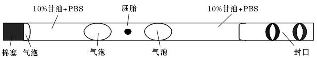
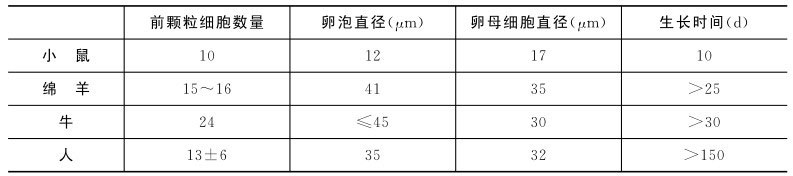
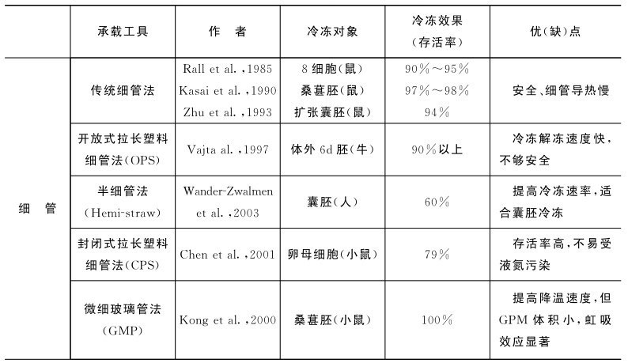
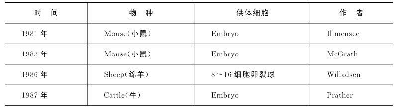
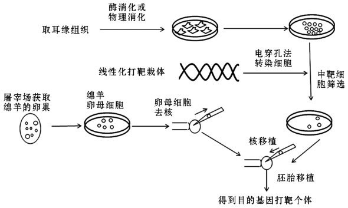
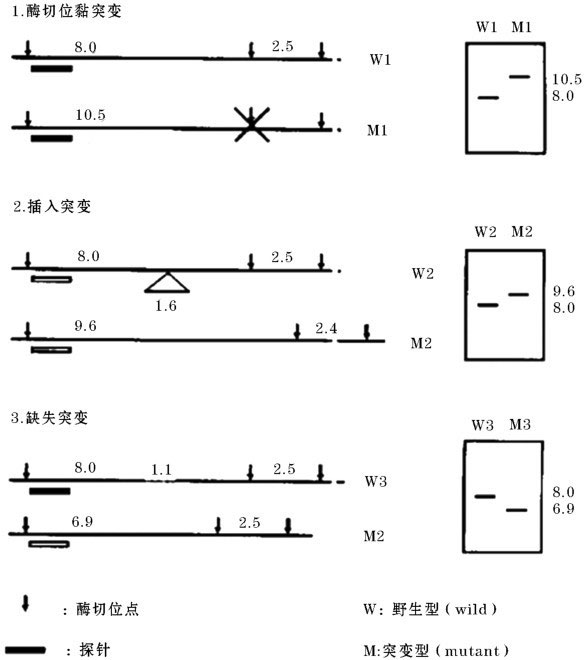

 

# 版权信息

书名：动物胚胎工程与生物技术

作者：石国庆

出版社：金盾出版社

出版时间：2013-12

ISBN：9787508283319

# 编写人员名单

主　　编 石国庆（新疆农垦科学院 研究员）

副 主 编 万鹏程（新疆农垦科学院畜牧兽医研究所 副研究员）

代　蓉（新疆农垦科学院畜牧兽医研究所 副研究员）

编写人员 周　平（新疆农垦科学院畜牧兽医研究所 副研究员）

沈　敏（新疆农垦科学院畜牧兽医研究所 研究员）

甘尚权（新疆农垦科学院畜牧兽医研究所 副研究员）

杨　华（新疆农垦科学院畜牧兽医研究所 副研究员）

王立民（新疆农垦科学院畜牧兽医研究所 副研究员）

沈　涓（新疆农垦科学院院士办 高级畜牧师）

唐　红（新疆农垦科学院畜牧兽医研究所 硕士）

郭延华（新疆农垦科学院畜牧兽医研究所 硕士）

石文艳（石河子大学医学院 博士）

沈思军（石河子大学动物科技学院 博士）

高　蕊（石河子大学医学院 博士）

# 序

动物胚胎工程与生物技术是人们在认识动物生殖生理规律的基础上，以动物生殖细胞和胚胎为主要研究对象，以生物科学的研究方法和技术为基础，探索动物生殖机制和提高动物繁殖力的一门新兴综合学科，是21世纪最具发展前景的生物学科之一。近20年来，动物胚胎工程和生物技术发展迅猛，相关研究已成为国内外研究与开发的热点。

生物科学技术的研究不仅使我们了解到生命的起源和繁衍的奥秘，也对推动动物高效生产与提高家畜良种利用效率发挥了巨大的作用，相关研究成果也在许多方面使人类自身受益，如精子获能现象的发现、试管婴儿技术的产生、口服避孕药的应用等对生殖健康及人类的繁衍都起到了极大地推动和促进作用，进一步实现了科学研究服务于社会实践的目的。

1997年英国罗斯林研究所克隆羊“多莉”的出现，引发了繁殖研究领域巨大的轰动，为动物繁殖尤其是胚胎生物技术的快速发展奠定了良好基础。随着聚合酶链式反应技术、基因敲除、基因芯片、蛋白芯片、基因组学、蛋白质组学、干细胞等技术的飞速发展，为探明许多以前未知的生殖现象、生殖过程及生殖功能提供了更加宽广的思路和空间。

本书从动物精子、卵子、受精和胚胎发育等方面系统阐述了哺乳动物孕育的整个过程，全书分章节介绍了胚胎移植、转基因、核移植、基因敲除、干细胞、嵌合体、分子标记辅助选择和繁殖免疫等现代动物胚胎及生物技术的原理、方法和具体应用，明确了动物细胞工程、胚胎与配子生物工程等系统科学在揭示最基本生命过程中发挥的重要作用，在哺乳动物生殖生理调控的研究中显示出广阔的应用前景。

本书是新疆农垦科学院长期从事胚胎工程和生物技术研究的8位博士综述了当前国内外最新研究进展，结合自己的研究成果编写的一部较全面反映动物胚胎工程和生物技术理论、研究技术、研究成果和发展动态等的综合性教学和科研用书。

21世纪是一个知识经济的时代，生物技术的发展不但关系到我国科学现代化发展的进程，而且对技术进步与革新也起到重要的推动作用。为此，我们只有不断创新、不断发展，提高我国生物技术的整体水平，才能努力跻身于世界科技发展前沿。

《动物胚胎工程与生物技术》的出版，在本研究领域起到抛砖引玉的作用，很有意义。作为同行，倍感欣慰，特书此序，表示祝贺，望再接再厉。

期望这本书的问世将对我国动物胚胎工程和生物技术科学的发展起到积极地推动作用，并为生物生殖学领域的研究、教学和实验等提供参考和借鉴。

中国工程院院士
 

 

# 前言

近年来，世界生物工程技术领域的研究取得了突破性的进展。人类以及重要动物基因组图谱的绘制，基因敲除和干细胞技术的完善，体细胞克隆牛、羊的诞生，牛、羊胚胎克隆和再克隆的成功，试管动物的批量生产，转基因动物种类和数量的增多等研究成果展现出动物胚胎工程和生物技术在推动人类社会进步，提高人类生活和生产水平等方面所发挥的重要作用和应用前景。

动物胚胎工程与生物技术的发展是人们认识动物生殖生理规律的必然，是以动物生殖细胞和胚胎为主要研究对象，借助于生物科学技术的研究方法和手段，研究哺乳动物生殖机制和提高动物繁殖力的一门新兴综合学科。近20年来，随着体细胞克隆动物的出现，生物反应器在生物制药的应用以及试管婴儿等研究领域的突破，使动物胚胎工程和生物技术成为国内外研究的热点。

21世纪是生物技术主宰的时代，生物工程是生命科学的重要组成部分，也是生物技术新科技革命的重要内容之一。《动物胚胎工程与生物技术》是国内长期从事胚胎工程和动物生物技术的8位博士，结合国内外该领域的最新研究进展和自己的研究成果编写的。全书从动物精子、卵子、受精和早期胚胎发育等生命基本过程入手，阐述了胚胎移植、核移植、转基因、基因敲除、干细胞、嵌合体、胚胎与配子生物工程、动物细胞工程、生物反应器、繁殖免疫等技术原理、技术方法和在动物生产中的应用。

《动物胚胎工程与生物技术》是一部较全面反映胚胎工程和动物生物技术的综合性教学和科研用书，可作为大专院校本科教学的参考材料，也可作为生殖生物学、发育生物学、细胞生物学、动物胚胎学、动物遗传育种与繁殖学、临床兽医学和生物技术学等专业研究生、博士生的教学参考用书，同时可为从事动物繁殖和生物技术研究的科学研究与技术推广人员提供参考。

在本书编写出版过程中，得到了新疆农垦科学院畜牧兽医研究所张宾硕士、刘长彬硕士、卢守亮博士以及其他同志们的极大关怀和无私帮助，中国工程院院士刘守仁先生专门为本书作序，在此一并表示衷心的感谢！

由于笔者水平有限，书中难免存在不足之处，恳请读者和同行专家批评指正。

编著者

# 第一章 动物胚胎移植技术

## 第一节 概况

### 一、概念

胚胎移植俗称“借腹怀胎”，是指将体内、外生产的哺乳动物早期胚胎移植到同种的、生理状态相同的雌性动物生殖道内，使之继续发育成正常个体的生物技术，也称为受精卵移植。在胚胎移植过程中，生产胚胎的母畜通常称为供体（donors），而接受体内、外生产的胚胎并代完成妊娠、分娩及哺乳仔畜的母畜则称为受体（recipi-ents）。因此，从严格意义上讲，胚胎移植产出的后代，其遗传物质来自供体母畜和与之交配的公畜。它们是该后代真正的父母，而胚胎完成发育并产仔所需要的营养物质则来自受体。在此过程中，供体母畜和与其交配的公畜负责生产胚胎，当然也可通过体外受精（IVF）、显微受精（ICSI）或体细胞克隆等技术体外生产胚胎，而胚胎后期发育、妊娠、分娩则由代孕母畜，即受体完成。在当前畜牧生产中，常规的胚胎移植技术通常与母畜的超数排卵配合应用，因此习惯上也将这两种技术合称为超数排卵与胚胎移植（multiple ovulation and embryo transfer，MOET）技术，简称MOET技术。

家畜胚胎移植（embryo transfer，ET）技术是20世纪畜牧业生产中继人工授精技术之后又一项重大的技术变革，人工授精技术能够充分发挥优良公畜的繁殖潜力，而胚胎移植则最大限度地挖掘了优良母畜的繁殖潜力。如果说人工授精技术是动物繁殖研究领域的第一次技术革命的话，胚胎移植就是动物繁殖研究领域的第二次技术革命。利用超数排卵与胚胎移植技术，能充分发挥优良母畜的繁殖潜能，迅速增加其后代数量，使母畜繁殖率提高数十倍，可极大加速遗传进展。同时，胚胎移植技术也是品种引进、濒危动物保存的有效技术手段，并可为克隆、转基因及干细胞活体动物获得提供必要的技术支撑，在动物繁殖育种中发挥着越来越重要的作用。

### 二、发展历史简况

胚胎移植技术的最早研究可以追溯到19世纪90年代，其研究发展已经经历了120余年的漫长历史时期。该技术从最初对哺乳动物个体发生、发育规律的研究开始，通过前人大量的实验研究和生产应用，逐渐发展成为今天一项较为成熟的胚胎生物技术。按照其技术发展水平以及在动物生产实践中的应用情况，可以将其发展过程分为实验研究、应用推广和商业应用3个阶段，具体发展概况见表1-1。
 
表1-1 哺乳动物胚胎生物技术发展主要事件简表

 
[引自《动物繁殖学》（第五版）,2009]

（一）实验研究阶段 胚胎移植技术最早是在兔子上试验成功，1890年英国剑桥大学的Walter Heape教授首次通过胚胎移植技术将纯种安哥拉兔的2枚胚胎移植到1只已和同种交配、毛色特征完全不同的比利时兔的输卵管内，结果生出4只比利时仔兔和2只由胚胎发育而成的安哥拉仔兔，首次证实了胚胎移植技术的可行性。尽管如此，在此后的20多年时间里，胚胎移植技术一直停留在小动物的实验研究阶段。直到20世纪30年代前后，哺乳动物胚胎移植技术的研究才普遍展开，并相继在家兔（1929）、大鼠（1933）和小鼠（1936）等动物上验证了胚胎移植技术的可行性，为日后开展家畜等大动物胚胎移植技术的研究奠定了良好的基础。相比较而言，家畜胚胎移植技术的研究较晚，其中胚胎移植的山羊和绵羊最早分别在1932年和1933年才相继出世，而胚胎移植成功的牛和猪则分别由美国和前苏联科学家在1951年报道。由于受当时的设备条件和技术水平所限，采卵和移植过程都通过外科手术完成，成功率较低。直到20世纪60年代，伴随着胚胎的收集、培养、冷冻以及显微外科操作技术的发展和提高，家畜移植技术才取得了重要进展，并进入新的发展阶段。胚胎移植技术在家畜品种改良中的应用潜力引起广泛关注，并迅速扩展到世界各地。由此极大地加速了胚胎移植技术的推广应用，以胚胎移植技术为基础的体外受精、胚胎冷冻、胚胎分割与胚胎体外培养技术等得到迅速发展。与此同时，使用激素人工诱导超数排卵和同期发情、用非手术采卵和移植的技术也获得成功，提高了胚胎生产效率、回收率和着床率，这使胚胎移植技术开始进入应用推广阶段。

（二）应用推广阶段 在家畜上，以牛为主的胚胎移植技术发展最为迅速，从供体母牛的超数排卵、非手术法胚胎采集和移植方法等关键技术环节都取得了突破性的进展，并促进了牛胚胎移植成功率的大幅度增加。伴随着胚胎移植技术的发展，如何打破移植时间和空间的局限一直是各国科学家广泛关注的问题，直到20世纪70年代，家畜胚胎超低温冷冻技术获得成功，为胚胎移植技术进行商业化应用推广提供了广阔的前景。70年代后，西方畜牧业发达国家率先在奶牛业中开展胚胎移植的商业运作，到1985年，美国和加拿大利用胚胎移植繁育的良种奶牛已达10万头左右。1974年，国际胚胎移植协会（international embryo transfer society，IETS）成立，其宗旨是规范全世界动物胚胎移植技术程序与标准，为国际同行创造交流相关研究成果的场合，以促进胚胎生物技术的发展。

（三）商业应用阶段 胚胎移植技术在家畜上的应用主要体现在牛、羊上，并且在牛、羊的品种改良及新品种繁育过程中发挥了重要作用。尤其是近20年来，随着家畜胚胎生物技术的不断发展、新技术的不断应用，促进了胚胎移植技术的逐步成熟，为该技术的商业化应用提供了良好的基础。目前，在牛、羊的胚胎移植技术中所用的仪器设备、药物试剂、溶液及耗材等都已实现专业化生产和商业化销售，并培养和造就了一大批从事该领域的专业操作技术人员。这在畜牧业发达国家尤为突出。在畜牧业发达国家，由于良种化程度较高，因此胚胎移植技术从20世纪80年代开始仅用于奶牛和肉牛核心群的培育。例如，欧美等国家近年来参加后裔测定的青年公牛中就有80%是胚胎移植后代。而近年来，发展中国家普遍利用该技术作为引进国外优良畜种和改良当地品种的一种廉价、快速的技术手段。

与国外相比，我国家畜胚胎移植技术的研究和应用起步较晚，但近年来发展较快，从20世纪70年代开始，通过胚胎移植已先后成功获得家兔（1972）、绵羊（1974）、奶牛（1978）、山羊（1980）和马（1982）的后代。由于初期供体牛、羊的胚胎收集率和受体妊娠率低，胚胎移植成本高，很难在生产上推广应用。直到20世纪90年代，优良种畜的缺乏已成为制约我国畜牧业发展的瓶颈，应用胚胎移植技术引进国外良种，加速品种改良势在必行。因此，各级政府和企业对奶牛胚胎移植技术投资力度加大，移植设备得到根本改善，人员培训和技术研究经费充足，促进了该项技术在我国的迅速发展。超数排卵与胚胎移植技术在20世纪80～90年代也开始应用于超细毛羊、优质肉羊品种的培育与扩群。目前，我国奶牛和绵、山羊的胚胎移植技术水平已接近或达到发达国家的水平，部分地区已进入产业化应用阶段。新疆农垦科学院畜牧兽医研究所石国庆研究团队引入并改进澳大利亚腹腔内窥镜胚胎移植技术，缩短了手术操作时间，减少了对受体母羊的应激和伤害，1994～2002年鲜胚移植绵羊累计15 500只，情期受胎率平均达到56.78%；冷冻胚胎移植受体母羊8 650只，情期受胎率达到46.56%，居全国领先地位。累计获得效益4.5亿元，并将超数排卵与胚胎移植技术推广应用到南北疆的8个市及2个州的72个农牧团场以及甘肃、内蒙古、山东和湖北等省份，受到当地各族农牧民的普遍赞扬。

### 三、在畜牧生产上的意义

（一）充分发挥良种母畜的繁殖潜力，提高繁殖效率 胚胎移植技术可充分发挥优良母畜的繁殖潜力，提高其繁殖效率，迅速增加优良母畜的后代数量，最大限度地延长具有优秀遗传特性母畜生产后代的时限。优良后代的增加，不仅取决于公畜，也有赖于母畜，而母畜在品种改良中的作用总是受产胎数和世代间隔的限制。通常情况下，母畜性成熟后就会处在发情-配种-妊娠-产胎-哺乳-休情-发情的循环之中，妊娠和哺乳占去了母畜一生中的大部分时间。而在实行胚胎移植的情况下，将良种母畜的胚胎移植到受体母畜体内而不需要在供体内完成胚胎后期发育。这样，良种母畜就省去了妊娠和哺乳的过程，使繁殖周期在无形中被大大缩短。更重要的是对供体母畜进行超数排卵等技术处理后，使得母畜在一个发情周期内可获得多个胚胎。因此，无论从一次配种或一生繁殖来看，都能产生比自然状态下超出数倍的后代，使良种母畜的优良性能得到更大的繁衍。

（二）加速品种改良进度，迅速扩大良种畜群 在家畜繁殖育种工作中，一头良种公畜所起的作用远远大于一头良种母畜，其原因在于一头公畜一生中获得的后代数远远多于一头母畜。然而母畜产生后代少的原因一方面是由于其一个发情周期所产生的成熟卵子数有限；另一方面是由于繁殖妊娠占去了母畜一生中很大一部分时间，从而制约了优良母畜的利用效率。如果说人工授精是最大限度地利用了优良公畜的繁殖潜力，胚胎移植则是最大限度地发挥了优良母畜的繁殖效率，因此是目前进行一般品种改良和优良品种选育的有力技术手段。此外，应用胚胎移植技术，还能最大限度地减少公畜后裔测定需要的时间，加快群体的选择强度，加速育种改良进程。

（三）加速新品种培育进程 在家畜上，胚胎移植技术结合母畜超数排卵技术，即MOET技术能够大幅度提高优良母畜的繁殖潜力，扩大优秀母畜在群体中的影响，增加后代选择强度。如在奶牛育种过程中，采用MOET技术能获得更多具有较高生产性能的半同胞和全同胞，在较短的时间内达到后裔测定所要求后代的数量，提早完成后裔测定工作，增加选择强度和准确性，缩短育种进程。同样，在绵羊育种上我国著名绵羊育种专家刘守仁及其研究团队在短期内迅速培育成功中国美利奴（新疆军垦型）细毛羊多胎、肉毛兼用等新品系，就是通过广泛应用MOET技术并结合分子育种与常规育种技术的成功例证。许多实验研究证明，应用MOET核心群育种方案，可使公牛的遗传评定时间缩短40%，生产性状的年遗传进展比常规人工授精技术提高20%左右。如果在青年母牛或母羊中应用活体采卵和胚胎移植技术，年遗传进展可提高30%～70%。

（四）便于优良种质资源的引进和运输 在畜牧生产上，为避免长期近交造成品种性能退化，同时为了进行品种改良和新品种（系）的培育，常常会从异地引进优良种质资源，目前可采取的方法主要为活畜和胚胎引进。与活畜引种价格高、运输不便、检疫和隔离程序复杂以及存在疾病传播和风土驯化等问题相比，采用良种胚胎的引进则完全可以避免上述问题，尤其是将胚胎移植与胚胎冷冻技术相结合，使胚胎的引进和移植可以不受时间和空间的限制，不但便于运输、检疫程序简单、成本低廉，而且所引进的胚胎在当地生长发育，更容易适应本地区的环境条件。目前，牛、羊胚胎移植与胚胎冷冻技术已成为国际、地区间进行良种遗传资源交流最为廉价而简便的方式。

（五）优良及濒危种质资源的长期保存胚胎移植技术和胚胎冷冻技术相结合，可为保存特有优良家畜品种资源和国家地区的特有濒危物种资源，建立种质资源库提供新的技术手段，同时胚胎和精液的保存可构成某些优良性状的基因库。大量研究证实，将胚胎长期冷冻保存在液氮中经解冻复苏仍然可以获得移植成功的后代，是某些优良种质资源或野生稀有品种资源的理想保存方法。而与胚胎冷冻保存相比，活畜保种不但成本很高、规模有限，而且还容易发生基因漂变。胚胎冷冻保种不但成本低廉、方法简单，而且还能避免活畜保种因疾病、自然灾害或基因漂变造成品种灭绝的风险。另外，应用胚胎移植还有利于保存优良家畜品种遗传资源的生物多样性和动物资源。

（六）人工诱产双胎，提高母畜单次受胎的生产效率 在畜牧生产上，与猪等多胎动物不同，牛、羊等家畜普遍为单胎，因此在肉牛及肉羊生产中，可以向已配种的母畜（排卵卵巢的对侧子宫角）移植1枚胚胎，这样配种后未受胎的母畜可能因接受移植的胚胎而妊娠，本来已受胎的那些母畜由于增加了一个外来胚胎而怀双胎。同时，也可在进行胚胎移植的过程中，向发情但未配种的受体母畜同时移植2枚胚胎而诱产双胎。

（七）克服优良母畜不孕症，提高生产效率，减少生产损失 在畜牧生产过程中，优良母畜经常发生繁殖障碍性疾病，因此在优良母畜容易发生习惯性流产或难产以及其他原因不宜担负妊娠过程的情况下，也可以采用胚胎移植，由生产性能一般的受体母畜代之正常繁殖后代。

（八）有利于控制疫病的传播 胚胎移植也是防止疫病传播，建立无菌畜群的必要技术手段。如在养猪业中，为了培育无特异病原体（SPF）猪群，向封闭猪群引进新的个体时，作为控制疾病的一种措施，可采用胚胎移植技术代替剖腹取仔的方法。

（九）促进动物生殖生理学理论与相关胚胎生物技术的发展 胚胎工程包括胚胎移植、胚胎分割、体外受精、嵌合体、转基因动物、克隆及胚胎干细胞研究等，而胚胎移植技术是研究哺乳动物受精和早期胚胎发育机制不可缺少的手段。如受精后胚胎发育潜力的衡量，调控早期胚胎发育关键基因功能的确定，妊娠识别和胚胎附植机制的研究等都需要通过胚胎移植来实现。随着胚胎移植技术的发展，围绕胚胎移植配套的激素、器械、设备等相关产业也会得到迅速成长，产生良好的社会经济效益。

## 第二节 生理学基础与基本原则

### 一、生理学基础

（一）早期胚胎的游离状态 早期胚胎在受精后从输卵管移行到子宫角并与母体建立起实质性的联系之前，胚胎均为游离状态，这是胚胎移植得以成功实施的基础。此时将胚胎从母体内冲出，在短时间内胚胎不至于死亡，而将胚胎置入与母体相类似的环境中时，胚胎可以进一步发育并最终分娩生成新的个体。

（二）母畜发情后生殖器官孕向发育的一致性大多数自发排卵的家畜，发情后不论是否配种或配种后是否受精，生殖器官都会发生一系列的变化，如卵巢上黄体的形成与孕酮的分泌，子宫内膜组织的增生和分泌功能的增强，这些变化都为胚胎的着床、发育创造了条件。因此，发情后母畜生殖器官的孕向变化是进行胚胎移植时受体母畜接受供体母畜胚胎并代之完成妊娠、分娩过程的主要生理学基础。只要移植时受体的生理状态与胚胎的发育阶段相适应，胚胎即可继续发育。

（三）胚胎遗传物质的稳定性在胚胎移植过程中，用于移植胚胎的双亲实际上来源于供体母畜以及与之交配的公畜，因此其遗传信息在受精时就已确定。尽管其后期发育由代孕母畜来完成，但以后的发育环境只会影响其遗传潜力的发挥，而不会改变新生个体的遗传特性。

（四）母体子宫对早期胚胎的免疫耐受性早期胚胎经过胚胎附植过程后与母体子宫建立实质性联系，从而进入妊娠期。在此过程中，母体局部免疫逐渐发生变化，加之胚胎表面特殊免疫保护物质的存在，造成代孕母畜对同种胚胎、胎膜组织一般不发生免疫排斥反应，从而确保胚胎的正常发育和存活。这一生理特性使得在同种动物内，移植到受体母畜子宫内的胚胎不但能存活下来，而且还能与代孕母畜的子宫内膜建立密切的组织联系并建立妊娠关系，从而保证胎儿后期的健康发育和分娩。

### 二、基本原则

（一）胚胎移植前后环境的同一性同一性原则要求胚胎的发育阶段与移植后的生活环境相适应，具体包括以下几个方面内容。

1.胚胎供体与受体母畜应具有种属一致性 胚胎移植的原则之一在于提供胚胎的供体应与受体母畜在种属上保持一致性，即两者属于同一物种，但这并不意味着在生物进化史上血缘关系较近、并且生理和解剖特点相似的不同种属个体之间就有胚胎移植成功的可能性。就一般情况来说，在分类学上亲缘关系较远的物种，由于胚胎的组织结构、胚胎发育所需要的外界物质条件以及不同种属胎儿发育进程差异较大，经移植的胚胎绝大多数情况下不能存活或存活时间很短。

2.供体母畜与受体母畜在生理时间上的一致性 为保证胚胎移植的效率和成功性，通常用于胚胎移植的受体母畜应与供体母畜在发情时间上保持同期性。在胚胎移植实践中，胚胎发育阶段与受体生理上的同步时间差不能超过±24小时，同步时间差越大，受胎率越低。

3.供体胚胎的发育阶段与受体移植部位的一致性 胚胎移植时，应遵循从供体输卵管或子宫内回收的胚胎移植到受体母畜具有黄体一侧的输卵管或子宫内，才能最大限度地保证移植胚胎的发育和附植。这是因为发育中的胚胎对于母体子宫环境的变化十分敏感，母体生殖道内的环境在卵巢类固醇激素的作用下，处于时刻的动态变化之中。母畜生殖道的不同部位（输卵管和子宫）具有不同的生理生化特点，与胚胎的发育需求一致。如果胚胎发育阶段与生殖道的位置发生改变，则容易导致胚胎的死亡或流产。

（二）胚胎的发育期限 母畜排卵后形成的黄体主要分泌孕酮，是胚胎附植、维持妊娠的必要保证。因此，从生理学的角度讲，从供体母畜生殖道回收的胚胎在移植的期限上不应超过周期黄体的寿命，其理想时间应在妊娠识别发生之前，最迟要在黄体退化之前数日进行。因此，胚胎回收多在发情配种后3～8d进行，受体在相同的时间内接受胚胎的移植才能确保胚胎的存活和附植。

（三）胚胎的质量和发育潜力 通常，从供体母畜生殖道回收的胚胎由于各种原因不一定都适合移植，只有受精后形态、色泽正常的胚胎移入受体后才能与受体子宫顺利进行妊娠识别和胚胎附植，最终完成体内发育；而未受精卵和质量低劣的胚胎则无法完成后期发育或在发育中途便退化，导致妊娠识别和胚胎附植失败、早期胚胎丢失或流产。因此，用于移植的胚胎在移植之前需要进行严格的等级评定。

（四）经济效益或科学价值 在从事胚胎移植技术应用时，必须考虑所产生的经济效益和科学应用价值。通常，供体胚胎应具有独特的经济价值或科学研究价值，如生产性能优异或科研价值重大；而受体则要求生产性能一般，但繁殖性能必须良好，且对当地环境的适应能力要强。

## 第三节 技术操作程序

胚胎移植的技术操作程序主要包括供、受体母畜的选择，供、受体同期发情，供体的超数排卵与配种，胚胎的回收、质量鉴定、保存与移植等环节。

### 一、供、受体母畜的选择

（一）供体母畜的选择 通常用作胚胎移植的供体母畜应为良种，且具有较高的育种价值，系谱清楚，遗传性能稳定，而且应该具有良好的繁殖功能和健康状态，处于能量正平衡状态，体况中上等，一般应有2个或2个以上正常的发情周期。经产母畜应在生殖功能恢复正常后方可作为供体。

（二）受体母畜的选择 受体母畜可选用生产性能一般、母性及适应性强的非优良品种的个体，并且也应具有良好的繁殖性能和健康状态，体况中上等，一般应有2个或2个以上正常的发情周期，无繁殖功能疾病和传染病。

### 二、受体同期发情

（一）概念及原理同期发情（synchronization estrus）是指利用某些外源激素，人为控制并调整一群母畜发情周期的过程，使之在预定的时间内集中发情，以便有计划地、合理地组织胚胎移植所进行的同期化处理方法，也称同步发情。同期发情的基本原理是通过调节发情周期，控制群体母畜的发情排卵在同一时期发生，采用黄体期延长或缩短的方法，即通过控制卵泡的发生或黄体的形成，均可达到同期发情并排卵。

（二）同期发情方法为了达到让一群母畜同期发情的目的，通常会采取延长黄体期和缩短黄体期2种方式。其中，延长黄体期是同期发情最常用的方式之一，其基本原理是应用外源孕激素处理母畜，以达到人为干预延长黄体期并抑制卵泡发育，当处理一定时期后同时撤除孕激素释放装置，从而达到整群母畜同期发情的目的。常用的孕激素制剂包括孕酮、甲孕酮、甲地孕酮、炔诺酮、氯地孕酮、18-甲基炔诺酮、16-次甲基甲地孕酮等。而缩短黄体期的方法包括注射外源前列腺素（PG）、孕马血清促性腺激素（PMSG）、促性腺激素释放激素（GRH）等，抑制或溶解卵巢黄体，达到整群母畜同期发情的目的。以下就不同家畜的同期发情处理方法做简要介绍。

1.母牛的同期发情 通常应用孕激素和前列腺素处理，前者通常使用皮下埋植法或阴道栓给药法，后者一般以肌内注射方式给药。

（1）孕激素阴道栓塞法常用阴道海绵栓、阴道硅橡胶环和CIDR孕激素释放装置等，其作用原理基本相同，都是将孕激素制剂溶解后浸入阴道栓中，以达到缓慢释放的目的，在作用一定周期后撤除阴道栓装置，并辅以外源促性腺激素处理后可使一群母牛同时发情，以利于配种和胚胎移植。

其中，使用孕激素海绵栓法的具体步骤为：取18-甲基炔诺酮50～100mg，用色拉油溶解，浸于圆柱形海绵中，并在海绵栓一端系一细绳。在发情周期的任意一天，将海绵栓置于母牛阴道子宫颈口周围，处理9～12d后拉住细绳将海绵栓取出，同时肌内注射一定剂量的PMSG或PG。

除海绵栓外，国外还有阴道硅橡胶环孕激素装置，使用方法同海绵栓。这种装置由硅橡胶环和附在环内用于盛装孕激素的胶囊组成。另一种孕激素装置为CIDR （原产于新西兰），孕酮含量为1.38g，形状呈“Y”形，内有塑料弹性架，外附硅橡胶，两侧有可溶性装药小孔，尾端有尼龙绳。首先将阴道栓收小，装入特制的放置器内，将放置器推入子宫颈口周围，将阴道栓拉出即可。

（2）孕激素埋植法其作用原理同阴道栓法，具体操作是将18-甲基炔诺酮20～40mg及少量消炎粉装入塑料细管中，并在管壁上打一些孔，以便药物释放。利用兽用套管针将细管埋植于耳背皮下，9～12d后将细管挤出，同时肌内注射氯前列烯醇0.2～0.4mg或PMSG 500～800IU。取出后大多数母牛在2～5d发情排卵。该方法由于操作较为繁琐，在生产实践中已经很少使用。

（3）前列腺素法用氯前列烯醇 0.4mg进行肌内注射或子宫颈口周围滴注0.2mg，可诱导 70%以上的牛群在处理后3～5d发情排卵。但由于前列腺素对新生黄体（排卵后5d内）没有作用，因此一次注射前列腺素往往会有部分牛不发情。为了提高同期发情效果，可间隔9～12d再进行1次前列腺素处理。

2.母羊的同期发情 绵羊和山羊的同期发情处理与牛的处理方法基本相同，只是药物使用剂量比牛要少。目前，在羊上进行同期发情处理主要采用孕激素阴道栓法和前列腺素法。

（1）孕激素阴道栓法也包括阴道海绵栓法和CIDR法，其中CIDR的孕酮含量为300mg/支（新西兰产），海绵栓的孕酮含量为500mg/个（澳大利亚产）。使用方法同牛。另外，用CIDR阴道放置和注射Folligon（澳大利亚产孕马血清促性腺激素， 100～200IU/只），同期发情效果可高达95%以上。

（2）前列腺素法应选择在母羊繁殖季节，母羊已开始有发情周期时进行。通常，母羊于发情周期的第4d后肌内注射PGF 2α 4～6mg，一次用药后的发情率约为70%。由于整群母羊可能处于不同的发情周期过程中，因此应用前列腺素处理后母羊第一情期的发情率和受胎率会较低，但到第二情期则相对集中且受胎率正常。

3.猪的同期发情 由于猪属于多胎动物，对外源激素处理的敏感性较强，因此使用孕激素对猪实行同期发情容易引起卵巢囊肿，而且发情率和受胎率均不高。用前列腺素处理的同期发情率也较牛和羊低。因此，孕激素和前列腺素均不适合诱导猪的同期发情。

目前，诱导猪同期发情最常见的方法是同期断奶法。如果在断奶的同时肌内注射PMSG 750～1000IU，则效果更佳。由于猪的集约化饲养水平较牛、羊高，在大的生产场，如无特殊需要通常无须进行同期发情处理。

### 三、供体超数排卵

（一）概念及原理超数排卵（superovulation）简称超排，是指在母畜发情周期的适当时间，注射外源促性腺激素，使卵巢中有较多的卵泡发育并排卵的一项技术。超排对牛、羊等单胎动物效果明显，而对于产多胎的猪意义不大，对马则很难产生反应。

（二）超数排卵的方法

1.牛的超数排卵

（1）FSH+PG法在发情周期9～13d（即黄体期）的任意一天开始肌内注射FSH，以日递减法连续注射4d，每天等量注射2次（间隔12h）。在第5次注射FSH的同时，肌内注射氯前列烯醇0.4～0.6mg，若采用子宫内灌注则剂量减半。

（2）CIDR+FSH+PG法在发情周期的任意一天给供体牛阴道内放入CIDR，计为0d，然后于第9～13d任意一天开始肌内注射FSH，递减法连续注射4d共8次，在第7次肌内注射FSH时取出CIDR，并肌内注射氯前列烯醇，一般在取出CIDR后24～48h发情。

（3）PMSG+PG法在供体发情周期11～13d的任意一天肌内注射PMSG 1次（5IU/kg体重），于注射后48h和60h，分别肌内注射氯前列烯醇 0.4～0.6mg，在母牛发情后第一次输精配种的同时，肌内注射与PMSG等剂量的抗PMSG以消除其半衰期长的副作用。

2.羊的超数排卵

（1）FSH+PG法绵羊在供体发情周期第12d或13d开始肌内注射（或皮下注射）FSH，以日递减剂量连续注射3d，共6次，每次间隔12h，国产FSH注射总剂量为150～300IU，澳大利亚产FSH注射总剂量为13～15ml，在第5次注射FSH的同时肌内注射氯前列烯醇0.2mg。山羊从供体发情周期的第17d开始注射FSH，其他同绵羊。

（2）CIDR+FSH+PG法除CIDR放置方法同牛外，其他与上述方法一致。

（3）PMSG法绵羊在供体发情周期的12～13d，一次性肌内注射或皮下注射PMSG 800～1 500IU。山羊在供体发情周期的16～18d，一次性注射PMSG 800～1 500IU，其他同绵羊。

（三）提高超数排卵效果的措施 在不同种母畜或同种母畜的不同生理状态下，超数排卵效果受动物的遗传特性、体况、年龄、发情周期阶段、产后时间长短、卵巢功能、季节、激素品质和用量等多种因素的影响。根据目前已掌握的材料，结合当前的理论知识和实践经验，应从以下几个方面采取措施，以提高母畜超数排卵的效果。

1.选择合适的畜群和个体 已有的资料表明，家畜品种、个体、年龄和生理状态都会直接影响超排结果。通常，在同一个品种内，不同个体对超排反应的结果是不一致的，并且这种结果还具有重复性和遗传性。在随机挑选的群体中，每次超排有25%～30%的母牛以及20%的母羊对超排几乎没有反应或反应较弱。因此，在经过一次超排后，将那些超排效果较好的个体及其后代挑选出来，用于以后的胚胎生产。

另外，在对不同年龄段母畜的超排实验中发现，经产母畜的超排效果要好于青年母畜，并随着胎次的增加，效果越来越好。母牛进行超排的理想年龄一般为3～8岁，母羊进行超排的理想年龄为3～5岁。

处于泌乳、哺乳、反复超排和产后期的母畜，其生殖功能处于正在恢复或新的动态平衡中，对外源激素处理后的反应较差。因此，连续超排处理4～5次后，要使其妊娠一胎，待其产犊后再使用。

2.规范饲养管理措施 在胚胎移植实践中，一旦供体母畜被确定以后，要根据其自身的品种特性进行规范的饲养管理，具体措施应从畜舍的环境卫生、疾病防疫、日粮营养水平和防止应激等方面入手。

3.采用科学的处理方案和质量优良的药品超排处理的药品直接影响胚胎的产出率，目前国内外的PMSG、前列腺素、雌激素、孕激素等的质量无明显差异，但FSH的纯度和活性变异较大，要注意生产厂商和批次。

### 四、供体母畜的配种及人工授精

大多数供体母畜在超排处理结束后12～48h均表现发情，应根据育种的需要，选择优良公畜或其精液适时进行配种或人工授精。为了保证母畜超排后得到较多的发育正常的胚胎，应使用活力高、密度大的精液，并需加大输精量，且可适当地增加人工授精的次数，2次输精间隔8～10h。供体羊经超排处理发情后，每隔8～12h配种1次，直至发情结束。另外，为提高供体母羊超排后卵子的受精率，也可采用内窥镜子宫角输精技术。由于山羊黄体早期退化现象比较严重，因此在配种后第3d可向其阴道内置入孕酮海绵栓，以维持孕酮水平，有利于提高胚胎的回收率，改善胚胎的质量。

### 五、胚胎的回收

胚胎的回收又称胚胎采集或冲胚，它是利用特定的溶液和装置将早期胚胎从母畜的子宫或输卵管中冲出并回收利用的过程。回收分手术法和非手术法2种，对于羊、猪、兔等中小动物，胚胎的回收采用腹部切开的手术法；对于牛、马等大家畜可采用特殊装置从阴道插入子宫角直接冲洗，称为非手术法，该方法简单易行，操作方便。家畜手术法与非手术法冲胚示意见图1-1。胚胎的回收是胚胎移植的关键环节之一，包括冲胚液的配制与灭菌、冲胚器械的准备、供体牛的检查与麻醉、冲胚操作等步骤。
 

图1-1 家畜手术法冲胚与非手术法冲胚示意
 
（一）冲胚液的配制 冲胚液是从母畜生殖道内冲取胚胎和进行胚胎体外短时间保存，确保胚胎存活并与胚胎细胞等渗的溶液。尽管在胚胎移植技术研究的早期多种溶液均可被用作冲胚液，如TCM199、Menezo、Brinster、Ham's F10等，但目前在生产实际中最常用的是杜氏磷酸缓冲液（PBS）。此溶液的主要成分包括无机盐、缓冲物质、能量物质、抗生素和大分子物质。其中，无机盐的主要作用是保证溶液的离子平衡和维持溶液的渗透压；缓冲物质的作用是维持冲胚、胚胎操作和移植过程中溶液渗透压和溶液pH的稳定性；能量物质为胚胎的体外生存提供必要的能量；抗生素的作用是防止胚胎和冲胚液受到外源或内源病原微生物的污染；大分子物质的主要作用是防止胚胎黏附到冲胚管或保存胚胎的器皿上，造成胚胎丢失，并且有的还具有调节胚胎发育的作用。由于胚胎从母畜的生殖道中冲出以后到移入生殖道之前生活在冲胚液中，冲胚液的质量将直接影响胚胎以后的发育潜力，因此冲胚液的配制、灭菌、保存和质量控制是提高胚胎移植效率的关键环节之一。

（二）冲胚器械和药品的准备 冲胚需要的主要器械有：①牛用或羊用二路式（或三路式）冲胚管，其主要作用是导入和导出冲胚液；②外科手术器械，如手术刀、乳胶手套、手术剪刀、止血钳、肠钳、缝合针、缝合线、剪毛剪、注射器等，用于手术法冲胚；③保定架或手术台；④必备的药品包括消毒药品如70%酒精、碘酊、新洁尔灭、高锰酸钾，麻醉药品如2%盐酸利多卡因、2%盐酸普鲁卡因、2%静松灵或速眠新，生理盐水，抗生素如青霉素、链霉素、土霉素、庆大霉素或卡那霉素等。

所有使用的器械都要进行灭菌处理，在无菌间用冲胚液冲洗消毒后的冲胚管及其连接导管、集卵杯，插入冲胚管钢芯，检查气球是否完好。冲胚液在37℃水浴锅或恒温箱中预热、备用。同时，调试好室温、恒温台和显微镜。

（三）冲胚操作

1.手术法回收胚胎 与牛、马等大家畜的非手术法回收胚胎不同，绵羊、山羊等小家畜一般多用手术冲胚法，将母羊固定于手术床上（仰卧），前低后高约呈45°角。

（1）术前准备 为了减轻手术时腹压的影响，一般要求在手术前一天对供体停食空腹，并限制饮水。最好于手术前一天给供体术部剃毛。

（2）麻醉与保定 在对供体进行手术回收胚胎时，过去多采用2%盐酸普鲁卡因或0.5%利多卡因注射液行腰椎硬膜外麻醉结合术部浸润麻醉，但由于不同个体对麻醉药品的敏感性不同，剂量上较难掌握。近年来，多采用肌内注射速眠新进行快速全麻，待手术结束后再通过颈静脉注射苏醒灵快速解麻，麻醉效果比较好。

（3）手术部位与方法对于母羊而言，一般将麻醉好的供体羊以仰卧姿势固定于手术台或倒置于胚胎移植专用手术车上。手术部位可以选在乳房前腹中线，切口长一般为4～5cm。

根据外科手术的要求，术部先进行常规消毒，然后盖上创布。用手术刀切开皮肤、皮下组织，并用刀柄分离肌肉，最后小心切开腹膜。将中指与食指并拢伸入腹腔，并用两指夹住子宫角牵引至术口之外，再顺着子宫角小心拉出一侧输卵管与卵巢，观察、记录卵巢上的排卵与黄体形成情况。及时向暴露的生殖道喷洒生理盐水，保持术部湿润，以防止粘连。根据所需胚胎的发育阶段，选择不同的冲胚方法。按冲卵部位的不同可分为以下2种方式。

①输卵管采胚法当胚胎还处于输卵管时（排卵后1～3d），可采用此方法采集胚胎。对于羊、兔是用带有磨钝针头的注射器刺入子宫角尖端，注入冲胚液，在输卵管伞部插入胚胎收集管接取冲胚液，每侧输卵管冲胚液的用量为10～15ml。也可反向冲洗。

②子宫角采胚法羊、猪、兔等小动物当确认所有胚胎已进入子宫角内（排卵后5～7d），可采用此法。术前皮下注射静松灵或速眠新进行全身麻醉，手术部位应剪毛、清洗、消毒。过去一般对子宫角进行上行或下行法冲洗，采集胚胎。现在是在子宫角基部穿孔，然后插入冲胚管（二通管带气夹）。根据子宫角的粗细，由充气管注入5～10ml空气，使气囊封阻子宫腔，然后由进液孔注入冲胚液 30～50ml，再由此孔导出。冲胚液用量依子宫角容积大小而异，一般每侧子宫角用量为25～40ml。一侧冲洗完毕后再用同样的方法冲洗另一侧。

在冲胚操作过程中，要求迅速准确和无菌操作，防止对伤口、生殖器官造成损伤。一般来说，术后生殖器官尤其是输卵管和子宫系膜等容易发生不同程度的粘连，严重时会造成不孕，这是手术法回收胚胎最大的缺点，因此在手术后可通过在子宫外面滴注适量液状石蜡或油剂青霉素以防子宫和输卵管粘连。冲洗之后，除去器械，并将子宫角等送回腹腔并复位，先将腱膜、肌肉、腹膜一起连续缝合，然后再用结节法缝合皮肤。

2.非手术法回收胚胎对于牛、马、马鹿等大体型动物，一般采用非手术法收集胚胎，用专用的二通或三通硅胶管，前端有一气囊，充气后能阻止冲胚液流出。通常非手术法回收胚胎都是在配种后的6～8d进行，它比手术法简便易行，而且对生殖道伤害小。冲胚液大多用PBS加5%～10%牛血清白蛋白（BSA），也有加TCM-199的组织培养液，若操作正确、熟练，回收率可达80%以上。

（1）供体牛的检查与处理供体牛在发情的第5～6d，通过直肠检查两侧卵巢上的黄体数。在冲胚前禁水、禁食10～24h，以减轻冲胚操作时腹压和瘤胃压力的影响。

（2）保定、消毒与麻醉 冲胚操作室内的温度一般保持在20℃左右为好。在冲胚前先将供体牛站立保定，剪去尾根部被毛，用酒精消毒后用2%盐酸利多卡因或普鲁卡因进行荐尾椎硬膜外麻醉，使母牛镇静，子宫颈松弛，以利于进行冲胚操作。

（3）回收方法

①准备工作 将超排处理并配种后6～8d的供体母牛固定在保定架内，通过尾根麻醉后先将尾巴向上提起绑在保定架上，清除直肠宿粪，然后用清水冲洗会阴部和外阴部，再用0.1%高锰酸钾溶液冲洗消毒并用灭菌卫生纸擦干，最后用70%酒精棉球消毒母牛外阴部。

②导入冲胚管 操作者根据个人习惯采用左手或右手直肠内把握子宫，另一只手持内管穿插有金属探针的二路式或三路式冲胚管，使其到达子宫角大弯处，由助手逐步抽出内芯，继续把冲胚管向前推，直到冲胚管的前端距宫管结合部的距离为5～10cm为止。对于育成牛以及插管确有困难者，可在插管前先用子宫扩张棒扩张子宫颈，并用黏液去除器去除子宫颈黏液，然后再把冲胚管慢慢插入子宫角。

③固定冲胚管 助手用注射器一次向冲胚管气囊充气约10ml，然后操作者根据气囊所在子宫角的粗细，确定充气量，一般青年母牛为14～16ml，经产母牛为18～25ml，使其头部气囊膨胀以固定在子宫角基部，避免冲胚液流入子宫体并沿子宫颈口流出。冲胚管固定后抽出内芯。

④冲胚 灌流冲胚液的方式包括吊瓶法和注入法。

吊瓶法是将每头供体需要的冲胚液装入1L的吊瓶中，用Y 形硅胶管将吊瓶和冲胚管连接在一起，然后将吊瓶挂在距母牛外阴部垂直上方1m处。操作者用一只手控制液流开关，向子宫角灌注冲胚液20～50ml，另一只手通过直肠按摩子宫角，在灌流的同时，用食指和拇指捏紧宫管结合部，灌流完毕后，关闭进流阀，开启出流阀，用集卵杯或胚胎过滤漏斗收集冲胚液。

注入法是利用50ml注射器将冲胚液通过内管注入子宫角，每次注入40～50ml，然后再抽出。如此反复冲洗和回收 8～10次，每侧子宫角的总用量为300～500ml。冲胚液的导出应顺畅迅速，并尽可能将冲胚液全部收回。因此，冲胚时最好用手在直肠内将子宫角提高并向冲胚管方向略加按压，以利于冲胚液流出。一侧子宫角冲洗结束后，再用相同的方法冲洗另一侧。

⑤冲胚后处理一侧子宫角冲洗完后放出气囊中的气体，退回子宫体，再通过金属内芯将冲卵器送入另一侧子宫角，采用同样的方法进行冲洗。两侧子宫角冲胚完成后，放出气囊中的一部分气体，将冲胚管抽至子宫体，灌注含3g土霉素的生理盐水100ml或添加320万IU青霉素和100万IU链霉素的生理盐水10ml。冲胚后2d肌内注射PG 0.4～0.6mg，以溶解卵巢上的黄体。

### 六、胚胎的检查

胚胎的检查包括2个过程，一是检胚，二是胚胎质量鉴定。检胚时需将回收到的冲卵液静置 10min，待胚胎下沉后移去上层液，直接吸取底部液体，然后置于实体显微镜下镜检。目前在生产中，大多采用胚胎过滤漏斗除去多余液体后再直接检胚。检到的胚胎用冲胚液洗净后及时移入胚胎培养液中保存。通过形态学鉴定，一般可将胚胎分为4级，A级胚胎发育完好，B级胚胎发育尚好，C级胚胎发育一般但可用， D级胚胎发育停止或退化，其分类依据见表1-2。如需进一步鉴定胚胎质量，可采用荧光活体染色法和代谢测定法等。
 
表1-2 胚胎分级标准

 
注：A级和B级胚胎可用于鲜胚移植或冷冻保存；C级胚胎只能用于鲜胚移植,不能进行冷冻保存；D级胚胎为不可用胚胎。

### 七、胚胎的移植

受体母畜应具有明显的发情征候及发育良好的黄体，发情时间应与供体母畜一致。与胚胎回收方法相同，胚胎移植也分为手术法和非手术法2种方式，羊、猪及其他小家畜采用手术法，而牛、马等大家畜一般采用非手术法。

（一）手术法移植对于羊、猪等较小家畜来说，一般采用手术法移植胚胎，受体母畜胚胎移植的手术部位和方法与供体冲胚基本相同。以羊为例，术者轻轻牵引出子宫后，找到排卵一侧的卵巢并观察卵巢黄体数量与发育情况。只有黄体发育良好的受体才能用于胚胎的移植。移植时，卵巢上只有1个黄体的受体子宫角一般只移植1枚胚胎，有2个或2个以上黄体的子宫角可以移植2枚胚胎。根据胚胎的发育阶段以及回收与移植部位一致的原则，通常应用移植管将胚胎注入黄体同侧子宫角前端或通过输卵管伞送至输卵管壶腹部。然后迅速复位子宫，缝合手术部位。

此外，近年来国外畜牧业发达国家如澳大利亚、新西兰等普遍采用腹腔内窥镜法移植。其手术方法是将同期化处理后的受体母羊固定在手术床上（仰卧），鼠蹊部剪毛、消毒后，一侧打入腹腔内窥镜，观察排卵和黄体发育情况。另一侧切开1.5cm小口，将一侧卵巢上有黄体发育的子宫远端拉出，把胚胎输入子宫上1/3处，一般移植1～2枚胚胎，伤口缝合1针，涂消炎药水，并肌内注射抗生素80IU。手术过程中一般是在乳房前方腹中线两侧各切开一个长\1cm的小口，手术口对侧插入打孔器和腹腔镜，通过腹腔镜光导纤维电源观察卵巢排卵情况，以判定受体是否适合移植。移植时，手术一侧插入宫颈钳，通过腹腔镜观察配合子宫颈钳取出黄体发育良好一侧的输卵管或子宫角进行移植。移植后对手术口进行缝合，打孔一侧无须缝合。该方法由新疆农垦科学院石国庆研究团队于20世纪90年代引入，并在生产实践中大规模开展胚胎移植配种应用，取得了良好的试验效果，鲜胚和冻胚移植受胎率与国外基本相同。

（二）非手术法移植在牛、马等大家畜上常用非手术移植法。使用类似于输精枪的专用移植枪，配合直肠把握，使其直接插入有黄体一侧的子宫角内，然后注入胚胎。

1.器械 包括胚胎移植枪、移植枪塑料硬外套、无菌软外套、剪毛剪、碘酊棉球、70%酒精棉球、2%盐酸利多卡因、5ml一次性塑料注射器、灭菌卫生纸等。

2.受体牛的筛选与黄体位置的确定 受体牛应选择与供体同期发情或冻胚胚龄一致的母牛（前后相差不超过1d）作为后备受体。胚胎移植前首先应直肠检查子宫和卵巢，重点检查卵巢上黄体的发育情况，只有黄体发育良好者才能正式列为待移植受体母牛（黄体直径应在11～15mm或以上）。

3.受体牛的保定与消毒 将待移植受体牛站立保定于保定架内，也可以直接拴系在牛舍内进行。尾巴向前拴系或由助手向前拉住，麻醉以及外阴部、阴唇的清洗、消毒同供体处理方法一致。

4.胚胎装管对照受体发情记录，选择合适阶段和级别的胚胎，按图1-2所示方法封装于0.25ml塑料细管内。把装有胚胎的细管从前端装入预温的移植枪管内（棉栓端朝向枪内部），然后套上无菌的移植枪外套，并用塑料环固定住，金属内芯轻轻插入细管的棉栓端内，最后套上灭菌软外套。
 

图1-2 胚胎装管示意
 
（引自《绵羊繁殖与育种新技术》,2010）

5.移植 将移植枪插入阴道，用直肠把握法将移植枪插入黄体侧子宫角大弯处（子宫角的上1/3处），捅破软外套，推出胚胎，缓慢、旋转地抽出移植枪，最后轻轻按摩子宫角3～4次。

### 八、供体和受体的术后护理

（一）供体母畜的术后护理供体回收胚胎以后，要求在发情周期第9d左右肌内注射氯前列烯醇以溶解黄体，促进供体生殖器官的恢复。为了防止手术引起的继发感染，一般对于采用手术法进行胚胎移植的供体母畜要连续肌内注射青霉素和链霉素消炎3d。

（二）受体母畜的术后护理胚胎移植后的受体母畜应加强饲养管理，注意补充足量的维生素和微量元素，适当限制能量饲料的摄入，避免应激反应。同时，要仔细观察它们在预定的时间是否返情。最好是羊在30d后做B超检查、牛在60d后做B超或黄体情况检查，以确定妊娠与否。妊娠母畜与空怀母畜分群饲养和管理。适时注射疫苗，以防止胎儿流产或传染病的发生。

## 第四节 影响胚胎移植效果和妊娠率的因素

### 一、影响胚胎移植效果的因素

胚胎移植的效果主要取决于以下因素。

（一）供体母畜排卵率 即超排处理后，有超排反应的供体占所有超排供体数的百分率。使用外源激素诱发卵泡发育，不同的个体反应差异较大。有的虽然有大量卵泡发育，但无排卵发生。

（二）超排卵子回收率 即收集的卵子和胚胎总数占黄体数的百分率。排出的卵子或发育胚胎不可能完全回收。排卵过多，通常卵巢体积较大，往往会降低回收率，这可能是由于卵子未及时被输卵管伞接纳或冲洗不彻底等原因而丢失。回收率通常在50%～80%，非手术法比手术法低。

（三）可用胚胎率 即发育正常的胚胎数占所收集卵子和胚胎总数的百分率。排出的卵子中有的形态异常或未受精，有的胚胎发育迟缓或退化死亡。供体母畜超排处理后，能否及时配种受精，是影响可移植胚胎数量的重要因素。因此，可采用提高人工授精精液量、增加配种次数、子宫角输精等技术来提高超排卵子的受精率。

（四）胚胎冷冻和胚胎分割的应用胚胎超低温冷冻保存使胚胎移植不受时间和地域以及同期发情的限制，可自由地选择受体；但由于冷冻-解冻损伤，一般情况下会使牛、绵羊冷冻解冻胚胎的移植受胎率下降5%～10%，山羊冷冻解冻胚胎的移植妊娠率下降10%～20%。应用胚胎分割技术可成倍地增加胚胎数量，降低胚胎成本，但经过分割后的胚胎受胎率也会下降。

### 二、影响胚胎移植受胎率的因素

经过移植的胚胎在母畜生殖道内涉及胚胎发育、附植、妊娠的建立以及胚胎、子宫环境和黄体之间的一系列协调关系。影响胚胎移植妊娠率的因素是多方面的，主要因素如下。

（一）胚胎因素移植胚胎质量、胚胎发育阶段、胚胎在体外操作的时间、鲜胚和冻胚等因素都会影响胚胎移植后的妊娠率。

（二）母体因素包括供、受体母畜发情同期化程度、受体的孕酮水平、移植于黄体同侧与对侧、移植部位、受体营养、受体子宫环境和卵巢生理状况、受体黄体个数及受体体况等。

（三）其他因素包括胚胎操作的实验室条件、自然发情与人工诱导发情、移植方法、移植器械污染程度以及操作者的熟练程度、准确的生产记录、溶液配制、设备与耗材等。

## 第五节 存在的主要问题和发展前景

随着胚胎生物技术的不断发展，胚胎移植技术目前已在许多欧美畜牧业发达国家实现了商业化，我国虽然起步晚但发展速度和水平与国外发达国家已不相上下并逐步向产业化方向发展。尽管如此，胚胎移植在实际应用过程中仍然存在一些问题有待解决。

### 一、存在的主要问题

（一）超排效果不够稳定超数排卵并不能每次都得到预期效果，不同批次的超排药品可能在效价上有一定差异，同时不同的家畜个体和年龄对超排处理的反应差异也极大，造成排卵率很不稳定，甚至有的个体在超排处理后，卵巢上虽有大量卵泡发育，但并不排卵。

（二）胚胎回收率低 由于家畜输卵管和子宫内部结构的特殊性，胚胎往往不能全部回收，有研究报道称，母畜排卵数过多往往会降低胚胎的回收率，其原因可能是卵巢在外源激素刺激下体积增大，从而使输卵管伞不能完全包被卵巢，造成排出的卵子丢失。一般情况下，家畜胚胎的回收率在50%～80%。对于通过手术法采集胚胎的家畜如羊，输卵管回收胚胎的数量要较子宫角多。而采用非手术法回收牛胚胎时，回收完全失败的情况也时有发生。

（三）供体的再利用问题对于熟练操作者来说，只要手术操作方法正确、熟练，胚胎移植除了能推迟供体自然繁殖时间2～3个情期以外，对供体自身的繁殖功能不会有太大的影响，但由于供体均为经济价值较高的良种母畜，一旦出现丧失繁殖能力的情况，则造成的经济损失和影响会很大。

（四）技术人员缺乏，推广网络尚属空白人工授精技术之所以能够普遍推广应用，除了操作相对简单以外，主要是由于有大量的基层技术员和比较健全的推广体系。而在国内，胚胎移植技术主要还掌握在一些农业科研院校和少数高科技企业的专家手中，在广大基层农牧区能够熟练操作的技术员非常缺乏，没有建立完善的推广网络体系。同时，由于胚胎移植所需的激素、药品、器械以及相关耗材的国产化程度也较差，大多数依赖进口，在成本较高的情况下难以大范围推广应用。

### 二、发展前景

当前，家畜胚胎移植技术从最初的实验阶段发展到如今的商业化应用，整体技术流程已经比较成熟，近年来我国在畜牧业发达的地区推广速度较快，有潜在的开发前景。牛、羊等家畜由于受潜在经济价值和养殖规模等因素的影响，相对其他家畜来说技术发展水平比较快，相对也比较成熟，并且在生产中显示出越来越大的作用。但对于那些非优势生产畜种的家畜来说，在不同种属、不同品种和不同个体的动物如何提高超排效果，简化技术操作过程，提高移植妊娠率等方面仍有很多工作要做。

胚胎移植技术是获得克隆、转基因及干细胞等活体动物必不可少的技术手段，同时畜牧业的发展和胚胎生物技术研究的深入为胚胎移植技术提供了广阔的市场和应用前景，相信随着牛、羊胚胎移植技术的深入发展，其他经济动物及野生动物的胚胎移植技术在家畜胚胎移植技术的基础上也将不断进步，在引种和保种上也将发挥重要作用。

## 参考文献

[1] 张涌，钱菊汾，王建辰.小鼠胚胎分割方法及同卵双生试验[J].西北农业大学学报，1987，15（2）：10-16.

[2] 窦忠英，樊敬庄，张致民，等.奶牛胚胎切割移植试验报告[J].西北农业大学学报，1987，15（3）：19-24.

[3] 张涌.哺乳动物胚胎分割发展现状及展望[J].西北农业大学学报，1988， 16（3）：80-85.

[4] 张涌，钱菊汾，王建辰，等.山羊胚胎分割及同卵双生试验[J].畜牧兽医学报，1989，20（2）：97-101.

[5] 朱璧科，王光亚，王建辰.家兔胚胎一步冷冻试验[J].西北农业大学学报，1990，18（2）：93-94.

[6] 谭丽玲，吴德国，廖和模，等.奶牛胚胎分割试验研究[J].畜牧兽医学报， 1990，21（3）：193-198.

[7] 张锁链，斯琴，樊秀娥，等.小鼠分离胚的培养和移植[J].细胞生物学杂志，1992，14（1）：41-44.

[8] 张涌，王建辰，徐君，等.山羊半胚冷冻试验[J].中国农业科学，1991，24 （1）：11-15.

[9] 郭志勤，陈静波，丁红，等.影响黑白花母牛超排效果的主要因素分析[J].西北农业学报，1992，1（1）：61-66.

[10] 窦忠英，王新庄，樊敬庄，等.奶牛胚胎一分为四分割移植试验 [J].西北农业大学学报，1992，20（2）：1-4.

[11] 王光亚，马保华，段恩奎，等.奶山羊冻胚长期保存长途运输和移植试验[J].西北农业大学学报，1994，22（3）：108-110.

[12] 张翊华，王强华，窦忠英，等.奶山羊非手术采胚和移胚技术的研究[J].西北农业大学学报，1996，24（1）：5-8.

[13] 马保华，王光亚，赵晓娥，等.安哥拉山羊胚胎徒手分割和移植试验[J].西北农业大学学报，1996，24（2）：40-43.

[14] 王光亚，马保华，赵晓娥，等.安哥拉山羊胚胎的手术回收和移植[J].西北农业大学学报，1996，24（3）：41-46.

[15]余文莉，李树静，乌兰，等.绒山羊超数排卵和胚胎冷冻技术的初步研究[J].中国养羊，1997，4：22-24.

[16] 李裕强，张涌.山羊超数排卵和同期发情研究[J].西北农业大学学报， 1997，25（3）：77-81.

[17] 旭日干，薛晓先，廛洪武.屠宰绵羊卵巢卵母细胞的体外培养[J].畜牧兽医学报，1989，20（1）：13-17.

[18] 旭日干，张锁链，薛晓先，等.屠宰母牛卵巢卵母细胞体外受精与发育的研究[J].畜牧兽医学报，1989，20（3）：193-198.

[19] 孟励，秦鹏春，陈大元，等.猪精子体外获能及异种穿卵的超微结构研究[J].中国农业科学，1991，24（3）：85-89.

[20] 张嘉保.猪体外受精技术的研究进展[J].黑龙江畜牧兽医，1991，10：36-38.

[21] 邓满齐，谢成侠，牛树理.猪卵巢卵母细胞的体外成熟和体外受精[J].畜牧兽医学报，1992，23（1）：1-7.

[22] K，Goto，刘林.卵母细胞成熟和受精研究的最近进展[J].国外畜牧科技，1992，19（6）：20-22.

[23] 石德顺，卢克焕.牛卵泡液对牛卵母细胞体外成熟的影响[J].广西农业大学学报，1994，13（1）：1-5.

[24] 李兵兵，卢克焕.生长因子对卵母细胞体外成熟及早期胚胎体外发育的影响[J].广西农业大学学报，1994，13（1）：11-15.

[25]文国艺，卢克焕.受精液中肝素和咖啡因的组合对牛卵母细胞体外受精的影响[J].广西农业大学学报，1994，13（1）：27-31.

[26] 秦鹏春，谭景和，吴光明，等.猪卵巢卵母细胞体外成熟与体外受精的研究[J].中国农业科学，1995，28（3）：58-66.

[27] 张涌，刘素娟，李勇，等.山羊小腔卵泡卵母细胞的体外成熟和体外受精[J].西北农业大学学报，1996，24（2）：12-17.

[28] 张涌，刘素娟.哺乳动物卵泡卵母细胞的体外受精[J].河北农业大学学报，1996，19（3）：99-106.

[29] 吴光明，廖和模，李雪峰，等.牛胚胎体外生产技术的简化研究[J].畜牧兽医学报，1996，27（1）：1-6.

[30] 张锁链，王建国，何牧仁，等.羔山羊卵巢卵母细胞体外成熟培养条件的研究[J].畜牧兽医学报，1996，27（2）：114-118.

[31] 刘灵，钱菊汾，陈大元.哺乳动物显微受精研究进展[J].西北农业大学学报，1997，25（1）：88-94.

[32] 刘建忠，李宁，丁翔，等.转基因动物研究进展[J].农业生物技术学报， 1998，6（3）：269-276.

[33] 李莲，李跃民.转基因动物研究进展[J].草食家畜，1999，4：1-5.

[34] 石国庆，万鹏程，管峰，等.绵羊繁殖与育种新技术[M].北京：金盾出版社，2010.

[35] 孙春晓，于常海.基因功能研究的技术与方法[J].国外医学分子生物学分册，2000，22（2）：112-115.

[36] 杨凌，杨殿有.转基因动物研究进展[J].畜牧与兽医，1998，30（4）：181-183.

[37] 王彦玲，冯书堂.转基因动物应用研究的现状与进展[J].国外畜牧科技，1999，26（4）：37-40.

[38] 王鲜忠，孙新明.转基因动物研究进展[J].动物医学进展，1999，20（3）：24-26.

[39] 鲁绍雄，连林生.转基因动物技术与动物育种[J].云南畜牧兽医，2002， 3：6-7.

[40] 刘薇，卢光绣.转基因动物技术的研究进展[J].遗传，2001，23（3）：289-291.

[41] 杨章平，常洪.转基因动物的研究进展[J].畜牧与兽医，2001，33（6）：34-37.

[42] Dobrinsky JR，Johnson LA.Cryopreservation of procine embryos by vitrification：a study of in vitro development[J].Theriogenology，1994，42（1）：25-33.

[43] de Paz P，Sanchez AJ，Fernandez JG，et al.Sheep embryo cryopreservation by vitrification and conventional freezing[J]，Theriogenology，1994，42（2）：327-338.

[44] Fukui Y，Glew AM，Gandolfi F，et al.Ram-specific effects on in-vitro fertilization and cleavage of sheep oocytes matured in vitre[J].J Reprod Fertil， 1988，82（1）：337-340.

[45] Schellander K，Fuhrer F，Brackett BG，et al.In vitro Fertilization and cleavage of bovine oocytes matured in medium supplemented with estrus cow serum [J].Theriogenology，1990，33（2）：477-485.

[46] GotoT，Jones GM，Lolatgis N，et al.Identification and characterisation of known and novel transcripts expressed during the final stages of human oocyte maturation[J].Mol Reprod Dev，2002，62（1）：13-28.

[47] Nihon Sanka Fujinka Gakkai Zasshi.Elucidation of the mechanism of fertili zation and clinical application of assisted reproductive technology[J].Institutes of Health， 1996，8：578-580.

[48] Pawshe CH，Palanisamy A，Taneja M，et al.Comparison of various Maturation Treatment on in vitro maturation of Goat oocytes and their early embryonic development and cell numbers[J].Theriogenology，1996，46（6）：971-982.

[49] Stewart C.Nuclear transplantation.An udder way of making lambs[J].Nature，1997 ，85（6619）：769-771.

（石国庆）

# 第二章 动物配子冷冻保存技术

## 第一节 精液冷冻保存技术

### 一、精子的结构和化学组成

（一）精子的结构

1.精子的一般形态结构 哺乳动物精子的形态在不同物种间有差异，但都有共同的结构特征，即主要由头部、颈部和尾部组成。其中尾部由前向后又分为中段、主段和末段。

精子形态的差异主要在头部，牛、绵羊、猪、马、兔、蓝狐、象、貉等的精子头部为扁的卵圆形，人、豚鼠、虎等的精子头部呈犁状，小鼠、大鼠和仓鼠等的为镰刀状，大熊猫的呈豆瓣形。

2.精子各部位的超微结构 见图2-1。
 

图2-1 精子结构示意
 
（1）头部 由细胞核构成，在电镜下观察，细胞质由高度凝集的染色质组成。核的中央常有不规则的孔隙或称核空泡。核膜为2层，核膜孔较稀少。

细胞核前端大约2/3的部分由顶体覆盖。顶体为囊泡状结构，位于质膜与核膜之间，与质膜贴近的一层称为顶体外膜，靠近核膜的一层称为顶体内膜。在细胞核顶端部分的顶体称为顶体帽，顶体的后部较为狭窄，称为赤道段。顶体帽与核之间有一空隙称为顶体下腔。顶体内含有大量酶组成的颗粒。在头部后端未被顶体覆盖的部分称为核后帽。在核后帽与顶体后缘交界处的质膜内，由细胞质浓缩形成薄层环状的致密带，称为顶体后环。在顶体后环的尾缘，质膜与核膜紧密相贴，构成一条环状的黏合线，称为核后环。核后环的尾侧，核膜与质膜分开，质膜向下形成皱褶，延伸入颈段。在核的后端有一浅窝称为植入窝。

（2）颈部 颈部又称连接段，很短。起自近端中心粒，止于远端中心粒。通常呈圆柱状或漏斗状。近端中心粒固着于核后端的浅窝（植入窝）中，为短圆桶状，与精子尾部的长轴垂直或微斜。远端中心粒则变为基粒，由它产生出精子尾部轴丝。颈部的外面由漏斗状结构包围，漏斗状的扩大部分固着于核的尾端，另一端与精子尾部的中段相连。这种漏斗状结构的壁由9条纵行粗纤维组成，它们紧包着中央腔。这9条粗纤维由致密区和浅带区相间组成，称为节柱。

（3）尾部 尾部由中段、主段和末段组成。从基粒到环之间为中段，主要由轴丝及其外围的线粒体鞘组成。轴丝由远端中心粒（基粒）延伸而成，由9+2型纤维构成，即位于中央的2条单纤维和四周的9对成双的纤维组成同心环，纵向排列。在9+2结构的轴丝外围，还有9条粗纤维组成的纤维带包围，其大小和形态在不同动物有差异，但均为前端最粗、向后渐细。纤维带来自颈部的9条节柱。在粗纤维带外面是螺旋形的线粒体鞘。线粒体鞘外围是质膜。线粒体鞘最后一圈质膜内褶形成小的密环，称为终环或称环，这是中段和主段的连接处。

主段是尾部最长的部分，主要结构是轴丝，外面没有线粒体鞘，而被一筒状致密的纤维鞘包围。在纤维鞘的背、腹各有一嵴。纤维鞘内的粗纤维不再是9条而变成7条，另2条被背嵴和腹嵴所取代。随着主段进入末段，7条粗纤维也逐渐消失，因此末段由裸露的轴丝埋于含极少细胞质的基质中，其外仅包有质膜。

（二）精子的化学组成精子的核主要由DNA和核蛋白组成，成熟精子的核蛋白是富含精氨酸和半胱氨酸的鱼精蛋白。

精子质膜主要由脂类和蛋白质组成。其中，脂类成分主要有磷脂酰胆碱、磷脂酰乙醇胺、鞘磷脂、磷脂酰丝氨酸、磷脂酰肌醇、溶血磷脂酰胆碱和胆固醇。尾部脂类成分含量大于头部，且多以脂蛋白、脂糖和磷脂形式存在。膜蛋白成分除脂蛋白外还有糖蛋白。

精子顶体中含有许多水解酶类，如透明质酸酶、唾液酸苷酶、酸性磷酸酶、β-N-乙酰氨基葡萄糖苷酶、芳香硫酸脂酶、放射冠穿透酶、β-葡萄糖醛酸酶、前顶体素等。

精子的颈部和尾部也含有多种酶类，与精子的代谢有关。例如，三磷酸腺苷酶、磷酸葡萄糖异构酶、己糖激酶、乙酰葡萄糖胺酶、Ca 2+ -ATP酶和多种转氨酶等。

精子含有钠、钾、钙、镁、铁、铜、锌、硫、磷、氯等多种无机成分，它们或以磷酸盐、硫酸盐、氯化物的形式存在，或与蛋白质结合。

此外，精子还含有抗原物质，包括精子特异性抗原、精子包被抗原、组织相容性抗原、血型抗原等。

精子包被抗原（spermatozoa-coating antigen，SCA）：精子通过雄性生殖管道时包被在精子表面的胞外分子（如lactoferrin、乳铁蛋白）中，其中有的具重要生理功能，特别是附睾合成的、对精子通过附睾时的成熟有作用，这种抗原即所谓前进运动蛋白（forward motility protein，FMP）。

质膜抗原：有多种质膜抗原，它们可引起精子凝集、精子非活动化和精子毒性。最早描述的豚鼠精子自体抗原T，具有精子毒性和促少精症活性，是一脂蛋白，也有糖成分。抗-T自体抗体，抑制顶体反应及已发生顶体反应的精子结合豚鼠透明带。它们也刺激毛细管试验中精子迁移。

顶体抗原：豚鼠自体抗原S和自体抗原P是最早描述的两个顶体抗原，前者为糖蛋白，后者为蛋白质，都具有高度的可溶性、免疫性和促睾丸炎性（orchitogenic），定位于顶体。另两个精子自身抗原是透明质酸酶和顶体素，两者在受精中均有重要作用。

胞质和线粒体抗原：精子胞质和线粒体中许多酶具有抗原性，如乳酸脱氢酶LD H-X（LD H C 4 ）具有自身抗原性，在一定程度上可引起不育；又如山梨醇脱氢酶和小鼠睾丸特异性细胞色素C（Ct）。

核抗原：动物精子的核抗原主要由2种精子特异性鱼精蛋白和一种精子特异性聚合酶组成。

### 二、精子的发生

（一）精细管上皮的细胞组成精子发生（spermatogenesis）的部位是曲精细管。精细管外层为含有肌样细胞层的固有膜（基膜），内层为精细管上皮。精细管上皮由2种基础细胞组成，即足细胞（Sertoli cells，又称支持细胞）和不同发育阶段的生殖细胞（germ cells）。紧靠精细管基膜的生殖细胞为精原细胞，经多次分裂产生特殊的细胞（初级和次级精母细胞和精细胞），最终成为精子。随着精子发生的进展，更高级别的生殖细胞逐渐移向精细管腔方向。

足细胞是一种外形极不规则的高柱状细胞，其基底面位于曲精细管的基膜上，顶端可达管腔，侧面和管腔面有很多凹窝，凹窝里埋着各级生殖细胞。足细胞的核开始时位于细胞的基底部，随着精子的形成逐渐移向管腔一端，同时变长。细胞质内有丰富的内质网、溶酶体和脂肪滴，有各种形状的致密小体和高尔基体。在顶部细胞质中有纵向排列的微管、微丝和棒状的线粒体。这些细胞器的分布和排列与精子发生过程中更高级别的生殖细胞逐渐移向管腔有密切关系。此外，相邻的足细胞之间形成足细胞-足细胞间隙连接（gap junction），这种紧密的连接将精细管分隔为2个明显的室，即基底室（basal compartment），内含精原细胞和前细线期的初级精母细胞；近腔室（adluminal compartment），内有更高级别的精母细胞和精细胞，可与精细管腔自由相通。

足细胞对精子发生具有重要的生理功能：①对生殖细胞起营养和支持作用。②足细胞分泌雄激素结合蛋白（androgen binding protein，ABP）、生长因子等对精子发生起重要的调节作用。③细胞通讯作用。相邻足细胞之间的间隙连接，允许一些小分子物质如cAMP、离子等通过，使这些细胞的代谢活动趋于一致；足细胞的协调活动，对精子发生的同步化十分重要。④精子释放作用。在精子发生晚期的精细胞向着精细管腔移动及已形成的精子释放到管腔的过程中，足细胞起着重要作用。⑤吞噬作用。在某些情况下，精子发生的某个特定阶段，有些生殖细胞会发生退化；形成的精子释放到管腔后，残余的细胞质仍滞留在足细胞周围。足细胞可通过主动吞噬作用，清除这些退化的生殖细胞和残留的细胞质。⑥构成血-睾屏障（blood-testis barrier）。精细管外周的肌样细胞层，构成不完全的血-睾屏障，而足细胞间的紧密连接构成主要的血-睾屏障。这种屏障可选择性的允许某些物质通透，而拒绝另一些物质渗透，以便保证精子发生所需的最佳微环境。同时，具有免疫隔离作用，防止精细胞所含有的某些特殊抗原进入血液循环，避免机体产生抗精子抗体。

（二）精子发生的过程 在早期胚胎发育过程中，大量来自外胚层的胚胎细胞进入生殖细胞系，成为原始生殖细胞（primordial germ cells，PGCs）即配子发生的干细胞。这些原始生殖细胞的征集需要一种来自胚外外胚层的信号的作用，这种信号可能来源于骨形态发生蛋白-4（bone morphogenetic protein-4）。在胚胎（胎儿）发育的较晚阶段，原始生殖细胞迁移到尚未分化的性腺原基。PGCs 经过几次有丝分裂形成所谓生殖母细胞或称性原细胞（gonocytes）。当胚胎性别分化后，雄性胎儿性原细胞分化为精原细胞，在雄性动物接近初情期时，精原细胞开始增殖和分化，进入精子发生过程。

1.精原干细胞的增殖和分化 在灵长类动物（包括人），精原细胞可分为3种类型，即深色A型（Ad型）、浅色 A型（Ap型）和B型精原细胞。Ad型精原细胞有一圆形或椭圆形的核，核内有许多相当细的染色质颗粒，可被苏木精染成深蓝色。Ap型精原细胞的核呈卵圆形，核内有较粗的染色质颗粒，不易被着色。Ad型精原细胞被认为是“储存的干细胞”，在一般情况下不分裂，或只分裂为相同的Ad型精原细胞。在需要产生精子或其他类型精原细胞被有害因素破坏时，Ad型精原细胞则进行有丝分裂，产生Ad型和Ap型精原细胞。Ad型精原细胞成为储备，Ap型精原细胞则发育为B型精原细胞，所以把Ap型精原细胞称为“更新的干细胞”。

在非灵长类动物，精子发生的干细胞是单个的A型（A-single spermatogonia）精原细胞（As型）。As型精原细胞可自我更新，每个As型精原细胞，通过有丝分裂产生2个干细胞。进入精子发生过程时，一部分As型精原细胞分化为配对的A型（Apaired spermatogonia，Apr型）精原细胞。Apr型分裂产生的子细胞通过细胞间桥（intercellular bridge）保持连接，成对存在。Apr型进一步发育，分裂成链状排列的A型精原细胞（A-aligned spermatogonia，Aal型）。开始是4个细胞的链，然后出现8个、16个，偶尔有32个细胞的链。从 As型精原细胞到Apr型精原细胞是精原细胞发育过程中的第一个分化步骤。第二个分化步骤则是Aal型精原细胞分化成A1型精原细胞，A1型再分裂成A2型，然后再进行5次分裂，分别成为A3型、A4型、中间型和B型精原细胞及初级精母细胞（primary spermatocytes）。从总体上讲，在精原细胞发育期间有9～11次有丝分裂。

2.精母细胞的减数分裂 B型精原细胞的最后一次有丝分裂，形成前细线期的初级精母细胞。这一步通常被认为是进入减数分裂（成熟分裂）的入口。但实际上A1型精原细胞就“已经上了通往减数分裂的单行道”（Grootegoed，2001）。

刚形成的初级精母细胞经过一段休止期，然后进入生长期，直径逐渐增大。初级精母细胞进入第一次减数分裂（减数分裂Ⅰ），减数分裂Ⅰ包括前期（prophase）、中期（metaphase）、后期（anaphase）和末期（telophase）4个时期。其中，前期Ⅰ所需时间很长，变化复杂，要经过细线期（leptotene）、偶线期（zygotene）、粗线期（pachytene）、双线期（diplotene）和终变期（diakinesis）5个时期。经过减数分裂Ⅰ，染色体数减半，每个初级精母细胞分裂成2个单倍体的次级精母细胞（secondary spermatocytes）。

次级精母细胞的间期很短，它们很快进入第二次减数分裂（减数分裂Ⅱ），这是一次染色体数目不减少的均等分裂，结果每个次级精母细胞形成2个精子细胞（spermitids）。

3.精子形成（spermiogenesis） 精子细胞形成后，需经过一系列分化变化才最终成为精子。这种分化包括形态和体积的变化、核的变化、细胞质的变化、顶体的形成、线粒体鞘的形成、中心粒的发育和尾部的形成等。在大鼠，精子细胞的变型被分为19个步骤。

（1）细胞核的变化精子细胞在变形为精子的过程中，其细胞核体积变小，形状由圆形变为流线形，这有利于精子运动，减少运动时的能量损失。同时，核内染色质高度浓缩、致密化，染色质细丝由细变粗，核蛋白的成分也发生显著变化，由碱性蛋白（鱼精蛋白）取代组蛋白与DNA结合。

（2）细胞质和细胞器的变化精子形成过程中，在核发生变化的同时，核前端形成顶体，大部分细胞质变得多余而被抛弃，仅留下一薄层细胞质被质膜覆盖在顶体和核上。

精子顶体是由高尔基复合体形成的。精子细胞的高尔基复合体由一系列的膜组成，以后产生许多小液泡，它们组成一个集合体。在精子形成的开始阶段，一个或几个液泡扩大，其中出现一个小的致密小体，称为前顶体颗粒（proacrosomal granule）。有时也发现数个液泡和数个颗粒，但最终形成一个大的液泡，称为顶体囊（acrosomal vesicle）。许多前顶体颗粒合并形成一个大的颗粒，称为顶体颗粒（acrosomal gran-ule）。这些颗粒富含糖蛋白，细胞化学显示过碘酸雪夫氏反应（PAS）阳性。

随着前顶体颗粒的不断并入，顶体颗粒不断增大。由于液泡失去液体，以致液泡壁扩展于核的前半部，形成一个双层膜结构，称为顶体帽（acrosomal cap），内含1个顶体颗粒。以后顶体颗粒中的物质分散到整个顶体帽中，顶体帽发育成熟，成为顶体（acrosome）。剩余的高尔基体迁移到核后部的细胞质中，并逐渐退化，最终成为高尔基体残留物，在精子形成后与多余的细胞质一起被足细胞清除。

精子细胞的中心体是由2个中心粒组成的。在精子形成的早期，2个中心粒移向核的正后方，与顶体的位置恰好相对，其中一个中心粒位于核后的凹窝中，称为近端中心粒（proximal centriole）。在近端中心粒的后方是远端中心粒（distal centriole），它与精子的主轴平行。远端中心粒形成精子尾部的轴丝。近端中心粒将来参与受精卵内纺锤体的形成，以促使卵裂。

随着顶体囊的形成，精子细胞的线粒体向质膜下的细胞质皮层迁移，此时的细胞质膜变厚且不规则。以后线粒体向尾部的中段集中，并且伸长、体积变小，绕着尾部轴丝形成螺旋状的线粒体鞘。

从尾部中段开始，除了轴丝以外，还形成外周致密纤维和螺旋形的纤维鞘，前者起源于顶体形成期精子细胞的内质网，后者起源于顶体帽后缘的微管束。

4.精子释放（spermiation） 如前所述，精子细胞埋于足细胞表面凹窝及足细胞-足细胞连接所形成的近腔室中，在足细胞微管、微丝的作用下，随着精子发生的进程，更高级别的生精细胞逐渐移向管腔。精子形成后，精子从足细胞之间被释放到管腔中，这个过程叫做精子的释放。

（三）精细管上皮周期和精细管上皮波 在精细管上皮所进行的精子发生序列，即从精原细胞到最后形成精子，是有规律的。由于精原细胞的增殖是从精细管上皮靠近基膜一侧开始的，随着生殖细胞逐渐发育，其位置也逐渐向管腔方向移动。当一群同族细胞发育并向管腔移动时，另一群同族细胞也开始同步发育，其发育阶段晚于上批同族细胞群，如此一批批同族细胞群依次连续，因此在精细管任何一个横断面都可见世代相叠的生殖细胞。某个特定时间有一个特定的细胞组合，而间隔一段时间后，在同一横断面又会出现相同的细胞组合，这一时间间隔就称为一个精细管上皮周期。在一个精细管上皮周期中，会有规律地出现不同的生殖细胞组合图像，据此划分为不同的阶段。例如，小鼠、牛、羊、猪、马等动物一个精细管上皮周期分为12个阶段（分别称为Ⅰ、Ⅱ……Ⅻ），大白鼠分为14个阶段，人分为6个阶段。

在精细管上皮周期中，每个阶段的生殖细胞活动是不一样的。以小鼠的精原细胞增殖和分化为例，在Ⅷ阶段，As型、Apr型和少数Aal型精原细胞存在。Ⅹ阶段以后，这些精原细胞按照这种方式增殖：As型和Apr型精原细胞数量保持相对稳定，Aal型精原细胞越来越多。大约在Ⅱ～Ⅲ阶段（Ⅻ阶段以后是Ⅰ阶段），增殖停止，细胞停留在有丝分裂的G1～G0期。结果，在Ⅶ～Ⅷ阶段没有分裂，几乎所有Aal型精原细胞分化成A1型精原细胞。在Ⅸ阶段，A1型精原细胞分裂成A2型精原细胞。

另外，从精细管纵切面上看，细胞组合也是有规律地出现，即沿着纵切面每间隔一定距离，就会观察到相同的细胞组合，这种现象被称为精细管上皮波。

（四）减数分裂和精子发生中的染色质动态 在精母细胞进行减数分裂过程中，染色质（体）经历十分复杂的变化，其中前期Ⅰ变化最复杂，需时很长（10～12d，种间有差异）。

在细线期，染色质发生凝集，虽然染色体已复制，但仍呈单条细线，看不到成双的结构。进入偶线期，同源染色体通过侧面紧密相结合进行配对，称为联会（synapsis）。联会部位形成一种特殊结构，称为联会复合体（synaptonemal complex）。联会复合体的形成与DNA错配修复蛋白MLH1有关，该蛋白对雌、雄两性的繁殖力是必需的。另外，已经鉴定出了生殖细胞特异性的错配修复基因家族成员，MSH4和MSH5，它们参与减数分裂染色体配对。在小鼠，这些基因失活会导致雌鼠和雄鼠因减数分裂停留在粗线期而不育。减数分裂染色质含有的生殖细胞特异性蛋白也包括形成联会复合体本身的蛋白，例如联会复合体蛋白SCP3，它是联会复合体轴体/侧体元素的结构组成部分。在SCP3敲除的小鼠，雄性无生育力。这说明精母细胞和卵母细胞在减数分裂前期有区别，这可能部分解释为精母细胞减数分裂前期时间很长，而卵母细胞从偶线期相对快速地进展到双线期。

在精母细胞减数分裂前期Ⅰ的粗线期，染色体明显变粗、变短，同源染色体之间发生DNA的片段交换，产生新的等位基因组合，此时期有DNA和蛋白质的合成。

在双线期，完成重组的同源染色体分开，联会复合体消失，但仍有数个点相连，这时第一次观察到四分体。同源染色体之间相连的点称为交叉（chiasmata）。这是粗线期在同源染色体之间发生交换的形态学证据。在这一时期，染色体或多或少地发生去凝集。

在终变期，染色体再凝集，形成紧密凝集的短棒状。四分体较均匀地分布在核中（核仁多已消失），此后交叉逐渐移向染色体臂的端部，称为端化（terminalization），最后四分体只靠端部交叉结合在一起。终变期的完成标志着减数分裂前期Ⅰ的结束，其结果是染色体发生了重组，染色体凝集成棒状。

在中期Ⅰ，染色体的特点是分散于核中的四分体向纺锤体中部移动（与有丝分裂不同的是，四分体上有4个着丝点，每侧的纺锤体只与同侧的2个着丝点相连）。最后，染色体排列在赤道面上。

在后期Ⅰ，同源染色体因纺锤丝拉动而分离，分别移向两极。在大多数种类中，末期Ⅰ和间期是减数分裂Ⅰ和减数分裂Ⅱ之间的短暂停顿。初级精母细胞第一次减数分裂的结果是染色体数目减半，形成2个单倍体的次级精母细胞。

次级精母细胞进行的第二次减数分裂，其过程与有丝分裂基本相同，这里不再详述。

在精子细胞发育（精子形成）期间，核伸长，然后浓缩。充分浓缩的精细胞核含有致密的DNA。核小体中的组蛋白先由过渡性蛋白然后由鱼精蛋白所取代。鱼精蛋白富含精氨酸和半胱氨酸。半胱氨酸的二硫键作用，可使 DNA高度凝集，使 DNA无转录活性。

（五）精子发生的分子机制

1.精子发生中基因表达的转换 在精子发生期间，一方面表现出一些基因的缺失，另一方面有一些生殖细胞特异性基因的表达。

（1）基因表达的丧失和代偿 减数分裂期间，精母细胞X、Y染色体的配对局限于这2条性染色体的短臂假常染区。在减数分裂前期的大部分时间内，X和Y染色体是异质的，形成所谓性小体（sex body），首先见于早期粗线期，无转录活性。性小体中X、Y染色体的转录失活可能是精子发生所必需的，因为X染色体某些基因的表达可能不适于精子发生通过减数分裂前期的进程。在减数分裂完成以后，单倍体的精子细胞发生X或Y染色体基因的转录再活化，其基因产物通过细胞间桥运转，确保了单倍体精子细胞具有二倍体的功能。

在早期初级精母细胞，性小体的形成导致几个主要X染色体基因表达的丧失。例如，在所有进行糖酵解的体细胞，都利用X染色体上pgk1基因编码的磷酸甘油酸盐激酶pgk1同工酶。但在精母细胞性小体形成及X染色体失活后，pgk1基因沉默，取而代之的是常染色体基因pgk2的表达，它编码同工酶pgk2。pgk2基因是一个无内含子的基因，一个功能性的逆转录子。它可能来自pgk1 转录的成熟的mR-NA。可能在进化过程中，通过病毒的干扰，pgk1基因被再插入到另一染色体位置上的DNA中。通常这样的无内含子的逆转录子形成突变而失去功能，但 pgk2基因具有关键功能，为生殖细胞和精子提供能量。

在精母细胞和精子细胞，由一个加工过的常染色体基因pdha2编码丙酮酸盐脱氢酶（PDH）E1α亚单位，而在体细胞是由X染色体编码此酶的同工型亚单位。精母细胞和精细胞缺失这种同工型亚单位，PDHE1α亚单位是对这种缺失的代偿。

（2）生殖细胞特异性基因的表达在精子发生期间，生殖细胞出现特异性基因的表达，以接管精子发生期间沉默的常染色体基因的功能。例如，睾丸特异性甘油醛-3-磷酸脱氢酶（GAPDs）、乳酸脱氢酶亚单位C（LDHC 4 ）和细胞色素C T 。PGK、GAPD、LDH、PDH和细胞色素C这些蛋白酶参与体细胞遍在的产能机器，而精子可能需要这些蛋白酶的同工型以组装特殊性质的产能机器。

哺乳动物基因组还含有许多编码其他一些唯一存在于生精细胞和精子蛋白的基因。许多这些睾丸特异性蛋白是体细胞中功能蛋白的同工型，而在精子发生中具有特殊化的功能。例如，热休克蛋白（heat shock proteins，HSP）在体细胞中参与蛋白-蛋白复合体的折叠、运输、组装和拆卸，在各种细胞过程中起陪伴分子的作用。而生殖细胞特异性的热休克蛋白HSP70-2则与联会复合体有关，在减数分裂前期的末期参与联会复合体的拆卸，该蛋白的重要性已由HSP70-2敲除小鼠的表现证明，这种小鼠表现雄性不育，原因是精子发生中减数分裂前期阻断。

在人及灵长类动物的Y染色体长臂上存在无精症因子（azoospermia factor， AZF）基因，AZF基因的缺失可导致无精子症或严重少精子症，AZF基因至少包括2个基因家族：RNA结合基序（RNA binding motif，RBM）基因和缺失无精症（deleted in azoospermia，DAZ）基因，它们均为睾丸特异性表达。这两个基因均编码 RNA结合蛋白，在精原细胞和精母细胞减数分裂及其以前阶段起作用。小鼠 Y染色体上有DAZ基因的同源基因，称为缺失无精症样（deleted in azoospermia-like，DazL）基因。DazL基因的破坏，造成雌、雄配子发生完全缺乏。另一个如果缺失就造成无精或严重少精症的基因家族是卵巢睾丸转录（ovary testis transcribed，ott）基因，通常称为减数分裂基因，其中包括小鼠减数分裂 DNA搭配-修复基因（Pms2，MiH1）。ott基因特异地在减数分裂中转录，所编码的蛋白对联会复合体的形成至关重要。

在精子发生的不同阶段，还有其他许多生殖细胞特异性基因（如DNA复制相关基因、调节核蛋白转型基因、细胞骨架蛋白基因、细胞周期素基因等）的表达，对精子发生的不同阶段有重要作用。

此外，在精子发生的减数分裂前期、减数分裂期间和减数分裂后期有许多原癌基因（oncogene）表达。在小鼠，包括蛋白激酶家族（c-kit、c-abl、c-raf、c-mos、c-prim-1等）、GTP结合蛋白（如c-ras）、转录因子（如c-foc，c-jun）以及wnt-1 原癌基因参与生殖细胞的增殖和分化。

原癌基因c-kit的表达产物为细胞膜上的酪氨酸蛋白激酶受体。c-kit诱导原始生殖细胞的发育和迁移，精原细胞中仍有c-kit mRNA的表达。有人认为，c-kit是精子发生中由精原干细胞向精原细胞分化的启动子。有报道称，在人早期生殖细胞、间质细胞、精子顶体中均有c-kit受体表达，在足细胞上有c-kit的配体产生。

原癌基因c-mos、c-abl和c-prim-1 在减数分裂后表达；c-raf和c-ras 在有丝分裂活跃的精原细胞和减数分裂前期的初级精细胞中高水平表达，在减数分裂的细胞有不同程度的表达。c-myc、c-fos、c-jun可能是原始生殖细胞分化的重要因子，它们编码转录因子，c-fos表达于B型精原细胞或粗线期初级精母细胞，c-myc和c-jun高水平表达于精母细胞。原癌基因myb 家族编码一组 DNA结合核蛋白，在精子发生特异性阶段表达，控制生殖细胞的生长和分化。

2.精子发生中基因表达的调控

（1）基因转录的调控基因转录是由染色质结构和特异性转录调节蛋白（转录因子）决定的。已经在几种转基因小鼠模型证明，一个较小的启动子区域（约300bp）足以引导报道基因在适当的精子发生阶段表达，与内源性基因表达时间相对应。例如， pgk2启动子序列引导在精母细胞和精原细胞表达，编码顶体蛋白的基因SP10的启动子序列引导刚刚完成减数分裂的圆形精子细胞的表达。

特异性转录因子合成的发育性调节，可能决定生殖细胞许多基因的特异性表达，但需要更为复杂的机制，包括更为伸展的基因增强子/启动子区域，DNA甲基化及染色体结构特异性等方面。许多编码转录因子的基因在精子发生期间呈排他性表达，例如含同源盒的基因Hox-1.4和Esxl。

cAMP反应元件调节蛋白τ（CREMτ），即精子发生转录因子，它是由睾丸特异性的转录物翻译而来，该转录物通过在减数分裂后细胞中CREM基因转录的替换剪切产生。在精子发生的较早步骤中以及在体细胞中，CREM基因转录产生阻抑 CREM蛋白。相反，减数分裂后的CREMτ即活化CREM蛋白，起转录激活蛋白作用。活化CREM参与许多含有cAMP反应元件（CRE）的睾丸特异性基因的启动子调节。CREM失活性突变的纯合子雄性小鼠，因为精子发生不能进展到圆形精子细胞以上的步骤，从而表现不育。

ACT蛋白（睾丸中的CREM的活化蛋白）也在精子中特异性表达，在活化CREM蛋白同工型存在时，通过蛋白-蛋白相互作用及刺激活化CREM的转录活性而起共活化蛋白的作用。

以上结果强调，睾丸特异性转录因子和共活化蛋白，在精子发生的基因表达和细胞分化程序的调控中有重要的开关作用。

（2）前mRNA剪切和mRNA翻译的调控 在精子形成过程中，精子细胞核鱼精蛋白取代组蛋白，染色质致密化，最终使精子基因组完全失活。在染色质致密化开始以后，需要合成几种蛋白质。通过使mRNA稳定的机制，在基因转录沉默后，晚期的精子细胞可以进行几天的蛋白质合成。鱼精蛋白基因的转录应该在导致染色质致密化的mRNA翻译之前发生，特异性的、未翻译的mRNA序列和RNA结合蛋白可以保证mRNA在转录后几天才翻译。通过转基因小鼠证实，转基因修饰过的鱼精蛋白mRNA缺乏翻译调控机制，导致成熟前鱼精蛋白合成和核凝集，因而精子细胞发育停止。这就证明mRNA的翻译调控对精子发生很重要。

特异性RNA结合蛋白对翻译活化的启动，也是翻译调控机制不可缺少的部分。Prbp蛋白（Tarbp2基因编码）参与翻译活化。破坏Tarbp2基因的小鼠，导致在需要鱼精蛋白时鱼精蛋白mRNA不能翻译，结果鱼精蛋白取代组蛋白延迟，晚期精细胞发育失败。

RNA结合蛋白在精子发生的早期阶段即精原细胞和精母细胞也有重要作用。人Y染色体RBM基因编码 RNA结合蛋白，在精母细胞，RBM蛋白可能参与睾丸特异性的前mRNA剪切调控，RBM基因丢失导致男性不育。人类 Y染色体DAZ基因及小鼠的同源基因Dazl也编码RNA结合蛋白，这些基因的破坏，也造成配子发生失败。这强调了RNA结合蛋白具有多功能性，不但控制前mRNA 剪切、mRNA运转、稳定性和翻译，而且在减数分裂前阶段也起关键作用。

（3）蛋白质活性和稳定性的调控 除了转录和翻译的调控以外，翻译后蛋白质的活性和稳定性的调控还决定精子发生中基因表达的最后结果。遍在蛋白化作用（ubiquitination）是控制蛋白质修饰和降解的重要机制。遍在蛋白（ubiquitin）是含76个氨基酸的小蛋白质，分子量小但作用巨大，存在于所有细胞，在各种基本的细胞过程中有必需的作用。遍在蛋白与细胞底物共价配对，通过复合酶途径产生单的或聚合遍在蛋白化作用。聚合遍在蛋白化作用为蛋白酶降解底物蛋白传导信息，而单遍在蛋白化作用起其他作用。

usp9y基因（也称DFFRY）是一个Y染色体基因，它编码一个催化去遍在蛋白化作用（使遍在蛋白化作用逆转）反应的酶。人类usp9y基因突变与精子发生部分停止在精母细胞阶段（仍有少数后减数分裂生殖细胞存在）有关。

在酿酒酵母中，RAD6基因编码遍在蛋白偶联酶（E2酶）。RAD6裸突变显示多效表型，包括基因沉默缺陷和孢子形成减弱。在哺乳动物，鉴定出了高度保守的、与RAD6同源的2个基因，即X染色体HR6A和HR6B基因。HR6B基因敲除小鼠精子发生减弱和雄性不育。HR6B的遍在蛋白偶联活性可能对凝集中的精子细胞所发生的组蛋白-鱼精蛋白过渡有作用。在减数分裂前期，控制基因表达和染色体动态的蛋白质也可能是HR6B依赖性遍在蛋白化作用的靶蛋白。

以上研究证明，遍在蛋白化作用对精子发生有作用。

（六）精子发生的调节 正常的精子发生过程有赖于下丘脑-垂体-睾丸轴系所分泌的各种激素的内分泌调控以及睾丸内生殖细胞-体细胞（足细胞、间质细胞、管周肌细胞）之间的相互作用，即旁分泌和自分泌调节。

1.精子发生的内分泌调节

（1）GnRH和促性腺激素的作用对雄性大鼠进行促性腺激素释放激素（GnRH）的主动免疫，结果其睾丸重量下降，精细管直径减小，伸长的精细胞明显缺乏。用GnRH 拮抗剂处理的雄性动物，其睾丸精细管中几乎见不到粗线期精母细胞和精细胞，只有精原细胞。GnRH 拮抗剂抑制精子发生的机制可能是阻断垂体GnRH 受体，抑制促性腺激素的分泌。下丘脑分泌的GnRH 通过刺激垂体前叶合成并释放两种促性腺激素——促黄体素（LH）和促卵泡素（FSH），以间接调节精子发生。

LH主要刺激睾丸间质细胞分泌睾酮，而睾酮是维持精子发生的主要激素之一。LH刺激的睾丸间质细胞还分泌一些生长因子，对精子发生发挥旁分泌调节作用。

同位素辐射可使灵长类动物精细管中Ad型精原细胞向Ap型转化，Ap型精原细胞数量增加，精子发生能力增强。此时血浆中FSH浓度上升，而 LH和睾酮浓度不变。由此推断，FSH浓度上升可促使 Ad型精原细胞向Ap型转化。另外，用人FSH处理猴，结果促进精子发生。给去垂体或雌二醇处理的成年动物注射FSH，或用LH与FSH联合处理，都能使精子发生定性恢复（即恢复精子发生过程，但精子数量少于正常）。关于精子的定量恢复（即精子产量恢复正常）是否需要FSH，有不同的报道。

FSH对精子发生的调节有直接和间接2种可能途径。在大鼠精原细胞上已发现了FSH受体，说明FSH可能对生殖细胞有直接作用，但尚需进一步研究。更可能的途径是FSH调节足细胞功能，间接刺激精子发生。足细胞上有FSH受体。FSH通过增加腺苷酸环化酶活性和cAMP 浓度，也可能影响钙平衡，刺激足细胞特殊基因的表达，产生许多调节生殖细胞的活性物质。例如，雄激素结合蛋白ABP是足细胞在FSH作用下分泌的蛋白，它可以作为载体与雄激素结合进入血液循环，也可保持睾丸内有高浓度的雄激素。近年发现，生殖细胞具有结合ABP并将其转移到细胞内部的能力，ABP在生殖细胞内的积蓄部位在精子发生过程中有变化，说明在精子发生中的某些步骤可能需要ABP。FSH还能调控足细胞的糖代谢、脂肪代谢和有丝分裂等其他细胞过程。

近年来的研究表明，FSH对间质细胞也有作用。FSH可增加间质细胞的体积和数量，似乎还能诱导间质细胞的形态和功能分化。

（2）睾酮的作用睾酮是维持精子发生的主要激素之一，其内分泌作用主要是反馈调节下丘脑GnRH和垂体LH、FSH的分泌。此外，睾酮还可以调节足细胞、管周肌细胞的功能而影响精子发生。

（3）抑制素足细胞分泌的抑制素选择性地抑制垂体前叶FSH的分泌，参与精子发生的内分泌调节。

（4）促乳素促乳素通过改变促性腺激素的分泌来刺激精子发生。此外，促乳素作用于间质细胞，增加其LH受体数量，加强间质细胞对LH的敏感性。促乳素过高症患者表现精子发生异常，LH分泌减少，睾酮水平降低。

2.精子发生的旁分泌和自分泌调节所谓旁分泌，是指某种组织内一种类型的细胞分泌的活性物质作用于同一组织中另一类型细胞，调节其功能、生长和分化。自分泌则是某种细胞产生的因子作用于同一类型的细胞或其自身细胞的现象。在睾丸内，间质细胞、精细管周肌细胞、足细胞与生殖细胞之间存在着复杂的相互作用，旁分泌和自分泌因子对精子发生起着精细的调节作用。

（1）睾酮虽然睾酮是维持精子发生的主要激素之一，但睾酮对精子发生的作用是间接的，除内分泌作用外，它还起旁分泌作用。在间质细胞、足细胞、管周肌细胞上均发现有睾酮受体，而生殖细胞上没有睾酮受体。迄今研究表明，睾酮通过刺激管周肌细胞和足细胞分泌旁分泌因子而间接维持精子发生。睾酮与FSH对足细胞有协同作用。

睾酮对精子发生有阶段特异性。例如，在大鼠精子发生的第Ⅶ阶段（细胞组合为A1型精原细胞、前细线期、粗线期精母细胞、第7和第19阶段的精子细胞）对睾酮浓度的降低最敏感。对精细管上皮周期不同阶段的分泌蛋白进行分析，鉴定出了7种阶段依赖性的雄激素调节的蛋白（androgen-regulated protein，ARP），它们是足细胞分泌的ARP-3、ARP-4和ARP-5，管周肌细胞分泌的ARP-6和ARP-7以及圆形精细胞产生的ARP-1、ARP-2。

（2）阿黑皮素原（pro-opiomelanocortin，POMC）和POMC来源的肽 用原位杂交法在精原细胞、精母细胞及间质细胞上定位了POMC mRNA，在睾丸液中检测到POMC来源的肽，如β-内啡肽、促肾上腺皮质素（ACTH）和黑素细胞刺激素（MSH）。足细胞上有阿片类受体。这些证据说明，这些肽在生殖细胞、间质细胞和足细胞的相互作用中有潜在的功能。

（3）前脑啡肽和脑啡肽 睾丸组织中前脑啡肽 mRNA的含量大大超过POMC mRNA的含量。精原细胞、初级精母细胞和足细胞上都检测到了脑啡肽免疫活性。这暗示此类物质至少在初级精母细胞以前有主动作用。脑啡肽还能增加足细胞上LH样肽的分泌，后者与间质细胞上的特异性受体结合，能调节雄激素产量，抑制β-内啡肽产生。

（4）催产素和精氨酸加压素（AVP）在睾丸中检测到了与下丘脑中催产素相似的RNA翻译产物，也发现了AVP mRNA。催产素作用于精细管周肌细胞，对精细管的收缩有作用。AVP调节睾丸LH受体，AVP与催产素都能调节类固醇合成。

（5）抑制素（inhibin）和激活素（activin）这两种激素主要由足细胞产生，除内分泌作用外，还有旁分泌调节作用。足细胞和生殖细胞上发现了抑制素和激活素mR-NA的表达，生殖细胞上也克隆出了激活素受体mRNA。抑制素能抑制培养的睾丸细胞摄取 3 H-胸腺嘧啶（DNA合成）；激活素却能刺激培养的足细胞和生殖细胞摄取 3 H-胸腺嘧啶。

（6）生长因子在FSH、睾酮等激素的作用下，足细胞、精细管周肌细胞和间质细胞合成并分泌大量特异性或非特异性蛋白或生长因子，对精子发生起旁分泌调节作用。例如，在睾酮刺激下，足细胞分泌转铁蛋白，将铁从足细胞通过受体介导过程传递到生殖细胞；足细胞表面表达的黏附蛋白可能控制在特异性阶段生殖细胞与其营养细胞的黏附。足细胞产物还能刺激生殖细胞表面抗原的出现。

①干细胞因子（stem cell factor，SCF）原始生殖细胞迁移到原始性腺的过程中，足细胞前体细胞分泌的SCF刺激原始生殖细胞的增殖和存活。c-kit是生殖细胞上的细胞表面受体，具有先天性的酪氨酸蛋白激酶活性。SCF通过与c-kit受体结合刺激迁移途中的原始生殖细胞增殖。SCF-c-kit 系统也参与精原干细胞的增殖和Aal型精原细胞的分化。

②胶质细胞系来源的神经营养因子（glial cell line-derived neurotrphic factors， GDNF）GDNF由足细胞分泌，精原干细胞上有其受体（RET和GFR al ）。研究表明，GDNF可促进精原干细胞的自我更新。

③转化生长因子α（TGF-α）管周肌细胞和足细胞分泌TGF-α。在小鼠证实，管周肌细胞分泌的TGF-α以自分泌方式诱导自身细胞的增殖和功能。但也有旁分泌作用。管周肌细胞与足细胞共培养，TGF-α可促进足细胞转铁蛋白的分泌，提示TGF-α可诱导管周肌细胞产生旁分泌因子，如管周修饰物质（peritubular modifying substance，Pmods），后者刺激足细胞产生转铁蛋白。但TGF-α对足细胞产生直接作用也是有可能的，因为在大鼠足细胞上检测到TGF-α及其受体的表达。

④转化生长因子β（TGF-β）TGF-β共有5种同工型，其结构与抑制素和激活素相似，属同一家族。在睾丸内，管周肌细胞、足细胞检测到TGF-β 1 mRNA，未成年大鼠睾丸的管周肌细胞也有TGF-β 2 mRNA。但体外培养的管周肌细胞没有产生TGF-β，在睾丸内也没有检测到TGF-β的受体。然而，有证据表明，TGF-β刺激管周肌细胞的迁移和培养时集落的形成。在生殖细胞上也有TGF-β的表达，大鼠精母细胞和早期圆形精子细胞表达TGF-β 1 ，但之后表达水平明显降低。

⑤表皮生长因子（EGF）在间质细胞、足细胞、肌样细胞、内皮细胞和各种生殖细胞群中存在EGF/TGF-α结合位点（EGF 与TGF-α分子高度同源，且具有相同的受体）。许多证据表明，EGF可刺激足细胞的生化反应。小鼠摘除颌下腺导致血液中EGF浓度降至极低，精子发生减弱，但提高EGF浓度时这种减弱可以被逆转。

⑥胰岛素样生长因子（IGF）有证据表明，睾丸中存在IGF-Ⅰ。在成年人和未成熟大鼠证实了足细胞和间质细胞分泌IGF-Ⅰ，成熟大鼠和人的初级精母细胞中也存在IGF-Ⅰ。在足细胞、间质细胞、次级精母细胞和早期精子细胞上有IGF-Ⅰ膜受体。因此可以推断，IGF-Ⅰ在调节足细胞和间质细胞功能中有自分泌作用，在精细管上皮及EGF、FGF（成纤维生长因子）可以调节睾丸中IGF-Ⅰ mRNA的表达和IGF-Ⅰ的含量。IGF-Ⅰ对间质细胞的作用是使之对LH的结合能力增强，因而睾酮产量增加。IGF-Ⅰ增加足细胞对FSH反应的能力，IGF-Ⅰ和胰岛素还能刺激减数分裂前期精母细胞的DNA合成。

睾丸中是否产生IGF-Ⅱ还不清楚，但在睾丸尤其是足细胞上存在一种类似于不依赖阳离子的甘露糖-6-磷酸盐受体的Ⅱ类 IGF 膜受体。但这种受体是否可以让血液中IGF-Ⅱ结合还不知道。然而，也报道了一些 IGF-Ⅱ对睾丸的作用，可诱导足细胞转铁蛋白合成增加，乳酸盐和蛋白质产量增加。

此外，在睾丸中还鉴定出了IGF结合蛋白（IGFBP-2、IGFBP-3、IGFBP-4、IGFBP-5）。

除以上生长因子外，还报道了其他一些生长因子对精子发生的旁分泌调节作用，它们是足细胞分泌的生长因子（SCSGF）、精细管生长因子（SGF）、酸性和碱性成纤维生长因子（aFGF，bFGF）、β-神经生长因子（β-NGF）、血小板来源生长因子（PDGF）以及白介素1（I L-1）、苗勒氏抑制物（MI S）等。此外，足细胞内能够聚集维生素A（通过维生素A结合蛋白），而维生素A是A1型精原细胞分裂成A2型精原细胞的必要因子。维生素A缺乏的大鼠，精子发生停止。

### 三、精子的代谢和运动

（一）精子的代谢 精子为维持其生命和运动，必须利用其自身及精清中的营养物质进行复杂的代谢过程。这种新陈代谢主要表现在糖酵解、呼吸以及脂类和蛋白化合物的合成和分解。

1.糖酵解 精清所含有的糖类是维持精子存活的主要能量来源。果糖酵解是无氧时精子获得能量的主要途径。果糖经过酵解变成丙酮酸或乳酸，并释放出能量。精子糖酵解的能力在不同动物有很大差异，如牛的精子可分解果糖、葡萄糖和甘露糖，但几乎不能利用半乳糖和蔗糖。猪精液中果糖含量很少，猪精子无氧时利用果糖酵解产生乳酸的能力很低。

2.精子的呼吸 在有氧条件下，精子消耗氧进行呼吸。精子呼吸产生的能量比糖酵解所产生的能量高4～10倍。山梨醇、甘油磷酰胆碱、缩醛磷脂、果糖、葡萄糖以及糖酵解的产物丙酮酸和乳酸等均可作为精子呼吸的代谢底物。精子呼吸的过程是按照一般组织的代谢过程即三羧酸循环来进行的。分解的最终产物是二氧化碳和水，并释放出大量能量，这些能量大多以三磷酸腺苷（ATP）形式存在，主要储存于线粒体鞘。

3.脂类代谢 在有氧条件下，精子内源性的磷脂可以被氧化，以支持精子的呼吸和生活力。精子也可利用精清中的磷脂，磷脂氧化分解为脂肪酸，脂肪酸进一步氧化，释放出能量。但是，精子的代谢以糖类代谢为主，当糖类代谢基质耗竭时，脂类的代谢就显得非常重要。脂类代谢产物甘油具有促进精子耗氧和产生乳酸的作用。甘油本身也可被精子氧化代谢。精子也能利用一些低级的脂肪酸，如醋酸。

4.蛋白质代谢 由于氨基酸氧化酶的脱氨作用，精子能使一部分氨基和氨基酸氧化。但是，精子中蛋白质的分解意味着精子品质已变性。在有氧时，牛的精子能使某些氨基酸氧化成氨和过氧化氢，这对精子有毒性作用。精液腐败时，就出现这种变化。所以，正常的精子生活力的维持和运动是不需要从蛋白质成分中获取能量的。

（二）精子的运动 评价精子运动能力的重要指标是精子活动力（motility），活动力是精子最显著的特征，精子的活动力表现为不同的运动形式，与精子的代谢密切相关。精子代谢产生的能量，大部分用于其活动力，小部分用于维持膜的完整性。

精子运动主要靠其尾部的摆动。尾部轴丝外围的9条粗纤维的收缩是摆动的主要原动力，内侧较细的纤维配合外侧粗纤维将这种收缩有节律地从颈部开始，沿着尾部的纵长传开。由于尾部的摆动，使精子向前泳动。泳动的速度随精液性质和温度而异，在37℃时每秒前进 100μm。

精子尾部纤丝收缩的能量主要来自精子代谢所产生的ATP。组织化学证明，在尾部轴丝中有一种能使ATP去磷的酶即三磷酸腺苷酶。由于酶的作用，使 ATP 水解释放出大量的能量，使得尾部轴丝中类似肌动球蛋白（actomyosin）物质的分子排列发生改变，从而引起轴丝收缩。ATP的分解受内源性cAMP水平调节。

精子的活动力与精子的受精力密切相关。

### 四、精子在附睾中的成熟与储存

附睾由附睾头、附睾体和附睾尾3 部分组成。睾丸内生成的精子，还不具有活动力和受精能力，它们随睾丸网液进入附睾，在附睾内的运行过程中逐渐获得运动和受精的能力。

（一）精子在附睾内的成熟 精子在附睾内的成熟过程包括获得前进运动的能力、获得附着于透明带的能力以及获得受精的潜能。

在附睾内由于肉毒碱等因素的诱导，精子前进运动蛋白被活化，获得前进运动的能力。但附睾中尤其在附睾尾的环境中，酸度高，加上一些运动抑制蛋白的作用，精子在附睾内并不运动，只有在适当的介质中稀释后才表现前进运动的能力。另外，在附睾内，精子膜上具有了黏附性，可能与精子黏附素（spermadhesin）有关，从而有了与透明带糖蛋白结合的能力。精子在附睾中获得受精的潜能涉及一系列的形态学和生物物理、生物化学变化。

精子在成熟过程中，颈部的细胞质小滴向尾部移动最终消失。顶体面积减小，并出现与核长轴呈4 0°角的锥形尖质。核质高度浓缩，精子内二硫键形成，使精子核和尾部结构更加稳定。精子质膜也发生改变，膜上多种成分发生组分和结构上的变化，使膜的通透性发生改变，Na + 外排、K + 内渗，使精子内出现高K + 、低 Na + ；膜电荷改变，使精子不发生凝集；膜蛋白改变，多种糖蛋白如黏附素、唾液酸被覆盖到精子表面。

在成熟过程中，精子的代谢也发生改变，糖酵解增强，对磷脂利用增多，蛋白质合成下降。

（二）精子在附睾内的储存精子在附睾尾的储存时间可达30～60d。在附睾中储存的精子，代谢处于相对静止状态，但仍有一些基本的代谢维持其生存和细胞结构的完整性。附睾中的环境很可能是需氧的，其代谢的基质主要是附睾液中高浓度的乳酸。虽然附睾腔中大量存在甘油磷酰胆碱（GPC），但精子并不直接利用它。氨基酸也可非常缓慢地被氧化。

附睾中储存的精子，若不排精，则发生变性而被附睾上皮或输精管上皮再吸收，也有一部分精子随尿液排出。

### 五、精液的组成、来源、化学成分与理化特性

（一）精液的组成和来源正常的精液由精子和精清组成。如前所述，精子在睾丸曲精细管中产生，经由曲精细管、睾丸网、睾丸输出管到达附睾，在附睾中储存并成熟。射精时，精子经输精管、尿生殖道排出体外，在射精过程中混入副性腺分泌物。因此，精清由睾丸液、附睾液、副性腺分泌物以及输精管分泌物组成。

1.睾丸液 睾丸液主要由足细胞分泌物构成，精子可能被这种液体冲出精细管，并经睾丸网进入附睾。睾丸液只占射出精液中极少的一部分。由于血-睾屏障的作用，睾丸液的成分与流向睾丸的血液和淋巴液有很大区别。只有某些物质能通过血-睾屏障，进入睾丸液。

睾丸液内含有高浓度的肌醇、大量不同类型的蛋白质和多肽、多种氨基酸、无机盐、乳酸、尿素、抑制素、激活素及少量葡萄糖。

2.附睾液 精子在附睾中储存和成熟，附睾液为精子提供了这一特殊的环境。睾丸液在附睾内大部分被再吸收，因而附睾内尤其是附睾尾中精子浓度非常大。附睾液由附睾上皮细胞分泌。附睾液中除含有蛋白质、糖、氨基酸、无机盐、尿素、乳酸等成分外，其最大的特点是还含有甘油磷酰胆碱、肉毒碱、唾液酸。

3.前列腺分泌物 前列腺具有丰富的分泌细胞，通过局部和顶浆分泌2种形式产生大量分泌物，构成精液的重要部分。所谓局部分泌是指腺体细胞在分泌物形成和分泌期间保持细胞的完整性，而顶浆分泌是部分腺体细胞质随分泌物被排出。后一种方式是形成前列腺液的主要分泌方式。前列腺分泌物中常含有许多微细颗粒，这是脂质体和脂肪颗粒，它们是顶浆分泌期间随分泌物一起排出的细胞质内容物。前列腺液含有丰富的、种类繁多的蛋白酶。

4.精囊腺分泌物 许多动物有成对的精囊腺。精囊腺细胞分泌的主要方式也是顶浆分泌。牛、马精囊腺分泌胶状物进入精液，猪精囊腺分泌高黏性液体。精囊腺分泌物含有大量的还原物质，如糖和抗坏血酸。精囊腺分泌大量的果糖、较多的钾和碳酸氢盐。精囊腺分泌物也含有丰富的蛋白质和酶。精液中的前列腺素主要来自精囊腺。不同动物副性腺分泌成分有很大差异，如猪精囊腺分泌物以山梨醇（合成果糖的中间体）含量高为特征。

5.尿道球腺和输精管壶腹分泌物 牛、绵羊、猪和马等动物有成对的尿道球腺，犬无尿道球腺。猪的尿道球腺非常发达，能分泌大量黏滞胶状乳白色分泌物，构成射出精液中胶质的主要成分。牛、羊、马尿道球腺分泌物量较少。尿道球腺分泌物的作用主要是精液射出前冲洗尿生殖道。

某些动物的输精管最后一段管壁中有腺体，使管壁变厚形成壶腹。公马的壶腹非常大，分泌物中有麦硫因（一种含硫氮的碱），无果糖；公牛壶腹分泌物中有果糖；公猪没有壶腹。

（二）精液的化学成分 哺乳动物射出的精液绝大部分为精清，精清含有非常丰富的化学成分。由于各种动物不同副性腺对精清的作用差异很大，使精液量和精清成分差异也很大。牛、羊、犬、鹿、兔、鼠类等动物精液量少，如牛的精液量为5～8ml，犬为5～20ml（其中大部分为前列腺液），绵羊精液量只有0.8～1.2ml，但猪的精液量可高达150～500ml（一般为250ml），马的精液量为30～250ml（一般为70ml）。

1.糖类 哺乳动物精液中含有各种糖类，为精子提供代谢所需的能量。各种动物精液中含糖量不同，糖的种类也有一定差异。

（1）果糖 牛、绵羊及人精清中主要的糖类是较高浓度的果糖。果糖主要来自精囊腺，有的动物前列腺和壶腹腺分泌物中也有少量果糖。这些腺体将来自血液中的葡萄糖转化为果糖。精子通过糖酵解利用果糖作为能源。马和猪精清中果糖含量很低。

（2）糖醇 马和猪精清中果糖量低，但山梨醇和肌醇含量高，主要来自精囊腺。山梨醇经氧化形成果糖，被精子用作能源。

（3）其他糖类 某些动物的精清中含有极少量的葡萄糖，通过还原形成果糖。一些有袋动物如大袋鼠，精清中的糖类是N-乙酰基葡萄糖，其来源是发达的前列腺。

2.脂 类

（1）磷脂 精清中的脂类主要是磷脂，包括卵磷脂、缩醛磷脂、磷脂酰胆碱、乙醇胺、神经鞘磷脂等。各种动物精清中磷脂含量种类不同。

精清中含有脂肪酸，其中挥发性脂肪酸主要是乙酸（醋酸），还有微量的长链游离脂肪酸。

前列腺素是不饱和脂肪酸的衍生物，牛、羊、猪、兔等大多数动物精清中前列腺素含量较低，但绵羊、山羊精清中前列腺素含量高，主要是PGE，其次是PGF。精清中前列腺素的作用可能是促进雌性生殖道平滑肌收缩，有利于精子在雌性生殖道内运送。

精清中含有来自附睾液的肉毒碱，肉毒碱可以作为辅助因子，作用于脂肪酸的氧化过程。肉毒碱本身可转化成乙酰肉毒碱作为能源的储存和缓冲剂，防止精子中乙酰辅酶A的浓度发生剧变。精子通过附睾时，肉毒碱与精子的成熟有关。

（2）其他脂类 牛、猪、马等动物的精清中还包括胆固醇、甘油二酸酯、甘油三酸酯和蜡酯等。精清中的脂类物质可作为精子潜在的能源。

3.蛋白质、多肽及氨基酸类 已发现哺乳动物精清中含有许多种蛋白质和多肽成分，而且目前仍不断有从精清中分离出新蛋白质和多肽的报道。精清中还含有游离氨基酸。

（1）酶类 已报道了精清中的数十种酶，不同动物精清中酶的种类和来源也有差异。这些酶包括乳酸脱氢酶（LDH）、谷草转氨酶（GOT）、谷丙转氨酶（GPT）、碱性磷酸酶、酸性磷酸酶、核苷酸酶、核糖核酸酶、过氧化氢酶、过氧化物歧化酶、肌酸激酶、磷脂酶A、透明质酸酶、葡萄糖苷酶、细胞色素、血管紧张素I 转化酶、半乳糖基转移酶、反转录酶等。其中有的酶存在多种形式的同工酶，如碱性磷酸酶、乳酸脱氢酶等。精清中的酶，有的用于精子的代谢，有的对精子起保护作用。例如，精清中的透明质酸酶，可以作为顶体完整性的指标，而且与精子密度、活力、正常精子率呈强正相关。过氧化物歧化酶起抗氧化作用。精液中酶的主要来源是精囊腺和前列腺。

（2）酶抑制分子精液中存在一些酶抑制分子，公猪的附睾液和精清中有一种阴性的顶体素抑制物。在牛精清中发现酸性顶体素抑制物有3种同工型，分子量约8.9kDa，可抑制顶体素、胰蛋白酶和胰凝乳蛋白酶活性。牛精清中有钙抑制蛋白，可以阻止细胞钙积聚，改变精子质膜，阻延钙进入射出的精子。在人的精清中也发现了几种酶抑制剂，如组蛋白激酶抑制物、特异性胰蛋白酶抑制物（与前列腺β-球蛋白相似）。精囊腺可分泌有功能活性的C蛋白抑制物和纤溶酶原激活剂抑制物-3（protein C inhibitor/plasminogen activator inhibitor-3，PCI/PAI-3），它们高浓度存在于人精清中。PCI为肝素依赖性的丝氨酸蛋白酶抑制物，在刚射出的精液中有45%的活性，37℃孵育时迅速降低。在精清中，PCI/PAI-3 与前列腺特异性抗原（prostate specific antigen，PSA）形成复合物而失活。精清中许多酶抑制物的详细功能还需要进一步研究。

NO是一种化学信使，作为神经递质或细胞毒性因子起作用，在多种哺乳动物生殖组织分离出了NO合成酶（nitric oxide synthase，NOS）。精清中含有抑制 NO合成的成分，能够调节精子的功能状态。

（3）免疫物质和免疫抑制因子睾丸是免疫特许部位，有多种因素参与睾丸免疫耐受性建立，如血-睾屏障、足细胞产生局部免疫抑制分子、Fas 系统调节免疫学稳态（immunological homostasis）。所以，在正常情况下，不会出现对精子的免疫学伤害。不过许多研究表明，精清中含有多种来自副性腺或附睾的特异性抗原，精清中也有免疫球蛋白存在，但同时有多种免疫抑制因子或免疫调节因子，可以阻止对精子产生免疫反应。

①抗原精清中的蛋白质和酶，大多具有抗原性。此外，精清中还含有一些来自副性腺的特异性抗原，如来自人精囊腺的特异性蛋白MHS-5 抗原，可作为乏精症男人精囊腺和输精管发生不全的诊断指标。前列腺也产生前列腺特异性抗原。精清中的乳铁蛋白一部分结合到精子表面形成精子包被抗原的主要成分，另一部分在精清中或游离、或与未知大分子结合。也有兔的精囊腺抗原和自体抗原可进入精清的报道。

②免疫球蛋白在人和动物的正常精液中检测到免疫球蛋IgG、IgA。但是，正常精液中不应含有抗精子抗体，只有在免疫性不育雄性的精液中才会出现特异性的抗精子IgG、IgA、IgM。

③细胞因子精清中含有一些细胞因子，如白介素（IL-6）、肿瘤坏死因子（TNFα）等。据报道，有生育能力的男性精清中TNFα和IL-6的浓度显著低于不育男性，说明精清中细胞因子浓度过高会影响精子的功能。

④免疫抑制（结合）因子精清中含有大量免疫抑制因子，抑制细胞免疫和体液免疫，对精子产生免疫保护。猪精清中β-微精蛋白（β-microseminoprotein，β-MSP）/前列腺分泌蛋白（prostatic secretory protein，PSP）是免疫球蛋白结合因子的家族成员，来自前列腺，能够与IgG结合；人精清中也有来自前列腺的结合IgG的因子，称为免疫球蛋白结合因子（immunoglobulin binding factor，IgBF），至少有3种同工型， β-MSP/PSP94（94个氨基酸的PSP）是其成员之一。

在猪精清中还分离出来自精囊腺的免疫抑制成分（ISF），可以抑制体液反应，保护精子免受免疫伤害。精液在体内的沉积，可抵消免疫系统的某些方面，在对抗病毒和细菌感染中是重要的因子，提示可用精清免疫抑制物治疗抗体介导的疾病。

（4）精子活力的抑制蛋白a-l Somai等（1994）报道，牛精清蛋白以高分子量聚合形式存在，其阳性成分显著对精子活力有害，阴性成分在聚合状态下能降低精子活力，游离后则对精子活力无害。在人和高级灵长类动物，精清中有一种特有的蛋白，称为精液凝集蛋白（semenogelin），由精囊腺产生，包括2种蛋白成分，一种分子量是52kDa，称 Semenogelin-Ⅰ（Sg-Ⅰ），另一种是71kDa和76kDa的混合物，称 Sem-enogelin-Ⅱ（Sg-Ⅱ）。人和灵长类动物射精后，精清自动凝集，主要的凝集物即 Sg-Ⅰ。Sg-Ⅰ是一个多功能的蛋白，它不但能使精清凝固，而且是精子活动力的抑制物。射精后该蛋白立即被胰凝乳蛋白酶样的前列腺蛋白酶（前列腺特异性抗原PSA）分解，导致精液凝固物的液化和活动精子的进行性释放。

（5）激素精清中除含有非肽类激素如前列腺素外，近年来报道了精清中还有肽类激素存在。前列腺分泌的松弛素不进入血液循环，而是直接进入精清，可能对精子活力有影响。也有人认为，精清中的松弛素可能对精子穿过子宫颈黏膜有影响，但对此问题尚有争议（周虚，1997）。

（6）去能因子精清中来自附睾或副性腺的糖蛋白可能含有去能因子的多肽成分。兔精清中发现了一种可逆性去能因子，似乎与一种分子量为115kDa的糖蛋白有关。

（7）其他蛋白在精清中有一种属于黏蛋白的唾液酸，来源于附睾液。此外，还含有转铁蛋白、白蛋白、核糖酮肽（ribulose-peptide）及其他蛋白质或多肽。

精清中还有一些蛋白起精子黏附素的作用，例如猪精清中前列腺分泌蛋白PSP-Ⅰ和PSP-Ⅱ就是精子黏附素的一种，它表现肝素和透明带糖蛋白结合活性，在受精时精子与透明带结合中起作用。

（8）氨基酸和氨碱 在精清中分析出的氨基酸有10多种，其中谷氨酸含量最高，其次是丙氨酸、天冬氨酸、甘氨酸、组氨酸、苯丙氨酸和丝氨酸。此外，还有微量的其他各种氨基酸。精清中游离氨基酸在精子发生需氧代谢时可作为氧化基质，并为核酸合成准备条件。

精清中还含有一些氨碱成分，特别是麦硫因，以猪的精囊腺分泌物中含量最多，马和驴的壶腹腺也有分泌。麦硫因具有还原巯基的作用，对射精量大的家畜在排出精子时起保护作用。

4.柠檬酸和其他有机酸 精清中的柠檬酸主要来自精囊腺，其他副性腺分泌物中也有。精清中柠檬酸的含量与血中雄激素的活性相关，去睾丸或去垂体动物精清中柠檬酸消失，注射睾酮后又出现。柠檬酸与精液的凝固有关，与钠、钾结合有助于精液渗透压的平衡。柠檬酸还是精清中主要的锌配体。

此外，精清中还微量存在尿酸、醋酸、乙醇酸、乳酸等有机酸。

5.维生素 精清中含有维生素成分，与动物本身的营养状况密切相关。精清中常见的维生素有核黄素、抗坏血酸（维生素C）、烟酸、硫胺素（维生素B 1 ）、维生素A和维生素E等。核黄素与精液的颜色、精子的代谢和活力有关；抗坏血酸在牛、羊等精液中起重要的还原作用；但马、猪精液中主要靠麦硫因起还原作用。维生素A、维生素C、维生素E与精液品质和受胎率有关。

6.无机成分 精清中含有多种无机离子。其中阳离子以钠、钾离子为主，它们对精子的活力有重要作用。钙、镁离子含量相对较小，动物种间差异较大。锌是精子代谢多种酶的成分。阴离子以氯离子和磷酸根含量为高，还有一定量的碳酸氢根、氮化物（亚硝酸根）、亚硫酸根等。无机离子对于调节精液的渗透压和精子的活力起重要作用。

（三）精液的理化特性精液具有一些特定的理化性质，在正常精液中这些性质保持在一定的范围内；若超出范围，精子生活力就会受影响。

1.渗透压 精液在一定条件下保持一定的渗透压，过去一般用冰点降下度（△）表示。则精子和精清必须等渗，若精清渗透压高于精子内，则精子脱水、死亡；若精子内渗透压高于精清，则精子膨胀、死亡。一般精液的渗透压为△-0.6℃，即相当于709 275～810 600Pa（7～8个大气压）。目前，渗透压改用渗压克分子浓度（osmolar-i ty）来表示，如精液渗透压为0.324 渗压克分子浓度或324 渗压毫克分子浓度（mOs）。

2.酸碱度 精液的酸碱度种间差异不太大，刚射出的精液 pH 一般为7 左右，如牛为6.4～7.8、绵羊为5.9～7.3、猪为7.3～7.8。射出的精液在体外时间延长，由于糖酵解、精子呼吸等因素影响，pH 会发生较大变化，特别是精子浓度大而果糖含量高的精液，由于果糖分解和乳酸蓄积，pH 会明显降低。

若出现精液污染微生物、死精子多、附睾炎等情况，pH 会上升。

3.导电性 精液的导电性取决于各种盐类或离子的浓度。由导电性的高低可测知精液中所含电解质的量和性质，以在25℃时的欧姆（mho）× 10 -4 表示。大家畜中绵羊精液导电性最低，牛居中，马和猪最高。

4.比重 由于精子的比重通常大于精清，因此精液的比重主要取决于精子浓度。牛和绵羊精液比重约为1.03，猪为1.02，马为1.01。

5.光学特性 精液的浑浊度与精子浓度有关。精子对光线的扩散和吸收能力超过精清，精子也有较强的反光能力。据此，采用分光光度法测定精液的透光度，可计算出精子浓度。

在显微镜暗视野下观察，精子表面有较强的闪光，这一特征与精子的成熟度有关，对牛和绵羊精子的浓度和活力检查有帮助。

6.色泽多数动物的正常精液为乳白色或灰白色，牛精液较易出现黄色，因为牛精液中核黄素浓度较其他动物高。其他动物也可能会出现黄色精液。

7.黏度 黏度以蒸馏水在20℃作为一个标准单位，以厘泊（centipoise）表示。每微升牛精液若含8万个精子，黏度是1.76 厘泊；含226万个精子，则黏度增加至10.52 厘泊。精液黏度在0.8～1.5 厘泊范围内，对精子的正常运动速率并无影响；若黏度太大，则阻碍精子运动。黏度的大小与精子浓度的关系最为密切。此外，精清中黏蛋白的含量、精液pH和温度都会影响精液黏度。

### 六、精液的冷冻保存

精液的冷冻保存是指将采集到的新鲜精液，经过特殊处理后，主要利用液态氮（-196℃）作为冷源，以冻结的形式保存于超低温环境下，进行长期保存。精液冷冻保存是比较理想的一种保存方法，对现代畜牧业的发展有着十分重要的意义。

（一）精液冷冻保存的意义 ①充分提高优良种公畜的利用率并保证大量母畜的配种需要，加快畜群品种改良步伐，推进育种工作进程。②便于开展国际、国内种质交流，降低防疫风险。③推动繁殖新技术在生产上的应用。④建立动物精液基因资源库。

（二）精液冷冻保存的原理精子具有受温度变化直接影响其本身活动力和代谢能力的生物学特性。精液经过特殊处理后，保存在超低温下，精子的代谢活动完全受到抑制，其生命在静止状态下长期保存，当温度回升后又能复苏，且具有受精能力。

有关精子能从冻结状态复苏的冷冻保存原理，目前尚未定论，比较公认的论点是精液在冷冻的过程中，在抗冻保护剂的作用下，采用一定的降温速率，尽可能形成玻璃化（vitrification），从而防止精子水分冰晶化（crystallization）。

冰晶是造成冷冻精子死亡的主要因素。精液冷冻过程中对精子的伤害主要有2个方面：一是化学伤害。冰晶化是水在降温过程中的一定温度条件下，水分子重新按几何图形排列形成冰晶的过程。冰晶使精子膜内的溶质浓度和渗透压增高，水由精子内向外渗透，造成精子细胞脱水，从而使精子细胞发生不可逆的化学毒害而死亡。二是物理伤害。精子水分形成冰晶，其体积增大且形状不规则，由于冰晶的扩展和移动，造成精子膜和细胞内部结构的机械损伤，引起精子死亡。

由此可见，冰晶对精子是有危害的，冰晶越大危害越大，而冰晶化只有当温度在0℃～-60℃范围内，缓慢降温条件下形成，降温越慢冰晶越大，-15℃～-25℃时形成冰晶最多，对精子危害最大。在冷冻精液过程中，只有避开0℃～-60℃这个有害温度区，才有利于精子长期保存。

玻璃化的冰冻状态是水在超低温下，水分子仍保持原来自然的一种无次序的排列状态，形成玻璃样的坚硬而均匀的团块。精子在这样的状态下，不会发生细胞脱水，细胞结构维持正常，精子解冻后可以复苏。因而，为了避免发生冰晶化，必须快速降温，通过发生冰晶的温度范围，并保存在远远低于这种温度范围内的超低温条件下，形成玻璃化冻结。形成玻璃化的温度区域是-60℃～-250℃。但这一过程具有不稳定的可逆性，当缓慢升温时又转化为冰晶化，再液化，同样会造成精子死亡。因此，在冷冻精液技术中，无论降温还是升温均应采取快速处理，以避免出现有害温度区。

另外，在稀释液中添加一定量的甘油、二甲基亚砜等抗冻保护物质，可增强精子的抗冻能力，并对防止发生冰晶起到重要作用。甘油具有较强的吸水性，阻抑水分子形成冰晶，使水处于过冷状态，降低水形成冰晶的温度，缩小危险温度区。但研究表明，甘油浓度过高对精子有毒害作用，可能会造成其顶体和颈部损伤、尾巴弯曲及某些酶类破坏，降低其受精能力。所以，在冷冻精液稀释液中加入甘油要适量，才能对精子起到保护作用。

（三）冷冻保存稀释液的配制 家畜冷冻稀释液的成分根据家畜的种类、冷冻剂型不同而异。常用稀释液配方见表2-1 至表2-4。

（四）冷冻保存技术程序

1.冷冻精液的冷源 冷冻精液在制作和保存过程中都要求保持超低温的条件，早期冷冻精液使用干冰（固体二氧化碳，-79℃）作为冷源，目前基本上都用液氮（-196℃）作为制作和储存冷冻精液的冷源。

由于液氮的温度可以保持恒定的-196℃，距精子冷冻的危险温区的温差大，所以温度安全范围大，有利于精液冷冻储存。其效果安全可靠，使用操作比较方便。

液氮的特性有以下几点。

（1）理化性质 氮是无味、无色、无毒害的气体，在0℃和1个标准大气压下，每立方米重量为1.2509kg；在1个大气压下，当温度降到-196℃时，氮气即变为液态，比重为0.974。同水加热到100℃发生沸腾一样，-196℃的液氮吸收了外界的热量也会沸腾，变为同温度的气态氮。打开液氮容器或取存精液时，有白色不透明的气体放出。氮和氧均为空气中的主要气体，氮约占空气的78%，氧约占空气的21%，在生产中多依据其物理性质将氮和氧气分离来提取氮气。

（2）超低温性液氮的沸点（boiling point）温度为-195.8℃，是在超低温下形成的液体，可最大限度地抑制精子冷冻后的代谢活动，达到长期保存精液的目的。

（3）膨胀性液氮是由空气中的氮气压缩冷却制成的，随着温度升高，体积会增大，当温度达15℃时，1L的液氮可气化为680L氮气，膨胀率为680倍。所以，液氮罐不可密封，每天都在挥发、消耗，为确保储存精液的低温环境和精子的受精能力，必须注意定时添加液氮。

（4）窒息性氮气也称为窒气，当室内氮气超过78%以上时，可使室内空气中21%的氧气下降到13%～16%，对人体有危害作用。

（5）抑菌性液氮本身无杀菌能力，但在-196℃的超低温下，可抑制多数细菌、病毒的繁殖。

2.液氮容器 液氮容器用于储存冷冻精液和储存、运输液氮。储存冷冻精液的液氮容器多为容量不等的液氮罐，大的可达数百升，小的不到1L；储存、运输液氮的液氮容器有大容量的液氮槽、液氮车，也有小容量的运输液氮罐。

（1）液氮罐的结构 液氮罐由外壳、内层、夹层、颈管、盖塞、储精提筒及外套构成（图2-2）。
 

图2-2 液氮容器结构示意
  
表2-1 公牛精液常用冷冻稀释液配方

  
续表2-1

 
*取1 液 86ml加入甘油 14ml即为2 液。 [引自《家畜繁殖学》（第三版）,2000]
 
表2-2 绵羊、山羊精液常用冷冻稀释液配方

  
表2-3 猪、马、驴、水牛精液常用冷冻稀释液

  
表2-4 Beltsville F5 稀释液成分及公猪冷冻精液解冻液配方

 
注：1.加蒸馏水至100ml,在12000×g离心 10min,取上清液。2.各成分溶解后加蒸馏水至100ml。

液氮罐有内、外两层，外层称为外壳，其上部是罐口；内层也称为内胆，其中的空间称为内槽，可将液氮和冷冻精液储存于内槽中。内槽的底部有底座，用于固定储精提筒；内、外两层间的空隙为夹层，呈真空状态，夹层中装有绝热材料和吸附剂，以增强罐体的绝热性能，减少液氮蒸发量，延长容器的使用寿命；颈管有一定的长度，以绝热粘剂将罐的内、外两层连接，其顶部为罐口，与盖塞之间有孔隙，利于液氮蒸发的氮气排出，从而保证安全，同时具备绝热性能，以尽量减少液氮的气化量；盖塞是由绝热性能良好的塑料制成，以阻止液氮蒸发，具有固定储精提筒手柄的凹槽；储精提筒置于罐内槽中可以储放细管、安瓿及颗粒精液，其手柄挂于罐口边上，以盖塞固定；中、小型液氮罐为方便携带和运输，附有一外套并有挎背用的皮带。

（引自《肉牛繁育新技术》,1997）

1.保护圈 2.把手 3.真空嘴 4.外壳 5.高真空多层绝热 6.颈管 7.活性炭 8.内壳 9.液氮 10.定位板

（2）液氮罐的使用

①液氮的添加初次添加液氮时，要少量且动作要慢，使整个罐部温度均匀降低，然后再充满，即要有一个预冷的阶段。为防止液氮直接冲击颈部，最好使用大漏斗。当液氮消耗掉 1/2时，即应补充液氮。罐内液氮的剩余量可用称重法来估算，也可用带刻度的木尺或细木条等插至罐底，经 10s取出，测量结霜的长度来估算。

②储存及取用精液 储存精液时必须迅速放入经预冷的储精提筒内，浸入罐内液氮面以下，将提筒底部套入底座、手柄置于罐口的槽沟内，颗粒精液可装入纱布袋或小瓶内，浸入液氮，纱布袋或小瓶系一标签固定在罐口外。取用精液时操作要敏捷迅速，储精提筒提至颈管基部5s内完成，注意不要摩擦颈管内壁，并且不可过分地弯曲提筒手柄（先推到对面，再提起来），取完精液后将精液容器再次浸入液氮内。

③液氮罐的保养 液氮罐应放置在凉爽、干燥、通风良好的室内，使用和搬运过程中要防止碰撞。注意保护盖塞和罐的颈管部，此部分质地脆弱易于损坏。罐体不可横倒放置。每年应清洗一次罐内杂物（内有颗粒或其他杂物），将空罐放置2 天后，用40℃～50℃中性洗涤剂擦洗，再用清水多次冲洗，使之自然干燥或用吹风机吹干方可使用。如使用过程中发现罐的外壁结霜，说明罐内真空失灵，要尽快取出精液放于其他储存罐中。

3.精液的稀释

冷冻前的精液稀释方法有一次稀释法和两次稀释法。

（1）一次稀释法常用于颗粒精液，近年来也应用于细管、安瓿冷冻精液。即将采出的精液与含有甘油抗冻剂的稀释液按稀释比例同温一次稀释，使每一剂量（颗粒、细管、安瓿）中解冻后所含直线运动精子数达到规定标准，一般每支细管精液含精子1000万个，每个颗粒含1 200万个，每支安瓿含1 500万个。

（2）两次稀释法为减少甘油抗冻剂对精子的化学毒害作用，采用两次稀释法效果比较好，常用于细管精液冷冻，也适用于安瓿冷冻。即将采出的精液先用不含甘油的第一液稀释至最终倍数的一半，然后将稀释后的精液平衡 1～1.5h，使之温度降到4℃～5℃时，再用含甘油的第二液在同温下做等量的第二次稀释。

稀释精液前要检查精液品质，其质量优劣与冷冻效果密切相关，如牛冷冻精液国家标准要求鲜精活力65%（下限），精子密度8 亿个/ml，精子畸形率15%（上限）。精液稀释后，必须取样检测其精子活力，要求不应低于原精液的精子活力。

4.精液的分装与平衡

（1）分装 精液的分装依据精液的冷冻方法，目前有3种类型或剂型。

①颗粒精液 将处理好的稀释精液直接进行降温平衡，然后再滴冻成颗粒状。制作简便，利于推广，可充分利用储存罐。但有效精子数不易标准化，原因是滴冻时颗粒大小不标准，不易标记，品种或个体之间易混淆，精液暴露在外，易污染。大多精液需解冻液解冻。

②安瓿精液 将处理好的稀释精液分装于安瓿中。该法制作程序复杂，冻结、解冻时安瓿易爆裂，破损率高。由于体积大，液氮罐利用率低，相对成本增高，但保存效果好，标记好，不易污染。

③细管精液 目前牛冷冻精液多采用0.25ml和0.5ml的塑料细管。它具有颗粒、安瓿法的优点，对于机械化生产极为方便，多采用自动细管分装装置，装于细管中的精液不与外界环境接触，而且细管上标记有畜号、品种、日期、活力等，易于储存，冻后效果好。

（2）平衡 将稀释的精液缓慢降温至4℃～5℃，并在此环境中放置一定时间，以增强精子的耐冻性，这个处理过程叫平衡。

关于平衡的机制至今不很清楚，有关平衡处理的时间也尚不一致。有人认为平衡时间与冷冻速度、稀释液种类、冷冻方法、动物种类等有关。美国为6～12h，加拿大为6～18h，英国为12～18h，前苏联为3～4h，中国则为2～4h。

5.精液的冷冻

（1）颗粒精液冷冻法将装有液氮的广口保温容器上置一铜纱网或铝饭盒盖，距液氮面1～2cm，预冷数分钟，使网面温度保持在-80℃～-120℃。或用聚四氟乙烯凹板（氟板）代替铜纱网，先将其浸入液氮中几分钟后，置于距液氮面 2cm处。然后将平衡后的精液定量而均匀地滴冻，每粒0.1ml。停留2～4min后颗粒颜色变白时，将颗粒置入液氮中，取出 1～2 粒解冻，检查精子活力，活力达0.3以上者则收集到小瓶或纱布袋中，并做好标记，储存于液氮罐中保存。滴冻时要注意滴管应事先预冷，与平衡温度一致；操作要准确迅速，防止精液温度回升，颗粒大小要均匀；每滴完一头公畜精液后，必须更换滴管、氟板等用具。

（2）细管、安瓿精液冷冻法与颗粒熏蒸法相同，将冷冻样品平放在距液氮面2～2.5cm的铜纱网上，冷冻温度为-80℃～-120℃，停留 5～7min，待精液冻结后，移入液氮中，收集于塑料管或纱布袋中，做好标记，置于液氮罐中保存。工厂化细管精液的冷冻方法是使用控制液氮喷量的自动记温速冻器，5℃～-60℃范围内每分钟下降4℃，-60℃后尽快降温至-196℃。

6.精液的解冻 解冻方法直接影响到解冻后精子的活力，这是一个不可忽视的环节。目前，冷冻精液的解冻温度有3种：低温冰水解冻（0℃～5℃）、温水解冻（30℃～40℃）及高温解冻（50℃～80℃）。

不同畜种及剂型的冷冻精液，其解冻温度和方法也有差别。一般牛细管、安瓿冷冻精液，可直接浸入38℃±2℃温水中解冻，颜色一变，即可取出，放在手心中来回搓动；颗粒冻精解冻，将装有1ml解冻液的灭菌试管置于38℃±2℃的温水中，当解冻液温度与温水温度相同时，投入一颗颗粒精液，摇动至融化，取出后即可用于输精。

羊细管精液可直接浸入不低于20℃水浴中摇动8s，取出待全部融化后即可用于输精；颗粒精液则将其放入灭菌的小试管中，每管 1 粒，迅速置于70℃～80℃的水浴中融化至1/3～1/2时，取出放于手心中轻轻搓动，直至全部融化；安瓿精液可置于60℃的水浴中摇动 14s，取出待全部融化后即可用于输精。

猪的颗粒精液一般按一个输精剂量（几个颗粒精液一起）解冻，温度以 50℃～60℃为好。

原则上，输精前解冻，解冻后精子活力不低于0.3，解冻后立即输精，一般解冻后最长不超过1～2h。实验证明，解冻后立即输精与解冻后4h后再输精，受胎率由77%降至51%。

7.冷冻精液的保存与运输 冷冻精液的保存原则是精液不能脱离液氮，应确保其完全浸入液氮中。由于每取用一次精液就会使整个包装的冷冻精液脱离液氮一次，如取用不当易造成精液品质下降，因而取用精液时一定要注意，不可将精液提筒超越液氮罐颈部下沿，脱离液氮时间不得超过10s。保存中还要注意不能使不同品种、不同个体的精液混杂存放。

冷冻精液的运输应有专人负责，要查验所运输的冷冻精液的公畜的品种、畜号、数量及精子活力等是否符合要求后，方可运输，到达目的地后办好交接手续。要确保盛装精液的液氮容器保温性能良好，运输之前充满液氮，容器外应罩好保护套，安放牢固，装卸时要轻拿轻放，严禁碰撞翻倒。运输中避免强烈震动和暴晒，随时检查并及时补充液氮。

## 第二节 卵子冷冻保存技术

### 一、卵子的结构

（一）卵子的一般形态结构和大小

1.一般形态结构 哺乳动物卵子多呈球形，主要由含卵黄质的细胞质和1个卵核构成（图2-3），卵核内有1～2个核仁。卵核又称生发泡或卵核泡（germinal vesicle）。卵母细胞恢复成熟分裂时发生生发泡破裂（germinal vesicle breakdown， GVBD）。所以，排出的卵子一般不表现卵核形态。卵细胞膜外围由透明带（zona pellucida，ZP）包裹，在膜和透明带之间有空隙称为卵周隙（perivitalline spacce），透明带的周围由卵丘细胞（cumulus cells）构成放射冠。卵丘细胞（颗粒细胞）伸出凸起，穿过透明带与卵膜发生联系。哺乳动物卵子属于少黄、均卵黄类型。
 

图2-3 卵子结构模式
 
1.放射冠 2.透明带 3.卵黄膜 4.卵黄 5.胞核

卵质内不同程度地含卵黄或脂肪滴以及数量不等的线粒体、内质网。由于不同动物卵质脂滴含量不同，折光度有差异，光镜下表现的明暗度也不同。鼠类卵子较透明，猪、马、犬、狐、貉等动物卵子的脂滴较丰富，色较暗，牛、羊和兔卵子居中。

透明带厚度一般在1 1～1 8μm，随动物种类而有一定差异。透明带为均质半透膜，由糖蛋白、黏蛋白、多糖等成分组成，易被蛋白水解酶分解。放射冠在排卵后不同的时间消失，如鼠、犬、猫、貉、狐等放射冠可维持到受精后2～4细胞胚胎期，牛、羊、猪、马、兔等在排卵后不久即可消失。在马、犬、狐、貉等动物，第一次减数分裂尚未完成时就排出第一极体，牛、羊、猪、小鼠等则在第二次减数分裂中期排出第一极体。第一极体位于卵周隙内。卵子受精后才完全成熟，排出第二极体。

2.大小 哺乳动物卵子的大小在种间有差异，但差异不是很大。卵子直径最小的为60μm，最大的为180μm。例如，鼠类卵子直径（不包括透明带）为75～90μm，牛为140μm左右，绵羊为140～150μm，山羊为120μm 左右，猪为120～140μm，马为105～141μm，兔、猫、狐和貉为120～130μm，犬为135～145μm，人为120～150μm。卵子成熟分裂后由于排出极体，细胞质有所减少，体积稍有下降，但不显著。

（二）卵子的超微结构和变化卵母细胞的超微结构随着不同的发育程度而出现变化。

1.卵质的超微结构和变化

（1）线粒体线粒体是卵母细胞的代谢中心，是卵母细胞生长和发育的能量来源。线粒体外为典型的双层膜，内为线粒体嵴，但哺乳动物卵原细胞和初级卵母细胞线粒体没有典型的嵴。随着卵母细胞发育阶段的不同，线粒体形状也发生变化，最初为圆形或椭圆形，以后变为带帽线粒体。同一卵母细胞内也存在多种形状的线粒体。在减数分裂前期的细线期、偶线期、粗线期，线粒体有时与核的外膜相连，位于核的周围。以后线粒体分散于胞质中。

（2）内质网 早期卵母细胞内质网较少，常为单层的囊，表面有核糖体。随着卵母细胞的生长，内质网有明显的变化，变成长而曲折的扁囊或同心圆排列的囊泡，膜上核糖体密集。这种结构的变化与卵母细胞迅速生长期间活跃的蛋白质合成有关。卵母细胞丰富的RNA主要存在于核糖体中，核糖体是合成蛋白质的主要场所。在卵黄形成以前，卵母细胞中有两种DNA，即染色体DNA和核糖体DNA，后者转录为核糖体RNA。在成熟的卵母细胞中，粗面内质网几乎全部消失。

（3）高尔基复合体在初级卵母细胞，高尔基复合体散在于线粒体之间，有的与内质网相连，随着卵母细胞的成熟，高尔基复合体逐渐移向皮质区，成熟的卵母细胞中，高尔基复合体消失。

（4）卵黄颗粒 初级卵母细胞在生长期内大量积聚卵黄颗粒，这是卵母细胞储存的营养物质，也是卵母细胞与精母细胞最大的区别之一。卵黄的主要成分包括蛋白质、磷脂和少量中性脂肪。不同动物卵母细胞中卵黄颗粒含量不同。在卵子发生的早期，卵黄主要的来源是靠卵母细胞从周围环境中摄取。

（5）色素颗粒 大多数哺乳动物的卵质中有较多色素颗粒产生，使卵质较暗。但人和小鼠卵质中色素颗粒较少，因而较透明。大部分色素颗粒集中在卵母细胞皮质区，少量分布于卵质深层。

（6）皮质颗粒 卵母细胞质的表层为皮质区，其物理特性有别于其他部分的细胞质，呈凝胶状态。在卵母细胞皮质区中形成特殊的颗粒，称为皮质颗粒（cortical granules）。不同动物皮质颗粒形成的时间不一样，有的开始于初级卵泡或次级卵泡的卵母细胞，有的在卵母细胞成熟后仍在形成皮质颗粒。皮质颗粒内含物为黏多糖物质，呈PAS阳性反应；有的动物还含有少量蛋白质。皮质颗粒主要起源于高尔基复合体，在受精反应中有重要作用，受精后皮质颗粒消失。

（7）环形片层 在哺乳动物卵母细胞中，存在一种环形片层结构，它是一种由平行的双层膜包围一个腔或池的膜器官。这些结构呈平行或同心圆排列，膜上有许多孔。在膜上常有核糖体，可能与蛋白质合成有关。卵子发生的不同阶段，环形片层的分布部位也有变化。卵母细胞成熟后，有的动物环形片层变为小囊，有的动物则完全消失。

2.卵核的超微结构和变化 哺乳动物的卵原细胞分裂为初级卵母细胞后，核立刻进行一系列减数分裂前期的变化，然后停留在核网期，随即进入生长期。有的动物这个生长期可长达数十年。处在生长期的卵母细胞核有明显的核膜和核仁。核膜或称生发泡膜，为双层膜，外膜有孔。核仁中有大量 rRNA和蛋白质，核仁中合成的rRNA可通过核膜孔进入细胞质。核仁中还有多种蛋白酶，如核苷磷酸化酶、酸性磷酸酶、辅酶等。在rRNA合成旺盛的时期，核仁由颗粒性染色质丝、空泡和纤维中心构成。此后，核仁致密化，致密化的时间在不同动物也有差异，如小鼠卵泡腔形成以前就发生核仁致密化，猪发生在早期有腔卵泡（直径 0.8～1.8mm）阶段，牛在3～4mm的卵泡阶段，人在大有腔卵泡阶段。核仁的致密化，伴随着rRNA合成急剧下降。在核仁致密化过程中，纤维中心移向核仁表面的一侧，其时间与核仁转录活动停止的时间一致。核仁内的纤维中心，相当于核仁组织者区（nucleolus organizing regions，NORs），它是rRNA合成场所。核仁的空泡可能在核仁内物质的运输和储存中有一定的作用。

在卵母细胞成熟过程中，生发泡破裂，核仁、核膜消失，卵母细胞的染色质在减数分裂过程中发生一系列的变化。

除核膜、核仁外，卵核中还有核质物质，其中含有大量 RNA和蛋白质，以核糖核蛋白颗粒形式存在。

3.卵膜的超微结构和变化 哺乳动物卵母细胞除了质膜（卵黄膜）外，周围还有一层透明带。大多数哺乳动物透明带由ZP 1 、ZP 2 和ZP 3 3种糖蛋白组成。

在卵泡发育的初期，卵母细胞质膜与颗粒细胞的质膜紧密相贴。随着透明带的形成，在卵母细胞质膜和颗粒细胞质膜上形成交叉存在的微绒毛。随着卵母细胞的生长发育，微绒毛增大、变长，有的变弯曲。卵母细胞成熟后，这种连接逐渐被解除。

### 二、卵子的发生

（一）卵子发生的过程

1.卵原细胞的形成和增殖 早期胚胎的卵黄囊中有一种起源于囊胚内细胞团的细胞，称为原始生殖细胞（PGCs）。这些细胞体积大，有圆形的核，含1个或多个核仁，苍白的细胞质中有少量细胞器，包括小线粒体、微管、内质网池、聚核糖体、分散的高尔基体膜、微丝以及不同数量的糖原颗粒和脂肪滴。PGCs 一旦形成，就通过阿米巴运动和形态发生（morphogenetic）运动，从卵黄囊上皮经肠系膜迁移到生殖嵴，形成原始的卵巢。这种迁移也依赖于局部产生的趋化因子的刺激。在迁移的过程中， PGCs进行一系列有丝分裂而增殖。据报道，PGCs的增殖、存活及迁移由c-kit及其配体（kit-ligand，KL）相互作用支持。

一旦在发育中的原始卵巢中确定下来，增殖的PGCs就开始分化成为卵原细胞。这些细胞失去进行阿米巴运动的能力，碱性磷酸酶活性染色减弱，成为球形，胞质中细胞器更少。而且，它们组成分裂细胞簇群，簇群内的细胞之间通过不规则的圆柱状胞质边缘相连形成细胞间桥。簇群内细胞表现相同的染色体构象。这些生殖细胞合胞体的形成是由于连续的快速有丝分裂期间胞体分裂不完全造成的。卵原细胞经过大量预定的、种属特异性的有丝分裂而增生，直到进入减数分裂而成为卵母细胞。例如，小鼠胎儿卵巢中卵原细胞进行大约4个有丝分裂周期，然后在妊娠第14～16d（妊娠期为20d）进入到减数分裂。而人及其他哺乳动物在长达数月的时间内，要完成许多的有丝分裂周期，直到临出生前。首批进行减数分裂的卵原细胞位于卵巢皮质的最内层，发育波逐渐向表面扩展。因此，在大动物和人，到妊娠中、晚期，胎儿卵巢中同时出现多种生殖细胞发育阶段。

2.卵母细胞的形成和生长 卵原细胞开始减数分裂后，称为初级卵母细胞。通过第一次减数分裂前期的细线期、偶线期、粗线期，然后在双线期停止。随着向双线期发育，卵母细胞体积增加。在初级卵母细胞中，母源性和父源性DNA发生了遗传重组，也发生其他重要的改变。在胞质中，线粒体数量增加，并沿着核膜外表面分布，常与微管相连。高尔基复合体也靠近核，环绕着中心小体。这些细胞器是卵母细胞代谢所必需的，它们的核极化（nuclear polarization）可能依赖于微管的活性。在发生这些重新组织后，初级卵母细胞保持静止状态，直到卵泡发育启动。

在卵泡启动发育后，其卵母细胞进入迅速生长阶段，形成大量的细胞质（卵黄）。在多数物种，卵泡发育到腔前卵泡结束即卵泡腔形成时，卵母细胞完成生长，达到其最大体积。卵母细胞的生长不仅仅是体积的增大和胞质的积累，而且发生细胞器形态学和活性的改变，并分泌形成透明带。也积累一些受精和早期胚胎发育所需的已知产物（如皮质颗粒）和未知产物。哺乳动物卵母细胞的生长期种间差异很大，总的来说，小动物比大动物快（小鼠20d，牛6个月）。

3.卵母细胞的成熟 卵母细胞获得受精和早期胚胎发育的能力不是一步完成的，而是逐步获得的。最初，卵母细胞获得充分浓缩染色质的能力，这需要成熟促进因子（maturation promoting factor，MPF）。然后，卵母细胞获得形成第一次减数分裂中期板（MⅠ plate）和功能性纺锤体的能力。初级卵母细胞完成第一次减数分裂后，形成次级卵母细胞，并排出第一极体。再下一步就是进展到第二次减数分裂中期板（MⅡ plate）和第二极体排出。最后，减数分裂停滞在MⅡ，这需要功能性细胞静止因子（cytostatic factor，CSF）。从此时开始，卵母细胞需要精子等的激活才能恢复其内源性过程。多数动物排出的是次级卵母细胞，受精后才能完成第二次减数分裂，排出第二极体。但犬和狐排卵时仍为初级卵母细胞，排卵后才恢复第一次减数分裂，精子钻入后才排出第一极体。

（1）卵母细胞核成熟 卵母细胞从核网期的减数分裂停滞状态中恢复，表现为核崩解，即生发泡破裂（grerminal vesicle breakdavn，GVBD）。

在动物体内，卵母细胞与其周围的卵泡细胞紧密联系。卵泡颗粒细胞和膜细胞分泌卵母细胞成熟抑制因子（oocyte maturation inhibiting factor，OMI），使卵母细胞减数分裂停留在核网期。OMI是一种小分子的肽。后来发现，次黄嘌呤、cAMP等均可抑制卵母细胞的减数分裂。嘌呤维持减数分裂停滞的能力与其抑制磷酸二酯酶（PDE）的能力有关，使卵母细胞内cAMP 水平增加，cAMP 参与细胞周期的调控。卵母细胞内高水平的cAMP与生发泡（卵核）的维持有关。

MP F具有导致卵母细胞恢复减数分裂直至成熟的作用。首先在两栖类动物的卵中发现MP F，后来在所有研究过的动物，包括哺乳动物，都发现有MPF存在。MPF由细胞周期素B1和P34cdc2 组成。P34cdc2是由细胞分裂周期基因cdc2和cdc2 8编码的蛋白质，它是MPF的催化亚基。

MPF的活性是由一系列复杂的蛋白质磷酸化作用（phosphorylation）和去磷酸化作用（dephosphorylation）来调节的。P34cdc2 本身就具有H1 组蛋白激酶的作用。MPF没有活性时，其 1 5位酪氨酸（Tyr1 5）和1 4位苏氨酸（Thr1 4）两个位点的氨基酸高度磷酸化。当 MPF 活化时，首先细胞周期素B1和p34cdc2结合，同时需要p34cdc2 已经磷酸化的两个位点 Tyr15和Thr14的氨基酸残基去磷酸化，而 Ser16位点的丝氨酸保持磷酸化状态。已知 cdc25基因的产物可使 p34cdc2 酪氨酸和苏氨酸去磷酸化，从而最大限度地活化MP F。

MP F的作用十分广泛，涉及与有丝分裂和减数分裂有关的蛋白质的磷酸化。①MP F能够催化组蛋白H 1 磷酸化。H 1 磷酸化以后，能使染色体充分浓缩。②MP F能够催化核层蛋白（lamins）磷酸化，使核层结构解体，导致核膜崩解。③MPF 作用于微管蛋白，调节微管的组装，从而影响染色体的向极运动。④MPF能使肌球蛋白的轻链磷酸化，抑制微丝的功能，从而抑制细胞质分裂。⑤MPF 能使核仁蛋白（nucleolin）磷酸化，可能对M期核仁分解及核仁染色质凝集起重要作用。⑥MPF 还能使一些原癌基因产物磷酸化，产生一系列与细胞分裂有关的效应。例如，MPF能使cmyb 原癌基因产物磷酸化，可能降低这些蛋白质在M期与DNA结合的功能，有利于染色体凝集。

在卵母细胞进入M期之前，MP F活性大大增加，在M期的中、后期，MPF活性迅速下降直至消失。MPF活性的维持及其降解受 CSF的调控。CSF包括原癌基因c-mos的产物p 39mos 、MAF激酶和cdk2激酶，它能使细胞周期素B磷酸化和p34cdc2去磷酸化，从而产生有活性的MPF，使卵母细胞进入M期。而且由于CSF使细胞周期素B维持在磷酸化状态，从而维持MP F活性，阻止细胞离开M期，使之停滞在M期的中期。在卵母细胞受精后，细胞内Ca 2+ 浓度迅速增加，使 CSF 活性消失，细胞周期素B被降解，MP F活性消失，细胞离开M期。

LH能促进卵母细胞的减数分裂恢复和成熟。LH可刺激卵丘细胞两个独立的信号系统。一方面，LH激活腺苷酸环化酶的活性，使细胞内cAMP 短暂上升；另一方面，LH激活磷脂酶C，磷脂酶C 水解磷脂酰肌醇，产生三磷酸肌醇（inosito triphosphate，IP3），IP3可使细胞内储存的Ca 2+ 释放。LH的双重作用通过相同的受体发挥效应，即卵丘细胞 LH受体激活后，能同时刺激腺苷酸环化酶和磷脂酶C活性，导致 cAMP上升和Ca 2+ 释放。紧接着Ca 2+ 的电位门通道开启，导致细胞外Ca 2+ 内流，同时引起腺苷酸环化酶的抑制，使 cAMP的产生受到抑制，随着LH刺激卵丘细胞，卵丘细胞内的Ca 2+ 和IP3 都可转运到卵母细胞，引起卵母细胞 Ca 2+ 浓度增加。LH另一个可能途径是促进卵丘细胞合成孕酮，孕酮再作用于卵母细胞，参与MPF的激活。FSH也能以类似的机制引起卵母细胞内储存的Ca 2+ 从内质网释放到胞质中。EGF则通过与具有酪氨酸蛋白激酶活性的受体结合，进而激活磷脂酶C，促进细胞内Ca 2+ 的释放。卵母细胞内Ca 2+ 浓度的增加，抑制 cAMP的产生，使卵母细胞能够发生GVBD，减数分裂恢复。因此，细胞内Ca 2+ 是卵母细胞减数分裂恢复所必需的。而细胞内Ca 2+ 浓度受钙调素（calmodulin，CaM）调节。细胞内CaM过度表达，导致细胞内Ca 2+ 浓度下降；而CaM不足，也会影响减数分裂进程。

（2）卵母细胞质的成熟 卵母细胞质的成熟包括所有细胞器从生发泡期（GV期）向MⅡ期状态分布和组织。

如前所述，在卵母细胞生长期间，许多细胞器发生核极化，即分布在核的周围。在成熟过程中，又发生细胞器的再定位。皮质颗粒迁移到皮质区。线粒体向胞质中央区扩散，成熟卵母细胞的线粒体分散在整个胞质中，高尔基复合体先是分布在核周围，然后向周围细胞质迁移，并分散迁移到质膜下，数量也增加，结构趋于典型。卵母细胞成熟时，高尔基复合体消失。随着卵母细胞发育的进行，粗面内质网数量逐渐增多，到卵母细胞达到最大体积时，粗面内质网最发达，然后逐渐减少，卵母细胞成熟时，粗面内质网消失；但滑面内质网则增多，其形态不规则，囊池膨大，与线粒体紧密联系。

（3）卵母细胞的分子成熟 卵母细胞成熟的第3个方面包括特异性mRNA的积累，即分子成熟，这是GV期积累的控制核、质进程信息的遗产。由于体外受精的合子发育到囊胚阶段的只有1/3，而体内成熟的卵母细胞受精后发育到囊胚的有2/3，说明在某些卵母细胞发生过一些变化，而另一些卵母细胞没有这些变化。考虑到卵母细胞以稳定的形式积累mRNA，且这一能力是逐渐获得的，所以理想的假设是：在卵泡生长期结束时的卵母细胞中有特异性的稳定的mRNA 积累。充分生长的卵泡中卵母细胞积累了足够量的mRNA，作为母源性的mRNA，对早期胚胎发育十分重要。在卵母细胞成熟开始后几小时内，转录就停止。但不排除在卵母细胞核成熟之前或核成熟期发生一些转录后的变化，积累蛋白质或其他分子，负责最后的分子成熟。

在小鼠卵母细胞，GVBD的发生不需要合成新的蛋白质，但新蛋白质的合成对后期卵母细胞的成熟是必要的。对牛、羊、猪、马等卵母细胞体外成熟的研究结果也表明，在成熟期间的特定阶段需要有蛋白质的合成，以获得发生GVBD及发育到MⅡ期的能力。这些蛋白质包括细胞周期素B，它对卵母细胞减数分裂的恢复有关键作用。当细胞周期素B达到一定水平后，激活MPF的同时也激活 c-mos的产物p 39mos 。p 39mos 控制微管组织中心（microtubule organizing centre）的变化，影响纺锤体形成。

蛋白质的水解也可能参与卵质中MP F的激活。用蛋白水解酶抑制剂处理体外培养的猪卵母细胞，可阻止染色质的凝集和核膜破裂。蛋白质的水解作用可对新合成的蛋白质进行翻译后修饰。有人认为，蛋白质的合成和蛋白质的水解可能是诱导卵母细胞核膜破裂的两个必要的连续步骤。

（二）卵子发生中的基因表达在卵子发生过程中，除了一般的蛋白质合成外，还有许多特异性的基因表达，其中有的以mRNA形式表达，有的以蛋白质形式表达，它们对卵子发生和卵泡发育起重要的调节作用。

1.原癌基因

（1）c-kit c-kit原癌基因的产物是具有酪氨酸激酶活性的跨膜受体，在绵羊所有阶段的卵母细胞中均可检测到c-kit mRNA和c-kit蛋白，在其他动物卵母细胞中也检测到c-kit的表达。c-kit在原生殖细胞（PGCs）的增殖和迁移以及卵母细胞的发育中起着重要作用。卵母细胞也能表达c-kit受体的配体（KL）或干细胞生长因子（SCF）。

（2）c-mos c-mos原癌基因的产物是丝氨酸-苏氨酸蛋白激酶家族成员。在卵母细胞中有c-mos特异性表达，c-mos mRNA可在卵母细胞中大量积累。在卵母细胞成熟分裂过程中，c-mos 转录的数量降低，直到第二次减数分裂中期并排出第一极体为止。c-mos的表达产物P 39mos 是CSF的组成部分，因而对卵母细胞减数分裂的维持有重要作用。c-mos还可能参与纺锤体的形成。

（3）oct-3 oct-3的产物是哺乳动物早期胚胎发育中有特定作用的因子，但在卵母细胞生长过程中表达并积累oct-3。在小鼠生长的卵母细胞和排出的卵中，都能检测到oct-3 mRNA，而未生长的卵母细胞中没有检测到oct-3 mRNA。卵母细胞表达的oct-3蛋白可能参与受精卵的DNA复制，引起受精卵的第一次卵裂。

2.透明带蛋白基因 从小鼠卵母细胞的研究中知道，ZP基因表达3种产物，即ZP 1 、ZP 2 和ZP 3 。卵母细胞生长早期出现ZP 3 mRNA，随着卵母细胞的生长发育， ZP 3 mRNA水平上升，而未生长的和成熟的卵母细胞中ZP 3 mRNA均极低。

3.激素及激素受体基因 最近的研究表明，在卵母细胞上表达一些激素及激素受体。例如，在原始卵泡和初级卵泡的卵母细胞上定位了抑制素β亚基、卵泡抑素（follistatin）蛋白（McNatty等，1999）。Patsoula等（2001）在小鼠卵母细胞、合子和早期胚胎的细胞膜上检测到了LH受体和FSH受体mRNA，这暗示促性腺激素对卵母细胞可能直接发挥作用。但在其他动物还未见类似报道。

4.生长因子基因 迄今已报道了生长分化因子-9（growth differentiation factor-9， GDF-9）、表皮生长因子（EGF）及其受体、胰岛素样生长因子I（IGF-I）及其受体、成纤维生长因子（FGF）及其受体、转化生长因子（TGF-β和TGF-α）、生殖系α因子（factor in the germline alpha，FIGα）、成视网膜细胞瘤蛋白（retinoblastoma protein， pRb）等生长因子及其受体基因在卵母细胞的表达。例如，从新生大鼠卵巢的生长卵母细胞中检测出了IGF-I和IGF-I-R的mRNA，这说明IGF-I在卵母细胞生长中有重要作用。卵母细胞产生的信号中还包括X染色体连锁的基因产物或TGF-β超家族的成员，如抗缪勒氏激素（ant-i Müllerian hormone，AMH）和GDF-9。小鼠生长卵泡的卵母细胞中广泛表达GDF-9，但原始卵泡卵母细胞不表达。在原始卵泡的静止卵母细胞中有强的pRb表达，但在增长的卵母细胞中pRb 消失。pRb 与细胞增生抑制因子有关，阻止颗粒细胞增生。

5.其他基因 除上述卵母细胞特异基因表达外，还有许多基因在卵母细胞表达。例如，组织型纤溶酶原激活物（tissue plasminogen activator，tPA）、LDH、α和β结构蛋白、β和γ肌动蛋白、G-6-磷酸脱氢酶和核糖体蛋白等蛋白质的表达。小鼠卵母细胞减数分裂过程中，GVBD后约5 h，就能检测到tPA蛋白质，而 tPA的mRNA在卵母细胞生长过程中就已经合成并储存。在完成生长的小鼠卵母细胞中含有高水平的LDH mRNA和蛋白质，但成熟卵母细胞中含量下降。

（三）卵子的老化与异常 哺乳动物排出的卵子均通过输卵管运行，其到达受精部位的时间，与卵子的生活力、可受精寿命的维持密切相关。卵子本身缺乏运动能力，卵子在输卵管内的运行主要依赖于输卵管平滑肌的收缩和输卵管上皮纤毛的摆动。卵子到达受精部位后，若在受精寿命以内没有受精，就会发生老化而失去受精能力。

卵子老化后形态结构一般会发生变化，畸形的卵子表现为卵质收缩、卵周隙扩大、卵周隙内出现内容物。随着老化的进展，形状异常，透明带破裂，卵质碎裂。

在超微结构上，卵子的老化表现为纺锤体内移，造成第二极体停滞；皮质颗粒内移和破碎；胞质空泡化，细胞器退化、溶解；质膜异常、微绒毛排列紊乱或消失、透明带硬化或破裂。

另外，卵巢上的卵母细胞有时可见形态结构异常，如小型卵、巨型卵、椭圆形卵、扁卵以及透明带破裂、胞质空泡化的卵，这可能是卵子发生过程中出现退化而造成的。例如，闭锁中的卵泡，其卵母细胞有凋亡发生，在这个过程中，卵母细胞的形态结构也发生一系列的退行性变化，直至最终消失。

### 三、卵泡的发生

卵泡是哺乳动物卵巢上的基本发育单位，卵子的发生是在卵泡内进行的，即卵泡为卵子发生提供一个最佳的微环境。

（一）卵泡发育的阶段和结构特点 卵泡由卵母细胞和卵泡细胞组成。卵泡的发育（follicular development）是一个连续的、复杂的变化过程（图2-4）。根据形态结构的变化，一般将卵泡发育分为原始卵泡（primordial follicle）、初级卵泡（primary folli-cle）、次级卵泡（secondary follicle）和三级卵泡（tertiary follicle）。晚期的三级卵泡称为成熟卵泡（mature follicle）、排卵前卵泡（preovulatary follicle）或格拉夫氏卵泡（Graafian follicle）。
 

图2-4 哺乳动物卵泡及卵子发育过程示意
 
（引自《肉牛繁育新技术》,1997）

1.原始卵泡 2.初级卵泡 3.次级卵泡 4.三级卵泡 5.三级卵泡（出现新月形腔隙）6.三级卵泡（出现卵丘） 7.卵黄膜的微绒毛部分伸延到透明带 8.成熟卵泡

①卵泡外膜 ②颗粒层 ③透明带 ④卵丘

原始卵泡为卵泡发育的起始阶段，由1层扁平或多角形的体细胞（前颗粒细胞， pregranulosa cells）包围着停留在核网期的卵母细胞组成。在前颗粒细胞外围有1层薄的基底膜（basal mambrane）。原始卵泡又可分为静止的原始卵泡和启动生长的原始卵泡（initiated primordial follicle）。启动生长的原始卵泡卵母细胞开始增长，前颗粒细胞由扁平变为立方形（柱状）颗粒细胞（granulosa cells），形成初级卵泡。初级卵泡继续发育，卵母细胞继续增长，颗粒细胞增生变成2层继而变成多层，此阶段为次级卵泡。在颗粒细胞增生的同时，从卵巢基质细胞和前颗粒细胞中分化出卵泡膜细胞，形成卵泡膜（theca），包括卵泡内膜（inner theca）和卵泡外膜（externa theca）。卵泡内膜为具有内分泌功能的上皮细胞，卵泡外膜为纤维细胞，并有毛细血管和神经末梢分布。在初级卵泡的末期，次级卵泡的早期，卵母细胞和颗粒细胞之间开始形成透明带，并随卵泡的发育继续增厚。随着次级卵泡的生长、发育，颗粒细胞之间逐渐出现多个不规则的间隙，间隙不断变大，最终汇集成一个新月形的腔，称为卵泡腔（follicular antrum），进入三级卵泡阶段。卵泡腔中充满卵泡液（follicular fluid），卵泡液不断增多，腔不断增大，卵泡的体积也不断增加，并逐渐突出于卵巢表面。三级卵泡出现的另一个特征是，颗粒细胞分化为卵泡壁颗粒细胞（mural granulosa cells）和放射状包围卵母细胞的卵丘细胞（cumulus cells）。

由于三级卵泡形成了卵泡腔，故又称为有腔卵泡（antral follicle），而次级卵泡以前为无腔卵泡。目前，人们将启动生长的原始卵泡到形成卵泡腔以前的卵泡统称为腔前卵泡（preantral follicle）。因此，一个完整的成熟卵泡由卵泡外膜、卵泡内膜、基底膜、颗粒层、卵丘-卵母细胞复合体、卵泡腔和卵泡液组成。

（二）卵泡发育动态

1.原始卵泡库的形成和原始卵泡的活化

（1）原始卵泡库的形成如前所述，在胚胎发育期，原始生殖细胞迁徙到生殖嵴形成原始性腺。在性别分化以后，雌性胎儿的原始性腺分化为原始卵巢。原始生殖细胞分化为卵原细胞，然后开始减数分裂进入初级卵母细胞阶段。在卵母细胞开始减数分裂的同时，卵泡发生（folliculogenesis）开始起步。在卵泡形成前大量中肾细胞持续流向胎儿卵巢形成群落，它们成为卵泡细胞的前体来源。在胎儿卵巢髓质内部的体细胞流分支到周围皮质中，并侵入到卵原细胞和卵母细胞巢中。在此过程中，核网期的卵母细胞失去细胞间桥，被单层扁平或多角形的由体细胞流产生的前颗粒细胞包裹，形成最早阶段的原始卵泡。前颗粒细胞排列在精细的基底膜上，基底膜的相反一面是卵巢基质细胞。前颗粒细胞的数量和大小在种间差异很大（表2-5）。例如，绵羊原始卵泡上的前颗粒细胞数为16个，牛为24个，小鼠为10个。
 
表2-5 不同物种原始卵泡特征

 
（引自 H.M.Picton,2001）

一旦形成原始卵泡，卵母细胞就被维持在一个严格受控制的环境中，与血流中任何潜在的有害物质隔离。没有进入到原始卵泡的卵母细胞就退化。在羊和人，分别在妊娠 75d和154d的胎儿卵巢上可清楚地识别出原始卵泡巢（nest）。原始卵泡构成出生后卵巢生殖细胞库，其数量随动物种类而异，随年龄增加而下降。例如，小鼠出生时卵巢上原始卵泡数为1万个，到初情期时只有5 000个；牛、羊、猪等家畜及人出生时有数百万（牛为200万～300万）个原始卵泡，初情期时牛和猪的原始卵泡数分别降至21万个和42万个。原始卵泡的数量和动态是卵巢多产性（fecundity）的限制因素。

一旦原始卵泡库建立，卵泡的征集（部分卵泡启动发育）就开始了，在生命过程中，这一过程不停地进行。卵泡生长连续不断，一直到成熟卵泡排卵或卵泡闭锁才结束。

（2）原始卵泡的活化卵泡起始生长的生物学原理虽未彻底弄清楚，但也获得了一些认识。原始卵泡在体内由复杂的卵泡外环境紧密环绕，包括卵巢基质和不同分化阶段的卵泡细胞、体循环的分支、神经系统及免疫细胞等。各种类型的细胞对卵泡发生过程中卵泡内的事件发挥影响，但其机制尚不可知。而且，卵巢的结构显示，静止的原始卵泡位于白膜下卵巢皮质最外边的一个相对无血管的薄层中。相反，生长卵泡总是见于血管丰富的皮质-髓质边缘，这表明原始卵泡的活化、生长依赖于营养物质、激素及生长因子。然而，出生后的卵巢中并不是所有的原始卵泡都同时开始生长，因此必然有些其他的因素使一些原始卵泡保留在静止阶段，而另一些原始卵泡则开始生长。进入生长的卵泡比率与原始卵泡库大小呈明显的负相关，说明生殖细胞储库产生一种抑制生长起始的物质，其效应与原始卵泡群大小直接相关。然而，短期培养成年牛卵巢皮质块与胎牛卵巢碎片，因生长活化造成的原始卵泡数变化相似（分别下降90%和88%）（Picton，2001）。

通常用形态学标准来区别静止的、未生长的原始卵泡和活跃生长的原始卵泡。生长启动可分为两个明显而连续的时期：第一期，前颗粒细胞由扁平变为立方形，在经历了长G 0 期后进入细胞周期而增生；第二期，颗粒细胞数量增加伴随卵母细胞体积的增大。在小鼠和大鼠，最大卵泡切片中约有10个颗粒细胞时，卵母细胞开始生长。而在人和绵羊，当被15个立方形颗粒细胞完全包裹时，卵母细胞开始生长。在牛卵巢中，卵母细胞生长的启动时间相对于颗粒细胞增生来说较延迟，卵母细胞被40个立方形颗粒细胞包裹时才开始生长。已经启动生长的原始卵泡通常又被称为活化的原始卵泡，或过渡的、中间型的或早期的初级卵泡。不管名称如何，启动生长的原始卵泡都由扁平的和立方形的颗粒细胞混合包围卵母细胞构成。而初级卵泡则由1层完整的立方形颗粒细胞包围卵母细胞组成。立方形颗粒细胞存在于初级卵泡和所有生长卵泡，增生核抗原（proliferating nuclear antigen，PCNA）——细胞增生必需的核蛋白，染色总呈阳性。一旦卵泡生长被启动，卵泡中的体细胞数就会迅速增长。例如，鼠类卵泡5个体细胞前体在3周后达到成熟卵泡时，可产生5万个颗粒细胞。

原始卵泡生长到多层颗粒细胞的腔前卵泡，速度很慢，所需时间种间差异很大。小鼠第一批卵泡到达多层颗粒细胞的腔前阶段估计为10d，以后的卵泡所需时间更长（30d以上），牛等大动物第一批卵泡到达多层颗粒细胞的腔前阶段所需时间在30d以上（表2-6）。在此期间，卵母细胞和体细胞的超微结构发生变化。
 
表2-6 小鼠、牛、猪卵泡和卵母细胞体内生长速度比较

 
（引自 R.Webb et a.l ,1999）

总之，卵泡生长的特征是卵母细胞生长、颗粒细胞和卵泡膜细胞增生、卵泡腔形成及后来类固醇合成能力的分化。因此，在人和大动物，晚期胎儿和生后整个生命期间，卵巢上都同时存在多个发育阶段的卵母细胞和卵泡。

2.卵泡波型 早在70多年前，就在牛首先证明了发情期卵巢上的优势卵泡比发情周期中其他任何阶段的优势卵泡都要大（Hammond，1927）。后来描述了发情周期的中期卵泡生长峰（mid-cycle peak），并解释此峰暗示着存在两个卵泡发育波（Ra-jakoski，1960）。在20世纪70～80年代，进一步证明了排卵的卵泡只在发情期2～3d才变成最大卵泡，说明了卵巢转换（turn-over）的动态性质，并证实牛的发情周期中大卵泡生长有2个或3个主要时期。

根据对灵长类和啮齿类的研究结果，Goodman和Hodgen（1983）提出了描述卵泡发生波3个阶段的术语，现已被广泛应用于其他动物。

征集（recruitment）：生长卵泡池中一群小卵泡开始迅速生长。

选择（selection）：只有部分被征集的卵泡继续发育，以至最终确立优势卵泡的过程。数量有种间、品种间差异。

优势化（dominance）：优势卵泡迅速发育，而其他同时被征集的卵泡生长和发育被抑制。

在牛，每个卵泡发育波（follicular wave）的特点是：从较小卵泡的池中同时出现中等大小（直径>4mm）的生长卵泡，其中一个迅速以优势卵泡出现（直径>7～9mm）并继续发育，其他的则退化、闭锁。通常牛的优势卵泡发育到排卵大小需5～7d。优势卵泡的最大直径通常可达15mm，并保持数天的优势，直至也退化闭锁，5d内被下一个卵泡波的优势卵泡取代。如果在优势化的早期或生长期内卵巢上黄体退化，优势卵泡就继续发育到排卵前大小（20mm），最终激发导致排卵的激素级联事件（cascade events）。牛每个发情周期的卵泡波数通常为2个或3个，偶尔也有4个，与遗传和环境因素有关。羊的卵泡波型与牛类似，但优势卵泡的数量有时为2～3个。

初情期前、妊娠期的大部分时间、产后期、发情周期及季节性繁殖动物在非繁殖季节内，都存在卵泡波。

总之，卵泡发生的关键现象之一是卵泡优势化。每个卵泡波中优势卵泡的生长都伴随着小卵泡和中等大小卵泡数量和生长的显著下降，只有大卵泡退化或被破坏时，小卵泡才生长。卵巢上99%以上的卵泡命运都是闭锁退化。卵泡发育的多数阶段都可发生闭锁。未选择卵的去除可能是一种进化机制，确保含有最健康卵母细胞的卵泡排卵，确保物种子宫容量允许的正确排卵数。

（三）卵泡发生的调控机制 哺乳动物卵巢功能受系统（内分泌）和局部（旁分泌和自分泌）因子的反馈机制调节。系统因子包括垂体促性腺激素和性腺类固醇激素。旁分泌和自分泌因子包括多种生长因子及一些未知的蛋白质（或肽）。

1.卵泡发生的内分泌调控 在卵泡发育的早期，缺乏对促性腺激素的敏感性。过去认为，卵泡形成卵泡腔以后，才对促性腺激素有依赖性。但近年来的研究表明，在初级卵泡的颗粒细胞上也检测到了FSH的受体，提示FSH对卵泡发育的作用有可能从初级卵泡就开始了。不过还需要更多的证据来证明这一点。

FS H刺激卵泡颗粒细胞的增生（有丝分裂），及促进颗粒细胞芳香化酶活性，增加雌二醇（E 2 ）的合成和分泌。E 2 又可增强FSH对颗粒细胞的促有丝分裂作用。FSH还刺激卵泡液的形成。因此，在卵泡腔的形成中FSH起重要作用。FSH和E 2 可诱导卵泡内膜细胞LH受体增加，使卵泡对LH的敏感性增强。在卵泡生长期间，FSH受体数目保持不变，而LH受体随卵泡生长而增加。例如，猪小卵泡中LH受体数为300个，而到排卵前的大卵泡中达到10 000个。LH促进卵泡内膜细胞合成雌激素前体——雄烯二酮，因而与FSH共同促进雌二醇的合成。在牛、羊等多种动物，卵泡内膜细胞只合成雄激素，后者转移到颗粒细胞转化成E 2 。但近来的研究表明，猪卵泡内膜细胞可直接合成E 2 。LH对卵泡的最后成熟排卵和颗粒细胞黄体化起重要作用。

（1）卵泡征集的内分泌调控机制 在卵泡征集期间，一群小卵泡对促性腺激素变得敏感并依赖于促性腺激素继续生长。引起卵泡征集的主要激素是FSH。虽然也需要基础水平的LH，但LH脉冲在征集中没有作用。

（2）卵泡选择和优势化的内分泌调控机制 选择和优势化机制可能是征集的卵泡群中几个最大的成熟中的卵泡干扰较小的、较不成熟的卵泡，使它们得不到适当的促性腺激素支持。有两条可能的途径能达到这一目的。一是被动途径，即最大的卵泡产生较多的E 2 和抑制素，反馈抑制FSH分泌，使FSH浓度降低到维持其他较小卵泡所需的阈值以下，从而间接抑制较小卵泡的生长，而大卵泡本身一方面对促性腺激素的敏感性增强，另一方面大卵泡将其依赖性逐渐由FSH转向 LH。在卵泡内高浓度的E 2 与FSH共同作用，增加颗粒细胞上FSH和LH受体，从而使促性腺激素对这些大卵泡的作用加强，维持优势卵泡的发育。另一条干扰小卵泡发育的途径是主动途径，优势卵泡可能产生一些尚未鉴明的“优势化因子”，直接抑制次要卵泡的发育，这些因子是系统的，而不是局部的，因为优势卵泡的生长和发育总是伴随两侧卵巢上次要卵泡数量和生长的降低。

在牛的研究表明，4～9mm的卵泡（中等大小）生长需要较多的FSH，发情周期中外周血FSH浓度出现波型，每个波正好在卵泡发育峰之前。GnRH激动剂处理2周后，LH峰被抑制，卵泡生长停留在7～9mm；用GnRH激动剂进一步处理2周，不仅LH峰被抑制，FSH浓度也被抑制，卵巢上则没有>4mm的卵泡。这一结果说明，牛的4～9mm 卵泡需要FSH，而 9mm以上的卵泡需要LH脉冲。与此相似的是，在猪的小、中等卵泡颗粒细胞上检测到强的FSH受体mRNA 表达，而 LH受体mRNA在中等卵泡上表达弱，但在排卵前大卵泡上表达强。也就是说，中等大小卵泡主要依赖于FSH，此后选择的卵泡转向依赖于LH。但是必须指出，在药理性（即非生理剂量）超排处理时，只有FSH卵泡也继续发育；且当 LH脉冲被抑制，而FSH则因负反馈降低反而上升时，7～9mm的卵泡不退化而在卵巢上保存10d以上。这对控制超排方案有实际意义。

优势化的卵泡最后能否排卵，取决于LH脉冲模式。在有功能性黄体存在时，由于缺乏适当的LH脉冲模式以刺激E 2 产生，导致E 2 产量不够，不能引起LH排卵前峰，这些优势卵泡最终闭锁。而黄体退化时，LH脉冲频率增加，足以刺激卵泡产生够量的E 2 及最后成熟，因而这些优势卵泡能够排卵。

2.卵泡发生的旁分泌和自分泌调控（卵泡内调控） 在整个卵子发生期间，卵母细胞通过间隙连接与周围的颗粒细胞相连，颗粒细胞之间也互相连接。间隙连接是一种高度特化的膜结构，这种连接使小分子（<2 KD）代谢物和调节物得以在颗粒细胞和卵母细胞之间转移。颗粒细胞一方面可以为卵母细胞提供营养，另一方面通过分泌一些生长因子调节卵母细胞的生长、成熟和受精。反之，卵母细胞也可分泌一些特异性的因子调节颗粒细胞的增生、分化及其功能。因此，卵母细胞和颗粒细胞之间形成复杂的旁分泌、自分泌调节系统，如果卵母细胞与颗粒细胞之间的对话被削弱，卵泡发育就停止。

（1）早期卵泡生长的调控 原始卵泡的生长不依赖促性腺激素。对于初级和次级卵泡，虽然存在争议，但至少可以说对促性腺激素的依赖性不强。因此，早期卵泡的生长主要依赖于卵巢局部因子。已知有生长刺激和生长抑制两大类因子参与原始卵泡生长启动的调节（表2-7）。
 
表2-7 被认为参与原始卵泡生长启动的生长因子和肽在细胞中的定位

注：●mRNA；○蛋白质；符号个数表示表达的相对水平（已知者）。 （引自 A.M.Picton,2001）
 
在表2-7中，pRb、WT1 产物、卵泡抑素为生长抑制因子，对于维持原始卵泡的静止状态有重要作用。而激活素、KL/SCF、c-kit、GDF-9、EGF、FGF、TGF-β等对原始卵泡生长的启动起刺激因子的作用。F I Gα对于原始卵泡的形成有重要作用。总之，原始卵泡是启动生长还是停留在静止状态，取决于卵母细胞及其周围的体细胞分泌的生长刺激因子和生长抑制因子相互作用的结果。

（2）卵泡选择和优势化的旁分泌和自分泌调控 如上所述，卵泡生长较后阶段的主要调节者是促性腺激素内分泌机制。但是，选择和优势化不能完全用下丘脑-垂体-卵巢轴反馈系统解释。即使在同样的促性腺激素环境中，卵泡的命运也不一样，这支持了卵泡内调节的概念。卵泡发生期间生长因子表达的时间和空间模式存在很大的种间差异。

迄今为止，已研究的生长因子包括IGF 系统、TGF-β超家族、FGF、EGF/TGF-α、细胞因子和血管生成因子等。

①IGF 最近用基因敲除小鼠证明了卵巢功能绝对需要IGF-Ⅰ。在哺乳动物也有许多证据，IGF的表达在不同种间和组织间差异很大。在人，优势卵泡的颗粒细胞和小有腔卵泡的卵泡膜细胞表达IGF-Ⅱ，而 IGF-Ⅰ只限于膜细胞表达。在母牛， IGF-Ⅱ基因表达限于有腔卵泡的膜组织，暗示IGF-Ⅱ是母牛、母羊主要的卵巢内IGF，而IGF-Ⅰ可起内分泌作用。在啮齿动物和猪，颗粒细胞表达IGF-Ⅰ。IGF的生物学作用受 6种特异性IGF结合蛋白（IGFBP）控制，所有6种IGFBP 都能减弱IGF的功能。因此，卵泡液中IGFBP产量的降低，将导致局部产生的IGF 生物学活性增强以及卵泡对促性腺激素反应的增加。IGFBP 在卵泡内的表达也呈组织和物种特异性。绵羊卵泡膜细胞产生 IGFBP-4，猪则由颗粒细胞产生。在牛，直径达9mm的健康有腔卵泡膜细胞和颗粒细胞分别表达IGFBP-4和-2 mRNA，而大的优势卵泡颗粒细胞很难检测到IGFBP-2。IGF的功能是：调节促性腺激素在细胞水平的作用，刺激颗粒细胞和卵泡膜细胞的增生和分化。生长激素、胰岛素可促进卵泡的发育，其作用与IGF密切相关。

②TGF-β超家族 TGF-β超家族含有许多蛋白质成员，具有卵巢内调节作用的潜力。在哺乳类和非哺乳类动物卵泡膜细胞上都证实了TGF-β的表达。牛卵泡膜细胞培养证明产生TGF-β，对颗粒细胞和膜细胞增生都有抑制作用，但增加促性腺激素刺激的类固醇合成。激活素和抑制素既可作为内分泌激素，又可起到旁分泌和自分泌调节作用。作为生长因子，它们属于TGF-β超家族成员。颗粒细胞上表达激活素和抑制素亚单位的基因，受促性腺激素和卵巢局部生长因子的调控。抑制素可增加促性腺激素刺激的颗粒细胞和膜细胞类固醇分泌，这些类固醇反过来刺激抑制素产量，因此在卵泡颗粒细胞和膜细胞分化期间存在自我引发反馈系统。但是，抑制素至少有7种不同形式，它们的量和比率在卵泡期和黄体期优势卵泡中不一样（Sanderland等，1996）。因此，自身引发正反馈的机制尚待研究。抑制素还可能有肿瘤抑制活性，因为缺乏抑制素α亚单位的转基因小鼠发生颗粒细胞瘤。激活素对卵巢功能的作用与抑制素相反。激活素抑制膜细胞雄激素产生。抑制素和激活素还可互相调节产量。另一个TGF-β超家族成员是卵泡抑素（follistatin），它是单链多肽，可通过与抑制素和激活素共有的β亚单位结合来调节它们的生物学活性。在颗粒细胞上有卵泡抑素表达。

③EGF/TGF-α EGF与TGF-α具有结构同源性，它们可通过相同的受体发生作用。在牛、羊颗粒细胞上检测到了它们的受体。牛卵泡膜细胞上有TGF-α表达。卵巢在体内暴露于高浓度EGF，导致E 2 和抑制素分泌的急剧下降，TGF-α可抑制卵巢功能也已被证明。EGF与TGF-α的这种功能与大卵泡的闭锁有关，说明它们的选择性表达在排卵卵泡的选择机制中起中心作用。TGF-α也刺激牛卵泡膜和颗粒细胞增生，但抑制促性腺激素引起的分化。这些结果表明，卵泡膜产生的TGF-α通过旁分泌影响颗粒细胞的功能。

④FGF 在牛颗粒细胞检测到了bFGF（碱性成纤维生长因子），它对卵泡膜细胞起促进有丝分裂（增生）的作用。FGF还具有刺激内皮细胞增生的作用，因而具有促血管生成因子的潜能。

⑤促血管生成因子（angiogenic factors）它包括多种生长因子，如血管内皮生长因子（vascular endothelial growth factor，VEGF）家族，刺激毛细血管网发育（Red-mer和Reynolts，1996）。控制卵泡闭锁的初始机制也许是卵泡局部血管破坏。

⑥细胞因子（cytokines）一些细胞因子抑制颗粒细胞类固醇合成，并与免疫系统相关联。例如，肿瘤坏死因子（TNFa）抑制颗粒细胞孕酮产量，免疫细胞也参与黄体功能。

⑦细胞外蛋白酶（extracellular protease）卵泡细胞细胞外基质（extracellular matrix，ECM）在卵泡生长和发育的许多调节过程中起中心作用。卵巢产生多种细胞外蛋白酶调节ECM的结构。例如，纤溶蛋白酶原-纤溶蛋白酶、基质金属蛋白酶（matrix metalloproteinases，MMP）及其抑制蛋白等，所有这些蛋白似乎都参与卵泡发育期间ECM的维持和重构（remodelling），参与生长因子从ECM储存库中释放及结合，因而可能在卵泡发生和卵泡优势化的局部机制中起关键作用。

3.卵泡选择和优势化机制的综合模式 从上面的分析可见，卵泡的选择和优势卵泡的发育由系统的（内分泌）和局部的（旁分泌、自分泌）机制紧密协作进行调控。当FSH浓度增加并越过调节进一步生长的卵泡数的FSH阈值时，发生卵泡选择。在选择过程中，颗粒细胞的分化导致循环血中E 2 浓度上升，也可能还有生物活性抑制素的上升，抑制腺垂体FSH释放。选择出的卵泡然后将其对FSH的依赖转向LH。因此，控制优势卵泡启动的机制发生在一种FSH支持正在降低的环境中，并依赖于卵巢内机制，这种机制调节卵巢生长因子的生物活性（bioactivity）或生物可获得性（bioavailability），也调节优势卵泡的血管化。对次要卵泡生长的抑制依赖于优势卵泡产生特异性的生长抑制因子，这些选择性抑制次要卵泡生长的特异性因子还未完全鉴明。

（四）卵泡闭锁 哺乳动物卵巢上的卵泡，绝大多数（如反刍动物在99%以上）的命运是闭锁退化，在卵泡发育的多数阶段都可以发生闭锁。

卵泡的闭锁（follicular atresia）在形态学上发生一系列的变化，主要表现为颗粒细胞核固缩，颗粒细胞层分散，卵母细胞染色质浓缩，核膜皱褶，透明带玻璃化并增厚，细胞质碎裂。最终，闭锁的卵泡被周围的纤维细胞包围，通过吞噬作用最后消失而变成痕迹。

卵泡闭锁的基本机制是细胞的程序性死亡——细胞凋亡（apoptosis），这是一种主动的、先天性的、选择性的细胞死亡过程。已在多种动物，包括哺乳类和非哺乳类动物，证实卵泡的闭锁是从颗粒细胞的凋亡开始的。以后卵泡内膜细胞也凋亡。但有证据表明，胎儿卵巢中卵泡消失主要是卵母细胞凋亡，而成年卵巢生长卵泡主要由颗粒细胞凋亡决定，从次级卵泡和有腔卵泡检测到颗粒细胞凋亡，而凋亡调节蛋白bcL-2和bax从初级卵泡以后就有表达（Vaskivuo等 2001；Picton，2001）。bcl-2 抑制细胞死亡，bax抑制细胞存活。

引起颗粒细胞凋亡的途径有多种可能，其中Fas及其配体（FasL）是研究得最深入的哺乳动物卵巢细胞凋亡诱导者。Fas 抗原是一种细胞表面受体，参与闭锁期间卵泡细胞凋亡的启动和进展。Fas 与其配体FasL结合后启动敏感细胞凋亡。据报道，闭锁的次要卵泡颗粒细胞和卵泡膜细胞中FasL mRNA含量显著高于健康的优势卵泡中的含量（Porter DA，2001）。TNFα及其受体也参与凋亡启动。

凋亡的颗粒细胞 PCNA 免疫反应和芳香化酶P 450 （负责将雄激素转化为E 2 的酶）的表达降低直至消失，说明凋亡的颗粒细胞合成DNA和细胞增生的能力及合成雌激素的能力降低。卵泡膜细胞中负责将孕酮转化为雄烯二酮的酶1 7α-羟化酶和C17-C20 裂合酶的表达也降低。卵泡闭锁期间，类固醇产生模式也发生改变，卵泡液中E 2 与雄激素的比率降低，E 2 与孕酮的比率也降低。闭锁卵泡的颗粒细胞对FSH和LH反应合成cAMP的能力也下降。

引起卵泡闭锁的可能原因包括：①外周血FSH浓度下降；②颗粒细胞对FSH的反应性降低；③优势卵泡分泌特异性因子抑制次要卵泡的生长。

### 四、排卵及黄体的形成和退化

（一）排卵的类型和过程 卵泡发育成熟后破裂，排出卵子的过程即为排卵（ovulation）。一次发情中两侧卵巢排出的卵子数称为排卵率。哺乳动物的排卵率存在很大的种间差异，如牛、马、驴等每次排卵数一般为1个，极少数情况下可排2个，猪可排10～25个甚至更多，羊可排1～3个。在外源促性腺激素作用下，排卵率可大大增加（即超数排卵）。

1.排卵的类型 根据哺乳动物排卵的特点可将排卵分为两种类型，即自发排卵和诱发排卵。

（1）自发排卵（spontaneous ovulation）指卵泡成熟后不需外界刺激即可排卵和自动形成黄体。又存在两种情况：一种是发情周期中黄体的功能可以维持一定时间，有明显的黄体期，牛、羊、猪、马等家畜属于这种类型。另一种是只有交配后才能形成功能性黄体，否则形成的黄体没有功能性，鼠类就属于这种情况。

（2）诱发排卵（induced ovulation）指动物经过交配或人为刺激子宫颈才能引起排卵，又称为刺激性排卵。兔、貂、袋鼠等属于这种类型。骆驼也是诱发排卵动物，而且据研究表明，注射雄性骆驼的精液也可能诱发雌性骆驼排卵。

2.排卵的过程 随着卵泡的成熟，卵泡液积聚，卵泡体积变大。由于溶酶体破裂释放出水解酶的作用，卵泡顶端的卵巢上皮细胞脱落，使卵泡顶端局部的卵泡壁变得特别薄并突出，形成排卵点。排卵点变薄的同时，也变得完全无血管。排卵时排卵点在顶端破裂，并释放出一些卵泡液、卵母细胞和放射冠细胞及包围在其四周的黏性糖蛋白物质。

在排卵前发生一系列的细胞变化。排卵前数小时，卵丘细胞团中出现空腔，卵丘细胞聚合力降低而变得松散，并逐渐彼此分离，只有紧靠透明带的卵丘细胞得以保留，环绕卵母细胞形成放射冠。卵丘细胞的分离使卵母细胞从颗粒细胞层中释放出来，卵母细胞与颗粒细胞间的间隙连接解除，卵母细胞恢复减数分裂（核成熟）。此外，卵丘细胞分泌黏性糖蛋白，将卵母细胞及其放射冠包围起来。卵泡破裂后，这种黏性物质有利于输卵管伞捡拾卵母细胞。在卵丘细胞分离的同时，颗粒层细胞也分散，在卵泡顶部的颗粒细胞完全分离并最终消失。

在排卵前数小时，卵泡外膜细胞侵入性水肿及胶原纤维分离，引起卵泡外膜细胞聚合变松，卵泡弹性增加，因而尽管卵泡体积迅速增加，但卵泡内的压力却没有任何增加。颗粒细胞释放多种蛋白分解酶，临近排卵时，卵泡液中这些酶的活性增强。卵泡细胞纤溶酶原激活因子（plasminogen activator，PA）分泌增加，纤溶蛋白酶（plasmin）活性也增加。

（二）排卵的分子调控机制 排卵是一个多基因、多步骤的复杂过程，虽然其确切机制尚不十分清楚，但近年来取得了较大的进展。许多研究表明，排卵由激素及卵泡局部活性物质参与调节。

1.促性腺激素的作用 排卵前数小时至十几小时（不同动物间有差异），在雌激素正反馈作用下LH分泌增加，出现LH排卵前峰（preovulatory LHsurge）。LH排卵前峰激发排卵卵泡的一系列细胞和分子级联事件。在LH峰之后，颗粒细胞、卵丘细胞变松散，颗粒细胞与卵母细胞的间隙连接解体，解除了使卵母细胞维持在停止状态的因子，或者诱导颗粒细胞产生诱导成熟信号，卵母细胞恢复成熟分裂，进行核成熟。LH峰之后还诱导卵泡类固醇、前列腺素的合成和分泌以及一些生长因子和蛋白酶的合成增加，引发卵泡破裂排卵。

2.类固醇激素的作用 在LH排卵前峰之后，卵泡细胞即开始了黄体化进程，孕酮的合成和分泌增加。据 Tergui等（2000）报道，发情猪血清中孕酮基础浓度上升，超过1个标准差的时间正好与排卵开始的时间一致，并在实践中用此指标来确定排卵时间和人工授精时间。他们认为，人工授精时间与排卵时间间隔每增加10h，猪的窝产仔数就减少 1 头。排卵前的孕酮对排卵过程起到不可缺少的作用，一方面可通过调控排卵卵泡的组织重构和抗闭锁作用，促进卵泡健康。另一方面孕酮加速排卵的作用似乎与刺激前列腺素和PA 系统有关。用孕酮受体拮抗剂（progesterone receptor antagonists，PR-ANT）处理大鼠，排卵被抑制。PR-ANT处理导致排卵前卵泡孕酮产量降低，卵巢、垂体和下丘脑孕酮受体（PR）表达降低；PR-ANT处理也导致排卵前卵泡前列腺素PGE 2 和PGF 2α 及PA活性降低。PR基因敲除（PRKO）小鼠因不能排卵而不育，说明LH诱导的基因表达中也包括PR。孕酮在排卵过程起始阶段是必需的（Pall等，2000；Donath等，2000）。

排卵前卵泡 E 2 合成也增加。E 2 的增加促进卵泡细胞促性腺激素受体、PR 增多，增加排卵轴系对孕酮等因子的敏感性。E 2 还是排卵前LH峰的激发者。

3.PG的作用 排卵前卵泡PGE 2 和PGF 2α 分泌均增加。家兔在交配后5 h后，PG开始增加，正好在排卵前达到最高水平。PGE 2 可促进PA的产生，增强纤溶蛋白酶的活性，使卵泡膜细胞破裂；PGF 2α 既可增加PA产量，又可使卵泡顶端上皮细胞的溶酶体破坏，溶酶体释放出蛋白分解酶使上皮细胞脱落，卵泡顶端形成排卵点。卵泡前列腺素还能使卵泡外膜组织的平滑肌细胞收缩，促进卵泡破裂。

4.生长因子和细胞因子的作用多种生长因子和细胞因子参与排卵过程的调节。

（1）NGF及其受体（TrKA）TrKA是NGF的酪氨酸激酶受体，其丰度在大鼠排卵前数小时的卵泡膜-间质细胞中显著上升。阻断TrKA的转导能力或NGF的生物活性则抑制排卵，说明NGF在排卵过程中起作用。神经营养蛋白（neurotrophin）可迅速激活卵泡细胞PGE 2 的释放，并使表达TrKA的细胞对hCG刺激类固醇合成的早期反应增强。这证明NGF对排卵过程的贡献包括促进神经营养蛋白的促类固醇合成效应（刺激卵泡膜细胞雄激素和孕酮释放），促进 PGE 2 合成及膜细胞增生（Dissen等，2000）。

（2）TNFα LH排卵峰刺激后，卵泡膜血管内皮组织 TNFα分泌增加。TNFα具有使胶原酶溶解（通过基质金属硫蛋白酶基因表达）以及介导上皮细胞和血管溶解的潜力（Murdoch，2000），因而参与排卵卵泡的破裂。

（3）细胞因子IL-8是一种化学趋化因子，参与嗜中心白细胞的征集和活化以及细胞增生和血管形成。在卵泡发生、排卵及卵泡破裂后的修复过程中IL-8是必需的。晚期卵泡期和排卵期的优势卵泡中IL-8 浓度高于中期卵泡期卵泡液中的浓度。FSH和LH增加培养的颗粒细胞IL-8 产量，IL-1和IL-2 也可增加IL-8的产量。说明卵巢IL-8是由促性腺激素和其他细胞因子诱导的，可能参与调节卵泡的发育阶段和排卵（Runesson等，2000），但其在排卵中的确切作用尚需进一步研究。

5.蛋白分解酶的作用 排卵前卵泡顶端胶原分解和细胞死亡（凋亡和炎性坏死）是卵泡即将破裂的标志。在促性腺激素刺激下，围绕排卵前卵泡的卵巢表面上皮细胞分泌尿激酶型纤溶蛋白酶原激活因子，使局部合成组织型纤溶蛋白酶，后者活化胶原酶并促使卵泡膜内皮组织分泌TNFα。胶原酶和TNFα促进胶原溶解。

另两类蛋白酶是L型组织蛋白酶（cathepsin）和ADAMTS-1（a disintegrin and metallproteinase with thrombospondin-like motifs，含血小板反应蛋白样基序的分解素和金属蛋白酶）。在小鼠，LH峰选择性诱导这两种蛋白酶在排卵前卵泡的颗粒细胞表达，它们的最高水平在LH峰之后12～16h，即排卵时可观察到。而且在PR 突变（PRKO）小鼠表达的组织蛋白酶和ADAMTS-1 mRNA比同窝的天然小鼠低。以上结果说明，这两种蛋白酶在排卵调控中的关键步骤有关键作用（Robker等，2000）。

总之，一般认为排卵的机制是由于E 2 引起 LH排卵前峰，LH峰引发卵泡内一系列细胞和分子级联事件，包括前列腺素和类固醇合成和释放的增加，某些生长因子和蛋白酶活性的增强促进排卵前卵泡顶端细胞和血管破解以及细胞死亡，最终导致卵泡壁破裂释放出卵子和卵泡液。

不过，最近Zalanyi（2000）根据一些资料总结出一种新的观点。早在1936年孕酮就被用于啮齿类的避孕并在此后用于人。而在1950年前后又发现排卵前卵泡有高浓度孕酮，指出孕酮对排卵的作用。1948年发现了孕酮对促性腺激素的正反馈效应。关于孕酮两方面作用的矛盾一直持续到现在。Zalanyi认为，E 2 激发 LH排卵前峰，而LH峰引起卵泡破裂和此后黄体化的信条是有疑问的。Zalanyi进而提出，孕酮对经E 2 致敏的下丘脑和垂体的正反馈作用是导致排卵的生理机制的激发者。

（三）影响排卵的因素排卵率受遗传、环境和营养等因素的影响。在此仅讨论绵羊高排卵率基因和超排实践中外源促性腺激素及生长因子对反刍动物卵巢上卵泡群体的影响。

1.影响绵羊排卵的主要基因 已知排卵率遗传差异很明显，为解释控制排卵率的机制提供了依据。

高排卵率绵羊品种有两种情况，一种如Romanov、Finnish Landrace和D'man等品种，高排卵率反映微效多基因的差异。另一种如Booroola（Fec B ）Merino、Icelandic、Japanese fat-tail、Inverdale（FecX1）Romney、Belclare、Cambridge和Olkuska等品种，高排卵率反映单个基因或一组紧密连锁基因的作用。

Fec B 基因在垂体水平起作用，使外周血促性腺激素浓度有差异。但外周血FSH浓度作为高排卵率的主要原因，不论在主基因还是多基因的羊均未得到一致的证据。生理范围内，促性腺激素分泌模式的差异可能不是导致排卵率差异的原因。排卵率差异主要是卵巢因子起作用。携带 Fec B 基因的羊排卵前卵泡或黄体数显著多于不携带该基因的羊。

如果主基因或少数紧密联锁基因的作用部位在卵巢，有哪些因子被鉴明？许多研究表明，大有腔卵泡群体的大小与排卵率不相关，但携带 Fec B 基因的Booroola Merino羊比未携带者成熟和排卵卵泡直径明显小，颗粒细胞明显少。多数高产绵羊品种排卵前卵泡均较小，说明这一卵泡特征与高排卵率有关，但非原因。

总之，虽然血清FSH浓度与排卵率遗传差异间有一定关联，但没有令人信服的证据证明促性腺激素分泌差异决定排卵率差异。但FSH与胰岛素对刺激颗粒细胞增生有协同作用，生长激素刺激绵羊卵泡生长。IGF-Ⅱ在卵巢水平有重要作用， Booroola Merino羊卵泡液IGF-Ⅱ浓度较高。这些都说明卵巢在排卵率的差异方面有重要作用，虽然Booroola基因不可能与影响卵巢功能的生长因子如IGF-Ⅰ、EGF、FGF直接相关，但不排除 Fec B 基因影响卵泡细胞对生长因子和促性腺激素协同作用的反应的可能性。

2.外源促性腺激素和腔前卵泡群体 外源促性腺激素处理打破卵泡群体平衡。在牛，经PMSG处理后，进入生长池的原始卵泡数可增加，腔前卵泡池增大，但正常有腔卵泡总数未变（Monnioux等，1983）。这一处理方案也使腔前和小有腔卵泡有丝分裂指数上升，但在大卵泡无此效应。总之，一个处理周期中腔前卵泡数量的增加不能使下一个处理周期中卵巢对促性腺激素反应能力增加。

3.外源促性腺激素与有腔卵泡群体 由于外源促性腺激素不会通过额外征集腔前卵泡而增加有腔卵泡总数，它们的作用一定是在相对较小的有腔卵泡上。注射PMSG后，绵羊较大卵泡（>3mm）增加，2～2.9mm的卵泡则减少。PMSG 注射后这两类卵泡的闭锁数量不变，因此超排使从小卵泡（2～2.9mm）到大卵泡（>3mm）的发育率上升和早期闭锁停止。

根据有腔卵泡的数量和生长率，可计算绵羊最大理论排卵率。计算的和实验记录的总平均排卵率和个体间差异，支持一个假设：在早期卵泡期，适度剂量的外源促性腺激素可阻止卵泡进入闭锁，增加激素剂量，较小有腔卵泡的生长率增加，但排卵率（观察到的和理论上的）个体差异很大。理论计算时去除了因促性腺激素造成的差异，因此大部分变异源于卵巢。而且，绵羊卵巢上反应性卵泡数显然是有限的、可变的，这一限制使卵巢对外源促性腺激素的总反应不可能由传统方法大大增加。这在胚胎移植实践中仍是最严重的问题。

牛注射PMSG后，非闭锁（有腔）卵泡（>1.7mm）的生长率增加，与其最初生长率成正比。这些卵泡中包括最后对外源促性腺激素起反应而排卵的卵泡（个体差异很大）。PMSG使>1.7mm的有腔卵泡的闭锁率显著降低。这些被挽救的卵泡有的发生超前黄体化而不排卵，这说明在超排母牛，外源促性腺激素降低有腔卵泡的闭锁率。

4.生长因子与卵泡发育的刺激 生长因子为牛和羊的超排程序提供了操作卵泡群体的有价值手段。重组生长激素（rGH）预处理后注射外源促性腺激素增加排卵率，降低卵巢囊肿率，提高胚胎回收率和质量。在啮齿动物发现IGF-Ⅰ、EGF、TGFα和FGF等许多生长因子都可抑制或降低颗粒细胞的凋亡。而凋亡是卵泡闭锁的特征，健康卵泡没有凋亡。以上发现的意义就更清楚了。外源rGH的作用之一正可能是增加卵巢IGF合成，使凋亡和闭锁减少。同样，超排等程序中在促性腺激素之前注射GH可使IGF-Ⅰ诱导的卵泡分化增加而提高小卵泡数。GH对IGFBP合成的影响也不能忽略。在人闭锁卵泡中IGFBPs含量很高，这些蛋白抑制 IGF-Ⅰ的作用，阻抑促性腺激素对卵泡生长的刺激。可能外源GH像被注射的FSH一样，直接或间接降低卵泡中IGFBP的分泌。弄清GH的作用机制，对设计更好的预处理超排程序有重要意义。

总之，外源促性腺激素对有腔卵泡起作用而增加排卵率。大卵泡数量存在很大的个体差异，所以超排变异性很大。GH处理似乎与超排反应差异减少有关，但需更深入的研究阐明其机制并改进超排程序。

从以上论述可得出结论：①外源促性腺激素增加腔前卵泡群体大小和有丝分裂活性，但并不直接对超排动物排卵率增加有贡献；②促性腺激素的处理增加非闭锁有腔卵泡（>2mm）的生长率，几乎所有这些卵泡都排卵；③促性腺激素阻止或挽救闭锁早期的卵泡，尽管其中有的被挽救的卵泡最终进行超前黄体化而不对胚胎增加做贡献；④有腔卵泡总数和闭锁卵泡百分率在动物间个体差异很大，这是超排反应差异大的原因。

### 五、卵母细胞的冷冻保存

卵母细胞冷冻保存技术的研究滞后于胚胎的冷冻保存，其冷冻保存的方法主要源于胚胎的冷冻保存，即程序化和玻璃化冷冻保存方法。Parkening等（1976）最早开始对小鼠卵母细胞冷冻保存的研究；1977年，Whittingham 参照自己1972年对小鼠胚胎的冷冻保存方法，首次成功地冷冻保存了小鼠的成熟卵母细胞，受精后获得了后代。此后，多种动物卵母细胞冷冻保存研究逐步开展，并且冷冻后的小鼠、牛、兔、马和人卵母细胞经体外受精后移植产下了后代（表2-8）。
 
表2-8 冷冻保存卵母细胞首次获得后代的报道

 
卵母细胞冷冻保存技术的诞生是繁殖学、生物学和医药学领域的一个重要突破。与早期胚胎的冷冻保存相比，卵母细胞的冷冻保存呈现复苏后成活率低、受精率低、胚胎发育潜力差、妊娠率低、流产率高等特点。冷冻和解冻过程以及冷冻保护剂等均会对卵母细胞造成一系列形态学、细胞学以及生理、生化方面的影响。如冷冻保护剂、冻融过程等可对卵母细胞的活性和发育潜力及卵母细胞的纺锤体、细胞骨架、细胞内钙离子、蛋白质组、细胞代谢等造成不同程度的影响。研究卵母细胞特殊的生物学特性以及冷冻对其造成的影响，有助于改进卵母细胞的冷冻方法，提高冷冻效率。

（一）卵母细胞冷冻保存的意义及应用利用冷冻保存技术，将哺乳动物卵母细胞长期保存起来，建立种质遗传资源库——卵子库，是保护物种资源多样性和拯救濒危动物的有效手段。同时，也是加快家畜品种改良、建立动物基因库和胚胎移植产业化的重要组成部分，并为克隆、转基因等现代生物技术提供丰富的试验材料，使卵母细胞的供给和使用不受时间和空间的限制。通过冷冻保存技术建立卵子库是一种有效的保存手段，它可以减少因活体保种而带来的人力和资源的耗费，并能避免因遗传漂变和其他不可预料因素（如重大疾病、灾害）而导致的遗传资源丢失。

在人类医学上，卵母细胞冷冻保存与胚胎的冷冻保存相比具有更广泛的发展前景（Wennerholm et a.l ，2000）。据统计，每年都有数以万计的妇女接受癌症治疗，而长时间的放疗和化疗都会影响卵巢的生理功能，其中50%的妇女会发生不育（Falcone et a.l ，2004）。卵母细胞冷冻保存技术可以为保存这些妇女的生殖能力提供技术保障。一些单身或者因为手术、化学疗法即将失去卵巢功能或输卵管堵塞的女性，可以通过冷冻保存卵母细胞来获得后代，同时还可以避免胚胎冷冻保存所面临的伦理问题。

（二）卵母细胞冷冻保存的原理和方法卵母细胞冷冻保存的基本原理在于使冷冻过程对细胞造成的损伤降至最低，这些损伤主要来自细胞内部和外部冰晶的形成对细胞结构挤压造成的物理性破坏，以及抗冻保护剂对细胞的化学毒性和渗透压损伤（Kasai，1997）。因此，采取合理的冷冻保存程序以避免冰晶的形成，同时选择毒性小、渗透性强的抗冻保护剂或组合，是冷冻保存成功的关键所在。卵母细胞冷冻保存的方法一般分为程序化冷冻法和玻璃化冷冻法。这两种方法在卵母细胞冷冻结束后的保存、解冻和抗冻保护剂的脱除等方面相似，主要差别在于抗冻保护剂的组成和降温速率方面（表2-9）。
 
表2-9 卵母细胞两种冷冻方法的比较

 
1.冷冻保存原理

（1）程序化冷冻保存原理程序化冷冻采取低浓度的抗冻保护剂（1～2mol/L）、缓慢的降温速率以及人工植冰的方法避免冰晶形成。卵母细胞或胚胎首先在冷冻液中平衡，使细胞内的水分向外渗出，细胞开始收缩。随着抗冻保护剂的渗入，细胞体积得以恢复。随后于程序降温仪中缓慢降温。当降温至冰点或稍低于冰点温度时（-5℃～-7℃），进行人工植冰。人工植冰是用某一过冷物体接触溶液，使部分溶液结晶。此时溶液并没有达到自然状态下的结冰温度，因此溶液不会在短时间内全部固化，而是在慢速降温的过程中随着植入冰晶的逐渐增大而慢慢凝固。由此在冰晶逐渐增大的过程中，存在于细胞外还未固化的溶液浓度会越来越高，经平衡而导致细胞内的抗冻保护剂浓度也越来越高，并最终在细胞内部形成玻璃化状态（Kasai， 2002）；如果不实行植冰，而在冰点下暂时没有结冰的状态下继续降温，此时细胞脱水速度很慢，当细胞外液形成冰晶时，细胞内的水分还未完全脱出，使得细胞内部也会产生冰晶，导致细胞受到物理性损伤而死亡。由于卵母细胞或胚胎体积较大，在低温下细胞内的水分向外渗出需要一定的时间，所以缓慢降温是非常必要的。如果降温速度过快，水分还来不及渗出，便在细胞内部形成冰晶，则会对细胞产生物理性损伤。缓慢降温使得细胞内液高度浓缩，即使降温到液氮相同的温度，胞质内也不会有冰晶生成。

（2）玻璃化冷冻保存原理玻璃化冷冻法是对低温生物学研究内容的极大拓展与丰富，玻璃化冷冻法在物理学上被定义为液体在超低温条件下形成玻璃状固体的过程。玻璃化冷冻采用的抗冻保护剂浓度较高，可达5～7mol/L（kasai，1997），在快速的降温过程（直接投入液氮）中，细胞外的冷冻液可形成玻璃化的状态，而细胞内部由于细胞在高浓度的溶液中迅速脱水，细胞体积骤缩，使得细胞内部抗冻保护剂的浓度达到足以形成玻璃化的状态（Kasai，2002）。该方法不但避免了细胞内冰晶的形成，而且在细胞外也没有冰晶，因此使冷冻中的物理损伤降至最低限度，对细胞具有较好的保护作用。然而玻璃化冷冻采用的高浓度冷冻液在降低对细胞物理损害的同时，却增加了对其的化学毒性和渗透压损伤。因此，采用低毒性的保护剂以及多种抗冻保护剂混合使用，或采用冷冻前在浓度逐步升高的预冷抗冻剂溶液中分步平衡等措施可降低冷冻液的毒性作用，从而提高冷冻效果。

无论何种冷冻保存方法，配置合适的玻璃化液都是十分重要的。玻璃化液主要是渗透性和非渗透性抗冻保护剂以等渗溶液为基础液配置而成。渗透性抗冻保护剂可以渗透到细胞内部，常用的有丙三醇（glycerol）、二甲基亚砜（dimethylsulphoxide， DMSO）、丙二醇（propylene glycol）、乙二醇（ethylene glycol）、乙酰胺（acetamide）、丁二醇（butadiene）等；非渗透性抗冻保护剂为大分子物质，不能渗透到细胞内部，常用的有蔗糖（sucrose）、半乳糖（galactose）、乳糖（lactose）、果糖（fructose）、葡萄糖（glucose）、海藻糖（trehalose）、聚蔗糖（Ficoll 70）、葡聚糖（dextran）、牛血清白蛋白（Bovine serum albumin，BSA）、胎牛血清（fetal calfserum，FBS）、聚乙二醇（polyethylene glycol，PEG）、聚乙烯吡咯烷酮（polyvinyl pyrrolidone，PVP）、抗冻蛋白（antifreeze proteins，AFP）等。目前，多用乙二醇作为主体抗冻保护剂（Kasai，1997），它具有化学毒性较低、渗透速度较快等特点。

2.冷冻保存方法 程序化冷冻法自发明以来，经过多年的发展，目前已广泛应用于精子、卵母细胞、胚胎和组织细胞的冷冻保存，也可用于冷冻样品的程序化升温解冻过程，已基本实现了商业化。由于采用程序化冷冻仪，且冷冻操作也有固定的标准和相应的冷冻程序，因而效果较为稳定。而玻璃化冷冻法则不需要价格昂贵的程序冷冻仪，冷冻过程所需时间短、操作简单，然而对于玻璃化冷冻保存方法而言，要使溶液形成玻璃态需要足够高的抗冻保护剂浓度和足够快的降温速率。高的降温速率不但能够适当降低冷冻液的浓度，而且可以减少细胞接触冷冻液的时间，降低细胞受到的毒性损伤，从而提高玻璃化冷冻保存的效果。自玻璃化冷冻法发明后，人们便不断地寻求热传导性好的承载装置，以提高降温速率。根据所采用承载工具的不同，目前所采用的玻璃化冷冻保存方法主要有细管法（Straws）、微滴法（microdrops）、电子显微镜铜网法（electron microscopic grids，EMG）、开放式拉长塑料细管法（open pulled straw，OPS）和玻璃微细管法（glass micropipette，GMP）、半细管法（hemistraw）、封闭式拉长塑料细管法（close pulled straw，CPS）、固体表面玻璃化法（solidsurface vitrification，SSV）、冷冻环法（Cryoloop）、Cryotop等（表2-10）。最近，Risco等（2008）报道了一种新的承载工具——毛细石英管（quartz capillaries，QC），它采用热传导性较好的石英材料制成，配合使用凝塑液氮，其降温速率高达250 000℃/min，使用常规程序法冷冻所采用的冷冻液进行冷冻便可达到玻璃化状态，这将为采用低浓度抗冻保护剂进行玻璃化冷冻提供一种崭新的思路。
 
表2-10 常见的玻璃化冷冻保存方法

  
续表2-10

 
卵母细胞的冷冻保存已有近30年的历史，虽然已经取得了较大的进展，但仍存在上述许多问题。当前最受关注的问题仍然是卵母细胞冷冻损伤机制及其解决办法。对不同的物种来说，选择适宜的冷冻保护剂和冷冻方法是非常必要的。适宜的玻璃化冷冻技术可以减小甚至避免冷冻过程对卵母细胞造成的危害。与细胞骨架特异结合的稳定剂的合理使用，能在一定程度上减少玻璃化冷冻对卵母细胞的损伤。另外，超低温冷冻对卵母细胞造成损伤的分子机制目前尚不十分清楚。无损伤的活体观察与标记技术的应用还不普遍，冷冻复苏后卵母细胞活力等的评价标准尚不统一，这是现阶段玻璃化冷冻机制研究的难点。

## 第三节 胚胎冷冻保存技术

### 一、胚胎冷冻保存技术概况

哺乳动物胚胎组织冷冻保存技术于1972年在小鼠上首次取得成功。此后，国外在牛（1973）、绵羊（1974）、山羊（1976）和马（1982）等动物的冷冻胚胎移植方面相继获得成功。在国内，绵羊、兔、牛、山羊等动物冻胚移植也均获得成功。目前，欧、美、日、加等国有上百家胚胎移植公司从事牛、羊胚胎移植业务，国际间牛、羊胚胎贸易非常活跃；在国内，牛的冷冻胚胎生产与移植已开始逐步商业化。

胚胎移植技术能够提高优良母畜的繁殖潜力，但鲜胚移植在实际生产中还有很大的局限性。这是由于一方面鲜胚移植时供、受体间的同期化与数量配比很难恰到好处，往往因为胚胎或受体过剩而造成浪费；另一方面，鲜胚在体外存活时间非常短，通常要求供体与受体位于同一场内或同一区域范围内，不利于商业开发。胚胎冷冻保存就是将胚胎采用特殊的冷冻保护剂和降温措施进行冷冻，使其能在超低温环境中长期保存，其新陈代谢与发育完全停止，但仍具有活力，一旦解冻、移植即可产生后代。胚胎冷冻保存技术可以弥补鲜胚移植的不足，发挥调剂胚胎余缺的作用，具有重大实用价值。

（一）建立胚胎库，保存优良家畜与濒危动物资源胚胎的冷冻保存技术是长期保存优良母牛、母羊基因以及某些特有家畜品种和野生动物资源的理想方法，可用于防止因疾病或其他原因丢失的各种动物品种、品系和稀有突变体遗传资源的保存。目前，在养羊和肉牛生产中，主要通过引进外来优秀品种杂交改良本地品种，以提高经济效益，长期发展势必会造成许多地方特有品种遗传基因的丢失，因此如何保种是今后畜牧业发展过程中面临的一个重要问题。随着市场经济的发展，通过划定保种区的传统保种方法不但需要大量的人力、物力和财力，而且耗时、费力，最终也很难保住。利用胚胎冷冻等生物新技术不失为一条省时、省力、节约费用的有效保种新途径。

（二）可使胚胎移植不受时间与地点的限制 鲜胚移植时需要对足够数量的受体进行同期化处理，既费人力又费物力，冻胚则可以待有合适的受体时再解冻移植，而且使胚胎的生产与移植分为两个相对独立的工作，不受区域地点的限制，从而使胚胎移植技术更便于在生产中推广应用。

（三）便于胚胎运输以取代种畜引进 胚胎冷冻保存技术既可以大大降低购买和运输种畜的费用，又可以减少疾病的传播。此外，由外地引进的胚胎在当地母畜子宫内发育到分娩，胎儿可以从母体获得一定的免疫力，加上在当地生长成熟，因此较直接引进的种畜更容易适应当地的生态环境。实际上，特别优秀的种畜往往价格极为昂贵或根本不出售，而购买与优秀种畜血缘相同的高质量胚胎则是切实可行的。

### 二、胚胎冷冻保存技术原理

与精子等其他生物细胞相似，胚胎在0℃以下会死亡，而且胚胎细胞为发育的细胞，水分占80%以上，其抗冻性能较高度浓缩的精子细胞差，更容易受冷冻破坏。这是由于在冷冻过程中，有90%的水分形成游离水，而游离水在低温下容易形成冰晶。细胞内冰晶可破坏蛋白质的硫氢键，发生不可逆变化，导致细胞死亡。在冷冻过程中，只要不形成对生物细胞足以造成伤害的大冰晶，而是维持在微晶状态，细胞将不会受到致死性损害。冰晶首先在细胞外形成，引起细胞外尚未结晶的培养液浓度上升，从而导致渗透压增加，使得细胞内的水分开始向细胞外渗透。当慢速降温时，细胞内的水分有足够的时间向外渗透，在细胞外形成冰晶，会造成细胞脱水、蛋白质变性，即产生所谓的溶液效应。当快速降温时，细胞内的水分来不及向外渗透，就在细胞内形成冰晶，这可能会导致胚胎死亡（物理损伤）。在解冻过程中也存在溶液效应，但水分是由细胞外向细胞内渗透。当缓慢升温时，使细胞通过-50℃～-15℃温度区时可能形成大冰晶。但当快速升温时，细胞通过该温度区时可避免冰晶的形成。因此，细胞在冷冻和解冻过程中，必须2次通过-50℃～-15℃这一冰晶区。在配套冷冻过程中，如何避免细胞内大冰晶形成和减少溶液效应是有效冷冻保存的焦点。胚胎冷冻是利用低温生物学原理，在胚胎冷冻前加入某些抗冻保护剂，在室温下充分平衡脱水，并采用适宜的冷冻方法，尽量避免冷冻过程中胚胎细胞内大冰晶形成及细胞外溶液效应，以达到有效冷冻保存胚胎的目的。冷冻保护剂的种类很多，常用的有甘油、二甲基亚砜、乙二醇、丙二醇等，可单独或有选择地结合使用。在常规冷冻方法中，一方面加入甘油等保护剂，通过慢速降温使胚胎的内外液充分浓缩，防止由于溶液效应而使细胞脱水及蛋白质变性；另一方面在稍低于溶液冰点时人工强行诱导结冰，以免出现溶液过冷现象，防止结冰时释放潜热引起温度回升以及形成大的冰晶，使胚胎细胞内处于微晶态或玻璃态，从而减轻对胚胎的物理损伤。

由于非渗透性保护剂（如蔗糖）的应用，先后出现了二步冷冻和一步冷冻（直接冷冻）哺乳动物胚胎的超快速冷冻方法（ultrarapid freezing），即玻璃化冷冻法，主要选用高浓度的保护剂组成玻璃化溶液，利用玻璃化液在低温时变得黏稠，增加了细胞内溶质的浓度，在快速冷冻过程中，不发生结晶而使液态胞质形成一种亚玻璃态（Metastableglass）结构，形成无规则结构的玻璃样固体，从而维持液态时的正常分子与离子分布，有效地减少了胚胎在冷冻过程中冰晶的形成和溶液效应，使细胞内发生玻璃化而起到保护作用。

### 三、胚胎冷冻保存方法

冷冻的方法有很多，可以归纳为常规冷冻法和玻璃化冷冻法2种。

（一）常规冷冻法是迄今为止最为常用的胚胎冷冻保存方法。常用的抗冻保护剂有甘油、乙二醇、丙二醇以及二甲基亚砜等低分子物质，在室温条件下用PBS溶液配制成1～2mol/L的抗冻液，然后将胚胎置于抗冻液中平衡处理约20min，以使胚胎细胞内、外渗透压达到平衡。

19 7 2年，由Whittingham等首先在小鼠上建立了此种胚胎冷冻方法，当时采用的抗冻保护剂为二甲基亚砜，人工植冰以后先以 0.3 3℃/min降至-3 5℃，再以 1℃/min降至-80℃后投入液氮中保存。此方法的建立为动物胚胎的冷冻保存奠定了基础，目前在该冷冻法的基础上进行了改良，主要是将胚胎投入液氮时的温度提高至-35℃，缩短降温时间约1h，从而建立了快速冷冻法。

常规冷冻法虽然操作比较繁杂，需要专门的冷冻仪，但胚胎解冻后的存活率及移植成功率较高，为目前生产中最常用的方法，其具体操作步骤如下。

1.胚胎的采集及洗涤 用手术法或非手术法采集胚胎后，选择形态正常的桑葚胚或囊胚，在含20%犊牛血清的PBS中洗涤2次。

2.加入冷冻液 洗涤过的胚胎在室温条件下分两步或一步直接加入含1.4M甘油的冷冻液中平衡20min，使细胞内部抗冻剂基本达到饱和。最初使用的抗冻剂为二甲基亚砜，现在多采用甘油，特别是近年来乙二醇被广泛应用。所有这些抗冻剂的分子量都在100以下，皆容易渗透到细胞内部。

3.装管和标记 按图1-2的装管方法将胚胎和冷冻液装入0.25ml细管中，封口，并在细管外标记供体号、胚胎数量、等级、冷冻日期等。

4.冷冻和诱发结晶（植冰） 将装入细管的胚胎放入冷冻仪中，在0℃平衡10min，以 1℃/min的速度降至-4℃（以前多为-6℃～-7℃），用在液氮中冷却后的镊子夹住塑料细管上端（棉栓端），使抗冻液迅速通过-4℃左右冰点，强制性地使细胞外液形成冰晶，并平衡 10min。然后以 0.3℃/min的速度降温至-35℃～-38℃，在液氮中熏蒸数分钟，使其缓慢通过玻璃化转相温度（-110℃～-130℃），最后投入液氮中保存。由于植冰后细胞外液浓度相对增高，加之继续冷却，促使细胞内部水分充分脱出。因此，缓慢降温是非常必要的。

5.解冻和脱除保护剂 从液氮中取出装有胚胎的细管，在空气中停留 10～15s使胚胎通过易于破裂的温度域（即-110℃～-130℃），然后投入35℃水浴中，轻轻摆动，20s后取出，用干净的纸巾擦干，再用0.2～0.5M蔗糖PBS液分两步或一步法脱除冷冻保护剂使胚胎复水，最后移入PBS培养液中准备移植。

此外，目前研究的细管内一步解冻方法，是选用乙二醇等对胚胎毒害小的保护液，装管时含有胚胎的保护液占1份，两端的PBS液共占3份。按快速法冷冻-解冻后，在细管内直接脱除或不脱除保护剂即可直接移植。该方法简化了操作程序，便于胚胎移植推广，但移植妊娠率有待提高。

（二）胚胎玻璃化冷冻法玻璃化冷冻法是从 1985年开始发展建立起来的一种快速冷冻胚胎的方法。所谓玻璃化，即含高浓度的抗冻保护剂溶液，在由0℃以上温度直接投入液氮的急速冷却过程中，因液体的黏性增加，不形成冰晶而由液态直接变为透明半固态再过渡为固态的现象。

1.玻璃化溶液 玻璃化冷冻的关键是胚胎在玻璃化液中的脱水并形成玻璃化，为了在一定冷冻速度下形成玻璃化，需要使用高浓度的可渗低温保护剂。玻璃化液是以PBS为基础液，添加高浓度的小分子抗冻保护剂配制而成。这类抗冻保护剂因分子量小，容易透过细胞膜，使其内部能够迅速达到玻璃化所需要的浓度，所以也称为细胞内液抗冻保护剂，主要有乙二醇、甘油、二甲基亚砜、乙酰胺（AA）、丙二醇（PG）等，其中乙二醇因化学毒性低、渗透速度快而成为应用最广泛的玻璃化冷冻保护剂。

当胚胎暴露在高浓度冷冻液中时，冷冻液渗入胚胎内部，对胚胎的毒性损害很大，影响解冻后胚胎的发育率。因此，有必要向冷冻保护剂中添加聚蔗糖、抗冻蛋白、葡聚糖、聚乙烯吡咯烷酮（PVA）、聚乙二醇、海藻糖、牛血清白蛋白等非渗透性的大分子物质。这些抗冻剂因分子量较大，一般很难透过细胞膜，因此也称为细胞外液抗冻保护剂。这些高分子物质的化学毒性较低，一方面对溶液形成玻璃化具有促进作用，另一方面还可以降低渗透性抗冻保护剂的浓度，限制其过量渗入胚胎内部，间接地达到降低抗冻剂化学毒性的目的。

2.冷冻方法

（1）Rall等（1985）玻璃化冷冻保存法以二甲基亚砜为主体溶液，添加乙酰胺、丙二醇和非透过性抗冻剂聚乙二醇（PEG）等配制成玻璃化溶液。胚胎在此溶液中平衡时分3 步完成，玻璃化液浓度由低到高（25%、50%、100%），相应的平衡温度也由高到低（22℃、4℃、-4℃）。然后将胚胎投入液氮中冷冻保存。这种方法由于二甲基亚砜化学毒性较大，易造成解冻后胚胎的发育率及重复性不高。

（2）Scheffen等玻璃化冷冻保存法玻璃化溶液由25%丙三醇和25%丙二醇混合而成（PG25）。在20℃～25℃条件下，胚胎先于10%丙三醇溶液中平衡 10min，再在PG25中平衡30s，然后将胚胎投入液氮中冷冻保存。

（3）Kasai等玻璃化保存法（一步法冷冻保存，1990）采用乙二醇为主体的细胞内液抗冻剂，添加高分子聚蔗糖（Ficoll）（有利于促进玻璃化形成）和蔗糖（Sucrose）配制成约7.5mol/L玻璃化溶液。在20℃条件下，将胚胎直接装入含有玻璃化溶液的塑料细管中，经2 min平衡后投入液氮冷冻保存。

（4）Zhu等玻璃化冷冻保存法（两步法冷冻保存，1993）采用乙二醇、甘油和二甲基亚砜为主体抗冻剂配制成玻璃化溶液。在25℃条件下，将胚胎在10%乙二醇或10%甘油或10%乙二醇+10%二甲基亚砜中预处理5min，移入含玻璃化溶液的细管中平衡30s，然后直接投入液氮中冷冻保存。

（5）开放式拉管法（Open pulled straw，OPS）OPS法是一种降温速率为2 300℃/min、5 300℃/min、10 300℃/min的快速和超快速的玻璃化冷冻法。它是使用拉得很细的薄壁细管，利用毛细现象将极微量冷冻液连同胚胎一起吸入毛细管内后直接投入液氮中冷冻保存。OPS法与传统玻璃化冷冻法相比，具有快速的升温和降温速率，从而减少了冷冻对胚胎的损伤；操作更加简便，可迅速装管、解冻以及去除保护剂；胚胎处于OPS管中，在少量的高浓度保护液中冻存，有利于减轻冷冻保护剂对胚胎的毒性。OPS法采用混合保护剂，不同的研究者运用的保护剂不同。朱士恩（2002）报道，在25℃条件下，采用OPS法对小鼠原核胚进行玻璃化冷冻保存，原核形态正常率为95%～100%，囊胚发育率为76%～82%。

3.解冻方法 将冷冻细胞在空气中停留 10～15s后浸入20℃～25℃水浴中解冻，因抗冻保护剂含量较高，化学毒性较大，因此解冻后应尽快在0.3～1 mol/L蔗糖溶液中稀释、并脱去细胞内液抗冻保护剂。

## 参考文献

[1] 陈大元.受精生物学——受精机制与生殖工程[M].北京：科学出版社，2000.

[2] 冯怀亮.哺乳动物胚胎工程[M].长春：吉林科学技术出版社，1994.

[3] 谢成侠，刘铁铮.家畜繁殖原理及其应用（第二版）[M].南京：江苏科学技术出版社，1993.

[4] 严云勤，李光鹏，郑小民.发育生物学原理与胚胎工程[M].哈尔滨：黑龙江科学技术出版社，1995.

[5] 张嘉保，周虚.动物繁殖学[M].长春：吉林科学技术出版社，1999.

[6]周虚，刘健.内分泌、旁分泌和自分泌对配子发生的调控[J].中国兽医学报，1997，17（3）：309-311.

[7]周虚，刘健.松弛素生物学作用的研究进展[J].国外畜牧科技，1997，24 （5）：27-29.

[8] Acosta TJ，Acosta TJ，Ozawa T，Kobayashi S，et al.Periovulatory chan-ges in the local release of vasoactive peptides，prostaglandin F（2alpha），and steroid hormones from bovine mature follicles in vivo[J].Biol Reprod，2000，63（5）：1253-1261.

[9] A-l Hasani S，Kirsch J，Diedrich K，et al.Successful embryo transfer of cryopreserved and in-vitro fertilized rabbit oocytes[J].Hum Reprod，1989，4（1）：77-79.

[10] a-l Somai N，Vishwanath R，Molan PC，et al.Anionic and cationic com-ponents from protein aggregates in bovine seminal plasma and their effects on sperm motility[J].Mol Reprod Dev，1994，39（3）：328-336.

[11] Armstrong DG，Webb R.Ovarian follicular dominance：the role of in-traovarian growth factors and novel proteins[J].Rev Reprod，1997，2（3）：139-146.

[12] Bauer M，Reibiger I，Spane-l Borowski K.Leucocyte proliferation in the bovine cropus luteum[J].Reproduction，2001，121（2）：297-305.

[13] Bischof P，Martin-Du-Pan R，Lauber K，et al.Human seminal plasma contains a protein that shares physicochemical，immunochemical，and immunosup-pressive properties with pregnancy-associated plasma protein-A[J].J Clin Endocrinol Metab，1983，56（2）：359-362.

[14] Boerhoom D，Sirois J.Equine P450 cholesterol side-chain cleavage and 3 beta-hydroxysteroid dehydrogenase/delta（5）-delta（4）isomerase：molecular cloning and regulation of their messenger ribonucleic acids in equine follicles during the ovulatory process [J].Biol Reprod，2001，64（1）：206-215.

[15] Calderon I，Barak M，Abramovici H，et al.The use of a seminal vesicle specific protein（MHS-5 antigen）for diagnosis of agenesis of vas deferens and seminal vesicles in azoospermic men[J].J Androl，1994，15（6）：603-607.

[16] Camej o MI，Segnini A，Proverbio F.Interleukin-6（IL-6）in seminal plasma of infertile men，and lipid peroxidation of their sperm[J].Arch Androl，2001，47（2）：97-101.

[17] Cechová D，Jonáková V，Havranová M，et al.Isolation of acidic acrosin isoinhibitors（BUSI I A，BUSI IB1 and BUSI I B2）from bull seminal plasma[J].Hoppe Seylers Z Physiol Chem，1979，360（12）：1759-1766.

[18] CechováD，Veselsky L，Holán V，et al.Chromatographic separation of immunosuppressive factors from seminal plasma from vasectomized boars[J].Int J Fertil，1989，34（2）：149-153.

[19] Chaffin CL，Stouffer RL.Role of gonadotrophins and progesterone in the regulation of morphological remodeling and atresia in the monkey periovulatory follicle[J].Hum Reprod，2000，15（12）：2489-2495.

[20] Chen C.Pregnancy after human oocyte cryopreservation[J].Lancet， 1986，1（8486）：884-886.

[21] Chowdhury NA，Kamada M，Takikawa M，et al.Complement-inhibiting activity of human seminal plasma and semen quality[J].Arch Androl，1996，3 6（2）：109-118.

[22] Dissen GA，Parrott JA，Skinner MK，et al.Derector effects of nerve growth factor on thecal cells from antral ovarian follicles[J].Endocrinology，2000， 141（12）：4736-4750.

[23] Donath J，Nishino Y，Schulz T，et al.The antiovulatory potential of pro-gestorne antagonists correlates with a down-regulation of progestrone receptors in hypothalamus，pituitary and ovaries[J].Anat Anz，2000，182（2）：143-150.

[24] Dondero F，Radicioni A，Gandini L，et al.Immunoglobulins in human seminal plasma[J].Andrologia，1984，16（3）：228-236.

[25] Espana F，Gilabert J，Estellés A，et al.Functionally active protein C inhibitor/plasminogen activator inhibitor-3（PCI/PAI-3）is secreted in seminal vesicles，occurs at high concentrations in human seminal plasma and complexes with prostate-specific antigen[J].Thromb Res，1991，64（3）：309-320.

[26] Falcone T，Attaran M，Bedaiwy MA，et al.Ovarian function preservation in the cancer patient[J].Fertil Steril，2004，81（2）：243-257.

[27] Filippini A，Riccioli A，Padula F，et al.Control and impairment of immune privilege in the testis and in semen[J].Hum Reprod Update，2001，7（5）：444-449.

[28] Flores JA，Sasway HM.Gene expression of endothelin-1 in the porcine ovary：follicular development[J].Biol Reprod，2000，63（5）：1377-1382.

[29] Fortune JE.Ovarian follicular growth and development in mammals[J].Biol Reprod，1994，50（2）：225-232.

[30] Friedman A，Weiss S，Levy N，et al.Role of tumor necrosis factor alpha and its type I receptor in lueal regression：induction of programmed cell death in bovine corpus lutem-derived endothelial cells[J].Biol Reprod，2000，63（6）：1905-1912.

[31] Fuku E，Kojima T，Shioya Y，et al.In vitro fertilization and develop-ment of frozen-thawed bovine oocytes[J].Cryobiology，1992，29（4）：485-492.

[32] Gaytán F，Bellido C，Morales C，et al.Luteolytic effect of prolactin is dependent on the degree of differentiation of luteal cells in the rat[J].Biol Reprod， 2001，65（2）：433-441.

[33] Griswold MD.Interations between germ cells and Sertolic cells in the testis[J].Biol Reprod，1995，52（2）：2 1 1-2 1 6.

[34] Grootegoed JA，Siep M，Baarends WM.Molecular and cellular mecha-nisms in spermatogenesis[J].Baillieres Best Pract Res Clin Endocrinol Metab， 2000，14（3）：331-343.

[35] Hafez ESE（ed）.Reproduction in farm animals[M].Third Edition. Philadelphia：Lea & Febiger，1974.

[36] Hafez ESE（ed）.Reproduction in farm animals[M].Sixth Edition. Philadelphia：Lea & Febiger，1993.

[37] Hinckley ST，Milvae RA.Endothelin-1 mediates prostaglandin F（2 al-pha）-induced luteal regression in the ewe[J].Biol Reprod，2001，64（6）：1619-1623.

[38] Hochi S，Fujimoto T，Braun J，et al.Pregnancies following transfer of equine embryos cryopreserved by vitrification[J].Theriogenology，1994，42（3）：483-488.

[39] Howe SE，Lynch DM.Quantitation of sperm bindable IgA and IgG in seminal fluid[J].Am J Reprod Immunol Microbiol，1986，11（1）：17-23.

[40] Jaiswal YK，Kadam AL，Koide SS.Identification of human seminal plasma components that bind IgG2 variant[J].Arch Androl，1994，33（1）：23-29.

[41] Jolly PD，Tisdall DJ，De＇ath G，et al.Granulosa cell apoptosis，aromatase activity，cyclic adenosine 3＇，5＇-monophosphate response to gonadotropins， and follicular fluid steroid levels during spontaneous and induced follicular atresia in ewes[J].Biol Reprod，1997，56（4）：830-836.

[42] Jonakova V，Cechova D.Demonstration of an anionic acrosin inhibitor in spermatozoa epididymal fluid and seminal plasma of the boar[J].Andrologia，1985， 17（5）：466-471.

[43] Jones AR，Connor DE.Fructose metabolism by mature boar spermato-zoa[J].Reprod Fertil Dev，2000，12（7-8）：355-359.

[44] Kobayashi S，Berisha B，Amselgruber WM，et al.Production and localization of angiotensin Ⅱ in the bovine early corpus luteum：a possible interaction with luteal angiogenic factors and prostaglandin F2 alpha[J].J Endocrinol，2001， 170（2）：369-380.

[45] Kamada M，Mori H，Maeda N，Yamamoto S et al.beta-Microseminopro-tein/prostatic secretory protein is a member of immunoglobulin binding factor fami-ly[J].Biochim Biophys Acta，1998，1388（1）：101-110.

[46] Kiessling AA.Evidence that reverse transcriptase is a component of murine epididymal fluid[J].Proc Soc Exp Biol Med，1984，176（2）：175-182.

[47] Kono T，Kwon OY，Nakahara T.Development of vitrified mouse oocytes after in vitro fertilization[J].Cryobiology，1991，28（1）：50-54.

[48] Kraus M，TicháM，JonákováV.Heparin-binding proteins of human seminal plasma homologous with boar spermadhesins[J].J Reprod Immunol，2001，51 （2）：131-144.

[49] Kuleshova L，Gianaroli L，Magli C，et al.Birth following vitrification of a small number of human oocytes：case report[J].Hum Reprod，1999，14（12）：3077-3079.

[50] Liang ZG，Mitsudo SM，Koide SS.Prostatic specific antigen and immunoglobulin binding factor in human seminal plasma and prostate[J].Arch Androl， 1992，29（3）：225-231.

[51] Maclellan LJ，Carnevale EM，Coutinho da Silva MA，et al.Pregnancies from vitrified equine oocytes collected from super-stimulated and non-stimulated mares[J].Theriogenology，2002，58（5）：911-919.

[52] Matousek M，Mitsube K，Mikuni M，et al.Inhibition of ovulation in the rat by a leukotriene B（4）receptor antagonist[J].Mol Hum Reprod，2001，7（1）：35-42.

[53] Motta AB，Estevez A，Franchi A，et al.Regulation of lipid peroxidation by nitric oxide and PGF2αduring luteal regression in rats[J].Reproduction，2001， 121（4）：631-637.

[54] McLachlan RI，Wreford NG，O＇Donnell L，et al.The endocrine regulation of spermatogenesis：independent roles for testosterone andFSH[J].J Endocrinol，1996，148（1）：1-9.

[55] Meinertz H.Antisperm antibodies in split ejaculates[J].Am J Reprod Immunol，1991，26（3）：110-113.

[56] Métayer S，Dacheux F，Guérin Y，et al.Physiological and enzymatic properties of the ram epididymal soluble form of germinal angiotensin I-converting enzyme[J].Biol Reprod，2001 65（5）：1332-1339.

[57] Murdoch WJ.Proteolytic and cellular death mechanisms in ovulatory ovarian rupture[J].Biol Signals Recept，2000，9（2）：102-114.

[58] Niswender GD，Juengel JL，McGuire WJ.Luteal function：The estrus cycle and early pregnancy[J].Biol Reprod，1994，50（2）：239-247.

[59] Pall M，Mikuni M，Mitsube K，et al.Time dependent ovulation inhibi tion of a selective progesterone-receptor antagonist（org 3 1 710）and effects on ovulatory mediators in the in vitro perfused rat ovary[J].Biol Reprod，2000，63（6）：1642-1647.

[60] Parkening TA，Tsunoda Y，Chang MC.Effects of various low tempera-tures，cryoprotective agents and cooling rates on the survival，fertilizability and de-velopment of frozen-thawed mouse eggs[J].J Exp Zool，1976，197（3）：369-374.

[61] Picton HM.Activation of follicle development：the primordial follicles [J].Theriogenology，2001，55（6）：1193-1210.

[62] Redmer DA，Doraiswamy V，Bortnem BJ，et al.Evidence for a role of capillary pericytes in vascular growth of the developing ovine corpus luteum[J].Biol Reprod，2001，65（3）：879-889.

[63] Reyes A，Oliphant G，Brackett BG.Partial purification and identification of a reversible decapacitation factor from rabbit seminal plasma[J].Fertil Steril， 1975，26（2）：148-157.

[64] Risco R，Elmoazzen H，Doughty M，et al.Thermal performance of quartz capillaries for vitrification[J].Cryobiology，2007（55）：222-229.

[65] Robker RL，Russell DL，Yoshioka S，et al.Ovulation：a multi-gene， mult-i step process[J].Steroids，2000，65（10-11）：559-570.

[66] Rufo GA Jr，Singh JP，Babcock DF，et al.Purification and characterization of a calcium transport inhibitor protein from bovine seminal plasma[J].J Biol Chem，1982，257（8）：4627-4632.

[67] Runesson E，Ivarsson K，Janson PO，et al.Gonadotropin-and cytokine-regulated expression of the chemokine interleukin 8 in the human preovulatory folli-cle of the menstrul cycle[J].J Clin Endocrinol Metab，2000，85（11）：4387-4395.

[68] Sato I，Yoshiike M，Yamasaki T，et al.A dot-blot-immunoassay for semen identification using a polyclonal antibody against semenogelin，a powerful seminal marker[J].Forensic Sci Int，2001，122（1）：27-34.

[69] Schaad NC，Zhang XQ，Campana A，et al.Human seminal plasma in-hibits brain nitric oxide synthase activity[J].Hum Reprod，1996，11（3）：561-565.

[70] Sirard MA.Resumption of meiosis：mechanism involved in meiotic progression and its relation with developmental competence[J].Theriogenology，2001，55（6）：1241-1254.

[71] Spiteri-Grech J，Nieschlag E.Paracrine factors relevant to the regulation of spermatogenesis-a review[J].J Reprod Fertil，1993，98（1）：1-14.

[72] Tambe AS，Kaore SB，Sawane MV，et al.Acrosome intactness and seminal hyaluronidase activity：relationship with conventional seminal parameters[J].Indian J Med Sci，2001，55（3）：125-132.

[73] Tauber PF，Zaneveld LJ，Propping D，et al.Components of human split ejaculates.I.Spermatozoa，fructose，immunoglobulins，albumin，lactoferrin，trans-ferrin and other plasma proteins[J].J Reprod Fertil，1975，43（2）：249-267.

[74] Telfer EE，Webb R，Moor RM，et al.New approaches to increasing oocyte yield from ruminants[J].Animal Science，1999，68：285-298.

[75] Terqui M，Guillouet P，Maurel MC，et al.relationship between perioestrus progesterone levels and time of ovulation by echography in pigs and influence of the interval between ovulation and artificial insemination（AI）on litter size [J].Reprod Nutr Dev，2000，40（4）：393-404.

[76] Thaler CJ，Vanderpuye OA，McIntyre JA，et al.Lactoferrin binding molecules in human seminal plasma[J].Biol Reprod，1990，43（4）：712-717.

[77] Trifunac NP，Bernstein GS.Presence of soluble b-type cytochrome in human seminal fluid[J].Fertil Steril，1981，35（3）：337-341.

[78] Tucker，Wright G，Morton PC，et al.Birth after cryopreservation of immature oocytes with subsequent in vitro maturation[J].Fertil Steril，1998，70（3）：578-579.

[79] Vajta G，Holm P，Kuwayama M，et al.Open Pulled Straw（OPS）vitri fication：a new way to reduce cryoinj uries of bovine ova and embryos[J].Mol Reprod Dev，1998，51（1）：53-58.

[80] Veselsk？L，Dostál J，ZeleznáB.Effect of boar seminal immunosuppres-sive component on humoral immune response in mice[J].Am J Reprod Immunol， 1997，38（2）：106-113.

[81] Vincent C，Pickering SJ，Johnson MH，et al.Dimethylsulphoxide af-fects the organization of microfilaments in the mouse oocyte[J].Mol Reprod Dev， 1990，26：227-235.

[82] Webb R，Armstrong DG.Control of ovarian function；effect of local interactions and environmental influences on follicular turnover in cattle：a review[J].Livest Prod Sci，1998，53（1）：95-112.

[83] Wennerholm W.B.Cryopreservation of embryos and oocytes：obstetric outcome and health in children[J].Hum Reprod，2000，15（Suppl.5）：18-25.

[84] Yu HM，Liang ZG，Jaiswal YK，et al.IgG4 binding factor in human seminal plasma identified as heavy chain of immunoglobulin[J].Arch Androl，1994，32 （3）：219-225.

[85] Zalanyi S.Progesterone and ovulation[J].Eur I Obstet Gynecol reprod Biol，2001，98（2）：152-159.

（石国庆）

# 第三章 动物人工授精及胚胎体外生产技术

## 第一节 人工授精技术

### 一、概念

受精（fertilization）是指精子和卵子结合产生合子（zygote）的过程。受精的实质是把父本精子的遗传物质引入母本的卵子内，使双方的遗传性状在新的生命中得以表现和延续，促进物种的进化和家畜品质的提高。同时，受精也是配子和胚胎生物学研究的重要内容之一。

人工授精（artificial insemination，AI）是指利用采精器械人工采集成年雄性动物的精液，再用输精器械把经采集处理后的精液输入到成年雌性动物生殖道的特定部位，以代替动物自然交配而繁殖后代的一种繁殖技术。

### 二、发展概况

人工授精技术最早可以追溯到1780年意大利生理学家 L.Spallanzani首先在狗上采用人工授精试验。随后，1900年俄国学者 E.I.Ivanoff以马为研究对象开始研究家畜的人工授精技术，并首次成功地进行了牛和绵羊的人工授精。20世纪30年代人工授精技术开始由实验研究阶段进入应用阶段。1936年，丹麦成立了世界上第一个人工授精协会。美国Rutgers 大学的E.J.Perry 教授于1938年组织了美国第一个人工授精合作会。20世纪40年代之后，人工授精技术的应用在世界范围内得到了迅速发展，成为家畜品种改良的最重要技术手段。其中，人工授精在奶牛业发展最快，并在世界上大多数国家开始普及奶牛冷冻精液人工授精。其中国外畜牧业发达国家如美国、英国、加拿大和日本等，在牛的人工授精已全部使用冷冻精液且具有非常大的应用规模。在牛人工授精技术的带动下，猪、羊和马等家畜的人工授精技术也得到了蓬勃迅速的发展。如美国，猪人工授精技术普及率由1992年的5%～10%发展到1997年的30%～50%，目前美国猪人工授精应用率达到80%，由规模较大的专业供精公司供给和推广，一些大型种猪育种公司也广泛采用人工授精技术进行生产。2002年的统计资料表明，全球1900万头猪中，99%是经稀释液常温保存后授精出生的，这是过去15年的3倍。马和绵羊、山羊的人工授精在少数国家也得到应用。我国近30多年来，无论从发展速度、普及范围和涉及动物种类来看，都取得了很大的成绩。奶牛业已普及应用冷冻精液人工授精，在中国荷斯坦牛的育种上起到了极其重要的作用。猪人工授精的应用主要在规模化养猪场，在农村的应用目前还比较有限。随着舍饲养羊方式的推广，对绵羊、山羊尤其是肉用羊的人工授精技术的需求很迫切。人工授精技术的应用和推广受经济效益等因素的制约，需要一批专业化的人工授精公司来进行市场化运作。

### 三、意义

第一，有效改变家畜的配种过程，提高优良种公畜的配种效能和种用价值，其配种头数可以超过自然配种母畜头数的几十倍，甚至几百倍，特别是冷冻精液的推广应用，可使 1 头优秀种公牛每年配种的母牛达数万头以上。

第二，由于极大地提高了种公畜的配种能力，从而充分利用优秀的遗传资源，加快遗传进程及品种改良速度，促进育种工作进程。

第三，减少种公畜的饲养头数，降低生产费用，节约大量饲料，提高经济效益。

第四，公、母畜不接触即可完成配种，可防止各种接触性疾病的传播。

第五，克服公、母畜因体格相差过大不易交配，或生殖道因某些异常不易受胎的困难，并能及时发现不孕症等生殖器官疾病，有利于提高母畜的受胎率。

第六，冷冻精液可以长期保存和运输，母畜配种不受地域限制，并可开展国际间的交流和贸易，代替种公畜的引进。

### 四、基本技术环节

人工授精技术的基本技术环节包括公畜的采精，精液品质的检查，精液的稀释、分装、保存（液态保存、冷冻保存）、运输以及冷冻精液的解冻与检查、输精等环节。

（一）采精 采精（semen collection）是人工授精工作中的重要技术环节，必须按照操作规程的要求做好采精工作，以保证公畜表现正常、充分的性行为，采集到量多、质优、无污染的精液。

1.采精场地 采精应有专用的场地，以便使公畜建立稳固的条件反射。最好在宽敞、平坦、安静、清洁的采精室内进行。如为室外采精场，则要注意地势平坦、干燥、避风、肃静、有围墙。场内要设有采精架以保定台畜，或设立假台畜，供公畜爬跨进行采精。采精场地应与精液处理室相连。

2.台畜的准备 台畜的选择要尽量满足种公畜的要求，可利用活台畜或假台畜。采精时用发情良好的母畜作台畜效果最好，经过训练的公、母畜也可作台畜。活台畜应性情温顺、体壮、大小适中、健康无病。采精前，将台畜保定在采精架内，对其后躯特别是尾根、外阴、肛门等部位进行清洗、擦干，保持清洁。

应用假台畜采精，简单方便且安全可靠，各种家畜均可采用（图3-1）。假台畜的骨架可用木材或金属材料等制成，要求大小适宜、坚固稳定、表面柔软干净，模仿母畜的轮廓或外面披一张母畜的畜皮即可，猪的采精台更为简单，可制成轻巧灵活的长凳或具有高低调节的装置。
 

图3-1 采精用的假台畜和活台畜
 
（引自Reproduction in Farm Anima.l E.S.E.Hafez.2008）

3.种公畜的准备和调教 公畜采精前必须用诱情的方法促使公畜有充分的性兴奋和性欲，尤其对性欲迟钝的公畜要采取改换台畜、变换位置及观摩其他家畜爬跨等方法。

利用假台畜采精必须对种公畜进行调教，使其建立条件反射。一般方法是：①在假台畜旁拴系一发情母畜，诱使其爬跨数次，但不使其交配，当公畜性兴奋达高峰时即牵向假台畜使其爬跨。②在假台畜后躯涂抹发情母畜的阴道分泌物或尿液，刺激公畜的性欲并引诱其爬跨假台畜，经过几次采精后即可调教成功。③将待调教的公畜拴系在假台畜附近，让其观看另一头已调教好的公畜爬跨假台畜采精，然后再诱导其爬跨假台畜。

另外，训练公猪时，可利用另一头公猪爬跨过的假台猪，或将其他采精公猪的尿液涂抹在假台猪上，诱使调教的公猪接触，引起爬跨反射。

在调教过程中，一定要反复训练、耐心诱导，避免逼迫、抽打、恐吓等不良刺激，以免引起调教困难。第一次采精成功后，还要经过几次反复训练，并注意非配种季节也要定期采精，从而巩固公畜建立的条件反射。

此外，必须注意人、畜安全和公畜生殖器官的清洁卫生。对不适用台畜采精的野生雄兽，要制作专供采精用的保定器（笼），供其站立或侧卧保定，既方便采精又可保护人、畜安全，以防意外伤害事故的发生。

4.采精方法 公畜的采精方法有多种，目前比较常用的方法有假阴道法、按摩法、电刺激法、手握法等。对牛、马、羊等家畜常用假阴道法，猪用手握法，对于种用价值高且失去爬跨能力的优良种畜或不适宜用其他方法采精的小动物和野生动物用电刺激法，而按摩法则常用于无爬跨能力的公牛等。

（1）假阴道法假阴道法适用于各种家畜。该方法是模拟母畜阴道环境条件，并诱导公畜在其中射精，从而获取精液的方法。应用此方法采精的3个主要条件是假阴道的温度、压力和润滑度。

①假阴道的结构 假阴道是一圆筒状结构，主要由外壳、内胎、集精杯（瓶、管）及附件构成。外壳由硬橡胶或轻质铁皮制成，其上有一个带开关的小孔，由此注入温水和吹入空气。内胎为柔软且富有弹性的橡胶制成，装在外壳内，构成假阴道内壁。集精杯由暗色玻璃或橡胶制成，装在假阴道的一端。此外，还有固定集精杯用的外套、固定内胎用的胶圈、连接集精杯用的橡胶漏斗、充气调压用的气卡等。各种家畜的假阴道结构基本相同，但形状各异、大小不一（图3-2）。
 

图3-2 各种家畜的假阴道

（引自《动物繁殖学实验教程》,2008）

1.外壳 2.内胎 3.胶漏斗 4.集精管（杯）5.气嘴 6.水孔 7.温水8.固定胶圈
 
②假阴道的安装 假阴道在使用前必须进行洗涤、安装内胎、消毒、冲洗、注水、涂润滑剂、调节温度和压力等步骤。

温度：假阴道内胎的温度因公畜而异，一般控制在38℃～40℃。可通过注入相当于假阴道内外壳容积2/3的温水来保持，温度不当往往会造成采精失败。集精杯温度也应保持在34℃～35℃，以防止射精后因温度变化而对精子产生影响。

压力：借助注水和空气来调节假阴道的压力。压力不足不能刺激公畜射精，压力过大则使阴茎不易插入或插入后不能射精。以假阴道内胎入口处呈“Y”形为宜。

润滑度：用消毒的润滑剂对假阴道内表面加以润滑，涂抹部位是假阴道全长的1/2～2/3。涂抹润滑剂不宜太多，以免混入精液中，降低精液品质。

另外，还要注意凡是接触精液的部分，如内胎、集精杯、橡胶漏斗等均需严格消毒。外壳、内胎、集精杯都要仔细检查，不能有裂隙或漏水、漏气。

采精前，假阴道入口处用经消毒的2～4层纱布盖住，以防止污染。一般将装好的假阴道放入40℃～42℃恒温箱内，以免采精前温度下降（图3-3）。
 

图3-3 羊的假阴道安装

（引自Salmon＇s Artificial Insemination of Sheep and Goats.Evans G,Maxwell WMC,1988）

1.假阴道结构示意 2.酒精消毒内胎 3.内胎注水4.内胎充气 5.安装集精杯 6.安装完成的假阴道
 
③采精操作 利用假台畜采精时，有一种是将假阴道安置在假台畜后躯内，公畜爬跨假台畜将精液射于假阴道内而收集精液。这个方法比较简单且安全。

公牛采精时，采精人员应站立于台畜的右后侧，右手握住假阴道，集精杯一端向上。当公畜爬跨时，将假阴道与公畜阴茎方向成一直线，将阴茎导入假阴道入口内，公畜的后躯向前冲即射精，随后将假阴道集精杯向下倾斜，以使精液完全流入集精杯内。当公畜爬下时，采精人员应持假阴道随阴茎后移，打开开关，放出空气。当阴茎自行软缩脱出后，迅速而自然地取下假阴道，取下集精杯，盖上集精杯盖，立即送入精液处理室检查。

公牛和公羊对假阴道的温度比压力更敏感，因此要求温度更准确。牛、羊阴茎导入假阴道时，要用掌心托住包皮，切勿用手抓握阴茎。牛、羊交配时间短，仅几秒钟，因此采精过程要求迅速、敏捷、准确，并注意避免阴茎突然弯折而损伤。

公马和公驴对假阴道的压力要求比温度更为重要。可用手握住阴茎中后部导入假阴道内，阴茎在假阴道内来回抽动数次才能射精，因此采精时要牢固地将假阴道固定于台畜尻部。马、驴射精时，阴茎基部、尾根部呈现有节奏地收缩和搏动。

公兔采精以手握假阴道置于台兔后肢的外侧，在公兔爬跨台兔时，将假阴道口趋近阴茎挺出的方向，当公兔阴茎一旦插入假阴道内，就会前后抽动数秒钟，随后向前一挺，后肢蜷缩向一侧倒下，同时发出叫声，表示射精结束。

对驯服好的雄鹿也可采用假阴道采精，其方法基本同公牛。为避免雄鹿与人接触恐慌，可将假阴道固定在台鹿右尻部，并覆盖一块鹿皮隐蔽。可将集精杯口上盖一块薄胶膜，膜上留一直径 1cm左右的小圆孔，射精时，其阴茎前端插入小孔中，可防止精液倒流。

（2）手握法手握法采精一般适用于公猪及犬的采精，设备简单、操作方便，能选择采集精子浓厚部分的精液，但也存在精液容易污染和精子易受低温打击等缺点，应加以注意。

①公猪的采精 手握法采精是模仿母猪子宫颈对公猪螺旋状阴茎龟头约束力而引起射精的生理刺激，以手握其阴茎龟头呈节奏性松紧给予压力进行刺激，因此适当的压力十分重要。

采精操作时，采精人员要戴上灭菌乳胶手套，一只手持瓶口带有特制过滤纸或4层纱布的集精瓶或杯，蹲在假台畜一侧，待公猪爬跨台猪后，先用0.1%高锰酸钾溶液清洗消毒公猪的阴茎包皮及其周围，然后再用灭菌生理盐水冲洗并擦干。当阴茎从包皮内开始伸出时，立即紧握龟头，待其抽送片刻后，手呈拳状有节奏地对阴茎施加压力，以不使阴茎滑脱为准。待阴茎充分勃起时，顺势牵引向前则能引起公猪射精。此时，应停止施加压力，但射精暂停时再恢复节奏性刺激，直到射精结束。射精时只收集精子浓厚部分的精液。

②犬的采精 操作者右手戴上灭菌乳胶手套，轻缓地抓住公犬阴茎，左手持玻璃试管及漏斗，于公犬的左侧准备收集精液。用拇指和食指握住阴茎，轻轻从包皮拉出，将龟头球握在手掌内并给予适当的压力，一般公犬的阴茎会立即充分勃起，但有的公犬需经按摩包皮后阴茎方能勃起，大约经20s 即射精，射精过程持续 3～22min。在采精时还要注意不能使阴茎接触器械，否则会抑制其射精，延长射精时间。由于公犬分段射精，可在射精间隙更换集精容器。犬的射精量一般为2～1 5ml，分 3 段射出。第一部分是由尿道球腺分泌的水样液体，无精子；第二部分是富含精子的部分，为白色黏滑液体；最后部分是前列腺分泌物，其量最多但不含精子。

（3）电刺激法电刺激法是利用电刺激采集器，通过电流刺激公畜（雄兽）引起射精而进行采精的一种方法。适用于各种家畜和动物。尤其对于那些种用价值高而失去爬跨能力的优良种畜或不适宜用其他方法采精的小动物和野生动物，更具有实用性。

电刺激采精器由电极探头和可调电流电压两部分组成。电压变化范围为0～30V。电极探头上的正负极有两种排列式，一种是相距 4cm的环形可变极性的正负极，另一种是沿电极探头纵轴排列的4 根导线，2个正极，2个负极。有一种型号只有3 根导线，全部在电极探头的一侧排列。在采用电刺激法采精时，电极一般置于直肠内副性腺的正上方。电刺激的频率、电压、电流及时间要依据动物种类、大小和个体特性适当调节。调节时，一般由低向高渐次进行。电刺激法采集的精液量一般较多，而精子密度较低。各种动物电刺激采精的参数见表3-1。
 
表3-1 各种动物电刺激采精的刺激参数

 
（引自《家畜繁殖学》,2004）

（4）按摩法按摩法采精适用于无爬跨能力的公牛和禽类。对牛进行采精操作时，应先将直肠内的宿粪排除，剪去包皮口的长毛，将手伸入直肠膀胱背侧稍后部位，轻柔按摩精囊腺，刺激其分泌部分精清，可排出包皮之外，然后将食指放在两输精管末端的壶腹部之间，而壶腹部一侧为中指和无名指，另一侧为拇指。按摩时，手指向前、向后滑动并轻轻伴以压力，反复进行按摩，即可引起公牛精液流出，由助手将精液接于集精管中。

为减少细菌污染，助手最好配合在公牛后腹部由上向下按摩阴茎的S状弯曲部，使阴茎伸出包皮外，以利于精液收集。用该方法采精比用假阴道法所采集的精子密度低，细菌污染程度高。

禽的按摩法采精操作可双人或单人进行。双人操作时，保定员用左右手分别将公鸡两腿握住，使其自然分开，拇指扣住翅膀，使公鸡尾部朝向采精员。采精员以酒精棉球消毒泄殖腔周围，待酒精挥发后进行采精。采精时先用右手中指与无名指之间夹着集精杯，杯口朝外或朝内，握于手心内，以避免按摩时公鸡排粪污染。然后以左手拇指为一方，其余四指为另一方，从鸡翼根部沿体躯两侧滑动，推至尾脂区，如此反复按摩数次，以引起公鸡性欲。接着采精员立即以左手掌将尾羽拨向背部，同时右手掌紧贴公鸡腹部柔软处，拇指与食指分开，于耻骨下缘抖动触摸若干次，当泄殖腔外翻露出退化交配器时，左手拇指与食指立刻捏住泄殖腔上缘，轻轻挤压，公鸡立刻射精，右手迅速用集精杯接取精液。采集的精液置于水温为25℃～30℃的保温瓶内，以备输精。

单人操作时，采精员坐在凳上，将公鸡保定在两腿间，头部朝左下侧，可空出两手，按上法按摩即可。

采精时，注意不要伤害公鸡，不要污染精液。由于家禽泄殖腔内有直肠、输尿管和输精管开口，如果采精时用力过大、按摩过久，会引起公禽排粪或损伤黏膜而出血，而且还会使透明液增多，污染精液。

5.采精频率 采精频率（frequency of semen collection）是指每周内对公畜的采精次数。为维持种公畜正常的性生理功能，保持健康的体况和最大限度地提高射精量及精液品质，合理安排利用种公畜的采精频率是十分重要的。

各种公畜的采精频率应根据其正常生理状况下可产生的精子数量与附睾内精子的储量、每次射精量及其精子总数、精子活力、精子形态正常率及公畜的饲养管理状况和性活动等因素来决定。一般1g睾丸组织每周大约生产5 000万个精子。对于在科学饲养管理条件下的壮龄公畜，可以适当增加采精次数，但不可随意加大采精频率，否则不但会导致精液品质下降，而且还会造成公畜生殖功能降低、体质衰弱等不良后果。

在生产中，成年公牛一般每周采精2次，每次可间隔0.5h以上进行第二次采精，也可以每周采精3次，隔日采精；青年公牛精子产量较成年公牛少 1/3～1/2，采精次数应酌减。公山羊、公绵羊附睾内精子储存量大但射精量少，而且配种季节短，因此羊的采精次数可增多。1.5岁左右的公羊初次采精，一般每天 1～2次；2.5岁以上，则每天可采2～4次，或第一次采精后间隔5～10min再采第二次。有资料表明，公羊采精的方式可以每天采精 1次，持续 5d；或每天采精 2次，持续 3d 较为适宜。公猪和公马每次射精时排出大量的精子，很快使附睾尾部储存的精子排空，所以采精频率适宜隔日 1次。如生产需要每天采精 1次，则在1周内连续采精几天后停采休息1～2d。犬的采精频率依其精子产生的生理特性，可隔日采精 1次。各种成年公畜的适宜采精频率见表3-2。
 
表3-2 正常成年公畜的采精频率及其精液特性

 
（引自《家畜繁殖学,2004》）

在采精过程中如发现公畜性欲下降、射精量减少、精子密度降低、精子尾部带有原生质小滴的未成熟精子数量增多等，应减少采精次数并加强饲养管理，补充富含蛋白质和维生素的饲料等。

（二）精液品质检查 精液品质检查的主要目的在于鉴定其品质的优劣，同时也为精液稀释、分装保存和运输提供依据。另外，通过精液品质的检查，还可了解种公畜的饲养水平、生殖功能状态、技术操作水平等。精液品质检查要求采精后迅速将精液置于37℃条件下检查，防止温度骤然下降对精子造成低温打击，检查操作要迅速，不能人为损害精子，评定结果要准确，取样要均匀。

1.外观评定

（1）精液量 精液量（semen volume）是指公畜一次采精射出精液的容量。可从有刻度的集精管上测得，或直接用小量筒或注射器针管测量。但猪、马、驴的精液应先用灭菌纱布或特制过滤纸过滤，除去精液内含有的胶状分泌物后再测量。各种家畜的精液量见表3-2所示。精液量因动物种类、品种及个体不同而有差异。每头公畜的射精量一般均保持在一定的范围内，如射精量太多可能是由于过多的副性腺分泌物或其他异物（尿液、假阴道漏水）混入。如果太少可能是由于采精方法不当、采精过频或生殖器官功能衰退等造成。但是，评定公畜正常射精量，应以一定时间内多次射精总量的平均数为依据。

（2）色泽 动物正常精液的色泽一般为乳白色、浅灰色或浅乳黄色。精液密度越高，色泽越深；反之，则越淡。牛、羊正常精液呈乳白色或浅乳黄色，水牛为乳白色或灰白色，猪、马、兔为淡乳白色或灰白色。凡颜色异常的精液则表明公畜生殖器官可能有疾病。如精液呈淡绿色是混有脓液，呈淡红色是混有血液，呈黄色则可能是混有尿液，均应弃去或停止采精，并及时查明病因，给予治疗。但要注意公畜有时吃了某些含核黄素的饲料也可使精液颜色变为黄色，应加以区别。

（3）气味 动物精液一般略有腥味，有的动物带有其本身固有的气味，如牛、羊精液略有膻味。气味异常者，常伴有色泽的改变。

（4）状态有些动物精子密度大和活力强的精液，放在玻璃容器中或在显微镜下观察可看到有“云雾”状态（精子运动翻腾滚滚如云雾状）。精液质量越好，这种状态越明显。一般多见于牛、羊、鹿、家禽的精液和采集猪、犬的浓厚部分精液。

（5）pH 常采用滴一滴精液于试纸上，与标准色板对照来确定。一般新采集的原精液pH 近中性，牛、羊精液呈弱酸性，而马、猪精液呈弱碱性。但家畜精液的pH随畜种、个体、采精方法及副性腺分泌物等因素的影响而有所变化。猪最初射出的精液为弱碱性，而采集精子浓厚部分的精液则呈弱酸性。当公畜患有附睾丸炎或睾丸萎缩症时，其精液偏碱性。

2.实验室检查

（1）精子的运动能力

①精子活力（sperm motility）是指精液中呈直线前进运动的精子数占精子总数的百分比。它与精子的受精能力密切相关，是评定精液品质的一个重要指标，常用目测法进行评定。一般在采精后、精液处理前后、输精前均要进行检查。

检查时，密度大的牛、羊精液和猪的浓厚精液，可用生理盐水或稀释液将原精液加以稀释。取1 滴精液于载玻片上，盖上盖玻片，置于37℃条件下，用400～600倍显微镜观察精子运动状态并评定精子活力的等级。一般采用十级评分制，若精子100%呈直线前进运动的评为1.0，90%的评为0.9，依此类推。也可用5分制评定，即所观察的精子100%呈直线前进运动的评为5分；80%的评为4分；60%的评为3分；40%的评为2分；20%的评为1分；不足20%的可记为0分。观察时应将原地旋转、倒退或原地摆动的精子与直线前进运动的精子相区别。一般新鲜精液活力为0.7～0.8，应用新鲜精液人工授精的精子活力要求不低于0.6，冷冻保存的精液冷冻前活力应在0.7以上，解冻后应在0.3以上。

直接在显微镜下评定精子活力等精液品质指标略显不便，目前很多实验室和生产单位采用生物电视显微镜直接在电视机或监视器屏幕上来观测和评定。这套系统主要由显微镜、摄像头、电视机或监视器三大部分组成，可成套选购或自行组装。

②死、活精子百分率 将取样的精液进行染色后，在显微镜下计数死、活精子所占的百分比，是鉴定精子运动能力的一种方法。其原理是在特定的染料如伊红-苯胺黑中，活精子不着色，死精子着色，从而将死、活精子加以区别。这是因为活精子的细胞膜为半通透性膜，能阻止色素侵入；而精子死亡后，其细胞膜特别是头部核后帽的通透性增强，易着色，死亡时间越长，染色越深。因此，精子头部着色的即为死精子，不着色或几乎不着色的是活精子。用此法测得的结果要比实际活力高，因为除了直线前进运动的精子不着色外，其他失去正常运动能力的、尚未死亡的精子也不着色。

（2）精子密度 精子密度（sperm concentration）是指每毫升精液中所含的精子数。精子密度的大小直接关系到精液稀释倍数和输精剂量的有效精子数，也是评定精液品质的重要指标之一。评定方法一般有目测法和计数法。

①目测法与检查活力的方法相同，往往与观察活力同时进行，只是精液不做稀释，按照精子密度的大小粗略分为密、中、稀 3个等级。密，指整个视野内充满精子，几乎看不到空隙，很难见到单个精子活动；中，指在视野内精子之间有相当于1个精子长度的明显空隙，可见到单个精子活动；稀，指视野内精子之间的空隙很大，超过1个精子长度的空隙，甚至可查数到精子的个数（图3-4）。这一方法受检查者的主观因素影响，误差较大。另外，由于各种公畜精子的密度差异很大，上述三级标准具体到每种公畜也是不同的。牛原精液精子密度一般为10 亿个/ml左右，最高为20亿个/ml；羊原精液精子密度一般为20亿～30亿个/ml。牛10 亿～20亿个/ml为密，8亿～10 亿个/ml为中，8 亿个/ml以下为稀；羊 25 亿个/ml以上为密，20亿～25 亿个/ml为中，20亿个/ml以下为稀；猪、马 2 亿个/ml以上为密，1 亿～2 亿个/ml为中，1 亿个/ml以下为稀。
 

图3-4 牛精液密度示意
 
A.密 B.中C.稀

②计数法用红细胞计数法可准确测定每毫升精液中的精子数量。其操作方法是：对牛、羊等精子密度高的精液用红细胞吸管做稀释计算，而对马、猪等精子密度低的精液则使用白细胞吸管做稀释计算。将计算室置于400～600倍显微镜下计数。计算室上有25个大方格，每个大方格内有16个小方格，计算精子数只需数出四角和中间处的一个大方格（共计5个大方格）的精子数即可，然后推算1ml内的精子数（图3-5）。简化计算方法是数出的5个大方格内的精子数×5万×稀释倍数，即为所测的精子密度。
 

图3-5 红细胞计数法检查精子密度
 
A.在计算室上滴加稀释后的精液 B.计算室平面图C.计数的 5个大方格D.精子计数顺序（右方与下方压线的精子不计数）

③光电比色计测定法光电比色计也称为分光光度计，其能准确测定精子浓度的原理为：当已知波长的光柱穿过某一悬浮液时，由于液体中颗粒的数量、大小、形状以及通透性不同，这一悬浮液对光的吸收、折射或穿透性也不同。如果每个样品中颗粒大小和形状都一样，那么样品的光透率变化就只取决于颗粒物质的浓度。每毫升样品所含的精子数越多，说明能够透过样品的光越少。

精液样品浓度和样品光透率之间的线性关系用对数来表示。使用光电比色计之前，需要根据红细胞计数器计算出精液样品中的精子数来确定标准。使用这些数据根据回归计算公式做出精子数量相对光密度的标准曲线，然后根据标准曲线上的光密度值来计算未知样品的精子浓度。

光电比色计的大概工作过程是：其光源先穿过一套透镜和滤光片形成光柱，然后再穿过已稀释的精液样品。透过的光被测光管（光电管）测定并以电子信号由电流计的读数指示出来。该读数与事先制作好的换算校对表相对照，即可查出精子浓度。

稀释时先向专用的比色管中加入一定量的2.9%柠檬酸钠溶液，再加入所需剂量的精液，并使两者充分混匀。通常的稀释倍数为80倍、100倍或160倍，使样品的光透率在20%～80%，以便取得最可靠的测定值。

最新型的光电比色计（精子浓度测定仪）已事先把标准曲线储存在控制仪器的微电脑中，使用时自动对测定的精液样品稀释，可直接计算出或打印出样品的精子浓度、建议的稀释倍数和稀释液的加入量等项目数据。由于光电比色计测定精子浓度快捷、准确、方便，已被普遍用于冷冻精液生产单位。

在利用此法测定精子密度时，应避免精液内的细胞碎屑、红细胞和副性腺分泌的胶状物等干扰透光性而造成误差。

（3）精子形态 精子形态是否正常与受精率密切相关。如精液中畸形、顶体异常的精子过多，则其受精能力必然降低。因此，为保证一定的受胎率，检查精子形态十分重要。

①精子畸形率 畸形精子是指精液中形态不正常的精子，精子畸形率是精液中畸形精子数占精子总数的百分率。

畸形精子一般有头部畸形、颈部畸形、中段畸形、主段畸形4类。在正常精液中，一般以精子尾部畸形比较多见，而头部和颈部畸形较少。精子各种畸形类型见图3-6。
 

图3-6 畸形精子形态及各种家畜的正常精子形态
 
1.正常精子2.游离原生质滴 3.各种畸形精子4.头部脱落 5.附有原生质小滴 6.附有远侧原生质小滴 7.尾部扭曲 8.顶体脱落 9.各种家畜的正常精子

a.猪 b.绵羊 c.水牛d.牛e.马

各种动物精液中精子畸形率一般不应超过20%。牛不超过18%，水牛不超过15%，羊不超过14%，猪不超过18%，马不超过12%。如果精子畸形率过高，则表示精液品质不良，不能用于输精，否则会严重影响受胎率。

精液中出现大量畸形精子的原因可能是精子生成过程受阻，或副性腺及尿道生殖道分泌物发生病理变化；也可能是在精液处理过程中操作不当，精子受到外界不良因素的影响等原因所致。

精子畸形率的测定方法是将一滴精液样本（如密度大可用生理盐水稀释处理）滴于洁净的载玻片一端，用另一载玻片与精液接触并以 3 0°角平稳地向前推，使精液均匀地涂抹在载玻片上。待自然干燥后，用9 5%酒精固定3 min，然后置入蓝墨水（或伊红、龙胆紫、美蓝等）中染色 5min，再用蒸馏水冲洗干净，自然风干后在400～600倍显微镜下检查200～500个精子，计算出其中畸形精子的百分率，即：

畸形精子百分率=畸形精子数/计数精子总数×100%

②精子顶体异常率是指精液中顶体异常的精子数占精子总数的百分率。正常精子顶体内含有多种与受精有关的酶类，在受精过程中起着重要的作用。

在正常情况下，牛精子顶体异常率平均为5.9%，猪为2.3%。如果精子顶体异常率显著增加，如牛超过14%、猪超过4.3%会直接影响受胎率。

精子顶体异常一般表现为顶体膨胀、缺损、部分脱落、完全脱落等（图3-7）。
 

图3-7 顶体异常精子形态
 
1.正常顶体2.顶体膨胀3.顶体部分脱落 4.顶体全部脱落

顶体异常发生的原因可能与精子生成过程和副性腺分泌物异常有关，也可能是精子在体外保存不当遭受低温打击，特别是冷冻伤害等所致。因此，精子顶体异常率是评定液态保存和冷冻保存精液品质检查的重要指标之一。

常用的检查方法是将精液样本制成抹片，自然干燥后在固定液中固定片刻，水洗后进行姬姆萨染液染色 90～120min，再经水洗、干燥后用树脂封装，置于高倍显微镜（100倍物镜）或相差显微镜下观察，观察200个以上精子，计算出顶体异常率。

（4）其他检查 精子存活时间是指精子在体外一定保存条件下（稀释液、稀释倍数、保存温度和方法等）的总生存时间。精子存活指数则是指精子存活时间及其精子活力变化的一项综合指标，是反映精子活力下降速度的标志。精子存活时间越长，存活指数越大，精子生活力越强，精液品质越好，所用的稀释液处理和保存方法就越佳。因此，精子存活时间及存活指数与受精率密切相关，是评定精液品质的一项指标，也是鉴定精液稀释液种类和精液处理效果的一种方法。检查时将稀释后的精液置于一定的温度（0℃～5℃或37℃）环境下，间隔一定时间检查活力，直至无活动精子或只有个别精子呈摆动活动为止。

精子存活时间（h）= 检查间隔时间的总和-最末两次检查间隔时间的一半

精子存活指数= 每前后相邻两次检查精子活力的平均数与间隔时间乘积的总和

一般优质精液用良好的稀释液保存的存活时间，在低温（0℃～5℃）条件下时应在24～28h；高温（37℃～38℃）条件下时应在4～6h。解冻的冷冻精液则应在4h以上。

3.精子代谢能力测定 活精子具有分解代谢的功能，即使在低温和冷冻状态下，虽然精子停止了活动，但其代谢活动并未绝对停止。精子自身所储存的能量有限，在正常情况下，精子代谢过程中主要利用其生活环境中的外源性营养物质，其中以糖类为主，参与精子直接分解代谢的糖都是单糖。无论是在有氧还是无氧的状态下，精子均可通过糖酵解或呼吸作用而获得能量。可见精子代谢能力越强，消耗糖和氧气越多，表现活动力就越强，说明精子的活动力与其本身一些主要代谢功能是密切相关的。因此，精子的活力、密度与所消耗的营养和氧气数量有一定关系，检测精子的代谢能力，也可评估精液品质。

目前，可通过精液果糖分解测定实验、美蓝褪色实验、精子耗氧量测定实验检测精子的代谢能力。

4.微生物检查 动物正常精液内不含任何微生物，但在体外受污染后不但使精子存活时间缩短，受精率降低，而且还严重地影响母畜的繁殖效果，特别是含有病原微生物的精液，人工授精后势必会造成动物传染病的人为扩散、传播。因此，精液的微生物检查已被列为精液品质检查的重要指标之一，是各国海关进出口精液的重要检查项目。

检查方法严格按照常规微生物学检验操作规程进行，主要检测精液的菌落数及其病原微生物。目前，国内外在家畜精液内已发现的病原微生物包括：布鲁氏菌、结核杆菌、副结核杆菌、钩端螺旋体、衣原体、支原体、传染性牛鼻气管炎病毒、传染性阴道炎病毒、蓝舌病毒、白血病毒、传染性肺炎病毒、牛痘病毒、传染性流产菌、胎儿弧菌、溶血性链球菌、化脓杆菌、葡萄球菌等。此外，还有假性单孢子菌、毛霉菌、白霉菌、麸菌和曲霉菌等。

精液中如果含有病原微生物，每毫升精液中的细菌菌落数超过1000个，则视为不合格精液。

（三）精液的稀释 精液稀释是指向精液中加入适量适宜于精子存活、保持其受精能力的稀释液。精液稀释的目的在于扩大精液量，延长精子在体外的存活时间，增强其受精能力，充分提高优良种公畜的配种效率，以利于精子的保存和运输。所以，精液稀释液的配制是人工授精的一个必要环节，人工授精的成功应用，极大地依赖于优秀稀释液的开发。

1.精液稀释液的主要成分及作用

（1）营养物质 用于提供营养以补充精子生存和运动所消耗的能量。常被精子利用的营养物质主要有果糖、葡萄糖等单糖以及卵黄和奶类（鲜全奶、脱脂奶或纯奶粉）等。

（2）保护性物质 包括维持精液pH的缓冲物质，防止精子冷休克（低温打击）的抗冻物质以及抗菌物质。

①缓冲物质 保持精液适当的pH，利于精子存活。常用缓冲物质有柠檬酸钠、酒石酸钾钠、磷酸氢二钠、磷酸二氢钾等以及近年来应用的三羟甲基氨基甲烷（Tris）、乙二胺四乙酸（EDTA）等。

②抗冻物质 在精液的低温和冷冻保存过程中需降温处理，精子易受冷刺激，常发生冷休克，造成不可逆的死亡，所以加入一些防冷刺激物质有利于保护精子的生存。常用的抗冻剂有甘油、乙二醇、二甲基亚砜等，此外卵黄、奶类也具有保护作用。

③抗菌物质 在精液稀释液中加入一定剂量的抗菌药物，有利于抑制细菌繁衍。常用的抗菌药物有青霉素、链霉素、氨苯磺胺等。

（3）其他添加剂

①酶类 如过氧化氢酶能分解精子代谢过程中产生的过氧化氢，消除其危害，维持精子活力；β-淀粉酶促进精子获能，提高受胎率。

②激素类 添加催产素、前列腺素可促进母畜生殖道的蠕动，有利于精子向受精部位运行而提高受精率。

③维生素类 如维生素B 1 、维生素B 2 、维生素B 1 2 、维生素C等，能改善精子活力。

2.精液稀释液的种类和配制

（1）精液稀释液的种类 根据稀释液的用途和性质，可将稀释液分为4 类。

①现用稀释液 此类稀释液常以简单的等渗糖类或奶类配制而成，也可用生理盐水作为稀释液。适用于采集的新鲜精液，以扩大精液量、增加配种头数为目的，采精后应立即稀释进行输精。

②常温保存稀释液 适用于精液常温短期保存，一般 pH 较低。各种家畜常用的常温保存稀释液配方见表3-3、表3-4。
 
表3-3 牛、羊常温保存稀释液配方

 
*充CO 2 20min,pH 调至6.35。 （引自《动物繁殖学》,1997）
 
表3-4 猪、马、驴常温保存稀释液配方

  
续表3-4

 
*充CO 2 20min,pH 调至6.35。 （引自《家畜繁殖学》,1997）

③低温保存稀释液 适用于精液的低温保存，具有含卵黄和奶类为主的抗冷休克物质。各种家畜常用的低温保存稀释液配方见表3-5、表3-6。
 
表3-5 牛、羊低温保存稀释液配方

 
（引自《家畜繁殖学》,2004）
 
表3-6 猪、马、驴低温保存稀释液配方

 
（引自《家畜繁殖学》,2004）

④冷冻保存稀释液 适用于精液冷冻保存，其稀释液成分较为复杂，在稀释液中添加一定量的甘油、二甲基亚砜等抗冻保护物质可增强精子的抗冻能力，并对防止冰晶形成起重要作用。甘油具有较强的吸水性，抑制水分子形成冰晶，使水处于过冷状态，降低水形成冰晶的温度，缩小危险温区。但甘油浓度过高对精子也具有毒害作用，可能造成精子顶体和颈部损伤、尾部弯曲及破坏某些酶类，降低其受精能力。因此，在冷冻精液稀释液中添加甘油要适量。甘油浓度与稀释液的种类有关，卵黄-柠檬酸盐、全乳、Tris-卵黄液应含7%甘油，脱脂奶应含10%甘油。

（2）稀释液的配制 凡进行保存的精液，必须稀释，切忌原精保存，而且在采精后，应立即稀释。用于稀释精液的稀释液必须和精液是等渗的。

稀释液原则上要现用现配。如隔日使用和短期保存（1周），必须严格灭菌、密封，放在0℃～5℃冰箱中保存。但卵黄、抗生素、酶类、激素等物质，必须在使用前添加。配制稀释液的水应为新鲜、无菌的蒸馏水或重蒸水。药品最好用分析纯，称量药品必须准确，充分溶解，过滤，消毒。使用新鲜的卵黄。所有配制稀释液的用具都必须认真清洗和严格消毒。卵黄及抗生素等必须在稀释液冷却后加入。

3.精液稀释方法和稀释倍数

（1）精液稀释方法精液在稀释前首先检查其活力和密度，然后确定稀释倍数。将精液与稀释液同时置于30℃左右的恒温箱或水浴锅内，进行短暂的同温处理。稀释时，将稀释液沿器皿壁缓慢加入，并轻轻摇动，使之混合均匀。如做高倍稀释（20倍以上），则应分2 步进行，先加入稀释液总量的1/3～1/2，混合均匀后再加入剩余的稀释液。稀释完毕后，再进行活力和密度的检查，如活力与稀释前一样，则可进行分装、保存。

（2）稀释倍数 稀释倍数的确定与家畜的种类及稀释液种类密切相关。确定精液稀释倍数应依据精液的精子密度和活力，以保证每个输精剂量所含直线前进运动精子数不低于输精标准要求。家畜精液的一般稀释倍数和输精剂量见表3-7。
 
表3-7 家畜精液的一般稀释倍数和输精剂量

 
（引自《家畜繁殖学》,2004）

（四）输精操作 输精（insemination）是把一定量的合格精液，适时而准确地输入到发情母畜生殖道内的一定部位，以使其达到妊娠的操作技术。这是人工授精技术的最后一个重要环节，是确保获得较高受胎率的关键。

1.输精前的准备

（1）母畜的准备 经过发情鉴定确定要配种的母畜，在输精前应进行适当的保定。牛一般在输精架内或拴系于牛床上保定输精。马、驴可在输精架内或后肢用脚绊保定。母羊可实行横杆保定，使羊头朝下前肢着地，后腹部压伏在横杆上，后肢离地保定，也可让羊站立于地面，输精人员蹲在坑内进行输精，或保定在一个升高的输精架内或转盘式输精架台上。母猪一般不用保定，在圈舍内就地站立输精即可。

母畜保定后，将尾巴拉向一侧，清洗阴门及会阴部，再用消毒液进行消毒，然后用灭菌生理盐水冲洗，用灭菌布擦干。

（2）输精器材的准备 各种输精用具在使用前必须彻底清洗、消毒，再用稀释液冲洗。玻璃和金属输精器可用蒸汽消毒、70%酒精消毒或置于高温干燥箱内消毒；输精胶管不宜高温消毒，可用蒸汽、酒精消毒，但在输精前一定要用稀释液冲洗 2～3次；阴道开张器及其他金属器材等用具，可高温干燥消毒，或浸泡在消毒液内，也可用酒精火焰消毒。

输精管一般以每头母畜用1 支为宜，但当输精器不够用时，可用70%酒精棉球涂擦消毒外壁，然后用稀释液冲洗外壁及管腔2～3次后重复使用。

（3）精液的准备 用于输精的精液必须符合各种动物输精所要求的输精剂量、精子活力等级及有效精子数。

（4）输精人员的准备 输精人员要身着工作服，指甲剪短磨光，手洗净擦干后用70%酒精消毒，如需手臂伸入阴道内，手臂也要清洗消毒并涂以灭菌稀释液。牛直肠把握输精时，则应戴长臂手套并涂以润滑剂。

2.输精要求 输精剂量和输入的有效精子数，应根据母畜种类、年龄、胎次、子宫大小等生理状况及精液类型而异。猪、马、驴的输精量比牛、羊、兔的多。体型大、经产、产后配种和子宫松弛的母畜，应适当增加输精量。液态保存精液的输精量一般比冷冻保存的精液量多。超数排卵处理的母畜应比一般配种母畜的输精量和有效精子数有所增加。

适宜的输精时间通常是根据母畜发情鉴定的结果来确定，但应考虑其排卵时间和精子获能的时间、精子在母畜生殖道内维持受精能力的时间、卵子维持受精能力的时间、精液类型等因素，以利于精子和卵子结合。

奶牛的发情时间平均为21d 左右（18～24d），发情时间较短，为6～18h，排卵一般发生在发情结束后10～16h。因此，做好准确的发情鉴定并适时输精是提高受胎率的保证。实践表明，母牛在早上接受爬跨，可当日下午输精，如果翌日早晨仍接受爬跨则应再输1次；母牛在下午或傍晚接受爬跨，可于翌日早晨输精，间隔8～10h进行第二次输精。一次输精剂量的冷冻精液有效精子数颗粒型为1 200万个以上，细管型为1000万个以上，安瓿型为1 500万个以上。母羊一般采用1次试情、2次输精的方式，即当天上午试情后下午进行第一次输精，翌日早上重复输精 1次；下午试情后，翌日上午及下午各输精 1次。绵羊一次输精剂量的有效精子数为7 000万个以上，山羊为5 000万个以上。输精后的母羊要立即做好标记，以便识别和管理。母猪应在发情后19～30h 输精，即发情的当天傍晚或翌日早晨，间隔12～18h 再输精 1次。母马的输精时间以接近排卵时为宜，即通过发情鉴定，直肠检查卵泡发育到4～5期时进行第一次输精，间隔1 天再输 1次直到排卵为止。

输精部位与受胎率有关，一般牛采用直肠把握法于子宫颈深部或子宫体输精；猪、马、驴于子宫内输精；山羊和绵羊于子宫颈浅部输精。主要家畜输精的一般要求见表3-8。
 
表3-8 各种家畜的输精要求

  
续表3-8

 
[引自《家畜繁殖学》（第二版）,1989]

3.输精方法

（1）牛的输精方法常用方法包括阴道开张器输精法、直肠把握子宫颈输精法和子宫角内深部输精法。

①阴道开张器输精法使用阴道开张器扩张母牛阴道，并借助一定的光源（手电筒或额镜等）找到子宫颈外口，把消过毒的输精器插入子宫颈1～2cm，将精液徐徐注入，随后撤出输精器，取出开张器。此方法输精部位浅，受胎率较低，目前基本停止使用。

②直肠把握子宫颈输精法是普遍采用的输精方法。其优点是输精部位深，可防止努责所造成的精液逆流，用具简单，操作方便，不易感染，受胎率比阴道开张器输精法提高10%～20%，可大幅度提高奶牛的繁殖效率和经济效益。同时，通过直肠检查触摸卵巢变化，可进一步判断发情或妊娠情况，还可发现卵巢、子宫疾病。

直肠把握子宫颈输精方法与直肠检查相似。输精时，将母牛保定，用清洁温水冲洗、擦干母牛外阴部。输精器清洗干净并消毒，输精时用灭菌生理盐水或稀释液冲洗2～3次后吸取精液。操作人员一只手伸入直肠握住子宫颈后端（注意不要把握过前，造成宫口游离下垂，使输精器不易插入），手臂下压使阴门开张。另一只手持输精器，由阴门插入，先向上倾斜插，避开尿道口，然后再平插，直至子宫颈口。此时两手配合，将输精器前端插入子宫颈内5～8cm（接近子宫颈内口）处，随即注入精液（图3-8）。如果精液推出受阻，可将输精器稍向后退，同时将精液注入，然后撤出输精器。
 

图3-8 牛直肠把握子宫颈输精法示意
 
（引自《家畜繁殖学》,1985）

注意操作过程要避免粗暴，插入输精器时应小心谨慎，不可用力过猛，以防损伤阴道壁和子宫颈。插入输精器时，注意防止污染输精器，其前端只能与阴道黏膜接触。如子宫颈过细或过粗难以把握时，可将子宫颈挤向骨盆侧壁固定后再输精。插入输精器后，手要松握，并随牛移动，以防折断和伤害母牛。如子宫颈难以插入，可用子宫扩张棒扩张，或用阴道开张器检查子宫颈是否不正或狭窄。输精器抽出后，如发现大量精液残留在输精器内，要重新输精。

③子宫角内深部输精法因自然受精精子在生殖道内运行损耗很多，到达宫管连接处的精子将会减少99%。因此，为提高精子的利用率和受精效果，该方法常用于少精且有较高遗传价值的公牛、冷冻受损的解冻精液及性别选择后精液量很少的输精。所用输精器具是由比利时根特大学（Ghent University）研制的一种新的输精器械，用于牛和其他动物宫管连接部（utero-tubal junction，UTJ）输精。该器械（Ghent装置）是一根一次性的并能随意按子宫角形状弯曲的塑料管，由内、外管两部分构成，可到达宫管连接部（图3-9）。奶牛冷冻精液的输精剂量从 1 200万个精子降低到400万个精子对妊娠率没有影响；水牛低剂量（0.25 亿个）的性别鉴定精液在宫管连接处输精与传统的用大剂量（2 亿个）未经性别分离的解冻精子在子宫体输精，其妊娠率分别为42.8%和43.4%，无显著差别。
 

图3-9 牛宫管连接部输精法示意
 
（引自 Van Soom A,et a.l ,2004）

1,2.子宫解剖构造及输精部位3.Ghent 输精器

（2）羊的输精方法常用方法包括阴道开张器输精法、输精管阴道插入法和腹腔内窥镜子宫角输精法。

①阴道开张器输精法将发情母羊固定在输精架内或由助手用两腿夹住母羊头部，两手提起母羊后肢将羊保定好。洗净并擦干其外阴部，将已消过毒的开张器顺阴门裂方向合并插入阴道，旋转45°角后打开开张器，并借助一定的光源（手电筒或额镜等）找到子宫颈外口，把输精器插入子宫颈内0.5～1cm，将精液徐徐注入，随后撤出输精器，取出阴道开张器。

②输精管阴道插入法对于阴道比较狭小，使用阴道开张器插入阴道困难的母羊，可模拟自然交配的方法，将精液用输精管输入到阴道的底部。具体操作方法是：把母羊两后腿提起倒立，用两腿夹住羊的前躯进行保定，操作人员用手拨开母羊阴门，沿母羊背部方向将输精管插入到阴道底部输精。该方法效果较好。

另外，对于常温或低温保存的精液，有些地区采用一次性塑料输精管输精。一次性塑料输精管管长\180mm，容积0.5ml，两端用头盖和尾盖塞住或将两端烙封，其外套有包装袋。使用时先剪开尾端的包装袋，并打开尾盖，将输精管弯成“U”形，用滴管吸取稀释好的精液，沿尾端开口处管壁徐徐滴入0.5ml精液，然后平衡“U”形管，使其两端各留有2cm的空管，盖上尾盖，贴上标签，套进包装袋并将其重新封口。可保存精液或输精用。

具体输精方法：先拔掉一端头盖或剪去封口，一人将羊保定好，并对母羊外阴部进行常规的清洗消毒后，拨开阴户，将输精管缓缓旋转着插入母羊阴道，插至一定深度时，去掉另一端的尾盖，精液即可自行流入子宫颈口内。如精液流入缓慢，可轻轻改变输精管的角度或稍微伸缩几下，以便于精液流入。个别母羊精液流入困难时，可借助于洗耳球等将精液压入子宫颈口内。输精完毕后，轻轻抽出输精管，并在母羊背部拍打一下，放开母羊后腿。

③腹腔内窥镜子宫角输精法对于冷冻精液使用子宫颈输精法受胎率较低，目前有些地区采用腹腔内窥镜进行子宫角输精，可使冻精输精的受胎率提高到70%以上。但腹腔内窥镜价格较高，操作方法也较复杂，对人员培训要求较高，操作不当易对母羊造成损伤，在生产中推广应用还有一定的困难。

（3）猪的输精方法母猪的阴道与子宫颈结合处无明显界限，因此对猪的输精采用输精管插入法。目前，输精管多采用一次性海绵头输精管和螺旋头输精管，前者适用于经产母猪，后者适用于后备母猪。液态精液常用瓶装或袋装。用手持输精管插入阴门，先稍向上再向水平方向，边插入边逆时针旋转，经抽送2～3次，直至不能前进为止，输精管即可经子宫颈口达到子宫内，然后向外拉出一点，借助压力或推力缓缓输入精液。输入精液时间一般为3～5 min，注射器或输精瓶（袋）一定要倾斜抬高，以利于精液输入。输精出现精液倒流时，应及时调整输精位置，减慢输入速度，严禁将精液挤入母猪体内。输精完毕后缓慢抽出输精管，并用手捏压母猪的腰部，防止精液倒流。

（4）马、驴的输精方法对马、驴的输精一般采用胶管导入法。输精人员左手持注射器，右手握输精胶管，管的尖端隐于手掌中，缓慢伸入阴道内，当手指触到子宫颈口后，以食指伸入颈口，将输精管前端导入子宫颈管内10～15cm（驴8～12cm）深处，轻轻缓慢注入精液，然后缓慢抽出输精胶管，并用手指轻轻按捏子宫颈外口，以刺激子宫颈收缩，防止精液倒流。

对于经过性别鉴定的精子输精常采用子宫镜法输入到宫管连接部，可提高妊娠率。

（5）犬的输精方法一般采用子宫内输精方法。将母犬放在适当高度的平台进行保定。保定人员一手握住尾根部，使尾朝向背前方。用0.1%新洁尔灭溶液对外阴部及其周围进行消毒。输精员把阴道套管插入阴道内，其前端抵达子宫颈，左手于下腹部以虎口上托，以拇指、食指和中指找到阴道插管的前端，再以拇指、食指和中指固定子宫颈，右手持金属输精器通过阴道插管插入，前端抵子宫颈，调整输精器寻找子宫颈口位置，左、右手配合，将输精器前端轻轻插入子宫内1cm左右，推动注射器，把精液注入子宫内。保定者将尾部向上提起，头朝下，同时输精员轻轻拉出输精器，输精结束。如果输精手法得当，生殖道无畸形，输精过程中母犬表现安静。输精量为0.7～1ml，精子活力为0.7以上，输入有效精子数为50～150×10 6 个，一般连续或隔天输精2～3次。

（五）影响受胎率的因素人工授精是直接有助于家畜繁殖和改良育种工作的一项最有成效的常规繁殖技术。衡量人工授精效率的最终考核指标是母畜的受胎率。影响母畜受胎率的因素主要有以下几个方面。

1.公畜精液品质 公畜精液品质的优劣主要反映在精子活力和受精能力强弱上，这与公畜合理的饲养管理和配种制度密切相关。

2.母畜体况和繁殖功能 母畜在具有繁殖能力期间，其生理状况和生殖功能一旦失调或异常则会严重影响受胎率。

3.输精适期 母畜明显的发情和正常的排卵以及掌握适时的输精，均有利于提高其受胎率。

4.操作人员技术水平 操作人员的技术水平是人工授精成败的重要因素，直接影响母畜受胎率的高低。人工授精除要求熟练掌握有关母畜人工授精的各项技术外，还必须严格遵守卫生消毒制度和操作规程。

## 第二节 体外受精技术

### 一、概述

体外受精（in vitro fertilization）是指哺乳动物的精子和卵子在体外人工控制的环境中完成受精过程的技术，英文简称为IVF。由于它与胚胎移植技术（ET）密不可分，又简称为IVF-ET。在生物学中，把体外受精胚胎移植到母体后获得的动物称试管动物（test-tube animal）。在医学上，由IVF-EF 获得的婴儿，称为试管婴儿（test-tube baby）。这项技术成功于20世纪50年代，在最近20年发展迅速，现已日趋成熟且成为一项重要且常规的动物繁殖生物技术。

体外受精技术对动物生殖机制研究、畜牧生产、医学和濒危动物保护等具有重要意义。如用小鼠、大鼠或家兔等作为实验材料，体外受精技术可用于研究哺乳动物配子发生、受精和胚胎早期发育机制。在家畜品种改良中，体外受精技术为胚胎生产提供了廉价而高效的手段，对充分利用优良品种资源，缩短家畜繁殖周期，加快品种改良速度等有重要价值。在人类，IVF-ET 技术是治疗某些不孕症和克服性连锁病的重要措施之一。体外受精技术还是哺乳动物胚胎移植、克隆、转基因和性别控制等现代生物技术不可缺少的组成部分。

### 二、发展简史

早在1 8 7 8年，德国人Scnenk 就以家兔和豚鼠为材料，开始探索哺乳动物的体外受精技术，但一直没有获得成功。直到1951年，美籍华人张明觉和澳大利亚人Austin同时发现了哺乳动物的精子获能现象，这一领域的研究才获得突破性进展。195 9年，张明觉以家兔为实验材料，从一只交配后12h的母兔子宫中冲取精子（即体内获能的精子），从另外两只经超数排卵处理的母兔输卵管中收集卵子，精子和卵子在体外人工配制的溶液中完成受精过程，然后将正常卵裂的36枚胚胎移植到6只受体兔的输卵管中，其中4只妊娠，并产下 15只健康仔兔，这是世界上首批试管动物，它们的正常发育标志着体外受精技术的最终建立。

20世纪60年代初至80年代中期，人们以家兔、小鼠和大鼠等为实验材料，进行了大量基础研究，在精子获能机制和获得方法方面取得很大进展。精子由最初在同种或异种雌性生殖道孵育获能，发展到利用子宫液、卵泡液、子宫内膜提取液或血清等在体外培养获能，最后用成分明确的化学溶液培养获能。同时，通过射出精子和附睾精子获能效果的比较研究，人们发现射出精液中含有去能因子，并认识到获能的实质是去除精子表面的去能因子。这些理论和方法上的成就，推动了体外受精技术的发展，试管小鼠（Whittingham，1968）、大鼠（Toyoda和Chang，1974）、婴儿（Steptoe和Edwards，1978）、牛（Brackett等，1982）、山羊（Hanada，1985）、绵羊（Hanada， 1985）和猪（Cheng等，1986）等相继出生。

80年代中期以后，IVF-ET技术在医学上得到广泛应用，成为治疗不孕症的主要方法之一。据统计，美国在1997年底之前出生的试管婴儿已达到4万多名，全世界总计可达数十万名，并且这一数字还在逐年递增。同时，以牛为代表的家畜体外受精技术发展迅速，19 8 6年Parrish等用含肝素的介质处理牛的冷冻精液，然后与体外成熟的卵母细胞体外受精获得成功。这对牛体外受精的研究和应用具有重要意义，因为这种方法可利用屠宰场废弃的卵巢和冷冻精液进行胚胎体外生产，不但成本低廉，而且效果稳定。此后，牛的卵母细胞体外成熟和胚胎培养体系逐步趋于成熟，胚胎体外生产效率得到很大提高。目前，采用IVF-ET技术，每对废弃的牛卵巢可获得 3 头左右犊牛。为充分利用良种母牛的遗传资源，80年代后期，牛的活体取卵技术（o-vum pick up，OPU）发展迅速。活体取卵和IVF-ET结合已成为欧洲、美洲和大洋洲等畜牧业发达国家的农场主为扩大良种母牛群选择的重要繁殖技术。

牛、羊的体外受精技术不仅应用于畜牧生产，同时也成为研究其他胚胎生物技术，如克隆、转基因、胚胎干细胞分离培养和性别控制等的重要辅助手段。

### 三、基本操作程序

哺乳动物体外受精的基本操作程序如图3-10所示，主要环节包括以下几个方面。

（一）卵母细胞的采集和成熟培养

1.卵母细胞的采集 卵母细胞的采集方法通常有以下3种。

（1）超数排卵 雌性动物用FSH和LH处理后，从输卵管中冲取成熟卵子，直接与获能精子受精。这种采卵方式多用于小鼠、大鼠和家兔等实验动物，也可用于山羊、绵羊和猪等小型多胎家畜。在大家畜中，由于操作程序复杂，成本较高，很少使用。这种方法的关键是掌握卵子进入输卵管和卵子排出后维持受精能力的时间，一般要求在卵子具有旺盛受精力之前冲取。

（2）从活体卵巢中采集卵母细胞 这种方法是借助超声波探测仪或腹腔镜直接从活体动物的卵巢中吸取卵母细胞。在临床医学上，常对卵子捐赠者用促性腺激素处理后，用B型超声波观察卵泡直径，借助腹腔镜吸取直径超过2cm 卵泡中的卵母细胞。这些卵母细胞绝大部分已发育成熟，取出后可直接与精子受精。

在家畜中，绵羊和猪等小家畜常用腹腔镜取卵。但牛和马等大家畜常用超声波探测仪辅助取卵，其方法是用手从直肠把握卵巢，经阴道壁穿刺插入吸卵针，借助 B型超声波图像引导，吸取大卵泡中的卵母细胞。按照目前的技术水平，1 头健康母牛每周可获得 5～10枚卵子。在家畜中，活体采集的卵母细胞一般要经成熟培养后才能与精子受精。这种方法对扩繁优良母畜具有重大意义，在有些国家已用于商业化生产。

（3）从屠宰后母畜离体卵巢上采集卵母细胞 这种方法是从刚屠宰母畜体内摘出卵巢，经洗涤、保温（30℃～37℃）后，快速运到实验室，在无菌条件下用注射器或真空泵抽吸卵巢表面一定直径卵泡中的卵母细胞（牛卵泡直径要求 3～10mm，绵羊要求3～5mm，猪为3～6mm）。也可对卵巢进行切片，收集卵母细胞。用此方法获得的卵母细胞多数处于生发泡期（GV期），需要在体外培养成熟后才能与精子受精。从废弃卵巢中采集卵母细胞的关键是注意卵巢的保温和防止细菌污染。因此，卵巢从畜体摘取出后须放入含有生理盐水或PBS的保温瓶中，吸卵前卵巢要用生理盐水或PBS多次洗涤，所用溶液都要添加抗生素。

这种方法的最大优点是材料来源丰富，成本低廉，但确定母畜的系谱困难。

2.卵母细胞的选择 采集的卵母细胞绝大部分与卵丘细胞形成卵丘细胞卵母细胞复合体（cumulus oocyte complex，COC），无论用何种方法采集的COC都要求卵母细胞形态规则，细胞质均匀，卵母不能发黑或透亮，外围有多层卵丘细胞紧密包围。在家畜体外受精研究中，常把未成熟卵母细胞分成A、B、C和D4个等级。A级卵母细胞要求有3层以上卵丘细胞紧密包围，细胞质均匀；B级要求卵母细胞质均匀，卵丘细胞层低于3层或部分包围卵母细胞；C级为没有卵丘细胞包围的裸露卵母细胞；D级是附着蜘蛛网状卵丘细胞的卵母细胞。在体外受精实践中，一般只培养 A级和B级卵母细胞。

3.卵母细胞的成熟培养 由超数排卵或从排卵前卵泡中采集的卵母细胞已在体内发育成熟，不需培养可直接与精子受精，而未成熟卵母细胞需要在体外培养成熟。培养时，先将采集的卵母细胞在实体显微镜下经过挑选和洗涤后，放入成熟培养液中培养。家畜卵母细胞的成熟培养液目前普遍采用TCM199 添加胎牛血清、促性腺激素、雌激素和抗生素等成分。通常采用微滴培养法，微滴体积为50～200μl，每滴中放入的卵母细胞数按每 5μl放 1枚计算。卵母细胞移入小滴后放入二氧化碳培养箱中培养，培养条件为温度 39℃、湿度 100%和含5%二氧化碳的空气。牛、绵羊和山羊卵子的培养时间为20～24h，猪为40～44h。卵丘细胞卵母细胞复合体经成熟培养后，卵丘细胞层扩散，靠近卵母细胞周围的卵丘细胞呈放射状排列，出现放射冠，用DNA特异性染料染色后，在显微镜下进行核相观察，可见卵母细胞处于第Ⅱ次成熟分裂中期。

（二）体外受精

1.精子的获能处理 哺乳动物精子的获能方法有培养法和化学诱导法2种。啮齿动物、家兔和猪的精子通常采用培养获能法，即从附睾中采集的精子，只需放入一定介质中培养即可获能，如小鼠和仓鼠的精子获能；但是射出精子则需要用溶液洗涤后，再培养获能，如家兔和猪精子的处理。牛、羊的精子常用化学药物诱导获能，诱导获能的药物常用肝素和钙离子载体。在体外受精研究中，牛、羊的精子主要采用冷冻精液。获能处理时，精液在30℃～37℃水浴中解冻后，先用洗涤液离心洗涤 2次，然后在获能液中诱导获能。牛和山羊精子获能的方法基本相同：洗涤液常用TALP或BO液，获能时在洗涤液中添加肝素或钙离子载体。肝素对精子影响小，可长时间处理，而钙离子载体对精子活率影响较大，处理时间要短，一般在1 min 左右。绵羊精子洗涤常用输卵管合成液（SOF）或TALP，获能液由SOF添加发情绵羊血清和肝素。为促进精子运动，获能液中常添加次硫磺酸、肾上腺素、咖啡因和青霉胺等成分。

2.受精 即获能精子与成熟卵子的共培养，除钙离子载体诱导获能外，精子和卵子一般在获能液中完成受精过程。受精培养时间与获能方法有关，在BO 液中一般为6～8h，而用TALP或SOF液作受精液时可培养 18～24h。精子和卵子常在小滴中共培养，受精时精子密度为1～9×10 6 /ml，每 10μl 精液中放入1～2枚卵子，小滴体积一般为50～200μl。

（三）胚胎培养 精子和卵子受精后，受精卵需移入发育培养液中继续培养以检查受精状况和受精卵的发育潜力，质量较好的胚胎可移入受体母畜的生殖道内继续发育成熟或进行冷冻保存。

提高受精卵发育率的关键因素是选择理想的培养体系。在家畜中，胚胎培养液分为复杂的和化学成分明确的培养液两大类。复杂培养液中的成分很多，除无机盐和有机盐外，还添加维生素、氨基酸、核苷酸和嘌呤等营养成分，最常用的有TCM199、维生素B 2 和F-10。用它们培养胚胎时，要采用体细胞共培养体系，即体细胞与胚胎在微滴中共同培养，利用体细胞生长过程中分泌的有益因子，促进胚胎发育，克服发育阻断。常用的体细胞有卵丘细胞、输卵管上皮细胞、子宫上皮细胞、胚胎滋养层细胞和豚鼠肝细胞等。这一方法最先由Gandolfi和Moor（1987）用于绵羊体内受精卵的培养，现已广泛用于牛、羊体外受精卵的培养。

由于共培养体系成分复杂，很难确定早期胚胎发育的真正营养需要，因此成分明确培养液的研究在近几年引起广泛重视，并取得了很大进展。这类培养液一般成分简单而明确，培养胚胎时不需添加血清和体细胞，因而易于研究早期胚胎的营养特点，对研究哺乳动物早期胚胎发育机制，提高胚胎体外生产效率有重要价值。常用的成分明确培养液有CZB、SOF、CRlaa、KSOM和mKRB等。

体外受精卵的培养广泛采用微滴法，胚胎与培养液的比例为1枚胚胎用3～10μl培养液。一般 5～10枚胚胎放在一个小滴中培养，以利用胚胎在生长过程中分泌的活性因子相互促进发育。胚胎培养条件与卵母细胞成熟培养条件相同。有的实验室采用88%氮气、7%氧气和5%二氧化碳混合气体培养，以降低培养液中氧自由基浓度，提高胚胎发育率。胚胎在培养过程中要求每48～72h更换1次培养液，同时观察胚胎的发育状况。当胚胎发育到一定阶段时可进行胚胎移植或冷冻保存，牛、羊受精卵通常培养到致密桑葚胚或囊胚时进行移植或冷冻保存，猪的体外受精胚胎抗冻能力差，要求在发育早期移入受体内继续发育（图3-10）。在临床医学上，人的体外受精胚胎一般在4细胞阶段移入受体子宫内。小鼠和家兔等实验动物胚胎可以早期移植，也可以冷冻保存。
 

图3-10 哺乳动物体外受精技术示意
 

### 四、发展现状、存在的问题和发展方向

（一）发展现状 家畜体外受精技术经过近20年的发展，已取得很大进展，其中牛的体外受精水平最高，入孵卵母细胞的卵裂率为80%～90%，受精后第7d的囊胚发育率为40%～50%，囊胚超低温冷冻后继续发育率为80%，移植后的产犊率为30%～40%。平均每个卵巢可获得A级卵母细胞 10个左右，经体外受精可获得3～4个囊胚，移植后产犊 1～2 头。绵羊和山羊入孵卵母细胞的卵裂率为80%～90%，体外受精第5d的囊胚发育率为30%～40%，囊胚超低温冷冻后继续发育率为80%，移植产羔率为50%。猪的体外受精技术在最近也取得很大进展，入孵卵母细胞受精后的卵裂率为90%，囊胚发育率达60%～70%，但移植产仔率仅为30%左右，胚胎冷冻保存技术有待进一步深入研究。

（二）存在的问题和发展方向

1.存在的问题

（1）囊胚发育率低，细胞数少 体外受精卵在培养过程中普遍存在发育阻断（de-velop-mental block），即胚胎发育到一定阶段后停止发育并发生退化的现象。牛、羊胚胎阻断发生在8～16细胞阶段，猪胚胎发生在4细胞阶段，这就导致体外受精卵的囊胚发育率远远低于体内受精。此外，与体内受精囊胚相比，体外受精囊胚的细胞总数和内细胞团数还明显减少。

（2）产犊率低，胎儿初生重高家畜体外受精胚胎，特别是牛的体外受精胚胎移入受体后，产犊率比体内受精低（15%～20%），但胎儿初生重比人工授精后代高3～4 千克，导致受体母畜难产发生率高。

2.发展方向

（1）深入研究卵母细胞成熟和胚胎发育的分子机制 体外受精效率低的主要原因是人们对卵子发生和胚胎发育的分子机制了解不够。大幅度提高体外受精效率的前提是探明卵母细胞和早期胚胎发育的分子调控机制，然后以此理论为指导，研究理想的培养体系，促使胚胎基因组得到稳定、有序的表达。

（2）加强腔前卵泡的培养研究，充分利用优良母畜的遗传资源目前，体外受精技术利用的卵母细胞不足家畜卵巢上总卵母细胞数的0.1%，母畜的遗传资源还有很大的利用潜力。为此，要一方面提高活体取卵技术，另一面研究腔前卵泡和小卵泡的体外成熟技术。为保证卵母细胞的稳定来源及良种母畜或濒危动物的保种，必须加强卵泡和卵母细胞的超低温冷冻保存技术的研究。

（3）加强体外受精与其他生物技术的结合体外受精与转基因、克隆、性别控制及胚胎干细胞的培养密不可分，通过体外受精可为外源基因的导入提供充足的胚胎来源；为克隆技术提供成熟卵母细胞和克隆胚胎的培养体系；用分离的X和Y 精子与卵子体外受精可对哺乳动物进行性别控制。同样，胚胎干细胞的分离也需要体外受精技术提供胚胎和培养体系。这些生物技术的综合发展将对人类生活产生重大影响。

## 第三节 幼畜体外胚胎移植技术

### 一、概述

幼畜体外胚胎移植（Juvenile In Vitro Embryo Transfer ，JIVET）是集幼畜超数排卵、卵母细胞体外成熟和体外受精、胚胎体外培养和胚胎移植技术为一体的高新技术体系。幼畜超数排卵的研究始于20世纪50年代。1953年，Marden和Black分别用激素诱导小牛卵巢发育并采集到超数排卵的卵母细胞。70年代，Worthington等用激素诱导 5～6周龄羔羊超数排卵，得到了羔羊卵母细胞并进行体外培养后得到了具有体外发育能力的卵母细胞。Trounson等（1977）发现，10～16周龄绵羔羊的卵子通过体外成熟（IVM）、体外受精（IVF）和体外发育（IVC）可以发育到囊胚。从而证明，激素诱导幼畜超数排卵的方法能使幼畜卵泡发育、获得卵母细胞并能像成年动物卵母细胞那样体外发育至囊胚。

进入20世纪80年代以后，由于家畜胚胎体外生产技术的发展，为幼畜胚胎生产提供了技术支持。20世纪90年代以后，人们对幼畜卵泡发育进行了更深入的研究。Hanad和旭日干等利用羔山羊卵子通过体外受精技术培养出了第一例试管山羊。Armstrong（1992）和Grazyna等（1999）将获得的羔羊体外胚胎进行移植，获得了后代。Jennifer等（2005）研究表明，4～8周龄的羔羊经激素诱导后通过活体采卵（OPU）技术采集的卵母细胞生产体外胚胎，其囊胚率可以达到50%，这和成年羊体外胚胎生产的囊胚率相差不大。

我国对幼畜超排的相关研究始于20世纪90年代，虽然起步较晚，但也取得了很大进步。张锁链和刘东军等（1998）在羔山羊的超数排卵方法和羔羊卵母细胞体外受精和体外培养等方面做了许多相关的研究。他们在绒山羊育种中，将4 9枚 F 1 代羔羊2～8细胞期胚胎移植给 31只受体羊，结果有11只妊娠（35.5%）并产羔 12只（F 2 ）；将2 4枚 F 2 代羔羊 2～4期胚胎移植给 1 5只受体母羊，结果有2只妊娠（1 3.3%）并产出F 3 代羔羊2只。卢晟盛尝试用初情期前牛犊卵母细胞进行体外生产胚胎，但只培养到卵裂球。程晓勇等（2008）利用体外胚胎移植技术对6～8周龄和12～14周龄哺乳小尾寒羊进行处理，结果产羔率为12.5%，共产下 4只羔羊，存活 3只。此后，该实验室又利用这种技术培育出 5只“试管”奶山羊。近年来，我国从国外引进牛、羊体外胚胎移植技术，并取得成功。如果该技术能在我国推广，将加快育种及品种改良进程，减少从国外引进优良种畜的投入，同时也解决了胚胎移植商业化所需胚胎来源匮乏及胚胎生产成本昂贵的问题。

### 二、意义

（一）获得大量卵子，充分利用优良母畜的卵泡资源在家畜一生中约有上百万个原始卵泡形成，几乎 99.9%的卵泡注定要闭锁，只有少数能够发育成熟并排卵。成年牛或绵羊每个发情周期只能排1～2枚卵子，而应用体外胚胎移植技术，可以在不影响幼畜繁殖能力的前提下，一次性获得数十枚至数百枚的卵母细胞，是成年动物的数十倍甚至数百倍。

（二）缩短世代间隔，加快育种进程世代间隔是限制家畜遗传育种工作效率的一个重要因素。通常，绵羊性成熟时间为7～8 月龄，10 月龄以后可以进行初次配种，而应用体外胚胎移植技术，我们可以从4～8周龄的羔羊获得大量后代，使优良母羊世代间隔缩短至正常的1/4～1/3 ，从而大大加速育种进程。

（三）加快优良品种的繁育速度，降低畜牧生产成本 按照草食家畜的正常繁殖规律，1只母羊一生约7年时间，只能生育6～8只后代；采用胚胎移植、借腹怀胎技术，1只母羊2年就能得到6～8只后代；而采用幼畜超数排卵技术，每只供体羔羊每次超排平均可获得成熟卵母细胞 50～80枚，在超排处理和活体采卵良好的情况下，每只羔羊可重复进行1～2次处理。据此计算，1只母羔到7 月龄时就可以生产10～20只的后代，如果后代中的5～10只母羔继续用该技术快速扩繁下一代，那么在不到2年的时间内，1只原种羊最少能够产生 250只后代。其效率最少是成年绵羊常规胚胎移植的数十倍，是自然繁殖的几十倍，可明显加速良种育成的进程，缓解良种供应不足的局面。

由于繁殖周期的缩短，繁殖效率的提高，建立优良种群所需的时间大大缩短，从而也大量减少了规模化生产前的饲养成本。以往通过人工授精和胚胎移植技术要建立一个规模达到2000只以上的纯种羊群，至少需要10年左右的时间。现在利用这项技术，在100只纯种羔羊的基础上扩大到2000只的纯种羊群，仅需不到2年时间。

另外，本技术还可为胚胎生物工程如卵母细胞冷冻、胚胎分割、体外受精、克隆及转基因技术提供充足的研究材料。

### 三、基本操作程序

幼畜体外胚胎移植技术基本操作程序如图3-11，主要环节包括以下几个方面。
 

图3-11 羔羊体外胚胎移植技术基本操作程序示意
 
（一）幼龄母畜超数排卵与卵母细胞的采集

1.幼龄母畜超数排卵 幼龄母畜激素超数排卵处理方法的建立主要以成年动物超数排卵技术为基础，虽然在自然状况下性成熟前动物卵泡生长和发育的模式并不同于成年动物，但是卵巢同样能够受外源激素刺激而生长发育。超排方案除影响采集的COCs数目外，还对卵母细胞及后期胚胎的全程发育能力构成影响。为了获得更多、更优质的卵母细胞来生产早期胚胎，国内外许多学者就超排方案进行了大量研究，一般均采用注射GnRH、FSH+LH、hCG、FSH+PMSG等方法对羔羊和犊牛进行超排处理，获得了可用的COCs。在对性成熟前羔羊进行卵泡吸卵前，对卵巢进行刺激所采用的激素处理方案各不相同。通常包括促性腺激素和海绵栓孕激素处理。但在一些研究中也发现，对羔羊进行阴道栓处理24h后，30%的个体会发生急性阴道出血，因而改用肌内注射孕酮的方法。而另一些研究者认为，在羔羊上使用孕酮的预处理是不必要的，相反还会阻止卵母细胞在FSH处理过程中的成熟，在成年牛上也有类似的报道。在犊牛上的研究发现，对2～3 月龄和4～5 月龄的犊牛进行激素处理可以使有腔卵泡的数量增加1倍以上。处理前卵泡的数量与处理后获得的卵母细胞的数量显著相关。激素处理对卵母细胞成熟率、受精率、囊胚率都没有显著的影响。一些研究结果认为，是否使用激素以及选择怎样的激素处理方法只会影响从羔羊上获得的卵母细胞的数量，但不影响卵母细胞的质量和发育能力。而另一些研究认为，单次或分多次对羔羊进行FSH处理虽然影响卵母细胞的数量，但是对于卵母细胞受精率和囊胚率有显著的影响。在不同的实验中，研究者选择不同的收集卵母细胞的时间，从FSH处理后24h到96h都进行过尝试。Kelly等人经过多年研究认为，在羔羊上最佳的处理方案是分4次注射FSH，每次注射40mg，最后一次FSH处理的同时注射500IU PMSG，第一次FSH处理后48h 采卵。另外，经过多年的研究，研究者采用各种不同的激素使用量和组合对性成熟前动物进行处理，发现这些动物对于激素的反应结果一致性很差。

2.幼龄母畜卵母细胞的采集 幼龄母畜采集卵母细胞的方法包括对动物进行屠宰或用手术法摘除卵巢和手术法活体吸卵。在大部分的实验中，卵巢通过腹中线手术法暴露出来，大于2 月龄的动物还可以使用内窥镜方法。摘取卵巢采卵可以比活体采卵获得更多的卵母细胞，活体采卵过程中卵母细胞丢失较多。而活体采卵的优点在于可以在不影响成年后繁殖能力的情况下，对动物体进行反复的激素处理，进行多次采卵。目前，对于羔羊等小家畜卵母细胞的采集一般是通过外科手术法，剖腹后暴露卵巢并固定，然后用含有抽卵液 M199 原液+25mmol/L HEPES+0.2% BSA的10ml注射器抽吸卵巢表面直径 2～5mm的卵泡，抽吸完毕后将含有COCs的液体放置在采卵液中，并统计卵母细胞数量。而对于犊牛等大家畜则可采用腹腔镜或超声波引导的阴道穿刺，也可采用剖腹术暴露卵巢，抽吸卵巢表面可见卵泡。超声波活体采卵可重复、无损伤地获取卵母细胞，以直径大于或等于2mm的卵泡作为穿刺对象，每4d采集 1次的采卵频率保证了卵母细胞的质量和发育的同步性。

（二）幼龄母畜卵母细胞体外成熟及体外胚胎培养 幼龄母畜超排卵母细胞体外成熟及体外受精过程与常规体外受精技术基本相同，但幼龄母畜卵母细胞体外受精存在的问题主要表现在多精子受精、原核解聚推迟、雌雄原核形成不同步、钙震荡不充分、皮质颗粒释放不完全等方面。对成熟过程的改进主要包括2个方面：一是延长体外成熟的时间，二是对成熟液组成的改进。成熟液的组成能够作用于卵母细胞的成熟并影响到胚胎后续的发育，因此在改善的成熟液中添加激素（eCG、hCG、insulin）、生长因子（IGF-1、FGF、EGF）、能量物质（glutamine、pyruvate）、抗氧化剂或抗氧化剂前体（ascorbic acid、transferrin、selenium、cysteamine、cysteine and 2-mercaptoethanol）都能够在一定程度上改善卵母细胞成熟和后期胚胎的发育情况。卵母细胞受精过程中的发育能力主要取决于成熟的程度，胞质中高浓度的谷胱甘肽（GSH）对于受精后雄原核的形成具有重要作用。

（三）幼畜体外胚胎移植幼畜体外生产胚胎的移植与成年母畜胚胎移植过程大致相同，国内外许多研究已经证实，利用羔羊作供体超数排卵后所生产的体外胚胎经胚胎移植后可以成功妊娠并能够繁育后代，移植妊娠率为12.5%～60%（Ptak等， 1999），产羔率为16.7%～45.9%（Kelly等，2005）。但总体而言，羔羊体外胚胎移植后，其在母体子宫内附植后的发育能力比成年母羊体外生产胚胎要差，且胚胎丢失率偏高，这是目前存在的主要问题。尽管国内外学者对卵母细胞的成熟和受精条件在不断进行改善，但目前仍有大约2/3的胎儿在妊娠期进行到一半时丢失，胚胎丢失率（80%）高于成年母羊（60%）（Ptak等，1999）。

Armstrong等（1992）在研究3～8周龄犊牛时得到了9 1%的桑葚胚率和2 7%的囊胚率，移植后有2 头受体妊娠，产下 1 犊。Armstrong等（1997）指出，体外或体内培养的犊牛卵母细胞受精率差异不显著，囊胚率与成年牛相似，经体外受精生产的囊胚移植后，受体妊娠率与成年牛没有区别。Maneesh等（2000）对2～3 月龄犊牛重复超排的情况进行了研究，并在研究中指出，供体牛在15 月龄后妊娠率基本正常，说明对犊牛进行激素处理后对其以后的发育影响不大或没有影响。Johannes等（2005）首次报道，未经超排的不到2 月龄的犊牛卵母细胞能够发育到囊胚，移植后产下正常犊牛。

为了促进幼龄母畜体外胚胎移植后的妊娠率，目前很多学者在进行绵、山羊等小动物移植手术时，进行早期2细胞胚胎的移植，以尽量减少胚胎在体外条件下培养时对胚胎发育能力的影响，从而大幅度提高早期胚胎的移植妊娠率。

### 四、发展现状、存在的问题及应用前景

（一）发展现状 国外从20世纪50年代起就对开发幼龄母畜的繁殖潜力进行了研究，试图在早期利用幼龄母畜达到缩短育种周期的目的。而真正的幼畜胚胎体外生产技术（JIVET）则最早由澳大利亚南澳政府生殖与发育研究中心（South Australia Reproduction Institute，SARDI）针对绵羊独家研究开发。70年代，Worthington等（19 7 9）对5～6周龄的羔羊注射hCG，发现羔羊卵巢上大量卵泡开始发育。随着体外成熟和体外受精技术的发展，Trounson等（1977）对10～16周龄青年羔羊的卵母细胞进行体外研究，结果发现其卵母细胞在体外也可以发育到囊胚。90年代以后人们利用激素诱导获得卵母细胞生产出的早期胚胎，其卵裂率和囊胚率分别能达到63%和20%左右。Armstrong（1997）与Grazyna等（1999，2003），通过活体采卵技术获得羔羊卵母细胞生产体外胚胎后进行移植，妊娠率可达30%～45%，并生出了后代。Jennifer等（2005）的研究表明，4～8周龄的羔羊用激素诱导后通过活体采卵技术采集卵母细胞生产的体外胚胎，其囊胚率达50%。

在国内，目前对羔羊进行激素诱导也有少量研究。最早从事羔羊超排报道的是旭日干等（1996）通过对2～3 月龄羔山羊用不同的激素方法处理后，获得了较多的卵丘-卵母细胞复合体，但当时囊胚率很低。随后2005年5 月份，创新科农公司会同中国农业大学与澳方专家，在香河基地利用自行培育的三元杂交羔羊进行了体外胚胎移植技术，供体羔羊采卵成功率 100%，获得的成熟卵母细胞最多达116枚/只，受精卵卵裂率达到79.74%，并进行了鲜胚移植。2006年，由新疆畜牧科学院郭志勤研究员领导的研究小组突破了幼畜超数排卵技术的关键环节，获得最高357枚，平均为200枚羔羊卵母细胞的新纪录。同年，河北沧州华风国富良种繁育有限公司与中国农业大学生物技术国家重点实验室体外胚胎移植课题组专家安晓荣合作，采用体外胚胎移植技术产下我国第一批34只纯种澳洲美利奴超细毛羊幼羔。由此可见，我国在幼畜胚胎体外生产这一技术领域已经具备了一定的技术积累。

（二）存在的问题及应用前景

1.存在的问题 尽管当前以卵母细胞体外成熟和体外受精为核心的胚胎体外生产技术取得了长足的发展，但也应看到在绵羔羊超排卵母细胞生产体外胚胎技术的研究过程中也出现了许多问题，制约着该项技术的发展，主要表现在以下几个方面。

（1）不同绵羊品种对外源促性腺激素的敏感性不同 最近的研究表明，排卵数量上的差异可能与实验所选用的绵羊品种、排卵率和个体差异有关，其中动物品种对外源激素处理的影响至关重要。Sonjaya（1987）在对性成熟前羔羊的研究结果发现，对于不同品种的5～7周龄罗姆尼（Romanov，高产）羔羊血清FSH的浓度显著高于法兰西（Ile-de-France，非高产）和芬兰兰德瑞斯（Finn，非高产）两个品种的羔羊，而后两个品种间FSH的浓度相似。不同品种羔羊FSH释放模式的不同取决于不同的卵巢发育，而F-gene能够影响布鲁拉（Booroola）性成熟前绵羊卵巢的组成和功能，包括卵泡的数量和大小以及一些激素的水平。法兰西初生羔羊中卵巢生长卵泡的总数要多于罗曼诺夫（Romanov）羔羊，包括腔前卵泡、有腔卵泡，大卵泡直径也大于罗曼诺夫。外源激素处理4周龄羔羊，能够引起法兰西羔羊卵泡发育和排卵，而罗曼诺夫不反应。两者相对比，法兰西羔羊出生后，卵泡的发育以及卵巢对激素敏感性的建立都早于罗曼诺夫羔羊。由此可见，在绵羊上，成年后排卵率高的品种早期卵巢上卵泡的数量反而少，对激素的处理不敏感，而排卵率低的品种在性成熟前阶段反而能够在促性腺激素的诱导下获得大量卵子，这样的结果与成年时的激素处理结果正好相反。因此，系统开展不同绵羔羊对外源激素处理后的敏感度以及体外胚胎发育能力的研究，对于充分利用该项技术具有重要的学术意义和研究价值。

（2）羔羊超排效果不稳定，重复超排所获卵母细胞逐渐减少超排方案除影响采集的卵丘-卵母细胞复合体数目外，还对卵母细胞的全程发育能力构成影响。Armstrong（1997）和Grazyna Ptak（1999）等就不同个体年龄的性成熟前绵羊超排方案进行研究，发现未成年绵羊个体、年龄和超排方法对胚胎生产有较大的影响。因此，在对幼畜超排处理时激素方案的选择至关重要，但由于超排方案的多样性和供体选择的差别得出的结果都不一致，对此还存在着很大的争议。

重复超排可以提高每只供体所获卵母细胞总数，从而提高供体遗传资源的利用效率，然而供体羔羊每次超排处理所获卵母细胞数量又会随重复超排次数的增加而逐渐减少。陈晓勇等（2008）实验采用间隔3周重复超排，结果重复超排幼羔的获卵数较初次超排极显著降低（P<0.01），与上述研究结果一致。Valasi等（2007）研究认为，卵巢对激素的反应性降低是导致重复超排所获卵母细胞数量下降的主要原因。在研究中，手术法采集卵母细胞容易造成卵巢、输卵管及子宫相互粘连，在一定程度上也会影响卵母细胞采集效果。可见，改进手术采卵方法，降低手术粘连和对卵巢的损伤程度，从而缩短重复超排间隔时间，有利于提高供体幼畜的利用效率。

（3）性成熟前母畜卵子的发育潜能低下 与成年家畜胚胎生产相比，通过幼龄母畜生产的胚胎普遍存在胚胎生存能力低、发育延迟、畸形率高及移植受胎率低的问题，分析原因可能是由于幼龄母畜卵母细胞尚未达到成年母畜卵子核质成熟的水平。

第一，从形态学上看，性成熟前母畜卵母细胞的直径明显小于成年母畜的卵母细胞，但是延长成熟的时间能够使成熟的卵母细胞数量增加。

第二，在细胞结构方面，性成熟前母畜卵母细胞中的脂滴、皮质颗粒、线粒体等细胞器的分布与成年母畜相似，但成年母畜卵母细胞中线粒体的数量更多，性成熟前母畜颗粒细胞中脂滴的体积更大。在绵羊上的研究也表明，性成熟前羔羊卵母细胞中线粒体数量少于成年绵羊卵母细胞，但细胞骨架和染色体形态的时间依赖性变化与成年绵羊卵母细胞相似。

第三，通过对生理生化水平的检测发现，在性成熟前牛、绵羊卵母细胞尤其是直径较小的卵母细胞体外成熟过程中，蛋白质和mRNA的合成总量及MAPK、MPF活性都显著低于成年动物卵子。虽然一些卵母细胞能够在体外完成减数分裂、受精、卵裂，但仍然缺乏一些在后续发育过程中必需的蛋白质和mRNA。

（4）多精受精影响体外胚胎的发育大部分的研究认为，性成熟前动物卵母细胞受精后，卵裂率与成年动物卵母细胞没有差别，同时更多的研究结果证明，性成熟前动物卵子成熟后的体外受精过程存在较高的孤雌激活和多精子受精现象。

为避免绵羊体外受精胚胎存在的多精子受精现象，可采用精子胞质内注射（ICSI）技术来进行绵羊体外胚胎的生产，从而有效避免体外受精过程中发生的多精子受精现象。同时，对于年老或精子活力低下的优质种公羊精液也可以充分得到有效利用。

2.应用前景 体外胚胎移植技术通过利用幼畜卵巢中卵母细胞为丰富的胚源，有利于缩短家畜繁殖的世代间隔，对于世代间隔长且具优良遗传性状的家畜，采用体外胚胎移植技术繁殖后代，能提高畜群的遗传改良速度与生产效率。若配合转基因动物生产和动物克隆技术，除可提供家畜遗传育种、胚胎及细胞生物学等相关领域的研究之用外，还可以加速基因改良、生产高价生物医药产品供人类临床医学之用。如果幼畜卵母细胞胞质水平上的缺陷能够解决的话，那么体外胚胎移植技术的应用前景将更加广阔。

## 第四节 辅助授精技术

### 一、概述

辅助授精技术（techniques for assisted fertilization）是体外受精技术的延伸，它是通过人为方法使精子和卵子完成受精过程，克服精子不能穿过透明带和卵黄膜的缺陷。这项技术起源于20世纪60年代，在80年代得到迅速发展，在医学上已成为治疗某些男性不育症的主要措施之一。在基础生物学中，它对研究哺乳动物受精和发育机制有很重要的价值；它还对挽救濒危动物和充分利用优良种公畜等有重要意义。目前，哺乳动物的辅助授精技术有透明带修饰和精子注入2种方法，都需要借助显微操作仪来完成，所以又称辅助授精技术为显微授精（microinsemination）。

### 二、意义

第一，提高稀有物种及优良品种雄性动物的精子利用率。

第二，与X、Y精子分离技术相结合，推动精子分离技术的应用。

第三，提高体外成熟卵母细胞的受精率。

第四，解决因先天因素或疾病等原因造成的雄性动物无精和少精的雄性不育问题。

第五，辅助授精技术也是进行转基因动物制作的有效方法之一。

第六，在人类医学上已经成为治疗某些男性不育症的主要措施之一。

### 三、基本操作方法

辅助授精技术是20世纪80年代发展起来的一种新型的体外受精技术，是借助显微操作仪将精子直接注入卵母细胞细胞质内（卵胞质内受精）或卵周隙中（带下受精）。由于排除了透明带甚至质膜对精子入卵的阻碍作用，故对精子的完整性无严格要求。该技术对动物受精机制的研究、男性不育的研究和野生动物的保护等方面具有重大意义。显微授精通常分为以下3种方法。

（一）透明带修饰法它是运用显微操作仪对卵母细胞的透明带进行打孔（zona pellucida drilling，ZPD）、部分切除或撕开缺口。打孔的方法包括显微操作法、酸性溶剂溶解法和激光打孔法等。打孔后，需要让卵子与一定浓度的精子共培养以完成受精过程。这种方法适用于具有一定运动能力，但顶体反应不全、无法穿过透明带的精子。

它的优点是对卵子损伤小，适用于具有一定运动能力，但顶体反应能力不全、无法穿过透明带的精子。但对于靠透明反应阻止多精入卵的动物易造成多精子受精，影响胚胎继续发育。目前这种方法已基本被淘汰，仅仅作为辅助手段用于生精细胞的显微授精研究。

（二）精子显微注射法它是利用显微操作仪直接把精子注入卵黄周隙或卵母细胞的胞质中，前者称透明带下授精（subzonal inseminatiom，SUZI），后者称胞质内精子注射（intracytoplasmic sperm inj ection，ICSI）。

对注入的精子数有严格要求，具有活力且已发生顶体反应的精子要单个注入，没有发生顶体反应的精子，注入的数目可加大。胞质内精子注射对精子的活力、形态和顶体反应无特殊要求，要求注入单个精子。

透明带下授精的优点是对卵母细胞的损伤小，已在临床医学上得到运用，但多精入卵是制约这一技术发展的主要原因。胞质内精子注射对精子活力、形态和顶体反应没有特殊要求，只需注入单个精子即可，但为提高受精率，注射后卵子需要人为激活。胞质内精子注射作为治疗由男性引起受精障碍症的方法已在许多国家得以应用，由此获得的试管婴儿数已超过3 000 例。

胞质内精子注射技术的优点是：可排除透明带和卵质膜对精子入卵的阻碍作用，对精子的活率及完整性没有严格要求，只要精子基因组完整就能与卵母细胞完成受精过程，产生正常后代；与透明带打孔、透明带下授精相比，胞质内精子注射技术的受精率和移植妊娠率高，且只需要注入单个精子，因此这一方法又被称为单精子注射法。目前，胞质内精子注射技术已经被广泛应用于受精机制和转基因研究；成功地用于治疗人类的男性不育，并已出生了大量的试管婴儿；同时，将胞质内精子注射技术与精子分离技术相结合，可以高效率地进行性控胚胎的生产。胞质内精子注射技术操作过程见图3-12所示。
 

图3-12 精子胞质内注射技术示意
 
（三）卵子胞质置换 体外受精最新研究进展是将第三方健康的卵浆注射入质量不高的卵子中，获得重构健康卵子，促成受精，获得优质胚胎，俗称体外受精第四代技术。该技术对改善老年雌性动物卵子质量，促进卵子发育成熟和受精，解决不孕不育问题具有重大意义。但考虑到细胞质线粒体DNA可能存在的遗传问题及带来的伦理问题，我国禁止使用该技术进行人类辅助生殖技术的研究与应用。

### 四、存在的问题

第一，囊胚发育率低，细胞数少，体外培养过程中产生发育阻断作用，通常牛、羊在8～1 6细胞、猪在4细胞、小鼠在2细胞阶段发生（2-cell block）。

第二，产仔率低，胎儿出生重高。其胚胎移植后妊娠率比体内受精胚胎低15%～20%，但胎儿出生重比体内受精出生的胎儿重3～4kg，易导致难产率增高。

第三，胚胎发出妊娠信号弱，受体识别能力差，易造成早期胚胎丢失或死亡。

## 参考文献

[1] 陈大元.受精生物学-受精机制与生殖工程[M].北京：科学出版社，2000.

[2] 陈大元，宋祥芬，段崇文，等.几种哺乳动物精子顶体膜囊泡形成的研究[J].动物学报，1992，38（1）：60-63.

[3] 陈晓勇，田树军，桑润滋，等.诱导幼羔卵泡发育及体外胚胎生产[J].农业生物技术学报，2008，16（3）：456-460.

[4] E.S.E.HAFEZ.家畜繁殖学（日文版）.第5 版[M].日本：西村书店， 1993.

[5] 刘喆，李荣凤，旭日干.体外培养绵羊卵母细胞超微结构的变化[J].内蒙古大学学报（自然科学版），2000，31（2）：223-227.

[6] 秦鹏春，吴光明，谭景和，等.猪卵母细胞体外成熟与体外受精的超微结构研究[J].解剖学报，1994，25（3）：281-285.

[7] 石其贤，贾振宇.哺乳动物精子顶体反应及其信息传导[J].生殖与避孕， 1995，15（2）：83-87.

[8] 石其贤，袁玉英.精子获能及其发展[J].生理科学进展，1998，29（3）：243-245.

[9] 孙青原，秦鹏春.牛卵母细胞发育的超微结构研究[J].山东农业大学学报，1989，4：9-16.

[10] 田树军，阎长亮，杨慧欣，等.小尾寒羊羔羊超数排卵及卵母细胞玻璃化冷冻保存效果研究[J].黑龙江畜牧兽医，2007，6：9-11.

[11] 王建辰.家畜生殖内分泌学（第一版）[M].北京：农业出版社，1991.

[12] 武建朝，王锋，王子玉，等.幼畜胚胎体外生产技术的研究进展[J].家畜生态学报，2007，28（3）：103-106.

[13] 严云勤，李光鹏，郑小民.发育生物学原理与胚胎工程[M].哈尔滨：黑龙江科学技术出版社，1995.

[14] 郑行.动物生殖生理学（第一版）[M].北京：北京农业大学出版社， 1994.

[15] Allen WR，Hamilton DW，Moor RM.The origin of equine endometrial cups.II.Invasion of the endometrium by trophoblast[J].Ana.t Rec，1973，177（4）：485-501.

[16] Armstrong DT，Holm P，Irvine B，et al.Pregnancies and live birth from in vitro fertilization of calf oocytes collected by laparoscopic follicular aspiration[J]. Theriogenology，1992，38（4）：667-678.

[17] Armstrong DT，Kotaras PJ，Earl CR.Advances in production of embryos in vitro from j uvenilemd prepubcItai oocytes from the calf and lamb[J].Reprod Fertil Dev，1997，9（3）：3 3 3-3 3 9.

[18] Asselin E，Drolet P，Fortier MA.Cellular mechanisms involved during oxytocin-induced prostaglandin F2α production in endometrial epithelial cells in vitro：role of cyclooxygenase-2[J].Endocrinology，1997，138：4798-4805.

[19] Asselin E，Lacroix D，Fortier MA.IFN-τincrease PGE2 production and COX2 gene expression in the bovine endometrium in vitro[J].Mo.l Cel.l Endocrinol，1997，1 3 2 （1-2）：117-126.

[20] Balda S Sarre H，Wrang B，kafidi N，et a.l Advances in the production and propagation of transgenic goats using laparoscopic ovum pick-up and in vitro embryoes production technologies[J].Thedogenology，2002，57（1）：275-284.

[21] Bartocci A，Welker RD，Schlick E，et a.l Immunosuppressive activity of human chorionic gonadotrophin preparations in vitro：evidence for gonadal dependence[J].Cell Immunol，1983，82（2）：334-342.

[22] Bazer FW，Geisert RD，Zavy MT.Fertilization，Cleavage and Implantation in Reproduction in Farm Animals[M].editied by Hafez ESE（6th ed.），Lea &Febiger，Philadelphia，USA，1993.

[23] Damiani P，Fissore RA，Cibelli JB，et a.l Evaluation of developmental competence，nuclear and ooplasmic maturation of calf oocytes[J].Mol Reprod Dev， 1996，45（4）：521-534.

[24] Das SK，Tsukamura H，Paria BC，et a.l Differential expression of epidermal growth factor receptor（EGF-R）gene and regulation of EGF-R bioactivity by progesterone and estrogen in the adult mouse uterus[J].Endocrinology，1994， 134（2）：971-981.

[25] Ding YQ，Zhu LJ，Bagchi MK，et a.l Progesterone stimulates calcitonin gene expression in the uterus during implantation[J].Endocrinology，1994，135（5）：2265-2274.

[26] Fuchs AR，Behrens O，Helmers H，et a.l Oxytocin and vasopressin receptors in bovine endometrium and myometrium during the estrous cycle and early pregnancy[J].Endocrinology，1990，127（2）：629-636.

[27] Donnay I，Faerge I，Grondahl C，et a.l Effect of prematuration，meiosis activating sterol and enriched maturation medium on the muclear maturation and competence to development of calf oocytes[J].Theriogenology，2004，62（6）：1093-1107.

[28] Duby RT，Damiani P，Looney CR，et a.l Prepuberal calves as oocyte do-nors：promises and problems[J].Theriogenology，1996，45：121-130.

[29] Geisert RD，Renegar RH，Thatcher WW，et a.l Establishment of pregnancy in the pig..I Interrelationships between preimplantation development of the pig blastocyst and uterine endimetrial secretions[J].Biol Reprod，1982，27（4）：925-939.

[30] Ptak G，Loi P，Dattena M，et a.l Of-f spring from one month old lambs：studies on the developmental capability of prepubertal ooeytes[J].Biol Reprod，1999，6 1（6）：1568-1574.

[31] Ptak G，Tischner M，Bernabo N，et a.l Donor-dependent developmental competence of oocytes from lambs subj ected to repeated hormonal stimulation[J].Biol Reprod，2003，69（1）：278-285.

[32] Guillomot M，Flechon J，Wintenberger-Torres S.Conceptus attachment in the ewe：an ultrastructural study[J].Placenta，1981，2：169-182.

[33] Hearn JP，Webley GE，Gidley-Baird AA.Chorionic gonadotrophin and embryo-maternal recognition during the per-i implantation period in primates[J].J. Reprod.Fetil，1991，92（2）：497-509.

[34] Helmer SD，Hansen PJ，Anthony RV，et a.l Identification of bovine trophoblast protein-1，a secretory protein immunologically related to ovine trophoblast protein-1[J].J.Reprod.Fertil，1987，79（1）：83-91.

[35] Heyman Y，Chesne P，Chupin D，et a.l Improvement of survival rate of frozen cattle blastocysts after transfer with trophoblastic vesicles[J].Theriogenology，1987，27 （3）：477-484.

[36] Imakawa K，Anthony RV，Kazami M，et a.l Interferon-like sequence of ovine trophoblast protein secreted by embryonic trophectoderm[J].Nature，1987， 330（6146）：377-379.

[37] Kierszenbaum AL.Decidualization and implantation：Embryo-uterine bioinfoamatics at work[J].Mo.l Reprod.Dev，2001，59（2）：123-125.

[38] Lessey BA，Damjanovich L，Coutifaris C，et a.l Integrin adhesion molecules in the human endometrium.Correlation with the normal and abnormal menstrual cycle[J].J.Clin.Invest，1992，90（1）：188-195.

[39] Lessey BA.Endometrial integrins and the establishment of uterine receptivity[J].Hum.Reprod，1998，13：247-258.

[40] Martal J，Chene N，Camous S，et a.l Recent developments and potentialities for reducing embryo mortality in ruminants：the role of IFN-τand other cytokines in early pregnancy[J].Reprod.Ferti.l Dev，1997，9（3）：355-380.

[41] Martino A，Mogas T，Palomo M，et a.l In vitro maturation and fertilization of prepubertal goat oocytes[J].Theriogenology，1995，43（2）：473-485.

[42] Meyer MD，Hansen PJ，Thatcher WW，et a.l Roberts RM，Li J，OttTL，Bazer FW.Extension of corpus luteum life span and reduction of uterine secretion of prostaglandin F2 alpha of cows in response to recombinant interferon-tau[J].J.Dairy Sci，1995 ，7 8 （9）：1921-1931.

[43] Mogas T，Palomo M，Izquierdo D，et a.l Morphological events during in vitro fertilization of prepubertal goat oocytes matured in vitro[J].Theriogenology，1997，48（5）：815-829.

[44] Roberts RM，Cross JC，Leaman DW.Interferons as hormones of pregnancy[J].Endocr.Rev，1992，13（3）：432-452.

[45] Roberts RM，Xie SC，Mathialagan N.Maternal recognition of pregnancy [J].Bio.l Reprod，1996，54：294-302.

[46] Samuel CA，Allen WR and Steven DH.Studies on the equine placenta III.Ultrastructure of the uterine glands and the overlying trophoblast [J]. J.Reprod.Fertil，1977，51：433-437.

[47] Sharp DC，McDowell KJ，Weithenauer J，et a.l The continum of events leading to maternal recognition of pregnancy in mares[J].J.Reprod.Ferti.l Suppl， 1989，37：101-107.

[48] Spencer TE，Bazer FW.Ovine interferon tau suppresses transcription of the estrogen receptor and oxytocin receptor genes in the ovine endometrium [J]. Endocrinology，1996，137（3）：1144-1147.

[49] Surveyor GA，Gendler SJ，Pemberton L，et a.l Expression and steroid hormonal control of Muc1 in the mouse uterus[J].Endocrinology，1995，1 3 6（8）：3644-3647.

[50] Worthlngton CA，Kennedy JP.Ovarian response to exogenous hormones in six-week-old lambs[J].Aust J Bio1 Sci，1979，32（1）：91-95.

[51] Young KH，Kraeling RR，Bazer FW.Effects of prolactin on conceptus survival and uterine secretory activity in pigs[J].J.Reprod.Fertil，1989，86（3）：713-722.

[52] Barros C，Bedford JM，Franklin LE，et a.l Membrane vesiculation as a feature of the mammalian acrosome reaction[J].J Cell Biol，1967，34（3）：C1-C5.

[53] Breitbart H，Spungin B.The biochemistry of the acrosome reaction[J].Mol Humam Reprod，1997，3（3）：195-202.

[54] Chang MC.Fertilizing capacity of spermatozoa deposited into fallopian tubes[J].Nature（London），1951，168（4277）：697-698.

[55] Ducibella T.The cortical reaction and development of activation competence in mammalian oocytes[J].Human Reprod Update，1996，2（1）：29-42.

[56] Goldschmid-t Clermont PJ，Kim JW，Machesky LM，et a.l Regulation of phos-pholipase C-gamma 1 by profilin and tyrosine phosphorylation[J].Scince，199 1，25 1 （4998）：1231-1233.

[57] Janmey PA.Phosphoinositides and calcium as regulators of cellular actin assembly[J].Ann.Rev.Physiol，1994，56：169-191.

[58] Kelly JM，Kleemann DO，Walker SK.Enhanced efficiency in the production of offspring from 4-to 8-week-old lambs[J].Theriogeno1ogy，2005，63（7）：1876-1890.

[59] Meyers SA，Yudin AI，Cherr GN，et a.l Hyaluronidase activity macaque sperm assessed by an in vitro cumulus penetration assay[J].Mol Reprod Dev，1997， 46（3）：392-400.

[60] Myles DG，Primakoff P.Why did the sperm cross the cumulus？To get to the oocyte，function of the sperm surface protein PH20 and fertilin in arriving， and fusing with the egg[J].Biol Reprod，1997，56（2）：320-327.

[61] Roldan ERS，Harrison RA.The role of diacylglycerol in the exocytosis of the sperm acrosome reaction[J].Biochem J，1992，281（Pt3）：767-773.

[62] Sonjaya H，Driancourt MA.Ovarian follicles during infancy in Romanov and Ile-de-France ewe lambs[J].J Reprod Fert，1987，81（1）：241-248.

[63] Spungin B，Breitbart H.Calcium mobilization and influx during sperm exocytosis[J].J Cell Sci，1996，109（Pt7）：1947-1955.

[64] Aoki F，Worrad DM，Schultz RM.Regulation of transcriptional activity during the first and second cell cycles in the preiimplantation mouse embryo[J].Dev.Biol，1997， 181（2）：296-307.

[65] Betts DH，King WA.Telomerase activity and telomere detection during early bovine development[J].Dev.Genet，1999，25（4）：397-403.

[66] Betts DH，King WA.Genetic regulation of embryo death and senescence [J].Theriogenology，2001，55（1）：171-191.

[67] Betts DH，Barcroft LC，Watson AJ.Na/K-ATPase mediated 86Rb + uptake and asymmetrical trophectoderm localization of alpha1 and alpha3 Na/K-ATPase isoforms during bovine pre-attachment development[J].Dev.Biol，1998，197 （1）：77-92.

[68] Braude P，Bolton V，Moor S.Human gene expression first occurs between the four-and eigh-t cell stages of preimplantation development[J].Nature，1988，332（6163）：459-461.

[69] Byatt-Smith JG，Leese HJ，Gosden RG.An investigation by mathematical modeling of whether mouse and human preimplantation embryos in static culture can satisfy their demands for oxygen by diffusion[J].Hum.Reprod，1991，6（1）：52-57.

[70] Chastant S，Monget P，Terqui M.Localization and quantification of insulin-like growth factor-I（IGF-I）and IGF-II/mannose-6-phosphate（IGF-II/M6P） receptors in pig embryos during early pregnancy[J].Bio.l Reprod，1994，51（4）：588-596.

[71] Chian RC，Tan SL and Sirard MA.Protein phosphorylation is essential for formation of male pronucleus in bovine oocytes[J].Mo.l Reprod.Dev，1999，52 （1）：43-49.

[72] Crosby IM，Gandolfi F，Moor RM.Control of protein synthesis during early cleavage of sheep embryos[J].J.Reprod.Fert，1988 ，82（2）：769-775.

[73] D'Andrea S，Choustermanm S，Flechon JE，et a.l Paracrine activities of porcine trophoblastic interferons[J].J.Reprod.Fertil，1994，102（1）：185-194.

[74] D'Urso G，Datta S.Cell cycle control，checkpoints，and stem cell biology [J].Stem Cell Biology，2001：61-94.

[75] Dardik A，Schultz RM.Blastocoel expansion in the preimplantation mouse embryo：Stimulatory effect of TGF-α and EGF[J].Development，199 1，1 1 3：919-930.

[76] De Sousa PA，Caveney A，Westhusin ME，et a.l Temporal patterns of embryonic gene expression and their dependence on oogenetic factors.[J].Theriogenology，1998，49：115-128.

[77] De Sousa PA，Watson AJ，Schultz GA，et a.l Oogenetic and zygotic gene expression directing early bovine embryogenesis：a review[J].Mo.l Reprod.Dev，199 8，5 1 （1）：112-121.

[78] Dean WL，Seufert AC，Schultz GA，et a.l The small nuclear RNAs for pre-mRNA splicing are coordinately regulated during oocyte maturation and early embryogenesis in the mouse[J].Development，1989，106（2）：325-334.

[79] Dikens CJ，Leese HJ.The regulation of rabbit oviduct fluid formation [J].J.Reprod.Fertil，1994，100（2）：577-581.

[80] Dunglison GF，Kaye PL.Insulin regulates protein metablism in mouse blastocysts[J].Mo.l Reprod.Dev，1993，36（1）：42-48.

[81] Dunne LD，Diskin MG，Sreenan JM.Embryo and foetal loss in beef heifers between day 14 of gestation and full term[J].Anim.Reprod.Sci，2000，58（1-2）：39-44.

[82] Edwards LJ，Leese HJ.Glucose transport and metabolism in rabbit oviduct epithelial cells[J].J.Reprod.Fertil，1993，99（2）：585-591.

[83] Edwards MJ.Apoptosis，the heat shock response，hyperthermia，birth defects，disease and cancer.Where are the common links[J].Cell Stress Chaperones，1998，3（4）：213-220.

[84] Edwards RG.The role of embryonic polarities in preimplantation growth and implantation of mammalian embryos[J].Hum.Reprod，2000，15 suppl 6：1-8.

[85] Fisher B，Bavister BD.Oxygen tension in the oviduct and uterus of rhesus monkeys，hamster and rabbits[J].J.Reprod.Fertil，1993，99（2）：673-679.

[86] Gandolfi F，Milanesi E，Pocar P，et a.l Comparative analysis of calf and cow oocytes during in vitro maturation[J].Mol Reprod Dev，1998，49（2）：168-175.

[87] Gardiner CS，Williams JS，Menino AR Jr.Sidium/potassium adenosine triphosphatase α-and β-subunit RNA levels during mouse embryo development in vitro[J].Bio.l Reprod，1990，43（5）：788-794.

[88] Gardner DK，Leese HJ.Concentrations of nutrients in mouse oviduct fluid and their effects on embryo development and metabolism in vitro[J].J.Reprod.Fertil，1990，88 （1）：361-368.

[89 ] Gilbert SF.Developmental Biology.Sinauer Associates [M] . Inc.Publishers，Sunderland，Massachuesetts，USA，1985，452-453.

[90] Hardy K.Apoptosis in the human embryo[J].Rev.Reprod，1999，4（3）：125-134.

[91] Harvey MB，Kaye PL.Mouse Blastocysts respond metabolically to shor-t term stimulation by insulin and IGF-I through the insulin receptor[J].Mo.l Reprod.Dev，199 1， 29（3）：253-258.

[92] Izquierdo D，Villamediana P，Lopez-Bejar M，et al.Effect of in vitro and in vivo culture on embryo development from prepubertal goat IVM-IVF oocytes[J]. Theriogenology，2002，57（5）：1431-1441.

[93] Jennifer MK，David OK，Simon KW.Enhanced efficiency in the production of offspring from 4-to 8-week-old lambs[J].Theriogeno1ogy，2005，63（7）：1876-1890.

[94] Kelly JM，Kleemann DO，Walker SK.Enhanced efficiency in the production of offspring from 4-to 8-week-old lambs[J].Theriogenology，2005，63（7）：1876-1890.

[95] Kopecny V.High-resolution autoradiographic studies of comparative nucleogenesis and genome reactivation during embryogenesis in pig，man and cattle [J].Reprod.Nutr.Dev，1989，29（5）：589-600.

[96] Kochhar HP，Wu B，Morris LH，et a.l Maturation status，protein synthesis and developmental competence of oocytes derived from lambs and ewes[J].Reprod Dom Anim，2005，37（1）：19-25.

[97] BC Rossier，K Geering，Kraehenbuhl JP.Regulation of the sodium pump：How and why[J].Trends Biochem.Sci，1987，12：483-487.

[98] Le Gal F，Gall L，De Smedt V.Changes in potein synthesis pattern during in vitro maturation of goat oocytes[J].Mo.l Reprod.Dev，1992，32（1）：1-8.

[99] Ledda S，Bogliolo L，Calvia P，et a.l Meiotic progression and developmental competence of oocytes collected from j uvenile and adult ewes[J].J Reprod Ferti，1997，109（1）：73-78.

[100] Leese HJ.Metabolic control during preimplantation mammalian development[J].Human Reproduction Update，1995，1（1）：63-72.

[101] Lobo SM，Marzluff WF，Seufert AC，et a.l Localization and expression of U1 RNA in early mouse embryo development[J].Dev.Biol，1988，127（2）：349-361.

[102] Luvoni GC，Keskintepe L，Brackett BG.Improvement in bovine embryo production in vitro by glutathione-containing culture media[J].Mo.l Reprod.Dev，1996 ，43 （4）：437-443.

[103] Majno G，Joris .IApoptosis，oncosis，and necrosis[J].Ame.r J.Path，1995， 146（1）：3-15.

[104] Manejwala FM，Kaji E，Schultz RM.Development of activatable adenylate cyclase in the preimplantation mouse embryo and a role for Camp in blastocoel formation[J].Cell，1986，46（1）：95-103.

[105] Manes C.Nucleic acid synthesis in preimplantation rabbit embryos II：Delayed synthesis of ribosomal RNA[J].J.Exp.Zool，1971，176（1）：87-95.

[106] Matwee C，Betts DH，King WA.Apoptosis in the early bovine embryo [J].Zygote，2000，8（1）：57-68.

[107] Memili E，Dominko T，First NL.Onset of transcription in bovine oocytes and preimplantation embryos[J].Mo.l Reprod.Dev，1998，51（1）：36-41.

[108] McNatty KP，Lun S，Heath，et a.l Ovarian follicular activity in Booroola lambs with and without a fecundity gene[J].J Reprod Fert，1987，79（1）：57-66.

[109] Nichol R，Hunter RHF，Gardner DK，et a.l Concentrations of energy substrates in oviductal fluid and blood plasma of pigs during the per-i ovulatory period[J].J.Reprod.Fertil，1992，96（2）：699-707.

[110] Niemann H，Wrenzycki C.Alterations of expression of developmentally important genes in preimplantation bovine embryos by in vitro culture conditions：implications for subsequent development[J].Theriogenology，2000，53（1）：21-34.

[111] Nishi M，Kumar N and Gilula N.Developmental regulation of gap junction gene expression during embryonic development[J].Dev Biol，1991，146（1）：117-130.

[112] O'Brien JK，Catt SL，Ireland KA，et a.l In vivo and in vitro developmental capacity of oocytes from pre-pubertal and adult sheep[J].Theriogenology，1997，47（7）：1433-1443.

[113] Paz De P，Sanchez AJ，Fuente De JL，et a.l Ultrastructural and cytochemical comparison between calf and cow oocytes[J].Theriogenology，2001，55 （5）：1107-1116.

[114] Pesce M，Scholer HR.Oct-4：Gatekeeper in the beginning of mammalian development[J].Stem Cells，2001，19（4）：271-278.

[115] Pope WF，First NL.Factors affecting the survival of pig embryos[J].Ther-iogenology，19 8 5，2 3（1）：9 1-10 5.

[116] Richa J，Damsky CH，Buck CA，et a.l Cell surface glycopropteins mediate compaction，trophoblast attachment and endoderm formation during early mouse development[J].Dev.Biol，1985，108（2）：513-521.

[117] Riethmacher D，Brinkmann V，Birchmeier C.A targeted mutation in the mouse E-cadherin gene results in defective preimplantation development [J]. Pro.Nat.l Acad.Sc.i USA，1995，9 2（3）：8 5 5-8 5 9.

[118] Salkamone DF，Damiani P，Fissore RA，et a.l Biochemical and developmental evidence that ooplasmic maturation of prepubertal bovine oocytes is compromised[J].Biol Reprod，2001，64（6）：1761-1768.

[119] Sonjaya H，Driancourt MA.Ovarian follicles during infancy in Romanov and Ile-de-France ewe lambs[J].J Reprod Fert，1987，81（1）：241-248.

[120] Sonjaya H，Driancourt MA.FSHconcentrations and sensitivity to feedback in infant lambs from breeds differing in prolificacy[J].J Reprod Fert，1989，85 （2）：461-469.

[121] Snydel-DA，Dukelow R.Laparoscopic studies of ovulation，pregnancy diagnoses，and follicle aspiration in sheep[J].Tileriogcnology，1974，2（6）：143-148.

[122] Taneja M，Bols PEJ，Van de Velde A，et a.l Developmental Competence of Juvenile Calf Oocytes In Vitro and In Vivo：Influence of Donor Animal Variation and Repeated Gonadotropin Stimulation1[J].Biol Reprod，2000，62（1）：206-213.

[123] Telford NA，Watson AJ，Schultz GA.Transition from maternal to embryonic control in early mammalian development：A Comparison of several species [J].Mo.l Reprod.Dev，1990，26（1）：90-100.

[124] Trounson AO，Willadsen SM，Moor RM.Reproductive function in pre-pubertal lambs：ovulation embryos development and ovarian steroidogenesis[J].J Reprod Fert，1977，49（1）：69-75.

[125] Valasi I，Leontides L，Papanikolaou T，et a.l Age，FSHDose and Follicular Aspiration Frequency Affect Oocyte Yield from Juvenile donor Lambs[J].Reprod Dom Anim，2007，42（3）：230-237.

[126] Von Zglinicki T.Telomeres：Influencing the rate of aging[J].Ann.N.Y. Acad.Sci，1998，854：318-327.

[127] Watson AJ.The cell biology of blastocyst development[J].Mol.Reprod. Dev，1992，33（4）：492-504.

[128] Watson AJ，Kidder GM.Immunofluorescence assessment of the timing of appearance and celluar distribution of Na/K-ATPase during mouse embryogene-sis[J].Dev.Biol，1988，126（1）：80-90.

[129] Watson AJ，Westhusin ME，De Sousa PA，et a.l Gene expression regulating bastocyst formation[J].Theriogenology，1999，51（1）：117-133.

[130] Wiley LM.Cavitation in the mouse preimplantation embryo：Na/KATPase and the origin of the nascent blastocoelic fluid[J].Dev.Biol，1984，105（2）：330-342.

[131] Worthlngton CA，Kennedy JP.Ovarian response to exogenous hormones in six-week-old lambs[J].Aust J Bio1 Sci，1979，32（1）：91-95.

[132] Wrenzycki C，Herrmann D，Carnwath JW，et a.l Expression of RNA from developmentally important genes in preimplantation bovine embryos produced in ICM supplemented with BSA[J].J.Reprod.Fertil，1998，112（2）：387-398.

[133] Wyllie AH，Keer JFR，Currie AR.Cell death：the significance of apoptosis[J].In.t Rev.Cytol，1980，68：251-306.

[134] Yelich JV，Pomp D，Geisert RD.Ontogeny of elongation and gene expression in the early developing porcine conceptus[J].Bio.l Reprod，1997，5 7（5）：1256-1265.

（万鹏程）

# 第四章 动物细胞工程技术

## 第一节 概述

### 一、概念及研究范畴

动物细胞工程（animal cell engineering）是指应用细胞生物学和分子生物学等学科的理论与技术，按照要求，有计划、大规模地培养动物组织和细胞，以获得生物及其产品，或改变细胞的遗传组成以产生新的品种，为人类生活提供需要的技术。它是在生理学、遗传学、生物化学、细胞生物学、分子生物学、发育生物学、发酵工程等学科交叉渗透、互相促进的基础上发展起来的。

动物细胞工程主要技术涉及细胞融合、细胞拆合、染色体导入和基因转移4个方面，是从细胞水平、核质水平、染色体水平以及基因水平这4个不同层次来改造细胞。细胞工程作为科学研究的一种手段，已经渗入到生物工程的各个方面，成为必不可少的配套技术。随着研究工作的深入，拓展出干细胞、乳腺生物反应器等新的研究内容。可见，动物细胞工程学是一门综合了多学科知识发展起来的理论应用性学科，与各相关学科相互依赖，互相借鉴，共同发展。

### 二、发展概况

（一）细胞融合在外力（诱导剂或促融剂）作用下，2个或2个以上的异源（种、属间）细胞或原生质体相互接触，从而发生膜融合、胞质融合和核融合，并形成杂种细胞的现象称为细胞融合（cell fusion）或细胞杂交（cell hybridization）。利用现代科学技术，把来自不同种生物的单个细胞融合成1个细胞，这个新细胞（杂合细胞）得到了来自2个细胞的遗传物质（包括细胞核的染色体组合和核外基因），将具有新的遗传学或生物学特性。细胞融合技术作为细胞工程的一项核心基础技术已在农业、医药、环保等领域得到了迅速发展和应用。

自195 8年Okada首次表明紫外灭活的仙台病毒可以诱导体外培养细胞融合而形成多核体以来，细胞融合技术得到了迅速发展和应用。1974年华裔加拿大籍科学家高国楠发现聚乙二醇（PEG）可促进不同科属的植物原生质体之间的融合，当加入一定分子量的PEG时，融合效率较病毒诱导法提高1000倍以上。PEG法以其低廉的实验成本和相对较高的融合率，大量应用于诸多实验中，但其对细胞损伤大，且存在残存毒性大、融合率较低及经验性大等缺陷，因此人们又找到了新的方法来替代PEG介导的细胞融合法，这些新方法包括电脉冲诱导细胞融合技术和激光融合技术等。

细胞电融合（cell electrofusion）是利用细胞在相对电极之间的介电电泳，诱导细胞按特定方向排列，通过电极间产生的较高场强的电脉冲使相互接触的细胞发生电穿孔，进而发生电融合。融合后的细胞得到了不同细胞的遗传物质，具有新的遗传或生物特性。1978年Zimmermann等首先采用电脉冲方法成功地诱导了细胞电穿孔、电融合，创立了物理的、实用的Zimmermann电融合法，并很快证明了电融合是一种普遍的、可应用于所有具有酯质双分子层的活细胞的融合方法。近年来，电穿孔和电融合技术不断发展完善，已成为一门比较成熟的学科，并得到非常广泛地应用。电融合技术把细胞聚集接触和膜结构扰动及融合分为2 步，使特异性融合成为可能。但由于电脉冲造成膜的可逆击穿不具有选择性和特异性，因此特异性只能发生在细胞聚集时，使这种特异性受到很大的约束。利用激光诱导融合技术最突出的优点在于它的高度选择性，能选择任意2个细胞进行融合。作用于细胞的应力和障碍力，可进行非接触、安全且远距离的操作，在观察时也具有许多优点。目前，激光诱导细胞融合技术正处在发展与探索之中，有待于进一步完善。

目前，广泛使用的常规细胞电融合仪有体积大、融合电压要求高（高达上千伏）、功能单一、融合效率低、可控性和可视性差等缺点，因此细胞电融合系统逐渐向高通量、集成化方向发展，并利用微机电系统（MEMS），将细胞培养、进出样控制、融合、分离集成在一起，形成高效率的芯片实验室系统。在高通量细胞电融合芯片研究中，由大量微电极构成的微电极阵列结构是实现大量细胞同时控制和融合的关键之一。

1975年，免疫学家Kohler和Milstein 利用仙台病毒诱导绵羊红细胞免疫的小鼠脾细胞与小鼠骨髓瘤细胞融合，选择到能分泌单一抗体的杂种细胞。该杂种细胞具有在小鼠体内和体外培养条件下大量繁殖的能力，并能长期地分泌单克隆抗体，从而建立了小鼠淋巴细胞杂交瘤技术。这一技术的诞生把细胞融合技术从实验阶段推向了应用研究阶段，促进了动物细胞工程的蓬勃发展。

纵观细胞融合技术的发展历史，细胞融合技术的不断改进一方面表现在融合剂上，另一方面体现在新方法上，再者体现在融合对象的不断扩展上。融合剂走过了从活病毒、灭活病毒的生物阶段到PEG 化学物质阶段；新方法不断涌现，从生物学方法、化学方法、物理学方法过渡到各种方法的综合应用乃至应用空间技术。融合对象从动物、植物到微生物，从种内扩展到种间，从近缘扩展到远缘，每一次技术上的更新和改进都会带来应用上的巨大革命和创新，以达到为人类服务的目的。

（二）动物组织细胞培养技术的建立 动物组织培养的技术起源于19世纪所应用的若干胚胎学技术。1885年Roux把鸡胚的神经板在温热的盐水中成功地维持存活了若干天，他首次采用了“组织培养”这个名词，该试验被认为是组织培养的萌芽试验。1903年Jolly 用盖片悬滴培养法，培养蝾螈白细胞生活了近1个月。1906年Beebe和Ewing 用同样方法以动物血清作培养基，培养犬淋巴细胞存活了72h，并曾见到细胞生长现象。

1907年美国胚胎学家R.Harrison的实验是组织培养真正开始的标志，他采用淋巴液作为培养基，培养蛙胚神经组织生活了数周，并曾观察到神经细胞突起的生长过程。他所采用的把培养物放在盖玻片上并置于凹玻片腔中培养的方法一直沿用至今。

但要维持细胞在体外长期生存和生长，还必须克服污染和解决营养问题。随后，法国生物学家Carrel把外科无菌技术引进组织培养技术，他采用血浆包埋组织块外加胎液的培养法，并采用了更新培养基和分离组织的传代措施，从一个鸡胚心脏组织开始，将不断铺出和增殖的细胞系统地传代3 400次，在完全没有抗生素的条件下维持了34年，从而完善了经典的悬滴培养法（Suspension Culture）。这些创造性的工作充分揭示，离体的动物组织在培养条件下，具有近于无限的生长和繁殖能力，并充分证明，组织培养的确是研究稍大组织和细胞的极好方法。

1924年Maximow 又把Carrel的悬滴培养法改良为双盖片培养法，使之更易于传代和减少污染。Carrel（19 2 3）又设计用卡氏瓶培养，扩大了组织的生存空间。

随着抗生素、合成培养液、胰蛋白酶处理技术的发展以及器皿的改进，动物组织培养技术得到了飞速的发展。其间，19 1 4年Thomson 创立了另一条完全不同的体外组织培养途径——器官培养法。1940年，Earle 建立了可以无限传代的一个C3H小鼠的结缔组织细胞系——L系。1951年，Gay 建立了第一个人体细胞系——人体宫颈癌 Hela细胞系；1957年，Dulbecco等采用胰蛋白酶消化处理和应用液体培养基的方法，获得了单层培养的细胞。单层培养法（Single Layer Culture）的出现，对组织培养的发展起了很大的推动作用。此后单层培养便成了组织培养普遍应用的技术。1948年Sanford 创建了单细胞分离培养法，应用这一技术可以建立遗传性状相同的克隆细胞株。根据研究工作的特殊需要，1951年Pomerat 设计了灌流小室，使细胞生活在不断更新的培养液中，便于做显微摄影和细胞代谢等研究。

（三）动物克隆技术的建立 1891，Heape等人首次报道了家兔胚胎移植成功的结果，他们把安哥拉家兔胚胎移植给比利时兔，得到了4只安哥拉家兔。20世纪30年代以后，先后在羊、猪、牛等动物的胚胎移植上获得成功。经过几十年的不断完善和充实，已成为一项比较成熟的繁殖生物学技术。

首例克隆动物成功的报道是在19 6 2年，英国学者 Grudon把非洲爪蟾小肠上皮细胞的核注入同种或异种非洲爪蟾未受精卵（经紫外线照射杀死卵细胞核）中，约有1%的重组卵发育成为成熟蛙。这一成功开创了由体细胞培育动物个体的新型实验途径，其贡献在于实验证明了完全分化的肠细胞仍然具有未分化细胞的全部遗传信息，并能在一定的条件下发育成动物个体，从而证明了动物细胞仍然具有全能性；初步建立了体细胞核移植的实验体系，证明在体细胞核转至胚胎发育方向的早期，卵细胞质对体细胞核的发育功能起着关键性的调节作用，其作用因子可能是细胞质中的mRNA和有关的蛋白质。

1997年2 月，英国科学家Wilmut等在世界权威杂志《Nature》上报道了首例世界第一只克隆羊的诞生。它的贡献在于实验证明了哺乳动物高度分化的细胞同样含有全套遗传信息，也能在一定条件下发育成动物个体，进一步证明了动物细胞的全能性。

## 第二节 细胞体外培养的原理

### 一、营养

体外培养细胞所需的营养物质与体内相同，主要有糖、氨基酸和维生素三大类。目前市面上销售的合成培养基有DMEM、1640、M199等，但在使用合成培养基时，仍需加入一些天然成分，如人或动物的血清、血浆和胎汁等。目前主要使用的血清以牛血清为主。血清的生物效应早已证明，它含有多种促细胞生长因子、促贴附因子及其他活性物质等。它不仅能促进细胞增长，且能帮助细胞贴壁。不同血清对细胞作用不同，以小牛血清最好，成年牛和马血清次之。合成培养基中不加血清也能维持细胞生存，但细胞不能很好生长，加入5%的血清，对大多数细胞来说，能维持细胞不死和缓慢生长，要使细胞正常生长，一般需加10%～15%小牛血清。每个批号的血清在使用前都要加热处理，一般于56 ℃水浴中灭活30min，每5min摇动 1次。10%血清营养液能促进细胞增殖称为生长液，2%～5%血清培养液不能使细胞增殖而只能维持其生存称为维持液。添加血清，虽利于细胞生长，但增加了不明成分，给分析实验结果带来了困难。因此，人们正在探索不用血清的无血清液并已取得了一定进展。

### 二、环境

（一）无菌 无菌是保证培养细胞生存的首要条件。培养液不仅对细胞是高营养物，对细菌和真菌也是高度营养物，细胞培养中如污染微生物，其繁殖比细胞快且能产生毒素使细胞死亡，因此细胞培养技术的关键之一是防止污染。污染微生物可来源于组织培养液、器皿、组织本身、工作者本身。因此，培养室的空气等要彻底消毒，所有操作均要严格实行无菌操作，各种物品拿至操作台前应消毒，用70%酒精擦拭表面，用前于紫外线下照射；操作者洗手、泡手，用70%酒精擦手，打开培养管前须在火焰上灼烧一下瓶口，以使灰尘固定，操作时须将瓶、管斜放，吸管注入液体应避免和瓶口接触，操作时操作人员禁止讲话。

（二）温度 组织培养的最适温度为35℃～37℃，偏离这一温度范围，细胞的正常代谢和生长将会受到影响，甚至导致死亡。培养细胞对低温的耐受力比高温强。温度增加2℃～3℃会对细胞产生不良影响，使之在24h内死亡；温度在43℃以上，细胞大多被杀灭。而低温对细胞影响较小，置于25℃～35℃时，细胞仍能生存和生长，但生长速度缓慢；放在4℃条件下数小时之后，再置于37℃条件下培养，细胞仍能继续生长。

（三）气体环境 气体也是细胞生存的必需条件之一。在开放培养时，一般将细胞置于95%空气加5%二氧化碳的混合气体环境中培养，所需的气体主要有氧气和二氧化碳。氧气参与三羧酸循环产生能量供给细胞生长、增殖和合成所需的各种成分。二氧化碳既是细胞代谢产物又是细胞所需成分，它主要与维持培养液的pH有直接关系。

（四）pH及缓冲系统 动物细胞大多数需要轻微的碱性条件，p H 在7.2～7.4。在细胞生长过程中，随细胞数量的增多和代谢活动的加强，二氧化碳不断被释放，培养液变酸，pH发生变化。由于碳酸氢钠容易分解为二氧化碳，很不稳定，致使缓冲系统难以精确地控制，故这一缓冲系统适合密闭培养。Hepes结合碳酸氢钠使用，可提供更有效的缓冲体系，主要是防止pH 迅速变动，但最大缺点是在开放培养或观察时难以维持正常的pH。造成pH 波动主要是代谢产生的二氧化碳，在封闭式培养过程中二氧化碳与水结合产生碳酸，培养基pH 很快下降。为解决这一问题，合成培养基中使用了碳酸氢钠-二氧化碳缓冲系统，并采用开放培养，使细胞代谢产生的二氧化碳及时溢出培养瓶，再通过稳定调节恒温箱中二氧化碳浓度（5%），与培养基中的碳酸氢钠处于平衡状态。

（五）渗透压细胞必须生活在等渗环境中，大多数培养细胞对渗透压有一定耐受性。人血浆渗透压为290mOsm/kg，可视为培养人体细胞的理想渗透压。鼠细胞渗透压在320mOsm/kg 左右。对于大多数哺乳动物细胞，渗透压在260～320 mOsm/kg的范围都适宜。

（六）培养器皿的处理培养器皿处理得好坏与否对于细胞的贴壁生长影响很大，除少数悬浮生长的细胞外，绝大多数细胞属于贴壁依赖性细胞或培养物。它们只有贴附于不起化学作用的物体表面时，才能生长、生存或维持功能。目前，常用的器皿主要有玻璃和塑料两大类。一般玻璃器皿的清洗包括浸泡、刷洗、浸酸和冲洗4个步骤。清洗后的玻璃器皿不但要求干净、透明、无油迹，而且不能残留任何物质。用前用160℃干热消毒或高压蒸汽灭菌。96 孔或24 孔塑料板及培养皿一般一次性使用，如要重复使用一般用2%氢氧化钠溶液浸泡4h后，清水洗净再用1N氯化氢溶液浸泡4h，用清水冲洗后再用蒸馏水漂洗，干燥后用紫外线灯照射消毒；新橡皮塞须先用0.5N 氢氧化钠溶液煮沸 15min，冲洗后再用4%氯化氢溶液煮沸 15min，清水冲洗后用蒸馏水洗 5次再高压蒸汽灭菌。

总之，细胞在适当的培养条件下可迅速增殖，但若遇到不良环境细胞会变圆，停止生长，甚至死亡，这是细胞的保护机制。综上所述，细胞培养的基本条件主要包括营养液、无菌条件、pH、温度、气体条件和培养器皿的清洁度。

## 第三节 细胞体外培养技术

### 一、常规细胞的培养与鉴定

（一）小鼠胚胎成纤维细胞培养 利用饲养层（饲养层细胞）培养的方式是一种传统的人胚胎干细胞培养方式，人胚胎干细胞可以在饲养层细胞上传代达70代之久，并能够持续保持正常的核型及分化能力。饲养层细胞主要是经过丝裂霉素处理或是经过放射性物质照射后丧失分裂能力的小鼠胚胎成纤维细胞。目前，常用的饲养层有MEF和STO细胞系，前者取材容易，价格低廉，其分泌抑制因子的能力优于后者。下面介绍MEF的培养。

1.仪器设备 二级生物安全柜，3 7℃、5% CO 2 培养箱，倒置显微镜，吸引器，-80℃低温冰箱，程序降温盒，液氮罐。

2.实验材料 妊娠1 3～1 4 d CF-1 或CD-1/ICR妊娠鼠，手术器械（手术剪、手术镊、手术刀），酒精，碘酊，巴氏吸管，移液管，不同规格培养皿，PBS，胰酶，双抗，培养基，冻存液。

3.培养基和冻存液

（1）MEF分离培养基 DMEM 435ml，FBS（56℃灭活）50ml，NEAA（100 ×） 5ml，青霉素/链霉素（200×）5ml，Glut Amax（100×）5ml。培养基 4℃保存，2周内使用。

（2）MEF培养基（无双抗）DMEM 3 9 0ml，FBS（5 6℃灭活）10 0ml，NEAA（10 0 ×） 5ml，Glut Amax（100×）5ml，培养基4℃保存，2周内使用。

（3）MEF冻存液 FBS 90ml，DMSO 10ml，4℃保存，2周内使用。

4.实验步骤 ①取13.5d的妊娠鼠，用颈椎脱臼法处死后泡于70%酒精里 2～5 min。②将妊娠鼠仰卧置于无菌的塑料膜上，用碘酊擦拭腹部，再用7 0%酒精擦拭腹部。用剪刀把皮肤剪开一小口，用手拉开暴露腹膜。换把剪刀剪开腹壁暴露子宫角。用眼科镊向上提起子宫角，剪去结缔组织，剪下子宫置于一个100mm 培养皿中。用PBS洗3 遍。③用眼科剪将胚胎包膜剪开取出胚胎，并将胚胎移到另一个100mm培养皿中，用PBS洗3 遍。④从胚胎中分离去除头、爪、内脏（内脏组织颜色较深），将胚胎转移到新的100mm 培养皿中，用PBS洗 3 遍。⑤取出胚胎置于一个150mm培养皿中，用眼科剪将组织剪碎。⑥加2ml胰酶，继续剪 2min，直至组织块更小。⑦视胚胎个数再加入胰酶，每个胚胎约3ml胰酶，将培养皿置于37℃、5% CO 2 培养箱孵育15min，期间每隔4min 取出培养皿用巴氏吸管吹打 1min。⑧加入同等胰酶量的MEF原代培养基终止消化，吹匀后移入50ml离心管中，用少许MEF培养基冲洗培养皿，再将冲洗液移入上述 50ml离心管中。⑨1058r/min离心 5min，用MEF原代培养基重悬细胞沉淀，并收集到同一管中。⑩将细胞接种于1 5 0mm培养皿中，每个培养皿装1个胚胎组织，每个150mm培养皿加25mlMEF原代培养基，置于3 7℃、5%CO 2 培养箱中过夜培养。〇11第二天取出培养皿镜下观察生长状态，并换液。〇12继续培养至细胞生长融合9 0%并仍处于指数生长期时，冻存细胞，具体步骤是：吸掉培养基，每皿加5mlPBS洗1次细胞。加入3ml0.0 5%胰酶，于3 7℃、5% CO 2 培养箱消化3～5 min。再加入与胰蛋白酶等体积的MEF原代培养基以终止胰酶的消化，吹散大块组织。巴氏吸管中如果还有大块组织存在，可将悬液加入到5 0ml的管中使其自然沉淀。取上清液，将其装到50ml离心管中，1058r/min 离心 5min。按每个150mm培养皿可冻存3 管，每个冻存管加0.5ml冻存液，算好共需的冻存液体积，配好冻存液（成分为90%FBS+10%DMSO）。离心后的细胞用冻存液重悬，每支冻存管加入0.5ml的重悬液。迅速将细胞转移到冻存盒中，-80℃冻存过夜后，取一只复苏于一个150mm培养皿中培养，加MEF培养基25ml。观察状态，并检测支原体，支原体为阴性时可将冻存管转移至液氮罐长期保存。

（二）绵羊耳成纤维细胞培养

1.仪器设备超净台，37℃、5% CO 2 培养箱，倒置显微镜，-80℃低温冰箱，程序降温盒，液氮罐。

2.实验材料 取样钳、手术剪、手术镊、止血钳、剃须刀片、酒精、碘酊、巴氏吸管、移液管、不同规格培养皿、PBS、胰酶、双抗、培养基、冻存液。

3.培养基和冻存液

（1）细胞培养基 DMEM粉 5.36g，NaHCO 3 1.48g，加水定容至400ml，过滤后4℃保存，使用前加20% FBS，2周内使用。

（2）0.25%胰蛋白酶-0.02%EDTA混合消化液 胰酶0.25g，EDTA 0.02g，溶于100mlPBS中，过滤后分装为5ml/瓶，-20℃保存，使用前解冻。

（3）细胞消化液胶原酶胶原酶Ⅰ0.2g，PBS100ml，过滤后-20℃保存，使用前解冻。

4.实验步骤 ①用止血钳夹住剃须刀片刮净绵羊耳部羊毛，70%酒精棉球消毒，用取样钳取样，放入加有抗生素的生理盐水中带回实验室。②用生理盐水冲洗样品3～5次，移入70%酒精中浸泡消毒 10～15s，立即放入装有PBS液的培养皿中冲洗。③将样品移入新培养皿中，去掉中间的软骨，剩余组织用细胞培养液冲洗后剪碎成1～1.5mm 3 的小块。④培养方法有2种，一种是组织块培养法，将剪碎后的组织块均匀摆放于培养瓶或皿中，置于3 7.5℃、饱和湿度、5% CO 2 培养箱中。待组织块能贴住壁（时间要把握好，时间久了组织块干掉，时间短了加液体后要漂浮）后加入适量培养液（要能盖住组织块），继续培养。在组织块周围爬出成片的细胞后去除组织块和死细胞，继续培养。换液时间根据细胞的具体情况而定。另一种方法是消化培养法，将剪碎的组织块放入10ml37℃孵育的胶原酶消化液中，于37℃水浴3～4h，每隔20min摇晃1次，反复吹打后制成细胞悬液。⑤传代。待细胞长至70%～80%汇合时，可进行传代。传代时，将原培养液用吸管吸干净，用无 Ca 2+ 、Mg 2+ 的PBS洗1～2 遍，加入胰蛋白酶消化2～3 min，在显微镜下观察到细胞体变圆时，立即加入1ml左右的全培养液，轻轻吹打培养瓶瓶壁，使细胞从瓶壁脱落形成细胞悬液，离心，去上清液，加入培养液，轻轻吹打成细胞悬液，培养，经 2～3次传代纯化sFFCs（绵羊胎儿成纤维细胞）。

（三）上皮细胞培养 上皮组织依功能和结构的特点可分为被覆上皮、腺上皮、感觉上皮、生殖上皮、肌上皮。上皮细胞是宿主防御的第一道防线，雌性生殖道上皮细胞先天免疫机制的研究对于动物的抗感染、妊娠都具有重要意义。本节以绵羊输卵管上皮细胞培养为例介绍如下。

1.仪器设备超净台，37℃、5%CO 2 培养箱，倒置显微镜，-80℃低温冰箱，程序降温盒，液氮罐。

2.实验材料 手术剪、刮刀、巴氏吸管、移液管、不同规格培养皿、PBS、胰酶、双抗、培养基、冻存液。

3.培养基和冻存液

（1）细胞培养液 DMEM粉 5.36g，NaHCO 3 1.48g，加水至400ml，溶解过滤后4℃保存，使用前加20%FBS，2周内使用。

（2）0.25%胰蛋白酶-0.02%EDTA 混合消化液 胰酶0.25g，EDTA0.02g，溶于100mlPBS中，过滤后分装为5ml/瓶，-20 ℃保存，使用前解冻。

（3）Giemsa染液 Giemsa 粉 1g，纯甘油 66ml，甲醇 66ml，先将Giemsa 粉置于研钵中，加少量甘油后充分研磨，呈无颗粒的糊状。再将全部甘油加入，放入56℃恒温箱中2小时，然后加入甲醇，保存于茶色瓶中，一般 2周后使用为好。临用时将储备液与p H 6.8的PBS按照 1∶20的比例混合。

4.实验步骤 ①从屠宰场获取绵羊输卵管组织，用生理盐水保存带回实验室。②无菌条件下用PBS反复冲洗输卵管，以洗净其表面的黏液和血液。③纵向剪开输卵管，PBS冲洗。④用刮刀轻刮输卵管上皮细胞，收集到1 5ml离心管中，加入适量0.25%胰蛋白酶-0.02%EDTA混合消化液，于37℃消化10～15min。⑤经 150 目筛网过滤，滤液 1000 r/min离心 10min，去除上清液，以 10 5 个/ml的单细胞浓度接种于细胞培养液中，置于37℃、5%CO 2 培养箱中培养。⑥原代细胞约80%汇合后，传代培养。弃去培养液，加入PBS洗涤 1次，加入0.25%胰蛋白酶-0.02%EDTA混合消化液，3 7℃消化1～2 min以去除成纤维细胞，去除消化液，加入新的消化液于3 7℃消化5～1 5 min，显微镜下观察并及时终止消化，进行传代培养。传代细胞生长到约80%汇合后换无血清培养液，待后续鉴定。⑦细胞形态学鉴定（姬姆萨染色）。传代细胞生长汇合时，取出细胞爬片用PBS洗 2次，每次3 min；冷丙酮固定 1 5 min，PBS洗3次，每次3min；姬姆萨染色 10min，灭菌水冲洗，37℃恒温箱干燥 6h以上；二甲苯透明后封片，观察细胞，细胞呈多角形，形成旋涡状集落，边界清楚，排列紧密，细胞之间紧密连接，胞质饱满，核圆大，形态上保持了上皮细胞特点。⑧免疫组化法鉴定。传代细胞约80%汇合，换无血清培养液培养10h后，取出细胞爬片用PBS洗2次，每次3 min；冷丙酮固定 1 5 min，PBS洗 3次，每次3 min；在室温避光条件下在DAB 显色液中孵育5～15min，显微镜下观察显色程度；苏木精复染 10min，0.25%盐酸酒精分化5～10s，自来水蓝化20min，37℃恒温箱干燥 6h，二甲苯透明后封片。免疫组化鉴定上皮细胞呈多边形，且呈单层成簇成长，细胞核阴性，有的细胞呈双核。细胞质丰富，胞质内可见围绕核的棕黄色的角蛋白颗粒，排列成扇形或交织分布，为角蛋白染色阳性细胞，不同细胞之间染色深浅有所差异。

（四）巨噬细胞培养 巨噬细胞属免疫细胞，有多种功能，是研究细胞吞噬、细胞免疫和分子免疫学的重要对象。巨噬细胞容易获得，便于培养，并可进行纯化。本节以绵羊肺泡巨噬细胞为例，介绍巨噬细胞的培养及鉴定。

1.仪器设备超净台，3 7℃、5%CO 2 培养箱，倒置显微镜，透射电镜。

2.实验材料 手术剪、巴氏吸管、移液管、5 0cm 2 的组织培养瓶。

3.培养基和冻存液 RPMI 1640 10g，丙酮酸钠0.11g，Hepes 5.925g，NaHCO 3 2g，加水定容至1000ml，溶解过滤后4℃保存，使用前加20%FBS，2周内使用。

4.实验步骤 ①新鲜肺脏组织取下后立即带回实验室处理。②结扎绵羊气管，将肺脏提起保持不动，在结扎处下方横向剪开气管，用200ml无菌PBS通过气管冲洗肺脏内部，冲洗过程中适当按摩肺叶，轻轻将冲洗液倒入一个冰预冷的烧杯中，每次5 0ml，冲洗4次。③将4次的冲洗液混合在一起，经双层无菌纱布过滤，将滤液经800r/min、4℃离心10min后收集细胞。④用含有抗生素的PBS清洗 2次。⑤将细胞浓度调整到4×10 6 个/ml，将其置于50cm 3 的组织培养瓶中，在37℃、5%CO 2 培养箱中培养1～2h，换液去除非贴壁细胞，则超过90%的贴壁细胞为肺泡巨噬细胞。⑥鉴定。培养细胞的倒置显微镜观察：培养40min后，可观察到呈椭圆形、三角形或不规则形的贴壁细胞，胞质丰富。1h后，细胞贴满培养皿，呈星形，有许多伪足和突起。鸡红细胞吞噬实验：将培养2h的贴壁细胞消化后进行鸡红细胞吞噬试验。鸡红细胞从家鸡静脉取得，与Alseveve液按 1∶4的比例混合，于4℃条件下保存备用。用时经生理盐水洗 3次，取0.5ml5%鸡红细胞悬液加至巨噬细胞悬液中。涂片经姬姆萨染色3～5 min，显微镜下观察，计算吞噬百分率。巨噬细胞能够吞噬鸡红细胞，在胞质中形成吞噬体，鸡红细胞边缘被巨噬细胞溶酶体消化，红细胞核染色较深，有的巨噬细胞可吞噬多个红细胞，表明培养的绵羊肺泡巨噬细胞具有很强的吞噬作用。透射电镜观察：取培养细胞消化后离心，将细胞沉淀悬起用RPMI 1640 培养液洗2次，加入小牛血清再离心1次，弃去上清液。用4%戊二醛溶液沿管壁加入细胞沉淀中过夜，固定、按照透射电镜用超薄切片制作方法进行系列脱水、包埋、制作超薄切片，经染色后在透射电镜电子显微镜下可见细胞外形不规则，细胞表面有许多微皱褶、不规则的微绒毛和少数球形隆起，细胞核呈卵圆形或马蹄形，异染色质呈小块状，多沿核膜内面分布。细胞质丰富，内有少量溶酶体，线粒体数量较多，呈不规则圆球形，线粒体嵴略有肿胀，可见少量游离核糖体和内质网等细胞器，有些细胞内有大量泡状小体，呈椭圆形或圆形。

（五）神经细胞培养 神经细胞是近代神经学科中研究重点之一，在体外特定环境中，通过培养可以连续地直接观察神经细胞或神经胶质细胞的形态、生长、分化、迁移、突触形成、理化改变以及对环境的反应。成功的神经细胞培养模型是许多再续工作的基础。由于神经细胞属于分裂后期细胞，不具备分化能力，神经细胞的体外培养较其他组织细胞培养更困难。本节简要介绍新生大鼠大脑皮质神经细胞的培养。

1.仪器设备超净台、CO 2 培养箱、倒置显微镜、解剖显微镜、常温冰箱、低温冰箱、电热干燥箱、高压蒸汽消毒锅、过滤器、渗透压仪、pH 计、天平等。

2.培养器皿及手术器械 培养皿（常用35mm塑料及玻璃皿，解剖取材用15～9 0mm直径培养皿）、培养板、培养瓶、吸管、各类培养液储存器、小型手术器械。

3.培养液 MEM 原液加谷氨酰胺 1%、马血清 10%、葡萄糖 6g/L、青霉素100μg/L、链霉素100μg/L。过滤后4℃保存，2周内使用。

培养基质常用鼠尾胶、小牛皮胶、多聚赖氨酸、再涂胶。

4.神经细胞分散培养

（1）选材 常用胚胎动物或新生鼠神经组织。鸡胚常用胚龄 6～8d，新生鼠或胎鼠（15d）或人胚胎。不过也有人认为与组织相关，如大白鼠胚胎以 19d 为宜，小鼠以18d为宜，大鼠纹状体以 10d 为宜；若纹状体与黑质联合培养的大鼠胚，则黑质以13d、纹状体以18～21d为宜；小脑以20～21d小鼠胚胎所获蒲氏细胞成活率高，颗粒细胞正在分化；脊髓与DRG 联合培养，常用4～7d 鸡胚或12～14d小鼠胚胎，取材易，神经成活率高。

（2）取材

①脊髓前角运动神经元的取材以妊娠 15d的妊娠鼠为例，用1%戊巴比妥钠0.7ml/g腹腔麻醉后，无菌状态下取出胎鼠。用Hank's 液冲洗数遍待用。把无菌的透光泡沫薄板（3cm×3cm×0.5cm）放于培养皿中，将胎鼠俯卧在薄板上，大头针固定四肢，用显微镊轻轻地剥离胎鼠的皮肤及皮下组织，并向两侧拉开，充分暴露椎骨，从椎骨两侧楔形钳开椎管，轻轻分开连于脊髓的神经根，完全暴露整条脊髓。然后从正中沟处用钨丝针切除双侧脊髓的后外侧部，留取腹侧部，这样可保证取材的可靠性和准确性。由于胚胎组织十分脆软，所以动作要轻、准、快，我们的经验是以 10只胎鼠为例，平均取材时间不超过30min。

②脊髓神经节的取材 脊髓神经节一般位于椎管外。轻轻剥去胎鼠皮肤后，可见两侧椎体之间的外侧隐窝中有圆形透亮的脊神经节，用显微镊轻轻夹取。从实验结果分析，腰骶部的脊神经节较颈胸部更易培养和成活。这可能与腰膨大处神经元活力强有关。

（3）细胞分离与接种

①消化培养 将取下的组织经 Hank's液冲洗后剥去表面的筋膜、血管等，用显微剪仔细剪切成糜状，越细越好（缩短胰酶消化时间，减少神经细胞损害），然后用0.25%胰酶37℃消化20min，其中每隔7～8min 用管径较大的吸管轻轻吹打数次，尽量减少机械吹打引起的神经元损伤和死亡。常规终止消化，经 200 目的金属筛网过滤后，离心弃上清液，用含10%胎牛血清培养基，以2×10 6 个/mm 3 的密度接种于涂有鼠尾胶的培养皿中。

②组织块培养 由于有些神经组织小，细胞量又少，一次取材很难满足消化法培养的需要，故一般进行组织块法培养。下面以脊神经节为例，简述神经组织的组织块培养法。为了避免成纤维细胞的过多生长，在接种前应尽量剥去表面的筋膜，经Hank's 液冲洗后，用吸管吸取颗粒状的脊神经节接种于培养皿中，滴入2～3 滴培养液于脊神经节颗粒表面即可，培养液过多会影响脊神经节贴壁。然后放入37℃、5%CO 2 培养箱培养。

（4）鉴 定

①形态观测 倒置相差显微镜下可见刚接种的神经上皮细胞为圆形，4h后可见少量神经细胞贴壁，培养8h后可见部分细胞长出数微米的突起，24h后绝大多数神经细胞贴壁。随着培养时间延长，胞体逐渐增大，伸出突起的神经细胞逐渐增多、突起伸长。在相差显微镜下，难以区别培养神经元的突起是轴突还是树突，因此统称它们为神经突。培养 5～7d的神经元胞体最丰满，周围晕光明显，突起交织成网络，神经胶质细胞出现于培养后的3～4d，随后大量增殖形成细胞岛。神经胶质细胞的胞体扁平，核大而圆，因异染色质少而色浅，胶质细胞周围无晕光，很易与神经细胞区别，1周后胶质细胞成层铺满瓶底，神经细胞附在胶质细胞层上。培养 3周后，神经细胞开始退化，胞质中出现颗粒空泡，而后突起退化、核固缩、崩解。在神经上皮细胞生长过程中，神经细胞数、突起个数、长度、细胞周长和面积都可作为观测生长分化的指标。带有缩时摄影装置（time-lapse cinematography）的倒置相差显微镜可动态观测神经上皮细胞的生长、分化、迁移等。计算机的应用又可对动态发育中的神经元进行定量分析。扫描、透射电镜可更精细显示培养细胞的超微结构。扫描电镜观察对迁移细胞表面的动态变化十分有说服力。

②常规染色法最常用的染色方法有苏木素-伊红染色和姬姆萨染色，可见培养的神经细胞胞核大而圆，核仁 1～2个，神经胶质细胞为三角形或多边形，核染色质疏松而染色淡。Nissl染色可识别神经细胞胞体中的尼氏颗粒，便于区分神经细胞和胶质细胞。Bodlan镀银染色和甲苯胺蓝染色则主要染神经细胞突起，可观测神经细胞的生长状况和神经细胞之间的识别。

③免疫组化法利用各类型细胞的特异抗原标记，通过免疫细胞化学法，可分别显示原代分离培养中的神经元和神经胶质细胞。神经丝蛋白（neurofilament）及神经元特异性烯醇化酶（neuron-spe-cific endase，NSE）可特异标记神经元，NSE 还可作为早期神经元分化的标志。髓鞘碱性蛋白标记少突胶质细胞及髓鞘板层，半乳糖脑昔脂（glaletocerebroside，GC）标记少突胶质细胞，GFAP 标记星形胶质细胞胶质原纤维酸性蛋白（glial fibrillary acidic proteill，GFAP），S-100蛋白标记 Schwann细胞。对不同胚层来源的细胞采用单克隆抗体标记，可便于分析，减少干扰。例如，纤维粘连蛋白（fibroneetin）抗体可标记成纤维细胞。

（六）小鼠肌组织细胞培养 依据肌细胞的形态结构、功能和分布，肌肉组织分为3种类型，即横纹肌、平滑肌、心肌。横纹肌细胞也称骨骼肌细胞，肌细胞呈纤维状，不分支，有明显横纹，核很多，且都位于细胞膜下方；平滑肌细胞中的细肌丝有同骨骼肌类似的分子结构，但不含肌钙蛋白；心肌细胞与骨骼肌的结构基本相似，也有横纹。各种肌组织均可用于培养，以心肌和骨骼肌较实用。本节以小鼠骨骼肌细胞培养为例，简述肌细胞的培养及鉴定。

1.实验器械 培养皿、培养瓶、直剪和眼科剪、眼科镊和止血钳、烧杯、1 5ml离心管。

2.实验试剂 常规细胞培养试剂。检测试剂为鼠抗人及大鼠 desmin 一抗，肌球蛋白（myosin）单克隆抗体。

3.试验方法 ①取新生小鼠拉颈椎处死，酒精消毒腿部，在超净工作台内，取肌肉组织于平皿内，PBS洗3次，剔除脂肪、结缔组织，剪成约0.1cm 3 的小块。②将剪碎的肌肉移至离心管，Hank's 洗 3次，静置 1min，弃去上层液及漂浮组织。③向上述离心管中加入0.25%胰酶，37℃水浴消化20min，每5min摇动或吹打1次离心管，终止消化。④反复吹打后，筛网过滤，收集滤液，1000r/min 离心 10min。⑤ 弃上清液，用细胞培养液重悬细胞，悬液加入未经PPL包被的培养瓶中，差速贴壁去除成纤维细胞，37℃培养 1h后，转移至经PPL包被瓶中，用细胞培养液培养，4d 换液，以后每天换液 1次。

4.细胞鉴定

（1）显微镜鉴定 刚分离出的原代细胞比较小，呈球形，折光性强。12h后，细胞开始贴壁，72h后贴壁完全，细胞逐渐延展成梭形，随着培养时间的延长，细胞增殖、迁移并逐渐规律性地沿一个方向排列。当细胞融合80%以上后，开始形成肌管。

（2）免疫细胞化学染色 肌卫星细胞胞质中含有结蛋白（desmin），可采用鼠抗人及小鼠desmin一抗对卫星细胞进行免疫染色鉴定。也可采用骨骼肌特异性的肌球蛋白（myosin）单克隆抗体检测。取含骨骼肌细胞盖玻片常规处理后进行myosin的细胞免疫化学染色，PBS代替一抗作阴性对照。以细胞质出现棕黄色颗粒为阳性染色。

### 二、特殊细胞的培养与鉴定

（一）杂交瘤细胞 正常淋巴细胞（如小鼠脾细胞）具有分泌抗体的能力，但不能在体外长期培养，瘤细胞（如骨髓瘤）可以在体外长期培养，但不分泌抗体。于是英国人Kohler和Milstein于1975 将两种细胞杂交而创立了单克隆抗体技术，获 1984年诺贝尔奖。

1.瘤细胞培养

（1）骨髓瘤细胞的选择 骨髓瘤细胞能产生并分泌大量的免疫球蛋白，这样的瘤细胞融合后，可能影响或降低所分泌抗体的滴度，所以必须选育出非分泌免疫球蛋白缺陷型的骨髓瘤细胞。

选择骨髓瘤细胞的条件：①该瘤细胞系的来源应与制备脾细胞小鼠为同一品系，以便两者的组织相容性抗原一致；②骨髓瘤细胞必须是静息状态，不产生γ球蛋白或不分泌到细胞外；③骨髓瘤细胞生长需要一个较高的细胞密度，最好达到10 6 个/ml；④生长速度快，繁殖时间短。

（2）骨髓瘤细胞的获得 骨髓瘤细胞一般由有关单位直接引入，保存于-196℃液氮罐中，试验时复苏、增殖、传代即可。

（3）骨髓瘤细胞培养特点 由于骨髓瘤细胞是半贴壁状态，很容易脱落，因此不需要胰酶处理。为了防止出现返祖现象，在融合前，可在培养基内加入1 5μg/m l 8-氮鸟嘌呤。取约1～6×10 7 对数生长期（即培养 15～20h）的骨髓瘤细胞，在室温离心（400g）10min，沉淀后以含2.5%FCS的1640 培养液再悬浮并计数。

骨髓瘤细胞呈悬浮或轻微附着形式生长，如附着性生长的细胞多时，用吸管轻轻吹打或轻轻叩击培养容器即可分离下来。通常要维持细胞于指数生长期（细胞培养时间为15～20h），每3～5d取细胞0.2～1ml移入10ml新培养液中，其最大细胞密度不能超过5×10 5 ～10 6 个/ml。一般使用含有高糖的DMEM培养液，并补加稳定剂 HEPES。

2.脾细胞的制备

（1）动物的选择 目前应用最广的是小白鼠和大白鼠。就品系而言以Balb/c小白鼠应用最广，因为所有的小白鼠骨髓瘤系均从Balb/c小白鼠系诱导而来。Balb/c系小白鼠必须用纯系的，雌、雄均可，以8～12周龄为宜。大白鼠也可，能产生较多量的单克隆抗体。

（2）免疫 正常小鼠脾脏含有能产生各种不同抗体的B淋巴细胞，一只纯种小白鼠估计能产生 1～5×10 7 种不同的抗体，因此一只正常的小白鼠的脾细胞与小鼠骨髓瘤融合，只能有0.01%的机会获得某一种特定抗体。所以，为了提高得到某种杂交瘤的机会，必须加强免疫，使产生特异性抗体的B淋巴细胞大量增加。

B淋巴细胞的不同发育阶段对获得阳性杂交瘤也有很大影响。有人认为处在转化时期的B淋巴细胞可能更易于融合，而免疫以后7～8d，虽然是抗体产生的高峰期，但形成有活力的杂交瘤细胞的可能反而减少。故一般认为加强免疫后的第3d应杀鼠取脾做细胞融合。一般而言，抗原的纯度不很重要，特别是免疫原性较强的抗原。而免疫程序、剂量和方法是关系到是否能得到所需要的单克隆抗体的关键之一。

①可溶性抗原（蛋白质）以 1～5mg/ml的溶液加等量的弗氏完全佐剂乳化，分多点皮下注射，总量为0.3～0.6ml，间隔3～5周再同样注射1次，10d后，断尾取血1 滴，测抗体效价，选滴度高的小鼠做融合试验。1个月后可以经静脉（尾静脉）给予无佐剂抗原0.2～0.4ml，3～4d后，杀死小鼠取脾做融合用。

②颗粒性抗原如抗原来源方便，可以不加佐剂而增加免疫次数，缩短间隔时间。例如，用羊红细胞免疫小白鼠，以 1%浓度每只皮下注射0.2ml，每周 2次，共免疫 5～8次，取脾前3d再免疫 1次即可。有人认为最后一次免疫剂量要大，大到近于免疫耐受的程度更好。

（3）脾细胞制备 ①用颈椎脱臼法处死小鼠，用酒精消毒体表。②无菌条件下取出脾脏，剔除结缔组织和脂肪，用5ml无血清培养液冲洗 1次。③把脾脏置于经消毒的90～100 目不锈钢网或尼龙纱网中。在脾中部切开一小口，用注射器芯从一端轻轻压挤，再用无血清培养液冲洗，令细胞通过纱网，收集入平皿中，或用注射器向脾脏内注入3ml无血清培养液，反复抽吸数次以获取细胞，再制成细胞悬液亦可。④把细胞悬液注入50ml离心管中，加适量培养液，1000r/min离心 10min，计数，备用。

3.饲养细胞的制备 许多种类的动物细胞都可以作饲养细胞，如正常的脾细胞、胸腺细胞、腹腔渗出细胞等，常选用腹腔渗出细胞，其中主要是巨噬细胞和淋巴细胞。应用腹腔渗出细胞的好处是：一方面作饲养细胞，另一方面巨噬细胞可以吞噬死亡的细胞和细胞碎片，为融合细胞的生长创造良好的环境。腹腔细胞的来源可以是与骨髓瘤细胞同系鼠，也可以是其他种类的小鼠，如C5 7 鼠、昆明小白鼠等。具体操作方法是：用颈椎脱臼法处死小鼠，用酒精消毒表体。切开腹部皮肤剥向两侧，暴露腹壁。用7号针头无菌注射器，吸取3ml无血清培养液。用小镊夹起腹壁，注入3ml无血清培养液，用手反复轻轻揉腹壁，再反复抽吸3～5次。收集末次吸得的细胞，注入50ml离心管中，再加20ml无血清培养液，用吸管漂洗 1次。离心，去上清液，用含血清培养基调节细胞浓度为2×10 5 个/ml，接种入培养板中，24 孔板每孔加0.1ml。

4.细胞融合

（1）细胞准备 收集骨髓瘤细胞、小鼠脾细胞，用无血清培养液洗3次（37℃），计数活力细胞（不少于90%）。按1∶5 或1∶10的比例混合脾细胞和骨髓瘤细胞后，离心弃去上清液，并以消毒滤纸吸净多余上清液。

（2）融合将1ml40%PEG液一滴滴加到细胞团中，在60s 内加完，同时不断轻微转动离心管或用手指轻弹离心管。在不断转动的离心管中加1ml无血清培养液， 60s内加完。于5min内慢慢加完 20ml无血清培养基，此时细胞对机械损伤非常敏感。离心（800r/min，8min），去上清液，用完全培养液 10ml悬浮，轻轻混匀。取96 孔板，每孔加5 0μl。取等体积细胞悬液，向另一9 6 孔板中加5 0μl。送入5%CO 2 培养箱中37℃培养，24h后更换成HAT选择性培养液。

5.融合后细胞的培养 融合后7～10d用HAT培养液变量换液，以后每隔2～3d半量换液 1次。2周后可改用HT 培养液半量换液，或仍用HAT 培养液。2～3周后出现杂交细胞集落，细胞个大、圆且透明。待集落增殖生长至1/3 孔时，应进行抗体检测。

6.克隆化培养 制备有饲养细胞底层的细胞培养板，收集细胞、计数阳性培养细胞。细胞悬液调至5～10个/ml。9 6 孔板中每孔加0.1ml，CO 2 培养箱培养 1周后，半量换液，继续培养。适时检测每孔培养上清，挑选呈阳性培养孔的细胞继续进行有限稀释，直至确信孔中细胞为单克隆为止。最后进行扩大培养。

7.抗体的检测 常用方法有免疫荧光试验、放射免疫试验（RIA）和酶联免疫吸附试验（ELISA）等。

（二）精原干细胞

1.实验材料

①试剂 DMEM、胰蛋白酶、EDTA、胶原酶、Percol、胎牛血清、双抗。

②仪器超净工作台、CO 2 培养箱、倒置显微镜、鼓风干燥箱、台式离心机、精密电子天平、摄像系统显微镜。

③实验动物 2～5 月龄绵羊公羔。

2.常用试剂配制

（1）培养液的配制 将袋装粉末状DMEM溶于双蒸水中，加入3.7 g 碳酸氢钠，摇匀，定容至1000ml，测 pH 为7～7.2，过滤分装，4℃下储存备用。使用前取DMEM原液89ml，加10ml血清、1ml双抗（100×）。

（2）消化液的配制

消化液 1：胶原酶50mg，溶于50mlDMEM培养液中，0.22μm 滤膜过滤除菌， 4℃冰箱存放备用。

消化液2：EDTA 200mg，溶于1000ml无 Ca 2+ 、Mg 2+ 的PBS中，高压蒸汽灭菌备用；胰蛋白酶0.25g，溶于100ml0.02%EDTA中，过滤，-20℃储存。

（3）不同密度Percoll分离液的配制 Percoll 母液的配制（1 液）：按 10×PBS∶Percoll=1∶9的比例把Percoll原液配制成90% Percoll溶液，4℃冰箱存放备用。

①11% Percoll 0.12ml1 液加0.88mlPBS。

②19% Percoll 0.21ml1 液加0.79mlPBS。

③27% Percoll 0.3ml1 液加0.7mlPBS。

④35% Percoll 0.39ml1 液加0.61mlPBS。

⑤43% Percoll 0.48ml1 液加0.52mlPBS。

（4）丝裂霉素的配制

①0.5mg/ml的母液 取4ml三蒸水注入含2mg 丝裂霉素的小瓶中，混匀后4℃避光保存备用。

②10μg/ml的工作液 取母液2ml加入100ml的培养液中，于-20℃长期保存。

（5）固定液的配制 将甲醇、冰醋酸按3∶1的比例混合后待用。

（6）AP作用液的配制 β-磷酸甘油钠 0.3 克、巴比妥钠 0.2 克、氯化钙 0.4 克、硫酸镁 0.25 克、双蒸水50ml，调pH 直到都溶解。

3.细胞培养

（1）取材 阴囊清洗剃毛消毒后局部麻醉，无菌打开切下两侧睾丸，放入4℃PBS中1 h内带回实验室。

（2）细胞悬液的制备 ①切开睾丸表面白膜取1g睾丸实质，去除睾丸组织块周围结缔组织后清洗离散曲细精管，剪碎，加入10倍体积的1mg/ml胶原酶溶液，置于37℃的摇床上（60cycles/min）消化至曲细精管成为小段。②静置约5min，待曲细精管小段沉降后，弃去含大量间质细胞的上层液；DMEM洗涤2次，目的是去除尽量多的间质细胞。③加入0.25%胰蛋白酶，置于37℃的摇床上（60 cycles/min），在倒置显微镜下可见曲细精管段软散，有的已消散成单细胞或小的细胞团即可终止消化。④200 目纱网过滤，滤液 800r/min 离心 8min。⑤加入1.5ml新鲜培养液，吹打 8～10次，制成单细胞悬液。

（3）纯 化

①Percoll 密度梯度液分选 按 Percoll 液的配制方法配制各梯度溶液，用血清润滑管壁以便液体可以平稳地流入。从已制备好的每级Percoll 梯度液中各取1ml，按密度从大到小依次叠加到10ml离心管中，将待分离的细胞悬液置于梯度最上层，以 1000r/min离心20min。用吸管将各梯度中形成的细胞带小心取出，移至事先标记好的5ml离心管中，各加入1.5mlPBS稀释 Percoll，以 1000r/min的速度离心3 min，弃去上清液。重新加入1.5ml新鲜培养液吹起，取出 1 滴制备好的细胞悬液，加入10μl 0.4%台盼蓝混匀，用红细胞计数板计算活细胞、死细胞、细胞团的数目和细胞总数（没有吹散的由2个以上细胞连在一起的细胞团只记 1次）。

②差速贴壁法细胞接种培养瓶后定时（间隔约1h）观察贴壁情况，当见到混杂其中的睾丸体细胞开始贴壁时，拿出培养瓶轻轻晃动，小心倾斜培养瓶，将尚未贴壁的精原细胞连同培养液一起吸出，另行接种培养。经几次去掉贴壁细胞后离心收集细胞，制成细胞悬液，按上述步骤处理细胞后重新接种于培养瓶。

（4）饲养层的制备

①支持细胞饲养层的制备 将分离SSCs时贴壁的细胞（9 5%是Sertoli细胞）培养2d后在培养瓶中加入丝裂霉素C，继续培养 3h；吸去含丝裂霉素C的培养液，并用无Ca 2+ 、Mg 2+ 的PBS冲洗4～5次；加入适量0.25%胰蛋白酶，作用3～5 min后，用等量细胞培养液终止消化，并用吸管吹打成单细胞悬液；把细胞悬液移入10ml离心管中，1000r/min离心 5min；弃去上清液，把细胞沉淀用细胞培养液制成悬液，并调整细胞浓度，接种于9 6 孔板中，于3 7℃、5%CO 2 、饱和湿度的条件下培养。

②绵羊胎儿成纤维细胞饲养层的制备 按常规细胞绵羊胎儿成纤维细胞培养方法培养，丝裂霉素处理后接种备用。

4.精原干细胞鉴定

（1）形态学鉴定 精原细胞呈圆形或椭圆形，除单个存在之外，常见2个或多个细胞在一起。它们紧密相连，相邻的细胞间有明显可见的、开放的胞质间桥，由胞质间桥相连的细胞呈卵圆形。睾丸体细胞为成纤维型，胞质铺展后形成较大面积，并伸出数个胞质突起。

（2）碱性磷酸酶（alkaline phosphatase，AKP）检测 吸出培养液，用无 Ca 2+ 、Mg 2+ 的PBS冲洗 3次；用固定液固定 30～60min，用无 Ca 2+ 、Mg 2+ 的PBS冲洗 3次，随后加入AP作用液，37℃孵育30～60min，蒸馏水洗净。加入2%硝酸钴溶液作用2 min，蒸馏水洗净。加入0.1%硫化铵溶液作用1 min，蒸馏水洗净。用明胶甘油将附有细胞的盖玻片封于载玻片上。倒置显微镜下观察、照相，酶活性处有棕色、黑色沉淀物附着，以蒸馏水代替作用液作阴性对照。

（3）细胞免疫组织化学染色 按照SABC试剂盒说明书进行，选取培养20 d的精原干细胞，用PBS清洗3次，每次3～5min，然后用固定液固定 30～60min。用PBS洗涤已固定的细胞培养物3次，每次5min。加入0.3%H 2 O 2 ，室温作用20～30min，以阻断内源性的过氧化物酶。蒸馏水洗 3次，每次5～10min。滴加5%BSA 封闭液，室温放置20min，甩去多余液体，不洗。滴加1∶200 稀释的一抗（兔抗鼠C-kit），对照组滴加生理盐水，湿盒内3 7℃保湿 1 h。PBS清洗3次，每次5 min。滴加生物素标记的二抗（羊抗兔IgG），置于37℃湿盒内30min。PBS清洗 3次，每次5min。滴加SABC，20℃～37℃作用20min，PBS洗清 5min，4次。滴加DAB显色液并放于湿室中显色，并在镜下控制显色深浅，一般作用5～10min，蒸馏水冲洗。干燥后甘油明胶封片，于显微镜下观察。

（三）胚胎干细胞 胚胎干细胞（embryonic stem cells，ES细胞）是从附植前早期胚胎内细胞团（inner cellmass，ICM）或早期胎儿原始生殖细胞（primoridal germ cell，PGC）经体外分离培养而来的多能性细胞系。自从 19 8 1年Evens等人从小鼠囊胚中建立了第一个小鼠ES细胞系，至今已经建立了数百个小鼠的ES细胞系。本节简要介绍ICR小鼠胚胎干细胞的分离、培养与维护。

1.饲养层细胞的制备 ①待小鼠胚胎成纤维细胞 80%汇合，吸掉培养皿中的培养基，加入适量丝裂霉素C工作液，于37℃、5% CO 2 培养箱中处理3h。②吸掉培养液，PBS清洗3 遍，吸掉PBS。③胰酶消化，消化好后加入MEF培养基终止反应，吹下细胞收集到离心管里，1000r/min离心5min。④弃去上清液，加FBS重悬，取出20μl重悬液用MEF培养基稀释后计数。⑤每一冻存管冻存1.5×10 6 个细胞，为1×。⑥迅速将细胞转移到冻存盒中，-80℃冻存过夜。⑦第2d可复苏，从液氮罐中取出 1 支MEF，将冻存管置于3 7℃水浴锅水浴，轻轻晃动，注意不要让水淹过管盖。当只有小块冰团时，停止水浴。⑧用7 0%酒精擦拭冻存管，缓慢加入到3 7℃预热的装有MEF培养基的离心管中，并轻轻混匀。⑨1000r/min 离心 5min，弃去上清液，加入MEF培养基重悬细胞。⑩将细胞悬液转移至培养皿中（用0.1%Gelatin包被过），加MEF培养基，于37℃、5%CO 2 培养箱中培养，为P1代。〇11第2d换液。〇12一般第3d时长满，可传代，1 传4，为P 2代。〇13 隔天后可再传代，1 传 4，为P 3代，此时可用于制备饲养层细胞。〇14 培养观察细胞状态及密度，并检测支原体，状态良好及支原体检测为阴性时即可使用。〇15 前一天准备饲养层细胞。先用0.1%明胶包被 6 孔板，于37℃、5%CO 2 培养箱培养约30min，将用丝裂霉素处理好的饲养层细胞复苏到6 孔板中，其中，1×饲养层细胞可以复苏1个6 孔板。放置于37℃、5% CO 2 培养箱中培养过夜，可以得到饲养层细胞单层。使用前将MEF 培养基（无双抗）吸弃，用DMEM/F1 2基础培养基洗 1 遍。

2.小鼠ES细胞的分离、培养 ①剪开妊娠 3.5 d的小鼠子宫，注射器从一侧注入冲胚液（含1%小牛血清的PBS）冲洗子宫壁，用凹皿收集囊胚。②将囊胚移至种植了饲养层细胞的6 孔板中，加入含20%胎牛血清的DMEM培养基，放置于3 7℃、5% CO 2 培养箱中培养。③培养 5 d，当ICM增殖为一个圆柱形细胞团时，玻璃微针挑出ICM，胰酶消化、离散，接种于2 4 孔培养皿中。④离散的ICM 培养 1 d 左右细胞开始贴壁，2 d后可见有鸟巢状 ES细胞样集落出现，此时半量换液。⑤继续培养3～4d后，可见集落体积增大，折光性增强。挑取形态致密、隆起、边界清晰和折光性强的未分化ES集落，消化离散，重新接种。⑥将挑出的克隆传代、扩增。

3.胚胎干细胞传代及日常维护 ①饲养层细胞超过1周或胚胎干细胞克隆过大、过密时需要传代。②传代前一天准备饲养层细胞，过夜培养形成单层后可使用。③将待传代的胚胎干细胞拿出培养箱，吸弃培养基，6 孔板每孔用1mlDMEM/F1 2基础培养基洗 1 遍，加入1ml1mg/mlCollagenase IV，于3 7 ℃、5%CO 2 培养箱培养5min，镜下观察，若克隆开始卷边可以停止消化，否则需要继续消化5～10min。④用一次性巴氏吸管小心将克隆从孔板表面刮起，可以一边刮一边用巴氏吸管轻轻吹打表面，帮助细胞脱落。⑤待所有的孔都刮完以后，将细胞团悬液用巴氏吸管收集至离心管内，所用离心管容量由所刮的孔数决定。每孔加1ml新鲜胚胎干细胞培养基洗1 遍，将残留孔中的细胞团收集至离心管。⑥1000r/min 离心 5min，小心吸去上清液，加入3～5ml新鲜人胚胎干细胞培养基，轻轻吹打重悬细胞团，此时注意不要将团块吹得太散，切勿将细胞团吹成单细胞。⑦1000r/min 离心 5min。离心时，可以将准备好的饲养层细胞取出，吸弃培养基，用DMEM/F1 2基础培养基洗 1 遍，就可以接种细胞了。⑧一般视原始胚胎干细胞克隆团的密度来决定传代比例。比较密的时候，可以按照 1∶3 至1∶4 传代；比较稀的时候，则可以按照 1∶1 或1∶2 传代。放入3 7 ℃、5%CO 2 培养箱培养，注意一定要使细胞团均匀分布，可以先在培养箱外上下左右振荡数次后再移至培养箱内，在培养箱中最好也上下左右振荡 2～3次即可。过夜，每天更换培养基。⑨要时刻观察细胞状况，出现分化时应及时处理。当分化数量较少时，可以在显微镜/体视镜下用拉好的巴氏吸管将分化的克隆团小心刮起，更换培养基除去；当分化的数量较多难以刮离时，准备饲养层细胞，在显微镜/体视镜下挑出未分化的克隆细胞重新接种于新鲜饲养层细胞上；所用饲养层细胞过稀或出现大批死亡的情况下，可以用1mg/mlCollagenase Ⅳ加1mg/mlDispase 将接种不久的克隆团直接消化下来，重新接种于适合的饲养层细胞上。

### 三、动物细胞的冷冻与保存

为了防止因污染或技术原因使长期培养功亏一篑，考虑到培养细胞因传代而迟早会出现变异，或有时因寄赠、交换和购买，培养细胞会从一个实验室转运到另一个实验室，最佳的策略是进行低温保存，这对于维持一些特殊细胞株的遗传特性极为重要。细胞低温保存的基本原理是：在-70℃以下时，细胞内的酶活性均已停止，即代谢处于完全停止状态，故可以长期保存。

（一）悬浮细胞 计数将要冻存的活细胞，细胞应该处于对数生长期，以 200～400g离心 5min收集细胞，使用移液管移去上清液。以 1～5×10 7 个/ml密度，在含有血清的冷冻培养基中再次悬浮细胞。分装进冻存管，迅速将细胞转移到冻存盒中，-80℃冻存过夜后，取1 支冻存管复苏培养，观察状态，并检测支原体，支原体为阴性时可将冻存管转移至液氮罐长期保存。

（二）贴壁细胞 吸掉培养基，加PBS洗 1次细胞，加入适量胰酶，于3 7 ℃、5% CO 2 培养箱消化3～5 min。再加入与胰蛋白酶等体积的培养基以终止胰酶的消化，吹散大块组织。如果还有大块组织存在，可将悬浮液加入到离心管中使其自然沉淀。取上清液，将其装到离心管中，1000r/min 离心 5min。按细胞密度算好总需的冻存液的体积，配好冻存液。离心后的细胞用冻存液重悬，每支冻存管加入0.5ml的重悬液。迅速将细胞转移到冻存盒中，-80℃冻存过夜后，取1 支冻存管复苏于1个150mm培养皿中培养，加MEF培养基25ml。观察状态，并检测支原体，支原体为阴性时可将冻存管转移至液氮罐长期保存。

（三）冷冻保存要点

第一，DMSO 必须是细胞培养级别的，新买的DMSO 本身处于无菌状态，第一次开瓶后应立即少量分装于无菌试管或瓶中于4℃条件下保存，避免反复冻融造成DMSO裂解产生有害物质，并可减少污染机会。如要过滤 DMSO，必须选用耐 DM-SO的尼龙滤膜。

第二，细胞浓度控制在1～5×10 7 个/ml。

第三，使用高浓度血清，一般情况下，用于冷冻保存完全细胞生长培养液中血清浓度应大于20%，而干细胞冷冻液血清浓度为90%。

第四，使用合适的细胞冷冻保护剂，以保护细胞在冷冻过程中免受冰晶破坏。目前，最常用的冷冻保护剂是DMSO，使用终浓度为10%。但是，有些细胞系不能用DMSO作为冷冻保护剂，如人白血病细胞系 H L-6 0，因为DMSO能诱导 H L-6 0细胞分化。在这种情况下，可选用其他冷冻保护剂，如甘油、羟乙基淀粉等。

第五，DMSO稀释时会释放大量热量，因此不能直接加到细胞液中，必须事先配制。

第六，冻存细胞必须处在对数生长期，活力大于90%，无微生物污染。

## 第四节 细胞工程在动物生物技术中的应用

细胞工程作为科学研究的一种手段，已经渗入到生物工程的各个方面，成为必不可少的配套技术。在各个领域中，细胞工程正在为人类做出巨大的贡献。

### 一、生产单克隆抗体和细胞因子

自1975年英国剑桥大学的科学家利用动物细胞融合技术首次获得单克隆抗体以来，针对各种抗原的单克隆抗体已被广泛应用于生命科学的各个领域。单克隆抗体在生物工程技术中占有很重要的地位，已作为商品进入市场，前景不亚于基因工程产品。其用途主要有以下几个方面。

（一）诊断各类病原体用单克隆抗体可以检测出多种病毒中非常细微的株间差异，尤其在鉴别菌种型及亚型、病毒的变异株以及寄生虫不同生活周期的抗原性等方面更具独特优势。这些都是传统血清学方法或动物免疫法所做不到的，而且诊断异常准确，误诊率大大降低。美国Centorco 公司与麻省总医院联合制备的抗乙型肝炎病毒表面抗原（HBsAg）单克隆抗体，比当前最佳抗血清敏感 100倍，能从抗血清确认的阴性人群中检查出 60%的漏诊带病毒者。作为医学检验试剂，单克隆抗体可以充分发挥其优势。单克隆抗体具有高度的特异性与灵敏性，可将抗原抗体反应的特异性大大提高，减少可能的交叉反应，使试验结果可信度更大。单克隆抗体的均一性和生物活性单一性使抗原抗体反应结果便于质量控制，利于标准化和规范化。

（二）肿瘤的检测及治疗 近年来，应用单克隆抗体可以检查出某些还尚无临床表现的极小肿瘤病灶，这为有效的治疗提供了方便。例如，人脱嘌呤脱嘧啶核酸内切酶（hAPE1）是一种肿瘤相关抗原，其单克隆抗体制备可能作为某些肿瘤早期诊断敏感而特异的指标，并为开展多种免疫学实验及研究提供必要的物质基础。

在肿瘤治疗上，肿瘤的生物免疫治疗已向针对某种肿瘤的特异性McAb 转变。随着一些关键技术的突破，进入临床实验的McAb 已达70多种，有些已取得了很好的疗效。如曲妥珠单克隆抗体为一种针对HER-2/neu的重组人源化IgG 单克隆抗体，大量临床资料证实，曲妥珠单克隆抗体用于乳腺癌的有效率为21% ，而且它与化疗的联合应用，能显著延长\HER/2 阳性复发乳癌患者的生存时间。以 McAb 为导向的导弹可直射癌细胞，选择性杀伤癌细胞而对正常组织细胞损伤极小。根据导弹的不同分为免疫化学疗法、免疫毒素疗法和免疫放射疗法。McAb 载体有肿瘤特异性抗原抗体、肿瘤相关抗原抗体以及癌基因抗体等。CA1 25 单克隆抗体耦联放射性核素在肿瘤局部产生足够的电离辐射生物学效应，治疗卵巢癌的实验与临床研究已取得较大进展，给卵巢癌特别是术后复发及化疗耐药患者的治疗带来新的希望。利妥昔单克隆抗体和化疗药物 CHOP（环磷酰胺+多柔比星+长春新碱+泼尼松）联合使用方案能有效提高淋巴瘤治愈率。

（三）作为导向药物的载体单克隆抗体最大的应用前景是有可能作为导向药物的载体。导向药物是指以具有导向能力的物质为载体的药物，相信在下一世纪导向药物将普遍取代目前的常规药，特别是抗癌药物、抗生素等。

（四）检测淋巴细胞的表面标志 用于区分细胞亚群和细胞分化阶段。对细胞表面抗原的检查在白血病患者的疾病分期、治疗效果、预后判断等方面也有指导作用。组织相容性抗原检查是移植免疫学的重要内容，而应用单克隆抗体对H LA进行位点检查与配型可得到更可信的结果。

（五）生产各种生物药品 利用单克隆抗体技术可以生产各种生物药品，这不仅能大大降低生产成本，同时也增加了其安全性。生物药品主要有各种疫苗、抗生素、生物活性物质、抗体等，是生物体内代谢的中间产物或分泌物。过去制备疫苗是从动物组织中提取，得到的产量低而且很费时。现在通过培养、诱变等细胞工程或细胞融合途径，不但大大提高了效率，还能制备出多价疫苗，可以同时抵御 2种以上的病原菌的侵害。用同样的手段，也可培养出能在培养条件下长期生长、分裂并能分泌某种激素的细胞系。1982年美国科学家用诱变和细胞杂交手段，获得了可以持续分泌干扰素的体外培养细胞系，现已走向应用。

### 二、生产特殊动物

（一）改良家畜品种、繁育优良品种目前，人工授精、胚胎移植等技术已广泛应用于畜牧业生产。综合利用各项技术，如胚胎分割技术、核移植技术、细胞融合技术、显微操作技术、转基因技术等，在细胞水平改造卵细胞，有可能创造出高产奶牛、瘦肉型猪等新品种。特别是干细胞的建立，展现了更美好的前景。

1.转基因鱼 我国学者朱作岩是国际上首次将小鼠MT/人G H融合基因注入金鱼受精卵中，获得了转基因金鱼。转基因金鱼的F 1 代比转基因鱼的同代大2倍。至今他的实验室已获得鲫、红鲫、银鲫、红鲤及泥鳅的转入生长激素基因鱼。经放射免疫检测证明，人的生长激素基因能在转基因鱼的体内正常表达，转基因鱼的生长速度明显加快，生长激素基因还能遗传至后代。

在国际上，美国、加拿大和日本等国用鱼类的生长激素基因、催化素基因和抗冻蛋白基因等进行了这项研究工作，并获得了转基因虹鳟鱼、转基因鲑鱼等。

2.转基因鸡 制作转基因鸡的转基因技术不同于哺乳类和鱼类，常用的方法是以反转录病毒为载体，感染刚产出的受精的胚盘，从而达到目的基因导入种蛋的目的。到目前为止，所有的转基因鸡都是用这种方法制作的。美国农业部地区家畜研究所，以Grittenden为首的研究小组首次采用含有A 亚型囊膜基因的、致病性低的反转录病毒（RAV-O-A）感染鸡的胚盘，获得转A亚型囊膜基因鸡，命名为AVI6，该系鸡是不含内源性白血病病毒的鸡。AVI6 不能产生传染的禽白血病病毒（ALV），而能编码囊膜糖蛋白，它对致病性A 亚型鸡白血病病毒的感染具有高度的抵抗力。这个事实表明，插入病毒囊膜基因可能产生对某些病毒具有抵抗力的转基因家畜。美国农业部的报告认为，如果抗A 亚型禽白血病病毒的转基因用于养鸡，每年可使养鸡业减少几亿美元的损失。

3.转基因猪 人们为了提高猪的生产性能，希望能对瘦肉型猪基因工程育种研究育成生长快、肉质好的新猪种。1998年美国农业部的研究人员将胰岛素样生长因子（IGF-1）导入猪的基因组，得到脂肪减少 10%、瘦肉增加6%～8%的转基因猪，且没有生长激素类基因的副作用。2002年日本近畿大学入谷明教授等将菠菜 FAD12基因植入猪的受精卵，成功培育出比普通猪不饱和脂肪酸含量高20%的转基因猪。2008年中国农科院李奎与湖北省农科院郑新民等人合作，得到富含ω-3 脂肪酸的转基因猪。

（二）遗传病动物模型的研制 我们把致癌基因导入受精卵原核内，形成转致癌基因小鼠，它可成为研究某些癌基因的致癌机制和其表达的调控过程的模型，这种转基因动物即为“癌模型鼠”。

用SV40 DNAMT启动子重组成不同的重组DNA产生的转基因小鼠，发现的成体常出现脑脉络丛乳头瘤（tumors of the choroid plexus）。发生瘤细胞的组织在未产生瘤细胞之前，在组织内检测不到SV4 0 大 T抗原，只有在产生癌细胞之后组织内才有SV40 大T抗原及其mRNA的存在。这说明在胎儿发育时期T抗原基因是处在非活化状态，而到成体得到激活因子激活 T 抗原基因后，产生 T 抗原，导致肿瘤的发生，这项工作是由Brinster等（1984）完成的。Hanahan（1985）用胰岛素基因的强化子与SV40 大T抗原基因重组，导入小鼠的受精卵内，则在这种转大T抗原基因小鼠中产生胰腺癌。Steward等（1984）以同样方法把乳腺癌病毒的强化子与myc癌基因接在一起，这种重组DNA所形成的转基因小鼠，在乳腺中可发生癌变，这种致癌性可转给后代。这类建造转基因小鼠模型的工作发展很快，目前已有10多种癌基因被用来建立“癌模型鼠”。

（三）药物筛选模型 药物毒性筛选是药物筛选成败的关键，由于近年来分子生物学技术和细胞生物学技术的快速发展，分子药理学研究也在不断深入，新的药物作用靶点、功能蛋白质、基因表达的变化，生物活性成分等不断发现，为药物筛选提供了大量新的靶点，如新的受体、酶等。这些新的靶点为新药筛选提供了新的信息和机会。细胞分子水平药物筛选模型的应用为自动化操作奠定了基础，使药物筛选由传统的手工筛选形式转变为由计算机控制的自动化大规模筛选的新技术体系，形成了高通量药物筛选。该技术是在保持细胞结构和功能完整性的前提下，同时检测被筛样品对细胞形态、生长、分化、迁移、代谢途径、信号转导及凋亡各个环节的影响。此技术的关键是它可以直接鉴别出药物的毒副作用，从单一实验中获取大量相关信息。

药物筛选模型是发现新药的重要条件。新模型的建立将会带动新型药物的出现。分子生物学、细胞生物学、计算机科学的发展，特别是人类基因组计划的完成，为医药研究带来了良好的机遇，也为建立新的药物筛选模型提供了理论、技术、材料等多方面的优势条件。因此，我们应充分利用各学科的发展技术建立更多、更新的筛选模型，促进新药的发现。

（四）生物反应器 乳腺生物反应器是基于转基因技术平台，使外源基因导入动物基因组中并定位表达于动物乳腺，利用动物乳腺天然、高效合成并分泌蛋白的能力，在动物的乳汁中生产一些具有重要价值产品的转基因动物的总称。通过家畜乳腺分泌大量安全、高效、廉价的人体药用蛋白，一直是转基因动物研究的热点。从1987年Gordon等在转基因小鼠乳汁中得到人组织型纤维蛋白溶酶原激活因子（tPA），到现在已有数十种人体蛋白在家畜乳腺中表达，这些蛋白可以用于治疗人类相关疾病。到1998年至少已有3种转基因技术生产的重组蛋白用于临床试验，如从转基因山羊获得的抗凝血酶Ⅲ，从转基因绵羊得到的α1-抗胰蛋白酶，还有来自转基因兔的α-葡萄糖苷酶。但目前转基因动物研究面临的一个重要问题是传代困难。

### 三、生产特殊器官和组织

运用细胞工程技术使人体残余器官的少量正常细胞在体外繁殖，从而获得患者所需要的、具有相同功能又不存在排斥反应的器官，供器官移植之需。例如，一些骨骼、软骨、血管和皮肤正在实验室培育，肝脏、胰脏、心脏、乳房、手指和耳朵等在实验室生长成形。

（一）皮肤组织 人工皮肤是发展较快的一个领域，体外制造人工皮肤不再是一个技术难题，目前已有数种产品用于临床治疗。与传统的治疗方法相比，使用人工皮肤的优点包括：在对烧伤的治疗中可减少对供体组织的需求；减少伤口结疤和收缩现象；对大面积急性伤口可实现快速覆盖；可作为传递外界生长因子的载体等。

人工皮肤基本上可分为3个大的类型：表皮替代物、真皮替代物和全皮替代物。表皮替代物由生长在可降解基质或聚合物膜片上的表皮细胞组成。真皮替代物是用含有细胞或不含细胞的基质结构，用来诱导成纤维细胞的迁移、增殖和分泌细胞外基质。而全皮替代物包含以上两种成分，既有表皮结构又有真皮结构。

（二）人工结缔组织 在重建外科领域，通过多种途径已成功地进行了自体软骨、骨、肌腱等的移植。用可吸收生物材料和间充质细胞构成的人工组织关节缺损中进行了广泛的测试，证明可以形成软骨、骨和肌腱，人工软骨现已在临床上成功应用。应用组织工程技术还可以进行血管化的组织再生，将成骨细胞种植于预制的带血管蒂的生物降解载体上，将它作为一种细胞传送装置，最终在血管蒂旁形成有小梁结构的新生骨组织。其中用到的生物材料对细胞有诱导、促进分化及控制组织外形的作用，另外也提供细胞附着面。

（三）器官工程 植入肝细胞法则有成为肝脏永久性替代物的可能，通过现有技术可在体外培养得到大量肝细胞，然后将其转入到由生物基质构成的细胞生物反应器之类的装置中发挥功能。关于研究发展具有生物活性的人工胰方面，具有代表性的是微囊包裹异体细胞，即用半透膜包裹异体胰岛细胞，以便于胰岛细胞分泌的胰岛素进入血液循环及从血液中吸收营养、氧气及其他维持代谢功能必不可少的物质，因此也能使胰岛细胞免受细菌和与免疫排斥有关的淋巴细胞、抗体的作用。

（四）人工血管 Weinber等用牛肺动脉的内皮细胞、平滑肌细胞及成纤维细胞成功培养了动脉血管，它包括内皮细胞层、平滑肌细胞胶原层和成纤维细胞胶原层。内皮细胞层由一平滑的单细胞层组成，并覆盖 90%以上的面积，因此可使血管产生渗透屏障作用，一些大分子如白蛋白不能透过。L'Heureux于1993年采取共培养成纤维细胞、平滑肌细胞和内皮细胞的方法成功得到人工血管。首先使成纤维细胞在三维空间的网状管状物上铺地生长，然后再植上平滑肌细胞和内皮细胞并灌注培养，最后形成人工血管，其所承受的压力可超过1000mmHg，可作为搭桥手术时使用的移植血管。

（五）其他 管状组织工程的制作扩展到其他组织和器官的修建，如再造食管、气管、小肠、尿道及肾脏等。最近的实验将尿道表皮细胞移植于用PGA 制成的管状体中，然后移植于受体鼠内，20d后在载体上出现2～3层尿道表皮细胞。同样，将狗胎儿小肠移植于共聚物管内，再移植于大鼠体内，几周后可观察到分化极佳的小肠表皮细胞的生长，且有分泌肠液的功能。

Khan用细碳丝作为支架研究受损轴突的再生能力，发现神经轴突可在支架引导下进行一定长度的再生生长，所以通过提供神经细胞的生长支架可使神经组织具有一定的恢复功能。

### 四、细胞治疗

细胞治疗已在肌肉和骨骼相关疾病、神经系统疾病、癌症或肿瘤、免疫系统疾病、糖尿病等多种临床学科得到应用，细胞类型涉及胚胎干细胞（embryonic stem cells， ES）、间充质干细胞（mesenchymal stem cells，MSCs）、造血干细胞（hematopoietic stem cells，HSCs）和神经干细胞（neural stem cells，NSCs）等多种类型。越来越多的证据表明，这些细胞可直接用于细胞或组织的修复替代和再生，成为参与多种组织损伤修复的细胞源或基因治疗的细胞载体，其分泌的多种生长因子和细胞因子也直接参与损伤修复反应。

在肝脏损害的细胞治疗方面，2005年am Esch等首次报道应用自体BMSCs（CD1 3 3 + ）经门静脉输注治疗 3 例右半肝栓塞的患者，2～3周后CT 检查发现患者左半肝组织再生的体积是对照组（另3 例未接受细胞治疗的右半肝栓塞患者）的2.5倍，提示BMSCs具有增强和加速肝脏组织再生的功能。近年来，Terai等的研究也证实了BMSCs（CD3 4 + 、CD4 5 + 、C-kit + ）移植治疗肝功严重受损患者的有效性，研究共有9 例肝硬化肝功损害患者入选，移植的细胞总数为5.2×10 9 个，经外周静脉输注，随访24周患者血清白蛋白和总蛋白水平得到明显改善。

在糖尿病的细胞治疗方面，2000年埃德蒙顿经皮肝穿刺门静脉置管输注胰岛细胞方案的提出，大大提高了胰岛细胞移植的成功率，使患者接受胰岛细胞移植治疗 1年后脱离外源性胰岛素的比率提高到80%，同时患者糖、氨基酸、脂肪代谢恢复稳定，心血管系统并发症的发生和发展风险逐渐降低。在2006年国际干细胞研究年会上，Fernandez等报道了应用自体BMSCs（CD3 4 + 、CD3 8 + ）经脾动脉移植治疗糖尿病的初步临床研究结果显示，其中23 例 1型糖尿病患者经干细胞移植治疗后90d血糖水平平均降低 9.7%，C-肽显著增加55%，外源性胰岛素用量减少 17%；16 例2型糖尿病患者经干细胞移植治疗后90d血糖水平平均降低 29%，C-肽增加26%，体内胰岛素水平增加19%，84%的患者在90d观察期内可以不用降糖药物或注射胰岛素治疗。

遗传病基因治疗方面，迄今为止已有20余种遗传病被列为基因治疗的主要对象，如ADA缺乏症、PNP免疫缺乏症、囊性纤维瘤（CF）、血友病、血红蛋白病等，其中ADA基因缺乏所致的SCID病等十几种疾病的研究已进入临床试验阶段。

肿瘤治疗方面，大多选择恶性程度高、其他方面难以治愈的肿瘤作为研究对象，包括恶性脑胶质瘤、黑色素瘤、肾母细胞瘤、肝癌、胃癌、肠癌、白血病等，采用的治疗基因非常广泛，既有体内缺陷基因的补充，又有体内原本不表达或低表达甚至根本不存在的新基因。

### 五、在基础研究中的应用

细胞工程学的所有方法在运用于生产实践之前，都要经过基础研究的阶段，而在这一研究过程中细胞工程学的某些方法的应用又为基础理论的研究提供了更多、更宽的思路。下面仅以细胞融合为例，说明该方法在基础理论研究中的广泛应用。

（一）基因定位这是细胞融合技术应用最大的成果之一。由于不同细胞，特别是不同种属的细胞融合时，常会出现一个亲本的染色体优先排除，而另一个亲本的染色体却被选择性保留，由此即可根据杂交细胞某一表型特征是否出现，与某一染色体或其片段是否存在的相关性，来确定与此表型特征相对应的基因在特定染色体或其一定区段上的位置。

（二）体细胞杂种的致瘤性分析 通过正常二倍体细胞与致瘤性或病毒转化细胞的融合来进行致瘤性的遗传分析，是较早应用细胞融合技术的一个重要方面。

Harris和Klein等（1969、1971、1974）的实验证明，一系列高恶变性的小鼠肿瘤，与正常二倍体细胞及低恶变性的小鼠细胞融合后发现，多数杂种细胞的恶变受到抑制，在小鼠体内致瘤率明显降低。说明在正常细胞中确实存在着某种肿瘤抑制机制。对于这种抑制因子的深入研究，必将为癌变分子机制的阐明及癌症的基因，提供极其有价值的资料。

（三）遗传缺陷的基因互补 人类遗传疾病均与基因突变、缺失或异常表达有关。细胞融合技术的建立，则有可能使正常基因取代突变基因或补充缺失基因，或设法使异常基因关闭，或降低其表达水平等进行治疗。

（四）分化功能表达调控的研究 通过细胞融合，可将不同分化状态或组织类型的细胞构建成能够存活的种内或种间杂种，同时还可对其中纳入的两亲本细胞的基因组和细胞质，如何通过相互作用而最终导致原先表达的分化性状消失或保留，或原先不表达的基因被激活，进行观察和分析。因而，这一技术也已成为真核细胞基因表达和细胞分化机制研究的有效途径之一。特别是在组织特异性分化功能表达的调控机制方面，也取得了不少有意义的结果。

## 第五节 细胞工程的发展趋势

细胞工程已经渗透到人类生活的许多领域，取得了许多具有开发性的研究成果，有的在生产中推广，收到了明显的经济和社会效益。随着细胞工程技术研究的不断深入，它的前景和产生的影响将会日益地显示出来。

在过去的几十年里，单克隆抗体在生命科学领域做出了巨大贡献，被广泛应用于诊断和研究试剂以及人体治疗。据估计，全球销售单克隆抗体在2009年超过360 亿美元。目前，如何提高抗体的生产效率，同时保持其优良特性，且能同时解决免疫原性这一问题，是该领域的热点和难点。相信不久的将来，随着重组 DNA技术的进一步发展，可以根据不同需要实现人-人、人-动物、人-植物和动物-动物等多种抗体重新组合，借助于杂交瘤细胞产生嵌合抗体、重组型抗体、单链抗体、单区抗体、全套抗体以及抗体酶，将单克隆抗体的生产效率、质量以及应用提升到一个更高的水平。

动物细胞培养是转基因工程药物、单克隆抗体及疫苗等产品生产过程中的关键技术，其发展总方向是大型化、自动化、精巧化、低成本、高细胞密度、高目的产品产量。

第一，开发能高密度生长、能分泌大量目标产品的细胞系。如中国仓鼠卵巢细胞（CHO）作为宿主细胞表达的外源蛋白最接近其天然构象，是生物制药最为理想的表达系统，但其表达量低、大规模培养困难、生产成本高昂。我们应从细胞工程本身着手，对细胞本身的生理特征进行改造，这些细胞系应具有放大的目的基因或具有选择性标记，从而可以保持对特定产物的表达。除了要表达量高外，还必须适应无血清培养基培养，具有即抗细胞衰老凋亡能力。

第二，开发细胞生长性能优良、解离细胞容易，并能重复使用的新型廉价微载体。

第三，研制更大规模的高无菌条件的生物反应器和剪切力小、混合性能良好的新型搅拌系统。

第四，将其他领域（诸如自动控制、传感器）的高精尖技术移植于细胞培养工程领域，以提高大规模培养的自动化、精巧化水平，并能更经济地设计流加或灌注培养过程。

第五，开发性能优越的、个性化的细胞培养基，包括低血清培养基、无血清培养基。由于某些生长因子基因在导入哺乳动物细胞后，其表达产物有可能使细胞脱离血清生长，这一途径对于今后的哺乳动物细胞基因工程有很大吸引力，并将推动无血清培养基的开发进入一个崭新的阶段。

第六，实行“动物药厂”计划，尽快实现转基因动物乳腺生物反应器的产业化。

第七，发展下游工程，主要是转基因表达产物及产品的分离纯化，在提高产品的纯度和产量的同时，降低成本。

将来，细胞工程将成为一个真正的非常广泛的技术平台。当人们完全了解了细胞，几乎任何部分细胞都可以被改变、提高或被完全替代。细胞工程可能变成医疗手段，如程序构建药物通过身体那些药物移动到需要的地方，整个类别的细胞如免疫系统细胞，将被取代而退役等，我们不可能预测所有能完成的。然而，这方面的研究还刚刚开始。目前的研究重点集中在基础结构需求方面，如以低廉的价格提供可靠的干细胞。

## 参考文献

[1] 王克明.细胞融合技术及其进展[J].浙江科技学院学报，2004，16（2）：113-116.

[2] Hollaender A. The method of cell fusion with the electric pulse[M].New York：Plenum Press，1982.59-67.

[3] Zimmermann U.Electrical breakdown，electropermeabilization and electrofusion[J].Springer Berlin Heidelberg，1986：175-256.

[4] Ulhaque A，Rokkama M，De Carlo AR，et al.AMEMS fabricated cell electrophysiology biochip for in silico calcium measurements[J].Sensors and ActuatorsB，2007（123）：391-399.

[5] Kohler G.Milstein C.Continuous cultures of fused cells secreting antibody of predefined specificity[J].Nature，1975，256（5517）：495-497.

[6] Harrison R.Observations on the living developing nerve fiber[J].Ana.t Rec，1907，1：116-128.

[7] Carrel A.On the permanent life of tissues outside of the organism[J].J Exp Med，1912，15：516-528.

[8]余磊，潘树义，秦建强.脊髓神经细胞培养的方法[J].中国临床解剖学杂志，2002，4：267-268.

[9] 何忠效.浅谈单克隆抗体[J].生物学通报，2004，39（9）：1-4.

[10] 戴楠，曹晓静.人脱嘌呤脱嘧啶核酸内切酶单克隆抗体的制备及其生物学特性鉴定[J].免疫学杂志，2010，26（3）：255-259.

[11] 李莉，王丽花，孔宪涛.单克隆抗体治疗的过去、现在和未来[J].免疫学杂志，2005，21（3）：13-16.

[12] 李波.曲妥珠单克隆抗体治疗乳腺癌研究进展[J/CD].中华乳腺病杂志（电子版），2010，4（1）：63-69.

[13] 吴嘉涵.CA1 25 单克隆抗体治疗卵巢癌的研究进展[J].国际妇产科学杂志，2009，36（1）：72-74.

[14] 朱平.淋巴瘤的单克隆抗体治疗 [J].中国医药生物技术，2006，1（1）：65-68.

[15] 冯伯森，王秋雨，胡玉兴.动物细胞工程原理与实践[M].北京：科学出版社，2001.

[16] 韩平，解慧琪，罗静聪，杨志明.细胞治疗临床应用新进展[J].中国修复重建外科杂志，2008，22（2）：221-226.

[17] Shapiro A M，Lakey J R，Ryan E A，et a.l Islet transplantation in seven patients with type l diabetes mellitus Using a glucocorticoid-free immunosuppres-sive regimen[J].N Engl J Med，2000，343（4）：230-238.

[18] Shapiro A M，Ricordi C，Hering B.Edmonton's islet success has indeed been replicated elsewhere[J].lancet，2003，362（9391）：1242.

[19] Luzi L，Perseghin G，Brerdel MD，et a.l Metabolic effects of restoring partial beta-cell function after islet allotransplantation in type I diabetic patients[J].Diabetes，200l，50（2）：277-282.

[20] Fiorina P，Folli F，Zerbini G，et a.l Islet transplantation is associated with improvement of renal function among uremic patients with type I diabetes mellitus and kidney transplants[J].J Am Soc Nephrol，2003，14：2150-2158.

[21] Gremizzi C，Maffi P，et a.l Islet transplantation is associated with an improvement of cardiovascular function in type 1 diabetic kidney transplant patients [J].Diabetes Care，2005，28：1358-1365.

[22] Fernandez Vina R，Andrin O，Saslavsky J，et a.l Increase of＇＇cpeptide level in type I diabetics patients after direct pancreasimplant by endovascular way of autologous adult mononuclearCD34+CD38（-）cells（Teceldiab 2 study）.In：4th International Society for Stem Cell Research Annual Meeting.Toronto，（2006a）：381.

[23] Fernandez Vina R，Saslavsky J，Andrin O，et a.l First word reported data from Argentina of implant and cellular therapy with autologous adult stemcells in type 2 diabetic patients（Teceldiar study 1）. In：4th International Society for Stem Cell Research Annual Meeting.Toronto.（2006b）：380.

[24]万超，李刚，秦泗河.国际细胞治疗学会第十次年会纪要——细胞治疗研究进展[J].中国矫形外科杂志，2006，14（4）：311-314.

[25] am Esch JS 2nd，Knoefel WT，Klein M，et a.l Portal application of autologous CD133+ bone marrow cells to the liver：a novel concept to support hepatic regeneration[J].Stem Cells，2005，23：463-470.

[26] Terai S，Ishikawa T，Omori K，et a.l Improved liver function in patients with liver cirrhosis after autologeus bone marrow cell infusion therapy[J].Stem Cells，2006，24（1）：2292-2298.

[27] 叶敏.动物细胞工程的现状和展望[J].细胞生物学杂志.1984，6（4）：185-188.

[28]余磊，潘树义，秦建强.脊髓神经细胞培养的方法[J].中国临床解剖学杂志，2002，20（4）：267-267.

[29] 盛金良，陈创夫，郑永峰.绵羊肺泡巨噬细胞的分离培养和形态学观察[J].石河子大学学报（自然科学版），2007，25（1）：51-54.

[30] R.I.弗雷谢尼.动物细胞培养——基本技术指南[M].章静波，徐存柱，译.北京：科学出版社，2008.

[31] 关伟军，马月辉，等.家养动物细胞体外培养原理与技术[M].北京：科学出版社，2008.

[32] 薛庆善.体外培养的原理与技术[M].北京：科学出版社，2001.

（周 平 唐 红）

# 第五章 哺乳动物细胞核移植技术

## 第一节 克隆技术概述

克隆起源于希腊文“klone”，来源于英语“clone”或“cloning”的音译，原意是用“嫩枝”或“插条”进行繁殖，曾译为无性生殖或无性繁殖。1997年世界卫生组织定义克隆是“遗传上同一机体或细胞系（株）的无性生殖”。克隆动物沿用了植物克隆中的含义，是指用人工的方法得到在遗传上与亲本完全相同的无性繁殖动物。目前哺乳动物克隆的方法主要有胚胎分割和细胞核移植2种方式，其中细胞核移植技术是生产克隆动物的主要手段。根据核供体细胞来源不同，细胞核移植技术可以分为胚胎细胞核移植、体细胞核移植、干细胞核移植等，其基本过程是将供体细胞核移入去核的卵母细胞内，然后采用物理或化学的方法，激活重构的卵母细胞，卵裂并发育成新个体，该个体与核供体的基因组信息完全一致。从 1997年第一只体细胞克隆绵羊“多莉”诞生至今，利用克隆技术已陆续获得了几十种克隆动物，并且在优良畜种培育、转基因动物生产、治疗性克隆、濒危动物保护等方面也展现出广阔的应用前景。

### 一、克隆技术的发展历史

从 19世纪30年代认识克隆现象到20世纪90年代该技术的成功应用，克隆技术的发展经历了近一个半世纪的艰辛探索。

1839年早期生物学家施旺和施莱登，在动物和植物生命个体的发育过程中阐述细胞学说，提出细胞分裂是否是两个一样的子细胞，胚胎发育过程中是否每个卵裂球都具有产生一个完整胚胎的能力等科学问题。Hans Driesch 于1894年进行的海胆试验，证实了两个分裂的卵裂球都含有可以发育为一个完整个体的遗传物质，而且早期胚胎卵裂球具有发育全能型的特点。1938 德国胚胎学家 Spemann 将蝾螈受精卵通过结扎一分为二，目的是将胚胎的卵裂球移植到去核受精卵中，以研究遗传物质在胚胎发育过程中是否丢失和失活，分化的体细胞是否能重新编程形成新的个体，结果发现细胞核进入细胞质使得无核卵又继续分裂，说明早期卵裂球的细胞核具有能够发育为完整个体的全能性，这为细胞核移植技术的认识奠定了基础。Spemann 在此实验基础上又提出设想，分化细胞的核如果与全能的合子核相同，那么核移植就可以诱导有机体的完整发育过程。1952年，美国科学家 Briggs和King等将美洲豹蛙囊胚细胞移植到去核的蛙卵中获得了个体，证实了Spemann的进一步设想，即将发育到更高阶段的动物细胞移入去除遗传物质的卵子中，可以产生核移植动物，推测“两栖类动物囊胚期之后的胚胎细胞核具有指导去核卵发育为成体”的能力。两栖动物分化更高阶段的细胞核是否具有指导无核卵能够发育为成体的能力，通过J.Gurdon （1962）用非洲爪蟾的原肠期内胚层细胞培育出有生殖能力的成体，说明比早期胚胎发育更高阶段的细胞也可以作为细胞核供体。Gurdon等（1970）利用青蛙脚蹼角质化细胞作核供体，探究高度分化的体细胞进行核移植后能否发育形成新的个体，结果发现高度分化的角质化细胞可以支持重构卵发育成蝌蚪。20世纪50～70年代，我国著名生物学家童第周等进行两栖类、鱼类核移植研究，比较了杂种核与纯种核的发育差异以及细胞质对核的作用，获得了种间核移植鱼，表明除了细胞核对无核卵具有指导能力发育为成体外，细胞质对成体发育也有作用。

低等动物核移植技术的研究掀开了核移植研究的序幕，但该技术在哺乳动物中的应用至1975年才刚刚开始。1981年Illmensee和Hoppe将小鼠囊胚内细胞团植入去核的合子获得了第一例克隆小鼠，遗憾的是他们的实验结果并未被其他实验室重复出来，因此也没有得到科学界的公认。直到1983年McGrath和Solter等利用显微注射和细胞融合技术获得了克隆小鼠，并建立了重复性很高的核移植技术程序，大大提高了核移植的效率。Willadsen等于1986年用8～16细胞期的绵羊胚胎卵裂球作为核供体，成功获得了首例胚胎细胞核移植绵羊，证明利用哺乳动物胚胎细胞进行核移植是可行的。随后胚胎细胞核移植的牛、家兔、猪和山羊等也相继取得成功。至此，多数动物的早期胚胎细胞核移植均已取得成功，人们逐步将注意力转向囊胚内细胞团细胞、胚胎干细胞和体细胞的核移植以及细胞分裂周期同期化的问题上。1996年K.H.Campell采用“血清饥饿”的方法诱导早期分化的胚胎细胞进入“休眠期”（G0期），获得了2只克隆绵羊。

胚胎细胞是公认的具有多能性的细胞，能够发育成一个完整的个体。利用胚胎细胞进行核移植后，体细胞进行核移植在哺乳动物上能否成功尚未可知。1997年2月 2 7 日，英国《自然》杂志报道了一项震惊世界的研究成果，Wilmut等用6岁芬兰多塞特母羊的乳腺细胞为核供体，通过核移植技术获得一只体细胞克隆绵羊多莉，颠覆了过去“已分化的哺乳动物体细胞核不具备全能性”的观点，在细胞核移植技术史上具有里程碑意义。多莉的诞生引起了各国科学家的热点关注，推动核移植技术由胚胎细胞核移植向体细胞核移植的转变，使哺乳动物克隆技术进入了一个划时代的发展阶段，体细胞克隆牛、小鼠、山羊、猪、猫、兔、骡子、马、大鼠等相继问世（表5-1）。
 
表5-1 哺乳动物克隆大事记

  
续表5-1

  
续表5-1

 
（引自《转基因克隆牛再克隆及标记基因删除的研究》,2008）

### 二、克隆技术的意义

哺乳动物克隆技术在医药、疾病、动物育种、发育生物学等基础理论问题的研究具有重要意义。

首先，满足生物医学研究对实验动物的特殊需要，提高转基因动物的成功率。在新药开发用于人类疾病临床治疗之前，通常需要动物试验验证药物的安全性，而动物模型是最好的验证材料。例如，阿兹海默氏症、亨廷顿痴呆症等影响人类健康的疾病，用基因打靶技术获得遗传物质均一的同一细胞，然后借助克隆技术获得小动物如小鼠、恒河猴等来观察药物的疗效。确定供体细胞转入外源基因后，通过克隆技术能大大提高转基因动物的成功率，如乳腺生物反应器。获得的转基因动物通过乳汁产生人类需要的活性药物蛋白，如胰岛素、凝血酶因子、人免疫球蛋白等，使活体药物工厂成为可能，使生产成本大幅度降低。

其次，为人类疾病治疗提供新的途径。通过基因打靶技术将哺乳动物的体细胞进行打靶，再利用克隆技术生产无免疫排斥反应的异源器官，或者把克隆技术和人的胚胎干细胞技术结合生产同源器官，利用这些器官为器官衰竭、病变的病人进行治疗，称为治疗性克隆。例如，将动物胚胎干细胞进行基因打靶之后筛选进行细胞核移植，获得的异源器官可以解决人类移植器官供求的矛盾。为避免免疫排斥反应，采用患者本人的体细胞培育出新组织，治疗糖尿病、帕金森氏症、神经损伤、肝硬化、肾衰竭、皮肤烧伤等多种疾病，更加符合患者的移植需求，采用人的具有遗传缺陷的细胞进行克隆，可探索相关疾病的治疗方法。

再次，使具有优良性状的种畜得以扩繁，珍稀、濒危动物遗传资源得以保护。克隆技术用于生殖方面也称为繁殖性克隆，即只要得到一个原代细胞系，就可以无限制地克隆出与其基因型相同的后代。利用优良动物个体的体细胞作核供体克隆动物，可以避免自然条件下选种所受到的动物生育周期和生育效率的限制，从而大大缩短育种年限，提高育种效率，同时能避免采用胚胎保存导致未知基因型的发生，避免精液和卵子冷冻保存效率较低、死亡率较高的难题。目前，针对拯救濒危动物的保护，除了制定法律政策进行拯救之外，利用克隆技术还为其开辟了一条新的途径。

最后，研究防止癌变、抗衰老的机制，使人类的健康长寿成为可能。我们知道很多癌细胞比正常的细胞更具有增殖潜力，这些癌细胞的前体细胞是未成熟的细胞或者叫干细胞，但这些前体细胞由于受到异常刺激而发生癌变，依靠我们现在对细胞核移植技术知识的掌握，能诱导细胞成熟并阻止这些前体细胞形成肿瘤。此前的研究已经证明，人类能够通过细胞分化程序控制部分癌细胞，同时也能使老化的细胞恢复活力。人类的器官随着年龄的增长、环境的作用以及疾病的产生会发生衰老和病变。体细胞核移植试验证明，正常培养的体细胞能增殖生长，最后也会停止分裂、衰老、死亡，而卵母细胞质包含大量能够促进 DNA合成和细胞分化的化学物质，这些物质能活化核移植后的衰老的细胞核，如果能分离出这些物质，并研究其作用机制，那么人类就有可能实现延缓衰老、防止癌变、提高身体素质、延长寿命的设想。

## 第二节 哺乳动物细胞核移植原理与操作技术

### 一、哺乳动物细胞核移植原理

细胞核移植的原理是基于动物细胞的细胞核全能性的认识。将供体细胞核移植到受体细胞的细胞质后，供体核会在受体细胞质因子的作用下，发生重新编程（re-programming），从而回到合子核的状态，然后在供体细胞核的指导下发育成与供体核遗传信息一致的完整个体。胚胎细胞和体细胞是常用的供体细胞，卵母细胞和受精卵细胞是常用的受体细胞。

### 二、哺乳动物细胞核移植操作技术

（一）细胞核移植操作程序细胞核移植主要包括下述几个步骤：供体细胞的选择和培养、受体细胞的选择和去核、供体和受体细胞的重构、重构卵的激活、胚胎体外培养和胚胎移植。

1.供体细胞的选择和培养 常用的供体细胞选择范围比较广泛，包括胚胎干细胞（embryonic stem cell，ES cell）、原始生殖细胞（primordial germ cells，PGCs）以及已经分化的体细胞如乳腺上皮细胞、输卵管上皮细胞、子宫上皮细胞、卵丘细胞、胎儿或成年动物的成纤维细胞、肌肉细胞、睾丸细胞、淋巴细胞等。处于不同细胞周期、不同培养代数的体外培养细胞都可作为供体细胞，但体外培养过程可能会引起供体细胞的遗传突变，故应尽可能选择离原代细胞最近的细胞进行核移植。

2.受体细胞的选择和去核 受体细胞主要有3种类型：MⅡ期卵母细胞、合子和2细胞期胚胎，前两类受体如图5-1所示，其中MⅡ期卵母细胞是目前最常用的受体细胞，而合子和2细胞期胚胎因其发育能力有限，因此应用较少。本文主要讲述MⅡ期卵母细胞的获得和处理方式。
 

图5-1 核移植方法

（引自Keith H.S.Reviews of Reproduction,1996）
 
不同动物卵母细胞的收集方法各不相同，小鼠、兔等常用超数排卵获得；牛、羊、猪等可以通过超排、活体采卵或者直接从屠宰场收集卵巢的方法获得卵母细胞，然后再经体外成熟作为受体细胞。

（1）卵母细胞的获得与处理

①小 鼠

材料：5～8周龄小鼠（CD-1）、PMSG、hCG、生理盐水。

小鼠卵子体外成熟培养液：A液为9.4mlTYH 液+0.5mlFBS +100 IU PMSG；B液为T6 液+4mg/mlBSA。

小鼠卵子操作液：A液为TYH 液中的NaHCO 3 （25mmol/L）用20mmol/LHEPES （pH7.4）置换；B液为T6液+4mg/mlBSA。

方案：用0.9%NaCl 稀释 PMSG、hCG，母鼠皮下注射PMSG 5～10IU，以促进卵泡发育；46～48h后注射hCG 5～10IU，诱发排卵，10～13h后用颈椎脱臼法处死小鼠，立即开腹，摘出卵巢移至灭菌滤纸上；用含肝素的生理盐水充分清洗血液后，放在表面皿中央；加1～1.5ml的TYH/HEPES 液，在体视显微镜下，用解剖针分开输卵管庞大部，释放卵子，将黏附成团的卵子清洗数次；选择充分发育且带有第一极体的卵母细胞（细胞的直径约8 0μm）作为受体细胞。

②牛

a.材 料

血清培养液A：M199（缓冲体系为Earle's）+ 25mmol/L HEPES + 7.5%FBS +0.5mg/LFSH+0.5mg/L LH+1mg/L E 2 。

无血清培养液 B 为：M199（缓冲体系为Earle's）+0.2mmol/L 丙酮酸钠+50mg/L庆大霉素+0.5mg/LFSH+ 0.5mg/L LH+1mg/L E 2 +0.3% PVP。

b.方案 从屠宰场取得牛卵巢，放入盛有25℃～3 0℃的PBS或生理盐水（含双抗：青霉素100mg/L+链霉素100mg/L）的保温瓶中带回实验室；用带有18号注射针头的注射器从卵巢表面抽吸直径为2～8mm 卵泡中的卵丘卵母细胞复合体（cumulus-oocyte complexes，COCs），用培养液A或B洗涤3次，选取至少含3层卵丘细胞的COCs用于培养；将30枚左右的COCs放置在100μl 培养液中，覆盖液状石蜡，置于39℃、5%CO 2 、95%空气、饱和湿度的气相环境中培养 18～24h；包裹在卵母细胞周围的卵丘细胞成熟后发生扩散，称之为颗粒细胞，用移液器将其放入含有0.1%透明质酸酶的成熟液中消化2～3min，之后用100μl 移液器机械吹打除去颗粒细胞；挑选排出第一极体的卵母细胞选为核移植受体细胞。

③绵羊、山羊

a.材 料

卵母细胞采集液：M199 + 20mmol/L NaHCO 3 +50mg/L 肝素钠+100mg/L庆大霉素。

成熟培养液：M199 + 15%～20% FBS+10 IU/mlFSH+10 IU/mlLH+1μg/mlE 2 +10ng/mlEGF+丙酮酸钠0.25mmol/L。

b.方案 从屠宰场取得羊卵巢，放入盛有25℃～3 0℃PBS或生理盐水（含青霉素100mg/L + 链霉素100mg/L）的保温瓶中带回实验室；将卵巢表面的结缔组织用眼科剪清理干净，用生理盐水清洗3～4次；将卵巢放入卵母细胞采集液中，左手用镊子夹住卵巢，右手持2 3 # 刀片刺破或切割卵巢表面卵泡。卵泡中的COCs 释放入卵母细胞采集液中，收集至少含3层卵丘细胞的COCs，在干净的采集液中洗涤 3次；将30枚左右的COCs 放置于100μl 培养液中，覆盖液状石蜡，置于38.5℃、5% CO 2 、95%空气、饱和湿度的气相下培养 18～24h；包裹在卵母细胞周围的卵丘细胞成熟后发生扩散，用移液器将其放入含有0.1% 透明质酸酶的成熟液中消化2～3min，之后用100μl 移液器机械吹打除去颗粒细胞；挑选排出第一极体的卵母细胞选为核移植受体细胞。

④猪

a.材 料

洗卵液A：0.1%PVA-TL-HEPES，即 HEPES缓冲液添加了0.1%（质量体积比）聚乙烯醇（PVA）的台氏液（PVA-TL-HEPES）。

冲卵液B：PBS-PVA。先用100ml双蒸水加热溶解 1g PVA，冷却后再取9.55g PBS粉末，添加Mill-i Q水，使之溶解，并定容至1 L。用于冲洗 COCs和配制脱卵丘液。

成熟液：NCSU-23+10%猪卵泡液（PFF）+0.57mmol/L 半胱氨酸+10ng/mlEGF+10 IU/mlhCG和10 IU/mlPMCG，也称为无 BSA的NCSU-2 3，可用作卵母细胞体外成熟基础培养基或者胚胎培养基。配制好的液体用0.2 2μm 滤器过滤分装，放于4℃条件下保存，3周内用完。

猪卵泡液制备方法：从2～6mm卵泡中抽取并捡出COCs后，将卵泡液置于离心管中，3 000r/min（750g）离心 5min，收集上清液，分装后于-20℃条件下保存备用。

方案：自屠宰场收集卵巢，置于30℃～35℃无菌生理盐水中带回实验室；用无菌生理盐水清洗卵巢3～4次，然后用10ml注射器吸取洗卵液 A 或冲卵液 B，从卵巢表面抽取2～6mm 直径卵泡中的卵母细胞。选择具有3层以上卵丘细胞的致密COCs，经洗卵液洗涤3次，再用培养液洗 3次，转入成熟培养液中进行体外成熟培养；培养滴一般为200μl，每滴25～30枚 COCs。在38.5℃～39℃、5%CO 2 、95% 空气、饱和湿度条件下培养44h。先将COCs在成熟培养液中培养20±2h，然后转移到无hCG以及eCG（马绒毛膜促性腺激素）的成熟液中继续培养 20 ± 2 h；成熟卵母细胞的形态如图5-2。
 

图5-2 大家畜体外成熟卵母细胞形态
 
A.颗粒细胞扩散的牛体外成熟卵母细胞 B.已排出第一极体牛MⅡ期体外成熟卵母细胞 C.颗粒细胞扩散的绵羊体外成熟卵母细胞 D.已排出第一极体绵羊MⅡ期体外成熟卵母细胞 E.颗粒细胞扩散的猪体外成熟卵母细胞 F.已排出第一极体猪MⅡ期体外成熟卵母细胞

对于上述MⅡ期卵母细胞去核有一种更为细致的划分，就是MⅡ期去核和末期（telephase）去核2种方式。无论采用何种去核方式，其基本的原则都是在最短的时间内有效地去除成熟卵母细胞核物质，并最大程度减少对细胞质的损伤。

（2）去核方法受体卵母细胞的去核方法分为机械去核、功能去核和化学去核。机械去核法包括半卵法、盲吸法和DNA染色示核法、纺锤体成像示核法、蔗糖处理去核法；功能去核法是将卵母细胞用Hoechst33342染色，再经过紫外线（UV）照射辅助去核；化学诱导去核法包括Fulka等采用的鬼臼毒素吡喃葡糖苷（etoposide）和放线菌酮共同处理卵母细胞，脱羰秋水仙碱（demecolcine）诱导细胞核随极体一同排出，以此达到去核的目的。

根据去核时期的不同还可分为MⅡ期去核和末期去核。末期去核是将上述动物的成熟卵母细胞（小鼠 12h、牛24h、山羊 24h、绵羊 24h、猪 44h）用激活剂如7%乙醇激活，培养2～4h，使其排出第二极体，然后在显微操作液中去掉第二极体及其附近的少量细胞质。目前主要是在MⅡ期进行去核，因此本文主要介绍MⅡ期细胞的去核方法。

①材料小鼠、猪、牛、羊成熟卵母细胞。

显微操作液：各动物核移植操作基础母液+ 7.5μg/mlCB（细胞松弛素）+20～25mmol/L HEPES。

小鼠核移植显微操作基础母液：M199 或M2（配制方法见表5-5）。

猪核移植显微操作基础母液：无钙 H-NCSU-2 3（配制方法见表5-5）。

牛核移植显微操作基础母液：M199+20%FCS（犊牛血清）。

羊核移植显微操作基础母液：M199+20%FBS（胎牛血清）。

②半卵去核法成熟卵子孵育在透明带溶解液（M199 + 10% FCS + 1.5mg/ml链酶蛋白酶）中放置10～15min，39℃去除透明带。将无透明带的卵子用T20（M199 +20% FCS+20mg/mlT20）在35mm的Nunc petri dish皿里线性排列，用体视显微镜观察极体的位置，然后用手工克隆刀（Ultra Sharp Splitting Blades，ABTechnology，Pull-man，WA，USA）对半切割卵母细胞或切去极体位置少量细胞质。对半切割完之后，所有的半卵用10μg/mlHoechst 33342（溶解在T20）染色 5min。然后在显微镜下用紫外光观察，选择无核的半卵备用。操作和培养去除透明带的卵子时，培养液中需加入20mg/mlBSA，以防止粘连。

③盲吸去核法卵母细胞第一极体刚排出时，染色体位于极体附近，用显微去核针吸取极体以及附近的部分细胞质以便去掉细胞核。由于体外操作时间的延长及清洗、取颗粒细胞等操作问题会使第一极体发生移位，因此应尽可能选择第一极体刚排出时的卵母细胞进行操作，具体方法见一步法。

④DNA染色示核去核法将卵母细胞用10μg/mlHoechst33342 + 10 μg/mlCB（成熟液为母液）处理10～1 5 min，然后移入显微操作液中用持卵针固定卵母细胞，将第一极体调整到“6 点”或“12 点”的位置，在显微镜下借助紫外激发光观察极体及卵母细胞核的位置，用注射针将极体及其下方1/6～1/5的细胞质吸掉，去核的卵母细胞备用或在操作液中进行注核。该方法由于紫外光照射会造成卵母细胞质的损伤而导致后期克隆胚胎的发育质量下降，但去核准确，目前仍是一种普遍采用的去核方式。

⑤极化成像示核去核法一般情况下，染色体会受到卵母细胞内脂肪颗粒的影响而不易观察，对于一些脂肪颗粒含量较少的卵母细胞（兔和小鼠），在微分干涉显微镜下可观察到染色体，因此对于这类卵母细胞可直接在微分干涉显微镜下去核。而对于脂肪颗粒较多的卵母细胞（牛和猪），在微分干涉相差显微镜下观察不到染色体，如借助偏振光光学显微镜（spindle-View，纺锤体成像仪）观察纺锤体，可准确地对卵母细胞进行去核。这种去核方法已经被越来越多的实验室所采用，具体方法如下：成熟卵母细胞放入含10μg/mlCB的培养液里培养1 5 min，在偏振光光学显微镜下进行去核操作。卵母细胞的筛选以在纺锤体成像仪系统下清晰看见纺锤体为准，观察不到纺锤体者弃去不用。去核操作后，培养箱内孵育30min，形态结构完整的用于构建克隆胚胎。

⑥蔗糖处理去核法小鼠卵母细胞第一极体有时会发生迁移而与细胞质染色体发生偏离，因此使用2.5%～3%蔗糖溶液可以使质量差的卵子第一极体发生缩小、变性、破碎，而质量好的卵子第一极体会发生膨胀并呈“O”形，这样就可以看清 MⅡ纺锤体和染色体的位置，去核后的卵母细胞用Hoechst 33342染色，于紫外光照射下观察去核率。

⑦功能去核法将卵母细胞浸染在Hoechst33342染液中，然后在显微镜下用紫外激发光照射使核丧失功能。由于染色体仍具有一定活性，故常造成核移植胚的染色体异常，对细胞质也具有较大的损伤，因此目前很少应用。

⑧化学诱导去核法化学诱导去核法是在卵母细胞激活 5 min后，放入含0.4～0.5μg/ml脱羰秋水仙碱（Demecolcine）的体外发育培养液中，培养液置于38℃、5% CO 2 培养箱中孵育0.5～2h，再经 5μg/mlHoechst33342染色 10min，在显微镜下用紫外激发光照射检查去核情况。与该方法属同类方法的是化学辅助去核法，其区别是在卵母细胞激活前进行脱羰秋水仙碱处理。

⑨机械去核法机械去核法是目前最为常用的一种去核方法，根据操作步骤的多少和操作方式的不同可分为一步法和两步法。

一步法由McGrath和Solter建立，具体操作步骤是：先用固定针吸住卵母细胞，使极体处于适当位置，然后用去核针刺破透明带，从极体的下部将第一极体及其附近细胞质一起吸掉去除，再把供体核移入。一步法因操作简便，为大多数研究者沿用至今。

两步法主要指“透明带切口”和“去核”两步，Willadsen等首先采用这种方法。先用固定针将卵母细胞固定好，使极体处于“12 点”位置，用切口针从“1 点”的位置沿水平方向刺穿透明带，移动固定针与切口针的位置，使透明带切开其周长的1/5～1/4 （图5-3），再用固定针吸住第一极体的对侧，暴露出透明带切口的位置，用平口去核针自切口处插入，吸出第一极体及其下方1/5～1/3的细胞质，并确定去核成功的卵母细胞。
 

图5-3 透明带切口示意
 
此外，机械去核方法的改进还包括点击法、挤压法等。

3.体外重构胚胎的融合 重构就是将供体细胞与受体卵母细胞组成完整的新的卵核复合体，其方法主要有下述几种。

（1）融合法该技术源于20世纪70年代，主要分为化学诱导融合法和电化学融合法。化学诱导融合技术最初利用的是灭活的仙台病毒，它能介导细胞膜融合，随后聚乙烯乙二醇（Polyethylene Glycol，PEG）替代了仙台病毒诱导融合法。Jan Tesarik等改良了PEG诱导融合法，避免了不必要的激活，这种方法已经应用于克隆兔、猪和人等。与化学诱导融合法同时发展起来的还有电融合法，该技术因容易操作、稳定可靠，所以使用最为普遍。但电融合法由于增加了脉冲融合场强、融合液等参数，使融合率受较多因素的影响而有所降低。为了提高融合率，Li GP等在融合液中添加细胞松弛素（cytochalasin，CB），发现处理后融合率有所提高。

①材 料

重构卵：重构卵、去核无透明带的胚胎或卵母细胞。

融合液：45%PEG + HEPES，2500～2 600 血凝单位（HAU/ml）仙台病毒（HIV）悬液，0.3M甘露醇+0.1mmol/L MgCl 2 + 0.05mmol/L CaCl 2 + 0.5mmol/L HEPES，分装后于4℃条件下保存7～10d，或在-20℃条件下保存可长期使用。

②融合方案

化学融合：把待融合的重构卵放入0.1ml45%PEG + HEPES 溶液中处理90s，然后在发育培养液中换洗3次，培养2h 观察融合情况；若与去透明带的胚胎或卵母细胞融合，用植物凝集素（PHA，浓度 300μg/ml）使待融合细胞接触，然后将接触紧密配对细胞移入含0.9g/mlPEG的无蛋白质 M199 培养液中37℃处理30～40s。最后用不含PEG的发育培养液洗涤 5次后培养观察。

仙台病毒融合：显微注射针从卵母细胞去核孔进入，将病毒悬液和供体核进行注核，重组卵可在培养箱内1 5 min后发生融合，1 h后观察最后的融合情况。该方法在牛、羊等大家畜上融合效率较低。

电融合：用融合液将待融合卵平衡3～5min，将3～40枚重构卵移入放有融合液的融合槽内。调整重构卵界面与电极垂直，进行电融合（各种动物融合参数见表5-2）。电刺激之后，迅速把重构卵在发育培养液中清洗 3次，培养 20～30min后检查融合情况。

融合之后的胚胎进行活化，体外发育培养。

判断方法：观察两细胞接触面是否消失，消失则表明融合，可进行下一步；不消失则说明未发生融合，需要进行第二次融合或丢弃。该方案最安全可靠。用Hochest33342染色可以观察核是否已经进入受体胞质中，但该方法不适用于克隆动物生产。
 
表5-2 各种动物融合参数

 
注：融合槽（电极宽度为500μm,美国BTX ECM2001）参照龚国春、敖红、张运海等人博士论文的设计。

（2）胞质内注射该方法是用显微操作针借助压 Piezo-Driven 将供体核注射进去核卵子中（microinj ection）或供体细胞破膜后注射进卵子胞质内（intracytoplasmic microinj ection），进而获得重构胚胎。由于小鼠卵胞质膜较脆，抗电击能力差，小鼠体细胞较小，使得电融合率较低，而且胚胎基因组激活发生在2细胞期，甚至在受精卵后期就开始表达，留给移入核的重编程时间过短。因此，Wakayama 选择了Piezo 驱动注射装置，将小鼠的体细胞注入卵母细胞质内，Wakayama 用这种方法最终得到了克隆小鼠以及继代连续克隆小鼠。现在人们用此法也得到了兔、猪、马、骡子、大鼠的体细胞克隆后代。此外，部分研究人员尝试使用微分干涉显微镜做注射，也得到了小鼠、猪的克隆后代。胞质内注射重组胚胎生产技术强调在注射前要将供核体细胞破膜，再进行注射，但有研究表明这并不是必须的，用全细胞注射同样也能得到克隆猪。研究人员在进行猪的克隆时，对Piezo 驱动胞质内注射和融合法进行比较，发现两者差异并不明显，只是该技术省略了融合步骤。不过，也有研究表明在小鼠上胞质内注射法比较好，因为对卵的损伤较轻。

（3）手工克隆法该方法是由Vaj ta等建立起来的一种手工体细胞克隆方案（Handmade Cloning，HMC），其最大的特点就是不用借助显微操作仪完成克隆工作。该方法是将卵母细胞的透明带用链酶蛋白酶消化去除，之后用Hoechst33342染色示核或脱羰秋水仙碱诱导核与第一极体一起排出，在普通的体视显微镜下，使用显微分离针（separation needle）去核。目前，使用手工克隆法已经得到了克隆牛后代，但效率很低。在猪上，也获得了囊胚，但效率不高。

①材料 卵母细胞。

②方案 将上述半卵法得到的无透明带、无细胞核的体外成熟（小鼠 12h、牛24h、山羊24h、绵羊24h、猪44h）卵母细胞迅速进行两步融合。

第一步，将5～10枚半卵作为一组转入含1mg/ml植物凝集素的T0（M199 +无血清）中处理5s，然后迅速转入T20（M199 + 20% FCS）逐个下沉放在单个供体细胞上。等接触完毕后，将胞质-供体细胞平稳地放入融合液中（0.3M 甘露醇 +0.01% PVA）10s。细胞质-供体细胞对再施加的交变电流（0.6kv/cm、700kHz）作用下，自行发生线性排列，供体细胞排斥在电极远端，线性排列完毕后直流电融合（2KV/cm、9μs），电脉冲过后，将细胞质-供体细胞对轻轻移入T10 液滴里，孵育30min后观察融合情况。

第二步，第一次融合1 h后，融合复合体和剩余的卵胞质在交变电流（0.6 KV/cm）融合液（0.3 M 甘露醇 +0.1 mM MgSO 4 + 0.1 mM CaCl 2 + 0.0 1% PVA）中会线性排列分开，融合的卵会远离电极，之后用直流电流（参数为0.8 5 KV/cm、80μs）进行二次融合（表5-3），将融合的卵轻轻移入T10 液滴中等待化学激活。

重构卵在5μs/mlCB+10μg/ml放线菌酮的胚胎培养液中活化4h，之后转入胚胎培养液中培养。
 
表5-3 大家畜手工克隆电融合参数

 
（4）连续核移植法应用于克隆的连续核移植方案有2种，第一种方案是先构建初级克隆胚胎，用此胚胎作供体核，移植到原核期去核物质的受精卵内，构建二级重组胚，这一方案始于小鼠的胚胎干细胞克隆。第二种方案是先构建重构胚胎，然后在体内培养发育到囊胚期以前的各个阶段，将分离的卵裂球作为核供体，再移植给去核的卵母细胞进行胚胎重构。这2种方法的区别在于选择的受体细胞不同；而共同点是先进行体细胞克隆生产胚胎，再用这些胚胎的卵裂球进行胚胎细胞核移植克隆。

①材 料

受体细胞：受精胚胎、成熟卵母细胞。

供体细胞：2～16细胞期克隆胚胎。

②方案 将体外培养的2～16细胞期克隆胚胎移至含0.5% 链酶蛋白酶的胚胎培养液中消化3～5 min，待透明带完全消失前，即呈膨胀状态时，用巴氏管将胚胎移入培养液滴中，轻轻吹打卵裂胚胎（此时透明带已消失），分离出单个卵裂球，置于培养滴中待用。

将成熟卵母细胞置于显微操作滴中（显微操作基础母液+ 5μg/m l细胞松弛素+0.1μg/ml脱羰秋水仙碱）培养1 5 min。

用前述任意一种去核方法进行去核，选择形态好的卵裂球供体细胞进行注核。

将重组的胚胎用培养液清洗 3次之后移入培养液中，等待激活，激活参数见表5-3，融合的重构体激活之后进行体外发育培养。

（5）四倍体胎盘补偿法美国 Whitehead 研究所 Jaenish R 研究组利用四倍体胎盘补偿法，即四倍体滋养外胚层细胞构成胎盘，内细胞团发育形成胎儿，这种克隆动物可以耐受免疫排斥。目前，已分别得到了来自小鼠成熟 B淋巴细胞、T淋巴细胞、嗅觉神经元细胞以及黑色素瘤细胞的克隆小鼠。

①材料 8周龄雌鼠、成年雄鼠、假孕雌鼠、小鼠 ES细胞。

②方案

小鼠四倍体胚胎的制作：雌鼠腹腔注射PMSG 10IU，48h后腹腔注射hCG 10 IU，与雄鼠合笼，12h后检查阴道栓，见栓后24h 用颈椎脱臼法处死母鼠，打开腹腔，暴露子宫，将卵巢和输卵管一并剪下，置于无菌培养皿中，将注射器从输卵管伞部插入输卵管，冲洗输卵管并收集2细胞胚。在体视显微镜下剔除未受精的卵母细胞和变性胚，挑选正常的2细胞胚置于M2 液中。将2细胞胚用融合液洗涤 3次后移入电融合槽两电极间，先用交流电场（7V/mm，20s）作用于胚胎，待两分裂球的接触面与电场方向垂直时，施加直流脉冲融合电压 100V/mm，脉冲时程 50 μs，脉冲次数2次，处理后的胚胎用M2 液洗涤 2次后移入KSOM液中培养，30min后观察，弃去未融合的胚胎，融合胚过夜培养至4细胞阶段。

ES细胞团块的准备：聚合前2 h更换ES细胞培养基，聚合时，挑选生长状态良好的ES细胞集落，经消化液（0.25% 胰蛋白酶+ 0.04% EDTA）作用2～3 min，用含血清的DMEM终止消化，然后用微管吹打成20个左右的细胞团块。

ES细胞团块与四倍体胚的聚合：首先将四倍体4细胞胚移入0.5%链霉蛋白酶中，37℃培养 5～7min，去掉透明带，随后在35mm（NUNC）培养皿底部做6个30μl的KSOM微滴，并用尖端平滑呈圆锥形的聚合针在每个微滴的圆周内打上一凹槽（直径0.1mm），液状石蜡覆盖，将去掉透明带的四倍体4细胞胚用M2 液洗涤 3次后，取1～2枚置于培养皿底部的凹槽内，之后再于每个凹槽内放置一个ES细胞团块，于培养箱过夜培养至囊胚阶段，将聚合囊胚移植假孕 2.5d的小鼠两侧子宫角， 16d后剖宫产或17d后等待自然分娩克隆小鼠。

综上所述，根据核移植程序的不同，克隆技术分为非融合性克隆和融合性克隆两大类。非融合性克隆法就是直接将体细胞注入受体细胞内，如胞质内注射法和连续核移植法，这两种方法的供体细胞不同，前者是普通体细胞，后者是桑葚胚之前的全能型胚胎细胞；而融合性克隆就是指上述的电融合、化学诱导融合以及手工克隆法，需要一个特定的融合程序。

4.重构胚胎的激活、发育和移植

（1）激活 重构胚胎的正常发育有赖于卵母细胞的充分活化，常用的活化方法有电激活法和化学激活法两大类。电激活法应用最广泛，是利用细胞膜在瞬间直流电脉冲作用下形成很多微孔，细胞外的Ca 2+ 通过微孔进入细胞质，使细胞内的Ca 2+ 浓度升高，多次电刺激引起 Ca 2+ 的脉冲式升高，可以模仿在自然受精状态下精子入卵后引发的卵母细胞内Ca 2+ 升高的过程。根据核移植前后的处理顺序又分为前激活、融合激活和后激活。化学激活法是用化学激活剂，如Ca 2+ 载体、乙醇、氯化锶（SrCl 2 ）、硫柳汞（merthiolate）、三磷酸肌醇（DTT）等对重组细胞进行激活，其原理是利用化学试剂将细胞外 Ca 2+ 转运到细胞内或调节细胞内钙库的释放，使细胞内Ca 2+ 浓度升高。化学激活通常用于已经通过其他方式发生融合的重构胚胎的激活。在时间上属于后激活。一些辅助激活剂如蛋白激酶抑制剂与激活剂联合使用可以进一步促进原核的形成和卵裂，因此近年来逐渐为更多的研究者所采用。也有采用精子提取物作为激活剂而获得理想效果的例子。

①化学激活法材料 融合胚胎、激活液（胚胎培养液+激活剂）。

②化学激活法方案 将融合的胚胎先移入化学激活液 a、b、c、d、e中，之后再快速移入f液中进行激活。

a液：7%乙醇。把需要激活的重构卵放入含7%乙醇的培养液中，在3 7℃、CO 2 培养箱中处理5 min或室温下处理7 min，洗涤后进行发育培养。

b 液：离子霉素。可快速升高细胞质内的Ca 2+ 浓度，离子霉素用DMSO 溶解，-20℃保存，使用浓度为5μmol/L，处理时间为4～5min。

c液：A23187。作用同离子霉素，使用浓度为5μmol/L，处理时间为5min。

d液：十字孢碱（staurosporine）。使用浓度为2μmol/L，处理时间为15～30min。

e液：SrCl 2 。使用浓度为5～10mmol/L，处理时间 30～180min，SrCl 2 溶液不稳定，所以应尽量现配现用或于4℃ 保存，在10d内用完。

f液：6-DMAP。可缓慢升高或维持细胞质内Ca 2+ 浓度，用DMSO 溶解，-20℃保存，使用浓度为1.9～2mmol/L，处理时间为3～5h 或更长，一般常把离子霉素或A 23187同 6-DMAP结合使用可达到很好的激活效果。

激活后的胚胎用胚胎培养液清洗3～4次，移入新鲜的发育液中进行培养。

（2）胚胎培养 早期成功获得的克隆动物多采用的方式为：先将重组胚胎以琼脂包埋，移入暂时的中间小动物受体（兔、羊）的输卵管中，培养 4～5d 至桑葚胚或囊胚阶段，然后回收胚胎进行移植。该方法的优点是利用体内更相似的培养环境，以提高胚胎发育质量，但操作方法复杂、成本高、不利于商业应用而受到限制。后期随着胚胎体外培养技术的不断改进，现在一般将激活后的重组胚在体外培养到附植前阶段，再移植到同期的发情受体母畜中以降低成本。胚胎体外培养提高了操作环节的效率，但针对重构胚胎的培养我们还需要不断探索发生重编程胚胎的发育特性，以获得更高质量的胚胎。

①胚胎发育材料激活胚胎、体外发育培养液。

②方案 将不同动物的激活胚胎用胚胎培养液清洗 3～4次，然后移入已平衡2h以上的培养液中，培养方法分为液滴法和四孔板法。液滴法是先在35mm 或60mm 培养皿（NUNC）中做5μl 液滴底座，然后覆盖液状石蜡，将液滴补充至50～10 0μl 即可，液状石蜡淹没液滴，以防止液滴暴露于空气中而发生污染，每滴培养20～30枚胚胎；四孔板法是在四孔板内加入600～800μl 培养液，覆盖200～300μl液状石蜡，每孔培养 100余枚胚胎。

将培养板、皿移入培养箱中，不同动物的体外培养时间、培养条件、培养液见表5-4、表5-5。
 
表5-4 不同动物胚胎的体外培养条件

 
（引自《受精生物学——受精机制与生殖工程》,2000）
 
表5-5 几种常用的胚胎培养液

 
注：*mmol（mg/100ml）,#mg/100ml。（引自《受精生物学——受精机制与生殖工程》,2000）

（3）移植重构胚进行胚胎移植时要遵循一个重要原则，即同一性。就是指供体与受体在分类学上的相同属性、生理上的一致性、解剖部位的一致性，只有这样才能提高胚胎附植效果。除此之外，为了提高胚胎移植的成功率，还要考虑受体、黄体、胚胎质量与发育阶段等因素。具体操作方法见第一章。

（二）细胞核移植的种类 克隆胚胎的制作是多个环节组成一套系统的技术体系，在上述的细胞核移植程序中最具代表性的就是Dolly法和檀香山法。

1.Dolly法是采用血清饥饿诱导 G0期的乳腺上皮细胞与去核的卵母细胞进行电融合，促使融合细胞的基因组重编程。通过血清饥饿使供体细胞核大部分处于二倍体的G0期，这样处理使供体核在DNA复制的周期上与MⅡ期受体卵母细胞同步，有利于植入核的重编程过程。Kato和Tsunado等人采用这种方法，用牛的卵丘细胞和输卵管上皮细胞一次就克隆出8 头犊牛。另外，也有研究报道 Cibelli等选用不经血清饥饿诱导、处于活跃增殖状态的牛胎儿成纤维细胞作核供体，也成功地获得了体细胞转基因克隆牛犊。因此，供体细胞在细胞核移植前是否要进行血清饥饿，还存在着争议。

2.檀香山法 Wakayama和Yanagimachi等选用直径为10～1 2μm、处于自然休眠期（G0期）的小鼠卵丘细胞直接注入去核的MⅡ期卵母细胞，再将这些重构胚胎体外培养至2～8细胞，进行胚胎移植获得克隆小鼠。这种克隆程序在习惯上被称为“檀香山”法，其特点在于：①采用细胞质内注射实现供体细胞核与受体细胞的重构；②在培养基中添加锶离子（Sr 2+ ）和细胞松弛素B的化学方法激活重构卵；③重构卵在核植入后6h再激活，而Dolly法用电融合同时激活的方法。檀香山法的主要优点是快速简便，而Dolly法操作繁琐、复杂。

此外，Zhou.Q在Wakayama的方法基础上做了改进，发明了两步注射移核技术成功培育出了克隆鼠。这种方法的特点在于不需要使用Piezo-Driven 装置，而是借助微分干涉显微镜吸去核来完成操作的。

## 第三节 动物细胞核移植技术的应用

科学家的不断探索，使我们对动物发育过程的认识更加深刻。克隆技术为发育学研究核移植重构胚的核质互作、基因组重编程、胚胎基因活化表达等研究开辟了新的领域，给胚胎细胞分化的机制、基因甲基化与重排的关系以及基因“印记”的研究等提供了有效手段，胚胎干细胞技术、基因打靶技术、转基因技术等与克隆技术的完美结合使得该技术一经问世就显示出广泛的应用前景，尤其是在生物医药和农业生物技术应用上。

### 一、在生物医药中的应用

克隆技术在生物医药中的应用表现在获取动物模型以满足生物医药的需要，制作乳腺生物反应器以获得人类需要的免疫乳制品、活性药物和预防疾病的食品等，获得异源或同源器官以满足移植或更替患者发生病变的组织、器官等需要。

（一）疾病模型 动物疾病模型是分析人类疾病致病机制及治疗方案的常用工具。小鼠因个体小、易饲养、生命周期短而作为一种普遍采用的动物模型，这在贫血、孤独性哮喘、精神分裂症等医学研究及生殖生物学研究中已有应用，但并非任何人类的疾病都能制作出小鼠模型，如胆囊纤维化基因（cystic fibrosis gene）的小鼠模型就是一个例子。动物疾病模型要表现出与人类疾病相同或者部分相似的症状，才能使科学家们去研究治疗方法并治疗疾病。新药投放市场之前必须经过动物实验，这不仅让研究人员观察到药物的疗效，还能及时发现药物的副作用。又如，阿兹海默氏症（Alzheimer's disease，AD）是一种不知起因的进行性致命性神经性疾病，研究人员认为导致阿兹海默氏症的起因可能是一种称为衰老斑的生长和积累造成的，这种衰老斑是异常的β-淀粉状蛋白（β-amyloid protein）碎片，它在神经细胞之间会发生沉积；另一个原因就是在死亡神经与发生衰亡细胞间的一种称为tau的蛋白缠绕在一起而导致的神经纤维错乱。阿兹海默氏症的高发人群为70岁以上的老人，甚至是更年轻的人士，这些患有阿兹海默氏症的患者常因药物疗效不理想而使病情不能得到良好的控制。虽然有部分患者志愿去尝试新药的疗效，但小鼠模型的建立对治疗阿兹海默氏症新药的开发更具有安全性。2004年J Gotz等获得了该疾病的小鼠模型，小鼠模型在6～8个月就表现出阿兹海默氏症状。Elan pharmaceuticals使用除去β-淀粉状蛋白的抗体使得小鼠模型提高了认知能力，小鼠模型为研究人员探究病因、寻找新的治疗方法提供了有利的材料。在法律允许的情况下，利用阿兹海默氏症、帕金森症等患者的细胞获得克隆胚胎干细胞，为解释疾病的产生、发展过程，寻找治疗方案、研究新的诊断试剂或发现药物提供了一种新工具，避免了动物模型有效而人类临床治疗无效的局面。再如，男性不育的生理原因是在精子发生期，精子的有丝分裂至减数分裂发生异常，这会导致男性不育的发生，通过转基因手段利用精子特异基因H 2 A 启动子启动绿色荧光蛋白（EGFP）研究小鼠的精子发生过程，探索男性不育的病因，可为其治疗提供有效的研究手段。

（二）药物生产 Biopharms animals是科学家们早期对乳腺反应器动物（如牛）的称呼，但随着转基因生物技术的发展，现在称为Transpharmer animals。目前研究人员对乳腺反应器的使用目的主要分为两方面：一是通过改变牛奶自身各组成分的比例，使牛奶的营养组成和加工性状发生变化，使其更加符合人体营养、消化、免疫等各方面的要求，包括乳铁蛋白、人α-乳清蛋白、溶菌酶等营养蛋白和免疫蛋白等；二是使乳腺能够表达某些药物蛋白，以进行疾病的治疗。1987年，Simons等人在转基因小鼠乳腺中首次成功表达羊乳球蛋白基因，该小鼠乳汁中蛋白含量高达23 g/L，这使转基因技术的问世得到迅猛发展。目前，外源基因在小鼠乳腺中的表达，如牛乳清蛋白基因（Vilotte 1989）、人组织血纤维蛋白溶酶原因子（Gordon 1987）、人生长激素基因、人体抗胰蛋白酶基因（Archibld 1990）等均有报道。乳腺反应器生产药物蛋白使用的表达元件主要有乳球蛋白基因调控元件、酪蛋白基因调控序列、乳清酸蛋白基因调控序列、乳清白蛋白基因调控序列。

早先，研究人员认为用动物血液生产药物蛋白比较好，但动物发生生理性的抗体反应就使得该蛋白不能被再利用起来，如果改变这种蛋白的生产途径（如乳汁中提取）并纯化，就能很好地发挥药物活性蛋白的作用。目前制作 Transpharmer 乳腺反应器的动物主要有绵羊、奶牛、奶山羊，而小鼠只是作为前期研究的一种模型动物。Genzyme Transgenics Corporation（GTC）生物治疗公司一直致力于生物治疗，2006年8 月研究人员克隆出重组抗凝血酶Ⅲ（Human antithrombin Ⅲ，hAT）的转基因奶山羊，而 hAT 也成为FDA 批准上市的首例生物制药产品。Atryn 也属于GTC生物治疗公司开发的生物治疗蛋白，ATryn是一种抗凝血药，用于罕见的遗传性抗凝血酶缺乏症（AT）患者，倘若患者进行手术，凝结的血块流经患者的肺部或脑部，因血液易于凝结致使患者死亡，这常发生于妊娠和分娩前后。GTC 公司 2006年因没有出具足够的临床数据证明ATryn的免疫安全性，所以欧洲医学组织（European Medicines Agency's，EMEA）未批准ATryn的使用。由于ATryn具有广阔的医用价值，加上GTC公司的不懈努力，使得ATryn于20 10年终于通过FDA的批准成功上市。此外，GTC公司还进行了白蛋白、α抗胰蛋白（alpha-1 antitrypsin，AAT）等重组蛋白的开发，转基因羊“Tracy”奶中表达了α-抗胰蛋白酶抑制剂，含量达30mg/L以上，如果这种蛋白能够成功上市，那么将会为患有肺气肿的病人减轻巨大的医药负担。

Kuroiwa通过微细胞介导技术，将含有免疫球蛋白基因的重链和轻链座位的整个人工染色体导入牛胎儿成纤维细胞，通过克隆获得表达人免疫球蛋白的牛，这是首例溶菌酶免疫球蛋白的转基因牛。另外，幽门螺杆菌（Helicobacter pylori，Hp）是一种人类特异的胃肠病原体，Lewis b是人类一种重要的血型抗原，而α1-3/4-岩藻糖转移酶（简称岩藻糖转移酶）是人体内催化形成血型抗原的一种重要的酶，其主要作用是在糖链上加上岩藻糖基团，形成各种血型抗原。国内有研究人员将岩藻糖转移酶基因转入牛的基因组内，以期在牛奶中形成Lewis b 抗原或其类似物，预期作为一种日常食品，用以结合体内的Hp，以达到阻止 Hp 与胃肠细胞结合，预防 Hp 感染或降低 Hp 感染的严重程度，但目前尚未见到上市产品。

（三）器官移植器官移植技术作为一种拯救器官功能衰竭病人的医学技术已经发展了近半个世纪，到现在已经成为一门独立的学科为人类医学做出贡献。每年全世界因器官功能衰竭而得不到供体捐献的病人数以万计，许多国家也采取了相应的制度及法律鼓励那些器官的供应者。在进行同源器官移植上，从尸体及器官捐献者那里得到的同源器官如肾、心、肝、胰腺与胰岛、甲状旁腺、心、肺、骨髓、角膜等资源十分有限。因此，需要动物作为人类的异源器官供应者，如灵长类动物黑猩猩及猪的心脏、肝、肾等器官，这为人们带来了希望。在同种移植上被移植的器官发生失败或破坏的主要原因是由两大类抗原引起的，即 A、B、O 血型和人类白细胞抗原（H LA）。这两类抗原决定了同种移植的排斥反应，在时间上反应的结果表现为Ⅰ型组织相容抗原（MHC-Ⅰ）引起的超急性排斥（hyperacute rejection，HR）反应（24h后）、MHC-Ⅱ引起的急性排斥（acute rejection，AR）反应（数月）、MHC-Ⅲ引起的慢性排斥（chronic rej ection，CR）反应（数年）。由于在人上只存在A、B、O 3种抗原，因此找到相同血型的供受者并不难（异种移植需要克服血型抗原反应），但已查明的H LA 7个位点共 148个抗原其组合超过200多万种，除同卵双生外很难找到与HLA 相同匹配的供受体。因此，必须借助免疫抑制药物如硫唑嘌呤、泼尼松、抗淋巴细胞球蛋白（ALG）、环磷酰胺、环孢素A及单抗OKT3、FK506等对器官接受者的抗体产物进行抑制，才能延长器官的使用寿命，而转基因克隆技术则是在动物上消除特异性天然抗体以获得器官。Lai LX等利用该技术成功获得了a-1，3 半乳糖转移酶基因敲除猪，因为a-1，3 半乳糖转移酶在细胞表面产生的糖分子抗体会引起人体免疫系统的识别而引发 HR反应，在缺乏这种酶的情况下，就不会发生超敏反应。虽然从药物或技术水平都可以减缓或消除 HR反应，但相对于那些严重衰竭的器官，要进行置换就需要尝试新的方法，如岩藻糖转移酶（竞争性参与糖的末端调节）及葡萄糖苷转移酶（改变同一反应过程中早期糖的生物合成）添加外源基因，从而完全消除α-1，3半乳糖苷抗原的表达。据估计，95%的糖原去除可使特异性抗体的生物阻止作用消失。此外，英国科学家通过原核注射导入外源基因获得的转基因猪，将其心脏移植到黑猩猩体内，术后黑猩猩由于发生急性排斥反应而维持了60多天生命，而普通猪心移植由于超敏反应使得心脏只活动了50min。人类对器官移植的探索借助克隆转基因动物技术必定能为成千上万的病人带来希望。

### 二、在畜牧业生产中的应用

克隆技术在畜牧业中最基本的应用首先就是动物优良品种的扩繁与动物遗传资源的保护，其次是与转基因技术结合，进行转基因动物的制备和动物遗传性状的改变，使动物的生产性能、抗病性、产品品质更加符合人类的需要。

（一）优良种畜扩繁和动物遗传资源的保护 在遗传育种上，利用优良家畜品种的细胞系，进行克隆动物生产，迅速扩增优良种群，加快育种进程。克隆技术在优良种畜扩繁上，如牛、羊、猪等大型哺乳动物上的运用尤为明显。2004年朱镕基总理访问加拿大的时候，加拿大政府将一头中文译名为“龙”的优良种公牛赠送给朱镕基，这头高产种牛在北京奶牛中心作为一种优良种畜资源而得到了很好的克隆用于扩繁。赵浩斌等（1997）以湖北白猪卵母细胞作为核移植受体，杜洛克胚胎 4细胞或8细胞作为核供体，成功获得了5 头杜洛克仔猪。在动物遗传资源的保护方面，Wells等1999年克隆得到的2 头Enderby岛野牛，是体细胞核移植技术用于濒危动物保护的初步尝试。2000年，美国《华盛顿邮报》报道，美国科学家第一次从一头死去的印度野牛身上取下皮肤细胞，克隆出一头印度小野牛。此外，意大利科学家 Loi等 2001年将欧洲盘羊的细胞移植到去核的绵羊卵母细胞中，成功克隆出一头欧洲盘羊。由此可见，核移植技术对优良种畜扩繁和濒危动物的保护具有重要的应用意义。

（二）改变动物的遗传性能 转基因克隆技术在畜牧业生产中的一大应用就是改变奶品质。Brophy通过转基因细胞核移植技术增加牛自身β-酪蛋白基因K-酪蛋白的拷贝数，使牛奶中β-酪蛋白的含量提高8%～20%。荷兰 GenPharming 公司技术人员用克隆方法获得转有人乳铁蛋白（human lactoferrin，hLF）基因的转基因牛，人乳铁蛋白是一种帮助新生儿免疫并清理消化道系统的免疫乳蛋白。据报道，该牛奶中产出的人乳铁蛋白含量达到人乳的水平。荷姆（H erman）公司也培育出了几十头转基因奶牛，牛奶中乳铁蛋白的含量经鉴定达到1 g/L。研究人员对克隆出的转hLF基因公牛进行了配种，在后代母牛乳汁中也均检测到了hLF。2001年美国 FDA 批准含有人乳铁蛋白牛奶投放市场作为功能性食物。

克隆技术结合转基因技术运用的另一大作用是改变动物的肉品质，提高繁殖性能，这主要指提高生长速度、增加胴体重、促进多产等。科学家将人的生长激素导入猪的基因组中，发现转基因猪确实比普通猪长得好，且降低了脂肪水平。又如猪的基因组中转入不饱和脂肪酸，不饱和脂肪酸是前列腺素、白细胞三烯、调节各种生物学功能的必要性糖脂的前体，在哺乳动物体内并不含合成不饱和脂肪酸的酶。Saeki等尝试让猪的体内表达△-12 去饱和脂肪酸酶基因，通过转基因克隆技术得到了首例表达不饱和脂肪酸的转基因猪。此外，羊毛作为一种纺织原料在国际高档纺织用品中占有举足轻重的位置，Damak等通过转基因技术发现可以提高羊毛产量，这为毛用经济动物的培育带来了福音，将改善毛品质，提高产毛性能的外源基因转入绵羊、山羊体细胞中，然后通过筛选获得稳定的细胞系进行体细胞核移植，能够在短时内间获得大批量的高品质毛用克隆动物。

（三）提高动物的抗病能力 单从家畜群体中筛选出具有较强抗病能力的个体并通过杂交选育是一个缓慢的过程，因此我们需要借助一定的生物技术加快育种进程，选育具有较强抗病能力的优秀品种。这就需要借助基因打靶、细胞培养、转基因、细胞核移植等技术的相互结合。目前，由于牛、绵羊、山羊的胚胎干细胞技术尚未建立，因此基因编辑技术主要在体细胞中进行。McCreath等采用这种方法，通过基因敲除技术将绵羊胶原蛋白敲除而导入绵羊骨胶原位点，再通过克隆技术获得转基因羊以避免结缔组织疾病。Denning等通过打靶 PrP基因再进行克隆获得的绵羊，该基因是决定绵羊抵制瘙痒病（scrapie）和牛抵制海绵状脑病（bovine spongiform encephalopathy，BSE）的基因，其蛋白感染素包括2种形式：正常型（PrPc）和异常型（PrSc），它的感染是通过蛋白感染素的增殖，即通过PrPc 构象转变成为PrSc 而实现的。在动物实验中，某些表达PrP 突变形式的小鼠发生自发性瘙痒病，应用基因打靶技术将该基因灭活，就能产生健康的、可正常繁殖并对海绵状脑病有抵抗的小鼠。Weissmann 将纯合子小鼠PrP基因敲除后，再给小鼠接种蛋白感染素，该小鼠至少 2年内无瘙痒病表现，而野生型对照个体均在6个月内死亡。该报道认为，利用基因打靶技术敲除大家畜蛋白感染素基因，可能是培育抵抗蛋白感染素感染种群的方法之一。除了打靶技术之外，将抗特异病毒的基因转入动物基因组内，通过机体主动免疫也可增强动物对病毒的抵抗能力。因此，细胞核移植技术与其他生物技术的有效结合，对提高动物的抗病能力具有一定的应用意义。

在上述的研究报道中我们可以看到，细胞核移植技术在科学研究者的手中变成一把利剑，为人类的食品安全、健康生活提供了一种更加有力的技术保障。利用传统的选育方法提高动物的生产性能是可以被人们所接受的，但是通过转基因的方式却无法让人认可，同时因为伦理及安全性也使其商业价值得不到体现。尽管如此，科学家们依然致力于通过该项技术来提高人类食品资源的高品质性与安全性。

## 第四节 动物细胞核移植技术存在的问题及发展趋势

### 一、克隆技术本身存在的问题

（一）克隆效率低下 自从多莉羊诞生至今，各国的研究者针对克隆技术高投入、低产出的情况，做出了许多努力与探索，无论是从供体细胞选择上，还是在培养条件上都不断地进行探索、尝试，甚至有研究者认为供体卵子的营养水平因动物年龄而有差异，所以宰杀试验动物取卵做克隆。但目前最普遍的做法就是从供体细胞方面考虑，选择合适的供体细胞进行核移植以得到较高比率的重构胚胎。为了提高克隆胚胎的成功率，研究者们在去注核方式、融合手段、激活剂选择、时间控制、操作程序等相关方面做了大量的工作，对不同种属动物的克隆方法进行了摸索。Wilmut（2002）对各种动物的体细胞克隆效率进行了统计：牛为0.9%～5%，小鼠为0.3%～5.8%，猪为0.1%～0.9%，山羊为0.45%～4.3%，绵羊为0.8%～3.1%，兔为0.3%。由此可见，克隆效率普遍低下，大大限制了细胞核移植技术的应用。

（二）重编程异常 供体细胞核导入受体胞质以后，在胞质作用下基因组发生重编程，即擦去体细胞分化的痕迹，将基因组 DNA转化为合子时的状态，启动胚胎的发育。由于克隆胚胎来源并非是正常的有性生殖方式。因此，会因为体外操作技术环节而发生DNA、组蛋白甲基化的异常、印记基因的修饰异常、调控基因的表达异常、X染色体随机失活异常、端粒长度异常等，这些异常是导致克隆动物胚胎质量低下的主要原因，而且与克隆动物的生存发育密切相关。

（三）早期克隆胚胎结构、基因表达异常 胚胎早期阶段结构的完整性在胚胎发育过程中有重要作用，从早期胚胎发育至出生前，多数研究结果显示胎盘异常是胎儿死亡的重要原因之一。早期胚胎首先发生内细胞团（inner cell mass，ICM）和滋养层细胞（trophoblast，TE）的分化。ICM是胚胎发育的主要结构，TE细胞是形成胎盘的主要结构。ICM和TE的比例失调及TE数量的下降在克隆胚胎中表现得尤为明显。Tveden-Nyborg用免疫组化方法比较了克隆胚胎与正常胚胎的胎蛋白和弹性蛋白，发现第7d和第9d下胚层有损伤；第11d 仅体内胚发育成胎盘，有一半胚胎形成原肠胚，体外胚却很少；第13d所有体内胚形成原肠胚，而体外胚和核移植胚推迟；第17～19d ，体内胚有更多的细胞数量和尿囊，体外胚胎和核移植胚发育、细胞分化延迟发生在第7～19d。结果表明，体内胚胎的形态发育优于体外胚和核移植胚。体细胞核移植胚胎胎盘发育的主要问题在于胎盘瘤细胞数量及后期的母体/胎儿转化，在初期绒毛膜上皮的链接及母体/胎儿连接面的特征就是滋养层特定双核细胞的植入，Daniel等观察核移植胎盘滋养层基因Mash2、Hand1、IFN-τ和PAG-9的表达均发生异常。将体内胚、体外胚和核移植的这些因子在17d 前和植入第40d的表达情况、滋养层双核细胞的密集程度和功能进行分析，结果发现Mash2 mRNA 在体内胚中比核移植胚表达量要高，核移植胚 Hand1 比体内、体外胚表达高，IFN-τ mRNA表达无差异，PAG-9 mRNA 在核移植胚中检测不到，体外胚有，体内胚高表达。这表明克隆胚胎植入妊娠后，至关重要的基因表达发生改变导致滋养层的异常和妊娠的失败。

（四）克隆动物表型异常 克隆动物常表现为出生时体重偏大，称为肥大综合征。研究人员认为这是胎盘过大及子叶反常造成的，而非胎儿的过度生长。胎盘功能障碍导致心脏过大、脐带过大、腹部腹水等，因此新生动物肥大综合征也可以被认为是胎盘过大综合征，这似乎有种属特异性，反刍动物表现较为突出，猪和鼠上不表现。Fletcher等推测胎儿腹内死亡是由滋养层形成的胎盘畸胎瘤数量增加了重量引起的，并且滋养层营养物交换屏障变薄以及凋亡、脱落、出血而导致了绵羊克隆胎儿的死亡。将发育3 5 d的核移植胚胎从动物体内取出进行形态学比较，Fletcher发现15%的胎儿发育迟缓，并表现出胎盘功能不全，肾脏肿大。对于脐带异常，但胎儿发育正常的克隆动物，能够成功降生是一件让人兴奋的事，胎儿出生时由于母体产道无力、分娩信号不足、过早人工助产会造成不必要的死亡，因此当克隆动物出生难产时可尝试激素（combined estradiol plus betamethasone stimulation；E + B）处理或剖宫产来提高克隆动物的成活率。

新生克隆动物除了肥大综合征表现尤为突出之外，还会发生呼吸道疾病，因此有研究人员利用肺表面活性剂来降低克隆牛和猪呼吸道疾病的产生。另外还有报道称，表型异常还有肌腱收缩、心血管疾病等。在我们的研究中发现，早期流产克隆绵羊表现为四肢异常、肾脏异常、整体发育异常；出生死亡克隆绵羊表现前蹄过度弯曲，肾脏发育呈“猪卵巢样”；成活部分克隆绵羊前肢关节发育异常（图5-4）。研究人员对于这些异常到底是源于核移植技术还是供体细胞的类型看法不一。同样，这些异常的表型是否会遗传给后代、克隆动物自身的繁殖力是否会受损也是让人担忧的。有报道称，克隆猪除了繁殖力会受到影响之外，其后代表现均为正常；美国 Wisconsin州Marvin M等于1998～2000年对2 170 头受体牛进行克隆牛移植，妊娠率达25%（535/2 170），产犊率 19.8%（106/535），产犊正常率 77%（82/106）。这些克隆牛尽管初生重差异很大，但生长速度、繁殖性能、地域特征都与非克隆牛很相似。这些结果说明，各个物种克隆动物的表型异常是有差异的，但克隆技术本身却为人类健康和农业的紧迫需要提供了一种千载难逢的机会。
 

图5-4 克隆绵羊的异常表现

A.产期流产,四肢发育异常 B.肾功能异常 C.发育异常 D.前蹄、颈部、尾部异常 E.肾脏呈猪卵巢样 F.前肢弯曲
 

### 二、转基因克隆技术产生的问题

研究者在转基因动物生产操作的早期研究中发现，随机整合的外源基因在后代中表达水平并不稳定，由于体细胞同源重组效率低下，因此应用胚胎干细胞技术进行基因同源重组，可使得问题简单化且效率高。转基因细胞最常用的筛选方法主要有正、负双向筛选法（Positive-Negative Selection，PNS）。在正、负双向选择中，正向选择标记基因neo基因常被插入打靶载体同源区一个内含子中部，它既可使靶基因失活，又可作为选择标记；负选择标记基因HSV-tk基因被插在同源序列与非同源序列之间。使用含有G4 1 8的选择性培养基进行生长筛选时，发生同源重组的细胞因对G418有耐受性而存活，其中发生同源重组细胞的非同源片段 HSV-tk 将被切除，但发生随机整合的细胞却由于基因的表达产物 HSV-tk酶可将培养基中的更昔洛韦（ganciclovir）转化成有害物质而自身致死。此外，转基因细胞系的筛选还可以通过插入的绿色荧光蛋白作为选择标记。例如，Sanghwan等克隆的转基因猪和ShuHung等克隆的转基因牛就是通过绿色荧光蛋白表达以及G4 1 8 筛选获得的，所以用核移植生产转基因动物可以提前筛选遗传修饰过的细胞作为核供体，以提高转基因动物的生产效率。但是，所有通过筛选的细胞进行核移植产生的动物未必都是转基因的，部分研究者发现有一种所谓的旁观效应，即转基因细胞表达了抗性基因，这为旁边的非转基因细胞提供了一种保护性蛋白，通过这种旁观效应，很多转染克隆细胞系就掺杂了转基因细胞和非转基因细胞，因此有研究者通过活检附植前胚胎来筛选，以确保克隆动物都是转基因的。克隆动物诞生后是否所有的组织都具有相同的表达效率，这个问题 Vilceu Bordignon等通过观察转基因克隆牛体内绿色荧光蛋白表达情况发现各组织差异性很大，并推测这可能是由于细胞分化时部分GFP表达发生了关闭，但经检测并无GFP基因的表达。另外，进行克隆牛精子体外受精试验时，发现也只有部分囊胚表达过GFP基因。Kwang-Wook Park 在克隆猪细胞作为供体时，也发现克隆胚胎中大多是部分表达，而且单个克隆动物表达强度也不尽相同。因此，外源基因在克隆动物体内不确切的指示表达以及转基因动物的细胞能否再克隆，都将是有待深入研究讨论的问题。

### 三、克隆技术引发的争议

克隆技术在动物上的应用前景已经让科学家们忽略了克隆技术引起的弊端，但存在的争议突显在与转基因技术的结合上。赞成转基因克隆动物的一方更关注的是医学、科学、营养及财政问题，而反对的一方担心的是动物福利、环境及宗教争议。

动物的遗传修饰在自然选择上已经有很久的历史，然而近年来由于基因修饰生物技术的推动，克隆技术自身也带来了伦理争议，这就是科学家们因失败的试验或者错误而发生的伦理性问题。为阻止外源基因超出动物自身所有的或防止转入基因发生漂移，部分国家制定了导向性的限制性规定，但有研究者认为这些政策规定并不能得到实施。同时，对于转基因食品，人们更关心谁会去消费，是否具有安全性。在宗教伦理上，宗教信仰者认为这些发生遗传改变的克隆动物、转基因动物已经违背了自然规律，而动物保护组织更担心这些动物的福利问题。

克隆技术的应用确实为人类带来了不少好处，如生物制药、更多食品、减少农药使用、整体减少用于实验的动物等，而且在生物医药和畜牧业生产上具有更广阔的应用潜力。但人们也认为克隆技术是一把科学上的双刃剑，克隆技术产生的积极影响就是与转基因技术结合产生的动物，在医学上的应用主要包括疾病模型、生物制药及器官移植；科学上的应用体现在对特定新发现的蛋白的功能确定及相关方面；食品方面则体现为提高个体重量、消耗更少饲料、加快生长速度、增加肌肉及抗病育种等方面。克隆技术产生的消极影响就是试验错误或者未达到预期结果，大多数时候牵涉到的是动物本身畸形或者引起的伦理道德问题。例如，疾病模型动物本身带来的疾病、动物过快增长而出现的关节炎、压力、心脏失调、肺功能障碍及早期死亡等症状；伦理争议是动物的价值比人更低廉，而且被改变的动物似乎给上帝开了个玩笑，更令人担心的是转入的外源基因发生漂移而产生永久性的改变。

### 四、克隆技术未来的发展趋势

细胞核移植技术随克隆羊多莉诞生之后，大量的报道就体细胞和受体细胞细胞周期上是否需同步化进行了广泛的研究，但多数研究结果并没有明确找到G0 体细胞比其他细胞周期更有利于重编程，因此近年来关于该类的报道研究也逐渐减少。目前，克隆技术的研究热点主要为表观遗传重编程变化、胚胎干细胞技术探索等基础科学研究以及与转基因的结合应用上。

克隆技术作为研究表观遗传重编程的一种手段，涉及的研究内容主要是DNA甲基化、染色体组蛋白修饰、非编码 RNA的调控、基因组印记、X染色体失活及端粒的变化等现象和作用机制阐述。

尽管体细胞克隆技术对细胞核移植技术发展具有重要的推动作用，但外源基因转入体细胞的效率仍然很低，并且体细胞克隆动物存在较多的表型异常，因此哺乳动物的胚胎干细胞技术仍然吸引着众多的科学家在不断地探索。目前人类、小鼠的胚胎干细胞技术已经建立，但部分发达国家明令禁止研究人类胚胎，所以诱导多能干细胞技术也逐渐发展起来，而该技术为治疗性克隆提供了更有利的技术保障。

综上所述，动物克隆研究已在理论基础、技术优化及实际应用等方面取得了很大的进展，但该技术还有许多方面需要进一步的研究，伴随着功能基因组学的不断发展，转基因克隆技术从其应用上来看，潜能是巨大的、可喜的、令人兴奋的。随着转基因克隆动物技术研究的深入以及相关产业的发展，该项技术的应用必将改变人们的认识，成为基因工程实用的热点研究领域。

## 参考文献

[1] Briggs R，King TJ.Transplantation of living nuclei from blastula cells into enucleated frog's eggs[J].Proc.Na.t Acad.Sc.i U.S.A.1952，38：455-463.

[2] Gurdon JB，Laskey RA，De Robertis EM，Partington GA.Reprogramming of transplanted nuclei in amphibian[J].In.t Rev.Ccyto.l Suppl，1979，9：161-178.

[3] Illmensee K，Hoppe PC.Nuclear transplantation in Mus musculus：devel-opmental potential of nuclei from preimplantation embryos[J].Cell，1981，23：9-18.

[4] Willadsen SM.Nuclear transplantation in sheep embryos[J].Nature， 1986.320：63-65.

[5] Prather RS，Barnes FL，Simsml，et a.l Nuclear transplantation in the bovine embryo：assessment of donor nuclei recipient oocyte[J].Bio.l Reprod，1987， 37：895-866.

[6] Stice SL，Robl JM.Nuclear reprogramming in nuclear transplant rabbit[J].Biol. Reprod，1988，39：657-664.

[7] Prather RS，Simml，First NL，et a.l Nuclear transplantation in the early pig embryos[J].Bio.Reprod，1989，41：414-418.

[8] Campbell KSH，Loi P，Otaegui PJ，Wilmut I.Cell cycle co-ordination in embryo cloning by nuclear transfer[J].Rev.Reprod，1996，1：40-46.

[9] Campbell KHS，McWhir J，Ritchiew A，Wilmut I.Sheep cloned by nuclear transfer from a cultured cell line[J].Nature，1996，380：64-66.

[10] Kato Y，Tani T，Sotomaru Y，Kurokawa K，Kato J，Doguchi H，et a.l Eight calves cloned from somatic cells of a single adult[J].Science，1998，282：2095-2098.

[11] Wakayama T，Perry AC，Yanagimachi R，et a.l Ful-l term development of mice from enucleated oocytes injected with cumulus cell nuclei[J].Nature，1998， 394：369-374.

[12] Baguisi A，Behboodi E，Melican DT，et a.l Production of goats by somatic cell nuclear transfer[J].Nat Biotechnol，1999，17（5）：456-461.

[13] Onishi A，Iwamoto M，et a.l Pig cloning by microinj ection of fetal fibroblast nuclei[J].Science，2000，289：1188-1190.

[14] Polejaeva IA，Chen SH，Vaught TD，Page RL，Mullins J，Ball S，Dai Y， Boone J，Walker S，AyaresDL，Colman A，Campbell KH.Cloned pigs produced by nuclear transfer from adult somatic cells[J].Nature，2000，407（6800）：86-90.

[15] Shin T，Kraemer D，Howe L，et a.l A cat cloned by nuclear transplanta-tion[J].Nature，2002，415：859.

[16] Chesne P，Adenot PG，Viglieta C，Baratte M，Boulanger L，Renard JP.Cloned rabbits produced by nuclear transfer from adult somatic cells[J].Nature Biotechnol，2002，20：366-369.

[17] Woods GL，White KL，Vanderwall DK，Li GP，Aston KI，Bunch TD， Meerdo LN，Pate BJ.A mule cloned from fetal cells by nuclear transfer[J].Science， 2003，301：1063.

[18] Galli，C.Lagutina，L.Crotti，G.et a.l Pregnancy：a cloned horse born to its dam twin[J].Nature，2003，424：635.

[19] Zhou Q，Renard JP，Le Friec G，Brochard B，Beauj ean N，Cherifi Y，Fraichard A，Cozzi J.Genera tion of fertile cloned rats by regulating oocyte activation [J].Science，2003，302：1179.

[20] 孙秀柱.转基因克隆牛再克隆及标记基因删除的研究[D].北京：中国农业大学，2008.

[21] Marie A.Di Berardino，Ph.D.Cloning：Past，Present，and the Exciting Future[J].Breakthroughs in Bioscience，2007，22：1-8.

[22] Wakayama T，Yanagimachi R.Cloning of male mice from adult tail-tip cells[J].Nature Genet，1999，22：127-128.

[23] Cibelli JB，Stice SL，Golueke PJ，Robl JM.Cloned transgenic calves produced from nonquiescent fetal fibroblasts[J].Science，1998，280（5367）：1256-1258.

[24] Miyashita N，Shiga K，Yonai M，et a.l Remarkable differences in telomere length among cloned cattle derived from different cell type[J].Biol.Reprod， 2002，66（6）：1649-1655.

[25] 王海.利用转基因体细胞核移植生产转基因绵羊相关技术研究[D].北京：中国农业大学，2003.

[26] Willadsen SM.Nuclear transplantation in sheep embryos[J].Nature， 1986，320：63-65.

[27] Tsunoda Y，Shioda Y，Onodera M，Nakamura K，Uchida T..Differential sensitivity of mouse pronuclei and zygote cytoplasm to Hoechest staining and ultraviolet irradiation[J].J Reprod Fertil，1988，82：173-178.

[28] Liu L，Oldenbourg R，Trimarchi JR，Keefe DL.A reliable，noninvasive technique for spindle imaging and enucleation of mammalion oocytes[J].Nat Biotechnol，2000，18：223-224.

[29] Wang MK，Liu JL，Li GP，Chen DY.Sucrose pretreatment for enucleation：an efficient and non-damage method for removing the spindle of the mouse MⅡ oocyte[J].Mo.l Reprod.Dev，2001，58：432-436.

[30] Fulka Jr.J，Moor RM.Noninvasive chemical enucleation of mouse oocytes[J].Mo.l Reprod.Dev，1993，34：427-430.

[31] McGrath JD，Solter D.Nuclear transplantation in the mouse embryo by microsurgery and cell fusion[J].Science，1983，220：1300-1302.

[32] Zhou Q，Jouneau A，Brochard V，Adenot P，Renard JP.Developmental potential of mouse embryos reconstructed from metaphase embryonic stem cell nuclei[J].Bio.l Reprod，2001，65：412-419.

[33] Polejaeva IA，Campbell KH.New advances in somatic cell nuclear transfer：application in transgenesis[J].Theriogenology，2000，53（1）：117-126.

[34] Kurome M，Fujimura T，Murakami H，et a.l Comparison of electro-fusion and intracytoplasmic nuclear inj ection methods in pig cloning[J].Cloning Stem cells，2003，5：367-378.

[35] Jang-Won Lee，Shin-Chih Wu，X.Cindy Tian，et a.l Production of Cloned Pigs by Whole-Cell Intracytoplasmic Microinj ection[J].Biology of Reproduction， 2003，69：995-1001.

[36] Chen SU，Chao KH，Chang CY，Hsieh FJ，Ho HN，Yang YS.Technical aspects of the Piezo，laser-assisted，and conventional methods for nuclear transfer of mouse oocytes and their efficiency and efficacy：Peizo minimizes damage of the ooplasmic membrane at injection[J].J Exp Zoolog Part A Comp Exp Biol，2004，301：344-351.

[37] Vagta G，Bartels P，Joubert J，de la Rey M，Treadwell R，Callesen H.Production of a healthy calf by somatic cell nuclear transfer without micromanipulators and carbon dioxide incubators using the Haddmade Cloning（HMC）and the Submarine Incubation System （SIS）[J].Theriogenology，2004，62：1465-1472.

[38] Oback B，Wiersema AT，et a.l Cloned cattle derived from a novel zona-free embryo reconstruction system[J].Cloning Stem Cells，2003，5：3-12.

[39] Tecirlioglu RT，French AJ，Lewis IM.et a.l Birth of a cloned calf derived from a vitrified hand-made cloned embryo[J].Reprod Fertil Dev，2004，15：361-366.

[40] Tsunoda Y，Shioda Y，Onodera M，Nakamura K，Uchida T..Differential sensitivity of mouse pronuclei and zygote cytoplasm to Hoechest staining and ultraviolet irradiation[J].J Reprod Fertil，1988，82：173-178.

[41] Booth PJ，Tan SJ，Holm P，Callesen H.Application of the zona-free manipulation technique to porcine somatic nuclear transfer[J].Cloning Stem Cells， 2001，3：191-197.

[42] Hochedlinger K，Jaenisch R.Monoclonal mice generated by nuclear transfer from mature B and T donor cells[J].Nature，2002，415：1035-1038.

[43] Eggan K，Baldwin K，Tackett M，et a.l Mice cloned from olfactory sensory neurons[J].Nature，2004，428：44-49.

[44] Blelloch RH，Hochedlinger K，Yamada，et a.l Nuclear cloning of embryonal carcinoma cells[J].Proc Natl Acad Sci USA，2004，101：13985-13990.

[45] Onishi A，Iwamoto M，Akita T，Mikawa S，Takeda K，Awata T，Hanada H，Perry AC.Pig cloning by microinj ection of fetal fibroblast nuclei[J].Science， 2000，289：1188-1190.

[46] Zakhartchenko V，Mueller S，Alberio R，et a.l Nuclear transfer in cattle with non-transfected and transfected fetal or cloned transgenic fetal and postnatal fibroblasts[J].Mol Reprod Dev，2001，60：362-369.

[47] Kuhholzer B，Hawley RJ，Lai L，Kolber-Simonds D，Prather RS.Clonal lines of transgenic fibroblast cells derived from the same fetus result in different development when used for nuclear transfer in pigs[J].Bio.l Reprod，2001，64（6）：1695-1698.

[48] Mitalipov，S.M，White，K.L，Farrar，V.R，et a.l Development of nuclear transfer and parthenogenetic rabbit embryos activated with inositol 1，4，5-trisphosphate[J].Bio.l Reprod，1999，60：821-827.

[49] Homast ，Swannk.A cytosolic sperm factor triggers clcium oscillations and membrane hyperpolar izations in human oocytes [J].Human Reproduction， 1994，9：2356-2361.

[50] Machaty.z，Bonk A J，Kuhh Olzer B，et a.l Porcine oocyte activation induced by acytoso licsperm factor[J].Mol Reprod Dev，2000，57：290-295.

[51] Tang T S，Dong J B，Huang X Y，et a.l Ca 2+ oscillations induced by acytosolic sperm factor are mediated by a matemal machiner y that functions only once in mammalian eggs [J].Development，2000，127：1141-1150.

[52] Kato，Y.Tan.i T&Tsunoda，Y.Cloning of calves from various somatic cell types of male and female adult，newborn and fetal cows[J].J.Reprod.Fertil， 2000，120：231-237.

[53] Kont JG，Kasinat Hanp，W U H，et a.l Ettect of porcine sperm factor on in int racellular calcium and activation of bovine oocytes and development of nuclear transfer embryos [J].Theriogenology，2001，55：455.

[54] Jose B.Cibell，Steve L.Paui J.Golueke et al.Cloned Transgenic Calves Produced from Nonquiescent Fetal Fibroblasts[J].Science，1998，22：1256-1258.

[55] Snouwaert JN，Brigman KK ，Latour AM，et al.An animal model for cystic fibrosi s made by gene targeting[J].Science，257（5073）：1083-1088.

[56] Guy McKhann，David Drachman，Marshall Folstein，et a.l Clinical diagnosis of Alzheimer's disease[J].Neurology，1984，34：939.

[57] J Gotz.JR Streffer.D David et a.l Transgenic animal models of Alzheimer's disease and related disorders：histopathology，behavior and therapy [J].Molecular Psychatry，2004，9：664-683.

[58] Yuko Tadokoro，Kentaro Yomogida，Yo Yagura，et a.l Characterization of Histone H2A.X Expression in Testis and Specific Labeling of Germ Cells at the Commitment Stage of Meiosis with Histone H2A.X Promoter-Enhanced Green Flu-orescent Protein Transgene[J].Biology of Reproduciton，2003，69：1325-1329.

[59] Gama LT，Smith C.Gibson JP.et al.Transgene effects，introgression strategies and testing sche mes in pigs[J].Animal Production，1992，54：427-440.

[60] Vilotte JL，Soulier S，Mercier JC.Sequence of the murine alpha-lactalbu-min-encoding cDNA：interspecies comparison of the coding frame and deduced preprotein[J].Gene，1992，112（2）：251-255.

[61] Gordon JW，Scangos GA，Plotkin DJ，Barbosa JA，Ruddle FH.Genetic transformation of mouse embryos by microinj ection of purified DNA[J].Proc Natl Acad Sci USA，1980，77（12）：7380-7384.

[62] Archibald AL，McClenaghan M，Hornsey V，Simons JP，Clark AJ.High-level expression of biologically active human alpha 1-antitrypsin in the milk of transgenic mice [J].Proc Natl Acad Sci USA，1990，87（13）：5178-5182.

[63] 沈子龙，廖建民，徐寒梅.转基因动物技术与转基因动物制药[J].中国药科大学学报，2002，33（2）：81-86.

[64] Brophy B，Smolenski G，Wheeler T，et a.l.Cloned transgenic cattle produce milk with higher levels of beta-casein and kappa-casein[J].Nat Biotechnol， 2003，21（2）：157-162.

[65] 龚国春.利用体细胞核移植技术生产转基因牛[D].北京：中国农业大学，2006.

[66] Kuroiwa Y，Kasinathan P，Choi YJ，Naeem R，et a.l Cloned transchromo-somic calves producing human immunoglobulin[J].Nat Biotechnol，2002，20（9）：889-894.

[67] Van Berkel，PH，welling MM，Geerts M.et a.l Large scale production of recombinant human lactoferrin in the milk of transgenic cows[J].Nature biotechnology，2002，20（5）：484-487.

[68] Travis Abele，Michelle Miller.Transgenic animals[D].美国马萨诸塞州：伍斯特理工学院，2008.

[69] 龚国春.利用体细胞核移植技术生产转基因牛[D].北京：中国农业大学，2006.

[70] Ziomek CA.Commercialization of proteins produced in the mammary gland[J].Theriogenology，1998.49：139-144.

[71] Houdebine，LM et a.l Transgenic animals bioreactors[J].Transgenic Research，2000，9（4-5）：305-320.

[72] Edmunds T，Scott MVP，Pollock J，et al.Transgenically produced human antithr ombin：Structural and functional comparison to human plasma-derived antithrombin[J].Blood，1998，91：4561-4571.

[73] Wright，G.et a.l High level expression of active human α-1-antitrypsin in the milk of transgenic sheep[J].Biotechnology，1991，9：830-834.

[74] Travis Abele &Michelle Miller.Transgenic anima.l Degree of Bachelor of Science[J].Worcester polytechnic institute，2008，27：25.

[75] 刘勇，黄焱.器官移植发展简史与现状[J].中华医学杂志，2001（1）：51-59.

[76] 赵浩斌，陈乃清，李莉，等.猪胚胎卵裂球的细胞核移植[J]农业生物技术学报，2001，9（2）：183-186.

[77] Wells，D.N.，Misica，P.M.，Tervit，H.R.，et a.l Adult somatic cell nuclear transfer is used to preserve the last surviving cow of the Enderby Island cattle breed[J].Repro Fertil Dev，1998，10：369-378.

[78] Loi，P.，Ptak，G.，Barboni，B.，et al.Genetic rescue of an endangered mammal by cross-species nuclear transfer using post-mortem somatic cells[J].Nat Biotechnol，2001，19：962-964.

[79] R.S.Prather，R.J.Hawley，D.B.Carter，et a.l Transgenic swine for biomedicine and agriculture[J].Theriogenology，2003，59（1）：115-123

[80] M.B.Wheeler.Production of transgenic livestock：Promise fulfilled[J]. J.Anim.Sci，2003，81：32-37.

[81] Hartmann，P.E.，I.McCauley，A.D.Gooneratne，and J.L.Whitely.Inadequacies of sow lactation：survival of the fittes.t Lactation Strategies[J].Symp. Zool.Soc，1984，51：301-326.

[82] Heiner Niemann .Transgenic pigs expressing plant genes[J].PNAS， 2004.101（19）：7211-7212.

[83] Saeki K，Matsumoto K，Kinoshita M et a.l Functional expression of a Delta1 2 fatty acid desaturase gene from spinach in transgenic pigs[J].Proc Natl Acad Sci USA，2004，101：6361-6366.

[84] Damak，S.，Jay，N.P.，Barrell，G.K.& Bullock，D.W.Targeting gene expression to the wool follicle in transgenic sheep[J].Biotechnology，1996，14：181-184.

[85] McCreath，K.J.et a.l Production of gene-targeted sheep by nuclear transfer from cultured somatic cells[J].Nature，2000，405：1066-1069.

[86] Denning C，Burl S，Ainslie A，et a.l Deletion of the alpha（1，3）galactosy transferase（GGTA1）gene and the prion protein（PrP）gene in sheep[J].Nat Biotechno，2001，19（6）：559-562.

[87]Powell AM，Talbot NC，Wells KD，et al.Cell donor influences success of producing cattle by somatic cell nuclear transfer[J].Biology of reproduction，2004， 71：210-216.

[88] Peura TT，Kleemann DO，Rudiger SR，et al.Effect of nutrition of oocyte donor on the outcomes of somatic cell nuclear transfer in the sheep [J].Biology of Reproduction，2003，68：45-50.

[89] P.Tveden-Nyborg，T.T.Peura1，K.M.Hartwich et al.Morphological characterization of pre-and peri-implantation in vitro cultured，somatic cell nuclear transfer and in vivo derived ovine embryos[J].Reproduction，2005，130：681-694.

[90] Danie.l R.Arnold，Vilceu.Bordignon，Réjean.Lefebvre1.et a.l Somatic cell nuclear transfer alters peri-implantation trophoblast differentiation in bovine embryos[J].Reproduction，2006，132：279-290.

[91] F.Constant，M.Guillomot，Y.Heyman，X.Vignon，et a.l Large Offspring or Large Placenta Syndrome？morphometric analysis of late gestation bovine placentomes from somatic nuclear transfer pregnancies complicated by hydrallantois [J].Biology of Reproduction，2006，75：122-130.

[92] LE.Young，KD.Sinclair，I.Wilmu.t Large offspring syndrome in cattle and sheep[J].Reviews of Reproduction，1998，3：155-163.

[93] Fletcher CJ，Roberts CT，Hartwich KM.et a.l Somatic cell nuclear transfer in the sheep induces placental defects that likely precede fetal demise[J].Reproduction，2007，133（1）：243-255.

[94] Grazyna Ptak，Michael Clinton，Marian Tischner.et a.l Improving delivery and offspring viability of in vitro-produced and cloned sheep embryos[J].Biology of Reproduction，2002，67：1719-1725.

[95] R.S.Prather，R.J.Hawley，D.B.Carter，L.Lai，J.L.Greenstein.Transgenic swine for biomedicine and agriculture Original Research Article[J].Theriog-enology，2003，59（1）：115-123.

[96] Marvin M.Pace，Monica L.Augenstein，Jeffery M.Betthauser.et al.Ontogeny of cloned cattle to lactation[J].Biology of Reproduction，2002，67：334-339.

[97] Sanghwan Hyun，Gabsang Lee，Daeyoung Kim，et a.l Production of Nuclear Transfer-derived piglets using porcine fetal fibroblasts transfected with the enhanced green fluorescent protein[J].Biology of Reproduction，2003，69：1060-1068.

[98] Shu-Hung Chen，1，2 Todd D.Vaught，2 Jeff A.Monahan.Efficient production of transgenic cloned calves using preimplantation screening[J].Biology of Reproduction，2002，67：1488-1492.

[99] Vilceu Bordignon，Rebecca Keyston，Anthoula Lazaris et a.l Transgene expression of green fluorescent protein and germ line transmission in cloned calves derived from in vitro-transfected somatic cells[J].Biology of Reproduction，2003， 68：2013-2023.

[100] Kwang-Wook Park，Liangxue Lai，Hee-Tae Cheong.et a.l Mosaic gene expression in nuclear transferderived embryos and the production of cloned transgenic pigs from earderived fibrobla sts[J].Biology of Reproduction，2002，66：1001-1005.

[101] Travis Abele &Michelle Miller.Transgenic anima.l Degree of Bachelor of Science[D].Worcester polytechnic institute，2008.

（周 平 郭延华）

# 第六章 转基因动物技术

自1980年Gordon等使用显微注射法首次生产出转基因小鼠以来，转基因动物生产技术就一直成为生命科学领域的一大研究热点。30多年来，动物转基因技术取得了许多里程碑式的成果，在转基因技术、转基因动物的应用以及转基因生物安全等方面都已进入一个新的发展阶段。转基因动物已成为探讨基因调控机制、致癌基因作用和免疫系统反应的有力工具。同时，人类遗传病的转基因动物模型的建立，为遗传病的基因治疗打下了坚实的理论和实验基础。

## 第一节 转基因动物技术概述

### 一、基本概念

转基因动物技术（transgenic animal technology）是指将外源基因或体外重组的结构基因导入动物的受精卵或早期胚胎内，使其在动物体内整合和表达，产生具有新的遗传性状、并能将这种性状稳定地传递给后代的一种技术。

转基因动物（transgenic animals）是指其基因组内稳定整合了所导入的外源基因并能将其表达和遗传的动物。

转基因（transgene）是指在DNA操作过程中整合到宿主细胞染色体上的外源结构基因。通过将这种外源性基因转移到某种特定生物体中，使其生物性状或功能发生部分改变。

基因整合（gene integration）是指借助同源重组等方式将一个DNA片段插入到基因组中的过程。即是把2个非同源基因连接起来。一般情况下，都是病毒、细菌的基因整合到宿主的基因中，随着宿主细胞的复制而复制。

同源重组（Homologus Recombination）是指发生在姐妹染色单体（sister chromatin）之间或同一染色体上含有同源序列的DNA分子之间或分子之内的重新组合，是最基本的DNA重组方式，通过链的断裂和再连接，在2个DNA分子同源序列间进行单链或双链片段的交换（图6-1）。

如图6-1所示，两条同源染色体DNA分子彼此并排对齐（联会），相互配对。DNA中两个方向相同的单链在DNA内切酶的作用下，在相同位置上同时切开。断裂的单链游离末端在切口处发生链的交换，形成连接分子，也称 Holliday结构。分支点（交叉点）可以发生移动，称为分支迁移。通过分支迁移在两个DNA分子中形成异源双链区。在内切酶和连接酶的作用下，对链交换所形成的连接分子进行拆分，形成两个独立的双链分子，成为异源双链DNA。
 

图6-1同源重组
 
a.同源染色体联会（synapsis）b.链交换（crossing over）c.产生拼接重组体

### 二、基本原理

动物转基因实际上是通过特定的人工操作技术把外源基因导入动物的性细胞系，这其中牵涉到基因的结构、操作方法以及操作的最佳时机、具体部位等，是细胞生物学、动物胚胎学、发育生物学以及分子遗传学等学科的理论和技术的综合运用。

（一）转基因的细胞学原理

1.细胞周期及MP F 动、植物细胞增殖普遍存在周期性。连续分裂的细胞从一次有丝分裂结束到下一次有丝分裂完成所经历的整个序贯过程被称为细胞周期。细胞周期可人为划分成4个时期，即 S期（DNAsynthesis phase，DNA合成期）、M期又称D期（mitosis or division，有丝分裂期）、G1期（M期结束到S期之间的间隙， gap1）和G2期（S期结束到M期之间的间隙，gap2）。正常情况下，细胞周期的运转是十分有序的，沿着Gl→S→G2→M的路线进行。一个细胞周期与下一个周期通过有丝分裂期（M期）分开。细胞可脱离周期进入G0期，G0期细胞也可重新进入周期。有丝分裂的启动由成熟促进因子也叫M期促进因子MPF（Maturation/Mitosism/Meiosis Promoting Factor）调控，MPF在细胞分裂中呈周期性地变化，即分裂后逐渐积累，到G 2 晚期达到高峰，由中期向后期转换时骤然消失。故推测 MP F是真核细胞M期的一个基本调节物质，能引导细胞由间期向M期转变（图6-2）。
 

图6-2 细胞周期

（引自《基因Ⅷ》中文版,2005）
 
2.MⅡ期卵母细胞作为转基因受体细胞的特点 MⅡ期卵母细胞的MPF含量很高，可以诱导胞核发生一系列变化，包括核膜破裂（nuclear envelope breakdown， NEBD）和早熟染色体凝集（Premature Chromosome Condensation，PCC），处于减数分裂MⅡ期的卵母细胞无核膜的时间远远长于有丝分裂M期的细胞，所以此时期的卵母细胞可作为基因导入的受体。199 8年ChanAW.等对反转录病毒载体感染发育早期的动物胚胎方法加以改进，用反转录病毒载体注射MⅡ期的卵母细胞，注射完毕的卵母细胞同获能后的精子共同孵育后，体外发育至囊胚，再移植到母牛体内得

到了转基因小牛。1999年Anthony等又将精子与外源基因共孵育，然后将精子的头部显微注射入MⅡ期的卵母细胞。这两种方法的共同之处都是利用MⅡ期的卵母细胞无核膜、外源基因易导入的特点。

（二）转基因的胚胎学原理

1.哺乳动物转基因的胚胎学原理精子和卵子只有发育成熟后，精、卵相遇时才能完成受精过程。精子入卵后，头尾分离，头部迅速膨大成为普通核的状态，胞核中出现核仁，并形成明显的核膜，这种原形核称为雄原核（male pronucleus）。同时，受精卵也很快完成成熟分裂过程，排出第二极体形成雌原核（female pronucleus）。一般来说，雄原核较雌原核大（图6-3）。雌、雄原核形成之后，两者就开始向对方所在处移动和靠拢，最终雌、雄原核的核膜消失，雌、雄原核融合形成合子核。随后细胞周期性卵裂，分裂球增加到32个时形成桑葚胚，进入子宫再发育至囊胚，此前的胚胎细胞具有很强的分化能力。
 

图6-3 雄原核与雌原核
 
从哺乳动物受精卵分裂发育的规律来看，转基因操作时较合适的部位是受精卵的雄原核。精子进入卵细胞后的1h，雄原核和雌原核还未融合，在显微镜下容易看到雄原核，因此研究者大多选择在此时期把外源基因显微注射到雄原核，通过雌、雄原核的融合把外源基因整合入受精卵。这也就是目前最常用的转基因方法——显微原核注射法。

2.禽类转基因的胚胎学原理 家禽与哺乳动物相比其生殖生理特点有所不同，家禽卵子在输卵管中遇到精子完成受精，可能有多个精子进入卵细胞。精子入卵时，卵子处于第二次分裂中期；精子入卵后，卵子排出第二极体。此时两者分别形成雄、雌原核，然后雌、雄原核融合，雄原核很快被包上一层脂粒。融合后的受精卵在输卵管前移过程中一边分裂，一边形成卵清、蛋壳等，鸡蛋产出体外时，已发育到60 000个细胞的囊胚期。由于单细胞期的卵子不易获得，因此不易对卵子进行基因操作。鸡卵子受精时有多个精子进入卵细胞，无法辨清哪一个精子与雌原核融合，且雄原核很快包上一层脂粒，所以也无法像哺乳动物那样对雄原核注射。因此，鸡的转基因操作一般选择在刚产出蛋（即未孵蛋）的胚盘进行注射，注射位置是受精卵胚盘中央、质膜下方3 0μm处的囊胚腔，靠近雌原核。

3.鱼类转基因的胚胎学原理 19 8 6年，Ozato等曾将外源基因注射到Ⅴ期卵母细胞核中，使这种注射了外源基因的卵母细胞在体外成熟、受精，然后获得转基因鱼。但卵母细胞能够在体外条件下完全成熟的鱼类只有3种，即金鱼、斑马鱼和青鱼，所以这种方法受到限制。对于其他的鱼类，通用的方法是把外源基因注入细胞质。鱼卵子外被卵壳，存在受精孔，精子自受精孔进入卵子，受精后，受精卵的核看不清楚。但鱼卵是端黄卵，受精后位于植物极端的细胞质向动物极方向集中而形成卵内细胞质流。这种细胞质流有助于导入的外源基因与受精卵原核DNA的接触。所以，转基因鱼的制作是把外源基因注射到受精卵的卵原核附近的细胞质内，注射在第一次卵裂前进行。与哺乳动物不同的是，鱼受精卵的发育是在体外进行的，无须进行胚胎移植，这样就大大简化了转基因的程序。

（三）转基因的分子生物学原理转基因技术的理论基础在于各种生物的遗传密码都是统一的，都是以3个碱基决定 1个氨基酸这样的密码形式储存在DNA链上，各物种间性状不同仅仅是由于DNA上的4种核苷酸排列次序不同。同时，各种生物从DNA到蛋白质合成都服从“中心法则”，当一个物种的细胞内加入另一物种或人工合成的DNA（即基因）后，就可能产生新的性状。

无论是显微注射、电穿孔，还是反转录病毒载体法等转基因方法，目的都是把外源基因导入细胞或胚胎，但是这些外源基因能否整合到动物基因组中以及表达效率如何，才是生产转基因动物的关键所在。Brinster 曾提出假设，注入的DNA分子游离末段的诱导修复酶可能会引起染色体的随机断裂，断裂点可能是整合位点，外源DNA分子游离末端和断裂点之间的相互作用能够诱导外源DNA整合入基因组。由于这种随机断裂、随机整合的位置效应，研究者很难驾驭转基因的表达效率和表达水平，而且实际应用中注射DNA线性分子比环性的整合效率要高。既然断裂是随机的，则转基因插入也是随机的，由此可导致内源基因的重排、缺失、移位，引起表达效果不理想。但也有一些基因构件不存在位置效应，其表达水平与该基因在宿主基因组中的拷贝数有关，某些情况转基因在整合位点上表现出独立性表达。

外源基因整合后，当受体基因中含有转基因的同源序列时，转基因与内源基因的表达会同时受到抑制，这种现象称为共抑制，一般发生在转基因与同源的内源基因之间或者两个相同的转基因之间。共抑制的原因可能是：①转基因与同源基因相互作用后，造成某种后成的存在性状而影响其表达；②同源基因竞争性地结合核基质等结构而出现相互抑制；③产生反义RNA，并且正义链的RNA与其结合后快速降解；④外源基因的存在，使mRNA开始时大量堆积，并激发某种未知的机制使mRNA降解。

许多研究者认为，转基因整合后由于所处的位置不合适，不能建立自己的结构域，从而无法独立调控，当然也无法表达。鸡溶菌酶基因的核基质附着区（DPA 因子）可以帮助转基因在不同的整合位点上形成完整的结构域（转基因即表达）。转基因表达量低也可能是因为存在翻译水平的错误剪接而影响其表达。

近年来，内含子对转基因表达的作用开始受到人们的重视。199 1年Palmiter等研究证实，内含子能提高转基因动物的表达效率。据研究，5'末端的内含子有利于进行mRNA的有效剪接，所以进行转基因操作应尽量保留 5'末端的内含子。

随着研究的深入，对转基因的低水平表达又有新的解释，其理论认为：转基因不表达是由于多拷贝重复序列导致了该区域异染色质化，从而使转基因沉默。Steven提出，这种沉默是真核生物基因组受到其他序列威胁时出现的一种保护机制。1998年Garrick等通过转基因鼠试验为上述解释找到了科学依据。外源基因进入细胞后，细胞对外来物质有个防卫系统，细胞内的核酸酶能降解外源基因，使得外源基因得到有效控制。如果核酸酶未完全降解掉外源基因，细胞就会启动外源基因甲基化系统来抵制外源基因。Doerfler 在研究中还发现，外源基因在细胞中的甲基化是一种普遍现象。甲基化的外源基因在分裂过程中不稳定，经过多次分裂后，外源基因通过一些目前未知的机制而降解掉，从而在基因组中丢失，影响转基因的效率。

### 三、发展历程

转基因动物的出现是重组 DNA技术和胚胎技术发展的必然结果。重组 DNA技术的出现，使人类首次可以分离并扩增足够数量的遗传物质 DNA。在这种情况下，人们不仅仅满足于在微生物宿主中表达基因，而是要把基因转移到植物和动物中，看一看会发生什么情况。20世纪70年代初，在美国活跃着一批科学家，他们尝试用各种方法，向动物体转移外源遗传物质（Papaioannou 1998）。经过数年的努力，终于找到了向动物转移外源基因的可靠方法，并证明了遗传物质的统一性，即无论是微生物还是动、植物来源的基因，它们在动物基因组中都可以有效地表达。从此，转基因动物作为生物学中的一个分支学科被确立下来，并逐步展示出越来越光明的发展前景。

（一）第一例嵌合体小鼠 1974年，Jaenisch和Mintz首次将猿猴病毒40（SV40） DNA注入到小鼠囊胚腔中，得到部分组织中含有SV40 DNA的嵌合体小鼠，但无任何表型改变。这并不是严格意义上的转基因动物，因为向囊胚注射DNA只能使少数细胞摄取外源DNA，发育成的幼鼠只在其体内一部分细胞中含有被注射的DNA，并且遗传到其下一代的机会很少。这一实验最重要的意义在于它证实了外源的SV40 DNA能够整合到宿主基因组中并进行复制。

（二）第一个转基因小鼠系 1976年，Jaenisch等人运用反转录病毒与小鼠卵裂球共培养，把外源DNA插入到小鼠的基因组中，建立了世界上第一个转基因小鼠系，这些小鼠基因组中插入了莫氏白血病病毒基因，并传递给后代。

（三）第一例显微注射法产生转基因小鼠 1980年，Gordon等把 SV40 DNA显微注射到小鼠受精卵的原核中，获得了2只转基因小鼠，创建了显微注射转基因方法。从此，向原核期的胚胎直接注射纯化的DNA作为生产转基因动物的主要方法被确立下来，并且至今仍是应用比较广泛且效果比较稳定的制作转基因动物的方法之一。

（四）超级小白鼠 1982年，美国华盛顿大学的Palmiter和Brinster首次将大鼠生长激素基因与金属硫蛋白基因启动子拼接成融合基因，用原核期胚胎的显微注射方法将其导入小鼠受精卵，获得了成年体重是对照组小鼠 2倍的超级小白鼠（图6-4），首先证明外源基因可在受体中表达，并且表达产物具有生物活性。这一实验结果被发表在1982年的《Nature》杂志上，超级小鼠的照片也被登在了该期杂志的封面上，引起了全世界的轰动。
 

图6-4 转基因超级小白鼠
 
（引自《Nature》,1982）

图中所示2只鼠为一胎所生,左侧为转基因超级鼠

（五）转基因家畜的诞生 1985年，美国科学家采用显微注射的方法，生产出世界上第一例转基因家兔、绵羊和猪（Hammer， Pursel et a.l 1985）。

1985年，世界上第一尾转基因鱼问世（Chen and Powers 1990）。

1988年，世界上第一例转基因牛（Bon-dioli等，1988）和山羊（Ebert等，1991）等相继出世。

（六）利用转基因生产重组蛋白1987年，Simons等在转基因小鼠的乳汁中得到绵羊的β-球蛋白。1988年，该研究小组又从转基因绵羊的乳汁中得到了α-抗胰蛋白酶。目前，已有数十种蛋白实现了转基因生产。

（七）转YAC的转基因小鼠 1997年，Fuiwara等建立了2 10 kb YAC DNA转基因小鼠，在乳腺获得高水平表达人乳白蛋白，而未表现出普通转基因鼠所出现的位置效应（Fuj iwara，Miwa et a.l 1997）。近10年内，陆续出现用全长酵母人工染色体（YAC）DNA来产生转基因小鼠。

（八）体细胞核移植技术及第一例体细胞克隆绵羊的诞生 1997年，Wilmut等利用成年绵羊乳腺上皮细胞作为核供体，将其移植到去核的卵母细胞中，重构胚胎经过激活和培养后，移植到代孕母羊体内，成功获得了体细胞克隆绵羊多莉。这是通过体细胞核移植技术生产出的世界首例克隆绵羊，开创了哺乳动物体细胞核移植的先例。同年，Schnieke等通过体细胞核移植，率先在世界上生产出了表达人凝血因子Ⅸ的转基因克隆绵羊。目前，体细胞核移植已成为转基因动物生产的一个重要技术手段。

（九）慢病毒载体法的建立 2002年，Pfeifer等用重组绿色荧光蛋白（GFP）慢病毒感染小鼠胚胎干细胞（ES）和桑葚胚，发现早期胚胎和出生后仔鼠能够稳定表达GFP。同年，Lois等利用慢病毒载体法先后成功制备出了转基因小鼠和大鼠。

（十）转座子介导的基因转移法在哺乳动物转基因技术中的成功应用2005年，丁昇等利用PiggyBac转座子系统成功培育出带有荧光的转基因小鼠，从而在世界上首次建立了一种高效的哺乳动物转座系统。

（十一）RNA干涉（RNA interference，RNAi）转基因小鼠的诞生 2001年，El-bashir等首次报道，哺乳动物培养细胞中通过siRNA成功诱导了特异性靶基因表达沉默。2002年，Hasuwa等利用红色荧光蛋白（RFP）作为RNAi 载体导入的报告基因，向表达绿色荧光蛋白（GFP）小鼠中导入表达SiRNA EGFP 的shRNA 质粒，获得没有GFP表达而有RFP表达的转基因小鼠。这是世界上首例RNAi转基因小鼠。

（十二）基因打靶技术与动物转基因基因打靶技术是基于胚胎干细胞（ES）技术和同源重组技术而建立和发展起来的一种定向改变生物活体遗传信息的实验手段。19 8 7年，Thomas等对小鼠胚胎干细胞进行了基因打靶，然后将此打靶的ES细胞移植进入小鼠囊胚，将此重组胚移植进入代孕母鼠，最后产出嵌合体仔鼠，通过相互交配获得基因敲除的纯合小鼠。由于目前尚未从大家畜上成功获得胚胎干细胞系，因此在大家畜上主要结合克隆技术与体细胞基因打靶技术来生产转基因动物。2000年，McCreath等首先通过对成纤维细胞进行基因靶位操作，用体细胞核移植技术生产出了首例基因打靶绵羊。随后运用基因打靶结合克隆的方法，科学家们先后制备出敲除α-1，3-糖苷转移酶的转基因猪、敲除牛朊病毒（PRNP）的转基因牛等。2010年，Tong等利用大鼠胚胎干细胞首次成功建立了P53 抑癌基因敲除大鼠模型，从而解决了20多年来无法用基因敲除的方法来构建大鼠疾病动物模型的难题。

（十三）锌指核酸酶（ZFN）技术基因打靶技术克服了随机整合的盲目性和偶然性，整合位点精确，表达水平高，但是基因打靶的效率比较低。近年来，锌指核酸酶技术（Zinc finger nuclease technology）的出现使基因打靶技术发生了质的飞跃。锌指核酸酶（ZFN）由一个DNA识别域和一个非特异性核酸内切酶构成，能够定点识别并剪切DNA，在特定位置产生DNA双链断裂，通过诱导细胞自身天然的DNA修复过程“同源定向修复”或“非同源末端连接”来引入外源DNA，从而修改细胞内源基因。该技术克服了基因打靶技术打靶效率低下的缺点，将基因打靶的效率由原来的10 -6 ～10 -7 提高到10 -1 ～10 -2 ，应用范围也更加广泛。

2008年，Maeder等采用开源方式制备出有效的锌指核酸酶，创建了66个锌指库，设计了特异性的锌指组合。2009年，Geurts等利用构建的锌指核酸酶DNA或锌指核酸酶mRNA显微注射到大鼠的1细胞胚胎中，获得了2个内源基因IgM和Rab38 定点敲除的大鼠，敲除效率高达25%～100%，这是首次运用该项技术制备出的基因定点敲除哺乳动物。

（十四）iPS细胞 2006年，Takahashi等首次发现外源导入特定的转录因子能够使已分化的细胞重编程回归到胚胎细胞状态，他们通过慢病毒载体介导将Oct 4、Sox2、Klf4和c-Myc 4种转录因子导入小鼠皮肤成纤维细胞，获得了具有强大自我更新能力和分化潜能的多能性干细胞，称为诱导性多潜能干细胞（Induced pluripotent stem cell，iPS细胞）。这一研究受到了整个生命科学领域的广泛关注。iPS细胞在转基因动物育种上具有潜在的应用前景。在ES细胞尚未成功建立之时，基于iPS细胞的基因打靶技术可能是目前解决转基因效率低下的最佳替代方案。

## 第二节 转基因动物技术的研究方法

### 一、转基因动物的制作流程

转基因动物技术是把单个有功能的基因或基因簇导入动物的基因组，并使其后代能够得到表达的一种操作技术。生产转基因动物的基本过程如下（图6-5）。
 

图6-5 转基因动物生产流程
 
第一步，获取目的基因。分离、纯化或人工合成所需要的特定基因（DNA），即制备目的基因，包括能够有效表达特定蛋白质的基因序列以及能与所需组织特异性表达方式相适应的基因调节序列。

第二步，DNA重组。通过限制性核酸内切酶的切割和连接酶的连接，在体外将目的基因（DNA）与具有自我复制能力的载体DNA结合而组成重组体DNA分子，即构建成含目的基因的重组载体。

第三步，将重组载体导入宿主动物细胞，筛选出含有目的基因的受体细胞克隆。

第四步，将转入了外源基因的受体细胞导入受精卵的细胞核中。

第五步，把引入目的基因的受精卵移植到受体动物子宫，完成胚胎发育。

第六步，检测幼畜是否整合外源基因、外源基因的表达情况以及外源基因在其后代中的传递情况。部分后代细胞携带有转入的外源基因，利用这些动物培育新的品系，建立由成功转基因个体或群体组建的转基因系。

### 二、目的基因的获取

（一）目的基因的设计 目的基因主要是指编码蛋白质的结构基因，如与生物抗逆性有关的基因、与优良品质相关的基因、与生物药物和保健品有关的基因、与毒物降解有关的基因以及与工业所需用酶相关的基因等。

在进行转基因动物研究时，首先要针对实验目的设计待转移的目的基因，如随机整合型基因或基因敲除（gene knockout）型载体基因。随机整合型基因可来自同一基因，也可来自人为改造基因（拼接基因）。从结构上看，随机整合型基因可分为结构基因与调控序列两部分。若来自同一个基因，那么该基因必须完整，包括5'上游启动子区和3'下游的加尾信号（poly A signal）区等，可从基因组文库（如BAC文库）中分离完整的基因。人为改造基因应用更为广泛，可通过选择不同的启动子来控制外源基因表达的组织特异性。进行基因敲除转基因动物研究时，首先要设计与待敲除基因同源性的载体基因，包括正、负选择标志基因，通过同源重组（同源取代或同源插入）而使目的基因失活，从而建立基因缺失动物。在进行基因设计时，还应考虑转基因动物的遗传背景和设计相应的检测方法，必要时设计一个报告基因（reporter gene）。

对目的基因的大小没有特别要求，研究表明 DNA片段大小或长度一般并不影响整合效率。

（二）目的基因的获取获取目的基因的途径有很多，主要包括：①基因文库（gene library）；②用聚合酶链式反应（PCR）特异性扩增；③用反转录-聚合酶链式反应技术（RT-PCR）特异性扩增；④从生物基因组 DNA群体中分离目的基因；⑤人工合成法等。这些途径各有其特点，其中，以 PCR 扩增目的基因片段和从基因文库中制备目的基因的方案较常用（图6-6）。
 

图6-6 目的基因获取途径
 
基因文库（gene library）是指某一生物类型全部基因的集合，这种集合是以重组体形式出现的。某生物DNA片段群体与载体分子重组，重组后转化宿主细胞，转化细胞在选择培养基上生长出的单个菌落（或噬菌斑）或成活细胞即为一个DNA片段的克隆。全部DNA片段克隆的集合体即为该生物的基因文库，它是分离克隆目的基因的主要途径。根据 DNA片段的来源，基因文库可分为基因组文库（Genomic DNAlibrary）和cDNA文库（cDNAlibrary）。目前，常见的cDNA文库有普通 cD-NA文库、全长\cDNA文库、均一化cDNA文库、消减 cDNA文库和固相 cDNA文库等。

1.基因组文库基因组文库是指将某生物的全部基因组DNA切割成一定长度的DNA片段，然后克隆到某种载体上而形成的重组DNA克隆群体。一个好的基因组DNA文库应足够大，以便包括基因组DNA的全部序列，既包括编码基因的序列，又包括重复序列、内含子和其他非转录区段。DNA克隆片段也应足够大，包括整个基因、连接基因及它们稳定形式所要的侧翼顺序。

为了获得高的克隆效率和较大的插入片段，通常选择一些能插入较大 DNA的克隆载体。用于构建基因组文库的大片段克隆载体主要有黏粒、P1 噬菌体载体、P1人工染色体（PAC）、细菌人工染色体（BAC）和酵母人工染色体（YAC）等。一般可根据所要基因组DNA的大小、筛选文库的难易程度以及载体拷贝数等因素，来确定具体选用何种载体（表6-1）。
 
表6-1 几种大片段克隆载体的比较

 
基因组文库构建方法（以 BAC文库为例）：①从组织或细胞中分离纯化高质量的基因组DNA（genomic DNA，gDNA）。②用限制性内切酶（常用EcoR Ⅰ、BamHⅠ或者 Hind Ⅲ）消化基因组DNA，将其随机切割成长度不等的DNA片段，通过脉冲场电泳收集合适大小的DNA片段（比如100～150kb），切胶回收纯化。③将回收的DNA片段与适当的克隆载体拼接成重组DNA分子，继而转化到感受态宿主细胞中。转化产物经大约1 h的复苏之后，均匀涂布于具有一定选择标记（如含有IPTG和X-gal）的LB琼脂平板，37℃倒置培养 24h。④计算白斑数量，计算得到达到所期望基因组覆盖率（例如5倍以上）需要的克隆数所需进行的转化次数。同时，随机挑选白斑，质粒小提后进行酶切鉴定。根据鉴定和计算的结果进行大量连接与转化。⑤不同重组DNA分子内可能存在不同的染色体DNA片段，这样生长的全部受体所携带的各种染色体片段就代表了整个基因组。这种存在于宿主细胞内、由克隆载体所携带的所有基因组DNA的集合即为该生物的基因组DNA文库。⑥建立BAC文库的PCR筛选系统和杂交膜筛选系统，以方便从文库中筛选目的基因。

从基因文库中筛选基因的方法主要有以下几种：核酸杂交筛选法、免疫学检测法、DNA同胞选择法、PCR筛选法等。一般常用核酸杂交筛选法和PCR法。

（1）核酸杂交筛选法就是利用核酸探针分离或筛选目的基因。把构建好的基因文库转移到尼龙膜或硝酸纤维素滤膜上，以适当的目的基因片段制备特异性核酸探针，利用高密度的噬菌斑或菌落原位杂交技术，从大量的噬菌斑或菌落中筛选出含有目的基因的阳性克隆。再经过扩增提取其中的重组体，最后即可获得所需要的目的基因片段。该方法应用广泛，而且相当有效，尤其适用于大群体的筛选。

（2）PCR筛选法BAC文库建立后，一般需要构建两级水平的混合池，据此建立一套基于PCR技术的三维快速筛选系统。根据目的基因设计特异引物，先筛选二级池，再根据结果筛选相应的一级混合池，最终筛选出含目的基因的阳性克隆。

构建基因组文库，再用分子杂交等技术去钓取基因克隆的方法，称为鸟枪法或散弹射击法，意味着从含有众多基因序列的克隆群中去获取目的基因。当生物基因组比较小时，此法较易成功；当生物基因组很大时，构建其完整的基因组文库就很困难，从庞大的文库中去克隆目的基因工作量也很大。而且基因组文库的制作过程繁琐、工作量大，相对而言，cDNA文库的方法在获取真核基因组目的基因时应用较多。

2.cDNA文库（cDNAlibrary） cDNA文库是指某生物某一发育时期所转录的mRNA经反转录形成的cDNA片段与某种载体连接，而形成的重组cDNA的克隆群体。cDNA文库与基因组文库的区别在于cDNA文库具有组织特异性和时效性，来源于某一时空条件下的细胞总mRNA，是在转录水平上反映该生物在某一特定发育时期，某一特定组织（或器官）在某种环境条件下的基因表达情况，并不能包括该生物有机体的全部基因。在某种意义上讲，它可以表现基因组的功能信息。再者，cDNA文库只反映mRNA的分子结构。cDNA中不含有真核基因的间隔序列及调控区。

cDNA文库构建的基本原理是：用Oligo（dT）作反转录引物，或者用随机引物，给所合成的cDNA加上适当的连接接头，连接到适当的载体中获得 cDNA文库。目前已经有许多商品化的cDNA文库构建试剂盒，给文库构建工作带来了许多便利。

cDNA文库构建的基本过程如下：

第一步，总RNA提取及mRNA纯化。获取完整的、高质量总RNA是构建高质量 cDNA文库的关键步骤之一。可采用Trizol法、异硫氰酸胍法、盐酸胍-有机溶剂法、热酚法等进行，提取方法的选择主要根据不同的样品而定。

第二步，cDNA第一条链的合成。以 mRNA 为模板，用反转录酶在Oligo（dT）引导下合成与mRNA互补的单链DNA（complementary DNA，cDNA）。

第三步，cDNA第二条链的合成。以单链 cDNA为模板，用DNA聚合酶Ⅰ的Klenow片段从发夹结构的末端开始往回合成DNA双链。

第四步，RNA链的降解及双链 cDNA的修饰。用RNase H和Sl核酸酶处理上述反应产物，前者用于降解RNA链，后者则用于打开发夹结构，并把双链DNA分子的两端切平。最后得到的反应产物就是从这一真核生物的各种mRNA分子反转录得来的全长或部分长度的cDNA分子的混合物。

第五步，双链 cDNA的分子克隆。对cDNA分子的混合物进行分级分离，经琼脂糖凝胶电泳鉴定各收集管中cDNA片段的大小。合并满足条件的cDNA片段，将这些 cDNA片段混合物通过平末端连接或加入衔接物等其他方法克隆入适当的载体（常用噬菌体或质粒载体），转化感受态宿主细胞。通过蓝白斑筛选等方法筛选阳性克隆，并扩增培养，如此获得的包含着细胞全部 mRNA信息的cDNA克隆集合就称为该组织细胞的cDNA文库。

第六步，cDNA文库测序及分析。随机挑取克隆，穿刺培养后送交生物公司测序。

第七步，基于cDNA文库的基因筛选方法的建立。由总 mRNA 制作的cDNA文库包括了细胞全部mRNA信息，当前发现的大多数蛋白质的编码基因都是这样分离的。可以采用DNA杂交方法来筛选带有某一特定基因的克隆。

（1）消减 cDNA文库 消减文库是经过消减杂交所构建的互补DNA（cDNA）文库。将不同类型的细胞或不同生理状态下的同种细胞的mRNA反转录成cDNA后，用目标细胞 cDNA与第二种细胞（不同类型或不同状态下的细胞）过量的mRNA或cDNA杂交，收集目标细胞cDNA中未被杂交的部分，连接到载体即形成消减cD-NA文库。该文库代表了目标细胞中表达、而第二种细胞中不表达的基因序列。

消减杂交是构建消减 cDNA文库的核心，消减文库是否构建成功很大程度上取决于消减杂交的效率。消减杂交的方法主要有羟基磷灰石柱层析法（H AP）、生物素标记与链亲和蛋白结合排除法、限制性内切酶技术相结合的差减方法、抑制性消减杂交法（Suppression Subtractive Hybridization，SSH）、磁珠介导的差减法（MAST）等，其中以SSH法最为常用。

SSH 技术是一种可以快速获取2个不同生物材料（细胞或组织）中差异表达基因的分子生物学新方法。它主要是利用抑制 PCR对差减杂交后丰度一致的目的材料中两端连有不同接头的差异表达片段进行指数扩增，而两端连接上同一接头的同源双链片段仅呈线性扩增，从而达到富集差异表达基因的目的。

利用SSH 技术构建消减 cDNA文库方法（以 Clontech PCR-Select cDNASub-traction Kit为例）是：将待比较的2份样品（测试子tester和对照驱动子driver）的mRNA分别反转录并合成为双链 cDNA；利用限制性内切酶RsaⅠ分别消化Tester和Driver cDNA，以获得短的平末端分子；将测试子Tester cDNA平分成2 组，分别连上不同的adaptor，Driver cDNA不加adaptor；将2 组 tester cDNA分别与过量的driver cDNA进行第一轮杂交，利用杂交动力学原理使得差异表达序列被均衡和富集；2份杂交结果混合，再加入过量的driver cDNA进行第二轮杂交。新杂交的分子是由两端带有不同接头的差异表达的cDNA形成的，这样就从差异表达序列中产生用于PCR扩增的模板；PCR选择性扩增，由于过量的driver cDNA封闭了在样品中共同表达的基因，只有两端带有不同接头的差异表达的序列呈指数级扩增；巢式PCR，进一步降低背景并富集差异表达序列；将富集到的差异表达序列连接入合适载体，并进行转化、克隆筛选、测序等。

利用SSH 技术分离差异表达基因的基本流程为：通过差减文库构建，文库验证和筛选（逆向斑点杂交），获得阳性克隆，对阳性克隆测序及生物信息分析，可判定差异基因的情况。另外，结合RACE技术可进一步克隆所获得的差异基因的cDNA全长序列，并可用Northern blot 或Rea-l Time PCR加以验证。

（2）固相 cDNA文库 通过与oligo（dT）结合的纤维素胶粒、磁珠或其他固体颗粒，分离纯化mRNA，完成cDNA的单、双链合成以及cDNA的修饰及载体连接。用这种固相合成技术建立的文库就是固相 cDNA文库。目前，常用磁珠作为固相支持物。这种方法的最大优点是快速，只需要1d的时间即可完成。

以磁珠作为固相支持物合成cDNA文库的方法是：将5'端生物素化的oligo（dT）25-Primer（5'-biotin-GAGAGAGAGAGAGCGGCCGCT 25 G/A/C-3'）连接在链霉亲和素包被的磁珠上，该引物上含有一段 NotⅠ的识别序列；将总 RNA与磁珠混合，此时mRNA便与oligo（dT） 25 结合，通过磁性吸附，可进一步分离磁珠-mRNA 复合物；以oligo（dT）或随机片段作为引物合成cDNA第一链，以oligo（dT）为引物时，可在磁珠-mRNA复合物中直接加入反转录酶、dNTP等进行cDNA第一链的合成；用随机引物（5'-biotin-GAGAGAGAGAGAGCGGCCGCNNNNN-3'）时，则将mRNA 洗脱下来，加到含随机引物的溶液中，合成第一链cDNA；合成cDNA第二链；T4 DNA多聚酶切平端；连上EcoRI接头并磷酸化；用Not Ⅰ酶将cDNA从磁珠上释放下来，连接入载体，用这种方法建立的cDNA文库，cDNA片段的大小分布因引物而有一定差异，以oligo（dT）引物的cDNA带从 300bp 到7kb，用随机引物的cDNA带则由100bp以下到7kb（图6-7）。
 

图6-7 固相cDNA文库构建方法
 
1.5'端生物素化的oligo（dT）25-引物连接在链霉亲和素包被的磁珠上,将总RNA与磁珠混合,分离磁珠-mRNA复合物 2.以寡聚腺苷酸oligo（dT）（图左）或随机片段（图右）作为引物合成cDNA第一链 3.合成cDNA第二链 4.T4 DNA多聚酶切平端 5.连上EcoRⅠ接头并磷酸化6.用Not I酶将cDNA从磁珠上释放下来,连接入载体

3.PCR扩增法 利用PCR技术获取特异 DNA片段的前提条件是必须对目的基因有一定的了解，需要设计引物。在设计引物时，可以根据需要在引物的5'末端加上限制性酶切位点以及保护性碱基。

PCR的基本工作原理是以拟扩增的DNA分子为模板，以一对分别与目的基因序列 5'末端和3'末端互补的寡核苷酸片段为引物，在DNA聚合酶的作用下，按照半保留复制的机制沿着模板链延伸直至完成新的DNA合成，重复这一过程，即可使目的DNA片段得到扩增。组成PCR反应体系的基本成分包括模板 DNA、特异性引物、DNA聚合酶（具耐热性）、dNTPs以及含有Mg 2+ 的缓冲液。

PCR的基本反应步骤包括：

（1）变性将反应系统加热至9 5℃，使模板 DNA完全变性成为单链，同时引物自身和引物之间存在的局部双链也得以消除。

（2）退火（anneal）将温度下降至适宜温度（一般较 Tm 低 5℃），使引物与模板DNA退火结合。

（3）延伸 将温度升至7 2℃，DNA聚合酶以 dNTP 为底物催化DNA的合成反应。

上述3个步骤称为1个循环，新合成的DNA分子继续作为下一轮合成的模板，经多次循环（25～30次）后即可达到扩增DNA片段的目的。

4.RT-PCR扩增法进行RT-PCR扩增时，先以mRNA为模板，用反转录酶，在反义引物或0 1 igo（dT）的引导下，合成与mRNA 互补的DNA即 cDNA。然后再以此 cDNA为模板，在特异性引物的引导下，扩增出不含内含子的可编码完整蛋白质的目的基因。如果将此目的基因的两端加以改造，如在设计引物时，根据需要在引物的5'末端加上限制性酶切位点以及保护性碱基，可直接连接于表达载体上，用于基因工程的蛋白表达。该方法专一性较强。

在目的基因的序列不清楚情况下，可应用特殊的PCR 方式来获得目的基因片段。如只知道一端序列的目的DNA，可采用锚定PCR（anchored PCR）法；如仅知目的基因片段的两端顺序时，可用反向PCR（inverse PCR）法。通过锚定PCR或反向PCR可快速克隆到cDNA末端未知序列、功能基因调控区等。另外，还有用于cDNA末端快速克隆的RACE，用于DNA序列克隆的Panhankle-PCR、Cassette-PCR等。其中，Pan-hankle-PCR、Cassette-PCR为基因组已知DNA相邻未知序列的克隆奠定了良好的基础。

5.人工合成法 就化学本质而言，基因是一段具有特定生物功能的核苷酸序列。如果知道了基因的分子结构，就可以进行基因的化学合成。基因合成就是用生物化学的方法将人工合成的寡核苷酸拼接成基因的一种技术。基因合成的原料是寡核苷酸，所以人工合成的基因序列不受模板的限制，可以是任何序列。当目的基因很难获得或需要对基因进行一些局部或全局性的改变（如进行密码子优化以改变整个基因的密码子使用偏好等）时，基因合成便成为获取这些基因的重要手段。目前， DNA的化学合成大多使用DNA自动合成仪，利用固相亚磷酸酰胺法进行自动合成。

有关化学合成基因的思路主要有2条：① 全基因合成，一般适于分子较小而不易获得的基因。②基因的半合成，一般适于分子较大的基因。首先合成末端间有10～1 4个互补碱基的寡核苷酸单链片段，复性后以重叠区为引物，利用DNA聚合酶Ⅰ大片段或反转录酶等催化合成反应，即可获得2条完整的互补双键DNA。

（三）载体的选择有了目的基因片段（或外源基因）后，就必须考虑如何将目的基因引入宿主，因为目的基因一般难以进入不同种属的细胞中，它必须构建到载体系统中，通过载体的运载作用，选择合适的方法才能导入宿主，实现其功能。

载体（vector）是指能在连接酶的作用下和外源DNA片段连接并运送DNA分子进入受体细胞的DNA分子。一个理想的载体一般至少满足以下几点要求：①能在宿主细胞中复制繁殖，而且最好要有较高的自主复制能力。②容易进入宿主细胞，而且进入效率越高越好。③有合适的限制性核酸内切酶位点，便于插入外来核酸片段，且插入后不影响其进入宿主细胞和在细胞中的复制。④容易从宿主细胞中分离纯化出来，便于重组操作。⑤有容易被识别筛选的标记，当其进入宿主细胞或携带着外来的核酸序列进入宿主细胞，都能容易被辨认和分离出来。

根据DNA分子克隆的目的，载体可分为克隆载体、穿梭载体和表达载体。克隆载体指以繁殖DNA片段为目的的一类载体，只是携带外源基因，使其在宿主细胞内扩增；表达载体是指具有宿主细胞基因表达所需调控序列，能使克隆的外源基因在宿主细胞内表达的一类载体。也就是说，表达载体不仅使外源基因扩增，还使其表达。表达载体又可分为原核表达载体（prokaryotic expression vector）、真核表达载体（eukaryotic expression Vector）和穿梭载体（shuttle Vector）。穿梭载体指那些既能在真核细胞中繁殖，又能在原核细胞中繁殖的载体。

目前，常用的基因克隆和转基因动物的载体主要有质粒、噬菌体、柯斯质粒、动物病毒载体、人工染色体、染色体定位整合载体。

1.质粒（plasmid） 质粒是存在于细菌、放线菌及酵母细胞的细胞质中，以双螺旋共价闭环形式存在的DNA（covalently，closed and circular DNA，cccDNA），是能进行独立复制并保持恒定遗传的复制子。目前已发明的质粒载体很多，且大多已实现商品化，这些质粒载体均能满足基因重组技术所需的两大基本要素，一是克隆位点的可选择性，二是鉴定插入DNA方法的简单化。常用的有pBR 322和pUC系列质粒（如pUC18、pUC19）等，一般用于克隆 10kb以下的DNA片段。

2.噬菌体载体（bacteriophage vector） 质粒载体最大可以克隆得到DNA片段一般在10kb 左右，但是对构建基因文库等，往往需要克隆更大一些的DNA片段，λ噬菌体可克隆的碱基对数比质粒载体大得多。在转基因技术中常用的2种噬菌体是入噬菌体和M1 3 噬菌体，用感染大肠杆菌的入噬菌体改造成的载体应用最为广泛。

3.柯斯质粒（cosmid） 也称为黏性质粒或黏粒，本意是带有黏性末端位点的质粒。黏粒是复合的载体，长4～5 kb。能容纳35～45kb的插入片段。常用的黏粒主要有pHC79、pJB8、MUA-3、Supercos l、pKU206和KOS I等。

大容量黏粒载体在以下情况使用：①在单个重组体中克隆和增殖完整的真核基因；②构建基因组DNA文库；③克隆与分析组成某一基因家族的真核DNA区段，即当载体克隆容量大、具有明显优势时使用黏粒载体。

4.人工染色体（artificial chromosome） 天然染色体基本功能单位包括复制起始点（replication origin）、着丝粒（centromere）和端粒（telomere）。复制起始点能够保证染色体复制，着丝粒确保染色体分离，端粒封闭了染色体末端，防止黏附到其他断裂端，从而保证了染色体的稳定存在。

人们为了克隆大片段DNA，利用DNA体外重组技术分离天然染色体的基本功能元件并将它们连接起来，这种人工构建的含有天然染色体基本功能单位的载体系统就是人工染色体。包括酵母人工染色体、细菌人工染色体、哺乳动物人工染色体载体系统和人工游离基因染色体载体系统等。

（1）酵母人工染色体（yeast artificial chromosome，YAC）YAC是含有酵母的自主复制序列、着丝点、四膜虫的端粒以及酵母选择性标记组成的酵母线性克隆载体。左臂含有端粒、酵母筛选标记 Trp1、自主复制序列 ARS和着丝粒；右臂含有酵母筛选标记Ura3和端粒，然后在两臂之间插入大片段DNA构成。YAC是人工染色体中能克隆最大DNA片段的载体，可以插入100～2000kb的外源DNA片段。缺点是：①克隆外源基因容易出现嵌合体；②有些克隆不稳定；③YAC克隆不容易与酵母自身染色体相分离。

（2）细菌人工染色体（bacterial artificial chromosomes，BAC） BAC是以细菌致育因子（F因子）为基础构建的细菌克隆载体。F 因子可将宿主染色体基因转移至另一宿主细胞，它本身转移到F-宿主细胞后，可使后者成为F+细胞。人工构建的BAC 载体，如pBeloBAC1 1，大小只有7.4 kb，保留了F 因子复制的起始基因OriS和定向基因repE（易于DNA复制的解旋酶），控制质粒拷贝数的parA、parB和parC基因以及乙酰转移酶（acetyltransferase）抗性基因（CMr），CMr可供载体的筛选。

BAC可克隆介于黏粒和YAC 之间的大片段 DNA，克隆容量可达300kb，可以通过电穿孔导入细菌细胞。

BAC的优点是：①克隆效率较高，构建相对简单。②拷贝数低，嵌合率低，稳定性高。③分离纯化简单。④易于修饰，可以进行同源重组。

（3）哺乳动物人工染色体（mammalian artificial chromosomes，MACs）MACs的基本构件包括复制起点、端粒和着丝粒，能够容纳大于1000kb的外源DNA。可以提供精确有丝分裂和减数分裂所需的染色体，可为大的哺乳动物细胞中复杂基因的结构与功能提供自主复制的转移载体，是体细胞基因治疗、染色体和基因结构分析中很有潜力的工具。使用MACs有很多优点：①在宿主细胞内可以自主复制，不会因为以插入的方式整合到宿主染色体导致插入突变而影响宿主染色体的功能。②可以转移大片段的DNA，使之有能力容纳大片段的基因及其跨越上兆碱基对的调控成分。③有的遗传病是多基因所致，称为连续多基因缺失综合征（contiguous gene deletion syndrome），MACs有能力容纳整簇的基因，因而 MACs 能同时纠正多个位点不同基因缺失所致的遗传病。

（4）人工游离基因染色体（human artificial episomal chromosomes，HAECs） HAECs是基于人类最大病毒之一的EB 病毒（epstein-barr virus，EBV，一种疱疹病毒）而构建的环形DNA，含有EB病毒的复制原点（oriP）和潮霉素抗性基因，可容纳150～200kb 大小的外源DNA片段。能以环形小染色体形式复制，并在有丝分裂中保持稳定。HAECs载体系统所具有的特点使其成为基因治疗和基因功能研究的重要手段，但目前仍存在的2个问题限制了该文库的应用：①1个细胞中可有多个不同的重组子存在；②难以从庞杂的人细胞背景中分离 HAECs及克服因人染色体污染造成的假阳性。

5.动物病毒载体 动物转基因不能应用质粒和噬菌体克隆载体，相比较而言动物病毒克隆载体在这方面具有明显的优势。这是因为动物病毒具有如下特点：①含有能够被真核细胞识别的有效启动子。②许多种动物病毒在其感染周期中都能够持续地复制，使其基因组拷贝数达到相当高的水平。③有些动物病毒具有控制自己复制的顺式元件相反式作用因子。④有些动物病毒在它们的复制过程中能高效稳定地整合到宿主核基因组上。⑤病毒的外壳蛋白质能够识别细胞接受器（acceptor），用病毒外壳蛋白质包装重组质粒 DNA形成的假病毒颗粒（pseudovirions），即构成一种高效的转化体系。目前，用于构建克隆载体和表达载体的动物病毒有痘苗病毒、腺病毒、杆状病毒、猿猴空泡病毒40和反转录病毒等。

（1）猿猴空泡病毒 40（simian vacuolating virus 40，SV40）是迄今为止研究的最为详尽的乳多空病毒（papova virus）之一。SV40 病毒的基因组是一种环形双链的DNA，其大小仅有5243bp，很适于基因操作。

SV40 病毒基因组表达具有相当严格的时间顺序，可分为早期表达区和晚期表达区。围绕在SV40 DNA复制起点周围的SV40 增强子序列在调节早、晚期初级转录本的合成中起着非常重要的作用，SV40 增强子具有一般增强子所共有的基本特性。外源基因可以融合在SV40 DNA的早期转录区段内，而SV40 增强子又能有效激活SV40 早期转录单位的转录活性。因此，SV40 增强子序列在哺乳动物的基因操作中是相当有用的。此外，SV40 病毒RNA剪辑模式非常复杂。

目前设计的以SV40 为基础的基因克隆载体，主要有2种不同的类型：取代型重组病毒载体和重组的病毒-质粒载体。

①取代型重组病毒载体（recombinant virus vector）即将外源DNA直接插入在缺陷性的病毒基因组上。由于插入的外源DNA片段，在大小上与被取代的病毒基因组区段是等同的，因此形成的重组体DNA能够在哺乳动物的受体细胞中增殖，并被包装成病毒颗粒。但为了补充这段被取代的病毒基因组 DNA的功能，必须使用一种与之互补的辅助病毒。

②重组的病毒-质粒载体（viral-plasmid vector） SV40和多瘤病毒（polyoma virus）的基因组能够在宿主细胞中快速地复制，并达到相当高的拷贝数。病毒-质粒载体就是利用这种能力而开发出的由病毒的早期区段、复制起点以及大肠杆菌的质粒分子重组而成的一类病毒载体。由于它们既可在大肠杆菌细胞中复制，又能在哺乳动物细胞中复制，故称为穿梭载体。例如，病毒-质粒载体pαC 10 就是一种典型的穿梭载体，其中的早期区段和复制起点来自多瘤病毒，质粒是大肠杆菌的pBR3 2 2，克隆的外源DNA是小鼠免疫珠蛋白重链基因。不过，重组的病毒-质粒载体不能被包装成病毒颗粒，不会出现裂解感染的情况，因此它实际上是一种类似于质粒的DNA分子载体。

这两种类型的载体，都只能短时间地保留在宿主细胞中，供瞬时研究（transient studies）之用，因为无论是病毒的感染还是复制子复制的失控，最终都会导致宿主细胞的裂解死亡。

（2）反转录病毒载体反转录病毒（retrovirus）是一类含单链RNA的动物病毒。迄今已经在鸟类及哺乳类动物中发现了许多种反转录病毒，如鸟类的脾坏死病毒（SNV）、鼠类的乳腺肿瘤病毒（mouse mammary tumor virus，MMTV）、莫洛尼小鼠白血病病毒（moloney murine leukemia virus，M-mLV）等，其中研究最为详尽的是劳斯肉瘤病毒（rous sarcoma virus，RSV）。RSV 病毒感染了鸡之后，就会诱发肿瘤产生。从感染细胞中分离出来的反转录病毒的DNA，是一种有用的动物细胞的基因载体。

反转录病毒具有许多优点，便于发展作为动物基因克隆载体：①在大多数情况下，反转录病毒的肿瘤基因（oncogene，onc）都能够在正常的细胞中转录。②反转录病毒的宿主范围相当广泛，包括无脊椎动物和脊椎动物。③反转录病毒具有强启动子，克隆在此类载体上的外源基因有可能得到有效的表达。④反转录病毒不但感染效率高，而且通常还不会招致宿主细胞死亡，被它感染的或转化的动物细胞能够持续许多代，保持正常生长和形成感染性病毒颗粒的能力。

RNA病毒不能直接构建，必须从感染动物细胞中分离出原病毒DNA，按不同需求删去部分序列。目前，已经发展出来以反转录病毒为基础的动物基因转移载体，主要有以下4种。

①辅助病毒互补的反转录病毒质粒载体是一种简单的正转录病毒基因转移系统。其关键步骤是利用DNA体外重组技术，将克隆在大肠杆菌pBR3 2 2 质粒载体的原病毒DNA，移去gag、pol和env 3个基因的大部或全部序列，保留了5'-LTR、3'-LTR序列以及PBS-ve、PBS+ve和包装位点psi（ψ）。然后，将一种作为选择标记的外源基因，如将neo、gpt、dhfr或hprt等插入其中，构成重组的反转录病毒质粒载体。在选择标记基因插入时，要使它的起始密码子ATG 恰好安放在病毒 gag基因的原来位置上。这样，插入的选择标记基因才会在5'-LTR 指导下转录，并且也才会从正确的ATG密码子启动翻译。

应用辅助病毒互补的反转录病毒质粒载体转移基因的不足之处在于由于使用的感染性辅助病毒，在感染过程中会同重组病毒竞争细胞表面接受器，从而相对地降低了被重组病毒感染的细胞数量。而且感染性辅助病毒可能是致病的，这就限制了此种体系在整体动物及人体细胞感染方面的使用价值。

②不需要辅助病毒互补的反转录病毒质粒载体这种系统需建立一种特殊的包装细胞株（packaging cell line）。包装细胞株的基本特性是在它的染色体DNA的某个位点上整合着一个缺失了psi（ψ）序列的反转录病毒的原病毒DNA，或是其染色体DNA的两个位点分别整合着缺失了psi序列的5'-LTR-gag-3'-LTR 区段和5'-LTR-gag-po-l env-3'-LTR区段。因此，在包装细胞中能够组成表达反转录病毒的全部蛋白质，但由于在它们合成的mRNA分子中缺失了psi序列，故只能形成中空的病毒外壳。

这里我们用ψ2细胞为例，说明包装细胞株的构建及重组的反转录病毒载体DNA的包装过程。首先，将MomlV 原病毒 DNA缺失掉一个包括psi位点在内的长350bp的区段，克隆在大肠杆菌质粒载体pBR322 上，得到缺陷性的反转录病毒质粒pMOV，再将pMOV通过磷酸钙共沉淀法转给相关的哺乳动物细胞，结果从转化子中筛选到一个其染色体DNA上稳定地整合着pMOV的包装细胞株ψ2。

当用缺陷性的、重组的反转录病毒质粒载体，如pmlV-gpt DNA，传染ψ2 包装细胞株时，它便会整合到宿主染色体DNA上进行转录，合成出具有psi 序列的反转录病毒载体RNA。

③广宿主的反转录病毒载体在ψ2细胞株中包装形成的假病毒，具有与Mom-lV相同的宿主范围。但由于MomlV的宿主范围十分有限，它只能感染小鼠及其亲缘关系密切的啮齿动物细胞。具有这种类型宿主范围有限的反转录病毒，属于亲嗜性反转录病毒（ecotropic retrovirus）。另外，一些反转录病毒能感染与原宿主动物没有亲缘关系的多种动物细胞，它们则属于兼嗜性反转录病毒（amphotropic retrovirus）。

根据病毒宿主范围主要取决于病毒表面蛋白质（尤其是gp70）这一原理，广泛采用兼嗜性反转录病毒的env基因取代亲嗜性反转录病毒 env基因的办法，构建广宿主范围的反转录病毒载体。具体操作程序是：先把反转录病毒的原病毒 DNA克隆在大肠杆菌质粒pBR3 2 2 上，然后经重组和缺失，形成具有广宿主范围的包装缺陷的病毒质粒。ψAM和pA1 2等便是稳定地整合着这种病毒质粒的辅助细胞。实验证明，将带有选择标记和外源基因的重组的反转录病毒感染这样的细胞株，便可产生出具有广泛宿主范围（包括啮齿动物、鸟类及人体细胞）的重组的反转录病毒，而且其产量也很高，每毫升裂解液可达10 5 ～10 7 个。

④反转录病毒表达载体反转录病毒的基因组能够承载数个外源基因，最大的插入片段可达6 kb 左右，这样重组的反转录病毒仍能正常地增殖。而如果在包装之前能通过剪辑作用使基因组长度缩短，那么插入的外源DNA则可增加到20kb。由此可见，反转录病毒基因组具有相当大的克隆能力。现在已经研究出许多种反转录病毒的表达载体。

（3）其他病毒载体

①痘苗病毒载体痘苗病毒（vaccinia virus）具有双链DNA基因组，同天花的病原体天花病毒（variola virus）的亲缘关系十分密切。当人们接种了痘苗病毒之后，便可获得对天花的高度免疫性。在DNA重组技术发展之后不久，就有人将外源DNA片段插入到痘苗病毒的基因组中，得到了具有生物活性的重组病毒。根据这一发现，基因工程学家便设想构建能够表达多种病原体抗原的重组痘苗病毒，作为预防这些病原体感染的活疫苗。

一般采用同源重组的方法构建重组痘苗病毒。在外源目的基因（和报告基因）两端组装痘苗病毒的tk（胸苷激酶）基因DNA片段或HA（血凝素）基因DNA片段，作为重组的同源DNA片段。如此构建的痘苗病毒克隆载体，通过与痘苗病毒基因组的tk基因或HA基因同源重组，将外源目的基因整合到痘苗病毒基因组上，包装后的重组痘苗病毒转导敏感的动物。按此原理已构建了多种痘苗病毒载体，广泛地用于表达外源基因。

痘苗病毒载体的特点是：①表达的产物具有与天然产物相近的生物活性和理化性质，较原核及酵母系统的表达产物更接近于天然；②重组痘苗病毒具有较好的免疫原性；③外源基因的插入量大；④宿主细胞广泛；⑤表达产物可以进行各种翻译后修饰，无须佐剂就可刺激机体产生体液免疫和细胞免疫，纯化过程相对简单，产物对外界环境相对稳定且易于保存运输；⑥利用痘苗病毒系统表达的外源目的基因在实验动物中可提供保护性免疫反应。

②乳头瘤病毒载体乳头瘤病毒（papilloma virus）能够感染包括人类在内的多种脊椎动物，产生上皮肿瘤。但是只有完全分化的扁平上皮细胞（epitelial cell），才能产生感染性的乳头瘤病毒，迄今为止还没有办法在培养的细胞中增殖这种病毒。然而，有几种乳头瘤病毒的DNA能够转化培养的细胞，而且在转化的细胞内，病毒的基因组仍然保持游离的多拷贝的状态，每个分离后的细胞可达50～200份。利用乳头瘤病毒基因组这种非整合的特性，克隆在它上面的外源基因的复制与表达，则可免受染色体的控制，而得到大量的扩增，同时又不会导致宿主细胞的裂解死亡。从这点考虑，乳头瘤病毒载体比上面所讨论的整合性载体具有突出的优点，因而在近年很受人们的关注。乳头瘤病毒载体可分为简单的载体和穿梭载体。

③腺病毒载体腺病毒（adenoviruses）是一群无囊膜的20 面体的病毒，所含的双链DNA分子大小约为3 6 kb。腺病毒具有很大的潜力，可发展为真核的基因表达体系。这首先是因为可插入较大的外源DNA片段，而且还可以在宿主细胞中大量增殖。其次，能最大限度地合成病毒编码的蛋白质。

构建腺病毒载体的重要步骤是：设法减少其基因组 DNA中某些核酸限制性内切酶的切割位点的数目，使用与构建入噬菌体载体类似的方法，就可以达到这个目的。现有的腺病毒载体根据病毒基因的置换程度，可分为第一代、第二代和第三代。

第一代腺病毒载体是由去除腺病毒基因组的E1和（或）E3 两个区而获得。El基因为病毒复制必需区，其缺失使腺病毒载体成为复制缺陷型。E3基因是病毒复制非必需区，可用作外源基因插入区。E1基因的缺失，造成病毒复制的缺陷，使其复制必须在由5型腺病毒转化的可组成性表达E1蛋白的2 9 3细胞中完成。载体宿主范围广，感染率高，容易制备高滴度病毒，稳定、高效率转导目的基因，致病性低，不整合入细胞基因组，不但可以转染分裂期细胞，而且可以转染静止期细胞。但也存在载体包装容量有限、外源基因表达时间短、表达水平低和免疫原性强等缺陷。

第二代腺病毒载体克服了第一代腺病毒载体的以上缺点，使病毒基因组产生了更多的缺失，载体的装载能力更大，允许插入最大约14 000bp的外源序列，并进一步降低了病毒蛋白的表达，引起的宿主抗病毒免疫反应与第一代载体相比要弱很多，细胞毒性也有所减弱。同时，为了避免复制型腺病毒的产生，人们利用其他的容许细胞系（如PER.C6，能表达E1蛋白，但与载体不存在同源序列）代替 2 9 3细胞。但还存在一些问题，如基因转移和表达时间没有明显延长，且病毒载体滴度很低，只有第一代的1/1000～1/10。

第三代腺病毒载体是基于人们对腺病毒反向末端重复序列和包装信号（ψ）的结构与功能了解的基础上，建立的一种辅助病毒依赖型腺病毒载体（helper-dependent adenovirus，HT-Ad）。只保留了最小数量的顺式作用元件，如反向末端重复序列和ψ，留出空间以安排外源基因及其表达的调控元件以及其他填充片段，产生新病毒所需的基因和蛋白由辅助病毒或包装细胞提供。HD-Ad 载体基因组存在最小包装限制性，其最佳容量在27 000～36 000bp，即有效包装下限约为野生型腺病毒基因组长度的7 5%，若低于此限，则需额外插入适当的DNA作为填充物。填充物的选择一般应遵守以下原则，即人源化、无重复序列、无已知基因，并且有与腺病毒基因组相似的GC含量。

6.染色体定位整合载体基因整合平台系统包括整合平台和定位整合载体两部分。整合平台指受体细胞基因组上给定的一个DNA区域，是外源DNA定位整合的位置（靶位）。整合平台可以处于基因区，也可以处于基因间隔区。定位整合载体除了一般质粒载体必须具备的元件外，还必须含有1个或2个与整合平台 DNA区域核苷酸序列同源的DNA片段。同源DNA片段的长度最好在1 kb以上。定位整合载体携带的目的DNA片段（可以只含有一个目的基因，或者是含有目的基因加上一个报告基因）进入受体细胞后，通过同源DNA片段核苷酸序列之间的交换，把外源DNA片段定位整合到整合平台DNA区域，随受体细胞染色体DNA的复制而复制，从而改变受体生物的遗传性状。利用基因整合平台系统转基因的方法也称为基因打靶（gene targeting）或基因定位同源重组（site-specific homologus recombination）。

定位整合载体的定位整合效率与同源DNA片段的长短有关，随着载体同源DNA片段长度的增加而提高。但是，不管载体的同源DNA片段有多长，也不管用什么受体细胞，转化后，外源DNA片段除了定位整合外，还会出现不同程度的随机整合，这给筛选定位整合的转化子增加了难度。

7.几种特殊的表达载体

（1）诱导性表达载体诱导性表达载体指启动子必须在特殊的诱导条件下才有转录活性或比较高的转录活性的表达载体。外源基因处于这样的启动子下，必须在合适的诱导条件下才能表达。采用这种表达载体获得的转基因生物便于人工控制，即使进入自然环境中，由于不存在合适的诱导条件而不能表达外源基因产物，也不会导致环境污染和影响生态系统的平衡。可以认为，这是一类比较安全的基因表达载体，并且鉴于诱导表达载体能人为地控制基因时空的表达，将为基因治疗的临床应用及基础研究提供良好的手段。目前，用作诱导型的启动子有二价金属离子诱导启动子、红光诱导启动子、热诱导启动子和干旱诱导启动子等。

（2）组织特异性表达载体在较高等的真核生物中，有一类特殊的调控序列（启动子等）可以调控基因只能在一定的组织中才进行有效地表达。选用这样的调控序列可以构建一系列组织特异性表达载体，为研究动、植物发育和人类基因治疗等提供有效的手段。目前，已构建的动物组织特异性表达载体有乳腺组织特异性表达载体、肿瘤细胞特异性表达载体和神经组织特异性表达载体等。

（3）反义表达载体反义核酸技术是目前人工干预基因表达的一项重要技术，它利用人工合成或重组的与靶基因互补的一段反义DNA或RNA片段，特异性地与靶基因结合，达到封闭其表达的目的。此技术已成为基因治疗的重要手段，其中构建反义表达载体就可以在靶细胞内直接产生致病基因的反义 RNA 片段。将获得的致病基因反导组入表达载体，即可构建成反义表达载体。当反义表达载体导入靶细胞后，就可转录出与致病基因mRNA互补的反义RNA，特异性地封闭致病基因的表达。

（四）DNA重组 重组DNA（recombinant DNA）技术是遗传工程的核心技术，也是人类在基因和DNA分子水平进行操作的技术。它包括以下几个步骤。

1.重组DNA分子的构建 将目的基因（DNA或cDNA片段）与载体DNA连接形成重组DNA分子。这种DNA重组是靠DNA连接酶将外源DNA与载体共价连接的。连接方式主要有黏性末端连接、平端连接、同聚物加尾连接和人工接头连接。

2.将重组DNA分子导入宿主细胞 外源DNA与载体在体外连接成重组DNA分子后，需将其导入感受态宿主细胞。导入方式主要有转化（或转染）、转导、显微注射和电穿孔等。

转化（transformation）是指质粒 DNA或以它为载体构建的重组子导入细菌的过程。

转染（transfection）是指将病毒或以它为载体构建的重组子导入真核细胞的过程。

转导（transduction）是指以噬菌体为载体，在细菌之间转移DNA的过程，有时也指在真核细胞之间通过反转录病毒转移和获得细胞DNA的过程。

其中转化、转染和转导主要适用于细菌一类的原核细胞和酵母这样的低等真核细胞，而显微注射和电穿孔则主要应用于高等动、植物的真核细胞。

3.重组体的选择和筛选可以根据载体表型特征进行重组体的直接选择，如抗药性标记插入失活选择法和β-半乳糖苷酶显色反应选择法（蓝白斑筛选）。也可以根据质粒DNA和插入外源DNA分子的重组体电泳迁移率的差异，采用琼脂糖凝胶电泳检测法进行检测。菌落 PCR 也是被广泛采用的一种筛选重组克隆的简易方法。另外，还有菌落或噬菌斑杂交筛选法和免疫化学检测法等。

4.阳性重组体的扩增与保存 挑取阳性重组体，接种培养基进行增殖培养。取部分培养菌液加入终浓度为10%的无菌甘油，混匀后置于-70℃保存。其余则用于提取重组DNA分子（质粒），并纯化，从而获得某一基因或DNA片段的大量拷贝。

### 三、外源基因导入宿主动物细胞的方法

向动物体转移外源基因的目的，是使转基因动物的所有细胞（包括体细胞和性细胞）都带有被转移的外源基因。只有在动物胚胎发育的早期将外源基因导入，才能实现这个目标。因此，外源基因的有效导入是动物转基因技术的一个关键。将外源基因导入宿主动物细胞的方法很多，比较成熟的有显微注射法、体细胞核移植法、反转录病毒载体法、精子载体法和胚胎干细胞介导法等，各方法的优缺点比较见表6-2。
 
表6-2 动物转基因的常用方法及优、缺点

 
（一）显微注射法显微注射法（microinj ection）是发展最早、应用最广泛、效果最好的制作转基因动物方法，由美国人Gordon发明。其技术原理与方法是：在显微操作仪（一种控制显微注射针在显微镜视野内移动的机械装置）下，利用管尖极细（0.1～0.5μm）的玻璃微量注射针，将外源基因或体外构建的含有目的基因的重组质粒DNA直接注射到受精卵的雄原核中，通过宿主基因组序列可能发生的重组、缺失、复制或易位等现象而使外源基因嵌入宿主的染色体内。再将注射后的受精卵体外培养数小时后移植入假孕母体，从其后代中获得转基因动物（图6-8）。大约20%的显微注射胚胎能够将外源基因整合到染色体基因组上；大多数的转基因动物能够将整合的基因传给后代，建立起转基因系。
 

图6-8 显微注射法制备转基因动物示意
 
用显微注射法生产转基因动物的方法：直接把重组过的DNA注入受精卵的雄原核中，将从胚胎提供者输卵管中取得的受精卵移到倒置显微镜上的微量注射台上，然后利用固定吸量管固定住，之后注射针依序穿过透明带、卵母细胞质膜及雄原核膜后，将DNA注入，注入时可以见到原核膨大。进行受精卵雄原核的显微注射时，如何制备适用固定受精卵的吸管及显微注射针是关系转基因效率极其重要的因素。本方法的优点是：可以把不同大小的重组DNA注入原核，操作简便，易于获得成功，是获得转基因动物最常用、最可靠的方法。1982年，Gordon 正是运用该方法，获得世界上首例转基因小鼠——超级小鼠（1982）。目前，该方法已成功运用于包括小鼠、鱼、大鼠、兔及许多大型家畜，如牛、羊、猪等基因转殖动物。

本方法的缺点是：显微注射技术的使用要求有相当精密的显微操作设备，成本较高，对受精卵损失较大；只能在受精卵的原核期进行基因导入；外源基因通常以多拷贝、串联的形式随机整合于受体基因组中，这种异常排列会妨碍其表达的正常调节。

（二）体细胞核移植技术 随着克隆技术的不断发展，利用携带外源基因的培养细胞进行核移植的方法逐步建立。体细胞核移植又称体细胞克隆，是将体细胞的细胞核移植入去核的卵母细胞中，使其重组并发育为新的胚胎，并最终发育为动物个体的技术（图6-9）。这是基于体细胞高度分化，恢复全能性困难，而细胞核具有全能性这一原理而建立的一项动物细胞工程技术。用核移植方法获得的动物称为克隆动物。
 

图6-9 体细胞核移植技术生产转基因动物示意
 
利用体细胞核移植技术生产转基因动物的方法如下。

1.体细胞培养及转基因体细胞制备 取供体身体的某一部位组织，分离体细胞，并通过体细胞培养技术对该体细胞进行增殖。将外源基因或含有外源基因的重组质粒DNA插入体外培养的动物体细胞染色体的特定位点，筛选出阳性克隆。

2.细胞核的采集和卵母细胞的准备 采集卵母细胞，体外培养到减数第二次分裂中期，通过显微操作去除卵母细胞中的核，由于减二中期细胞核的位置靠近第一极体，用微型吸管可以一并吸出细胞核和第一极体。

3.显微注射与细胞促融 在显微操作仪下，将阳性克隆（含有目的基因的供体细胞）移植到去除细胞核的卵细胞中，通过电刺激使两细胞融合，供体细胞进入受体卵母细胞内构建重组胚胎；通过物理或化学方法（如电脉冲、钙离子载体、乙醇、蛋白酶合成抑制剂等）激活受体细胞，使其完成细胞分裂和发育进程。

4.植入代孕母体 重构胚胎体外培养到一定阶段后，将其移植到代孕母体中，使其继续发育为新个体。

目前，通过该方法获得的转基因动物有绵羊、牛、猪和山羊等。该方法产生个体的外源基因整合率为100%，效率极高。但该技术目前还不是很成熟，很多技术细节还有待完善和提高。

（三）反转录病毒载体法该方法主要利用反转录病毒长末端重复序列（LTRs）区域具有转录启动子活性这一特点，将外源基因连接到LTR 下部进行基因重组，再包装成高滴度的病毒颗粒，直接感染宿主细胞或注射到受精卵卵周隙，携带有外源基因的反转录病毒的DNA就可以整合到宿主细胞的染色体上。具体方法是在动物早期胚胎的培养液中加入载体病毒，或将胚胎与病毒细胞共培养，还可以把载体病毒注入囊胚腔中获得转基因动物。

该方法是目前应用较成功的一种转基因方法，其优点是：①感染率高，且胚胎存活率高；②外源基因通常是单位点、单一拷贝随机整合，基因表达效率较高；③宿主范围广。其缺点是：①整合位点是随机的，且整合效率较低，由于选用的受体是早期胚胎，不是受精卵，外源基因很难整合于所有胚胎细胞中，致使外源DNA在动物各种组织中的分布不均，所以产生的转基因动物多为嵌合体；②重组的反转录病毒不够稳定，外源基因易发生重排或丢失；③病毒载体的容量不大，由于病毒衣壳大小有限，其所携带外源DNA的大小一般不超过10kb；④操作较为复杂，需要额外制造反转录病毒的步骤。

（四）胚胎干细胞介导法胚胎干细胞（ES细胞）是指囊胚期的内细胞团中尚未进行分化的细胞，这种细胞具有类似癌细胞的无限增殖和高度分化的潜能，当被注入囊胚腔后可以参与包括生殖腺在内的各种组织嵌合体的形成。利用胚胎干细胞介导法生产转基因动物的基本方法：①从哺乳动物胚胎中分离出 ES细胞；②通过某种实验手段（显微注射法、反转录病毒感染法、电穿孔法或磷酸钙沉淀法）把外源基因导入ES细胞，用适当的方法筛选出阳性细胞克隆；③获取囊胚期胚胎，以作为ES细胞的移植受体；④通过显微操作将ES细胞注射到囊胚期胚胎的囊胚腔内，形成嵌合体；⑤将注射过ES细胞的胚胎，移植到代孕母体内，培育出转基因嵌合动物。

本方法的优点是：①可以对ES细胞进行特定遗传修饰，借助于同源重组技术将外源基因整合到靶细胞染色体的特定位点上，实现基因定点整合；②可事先筛选阳性供体细胞，克服了以前只能在子代选择的缺点，使外源基因的整合率提高（可达5 0%）；③通过ES细胞法可以进行基因打靶或基因剔除产生基因缺陷动物，这是目前建立某些疾病动物模型的一种新的有效途径。本方法的不足之处在于：①不易建立细胞系，目前只有小鼠干细胞的建系方法比较成熟，而大家畜干细胞系的建立方法还远远不够成熟；②ES细胞法大多只能建立嵌合体动物；③由于通过嵌合体途径，所以实验周期长。

（五）精子载体法这是一种直接用精子作为外源DNA载体的基因转移方法。该方法所基于的原理是：当精子暴露于纯化的外源DNA中时，外源DNA可以进入哺乳动物精子，而且精子能将外源DNA携入卵母细胞。由于处于MⅡ期的卵母细胞核膜会发生分解，出现一个短暂的核膜分解期，这就为外源基因的整合提供了可能。步骤包括：①外源目的基因导入精子，可通过DNA与精子共育法、电穿孔导入法、脂质体转染法等方法实现。②被导入外源目的基因的精子与卵子受精，将精子注入MⅡ期的小鼠卵子中，获得表达外源基因的胚胎。③再将桑葚胚或囊胚移至假孕母鼠的子宫内，从其后代群体中获得携带外源基因的小鼠。19 8 9年，Lavitrano等首次报道用精子作为载体进行转基因获得了转基因小鼠。该方法利用精子的自然属性，克服了人为机械操作给胚胎造成的损伤，整合率较高，成本较低，简单易行，但转基因效果不稳定。

（六）其他方法除上述几种常用的转基因方法外，近年来又发展了许多新的转基因技术，如基因打靶、锌指酶技术、iPS技术等，有关这些技术的介绍可参看其他章节。

## 第三节 转基因动物的建立

### 一、显微注射法制备转基因小鼠

产生转基因小鼠主要通过3种技术途径，即2细胞期胚胎的显微注射、胚胎的反转录病毒转染以及胚胎干细胞的介导。从总体上看，这些技术的应用各有不同的目的，显微注射法旨在研究新加入遗传信息的表达，胚胎或ES的反转录病毒转染是为了研究细胞谱系和随机插入的诱变，ES细胞介导法则是通过同源重组进行定点诱变，实现外源基因的定点整合。

显微注射法仍然是目前最常用、最可靠的小鼠转基因方法（图6-10）。用显微注射法生产转基因小鼠的基本步骤如下。
 

图6-10 显微注射法制备转基因小鼠示意
 
（一）供体DNA的制备与纯化待转移的外源基因，可以是预先分离的某一基因、反转录法得到的cDNA、人工合成的DNA片段、含目的基因的供体细胞基因组DNA。为了获得更好的转基因表达效果，一般需要在此基础上构建适宜的转基因表达载体。使用之前需要对含有目的基因的重组质粒 DNA进行分离纯化，用适当的限制性内切酶消化，并进行线性化DNA片段的纯化和定量。

操作时需要特别注意以下几个因素：一是线性化DNA片段比超螺旋DNA整合效率要高；二是DNA注射用液一般选用低离子强度的缓冲液（10mmol/L Tris，pH 7.4，含0.1～0.3mmol/L EDTA）；三是DNA浓度在1～3ng/μl，外源基因的整合效率较高，产生转基因小鼠的效率比较高；四是钝端线性DNA片段整合到染色体的效率最低，而末端相异的较有效。

（二）实验动物的准备

1.提供受精卵的供体母鼠可以用远交系或近交系。如果无特殊遗传背景的要求，一般多选用杂交F 1 代小鼠。因为杂交 F 1 代胚胎的发育能力和对外环境的耐受能力都较强，有益于提高移植胚胎的出生率。

2.正常公鼠 用于与供体母鼠交配。

3.假孕母鼠 也称受体母鼠，是含外源基因胚胎的代孕母体。它的生殖系统的生理状态应与移进胚胎的发育阶段同步，从而为移植的胚胎提供着床和继续发育的生理条件。

4.结扎公鼠是产生假孕雌鼠的前提。一般为6周龄以上公鼠，实验前2周进行输精管切除。

培育转基因小鼠所用各类实验小鼠及要求见表6-3。
 
表6-3 培育转基因小鼠所用各类实验小鼠及要求

 
（三）供卵母鼠的超排处理通常采用激素诱导超数排卵，有以下2种方案。

1.PMSG+hCG处理 先对母鼠腹腔注射PMSG，注射时间一般是在中午。26～48h后再注射hCG，大多数品系小鼠是在48h后注射。

2.FSH+LH处理 通过压力泵向小鼠皮下先后植入FSH和LH。但这种方法成本高而且比较费时，所以较少使用。

（四）配种供卵母鼠注射完 hCG 之后，即与正常公鼠同笼进行交配。翌日早晨，通过观察母鼠阴道栓确定交配是否成功。雌鼠交配后，会在阴道口形成一个白色的阴道栓，是公鼠的精液、母鼠的阴道分泌物和阴道上皮混合遇空气后变硬的结果。阴道栓常视为交配成功的标志。

在对供卵母鼠配种的同时，在输精管切除公鼠的笼子中放入1～2只受体母鼠使之随机交配以获得假孕母鼠。通过查验阴道栓来辨别是否交配。

（五）收集超排卵 取配过种的母鼠，处死之后，从中背部或腹侧部手术取出输卵管。从输卵管膨胀部（壶腹）收集卵丘团，经透明质酸酶处理后，释放出卵。收集卵，选取优质卵置于含有培养基液滴的培养皿中，CO 2 培养箱中孵育。

（六）显微注射显微注射的最佳时机是在卵膜周质辨认出雄原核直到第一次卵裂前雌、雄原核刚要融合之时。将载有DNA和小鼠卵的载玻片置于显微操作仪下，在持定针的辅助下，将装载了转移用DNA的显微注射针插入受精卵的雄原核中，然后缓缓注入DNA溶液，这时雄原核体积会膨胀约2倍。

（七）显微注射卵的体外培养合子一般在体外培养到2细胞期或囊胚期，然后再移植到假孕小鼠的输卵管，或加入冷冻保护液液氮低温保存。有40%～60%的注射卵孵育过夜后即进入2细胞期，进入2细胞期的卵通常大部分都将进入囊胚期。

（八）卵移植取移植当天出现阴道栓的假孕母鼠，手术切开胸腔后部，找到输卵管使其暴露，切开一小口，用嘴吸式移液管吸取体外培养至2细胞期或囊胚期的受精卵，通过切口注入壶腹部。然后将孵卵管小心放回腹部，缝合伤口。待代孕母鼠重新恢复反射应答后，放回干净笼中，开始妊娠期饲养护理。

最后，进行转基因小鼠（founder）中外源基因整合的检测，并通过繁育建立转基因小鼠品系。

### 二、转基因大鼠的制作

大鼠是产生人类疾病和生理动物模型的一个很重要的物种，但转基因大鼠的制作却不是很容易，研究进展也比较缓慢。在方法学上，转基因大鼠与转基因小鼠的制备过程大致相同，卵分裂的方法、妊娠的确定是一样的，而且都采用原核显微注射法。但在实践中却存在如下问题：①大鼠的排卵在品系和个体间存在很大差异；②超排的大鼠胚胎受精比率低，而畸形胚胎比率高；③大鼠细胞质膜和核膜要比小鼠的更厚且弹性更大，这给显微注射带来很大困难；④大鼠卵胞质的抗损伤能力差，显微注射后会有多数卵细胞裂解。

因此，转基因大鼠的成功率很低，仅为小鼠的10%～20%。这说明不能完全将建立转基因小鼠的方法套用到转基因大鼠的建立过程中。为提高转基因大鼠的成功率，必须对影响转基因大鼠成功的各个因素进行摸索和优化。这些影响因素主要包括动物的品系和年龄、超数排卵方法、受精卵质量、原核注射时机、显微注射用DNA纯化方法和浓度，以及胚胎操作技术熟练程度等。

### 三、转基因兔的制作

转基因小鼠已被证明是最有价值、最受欢迎的实验动物，但有些研究还是需要使用比小鼠大一些的实验动物，比如兔、豚鼠、仓鼠等。相比较而言，在转基因研究方面，家兔较后两者具有一定的优势，因其妊娠周期短，可获得胚胎数量大，且对体外操作不是特别敏感。转基因兔的制作用途主要体现在3个方面：①作为大家畜的模型或作为基础生物学的研究模型明星，如人类糖尿病和动脉粥样硬化疾病转基因家兔模型；②用来建立免疫学研究中的系统模型，如可作为获得性免疫缺陷综合征（AIDS）的理想动物模型；③作为产生各种药物蛋白质的重要生物反应器等。

目前，制作转基因家兔主要是采用原核显微注射技术，另外利用体细胞核移植和精子载体法也有成功的例子。下面以显微注射法为例简单介绍转基因家兔的制作方法。

（一）家兔的生殖生理特点 兔属于刺激性排卵动物，排卵和功能性黄体的形成可以通过交配、与其他雌性动物接触、子宫颈刺激或激素处理而诱发。排卵一般出现在交配后10～13h。

交配成功3～5h后，精子可到达输卵管。精子和卵子在输卵管膨大部和狭窄部的结合处结合，结合后的受精卵经 22～26h进入2细胞卵裂期，并继续分裂，72h后移行至子宫内，发育为桑葚胚。3.5d后开始形成胚囊，此时囊胚腔较小；在第7d 左右开始着床，着床时的胚囊直径达到5mm。

家兔胚胎的外围不仅有很厚的透明带，还包有一层很厚的胶膜即黏多糖外套。这种黏多糖外套是峡部上皮细胞对雌激素应答而分泌的。进入子宫后，黏多糖外套会逐渐变薄，最后分解。另外，兔胚胎的卵黄膜也较小鼠的厚。

兔的妊娠期短，一般为30～31d，变动范围在28～34d。

（二）实验动物准备同小鼠一样，实验前需要准备足够数量的供体雌兔（提供胚胎）、受体雌兔（接受胚胎的假孕雌兔）、正常雄兔和输精管切除的雄兔。

（三）同期处理、超数排卵及交配 雌兔通过每隔12h 连续 6次皮下注射0.3mgFSH进行超排处理，在最后一次注射完FSH后12h，通过耳缘静脉注入75IU的hCG。用这种方法每只雌兔平均可回收卵20枚，范围在6～7 0枚。供体雌兔在注射完hCG后与正常雄兔交配使其妊娠。受体雌兔则与输精管切除的雄兔交配。

（四）胚胎回收 供体雌兔在注射hCG 20 h后，在常规麻醉的情况下进行中腹部的剖腹手术，将其输卵管暴露。在距离漏斗口约2cm处开一小口，插入一段长\3cm左右的塑料插管，插管的另一端放入收集管中。然后用一根钝头的20号针头从宫管结合部下方插入子宫并进入输卵管峡部，用培养液冲洗输卵管，冲出的卵便顺着插管流入收集管中。在解剖镜下对所冲卵进行胚胎回收，回收的胚胎置于CO 2 培养箱中孵育以备显微注射用。

（五）显微注射将构建好的外源目的基因导入兔胚的雄原核中，该步操作与小鼠基本相同。只是兔胚胎较小鼠的大，透明度更低，而且透明带也比小鼠的厚得多。兔胚的黏多糖外套在注射hCG 20 h后一般会变得很薄，不过无论是透明带还是黏多糖外套都不难被注射针穿透。倒是兔胚的卵黄膜较难穿透，在具体操作时需要一定的技巧。注射溶液的量与小鼠相同，可通过原核的体积膨胀来进行判断。

（六）转基因兔胚的体外培养 转基因兔胚在适宜的培养基中，在38.5℃、5%CO 2 以及一定的湿度条件下，从2细胞胚一直培养到移植（囊胚期）。

（七）胚胎移植受体雌兔麻醉之后进行中腹部的剖腹手术，将其输卵管暴露。用弯成9 0°角、直径 1mm的毛细管进行移植。该毛细管的一端与带一段长3cm 硅橡胶管的螺扣移液管连接器连接。吸液程序先是抽吸 2cm 长的培养液到针的弯曲处附近，然后吸进一个0.5cm的气泡，最后再将胚胎连同尽可能小体积的液体吸进移液管。在含有胚胎的液滴之后是另一个气泡和1cm 长的培养液。然后将移液管插入输卵管有卵巢伞的一端，将移液管轻轻地尽可能往输卵管深处套拉。将含胚胎的培养液轻轻推出，推出培养液的同时慢慢抽出移液管。

（八）妊娠与分娩 妊娠可在移植2周后通过触诊来判估，在手指间滑动子宫角可探查出胎儿。分娩前5d左右应将兔放进有窝垫材料的巢箱中。每天查看受体筑巢情祝。大部分母兔在产前8h左右出现衔草做窝现象，用嘴拉下胸、腹部毛，衔入巢箱铺窝。因此，如果看到明显的巢窝并有大量的毛，说明母兔可能会在数小时后分娩。如见母兔频排尿，腹部阵缩、变硬，阴道流红，则说明生产开始。

（九）取样与鉴定可在仔兔出生 1周后采样，或是在产后2周做性别鉴定时采样。从尾尖或耳朵剪取小块组织用于鉴定基因的整合情况。

## 第四节 转基因动物的检测

通过转基因技术制备的动物生产出来之后，需要通过一系列实验室检测，以鉴定外源基因是否整合入动物体、整合拷贝数以及外源基因的表达效率等，才能最终确定首代转基因动物及其新的遗传物质的表达。

### 一、外源基因在染色体及基因水平的检测

（一）PCR 获取待检动物的少部分组织，提取基因组DNA之后，即可通过PCR扩增目的基因片段的方法，来检测外源基因的整合情况。PCR 方法灵敏性高，特异性较好，而且简便快速，因此在进行转基因动物外源基因整合、表达检测中被广泛采用。

应用PCR方法进行转基因检测的关键是引物的特异性。引物设计位置最好距离线性化位点远一点，为保证检测的准确性，可以多设几对引物。可以专门针对外源基因，或针对载体序列，也可以同时包含外源基因和载体序列，即在载体上设计一段，目的基因上设计一段。必要时应设计一对分析内源性基因组 DNA引物作阳性对照，以监测体系的可靠性。

PCR方法只是对转基因做出一个初步的鉴定，最终结论还需要通过Southern杂交进行确定。

（二）Southern 印迹法（Southern blot hybridization）

1.基本原理 具有一定同源性的两条核酸单链在一定的条件下（适宜的温度及离子强度等），可按碱基互补的原则形成双链，此杂交过程是高度特异的。由于核酸分子的高度特异性及检测方法的灵敏性，综合凝胶电泳和核酸内切限制酶分析的结果，便可绘制出DNA分子的限制图谱。

2.探针的设计所谓探针就是一段带有检测标记的、与目的基因或DNA互补的特异核苷酸序列，它可以包括整个基因，也可以仅仅是基因的一部分；可以是DNA本身，也可以是由之转录而来的RNA。探针和经加热变性为单链的基因组DNA混合后，如果两者的碱基能够配对，它们即能互补结合形成双链，结合的目标 DNA就会被标记，产生杂交信号，表明待测基因组DNA中含有目的基因序列。

Southern杂交不但灵敏而且准确，因而广泛用于转基因阳性鼠的筛选和鉴定，是目前所采用的最具有权威性的转基因动物鉴定方法之一。当转入基因与内源基因组DNA有较高同源性时，仍可用此法。

3.基本步骤 ①待测样本处理。剪取待检动物的组织（多取尾尖或耳组织），经蛋白酶K消化后用酚仿法提取基因组 DNA。②基因组 DNA的限制性酶切。一般选择导入基因中单一位点的一种限制性内切酶，将基因组 DNA切割成大小不同的片段，酶切产物经乙醇沉淀浓缩。③凝胶电泳。将浓缩后的DNA样品按片段大小分离开，然后对凝胶中的DNA进行变性处理，使其成为单链 DNA分子。④转膜及固定。通过毛细管的虹吸作用，将凝胶中的单链 DNA垂直转移到硝酸纤维素膜或尼龙膜等固相支持物上，使转移后的各DNA片段在膜上的相对位置与其在凝胶中的相对位置保持不变。然后用紫外交联法或干燥法将DNA固定在膜上。⑤探针标记。以纯化的目的DNA片段或寡核苷酸片段作为探针，进行放射性物质标记或地高辛标记，标记方法有随机引物法、切口平移法和末端标记法等。⑥预杂交。将转移后的滤膜置于一个装有预杂交液的杂交管中，温育4～6h，以封闭膜上所有非特异性吸附位点。⑦Southern杂交。在相对高离子浓度的缓冲液中，加入经加热变性的标记探针，65℃杂交 12～16h。⑧洗膜。⑨放射自显影或酶反应显色检测。

（三）DNA 斑点杂交（DNA blot hybridization）

1.原理 先将待测 DNA样品进行变性处理，使双链 DNA变为单链 DNA分子，然后将变性的待测DNA样品直接点在尼龙膜（或硝酸纤维素膜）等固体支持物上，固定烘干之后再与用地高辛或放射性标记的目的基因探针杂交，从而检测样品中是否存在目的DNA序列。

2.方法 根据点样方式和样品点的形状不同可分为斑点杂交、狭缝杂交（slot blot hybridization）、打点杂交（spot blot hybridization）。当目的基因与内源基因组DNA无同源性时可用它，为避免假阴性，可同时用质粒 DNA（1～10pg）作阳性对照。该方法在分析基因组DNA时，对样品纯度要求低、快速、简便、经济、灵敏度高（能从2～5μg的基因组D N A中检出单拷贝基因），尤其对大批子代动物的粗筛颇具优越性，应作为首选方法。但该方法易出现假阳性。

（四）整合位点的检测——染色体原位杂交（in situ hybridization）染色体原位杂交是确定转基因在染色体上确切位置的重要手段，其原理是利用碱基互补的原则，以放射性同位素或非放射性同位素标记的DNA片段作探针，与染色体标本上的基因组DNA在“原位”进行杂交，经放射自显影或非放射性检测体系在显微镜下直接观察出目的DNA片段在染色体上的位置。最早同位素标记多采用放射性较低的 3 H、 35 S及 125 I，它们具有定位精确的优点，但放射自显影时间长而且操作较麻烦。随着荧光显微镜技术的发展，尤其是计算机图像处理系统的应用，增强了对荧光信号的分辨率，促进了非同位素在染色体原位杂交中的应用。

（五）整合拷贝数的检测 外源基因的拷贝数通常以每个单倍体细胞中整合外源基因的分子数计算。测定拷贝数的方法有斑点杂交技术和Southern 印迹杂交等。其基本原理是在杂交实验中设置一系列阳性标准对照，然后将待测样品的结果（曝光或显色程度等）与阳性对照比较，进而确定转基因整合的拷贝数。该杂交与普通的杂交不同，是一种定量杂交，需要高度纯化和已准确定量的基因组 DNA。一般点膜量为0.5μg、1μg、2μg、4μg、8μg基因组D N A，然后用1～10 0 p g的梯度转基因片段为阳性对照和定量标准，最后计算出每个细胞中外源基因的拷贝数。一般来说，基因水平检测可选用Southern印迹杂交（或在子代动物数量较少时，可直接选 Southern 杂交）结合斑点杂交和PCR检测。若转基因与内源性基因同源性较小，且检测数量大，首先选斑点杂交进行粗筛，然后做Southern 印迹杂交，以便对完整的外源基因进行鉴定和确定其是否整合，再用染色体原位杂交和定量斑点杂交分别做整合位点和拷贝数的鉴定。若同源性较高时，只要选用适当限制性内切酶酶切后也可用Southern杂交分析，还可设计高特异性引物的PCR法做外源基因是否整合的鉴定。

### 二、外源基因在转录水平的检测

在mRNA水平检测外源基因是否表达，通常在做完整合检查，并有足够子代动物数时进行。可采用Northern印迹法、RT-PCR扩增法、引物延伸分析法、RNase保护分析法和RNaseS1 保护分析法，其中最常用的为以下3种。

（一）Northern印迹法（Northern blot hybridizathon）该方法是通过探针和已结合于硝酸纤维素膜（或尼龙膜）上的RNA分子杂交，检测样品中是否存在目的RNA序列。该技术操作简便，在转基因和内源基因同源性较小时，可用于转基因表达的检测。但是如果两者同源性较大，则方法受限，且操作步骤繁琐。

（二）RT-PCR扩增法RT-PCR 技术基本原理是以总RNA 或mRNA为模板，反转录合成cDNA的第一条链，经这条链为模板，在有一对特异引物存在的情况下进行PCR 检测转基因是否表达，还可进行定量。该方法可快速、精确地检测和定量分析半衰期较短和低丰富 mRNA。同 PCR 扩增法一样，该方法的不足在于重复性不好、难度大、费用更昂贵。

（三）RNase保护分析法在RNA 探针和靶RNA分子杂交时，如果两者的同源性不同，则形成杂交体的结构也不同：同源性100%，杂交体完全互补成双链分子；若同源性较低，杂交体因不完全互补将产生大小不同的单链环。因此，用RNase处理杂交体时，完全互补的杂交体不被 RNase 水解（被保护），而未杂交的单链和杂交体中的单链环则被水解。对探针分子而言，同源性不同的靶 RNA分子对探针的保护程度不同，电泳自显影后，可得到不同长度的带型，故可以鉴定样品中的RNA分子。从原理上讲，当外源基因和RNA和内源性RNA只要有一个碱基不同，即可通过RNase保护分析将两者加以区分。由于该法具有高度的灵敏性，且不受同源性的限制，和Northern法相比，本法更为准确，故被广泛应用于转基因转录水平的检测。但该方法操作步骤繁琐。

上述方法中，RT-PCR和RNase 保护分析法最灵敏，核酸酶S1 保护分析法次之，再者为引物延伸法，最后是Norhtern 印迹杂交法。若转基因与内源基因同源性较小，可用Northern 印迹杂交法；若同源性较大，则选用RT-PCR 扩增法或RNase保护分析法。

### 三、外源基因在翻译水平的检测

在蛋白质水平检测转基因是否表达包括2个方面，即转基因的mRNA是否被翻译和被翻译的蛋白质是否有生物学功能。

（一）免疫检测技术 采用涉及免疫学的一些方法，直接检测具有抗原性的蛋白质类表达产物的存在。

1.免疫荧光抗体法检测表达蛋白 此方法利用待检细胞株，先后与第一抗体（被检蛋白的单克隆抗体或多克隆抗体）、第二抗体（葡萄球菌蛋白质A-FITC 或抗鼠Ig 标记荧光素）反应，再用荧光显微镜观察照相。该方法简单易行，无须特殊仪器，无须进行蛋白质的提取，适用于蛋白质的定性研究。

2.免疫沉淀法检测表达蛋白 免疫沉淀法可用于检测并定量分析多种蛋白质混合物中的靶抗原。这种方法很敏感，可检测出 100pg的放射性标记蛋白。当与SDS 聚丙烯酰胺凝胶电泳并用时，即可用分析外源基因在原核和真核宿主细胞中的表达情况。

3.Western 印迹分析（Western bloting）检测表达蛋白质 Western 印迹分析是20世纪70年代末至80年代初，在蛋白质凝胶电泳和固相免疫测定的基础上发展起来的。它结合了凝胶电泳分辨力高和固相免疫测定的特异敏感等多种优点，与免疫沉淀法比较，这种方法无须对靶蛋白进行同位素标记，具有从混杂抗原中检测出特定抗原，或从多克隆抗体中检测出单克隆抗体的优越性，还可以对转移到固相膜上的蛋白质进行连续分析，具有蛋白质反应均一性、固相膜保存时间长等优点。因此，该技术被广泛应用于蛋白质研究、基础医学和临床医学研究中。

4.免疫酶标法（ELISA分析） 该方法由Engrall和Perlmann 于1977年创立，以酶作为标记物或指示剂，进行抗原或抗体的检测。该方法特异、敏感，与放射免疫法比较，具有所需仪器设备简单、试剂价廉、无放射性危害等优点。ELISA 方法中所用的酶有辣根过氧化物酶（H RP）、碱性磷酸酶、β半乳糖苷酶等。由于H RP活性强、价廉、性质稳定，故在ELISA中使用最广。目前我国复旦大学遗传研究所创新地使用了双抗体夹心 ELISA法，并检测了转基因细胞中的人凝血因子Ⅸ。一般来说， Western印迹法更适用于少量样品的定性检测，而ELISA法可一次方便地检出几十甚至几百个样品。

（二）生物化学性质和生物学活性分析 除直接测定基因表达产物外，还可通过定性或定量测定表达产物的生物化学性质和生物学活性，来鉴定表达产物的存在。其指标有酶活力测定、受体蛋白分析和激素活性的检测等。

### 四、转基因动物整体表型的观察

对于转基因动物来说，除了用以上方法分析外，还需要从遗传学上，在动物整体水平上观察表现型的改变，分析基因型对动物整体性状和生理功能的影响，来进一步鉴定基因的性质。

综上所述，转基因检测方法各有利弊，因而在构建外源基因时就应考虑到转基因的检测方法，选择（设计）的方法应尽可能精确、简便、经济易行。

## 第五节 转基因动物技术的应用

### 一、在动物育种上的应用

（一）提高动物生产性能 根据育种目标，选择针对不同性状的已知功能基因，利用转基因技术，将所需的优良基因直接转入待改良群体中，可增加新的遗传品质，形成优良的转基因畜禽，从而改进畜禽生产性能，如生长速度、繁殖率、瘦肉率、产奶量、产毛量等，最终培育出满足人们需要的、具有优良品质的畜禽及鱼类新品系。转入基因通常为与机体代谢调节有关的蛋白基因，这类基因参与机体组织生长发育的调节，如生长激素基因、IGFⅠ基因等。

1.促进动物生长 生长激素是促进动物生长的核心激素，在调节蛋白质和脂肪代谢方面起重要作用，因此成为转基因动物研究中使用较多的靶基因。将外源生长激素导入鱼，所生产F 1 代转基因鱼的生长速度为非转基因鱼的2倍；将牛生长激素基因转入猪，所生转基因猪的生长速度提高11%～14%，饲料转化率提高16%～1 8%。另外，胰岛素样生长因子Ⅰ（IGFⅠ）也具有显著促进动物生长的作用。据美国生产的首批IGFⅠ转基因猪的生产性能测试结果显示：其脂肪含量较对照组减少10%，瘦肉增加6%～8%。中国农业大学培育的IGFⅠ转基因猪生长速度超出对照组40%。

2.提高动物产毛性能 为了提高产毛家畜如绵羊等的产毛性能，可以导入一些与产毛性能（产毛量、毛长、光泽等）相关的基因，比如GH、IGF、角蛋白家族基因等。澳大利亚科学家将来自于优质羊毛的一种A2蛋白的主要成分（半胱氨酸）基因导入绵羊胚胎，所获转基因羊的产毛率提高了5%（Nancarrow，199 1）；将人胰岛素样生长因子2 1（IGF2 1）基因转入受体羊胚胎，得到转基因羊的产毛率也提高不少（Nancarrow，1995）。Powell等将毛角蛋白Ⅱ型中间细丝基因导入绵羊基因组，转基因羊毛光泽亮丽，羊毛中羊毛脂的含量得到明显提高。新西兰科学家将小鼠超高硫角蛋白启动子与绵羊的IGFⅠ cDNA融合基因显微注入绵羊原核期胚胎，转基因羊净毛平均产量比非转基因羊提高了6.2%（Damak等，1996）。目前，澳大利亚、新西兰、英国等国家正致力于开发一种可以生产彩色羊毛的高产转基因羊。

3.改善肉质 研究表明，GH 转基因动物不但生长速度加快，而且脂肪减少，瘦肉率明显提高，因此可用于进行瘦肉型猪的定向培育。将线虫 fat-1基因转入小鼠中，结果转fat-1基因小鼠各组织中相应的n-多不饱和脂肪酸含量增加（Kang等， 2003）；将fat-1基因转入哺乳动物细胞后，转基因细胞获得生产ω-3多不饱和脂肪酸能力明显增强（Kang等，2001）。这为将fat-1基因应用于动物转基因生产，使动物产品ω-3多不饱和脂肪酸的含量增加打下了良好的基础，对于治疗人类心律失常、癌症以及提高免疫力有着积极的作用。另外，与双肌性状有关的MSTN基因也是动物转基因育种中的一个重要候选基因。

4.改善牛奶成分 通过转基因技术可以制备出不同特性的牛奶以使其满足特殊人群的需求，比如通过敲除合成乳糖的α-乳白蛋白位点或在乳腺中表达乳糖酶，从而有效降低牛奶中乳糖的含量，这类牛奶可以满足糖尿病病人和那些不能分解乳糖的人们的需求；通过增强酪蛋白基因的表达来增加牛奶中酪蛋白含量，提高乳品质量；β-乳球蛋白是引起人牛奶过敏的主要成分，可以通过敲除β-乳球蛋白基因来生产出不引起人过敏反应的牛奶。另外，还可以通过转入人乳清白蛋白、人乳铁蛋白等编码基因，生产出“人源化牛奶”。

（二）提高动物抗逆性通过转入已知抗病基因，包括非特异性抗病力相关基因如主要组织相容性复合体（MHC）基因、T细胞受体基因、免疫球蛋白基因、淋巴因子相关基因等，以及抵抗某些特定疾病的相关基因如口蹄疫、结核病等，以提高动物的抗病能力。近年来，转基因技术在动物抗病育种方面取得了许多可喜的成果：将小鼠抗流感基因转入猪体内，所获转基因猪对流感病毒的抵抗能力增强；将Visna病毒的衣壳蛋白基因（Eve）转入绵羊，所获转基因羊抗病能力明显提高；溶葡萄球菌酶基因乳腺高表达转基因小鼠对于由金黄色葡萄球菌引起的乳腺炎具有明显的抗性（Kerr等，2000）；将抗猪瘟病毒（HCV1）的核酶基因导入猪中，获得抗猪瘟病毒的转基因猪等。人们还在尝试将引起羊瘙痒症、疯牛病、人克鲁雅克氏病的病毒粒子——朊病毒（Prp）基因从动物体内敲除，产生相应抗病种群（Denning等，2001；Kuroiwa等， 2004）。

另外，提高动物抗寒能力也是目前动物育种的一个重要方向。加拿大科学家曾用美洲拟鲽的抗冻蛋白（AFP1）基因生产出转基因大西洋鲑鱼，用以提高鱼类的抗寒能力（Fletcher等，1988）。也有科学家将冬季比目鱼中的基因转入大西洋鲑鱼中，其表达量为0.1～5 0 μg/ml（Shears，199 1），这一技术为南鱼北养、扩大优质鱼种养殖范围提供了有效途径。

### 二、在医学上的应用

（一）作为人类疾病的动物模型 完整的动物模型可以模拟人类疾病的起始和发展，并可为测试各种可能的治疗提供一个统一有效的方案。现代医学研究证明，人类的大多数疾病都与遗传有关。转基因动物模型通过精确地失活某些基因或增强某些基因的表达来制作各种人类疾病的模型，对研究因基因突变而引起的遗传疾病的发病机制十分有效。目前，有关疾病的动物模型主要用于诊断和开展遗传疾病的研究。例如，在1996年Gringrich等将Probasin的启动子中一段 454bp的序列与SV40 序列连接，转入小鼠受精卵，建立了转基因小鼠前列腺癌动物模型 TRAMP（Transgenic adenocarcinoma mouse prostate）。现已建立起动物模型的疾病有癌症、动脉硬化、镰刀状细胞贫血、地中海贫血、肝炎、淋巴系统疾病、老年痴呆症、糖尿病和高血压等。

（二）生产可用于人体器官移植的动物器官 供体器官来源不足和人类移入的器官多发生免疫排斥现象一直是困扰医学界的难题。目前对器官供体动物研究较多的是猪。猪作为人类器官移植的供体在解剖、组织及生理等方面与人类最为相近，其器官与人的器官大小相仿，并且容易饲养，不存在伦理方面的问题。转基因动物技术的应用为解决这两大难题开辟了一条崭新的途径。Lai等和Dai等结合基因打靶和体细胞核移植技术，采用敲除β-半乳糖转移酶基因的胎儿成纤维细胞作核供体，成功地获得了β-半乳糖转移酶基因敲除猪。β-半乳糖转移酶为β-半乳糖合成所必需，该半乳糖能被人体免疫细胞所识别，引发排斥反应。将猪基因组中该基因敲除后，可直接阻止猪细胞表面β-半乳糖的合成，从而消除了猪作为人类器官供体的一个主要障碍。

（三）作为生物反应器生产药物和营养保健品 通过转基因动物生产珍贵的多肽或蛋白类药物，是当前转基因动物的研究热点，这种转基因动物被称为生物反应器（animal bioreactor）。乳腺生物反应器是目前发展最成熟的一种模式，同时也是一种可以获得巨额经济利润的新型产业。例如，荷兰 Genpharm 公司用转基因奶牛生产乳铁蛋白，预计每年用牛奶生产出营养奶粉的销售额是50 亿美元，其乳汁中含有的1-抗胰蛋白酶可治疗肺气肿。2004年3 月 25 日，我国“863”计划项目的转基因动物研究项目“动物乳腺生物反应器”课题组的潘庆杰博士和沈伟博士利用精子载体法制备了乳腺生物反应器的转基因兔模型，通过鉴定发现，转基因阳性后代 89只，阳性率 48.4%。2008年北京科润维德生物技术有限责任公司转基因动物试验基地成功克隆出携带人CD20 抗体基因的转基因奶牛贝贝，这是我国首例获得转抗体基因的转基因奶牛，也是世界首次获得转CD20基因的转基因奶牛。贝贝和它的十几个同胞们之所以特殊，是因为它们长大后产生的牛奶含有人CD20 单克隆抗体，该抗体是目前治疗B淋巴细胞瘤等恶性肿瘤的特效药物。我国“863”计划在“九五”“十五”期间，均将转基因动物研究项目“动物乳腺生物反应器”列为重大项目予以资助。我国先后成功获得了能够在乳腺中表达多种药用蛋白或营养保健蛋白的转基因绵羊和山羊，总体技术能力基本达到发达国家的先进水平。

## 第六节 转基因动物研究面临的问题

### 一、转基因动物的生产效率

迄今为止，转基因技术没有大的改变，它依然是通过显微注射将外源DNA导入受精卵的原核中去。有所改进的是在显微镜中装入了相差干涉镜片，目的是便于观察得更为清楚，以便于显微注射。同时，工作程序的某些改进使其处在适当发育阶段，通过超数排卵来获取更多受精卵，这些技术的进步使转基因兔、猪、山羊、绵羊和牛相继出生。目前，转基因动物生产的一整套程序已成型并常规化，但仍有许多问题尚在深入研究之中。例如，外源DNA是如何整合进入宿主染色体，其原因和机制仍然未知。还不能了解为何对注射卵进行移植，仅 10%～30%产生转基因鼠，而对大动物，如绵羊、山羊或猪，其水平更低。从目前的研究可以看出，在大动物上转基因效率表现为猪>羊>牛。很明显，按目前的程序生产转基因动物需要大量供体和受体，因而导致费用增高。

生产转基因动物所花费用除了动物的管理、设施等以外，花费最大的是购买动物，需要相当多的供体以便获得大量的受精卵，以及需要大量胚胎受体。大动物所面临的主要问题是胚胎的产量低。与鼠不同，猪与牛、羊相比，可以获得相对多的受精卵，对胚胎受体的数目需要也少得多。对牛、羊费用的估计相当一部分是根据超排供体获得的胚胎数量的多少来决定。

### 二、转入基因的整合效率

转基因的整合率低是另一个问题，有关转基因整合的机制几乎是未知的。假如每个受精卵被正确地进行了基因注射，至少有一度成为转基因的可能。转基因可以在发育过程中某一时刻被剔除，或它可以整合进入细胞，但由于某种原因并没有参与到胚胎的形成中去。因此，在有关基因整合的分子机制未被充分加以理解以前，整合效率不可能得以改善。

转基因动物产生的低效率，促使人们设想，如果在已注射基因的胚胎移入假孕母体以前，能通过一种有效的方法去鉴定是否外源基因已整合进入宿主染色体，则这些动物胚胎受体的费用可以降低 90%。一些研究人员指出，转基因动物获得成功的关键并不在于生产它的技术，因为就当前而言，技术已基本定型，短期内不会有大的突破，关键在于导入材料的遗传特性。目前在调控元件上的研究也极为令人注目。如何获得高表达量的蛋白质，各国研究人员一直在进行不懈地努力。对内含子所做的研究也表明，较以前的转基因动物生产效率有所提高。

主要调控区（dominant control regions，DCR）是目前该方面最重要的发现，它能诱导相邻基因高水平组织特异性表达。在目前转基因动物成功率低的情况下，如果所构建的基因有DCR存在的话，则有极大的可能性保证生产的动物对所转基因适宜地表达。这对当前转基因动物生产的高费用来说，是相当令人注目的。DCR诱导基因高水平表达准确机制尚不清楚，但已提出，它通过建立适当的染色体功能区，使适当的转录因子靠近来使基因位点激活。

### 三、转入基因在宿主基因组中的行为

（一）插入突变 转基因整合于宿主动物的基因组时，可能会引起宿主染色体的插入突变，突变的发生率为5%～7%。这种突变一方面为人们认识和发现新的基因提供了实验材料，但另一方面也干扰了人们正在进行的转基因研究，因为人们最初的转基因研究并不是为了研究突变。插入突变可以是中性突变或有义突变，有义突变可以引起动物表型的改变甚至造成动物的不育或死亡。如Overbeek等在研究中发现，鲁斯氏肉瘤病毒的启动子和氯霉素乙酞转移酶基因拼成的融合基因引起的插入突变可造成鼠足连脚等，说明这种插入突变为有义突变。

（二）缺失突变 国外研究发现，转基因可引起小鼠四肢表型异常，而且当转基因插入2号染色体时，造成插入位点周围约1kb基因组片段的缺失，这种缺失突变可能是造成四肢畸形的原因。

（三）宿主基因的扩增和移位Palmiter等曾观察到，转基因插入宿主动物基因组时，引起插入位点周围序列（约5kb）的倍增。Overbeek等发现转基因插入后引起基因的移位等。

由于转基因介入动物的基因组可导致基因的突变，因此如果转基因动物出现新表型时，应仔细区分此表型的产生是转基因表达的结果还是基因组突变的结果。

### 四、转基因表达水平

（一）表达混乱 表达混乱包括不在预期的组织中表达、子代中的表达情况不同、同一启动子在不同的个体或不同的动物中表达行为不同。转基因在细胞和动物水平的表达情况也可能不一样，如TK和SV40 启动子在细胞水平均为强的启动子，但在某些转基因动物中的表达活性则较弱甚至不表达。因此，细胞水平的表达并不能完全作为判断外源基因是否在转基因动物中表达的标准，这也为转基因研究带来了困难。

（二）转基因的修饰与表达Araki等在乙型肝炎病毒的转基因研究中发现，有些阳性鼠在随雌性传代时，肝炎病毒基因的表达受到抑制，经研究发现，这些肝炎病毒基因在雌性动物的细胞中已被甲基化。因此，转基因表达的抑制可能和其甲基化有关。Pourcel等在转基因研究中也发现，甲基化可以抑制转基因的表达。这些研究说明宿主动物细胞可以通过修饰-限制系统影响转基因的表达。

（三）载体序列影响转基因的表达Chada和Townes等在β-珠蛋白的转基因研究中发现，当将携带有质粒载体的β-珠蛋白转入小鼠时，珠蛋白基因不表达或表达极低；删去载体序列时，β-珠蛋白的表达可提高100～1000倍。尽管并非所有的转基因表达都受载体序列的抑制，但在转基因工作中，当转基因携带有载体序列而又不表达时，考虑载体序列对转基因表达的影响是有必要的。

（四）作为转基因的cDNA可能不表达真核细胞基因被内含子分割，这些内含子中可能存在着基因表达的调控元件，在缺失内含子的cDNA中，这些元件也不存在，因此用cDNA作转基因时，转基因在宿主动物细胞中的表达将会受到影响甚至不表达。

（五）转基因部分整合时不表达受精卵细胞在接受外源DNA时，可能只整合了外源基因的一部分，从而造成外源基因的残缺和不表达。Wagner等将人β-珠蛋白基因和TK基因转入小鼠时发现，得到的两只转基因鼠中，其中一只仅整合有人β-珠蛋白基因的一部分，尽管该部分能传给子代，但并未表达。这说明整合的基因未必都完整，而这种不完整的基因是不能表达的。

（六）转基因拷贝数可能影响其功能的实现一般认为，转基因整合的拷贝数并不影响转基因的表达水平，但 Costatini等发现，将人β-珠蛋白基因转入β-地中海贫血小鼠时，如果转基因的拷贝数大于50，则地中海贫血被校正；而拷贝数为1时，则无效。说明转基因整合的拷贝数也有可能影响转基因的表达和功能的发挥。另外，转基因在染色体的整合位点对其表达也有影响。

由于转基因的表达受多种因素的影响，给转基因表达调控的研究带来了不便，在工作中只有全面了解转基因在宿主动物细胞中的行为，才能正确认识转基因的表达调控机制。

## 第七节 转基因动物技术的安全及伦理问题

### 一、转基因动物食品的安全性

（一）转基因动物食品的概念 转基因食品（Genetically Modified Foods，GMF）是利用现代分子生物技术，将某些生物的基因转移到其他物种中去，使转基因物种在性状、营养成分、消费品质等方面向人们需要的目标转变。我们把以转基因动物为食物或加工原料而生产的食品称为转基因动物食品。

（二）转基因动物食品的安全问题 随着转基因动物研究的加速，转基因动物食品的安全性越来越受到广泛关注。传统的毒理学食品安全评价方法已不能完全适用于转基因技术食品。1993年，欧洲经济合作与发展组织（OECD）在“现代生物技术食品的安全性评价——概念和原则”的报告中引入了实质等同性（Substantial Equiva-lence）原则，即生物技术食品是否与目前市场上销售的传统食品具有实质等同性。1996年，联合国粮农组织（FAO）和世界卫生组织（WHO）第二届生物技术食品安全性评价的专家联席会议上，建议将该原则应用于所有转基因植物、动物和微生物食品的安全性评价。

目前，人们对转基因动物食品的担忧主要分为以下几类：转基因动物食品中加入的新基因在无意中对消费者造成了健康威胁；转基因动物中的新基因给食物链其他环节造成无意的不良后果；强化转基因动物的生存竞争性对自然界生物多样性的影响。而人们最为关心的问题是转基因动物食品对人体健康是否安全，转基因动物食品与传统动物食品相比有无不安全的成分。这样，就需要对转基因动物食品主要营养成分、微量营养成分、抗营养因子的变化、有无毒性物质、有无过敏性蛋白以及转入基因的稳定性和插入突变等进行检测，重点是检测其特定差异。

### 二、转基因动物产品安全性评价

（一）评价的必要性目前科学技术的水平还不可能完全精确地预测一个基因在一个新的遗传背景中会产生什么样的相互作用，而转基因动物食品中基因的表达受环境等多种因素的影响，因此要完全精确地预测转基因食品可能产生的所有表型效应尚有困难。转基因动物食品中有可能出现一些在常规育种中不曾遇到过的新组合、新性状，人们对这些新组合、新性状可能影响人类健康和生态环境的认识还缺乏知识和经验。转基因食品研究与生产迅速发展，这也从一个侧面反映出安全性评估的必要性。随着这些研究的进一步发展，转基因食品将进入国际市场。在竞争中，一些发达国家可能会以缺少安全性评价为借口，限制发展中国家转基因动物及其产品进入国际市场，因此转基因食品的安全性评价对我国农产品出口具有重要意义。

（二）评价的原则 1993年经济合作与发展组织（OECD）首次提出了实质等同性原则作为比较的基础，即如果某种新食品或食品成分与已存在的某一食品或食品成分在实质上相同，那么在安全性方面，前者可以与后者等同处理（即新食品与传统食品同样安全）。1996年FAO和WHO的专家咨询会议认为实质等同性可以证明转基因产品并不比传统食品不安全，但并不证明它是绝对安全的，因为证明绝对安全是不切实际的。对于转基因动物食品而言，实质等同性本身不是危险性分析，而是对新的转基因动物食品与传统销售食品相对的安全性比较。基于转基因动物来源的食品，实质等同性分析可在食品或食品成分水平上进行，这种分析应尽可能以物种为单位来比较，以便灵活地用同一物种生产各类食品。

（三）评价的主要内容

1.毒性对于转基因动物食品，首先应判断其与现有的食品有无实质等同性，对关键的营养素、毒素和其他成分进行分析比较。若受体动物存在潜在的毒素，还应检测毒素成分有无变化、插入基因是否导致了毒素含量的变化或产生了新的毒素。对新的食品及产品与现有食品、成分的化学组分进行比较，可更好地对潜在效应进行估计。目前，可考虑使用的检测方法包括mRNA分析、基因毒性和细胞毒性分析。当生理生化分析方法不能解决基因修饰带来的安全性问题时，可进一步做安全性评估。

2.过敏 食物过敏是全世界关注的公共卫生问题。有资料表明，近2%的成年人和4%～6%的儿童患有食物过敏症。对转基因动物食品过敏反应的安全性评价程序首先应该了解被转移的基因来源的特征，如是否来自一个常见的或不常见的过敏源，该过敏源有无明确的过敏史，如果此基因来源没有过敏史，应对其蛋白质进行氨基酸序列分析，并将结果与已建立的各种数据库中的已知过敏原进行比较。

3.激素 转基因动物食品的安全性要考虑用于饲喂动物的药物和饲料的安全性。与天然激素不同，人工合成的激素物质，由于生物体本身不能产生，并且这些成分代谢速率小于天然的激素物质。此外，由于激素类物质的作用是长期的，因此即使微量的改变也可能给人的生理带来永久的变化，所以含激素类的食品安全性问题是绝不能忽视的。

4.标记基因对于转基因动物食品中标记基因的安全性应主要考虑以下几点：①转基因动物食品中的标记基因有无直接毒性。目前转基因动物食品中所使用的标记基因，其组成与普通DNA并无差异。由于转基因动物食品中标记基因的化学组成无异常，而在食品中的含量甚微，故可认为转基因DNA本身不会对人体产生直接毒害作用。②标记基因的水平转移问题。转基因动物中的外源基因被摄入人体后，能否水平转移至肠道微生物或上皮细胞，从而对人体产生不利影响。特别是抗生素标记基因是否会转移，从而降低抗生素在临床上的有效性。③标记基因的表达产物是否会有直接或间接的毒害作用。

### 三、转基因动物的安全性管理

目前，世界上已有许多国家，特别是一些发达国家对转基因动物制定了方针政策和法律、法规，如英国早在1989年就制定了《转基因动物安全管理法》，而我国至今还没有专门针对转基因动物进行管理的法律、法规和公共政策。为尽可能避免在转基因动物及其产品的研究、开发利用、商业经营可能引起的健康、疾病控制和社会问题上造成的不良后果，应及早制定专门的法律法规、设计并建立有效的管理机制是一项事关民生的大事。

（一）管理的应用范围 转基因动物管理的社会活动范围主要集中在医药（如建立诊断、治疗和新药筛选的人类疾病动物模型等）、农业（如提高动物抗病能力等）、生物材料（如用动物乳腺生产工业蛋白质等）和环保（如把埃希氏菌属的rpsL基因转入斑马鱼中用以检测水生环境中的有害物质）等领域。这些领域一方面涉及人体健康和生态安全问题，另一方面涉及各方利益分配问题，如果管理不当则有可能会引发若干社会、伦理、法律等问题。

（二）管理的基本政策对转基因动物适宜采取谨慎鼓励、严格管理的基本政策。所谓谨慎鼓励，就是对转基因动物研究、工业生产和产品出口经营主要持鼓励态度，而对转基因动物器官异种移植、药品生产和商业化经营主要持谨慎态度，并且谨慎和鼓励的程度将依照转基因动物发展状况进行调整。所谓严格管理，有4层含义：一是对转基因动物研究和商业经营活动建立行政许可制度，未经许可不得进行活动；二是申请许可者应提供其研究和经营的转基因动物对人类健康、生态环境、社会秩序无害的证据，不能提供足够证据的，不予许可；三是对申请许可者提供的证据，应由专家组成专门机构进行评审，不能通过评审的，不予许可；四是对未经许可就非法从事研究和商业经营活动的，予以取缔和制裁。

（三）管理的基本原则

1.安全性原则对转基因动物及其产品的研究和经营活动，首先要进行安全性审查，并对研究和经营全程监测，根据监测结果调整对研究和经营活动的管理，转基因动物研究者、商业开发者等对人类健康和生存负有义不容辞的责任，必须坚持研究开发与安全防范并重的原则。

2.严密监控原则 转基因动物产品的支持者、临床试验及临床前研究的申请者有义务提供它不会引起人类毁灭性疫病流行或有预防该疫病的有效措施的证据。为弄清转基因动物与人类病毒感染的实际危险，应做更多的实验研究，这些研究应该在非常严格的控制下经过非常严格的审查程序和严密的监测、监督。

3.逐步商业化原则 转基因动物不应大规模商业化，也不应禁止转基因动物商业化，而要实行逐步商业化。在商业化过程中获得收益的同时，应尽量将风险降至最小，尽量做到利益分配公正。

4.尊重自主原则 政府对转基因动物管理活动应尊重民众对转基因技术的不同态度，尊重他们的知情选择权。政府应要求转基因动物销售者、供应商公开有关信息，使消费者、接受者能够了解情况，行使自主选择权。公众和消费者有权获知有关转基因动物的真实和全面信息。

（四）管理的基本办法

1.执行研究和经营活动准入制 从事转基因动物研究和经营活动的任何个人或企业在具备相应条件下，可向政府有关部门申请许可证，获得批准后方可进行转基因动物研究和经营活动。

2.严格伦理审查与专家鉴定 一是成立转基因动物安全管理小组和伦理审查委员会，在转基因动物实行商业化前须经过他们审查，报国务院行业行政主管部门审批；二是对实验研究中供体动物的情况进行审查，定期检查供体动物的圈养设施、饲料配制、疾病防治、健康状况和转基因动物制作方法等；三是政府行业行政主管部门应对申请从事转基因动物研究和经营活动的个人或企业进行审查与鉴定。

3.实行产品标识 为尊重消费者或使用者的知情选择权，应要求经营者或医疗机构对转基因动物及其产品进行标识，让消费者或使用者自主选择和自主使用。产品标识中应明确说明转基因成分，标明转基因成分是来源于微生物、植物、动物，还是人。

4.规范进出口管制对转基因动物可运用进出口管制办法进行管理。凡对民众健康、生态安全和农业发展不利的转基因动物，应禁止或限制进出口。

### 四、转基因动物与社会伦理

关于转基因动物的伦理问题争论很激烈，一些学者做了一些有价值的研究，但是转基因动物伦理研究还存在许多问题，主要表现为以下几个方面。

（一）学科的交叉和学者间的交流尚显不足 转基因动物伦理问题是一个涉及遗传学、动物学、生命伦理学、伦理学和医学等多学科的综合性交叉研究课题，应当打破学科间的界限和“明确分工”，促进不同领域学科的交叉与融合，加强不同领域学者的沟通与交流，建立一种健全的综合立场，真正体现转基因动物伦理的交叉性研究。

（二）研究的系统性和深入性还不够 相对于转基因食品或转基因产品伦理研究来说，转基因动物伦理研究还非常薄弱，在国内尚处于起步阶段。目前关于转基因动物伦理研究涉及的层面还很窄，要对它做深入透彻的研究，可以从生命伦理、生态伦理、科技伦理，甚至经济伦理、管理伦理和国际伦理等视角对转基因动物伦理进行全方位、多层面的分析。在尊重各国文化和价值观的基础上，加强各国之间的对话和互动，达成共识，形成多视角、多维度、跨文化的研究格局，这必将推动和深化转基因动物的伦理研究。

### 五、转基因动物与动物福利

动物福利（Animal Welfare）是指为使动物达到康乐状态而采取的一系列行为和给动物提供的相应外部条件。推行动物福利的目的就是要提高动物的生活质量，让动物在康乐的状态下生存。目前在国际上普遍用“五大自由”来表述动物的康乐标准状态。这五大自由是：不受饥渴的自由和生活舒适的自由、不受痛苦伤害和疾病威胁的自由、无恐惧感和悲伤感的自由、表达天性的自由。动物福利对象包括所有的动物，如农场动物、试验动物、观赏动物、家养的畜禽、伴侣动物、野生动物等。

动物福利的提出基于2个方面：第一，出于人道主义，动物是人类最亲密的伙伴，相互依存，缺一不可。另外，动物也有等同于人类的感受（疼痛感、恐惧感等）和欲望（合群欲、性欲、求生欲等），人与动物同在生死间。所以，人类不应该粗暴残忍地对待动物，善待动物应是人类的天性、良知和本分。第二，基于对动物产品质量、生物安全或某种商业角度，改善动物饲养方式和待遇，可最大限度地为人类服务。动物福利的实施，国家间的差异很大，主要缘于各国公众的认知理念、福利立法，以及由经济发展程度引发饲养、运输、屠宰方面的差距。

基因工程学时代的来临是医学和生物学的又一次革命，克隆和转基因将可能影响人类生存。这两项技术可以加速优良畜禽的培育和繁殖，建立有价值和（或）稀有品种的基因库，培育能生产有价值医药品的动物和开发治疗那些先前不能治愈的疾病的新型医药疗法等。基因工程已经吸引了公众的注意力，并对其是否符合伦理和动物福利进行了详细的审查。截至目前仍没有人能够证实转基因动物产品的安全性。由于转基因动物技术尚不完善，致使转基因动物的死亡和患病率仍比较高。将克隆动物产品引入市场前，必须充分考虑其对人类健康产生的影响，保证动物福利达到相关标准，并建议强化有关动物产品来源可追溯性方面的立法。

## 参考文献

[1] 邓有田，王全军，石志坚，姜德建.遗传毒理学新技术研究进展[J].中南药学，2010，8（10）：780-782.

[2] 骆蒙，孔秀英，贾继增.几种cDNA差减文库构建方法的比较[J].生物技术通报，2000，（6）：14-21.

[3] 孔庆然，刘忠华.外源基因在转基因动物中遗传和表达的稳定性[J].遗传，2011，33（5）：504-511.

[4] 罗庆苗，苗向阳，张瑞杰.转基因动物新技术研究进展[J].遗传，2011，33 （5）：449-458.

[5] 黄淑帧 张克忠，卢大儒，邱信芳，黄英.人凝血IX 因子基因乳腺组织特异性表达载体的构建及其在奶山羊乳腺中的分泌性表达[J].生物工程学报，1997，13 （4）：419-422.

[6] 何学令，尹海林.转基因小鼠技术中获得原核期受精卵最适时间的研究[J].四川动物，2004，23（4）：341-344.

[7] 武坤，杜卫华，郝海生，王栋，张诺，朱化彬.Fat-1基因在n-3多不饱和脂肪酸功能研究中的应用[J].中国生物工程杂志，2008，28（8）：136-141.

[8] 张健.转基因动物技术[M].北京：科学出版社，2009.

[9] 戴一凡，刘坚，薛信芳，薛京伦.双抗体夹心ELISA法测定人凝血因子IX蛋白[J].复旦学报（自然科学版），1990（4）：413-417.

[10]余大为，朱化彬，杜卫华.家畜转基因育种研究进展[J].遗传，2011，33 （5）：459-468.

[11]余露露，刘帅，章嘎，佟春玲，关伟军，马月辉，卿素珠.动物转基因技术的发展及应用[J].安徽农业科学，2009，37（5）：1932-1933，1938.

[12] 张宝路，连正兴.转基因羊的研究进展[J].黑龙江畜牧兽医，2008，12：20-22.

[13] Andreassen OA，Dedeoglu A，Ferrante RJ，Jenkins BG，Ferrante KL， Thomas M，Friedlich A，Browne SE，Schilling G，Borchelt DR et a.l Creatine increase survival and delays motor symptoms in a transgenic animal model of Huntington＇s disease[J].Neurobiol Dis，2001，8（3）：479-491.

[14] Arnheiter H，Frese M，Kambadur R，Meier E，Haller O.Mx transgenic mice——animal models of health[J].Curr Top Microbiol Immunol，1996，206：119-147.

[15] Babinet C，Farza H，Morello D，Hadchouel M，Pourcel C.Specific expression of hepatitis B surface antigen（HBsAg）in transgenic mice[J].Science， 1985，230（4730）：1160-1163.

[16] Bluher M.Transgenic animal models for the study of adipose tissue biology[J].Best Pract Res Clin Endocrinol Metab，2005，19（4）：605-623.

[17] Brinster RL，Chen HY，Trumbauer ME，Yagle MK，Palmiter RD.Factors affecting the efficiency of introducing foreign DNAinto mice by microinj ecting eggs[J].Proceedings of the National Academy of Sciences of the United States of America，1985，82 （13）：4438-4442.

[18] Chada K，Magram J，Costantini F.An embryonic pattern of expression of a human fetal globin gene in transgenic mice[J].Nature，1986，319（6055）：685-689.

[19] Chan AW，Homan EJ，Ballou LU，Burns JC，Bremel RD.Transgenic cattle produced by reverse-transcribed gene transfer in oocytes[J].Proceedings of the National Academy of Sciences of the United States of America，1998，95（24）：14028-14033.

[20] Chan AW，Luetjens CM，Dominko T，Ramalho-Santos J，Simerly CR， Hewitson L，Schatten G.Foreign DNAtransmission by ICSI：injection of spermatozoa bound with exogenous DNAresults in embryonic GFP expression and live rhesus monkey births[J].Molecular human reproduction，2000，6（1）：26-33.

[21] Chan AW.Transgenic primate research paves the path to a better animal model：are we a step closer to curing inherited human genetic disorders？[J].J Mol Cell Biol，2009，1（1）：13-14.

[22] Chan AW，Kukolj G，Skalka AM，Bremel RD.Timing of DNAintegration，transgenic mosaicism，and pronuclear microinj ection[J].Molecular reproduction and development，1999，52（4）：406-413.

[23] Chen TT，Powers DA.Transgenic fish[J].Trends Biotechnol，1990，8 （8）：209-215.

[24] Dalton JC，Bruley DF，Kang KA，Drohan WN.Separation of recombinant human protein C from transgenic animal milk using immobilized metal affinity chromatography[J].Adv Exp Med Biol，1997，411：419-428.

[25] D＇Agata V，Warren ST，Zhao W，Torre ER，Alkon DL，Cavallaro S.Gene expression profiles in a transgenic animal model of fragile X syndrome[J].Neurobiol Dis， 2002，10（3）：211-218.

[26] Ding S，Wu X，Li G，Han M，Zhuang Y，Xu T.Efficient transposition of the piggyBac（PB）transposon in mammalian cells and mice[J].Cell，2005，122（3）：473-483.

[27] Davisson RL，Sigmund CD.Transgenic animal models as tools for studying renal developmental physiology[J].Pediatr Nephrol，1996，10（6）：798-803.

[28] Derrett-Smith EC，Denton CP，Sonnylal S.Animal models of scleroderma：lessons from transgenic and knockout mice[J].Curr Opin Rheumatol，2009，21 （6）：630-635.

[29] Doerfler W.Patterns of DNAmethylation--evolutionary vestiges of foreign DNAinactivation as a host defense mechanism.A proposal[J].Biological chemistry Hoppe-Seyler，1991，372（8）：557-564.

[30] Duan W，Ding H，Zhu WG，Srinivasan K，Otterson GA，Villalona-Calero MA，Ottersom GA.RT-PCR heteroduplex analysis permits differentiation of transgene and host gene expression in a transgenic animal model[J].BioTechniques， 2002，33（1）：58，60-52，64 passim.

[31] Dziadek M.Transgenic animals：how they are made and their role in animal production and research[J].Australian veterinary journal，1996，73（5）：182-187.

[32] Eckert RL，Crish JF，Balasubramanian S，Rorke EA.Transgenic animal models of human papillomavirus-dependent disease（Review）[J].Int J Oncol， 2000，16（5）：853-870.

[33] Elbashir SM，Harborth J，Lendeckel W，Yalcin A，Weber K，Tuschl T.Duplexes of 2 1-nucleotide RNAs mediate RNA interference in cultured mammalian cells[J].Nature，2001，411（6836）：494-498.

[34] Ekhterae D，Tae HJ，Daniel S，Moller DE，Kim KH.Regulation of acetyl coenzyme-A carboxylase gene in a transgenic animal model[J].Biochemical and biophysical research communications，1996，227（2）：547-552.

[35] Fabry ME.Transgenic animal models of sickle cell disease[J].Experientia， 1993，49（1）：28-36.

[36] Fang RC，Mustoe TA.Animal models of wound healing：utility in transgenic mice[J].J Biomater Sci Polym Ed，2008，19（8）：989-1005.

[37] Firat H，Garcia-Pons F，Tourdot S，Pascolo S，Scardino A，Garcia Z，Michel ML，Jack RW，Jung G，Kosmatopoulos K et a.l H-2 class I knockout，HLAA2.1-transgenic mice：a versatile animal model for preclinical evaluation of antitumor immunotherapeutic strategies[J].EurJImmunol，1999，29（10）：3112-3121.

[38] Franz WM，Mueller OJ，Hartong R，Frey N，Katus HA.Transgenic ani-mal models：new avenues in cardiovascular physiology[J].J Mol Med，1997，7 5（2）：115-129.

[39] Fox JL.FDA transgenic animal guidance finally surfaces[J].Nat Biotechnol，2008，26（11）：1205-1207.

[40] Fujiwara Y，Miwa M，Takahashi R，Hirabayashi M，Suzuki T，Ueda M.Position-independent and high-level expression of human α-lactalbumin in the milk of transgenic rats carrying a 2 10-kb YAC DNA[J].Molecular reproduction and development，1997，47（2）：157-163.

[41] Fu F，Sander JD，Maeder M，Thibodeau-Beganny S，Joung JK，Dobbs D， Miller L，Voytas DF.Zinc Finger Database（ZiFDB）：a repository for information on C2 H2 zinc fingers and engineered zinc-finger arrays[J].Nucleic acids research， 2009，37（Database issue）：D279-283.

[42] Ganten D，Lindpaintner K，Ganten U，Peters J，Zimmermann F，Bader M，Mullins J.Transgenic rats：new animal models in hypertension research.Invited lecture[J].Hypertension，1991，17（6 Pt 2）：843-855.

[43] Garrick D，Fiering S，Martin DI，Whitelaw E.Repeat-induced gene silencing in mammals[J].Nature genetics，1998，18（1）：56-59.

[44] Geurts AM，Cost GJ，Freyvert Y，Zeitler B，Miller JC，Choi VM，Jenkins SS，Wood A，Cui X，Meng X et a.l Knockout rats via embryo microinj ection of zincfinger nucleases[J].Science，2009，325（5939）：433.

[45] Gordon JW，Harold G，Leila Y.Transgenic animal methodologies and their applications[J].Hum Cell，1993，6（3）：161-169.

[46] Gordon JW，Scangos GA，Plotkin DJ，Barbosa JA，Ruddle FH.Genetic trans-formation of mouse embryos by microinj ection of purified DNA[J].Proceedings of the National Academy of Sciences of the United States of America，1980，77（12）：7380-7384.

[47] Griep AE，Lambert PF.Role of papillomavirus oncogenes in human cervical cancer：transgenic animal studies[J].Proc Soc Exp Biol Med，1994，206（1）：24-34.

[48] Guidetti P，Reddy PH，Tagle DA，Schwarcz R.Early kynurenergic impairment in Huntington＇s disease and in a transgenic animal model[J].Neurosci Lett，2000，283（3）：233-235.

[49] Hammer RE，Pursel VG，Rexroad CE，Jr.，Wall RJ，Bolt DJ，Ebert KM， Palmiter RD，Brinster RL.Production of transgenic rabbits，sheep and pigs by mi-croinjection[J].Nature，1985，315（6021）：680-683.

[50] Harvey BK，Richie CT，Hoffer BJ，Airavaara M.Transgenic animal models of neurodegeneration based on human genetic studies[J].J Neural Transm， 2011，118（1）：27-45.

[51] Hasuwa H，Kaseda K，Einarsdottir T，Okabe M.Small interfering RNA and gene silencing in transgenic mice and rats[J].FEBS letters，2002，532（1-2）：227-230.

[52] Hayek T，Ito Y，Azrolan N，Verdery RB，Aalto-Setala K，Walsh A， Breslow JL.Dietary fat increases high density lipoprotein（HDL）levels both by increasing the transport rates and decreasing the fractional catabolic rates of HDL cholesterol ester and apolipoprotein（Apo）A-I.Presentation of a new animal model and mechanistic studies in humanApo A-I transgenic and control mice[J].J Clin Invest，1993，91（4）：1665-1671.

[53] Helseth A，Bautch VL，Haug E，Holm R，Nesland JM，Fodstad O.Transgenic mice as animal model of Cushing＇s syndrome[J].Tidsskr Nor Laegeforen，1993，1 1 3（2）：206-210.

[54] Hofmann A，Kessler B，Ewerling S，Weppert M，Vogg B，Ludwig H， Stojkovic M，Boelhauve M，Brem G，Wolf E et a.l Efficient transgenesis in farm animals by lentiviral vectors[J].EMBO reports，2003，4（11）：1054-1060.

[55] Horie H，Koike S，Kurata T，Sato-Yoshida Y，Ise I，Ota Y，Abe S，Hioki K，Kato H，Taya C et a.l Transgenic mice carrying the human poliovirus receptor：new animal models for study of poliovirus neurovirulence[J].Journal of virology， 1994，68（2）：681-688.

[56] Houdebine LM.Transgenic animal models in biomedical research[J].Methods in molecular biology，2007，360：163-202.

[57] Inui A.Targeted therapy in cancer and transgenic animal model[J].Cancer Invest，2003，21（5）：819-820.

[58] Jaenisch R，Dausman J，Cox V，Fan H.Infection of developing mouse embryos with murine leukemia virus：tissue specificity and genetic transmission of the virus[J].Hamatologie und Bluttransfusion，1976，19：341-356.

[59] Jaenisch R，Mintz B.Simian virus 40 DNAsequences in DNAof healthy adult mice derived from preimplantation blastocysts inj ected with viral DNA[J].Proceedings of the National Academy of Sciences of the United States of America，1974，71（4）：1250-1254.

[60] Kang ZB，Ge Y，Chen Z，Cluette-Brown J，Laposata M，Leaf A，Kang JX.Adenoviral gene transfer of Caenorhabditis elegans n——3 fatty acid desaturase optimizes fatty acid composition in mammalian cells[J].Proceedings of the National Academy of Sciences of the United States of America，2001，98（7）：4050-4054.

[61] Keefer CL.Production of bioproducts through the use of transgenic animal models[J].Anim Reprod Sci，2004，82-83：5-12.

[62] Kelder B，Erney R，Kopchick J，Cummings R，Prieto P.Glycoconjugates in human and transgenic animal milk[J].Adv Exp Med Biol，2001，501：269-278.

[63] Kestila M，Mannikko M，Holmberg C，Tryggvason K，Peltonen L.Congenital nephrotic syndrome of the Finnish type is not associated with the Pax-2 gene despite the promising transgenic animal model[J].Genomics，1994，19（3）：570-572.

[64] Kikuchi K，Ikeda H，Tsuchikawa T，Tsuji T，Tanaka S，Fugo K，Sugaya T，Tanaka Y，Tateno M，Maruyama N et a.l A novel animal model of thymic tumour：development of epithelial thymoma in transgenic rats carrying human T lymphocyte virus type I pX gene[J].Int J Exp Pathol，2002，83（5）：247-255.

[65] Koike S，Horie H，Sato Y，Ise I，Taya C，Nomura T，Yoshioka I，Yonekawa H，Nomoto A.Poliovirus-sensitive transgenic mice as a new animal model[J].Dev Biol Stand，1993，78：101-107.

[66] Lewin B.基因Ⅷ[M].余龙，江松敏，赵寿元译.北京：科学出版社， 2005.

[67] Ljubuncic P，Yousef I，Bomzon A.Cholemic transgenic mice：a novel animal model to investigate the effects of bile acids[J].J Pharmacol Toxicol Methods， 2004，50（3）：231-235.

[68] Loi P，Boyazoglu S，Gallus M，Ledda S，Naitana S，Wilmut I，Cappai P， Casu S.Embryo cloning in sheep：work in progress[J].Theriogenology，1997，48 （1）：1-10.

[69] Lois C，Hong EJ，Pease S，Brown EJ，Baltimore D.Germline transmission and tissue-specific expression of transgenes delivered by lentiviral vectors[J].Science，2002， 295（5556）：868-872.

[70] Lo D.Animal models of human disease.Transgenic and knockout models of autoimmunity：Building a better disease？[J].Clin Immunol Immunopathol， 1996，79（2）：96-104.

[71] Maeder ML，Thibodeau-Beganny S，Osiak A，Wright DA，Anthony RM，Eichtinger M，Jiang T，Foley JE，Winfrey RJ，Townsend JA et al.Rapid"open-source"engi neering of customized zinc-finger nucleases for highly efficient gene modification[J].Molecular cell，2008，31（2）：294-301.

[72] Mani P.Animal welfare problems concerning the use of transgenic animals[J].Altex，1998，15（1）：32-33.

[73] Masliah E，Hashimoto M.Development of new treatments for Parkinson＇s disease in transgenic animal models：a role for beta-synuclein[J].Neurotoxicology，2002，23 （4-5）：461-468.

[74] Mathews LS，Hammer RE，Behringer RR，D＇Ercole AJ，Bell GI，Brinster RL，Palmiter RD.Growth enhancement of transgenic mice expressing human insulin-like growth factor I[J].Endocrinology，1988，123（6）：2827-2833.

[75] McCreath KJ，Howcroft J，Campbell KH，Colman A，Schnieke AE，Kind AJ.Production of gene-targeted sheep by nuclear transfer from cultured somatic cells[J].Nature，2000，405（6790）：1066-1069.

[76] Molina T，Allemand I，Bigorgne C，Audouin J，Briand P，Diebold J.Transgenic mice，animal models of human diseases[J].Ann Pathol，1995，15（3）：168-177.

[77] Molina A，Hervas-Stubbs S，Daniell H，Mingo-Castel AM，Veramendi J.High-yield expression of a viral peptide animal vaccine in transgenic tobacco chloroplasts[J].Plant Biotechnol J，2004，2（2）：141-153.

[78] Nakamaru Y，Ishizu A，Ikeda H，Sugaya T，Fugo K，Higuchi M，Yamazaki H， Yoshiki T.Immunological hyperresponsiveness in HTLV-I LTR-env-pX transgenic rats：a prototype animal model for collagen vascular and HTLV-I-related inflammatory diseases [J].Pathobiology，2001，69（1）：11-18.

[79] Nowak-Imialek M，Kues WA，Petersen B，et a.l Oct4-Enhanced Green Fluorescent Protein Transgenic Pigs：A New Large Animal Model for Reprogram-ming Studies[J].Stem Cells Dev，2011，20（9）：1563-1575.

[80] Overbeek PA，Lai SP，Van Quill KR，Westphal H.Tissue-specific expression in transgenic mice of a fused gene containing RSV terminal sequences[J].Science，19 8 6， 231（4745）：1574-1577.

[81] Ozato K，Kondoh H，Inohara H，Iwamatsu T，Wakamatsu Y，Okada TS.Production of transgenic fish：introduction and expression of chicken delta-crystallin gene in medaka embryos[J].Cell differentiation，1986，19（4）：237-244.

[82] Palmiter RD，Sandgren EP，Avarbock MR，Allen DD，Brinster RL.Heterologous introns can enhance expression of transgenes in mice[J].Proceedings of the National Academy of Sciences of the United States of America，1991，88（2）：478-482.

[83] Papaioannou VE.The coming of age of the transgenic era[J].Int J Dev Biol，1998，42：841-846.

[84] Palmiter RD，Brinster RL，Hammer RE，Trumbauer ME，Rosenfeld MG，Birnberg NC，Evans RM.Dramatic growth of mice that develop from eggs microinjected with metallothionein-growth hormone fusion genes[J].Nature，1982，300 （5893）：611-615.

[85] Pfeifer A.Lentiviral transgenesis[J].Transgenic research，2004，13（6）：513-522.

[86] Pfeifer A，Ikawa M，Dayn Y，Verma IM.Transgenesis by lentiviral vectors：lack of gene silencing in mammalian embryonic stem cells and preimplantation embryos[J].Proceedings of the National Academy of Sciences of the United States of America，2002，99（4）：2140-2145.

[87] Pfeifer A.Lentiviral transgenesis--a versatile tool for basic research and gene therapy[J].Current gene therapy，2006，6（4）：535-542.

[88] Pruet-t Miller SM，Connelly JP，Maeder ML，Joung JK，Porteus MH.Comparison of zinc finger nucleases for use in gene targeting in mammalian cells[J].Molecular therapy：the journal of the American Society of Gene Therapy，2008，16（4）：707-717.

[89] Reinhardt C.Transgenic animals and animal welfare[J].Altex，1998，15 （1）：29-32.

[90] Robl JM，Wang Z，Kasinathan P，Kuroiwa Y.Transgenic animal production and animal biotechnology[J].Theriogenology，2007，67（1）：127-133.

[91] Schnieke AE，Kind AJ，Ritchie WA，Mycock K，Scott AR，Ritchie M， Wilmut I，Colman A，Campbell KH.Human factor IX transgenic sheep produced by transfer of nuclei from transfected fetal fibroblasts[J].Science，1997，278（5346）：2130-2133.

[92] Shapiro SG，Willis B.A plasmid vector，pTG-link，for convenient assembly of DNAfragments for transgenic animal production[J].BioTechniques，1994，17 （2）：254-256.

[93] Shinahara M，Nishiyama M，Iwasaki Y，Nakayama S，Noguchi T，Kambayashi M，Okada Y，Tsuda M，Stenzel-Poore MP，Hashimoto K et a.l Plasma adi ponectin levels are increased despite insulin resistance in corticotropin-releasing hormone transgenic mice，an animal model of Cushing syndrome[J].Endocr J，2009，56 （7）：879-886.

[94] Sistare FD.Transgenic animal models that might be useful in identifying unsuspected oncogenic factors in tumour cell substrates[J].Dev Biol（Basel），2001， 106：123-131；discussion 131-122，143-160.

[95] Sudo T，Ishii A，Asami J，Uematsu Y，Saitoh M，Nakamura A，Tada N， Ohnuki T，Komurasaki T，Nakagawa J.Transgenic mice over-expressing dicarbonyl/L-xylulose reductase gene crossed with KK-Ay diabetic model mice：an animal model for the metabolism of renal carbonyl compounds[J].Exp Anim，2005，54（5）：385-394.

[96] Takahashi K，Yamanaka S.Induction of pluripotent stem cells from mouse embryonic and adult fibroblast cultures by defined factors[J].Cell，2006，126（4）：663-676.

[97] Tamiya E，Sugiyama T，Masaki K，Hirose A，Okoshi T，Karube I.Spatial imaging of luciferase gene expression in transgenic fish[J].Nucleic acids research， 1990，18（4）：1072.

[98] Thomas KR，Capecchi MR.Site-directed mutagenesis by gene targeting in mouse embryo-derived stem cells[J].Cell，1987，51（3）：503-512.

[99] Thompson JA，Eades-Perner AM，Ditter M，Muller WJ，Zimmermann W.Expression of transgenic carcinoembryonic antigen（CEA）in tumor-prone mice：an animal model for CEA-directed tumor immunotherapy[J].Int J Cancer，1997，72 （1）：197-202.

[100] Tong C，Li P，Wu NL，Yan Y，Ying QL.Production of p53 gene knockout rats by homologous recombination in embryonic stem cells[J].Nature，2010，467 （7312）：211-213.

[101] Treloar AE，Keller LS.A centralized transgenic core facility within a laboratory animal resources program[J].Contemp Top Lab Anim Sci，1994，33（3）：52-55.

[102] Tsika RW.Transgenic animal models[J].Exerc Sport Sci Rev，1994， 22：361-388.

[103] Wall RJ，Hyman P，Kerr D，Pintado B，Wells K.Transgenic animal technology[J].J Androl，1997，18（3）：236-239.

[104] Whyte，J.J.，Prather，R.S..Genetic Modifications of Pigs for Medicine and Agriculture[J].Molecular Reproduction& Development，2011，78：879-891.

[105] Wilmut I，Schnieke AE，McWhir J，Kind AJ，Campbell KH.Viable offspring derived from fetal and adult mammalian cells[J].Nature，1997，385（6619）：810-813.

[106] Vamos E，Voros K，Zadori D，Vecsei L，Klivenyi P.Neuroprotective effects of probenecid in a transgenic animal model of Huntington＇s disease[J].J Neural Transm，2009，116（9）：1079-1086.

[107] Valet P，Tavernier G，Castan-Laurell I，Saulnier-Blache JS，Langin D.Understanding adipose tissue development from transgenic animal models[J].J Lipid Res，2002，43（6）：835-860.

（沈 敏）

# 第七章 干细胞技术

## 第一节 干细胞生物学概述

生命科学是21世纪自然科学中发展最为迅猛的学科，而干细胞的研究和应用则是当前生命科学中最热门的研究领域。1999年干细胞研究荣膺美国《科学》杂志十大科学成果榜首，并于2000年度入选世界十大科学成果。2002年我国 566位中国科学院与中国工程院院士参加投票评选的2001年十大科技发展，干细胞研究榜上有名。2007年美国和日本科学家几乎同时发表将普通皮肤细胞转化为干细胞的科学论文，利用这种方法得到的干细胞又称为诱导多功能干细胞（induced human plur-i potent stem，iPS）。这一革命性的发现分别被《自然》和《科学》杂志评为2007年第一、第二大科学进展。是何种原因使干细胞研究受到科学家如此关注？随着生命科学的进步，干细胞研究和应用领域得以不断拓宽和深入。目前，干细胞生物学研究几乎涉及所有的生命科学和生物医药领域，除在细胞治疗、组织器官移植、基因治疗中具有重要的研究和实践意义外，还对新基因的发现与功能分析、发育生物学模型、新药开发与药效、药性评估等研究领域产生了重要影响。科学家们做出如此评价正是基于干细胞研究对人类生命科学和人类健康所具有的重大意义。

### 一、干细胞研究历史

“干细胞”一词可以溯源于19世纪的一篇生物学文献，并随着时间的推移和研究的深入被不断地赋予新的内涵。1896年，Wilson 在细胞生物学的经典著作《The Cell in Development and Inheritance》一书中首次以干细胞这一术语描述线虫生殖系的祖细胞。19 6 1年，Till和McCulloch 首先描述造血干细胞的特征：将骨髓细胞悬液通过静脉注入受致死剂量X 线照射的小鼠体内，注入的细胞在脾中形成集落（脾结节），并能产生多种血细胞。真正的干细胞概念最初源于对小鼠畸胎癌（terato car-cinoma）的研究，1964年Pierce课题组明确提出将单个的未分化细胞移植到组织相容的成体受体动物后，动物体内生成了能够自我维持的畸胎癌（embryonal carcino-ma，EC）干细胞，这是首次被描述为能使自身永久存在的亚全能细胞。随后Brinster等将EC细胞注入小鼠囊胚中，最终形成了嵌合体小鼠，并且几乎可以参与宿主胚胎所有组织的形成，进一步表明EC细胞确实是一种干细胞。19 8 1年，Evans和Martin等首次从小鼠囊胚的内细胞团中分离出胚胎干细胞（embryonic stem cell，ES细胞），成功培养后的干细胞具有正常的二倍体核型，能分化为包括生殖细胞在内的多种细胞类型。这种多能性胚胎干细胞后来多用于转基因小鼠模型的建立。此后近20多年的时间，人们陆续地建立起多种动物的ES细胞系。199 8年，Thomson等首次从人囊胚内细胞团中建立了人ES细胞系（图7-1）。与此同时，Gearhart等从 5～9周流产胎儿的生殖嵴中分离并建立了人胚胎生殖细胞（embryonic germ cell，EG细胞）系，该细胞与ES细胞相似，可在体内进行自我更新，并可自动分化为多种细胞类型。
 

图7-1 人胚胎干细胞
 
（引自 Wikipedia,the free encyclopedia）

这些人多能干细胞系的建立，成为干细胞研究史上的重要转折点，在此之前，胚胎干细胞系主要用于转基因小鼠的建立。之后，人们将研究的重点放到如何使这些细胞发生定向分化上来，这使得通过细胞移植来治疗各种疾病，甚至在实验室内制造人体器官成为可能。迄今为止，人们已能成功地将小鼠胚胎干细胞分化为神经细胞、血细胞、心肌细胞、平滑肌细胞、横纹肌细胞、骨细胞、软骨细胞、肥大细胞、脂肪细胞和胰岛细胞等。由于胚胎干细胞多取自胚胎或流产胎儿，很多国家迫于伦理及宗教的压力，禁止用人来开展这一类研究，从而对成体干细胞的研究就显得尤为迫切。1995年Salk研究所的Frad Gage等发现在成年小鼠脑中仍然存在着干细胞，这些细胞可以分化为神经元、星形胶质细胞及少突胶质细胞。之后，在一项得到许可的研究中，他在接受 5-溴尿嘧啶（5-bromooleoxyuridine，BrdU）注射的一位因晚期癌症而去世的患者脑的海马区观察到有DNA的合成，从而证实人脑中确实有干细胞存在。除了脑之外，随后人们还发现很多成体组织都存在着干细胞。1999年Bj omson等用X线照射小鼠，破坏其骨髓系统，然后将神经干细胞移植到该小鼠体内，经过一段时间后，这些神经干细胞显示造血干细胞的某些特征，并重建了小鼠骨髓系统。这项研究成果表明成体干细胞也具有较强的可塑性，其分化潜能远较人们先前认为的要宽。随后人们发现很多成体组织都存在着干细胞，目前已有报道的有骨髓、外周血、脑、脊髓、血管、骨骼肌、肝、胰、角膜、视网膜、牙髓、皮肤和胃肠道的上皮及脂肪等。

2006年诱导多能性干细胞的发现成为干细胞研究史上革命性创举，Yamanaka小组将24种转录因子排列组合导入小鼠成纤维细胞，发现Oct4、Sox2、c-Myc和Klf4等4种转录因子组合可以激活处于分化末端的成纤维细胞，从而成为具有重编程能力的iPS细胞。2007年Yamanaka小组和Thomson小组几乎同时获得由人的体细胞重编程的iPS细胞。2009年《Nature》杂志报道了中国科学院动物所周琪研究员和上海交通大学医学院医学科学研究院曾凡一研究员等的合作研究成果，首次利用iPS细胞通过四倍体囊胚注射得到存活并具有繁殖能力的小鼠，从而在世界上第一次证明了iPS细胞的全能性。此后，科学家们对iPS细胞的研究和关注度呈爆炸式增长，并且取得了一些突破性进展，如建立了疾病特异的人iPS细胞、借助转座子介导的转基因方法高效制备了virus-freeiPS细胞以及成功地从所获得的iPS细胞中移除先前导入的转录因子基因。这些成绩推进了iPS细胞在临床上的实际应用步伐，使得iPS细胞研究和应用有望成为2 1世纪最伟大的医学生物学成就之一。

### 二、干细胞的界定

（一）干细胞的定义 干细胞（stem cell）这一概念自19世纪首次出现以来，已得到越来越广泛的应用，但至今仍没有一个可被广泛接受的定义，一般情况下认为干细胞是那些具有无限细胞周期、又可停止分裂形成多种细胞类型或组织的多能细胞。干细胞可根据以下3个标准进行定义：第一，能够自我复制（self-renewing），至少产生一个和亲代细胞完全相同的细胞分裂；第二，经历谱系定向（lineage commitment）和分化，产生更多分化的祖细胞（progenitor cell）、前提细胞和终末分化细胞；第三，移植到体内后，以旺盛生长的方式进行给定组织的种群重建。其中第三点要求干细胞能够归巢到给定组织，在特定信号暗示下分化为该组织的细胞类型并具备相应的功能。

（二）干细胞分类 目前常用的干细胞分类方法有2种：一种是根据其分化潜能的程度将干细胞分为全能干细胞（totipotents stem cell）、三胚层多能干细胞（plur-i potent stem cell）、单胚层多能干细胞（multipotent stem cell）和单能干细胞（mono-potent stem cell）；另一种分类是将干细胞分为胚胎干细胞（embryonic stem cell，ES细胞）和成体干细胞（adult stem cell）。最新根据干细胞来源将其分为4 类：成体干细胞、胎儿干细胞（fetus stem cell）、胚胎干细胞和核移植干细胞（cell nuclear trans-fer cell）。

1.成体干细胞 成体干细胞是指组织和器官特异性干细胞，它们在一生中一直保持持续分裂的能力并可产生特异类型的细胞，主要用于维持细胞功能的稳态。早先人们认为在一些经常更新的组织，如血液、肠黏膜、表皮中才存在着干细胞，这些干细胞负责机体的更新与创伤的愈合。但近年来的研究结果表明，一些曾被认为成熟后不再进行分裂的组织，如脑、肝中也存在着干细胞。随着研究的逐步深入，有关成体干细胞的研究报道越来越多，并发现有干细胞存在的组织类型越来越广泛，其中包括骨髓、外周血、脑、脊髓、角膜、视网膜、牙髓、骨骼肌、血管、肝、胰、皮肤和胃肠道的上皮及脂肪等。成体干细胞究竟源于何处尚无定论，但较流行的说法有2种：一种说法认为成体干细胞是在个体发育过程中残留下来的胚胎干细胞，另一种说法认为成体干细胞是成体细胞在某些情况下经过重新编程（reprogramming）后形成的，甚至是细胞间自发融合的结果。随着生物技术和研究的发展和深入，成体干细胞的分化能力远远超过传统观点局限的范围。

2.胎儿干细胞 妊娠大约3个月时，胎儿器官形成，此时各个器官的原始状态和位置均已确定。在妊娠的后6个月期间，器官逐渐增大并逐步开始具备独立于胎盘行使功能的能力。胎儿生长迅速，所以包括脑在内的所有组织器官中均含有干细胞。干细胞研究者对研究胎儿组织有着浓厚的兴趣，但是胎儿干细胞的研究存在着强烈的伦理学争议。

3.胚胎干细胞 通常是指源自囊胚内细胞团的胚胎干细胞，其高水平表达端粒酶。但通常人们将从畸胎癌中分离、筛选到的多能性EC细胞和从早期胎儿原始生殖细胞（primordial germ cell，PGC）中分离出来的EG细胞也归为胚胎中含有的干细胞。

4.核移植干细胞 核移植（nuclear transplantation）技术就是将供体细胞核移入除去核的卵母细胞中，使后者不经过精子穿透等有性过程即可被激活、分裂并发育成新个体，使得核供体的基因得到完全复制。动物通过核移植技术克隆产生新的个体对于育种专家、研究者有十分重要的价值，但这种技术最大的应用价值还是在于产生治疗人类疾病的干细胞，即治疗性克隆。这种核移植干细胞与成体干细胞具有完全相同的遗传信息，而且能够产生生命体所有组织的替代细胞，相当于自体移植，因而避免了干细胞移植中的免疫排斥问题。

胚胎干细胞和成体干细胞最根本的区别在于两者的来源不同，目前胚胎干细胞多取自胚胎或流产胎儿。胚胎尤其是极早期的胚胎（如桑葚胚），甚至受精卵究竟是不是生命，这还是伦理学上颇有争议的一个问题，因此胚胎干细胞的研究也就面临着同样的困扰。而成体干细胞多来自于成体的各种组织，因此成体干细胞研究不存在伦理道德方面的压力。但另一方面，胚胎干细胞的起源非常清楚，它多来自囊胚的内细胞团或胎儿的生殖嵴，因此胚胎干细胞的分离、纯化都比较容易进行；而成体组织中干细胞的数量很少，就骨髓细胞来讲，每 10 000～15 000个细胞中仅有1个是造血干细胞，再加上对很多成体干细胞而言，人们尚未找到其特有的细胞表面标志，因此这些成体干细胞的分离、纯化相对困难得多。此外，虽然胚胎干细胞和成体干细胞可在体外进行增殖，但其增殖能力有所不同。胚胎干细胞可无限增殖，而成体干细胞的增殖能力较有限。就分化潜能而言，胚胎干细胞要较成体干细胞宽，胚胎干细胞具有多能性，单个的胚胎干细胞经过体外增殖、分化后可形成体内200多种细胞；而成体干细胞多为单胚层多能干细胞，随着干细胞生物技术的飞速发展，成体干细胞的分化潜能较以前有所加宽，但目前尚无实验证实成体干细胞可产生体内所有的细胞类型。

### 三、干细胞的生物学特点

（一）干细胞的自我更新 干细胞在体外不断增殖的同时又维持着不分化状态。目前的研究表明，胚胎干细胞是靠白血病抑制因子（leukemia inhibitory factor，LIF）等外源性细胞因子来维持其体外自我更新能力的，这些细胞因子通过信号复合物gp130激活非受体酪氨酸激酶（janus kinase，JAK），JAK可使受体复合物及一些下游效应分子（如含SH2结构域的STAT、SHP2等）的酪氨酸残基磷酸化，从而将信息传至细胞核内相应的靶基因上，使胚胎干细胞高度增殖且维持不分化状态。此外， Pit-Oct-Unc（POU）结构域的转录因子Oct-3/4 也是维持胚胎干细胞多能性的关键分子之一。尽管如此，有关胚胎干细胞维持其不分化的增殖状态的分子机制目前还不十分明晰。虽然成体干细胞目前研究比较多，但其存在一个致命的缺陷，即在体外增殖一段时间，就会走向分化。

（二）干细胞的可塑性干细胞除了具有能够高度增殖的潜能外，还可被定向诱导分化为体内各种细胞类型，即所谓的可塑性（plasticity）。目前，人们已成功地将小鼠胚胎干细胞诱导分化为神经细胞、血细胞、平滑肌、横纹肌、心肌细胞、骨细胞、软骨细胞、肥大细胞、脂肪细胞甚至一道细胞等。越来越多的实验结果都证实，成体干细胞具有分化为别种细胞类型的潜能，如小鼠外周血或骨髓的干细胞可分化为神经元细胞、神经胶质细胞、少突胶质细胞以及心肌细胞、骨骼肌细胞、肝细胞、肺细胞、胃肠道细胞和皮肤细胞。骨髓基质细胞可分化为骨细胞、软骨细胞、脂肪细胞、骨骼肌细胞和心肌细胞。神经干细胞则可分化为血细胞和骨骼肌细胞。小鼠肌肉干细胞可分化为血细胞。小鼠皮肤干细胞可分化为脂肪细胞、肌肉细胞和神经细胞。脂肪干细胞则可分化为骨细胞、软骨细胞、肌肉细胞和脂肪细胞等。

### 四、干细胞的应用及临床前景

干细胞研究对基础医学研究具有极大的推动作用，拥有极为广阔的临床应用前景。

（一）干细胞是研究早期胚胎发育的良好模型 一个单细胞（受精卵）能够形成一个完整个体，这是发育生物学上一个饶有兴趣的问题，然而人类胚胎因可能触及伦理问题而受到各国政府限制。因此，如何利用胚胎干细胞进行有效的科学研究是科学家们面临的一大问题。大量的研究结果表明，胚胎干细胞在体外悬浮培养后可自动形成类胚体（embryoid body，EB），其结构与体内发育早期的正常胚胎相似。因此，分离和鉴定出胚胎干细胞体外培养这一过程中起作用的关键基因和蛋白质分子，为科学家们研究早期胚胎发育机制提供了可能性，同时将有助于研究一些与早期胚胎发育紊乱有关的儿童肿瘤的发生、预防与治疗以及解决一些出生缺陷问题。

（二）干细胞是研究人类疾病的良好模型 目前，很多人类疾病还没有相应的动物模型，即使已建立的一些疾病的动物模型，如帕金森病等，也只能是局部或部分模拟。同时，一些疾病病毒，如艾滋病、丙型肝炎病毒只能在人类和黑猩猩的细胞中才能生长，这大大限制了对该疾病的研究。而干细胞的出现则有可能解决这些问题。此外，胚胎干细胞还可用于转基因小鼠模型的建立，利用这项技术人们不仅可以将一些在发育过程中非必需的基因敲除，在体内进行功能缺失研究，另外还可以通过基因功能获得性突变使特定基因在发育的某一时期表达，从而研究该基因在胚胎不同发育时期的作用。

（三）干细胞的应用前景

1.生产克隆动物 自从第一只克隆绵羊多莉诞生后，利用胚胎干细胞克隆动物的相关研究获得了长足的进展。高等哺乳动物性生殖周期长、产仔少，这给优良品种的高效利用和迅速繁衍带来了困难。核移植技术的日趋完善，为胚胎干细胞广泛应用于动物克隆提供了广阔的思路。利用良种家畜胚胎干细胞进行核移植，可迅速扩大良种家畜群体规模，大大加快家畜育种工作的进程。同时，对于抢救濒危动物和保护珍稀野生动物遗传资源具有重要的科学研究价值。

2.生产转基因动物 利用胚胎干细胞作载体将外源基因导入生殖系生产转基因动物，已成为哺乳动物遗传工程的主要方法。胚胎干细胞能够高效地进行外源基因导入、基因敲除和基因改造等遗传修饰操作，通过随机或定向整合将外源DNA插入到基因组中，筛选阳性细胞并将其注入囊胚腔或与其他胚胎聚合成嵌合体后代。Stewart等将小鼠与8～1 6 d的细胞胚胎聚合物形成嵌合胚胎，将嵌合体胚胎移植入受体母鼠而获得胚胎干细胞嵌合体小鼠。用胚胎干细胞生产转基因动物，打破了物种的界限，加速了动物遗传变异的程度，同时还可在细胞水平对胚胎进行早期选择，提高选择的准确性，缩短育种时间。

3.进行器官移植 利用体细胞核移植技术在体外生产人的克隆胚胎，当克隆胚胎发育至囊胚时，分离并体外培养获得胚胎干细胞，然后在体外定向诱导分化ES细胞用以修复甚至替换丧失功能的组织和器官。细胞的诱导分化具体应用主要表现在2个方面：细胞替代和移植治疗。在一定条件下能不断扩增又能定向诱导分化的细胞是细胞、组织甚至器官移植供体的理想来源，如帕金森病、糖尿病、骨关节炎及风湿性关节炎、白血病、再生障碍性贫血、心肌病等的基因治疗。由于ESCs细胞用于移植治疗法才刚刚起步，很多研究还停留在动物实验阶段，将它们用于临床实践还需解决许多问题。

4.进行性别控制 性别控制是指通过人为地干预雌性动物所繁殖后代性别的一种繁殖技术。通过性别控制可使受性别限制的生产性状和受性别影响的生产性状获得更大的经济效益。研究结果表明，诱导多功能干细胞在体外可诱导分化为包括生殖细胞在内的各种细胞类型。因此，将诱导多功能干细胞体外诱导分化为精子，再根据X精子和Y精子DNA含量的不同，利用流式细胞仪进行分离，然后将分离的精子进行体外受精即可实现家畜的性别控制。

5.诱导多功能干细胞的发展和应用 从小鼠与人的iPS细胞形成与发展的进程来看，iPS细胞研究的突破正是借鉴了胚胎干细胞的研究思路与方法，从某种意义上说是胚胎干细胞长期研究积淀的成果。人们之所以对iPS细胞广泛地关注是基于其不存在免疫排斥问题，可以避免伦理道德和法律的制约，离实现细胞替代治疗又进了一步。iPS技术使人类的视野与想象力得到拓展，这是科学家在完成干细胞一体细胞之间的安全可逆转换之后实现体细胞-干细胞-体细胞之间的巨大跨越。2009年1 月美国食品药品监督管理局（the U.S Food and Drug administration）批准了Geron进行关于在脊椎受伤的病人身上应用胚胎干细胞治疗的临床一期安全测试。尽管这仅仅是胚胎干细胞应用在临床上的第一步，但在将来是可以预见的，会有更多的临床实验推动将干细胞研究应用到临床治疗。虽然iPS细胞研究已经取得了进展，但iPS细胞的临床应用之路还很漫长，还有许多技术难题亟待解决：①iPS 重编程的完全性和均一性；②iPS自身的安全性问题，避免基因转染带来的潜在风险；③高iPS细胞的转化率，为其临床应用提供最佳种子细胞；④iPS细胞重编程的机制，以解析诱导体细胞重编程为iPS细胞的分子机制；⑤充分评价iPS细胞临床应用的安全性；⑥建立高效、安全、实用的制备人iPS细胞的方法。

总之，对于干细胞的研究还处在早期阶段，有很多的问题亟待解决，但干细胞因其有着巨大潜在的应用前景，今后的发展更会是突飞猛进。无疑干细胞研究的逐步深入将会带来生物医学上的一次重大革命。

## 第二节 干细胞的分类及生物学特性

### 一、胚胎干细胞

（一）概述 胚胎干细胞（embryonic stem cell，ES细胞）是从囊胚的内细胞群和早期胚胎的生殖腺分离的多潜能细胞。人类胚胎干细胞研究自20世纪末至今，一直是生物医学领域研究的热点。早在20世纪60年代，人们发现小鼠畸胎瘤中存在在适宜条件下形成多种细胞类型的多能细胞。畸胎瘤是由原始生殖细胞（primordial germ cell，PGC）癌变而形成的，因此人们将这种多能干细胞称为胚胎癌细胞（embry-onal carcinoma cell，EC），但EC细胞为癌变细胞，不能满足科学的深入研究。19 8 1年，Evans和Martin等首次成功建立了含正常二倍体核型的多能细胞，并且可分化为多种细胞类型，这种多能干细胞被称为胚胎干细胞。原始生殖细胞中存在多能干细胞，这些细胞在体外适宜的环境中能够增殖，并保持未分化状态，在不同的信号刺激下，细胞能够分化为体内多种细胞类型，这种来自原始生殖细胞的多能性细胞称为胚胎生殖细胞（embryonic germ cell，EG）。以上3种细胞都直接或间接源自胚胎组织，并且它们都具有在体外无限或长期增殖和多向分化的潜能，因此常将它们统称为胚胎干细胞。胚胎干细胞可以用于各种疾病的治疗，用于修复受损伤的组织和器官，但是胚胎干细胞的研究还处于起步阶段，还面临着诸多困难，离大范围地临床应用还有相当长的路程。

（二）生物学特性

1.胚胎干细胞的形态生化特性 胚胎干细胞都具有相似的形态特点，与早期胚胎细胞相似，细胞较小，核质比高，细胞核明显，有一个或多个核仁，染色质较分散，细胞质内除游离核糖体外，其他细胞器很少；体外培养细胞呈多层集落状生长，紧密堆积在一起，无明显的细胞界限。细胞的染色体均为稳定的二倍体核型。转录因子Oct-4是鉴定胚胎干细胞是否处于未分化状态的一个重要标记分子，Oct-4 最早表达于胚胎8细胞时期，一直到细胞发育至桑葚胚时期，在每个卵裂球中都可检测到大量的Oct-4的表达产物，这之后Oct-4的表达局限于内细胞团细胞。由此可见，Oct-4 为细胞是否具有多能性的一个标记分子。另外，还有一些其他的标记分子，如碱性磷酸酶、Genesis、TRA-1-60、TRA-1-81和CD30等。

2.胚胎干细胞的增殖 胚胎干细胞能够自我更新而不分化，即经过不断地细胞分裂，增加干细胞的数量却始终保持着未分化状态。胚胎干细胞的分裂方式有2种：对称性细胞分裂与不对称性细胞分裂。所谓对称性细胞分裂是指干细胞每经过一次细胞分裂周期后，就产生与母细胞相同的两个子代干细胞；而不对称性细胞分裂是指干细胞每经过一次细胞分裂周期后的两个子代细胞，其中一个仍然维持干细胞状态，另一个则形成干细胞和终末分化细胞的中间细胞类型，称祖细胞，祖细胞则失去自我更新能力，但可以分化成多种组织细胞。

3.胚胎干细胞的端粒酶高表达性 端粒酶是一种核糖体蛋白，与细胞的永生性密切相关。随着年龄的增长，染色体末端变短，表达量呈现下降的趋势；一般情况下胚胎组织中端粒酶表达水平很高。端粒是位于染色体末端的重复DNA序列（TTAGGG），细胞分裂一次就会缩短 50～100bp，其长度作为衡定细胞分裂及细胞衰老的生物时钟，而端粒酶能够修复端粒，因而胚胎干细胞高浓度的端粒酶表明其复制的寿命长于体细胞复制的寿命。

4.胚胎干细胞的定向分化 胚胎干细胞的一个研究方向就是按照人的意愿来控制其向特定的细胞类型转化，并将这些转化的细胞应用于临床治疗。目前，研究人员在胚胎干细胞定向分化中已取得了很大进展，已经实现了将人的胚胎干细胞定向分化为神经元、心肌细胞、血管内皮细胞和类胰岛细胞。

（三）应用前景

1.用于人体发育的细胞和分子机制的研究 在哺乳动物中，胚胎发生时期的细胞数量很少，且细胞之间的关系极为复杂，分析单个信号的作用十分困难。胚胎干细胞体外培养定向诱导分化体系的建立，避开了这些障碍，将十分复杂的问题简单化，为细胞及细胞外分化调节因子提供了一个相对单纯的反应环境，有助于科学家对细胞分化及胚胎发育的分子机制的掌握。

2.用于动物生理功能调控的研究 ①利用基因定位技术破坏相关基因，可以制备甲状腺、肾上腺、卵巢、胰腺功能紊乱的小鼠模型，用以研究高血压和繁殖功能与下丘脑-垂体分泌激素调节的关系。②利用基因定位技术可以研究肿瘤的形成过程。③利用定位技术研究激素与控制生物发育基因的关系。用细胞遗传操作技术增加或删除控制发育的基因，制备基因缺失型小鼠，观测这种小鼠的表现以及对有关激素作用的反应。

3.生产转基因动物 其方法有以下2种。

（1）胚胎嵌合法将一定数量的转基因胚胎干细胞注射入囊胚或裸胚共同培养，生成嵌合胚，再将嵌合胚移植入同期发育的受体母畜子宫，使其产下嵌合体动物，然后互相交配，通过有性生殖生产纯合基因型转基因动物。

（2）细胞核移植法以携带有外源基因的胚胎干细胞作核供体进行核移植，生产转基因胚胎，并通过胚胎移植将转基因胚胎移植给受体母畜，即可生产转基因动物。

4.在医学上的研究应用 人类很多疾病是由于单个或多个基因发生异常而致病。应用基因工程技术，将致病的基因转入动物细胞中，建立该疾病的动物模型，可以大大方便对该疾病的研究，分析致病基因的作用机制。

5.用于移植治疗疾病 将干细胞作为种子细胞，可以为临床的细胞、组织、器官移植提供大量的材料。将这些细胞用于移植治疗，将给帕金森病、脊髓损伤、糖尿病、心肌损伤、肝硬化、肾衰竭、各种血液疾病等疑难病症的治疗带来新的希望。

6.用于药物筛选和药物开发 新药在临床使用前需要进行一系列的检测和实验，这些实验都依靠动物来完成。但是动物模型实验不可能完全反映药物对人体细胞的作用。胚胎干细胞或许能模拟体内细胞或组织对被检测药物的反应，从而提供更安全、更有效、更经济的药物筛选模型。

### 二、成体干细胞

（一）概述 在胎儿、儿童和成人组织中存在的多潜能干细胞统称为成体干细胞，与其他干细胞一样，成体干细胞具有自我更新和分化为组织特异细胞的能力。与胚胎干细胞相比，成体干细胞具有独特的优点和更为广阔的应用前景。成体干细胞数量很少，其主要功能是维持机体功能的稳定，即提供稳定的内环境，替代由于损伤和因新陈代谢所产生的衰老和死亡细胞。例如，在研究相对比较深入的骨髓细胞中，造血干细胞的比例只有1/15 000～1/10 000。而成体哺乳动物脑中所含的干细胞数量则更少。目前，人们还没有发现成熟组织里任何成体干细胞的起源，这点完全不同于胚胎干细胞。曾有科学家提出，成体干细胞可能来源于胚胎发育过程中未分化的存留下的干细胞。成体干细胞的研究和发现多来自于小鼠，目前已经确定含有干细胞的组织和器官包括角膜、视网膜、外周血、脐带血、脑、牙髓、血管、骨骼肌、皮肤、消化系统的上皮组织以及肝脏与胰腺组织。目前，主要根据以下 3个条件来鉴定成体干细胞：①是否在生物体内具有永久性的自我更新能力；②单个成体干细胞能否生成遗传性状一致的细胞群体，并且是否能够产生与其所在组织中完全分化的细胞；③是否产生完全分化的细胞。随着对干细胞研究的进一步深入，研究人员已经能够熟练地结合干细胞的形态观察和组织特异性的分子标记基因来确定成体干细胞。

相比胚胎干细胞而言，成体干细胞具有更多优势。首先，胚胎干细胞虽然具有全能性和可以建系传代的优点，但因每个个体的主要相容性复合体（MH C）不同，同种异体胚胎干细胞及其分化组织细胞用于临床会引起免疫排斥反应。而成体干细胞则可以通过克隆技术或iPS技术获得，并且可以克服免疫排斥反应。其次，胚胎干细胞能够分化成各种细胞，但分化存在非定位性，目前还不能控制胚胎干细胞在特定的部位分化相应的细胞，并易导致畸胎瘤。相对而言，成体干细胞则不存在这样的问题，如骨髓移植实验并不引发畸胎瘤。最后，成体干细胞也具有类似胚胎干细胞的高度分化能力，目前从肌肉、肝脏、骨髓中发现和分离成体干细胞，通过定向诱导，可分化为成骨细胞、软骨细胞、神经细胞、心肌细胞和血管内皮细胞，其安全性优于胚胎干细胞。

（二）生物学特性

成体干细胞具有能够再生其特定组织和转变为其他组织系统细胞的能力，这种跨系统或者胚层分化的发育模式被 Krause 称为可塑性（plasticity）。骨髓是人体重要器官之一，含有大量成体干细胞，而且取材方便，渐渐成为成体干细胞研究的焦点。目前，对于骨髓内成体干细胞群研究较多的是造血干细胞（HSCs）及间充质干细胞（MSCs）。HSCs可以存在于骨髓中，还可以出现在外周血液循环中，具有广泛的迁移性。干细胞的迁移性被称为干细胞大循环（great circulation of stem cel1）。HSCs可向血液、神经、肝、肾等功能细胞分化，诱导后的细胞移植到动物模型体内可发挥相应功能。骨髓中另一种重要干细胞是骨髓 MSCs（BMSCs），1999年Pittenger等从骨髓中分离得到MSCs。研究发现MSCs在一定条件下可以分化为成骨细胞、成肌细胞、脂肪细胞、基质细胞、成软骨细胞和肌腱细胞，因此具有重要的研究和应用价值。影响MSC s定向分化的因素有很多，不同因素可以诱导其向不同组织细胞分化。2001年Krause等将BMSCs植入早期胚胎内，发现植入的BMSCs可分化为几乎所有的机体组织细胞，随后其他几个课题组也分别单独证实通过体外培养方法，BMSCs在不同成分培养液中可以向神经、皮肤、角膜、肌肉、肝、心、骨、软骨、脂肪、肌腱和肺等 18种成熟细胞分化。在这些从BMSCs培养出来的分化细胞中包括了内、中、外3个胚层来源的细胞，也就是说其不但能分化为所驻留的特异组织成熟细胞，而且还可以跨系统分化为其他胚层组织细胞。干细胞的可塑性一经报道就立即引起了科学界极大兴趣。

成体干细胞的可塑性机制的解释目前还存在较大的争议。基于对骨髓来源的干细胞研究的基础上，科学家们发现成体干细胞的可塑性可能存在横向分化、去分化、多能干细胞和细胞融合等机制。

横向分化（transdifferentiation）机制是成体干细胞跨系分化的一种机制，如骨髓干细胞和外周血干细胞向非造血组织分化、神经干细胞向血细胞分化等现象。这种细胞组织特异性的改变，直接导致了这种跨系转变。

去分化机制是指组织特异性细胞通过去分化（dediffererntiation）产生一种更原始更多能的细胞，经过处理能够再次分化为其他细胞的过程。研究人员将有尾目两栖类肢体、尾巴、眼睛截断或破坏，在其再生过程中，损伤边缘的细胞通过去分化形成胚基（blastema），而后激活再生程序，按照生物模式形成缺失的肢体或器官。横向分化和去分化是早期提出的用来解释干细胞可塑性机制的学说。这两个学说缺乏充分的直接证据，很多学者对其提出了疑问。研究证明，肌肉源造血干细胞来源于血液系统，并非源于所谓的发生横向分化的成肌干细胞。

多能干细胞机制是指骨髓、脑等其他组织中单一、稀少的多能干细胞（pluripotent stem cell）也能够发生多系分化现象。这种细胞可能和组织特异的成体干细胞同时被分离出来，其中多能成体祖细胞（multipotent adult progenitor cell，MAPC）可通过静脉内抑制可以产生多胚层来源的组织。研究人员从成年鼠的真皮培养物分离出来的多能细胞能够在体外产生神经。小鼠视网膜干细胞在体外培养成神经球细胞后，注入受体鼠的胚囊中可以产生嵌合体鼠。但是，迄今为止研究人员还不清楚是否由某些培养条件赋予了这些细胞多向发育的能力，也没有直接证据来证实这些细胞存在于干细胞的可塑性过程中。

成体干细胞可塑性的另一种解释是细胞融合（cel-l cell fusion）机制，如精子和卵母细胞融合后逐渐发育产生新的脊椎动物，成肌细胞融合形成多核的骨骼肌纤维，单核细胞与巨噬细胞融合形成多核巨细胞。胚胎细胞与神经细胞和骨髓细胞在体外能够自发融合，提示细胞融合可能是供体细胞跨系转变的机制。

（三）成体干细胞的应用前景 近年来，非心脏来源的成体干细胞，如来源于脑、骨髓、骨骼肌、平滑肌、脂肪组织、肝脏和外周血的干细胞，通过自然迁移或心脏移植可使受损的心脏产生新的肌细胞和组织，以代偿心肌损伤后的心肌细胞数目减少和功能下降。最初的成体干细胞移植应用于心肌再生仅限于动物模型，但目前已经很快扩展到临床治疗研究，取得了一定的疗效，但仍处于探索阶段，很多问题尚待解决。如移植细胞类型的安全性、移植细胞的数量、移植的最佳时间以及适应性，目前均无统计学上的数据加以支撑。

成体干细胞的研究虽然面临着许多难题，但其广阔的应用前景已引起全世界的关注，它将给患“无药可治”疾病的病人带来新的希望。

### 三、造血干细胞

（一）概述 造血干细胞（hematopoietic stem cell，HSC）是人们认识较早的干细胞。早在20世纪50年代，lorentz等就成功实现骨髓移植实验，表明造血细胞中存在一类原始的造血细胞即 HSC，它们具有自我更新（self-renewed）和自我复制的能力，能向骨髓中的各系细胞分化，以维持机体的正常造血功能。随着干细胞的分离和培养技术的不断发展、HSC生物学特性研究的不断深入，HSC的定义也在不断修正。科学界普遍认为造血干细胞具有自我更新能力强、细胞增殖潜能高和分化发育等特点，且造血干细胞为非纯系细胞群体组成，包括不同年龄等级的干细胞组成。与骨髓造血干细胞较为单一不同，胚胎造血干细胞伴随着生长发育而不断变换造血部位，造血中心在发育过程不断转移。其造血过程相继分为3个阶段：胚胎外造血期——卵黄囊造血期（人类胚胎13～16d）、胎肝造血期（人类胚胎6周至第5个月）和骨髓造血期（胚胎第4个月开始至终生）。一些学者认为，成体造血干细胞来源于胚胎的背主动脉区，因为真正能够重建成体各系造血的小鼠造血干细胞最早出现在胚胎第10 d的主动脉-性腺-中肾（AGM）区，由此可见小鼠卵黄囊不是胚胎发育过程中的第一个造血中心。对于骨髓造血干细胞，有人认为其可能来源于胎肝造血干细胞的迁移，也有人认为其来源于上述的AGM区，目前尚无定论。

造血干细胞在细胞大小上类似于小淋巴细胞，细胞密度一般小于1.066 g/ml，从形态学上很难加以识别，只能通过造血干细胞表面的标志蛋白对其进行分离。目前，发现的标志蛋白有HLADR、CD34、CD38-、Lin-、Thy-、KDR、Sca-、LFA-和CD45RA-等。CD3 4分子是一种跨膜的唾液黏蛋白，在造血干细胞中广泛表达，是目前应用最广泛的造血干细胞表面标志。随着造血干细胞的逐步分化，CD3 4的表达呈下降趋势。此外，胸腺抗原-1（Thy-1，CD9 0）是造血干细胞的重要抗原标志，在早期造血干细胞中表达。同时，筛选CD3 4和Thy-H标志蛋白的阳性细胞占仅用CD3 4标记筛选细胞的0.1%～0.5%，可以看成具有高度自我更新能力和多项分化潜能的造血干细胞。血管内皮生长因子受体2（vascular endothelial growth factor receptor-2，VEGFR-2，又称KDR），是新发现的一个造血干细胞的表面标志。可用于定义造血干细胞，并使其区别于造血祖细胞的阳性功能性标志。随着对造血干细胞研究的不断深入，更多的肝细胞表面标志因子将被发现。

（二）生物学特性在生理条件下，造血过程是一个造血干细胞与祖细胞增殖、分化、形成血细胞的动态平衡过程。HSC的生物学特性中以自我更新的能力和多向分化潜能是维持正常造血的重要因素。

1.造血干细胞的自我更新能力 HSC是造血祖细胞的来源，数量稀少，且9 5%以上的HSC处于静止期。随着体内正常血细胞的凋亡，或由于损伤和疾病原因造成血细胞数量减少，造血干细胞启动分化机制产生大量的祖细胞以填补机体所需的正常血细胞数量。HSC在不断产生造血祖细胞的同时却能使自身的数量和特性保持不变，从而维持成熟动物体内HSC总数的相对恒定值，这种特性被称为自我更新，它使干细胞池的大小和质量保持不变，又被称为自我维持（self-maintenance）。造血干细胞主要通过单细胞不对称分裂和群体不对称分裂的方式完成自我更新的过程。单细胞的不对称分裂（individual asymmetric cell division），即干细胞分裂产生一个子代干细胞和一个迅速分化为祖细胞的子代细胞。群体性不对称分裂（populational asymmetric cell division），即干细胞分裂产出的两个子代细胞均具有称为干细胞和定向祖细胞的能力，它们分别成为干细胞和定向祖细胞。在稳定状态下，每个干细胞平均产生一个干细胞和一个祖细胞，它的不对称分裂是建立在细胞群而不是单个细胞的基础上，其细胞命运决定机制和调节因子尚不清楚。大多数哺乳动物的组织干细胞的自我更新属于这种方式。HSC的自我更新特性决定了它不能自我扩增，而只能维持一定的数量。

2.造血干细胞的多向分化潜能 在整个生命过程中，造血干/祖细胞的主要任务是源源不断地产生各系的血细胞。在分化为成熟细胞的过程中，HSC要进行约1 8次的细胞分裂，细胞扩增至170 000～720 000倍，产生一系列祖细胞，祖细胞进一步增殖与分化生成多系血细胞。如普通淋巴祖细胞（CLP）能生成B淋巴细胞、T淋巴细胞和NK细胞；普通髓系祖细胞（CMP）能生成红细胞、血小板、粒细胞和单核细胞。

3.造血干细胞的异质性 造血干细胞和祖细胞都不是均一的细胞群体，主要包括3个较大的细胞群：长期造血干细胞（long-term hematopoietic stem cell，LT-HSC）、短期造血干细胞（shor-t term hematopoietic cell，ST-HSC）和多潜能祖细胞（multiple potential progenitor，MPP）。LT-HSC的自我更新能力贯穿整个生命过程，ST-HSC的自我更新能力约能维持2个月，而MP P则不具备自我更新的能力。这种因为自我更新能力的差异导致分化细胞的多态性被称为HSC的异质性（heterogeneity）。细胞的不同状态也会造成HSC的异质性，如机体发生缺血、失血、感染和创伤等应激状态时，会有较多的HSC从静止期转至增殖周期，以满足机体对造血的需求。此外，HSC群体的年龄（代数）也影响着HSC的异质性。随着代数的增加自我更新的能力呈现下降的趋势，代数小的HSC重建造血的能力要强于代数大的HSC。正是不同部位的HSC因种种环境因素的影响，出现不同形式的异质性，有学者认为不存在完全相同的两个造血干细胞。

4.造血干细胞的可塑性 造血干细胞如同其他组织的干细胞一样具有可塑性，即根据不同的条件和需要可以向其他非造血组织细胞分化。目前的研究表明，HSC可以向肌细胞、肝细胞、神经细胞、肠上皮细胞、表皮细胞等多种细胞分化。HSC的可塑性研究不仅在细胞生物学基础研究方面具有极其重要的意义，同时研究成果将直接应用于临床，因此也具有重要的应用价值。

（三）应用前景

1.临床应用 造血干细胞正广泛应用于一些疾病的治疗，并取得了可观的疗效，成为干细胞研究和应用的成功范例。

造血干细胞的移植术（Hematopoietic Stem Cell Transplantation，HSCT）是通过将骨髓细胞移植给患者或者将从外周血、脐带血中分离的造血干细胞，经体外培养增殖后移植给患者，用于重建或恢复病人的造血功能和免疫功能。该技术已经逐渐成熟并且得到广泛的应用，可用于治疗各种血液系统恶性肿瘤以及骨髓衰竭等疾病。目前，造血干细胞移植又可分为自体造血干细胞移植和异基因造血干细胞移植（也称异体造血干细胞移植）。自体造血干细胞移植的造血干细胞来源于患者本人，健康时从外周血中分离冻存，以待患病时移植。异体移植包含异体骨髓干细胞移植、脐带血造血干细胞移植。骨髓干细胞移植是最早应用于临床的造血干细胞移植。研究发现，经骨髓移植后可有效治愈包括急性淋巴细胞白血病、急性和慢性粒细胞白血病、何杰金氏病和多发性骨髓瘤等疾病。异体骨髓干细胞移植时供、受者间人类白细胞抗原（H LA）必须严格配型，否则会产生严重的排斥反应。自体骨髓干细胞移植虽然不存在排斥反应，但临床存在肿瘤细胞复发的风险。为了克服自体移植的不彻底性和异体移植排斥等问题，科学家们采用一种特殊来源的造血干细胞——脐带血干细胞。脐带血干细胞因为免疫细胞发育不完善、无须严格配型、引起移植物抗宿主病（GVHD）和排斥反应也较轻以及恶性肿瘤复发率低等诸多优点，被公认为是极具临床应用潜力的干细胞。

2.细胞治疗细胞治疗即给患者输入治疗性细胞，通过这些细胞在体内发挥功能以达到治病的目的。目前已建立了体外诱导扩增树突状细胞（DC）的方法，可以从脐带血或自体的外周血干细胞诱导扩增出大量的DC细胞，进一步使其装载肿瘤特异性抗原后，诱导白血病特异性细胞毒T细胞杀伤肿瘤细胞。DC回输疗法已成功用于黑色素瘤、多发性骨髓瘤等恶性肿瘤的治疗。

3.基因治疗基因治疗是指将外源基因导入病人机体治疗疾病的一种治疗方法。为了使带有目的基因的细胞在病人体内长期或永久地表达，必须选一种能在体内自我更新或自我维持能力强的宿主细胞。HSC因其能自我更新、多向分化，在体内常态造血过程中永不耗竭，同时在分化过程中能保持基因组DNA的相对稳定，从而成为某些疾病基因治疗的一种理想靶细胞。该技术用于对腺苷酸脱氨酶（ADA）缺乏症、地中海贫血、镰状红细胞贫血症等遗传性疾病、代谢病（Gaucherd esease）以及癌症的治疗。目前，该技术所面临的瓶颈是目的基因转染造血干细胞的效率低下，Roddie等研究认为用腺病毒载体或反转录病毒载体将基因导入造血干细胞，可获得较高的转染率，但是腺病毒和反转录病毒载体的安全性仍有待研究。尽管近年来造血干细胞的基因治疗已取得了一些进展，但仍处于基础研究阶段。随着细胞生物学、分子病毒学等基础学科的迅速发展，造血干细胞基因治疗最终必将走向临床，为相关疾病的治疗带来曙光。

### 四、肌肉干细胞

（一）概述 肌肉干细胞因直接参与分化骨骼肌而备受世人关注。胚胎和成人体内都存在肌肉干细胞。在成人体内存在两类具有干细胞样特性的细胞，一类称为卫星细胞（Satellite cells，SC），也叫成肌祖细胞（Myogenic progenitor cell，MPC）；另一类称为肌源干细胞（Muscle derived stem cell，MDSC），也叫群旁细胞（Side populations，SP）。后者在数量上远远少于前者。肌肉卫星细胞在肌肉的发育和再生中发挥着重要作用，目前公认，成人肌肉卫星细胞是体内主要的肌肉干细胞。Gussoni等发现其可塑性很强，利用Hoechest/FACS方法从骨骼肌中分离到具有造血潜能的多能干细胞，静脉注射后可有效地重建造血系统。肌肉卫星细胞是优良的细胞介导基因治疗的载体。目前，主要通过同种异体移植和自体移植两种方式对肌肉干细胞加以利用。前者在患者体内会诱发免疫反应，需要免疫抑制治疗。后者不需要免疫抑制，但必须进行体外的遗传学修饰来恢复突变蛋白的表达，一旦在接受治疗者肌肉再生期间进行了整合，肌肉卫星细胞就能产生患者肌肉中所缺乏的蛋白。Partridge研究小组最先在小鼠证实，供体肌源性细胞可以融合到重组受体肌肉中，可以将营养不良的mdx肌纤维从抗肌萎缩蛋白阴性转为阳性并修复受累肌肉。然而在人的肌营养不良类疾病的治疗中效果不佳，人类复杂的免疫系统很可能是鼠与人之间存在较大差异的根本。

（二）生物学特性

1.肌肉卫星细胞起源假说 肌肉卫星细胞的起源扑朔迷离，目前有2种假说，即体节来源假说和内皮来源假说。体节来源假说来自鸡与鹌鹑异源嵌合体实验，认为肌卫星细胞来源于体节中胚层的多能干细胞。De Angelis等则认为卫星细胞可能来源于内皮。卫星细胞的内皮来源与体节来源学说在理论上并不冲突，因为内皮源性和肌源性标记物（如CD3 4和MRFs）均在成熟肌肉卫星细胞中表达，早期胚胎的主动脉和体节的位置相邻，表明两个谱系的起源相近。此外，肌卫星细胞所表现的异质群体特征也可能是这种双重起源的一种反映。

2.形态学特征 成年骨骼肌中未分化的单核肌肉干细胞呈小圆形，分布于成熟的肌管外周（肌纤维的肌膜和基底膜之间）。肌肉干细胞的细胞器较少，细胞核质相对较高，密度在临近毛细血管、肌核和运动神经元接头处要较肌肉组织其他位置肌肉干细胞的高，其胞核与肌管核相对比较小，但其核的异染色质含量却较高。这些形态学特征与肌肉干细胞的相对安静和较低的转录活性等特性一致。一旦肌肉干细胞被刺激激活，随后便进行分化、增殖，在肌纤维表面肿胀凸起，且细胞质沿细胞的一极或双极延伸并伸出凸起形成梭形细胞。伴随着有丝分裂活动的进行，细胞核中异染色质比例下降，细胞器的比例逐渐提高。

3.特征性标志因子及表型鉴定 因肌肉干细胞具有各期的形态学特征，寻找肌肉干细胞特异性标志具有极其重要的意义。MNF、c-Met、Pax7和M-cadherin基因是目前公认的静息肌肉干细胞的特异性标志。肌细胞核因子（myocyte unclear factor，MNF）是翼状螺旋转录因子家族的成员，主要表达于成年骨骼肌的静息肌肉干细胞中。MN F-β亚基主要在静息肌肉干细胞中大量表达，而MN F-α亚基则主要在骨骼肌损伤后激活增殖的肌肉干细胞中表达。实验研究发现，MN F基因突变可导致骨骼肌生长严重滞后，再生能力衰退。成年动物MN F基因突变的骨骼肌中肌肉干细胞数目显著下降。c-Me t是干细胞生长因子（hepatocyte growth factor，HGT）受体，主要在成年骨骼肌的静息肌肉干细胞中大量表达，其靶标基因HGT是成年骨骼肌肌肉干细胞的一个有效的促分裂剂，能够促进胚胎成肌前体细胞从体结向肢体迁徙，在四肢肌肉的发育中起着重要作用。同时，成肌肉调节因子（myogenic regulatory factor，MRF）在肌肉干细胞的激活、增殖中也起着重要的作用。MRF 家族包括Myf5、MyoD、肌细胞生成素（myogenin）和MRF4等重要因子，Myf5和MyoD基因决定着肌肉干细胞是否能激活与增殖。实验研究证实，Myf5和MyoD在建立肌肉干细胞来源的增殖和未分化的单核成肌细胞中起关键作用。Myogenin基因在成肌细胞中特异表达，能够促进成肌细胞的分化，是生肌的重要因子。

4.病理生理反应 机械性损伤或某些疾病可以激活肌肉卫星细胞，卫星细胞的激活是肌肉再生中的重要步骤。在肌肉再生过程中，卫星细胞最早从静息期激活，经过多轮增殖，绝大多数卫星细胞分化、融合形成新的肌纤维，或修复损伤的肌纤维。修复后，静止期的卫星细胞重新回到基底膜以等待下次再生。MRF（肌源性调节因子）在肌肉的再生和发育过程中发挥关键作用，静息期肌肉卫星细胞被激活，Myf5 与MyoD基因表达量迅速上调，首先是MyoD基因表达上调，随后出现Myf5和MyoD协同上调。在肌肉再生过程中Myf5和MyoD分别发挥着不同的作用，Myf5 促进卫星细胞自我更新，MyoD则促进卫星细胞分化。肌肉卫星细胞增殖期后，随着p2 1的激活，在细胞内出现生肌素和MRF4（MRF 成员）表达，细胞开始分化。随着肌肉特异性蛋白如肌球蛋白重链（MHC）激活，分化程序完成，肌肉卫星细胞融合并开始修复损伤和老化肌肉的细胞。与此同时，科学家们研究发现MNF和caspase-3/MST1 信号通路可能在调节MRFs分化上起着重要作用。

（三）应用前景 目前，肌肉干细胞的移植治疗面临着许多问题，主要问题是移植后肌肉干细胞的成活率低。实验证实，肌肉卫星细胞在移植后48h及移植后2～5d可以观察到2个死亡高峰，这一现象可能与炎症反应和免疫排斥有关。研究发现，高度纯化的肌肉卫星细胞能够完全克服移植后的迅速死亡现象，不需要拮抗炎症反应，这些纯化的肌肉卫星细胞能够同时表现出Ⅰ型和Ⅱ型 MHC。随后证实，供体肌肉卫星细胞与宿主肌肉肌球蛋白重链的匹配能够促进二者的融合，提高移植细胞的成活率。因此，对于杜兴氏肌肉营养不良症（Duchenne Muscular Dystrophy，DMD）患者，治疗应尽可能选用MHC配型较好的供体细胞，高度纯化并使用免疫抑制剂，可能达到很好的效果。而对于其他疾病，则可用自体细胞体外修饰（转基因）后回输以避免免疫排斥反应。目前，肌肉干细胞介导的基因治疗还面临诸多问题，如成人肌肉组织中卫星细胞含量少，体外培养过程中容易分化而停止分裂，因此获得大量且高纯度的“种子”细胞较为困难。

总体上说，骨骼肌肌肉干细胞和肌源多能干细胞是一种安全的、易获取的成年干细胞，其体外分离、纯化和培养技术已趋于成熟。此外，它们与胶原等生物材料也具有良好的生物相容性。因此，深入研究肌肉干细胞或肌源多能干细胞的起源和发育及可塑性的分子调控机制，将对包括DMD肌萎缩症和帕金森病在内的多种临床退行性疾病的治疗具有重要的意义。我们相信，随着基因治疗技术和移植技术的进一步发展必将取得突破性进展。

### 五、神经干细胞

（一）概述 1992年Richards等从成年鼠的海马和纹状体中分离到能够自我更新与增殖的多潜能细胞群落，从那时初步出现神经干细胞（neural stem cells，NSCs）的概念。真正认可的NSCs的概念是由Mckay在1997年提出的，即NSCs是具有分化为神经元、星形胶质细胞和少突胶质细胞的能力，能自我更新，并能提供大量脑组织细胞的细胞群。当前，NSCs的研究已经成为国内外神经科学领域的热点之一。无论是从NSCs的分离、体外培养、分子机制，还是通过移植治疗神经系统疾病， NSCs的研究都取得了很大的进展。

（二）生物学特性

1.NSCs的基本特征

（1）多向分化的潜能 NSCs具有多向分化潜能，能够分化生成中枢神经系统内各种类型的成熟细胞，主要包括神经元、星形胶质细胞和少突胶质细胞等 3 类细胞。有研究表明，NSCs也具有如同胚胎干细胞般的跨系或跨胚层分化潜能，如NSCs 能够转化为造血细胞并重建造血系统，还可分化为肌细胞，因此有人也将NSCs 称为神经多潜能干细胞。

（2）自我维持和更新能力 在特定组织或部位保持稳定的数量，必要时能够进行增殖的能力被称为自我维持和更新能力。NSCs 通过对称分裂和不对称分裂这两种方式进行分裂增殖，1次对称分裂可产生2个干细胞或2个祖细胞（progenitor cell）。所谓祖细胞是相对于干细胞而言，其仅具有单潜能或双潜能分化能力且维持时间比较短。不对称分裂可以产生 1个新的干细胞和1个祖细胞；祖细胞存在时间短，增殖后不断向外迁移，干细胞则缓慢持续分裂，同时产生祖细胞以补充丢失的祖细胞。通常科学家使用“神经前体细胞”一词来统称干细胞和祖细胞两个阶段的细胞，前体细胞（precursor cell）是指在发育进程中较处于更早阶段的细胞。

2.神经干细胞的标记 目前，神经干细胞的标记分子运用最为广泛的为神经元中间丝蛋白（intermediate neurofilament protein）或巢蛋白（Neslin）、RNA结合蛋白Musashi、Vimentin、胶质细胞标志物（GFAP）和CD133等。Musashi和Nestin 在物种间高度保守且具有相似的细胞特异性，Nestin 属于第Ⅳ类中间丝蛋白，仅在胚胎早期神经上皮组织表达，出生后即停止表达。而 Nestin 在神经前体细胞最先表达， Vimentin次之，当神经前体细胞朝向终末方向分化成神经元和胶质细胞（如星形胶质细胞）时Nestin便停止表达。Musashi1是一种RNA结合蛋白，选择性地在各种哺乳类动物的NSCs与祖细胞中表达，并在维持干细胞状态和分化中发挥重要作用。Vimentin是一种波形蛋白，表达比较早，神经迁移完成时开始表达，当分化完成后表达开始下降，通常被作为鉴定神经祖细胞的标志物。胶质细胞标志物是一种胶质纤维酸性蛋白，属于第Ⅲ类中间纤维，常被用为鉴定星形胶质细胞的标志蛋白。CD1 3 3是一种细胞表面抗原，胚胎来源的CD1 3 3 阳性脑细胞可以增殖形成细胞球；相反，阴性则不能形成细胞球，因此CD1 3 3可以作为NSCs的标志物。

3.NSCs的分化 目前，存在细胞自身基因调控和外源性信号调控这两种理论阐述神经干细胞的分化机制。自身基因调控是指NSCs自身的转录因子及其他功能蛋白对其发育的调控，从而控制NSCs的增殖与分化过程。NSCs的基因调控包括正、负双重调节。负向调节主要包括Notch 信号等途径，通过对称性分裂增加NSCs的数量，使NSCs不分化；正向调节则通过不对称性分裂使NSCs分化，其中螺旋-环-螺旋bHLH（basic helix-1oop-helix）转录因子家族的调控作用备受关注。除此以外，还有一些其他的转录因子也参与NSCs分化的调控，如转录抑制因子N-CoR（the nu-clear receptor，corepressor）阻止NSCs向胶质细胞分化，Wnt基因对NSCs的增殖和分化均起关键调节作用。

外源性信号调控是指NSCs所处的微环境对其发育过程的调控，包括细胞因子、微环境等多个方面。目前，普遍认为表皮生长因子（EGF）和碱性成纤维细胞生长因子（FGF2）等丝裂原信号在NSCs的增殖与分化中起着重要作用，可以维持 NSCs的自我更新能力。其他神经因子如血小板生长因子（PDGF）、脑源性神经营养因子（BDNF）、白细胞介素（IL-1）和淋巴细胞抑制因子（LIF）等在NSCs的分化过程中主要起协同作用。微环境（niche）是指能对NSCs分化产生影响的周围结构成分，它包括附近的神经细胞、胶质细胞和细胞外基质等。细胞外基质由各种糖蛋白、黏蛋白组成，通过调节黏着和迁移能力以及与细胞外基质中各种生长因子和细胞因子的结合，来影响NSCs的增殖和分化。外源性信号调控对NSCs的发育同样重要，同一来源的NSCs在不同微环境下可发育为不同的神经细胞，甚至发生横向分化，而且干细胞所处的微环境也随着时间、空间的变化而时刻在变化。

总之，自身基因调控和外源性信号调控不断相互作用，共同完成对干细胞的分化与增殖进行控制。由于细胞体内有上百种不同的神经元，且每种神经元在分化过程中均涉及多种影响因素与多种细胞信号通路，当前的科学研究仅仅就某一个信号途径或细胞因子进行研究，很难在系统水平上对NSCs进行研究，因此还没有形成一个完全可靠的系统，很多影响神经干细胞分化与增殖的因子与因素还亟待探索。

（三）应用前景

1.帕金森病的治疗 帕金森病是原发于黑质纹状体通路的中枢神经系统常见的神经性疾病，该病在中老年人中发病率很高，且发病率随年龄的增长而增加，主要表现为僵直、颤抖和运动不能等典型运动性失调的特征。

其病理上主要表现为中脑黑质多巴胺能神经元渐进性坏死，纹状体和黑质中多巴胺含量明显减少，从而导致上述行为障碍。目前，帕金森病的主要治疗方法有药物治疗、外科手术治疗、干细胞移植治疗和基因治疗等。药物早期治疗在一定程度上可以改善患者的震颤、强直等症状，但无法阻止本病的进一步发展。外科手术疗法因手术创伤性较大，不适用于老年人，因此也不是一种理想的治疗策略。神经移植是目前治疗帕金森病的有效方法，这主要是由于变性的多巴胺神经元位置局限、主要投射区纹状体的解剖位置清楚和有比较稳定的动物模型。胚胎细胞移植治疗帕金森病是当前另一种有效的治疗手段，已经在临床研究中取得了突破性进展，将来源于人胚胎中细胞移植至帕金森病患者脑内，可以使其症状得到缓解。美国和英国的研究小组先后报道了用鼠和猪源的神经干细胞移植治疗大鼠帕金森病模型的研究，认为单纯的纹状体神经干细胞移植虽然可以产生具有典型的形态特征、电生理活性、产生神经递质乃至与宿主神经整合形成功能性突触联系的神经元，但很难恢复帕金森病模型的神经功能，所要移植的神经干细胞的体外培养条件、体内的分化与功能重建机制等方面均有待深入研究。

2.神经系统脱髓鞘疾病的治疗研究 将FGF2和PDGF诱导的胚胎干细胞移植入髓鞘脱失大鼠的脊髓中，即遗传性人髓鞘 Pelizaeus-Merzbacher 疾病（PMD，佩利措伊斯-梅茨巴赫病）动物模型，2周后脊髓中可观察到大量的新生髓鞘包裹着轴突，并向其他部位迁移。当将胚胎干细胞移植入脑室内，可在皮质、大脑前联合、海马、顶盖、丘脑和下丘脑部位检测到带有阳性标记髓鞘蛋白（myelin proteolipid protein，PLP）的新生髓鞘口。

3.脊髓损伤的治疗 从成年动物神经系统中分离得到的神经祖细胞移植到脑内后，分化成胶质细胞和神经细胞，植入脊髓内则分化成少突胶质细胞和星形胶质细胞。Ogawa等将来自于胚胎脊髓的干细胞系作体外培养，使其以神经球的方式扩增，随后移植入脊髓损伤9d的成体大鼠脊髓损伤部位，移植5d后组织病理学分析表明，移植源性的细胞出现有丝分裂，分化的神经元伸出凸起进入宿主组织，且轴突之间形成突触结构，运动功能评分表明被治疗的大鼠出现了明显的运动功能恢复。

4.脑出血及缺血性疾病的治疗 Borlongan等将人类胚胎癌来源的神经细胞移植到短暂性缺血的大鼠脑缺血区，大鼠的一次性被动逃避和身体抬高摇摆动作明显改善，表明使用这种细胞移植方法治疗脑缺血性疾病在临床上是可行的。安沂华等将大鼠ESCs移植入脑出血3d后的大鼠血肿同侧或对侧尾状核内，免疫组织化学分析证实移植后的细胞在体内分化成神经元和神经胶质细胞并向损伤区迁移。Kondziolka等应用同一种细胞移植至患者的缺血区，患者的运动症状有一定程度的提高。

5.其他 干细胞移植的另一重要功能是作为基因治疗的载体，向宿主 CNS 传送神经递质及神经营养因子。Benedetti等将转染了白细胞介素24基因修饰的NSCs移植到注射了GL2 6 1 鼠胶质瘤细胞系 CNS肿瘤模型鼠的脑中，NSCs可以分泌白细胞介素24，并能促进肿瘤的恢复，移植的细胞在脑内长期存活，这为CNS 肿瘤及基因遗传代谢疾病的治疗开辟了新的天地。

虽然人们已经在动物实验上取得了令人鼓舞的进展，但将神经干细胞真正意义地应用于临床治疗还需要经历一段很长的时间。目前，对于神经干细胞的分化和功能修复机制还不清楚，移植后的细胞能否与体内细胞相整合，建立起正常的神经系统突触联系还需要进一步研究。此外，选择适宜的移植细胞类型也是至关重要的，对于选择神经干细胞还是定向诱导后的成熟细胞，抑或是处于两者之间的祖细胞来进行移植，这些目前都缺乏系统的研究与探索。同时，神经干细胞系绝大多数来源于大鼠和小鼠，鼠与人之间存在显而易见的种属差异，把鼠的干细胞系应用于人类疾病治疗存在限制，而利用鼠神经干细胞研究干细胞分化机制，为人神经干细胞系寻求临床应用提供了一种思路。神经干细胞的分离、培养、鉴定还有很多工作需要去做，神经干细胞诱导、分化、迁移机制还有待进一步深入研究。直接利用胚胎干细胞，特别是神经干细胞移植还存在社会学、伦理学方面的问题。我们有理由相信，神经干细胞的研究道路虽然曲折，但应用前景十分广泛。

### 六、间充质干细胞

（一）概述 间充质干细胞（mesenchymal stem cell，MSC）是一群中胚层来源的、具有自我更新和多向分化潜能的多能干细胞。间充质干细胞最早是由Friedenstein等在鼠的造血器官中发现的，在体外可以分化为成骨细胞及脂肪细胞的干细胞。间充质干细胞具有分化为多种组织细胞的潜能，分布广泛，人们已从多种组织中分离出间充质干细胞。

1.骨髓和其他造血来源的间充质干细胞 骨髓中存在着间充质干细胞，但含量很低，在适宜的培养条件下可被诱导分化成为各种组织细胞，包括骨细胞、软骨细胞、肌肉细胞和脂肪细胞等。骨髓间充质干细胞还具有基质细胞的特性，能够分泌各种细胞因子，支持造血功能。骨髓间充质干细胞因其获取途径的便利和对组织损伤小的特点，已成为间充质干细胞研究中最主要的细胞类型。

2.肌肉来源的间充质干细胞 研究人员消化骨骼肌进行原代肌肉细胞的培养时发现了这种星形细胞和多核的肌管状混合物，再向细胞培养基中添加地塞米松（glucocorticoids）则细胞显示出分化的特性。经组织化学和形态学的分析，这些分化细胞显示多种细胞的表型，包括骨骼肌细胞、平滑肌细胞、脂肪细胞和骨细胞。实验提示，骨骼肌中存在定向分化的间充质干细胞。

3.脂肪来源的间充质干细胞 脂肪组织的基质细胞包括不同成熟阶段的脂肪前体细胞，其中分化程度最差的基质血管细胞被证实为脂肪来源的间充质干细胞。

4.脐带来源的间充质干细胞 Romanov等应用常规分离脐静脉内皮细胞的方法从脐静脉皮下层成功地分离出间充质干细胞，利用再生培养骨髓间充质干细胞的培养的方法对其进行培养并鉴定，无论表型还是多向分化等多方面都证实其为间充质干细胞。

5.胎盘来源的间充质干细胞 科学家们发现，人的胎盘中存在与间充质干细胞相似的细胞，其细胞的表面抗原标志、细胞的基因表达以及形态等方面均类似于间充质干细胞，具有多向分化的潜能，在适当的条件下被诱导分化为骨细胞、脂肪细胞等。

此外，还有骨骼、软骨、韧带、血管等来源的间充质干细胞。在理论上，间充质干细胞在临床适应症的选择范围上要远远宽于造血干细胞。体内外的研究显示间充质干细胞具有很强的多种组织分化的特性，可被诱导分化为脂肪细胞、骨细胞、软骨细胞、韧带细胞、骨骼肌细胞、心肌细胞、胰腺细胞、肝脏细胞等，它将给许多疾病包括骨骼或软骨缺损或发育不良、韧带的损伤、心肌梗死、肝功能衰竭和糖尿病等的治疗带来光明的应用前景，为这些疾病的治愈提供了新的方法和途径，为这些人类疑难病症的攻克提供了希望。

（二）生物学特性

1.表面标志

（1）骨髓间充质干细胞的表面标志 骨髓间充质干细胞缺少独特的表面标志物，无特异性标志分子。该类细胞既有间质细胞的表面抗原特征，又有内皮细胞、上皮细胞、肌细胞的表面抗原，但不表达造血细胞表面抗原标志（CD14、CD34、CD45），也不表达与人白细胞抗原相关的因子（B7-1、B7-2、人白细胞抗原DR等），而 CD9、CD10、CD13、CD29、CD44、CD49e、CD54、CD55、CD59、CD90、CD105、CD106、CD107、CD146和CD166等多种表面抗原标志呈阳性，可以利用这一特征对骨髓单个核细胞进行分离纯化，从而得到纯度较高的骨髓间充质干细胞。

（2）脂肪来源间充质干细胞的表面标志 大量研究表明，脂肪干细胞与骨髓间充质干细胞不但具有非常相似的生物学特性，而且在细胞表面标志物表达方面也非常接近。脂肪来源间充质干细胞的表面标志为CD9、CD10、CD13、CD29、CD44、CD49e、CD49d、CD54、CD55、CD59、CD90、CD105、CD107、CD146和CD166等。与骨髓间充质干细胞相比，仅仅骨髓间充质干细胞表达CD10 6，而脂肪间充质干细胞只表达CD4 9 d，由此可见两种来源的间充质干细胞在功能上也会基本相同，我们可以利用CD106和CD49d对其加以区分。

（3）脐血来源间充质干细胞的表面标志 Lu等从人脐血单个核细胞中获得成纤维样细胞，发现该细胞可以表达CD29、CD44、CD90、CD95、CD105、CD166及MHC-Ⅰ，但不表达CD14、CD34、CD40、CD45、CD80、CD86、CD117、CD152和MHC-Ⅱ，其中CD90和CD166的表达水平高于骨髓间充质干细胞，说明脐血间充质干细胞中骨祖细胞的含量较丰富，而且脐血间充质干细胞可以表达CD10 5（转化生长因子p 受体Ⅲ），说明转化生长因子β信号通路可能在控制其向软骨细胞分化中起作用。

（4）其他来源间充质干细胞的表面标志 人们已逐渐从外周血、骨骼肌或皮肤组织结构中发现了间充质干细胞的存在。在骨髓中发现了一种更原始的细胞，称为多能成体祖细胞，这种干细胞具有胚胎干细胞的某些特征，不但可以在体内、外分化为包括3个胚层来源的几乎所有组织的细胞，而且具有极强的增殖能力，体外培养至少可以扩增30代以上。其表面标志为CD13-、CD44-、CD45-、c-Kit-、FLK-1dim、MHC-Ⅰ、MHC-Ⅱ class-。我们相信，在不久的将来会发现更多种类的间充质干细胞供组织工程应用。

2.间充质干细胞的免疫原性 研究表明，间充质干细胞的免疫原性非常低，其表面可表达MHC-Ⅰ、MHC-Ⅱ、淋巴细胞相关抗原LFA-3、干扰素相关细胞黏附因子ICAM-1 抗原，但不表达T淋巴细胞和B淋巴细胞活化膜抗原CD80、CD86和CD40，这就限制了CD3 标记的T淋巴细胞和单核细胞的活化增殖。这些都是效应性T细胞激活所必需的因子，这些因子的缺失使得 T细胞活化的第二信号丧失，会导致Th细胞的无反应性而促成免疫耐受，表现出耐受原性和低免疫原性。虽然间充质干细胞表面存在MH C-Ⅱ类分子，但与同种异体淋巴细胞共培养时却不能引起细胞的增殖反应，即使加入干扰素诱导MH C-Ⅱ类分子表达，也不能刺激同种异体反应。实验表明，不表达MH C-Ⅰ类和MH C-Ⅱ类分子的鼠类动物间充质干细胞、表达MH C-Ⅰ和MH C-Ⅱ类分子的人类间充质干细胞都能抑制免疫应答。无论移植同种异体间充质干细胞还是同体的间充质干细胞所引起的效果是相同的，同样不会引起免疫排斥反应。这些研究为异体间充质干细胞在组织工程中的应用提供了理论基础。

（三）应用前景 尽管MSCs已成功用于组织工程修复、造血干细胞移植，并且在器官移植及免疫介导疾病的治疗研究中展现出一定的优势，但仍然存在许多尚待解决的问题。一是目前还无国际化标准的MSCs分离、培养技术和方法，世界各研究小组使用的MSCs不够统一。二是MSCs免疫抑制作用有限，MSCs表面只表达人类MHC-Ⅰ类分子，而不表达人类MHCⅡ类分子。MSCs是通过细胞间直接接触或分泌可溶性因子发挥免疫抑制作用，但在一定的实验条件下，MSCs异体移植入MHC不匹配动物体内可引发免疫排斥，其免疫抑制作用有限。三是MSCs移植后能分布于多种器官，但能被受损细胞释放的趋化因子吸引至受损局部，能存活至少数月，但目前研究还未提供其长期移植后作用及慢性抗原刺激后免疫调节作用的证据。四是MSCs还存有一定的致瘤风险。尽管 MSCs一直被认为比较安全，但综合目前研究后发现长期体外培养可使其转变成肿瘤细胞，MSCs能促进肿瘤的生长在相关实验模型中也有所报道。

总之，MSCs作为细胞治疗的有效措施，主要不在于其分化潜能，而是在于通过免疫调节、旁分泌及趋化局部祖细胞刺激受损器官残存细胞的生长及功能恢复。MSCs抑制免疫细胞分裂，并能趋化前体细胞至受损局部并提供营养因子支持受损细胞生长及修复，现已经在神经细胞、心肌细胞、肺组织细胞、胰腺细胞、肾小球细胞和淋巴细胞中得以验证。我们相信，随着对MSCs研究的深入和临床前试验的成功以及不同组织来源的干细胞的成功分离，MSCs的临床应用能力将日益凸现出来。

### 七、其他类型的干细胞及祖细胞

几乎各种组织或器官中都存在特定的干细胞，如皮肤干细胞、心血管内皮中的内皮祖细胞、肝脏中的肝脏干细胞、胰腺中的胰腺干细胞、小肠黏膜中的小肠黏膜干细胞、肿瘤干细胞、外胚间充质干细胞、精原干细胞和毛囊干细胞等。有关各组织器官的干细胞的生物学特性和应用还有待更深层次的探讨和研究。

## 第三节 干细胞的分离、培养与鉴定

### 一、小鼠胚胎干细胞的分离、培养与鉴定

（一）小鼠胚胎干细胞的分离和培养

1.制备饲养层细胞（小鼠胚胎成纤维细胞） ①麻醉后无菌取妊娠 12.5～14.5d的小鼠胚胎。②去头、胸腹腔脏器及四肢后，用眼科剪剪成约1mm 3 的组织块。③将组织剪碎，用0.5g/L的胰蛋白酶加入4ml0.2g/L的乙二胺四乙酸，37℃水浴消化3～5 min，血清培养基终止消化，吸取上层悬液并离心收集细胞。④饲养层细胞培养液配方：DMEM（高糖），10%胎牛血清（PBS），0.1mmol/Lβ-巯基乙醇，0.1mmol/L非必需氨基酸，2mmol/L谷氨酰胺，50IU/ml青霉素，50μg/ml链霉素。制成10 5 个/ml细胞悬液培养。⑤取2～3代生长状态良好的小鼠胎儿成纤维细胞，与10mg/L丝裂霉素C的饲养层细胞培养液在体积分数为0.0 5的CO 2 培养箱中3 7℃孵育培养2～3h，PBS充分洗涤 10次去除残留成分，加入10%PBS的DMEM高糖培养基即为小鼠胎儿成纤维细胞饲养层，该饲养层要求在1周内使用。

2.小鼠胚胎干细胞建系 取受胎3.5 d的母鼠子宫，用M1 6 培养液将胚胎从子宫内冲洗出来，用台氏液消化透明带后将单个胚胎放置到铺有饲养层细胞并含有小鼠胚胎干细胞培养液的4 孔皿内。胚胎干细胞培养液（ESM）配方：DMEM（高糖）， 15%胎牛血清（FBS），0.1mmol/Lβ-巯基乙醇，0.1mmol/L非必需氨基酸，2mmol/L谷氨酰胺，50IU/ml青霉素，50μg/ml链霉素，10 3 IU/mlLIF。培养液用0.22μm 滤器过滤后4℃可保存1个月。

胚胎培养3～5d，内细胞团迅速增殖，呈现卵圆柱状或鸟巢状，此时可以分离内细胞团。用毛细玻璃针剥离内细胞团表面覆盖的饲养层，将内细胞团挑出，在PBS中洗 1次，分别用2.5g/L胰蛋白酶、0.4g/L乙二胺四乙酸消化液微滴和1g/L胰蛋白酶、0.2 g/L乙二胺四乙酸消化液微滴中各消化作用2 min，并用另一比内细胞团直径小的毛细玻璃针吹打内细胞团，将其离散成10～20个细胞连在一起的小细胞团块，接种至新的饲养层上，新的类胚胎干细胞集落在接种3～5d后即可形成，在未分化之前进行传代。

一般传代的细胞总量是直径为6cm的培养皿是2×10 5 个细胞，直径为10cm的培养皿是1×10 6 个细胞。小鼠胚胎干细胞培养条件是饱和湿度、37℃、5%CO 2 。

3.小鼠胚胎干细胞的冻存小鼠胚胎干细胞冻存越早越好，一般在第8代左右即可开始冻存。配好冻存液（70% ESM培养液，20%FBS，10%DMSO），将冻存液放在冰上预冷。取培养的胚胎干细胞，加PBS清洗 1 遍。加入适量 0.0 5%胰酶-ED-TA，在3 7℃放置3 min，吸打细胞成单细胞状态，加培养液终止消化、离心。用冻存液重悬浮细胞，分装至冻存管。冻存管-70℃保存过夜，第2d转移到液氮中长期保存。

4.小鼠胚胎干细胞复苏的常规方法 从液氮中取出冻存管，迅速投入37℃水浴至冰块完全溶解。将冻存细胞缓慢加入事先预温的干细胞培养液的离心管中，离心。加胚胎干细胞培养液重悬浮，加到新鲜的饲养层细胞上，晃动培养皿使细胞均匀分布；置于培养箱中培养。每天更换培养液，待细胞长势良好可继续传代培养。

细胞培养时应注意如下事项：首先要保证无菌操作。培养液一般要在1个月内用完，不能反复温浴，时间不宜过长。胎牛血清需鉴定是否适合干细胞的生长。胚胎干细胞对pH 敏感，必须每天观察细胞长势且每天换液。对于培养细胞的试剂和血清等要选择合适厂家。此外，要保证培养箱正常工作。

（二）小鼠胚胎干细胞的鉴定

1.碱性磷酸酶组织化学染色 采用常规钙黏法，胚胎干细胞应着棕黑色，而成纤维细胞着色很浅或不着色。

2.核型鉴定 传代后24～40h的胚胎干细胞用秋水仙素处理1h后，消化成单细胞悬液，滴片在空气中干燥后，利用Giemsa染色。

未分化的胚胎干细胞表达细胞表面抗原Oct-4和SSEA-1等转录因子，分化时这些分子的表达都显著下降。取出含有胚胎干细胞集落的盖玻片，PBS冲洗后用40g/L多聚甲醛 4℃固定 30min，PBS冲洗细胞后用2g/L Triton-X-100 室温反应1 5 min，PBS冲洗细胞，一抗孵育过夜（4℃），PBS冲洗细胞后TRITC 二抗3 7℃避光反应 1 h，用PBS冲洗细胞 1次，暗室荧光显微镜拍照观察。

### 二、人胚胎干细胞的分离、培养与鉴定

人胚胎干细胞的培养参考 Thomson 培养方法，hES细胞培养于60mm 组织器官培养皿中。培养皿事先用含有0.1%白明胶包被及加入1×10 6 个经放射性照射的MF1 鼠胚胎成纤维细胞。hES细胞用Thomson细胞培养液（均为Invitrogen 产品）于3 7℃、5%CO 2 培养箱内进行培养至细胞克隆增大，未分化的干细胞克隆在7～10d被轻轻切割成6～8小块，转移到3个培养皿中再进行培养。重复上述操作，收集hES细胞克隆并加入适量的RNAzol B试剂，混匀，于-80℃保存备用。将未分化的干细胞转入无鼠成纤维细胞作为基质的培养皿中培养，1周以后，干细胞克隆开始出现分化状态。

（一）人胚胎干细胞的分离和培养

1.早期人类胚胎培养 人早期胚胎的培养方法在临床上各不相同，实验室依据各自的条件确定胚胎培养的方法或直接临床合作获得胚胎。由于人早期胚胎珍贵，故应严格按照伦理和临床规范操作。在获取生长第5d 或第6d的囊胚后，即可进行免疫分离。

2.免疫分离内细胞团 将囊胚置于5mg/ml的链霉蛋白酶小液滴中，在显微镜下检查透明带的消化情况。在含10%血清替代物的胚泡培养液中洗涤囊胚 5～6次，用于去除残余的链霉蛋白酶。在培养箱内用兔抗人全血抗体处理囊胚 30min，用囊胚培养液洗涤囊胚3～4次，去除过多的抗体。在培养箱内用补体处理囊胚 10～30min，直至囊胚表面出现透明的小泡。用囊胚培养液冲洗去除囊胚表面的小泡，暴露完整致密的内细胞团，将内细胞团接种到饲养层细胞上。第2d 观察内细胞团贴壁情况，如果未发生贴壁则不能换液。

3.机械分离早期人胚胎干细胞克隆 内细胞团接种到小鼠饲养层细胞上培养10d左右可见1个细胞，该细胞团内部结构致密而形态不模糊。用拉成尖头的巴氏吸管将细胞团切割成若干小块，细胞小团块应较小且尽量大小相等，并将小团块转移至新的饲养层细胞继续培养。

小团块生长2～4d后，可进行第二次切割，不要让细胞出现分化现象。

连续地机械分离内细胞团形成的细胞团块后，细胞总数可较明显地增加，当有足够多的细胞后可进行胰酶消化传代。

4.人胚胎干细胞连续传代培养 当人胚胎干细胞生长到第4～6d时，吸去培养液，用PBS清洗。加预温过的0.0 5%胰酶-EDTA 室温下消化1～2 min，吹打细胞，加饲养层细胞培养液终止消化。离心，弃去上清液，按适当比例重悬浮培养。

5.人胚胎干细胞的冻存和复苏 人胚胎干细胞冻存和复苏原则与普通细胞基本相同。

6.无饲养层条件下培养人胚胎干细胞

（1）制备条件培养基（conditioned medium，CM）将已经用丝裂霉素C处理过的饲养层细胞按 1×10 6 个的总量接种到一个75cm 3 的细胞瓶中，待细胞充分贴壁后换成人胚胎干细胞培养液，10ml过夜培养。收集培养基，以 0.22μmol/L 滤器过滤后再加入bEGF 至终浓度 8ng/ml即可使用，一般只使用1d 内的条件培养基，也可将条件培养基存放于-20℃条件下。

（2）用Matrigel处理培养皿 将Matrigel 在冰上溶解后以 1∶1的比例加入预冷的KO-DMEM，分装成小管后置于-20℃保存；取一管分装的Matrigel，置于4℃溶解，以 1∶15的比例加入预冷的KO-DMEM，Matrigel 最终的稀释度是1∶30；培养皿加入Matrigel处理过夜，或室温下放置 1～2h后备用，使用前吸去Matrigel 即可。

（二）人胚胎干细胞的鉴定 目前，人胚胎干细胞尚无统一的鉴定标准，按文献报道，一般可从人胚胎干细胞表面标志物、基因表达、细胞体内外分化能力、细胞核型等几方面鉴定。

未分化的人胚胎干细胞表达细胞表面抗原SSEA-3、SSEA-4、TRA1-60、TRA1-8 1、碱性磷酸酶（AKP）等，而不表达SSEA-1。此外，通过RT-PCR的方法检测未分化人胚胎干细胞的Oct-4、Sox2、Fgf4、Rex1等基因表达水平。

将人胚胎干细胞注射到免疫缺陷小鼠体内后产生的畸胎瘤含有3个胚层来源的细胞，可证明人胚胎干细胞具有体内分化的多能性。体外培养的人胚胎干细胞能自发或被诱导分化，并能检测到人胚胎干细胞分化成3个胚层来源的细胞，可证明其在体外条件下具有分化的多能性。

此外，正常的人胚胎干细胞是两倍体的正常核型，但越来越多的报道表明，人胚胎干细胞在体外长期培养条件下会发生核型异常的现象，可用G 带显色的方法鉴定。

### 三、实验动物骨髓间充质干细胞的分离与培养

不同动物包括小鼠、大鼠、兔、猫、狗等都已报道分离与培养骨髓来源间充质干细胞，且不同物种间所用的间充质干细胞培养条件相似。

（一）小鼠骨髓间充质干细胞分离与培养 采用全骨髓培养法培养骨髓间充质干细胞。用颈椎脱臼法处死小鼠，无菌条件下完整取出小鼠双侧股骨、胫骨，1ml注射器吸取无血清的LG-DMEM培养液并反复冲洗骨髓腔制备骨髓细胞，1 500r/min离心8～10min后弃去上清液，加入5ml含10%胎牛血清、100IU/ml青霉素、100mg/ml链霉素的LG-DMEM完全培养液重悬前体细胞，用巴氏管吹打混匀后接种至塑料培养瓶内，将培养瓶放入37℃、5%CO 2 培养箱培养，首次换液 48h后去除非贴壁细胞，以后每隔3d更换 1次培养液，待细胞融合到80%～90%时用1%胰酶消化，按 1∶2的比例传代培养。

（二）大鼠骨髓间充质干细胞分离与培养 取SD成年大鼠，乙醚麻醉处死，7 5%乙醇浸泡消毒3 min，剪开皮肤游离周围的肌肉组织，取出肢骨，剪开骨髓腔，用5ml注射器抽取肝素1ml（625IU/ml）冲洗骨髓腔，收集细胞悬液至离心管，加D-Hank'S液吹打，充分混匀，800r/min离心10min，弃去上清液。加入0.83%NH 4 Cl溶解红细胞，37℃作用10min。再次以800r/min离心 10min，用D-Hank'S液冲洗 3 遍，800r/min各离心 10min，弃去上清液，加20%FBS/DMEM液至30ml培养瓶中进行原代培养。

原代培养的细胞一般前3d不观察，3d后于倒置显微镜下观察并半量换液，弃去悬浮的细胞和红细胞，D-Hank'S液轻轻冲洗3 遍，加20%FBS/DMEM培养基，以后每隔2～3d半量换液1次。在细胞达80%融合时进行传代，吸尽培养基，用D-Hank'S液轻轻冲洗2 遍，加入消化液（体积比为D-Hank's液∶0.25%胰蛋白酶∶0.05% ED-TA=1∶1∶1）消化2～3 min，严格掌握消化时间，在倒置显微镜下观察细胞的形态变化，待细胞变皱缩后弃去消化液，加入20% FBS/DMEM培养基，轻轻吹打瓶底，以红细胞计数板计数并调整细胞浓度为5×10 4 /ml接种于培养瓶中，在饱和湿度、37℃、5% CO 2 培养箱中培养。用倒置显微镜逐日观察细胞形态及其生长特性，待细胞基本铺满瓶底时，重复上述操作，反复传代扩增。

（三）兔骨髓间充质干细胞分离与培养 取8～1 2周 New Zealand 白兔（SPF级），雌、雄均可，体质量 1～1.5 kg。麻醉剂为20%乌拉坦，按 1.5g/kg 体质量进行耳缘静脉注射麻醉。碘酊消毒手术部位。用骨髓穿刺针穿刺单侧胫骨，吸取骨髓5ml，加入1ml肝素（1000IU/ml）抗凝。将取得的骨髓放入等体积预热的PBS中，吹打混匀。将混匀后的液体按等体积加入到预先取好兔淋巴细胞分离液的1 5ml离心管中，注意离心管要倾斜，缓慢轻加，不要破坏骨髓与分离液的分层。2000r/min 室温离心30min。吸出中间的呈淡黄色的单核细胞层，于50ml离心管中加入30mlPBS，吹打混匀。1 600r/min离心 10min，重复3次。弃去上清液，加入适量含20% FBS的DMEM培养基，吹打混匀，接种至培养皿中，于37℃、5%CO 2 培养箱内静置培养。3d后更换半量培养基，第4d全换液，去除非贴壁细胞。此后视细胞生长情况决定换液时间，待间充质细胞接近汇合时进行传代培养，用0.25%胰蛋白酶及0.02% EDTA 于3 7℃温箱内消化3～5 min，用含20% FBS的培养基终止消化，吹打盘底移入离心管，1000r/min离心 5min，弃去上清液，加入培养基重悬细胞，继续置于细胞培养箱孵育。

### 四、造血干细胞的分离与培养

（一）分离和培养以脐带血为例，将脐带血转移至一个灭菌的200ml血浆瓶中，加等量的PBS稀释。缓慢加至约1∶1 体积的淋巴细胞分离液（Ficol-l Hypaque）的液面上。用2000r/min 离心 20min，吸取中间层细胞。用MACS 缓冲液洗涤 2遍，经 1 500r/min离心 10min，制备单个核细胞（MNC）悬液。

将分离得到的MNC与鼠抗人CD34 单克隆抗体共同冰浴 30min，洗涤细胞 2次，再与荧光标记的兔抗鼠二抗冰浴30min，细胞再次洗涤，并重新悬浮于5%BSA/IMDM培养基中，调整细胞浓度为5×10 6 个/ml，经流式细胞仪分选。

CD3 4细胞接种于含1 5%马血清和1 5% FCS的低糖 DMEM中，分别加入SCF （50ng/m1）、IL-3（50ng/m1）、IL-6（100ng/m1），置于37℃、饱和湿度、5%CO 2 培养箱中培养，首次于5～7d后半量换液传代，以后每2～3d半量换液传代。

（二）各系造血细胞的集落鉴定 造血干细胞的测定方法很多，可分为体外实验和体内实验。利用体外培养液技术进行的集落形成实验，或者体外造血重建实验。近年来，科学研究已发展出多种体内实验来对造血干细胞进行测定，如羊胎内移植、非肥胖型糖尿病/重度联合免疫缺陷小鼠体内移植、人胸腺重度联合免疫缺陷小鼠模型的体内移植、人骨-SCID鼠动物模型体内移植等。活体观察集落形态有粒细胞-巨噬细胞集落形成单位（CFU-GM）、红细胞爆发集落形成单位（BFU-E）、巨核系爆发集落形成单位（BFU-Meg）、混合集落形成单位（CFU-Mix）和高增殖潜能集落形成祖细胞（HPP-CFC）等。

## 第四节 干细胞生物学基础

### 一、亚全能性的细胞模型

哺乳动物早期胚胎发生的特征是胚胎细胞发育潜能逐渐受到限制。受精卵和2～4细胞期桑葚胚中的卵裂球是全能的细胞，但随着卵裂球的继续分裂而失去全能性。胚胎的外层细胞形成致密的滋养外胚层；胚胎内层细胞（内细胞团）可形成除滋养层以外的胚体中所有的细胞谱系，是一类具有亚全能性的细胞。如果将它们分离出来并在适宜的条件下培养，可作为胚胎干细胞系而扩增。任何影响胚胎干细胞自我复制、分化和形成某种特定细胞谱系能力的突变形式，都可作为分析细胞亚全能性的分子网络工具。

目前，3种不同类型的亚全能细胞系，即 EC、ES和EG细胞系都可以作为研究亚全能机制的细胞模型。

（一）EC细胞 EC细胞是人们从小鼠胚胎或胎儿组织得到具有重大意义的第一个亚全能性干细胞，是具有自我复制能力的未分化细胞，来源于一种性腺的恶性肿瘤——畸胎瘤。该肿瘤内包含未分化细胞，并混有来自3个原始胚层的分化细胞。早在20世纪70年代，米尼兹等（1975）通过对小鼠畸胎癌的实验就证实了畸胎癌细胞保持了向各种组织细胞分化的多功能性。小鼠畸胎癌是一种含有3个胚层衍化物的肿瘤。肿瘤中有8～14种分化得很充分的细胞类型（上皮细胞、神经细胞、骨、肌肉、毛囊等），以完全被打乱的队列分散在肿瘤里，不像胚胎分化那样井然有序。如果将这样的单个细胞连续地从小鼠移植到另外的小鼠腹膜腔的时候，会无限期地复制出上述范围广泛的各种细胞类型，这说明癌细胞蕴含着分化上的多功能性。EC细胞在体内能够再次长出畸胎癌，并在体外悬浮培养发生分化。作为研究细胞定向发育和分化模型系统的EC，其劣势在于肿瘤细胞并具有典型的非整倍体。尽管它能够整合到发育胚胎并参与形成成体组织，但参与程度很差并缺乏连续性和重复性，偶然参与形成种系。

（二）ES细胞 19 8 1年，Evan、Kaufman和Martin 从小鼠胚泡内细胞群分离出小鼠ES细胞，他们建立了小鼠ES细胞体外培养条件。由这些细胞产生的细胞系有正常的二倍型，像原生殖细胞一样产生3个胚层的衍生物。将ES细胞注入小鼠，能诱导形成畸胎瘤。虽然ES细胞有丢失Y染色体的倾向，但基本上是整倍体细胞。

（三）EG细胞 除了EC细胞和ES细胞以外，科学家们还从小鼠中得到了第三种亚全能性干细胞，称为胚胎生殖（embryonic germ）或EG细胞。将正处于迁徙阶段的胚胎期原始生殖细胞（PGC）培养在饲养细胞上，同时在添加血清和生长因子（白血病抑制因子、碱性成纤维细胞生长因子、干细胞因子）的条件下，EG能够形成外观上与ES一样的克隆。

EC细胞、ES细胞和EG细胞显示了它们作为强有力的模型系统在体内、外揭示亚全能性分子基础的独特品质，它们具有无限的自我复制、稳定的核型、高效可重复的分化潜能和高度适应基因操作等特点。

### 二、亚全能性与相关影响因素

（一）干细胞环境——细胞因子和亚全能性与其他细胞相比，ES细胞技术性处理相对比较简单。第一个鼠胚胎干细胞系就是早期胚胎培养在失去有丝分裂活性的小鼠成纤维细胞上培养而获得成功，没有这个“饲养”层，培养的胚胎细胞就不能保持亚全能性，表明成纤维细胞能够促使自我复制和抑制细胞分化。白细胞抑制因子（LIF）是从成纤维细胞中被鉴定出的一个细胞因子，又称分化抑制因子（diffferentiation inhibiting activity，DIA），可用来维持 ES细胞的亚全能性。LIF是细胞因子白介素6的（interleukin-6）家族成员，该家族包括IL-6、制瘤素M（incostatin M， OSM）、睫状神经营养因子（ciliary neurotrophic factor，CNTF）和心肌营养素-1（cardiotrophin-1，CT-1）。它们之间的结构与功能相似，作用于不同类型的细胞，具有调节细胞增殖和分化的功效。

（二）Nanog与ES细胞亚全能性调控网络 Boyer等发现，早期胚胎发育中转录因子Oct4、Sox2和Nanog对体外培养ES细胞增殖和未分化潜能具有非常关键的作用。通过基因组范围的转录因子与功能基因的启动子结合位点分析，发现转录因子Oct4、Sox2和Nanog 能够作用很多发育相关的靶基因的启动子。Oct4、Sox2和Nanog通过相互协作形成一个调控环路，来共同维持 ES细胞的亚全能性和自我更新能力。目前推测Oct4、Sox2和Nanog是通过协同激活它们的靶基因及信号通路中关键基因，同时抑制与发育有关的基因，达到维持胚胎干细胞的亚全能性。在Nanog的启动子近端上有一个高度保守的复合sox-oct 顺式调控元件，基因突变和体外结合分析证实Sox2和Oct4 与Nanog的启动子上该元件相互作用。染色质免疫沉淀、Oct4和Sox2的mRNA敲除等实验均表明，小鼠和人ESCs的Oct 4和Sox 2结合到了Nanog启动子上。

Loh等则发现，Nanog 能够调控 Pou5f1和Sox2的基因表达，并推测 Nanog 维持自我更新和未分化状态的功能可能与调节 Oct4和sox2的表达水平相关。Oct4和Sox2反过来调节一些对亚全能性维持和分化抑制具有重要作用的下游基因。与此同时，Nanog还能调控与ESCs命运息息相关的重要分子效应物，如Foxd3和Setdbl。Foxd3是一个对内细胞团或上胚层维持及ESCs体外建系过程中发挥重要作用的转录抑制子。Setdbl基因编码一个组蛋白H3（Lys9）的转甲基酶，该酶对小鼠ESCs的存活是必需的。此外，研究发现Oct4和Nanog 能够结合Mycn，Mycn 在ESCs自我更新和增殖中扮演着重要角色。Loh等进一步发现，Oct4和Nanog的下游两个基因Essrb和Rif1对维持小鼠ESCs的亚全能性具有重要作用，进一步证明了Oct4和Nanog作为关键调控子的中心作用地位。Essrb 属于核激素受体超家族，其纯合子突变胚胎表现不正常的滋养层增殖，巨细胞谱系的早熟分化而原始生殖细胞的减少。Rif1是酵母端粒酶蛋白的直系同源基因，在小鼠 ESCs和生殖细胞中上调。在人细胞中，Rif1 与功能紊乱的端粒相联系并在DNA受损反应中发挥作用。而在人ESCs中，Rif1 还是OCT4和Nanog的靶标基因。至于Essrb和Rif1 调控小鼠ESCs亚全能性的精确机制尚待研究。

### 三、干细胞的体外扩增与定向分化

随着包括饲养层细胞、条件培养基、血清和细胞因子等细胞培养方法的改进和各种干细胞的发现，干细胞的培养技术和方法已经取得了巨大的进步，但干细胞定向分化的研究仍需进一步深入研究。

近年来，ES干细胞分化的调控研究主要集中于表观遗传。表观遗传修饰（Epigenetic modification）是指非基因序列改变所致的基因表达水平的变化，这种变化可通过减数分裂和（或）有丝分裂遗传。表观遗传修饰主要包括3种调控机制：DNA甲基化、染色质重构和microRNA 介导的基因转录调控。这些机制并非孤立发挥作用，而是相互作用共同发挥作用。其机制可能与胞质和胞核中酶及结合蛋白的构型和活性相关，理解DNA甲基化、染色质重构和microRNA 修饰对基因表达的影响，是诱导ES细胞定向分化的基础。

（一）DNA甲基化当前研究最多的表观遗传修饰机制是胚胎干细胞DNA甲基化，其最主要方式是对称的CpG 二磷酸吡啶核苷酸得到或失去甲基基团。DNA甲基化在胚胎发育过程中对细胞增殖或分化起重要作用。如受精之后，小鼠的精原核表现出较高的甲基化水平，而来源于雌性小鼠的染色质会发生脱甲基化，当受精卵植入子宫内膜时，胚芽的DNA出现广泛的脱甲基化。在ES细胞分化过程中， POU5F1、OCT4、NANOG基因位点迅速地被 DNA甲基化修饰。通过对小鼠干细胞研究发现，脱甲基化的细胞中有390个细胞（占总数的1.7%）的基因表达水平有很大的提高。在干细胞的定向分化过程中，广泛的甲基化构型对诱导种子细胞分化为目的细胞及减少肿瘤形成具有重要意义。

（二）染色质重构修饰 哺乳动物细胞中染色质由DNA和组蛋白组成，转录的激活与染色质的构型密切相关，研究 ES细胞分化调控的转录调控，就必须从 DNA和染色质形成、降解及共价修饰的过程着手研究。作为染色质基本亚单位的核小体由组蛋白H2A、H2B、H3、H4 构成的八聚体组成；在ATP酶的作用下，核小体沿着DNA移动，并与DNA相互作用调控基因的表达，而核小体上特殊序列的形成及解聚也与转录的激活密切相关。此外，序列特殊的DNA结合蛋白与染色质发生作用，催化组蛋白至少 100个位点形成共价修饰，DNA与蛋白因子、蛋白因子与蛋白因子相互作用，共同调控基因的表达，从而达到维持 ES细胞的多能性和定向分化的能力。

组蛋白修饰影响细胞生长、分化、凋亡相关基因的转录，真核生物中组蛋白N 末端或C末端氨基酸残基可发生乙酰化、甲基化、磷酸化、泛素化等共价修饰。这些可逆的共价修饰组成了“组蛋白密码”，对基因转录产生重要影响。组蛋白乙酰基转移酶（histone acetyl transferase，HAT）介导的赖氨酸乙酰基化促进基因转录，组蛋白去乙酰基酶（histone deacetylase，HDAC）催化赖氨酸去乙酰基化通常与染色质失活有关，HAT和HDAC改变染色质组蛋白乙酰化及脱乙酰化，继而染色质的构型发生变化，进而激活或抑制启动子及沉默子的开启与关闭，保持胚胎干细胞的全能性及调控ES细胞定向分化。丁酸钠作为一种组蛋白去乙酰化酶抑制剂，可特异性地定向诱导ES细胞分化为成熟的干细胞。

（三）MicroRNAs的表观修饰 MicroRNAs（miRNAs）是内源性非编码小RNA，它首先由RNA聚合酶Ⅱ转录成较长的RNA前体，再由dsRNA内切酶Dorsha加工成长度为70～100nt的带茎环结构的pre-miRNA。pre-miRNA被 RNA-GTP/exportin5 转运到胞质中，然后由特异性dsRNA内切酶dicer加工成长度为1 8～2 6 nt的小RNA。小RNA以碱基互补的方式与目标mRNA的3'UTR结合，引起mRNA翻译抑制或裂解。目前，虽然研究者已经在鼠和人的胚胎干细胞中分离克隆出miRNAs，但这些miRNAs在胚胎干细胞中的功能有待于进一步的研究。

最近研究发现，miRNAs能够调控干细胞分化成心肌细胞，miR-1和miR-1 3 3是心肌及骨骼肌细胞中的双顺反子miRNAs，并受 SRF、MyoD、Mef2等定向分化诱导因子调控。miR-1 能促进心肌祖细胞分化，miR-1 3 3 能抑制骨骼肌祖细胞的分化并保持其增殖状态。miR-1主要通过转录因子Hand2及Notch 信号通路起作用，能够促进ES细胞定向分化为心肌细胞谱系。研究发现，当 miR-1和miR-1 3 3 联合表达会阻碍心肌祖细胞的分化，众多研究表明这两种miRNAs 能增强 ES细胞向中胚层分化，从而抑制其向神经外胚层或内胚层分化。

### 四、干细胞全能性与关键的转录因子

人胚胎多能干细胞的体外培养与扩增必须保持其全能性，而目前就保持人胚胎多能干细胞全能性的分子机制尚不清楚。通过对小鼠胚胎干细胞的研究发现，Oct4的表达及其相关的调节机制可能是全能性的关键调控因子。

（一）Oct4 参与鼠胚胎干细胞全能性的调节小鼠 Oct4基因编码 3 52个氨基酸，属于V类POU蛋白，在全能性胚胎细胞中广泛表达。原肠胚阶段，Oct4 沿前后轴方向表达下调，最终仅在生殖系干细胞（PGCs）中表达。对鼠胚中Oct4基因表达方式的研究逐渐形成“全能循环”说，即在胚胎发育期间干扰Oct4基因表达则细胞分化为成体细胞，当恢复Oct4基因的表达则发育成为原始生殖细胞；当敲除小鼠基因组中Oct4基因，细胞不再分化成内细胞团（ICM），取而代之的是分化为滋养层，胚胎在植入时死亡。而在胚泡形成之前抑制Oct4 功能不影响卵裂球细胞全能性，在早期鼠胚中，只有在ICM变成滋养层阶段 Oct4 才能为维持其全能表型而发挥作用。最近研究发现，当利用同源重组敲除一个拷贝的内源性Oct4基因，并诱导外源性表达量相当于内源性的2倍时Oct4的表达，类胚胎干细胞（ES）分化形成原始内胚层细胞；当敲除ES细胞中第二个内源性Oct4基因，通过转入外源基因的方法也足可维持ES的全能性。而当外源性Oct4 表达量低于正常值 50%时，ES还分化为滋养层。这些结果均提示，不论 Oct4基因表达高于正常 150%还是低至正常值 50%，都能够使得鼠胚在植入前启动细胞分化。

（二）Oct4 表达和调节机制小鼠早期胚胎发生中，只有位于胚泡位置的细胞才能竞争性地维持Oct4基因的表达，其他位置的细胞则要分化成滋养层，Oct4的表达可能受位置效应调节。在桑葚胚之前所有细胞维持同样的状态，但桑葚胚阶段里层细胞和外周层细胞分离，外周细胞将分化为滋养层。内细胞和外周细胞中的Oct4 表达出现差异，可能与卵母细胞中该基因的抑制因子分布不均匀有关。

转基因小鼠和ES细胞株的研究均表明，Oct4 在干细胞和小鼠胚胎发育中具有重要的调节作用。研究发现，近端增强子元件（PE）和远端增强子元件（DE）特异性调节干细胞中Oct4 活性。利用小鼠模型发现，将Oct4基因近端约1 kb的PE 片段敲除时不能在外胚层表达LacZ，而去掉 3.2 kb的DE 片段则不能在ICM和PGC 表达LacZ。体内ES细胞和EC细胞 Oct4 增强子活性的差异与内细胞群和外胚层相似，DE在ES细胞中有活性，而PE在EC细胞中有活性。利用体内足迹（footprint）对两个增强子片段内转录因子的结合位点做更精确的定位，将PE 片段内的位点定义为1A，将DE片段内的位点定义为2A，1A和2A 序列与GC 盒几乎完全相同，表明在PE和DE片段内也有其他未知的像 1 A和2 A 这样的顺式反应元件，特异地决定着两个增强子在不同的干细胞和胚胎生成中的活性。

最近研究还发现，HMG-1和HMG-2 两种因子能与Oct4 相互作用。将HMG-1转染入EC细胞可导致Oct4激活作用增强，有别于EIA共激活因子从基础转录水平与Oct4发生联系的作用，HMG-1可能有助于使 Oct4/DNA复合物稳定和（或）Oct4转录激活区活化。此外，Oct4 二聚体结合位点还存在一种高亲和力的MORE 序列，它是由POUs ATGc亚位点插入Pit-1 二聚体结合序列而组成。MORE可能介导小鼠所有Oct4 转录因子形成同源或异源二聚体。PORE 与MORE的差别在于POUs和POU1的排列，PORE中同一个Oct分子的两个亚基各占一半位点，但 MORE中两个不同的Oct分子的POUs和POU1 区域各与一半位点发生联系或接触。在有共激活因子OBF-1（OCA-B，BOB-1）存在的情况下，Oct-1 与PORE结合激活转录，而MORE无此活性。Oct4及其他 Oct参与干细胞自我更新的基因是由一系列相关的转录因子的表达所驱动，并且是一个动态的过程。

### 五、干细胞相关的分子生物学实验技术

随着细胞生物学、分子生物学的飞速发展，各个学科之间的关系越来越紧密。干细胞研究发展如此之快也是得益于分子生物技术的飞速发展。自首次分离小鼠胚胎干细胞至今，基因操作是这个研究领域的关键实验技术。其中的技术包括转染（transfection）、感染（infection）、过表达（overexpression）以及同源重组（homologous recombination）等操作技术。对于干细胞的生物学特性研究常用的方法在mRNA水平上有RT-PCR、实时定量RT-PCR、Northern印记、原位杂交（ISH）等；在蛋白质水平上有Western免疫印迹、荧光标记的细胞分选、ELISA、免疫荧光和免疫组化（IHC）等实验技术。

## 第五节诱导多能性干细胞（IPS）

### 一、IPS研究历程

2006年，Takahashi等将小鼠的成纤维细胞诱导为iPS细胞，随后于2007年又将人的皮肤成纤维细胞诱导为iPS细胞。Thomson等在2007年筛选出了另外一套诱导基因组合，将人类新生儿成纤维细胞重构为iPS细胞。这些研究发现分别被《自然》和《科学》杂志评为2007年第一和第二大科学进展。Schenke-Layland等在2008年4 月，将鼠皮肤细胞重编程为iPS细胞，并成功地诱导分化成心肌细胞、血管平滑肌细胞及造血细胞。2009年东京大学科研人员在培养iPS细胞时添加人类骨髓细胞以及促进细胞增殖的蛋白质使iPS细胞分化成血小板的前身——巨核细胞，并进一步培育出血小板，这也从技术上说明了能用iPS细胞培育人类红细胞和白细胞。2009年iPS细胞研究相继迎来两项重大突破，Nagy研究组和Kaji小组报道，采用转座子介导的方法高效率制备了无病毒载体残留的鼠iPS细胞，进而又成功将iPS细胞中先前导入的转录因子基因移除。Jaenisch小组将移除外源基因的人iPS细胞成功诱导成基本功能不受影响多巴胺神经元。与此同时，在我国广大科研人员努力攻关下，我国干细胞研究发展迅速，在iPS研究的多个领域也取得了重大突破。

（一）模式动物iPS细胞系的建立 20 0 8年年底，北京大学邓宏魁教授成功建立了恒河猴iPS细胞系。2009年初，中国科学院生化细胞所肖磊研究员的实验室和美国斯克里普斯研究所丁盛的实验室同时报道建立了大鼠iPS细胞系。作为一种重要的模式动物，大鼠ESC成功建系的首次报道，在国际上引起巨大轰动。2009年4 月肖磊实验室完成了猪iPS细胞的建立。随后中国科学院广州生物医药与健康研究院裴端卿教授的实验室建立了西藏小型猪的iPS细胞系，因猪的许多生理指标与人类更接近，这2 项研究具有极大的应用前景（图7-2）。

（二）iPS建系优化及疾病特异iPS 系的建立 20 0 9年，中国科学院健康科学研究所金颖研究员利用人成纤维细胞作为滋养层细胞，不添加白血病抑制因子（Leu-kemia inhibitory factor，lif）可以诱导神经前体细胞重编程为iPS细胞。随后该课题组利用人羊水来源的细胞作为重编程的起始细胞，研究出一种快速高效iPS细胞建系的方法。2009年9 月，中国科学院北京生命科学研究所高绍荣研究员的实验室成功建立了β型地中海贫血病人的iPS细胞系，这为该病发病机制、治疗药物的筛选及细胞移植治疗等研究提供了有力的工具。

（三）iPS发育潜能的研究及定向分化20 0 9年，中国科学院动物研究所周琪研究员、北京生命科学研究所高绍荣研究小组同时报道获得了完全由iPS来源的成体小鼠。这是世界上第一例获得完全由iPS细胞制备的活体小鼠，从而有力地证明了iPS细胞具有真正的全能性。该研究发表于《自然》杂志，入选《时代周刊》2009年十大医学突破。2009年8 月份，邓宏魁研究小组成功地将人iPS细胞诱导成能分泌胰岛素的成熟胰岛细胞，随后又成功地将人iPS细胞诱导分化成肝细胞。

### 二、诱导多能性干细胞的分子基础

（一）iPS细胞的诱导因子诱导多功能干细胞研究中常用到的多能性相关因子组合有Oct4/Sox2/Klf4/c-Myc和Oct4/Sox2/Nanog/Lin28 两种，其中Oct4、Sox2和Nanog这3个转录因子在维持 ES细胞多能性中起关键作用。前面章节中提到Oct4是影响ES细胞多能性的一个重要因子，Oct4 表达不足或过多都会导致 ES细胞的分化。此外，Oct4 需要与Sox2 协同作用于基因调控。Sox2对早期胚胎发育和抑制分化作用十分重要，缺乏Sox2的胚胎无法形成上胚层（epiblast），阻断 Sox2 在ES细胞中表达会引起细胞分化。Nonog的转录受 Oct4和Sox2的共同调节，缺乏Nonog将导致细胞自发地向原始内胚层细胞分化。基因组范围内转录因子与靶基因生物信息学分析表明，小鼠和人类的ES细胞的Oct4、Sox2和Nanog 共同调控着众多靶基因，其中包含很多发育至关重要的转录因子，这些因子通过自调节和前馈等多种机制决定着ES细胞的调控系统。c-myc是一种对某些成体干细胞的自我更新起作用的原癌基因，是Lif/STAT3和Wnt 信号通路的一个重要的下游基因，Lif/STAT3和Wnt信号通路对维持多能性很重要。Klf4基因具有癌基因和肿瘤抑制基因的双重特性，其过表达可以维持 Oct4的表达，达到抑制ES细胞的分化。Lin28是一种控制多种细胞发育的负调控基因，随着ES细胞的分化而表达下降。以上这些转录因子同靶基因的调节作用与其可逆性相关，这种可逆性受到DNA、组蛋白和染色质结构修饰的影响。ES细胞因染色质结构比较开放而可塑性较高，具有转录活性。相比较体细胞可塑性较差。c-Myc可能诱导体细胞染色质结构发生改变，继而使Oct4、Sox2和Klf4等因子对靶基因的转录进行调节，细胞的命运得以改变。研究人员发现，只导入Oct4、Sox2和Klf4 也能够实现成纤维细胞的重编程而产生iPS细胞，这可能与Oct4、Sox2和Klf4 通过募集内源性的c-Myc蛋白而诱导了重编程的发生相关。与外源性c-Myc存在时相比，成纤维细胞中内源性c-Myc蛋白的表达水平比较低，不导入c-Myc重编程的速度和效率都会受到较大影响。
 

图7-2 猪iPS细胞
 
（引自Ruan Weimin,2011）

hOct4、hSox2、hKlf4 和 hMyc转录因子转染猪成纤维细胞, 15～20d出现ES样的克隆,边界清晰,克隆紧密。

将其挑取到12 孔的饲养层细胞上,培养条件同原代培养

Thomson等人研究发现，Oct4、Sox2、Nanog和Lin28 这4个基因的组合导入也可以诱导人类成纤维细胞转变为iPS细胞，这证明可以通过不同的因子组合来诱导iPS细胞，至今学者对于因子诱导的重编程现象背后所蕴藏的机制还没有进行直接的研究。我们相信，不久的将来在对iPS细胞产生的分子机制有了透彻的了解之后，每个因子所扮演的角色将被一一解读。

（二）iPS细胞的诱导方法早期iPS 研究中，人们通常利用反转录病毒载体将转录因子导入分化细胞，但这种方法很可能引起细胞基因组的插入突变，因而存在弊端。随后人们开始尝试利用其他小分子基因转染方法，先后利用腺病毒载体和脂质体转染的方法成功诱导并产生小鼠iPS细胞。发展至今甚至利用小分子物质替代癌基因，仅需转染2个基因就可以成功得到iPS细胞。

（三）iPS细胞的筛选 在诱导iPS细胞的过程中，筛选到具有多能性的细胞对整个工作至关重要。Yamanaka小组起先将细胞多能性的标志分子Fbx1 5 作为报告基因，利用同源重组技术将融合的半乳糖苷酶基因和新霉素抗性基因（neo）整合到Fbx15基因座位，利用4基因组合诱导内源性Fbx15-neo 表达，G418 抗性筛选iPS细胞，筛选出称之为Fbx15iPS的单克隆细胞。Fbxl5iPS细胞集落具有胚胎干细胞的部分特征，但甲基化模式和基因表达水平与胚胎干细胞有别，因此不能发育为动物，表明这种筛选iPS细胞的方法仍有弊端。后来通过同源重组将新霉素抗性基因分别整合到对细胞多能性更为关键的基因Oct4和Nanog位点，筛选出了Oct4iPS和NanogiPS细胞集落。Wernig等比较了两者的筛选效果，发现Nanog位点容易激活，但诱导效率比Oct4iPS细胞低 10倍。与Fbxl5 筛选相比较，NanogiPS细胞具有更多的ES细胞的特征。此外，大量实验研究表明，筛选时间对于iPS细胞的产生也有明显影响。细胞重编程是一个缓慢而渐进的过程，随着时间的推移，多能性基因逐渐激活，得到的抗性细胞集落数量将逐渐增加。

### 三、诱导多能性干细胞胚胎操作的典范

周琪、曾凡一研究组发现，Knockout 血清替代物（KOSR）能够提高小鼠胚胎的建系效率。通过向培养液中添加KOSR或FBS，研究人员发现，在KOSR添加组中，早在感染后的第10d即能观察到Oct4基因激活的iPS 克隆，而添加FBS的对照组直到感染后第32d才出现Oct4基因激活的iPS 克隆，实验结果表明，KOSR 能够加速iPS克隆的形成。进一步研究发现，第14d挑取iPS（d14-iPS）克隆，能够高效地建立稳定的iPS细胞系。体内实验表明，这些iPS细胞可以嵌合到生殖嵴，嵌合效率高于更长时间（20d与36d）诱导得到的iPS克隆。随后将iPS细胞注射入裸鼠后，对产生的畸胎瘤进行组织学检测发现其能够产生完整的3个胚层，这在一定程度上说明了iPS细胞的多能性。进一步利用四倍体补偿实验检测iPS细胞是否被完全重编程。将iPS细胞注射到四倍体囊胚后，仅仅 D14-iPS细胞获得 37只小鼠，而 20d和36d建系的细胞很难获得成功个体。课题组将第一只出生的四倍体补偿小鼠命名为“小小”（Tiny）。周琪、曾凡一研究组实验获得的iPS 四倍体补偿小鼠通过繁殖获得了上百只子代及第三代，为进行iPS细胞安全性的研究提供了平台。这是我国在世界上首次证明了iPS细胞可以达到完全重编程的状态，并发育成个体，与胚胎干细胞一样具有多能性，这一发现为iPS技术的应用提供了理论基础。“小小”的出生同时也提示，可以通过结合iPS技术与胚胎操作技术获得iPS动物，对转基因大动物模型的建立提供了新的思路。另外，通过对iPS小鼠的各项生理指标、肿瘤发生、子代发育等情况监测，为iPS细胞的安全性问题提供了可靠的依据。对于iPS技术，我们认为它不仅是作为研究细胞重编程的重要工具及模型，同时也为深入探讨人类疾病产生的根源以及疾病的治疗提供途径。

### 四、诱导多能性干细胞的应用前景

（一）应用价值iPS细胞的出现，对干细胞、表观遗传学以及生物医学等研究领域都具有重大意义，这不仅表现在基础研究方面，更重要的是为人们治疗疾病带来了光明的应用前景。iPS细胞为研究细胞核重编程这一基础研究提供了一个全新的视角，iPS的出现使得人们对多能性的调控机制有了突破性的认识。利用iPS细胞作为实验模型，人为操纵转录因子的表达，会大大加速对多能性调控机制的深入研究。而在实际应用方面，iPS细胞的获得方法相对简单和稳定，不需要使用卵母细胞或胚胎，在技术上有优势，并避免伦理问题。利用这一技术，我们可以制造特定病人来源的iPS细胞，有望用于研究“个性化”移植并治疗诸多疾病。目前，将iPS细胞应用于疾病治疗的研究在小鼠模型上取得了重要进展。Hanna等人用镰状细胞性贫血症小鼠的皮肤成纤维细胞建立了iPS细胞，对iPS细胞的改造和分化得到了具有正常功能的造血前体细胞，从而治疗了镰状细胞性贫血症的小鼠。这项研究为iPS细胞用于人类疾病的治疗带来了希望，人们可以利用这一模式制造出特定疾病来源的iPS细胞，用于特定疾病的治疗、疾病机制的研究和新药的开发。

（二）发展方向及应用iPS细胞研究在今后的发展中会兼顾对基础科学问题的解答和对实际应用价值的开发这2个方面。首先，人们会努力去探究控制iPS细胞产生的具体机制，加深对重编程和多能性调节机制的认识。如导入的多能性转录子因子各自有着怎样的贡献？它们起作用的时间顺序是怎样的？它们的表达水平需要在怎样的范围内才能有作用？有哪些因子可以被其他因子替代？这些问题都是今后重点研究的方向。目前采用病毒导入基因的方法因很大程度上是随机和难以控制的，所以利用这种方法来研究因子的剂量对于重编程的作用很难评估。在今后的研究中，利用同源重组技术直接对多能性相关基因的启动子进行改造，使这些基因的表达时间和表达量可以人为地加以控制，从而达到更好地研究每个基因对于重编程和多能性的调控作用。此外，通过人为调控基因的开启顺序来更深入地研究因子诱导重编程发生的过程和机制。当前的研究结果已经提示，几种不同的因子组合都能够起到诱导重编程的作用，人们可以继续完善实验条件而尝试筛选其他候选转录因子，去寻找更高效、更安全的因子组合。此外，由于成体干细胞具有一定的分化潜能，具备一定可塑性，并且某些成体干细胞自身也表达一些多能性相关分子，因此可以将iPS细胞与成体干细胞研究相结合进行研究。

首先，通过iPS细胞的建立，人们可以更直观地研究成体干细胞参与重编程的过程、了解重编程的机制。已有研究报道，Oct4的导入使小鼠毛囊间基底层表皮细胞（其中富集了表皮干细胞）发生了去分化，我们相信今后这方面的工作会取得更多重要的进展和发现。其次，虽然通过iPS细胞制备用于疾病治疗的多能性干细胞在理论上是可行的，但要完全解决iPS细胞的安全性问题尚需时日，今后的研究中应尽量避免肿瘤相关基因（如c-myc）的使用，尽量使用没有副作用的重编程因子。同时，反转录病毒转染可能会导致一些癌基因的激活，阻碍重要基因功能表达，因此尝试其他的诱导方式如腺病毒转染、可穿透细胞的重组蛋白质等。另外，从替代多能性相关基因的小分子药物的研究出发，对调控重编程的信号通路进行深入的研究，期冀能够同时解决以上两个问题。最后，iPS细胞在医学研究的贡献在于对疾病机制的研究和新药开发等方面。直接利用来自病人iPS细胞，重建疾病模型的过程相对简化，模型仿真性也会提高。建立家族遗传性疾病的特异iPS细胞库，并使用这些iPS细胞库揭示这些疾病的发病机制，从而有望从根本上寻找治疗的途径。另一方面，iPS细胞为新药的开发提供了理想的模型，如药物的毒性、有效性、作用机制等，都可以从iPS细胞或由iPS细胞产生的特定细胞中得到诠释。因此，如何实现iPS细胞在体外定向分化为能模拟体内情况的功能性细胞也将成为未来研究的重点。

1.iPS细胞在畜牧业生产中的应用前景iPS细胞的出现对干细胞、表观遗传学及生物医学都产生了重大影响。目前，iPS细胞在人和小鼠方面获得成功，鲜见在大动物上的有关报道。鉴于相同的基因组合（Oct4、Sox2、Klf4和c-myc）既可诱导小鼠体细胞，又能诱导人类体细胞重编程逆转为iPS细胞，相信不久的将来在牛、羊等大家畜方面也可成功诱导产生iPS细胞。iPS细胞在各方面都与ES细胞极其类似，而且比ES更具优势，因其来源方便而避免了大家畜ES细胞分离培养需要破坏大量优质胚胎的弊端，再加上iPS细胞强大的可塑性，能够高效地进行外源基因导入、基因敲除和基因改造等遗传修饰。因此，在转基因育种、转基因生物反应器和人源性疾病动物模型制作中均具有广阔的应用前景。

2.在遗传育种和品种改良方面的应用 ES细胞作为核供体进行核移植时具有很高的克隆效率，有10%～30%的克隆囊胚能够成功发育成新个体，其效率是成体细胞的10～20倍。而iPS细胞与ES细胞在各方面都极其类似，实验研究发现小鼠iPS细胞可通过生殖系嵌合遗传到后代，利用小鼠脑膜细胞来源的iPS细胞注射到小鼠囊胚产生嵌合体的成功率能够达到100%。因此，以iPS细胞取代 ES细胞作为核供体，可使一头良种家畜在短期内生产较多的具有遗传同质型的动物。这不但可以充分发挥良种动物的生产潜力，而且可以加速动物良种化进程，达到生产高产优质品种、快速扩繁群体的目的。另一方面，将iPS细胞诱导技术和细胞核移植技术结合可大量繁殖濒危动物，迅速扩大濒危动物的群体数量。

3.在生产转基因动物方面的应用 通过基因转移技术将外源性基因导入某种动物基因组上，可改良家畜的某些重要生产性状（如生长率、遗传抗性等）和诸如生产人类药用蛋白、工业用酶等非常规性状（乳腺反应器）。iPS细胞和ES细胞、普通体细胞一样，能够高效地进行外源基因导入、基因敲除和基因改造等遗传修饰，并通过随机或定向整合将外源DNA插入到基因组中。经过筛选可获得阳性细胞，然后将阳性细胞注入囊胚腔可获得嵌合体后代。因此，将iPS细胞诱导技术和转基因动物技术相结合，可进行定向变异和育种，提高动物的遗传品质，加快动物群体遗传变异程度；并且还可打破物种的界限，克服种间繁殖障碍，突破亲缘关系的限制，获得用传统交配方法无法得到的新性状；还可在细胞水平对胚胎进行早期选择，提高选择的准确性，缩短育种时间。

4.生产人类疾病动物模型iPS细胞在体外培养过程中可以进行遗传修饰，经过遗传修饰的iPS细胞能够用于包括遗传缺陷的纠正等多种研究。例如，Hanna等应用人类镰状细胞性贫血症小鼠模型，将成纤维细胞重编程为iPS细胞，并通过同源重组修复遗传缺损，再将修复的iPS细胞体外分化为造血祖细胞，最后将祖细胞移植入供体鼠内，大大缓解了贫血症状，改善了造血系统异常的生化指标。Wernig等应用Parkinson病大鼠模型，将iPS细胞衍生的神经元移植到大鼠脑组织内，结果显示此神经元细胞可以功能性地整合到脑组织，改善帕金森症状。虽然目前体内试验主要是以鼠作为实验模型，但小鼠各个器官组织在形态和生理功能与人类有显著差异，且小鼠的遗传变异度小、生命周期短，使得以小鼠作为实验模型得出的试验结果用来推断应用于人类临床仍不够全面。大家畜在器官大小、形态和生理结构上与人比较接近，ES细胞的生物学特性也比小鼠ES细胞更接近人类。因此，应用家畜的iPS细胞作为疾病模型，可安全、有效地评价iPS细胞在人类疾病中的应用价值。

## 第六节 干细胞与人类疾病的治疗

### 一、干细胞的临床应用进展

（一）研究人胚胎发育早期疾病 人ES细胞可用于研究人胚胎发育早期的一些疾病，如出生缺陷、胎盘异常引起的自发流产等，也可用来探索胚胎早期发育过程中染色体发生畸变的影响因素，这使我们能够检测早期肿瘤的发生。

（二）用于癌症的治疗 癌症患者由于接受化学药物治疗和放射线治疗，造血功能受到严重损伤，很难依靠自身机体免疫功能得以恢复。而免疫功能对患者的治疗来说非常重要，干细胞移植有望恢复其造血和免疫功能，这为癌症的治疗带来新的突破。

（三）可以分化为神经细胞有学者在体外将干细胞诱导分化为少突胶质细胞和星形胶质细胞的前体，然后将其植入人类脱髓鞘病变模型的大鼠体内，结果显示干细胞源性的前体细胞可与宿主神经元建立联系，并在脊髓和大脑内形成轴突髓鞘。Lee等建立了培养诱导ES细胞分化成为神经元的五步法。

（四）可以分化为心肌细胞 干细胞定向分化为心肌细胞的诱导因素有：①化学诱导剂，如维甲酸（RA）、二甲基亚砜（DMSO）和5-氮杂胞苷等，在体外可诱导 ES细胞向心肌细胞的定向分化。②细胞因子，众多细胞因子参与调控干细胞向心肌谱系的提交和分化，如骨形态生成蛋白（BMP）、成纤维细胞生长因子（FGF）、血小板源性生长因子（PDGF）和具有表皮生长因子受体样结构的Cfipto-1等。此外，胰岛素样生长因子（IGF）和促红细胞生成素（EPO）等也可诱导干细胞向心肌细胞的定向分化。③转录因子，在干细胞向心肌谱系的提交分化过程中，早期心肌转录因子调控着心肌特异性基因和蛋白的表达，启动干细胞的心肌终末分化。早期心肌转录因子如Nkx2.5、Tbx5、GATA-4、GATA-5、GATA-6、Mef2c、Myocardin和HAND等相互协同，调控心肌特异性基因和蛋白的表达，启动干细胞的心肌终末分化。GATA-5、GATA-6和GATA-4一起表达于心前区中胚层，也可促进心肌细胞分化或补充 GATA-4的缺失。神经调节蛋白-1（NRG-1）对Nkx2.5和GATA-4的表达具有正向调节作用，能够促进干细胞向心肌细胞的分化。Tbx5 初始表达于线性心管，后局限表达于心房和左心室，在心内膜与心肌发育过程中与GATA-4、GATA-6 协同发挥作用。Mef2 c可激活心脏结构基因，参与早期心管的形成和心室肌的分化，Myocardin A是一类核蛋白，属于SAP家族，在调节心肌细胞成熟中发挥着重要作用。HAND可与GATA-4协同激活心肌特异性终末分化基因ANF、BNP和a-MHC等基因的表达，调控干细胞向心肌细胞分化。

（五）在眼科中的应用

1.干细胞与视网膜疾病 Lamba等通过实验证实，ES细胞可被直接诱导分化为视网膜细胞及视网膜色素上皮（RPE）细胞，诱导分化的视网膜细胞移植后能整合进视网膜，并表达光感受器细胞标记。Osakada等在体外成功诱导 hESC 高效分化为多角形RPE，同时向培养液中添加bFGF、牛磺酸和维生素A 酸，产生了大量的视锥细胞和视杆细胞。此研究为治疗视网膜变性疾病，如黄斑变性或色素性视网膜炎提供了一种可能的途径。

2.干细胞与角膜损伤 人角膜的自我更新由位于角膜缘外围区域的角膜干细胞来维持，角膜干细胞的维持依靠其角膜缘微环境，包括基质中的Ⅳ型胶原蛋白和间质中的角膜缘成纤维细胞。Homma等将小鼠ES细胞诱导分化为角膜上皮细胞，并移植到角膜损伤小鼠身上，24h 内角膜上皮再生，表达特异性标志物，且没有形成畸胎瘤。Ahmad等以Ⅳ型胶原蛋白铺板，用角膜缘成纤维细胞CM培养hESC，诱导分化为角膜和皮肤上皮样细胞。以上研究表明，将干细胞诱导分化为角膜上皮细胞有可能为临床角膜移植提供一种无限的供体来源。

（六）用于糖尿病的治疗 由于糖尿病的发病机制不清楚，目前仍缺乏有效的根治方法。人胚胎干细胞可定向分化为胰岛细胞，在医学界为已经丧失胰岛功能的糖尿病患者带来了新的希望。

（七）用于烧伤和创伤的治疗 目前临床上对烧伤或创伤患者进行整形修复时主要是依靠自身皮肤的移植，但对于大面积严重烧伤或损伤的患者根本无法移植，患者会形成永久瘢痕。ES细胞可以诱导分化为表皮干细胞，移植到患者皮肤进行修复。

（八）维持基因组稳定性DNA是细胞生命活动的重要遗传物质，保持其分子结构的完整性和稳定性对于细胞存活及正常生理功能的发挥具有重要意义。干细胞可通过DNA修复机制、细胞凋亡程序或细胞分化去除受损细胞，维持基因组稳定。

（九）应用于克隆技术 洪云汉研究小组以青鳉鱼为模式动物成功培育出单倍体胚胎干细胞系，并进行细胞核移植到正常的未受精卵细胞，培育出一条半克隆鱼——霍莉。

（十）其他用途 干细胞为基因治疗和基因功能分析、新药研制和开发、疾病治疗和研究稀有蛋白的结构和功能等方面提供了崭新的视角和技术平台。

### 二、干细胞治疗神经系统疾病

（一）神经干细胞在神经系统疾病治疗中的应用

1.神经干细胞在脑卒中的应用

（1）内源性途径 众多研究表明，缺血性脑损伤后能够激活成年鼠海马齿状回颗粒下层的神经干细胞增殖、迁移和分化，选择性地部分补充缺失的神经元和胶质细胞，即自我修复。Takasawa等实验发现，脑缺血后对侧大脑半球海马齿状回的神经干细胞增殖增加了6倍。由于缺血导致的神经发生不足以消除细胞死亡的级联反应，需要补充神经干细胞以实现修复。一些细胞因子可促进脑梗死后内源性神经发生和神经元替代。缺血后，神经元的粒细胞集落刺激因子受体基因表达上调，受体基因的表达在神经保护、修复以及功能的恢复中起重要作用。也有人认为，脑缺血损伤可能刺激脑内成熟的间质细胞或星形胶质细胞返回到神经干细胞，重新分化成受损最严重的细胞类型（主要是神经元），从而可能发挥修复和重排神经元网络的作用。内源性神经干细胞治疗虽然不存在伦理、免疫排斥等问题，但也存在分布、数量有限以及某些调节神经干细胞迁移、分化、存活、神经元修复与突触形成的因子自身表达不足等缺陷。

（2）外源性途径 在大多数情况下，仅由内源性干细胞产生的神经组织不足以替代损伤后缺失的神经组织，尤其在脊髓、纹状体等神经组织发生较少的部位。因此，在现有内源性神经干细胞修复研究的基础上，外源性途径即通过实验室由未分化的神经细胞生长为适合移植到患者体内的已分化细胞成为多数学者研究的方向。外源干细胞脑内移植在缺血性脑卒中的实验已经证实，注射外源性神经干细胞到缺血性脑梗死大鼠脑中，大鼠行为功能明显改善，并在组织学检查时观察到梗死区体积减小，半暗区外源性干细胞分化的神经元和少突胶质细胞增多，神经元样细胞与宿主细胞产生了突触联系。目前，实验常用的移植方法是将中枢神经系统的先祖细胞或神经细胞分离出来，导入外源性基因进行体外建系，即形成所谓的永生化祖细胞系或干细胞系，并根据损伤部位进行定点移植，实践表明这种方法可以显著地提高成功率。

2.神经干细胞在阿尔茨海默病中的应用 研究发现，在阿尔茨海默病患者体内和脑内大量神经元遭到破坏的动物模型中，神经元不能大量再生。科学家们认为，神经退行性病变过程其实是内源性神经再生失败的过程，如何诱导脑内的内源性神经干细胞增生并分化为神经元，并形成功能网络是今后研究的主要课题。实验表明，体外培养的神经干细胞移植到脑内后能够迁移分化为特定部位的神经细胞，其分化方向与所处的微环境密切相关。将特殊处理后的神经干细胞移植入成年鼠中枢神经系统，在局部胆碱能神经元通路区域神经干细胞可被诱导分化为胆碱能神经元表型，进一步说明靶区域微环境对神经干细胞的诱导及定向分化具有重要意义，这也为治疗神经退行性疾病提供了一种新的治疗手段。

3.神经干细胞在帕金森病中的应用 当前研究最多的是用神经干细胞移植作为治疗帕金森病的供体来源。目前，细胞移植治疗帕金森病生物学机制已很明确，利用外源性干细胞移植到纹状体分化为功能性黑质多巴胺能神经元，以替代损失的黑质多巴胺能神经元，使得黑质多巴胺的神经传递得以恢复。有学者从人胚胎中脑内分离出黑质细胞植入帕金森病患者脑中，结果发现有一半以上的患者症状明显改善，而且效果持续存在。手术后对患者随访发现，移植的神经元仍然存活并继续产生多巴胺。研究人员还从发育中的人胚胎分离出神经祖细胞，用表皮生长因子和成纤维细胞生长因子联合培养后移植到单侧纹状体损伤的鼠脑内，2周后发现大量未分化的细胞仍存活，并且在纹状体内迁移，分化后表达酪氨酸羟化酶，能部分改善鼠行为缺陷。这表明人中枢神经系统的祖细胞通过体外培养使其增殖后，移植到宿主脑内能够迁移并分化为黑质多巴胺能神经元，该实验为帕金森病患者的神经干细胞移植治疗提供了理论和实践依据。神经干细胞是最理想的载体细胞，同时也是目的基因易于转入的细胞系，而且在植入体内后能根据所处的环境分化成相应的细胞，并与宿主形成突触联系。基于以上特性，科学家将神经干细胞用于体外转导神经递质合成酶（酪氨酸羟化酶），将基因与神经营养因子两者结合起来导入神经干细胞，既预防又治疗，无疑是帕金森病基因治疗的最佳策略。

4.神经干细胞在癫痫中的应用 颞叶癫痫是由于海马神经元的变性、坏死、数量减少导致抑制性神经递质氨基丁酸减少而引起的。因此，用移植的方法增加氨基丁酸能神经元的数量，以恢复抑制性神经递质和兴奋性神经递质的平衡状态，这种移植方法可能为从根本上治愈颞叶癫痫带来希望。在匹罗卡品致颞叶癫痫模型中，癫痫持续的第二周典型的异常苔藓纤维开始重组，2个月后达到高峰。长时间的癫痫发作活动可诱发齿状回颗粒细胞产生，随之神经的分化数量增加，与苔藓纤维重组的时程相平行。成鼠痫性发作诱导的苔藓纤维突触重组与人类颞叶癫痫的病理非常相似。Vicario等在体外研究中已成功诱导增殖海马干细胞分化为谷氨酸能和GABA能细胞，并且神经元之间可建立起功能性突触联系，这为干细胞移植治疗癫痫提供了实验基础。

5.神经干细胞在脊髓损伤中的应用基因治疗是目前在脊髓损伤修复方面研究最多的方法，是指利用基因手段在脊髓损伤局部特异性，长期和安全地产生神经营养因子和促进轴突再生物质的一种方法，将神经生长因子基因以一定的方法转染合适的受体细胞，再移植到损伤区，让其在体内表达并发挥效应，刺激脊髓神经生长。神经生长因子不但对中枢神经系统有营养作用，而且可能参与中枢神经系统损伤后的修复。基因治疗脊髓损伤的基本策略主要是通过转基因技术给损伤局部提供合适的微环境，而神经干细胞、成纤维细胞作为前体的多分化细胞，可实现克隆培养，能够持续分裂增殖，与宿主组织整合，可将其作为“治疗性基因”的载体，对损伤或病变部位施行基因治疗。移植基因修饰神经干细胞治疗脊髓损伤不但能替代坏死、凋亡的神经细胞，而且能在损伤局部产生大量的神经营养因子，从而促进局部神经通路的重建，改善肢体功能，所以是一种很有前途的治疗脊髓损伤的方法。

临床和实验研究表明，脊髓损伤后由于细胞的溶解、溶酶体的破裂、组织的水肿以及毒性物质的释放，脊髓残端会发生变性、坏死和空洞等一系列变化，这一过程约需要持续 1周时间，因此脊髓损伤后1～2周是进行神经干细胞移植治疗的最佳时间，此时进行神经干细胞移植治疗动物脊髓损伤，神经干细胞在宿主体内可长期存活、分化与增殖，并在一定程度上与宿主组织融合完成对损伤脊髓的修复。移植神经干细胞治疗脊髓损伤的机制在于神经干细胞分化后产生的神经元和胶质细胞可以分泌多种神经营养因子，改善脊髓局部微环境并启动相关再生基因的顺序表达，使损伤轴突开始再生，同时产生多种细胞外基质填充脊髓损伤后遗留的空腔，为再生的轴突提供支持物。补充外伤后缺失的神经元和胶质细胞，使残存脱髓鞘的神经纤维和新生的神经纤维形成新的髓鞘，保持神经纤维功能的完整性。

6.神经干细胞在多发性硬化中的应用 成体内源性神经干细胞有神经再生和胶质再生能力，对中枢神经系统修复有益。多发性硬化研究的一个较大挑战是发现髓鞘再生失败的原因及设计改善此缺陷的方法。髓鞘再生失败可能与不能产生髓鞘的少突胶质细胞有关。

（二）间充质干细胞在神经系统疾病治疗中的应用间充质干细胞（Mesenehymal stem cells，MSCs）是一种中胚层发育的、重要的多潜能干细胞，主要存在于全身结缔组织与器官中，具有多向分化的潜能。

1.基因治疗帕金森综合征 骨髓间充质干细胞（Bone Marrow Mesenehyal stem cells，BMSCs）较易导入外源性基因并可实现体内高效长期表达，其在神经系统疾病治疗中的研究表现尤为突出，特别是在帕金森综合征（Parkinson's disease，PD）模型的研究中更为突出。Lu等将络氨酸羟化酶（Tyrosine Hydroxylase，TH）基因由腺病毒相关病毒载体介导入MSCs中，筛选 TH基因阳性的克隆移植入PD模型鼠内，6周后取脑组织做免疫组化染色，利用高效液相色谱仪及电子化学检测法检测TH基因的表达。研究结果显示，MSCs迅速增加并分化为成纤维细胞，TH基因的表达水平与无MSCs移植对照组有显著性差异。纹状体内多巴胺的水平明显升高，提示TH-MSCs能有效转移和表达多巴胺合成中的限速酶TH-基因，从而在纹状体内产生多巴胺。这种方法可刺激PD患者脑组织局部产生多巴胺，改善神经症状，显示了一定的临床应用前景。

2.MSCs移植治疗脑梗死 脑梗死通过常规治疗仍有超过5 0%的病例无法痊愈，存活者表现为遗留瘫痪、失语等严重残疾。寻找能从组织结构上修复坏死神经元的方法意义非常重大。近年来，利用MSCs移植治疗脑梗死已经成为热门的研究方向。在实验动物上，MSCs移植的途径主要有立体定位直接注射法、经颈动脉灌注、经蛛网膜下腔注射及经外周静脉注射等方法。Li等对比研究直接注射至纹状体周围和经静脉移植发现，经颈静脉移植BMSCs组的病灶区表达神经元标志的细胞数量是直接注射至纹状体的8倍。Willing等通过股静脉和直接注射脐血MSCs后发现，治疗效果明显高于未接受移植动物组，并证明静脉注射细胞与直接将细胞移植到纹状体效果相当，且前者损伤小。众多研究表明，MSCs移植后可在中枢神经内存活、移行、与宿主整合、分化为神经细胞并促进脑功能恢复，为临床应用MSCs治疗脑梗死提供了可靠依据。

向脑中动脉供血区梗死后1周的小鼠同侧纹状体内植入绿色荧光标记的转基因小鼠BMSCs，移植数周后用荧光显微镜在体内观察，发现同侧脑顶部绿色荧光随着时间的延长越来越明显。3个月后取脑组织通过免疫组化染色发现，移植细胞迁移到梗死边缘区，神经元或星形胶质细胞的标志物大量表达。大鼠接受大剂量细胞静脉植入后2周，神经运动功能、本体感觉和平衡能力得到有效改善；Chert等研究发现，向梗死后3 h的大鼠静脉注入BMSCs可明显缩小梗死体积，改善神经运动功能；Lu等进一步证实了MSCs经颈内动脉注射入脑缺血大鼠，可分布于大脑皮质等损伤部位，且培养液中加入神经生长因子BDNF可促进 MSCs迁移入大脑；将一定数量的MSCs由尾静脉注大脑中动脉栓塞 1 h的大鼠，2周后缺血区周围内源性血管内皮生长因子（EGF）及其受体表达升高，增粗的薄壁血管和新生毛细血管数量增加。目前，公认的MSCs移植治疗脑梗死的可能机制主要有重建神经环路，分泌神经营养因子，减少神经细胞凋亡，促进移植区域血管的再生，还可能促进内源性神经干细胞的增殖及分化。

3.MS C s与神经系统功能重建 在自体免疫性脑炎皮质出血实验性模型中，有很多骨髓来源的MSCs细胞迁移到受伤部位，可能会促进局部大脑结构的重建。MSCs在神经组织重建中的作用机制尚不清楚，但这些细胞间的相互作用与细胞因子的分泌，可能对神经组织和功能的重建有重要意义。目前的研究显示，MSCs来源的神经样细胞缺乏神经细胞的电生理特点，但MSCs良好的可塑性和体外易培养性，可能会成为治疗神经损伤性疾病的新途径。

4.MSCs治疗创伤性脑损伤 MSCs还能通过分泌某些细胞活性因子治疗某些创伤性疾病。MSCs能通过自体移植进行替代治疗中枢神经损伤。实验发现，移植的MSCs可通过释放活性骨形成蛋白4（BMP-4），这种蛋白有益于神经祖细胞和干细胞内的星形胶质细胞的生长。MSCs移植促进脑损伤神经功能恢复和减少损伤后细胞凋亡的机制可能与MSCs移植后其分泌的或促进局部损伤脑组织分泌的多种神经营养因子或细胞因子发挥的神经保护作用有关。神经生长因子、脑源性神经因子等细胞因子通过一系列作用阻止神经细胞凋亡，该因素对脑损伤后神经功能的恢复有重要的研究意义。

5.MSCs治疗脊髓损伤 大鼠脊髓损伤后1周内局部注入MSCs，5周后进行组织学检查，移植的MSCs与纵向排列的未成熟星形胶质细胞密切相连，在损伤周围区域形成纤维束，在纤维瘢痕和细胞植入点间存在大量表达神经纤维丝和5 羟色胺的纤维。若 1周后注入MSCs，SD大鼠神经功能恢复更为显著，存活细胞数量较多且遍及全部损伤区域，这可能与损伤后局部存在缺血、坏死及细胞毒性物质含量的变化有关。此外，MSCs治疗脱髓鞘病等实验研究也已逐渐深入，研究结果表明植入动物模型后，疾病状态均有所改善，且未引起炎症反应和免疫排斥反应。由此可见， MSCs是治疗神经系统损伤比较适宜的细胞来源，有很大的临床应用价值。

### 三、角膜干细胞的运用

角膜干细胞移植术是用自体或同种异体角膜干细胞替换功能缺失的角膜缘组织，通过供体干细胞的增生分化及细胞的向心性移行来修复和稳定受损的角膜表面。下面按干细胞来源对角膜干细胞的应用做进一步简要介绍。

（一）异体角膜干细胞移植由于自体角膜干细胞移植的种种限制使得人们将注意力转移到异体角膜干细胞移植上。1994年Tsai和Tseng等对16 例由不同原因引起的角膜缘功能缺陷实施了来源于尸眼的异体角膜缘移植，术后口服环孢素A，经过平均 1 8个月的观察，未观察到明显的免疫排斥反应，并发现术前采用H LA配型，术后应用环孢素A或FK-5 0 6等免疫抑制剂，用细胞纯化技术去除呈递抗原的郎格汉斯细胞，可在一定程度上减少异体移植术后免疫排斥的发生。

（二）自体角膜干细胞移植现代角膜缘移植术的理论是在总结Thoft结膜移植术经验的基础上，将包含干细胞组织在内的球结膜片移植到患者受损的角膜缘部，手术后效果良好。自体移植不存在免疫排斥，成功率高，现逐渐成为临床上一种成熟的手术方式。

（三）体外培养的角膜干细胞移植由于角膜干细胞自体、异体移植术受到取材和移植排斥等多方面的限制，培养角膜干细胞作为移植的来源成为大多数学者的研究焦点。培养人表皮细胞和口腔上皮细胞已成功地用于自体移植，使人们联想到利用体外培养人角膜缘上皮干细胞进行移植。

1.自体角膜干细胞体外培养移植 1993年Lindberg等将培养的人角膜上皮移植到裸鼠皮下，得到了正常的角膜上皮及基底膜成分。这为临床移植培养的干细胞提供了理论依据。随后Pelkni等及Schwab等分别借助软性角膜接触镜和羊膜体外培养扩增自体角膜缘组织，移植治疗患眼，成功实现了眼表重建。而羊膜以其自身独特的优点，被认为极有可能成为最佳的载体。自体角膜干细胞体外培养移植术因其解决了自体干细胞来源有限的问题，且避免了异体间的排斥反应，故该术目前被认为是较理想的角膜干细胞移植术。

2.异体角膜干细胞体外培养移植 2000年潘志强等采用培养的同种异体角膜干细胞羊膜移植片治疗角膜缘功能障碍，6 例患者短期治疗效果良好。2001年Koi-zumi等以羊膜为载体体外培养异体角膜缘组织，移植治疗 1 1 例患者的1 3只角膜干细胞完全缺失的患眼，术后应用免疫抑制剂并随访，发现有3 例发生了上皮排斥反应。由于体外培养的同种异体角膜干细胞植入异基因受体，虽然其免疫原性可随培养时间增加有所降低，但不能从根本上避免免疫排斥反应的发生。如能利用基因敲除技术，敲除细胞上主要组织相容性抗原复合物分子的表达，则移植免疫排斥将会被彻底解决。

3.其他来源的角膜干细胞移植 胚胎干细胞是指存在于早期胚胎中，具有多分化潜能的细胞。Thomson和Gearhart小组分别报道了他们已建立人胚胎干细胞系和人胚胎生殖细胞系，引起了人们的极大兴趣。喻瓴等将大鼠胚胎干细胞与兔角膜缘上皮细胞共同培养以诱导其分化，由胚胎干细胞分化出的细胞具有上皮细胞表型，并表达角膜上皮细胞特异性标志物细胞角蛋白K3/K1 2。随着人类对角膜干细胞认识和研究的逐渐加深，应用离体培养的角膜干细胞制造人工角膜，不仅会为角膜缘功能衰竭患者带来希望，还可为临床眼用药物的筛选提供细胞模型，被认为具有广阔的应用前景。

### 四、造血干细胞的移植

应用造血干细胞移植（hematopoietic stem cell transplantation，HSCT）是近半个世纪人类在治疗恶性肿瘤方面所取得的最为重要的突破之一。20世纪末，随着生物医学基础理论与临床技术研究的不断进步，H SCT 技术已发展成为能够治疗多发性骨髓瘤、白血病、淋巴瘤等血液系统疾病和某些实体肿瘤的有效治疗方法。人们对HSCT原理有了更为理性的理解，先后产生了非清髓性HSCT（non-myeloablatie stein cell transplantation，NSCT）和供体淋巴细胞输注（donor lymphocyte infusion， DLI）等新的治疗方法，为患者提供了更多的治疗选择。与此同时，自体H SCT 在系统性红斑狼疮、多发性硬化等自身免疫性疾病和部分遗传性疾病的治疗方面也取得了显著的疗效，并有望在细胞替代治疗和基因治疗上进一步实质应用。

（一）造血干细胞移植在恶性血液疾病治疗中的作用

1.急性髓细胞白血病 急性髓细胞白血病（acute myelocytic leukemia，Aml）或急性非淋巴细胞白血病（ANLL）包括所有非淋巴细胞来源的急性白血病。它是多能干细胞或已轻度分化的前体细胞核型发生突变所形成的一类疾病，是造血系统的克隆性恶性疾病。人群接受大剂量放射线或长期接触苯可增加这类疾病的发病率。一直以来，人们一直试图比较异基因HSCT（allogeneic HSCT，allo-HSCT）、自体HSCT（antologous HSCT，auto-HSCT）和大剂量化疗对急性髓细胞白血病（acute myeloid leukemia，AML）的疗效，并以此确定最佳的移植和治疗时机。目前是在首次完全缓解期（First Complete Remission，CR1）还是在CR2后移植至今尚无定论。一般认为，应根据疾病的危险性选择合理的治疗方案：对于低危 AML经大剂量化疗后复发风险小于25%，不需首选allo-HSCT治疗法；对于中、高危 AML 化疗的复发风险可达40%～80%，使用allo-HSCT 疗效要优于化疗，移植时间越快越好。近年来，随着无血缘关系供体移植（matched unrelated donor HSCT，MUD-HSCT）的发展，移植供体明显增多；缺点是MUD-H SCT法的并发症比亲属供体更多，主要适用于中高危的患者。NSCT虽减轻了移植相关毒性和并发症，但其抵抗肿瘤的活性也随之降低，可能会导致复发率增加。

2.慢性髓性白血病 慢性髓性白血病（CML）是一种常见的骨髓干细胞恶性增生性疾病，约占全部白血病的1 5%。异基因H SCT 被认为是可以治愈 CML的最佳途径，移植时机可以选择在慢性期、加速期或急变期，其中以慢性期疗效最佳，3年无病生存率可达50%～90%。相比之下，在CML 加速期或急变期的患者经异基因H SCT治疗后的复发率高达5 0%以上，所以应争取在慢性期早期接受治疗。近年来靶向治疗药物STI-5 71 用于临床以后，少数发达国家已经尝试将移植时机推迟至疾病进展期，但STI-571是否可以停药、是否可以替代 HSCT及其对移植疗效有无影响尚在研究之中。

3.恶性淋巴瘤 恶性淋巴瘤是起源于淋巴网状系统的恶性肿瘤，多发于淋巴结和结外部位淋巴组织。利用H SCT 治疗此类疾病将是今后的趋势。异基因H SCT移植在治疗此类疾病的过程中利弊参半，其虽然降低了肿瘤的复发率，但是移植后死亡率较高。与自体H SCT相比并没有较大优势。因此，许多学者主张对低危和化疗敏感的淋巴瘤患者在第一次缓解期采用自体H SCT，这种方法尤其适用于尚无骨髓浸润患者。而对难治性或复发病例，或具有复发高危倾向的患者可以考虑首选异基因H SCT进行治疗。

4.骨髓增生异常综合征 骨髓增生异常综合征（MD S）目前认为是造血干细胞增殖分化异常所致的造血功能障碍。主要表现为外周血全血细胞减少，骨髓细胞增生，成熟和幼稚细胞有形态异常即病态造血。具有进展至AML的高度风险，其癌性疾病的本质至今仍存在争议，但已经被越来越多的业内人士所接受。目前，临床最具价值的诊断标准是2007年维也纳诊断标准。业界提倡 MDS的治疗策略必须建立在WHO分类相关的预后评分系统（WPSS）基础之上。当患者出现中性粒细胞和血小板的减少而可能向AML转化的风险时，应尽早考虑异基因H SCT 治疗。众多研究表明，异基因H SCT 尤其适用于预计生存期短的高危患者，如MDS.RAEB、MDS.RABET以及具有预后不良染色体核型的患者，对重症宜尽早进行移植，否则感染和反复输血可影响移植效果。

5.多发性骨髓瘤多发性骨髓瘤（multiple myeloma，MM）是浆细胞异常增生导致的恶性肿瘤，常伴有多发性溶骨性损害、高钙血症、贫血、肾脏损害等症状。异基因H SCT是目前可能治愈MM的唯一手段，与自体H SCT相比，异基因H SCT仅使长期无病存活率有不同程度的提高，但3年或5年的生存率并没有显著增加。

总之，H SCT可以治疗多种血液病。造血干细胞来源的多元化，尤其是人类白细胞抗原（H LA）不合造血干细胞移植（H SCT）技术体系的建立与不断完善，标志着H SCT已经告别供者来源困难的时代。供者来源问题的解决，具有划时代的意义，它将使更多患者受益于H SCT。目前的主要问题已经不在于是否有供者的问题，而是如何选择供者，选择不同来源供者的手术时机以及不同来源供者的移植方式，也即意味着必须进一步完善移植技术体系，迎接真正意义个性化移植方案时代的到来。

（二）造血干细胞移植在非血液系统疾病治疗中的作用

1.系统性红斑狼疮 系统性红斑狼疮（SLE）是一种累及多系统、多脏器的全身性AIDs，患者常需终身进行免疫抑制治疗。而长期大剂量使用皮质类固醇治疗，可导致骨质疏松、高血压、糖尿病、感染甚至死亡。SLE是自身免疫性疾病，同时它与遗传又有一定的相关性。近年来免疫遗传学的研究已清楚显示，免疫性疾病的主要免疫学特征是多克隆淋巴细胞的活化、自身抗体产生和炎症因子的释放增加，病人外周血T细胞亚群比例紊乱并产生自身抗体。具有不良预后因素的SLE 患者 2年生存率为75%，5年生存率仅为60%。因此，HSCT 治疗 SLE 日益受到人们的重视。研究表明，应用HSCT治疗SLE，部分患者病情得到长时间的缓解，明显提高了生活质量及减少了药物的不良反应。HSCT治疗SLE有广阔的前景，但目前还有许多亟待解决的问题，如干细胞在SLE中的具体作用，预处理细胞毒药物的选择，HSCT后SLE的缓解和复发原因，病人选择及疗效评估等相应标准尚未健全等。

2.类风湿性关节炎（RA） H SCT为难治性及威胁生命的免疫性疾病开辟了一条崭新的治疗途径。理论上异基因移植可完全或接近完全重建病人的免疫系统，是治愈干细胞或非干细胞起源免疫性疾病的最好方式。但因相关死亡率较高和发生移植物抗宿主病的可能性，一般仅限于H LA相合的同胞作为供者，倾向于使用自体移植治疗。Thom认为HSCT治疗免疫性疾病有3种可选择的方式：一是先冻存外周血干细胞（PBSC），然后给予高剂量免疫抑制剂，联合用药；二是用清除骨髓和淋巴细胞性化疗预处理，去除T细胞的H SC支持；三是骨髓及淋巴细胞清除后，以 H LA相合的家庭成员的造血干细胞（H SC）支持，短期应用氨甲喋呤和环孢素A预防移植物抗宿主病。干细胞可由骨髓、外周血或脐血等处获得。目前，以外周血干细胞移植使用最广泛，已有多例顽固 RA 患者在H SCT 治疗后关节及系统症状得到缓解的报道。

3.多发性硬化症多发性硬化症（MS）是中枢神经系统和免疫有关的发炎及去髓鞘（demyelinating）疾病。实际上，神经纤维（axon）、神经元（neuron）及寡棘突细胞（oligodedrocyte）也会受损。MS是一种免疫介导的脱髓鞘病，目前干扰素B和copa-xone对其治疗效果较好，可减少 30%～50%的发作，但仍有10%～20%的患者呈进行性加重直至死亡。HSCT 目前越来越多地应用于治疗顽固多发性硬化症。1995年首次有学者提出用HSCT治疗多发性硬化症，首例临床移植于1996年完成。

4.遗传性代谢病 H SCT目前被认为是唯一一种可治愈遗传性代谢病的方法，治疗病例最多的是Hurler综合征，该病的病因是a-L艾杜糖醛酸酶缺乏。移植成功后，该酶在血液中的浓度增高，沉积的底物在肝、脾、脑脊液和尿液中的含量明显减少，直至消失。移植后1年，部分患者的神经精神状态明显好转，心功能稳定。代谢病是由于患者体内缺乏β葡萄糖苷脂酶，患者出现肝、脾肿大，骨骼受累和神经系统症状。在脾切除后进行移植，能够完全逆转其病情，移植后患者肝大及骨痛消失，生长发育恢复正常。

5.地中海贫血病 地中海贫血（Thalassemia）简称海贫或海洋性贫血，于1925年由Cooley和Lee首先描述，最早发现于地中海区域，当时称为地中海贫血，国外也称海洋性贫血。β型地中海贫血也称Cooley 贫血，是指β链合成部分或完全受抑而引起的一组血红蛋白病，患者血红蛋白常低于6 g/dl。如无适当输血治疗，患者往往于婴幼儿期死亡，目前无根治方法。文献报道，H LA 相合同胞 H SCT，年轻病人（1～5岁）的总生存率达72%。年龄小、输血次数少、低危组患者移植后生存率可能会更高。李春富等用异基因造血干细胞移植治疗重型β地中海贫血患儿 15 例，移植成功率87.5% ，9 例长期无病生存。朱为国等用造血干细胞移植治疗重型β地中海贫血的4 例报告中，移植前平均 2个月需输血100ml左右，移植后超过7个月未输血，血红蛋白水平提高。

此外，HSCT还在其他疾病治疗上获得成功，如骨硬化病与成骨不全症、Gau-cher病、系统性硬化症、镰状红细胞性贫血等。尽管病例数较少，但呈现出广阔的治疗前景，而更深入的研究正在进行中。

## 参考文献

[1] 罗伯特·兰扎.精编干细胞生物学[M].北京：科学出版社，2009.

[2] 安德拉斯·纳吉.小鼠胚胎操作实验手册（原著第三版）[M].孙青原，陈大元，译.北京：化学工业出版社，2006.

[3] 赵春华.干细胞原理技术与临床[M].北京：化学工业出版社，2006.

[4] 杨学义，华进联，马勇江，窦忠英.成体干细胞研究进展[J].中国生物工程杂志，2006，22（6）：41-45.

[5] 常灏.造血干细胞的研究进展[J].生物学通报，2006（2）：25-31.

[6] 王静波，达万明.造血干细胞移植研究进展[J].临床误诊误治，2009，22 （1）：19-21.

[7]周国维，秦金丹，张海峰，黄介飞.胰腺癌基因治疗的研究现状[J].世界华人消化杂志，2009，17（27）：2757-2761.

[8] 汪茜，蒲传强.肌肉卫星细胞的研究进展[J].武警医学，2007，18（5）：15-18.

[9] 李凌松，路艳艳.神经干细胞及帕金森病的细胞治疗[J].北京大学学报（医学版），2002，34（5）：499-505.

[10] 王世忠，康亚妮，刘皓.胚胎干细胞鉴定的生物学特性及其应用前景[J].天津医药，2007，35（2）：158-160.

[11] 高佩安，张苗，魏成芳.胚胎干细胞的研究进展及临床应用[J].泰山医学院学报2010，31（7）：559-562.

[12] 熊浩，崔雯.胚胎干细胞体外诱导分化的研究进展[J].广东畜牧兽医科技，2010，35（1）：3-6.

[13] 张良，唐仕波，郭芬芬，黄冰.胚胎干细胞的体外扩增[J].中山大学学报（自然科学版），2009，42（5）：87-89.

[14] 董晓，冯书堂，郑行.小鼠胚胎干细胞培养、克隆、分离、传代[J].研究畜牧兽医学报，2002，33（5）：433-438.

[15] 何丽娟，习佳飞，曾泉，张博文，杨超，岳文，裴雪涛.一种新的人胚胎干细胞无饲养层培养方法的建立[J].生物技术通讯，2010，21（5）：660-665.

[16] 杨建英，雷万军，赵玲.成体干细胞在医学领域应用现状[J].陕西医学杂志，2008，37（11）：1534-1536.

[17] 陈强，杨在亮，孙士锦.成体干细胞研究进展[J].重庆医学，2009，38 （12）：1531-1532.

[18] 黄晓军，许兰平.造血干细胞移植在血液系统疾病的临床应用[J].基础医学与临床，2005，25（10）：883-888.

[19] 邹萍.造血干细胞移植在非血液系统疾病中的应用[J].中华内科杂志， 2005，44（10）：721-723.

[20] 梁金清.造血干细胞移植治疗白血病的护理研究进展[J].蛇志，2010， 22（3）：253-255.

[21] 王玲，李华伟.自体造血干细胞移植在白血病的应用[J].医学信息，2010，23（4）：151-152.

[22] 汪茜.肌肉卫星细胞的研究进展[J].武警医学，2005，18（5）：381-383.

[23] 李方华，弓慧敏，冯士彬，庞全海.骨骼肌卫星细胞的研究进展[J].中国畜牧兽医，2010，37（10）：25-28.

[24] 刘幸卉，廖华.成肌细胞的临床应用进展[J].组织工程与重建外科杂志，2010，6（5）：295-297.

[25] 左萍萍，李学坤.神经干细胞治疗神经系统疾病的应用研究[J].中国康复理论与实践，2003，9（7）：385-387.

[26] 孟红旗，全亚萍.神经干细胞在神经系统疾病中的应用[J].中国组织工程研究与临床康复，2010，14（1）：175-178.

[27] 张维烨，李艳君，陈立强.神经干细胞分化研究进展[J].黑龙江医药科学，2005，28（3）：89-90.

[28] 张世忠.神经干细胞治疗帕金森病[J].实用医学杂志，2010，26（16）：2875-2877.

[29] 陈涛，田增民.神经干细胞来源的研究与进展[J].中国组织工程研究与临床康复，2009，13（27）：5367-5370.

[30] 陈东.神经干细胞分化的研究进展[J].第四军医大学吉林军医学院学报，2005，26（2）：63-66.

[31] 魏雁，陈刚.神经干细胞工程化的研究进展[J].中国组织工程研究与临床康复，2009，3（6）：1159-1162.

[32] 陈嘉利，周继辉，郎金波.神经干细胞在脊髓损伤中的应用与进展[J].中国组织工程研究与临床康复，2010，14（14）：2631-2634.

[33] 王福科，刘流，李俊男，赵德萍，代晓明，李逸松，何晓光.间充质干细胞在组织工程中的应用进展[J].中国组织工程研究与临床康复，2010，14（36）：6800-6804.

[34] 刘艾然，邱海波.间充质干细胞在ALI/ARDS中应用的研究进展[J].中国呼吸与危重监护杂志，2010，9（3）：332-335.

[35] 李卫东，张晓刚，常静，蒋芳萍.昆明小鼠胚胎干细胞的分离培养方法[J].中国组织工程研究与临床康复，2008，12（21）：4060-4064.

[36] 王美华，胡锴勋，邱泽武.改良小鼠骨髓间充质干细胞培养方法及长效荧光标记的可行性[J].中国组织工程研究与临床康复，2009，13（45）：8929-8934.

[37] 董晓，冯书堂，郑行.小鼠胚胎干细胞培养、克隆、分离、传代研究[J].畜牧兽医学报，2002，33（5）：433-438.

[38] 王晶，李亚里，闫志风，彭红梅，杨怡卓.人胚胎干细胞体外培养、传代及冻存、复苏研究[J].中国优生与遗传杂志，2008，6（2）：17-19.

[39] 李向东，王纪文，魏国峰.人胚胎干细胞在无血清mTeSR 1 培养基中维持培养和向内皮细胞的诱导[J].中国组织工程研究与临床康复，2011，15（10）：1827-1831.

[40] 解琳娜，王健民，邱慧颖，高磊，周虹，龚胜兰.小鼠间充质干细胞培养扩增后生物学特性研究[J].中国实验血液学杂志，2007，15（3）：542-546.

[41] 李芙蓉，侯卫平，程悦，袁发焕.SD大鼠间充质干细胞的分离培养及生物学特性研究[J].国际检验医学杂志，2009，30（5）：425-426.

[42] 付霞霏，何援利.大鼠间充质干细胞的体外分离培养及CFSE 标记[J].解放军医学杂志，2007，32（5）：464-466.

[43] 丁永忠，张建生，李强，任军，张新定，任海军，潘亚文，成得钧.兔间充质干细胞诱导纹状体神经干细胞分化为神经细胞的研究[J].中国临床神经外科杂志， 2006，11（1）：38-40.

[44] 王丽娟，张叶萍，王金福，吴亦凡，项盈，解纯刚，贾冰冰，Jenny Harrington，IanK.McNiece.脐血间充质干细胞的生物学特征及其对造血干/祖细胞体外扩增的支持作用[J].中华血液学杂志，2005，26（2）：65-68.

[45] 程范军，邹萍，仲照东，郭荣，肖娟.人脐血间充质干/祖细胞的生长特征[J].中国实验血液学杂志，2003，11（6）：565-568.

[46]周珍辉，阮志月，杨学义.Nanog基因的功能与调控[J].中国生物工程杂志，2008，28（8）：123-129.

[47] 郑鹏生，曹浩哲.Oct4基因的研究进展[J].西安交通大学学报（医学版），2010，31（5）：521-526.

[48] 成德，雷蕾，卢智娟，李珍，王华岩.诱导多能干细胞（iPS）的诱导培养与鉴定[J].生物工程学报，2010，26（4）：421-430.

[49] 秦彤，苗向阳.iPS细胞研究的新进展及应用[J].遗传，2010，32（12）：1205-1214.

[50] 薛奕杰，殷慧群，张卫琴，陈涛，曹鸿国，丁建平.诱导多功能干细胞在畜牧业生产中应用的研究进展[J].中国畜牧兽医，2009，36（6）：85-89.

[51] 宋曲园，马雅玲.角膜缘干细胞在眼科的应用进展[J].吉林医学，2007， 28（4）：445-447.

[52] 弓慧敏，李方华，万婷，罗英霞，庞全海.毛囊干细胞的研究进展[J].中国畜牧兽医，2010，37（7）：61-63.

[53] 唐红，石国庆，管峰，张宾.精原干细胞体外培养研究进展[J].动物医学进展，2008，29（6）：87-89.

[54] Xiao-yang Zhao，Wei Li，Lei Liu，Man Tong，Tang Hai，Jie Hao，Chang-long Guo，Qingwen Ma，Liu Wang，Fanyi Zeng，Qi Zhou.iPS cells produce viablemice through tetraploid complementation[J].Nature，2009，461：86-90.

[55] Armstrong DG and Webb R..Ovarian follicular dominance：the role of intraovarian growth factors and novel proteins[J].Rev Reprod，1997，2（1）：139-146.

[56] Degistirici O，Grabellus F，Irsen S，Schmid KW，Thie M.Using human neural crest-derived progenitor cells to investigate osteogenesis：an in vitro study [J].Matrix Biol，2010，29（3）：219-227.

[57] Zhao XY，Li W，Lv Z，Liu L，Tong M，Hai T，Hao J，Guo CL，Ma QW， WangLet al.iPS cells produce viable mice through tetraploid complementation[J].Nature，2009，461（7260）：86-90.

[58] Yamanaka S.Strategies and new developments in the generation of patient-specific pluripotent stem cells[J].Cell Stem Cell，2007，1（1）：39-49.

[59] Hyun I，Hochedlinger K，Jaenisch R，Yamanaka S.New advances iniPS cell research do not obviate the need for human embryonic stem cells[J].Cell Stem Cell，2007，1（4）：367-368.

[60] Wilmut I.The first direct reprogramming of adult human fibroblasts [J].Cell Stem Cell，2007，1（6）：593-594.

[61] Ruan WM，Han JY，Li P，Cao SY，An Y，Lim B，Li N.A novel strategy to deriveiPS cells from porcine fibroblasts[J].Sci China Life Sci，2011，54：553-559.

[62] Takahashi K，Yamanaka S.Induction of pluripotent stem cells from mouse embryonic and adult fibroblast cultures by defined factors[J].Cell，2006，126（4）：663-676.

[63] Liu HS，Zhu FF，Yong J，Zhang PB，Hou PP，Li HG，Jiang W，Cai J，Liu M，Cui K，Qu XX，Xiang TT，Gao G，Ji WZ，Ding MX，Deng HK.Generation of induced pluripotent stem cells from adult rhesus monkey fibroblasts[J].Cell Stem Cell，2008，3（6）：587-590.

[64] Wang YX，Jiang YH，Liu S，Sun XF，Gao SR.Generation of induced pluripotent stem cells from humanβ-thalassemia fibroblast cells[J].Cell Res，2009，19 （9）：1120-1123.

[65] Li CL，Zhou JM，Shi GL，Ma Y，Yang Y，Gu JJ，Yu HY，Jin SB，Wei Z， Chen F，Jin Y.Pluripotency can be rapidly and efficiently induced in human amniotic fluid-derived cells[J].Hum Mol Genet，2009，18（22）：4340-4349.

[66] Kang L，Wang JL，Zhang Y，Kou ZH，Gao SR.iPS cell can support full term development of tetraploid blasto-cyst-complemented embryos[J].Cell Stem Cell，2009，5（2）：135-138.

[67] Yamanaka S.Patient-specific pluripotent stem cells become even more accessible[J].Cell Stem Cell，2010，7（1）：1-2.

[68] Ludwig T，J AT.Defined，feeder-independent medium for human embryonic stem cell culture[J].Curr Protoc Stem Cell Biol，2007，Chapter 1：Unit 1C 2.

[69] McKay RD，van der Kooy D，Zwaka TP，Lin H.Stem cells in 2009[J]. Cell Stem Cell，2009，5（5）：483-489.

[70] Romanova L，Kellner S，Katoku-Kikyo N，Kikyo N.Novel role of nucleostemin in the maintenance of nucleolar architecture and integrity of small nucleolar ribonucleoproteins and the telomerase complex[J].J Biol Chem，2009，284（39）：26685-26694.

[71] Mathur D，Danford TW，Boyer LA，Young RA，Gifford DK，Jaenisch R. Analysis of the mouse embryonic stem cell regulatory networks obtained by ChIPchip and ChIP-PET[J].Genome Biol，2008，9（8）：R126.

[72] Loh YH，Ng JH，Ng HH.Molecular framework underlying pluripotency [J].Cell Cycle，2008，7（7）：885-891.

[73] Takaya T，Ono K，Kawamura T，Takanabe R，Kaichi S，Morimoto T， Wada H，Kita T，Shimatsu A，Hasegawa K.MicroRNA-1 and MicroRNA-133 in spontaneous myocardial differentiation of mouse embryonic stem cells[J].Circ J， 2009，73（8）：1492-1497.

[74] Watanabe S，Hirai H，Asakura Y，Tastad C，Verma M，Keller C，Dutton JR，Asakura A.Myod Gene Suppression By Oct4 is Required for Reprogramming in Myoblasts to Produce Induced Pluripotent Stem Cells[J].Stem Cells，2011，29（3）：505-516.

[75] Schenke-Layland K，Rhodes KE，Angelis E，Butylkova Y，Heydarkhan-Hagvall S，Gekas C，Zhang R，Goldhaber JI，Mikkola HK，Plath K et a.l Reprogrammed mouse fibroblasts differentiate into cells of the cardiovascular and hematopoietic lineages [J].Stem Cells，2008，26（6）：1537-1546.

（甘尚权）

# 第八章基因打靶技术

2007年，70岁的美国科学家马里奥·卡佩奇（Mario Capecchi）、82岁的美国科学家奥立佛·史密斯（Oliver Smithies）和6 6岁的英国科学家马丁·埃文斯（Martin Evans），在小鼠胚胎干细胞（Embryonic stem cells，ES）以及建立基因打靶（Gene targeting）小鼠模型等方面“开创了全新的研究领域”。

基因打靶是以同源重组（Homologous recombination，HR）为原理，以胚胎干细胞（embryo stem cells，ES）为研究平台，是两者有机结合而发展起来的一种基因定点修饰技术。Capecchi和Smithies 都预见到新的遗传物质可以通过同源重组引入哺乳动物细胞的基因组，并对基因进行特异性修饰和改造。1980年，Capecchi 报道用玻璃针将DNA直接注射入细胞核可以显著提高基因转移的效率。19 8 1年英国卡迪夫大学的Martin Evans发明了胚胎干细胞（embryo stem cells，ES）技术。Smithies等人最早提出了同源重组可能用于修复突变基因的概念，并成功地把一个质粒整合到了人红白血病细胞的β珠蛋白基因中，研究成果发表于1985年9 月 19 日的《自然》杂志上，这是关于同源重组的一篇里程碑式的文章。1987年，Smithies和Capecchi两个研究小组分别成功的在小鼠 ES细胞实现了基因打靶，19 8 9年获得了第一只基因打靶老鼠。2001年，以上3位科学家共同获得了拉斯克（Albert Lasker）基础医学奖，2007年获得了诺贝尔奖。

## 第一节基因打靶技术概述

基因打靶技术是在胚胎干细胞技术和同源重组技术的基础上产生、发展起来的一种定向改变生物活体遗传信息的实验手段，是利用外源DNA分子与生物有机体内染色体DNA之间的同源重组定点改造基因组DNA的技术。通过基因打靶技术可进行生物活体遗传信息的定向修饰，包括基因敲除、定点突变、缺失突变、外源基因定位引入、染色体组大片段删除等，并使修饰后的遗传信息在生物活体中遗传，表达突变的性状。该技术已经广泛应用于研究基因功能、建立疾病模型、基因治疗及新药筛选评价模型等。

基因的重组一般分为同源重组、位点特异性重组（site-specific recombination）和转座重组（transposon recombination）。

两条DNA的特异位点上发生的重组是位点特异性重组，如λ噬菌体DNA通过其attP位点和大肠杆菌 DNA的attB之间的位点发生特异性重组而实现整合，重组过程中需要一段 1 5 bp的同源序列、位点特异性的蛋白质因子，由于蛋白质因子的参与保持了λ噬菌体DNA整合方式的特异性和高度保守性，因此位点特异性重组又常叫做保守重组（conservative recombination）。

转座重组是指转座成分从染色体的一个区段转移到另一个区段或从一条染色体转移到另一条染色体，该过程既不需要转座成分和插入区段序列有同源性，也不需要RecA蛋白质。由于转座作用总是伴随着转座成分的复制，故又称为复制重组（replicative recombination）。同源重组的分子机制尚未完全阐明，但细胞内确实存在与同源重组有关的酶系，如大肠杆菌中的RecA和RBCD、T4 噬菌体中的Uvs和哺乳动物中的RAD 6 1、DMF 1、XRCC 2和XRCC 3等。DNA的同源序列之间的重组叫做同源重组，又称一般性重组或非特异性重组（General recombination）。本文中除特殊说明外，同源重组均指一般性重组。

同源重组在原核和真核生物中普遍存在，首先在大肠杆菌中被发现，20世纪70年代在酵母中得到广泛的研究和应用。根据同源重组过程中外源打靶基因在核基因组上整合的结果，基因打靶技术可以细分为基因敲除（gene-knockout）、基因敲入（gene-knockin）、基因置换（gene replacement）和染色体大片段的删除等。

### 一、基因敲除

基因敲除是利用同源重组的方法，将细胞基因组中某基因去除或使基因失去活性的方法。可以分为完全基因敲除和条件基因敲除。

### 二、基因敲入

基因敲入是利用同源重组，将外源有功能基因（基因组原先不存在、或已失活的基因）转入细胞与基因组中的同源序列进行同源重组，插入基因组中在细胞内获得表达的技术。

### 三、基因置换

基因置换就是用正常基因通过体内基因同源重组，原位替换病变细胞内的致病基因，使细胞内的DNA完全恢复正常状态，属于基因治疗的一种方法。

## 第二节基因打靶技术的流程

传统的遗传学手段大致可以分为正向遗传学（forward genetics）和反向遗传学（reverse genetics）2 类。正向遗传学是从表型变化研究基因变化，反向遗传学则是从基因变化研究表型变化。基因打靶技术就是典型的反向遗传学应用。在动物机体内针对靶基因通过基因打靶技术，可以实现对靶基因的修饰改造，为从动物机体整体水平了解并掌握靶基因的功能和作用机制提供了研究方法。一个完整的基因打靶实验包括打靶载体的构建、中靶细胞的筛选和打靶动物的制备。

### 一、操作流程

基因打靶技术是同源重组技术与ES细胞技术完美结合的产物，利用人和小鼠的ES细胞进行基因打靶已经成功建立了各种生理和疾病模型。与人和小鼠的研究相比，在畜禽中进行基因打靶的研究相对滞后，因为参考人和小鼠 ES细胞分离培养的方法很难得到稳定的畜禽ES细胞。由于成纤维细胞相对容易获得且培养要求也不高，更多的实验小组选择来自胎儿或者来自成体动物的成纤维细胞作为基因打靶的细胞。下面以羊为例简要介绍一下基因打靶的技术操作流程（图8-1）。
 

图8-1 制备基因打靶羊的主要技术操作流程
 
基因打靶技术的基本操作流程包括打靶载体的构建、细胞转染、中靶细胞的筛选和富集以及基因打靶动物的获得等。

（一）构建基因打靶载体实现基因打靶的基本要求是外源打靶基因与内源核基因组目标基因之间存在一段适当长度的同源DNA序列（同源臂），这段长度适当的同源DNA序列常由打靶载体提供。随着越来越多物种基因组信息的公布，为同源臂的筛选提供了更多的空间。通过NCBI等网络资源公布的靶基因信息，克隆靶基因两侧长度合适的DNA片段，连接到带有筛选标记的载体中，通过PCR和测序的方法验证插入片段的正确性。

（二）转染细胞 在人和小鼠中常选择胚胎干细胞，而在牛、羊和猪等家畜中常选择胎儿或成体成纤维细胞作为受体细胞。选用合适的限制性内切酶线性化打靶载体后转染入细胞，线性化的载体DNA与内源核基因组上的目标基因或座位发生同源配对。在重组酶的作用下，两条同源DNA的相同部位便会相继发生单链断裂、链的交换、磷酸二酯键的形成和缺口重新封闭等一系列变化，并最终完成同源重组，实现外源基因在核基因组DNA上的定点整合。

（三）中靶克隆的筛选、鉴定与富集 在正/负筛选标记的辅助下筛选出阳性克隆，利用PCR和Southern杂交的方法最终确定阳性克隆。

（四）打靶动物的制备 打靶小鼠常用线性质粒雄原核显微法制备，羊、牛等大家畜常用体细胞核移植的方法得到基因打靶动物。

### 二、打靶载体

（一）打靶载体的组成打靶载体主要由与靶基因序列同源的同源臂、正负选择标记、细菌质粒序列和同源臂外侧的线性化酶切位点等元件组成，其中最重要的部分是载体同源臂的设计。由于转染和打靶效率非常低，因此一个打靶载体中还有一套正筛选和负筛选系统以提高重组效率。载体中的正选择标记基因的作用是作为选择标记从转染细胞中分离整合了外源基因的细胞，同时还可以作为诱变剂插入或置换靶基因的编码外显子，使靶基因产生突变从而分析该外显子和靶基因的作用。负选择标记基因的作用是筛除非同源重组，富集中靶克隆。

在哺乳动物细胞中常用两类打靶载体，即置换型打靶载体和插入型打靶载体，其中置换型载体在基因打靶研究中使用最为广泛。

（二）打靶载体设计原则 打靶载体的基本结构包括载体骨架、靶基因同源序列和突变序列及选择标记基因等外源性序列。设计打靶载体的基本原则包括选择置换型载体还是插入型载体，载体同源臂与靶位点的同源性及同源臂的长度，细菌质粒序列和载体同源序列外侧的载体线性化酶切位点，获得中靶细胞的方法是用筛选的方法还是富集的方法等（图8-2）。

1.置换型载体 置换型载体（图8-2 之 A）又称Ω型载体。置换型载体上的基本元件包括与靶位点两侧序列同源的同源臂、正/负选择标记基因、细胞质粒序列和载体上同源臂外侧的线性化位点。置换型载体的断裂位点在同源序列的外侧，靶基因在同源序列内，打靶载体与靶基因发生同源重组后载体中的同源序列与靶基因间发生2次染色体交换，靶基因序列被打靶载体上同源臂及同源臂间的序列所替代，而载体末端的非同源序列被切除。

置换型打靶载体的设计原则是：① 载体中同源臂长臂序列的长度为5～8kb，短臂序列的长度为0.5～2 kb；②正筛选标记位于同源区内，插入靶基因外显子上游；③如果外显子片段较小可全部缺失，如果片段较大则缺失靶基因最重要的5'端外显子时；④打断或缺失外显子时避免将正选择标记插入到靶基因的2个外显子之间，以造成靶基因的移码突变，产生一个没有功能的等位基因；⑤打断或缺失的外显子要避开已知在机体内会发生可变剪切的部位；⑥载体线性化酶切位点应在同源序列的两侧；⑦设计一个特异的Southern杂交检测，探针和片段的大小最好能将内源性和外源片段特异地区分。

2.插入型载体 插入型载体（图8-2 之 B）又称为O型载体。与置换型载体不同的是插入型载体的断裂位点在同源臂内，整个载体序列通过同源重组与靶序列之间发生一次染色体交换，将整个打靶载体整合到染色体靶位点上。由于只需要交换1次，因此插入型载体的打靶效率比置换型载体高5～20倍。但由于在打靶过程中有很多拓扑构型，不易于进行筛选和富集，因此没有置换型载体应用广泛。
 

图8-2基因打靶载体示意
 
（引自 Ulrike Müller,Mechanisms of Development,1999）

插入型载体与置换型载体最大的区别在于载体线性化位点的位置不同，插入型载体线性化位点在同源臂内，而置换型载体线性化位点在同源臂外侧。

插入型打靶载体的设计原则是：①载体中同源臂长臂序列的长度为5～8kb；②正筛选标记最好位于同源区内，也可插入同源区外；③正筛选标记常插入外显子上游，但当载体中的同源序列仅含有1个外显子时，正选择标记不要插入外显子内；④打靶载体的插入位点要避开第一个和最后一个外显子；⑤同源序列上应至少含有1个唯一的限制性内切酶位点，以便形成双链断裂点；⑥线性化载体酶切位点应在同源序列内；⑦设计一个特异的Southern杂交检测，构建载体时尽量破坏一些酶切位点，以便于Southern杂交分析。

3.条件基因打靶载体对靶基因进行条件基因打靶是利用Cre-LoxP 系统介导同源重组的发生，因此条件基因打靶载体的组成元件除了前两个载体中的元素外，还需要考虑Lo xP序列在同源臂的方向和位置。构建条件打靶载体的一般原则是：①Lo xP序列远离靶基因启动子、增强子区和内含子靠近剪切位点的区域，插入大的内含子的中间或者polyA 信号的下游为宜；②LoxP位点与靶基因间的距离（<10kb）；③LoxP插入方向的正确性，需要利用酶切鉴定、PCR 鉴定和测序验证，以确定 LoxP以正确的方向插入到靶序列同源臂中；④LoxP位点有效性确定，可用组成型表达Cre酶的细菌进行鉴定；⑤Cre酶只有跨核膜进入核内才能发挥重组酶的功能，因此在Cre基因的5'端添加核定位信号序列（NLS）有利于Cre 重组酶穿越核膜进入核内，同时添加真核核糖体结合位点序列可以提高Cre 重组酶在真核系统中翻译的效率；⑥Cre基因来源于原核的噬菌体，所以没有内含子，后面需要额外添加一段剪切供体/受体序列和polyA信号。

### 三、打靶细胞的选择

以小鼠为模型建立的基因打靶技术是以同源重组为理论依据，以小鼠 ES细胞为主要实验材料不断发展和完善的一项基因工程技术。由于ES细胞在体外长期培养仍可保持未分化的、稳定的二倍体状态，因此是最为理想的细胞。在人和小鼠的基因打靶研究中以ES细胞为主，而在牛、羊、猪等大家畜中，由于没有稳定的干细胞来源，因此常选择胎儿成纤维细胞作为基因打靶的受体细胞。

（一）ES细胞 ES细胞是指哺乳动物囊胚期胚胎（即胚泡）内细胞团中的一种未分化的细胞，它具有无限增殖和多潜能（pluripotential）的发育能力，并且可在体外培养后长期保持未分化的状态。将经过体外遗传操作（如导入了打靶基因）的ES细胞用体细胞核移植技术可重新转移到胚泡之内，移植到受体子宫中生长，便可发育成嵌合动物。用于基因打靶的小鼠ES细胞系要求尽量选择极少分化、核型正常、种系嵌合能力强的细胞系，遗传背景为129/sv、C57BL/6、BALB/c等近交系（inbred line）小鼠的胚胎干细胞常作为基因打靶的细胞来源。

在ES细胞上进行的基因打靶是一种研究基因功能非常有效的手段，但干细胞的培养维持费用高昂，且分离纯化难度大，特别是人源的胚胎干细胞由于伦理、道德等因素限制了其在基因打靶技术中的应用，迄今为止还只有小鼠的ES细胞株系可以供有关研究工作用。

（二）体细胞 在体细胞中开展基因打靶研究可以在细胞水平上研究一些基础的生物学问题。由于体细胞更易获得、培养的维持费用低且不存在伦理道德问题，因此被越来越广泛地应用于基因打靶的研究中。据估计，从胎儿组织中分离得到细胞算起，要完成整个基因打靶过程大概需要细胞增殖到45代左右。由于体细胞长期培养存在细胞老化、细胞核核型变化等问题，因此用于基因打靶的体细胞需要满足以下几个基本条件：一是选择的细胞系可以作为研究的可靠模型，具有相关功能的测试方法；二是所选择的细胞系必须具有单个细胞也能够扩大培养形成克隆的能力；三是在体细胞打靶过程中，每个基因拷贝都需要1次独立的打靶才能被剔除，因此当所选用的体细胞系的染色体是非单倍时，必须先用荧光原位杂交的方法估计靶基因的多倍性；四是使用的细胞系必须具备足够强的繁殖能力以保证基因打靶的完成。

### 四、细胞转染

转染是将外源基因导入细胞内的一种专门技术，常用的方法大致可以分为物理介导、化学介导和生物介导三类。物理介导方法包括电穿孔法、显微注射法和基因枪法。化学介导方法包括磷酸钙共沉淀法、脂质体转染法和阳离子介导转染等。生物介导方法包括原生质体转染法和病毒介导等。

电转染法是基因打靶实验中应用最广泛的转染方法，也是目前转染效率最高的方法。但转染操作中电压、电容、转染细胞数量和温度以及转染的DNA浓度等条件在不同细胞中的参数不同，因此要针对靶细胞进行转染条件的优化。病毒载体使外源插入片段能高效地与细胞基因组整合，特别是在活组织中也能使外源片段与活细胞基因组发生整合，但出于对病毒安全性及实验室条件等因素的限制，电转染法仍是最优先的选择。

### 五、阳性细胞克隆的筛选与富集

外源DNA与内源基因组DNA之间的同源重组，是由外源DNA片段的自由末端激发的。在哺乳动物细胞中发生随机整合的概率很高，而发生同源重组的频率很低，特别是在体细胞中进行基因打靶时，同源重组的效率比 ES细胞中同源重组的效率低2个数量级。为了提高阳性细胞克隆的效率，利用打靶载体中的筛选标记完成阳性克隆的筛选和富集，常用的方法有正负双向选择法（positive-negative-selection， PNS）和正向选择法（positive selection method）。

（一）正负双向选择法（positive-negative-selection，PNS）正负双向选择法也叫负筛选法，是1988年Mansour等人设计的筛选并富集中靶细胞的方法。在整个系统中主要包括正选择标记基因和负选择标记基因。由强启动子驱动的正选择标记基因的插入使靶基因彻底失活，利用筛选培养基进行细胞培养，可以判定打靶载体转染入细胞后打靶载体与基因组之间发生同源重组、随机整合还是不发生整合。利用位于打靶载体侧翼区的负筛选标记剔除打靶过程中的非同源重组，解决了定点整合与随机整合的鉴别问题。发生同源重组时，只有载体的同源区以内部分发生重组，同源区以外部分将被切除。随机整合时，外源片段可能直接整合入染色体，也可能载体之间连接成串或载体首尾相连成环连入染色体内（图8-3）。
 

图8-3 PNS 载体示意
 
（引自《基因打靶技术》,2003）

数字代表靶基因的外顺序

置换型载体含有正、负选择基因。正选择基因位于同源区内，在随机整合和同源重组中均可正常表达，多为新霉素磷酸转移酶（neo）基因，整合有neo基因的细胞克隆能够在G4 1 8 存在的条件下生长；负选择基因在靶基因同源区之外，位于载体的3'末端，常用单纯疱疹病毒胸苷激酶（Herpes simplex virus thymidine kinase，HSV-tk）基因，在胸苷激酶蛋白（tk）的作用下无毒的丙氧鸟苷（GANC）被转变为毒性核苷酸，

使细胞致死，因而可用丙氧鸟苷筛选排除随机整合的细胞株。在同源重组时，tk基因被切除，细胞对G4 1 8和GANC 都有抗性；而在随机整合时，所有的序列均保留（包括tk），因此对G4 1 8有抗性，但对GANC 敏感，细胞将被杀死；无整合的将被G4 1 8 杀死。用G4 1 8 做正筛选，选出含有neo基因的细胞株，再用GANC 做负筛选标记淘汰含有tk基因的细胞株，保留不含tk基因的同源重组细胞株。此方法是目前应用较广泛的一种策略。正向筛选标记基因neo 具有双重作用，一方面导致靶基因的插入突变，另一方面作为重组细胞的正向筛选标志，该基因产物可使细胞在含有新霉素的培养基中生长。

常用的正选择标记基因有neo、潮霉素B磷酸转移酶（hph）、黄嘌呤/鸟嘌呤磷酸转移酶（gpt）、次黄嘌呤磷酸转移酶（Hprt）、tk及嘌呤霉素乙酰转移酶（puro）。

常用的负选择标记基因有单纯疱疹病毒胸腺嘧啶激酶（HSV-tk）、（SacB）、rpsl （strA）、tetAR、pheS、thyA、CacY、gata-I、ccdB等。

（二）正向选择法（positive selection method）麻省理工学院 Sharp 教授的研究组建立了一种新的同源重组选择方法——正向选择法，又被称为无启动子筛选，基于这种筛选方法而建立的打靶载体被称为无启动子打靶载体。在这种打靶载体中正筛选标记基因不带启动子（图8-4），只有当与打靶载体发生正确的同源重组、正筛选标记基因被精确地插入靶基因启动子之后，正筛选标记基因才会表达，在选择性培养基的作用下筛选出中靶克隆。这种选择法适用于使靶细胞内正常表达的基因发生定点突变。当在正筛选标记基因的5'端连接上核糖体进入位点（internal ribosomal entry sites，IREs），则可以插入任意外显子。
 

图8-4 无启动子打靶载体示意
 
（引自《基因打靶技术》,2003）

数字代表靶基因的外显子序列

正向选择法的基本过程是：去除选择标记基因neo的启动子和起始密码子，再嵌合入打靶载体中与靶位点同源的序列内，将打靶载体转染进靶细胞，可能会出现下面几种情况。一是打靶载体不整合入靶细胞基因组，外源DNA片段在传代过程中丢失；二是外源打靶序列随机整合，由于neo基因缺失了其自身的启动子和起始密码，整合位点周围亦无启动子，所以 neo基因不表达，在G4 1 8 存在的条件下随机整合的细胞不能存活；三是随机整合但整合位点侧翼序列在其他基因的启动子后，neo基因表达；四是外源打靶载体与靶位点发生了同源重组，则neo基因可借助靶基因自身的启动子和起始密码子的作用而表达。因此，如用G4 1 8 筛选，则抗性细胞中将只包含后两种可能情况，根据这两种情况下基因组DNA酶切图谱的不一致，用Southern印迹杂交即可检测出同源重组的克隆。

利用正向选择法，Sharp等也对NIH/3T3细胞转化而来的MT-1.4细胞系中的癌基因pmt成功地进行了定点突变，随后哥伦比亚大学的Schwartzberg等用此方法也实现了另一种细胞癌基因c-abl在ES细胞中的定点突变。Jasin等也对小鼠 T淋巴细胞系CD4位点成功地进行了定点突变。国内也有很多的报道利用无启动子打靶载体进行基因功能的研究。中国农业大学李宁研究小组的王少华博士用无启动子打靶载体高效地对牛PRNP基因进行了连续两轮的基因打靶，并获得了1 头健康存活的PRNP +/- 克隆牛和3个PRNP -/- 细胞克隆，建立了我国首个连续基因打靶牛的技术方法，为抗疯牛病培育的研究奠定了基础。上海交通大学的陈学进等人构建了兔 HPRT基因无启动子打靶载体，以进行兔 HPRT基因敲除动物疾病模型和转基因兔研究。陈永福等采用该法构建了牛β-酪蛋白座位无启动子基因打靶载体，为后续基因打靶动物的生产提供了基础。

## 第三节基因打靶技术的策略

为实现对靶基因的修饰和改造，针对不同的需要，可采用完全基因敲除、定点突变、片段缺失、基因敲入等打靶策略分析基因功能。

### 一、完全基因敲除

完全基因敲除（complete knock-out）是指通过同源重组直接使靶基因在细胞或者动物个体中的活性完全消除。作为一个研究基因功能最为有力的方法，基因完全剔除后可以非常准确且全面地得到靶基因在动物生长发育中的功能和作用，但是完全基因剔除使所有细胞基因组中的靶基因缺失或突变，有些重要的靶基因剔除会引起胚胎早期死亡或严重的发育缺陷使突变无法传代，不利于在各个发育阶段进行基因功能的分析。在小鼠ES细胞中进行基因完全敲除常使用置换型打靶载体，使用正-负筛选策略，将β-半乳糖苷酶基因（lacZ）以正确的阅读框插入靶基因的外显子中，在剔除靶基因的同时还可以通过分析 lacZ的活性研究靶基因表达的时空顺序。lacZ基因5'端若携带内源核糖体插入位点，则lacZ基因的插入会不受时相的控制而得到正确的翻译。

基因完全剔除存在以下问题：一是很多基因完全剔除会导致小鼠胚胎早期死亡，无法对突变小鼠胚胎进行分析研究；二是产生的表型无法确定是由哪一类细胞产生的；三是由于阳性筛选标记基因存在强的转录调控元件，筛选标记基因的保留可能会干扰相邻基因的表达。

### 二、条件基因打靶

基因完全剔除会使动物各个组织都发生靶基因的缺失，特别是生殖系突变很可能会致死，使得无法研究基因在小鼠中的功能。基因的表达有其自身的时空特点，每个基因也许只在个体发生的某几个时期和不同类型的细胞中发挥作用，难以明确复杂的性状究竟是哪类细胞在起作用。另外，利用传统基因打靶技术产生基因突变导致胚胎在发育早期死亡，仅能对该基因在早期胚胎发育中的作用有所了解，但在发育后期的作用就无法进行研究。因此，将某个基因的修饰限制于小鼠某些特定类型的细胞或发育的某一特定阶段，再对小鼠基因修饰安放一个时空开关，使对小鼠基因组的修饰范围和时间处于一种可控状态。这种特殊的基因打靶方法就是以 Cre-LoxP系统与基因打靶技术相结合的条件基因打靶技术，实际上是在常规的基因打靶的基础上，利用Cre重组酶介导的位点特异性重组技术。

Cre/LoxP重组系统来源于噬菌体，1994年第一例应用Cre-LoxP系统实现组织特异性基因敲除小鼠问世，进而迅速取代了传统的完全基因敲除而成为主流。条件基因打靶就是将时空特异表达Cre酶的转基因小鼠与带有LoxP位点（locus of crossover [X]in P1 bacteriophage，LoxP）和靶基因的转基因小鼠交配，产生的后代中靶基因在特定组织和特定的生长发育阶段敲除。利用条件基因打靶可以实现基因敲除、基因置换、基因精细定点突变、基因敲入和可诱导的基因打靶等。随着基因打靶的应用，在打靶动物中常出现一些异常的表型。有研究表明，这些异常是由选择标记基因的表达引起的。虽然利用选择标记基因筛选系统可对任何外源靶基因进行研究，但外源的选择标记基因在发生同源重组后也整合入细胞基因组，该基因可能影响相邻基因的表达，不利于对突变表型的精确分析。利用Cre-LoxP 系统还可删除中靶细胞选择标记基因，排除选择标记的影响获得真正由靶基因缺失产生的表型变化。

（一）条件基因打靶技术的基础条件基因打靶是Cre/LoxP 系统与基因打靶技术结合，靶基因或重要功能域片段被两个LoxP 序列锚定（flox），经同源重组被引入ES/体细胞，通过显微注射获得打靶个体。被两个LoxP 序列锚定的条件打靶小鼠，只有在与组织或细胞特异性表达Cre的转基因小鼠交配后，Cre酶介导重组才发生在特定的组织或细胞中，使这些组织或细胞中靶基因被删除，而其他组织或细胞中由于Cre酶不表达，重组不发生，因而靶基因不发生改变（图8-5）。

打靶载体中两个LoxP位点的插入方向决定了靶基因的修饰结果。当两个LoxP位点在同一条链上且方向相同，在Cre酶的作用下靶基因被剔除（图8-5 之A）。如果两个LoxP位点分别位于两条不同的DNA链或染色体上，Cre酶能介导两条DNA链的交换或染色体易位，即基因的置换；如果两个LoxP位于同一条 DNA链上，但是方向相反，Cre酶能介导两个LoxP位点间序列的倒位；如果打靶载体中的筛选标记基因在LoxP位点的侧翼，当Cre表达载体瞬时转染打靶细胞后，筛选标记基因将从中靶细胞基因组中剔除。
 

图8-5 Cre介导的基因重组
 
（引自Gene targeting：a practical approach,A.L.Joyner,2 nd .Oxford university press.2000）

A.基因剔除 B.基因敲入C,D.基因置换

1.Cre重组酶 Cre重组酶是1981年Sternberg等从P1 噬菌体中发现的，属于λInt酶超基因家族，基因编码区序列全长\1029bp（EMBL 序列号为X03453），编码分子量为38kDa的蛋白质，是一种位点特异性重组酶，特异识别长\34bp的LoxP位点，使两个LoxP位点间的序列发生特异性重组。

2.LoxP位点 LoxP位点是由两个13bp（ATAACTTCGTATA）反向重复序列和8bp中间间隔（ATGTATGC）序列共同组成，8bp的间隔序列确定了LoxP的方向，其中13bp的反向重复序列是Cre酶的结合域。两个LoxP位点在打靶载体中的方向决定了打靶结果是基因的缺失、置换、插入或者位点突变等。与Cre 重组酶相同，LoxP序列也来源于P1 噬菌体，由于37℃是Cre-LoxP 系统最适宜的温度，因此是在哺乳动物应用的最理想的重组系统。利用该系统已经在哺乳动物细胞、小鼠、植物、酵母和细菌中成功实现靶基因的打靶。1994年，Gu等首次研制条件基因打靶小鼠。我国军事医学科学院杨晓课题组一直利用基因打靶进行Smad家族各基因功能的研究。

3.利用Cre-LoxP进行条件基因打靶需要的小鼠类型 ①通过同源重组、外源片段显微注射等方法获得靶基因两侧被 LoxP 序列锚定的Flox/Flox小鼠；②组织或细胞特异性表达Cre 重组酶的转基因小鼠。

得到这两种小鼠后，将这两种小鼠交配就可以得到特异组织或细胞中靶基因剔除的小鼠。

4.影响条件基因打靶的因素 ①Cre重组酶表达的特异性和表达的强度可以通过与指示小鼠交配来监测Cre重组酶的细胞分布，而表达的强度可以通过Southern杂交、Western杂交等方法检测。②广泛表达的启动子，能驱动报告基因在所有类型的细胞和全部有机体表达。通过细胞特异性表达Cre重组酶的转基因小鼠和指示小鼠交配，得到双转基因小鼠，只有在表达Cre 重组酶的细胞才能剔除终止序列，报告基因得以表达。剔除事件-激活报告基因只发生在表达Cre 重组酶细胞染色体DNA，这样会稳定遗传给后代细胞。③由Cre 介导可诱导基因打靶效率不能达到100%，因此不适于分析非细胞自发状态下扩散性配体的功能；也不适于分析细胞自发的多肽，如受体或细胞间信号分子的打靶分析。

（二）条件基因打靶技术的应用

1.Cre-LoxP介导产生精细突变 Cre-LoxP 系统是精细打靶中使用最为广泛的方法。Cre-LoxP系统与置换型打靶载体结合进行无选择标记的精细打靶策略（图8-6）。图中靶基因的外显子2是需要修饰的靶点，在外显子1和外显子2 之间的内含子中插入正负选择标记基因，并在正负筛选标记基因两侧各插入1个LoxP 序列，通过第一次同源重组，筛选标记与LoxP 序列插入靶基因中。外源片段与靶基因发生同源重组后经突变筛选和鉴定得到中靶克隆，将表达Cre重组酶的质粒导入中靶 ES细胞。Cre介导的位点特异性重组将切除LoxP位点之间的筛选标记基因，最后通过负筛选培养基来富集中靶克隆。因为正筛选标记基因与同源臂上精细突变间的距离过长，会降低精细突变共转染的效率，所以精细突变应尽量放在离正选择标记基因较近的位置。
 

图8-6 Cre/LoxP 系统介导的精细打靶策略
 
（引自 Ulrike Müller,Mechanisms of Development,1999）

研制细胞特异表达Cre重组酶转基因小鼠主要有2种方法：一是定位敲入，这样可以避免随机整合对Cre基因表达的影响，但是定位敲入制备 Cre 转基因小鼠的工作量大、周期长，并且有些靶基因功能完全丧失，小鼠有缺陷表达；二是显微注射，优点是快速、周期短，缺点是有位置效应和拷贝数不能控制，解决的办法是获得首建者小鼠，再通过检测来筛选出表达特异性好和表达强的转基因小鼠。

2.可诱导的基因打靶（Inducible gene targeting） 为了研究在时间方式上调节基因表达的目的，研究者将Cre基因置于配体或药物可诱导的启动子后，通过诱导Cre基因在不同发育阶段小鼠的表达，来实现以时空二维方式对靶基因进行调控。对Cre重组酶基因表达的调控，可以在转录或转录后水平进行。细胞特异性表达Cre重组酶的转基因小鼠还可以用来示踪细胞在发育中的变化情况。Kühn等（1995）利用Mx1 启动子驱动Cre表达，是可诱导条件基因打靶的开创性研究。

可诱导条件基因打靶常用的系统是干扰素（interferon，IFN）诱导系统、四环素（Tetracycline，Tet）诱导系统、Tamoxifen激活系统和RU486激活系统。一个理想的可诱导系统需要满足以下条件：一是在无诱导子的条件下，无Cre酶活性或活性很低；二是在所有的组织中都有效；三是无毒、无副作用，只有在诱导子存在的条件下才有作用。

（1）干扰素系统 Kühn等（1995）报道了Mx1-Cre 转基因鼠的研究，Mx1是一种与抗病毒感染相关的基因，它在健康小鼠中不会表达，但可被重组干扰素或干扰素诱导剂PI-PC诱导。所以，携带Mx1-Cre的条件剔除小鼠只有在干扰素或pI-pC 存在的条件下才导致Cre-LoxP介导的重组发生。该系统只能使用Mx1 启动子，主要在免疫器官中表达Cre酶。用该系统可分析不同基因在造血干细胞干性维持、代谢和细胞循环等中的功能。Zhang Jiwang（2006）利用Mx1-Cre小鼠和条件敲除PTEN小鼠的杂交，在出生后21d、23d、25d时尾静脉注射pI-pC，结果表明PTEN 在限制造血干细胞的激活、细胞系命运决定和防止白血病发生等方面起着重要作用。Glen D.Raffel（2007）向Ott1 null/wt 小鼠体内注射PI-PC，发现Ott1有维持造血干细胞干性和向其他细胞系分化的能力。Sushma Gurumurthy（2010）为研究 lkb1基因在造血干细胞中的作用，将Mx1-Cre小鼠与lkb1条件敲除小鼠杂交得到Mx1-cre Lkb1 L/L 小鼠，注射PI-PC后诱导 lkb1基因剔除，结果表明，该基因限制造血干细胞进入细胞循环，并维持造血细胞的能量平衡。Daisuke Nakada（2010）利用该系统证明，造血干细胞的维持需要lkb1基因通过依赖AMPK和不依赖AMPK途径发挥作用。

（2）四环素系统 四环素系统由Buj ard和他的研究小组在1996年开发。该系统是将四环素阻遏蛋白（Tet repressor，Ter R）的结构基因和单纯疱疹病毒编码VP16的C端 130个氨基酸的基因片段进行整合，构建成受组织特异性启动子调控并表达四环素转录激活蛋白（Tet transcriptional activator，tTA）的载体；而含有四环素抗性操纵子（Tet resistance operon，Tet O）和CMV基本启动子调控的四环素应答元件（Tet response element，TRE）则与Cre基因融合构建成第二个载体。将这2个载体通过显微注射引入小鼠受精卵可获得在某一组织特异性表达tTA和Cre的转基因小鼠。这种转基因鼠与条件基因打靶小鼠进行交配，在其子代中如果给予 Tet，由于Tet与Tet R的高亲和性，使得tTA蛋白构型改变，不能结合Tet O，引起TRE下游Cre基因的转录阻断；如果在发育停止时给予Tet，则tTA即可激活 TRE，引起TRE下游Cre基因在特异性组织中转录并表达，Cre 就可以介导位点特异性重组，从而实现对靶位点的剔除或修饰，进行时间和空间二维方向上的调控。

1996年Shockett和Schatz在四环素系统的基础上进行改建，出现反式四环素系统（reverse tet-system），改建后的四环素转录激活蛋白rtTA只有在配体强力霉素存在时才能结合到Tet O。因此，该系统和传统的四环素系统相反，平时 Cre是不表达的，需要用强力霉素来激活Cre基因的表达。

Wei Hsu 实验室建立了一种利用一个载体同时达到四环素诱导的载体的CreLoxP载体效果的基因敲除小鼠模型，实现了时空特异性敲除。

（3）RU486 系统 另外一个配体或药物诱导表达系统是1997年由Wang等开发的RU486 系统，是果蝇的蜕皮激素和免疫亲和素样雷帕霉素或FK1012的配体。作为一个二聚体的化学诱导剂，天然和合成的免疫亲和素的配体可以诱导位点特异性重组。这个打靶策略已经用于转录因子活性的调节，它可以依次调节靶基因的表达。首先产生2个转录因子融合蛋白，一个蛋白有DNA结合域（GAL4），另一个蛋白有转录激活域（VP1 6）。除此之外，每个融合蛋白都包含一个异二聚体配体结合域（由免疫亲和素FKBP1 2和FRAP衍生而来），由此使得二价配体雷帕霉素互作，形成融合蛋白和雷帕霉素的聚合物。这个系统主要应用于在小鼠中诱导表达人的生长激素。然而，雷帕霉素在体内介导免疫抑制，因此体内诱导系统比较复杂。

（4）类固醇受体系统 Cre活性也可在转录后水平进行调节，在这个系统中，Cre重组酶与类固醇受体的配体结合域（ligand binding domain）融合形成一个嵌合蛋白，当系统中缺乏甾族配体时，热休克蛋白（HSP90）与Cre 融合蛋白结合从而使 Cre 融合蛋白不发挥作用；添加配体后，热休克蛋白解离，Cre 活性恢复。为防止受其他内源甾族激素的激活，常使用突变的甾族激素结合结构域，如突变的雌激素受体（oestrogen receptor，ER）G512R，它们与天然配体的亲和力极低，但与合成的类固醇激素能有效地结合。雌激素受体和孕激素受体（progesterone receptor，PG）的LBDs 与Cre融合蛋白已经合成，在ES细胞和转基因小鼠中均得到成功，并且在所有的系统中，Cre酶的活性与配体的存在高度一致。

### 三、非Cre-LoxP介导的精细打靶

明确一个基因在体内的功能最直接的方法就是对基因进行突变，避免基因完全剔除后无法得到小鼠表型且突变不能遗传等问题。利用基因打靶进行基因突变，即定点突变是在靶基因上插入终止密码子或替换几个氨基酸残基，使靶基因失活或对基因进行修饰，分析突变后对组织、器官及动物机体的生长发育等方面的影响。在基因打靶技术建立以前，哺乳动物中实现基因突变的方法是通过极少的可观测到的表型改变来分析检测基因突变，即传统的正向遗传学分析。

利用基因打靶进行人类遗传疾病基因治疗已经有很多的研究报道。基因治疗中要求向具有一个突变等位基因的细胞导入有功能的野生型等位基因，且精确地整合在突变基因的染色体原位上。因为随机整合有可能产生有害的影响，染色体靶基因外的其他位置的基因插入，往往使重要基因的功能遭受破坏；转染的外源基因与细胞内源基因相比，其表达效率通常要低得多，无法产生出足够的产物，所以很可能难以纠正受体细胞的遗传缺陷。在靶基因中引入精细突变可采用以下3种方法。

（一）“打了就走”（Hit and Run）打靶策略 这是目前为人们熟悉且得到广泛应用的方法之一，也叫做“一触即脱选择法”、“In and Out”法。利用这种打靶策略在ES细胞进行基因打靶得到的转基因小鼠中，目标基因发生了特异性的变化，但却不带有选择标记基因。“打了就走”策略包括2次同源重组，第一次同源重组是染色体上的靶基因与外源转染DNA之间的单次相互交换，结果是使DNA序列重复。转染的DNA片段包含HSV-tk和neo 2种选择标记基因，因此中靶的细胞表现出 G 418抗性和FIAU敏感的表型。紧接着在重复序列之间发生染色体内重组事件，剔除了载体序列以及HSV-tk和neo基因序列，并最终替换了原来的目标序列，此时细胞表现FIAU抗性可进行中靶细胞的富集。根据置换等位基因的PCR分析，可以筛选出FIAU抗性发生了基因打靶的ES细胞（图8-7）。

（二）标记和置换（Tag and Exchange）打靶策略 标记和置换打靶策略是以负选择标记为中心设计的方法，当负选择标记不能正常发挥作用时就无法剔除未发生同源重组的克隆，使用2个不同的置换载体进行2次打靶。第一次同源重组将正选择标记和负选择标记导入细胞，对靶基因进行“标记”，并利用正选择标记筛选中靶细胞。第二轮基因打靶使用同源序列上带有精细突变的载体转染由第一轮筛选得到的阳性克隆，利用第一次同源重组导入的负选择标记富集中靶细胞（图8-8）。Moore等（1995）利用双置换法制备了一系列携带不同变异的朊蛋白的小鼠品系。在这个方法中最关键的是负选择标记tk或HPRT的选择效率。
 

图8-7 “打了就走”打靶 策略示意
  

图8-8 标记和置换打靶策略示意
 

### 四、大规模随机基因敲除

从 1977年完成的噬菌体Phi X 174基因组测序到2013年鸭基因组测序工作完成，目前，包括果蝇、拟南芥、人、小鼠、水稻、熊猫、黄瓜、家蚕、蚂蚁等在内近千个物种的基因组测序工作都已经完成。随着这些序列数据的快速积累，为通过基因序列来推测基因功能的反向遗传学研究提供了丰富的资料。利用基因打靶进行基因功能分析策略可分为基因驱动法（gene-driven approaches）和表型驱动法（phenotype-driven approaches）。单基因剔除和基因诱捕法是典型的基因驱动法。

（一）基因诱捕（gene trapping）基因诱捕法是以报告基因为诱饵来捕获基因，通过报告基因的表达载体随机整合到基因组、ES细胞等中，产生插入失活突变并提示基因表达模式及其功能，是高通量、大规模进行基因突变研究的行之有效的方法。当一个完全或部分缺失转录调控元件的报告基因被导入细胞后，其表达完全依赖于内源基因的顺式调节因子，如果报告基因整合到一个内源基因中，它的表达模式就反映出内源基因的正常表达模式。由于载体整合到基因内部产生突变从而破坏了内源基因结构，通过将携带该突变的ES细胞重新导入囊胚产生嵌合鼠以及近交纯合等手段，就可研究该基因在发育中的功能。在基因诱捕中，单位点整合是很重要的，如果诱捕过程中出现多位点整合，就无法判定是单一位点还是多个位点发生转录起作用，是同时转录还是依次转录起作用，因此在获得被成功诱捕的克隆之后，必须通过DNA印迹鉴定外源基因是否为单拷贝整合。

诱捕载体构建的特点是报告基因位于剪接受体位点下游，整合到宿主细胞（ES细胞）基因组后，在内源性功能启动子的作用下通过mRNA 前体的剪接形成报告基因与内源基因的融合转录。融合转录载体在插入位点能够模仿内源基因的表达，使得内源基因表达终止，达到突变内源基因的目的。载体的表达可以通过报告基因表达产物的活性进行检测。被诱捕的基因则可通过质粒拯救（plasmid rescue）、基因组步移（genomic walking）、cDNA5'端快速扩增（5'-RACE）、cDNA3'端快速扩增（3'-RACE）以及直接测序等方法获得。鉴于ES细胞的特性，既可以对诱捕细胞克隆株进行体外遗传操作，也可以将ES细胞注射进胚泡诱导分化，研究诱捕基因在小鼠体内各种组织的时空表达原理见图8-9。
 

图8-9基因诱捕载体的基本结构及作用原理
 
（引自《利用基因诱捕识别

哺乳动物发育调控基因》,1996）

基因诱捕载体根据载体的性质可分为质粒载体、反转录病毒载体及其他类型的病毒载体。根据载体利用调控元件的不同可分为增强子诱捕载体、启动子诱捕载体、基因诱捕载体及多（A）[poly（A）]诱捕载体等。增强子诱捕载体自身至少需要带有1个启动子，当插入到顺式作用元件增强子附近时，载体能够利用内源性增强子产生报告基因的表达。内源性基因的表达由于失去增强子的调控而受到限制。启动子诱捕载体一般情况下由1个不含启动子的报告基因和可选择标记——药物抗性基因组成。只有当载体插入到内源性基因的外显子内部，形成外显子上游序列与报告基因的融合转录，报告基因在内源性启动子的作用下得以表达，内源基因失去启动子调控而表达受限。多（A）诱捕载体由一个结构启动子调控一个无多（A）尾信号的选择标记基因表达。带有选择标记基因的mRNA，可以在捕获内源性基因多（A）信号的前提下稳定表达，与目的细胞中基因的表达模式无关。

1989年，Gossler等首次报道了利用基因诱捕载体，通过ES细胞途径，观察到小鼠胚胎发育过程中某些基因表达的时空模式。Medico等设计了一套基因诱捕载体系统（ROSA-GFNR）用以发现转录应答基因，该系统由1个无启动子的反转录病毒载体构建而成。汤华等（2006）采用基因诱捕的方法得到了Ayu17-449基因敲除的小鼠模型，结果表明在打靶小鼠体内，诱捕载体位于Ayu17-449基因的翻译起始密码子上游，该基因的转录被抑制。军事医学科学院杨晓课题组利用基因诱捕技术获得了单位点整合neo基因的ES细胞，通过显微注射的方法得到了嵌合体小鼠。中国农业科学院北京畜牧兽医研究所潘登科课题组利用基因诱捕载体敲除的猪胎儿成纤维细胞中的Myostatin基因，为制备基因打靶猪奠定了基础。

（二）乙烷亚硝基脲（ENU）诱变 ENU是一种化学诱变剂，它通过对基因组DNA碱基的烷基化修饰，诱导 DNA在复制时发生错配而产生突变，主要诱发单碱基突变。ENU的突变效率非常高，可以达到0.2%，是其他突变手段的10倍左右，但这种突变是随机的，不具有任何倾向性。ENU在各种组织和器官中均有致突变作用，其效率因ENU剂量、细胞类型和检测系统而不同。ENU 在小鼠减数分裂前的精原细胞和胚胎干细胞中的单位点诱变效率达10 -3 数量级。将ENU 投入到斑马鱼的培养液中，利用斑马鱼胚胎的通透性进入体内，对基因组进行诱导，使之产生突变。目前已通过这种方法获得与肿瘤的产生相关的基因突变，如P5 3、对磷酸纤维组蛋白3（PH3）、gin10等，并对它们与其他人类疾病的关系进行了研究。2003年，扬州大学李厚达研究小组和南京大学高翔研究小组利用ENU法诱发对小鼠基因突变，标志着我国科学家开始小鼠基因组水平进行大规模随机诱变实验研究。2005年，李厚达研究小组通过ENU诱变获得了一种短尾小鼠。

### 五、基因敲除新方法

（一）microRNA介导的基因沉默 MicroRNA（微小 RNA，miR，miRNA）是由18～24个核苷酸组成的内源性、非编码的小分子RNA，最早于1993年由Lee等在线虫体内发现，在果蝇、家鼠、人、拟南芥等生物中普遍存在。它对调节基因转录与表达，调控生物体正常发育等生理过程中扮演重要角色。miRNA是一种与其他蛋白质编码基因的mRNA转录本反向互补的小单链RNA基因。这些miRNA能够抑制蛋白质编码基因的表达。1个miRNA可以与1个或多个mRNA的3'-UTR互补抑制基因的表达，因此1个miRNA能靶向多个mRNA，可以使一类基因的表达受到抑制。也就是说，可以通过利用组织特异启动子过表达某个miRNA的方法来实现特定组织靶基因表达的敲减。

该种方法已经在乙型肝炎病毒感染治疗等的研究中应用。

（二）RNA干扰 RNA干涉/RNA干扰（RNA interference，RNAi）是指内源性或外源性双链RNA（dsRNA）介导的细胞内mRNA发生特异性降解，从而导致靶基因的表达抑制或者沉默的现象。2006年10 月2 日，时年47岁的Andrew.Fire和45岁的Craig C.Mello 由于在RNA 干涉及基因沉默研究领域的杰出贡献而获得2006年诺贝尔生理与医学奖。RNAi是机体的一种古老的免疫机制，RNA 病毒在RNA依赖性RNA聚合酶（RNAdependent RNA polymerases，RdRP）的催化下，合成病毒RNA序列的互补链，并与之结合形成dsRNA。RNAi是一个更为简便、更易推广应用的研究基因功能的手段。基因打靶技术对实验室的工作条件等的要求较高，一般常在干细胞水平进行基因敲除的工作。而 RNAi 技术的难度与基因打靶技术相比要简单得多，分子克隆及载体构建是一般实验室都具备的最基础的条件，而且在细胞水平的研究扩展到更多的细胞类型中，研究人员可以根据不同的实验目的和要求选择合适的细胞进行功能分析。

RNA干涉技术就是通过人工引入外源有效的siRNA分子，在转录后水平特异性地降解特定靶基因mRNA，从而抑制基因表达的一种调控方法。为了实现抑制特异基因的表达，无论是在线虫、植物还是在哺乳动物细胞，RNA干扰的基因实验过程主要包括筛选并确定与目标性状或研究对象紧密相关的靶基因，利用网络在线资源或者相关软件设计针对靶序列 CDS 区域的siRNA 序列，利用体内合成或者体外合成方法制备 siRNA，得到的siRNA 转染哺乳动物细胞，利用PCR、northern 杂交和western杂交及报告基因的方法分析RNA干扰后靶基因的表达变化，最终确定干扰效果。利用RNAi的方法抑制靶基因表达已经广泛应用于分析靶基因在生长发育、疾病产生中的功能和作用机制的研究中，但由于不同的干扰序列对靶基因表达的抑制效率不同，因此首先需要在体外筛选出有效抑制靶基因表达的序列，才能进行后续的研究。

国内外很多研究小组已经尝试利用RNAi 技术敲减目的基因的表达。Masaru Okabe实验室成功建立了第一种应用RNAi的转基因小鼠，使GFP转基因小鼠体内各个组织中GFP的表达受到明显抑制，抑制程度最高可达9 6%。邓初夏实验室（2006）利用Cre-LoxP系统建立了Fgfr2基因敲减的小鼠模型，使得 Cre-LoxP 介导的siRNA可以组织特异性的敲减靶基因的表达。上海交通大学王丰等人（2009）利用腺病毒载体将筛选出有效抵制转录调控因子E2F1的shRNA感染裸鼠眼前房内，有效地抑制了体内外人视网膜细胞瘤的生长。中国农业大学李宁课题组的娄颜坤等（2010）利用RNAi的方法在小鼠C2C12 成肌细胞中成功实现了靶基因Myostatin表达水平下调。新疆农垦科学院刘守仁课题组与李宁课题组合作利用组织特异的人角蛋白14基因（K14）的启动子在小鼠皮肤细胞系JB6-C41中利用RNAi的方法使靶基因BMP4的表达水平显著下调。

（三）锌指核糖核酸酶（Zinc finger nucleases，ZFNs）介导的基因突变 利用基因打靶技术来生产经过遗传修饰的动、植物，从而分析基因在机体中的功能，是非常有效的，在疾病研究和生物反应器制药等领域取得了可喜的成果。但由于基因打靶技术本身的难度和对细胞的要求，迄今为止仅在很少的动、植物中实现了基因打靶，在动物中仅有如小鼠、猪和奶牛等。过去认为DNA重复序列无基因表达是外源基因整合的禁区，但越来越多的研究表明，核仁组织区虽以重复序列为主，但其中的基因完全能表达。因此，可以利用细胞核仁组织区存在的非编码 DNA重复序列作为靶点，建立多位点基因打靶技术。多位点基因打靶技术将基因打靶效率提高200～300倍，且无细胞毒性和易于表达。最近的几个利用锌指酶成功实现多位点基因敲除技术的报道，使得该技术得到越来越多人的关注。

锌指结构是指通过肽链中氨基酸残基的特征集团与Zn 2+ 的结合来稳定一种很短的、可自我折叠成“手指”形状的多肽空间构型。在很多蛋白中存在，这些具有锌指结构的蛋白大多是与基因表达调控有关的功能蛋白。锌指蛋白最初在非洲爪蟾的卵母细胞中发现，广泛分布在动物、植物和微生物中，人类基因组中将近1%的序列编码的是含有锌指结构的蛋白质。锌指酶与锌指蛋白酶相连的非特异性核酸内切酶FokⅠ是来自海床黄杆菌的一种限制性内切酶，只能在二聚体状态时才有酶切活性。目前，比较常用的ZFNs融合了3个或3个以上锌指结构域和FokⅠ限制性核酸内切酶。

经过改造用于基因组多位点打靶的锌指酶只能在二聚体状态下才能发挥功能（Kim et a.l ，1994）。锌指酶的每一个单体都是由一个工程化的锌指阵列（一般的长度在18～24bp）和由3个或4个“指”状结构域融合成一个限制性内切酶FokⅠ的非特异识别位点。锌指酶是一种融合了特异的锌指 DNA结合域（Zinc finger DNA-binding domain）和非特异核酸内切酶的人工蛋白，二级结构为α-β-α，其中α螺旋的1 6 氨基酸残基决定锌指的DNA结合特异性，骨架结构保守。来自于海床黄杆菌的一种限制性内切酶FokⅠ，其单体C端的9 6个氨基酸残基组成的DNA剪切域与一个锌指蛋白组相连构成一个ZFN，可以识别不同的靶DNA序列，当两个识别位点相距恰当的距离时（6～8bp），有足够的空间使FokⅠ单体形成二聚体，并在这个间隔区里产生一个DNA双链断裂区，为同源重组提供机会。ZFNs产生的染色体断裂由体内的两种DNA修复机制——非同源重组的末端连接和同源重组，这两种修复机制将断裂愈合。2005年Urnov等人的研究发现，ZFNs可以识别人细胞内源IL2RG基因，刺激 11%的细胞在IL2RG 一个等位基因上发生基因打靶，6.5%的细胞在两个等位基因上都发生了同源重组。Geurt（2009）在大鼠的胚胎中首次利用锌指酶方法得到了基因敲除的动物。中国科学院广州生物医药和健康研究所赖良学研究小组利用锌指酶系统通过核移植的方法，成功制备了世界首例敲除 PPARγ单等位基因的猪。

ZFNs进行基因打靶的研究还存在很多的问题。一是如何设计出高度特异的锌指组合。该技术长期由Sangamo BioSciences 公司垄断，虽然Maeder等（2008）设计了开源方式（Oligomerized pool engineering，OPEN）制备筛选有效的锌指核酸酶，为锌指酶的设计提供了一个分析平台，但要得到真正特异识别靶位点的锌指序列还需要很长的时间。二是利用锌指酶多位点基因打靶在基因治疗有一定的局限性，因为利用此方法依赖锌指嵌合核酸酶造成细胞染色质出现双链断裂区从而诱导重组修复促进基因打靶，而没有发生重组修复或同一细胞中染色质双链断裂区过多而没有完全修复的细胞，将会在有丝分裂时丢失部分染色体片段而死亡。ZFNs 识别位点关键的因素就是筛选与靶基因序列特异结合的锌指结构域，如果锌指结构域特异性不够好，那么将会在细胞基因组DNA的不同地方产生多个双链断裂，从而在多个基因上引入突变，导致无法正确地分析表型差异。另外，很多锌指核酸酶在进行基因修饰过程中产生脱靶现象，引起细胞剂量依赖毒性。

（四）转录激活效应因子（transcription activator-like effector，TALE）TALE是由黄单胞菌在感染植物过程中通过Ⅰ型分泌系统分泌的一种蛋白，这种蛋白可以与宿主基因组上的启动子序列结合，从而激活植物体内抗细菌感染的基因表达。TALE最重要的特点是其核心的重复结构域包含1.5～3 3.5个氨基酸的重复，包含了3 4个氨基酸残基（C末端重复通常较短，称为“半重复”）。典型的重复序列为LT-PEQVVAIASHDGGKQALETVQRLLPVLCQAHG，其中第12个和第13个氨基酸高度变异，被称为重复可变双氨基酸残基位点或RVD。两个独立小组的研究表明，重复序列中的这两个残基是靶向识别的关键位点。Bogdanove研究小组发现，重复可变区残基的核苷酸序列与靶位点呈现一一对应的关系。Boch等显示TALE编码与靶基因特异的DNA序列，每个RVD中两个可变的氨基酸残基识别靶基因的一个碱基。预测的TALE识别序列通过实验进行验证，组装的蛋白结构能与ZFN 相似的是，TALEs由1 2个或以上特异性识别 DNA的串联“蛋白模块”和两侧的N-末端及C-末端序列组成。每个“蛋白模块”包含34个氨基酸，第12和第13位残基是靶向识别的关键位点，被称为重复可变的di-residues（RVDs）位点。然而不同于每个锌指蛋白识别特异性的三联体碱基，TALEs上的每个RVDs仅能识别一个碱基。它通过一个核心的34个氨基酸的重复序列来识别植物的DNA序列。

尽管已在植物和酵母中证实了TALEs的DNA特异性识别特性，然而研究人员一直都未曾在哺乳动物细胞中利用TALEs靶向特异的内源基因。Sangamo BioSciences公司和哈佛大学的两个研究小组分别利用TALEs 技术进行了基因组靶向修饰相关研究，两篇研究论文发表在同一期的《自然生物技术》（Nature Biotechnology）杂志上。Edward Rebar领导的研究小组将带有不同C-末端TALE的截短片段连接到核酸酶FokⅠ的催化结构域上，当研究人员将构建的TALE 核酸酶靶向内源性的人类NTF 3和CCR 5基因时，证实TALE核酸酶能够特异性地对这些基因片段进行剪切。Sangamo研究小组开发了一种基于分层连接的策略来构建包含1 2个重复模块的TALEs。他们在保留RVDs的基础上减少了每个模块的DNA序列，同时将剩余序列的重复性降至最低。进而通过1 2 重PCR获得了带有特异性连接序列的单体，并将其克隆至包含TALE N-末端和C-末端序列的骨架载体中。为了构建TALE转录因子，研究人员又将TALE融合到一个转录因子的激活域。在接下来的靶向性检测中，证实其能特异地使4个检测内源基因中的2个基因表达上调。

## 第四节基因打靶研究中的注意事项

虽然基因敲除技术的广泛应用使其成为研究基因功能重要的技术手段，但目前仍然存在一定的不足：一是操作复杂，实验周期长，费用居高不下；二是由于基因不完全敲除导致泄漏突变，即在基因敲除过程，由于被破坏的只是染色体中靶基因的某一个或几个外显子而并不是基因的整个编码区，残留的编码序列有可能获得新的未知的功能，这将给表型分析带来麻烦；三是基因敲除过程中大规模的染色体片段删除导致其他基因的编码区或者调控元件的删除，从而造成多基因删除或者致死表型；四是由于基因的冗余和代偿机制给表型分析带来很大困难；五是同一个打靶载体由于在不同遗传背景下进行基因敲除使获得表型差异很大。

现已经知道有多方面的因素，诸如受体细胞的生理状态以及外源DNA的转染方式等，都会影响到基因打靶的效率。这是哺乳动物基因打靶效率低下的缘故，因此掌握并利用这些影响因素，对于提高基因打靶效率无疑是十分有益的。

### 一、打靶载体构建时需要注意的问题

（一）插入如果实验的目的是产生无效突变（基因大片段的缺失导致基因功能丧失，null mutation），则最重要的因素是防止靶位点以外的任何基因突变。为此可采用以下方法：一是将药物抗性标记基因插入基因功能最关键的外显子中；二是产生一个稳定的缺失。在许多研究中，编码抗性基因的表达框常置于靶基因启动密码子ATG的后面，如β-LacZ基因插入靶基因的编码区，不仅打乱了基因的编码阅读框，同时也反映出靶基因的时空表达模式。双顺反子打靶载体携带一个核糖体进入位点（internal ribosomal entry sites，IRES）以驱动结构内（in-frame）融合，这样LacZ的表达不会影响内源基因和蛋白的表达模式。早期的研究报告指出，选择标记框插入内含子也能使靶基因的功能失活，但在一些研究案例中发现这种方法只能使部分基因缺失。

（二）缺失 置换型打靶载体更多应用于缺失基因组中几kb 至20kb的片段，打靶效率不会因缺失片段的长短变化而有显著的影响。对于基因簇或大基因通过一次打靶即可切除。转录单元启动子的缺失将导致基因在转录后RNA 不表达，从而在蛋白水平也没有产物。大量的无效突变都是利用这种方法产生的，但这需要对启动子的关键元件有清楚的了解。

### 二、潜在的问题和困惑

（一）不完全敲除（incomplete knockout）在创设的无效突变表型能用一个有意义的方法去解释时，首先必须确定一个问题，即是否所有残留的蛋白都是由靶基因产生的。只要靶基因的编码序列仍在基因组中，那么就有可能表达截短或突变的蛋白。假如选择标记插入外显子之间，就有可能产生 C末端被截短的蛋白片段。虽然在设计时推测突变能完全使靶蛋白失活，但截短的多肽有可能可以获得一个新的特性，如与其他蛋白通过反式作用互作。然而截短蛋白的反式作用特性也可能在正向通路中起作用。造成不完全剔除即泄漏（leaky）突变产生的原因有：一是使用了隐含的启动子；二是选择标记基因插入位点下游的起始密码子引起的转录通读；三是不正常拼接引起突变被漏读，从而产生突变蛋白。其中以第三种情况较为常见。

（二）其他基因的编码区调节元件的删除 删除基因所有的编码外显子也许可以避免残留蛋白的影响。然而，在基因组上产生一个较大片段缺失也会带来新的问题：一是删除的片段中可能有一些未知基因，这些基因可能位于其他基因的内含子中，有些基因的反义链可能编码一个未知基因；二是删除的片段中可能存在其他基因重要的调控元件，这种情况多发生在基因簇中。最有代表性的案例是3个独立的研究小组进行的MRF4（myogenic regulator factor，MRF4）基因敲除小鼠研究，他们都以MRF4编码区为靶位点进行基因打靶得到了3个不同的等位基因，打靶小鼠有的可以正常存活，有的则产生致死表型。这些表型差异的主要原因是在MRF4基因的内部或邻近区域有MRF5基因的正向调控元件，MRF4基因的缺失有可能破坏了MRF5基因的调控元件，因而导致 MRF5基因的表达下调，得到了令人意想不到的MRF4-/-/MRF5-/-双敲除基因的打靶小鼠。

（三）选择标记表达框的影响 由于选择标记均由强启动子驱动，因此可能会对邻近基因的表达产生影响。Fiering等为剔除β-球蛋白（β-globin locus）位点控制区5'DNA超敏位点（5'-DNAse hypersensitive site 2，5'HS2），用PGK-neo基因替换了5'H S2基因，发现突变纯合的打靶小鼠在胚胎期肝脏开始造血时在子宫内死亡，利用FLP位点介导位点特异重组剔除选择标记基因后，球蛋白表达基本正常且可以正常生长繁殖。由此他们确认，致死表型是由于选择标记基因的表达产生的而不是由靶基因5'HS2 缺失引起。类似的案例还有敲除 Hoxd-10小鼠和颗粒酶B基因簇的突变等。因此，大家在进行基因打靶研究中的共识是，只要有可能，就应在同源重组后将标记基因表达框剔除。为达到这个目的，可采用Cre-LoxP系统或“hit and run”打靶策略。

## 第五节基因打靶技术的应用

基因打靶技术迄今已成为基因功能研究的一种强有力的手段，它在基因功能、基因治疗等方面，无论在理论探索还是在实际应用上，都具有重要的价值和广泛的发展前景。

### 一、制备乳腺生物反应器

利用基因打靶技术可以对外源基因进行修饰并在靶细胞中定位整合。1987年， Gordon等首次报道利用基因打靶在小鼠的乳汁中表达出人的t-PA，随后获得多种动物的乳腺生物反应器。2000年，McCreath等人首次在羊的α1 原骨胶原（α1 procollagen，COL1A1）基因位点定点插入由羊β-乳球蛋白基因（β-lactoglobulin，BLG）启动子调控的人AAT基因，并成功获得了基因打靶羊。其中AAT的表达量高达6 5 0μg/ml，远高于之前报道的AAT cDNA随机整合的转基因羊的表达量 1 8μg/ml，为治疗囊肿性纤维化肺病和其他结缔组织不可修复的疾病提供了很好的药物来源。2002年，Kuroiwa等人利用转染色体技术获得了转人免疫球蛋白基因的转基因牛，在新生牛的血液中检测到人免疫球蛋白IgG表达。2009年，他们通过连续打靶和连续克隆的方法最终获得人IgG表达量高达2000μg/ml的转基因牛，但连续的克隆操作使克隆效率明显下降，表现在克隆牛发育到期的效率低、出生后死亡率高等，这些问题都是未来产业化生产的障碍，也是今后需要解决的关键问题。2007年，Shen等人通过正负筛选基因打靶策略获得了在羊β-酪蛋白（β-casein）基因位点定点插入人htPAm cDNA的细胞，以获得的阳性细胞为供体进行核移植，有3 头妊娠至90d，但遗憾的是没有获得健康存活的动物。中国农业大学李宁课题组也长期从事乳腺生物反应器的研究，成功建立了动物克隆和生物反应器研制体系，分别得到了表达人乳铁蛋白基因、人溶菌酶基因、人乳清白蛋白等基因的转基因牛。

### 二、人类疾病动物模型

利用基因打靶技术获得基因型发生改变的小鼠，以研究靶基因对相关疾病的致病机制。到目前为止，通过基因打靶技术已建立起千余种基因敲除小鼠模型。Donehower LA等敲除小鼠的P5 3基因，发现P5 3 在小鼠肿瘤疾病中起重要的作用。Rinaldi M等敲除小鼠的载脂蛋白E基因，小鼠表现出高胆固醇症和扩散性动脉粥样硬化等症状。Chris paszty等通过基因敲除技术，用人的镰状血红蛋白基因取代鼠的正常血红蛋白基因，打靶小鼠表现出与人镰状细胞贫血相同的症状，尽管基因敲除小鼠已经成为许多人类疾病的研究模型，但存在小鼠模型不能很好地表现出人类疾病临床症状的问题。

人的囊肿性纤维化症（Cystic Fibrosis，CF）是常染色体隐性突变疾病，在CF 病人中，编码上皮细胞氯离子通道因子的CFTR基因出现功能缺陷。缺失 CFTR的小鼠模型可能存在另外一种上皮细胞氯离子通道因子的补偿机制，从而缺少很多人CF的表型特征。2008年，Rogers等人通过基因打靶成功获得 9 头CFTR+/-克隆猪。同年，东北农业大学和吉林大学与美国科学家合作，利用重组腺病毒介导的体细胞基因打靶技术成功获得8个健康存活的CFTR+/-雄雪貂。他们认为，家养雪貂的肺生物学特征与人有着极大相似性，是多种肺疾病的研究模型，如SARS和流感，尤其是雪貂和人的CFTR基因表达谱非常相似，可以作为一种新的人CF 疾病模型。利用基因打靶获得的动物模型，为人类各种疑难杂症的诊断治疗提供了很好的研究对象，通过对这些突变动物的表型性状分析，为阐明与人类疾病相关的基因功能等搭建了良好的工作平台。

### 三、异种器官移植

器官移植已经成为器官功能丧失的晚期病人的最佳治疗方法。等待器官移植的病人远远多于器官供体，每年都有许多病人由于等不到合适的器官而死去。解决这一问题的一种最新方法就是异种器官移植（Xenotransplantation）。所谓异种器官移植，就是将动物的器官、组织或细胞移植到人体体内进行疾病治疗。基于对伦理道德方面的考虑以及动物的繁殖特点、疾病传染、器官匹配、生理学过程等诸多方面的考虑，家猪成为首选对象。猪的器官作为移植供体移植给灵长类动物需要解决的一个关键问题就是免疫排斥，而免疫排斥的首要原因就是猪细胞表面存在半乳糖-α-1，3-半乳糖苷抗原表位（galactosy-l α-1，3-galactose，Galα-1，3-Gal）。在进化过程中，人和其他灵长类动物已经丢失了合成α-1，3-半乳糖苷抗原表位的α-1，3-半乳糖苷转移酶（α-1，3-galactosyltransferase，GGTA 1）的活性，因此会对猪的器官产生超急性排斥反应（Hyperacute rejection，HAR）。通过基因敲除的方法灭活猪的GGTA1基因可以永久的、完全地解决这一问题。2002年，英国 Roslin 研究所的Dai和美国 Missouri 大学的Lai等人利用无启动子基因打靶载体先后获得存活的GGTA1+/-克隆猪，之后许多课题组纷纷报道成功获得了猪GGTA1+/-成纤维细胞。2003年，Phelps等人成功获得了4 头健康存活的GGTA1-/-克隆猪。2004年，Kolber-Simonds等人也成功获得了GGTA1-/-克隆猪。将GGTA1-/-克隆猪的心脏和肾脏分别移植到狒狒身上，移植后的器官可以在狒狒体内存活 2～6个月，然而彻底消除其他层次的免疫排斥还需要更多深入的研究。此外，利用连续基因打靶策略还可以依次灭活猪内源性的反转录病毒序列，排除跨物种间反转录病毒的侵染（人兽共患病），使猪的器官可以更安全地应用到人身上。

### 四、改善动物产品的品质

Myostatin是肿瘤生长因子β（Tumour Growth Factor-β，TGF-β）家族的一员，是一种骨骼肌生长抑制因子。Myostatin基因敲除小鼠的骨骼肌比野生型小鼠明显增多，主要体现在肌纤维数量的增加和体积的变大。Myostatin 自然突变的双肌（double muscle）牛也表现出明显的肌肉增加。在猪和羊中培育Myostatin基因敲除新品种，可能会带来很大的经济效益。李宁课题组的娄颜坤博士等人于2007年9 月成功获得4 头Myostatin基因敲除猪（2008）。通过基因打靶技术在猪中定点整合表达不饱和脂肪酸，可提高猪肉的营养价值。牛奶中高表达的β-乳球蛋白是引起牛奶过敏的一种主要蛋白，通过基因打靶技术灭活β-乳球蛋白基因可以降低人们对牛奶的过敏反应；如果同时在β-乳球蛋白基因位点定点整合对人体有益的蛋白基因（如溶菌酶等），则可以大大提高牛奶的营养价值。

### 五、提高大动物抗病性

目前，利用基因打靶技术提高大动物抗病性研究最多的就是抗动物传染性海绵状脑病（Transmissible Spongiform Encephalopathy，TSE）。TSE在羊中称为瘙痒症（Scrapie），在牛中称为疯牛病（Mad cow disease），已经给世界经济和人类的健康造成了巨大的危害。目前已经明确 PRNP基因编码的结构发生错误折叠的蛋白是其致病蛋白，因此对PRNP基因进行敲除可以获得抗TSE的动物。例如，PRNP基因敲除小鼠发育正常且不会感染 TSE。2001年，英国 Roslin 研究所的Denning等人最先利用无启动子打靶载体成功获得一头存活的PRNP+/-克隆羊。2004年， Hirata等人利用腺病毒载体在牛的成纤维细胞中进行打靶，成功获得了PRNP+/-细胞。这些研究为提高动物抗病性提供了前期基础。

## 参考文献

[1] 白光兴，孙志伟，俞炜源.大肠杆菌重组工程[J].生物技术通讯，2003，14 （5）：410-412.

[2] 本杰明·卢因[美]，余龙，江松敏，赵寿元.基因Ⅷ [M]北京：科学出版社， 2005.

[3]代蓉，沈思军，甘尚权，等.组织特异RNAi转基因小鼠模型的构建[J].中国科学C辑：生命科学，2011，41（4）：289-295.

[4]代蓉，沈思军，万鹏程，等.Pol II型启动子K14 实现组织特异 RNAi[J].遗传，2011，33（7）：757-762.

[5] 郭毅，张传山，谷瑞环，等.利用PCR 产物快速构建兔 HPRT基因无启动子打靶载体[J].实验动物与比较医学，2009，29（2）：86-94.

[6] 贺芳，王子兴，赵静，等.高能量筛选 ENU诱变产生的遗传疾病小鼠模型[J].科学通报，2003，48（22）：2308-2314.

[7] 霍娟.哺乳动物细胞同源重组相关蛋白的研究进展[J].国外医学：遗传学分册，2001，24（1）：24-27.

[8] 蒋泓，唐冬生.锌指蛋白在多位点基因打靶中的应用[J].佛山科学技术学院学报（自然科学版），2008，26（5）：52-55.

[9] 金鹏，田甜，孙智慧，等.用ENU诱导斑马鱼突变的初步研究[J].科学通报，2004，49（20）：2078-2082.

[10] 李瑞国，苗朝华，侯健，等.牛β-酪蛋白座位无启动子基因打靶载体的构建[J].华北农学报，2010，25（4）：17-24.

[11] 李瑞国.体细胞基因打靶——核移植技术研究进展[J].中国生物工程杂志，2003，23（10）：37-41.

[12] 李湘萍，除慰倬，李宁.动物基因敲除研究的现状与展望[J].遗传，2003， 25（1）：81-88.

[13] 罗庆苗，苗向阳，张瑞杰.转基因动物新技术研究进展[J].遗传，2011，33 （5）：449-458.

[14] 罗祥基，程庆保，徐峰，等.慢病毒介导基于microRNA系统的HBsRNAi技术抑制 HBV复制[J].第二军医大学学报，2009，30（3）：295-299.

[15] 邱胜红，黄思超，蔡绍晖.斑马鱼在抗肿瘤血管生成研究中的应用[J].中国生物工程杂志，2009，29（10）：98-101.

[16] 邵义祥，陈兵，张成香，等.ENU诱导获得一种短尾小鼠及其突变基因的初步定位[J].动物学杂志，2005，40（1）：8-13.

[17] 孙乃恩，孙东旭，朱德煦.分子遗传学[M].南京：南京大学出版社，2003.

[18] 谭晓红，程萱，毛春明，等.利用基因诱捕技术进行小鼠基因剔除的初步研究[J].生物化学与生物物理进展，2004，31（7）：606-610.

[19] 汤华，唐任宽，黄爱龙，等.用基因诱捕法制作 Ayu17-449基因敲除小鼠模型[J].遗传，2006，28（2）：129-132.

[20] 滕艳，杨晓.基因打靶技术：开启遗传学新纪元[J].遗传，2007，29（11）：1291-1298.

[21] 王丰，马家烈，李惠明，等.靶向E2F1的shRNA抑制眼内视网膜母细胞瘤生长[J].生物化学与生物物理进展，2009，36（5）：587-591.

[22] 王少华，李宁.朊蛋白基因敲除无启动子打靶载体的构建策略[J].广西农业生物科学，2006，25 增刊：91-96.

[23] 吴金宝，茅慧华，邵义祥，等.ENU诱变获得4种白斑小鼠及对突变基因的染色体定位[J].科学通报，2003，48（22）：2301-2307.

[24] 吴乃虎.基因工程原理（第二版）[M].北京：科学出版社，2003.

[25] 杨晓，黄培堂，黄翠芬.基因打靶技术[M].北京：科学出版社，2003.

[26] 杨晓，黄培堂，黄翠芬.在小鼠进行基因打靶的研究进展[J].科学通报， 2000，45（15）：1584-1592.

[27] 尹秀山，张令强，贺福初.RNAi 技术在转基因动物中的应用[J].遗传， 2006，28（3）：351-356.

[28]周江，程萱，孙彦洵，等.基于cre/loxP系统的Smad2条件基因打靶小鼠的建立[J].中国科学C辑：生命科学，2001，31（4）：335-342.

[29] 朱焕章，史景泉.Cre/LoxP 系统在转基因小鼠上的应用策略[J].生物化学与生物物理进展，2000，27（3）：235-238.

[30] ALEXANDRA L.JOYNER.Gene Targeting：A PracticalApproach （2nd）[M].Oxford University Press，2000.

[31] Mansour S L，Goddard J M，Capecchi M R.Mice homozygous for a targeted disruption of the proto-oncogene int-2 have developmental defects in the tail and the inner ear [J].Development，1993，117：13-28.

[32] Boch J，Scholze H，Schornack S，et al.Breaking the code of DNAbinding specificity of TAL-type III effectors [J].Science，2009，326（5959）：1509-1512.

[33] Chris paszty，Catherine M.Brion，Elizabeth Manci，et a1.Transgenic knock Out m ice with exclusively hum an sickle cell hemoglobin and sickle cell disease [J]，Science，2000，278：876-889.

[34] Daisuke Nakada1，Thomas L.Saunders，Sean J.Morrison.Lkb1 regulates cell cycle and engergy metabolism in haematopoietic stem cells [J].Nature， 2010，468：653-660.

[35] Doetschman T.，Gregg R.G.，Maeda N.，et al.Targeted correction of a mutant HPRT gene in mouse embryonic stem cells [J].Nature，1987，330（6148）：57657-57658.

[36] DonehowerLA，H arvey M，Slagle B L，et a1.Mice deficient for P5 3 are developmentally normal but susceptible to spontaneous tumours [J].Nature， 1992，345：215-221.

[37] Dongshan Yang，Huaqing Yang，Wei Li，et al.Generation of PPARγ mono-allelic knockout pigs via zinc-finger nucleases and nuclear transfer cloning [J].Cell Research，2011，21：979-982.

[38] Ely A，Naidoo T，Mufamadi S，et al.Expressed anti HBV primary microRNA shuttles inhibit viral replication efficiently in vitro and in vivo [J].Mol Ther ，2008 ，16（6）：1105-1112.

[39] Evans MJ，Kaufamn MH.Establishment in culture of pluipotential cells from mouse embryos [J].Nature，1981，292：154-156.

[40] Gao Y F，Yu L，Wei W，et al.Inhibition of hepatitis B virus gene expression and replication by artificial microRNA [J].World J Gastroenterol ，2008， 14（29）：4684-4689.

[41] Geurts AM，Cost GJ，Miller JC，et al.Knockout rats produced via embryo pronuclear microinjection of designed zinc finger nucleases [J].Science，2009， 325（5939）：433.

[42] Glen D.Raffel，Thomas Mercher，Hirokazu Shigematsu，et al.Ott1 （Rbm1 5）has pleiotropic roles in hematopoietic development [J].Pro Natl Acad Sci，USA.2007，104（14）：6001-6006.

[43] Gordon K，Lee E，Vitale J，et al.Production of human tissue plasminogen activator in transgenic mouse milk [J].Biothchnology，1992，24：1183-1187.

[44] Gu H.，Orban P.C.，Deletation a DNApolymeraseβgene segment in T cells using cell type-specific targeting [J].Science，1994，265：103.

[45] Jiwang Zhang，Justin C.Grindley，Tong Yin，et al.PTEN maintains haema-topoietic stem cells and acts in lineage choice and leukaemia prevention[J].Nature，2006， 441：518-522.

[46] Klaus R.，Hua G.，Ralf K.，et al.Conditional gene targeting [J].J. Clin.Invest，1996，98（3）：600-603.

[47] Lou Y.K.，Luo J.，Dai R.，et al.Myostatin gene knockdown by myostatin-sepcific short interfering hairpin RNAs increases MyoD expression in C2C12 myoblasts [J].生物化学与生物物理进展，2010，37（4）：451-459.

[48] Maeder ML，Thibodeau-Beganny S，Osiak A，et al.Rapid"open-source"engineering of customized zinc-finger nucleases for highly efficient gene modification [J].Mol.Cell，2008，31（2）：294-301.

[49] Mansour S L，Thomas KR，Capecchi MR.Disruption of the proto-oncogene int-2 in mouse embryo-derived stem cells：a general strategy for targeting mutations to non-selectable genes [J].Nature，1988，336（6197）：248-252.

[50] Jeffrey C Miller，Siyuan Tan，Guijuan Qiao.et al.A TALE nuclease architecture for efficient genome editing [J].Nature Biotechnology，2011，29：143-148.

[51] Moore R.C.，Redhead N.J.，Selfridge J.，et al.Double replacement gene targeting for the production of a series of mouse strains with different prion protein gene alterations [J].Biotechnology，1995，13：999-1004.

[52] Moscou MJ，Bogdanove AJ.A simple cipher governs DNArecognition by TAL effectors [J].Science，326（5959）：1501.

[53] Rinaldi M，Catapano A L，Parrella P，et a1.Treatment of severe hyper-cholesterolemia in apolipoprotein Edeficient mice by bone marrow transplantation [J].J Clin Invest，1995，96（2）：1118-1124.

[54] Se verine Re my，Laurent Tesson，Se verine Me noret，et al.Zinc-finger nucleases：a powerful tool for genetic engineering of animals [J].Transgenic Research，2010，19：363-371.

[55] Sedivy JM，Sharp PA.Positive genetic selection for gene disruption in mammalian cells by homologous recombination [J].Pro Natl Acad Sci，USA，1989， 86：227-231.

[56] Smithies O.，Gregg RG.，Boggs SS，et al.Insertion of DNAsequences into the human chromosal beta-globin locus by homologous recombination [J].Nature，1985， 317（6034）：230-234.

[57] Sternberg N.，Sauer B.，Hoess R.，et al.Bacteriophage P1 cre gene and its regulatory region：evidence for multiple promoters and for regulation by DNAmethylation [J].J.Mol.Biol，1986，187：197-212.

[58] Sushma Gurumurthy，Stephanie Z.Xie，Brinda Alagesan，et al.The Lkb1 metabolic sensor maintains haematopoietic stem cell survival [J].Nature， 2010，468：659-664.

[59] Thomas K.R.，Capecchi M.R.，Site-directed mutagenesis by gene targeting in mouse embryo-derived stem cells [J].Cell，1987，51（3）：503-512.

[60] Ulrike Müller.Ten years of gene targeting：targeted mouse mutants， from vector design to phenotype analysis [J].Mechanisms of Development，1999， 82：3-21.

[61] Yang D，Yang H，Li W.，et al.Generation of PPARγ mono-allelic knockout pigs via zinc-finger nucleases and nuclear transfer cloning [J].Cell Res，2011，21（6）：979-982.

[62] Yu H.M.，Liu B.，Chiu S.Y.，et al.Development of a unique system for spatiotemporal and lineage-specific gene expression in mice [J].Pro Natl Acad Sci，USA，2005，102（24）：8615-8620.

[63] Y Kuroiwa，P Kasinathan，YJ Choi，et a.l Cloned transchromosomic calves producing human immunoglobulin [J].Nature Biotechnology，2002，20：889-894.

[64] zhang Feng.，Morgan L.Maeder，Erica Unger-Wallace，et al.High frequency targeted mutagenesis in Arabidopsis thaliana using zinc finger nucleases [J].Pro Natl Acad Sci，USA，2010，107（26）：12028-12033.

（代 蓉）

# 第九章 嵌合体动物生产技术

嵌合体（Chimera）一词来源于古希腊神话，是指狮头、羊体、蛇尾的怪物。我们中国人也有自己的神话嵌合体，中国人的图腾——龙就是一种最好的嵌合体想象，它具有蛇身、蜥腿、凤爪、鹿角、鱼鳞、鱼尾、虎须。这体现了嵌合体的基本原则，就是一个生物体由若干个个体的部件组成。对于嵌合体科学的定义是：嵌合体是一个个体，它的细胞来源于1个以上的胚胎。嵌合现象在自然界中是存在的，孕妇的体内就会有胎儿的干细胞，而双胞胎之间会产生更多的干细胞交换，尤其是在血液循环方面。在这一章里我们描述了与嵌合体制作相关的一些知识，以及两种制作嵌合体的基本方法。

## 第一节 研究概况

早在1901年Spemann就对两栖动物（蛙）进行了嵌合体研究，最早培育出了嵌合体个体。大约又经过半个世纪，人们才开始进行鸟类及哺乳动物嵌合体的研究。后来嵌合体动物广泛应用于胚胎学和发育学的研究，20世纪60～80年代，很多关于胚胎和器官发育的问题都是用嵌合体作为研究工具来解决的。最早的哺乳动物嵌合体研究是从小鼠开始的，第一个嵌合体小鼠是在19 6 1年由A.Tarkowski（Tarkowski，1961）制备的，他将2个遗传上不同的胚胎透明带移去，使两者发生接触并进行体外培养，然后将这些聚集的胚胎移植到代孕母鼠后，产下活的嵌合体小鼠。而在羊上的研究最早开始于1968年，E.Pighills通过利用机械法去除透明带并让 2个受精卵融合的方式制作出25枚嵌合胚胎，移植后获得了4只小羊，其中2只毛色嵌合，最终获得了第一只嵌合小羊。但是与小鼠相比，其成功率较低，据 Trounson和Moore （1974）分析是因为在羊胚胎早期发育过程中需要一个完整的透明带，而嵌合胚胎的融合需要去除透明带，因此融合后的胚胎发育没有透明带的包被，影响了其正常发育。之后Tucker于1974年在羊上又尝试了新的方法，他从交配后3～8d的母羊体内冲出胚胎，机械法去除透明带后用EDTA-tyrode将卵裂球分离，然后将1～4个卵裂球移入另一批受精卵中，该批受精卵是在受精后72h获得的，移入的卵裂球慢慢融入受精卵的整体卵裂球中。最后他移植了92枚嵌合胚胎，获得了33只小羊，但是只有4只小羊是嵌合体，同时他强调，虽然 4只小羊外表上都是雄性，但是有2只小羊的体内却包含有雌性羊的细胞。随后，一种效率更高的方法被尝试，Fehilly 将2细胞胚、4细胞胚和8细胞胚的卵裂球分离出来，并将这些卵裂球进行不同的组合，从只有2个8细胞球的嵌合胚和只有2个4细胞球的嵌合胚到正常的2个2细胞球的嵌合胚和8个8细胞球的嵌合胚，并最终多到8个8细胞全胚的嵌合，然后Fehilly等将110个聚合的嵌合胚用琼脂包装后移植到结扎羊输卵管中，并于囊胚期通过冲胚获得 101枚胚胎。在这些胚胎中共形成77个正常的嵌合囊胚，将其中74个囊胚移植到51只受体羊中，获得 53只后代，有48只存活到第60d 采血，通过血型分析，最后获得36只嵌合体羊（Fehilly，Willadsen et a.l 1984）。该方法虽然效率较高，但是需要较复杂的胚胎操作和大量的中间受体。随着技术的改进，1968年Gardner在小鼠上实现了通过将囊胚细胞注射到囊胚腔中的方法来制作嵌合体。1987年Butler将该方法应用到了羊上。Butler 通过显微注射的方法共制作了52枚嵌合胚胎，移植到36只受体中，共得到16只嵌合体（Butler，Anderson et a.l 1987）。随着胚胎干细胞（embryo stem cell，ES cell）的成功培养和研究，嵌合体技术变得更加重要了，嵌合动物已经成为在活体上传递 ES细胞基因组的载体。为了把 ES细胞引进植入前配体，现已建立了2个主要的方法，即所谓的注射嵌合体法和聚集嵌合体法。这两种技术都能实现有效的生殖系传递。通过研究ES细胞在ES细胞-胚胎嵌合新生个体上各组织中的发育状况，对于ES细胞的发育潜能和局限性有了很好的认识。通过将ES细胞与无完全发育能力的四倍体小鼠受精卵聚集形成嵌合胚并获得新生胎儿的研究，让我们对ES细胞有了更深入的认识。实验结果清晰地证明，ES细胞完全保留了原始外胚层细胞系的所有潜能。

注射法和聚集法有很多相似之处，同时它们也有很大的不同，各有自己的优缺点。注射法要求昂贵的仪器（要求具有相差光学系统和显微操作系统的倒置显微镜），而聚集法可以用一台简单的立体解剖镜完成。注射法较慢，没有聚集法操作的胚胎数多，但是另一方面，聚集的胚胎比注射的胚胎培养时间长，这一点很重要，因为培养条件有一点点不适宜，就可能对嵌合胚胎的发育潜能产生很大的影响。当采用注射法时，单个ES细胞要从形态上进行细心地挑选，这种细胞选择在聚集法中是不现实的。因此，在ES细胞质量好的情况下，如果用聚集法能产生高比例嵌合胚胎的ES细胞，两种技术一般都能做到同样有效。然而，当所用的ES细胞质量较差时，用注射法可以细心地选择ES细胞，因此注射法在这种情况下可能得到较高比例的嵌合体。最后，使用聚集法时，透明带必须从胚胎移去，这使得胚胎对体外的条件更敏感，所培养的胚胎容易破碎和粘贴在培养皿上，故对操作和转移技术要求较高。

不管选择的是哪一种技术，所得到的嵌合胚胎都要放到同期发情受体羊的生殖道内。在这些胚胎中如果嵌合水平较高，那么有一部分生殖细胞来自ES细胞的可能性很大，利用这种嵌合体与野生型交配，就可能获得转基因或打靶基因的稳定的生殖系传递。利用这样的雄性和雌性嵌合体交配，将提高获得稳定传递个体的可能性，幸运的话可以直接获得转基因或打靶基因的纯合个体。

在制作嵌合体的过程中，有2 点需要注意：一是毛色的不同，宿主胚胎的毛色和供体细胞的毛色应该能够区分开，这样就可以在毛色上对新生嵌合个体进行辨认；二是遗传背景应该相匹配，这一点在利用ES细胞制作嵌合体方面尤其重要，因为ES细胞是用来制作转基因和基因打靶的最佳细胞，因此通常利用ES细胞制作嵌合体实现生殖系的嵌合，从而得到稳定的生殖系遗传和纯合个体，只有相匹配的遗传背景才能实现生殖系嵌合，甚至是高比例的嵌合。

通常所用的ES细胞大部分是XY基因型，便于制作雄性个体，扩大遗传数量。而受体胚胎一半是雄性（XY），一半是雌性（XX）。当 XY ES细胞进入XX 胚胎，所得的胚胎将含有XY和XX细胞。如果 XY ES细胞高比例地参与到发育中的性腺的话，典型的嵌合体将发育成雄性。然而，如果XY ES细胞进入性腺的比例太低，嵌合体胚胎将发育成雌性或发育成两性（既具有雄性生殖器官，又具有雌性生殖器官）。两性个体在幼年期可能偶然出现异常的外生殖器。然而，更多情况下，在不成功的配种后这些动物被认为是不育的。XX宿主胚胎被 XY ES细胞完全进行性别转换后，所得的雄性嵌合体的所有生殖细胞将完全是由ES细胞来的。因为XX生殖细胞不能成熟变为精子，这些嵌合体将只能产生来自ES细胞的后代。如果宿主胚胎是XY，则不会造成不育，它的某些生殖细胞是来自ES细胞，而另外一些是来自宿主胚胎，这种嵌合体产生的后代就会有2种结果，即来源于ES细胞和来自宿主的后代。当用毛色来判断时，具有高ES细胞掺入率的雌性嵌合体可以从 XY ES细胞系得到。当这种雌性嵌合体与野生型公羊交配时，可能具有生殖系传递的能力。

## 第二节 供体动物的获得

这里所说的供体动物既包括提供卵裂球和ES细胞的供体母羊，又包括提供融合用胚胎和注射用囊胚的供体母羊。由于目前的嵌合体技术主要是向异种嵌合动物和转基因动物的生产服务，因此根据不同的实验目的选取不同的羊作为胚胎供体是十分重要的。同时，为了实现供体胚胎细胞进入嵌合体的生殖系并稳定传递，受体胚胎和囊胚的选择非常重要，选择与供体胚胎细胞遗传背景相匹配的受体胚胎和囊胚将十分有利于后续实验的顺利进行。供体羊应选择表现型较好、生产水平高、遗传稳定的优秀羊只。年龄在2～5岁，有正常繁殖史，发情周期正常，健康无病，尤其是无生殖道疾病。初产羊通常由于超排效果较差，一般不宜选用，但周岁以上发育良好的个体也可选用。6岁以上的母羊，由于采食能力和体质下降，卵巢功能退化，其胚胎数量和质量都低于青壮年羊，一般也不选用，但体质和繁殖性能尚佳的个体例外。

## 第三节 受体动物的获得

受体羊要选择体型较大、繁殖率较高、哺乳力较强的品种，如绵羊胚胎移植应选择经产的小尾寒羊，山羊胚胎移植可选择关中奶山羊。受体羊和供体羊必须是空怀母羊。无论从同期发情处理效果看，还是从羔羊的初生重和生长发育情况看，体格大、产奶量高、健康无病、有1～2 胎产羔史的2～4岁青壮年羊是理想的胚胎移植受体，而老龄羊及单胎品种羊处理效果较差。根据实际需要处理受体羊数量，供、受体羊的计划配比以 1∶12～13 为宜。在进行同期发情时，应在选择好的受体羊阴道中放置阴道栓（与供体羊同时放），第11d 早上取栓（供体羊为晚上取栓），同时注射PMSG。在进行胚胎移植时，受体羊必须和供体羊处于相同的发情阶段，供体羊与受体羊的发情同步差在24h之内。

## 第四节 制作嵌合体的基本方法

### 一、卵裂球聚合法生产嵌合体

早期的嵌合体动物都是通过聚合法得到的，无论是将两个不同的胚胎共培养，还是将卵裂球与胚胎或者ES细胞与胚胎共培养，都属于这种方法。该方法的特点是比较简单，对技术和设备的要求不高，只要将胚胎的透明带去掉，根据实验设计进行接触培养就可以获得嵌合胚胎。最早在羊身上进行此项研究的是Pighills，他将2个不同来源的受精卵去掉透明带后，共培养一段时间，使之融合在一起，发育成一个胚胎，并移植进入受体，实现了第一只嵌合体羊的诞生。下面，我们将对聚合法生产嵌合体的方法进行详细说明

（一）凝集板的制备 胚胎和细胞在没有透明带的情况下，互相接触后都会有融合的趋势，为了能够人为地引导融合方式，需要设计一种可将无透明带胚胎相互隔离的特殊培养皿。

1.材 料

（1）器械 凝集针（DN-0 9，BLS，H ungary）、解剖显微镜、培养箱（3 8.5℃、饱和湿度、5%CO 2 ）、35mm塑料组织培养皿（Falcom35-3001）。

（2）试剂 胚胎检测过的轻矿物油（Sigma M8410）、70%乙醇、SOF-AA 培养液或其他胚胎培养液。

2.操作步骤 把SOF-AA培养液制成微滴，在3 5mm 培养皿中排成4 行，第一行和第四行各滴3 滴，其他各行滴 5 滴，液滴体积为10～1 5μl。

立即用胚胎检测过的轻矿物油覆盖在液滴上，但不要将油灌满整个培养皿。

用70%酒精擦拭凝集针，然后在2～4 行的液滴中用凝集针按压塑料皿底，产生深的压凹（每滴做6个），这一步要在解剖镜下操作，确保凹陷足够深、光滑和位于液滴半径的中心部位，不要做在液滴的中央，因为当进一步操作时如果在液滴中形成气泡，它们可能会影响对中央部位的观察。在制作压凹之前，最好把凝集皿放在培养箱中平衡至少30min。

用同样的方法制备几个凝集皿，每皿制作 40～60个压凹（取决于要凝集的胚胎数量）将凝集皿放到培养箱中，平衡至少几个小时。如果可能的话，建议在使用前一天制备凝集皿。

3.操作时的注意事项 在生产凝集嵌合体时，胚胎培养条件的质量是一个主要因素，因为在转移到受体母羊子宫内之前，胚胎要培养过夜或在四倍体的情况下培养48h。许多年来绵羊体外培养一直用SOF-AA 培养液，其他植入前胚胎培养液可能也是有效的。

（二）透明带的去除 正常情况下，各个胚胎之所以能够独立地发育成一个完整的个体，就是因为有透明带的存在。透明带不仅隔离了各个胚胎之间的接触，对于胚胎的宫外孕也起到了重要的作用。因此，要想实现胚胎与胚胎、卵裂球与胚胎或者ES细胞与胚胎的聚合，首要任务就是去除透明带。去除透明带的方法有很多种，如Tarkowski发明的机械法（1959）、Gwatkin发明的酸溶液处理法（1964）以及目前比较常用的链酶蛋白酶消化法（1962）。这里主要介绍酶消化法。

1.材 料

（1）胚胎 选用不同时期的胚胎要在交配或受精后的不同时间段收集，如果是用四倍体胚胎凝集，需要收集2细胞期的胚胎，融合后将胚胎培养过夜，在3细胞期或4细胞期用来凝集。

（2）器械 凝集皿、解剖镜、培养箱（3 8.5℃、饱和湿度、5% CO 2 ）、塑料细菌培养皿、组合式移卵管（嘴控的或手控的，用于胚胎操作）。

（3）试剂 链酶蛋白酶（0.5%溶于HM 培养液或其他培养液）、HM 或其他Hepes缓冲培养液、SOF-AA培养液或其他胚胎培养液。

2.实验步骤 在塑料细菌培养皿中放2 滴 HM培养液和几滴链酶蛋白酶溶液。液滴按一固定的排列秩序，有助于胚胎的操作。

相同基因型的胚胎转移到1 滴 HM培养液中，用尽可能少的培养液捡起20～30个胚胎（数量取决于操作的速度），放到1 滴链酶蛋白酶溶液中，然后再转移到新鲜的链酶蛋白酶溶液中。

用吸头的尖部上下吹打胚胎，同时观察透明带是否溶解。当透明带溶解后，立即把胚胎转移到新的HM液滴中，注意不要让胚胎彼此接触。

用同样的方法将其余胚胎的透明带除去。对每一组胚胎都要用新的链酶蛋白酶溶液，因为被 HM液稀释的链酶蛋白酶溶液将不能有效地工作。

胚胎通过几滴 HM液洗涤，再经过若干滴 SOF-AA 液洗涤，然后把单个胚胎放到凝集皿中。注意要彻底洗涤干净，否则培养液中的酶会对胚胎发育造成影响。

3.操作时的注意事项 当透明带从链酶蛋白酶溶液中移去后，胚胎变黏。为了防止胚胎黏附于培养皿，有必要在细菌学等级的塑料培养皿或组织培养皿的盖子上来操作。此外，在稍低的室温中工作，并不停地让胚胎移动可进一步降低黏性。

当操作没有透明带的胚胎时，将拉细的吸管顶端在火上抛光是十分必要的，因为这些胚胎非常脆弱，很容易被毛细管尖端的末端损伤。

去除透明带时，解剖镜的镜台如用磨砂板取代透明玻璃板，将更有利于观察透明带。

（三）四倍体胚胎的生产 四倍体胚胎的出现是嵌合体研究领域的一个重要发明，是胚胎-胚胎和ES-胚胎的嵌合体研究领域的重要内容。生产四倍体胚胎在这两种类型的嵌合体形成过程中是必要的一个过程。Kubiak和Tarkowski（1985）最早描述了使用电融合的方法产生四倍体胚胎。这里所描述的步骤主要来自Nagy和Rossant（2001）的报道。

1.材 料

（1）胚胎 收集2细胞期的胚胎。

（2）器械细胞融合系统（Cryologic，Voltain EP-1）、解剖镜、带有250μm间距的电极槽（如GSS-250，带有500μm和1000μm的GSS-500和GSS1000 也可以用）、培养箱（38.5℃、饱和湿度、5%CO 2 ）、带有培养微滴的培养皿、100ml塑料培养皿（Fisher08-757-13A）、组合式移卵管（嘴控的或手控的，用于胚胎操作）。

（3）试剂 甘露醇，0.3M，溶解在超纯水中，加0.3%BSA，用0.22μm 微孔滤膜过滤，等份分装，储存于-20℃，每次实验都要用新的；HM或其他 Hepes 缓冲培养液；SOF-AA培养液或其他胚胎培养液。

2.实验步骤 从超排的母羊输卵管中冲出、收集 2细胞期的胚胎。在胚胎成功收集之后，为了避免胚胎长时间地暴露于Hepes 缓冲培养液中，应把胚胎先培养于微滴培养皿中，直到准备融合时再取出所需的胚胎，可以经过多个批次来完成全部胚胎的融合。

把脉冲发生器设定为非电解质状态，电压设定为直流电有效而交流电为零的状态，并选择有效的脉冲时间。直流电压和脉冲时间这两个参数与所用的电极槽和所做实验的材料有直接关系，对于每一个融合仪和所用的电极槽，这些参数都必须再次进行调节。下面给出的是不同电极槽用于小鼠实验的一些参数，可以作为参考（表9-1）。
 
表9-1 建议融合参数

 
（引自 Nagy,Gertsenstein et a.l 2003）

把一个带有电极槽的100mm培养皿放在解剖镜下，把电线接到脉冲发生器上。

电极槽所在的培养皿中做2个大的HM液滴和2个甘露醇液滴，其中1个甘露醇液滴要做到电极槽上。

把要融合的一批胚胎全部放入其中一个HM滴中。

把30～35个胚胎在滴2的甘露醇中洗一下，然后把它们放在电极槽上的甘露醇滴中，通过转动相关的旋钮慢慢增加交流电的电压，绝大多数的胚胎会以正确的方向位于电极槽，即卵裂球的接触面平行于电极，用胚胎操作管轻轻推或吸，使那些方向不正确的胚胎纠正方向。交流电压不要太高（1～2V），否则会使胚胎溶解。

当所有胚胎的方向都放对了以后，应用所设定的融合脉冲，按下脉冲激活按钮。把胚胎转移到另一个HM液滴中。用同样的方法把这一批胚胎全部融合，最好在1 5 min内完成这批胚胎的融合，再换新的甘露醇液体，进行下一批操作。

用多个SOF-AA 液滴将胚胎洗涤干净，放在矿物油下的培养滴中，在培养箱（3 8.5℃、饱和湿度、5%CO 2 ）中培养。

3 0～4 5 min后观察胚胎，并把2个卵裂球已经完全融合的胚胎挑出来，放入新的培养滴培养。这一步是很重要的，因为融合发生在2细胞期的晚期。如果在这一时期不观察，融合的胚胎将再次卵裂，此时将不能与不发生融合的二倍体胚胎区别开来。

融合的胚胎在培养箱中培养24h，在此期间健康的胚胎将正常卵裂，因此预期将看到4细胞期的四倍体胚胎。此时的四倍体胚胎可用于聚集法生产嵌合体胚胎。如果准备通过四倍体囊胚制作嵌合体胚胎，将需要培养更长的时间。

3.操作时的注意事项 四倍体胚胎植入前发育的时间程序没有变化。如果融合的参数是合适的，融合率可以达到90%以上，未融合的胚胎可以进行第二次融合。

在融合之后24h，在最佳的培养条件下，发育到4细胞期的胚胎比例应该在80%。少部分胚胎可能停滞于1细胞期，这种胚胎不能使用。还有部分 2细胞期的胚胎因为发育延迟，所以要留着它，待其发育到4细胞期时，也许还需要用它。

（四）卵裂球和内细胞团的分离 从 2细胞期开始，卵裂后的每一个细胞就称为卵裂球，Tucker将2细胞期至8细胞期胚胎的卵裂球全部独立分离出来，并将它们进行了随机组合后发育得到了嵌合体后代。根据胚胎分割的经验，2～8细胞期胚胎的每一个卵裂球都有发育成独立个体的能力，因此在分离卵裂球做嵌合体的时候，一定要选择同一个时期的卵裂球聚合，这样嵌合的概率会很高。

下文所述基本来自于Ziomek和Johnson的方案，略作修改。

1.材 料

（1）胚胎 去除透明带后已经恢复1h的胚胎或用免疫外科分离的内细胞团细胞。

（2）器械细菌塑料培养皿、培养箱（38.5℃、饱和湿度、5%CO 2 ）、组合式移卵管（嘴控的或手控的，用于胚胎操作，尖端已在火上抛光）。

2.实验步骤 把内细胞团或无透明带的胚胎转移到覆盖液状石蜡的不加钙的SOF（含6mg/mlBSA）微滴中，在培养箱中孵育10～1 5 min。用尖端抛光的胚胎操作管吹吸分散卵裂球或内细胞团细胞。

尽可能快地将分散的卵裂球和内细胞团细胞从未加钙的SOF 液滴中移出。分离所得的卵裂球是很黏的，所以把它们单个或以一小群为一组放在培养皿中的SOFAA培养液中。在这种细菌塑料培养皿中，细胞不会黏着。

3.操作时的注意事项 去除透明带的胚胎在培养箱中恢复培养 30min后再进行其他操作。有人建议在室温下将无透明带的胚胎放于含0.05%胰蛋白酶和0.53mmol/L EDTA的溶液中孵育2～5min，再用胚胎操作管吹散它们，更容易得到分离的卵裂球。也有部分人认为，先在无钙的培养液中平衡 10～1 5 min，然后移到含有钙的培养液中吹吸会降低细胞的死亡率。

（五）囊胚内细胞团的分离 当胚胎发育到囊胚期时，不断增加的内压会使胚胎内部形成一个空腔，而使细胞有了第一次分化。外部的滋养层（trophectoderm，TE）细胞将会发育成胎盘的一部分，而新生个体将由中间的一小部分细胞发育而来，这一部分细胞就称为内细胞团（Inner cell mass，ICM）。大动物的ES细胞至今没有成功建系，培养条件还不完善，因此无论是ES细胞的建系培养还是胚胎干细胞的研究都需要掌握囊胚内细胞团的分离技术。这一技术最早由Solter和Knowles 提出，目的是为了选择性地杀死囊胚外层的滋胚层而得到内细胞团。

1.材 料

（1）动物 羊脾细胞、兔子、羊囊胚期胚胎。

（2）器械 培养箱（3 8.5℃、饱和湿度、5% CO 2 ）、组合式移卵管（嘴控的或手控的，用于胚胎操作，尖端已在火上抛光）。

（3）试剂 琼脂糖（agarose，Sigma A6013）、DMEM培养液、豚鼠血清（可以购买公司生产的豚鼠血清，也可以自制）、Hepes 缓冲的DMEM（加10%灭活的FBS）、HM胚胎操作液、兔抗羊抗血清。

2.实验步骤 收集羊新鲜脾脏，消化为单个细胞后稀释至4×10 8 个/ml，然后从兔子耳缘静脉注射1ml该细胞悬液，间隔14d后重复注射，重复2次后，于第三次注射后的第10d取血。待血液凝固后，收集血清。将该血清置于56℃处理30min灭活，分装后储存于-80℃长期保存。

用DMEM以 1∶3的比例稀释豚鼠补体血清，取3ml加8mg 琼脂糖，把稀释的血清置于冰水里30～60min，不时摇动一下，然后4℃离心去除琼脂沉淀。将上清液分装储存于-80℃。该血清可以直接使用，不需要再稀释。

收集囊胚放于HM胚胎操作液中，透明带在加抗羊血清之前，或在滋胚层用补体溶解之后都可以去除，因为抗体和补体能通过透明带。如果最后去除透明带有可能得到非常干净的内细胞团。

把收集的囊胚转移到含兔抗羊血清（稀释度 1∶3 0～10 0）的较大容量的DMEM中。兔抗羊血清最适宜的稀释度必须在预实验时确定。

在培养箱中孵育10min，抗体将结合于外侧的TE细胞，但它们被 TE细胞之间的紧密连接阻止，不能穿透囊胚腔和结合于ICM细胞。

将囊胚用DMEM洗2次，加入制备的豚鼠血清中，在培养箱中孵育30min。在几分钟内，外侧的TE细胞将开始溶解。

轻轻地清洗ICM并把它们转移至含有血清的DMEM培养液中。

3.操作时的注意事项分离的ICM在体外的生长发育曾多次被报道，当 ICM分化出一些连续的杂细胞时，可以用同样的方法再次进行纯化。

（六）生产嵌合体胚胎 去除透明带的胚胎或单独分离的卵裂球都具有很强的黏性，所以当2个不同的胚胎或细胞与胚胎接触后会很容易黏着，十分有利于胚胎嵌合到一起。同时，对于操作也有较高的要求。操作此类胚胎或细胞的时候速度要很快，同时没有透明带的保护，胚胎也会变得非常脆弱，故操作时动作要十分轻柔，为了避免不必要的黏着发生，对于胚胎最好进行逐个操作。

1.材 料

（1）胚胎 2细胞期胚胎至桑葚胚均可以。

（2）器械 凝集皿、培养箱（3 8.5℃、饱和湿度、5%CO 2 ）、SOF-AA培养液或其他胚胎培养液、微滴或器官组织培养皿（Falcon 35-3037）、组合式移卵管（嘴控或手控的，用于胚胎操作，尖端已在火上抛光）、体视解剖镜。

2.实验步骤 凝集皿制作好之后平衡几小时，收集两种不同的胚胎（8细胞期胚胎是最合适的时期），并培养于SOF-AA培养液中。

将胚胎去除透明带后放到凝集皿的每个小凹槽内，将另一种胚胎也放入到同一个凹槽内，保证两个胚胎相互接触。放入培养箱中培养24h。

培养过夜后所有聚集的胚胎应该形成单个桑葚胚。

3.操作时的注意事项 根据胚胎生产的方法（自然交配或超排）和/或基因型不同，胚胎的质量可能不同。要达到最好的效果，应该用8细胞期胚胎和桑葚胚来聚集。

### 二、显微注射法生产嵌合体

显微注射法生产嵌合体通常是利用显微操作仪将胚胎干细胞或ICM细胞注入到囊胚腔中，因此对囊胚的要求较高，必须尽可能选用高质量的囊胚来注射，否则注射过程会很困难，而且移植后的受胎率也会降低。选择用于注射的囊胚必须是囊胚腔刚好完全形成时期的胚胎，不能过于扩展，也不能是孵化的胚胎。如果囊胚腔较小，在注射过程中容易碰到内细胞团，造成损伤；如果囊胚过度扩张则不容易穿透，所以在囊胚腔刚刚形成并稍有扩张的时期是最佳时期。如果囊胚腔太小，可以适当培养，然后再用。因此，可以在稍早一点的时间开始实验，等待囊胚达到最佳状态（图9-1）。
 

图9-1 不同发育阶段的囊胚
 
A～C.发育不足囊胚,不宜注射D～F.扩展充分囊胚,最适宜注射G～I.过分扩张囊胚、孵化囊胚和退化囊胚,不应注射

影响胚胎干细胞种系嵌合率的因素很多，除了要保持 ES细胞体外扩增、未分化性及全能性的特点外，受体胚胎来源、受体胚胎体内环境、注射方式的选择以及许多具体操作的技术性和非技术性因素都将对嵌合体的形成构成深刻的影响。ES细胞发育的多潜能性是嵌合体制作的必需条件，否则不能参与胚胎发育形成嵌合体。很多研究者发现，随着传代次数的增加，由于受一些不良因子（如培养基中的胎牛血清等）的影响，其分化潜能，尤其是参与嵌合体生殖系发育的能力可能会下降。Fedorov和Haegel等（1997）认为，传代后非整倍体增多，构建嵌合体动物的能力下降。38%以上ES细胞具有正常核型，1 5代以内的野生型 ES细胞才有可能形成生殖系嵌合的嵌合体。Nagy（1993）认为，传代中出现非整倍体并不是主要原因，DNA的细微变化如甲基化可能是主要原因。这种甲基化后的表达模式可以经体内分化后传递到嵌合体的胎儿组织中，并且反映在动物出生前后的一些不良表型上，如难产、出生后的呼吸窘迫等，从而造成动物的出生率及存活率下降。制作时导入ES细胞数目的多少也会对生殖系嵌合造成很大的影响。导入细胞数太少则嵌合率低，过多则易导致发育异常，在妊娠中期被吸收。一般认为，聚合法融合5～10个ES细胞，注射法囊胚腔注射10～15个，8细胞胚注射1个，既可有较高正常发育率，又可有较高的嵌合体形成率。随着ES细胞长期传代培养，ES细胞的大小和形态将会发生一些改变，因此在通过注射法制作嵌合体时，对于ES细胞的挑选尤为重要。Brown（1992）认为，直径小于10μm的ES细胞嵌合率较高。Auerbach等（2000）认为，小圆形的ES细胞用于构建嵌合体优于不规则且胞膜易破者。

由于注射法可以逐个对ES细胞进行挑选，因此认真细致地挑选ES细胞对于嵌合体成功具有重要作用，对于提高生殖系嵌合的成功率也具有重要意义。

（一）注射用ES细胞的准备 注射用的ES细胞在培养条件下应该显示出一种最佳的未分化的形态。必须在ES细胞处于对数生长期，并在汇合度近9 0%时收集。如果是用冷冻的细胞要在注射前2～3d 解冻。第2d 换液并传代，以避免长得太密。在注射当天，ES细胞应该提前1 h准备好。

1.材 料

（1）细胞 生长在6cm的含有MEF饲养层培养皿中接近汇合的ES细胞。

（2）器械 离心机、培养箱（37℃、饱和湿度、5% CO 2 ）、吸量管、15ml离心管（Falcon）。

（3）试剂 ES细胞培养液、ES细胞注射液（加200μl 1M Hepes到10mlES培养液中，放在冰浴里。也可在4℃中保存1周）、缺失钙、镁的磷酸缓冲液（PBS）、0.25%胰蛋白酶（溶解于含0.2%EDTA的PBS中）。

2.实验步骤 去掉ES细胞培养液，用PBS洗 1 遍。加1ml胰蛋白酶，在3 7℃孵育10min。

加4mlES细胞培养液，终止胰蛋白酶的消化，用移液器轻轻吹打几次，使 ES细胞重新悬浮，并尽量使ES细胞成为单细胞悬液，避免过度吹打。

把细胞悬液放到组织培养皿中37℃孵育10～15min。

绝大多数MEF饲养层细胞附着于培养皿表面，而 ES细胞仍处于悬浮状态；慢慢地移动培养皿，避免把饲养层摇动悬浮，轻轻地倾斜培养皿，把含有ES细胞的所有培养液收集到1 5ml离心管中，留下附着于培养皿的MEF细胞。

将细胞悬液用1000r/min离心 5min。弃掉上清液，用500μl ES细胞注射液重新悬浮细胞，冰浴30min。

小心地弃掉上面3/4的液体，不要搅动沉淀的细胞，这样可以把大多数死细胞去除。

加入适量新的、冷的ES细胞注射液，重新悬浮，达到合适的细胞浓度，该细胞悬液就可以用于注射。

3.操作时的注意事项细胞准备好后，一直在冰浴里保存，直到注射时再分批取出。在存放的这段时间细胞将沉至管底，所以在准备取细胞进行注射之前需要在现有的溶液中细心地重新悬浮。通过这样的方法保存细胞，虽然是在培养箱外，但是细胞仍然能够保持单细胞悬液的状态，不会凝集，也不会使操作液的pH发生改变。用这种方法只能保存细胞3～4h，如果操作时间比较长，可以晚点准备细胞或者准备新的细胞。

（二）显微操作针的制作 工具（特别是注射针）的质量对于囊胚的成功注射是很重要的。有很多公司在出售注射针和固定针，大家可以自行选择。一般来说，购买的注射针质量好一些，价格也比较贵。在进行连续实验的情况下，这些针可以重复使用。在不用的情况下，可以将注射针和固定针保存在含有胰蛋白酶的溶液中，翌日清洗干净就可以继续使用。注射针和固定针还可以在实验室里自己制作。自制的显微操作针也许会更好一些，因为可以根据具体实验和个人经验对显微操作针的口径等进行适当地调整。人们一般认为，自制的显微操作针要比购买的效率更高一些。

注射针的制作需要用到拉针仪。一个好的注射针其前端内径应该在10～1 5μm。因为在做囊胚的显微注射时，所选取的细胞有可能有很大的不同，因此要选择最合适的注射针。内径太小时，细胞在毛细管内容易被挤压而受到伤害；内径太大时，在注射的时候毛细管的外径将对囊胚造成太大的物理损伤。针尖的长度和性状也很重要。注射ES细胞所用的注射针前端要长一些，并逐渐变粗，以保证注射针的前端具有同样的直径，长度以能装5 0～6 0个细胞为好。如果注射针的前端迅速变粗，ES细胞会很容易与培养液混合或与液状石蜡混合，这样就大大阻碍了有效的注射。

无论是用于制作注射针的毛细管还是已经制作好的注射针，一定要保证洁净，确保无尘。如果注射针内部不够洁净会引起内部吸入的液体和细胞运动不畅，而且会导致内壁附着小油滴，严重影响注射效率；如果小油滴进入囊胚的话，对于胚胎的后续发育是十分有害的。

1.材料 用于拉制注射针和固定针的毛细管、拉针仪（Narishige 公司的PN-30）、锻针仪（Narishige公司的MF-900）、磨针仪（Narishige公司的EG-400）。

2.实验步骤

（1）拉针 用外径 1mm硅化好的薄壁毛细管（Narishige 公司的G-100）在显微拉针仪上制作，选择最佳（合适）的加热度和拉力，拉出理想的针形。一般来说，拉出的针从肩部至针尖部为2～3cm。

（2）断针 在锻针仪使用之前，在铂金丝上制作一个直径为50～100μm的玻璃球。将拉好的针水平（或垂直）固定在显微锻针仪上，通过目镜的观察，缓慢移动拉制好的针，在注射针内径 10～1 5μm的位置，将毛细管壁接触到玻璃球上，并给予一个轻微的压力，加热铂金丝上的玻璃球至所需温度，当针壁与玻璃球粘连时，停止加热，针管可自动断裂。观察断口是否平整，若平整则使用；若不平整，可再断 1次。

（3）磨针 开动电源，调节转速使磨针石上的适量超纯水不被离心掉为宜，将断好的注射针以45°角安装到磨针仪上，然后在目镜观察下缓慢降低断好的注射针，当注射针前端接触到显微磨针仪的微磨石表面后再稍给力，开始磨针。

（4）清洗 用一段医用硅橡胶管（标准号：Q/GHXL31）与注射器相连构成的装置，在橡胶管端装上磨好的针，在氢氟酸中清洗针尖端外壁（由注射器向针内打气）数秒钟，然后将针移到超纯水中清洗多次。

（5）拔尖 将磨好并清洗干净的注射针固定在显微锻针仪上，打开灯丝开关，加热玻璃球至30℃～40℃，调节操作柄使针尖与玻璃球刚刚接触，随即迅速将针退离玻璃球，这样就可在尖端拉出一个短而锐利的尖。

（6）弯针及针的消毒处理将拔尖的针水平放在显微锻针仪上，打开电源开关，通过目镜观察，缓慢移动显微注射针，将所要弯曲的部位移动到玻璃球上方，加热玻璃球使针弯曲，所需角度一般以20°～30°为宜。在使用时用紫外线灯照射25min，然后置于灭菌针盒中备用。

（7）固定针的制作

①拉针 如同拉制普通的玻璃吸管一样，两手握住外径 1～1.5mm（北京正天易科贸有限责任公司，BJ-4 0）的厚壁毛细管的两端，将中部在微小酒精灯火焰上烧烤并两手不停转动。待毛细管变软时，稍向两边拉出 1cm 左右，然后将毛细管移离火焰，同时迅速向两边拉出 5～10cm。把拉细的中间切断，这样可以制作2 根固定针。

②断针同前述步骤（2）。

③烤针 将断好的固定针水平固定到显微锻针仪上，将断口缓慢移动至玻璃球前并保持一定的距离，加热铂金丝，并慢慢使断口靠近玻璃球，直至断口玻璃开始融化，断口开始渐渐缩小。当断口直径为7 0～8 0μm时，停止加热，观察钝口，其应该是上下厚度一致、均匀、开口位于中央，否则不宜留用。

④弯针及针的消毒处理同前述步骤（6）。

3.操作时的注意事项 注射针的拉制是一个经验性很强的工作，需要对拉针仪的各个参数有很好的认识。一个经验丰富的工作者，通过对各个参数的调节可以拉出各种想要的规格。烤弯需要一定的技巧，否则会把注射针的内径变得很小而影响操作。

随着技术的进步，现在有了piezo驱动器和激光打孔操作仪，不再需要带有针尖的注射针了，只需要拉制一个平端注射针即可，降低了囊胚显微注射的难度，提高了囊胚显微注射的效率，但是仪器的价格也会相应高一些。

（三）囊胚注射

1.材 料

（1）胚胎和细胞 囊胚期的胚胎、准备好的ES细胞。

（2）器械 固定针、注射针、准备好的注射滴、培养箱（37℃、饱和湿度、5% CO 2 ）、组装好的显微镜和显微操作仪、胚胎培养用矿物油、胚胎操作管。

（3）试剂 胚胎培养基、SOF-AA培养液。

2.实验步骤 见图9-2。
 

图9-2 囊胚注射过程示意
 
A.选取注射点 B.吐出细胞的位置

制作好用于显微操作的小滴，通常是由液状石蜡覆盖的H M 或M2 胚胎操作液。将显微操作滴放到显微镜台上，不用打开保温板。

用胚胎操作管将扩展囊胚以 10个为1 组转移到显微操作滴中，然后加入已经准备好的ES细胞。

在高倍镜下根据细胞大小（比饲养层细胞的体积要小）和形状（ES细胞为圆形，饲养层细胞形状不规则、表面粗糙），仔细地选择 10～1 5个单个ES细胞并吸到注射针中。将细胞保持在注射针的最前端，尽量少地携带液体。

用固定针吸住囊胚，使该囊胚不能轻易移动，并把它移动到显微镜的视野中央。把囊胚的内细胞团移动到6 点或12 点的位置。如果很难看到内细胞团，则很可能是它位于视野的最近侧或最远侧。在这种情况下，要借助注射针使囊胚旋转，直到看清内细胞团。

把注射针的尖端与囊胚的中心点或赤道部调节到同一聚焦平面上，将注射针尖轻轻地接触胚胎的表面，注意不要损伤透明带。这样将在胚胎上造成一凹陷，标记出注射针的尖端对准囊胚表面的部位，通过这种方法进行观察和调节，将针尖调节到胚胎赤道部位。

之后瞄准两个滋养层细胞之间的连接处，快速、并且一次性把装有ES细胞的注射针插进囊胚腔。这样将降低对胚胎的损伤并且更容易成功地穿透滋养层。在插入过程中要尽量小心，避免针尖碰到内细胞团。如果第一次注射囊胚没有成功，而且囊胚没有收缩，则应再试着将针精确地插入同一个部位，这次的速度要更快。如果没有成功注射且囊胚已经收缩，那么这种囊胚就应丢弃，无法再用。

慢慢地从针里吹出细胞，使细胞进入囊胚腔。小心不要把任何油泡、裂解的细胞（黑色）或其他杂质带入囊胚腔。

慢慢地抽出注射针。如果囊胚腔里压力太高，当抽出针的时候注射进入囊胚腔的细胞可能会被推出来。一旦注射针抽出囊胚，囊胚就会收缩，会使注入的细胞与内细胞团细胞紧密接触。

当注射完一批胚胎后，要快速地将注射成功的胚胎转移出去，放入胚胎培养液如SOF-AA中，在饱和湿度、含5%CO 2 、3 8.5℃的培养箱中培养。1～3 h后，囊胚将重新扩张。在大多数情况下，囊胚腔里不再看见注射的细胞，细胞已经掺入内细胞团中。

将重新扩张好的胚胎放入胚胎操作液中，等待移植。

3.操作时的注意事项 必须用扩展很好的囊胚，如果扩展程度不是很好，在注射时容易损伤到囊胚。

在注射之前，囊胚已经具有很高的压力，在注入ES细胞之后，它的内压会更大。因此在针抽出之后很可能会导致注入的ES细胞跟随溢出。因此，在注射之后要停留一段时间，待其缓慢释压，或抽针时将尖端在滋养层多停留一会儿再完全撤针。

（四）胚胎移植将注射后囊胚移入发情后6～7d的受体羊子宫角尖端，具体操作步骤详见第一章第三节相关内容。

（五）嵌合体动物的鉴定 嵌合体鉴定也称嵌合体标记或嵌合体分析，通过鉴定所选择的不同细胞系的遗传标志在嵌合体中的出现，即可判定是否不同培养细胞参与了嵌合胚的发育。迄今为止所用的嵌合体鉴定方法可分为人工标记和遗传标记 2种方法。人工标记主要用于蛙类嵌合体的鉴定，这里主要介绍遗传标记。遗传标记是根据嵌合体在嵌合前两个胚胎本身所具有的特性作为标记来进行鉴定，如由遗传所决定的黑色素以及通过生物化学、染色体、细胞学、组织学、组织化学、免疫组织化学等方法能够鉴别的物质等。为了检测 ES细胞的嵌合程度，目前通常采用以下 2种遗传标记方法。

1.色素分析法 这是最简单且直观的分析方法，一般选择皮肤颜色、毛色差异的动物胚胎来制作嵌合体。由于供体细胞与受体胚胎来源品系有明显的毛色区别，故可根据移植后代是否具有供体细胞来源的毛色明确判定嵌合体。嵌合体的毛色嵌合程度按供体细胞来源毛皮所占大致比例估算，结果以百分率表示，外观无受体品系毛色掺杂的嵌合体毛色嵌合程度计为100%。在嵌合体构建实验中，通常以嵌合体的毛色嵌合程度推测内脏（尤其是生殖系）的嵌合程度。在毛色嵌合程度较高的嵌合体中，生殖系嵌合的发生及生殖系嵌合程度似乎是随机的，与毛色嵌合程度无明显的相关性，这说明毛色嵌合程度与脏器嵌合程度并不完全平行。因此，有必要对毛色嵌合程度较低的嵌合体也进行测交分析。

2.生物化学法主要通过测定嵌合体血液或组织中的特定酶（同工酶），如磷酸葡萄糖异构酶（GPI）、磷酸葡萄糖变位酶（PGM-1）、6-磷酸葡萄糖脱氢酶（6-PGDi）等，也可以根据细胞抗原、血清运铁蛋白和白蛋白类型来确定是否有亲缘关系，以鉴定是否是嵌合体。GPI同工酶分析方法相当灵敏，其灵敏度约为2%，用很微量的样品就可以达到分析目的。虽然目前已有了一些更为灵敏的方法，如使用PCR法或利用小卫星DNA的方法。但由于GPI方法具有快速、简便和价格适中的优点，故仍是目前广泛使用的方法。GPI广泛存在于动物体内的所有组织细胞内，非常稳定，主要催化6-磷酸葡萄糖和6-磷酸果糖的互变反应。在小鼠中，GPI-1基因位于第7染色体上，绝大多数近交系小鼠的基因型为纯合的GPI-1 a 或GPI-1 b，a和b 为两个共显性的等位基因。在进行电泳时，根据等位基因a和b的不同，可以得到A型和B型的条带。通常在构建嵌合体鼠的实验中，选择带有与供体细胞不同的等位基因的胚胎作为受体，有利于对嵌合鼠体内组织器官中的嵌合情况进行分析。

## 第五节 胚胎嵌合技术的应用前景

对哺乳动物基因组进行人工改造，最终是为了获得带有人们所期望的目的性状的转基因动物，这是哺乳动物遗传工程研究的一项重大课题。哺乳动物发育的基因调控，在过去由于种种原因（如哺乳动物突变种很少，生命周期长，胚胎是在母体子宫中发育，数量少等）难以有很大进展。随着ES细胞的建立，可以在培养瓶中进行突变和筛选，并且筛选出来的突变细胞株可以经受反复的冻存和复苏，还可以进行嵌合体分析和分子遗传学分析。或运用体细胞遗传操作技术，在细胞水平上对带有遗传修饰的转化ES细胞进行有效地筛选，最终使目的基因整合到生殖细胞中，并传入后代成为种系嵌合体。由于嵌合体动物在胚胎发育过程中的特殊性，它不但是遗传工程的重要组成部分，而且在发育生物学、细胞生物学、胚胎学、免疫学、医学、畜牧学等方面均具有广泛的应用价值。它既为这些研究提供特殊的动物模型，又可用于人工创造特殊的动物。

### 一、研究染色体畸变

在对许多遗传病的研究中，发现许多体细胞核的染色体是非整倍体，其中单体和三体最常见。非整倍体←→2n 嵌合体是研究染色体功能、基因平衡、基因定位的良好模型。在哺乳动物含有非整倍体的个体往往伴有严重的遗传障碍，一般不能存活。目前，人们借助生化手段已经构建出含有单体或三体染色体的小鼠嵌合体。

### 二、研究基因突变

自20世纪80年代获得小鼠ES细胞以来，ES细胞在基因工程领域受到普遍重视，将ES细胞注入受体囊胚是其完成个体发育的唯一途径。通过基因的同源重组技术可将突变基因导入ES细胞，当携带突变基因的ES细胞参与嵌合体生殖系组成后，即可在繁殖后代中研究突变基因的作用。Goldstein等（19 7 9）证明，EC细胞具有高度亲和低密度脂蛋白的受体，并进一步准备诱发低密度脂蛋白受体缺损株，把这种细胞注射到囊胚中，从而有望获得与人类高胆固醇血症相同的动物模型。1987年Hooper等人以及Kuehn分别从ES细胞中通过自发突变或诱发突变得到了HPRT缺失的ES细胞，并通过嵌合体和嵌合体的繁育得到了HPRT缺陷型的小鼠模型，为研究人类遗传病Lesch-Nyhan综合征（是由于不能合成雌黄嘌呤转磷酸核糖激酶而引起）提供了良好的遗传研究模型。

### 三、在转基因动物生产方面的应用

从20世纪60年代开始，经过体细胞遗传学家和病毒学家的长期努力，已经建立起许多成熟的技术可以将外源基因导入体外培养的细胞并得到稳定表达的转化细胞系。但是，由已经分化的在体外培养的体细胞无法产生哺乳动物，而哺乳动物的受精卵或早期胚胎细胞又受到数量和可培育时间与条件的限制也无法使用这些成功的方法。ES细胞系的建立将体细胞转化技术和嵌合体技术结合起来，建立了转基因动物的新途径。Gosseler（1986）、Tokunaga等（1992）利用磷酸钙方法将neo基因导入ES细胞，并获得了能稳定传递 neo基因的转基因小鼠，显示用ES细胞作为转基因工具与DNA原核注入法、反转录酶病毒感染方法相比具有一定的优越性。主要是可以在细胞水平获得明确的转入基因是否整合或表达，再由这种明确的细胞发育成个体，避免了对子代小鼠既要进行DNA水平检测筛选，又要进行RNA 或蛋白水平检测筛选，从中才能获得转基因小鼠的过程。直接就可以获得整合或表达目的基因的嵌合体小鼠，而后通过培育获得转基因小鼠，这为将来进一步探讨该技术的广泛应用奠定了基础。

### 四、在胚胎种间移植方面的应用前景

胚胎种间移植对保存濒临灭亡的动物、克服杂交不育等方面具有重要意义，但是由于种特异性抗原的相互作用关系使胚胎种间移植受到极大限制。迄今有关胚胎种间移植获得成功的报道有：家牛与水牛的交互移植、马与驴的交互移植、欧洲盘羊移植到家养绵羊、野牛胚胎移植到荷斯坦母牛、斑马胚胎移植到马等。杂交胚胎细胞能参与正常胚胎发育，其原因可能是因为胚胎滋养层与假孕母体属于同一种类，从而屏蔽母体的种特异性抗原对异种胚胎内细胞团的免疫识别，使异种胚胎能够存活。在制作的绵山羊嵌合体中，绵羊和山羊能分别产下山羊和绵羊羔，如果这种方法在濒危动物种类上有可行性的话，有可能为挽救濒危动物开辟了一条全新的途径，可望在实际应用中不断扩大珍稀动物数量。

### 五、在繁育纯系动物中的发展前景

在哺乳动物纯系繁育过程中，培育良种的时间是重要的因素。例如，培育纯系小鼠需要进行20代近交繁殖（约5年时间），并且最多产生 98%的纯合体。此外，由于近交衰退导致生命力和繁殖力降低，因而大多数动物近交繁殖均告失败。Markert等（1977）报道，用显微外科方法制作雌核发育胚胎以来，为繁育纯系动物提供了最简捷的方法。Stevens、Andregg、Paldi分别获得了含有雌核发育胚胎的嵌合小鼠，并得到了含生殖细胞嵌合的个体。这种个体的卵巢有雌核发育胚胎来源的完全一致的卵子，从而大大缩短了培育纯系小鼠的时间（约3周）。

### 六、用于医疗的人兽嵌合体的发展前景

随着医学的发展，越来越多的医学难题有了解决的方法，比如器官移植、骨髓移植等。但是，器官和骨髓的来源成了新的难题。而目前的干细胞定向诱导分化水平还没有达到如此高的水平，那么人兽嵌合体就成为一种可能的途径。2008年，英国人工授精与胚胎学管理局正式批准两个研究小组培育用于研究的人兽混合胚胎。该方法不仅扩大了未来器官的来源，还降低了人体试验的风险和成本。2007年美国内华达大学教授伊斯梅尔·赞贾尼历经 7年研究，最终利用向绵羊胚胎注射人体干细胞的技术，成功培育出 1只含有15%人体细胞的绵羊。

如上所述，嵌合体在发生学、医学产业等各个领域有着无限广阔的利用前景，但目前仍有大量问题需研究和解决，如高效培育嵌合体的方法，特别是通过种间或各种细胞的组合获得嵌合体；培育各组织、器官的特异性部分嵌合体个体；消除种间的胚胎着床后发育与受体间的免疫排斥性；研究更适合的标记等。

## 参考文献

[1] 刘东强，付志新.嵌合体研究进展[J].上海畜牧兽医通讯，2008，3：2-5.

[2] Auerbach W，et a.l Establishment and chimera analysis of 1 2 9/SvEv-and C57BL/6-derived mouse embryonic stem cell lines[J].Biotechniques，2000，29（5）：1024-10288，1030，1032.

[3] Beddington RS and Robertson EJ.An assessment of the developmental potential of embryonic stem cells in the midgestation mouse embryo[J].Developmen.t 1989，105 （4）：733-737.

[4] Bradley A and Robertson E.Embryo-derived stem cells：a tool for elucidating the developmental genetics of the mouse[J].Curr Top Dev Biol，1986，20：357-371.

[5] Brown DG，et a.l Criteria that optimize the potential of murine embryonic stem cells for in vitro and in vivo developmental studies[J].In Vitro Cell Dev Biol， 1992，28A（11-12）：773-778.

[6] Butler JE，et a.l Production of ovine chimeras by inner cell mass transplantation[J].J Anim Sci，1987，65（1）：317-324.

[7] Fedorov LM，et a.l A comparison of the germline potential of differently aged ES cell lines and their transfected descendants[J].Transgenic Res，1997，6（3）：223-231.

[8] Fehilly CB，et a.l Experimental chimaerism in sheep[J].J Reprod Fertil， 1984，70（1）：347-351.

[9] Gardner RL.Mouse chimeras obtained by the inj ection of cells into the blastocyst[J].Nature，1968，220（5167）：596-597.

[10] Gwatkin RB.Effect of Enzymes and Acidity on the Zona Pellucida of the Mouse Egg before and after Fertilization[J].J Reprod Fertil，1964，7：99-105.

[11] Hogan B and Tilly R.In vitro culture and differentiation on normal mouse blastocysts[J].Nature，1977，265（5595）：626-629.

[12] Hogan B and Tilly R.In vitro development of inner cell masses isolated immunosurgically from mouse blastocysts..I Inner cell masses from 3.5-day p.c.blastocysts incubated for 24 h before immunosurgery[J].J Embryol Exp Morphol，1978，45：93-105.

[13] Hogan B and Tilly R.In vitro development of inner cell masses isolated immunosurgically from mouse blastocysts.II.Inner cell masses from 3.5-to 4.0-day p.c.blastocysts[J].J Embryol Exp Morphol，1978，45：107-121.

[14] Kubiak JZ and Tarkowski AK.Electrofusion of mouse blastomeres[J].Exp Cell Res，1985，157（2）：561-566.

[15] Mintz B.Experimental Study of the Developing Mammalian Egg：Removal of the Zona Pellucida[J].Science，1962，138（3540）：594-595.

[16] Nagy A，et a.l Manipulating the Mouse Embryo：a Laboratory Manual [M].New York，Cold Spring Harbor Laboratory Press，2003.

[17] Nagy AE，et a.l Embryonic stem cells alone are able to support fetal development in the mouse[J].Development ，1990，110（3）：815-821.

[18] Nagy A and Rossant J.Chimaeras and mosaics for dissecting complex mutant phenotypes[J].Int J Dev Biol，2001，45（3）：577-582.

[19] Nagy A，et a.l Derivation of completely cell culture-derived mice from earlypassage embryonic stem cells[J].Proc Natl Acad Sci USA，1993，90（18）：8424-8428.

[20] Pighills E，et a.l Attempted induction of chimaerism in sheep[J].J Reprod Fertil，1968，17（3）：543-547.

[21] Solter D and Knowles BB.Immunosurgery of mouse blastocyst[J].Proc Natl Acad Sci U S A，1975，72（12）：5099-5102.

[22] Tarkowski AK.Experiments on the development of isolated blastomers of mouse eggs[J].Nature，1959，184：1286-1287.

[23] Tarkowski AK.Mouse chimaeras developed from fused eggs[J].Nature， 1961，190：857-860.

[24] Trounson AO and Moore NW.The survival and development of sheep eggs following complete or partial removal of the zona pellucida[J].J Reprod Fertil， 1974，41（1）：97-105.

[25] Tucker EM，et a.l Tetraparental sheep chimaeras induced by blastomere transplantation.Changes in blood type with age[J].Immunology，1974，26（3）：613-621.

[26] Wagner EF，et a.l Gene transfer into murine stem cells and mice using retroviral vectors[J].Cold Spring Harb Symp Quant Biol，1985，50：691-700.

[27] Wiley LM，et a.l Morphology of isolated mouse inner cell masses developing in vitro[J].Dev Biol，1978，63（1）：1-10.

[28] Willadsen SM.Cloning of sheep and cow embryos[J].Genome，1989，31 （2）：956-962.

[29] Wood SA，et a.l Non-inj ection methods for the production of embryonic stem cel-l embryo chimaeras[J].Nature，1993，365（6441）：87-89.

[30] Ziomek CA and Johnson MH.Cell surface interaction induces polarization of mouse 8-cell blastomeres at compaction[J].Cell，1980，21（3）：935-942.

（王立民）

# 第十章 动物分子标记辅助选择育种技术

## 第一节 动物分子标记概述

### 一、分子标记发展概况

生物多样性是生物（动物、植物、微生物）与环境形成的生态复合体以及与此相关的各种生态过程的总和，通常由遗传多样性、物种多样性、生态系统多样性和景观系统多样性等4个部分组成。遗传多样性是每一个物种基因型的多样性；物种多样性是种与种之间的多样性；生态多样性是生物群落与生物类型的多样性；景观多样性是特定区域景观的多样化。其中，遗传多样性是生物多样性的核心。由于物种的稳定性和进化潜力依赖其遗传多样性，不同物种的经济和生态价值也依赖其特有的基因组成。因此，遗传多样性是人类赖以生存的条件，也是社会经济可持续发展的基础。

（一）遗传多样性遗传多样性是生物多样性的重要组成部分。广义的遗传多样性是指地球上生物所携带的各种遗传信息的总和。这些遗传信息储存在生物个体的基因之中。因此，遗传多样性也就是生物遗传基因的多样性。任何一个物种或一个生物个体都保存着大量的遗传基因，一个物种所包含的基因越丰富，它对环境的适应能力就越强。而一个物种适应能力就越强，它的进化潜力也就越大。因此，基因的多样性是生命进化和物种分化的基础。

狭义的遗传多样性是指生物种内基因的变化，包括种内两个隔离地理种群之间以及单个种群内的个体间遗传变异。这种变异可以表现在多个层次上，如分子、细胞、个体等。在自然界中，对于绝大多数有性生殖的物种而言，种群内个体之间往往没有完全一致的基因型，而种群就是由这些具有不同遗传结构的多个个体组成的。种内遗传变异的来源主要有3种类型，即染色体数目和结构变化所引起的染色体畸变、基因重组以及基因突变。在生物长期进化过程中，基因突变是产生遗传多样性的根本原因。

（二）遗传标记 遗传标记（genetic marker）指可追踪染色体、染色体某一节段、某个基因座在家系中传递的任何一种遗传特性，是表示遗传多样性的手段。它具有2个基本特征，即可遗传性和可识别性。理想的遗传标记应具备以下特点：①多态性，是指标记在群体中有多种基因型，多态程度高，个体之间在标记上就能表现出差异，所提供的信息也就越多；②表现为共显性（codominance），能够准确判别所有可能的基因型；③不影响主要性状的表现，对它的测定不受年龄、性别、环境等因素的限制；④数量多，均匀地覆盖整个基因组，易于检测和记载。

随着生物技术的发展，研究者已从形态标记（morphological markers）深入到细胞学标记（cytological markers）、免疫学标记（immunological markers）、生化标记（biochemical markers）和分子标记（molecular markers）。

1.形态标记 形态标记是动物的外部形态特征，简单直观，主要包括颜色、体形、外形等，如毛色、头型、角型等；也包括动物生长发育、生殖特性和代谢过程等的一些标记，如羽速（家禽）、双胎（牛、羊）、应激综合征（猪）等。形态标记是动物群体起源、地方品种特征特性的标记，为畜牧业生产实际中有效的遗传标记之一。但形态标记数量少，多态性差，表现易受环境影响；一些标记与不良性状连锁，易对重要经济性状产生不利影响；形态标记的获得需要通过诱变、分离纯合的过程，周期较长。因此，形态标记在动物遗传育种中的作用有限。

2.细胞学标记细胞学标记是动物细胞染色体的变异，主要是核型（染色体数目、大小、随体、着丝点位置等）和带型（G带、C带、N带等）的变化。细胞学标记能进行一些重要基因的染色体或染色体区域定位。但是细胞学标记所需实验材料、人力花费大，时间长，难度大；某些物种对染色体变异反应敏感；有些变异难以用细胞学方法进行检测。因此，用于动物遗传育种研究中的细胞学标记很少。

3.免疫学标记 免疫学标记是以畜禽的免疫学特征为遗传标记，包括红细胞表面抗原型（血型，blood group），如A、B、O血型；白细胞抗原型（主要组织相容性复合体，major histocompatibility complex，MHC），如人、牛、猪、马、绵羊、山羊和鸡中白细胞抗原依次为HLA、BoLA、SLA、ELA、OLA、GLA和鸡的MHC。

4.生化标记 生化标记是在蛋白质多态性的基础上发展起来的标记方法，包括酶和蛋白质多态性。动物血液中含有不同种类的蛋白质和酶，在电场中因迁移方向和速度不同而被分离开来；不同个体在同一蛋白质或酶座位的类型并不完全一样，显示出的谱带也不尽相同。生化标记表现近中性，对经济性状一般没有大的不良影响；直接反映基因产物差异，受环境影响小。但是可用的生化标记数量少，且有些酶的染色方法和电泳技术有一定难度，应用受到一定限制。

5.DNA分子标记 DNA分子标记技术是根据基因组 DNA存在丰富的多态性而发展起来的可直接反映生物个体在DNA水平上的差异的一类新型遗传标记技术。它是继形态学标记、细胞学标记、生化标记之后最为可靠的遗传标记技术。前4种遗传标记都则是以基因表达的结果为基础，在一定程度上能够反映出个体或群体间的遗传差异，但其标记数有限，易受环境条件的影响，不能反映 DNA水平上的差异。而分子标记则是以个体间遗传物质内核苷酸序列变异为基础的遗传标记，是DNA水平遗传变异的直接反映。20世纪70年代后期，限制性核酸内切酶的发现及DNA重组技术的创立，使分子标记（molecular markers）的产生和应用成为可能。10多年来，在人类基因组研究计划（Human Genome Project，HGP）的推动下，分子标记的研究与应用得到迅速发展。DNA分子标记主要包括线粒体DNA（mitochondrial DNA，mtDNA）、限制性片段长度多态性（Restriction Fragment Length Polymor-phism，RFLP）、随机扩增多态性DNA（Random Amplified Polymorphic DNA， RAPD）、扩增片段长度多态性（Amplified Fragment Length Polymorphism，AFLP）、单链构象多态性（Single-Strand Conformation Polymorphism，SSCP）、微卫星[Mic-rosatellite DNA，又称简单序列重复（Simple Sequence Repeat，SSR）]、单核苷酸多态性（Single Nucleotide Polymerphism，SNP）、表达序列标签（Expressed Sequence Tags，ESTs）等标记技术。分子标记具有以下特点：①直接以 DNA的形式表现，遗传稳定，不易受环境等因素影响；②多态性高，存在许多基因变异；③标记数量多，遍及畜禽整个基因组；④大多表现为中性突变，所受选择压力低，与不良性状无必然连锁，不影响目标性状的表达；⑤呈等显性或完全显性遗传，便于区别纯合基因型个体和杂合基因型个体。随着分子生物学的发展，近几年内出现了许多 DNA标记技术，在基因定位、品种鉴定、遗传图谱构建、标记辅助选择、研究品种起源与发展等方面得到了广泛的应用。

### 二、分子标记的类型和特点

（一）分子标记的类型 按技术特性，分子标记可分为三大类。第一类是以分子杂交为基础的DNA标记技术，主要有限制性片段长度多态性标记（Restriction Fragment Length Polymorphisms，RFLP）、可变数目串联重复序列标记（Variable Number of Tandem Repeats，简称 VNTR 标记）、原位杂交（in Situ Hybridization）等；第二类是以聚合酶链式反应（Polymerase Chain Reaction，PCR）为基础的各种DNA指纹技术，包括RAPD、SSR、STS、序列特征化扩增区域 SCAR等。PCR是Mullis等（1985）首创的在模板 DNA、引物和4种脱氧核糖核苷酸存在的条件下，依赖于DNA聚合酶的体外酶促反应，合成特异DNA片段的一种方法。PCR技术的特异性取决于引物与模板DNA的特异结合。PCR反应包括变性（denaturation）、复性（an-nealling）、延伸（extension）3 步，以上3 步为一个循环，每一个循环的产物可以作为下一个循环的模板，经25～3 0个循环后，介于两个引物之间的特异DNA片段得到大量的复制，数量可达2×10 6～ 7拷贝。按照PCR引物的类型又可分为：①单引物PCR标记，其多态性来源于单个随机引物作用下扩增产物长度或序列的变异，包括随机扩增多态性DNA标记（Random Amplification Polymorphism DNA，RAPD）、任意引物 PCR 标记（Arbitary Primer Polymerized Chained Reaction，AP-PCR）、简单重复序列中间区域标记（Inter Simple Sequence Repeats Polymorphisms，ISSR）等技术。②双引物选择性扩增的PCR标记，主要通过引物3'端碱基的变化获得多态性，这种标记主要指扩增片段长度多态性标记（Amplified Fragment Length Polymorphisms，AFLP）。③需要通过克隆、测序来构建特殊双引物的PCR 标记，如简单序列重复标记（Simple Sequence Repeats，SSR）、序列特征化扩增区域（Sequence Characterized Amplified Region，SCAR）和序列标记位点（Sequence Tagged Sites，STS）等；第三类是一些新型的分子标记，如单核苷酸多态性（Single Nucleotide Polymorphism，SNP）、表达序列标签（Expressed Sequences Tags，EST）等。目前，在动物遗传育种中已显示出重要作用的分子标记主要有RFLP、SNP、RAPD、AFLP、小卫星（mini-satellite DNA）和微卫星（micro-satellite DNA）等。应用于分子标记辅助育种的标记主要有RFLP、RAPD、SSR、AFLP、STS等。它们的遗传、表现特点总结于表10-1。本节主要对几个常用分子标记技术进行叙述。
 
表10-1 常用分子标记技术特点比较

 
（二）分子标记的特点分子标记以 DNA多态性为基础，其与形态学标记等相比，具有许多明显的优点，具体表现为：①表现稳定，多态性直接以 DNA形式表现，无组织器官、发育时期特异性，不受环境条件、基因互作影响；②数量多，理论上遍及整个基因组；③多态性高，自然界存在许多等位变异，无须专人创造特殊遗传材料，这为大量重要性状基因紧密连锁的标记筛选创造了条件；④表现为中性，即不影响目标性状的表达，与不良性状无必然的连锁；⑤部分标记遗传方式为共显性，能够鉴别出纯合基因型与杂合基因型，提供完整的遗传信息；⑥成本不是太高，一般实验室均可进行，对于特定探针或引物可引进或根据发表的特定序列自行合成。

（三）主要分子标记多态性的分子基础分子标记是基于基因组 DNA水平上的多态性和相应的检测技术发展起来的，这些分子标记技术的产生都有其分子基础。图10-1 显示了几种主要DNA分子标记多态性的分子基础。
 

图10-1主要DNA分子标记多态性的分子基础
 
（引自《生物遗传标记与应用》,2008）

### 三、分子标记技术的原理与方法

（一）基因组DNA的提取和检测基因组DNA的提取通常用于分子标记检测、构建基因组文库、Southern 杂交及PCR 扩增目的基因等。不同动物组织或同一种类动物的不同组织因其细胞结构及所含的成分不同，基因组 DNA分离方法也有差异。利用基因组 DNA较长的特性，可以将其与细胞器或质粒等小分子DNA分离，加入一定量的异丙醇或乙醇，基因组的大分子DNA即沉淀形成纤维状絮团飘浮其中，可以用玻璃棒将其取出；而小分子DNA则形成颗粒状沉淀附于壁上及底部，从而达到提取的目的。在提取过程中，染色体会发生机械断裂，产生大小不同的片段，因此分离基因组DNA时应尽量在温和的条件下操作，如尽量减少酚/氯仿抽提，混匀过程要轻缓，以保证得到较长的DNA。一般来说，构建基因组文库，初始基因组DNA的长度必须在100kb以上，否则酶切后两边都带合适末端的有效片段很少。而进行RFLP和PCR分析，DNA长度可以短至50kb，在该长度以上，可保证酶切后产生RFLP片段（20kb以下），并可保证包含PCR所扩增的片段（一般2kb以下）。

在进行基因组DNA的提取中，酚、氯仿抽提DNA是最经典的方法，也是一般实验室常用的方法，所需仪器设备主要有移液器、高速冷冻离心机、台式离心机、水浴锅。皮肤、血液、肌肉组织等均可采用。目前，许多生物技术公司均提供组织、血液或毛发基因组DNA提取试剂盒，本章节主要对常规酚、氯仿抽提DNA进行阐述，具体方法如下。

1.从动物组织中提取基因组DNA

（1）试 剂

①分离缓冲液 50mmol/LTris-Cl（pH8），100mmol/L EDTA（pH8），100mmol/L NaCl，1%十二烷基磺酸钠。

②其他试剂蛋白酶K（20mg/ml或粉剂），Tris 饱和酚（pH 8），酚∶氯仿（1∶1），无水乙醇及70%乙醇，TE（pH8）。

（2）操作步骤 ①取哺乳动物新鲜组织 5g 左右，剔除结缔组织，将组织块用70%酒精清洗、消毒，置入Eppendorf管内，用剪刀剪碎，或研磨碎。②待 Eppendorf管内的酒精完全挥发后，加入分离缓冲液 7 0 0μl，悬浮剪碎的组织后，加入蛋白酶K （20mg/ml）5μl，55℃作用8～12h，直到无组织块为止。③将消化好的组织液取出，加入等量组织液的饱和酚，轻轻混匀10min，4℃、12000r/min离心10min。④取上清液，加等量的苯酚/氯仿，轻轻混匀 10min，4℃、12000r/min 离心 10min。⑤取上清液，加等量的氯仿，轻轻混匀 10min，4℃、12000r/min离心 10min。⑥取上清液，加2倍量的无水乙醇沉淀，轻轻颠倒混匀后，室温下静置 10～20min，DNA沉淀形成白色絮状物。⑦轻轻弃去上清液，再加70%乙醇清洗，弃去上清液，用吸水纸吸去多余液体，自然风干后，加适量的TE 溶解，-20℃保存。⑧如果 DNA溶液中有不溶解颗粒，可用5 000r/min短暂离心，取上清液；如要除去其中的RNA，可加5μl RNaseA （10μg/μl），37℃保温30min，用酚抽提后，按步骤④～⑦重沉淀DNA。

2.从动物毛发中提取基因组DNA

（1）试 剂

①组织抽提液 50mmol/LTris-Cl（pH8），100mmol/L EDTA（pH8），100mmol/L NaCl，1%十二烷基磺酸钠。

②其他试剂 10% SDS，蛋白酶K（20mg/ml或粉剂），Tris 饱和酚（pH8），酚/氯仿/异戊醇（25∶24∶1），无水乙醇及70%乙醇，5 mol/L NaCl，TE（pH8）。

（2）操作步骤 ①取带有毛囊的毛 1～12 根，用剪刀剪取根部带有毛囊的部分约0.5cm放入0.5ml离心管中。②加组织抽提液200μl、蛋白酶K（20mg/ml）5～8 μl，充分混匀。55℃水浴消化1～2 h，中间用手指轻弹样品以加速消化过程。③向管中加入5mol/L NaCl 60μl，饱和酚/氯仿/异戊醇（25∶24∶1）260μl，来回颠倒离心管混匀5min，使蛋白质充分变性。10 000r/min离心5min，取上清液于另一新离心管中。④加入2倍上清液体积的冰乙醇，轻轻颠倒离心管，使DNA呈絮状沉淀析出。10 000r/min 离心5 min，使DNA沉淀至离心管管底。⑤用7 0%乙醇冲洗DNA沉淀 1～2次，自然晾干，加入40μlTE（10mmol/L pH8 Tris-Cl，1mmol/L pH8 EDTA）溶解DNA，-20℃保存。

3.细菌基因组DNA的制备

（1）试 剂

①CTAB/NaCl溶液 4.1g NaCl 溶解于80mlH 2 O，缓慢加入10gCTAB，加水至100ml。

②其他试剂 氯仿∶异戊醇（24∶1），酚∶氯仿∶异戊醇（25∶24∶1），异丙醇， 70% 乙醇，TE，10% SDS，蛋白酶K（20mg/ml或粉剂），5mol/L NaCl。

（2）操作步骤 ①100ml细菌过夜培养液，5 000r/min离心 10min，弃去上清液。②加9.5m lTE悬浮沉淀，并加0.5ml10% SDS、50μl（20mg/ml）或1mg干粉蛋白酶K，混匀，3 7℃保温1 h。③加1.5ml5 mol/l NaCl，混匀。④加1.5mlCTAB/NaCl溶液，混匀，65℃保温20min。⑤用等体积酚∶氯仿∶异戊醇（25∶24∶1）抽提，5 000r/min离心10min，将上清液移至干净离心管。⑥用等体积氯仿∶异戊醇（24∶1）抽提，取上清液移至干净管中。⑦加1倍体积异丙醇，颠倒混合，室温静置 10min，沉淀 DNA。⑧用玻璃棒捞出DNA沉淀，用70%乙醇漂洗后，吸干，溶解于1mlTE，-20℃保存。如DNA沉淀无法捞出，可 5 000r/min离心，使DNA沉淀。

4.血液DNA提取

（1）试 剂

①血液 DNA提取液 10mM Tris·Cl（pH8），0.1M EDTA（pH8），20μg/mlRNA酶，0.5% SDS。

②其他试剂 10% SDS，蛋白酶K（20mg/ml或粉剂），Tris 饱和酚（pH8），酚∶氯仿（1∶1），酚∶氯仿∶异戊醇混合液（25∶24∶1），无水乙醇及70%乙醇，5mol/L NaCl， NaAc（3M，pH5.2），TE（pH8）。

（2）操作步骤 ①将100μl全血加入装有700μl血液DNA提取液的1.5ml离心管中，轻轻混匀。②加入蛋白酶K（10mg/ml）至终浓度 100～200μg/μl和10%SDS至终浓度0.5%，55℃消化12h。③待消化完全后，加入等体积的Tris 饱和酚，来回颠倒，使其混匀。④12000r/min离心 10min，用剪去尖端的吸头将上层水相小心移入另一个离心管中，弃去有机相。重复③和④1次。⑤向水相中加入等体积的酚∶氯仿∶异戊醇混合液（25∶24∶1），混合10min。12000r/min，离心 10min，移出水相到另一个离心管。⑥向水相中加入等体积的氯仿∶异戊醇混合液（24∶1），来回颠倒混合10min，12000r/min离心 10min，移出水相到另一个离心管。⑦向水相中加入1/10 体积NaAc（3M，pH5.2）和2倍体积的无水乙醇（预冷），来回颠倒，沉淀 DNA。⑧将DNA挑出放到1.5ml离心管中，用70%乙醇洗 1次。⑨7 500r/min 离心5 min。小心倒掉管中乙醇，倒置在滤纸上，让乙醇流尽，置于空气中干燥。⑩加入200μl的TE，置于50℃水浴中过夜溶解DNA。溶解后储存于-20℃备用。

5.基因组DNA的定量和纯度检测 上述方法都是基于酚、氯仿抽提 DNA，得到的DNA一般可以用作 Southern、RFLP、PCR等分析。由于所用实验材料不同，得到的DNA产量及质量均不同，有时DNA中含有酚类等物质，会影响酶切和PCR的效果。所以，获得基因组DNA以后，均需检测DNA的产量和质量，以确保后续实验的开展。一般使用紫外分光光度法、EB荧光分析、水平琼脂糖凝胶电泳法、聚丙烯酰胺凝胶电泳法等。

（1）DNA的定量

①实验原理核酸分子（DNA或RNA）由于含有嘌呤环和嘧啶环的共轭双键，在260nm波长处有特异的紫外吸收峰，其吸收强度与核酸的浓度成正比，因此可以用260nm波长进行分光测定DNA浓度。1 OD 260 相当于dsDNA50 μg/ml、ssDNA33 μg/ml和ssRNA 40 μg/ml。如用1cm光径，用H 2 O 稀释 DNA/RNA 样品 n倍并以 H 2 O为空白对照，根据此时读出的OD 260 值即可计算出样品稀释前的浓度：ds-DNA（mg/ml）=50×OD 260 读数×稀释倍数/1000。

紫外分光光度法不但能够确定核酸的浓度，还可通过测定 260nm和280nm的紫外线吸收值的比值（OD 260 /OD 280 ）估计核酸的纯度，DNA/RNA 在260nm处有最大的吸收峰，蛋白质在280nm处有最大的吸收峰，盐和小分子则集中在230nm处。纯的DNA制品的OD 260 /OD 280 比值为1.8，RNA的OD 260 /OD 280 比值为2，若 DNA的OD 260 /OD 280 比值高于1.8，则可能有RNA 污染；OD 260 /OD 280 比值低于1.8，则有蛋白质污染。OD 230 /OD 260 的比值应在0.4～0.5，若比值较高说明存在残余的盐。

对于很稀的核酸溶液，可用荧光光度法进行测定。DNA本身并不产生荧光，但在荧光染料溴化乙锭（EB）插入DNA的碱基对平面之间并与之结合后，DNA样品能在紫外光的激发下产生橘红色荧光。荧光强度与被结合的EB 量成正比，而被结合的EB量又与核酸分子长度和含量成正比，使用一系列已知的不同浓度DNA溶液作标准对照，可比较出被测DNA溶液的浓度，灵敏度可达1～5 ng。该方法经济简便，但准确性较低。

②仪器及试剂

a.仪器 紫外可见分光光度仪，琼脂糖凝胶电泳设备。

b.试剂及配制 5×上样缓冲液：0.5mol/L EDTA（pH8）2ml，10% SDS 50 μl， 50% 甘油 2.5ml，0.2% 溴酚蓝 10mg，0.2% 二甲苯青 FF10mg，加去离子水至10ml。

c.其他试剂 0.1 ×TE、DNA标准液、EB储存液（10mg/ml）。

（2）DNA的体度检测

①紫外分光光度法用0.1×TE对待测DNA样品按1∶20 或合适的倍数稀释。

使用紫外可见分光光度仪测定样品的260nm和280nm处的光密度（OD 值）及260/280nm和280/260nm的比率以及DNA样品的浓度等。

DNA纯度以OD 260 /OD 280 比值来反映。当 OD 260 /OD 280 比值 <1.8时，说明样品存在蛋白质或酚等杂质，可采用平衡酚/氯仿/异戊醇再抽提除去蛋白质或用乙醚抽提去除残留酚，再用无水乙醇沉淀，TE 悬浮后再测定。当 OD 260 /OD 280 比值>2，说明样品存在RNA污染，可以用RNA酶处理样品去除RNA。

OD 260 /OD 280 比值在1.8～2时，认为RNA中蛋白或其他有机物的污染是可以容忍的，不过要注意，当用Tris 作为缓冲液检测吸光度时，OD 260 /OD 280 比值可能会大于2（一般应<2.2）。当OD 260 /OD 280 比值<1.8时，溶液中蛋白或其他有机物的污染比较明显。当OD 260 /OD 280 比值>2.2时，说明RNA已经水解成单核酸。

取2～5μl 在0.7% agarose胶上电泳，检测DNA的分子大小与纯度。

取2μg DNA，用10IU HindⅢ酶切过夜，0.7% agarose胶上电泳，检测酶切是否完全，为后续开展RFLP及Southern等实验提供纯的DNA。

②EB荧光分析法制备 0.7% 琼脂糖凝胶。准备样品，把待测 DNA样品进行1∶2 连续稀释，并准备一份DNA标准液作对照。稀释样品与上样缓冲液按 1∶5的比例混合均匀后上样。用100V稳压电泳至溴酚蓝指示剂迁移到凝胶的3/4处停止电泳。取出凝胶，放入EB 荧光染液中作用20min，取出后清水漂洗干净，然后紫外检测。肉眼可见到的最高稀释度约含DNA80ng。此法也可用于了解核酸样品中的严重污染干扰核酸紫外线吸收物质的情况。

DNA体度检测时的注意事项如下：①紫外分光光度法不能区分DNA分子的构型，如质粒DNA分子的超螺旋、开环、线状 3种构型，也不能区分染色体DNA和RNA等。由于测定吸收光度 A 260 时，难以排除 RNA、染色体DNA以及DNA解链的增色效应等因素的影响，因此测得的数据往往比实际浓度偏高。②OD 320 值是背景，若溶液盐浓度越高，OD 320 也越高。③测样品时，持石英比色杯时不要接触透明的光面，以避免干扰测定。④所有用品均需要高温高压，以灭活残余的DNA酶/RNA酶。⑤ 用大口滴管或吸头操作，以尽量减少打断DNA的可能性。

（二）限制性片段长度多态性（RFLP）标记技术 限制性片段长度多态性（Re-striction fragment length polymorphisms，RFLP）标记在20世纪70年代被发现，它是出现较早的第一代分子标记技术。1980年，Botstein 首先研究了人类基因组的限制性酶切片段长度多态性，将其用于构建连锁图。目前，该技术已广泛用于动物连锁图的构建、重要经济性状基因的分子标记等。尽管与其他技术相比，RFLP的多态检出率比较低，相对比较耗时，但是可靠性高、重复性好，而且对实验设备的要求较低，可以在一般实验室操作，因而该种方法一问世就得到了广泛应用。

1.RFLP标记的原理 动物基因组DNA上的碱基替换、插入、缺失或重复等，造成某种限制性内切酶酶切位点的增加或丧失，从而产生限制性片段长度多态性。对每一个DNA/限制性内切酶组合而言，所产生的片段是特异性的，可以作为某一DNA所特有的“指纹”，这种“指纹”在DNA分子水平上直接反映了生物的遗传多态性。其分子基础见图10-2。某一生物基因组 DNA经限制性内切酶消化后，能产生数百万条DNA片段，通过琼脂糖电泳可将这些片段按大小顺序分离，然后将它们按原来的顺序和位置转移至易于操作的尼龙膜或硝酸纤维素膜上，用放射性同位素（如P 32 ）或非放射性物质（如生物素、地高辛等）标记的DNA作为探针，与膜上的DNA进行杂交（即Southern杂交）。若某一位置上的DNA酶切片段与探针序列相似，或者说同源程度较高，则标记好的探针就结合在这个位置上。放射自显影或酶学检测后，即可显示出不同材料对该探针的限制性片段多态性情况。RFLP分析的探针，必须是单拷贝或寡拷贝的，否则杂交结果不能显示清晰可辨的带型，表现为弥散状，不易进行观察分析。RFLP 探针主要有3种来源，即 cDNA克隆、动物基因组克隆和PCR克隆。
 

图10-2 RFLP标记分子基础
 
（引自《作物DNA标记辅助育种》,2000）

2.RFLP标记的特点

（1）RFLP标记的优点 ①无表型效应，RFLP 标记的检测不受发育阶段或器官特异性的限制，也不受环境条件和杂交方式的影响。②RFLP 标记在等位基因之间呈共显性，在非等位的RFLP 标记之间不存在上位效应，因而互不干扰。③RFLP 标记起源于基因组DNA的自身变异，在数量上几乎不受限制。④结果稳定可靠，重复性好，特别是PCR-RFLP 由于是特定引物扩增，退火温度高，因此假阳性低，可靠性高。⑤RFLP具有种族特异性，对于分析一个分离群体的不同来源的染色体片段具有重要价值。⑥RFLP标记范围遍及全基因组，因而它已被广泛用于有益基因的分子标记定位，数量性状微效基因的质量化以及用于杂种优势的理论探讨和有效预测。

（2）RFLP标记的缺点 ①RFLP 标记 DNA需要量大（5～10 μg），检测步骤繁琐，需要的仪器、设备较多，周期长。②检测少数几个探针时成本较高，用作探针的DNA克隆其制备与存放较复杂，检测中要利用放射性同位素，易造成污染。③在进行分子标记辅助选择（marker-assisted selection，MAS）中需将RFLP 转换成以 PCR为基础的标记，应用较多的是PCR-RFLP技术，已被广泛用于多种动物的遗传分析，特别是构建动物遗传图谱。

3.RFLP标记方法的操作 RFLP 操作步骤可以概括为：基因组 DNA提取，用限制性内切酶酶切 DNA，用凝胶电泳区分 DNA片段，变性，把 DNA片段转移到滤膜上，利用放射性标记的探针杂交显示特定的DNA片段（Southern 杂交），洗膜，结果分析。

发展到PCR-RFLP以后，操作步骤如下：基因组 DNA提取；从数据库（Gen-Bank、EMBL或DDBJ等）或有关文章中查询 SNP位点及引物信息，或通过测序获取SNP位点，设计引物；PCR 扩增；限制性内切酶酶切 PCR 产物；用琼脂糖凝胶或PAGE电泳区分DNA片段；判读基因型；结果分析。

（三）随机扩增多态DNA（RAPD）标记技术 随机扩增多态DNA（Random amplified polymorphic DNA，RAPD）标记是1990年Williams等在DNA聚合酶链式反应基础上提出的一种检测核苷酸序列多态性的方法。RAPD标记用随机排列的寡聚脱氧核苷酸单链引物（通常长度为10个核苷酸）通过PCR 扩增基因组DNA所获得的长度不同的多态性DNA片段。其分子基础见图10-3。
 

图10-3 RAPD标记的分子基础
 
（引自《作物DNA标记辅助育种》,2000）

1.RAPD标记的原理 PCR是一种体外酶促反应合成特异 DNA片段的方法，是Mullis（1985）首先发明的，能在很短时间内大量地扩增目的基因或特定 DNA片段，使pg水平的起始物经过25～30次循环后，产物扩增实际值达到ng级，具有灵敏度高、特异性强等特点，检测容易，使该技术在分子生物学的各个领域得到广泛应用。Williams等（1990）发明了RAPD技术，RAPD建立在PCR 技术之上，用随机排列的寡聚脱氧核苷酸单链引物（长度为10个核苷酸）通过PCR 扩增染色体中的DNA所获得的长度不同的多态性DNA片段。RAPD标记的原理同PCR 技术，但又有别于常规的PCR反应。主要表现在以下3个方面：①引物。常规的PCR反应所用的是1对引物，长度通常为20bp 左右；RAPD所用的引物为1个，长度仅 10bp。②反应条件。常规的PCR 复性温度较高，一般为5 5℃～6 0℃；而 RAPD的复性温度仅为3 6℃左右。③扩增产物。常规 PCR 产物为特异扩增，而 RAPD 产物为随机扩增。这样，RAPD反应在最初反应周期中，由于短的随机单引物和低的退火温度，一方面保证了核苷酸引物与模板的稳定配对，另一方面因引物中碱基的随机排列而又允许适当的错配，从而扩大引物在基因组 DNA中配对的随机性，提高了基因组 DNA分析的效率。扩增 DNA片段的多态性反映了基因组相应区域的DNA多态性。RAPD技术首先在植物上得到广泛应用。

2.RAPD标记的特点

（1）RAPD标记的优点 ①可以在对物种没有任何分子生物学研究的情况下，对其进行DNA多态性分析。②RAPD 标记一般表现为显性遗传，极少数表现为共显性遗传。③可以直接对生物基因组 DNA进行多态分析，无须制备克隆，筛选探针，同位素标记，Southern转移、杂交等烦琐的操作，仅需一台 PCR 仪就可开展此项研究，大大降低了对研究条件的要求。④所用引物为商品化生产合成，引物无种族特异性，RAPD引物一般为10个碱基长，人工合成成本低。一套引物可用于不同物种基因组的分析，大大降低了研究费用。

（2）RAPD标记的缺点 ①需要对大量引物进行筛选，实验结果对底物有依赖性，难以实现技术标准化。②RAPD技术扩增的是基因组中的随机区域，其扩增产物可能是单一序列和重复序列的混合物，其结构并不完全清楚。③易受实验条件影响，重复性差。④存在共迁移问题，实验结果不能区分纯合体和杂合体。

3.RAPD标记方法的操作 RAPD操作步骤可以概括为：基因组 DNA提取，随机合成寡核苷酸引物（9～10 核苷酸），PCR 扩增，用凝胶电泳区分DNA片段，染色，结果分析。

（四）扩增片段长度多态性（AFLP）标记 扩增片段长度多态性（Amplified frangment length polymorphism，AFLP）是1993年由荷兰科学家 Zabeau和Vos发明的一种DNA分子标记。该技术建立在PCR技术和RFLP 标记基础上，是对限制性酶切片段的选择性扩增，鉴于AFLP标记的多态性强，一次可检测到100～150个扩增产物，因而非常适合绘制品种指纹图谱及遗传多样性的研究。

1.AFLP标记的原理 首先对基因组的DNA进行双酶切，其中一种为酶切频率较高的限制性内切酶（frequent cutter），另一种为酶切频率较低的酶（rare cutter）。用酶切频率较高的限制性内切酶消化基因组 DNA是为了产生易于扩增的，且可在测序胶上能较好分离出大小合适的短DNA片段；用后者消化基因组DNA是限制用于扩增的模板DNA片段的数量。AFLP扩增数量是由酶切频率较低的限制内切酶在基因组中的酶切位点数量决定的。将酶切片段和含有与其黏性末端相同的人工接头连接，连接后的接头序列及临近内切酶识别位点就作为以后PCR反应的引物结合位点，通过选择在末端分别添加1～3个选择性碱基的不同引物，选择性地识别具有特异配对顺序的酶切片段与之结合，从而实现特异性扩增，最后用变性聚丙烯酰胺凝胶电泳分离扩增产物。AFLP的原理见图10-4。
 

图10-4 AFLP标记技术原理
 
（引自《作物DNA标记辅助育种》,2000）

2.AFLP标记的特点

（1）AFLP标记的优点 ①标记数目多。由于AFLP分析采用的限制性内切酶及选择碱基的种类、数目很多，所以 AFLP 理论上可产生的标记数目是无限的。②多态性强。AFLP多态性远远超过其他分子标记，利用放射性同位素在变性聚丙烯酰胺凝胶上电泳可检测到50～100条AFLP扩增产物，一次PCR反应可以同时检测多个遗传位点，被认为是指纹图谱技术中多态性最丰富的一项技术。③AFLP 标记多数具有共显性表达、无复等位效应等优点，呈典型孟德尔式遗传。④AFLP分析具有模板用量少的特点，而且对模板浓度的变化不敏感。⑤AFLP分析由于扩增片段较短，分辨率高。⑥AFLP由于利用特定引物扩增，退火温度高，因而结果可靠，重复性高。⑦AFLP分析的大多数扩增片段与基因组的单一位置相对应，可用于分析基因组DNA及克隆相应的DNA片段，可作为遗传图谱和物理图谱的位标和联系两者的桥梁。

（2）AFLP标记的缺点 ①AFLP标记尚需同位素标记，安全防护和实验成本较高，费用昂贵，实验条件要求高。②技术复杂，对DNA的纯度以及内切酶质量要求比较高。试剂盒价格昂贵，分析成本高。③AFLP技术已申请专利，目前可以用于非盈利性的科学研究，但若用于生产实践，就需购买专利。

3.AFLP标记方法的操作 AFLP分析的基本步骤可以概括为：用2种限制性内切酶双酶切基因组 DNA，酶切片断两端连接特定的寡核苷酸接头（oligo nucleotide adapters），模板末段添加选择性核苷酸的不同引物，PCR 扩增，PAGE 电泳，结果分析（图10-5）。
 

图10-5 AFLP的一般步骤
 
（引自《生物遗传标记与应用》,2008）

为了避免AFLP分析中的同位素操作，目前已发展了AFLP 荧光标记、银染等新的检测扩增产物的手段。

（五）简单序列重复（SSR）标记 1974年，Skinner 在寄居蟹中发现了卫星 DNA的重复序列（TAGC）n。19 8 1年，Miesfeld等从人类基因文库中发现了微卫星DNA。1987年，Nakamura发现生物基因组内有一种短的重复次数不同的核心序列，他们在生物体内多态性水平极高，一般称为可变数目串联重复序列，简称 VNTR （Variable number of tandem repeat）。VNTR标记包括小卫星（minisatellites）和微卫星（microsatellites）标记 2种。微卫星，又称简单序列重复（Simple Sequence Reapeat， SSR）、短串联重复序列（short tandem repeats，STR），指DNA序列结构中以 1～6个碱基为一个重复单位，重复多次，首尾连接形成的串联重复序列。微卫星位点的结构包括2个方面，一是微卫星本身的结构，二是微卫星的侧翼序列。微卫星有单、二、三、四、五、六核苷酸等几个重复类型，如（CA）n、（AT）n、（GGC）n、（GATA）n等重复，其中n代表重复次数，其大小在10～6 0，这类序列的重复长度具有高度变异性。对SSR的研究最早始于动物基因组，特别是人类和哺乳动物基因组研究。

1.SSR标记的原理 尽管微卫星 DNA分布于整个基因组的不同位置上，但其两端的序列多是相对保守的单拷贝序列。根据微卫星 DNA两端的单拷贝序列设计一对特异引物，利用PCR技术，扩增每个位点的微卫星DNA序列，通过电泳分析核心序列的长度多态性。一般来说，同一类微卫星 DNA可分布于整个基因组的不同位置上，通过其重复次数的不同以及重叠程度的不完全而造成每个座位的多态性，即用一对微卫星引物扩增可得到多个扩增产物。SSR 标记多态性丰富，重复性好，其标记呈共显性，分散分布于基因组中（图10-6）。

根据图10-6所示，由于AC碱基的重复数由4～1 6 不等，即形成3种大小不等的DNA片段，在凝胶上由于三者的泳动速度不一样，3个片段将会依次分开。此外，在AC碱基重复中插入或丢失碱基也会造成微卫星多态性。
 

图10-6 微卫星核心重复数示意
 
2.SSR标记产生的原因 一般认为微卫星的演化原理是：在某一个特定的时刻可能由于某种原因使一个DNA序列突然横向扩增，产生多个串联重复单位（即跃进式复制），随后由于突变的积累，使各重复单位失去了同一性，然后再经历一次跃进式复制，出现更长的重复单位，如此反复，形成重复序列。而微卫星核心数的扩增或减少有以下4种假说：①滑动假说认为重复序列复制过程中DNA聚合酶的滑动以及酶多被滑动链的错误修复；②不均等假说认为有丝分裂或减数分裂时姊妹染色体之间或减数分裂时同源染色体之间的不均等交换造成重复数的变化；③重组学说认为在转染的哺乳动物细胞中，微卫星呈现重组热点；④第4种假说认为是由于DNA聚合酶的原因，而不是修复系统。现在人们普遍接受滑动假说和不均等假说。

3.SSR标记的特点

（1）SSR标记的优点 ①SSR的检测是依据其两侧特定的引物进行PCR 扩增，因此是基于全基因组DNA扩增其微卫星区域。检测到的一般是一个单一的复等位基因位点。②SSR标记为共显性标记，可鉴别出杂合子和纯合子。③重复性高，稳定可靠。④为了提高分辨率，通常使用聚丙烯酰胺凝胶电泳可检测出单拷贝差异。它兼具PCR反应的优点，所需DNA样品量少，对DNA质量要求不太高。

（2）SSR标记的缺点 使用SSR 技术的前提是需要知道重复序列两翼的DNA序列，这可以在其他种的DNA数据库中查询，但更多的是必须针对每个染色体座位的微卫星，从其基因组文库中发现可用的克隆，进行测序，以其两端的单拷贝序列设计引物，因此微卫星标记的开发成本高。

4.SSR标记的操作 建立SSR标记必须克隆足够数量的SSR并进行测序，设计相应的PCR引物。其一般程序如下：从数据库（GenBank、EMBL 或DDBJ等）或有关文章中查询SSR位点及引物信息；或构建基因组文库，筛选 SSR位点，设计引物；基因组DNA提取；PCR扩增；用PAGE 电泳区分 DNA片段；染色；读带标记；结果分析。

目前，SSR标记技术已被广泛用于遗传图谱构建、品种指纹图谱绘制和品种纯度检测以及目标性状基因标记等领域。特别是在人类和哺乳动物的分子连锁图谱中，已成为取代RFLP标记的第二代分子标记。

（六）单链构象多态性（PCR-SSCP）标记 日本学者 Orita等（19 8 9）研究发现，单链DNA片段呈复杂的空间折叠构象，这种立体结构主要是由其内部碱基配对等分子内相互作用力来维持的，当有一个碱基发生改变时，会或多或少地影响其空间构象，使构象发生改变，空间构象有差异的单链DNA分子在聚丙烯酰胺凝胶中受到的阻力大小不同，因此通过非变性聚丙烯酰胺凝胶电泳（PAGE），可以非常敏锐地将构象上有差异的分子分离开。这种方法称为单链构象多态性（single stranded com-formation polymorphism，SSCP）分析。在随后的研究中，Orita等又将SSCP 用于检查PCR扩增产物的基因突变，从而建立了PCR-SSCP 技术，进一步提高了检测突变的简便性和灵敏性。

1.基本原理 经PCR扩增的DNA片段在变性剂（如甲酰胺）或低离子浓度下，经高温处理使之解链并保持在单链状态下，然后在一定浓度的非变性聚丙烯酰胺凝胶中电泳，当DNA发生碱基置换突变（点突变或插入/缺失）时，造成单链构象不同，通过显色或显影在凝胶上显示出带型的差别，即多态性。

2.PCR-SSCP的特点 与其他的分子标记技术相比，PCR-SSCP 能检测出待研究DNA片段上所有的基因突变，但它不能直接检出基因突变的位置，需要通过测序才能确定。

3.PCR-SSCP标记的操作 一般程序如下：基因组 DNA提取；PCR 扩增；PCR产物变性；用PAGE电泳区分DNA片段；染色；判读基因型；结果分析。

（七）单核苷酸多态性（SNPs）标记

1.基本原理 单核苷酸多态性（single nucleotide polymorphisms，SNPs）标记是美国学者Lander E于1996年提出的第三代DNA遗传标记，是基因组内DNA中某一特定核苷酸位置上发生碱基的转换、颠换、插入、缺失等突变，多是双等位基因，且某一等位基因的频率在群体内不低于1%。其原理是：对于一个经PCR 扩增后具有固定长度的DNA片段，其分子构象是由碱基序列所决定的，因此单个碱基的改变能够引起DNA分子单链或等位基因间形成的错配异源双链在变性条件下存在微小的构象差别，这些不同的构象体在电泳或高效液相检测中因移动性的差异而得以区分。

2.SNPs标记的特点

（1）SNPs标记的优点 ①SNPs数量多，分布广泛。②SNPs 标记的遗传稳定性要比SSR等遗传标记高得多，遗传分析或基因诊断时的重现性及准确性都优于SSR。③SNPs适于快速、自动化、规模化筛查。④易于基因分型。

（2）SNPs标记的缺点 ①制作SNPs 图需要众多的SNPs。②难以确定用哪个SNPs解决错误的遗传问题，并对数据进行有效的分析。③SNPs 还存在专利问题。大量的SNPs和cSNP被众多的私人研究机构开发与占有，对SNPs的研究与应用很不利。

3.鉴定SNPs的途径 鉴定SNPs标记的主要途径有2条：①在DNA测序过程中，利用碱基的峰高和面积的变化来监测单个核苷酸的改变引起的DNA多态性。②通过对已有DNA序列进行分析比较来鉴定 SNPs 标记。不过最直接的方法还是通过设计特异的PCR引物扩增某个特定区域的DNA片段，通过测序和遗传特征的比较，来鉴定该DNA片段是否可以作为SNPs标记。

4.操作步骤 PCR扩增目的基因或基因片段；基于构象的突变扫描方法快速分析大量PCR产物；阳性PCR产物测序；发现新突变。

SNPs的检测只有2种，简便易行的是直接测序和以构象为基础的分析方法，以构象为基础的方法有温度梯度凝胶电泳（TGGE）、变性梯度凝胶电泳（DGGE）、单链构象多态性（SSCP）和变性的高效液相色谱（DHPLC）等。

### 四、分子标记技术的应用

DNA分子标记技术的快速发展为动物遗传学的研究开辟了道路。目前，它已被广泛地应用在动物基因定位、品种鉴定、资源评价、物种亲缘关系和系统演化分析、分子遗传育种等许多方面。其中，在遗传育种研究领域，利用分子标记技术可以进行种质资源中重要经济性状基因的分子作图与标记，在育种中可以不受环境条件的影响，能够准确地对育种目标进行选择；还可以大大缩短育种周期，提高育种效率。因此，利用DNA分子标记技术，开展与动物生长、发育、生殖、抗病、抗寒、抗逆、性别控制等有关的数量性状和质量性状的分子标记研究，寻找与重要经济性状相关的分子标记，构建遗传连锁图谱，对这些重要功能基因进行克隆、结构与功能分析，建立分子标记辅助育种技术，选育出高产的优质畜禽品种，已成为今后畜牧业发展的趋势。目前，这些分子标记技术在畜禽育种中得到了非常广泛的应用。

（一）RFLP在动物重要经济性状分子标记中的应用RFLP 标记技术一问世就得到了广泛的应用。特别是现在将PCR 引入到RFLP分析（即 PCR-RFLP），大大提高了多态片段筛选的效率。

在对绵羊高繁殖力的研究中，国内外研究证明 Booroola Merino、Garole、Java-nese、湖羊、小尾寒羊、中国美利奴羊（新疆军垦型）、多浪羊、中国美利奴羊（新疆型）、滩羊含有BMPR-IB基因A746G 突变位点，对绵羊的排卵数与产羔数有显著影响。2001年新疆农垦科学院畜牧兽医研究所在开展高繁殖力绵羊 FecB、FecX I 、FecX H 、FecX G 、FecX B 、FecG H 基因位点的研究中，应用PCR-RFLP 技术证实中国美利奴羊（新疆军垦型）群体中只存在FecB基因，不存在BMP1 5基因和GDF9基因的FecX I 、FecX H 、FecX G 、FecX B 、FecG H 位点，并通过PCR-RFLP技术研究了中国美利奴羊（新疆军垦型）KAP1.1基因和KAP1.3基因的群体遗传特征。

在对牛的研究中，利用PCR-RFLP分析技术，已经对影响牛的抗病、生长、肉质、泌乳等经济性状候选基因的多态性进行了分析，并找到许多候选基因与性状的连锁关系。Wang等（2007）以中国荷斯坦牛、三河牛和中国西门塔尔牛为研究对象，以TLR4 为乳房炎抗性的候选基因，分别采用SSCP和RFLP-AluⅠ方法来检测 TLR4基因的多态性。结合测序证明，在内含子1的第4 525bp处存在A→G突变，外显子3的第1 397bp处存在T→C突变，TLR4基因T4CRBR1 片段的AA基因型为乳房炎抗性基因型（P<0.05），A等位基因为乳房炎抗性的有利基因。张争锋等（2007）应用PCR-RFLP对二酰甘油酰基转移酶2（DGAT2）基因的第6 内含子和第7 内含子的多态性及其与生长发育的相关性进行了分析，结果显示，南阳牛内含子6的AA基因型的6 月龄的体高比杂合型高3.8%，2岁体重高3.9%。

在对猪的研究中，研究人员通过PCR-RFLP方法对与生产性能密切相关的数量性状候选基因进行了研究，分析许多候选基因的多态性对性状的影响。Li等（2003）以长白×蓝塘猪资源群F 2 代为实验材料，发现类胰岛素样生长因子IGF-Ⅰ的AA基因型的遗传效应显著比AB基因型高20.5 8 g（P<0.0 5），AA基因型和AB基因型对骨率的遗传效应分别比BB基因型低5.22%（P<0.01）和5.19%（P<0.01）；AA基因型胴体瘦肉量的遗传效应显著比AB基因型低0.4 5 kg（P<0.0 5）；AA基因型和AB基因型皮脂率的遗传效应比BB基因型分别高8.81%（P<0.05）和7.64%（P<0.05）。李碧侠等（2007）发现过氧化物酶体增殖物激活受体γ辅激活因子1（peroxisome proliferators-activated receptor-γ coactivator-1，PGC1）基因序列经 AluⅠ酶切后存在AA、AT和TT 3种基因型，其中大约克猪中AA基因型占优势，江苏地方品种猪中TT占优势，AA基因型猪的脂肪重高于TT基因型猪（P<0.0 5）。倒数第三、第四腰椎间背膘厚AA基因型猪高于TT基因型猪（P<0.0 1）。

在对鸡的研究中，利用RFLP技术已经检测到许多与屠体性状、肉质性状、生长性状、脂肪沉积等性状连锁的基因，如生长激素基因（GH gene）、生长激素受体基因（GHR gene）、肌肉生长抑制素基因（Myostatin gene，MSTN gene）等。颜炳学等（2003）以明星肉鸡和丝毛乌骨鸡杂交产生的F 2 代鸡群为实验材料，研究发现GH基因内含子Ⅲ EcoRⅤ多态位点（G→A）与腹脂性状显著相关；内含子Ⅳ MspⅠ多态位点（C→T）与腹脂、胸肉屠体性状显著相关（P<0.05），说明鸡 GH基因可能是控制某些屠体性状的主基因，或与控制这些性状的主基因紧密连锁。朱智等（2007）对3个品系温岭草鸡MSTN基因外显子1的2个多态位点进行研究发现，Bsh1236Ⅰ识别G2100A突变，产生MN和NN 2种基因型，Msp I 识别 G2109A 突变，产生 AA、AB和BB 3种基因型，联合2个位点分析出现了5种基因型。结果表明，杂合型MN的腹脂重和屠宰率显著高于突变型NN（P<0.0 5）；杂合型AB的胸肌重和胸肌率显著高于基因型AA（P<0.0 1），基因型 AA的腹脂重和腹脂率均极显著高于突变型BB（P<0.0 1），在腿肌重性状上，BB型显著高于AA型和AB型（P<0.0 5）；2个位点联合分析时，N A/MA基因型的腹脂重、腹脂率和胸肌率均极显著高于或低于其他基因型（P<0.01）。

（二）SSCP在动物重要经济性状分子标记中的应用由于PCR-SSCP 标记方法简便、快捷、安全、灵敏度高，自问世以来，备受研究者的青睐，逐渐成为一种理想、成熟的探测点突变的方法。目前，利用这种方法已经在牛、羊、猪、鸡等动物中检测到包括繁殖、泌乳、体重、胴体、肉用、体尺、生长、抗病等经济性状候选基因的点突变，并对这些点突变与性状间进行了连锁分析，取得了一些研究成果，为标记辅助选育工作奠定了很好的基础。

Lagziel等（1996，1999）利用SSCP方法发现荷斯坦牛单倍型E MspⅠ（-）对提高乳蛋白含量有利，杂合型 Ms pⅠ（-/+）乳蛋白含量和乳蛋白年产量明显高于纯合型MspⅠ（+/+）。秦巧梅等（2007）利用PCR-SSCP 技术对南阳牛、利木赞、盖洛威共 100 头牛的生长激素受体基因的外显子10（GHR10）部分序列进行单核苷酸多态性研究，结果表明，基因型 AB、BC所对应的1 2 月龄体重最小二乘均值显著高于基因型CC所对应的最小二乘均值（P<0.0 5）；1 8 月龄体重BC基因型显著高于CC基因型（P<0.0 1），基因型AB所对应的1 8 月龄胸围最小二乘均值显著高于基因型CC所对应的最小二乘均值（P<0.05）。赵高锋等（2007）利用PCR-SSCP 技术研究了136 头秦川牛GHR基因第10 外显子多态性，发现了A、B、C 3个等位基因，GHR的AB基因型效应在部分生长性状上高于其他基因型（P<0.05），提示GHR基因有可能作为秦川牛生长性状的候选基因。

顾志良等（2003）以PCR-SSCP和DNA测序的方法检测了鸡 myostatin基因5＇和3＇调控区单核苷酸多态性，结果表明，P60/61位点基因型（AA、BB和AB基因型）对1 2周龄腹脂重、腹脂率、初生重、胸肌率有影响（P<0.0 5），AA基因型腹脂重显著高于BB基因型（P<0.0 5），AA和AB基因型腹脂率显著高于BB型（P<0.0 5），AA基因型的初生重显著高于BB基因型（P<0.0 5），AA基因型胸肌率显著高于AB基因型（P<0.05）。P80/P81位点基因型（CC，DD和CD基因型）与胸肌重（P<0.05）和胸肌率相关（P<0.0 1），CC基因型与DD基因型之间的胸肌重差异显著（P<0.0 5），CC基因型的胸肌重较高；CC基因型与DD基因型之间的胸肌率差异极显著（P<0.0 1），CC基因型比CD和DD基因型的胸肌率高，而CD基因型的胸肌率也比DD基因型的高（P<0.05）。P93/94位点基因型（EF和EE基因型）与胸肌率显著相关（P<0.05），EF基因型比 EE基因型具有更高的胸肌率。表明鸡 myostatin基因的功能不但与骨骼肌的生长发育有关，而且可能参与了脂肪的代谢与沉积。

李绍华等（2002）采用PCR-SSCP 技术对猪的MSTN基因外显子2和外显子3的多态性进行了检测，结果在外显子2和3 上都发现了多态性位点，并将多态性位点与生产性能的相关性进行了分析，结果表明，外显子2的多态性与生产性能无关，外显子3的多态性与猪的背膘厚呈显著性相关（P<0.05）。

（三）AFLP在动物重要经济性状分子标记中的应用AFLP 技术结合了RAPD和RFLP的特点，既具有RAPD的高效性、安全性和方便性的特点，又具有RFLP可靠性、重复性高的优点，同时一次可以获得较多的片段，不需要了解基因组信息，且只需要少量纯化的基因组DNA即可对整个基因组DNA酶切片段进行选择性扩增，多态检出率非常高，因此相比较其他标记，AFLP 更适合对数量性状的检测和定位。AFLP在植物数量性状定位方面的研究开展最多，1997年Dwiekat等运用该标记定位了小麦抗麦蝇基因H 6 和H 16 。随着AFLP在植物 QTL方面的广泛应用，它在动物中也陆续得到了广泛应用。国内外学者已经成功检测或定位了一些与动物抗病、生长、性别控制等相关的标记，为标记辅助育种的工作提供了许多有意义的基础数据。

Sharma等（2006）用100 头乳腺炎抗性奶牛和100 头乳腺炎敏感奶牛作为研究对象，利用8 9个选择性引物进行AFLP分析，找到了CGIL4 标记，发现等位基因A的频率在抗性群体中明显高于敏感群体，同时 CGIL4 标记与体细胞评分、乳腺炎残留指数和一些生产性状连锁。Wimmers等（2002）选择杜洛克和柏林猪 F 2 代杂种猪作为实验材料，利用48对AFLP对引物研究影响眼肌面积、胴体长等基因座，结果证实，在4号染色体STS-Bol和STS-Bo3 标记处存在着影响眼肌面积、胴体长和背膘厚的重要QTL（P<0.0l）。Moreno等（2003）选择 97个取自患有肺炎、萎缩性鼻炎和败血症猪体的不同来源的猪多杀性巴斯德杆菌亚种，利用AFLP 技术进行相关性分析，获得了A、D、F 3种基因型，把 97个不同的菌株系统分为18个不同的类群，不同类群间的差异指数达到了0.87。

（四）微卫星在动物重要经济性状分子标记中的应用近年来，国内外许多研究人员将微卫星标记运用到与生长、抗病等性状相关标记筛选的研究中，在羊、牛、鸡、猪等动物的研究中取得了很大的进展，已经筛选到一些与肌肉发生、肉质及产奶性状等相连锁的微卫星标记。

在对羊的研究中，Crawford等（1995）报道了第一张绵羊的常染色体遗传图谱，该图谱是利用AgResearch国际作图群体（IMF）的分离分析而构建的，共用246个标记进行分析。Gortari等（199 8）报道了绵羊的第二代遗传图谱，该图谱是将IMF 群体和美国农业部群体的资料合并，用519个标记（其中504个为微卫星标记）的连锁分析构建，约覆盖 26条常染色体，总长度为3 063cM。2001年，美国、澳大利亚、德国、新西兰和法国10 家实验室合作，发布了第三代绵羊连锁图谱，其中包含1062个基因座（941个无名基因座，121个基因座）的1093个标记，它覆盖绵羊基因组 3 632cM。2004年初，在罗斯林研究所绵羊基因组数据库中的基因位点为1 396个，标记位点达到2539个，其中微卫星标记有1 846个。Piper等（1985）、Montgomery等（1992）应用微卫星标记分析将FecB基因定位在6号染色体上的着丝点区域。Wilson等（2001）绘制了FecB基因在6号染色体上的遗传连锁图谱，证明 FecB基因与JL36位点最近，并且没有发生遗传重组。Mulsant等（2001）应用微卫星标记将FecB基因定位在6号染色体一个仅0.4cM的区域内。GDF9基因定位于绵羊 5号染色体的标记BM7247和SRCRSP14 之间。Henry等利用超细的美利奴羊和罗姆尼羊的回交群体，测定了包括周岁体重、羊毛产量、平均纤维直径在内的多个性状，同时用216个微卫星标记进行了基因组扫描，找到了一个与羊毛纤维直径相关的位点（P<0.05）。Ponz等通过片段定位方法寻找控制羊毛性状的QTL，结果发现在绵羊第3号、第7号、第25号染色体上有控制毛长（SL）的QTL，在第6号染色体上有控制毛纤维直径（WFD）的QTL，在第7号染色体上有控制毛纤维直径变异系数的QTL。影响羊毛产量和质量的QTL定位于1号、3号、4号、6号、7号、1 1号、25号染色体上；影响绵羊被毛颜色的候选基因酪氨酸酶相关蛋白（TYRP1）定位在2号染色体上；黑色被毛相关的MC1 R基因灰色基因座（ASIP）定位在1 3号染色体上；与绵羊角蛋白（KAP）有关决定羊毛质量性状和产量性状 IF的I型和Ⅱ型 IF蛋白分别被定位于1 1号和3号染色体；McLaren等通过连锁分析已经将KAP6.1、KAP7和KAP8 定位到绵羊的1号染色体上，KAP1.1、KAP1.2、KAP1.3、KAP3.2 定位到绵羊的2 1号染色体上。

在对牛的研究中，Charlier等（1995）发现比利时蓝牛2号染色体上mh基因与牛双肌有关，而微卫星标记TGLA-44 与牛的mh基因连锁。曹红鹤等（1999）研究中国南阳黄牛和皮埃蒙特牛及其杂交后代生长性状与微卫星座位的关系时，发现微卫星座位IDV-GA-27等位基因136bp 与其胸围、十字部高、胸深及腰宽呈显著正相关，而142bp 与之呈显著负相关；IDVGA-6等位基因205bp对腰厚的肌肉发育有重要影响，211bp 与肩部发育呈负相关；IDVGA-55等位基因203bp 影响牛的体高、体长、十字部高及尻宽。

在对鸡的研究中，高玉时等（2006）利用25个微卫星标记，对以隐性白羽鸡和仙居鸡为亲本建立的资源群体F 2 500只鸡进行遗传检测，发现嫩度间与pH 存在显著的正相关（P<0.05），与肌间脂肪存在极显著正相关（P<0.01），与失水率之间存在显著负相关（P<0.0 5）；ADL1 3 6对肌间脂肪含量的影响极为显著（P<0.0 1）；MCW0095和ADL166对嫩度影响显著（P<0.05）；MCW264对pH 影响显著（P<0.05）；MCW264、ADL211和MCW0223对失水率影响极显著（P<0.01）。

（五）SNP在动物重要经济性状分子标记中的应用随着基因组研究的发展， 1996年美国麻省理工学院（MIT）的人类基因组研究中心负责人Lander 提出了单核苷酸多态性标记（SNP）。由于SNP 标记数目多、覆盖密度大，因而在基因定位的研究中就有着其他标记系统不可比拟的优越性和潜力，而且该标记的开发和应用摒弃了遗传标记分析技术的瓶颈———凝胶电泳，可以使用高密度的DNA芯片或微阵列同时对上千个SNP进行分型，所以 SNP 标记被誉为继 RFLP和微卫星标记之后的第三代DNA分子标记。使用SNPs 寻找易感基因主要是因为SNPs 在基因组中的相对高频分布，非常适合用于关联分析。由于部分位于基因内部的SNPs可能会直接影响基因产物蛋白质的结构或基因表达水平，因此 SNPs可能就是疾病遗传机制的候选改变位点。虽然SNP标记对于基因组作图和数量性状位点基因的鉴别可能是最有力的技术，但是其需要较大的经济投资，有效的基因型也需要昂贵的仪器设备，因而许多实验室仍然只能通过传统的分子标记方法检测较少的SNP位点，将其应用到重要经济性状的分子标记研究中。

Nkrumah等（2005）通过对180 头杂种牛瘦素基因启动子的SNP多态性与生长性状的相关研究发现，TT型比 CC型及CT型血清瘦素浓度分别高4 8%和4 9%（P<0.001）、背膘厚度分别增加39%和31%（P<0.001）、大理石纹评分分别高13%和9% （P=0.01），采食量、生长速度和BW的差异都达到显著性水平（P<0.05）；GG基因型的采食量和BW值比GC基因或CC基因型都要高（P<0.0 1）。

Qiu等（2006）研究了胰岛素基因4个SNP与鸡生长和发育性状的相关性，发现其中1个SNP与小肠长度呈极显著相关（P<0.001），另一个SNP 与小肠长度和早期日增重极显著相关（P<0.001）。

多数动物的重要经济性状，如繁殖力、抗病力、生长速度、肉质、毛色等都表现为数量性状遗传，应用传统的遗传标记方法无法确定这些重要性状是由具体哪些基因控制的，因此DNA分子标记技术无疑是动物遗传育种的有力工具。采用DNA分子标记技术来开展动物遗传育种是突破传统育种、有效开发和保护资源的重要途径。随着标记技术的发展，将各种DNA分子标记技术应用到与重要经济性状连锁基因的分析中，以期筛选到大量重要经济性状相关的分子标记，同时结合遗传图谱的构建，将标记定位到图谱中，为将来的标记辅助选育奠定基础。

同时，随着SNP 技术被运用到育种中，它在高密度遗传图谱的构建工作中已经显示出巨大优势。SNP主要通过大规模基因组或EST 测序获得，相信随着测序技术的不断改进，测序成本大幅度地降低以及SNP 检测技术的快速发展，SNP 标记将会得到大规模的发掘和应用，进一步推进优良畜禽品种的培育。

## 第二节分子标记在遗传图谱构建中的应用

遗传图谱是通过遗传重组所得到的基因线性排列图，若以遗传重组值作为基因间的距离，得到的图谱称为连锁图（linkage map）。遗传图谱是数量性状基因定位（QTL）、基因图位克隆、比较基因组学研究以及分子标记辅助育种的基础，自孟德尔用豌豆进行经典遗传学研究以后，人们广泛开展了动物遗传图谱的研究。

分子标记的快速发展有力地促进了动物遗传图谱构建的发展。1987年，Collaborative Research Inc的研究人员发表了第一幅人类全基因组遗传图，为精细物理图谱的构建和大规模测序奠定了基础。国际上大规模开展畜禽遗传图谱构建的研究工作开始于20世纪80年代末期，世界上的许多国家或研究组织建立了不同畜禽的资源参考家系并利用这些家系形成了多个遗传连锁图谱。例如，猪有欧共体的PigMap和美国的USDA-ARS连锁图等；牛有美国的USDA-MARC连锁图、德国的ARD遗传图及英国的Roslin Bovine Genome Map等；绵羊主要有IMF连锁图、美国的USDA-MARC连锁图和法国的INRA401等。这些图谱在研究哺乳动物基因组进化、建立人类疾病的动物模型以及鉴别组织中基因的作用等方面为人们展示了光明的前景。

### 一、遗传图谱构建的方法

（一）遗传图谱构建的原理遗传图谱的构建是基于染色体的交换与重组。在细胞减数分裂时，非同源染色体上的基因相互独立、自由组合，同源染色体上的基因产生交换与重组。位于同一条染色体上的相邻基因在减数分裂过程中表现为基因连锁，如果同一条染色体上的两个基因相对距离越长，则两个基因在减数分裂中发生重组的概率越大，共同遗传的概率也就越小。因此，可以根据他们后代性状的分离来判断他们的交换率，也就可以判断他们在遗传图谱上的相对距离。一般用重组率来表示基因间的遗传距离，图距单位用厘摩（cent-i Morgan，cM）表示，1 cM的大小相当于1%的重组率。遗传图谱只显示基因间在染色体上的位置，并不反映DNA的实际长度。

DNA分子标记广泛分布在生物的每条染色体上，运用DNA分子标记位点间重组的比例就可以知道标记间的相对距离。因此，使用的DNA标记越多、越密集，得到的遗传连锁图的分辨率就越高。

（二）遗传图谱构建的步骤 构建遗传图谱的程序通常包括3个基本步骤：一是建立合适的参考家系（reference family）；二是对参考家系的每一成员作遗传标记的基因型分析；三是进行标记间的连锁分析，借助计算机程序构建连锁群，绘制出遗传图谱。

1.建立合适的参考家系

（1）参考家系的种类 畜禽遗传图谱的构建和具有重要经济性状的QTL 定位都要基于一个合适的参考家系，标记间的连锁关系需要根据等位基因在群体中上下代间的传递来进行分析。参考家系的概念首先是在人类遗传作图中被提出并应用，是一种基于对DNA分子标记，通过连锁分析进行QTL定位的实验材料。

构建遗传图谱所用的分离群体（segregated population）即为参考家系（reference family）。为保证参考家系能提供尽可能多的分离信息，通常应尽可能使DNA标记座位的基因型为杂合型或不同的基因型。从理论上讲，参考家系可采用回交（back-cross， BC）设计、F 2 设计、重复回交（repeated back-cross）、四元杂交（four-way cross）、双单倍体系（double haploid line，DHL）和重组自交系（recombinant inbred lines，RIL）等设计（表10-2）。
 
表10-2 4 种参考家系

 
F 2 群体可以利用2个亲本杂交得到的F 1 代自交获得，它易于组建，需要时间短，所提供的遗传信息最为丰富，可以估算加性效应及显性效应。但 F 2 群体尚未达到纯合，提供的材料有限，很难对其进行连续性研究。

回交（BC1）群体对于自交不亲和的材料多采用回交的形式来配制群体，就是对杂交F 1 代用轮回亲本回交 1～2次，短时间即可建立一个回交系群体。这样的材料也有限，只能使用1代，重组交换的信息量比F 2 群体少。为了弥补回交群体的不足，现在多采用先回交再自交的方式，对回交后代进行自交。

DHL群体通过F 1 诱导单倍体并加倍形成的群体，群体内基因完全纯合，群体内的差异构成了分离群体的遗传特性，是永久群体。DHL的加性遗传方差总是大于相应的二倍体系统，因而可以获得较好的选择响应。可以进行多年、多点的重复试验，是研究基因型和环境互作的理想材料。

RIL群体是将F 2 个体连续自交或同胞交配、或群体内随机交配，使得杂种的基因得以分离并进行重组，直至家系内个体基因型纯合稳定、家系间基因型各异，这些家系就构成了重组自交系群体。由于重组自交系作图群体在家系变成纯合以前经历了多次减数分裂，重组程度高于F 2 群体，因此 RIL 群体构建的图谱比 F 2 的有着更高的解析度。与DHL 群体相似，RIL 群体基因基本纯合，群体结构稳定，也是一个永久性分离群体，是应用较多的作图群之一。但建立一套 RIL 需要多年的工作，而且在基因组的某些区域的纯合比理论预期需要更长的时间，而且不能估计显性效应。

F 2 群体和回交（BC1）群体由于个体自交所得到的后代将出现分离，不能永久保存。另外，由于这些群体很难、甚至不可能保证部分 QTL作图所需的不同地点及不同时间的试验。因此，用其进行遗传作图和定位受到限制。它们的显著特点是暂时分离群体，仅能使用1次，遗传背景复杂，容易造成定位偏差，很难对单个QTL进行准确鉴定和定位。

DHL、RIL等次级作图群体都是永久性群体，在对QTL研究中，可重复利用，进行多次QTL定位和鉴定。

由于畜禽的特殊性，一些设计如RIL设计、重复回交设计等在实际中很难实施，群体规模也不可能很大，因而用于畜禽遗传图谱构建的参考家系大多是在利用亲缘关系较远的极端品种（或类群）进行杂交的基础上，采用BC1 或F 2 设计。例如，在猪上，利用中国猪种与欧洲猪种杂交，家猪与野猪杂交；在鸡上，用红色原鸡与来航鸡杂交等。2000年，中国农业大学以法国明星肉鸡（A）、农大褐蛋鸡（B）和泰和丝羽乌骨鸡（C），采用F 2 设计建立了我国第一个鸡基因定位的参考家系，F 2 群体共有6 7 7 5只。

（2）参考家系的大小 在构建一个参考家系的过程中，需要根据遗传连锁图谱的标记密度、家系多态信息含量以及家系类型来确定家系的大小。所要求的标记密度越高，则所需的家系群体就越大；家系多态信息含量（PIC）越大，则所需样本数目就越少。家系主要分为全同胞或半同胞家系，对已知单倍型，每个个体对一个遗传标记可记录的信息在全同胞家系中最大。最有效的家系为包括祖代在内的3代家系，但当每个家系全同胞数目大于10，祖代则不再需要。如果家系太小，只要包括祖代，那么半同胞的家系效率也将高于全同胞家系。在多胎家畜基因作图中常用的是包含半同胞和全同胞的混合家系类型，这种家系类型的效率最大。家系的另一种分类是分为回交类型家系和F 1 代自群繁育产生 F 2 代类型家系，F 1 代自群繁育产生 F 2 代家系信息含量丰富，因而所需样本数目也少于回交家系。至于多大的家系群体适合于遗传连锁图谱的构建和数量性状的QTL定位研究，目前还没有统一的标准，各个作图组织采用不同的家系设计以及存在的具体问题而引起群体的大小不一致，最佳的有效群体的大小还有待于进一步的研究。

（3）参考家系亲本的选择 亲本的选择直接影响到构建遗传连锁图谱的难易程度及适用范围，如两亲本个体都是双杂合子的家系能提供的信息量大于仅有1个亲本为双杂合子的家系，无双杂合子亲本存在的家系则根本不能提供任何连锁信息。由于DNA的差异为序列差异，因此所选择的亲本杂交后产生的F 1 代最好在任何位点上均为杂合，才可能为检测这种差异提供最大的连锁信息量。增加F 1 代杂合度的方法大致有3种：①F 1 代应从遗传距离大的或亲缘关系远的种群间杂交获得，如在猪中，家猪与野猪杂交可产生杂合度很高的F 1 代群体；②生产力方向相反高度近交系间杂交或按不同方向高强度选择的分属不同品种的系间杂交，亦可获得高杂合度的F 1 代群体，然而高度近交系仅对鸡适用，对家畜而言则不太现实；③假定组群后无选择或近交，多个远距离品种育成的合成系后代将比应用纯种产生更大的信息量。

2.对参考家系的每一个成员作遗传标记的基因型分析以DNA多态性为基础的分子标记，如RFLP、RAPD、AFLP、SSR等已广泛应用于构建动物的遗传连锁图谱。根据研究需要，选择合适的DNA标记，对参考家系内的每一个体进行相应的基因型分析，获取标记基因型的基本数据。目前，在众多 DNA分子标记中，SSR 标记以其数量大、分布广、多态性强、等显性及易实现自动化检测等特点被认为是强有力的作图工具之一。

3.进行标记间的连锁分析，借助计算机程序构建连锁群，绘制出遗传图谱 利用已获得的标记基因型数据，结合特定的参考家系，开展相应的连锁分析（linkage analysis），计算出标记间的重组率并根据相应的作图函数计算出标记间的遗传距离，得出不同的标记连锁群，进而获得某一染色体的标记连锁图谱。由于连锁分析涉及大量标记数据的统计分析，计算量大。研究人员已成功开发出了多种用于连锁分析和图谱构建的计算机软件，如Crimap、Linkage、Mapmaker等，通过软件的自动化分析，大大提高了构建连锁图谱的工作效率。

### 二、质量性状的分子标记方法

（一）质量性状的特点 质量性状（qualitative character）是指表现为不连续性状，由1对或少数几对主基因（maj or gene）控制，效应较大的性状。如鸡的冠形、羽色、羽型，羊的毛色等都属于质量性状，相对性状之间可明确区分而且可以用一般语言来描述，性状分布呈现不连续分布。

对于质量性状，表型与基因型之间的关系较为简单，在大多数情况下每种基因型产生一种表型，可以说每种表型是由单个基因型控制的，即使发生基因间的相互作用及上位效应等，可能几种不同的基因型产生同一表型时，基因与性状之间的关系仍然较为简单。通过对亲代与子代表型的研究，就可以推测出基因型，孟德尔就是用这种方式得出遗传的基本规律。因此，质量性状的遗传可以比较容易地通过遗传分离定律和连锁定律来分析。

在质量性状的遗传中，F 1 代的质量性状分布绝大多数与亲本之一相似，F 2 代具有明显的表型分类。如在单因子杂交中F 2 表现为3∶1的分布；而在数量性状的遗传中，F 1 的性状分布表现为中间的表型，F 2 显示连续的表型分布。

（二）质量性状标记辅助选择的基本方法

1.前景选择方法 前景选择（foreground selection）是指对质量性状目标基因的选择，不论其显隐如何，在确定该位点基因纯合的个体，随后的世代中目标性状不再分离，不需要逐代分析和检测。前景选择的可靠性主要取决于标记与目标基因间连锁的紧密程度。若只用1个标记对目标基因进行选择，则标记与目标基因间的连锁必须非常紧密，才能达到较高的正确率。

2.背景选择 背景选择（background selection）是指对基因组中除了目标基因之外的其他部分（即遗传背景）的选择，与前景选择不同的是，背景选择的对象几乎包括整个基因组。因此，要对整个基因组进行选择，就必须知道每条染色体的组成。这就要求用来选择的标记能够覆盖整个基因组，也就是说，必须有一张完整的分子标记连锁图。

在标记辅助选择中，由于目标基因是选择的首要对象，因此一般首先进行前景选择，以保证不丢失目标基因，然后再对选中的个体进一步进行背景选择，以加快育种进程。

（三）质量性状标记辅助选择的应用

1.基因聚合基因聚合（gene pyramiding）就是将分散在不同品种中有用的基因聚合到同一个基因组中，这在抗病育种中是一个重要的育种目标。

2.基因转移基因转移（gene transfer）或基因渗入（gene transgression）是指将供体亲本（一般为地方品种、特异种质或育种中间材料等）中的有用基因（即目标基因）转移或渗入到受体亲本（一般为优良品种或杂交品种亲本）的遗传背景中，从而达到改良受体亲本个别性状的目的。通常采用回交的方法，即将供体亲本与受体亲本杂交，然后以受体亲本为轮回亲本，进行多代回交，直到除了来自供体亲本的目标基因之外，基因组的其他部分全部来自于受体亲本。

在这一过程中，可以同时进行前景选择和背景选择。需要注意的是，目标基因来自供体亲本，而遗传背景则来自受体（轮回）亲本，因此前景选择和背景选择的方向正好相反，前者称为正选择，后者称为负选择。前景选择的作用是保证从每一回交世代选出的作为下一轮回交亲本的个体都包含目标基因；而背景选择则是为了加快遗传背景恢复成轮回亲本基因组的速度，以缩短育种年限。理论研究表明，背景选择的作用十分显著。尽管分子标记辅助选择的背景选择效率很高，但依据个体表型进行背景选择的传统方法仍需要保留。

### 三、数量性状的分子标记方法

（一）数量性状的特点 数量性状（quantitative character）是指性状的分布呈连续状态，接近于正态分布，易受环境影响，并受微效多基因（minor gene）控制的性状，各基因效应微小。动物的许多重要经济性状都是数量性状，如奶牛的泌乳量、绵羊的产毛量、体重、抗逆性、抗病、繁殖力等。控制数量性状的基因也称为数量性状基因座（quantitative trait loci，QTLs）。

长期以来，对数量性状的遗传研究只能借助数理统计的手段，将控制数量性状的多基因系统作为一个整体来研究，用平均值和方差来反映数量性状的遗传特征，无法了解单个基因的位置和效应。这种状况制约了人们在育种中对数量性状的遗传操作能力。分子标记技术的出现，为深入研究数量性状的遗传基础提供了可能。利用分子标记进行遗传连锁分析，可以检测出 QTL。借助与QTL连锁的分子标记，就能够在育种中对有关 QTL的遗传动态进行跟踪，从而大大增强对数量性状的遗传操纵能力，提高育种中对数量性状优良基因型选择的准确性和预见性。

（二）数量性状的检测方法利用分子生物学技术进行数量性状 QTL 检测的方法主要有2种最基本的策略，一种是标记-QTL连锁分析（Maker-QTL linkage anal-ysis），另一种是候选基因分析（Candidate gene approach）。

1.标记-QTL连锁分析 标记-QTL 连锁分析也称为基因组扫描（Genome scan approach），是基于遗传标记座位等位基因与QTL、等位基因之间的连锁不平衡关系，通过对遗传标记从亲代到子代遗传过程的追踪以及它们在群体中的分离和数量性状表现之间的关系进行分析，来判断是否存在QTL以及它们在染色体上的相对位置和效应大小，这种方法是目前数量性状基因定位的有效方法，只要建立适宜的资源群（Resourse population）和足够的分子标记，就可以应用连锁分析对性状的QTL进行定位和研究。因而使用这类方法的前提是：①要有理想的遗传标记；②要有合适的群体，在该群体存在分离的QTL。

基因组扫描法的基本步骤包括：①进行试验设计；②选择遗传标记；③收集数据；④构建标记连锁图谱；⑤QTL的检测及参数估计。

QTL连锁分析的优点主要是成功率高，理论上可以检测出基因组中所有的QTL；缺点是成本高、耗时长，统计分析难度较大，很难精确定位和不易应用等。建立并维持一个足够大的、适合进行连锁分析的参考群需要巨大的资金投入，而定位大量的均匀分布于整个绵羊基因组的分子标记也绝非一个实验室甚至一个国家所能及的事。可见这种方法虽然有效，但需要大量的人力、物力和财力的投入。新西兰昆士兰大学的Montgomery教授领导的研究小组在绵羊多胎性状 FecB基因的连锁定位及比较基因组定位方面取得了很多进展。

2.候选基因分析 根据已有的生理生化知识对复杂的数量性状进行剖析，推断哪些基因可能参与性状的形成，然后选定一些基因（称为候选基因），通过分子生物学实验检测这些基因及其分子标记对特定数量性状的效应，筛选出对数量性状有显著影响的基因和分子标记，并估计出它们对数量性状的效应值。最后，在实践中证实基因的变异能否带来性状真实的表型变异。候选基因法费用低，操作简单，便于在标记辅助选择（MAS）中应用。利用候选基因法进行QTL检测的关键是选择候选基因。

候选基因法主要包括以下几个步骤：①选择合适的候选基因；②揭示候选基因序列的多态性；③选择合适的检测基因型的方法；④确定用于候选基因分析的群体；⑤基因型与表型性状间的相关分析；⑥标记基因与QTL连锁关系的验证。

（三）数量性状标记辅助选择的方法

1.表型值选择 传统育种对数量性状选择的依据是个体的表型值，可称为表型值选择，即把表型值作为基因型值的一个近似值。由于在基因型值中，只有加性效应才可以真实遗传，所以只有对基因型值中加性成分的选择才有效。也就是表型值对加性效应值的近似程度越高，则选择效率越高。

2.标记值选择 即依据个体标记值为依据的选择。标记值是个体加性效应值的一个近似值，其近似程度取决于筛选出的标记加性遗传方差占总的加性遗传方差的比例。要得到个体加性效应值的精确值，必须进行QTL的精细定位，但这是一个庞大的系统工程，需要经过长期的努力才可以完成。因此，目前利用分子标记还只能做到近似的依据加性效应值的选择。

3.指数选择 即用选择指数作为选择的依据，将标记值和表型值的信息综合起来，构建一个选择指数，作为选择的依据，可望获得更高的选择效率。

4.基因型选择 即直接依据个体的基因型进行选择，就是对每个目标 QTL 利用其两侧相邻标记或单个紧密连锁的标记进行选择，其原理和方法与质量性状相似，才符合最初的MA S。

### 四、数据处理与几种分析软件使用简介

遗传图谱的构建需要对大量标记之间的连锁关系进行统计分析。随着标记数目的增加，计算工作量呈指数形式增加，通过手工无法完成。因此，必须借助计算机软件进行分析和处理。针对QTL定位的统计分析方法主要有方差分析、回归分析和最大似然法等，应用较多的有SAS、Popgene、Mapmaker-QTL、Mu1 tiQTL、WinQTLcart和QTLE-xpress等。它们的原理各不相同，但都极大地方便了分析的过程。

研究人员为构建遗传图谱设计了专用程序包，例如，Internet 网址 http：//linkage.rockefeller.edu/soft/lis.t html中包含了各种构建遗传图谱程序的相关信息，并提供程序下载的链接，如软件的名称及简要介绍、源程序编码语言、支持的操作系统、执行程序的名称、参考文献以及获取软件的网址等。

（一）Mapmarker/Exp 3.0 说明简介 Mapmarker/Exp 3.0 软件具有操作的自主性和处理数据的精确性，并且可以通过ftp：//ftp-genome.w.i mi.t edu/distribution/software/mapmaker3 免费获得，是目前应用最为广泛的作图软件之一。赖运平（2009）报道的Mapmarker/Exp 3.0 软件操作方法如下。

1.不同LOD值构建遗传图谱 利用Mapmarker/Exp 3.0 软件对作图群体进行遗传作图，按照Mapmarker/Exp软件规定的格式制表，与父本条带相同的记为A，与母本条带相同的记为B，杂合的、模糊不清等记为“-”，将triple error detection设为on，用Informativeness criteria 4 125 定义高信息量标准，用suggest subset650 产生高信息量子集，依据染色体组，用make chromosome命令定义染色体数目，在高信息量子集中各选2～3个高信息量标记分别anchor在染色体上，执行two point命令，结果为后续分析所用，在max distance为5 0条件下，LOD值分别为7、6、5、4、3（默认值）将其余标记分别assign到染色体上，凡显示conflict的标记，用attach命令捆绑在LOD值较大的染色体上，小于等于7个标记的连锁群直接用compare命令排序，大于7个标记的连锁群用order命令反复排序，再用ripple命令对相邻5个标记反复比较、分析，对明显聚集大量标记的连锁群用稍微严谨的LOD值再次分组，对unassigned的标记用group 350分组，用kosambi 函数将重组值转换成图距单位（cM），用framework 命令构建染色体框架并计算图距，最后用MapDraw绘制连锁图谱。

2.不同max distance构建遗传图谱 用Informativeness criteria 4100 定义高信息量标准，用suggest subset 430 产生高信息量子集，用make chromosome命令定义染色体，各选2～3个高信息量标记分别 anchor 在染色体上，在LOD值为3的条件下，将max distance设置为60、50（默认）、30、20、15、10分别assign到染色体上。

3.利用compare and try、compare和order 3种方式排序 用Informativeness criteria 4115 定义高信息量，suggest subset730 产生高信息量子集，将剩余标记 assign 3 3 0 到各染色体上。对7～9个标记的连锁群分别用3种方法排序：①选 5个基因型值较大的标记，先用compare命令排序，然后用try 命令把剩余的标记插入（每次插入1～2个标记）；②直接用compare命令排序；③直接用order命令排序，用ripple命令反复比较、梳理。

（二）Popgene 1.32 软件说明简介 Popgene 1.32 软件是一个利用显性、共显性标记和数量性状分析群体内或群体间遗传变异的软件。图解式的用户界面使得对群体遗传分析困难的用户更容易使用，能够利用目标标记或性状分析群体遗传结构。百度文库中提供的Popgene 1.32 软件操作说明如下。

第一步，输入文件格式。

输入文件应该由表头和数据两部分构成。表头的格式是：①用/*...*/符号限定；②populations的数量；③loci 数量；④locus的名字。数据开始为每个popula-tion的ID #和population的名字，这两个都是可选项。如果这两项没有给出的话，就应在populations之间留下至少 1个空白行，该软件会自动产生 population的ID。如果这两项给出来的话，population的ID#和population的名字之间必须是不重复的。原始数据的格式很自由，纵行之间可以带或不带 1个或更多的空格，但他们之间不能有空行。对于haploids和dominant markers像 RAPDs 无值的位置要以“.”代替，对diploids co-dominant markers的用“..”。数据可以保存为txt文件格式，以便于popgene调用。

第二步，打开菜单中File/Load data，然后选择一个合适的数据设置进行分析。

打开数据文件，点击菜单上的Co-Dominant，根据数据类型选择 Haploid或Diploid。

第三步，打开Haploid Data Analysis 或者Diploid Data Analysis对话框核对：是否变量（marker loci）或记录（individual organisms）是柱状输入；是否分析通过Single Populations，Groups和/或Multiple Populations；正确的Single Locus简要统计；正确的Multilocus简要统计；点击OK。

第四步，程序提示“Do you want to retain all loci for further analysis？”，点击Yes或No，根据情况选定。

第五步，回答问题“Do you want to retain all populations for further analysis？”，如果选择No，那么Delete Populations，对话框会弹出删除部分选择的populations。

第六步，如果第三步选择了Groups，在enter the number of groups对话框输入组数。点击 OK打开Group Populations对话框，为每个group 选择正确的popula-tions。

第七步，如果Two-locus LD 被选择 Check，需要选一个significance level 测试loci之间的linkage disequilibria。一般情况P≤0.05。

第八步，如果 Neutrality Test 被选择 Check，需要选择测试 neutrality 为计算95%上下限的置信界限的simulations 数量。推荐 500～1000 simulations 为置信界限的可信估计。

第九步，显示resul.t dat 输出窗口，此时的数据为分析结果。打开File|Save as...，保存成SCII码形式，可以进一步使用或者直接复制粘贴到word中。

（三）其余软件简介 WinQTLcart是美国北卡罗来纳州大学的J.B Christopher等开发的QTL 作图软件。该软件运用最大似然函数进行数据分析，可以对多种模型进行多方法的作图，包括单标记分析、区间作图、复合区间作图、多区间作图和多位点分析。该软件可以在网上（http：//statgen.ncsu.edu/qtlcart/index.php）免费下载使用。

QTL Express是由英国爱丁堡大学的G.Seaton和罗斯林研究所的C.S.Haley以及伯明翰大学的M.Kearsey等合作开发的一款在网络环境下运行的远程 QTL分析工具（http：//qt.l cap.ed.ac.uk/），主要采用回归和方差分析的原理，也可以针对多种试验设计进行分析。

CERVUS 3.0是一个根据共显性资料来推测家系似然性的Windows 程序，它可以用来计算等位基因发生概率，运行模拟系统来判定似然比率的临界值和分析动物种群中的家系。这种模拟系统还可能提高评估家系推测中所使用的系列单位点标记物的分辨能力。

TreeView是用来生成与打印进化树的软件，它可以读取NEXUS及PHYLIP生成的进化树格式文件，生成进化树，并输出到打印机。也可以读取popgene生成的遗传距离的树形图。

SAS（Software of Analysis System）最新版本 9.2，是由美国SAS软件公司建立的一个大型多功能系统分析软件包，该软件不但包含统计分析功能，而且还包含经济、农业和科学等领域的一些常用分析工具。专业性极强，能做各种统计，是FDA唯一批准有效的统计软件，是专业统计人员的首选软件。目前，开发有专门针对遗传分析的模块。

SPSS最新版本 1 8.0，是社会科学统计软件包（Statistical Package for the Social Science）的简称，是一种集成化的计算机数据处理应用软件。功能强大，易于操作，简单明了，人、机对话方便，数据库接口丰富，最新SPSS可以读出SAS数据。

Phylip是最为通用的进化树分析软件，主要包括5个方面的功能软件：①DNA和蛋白质序列数据的分析软件；②序列数据转变成距离数据后，对距离数据分析的软件；③对基因频率和连续的元素分析的软件；④把序列的每个碱基/氨基酸独立看待（碱基/氨基酸只有0和1的状态）时，对序列进行分析的软件；⑤按照 DOLLO 简约性算法对序列进行分析；⑥绘制和修改进化树的软件。

## 第三节分子标记辅助选择在动物育种中的应用

### 一、分子标记辅助选择产生的背景

选择（Selection）是育种中最重要的环节之一。所谓选择，是指在一个群体中选择符合要求的基因型。但在传统的绵羊育种中，主要依赖于表型选择（Phenotype selection）而非基因型选择，这种选择方法对质量性状而言一般是有效的，但对数量性状来说效率不高，因为数量性状的表型与基因型之间缺乏明确的对应关系。即使是质量性状，有的也可能会因为表型测量难度较大或误差较大而造成表型选择的困难。另外，在个体发育过程中，每一个性状都有其特定的表现时期，环境条件、基因间互作、基因型与环境互作等多种因素都会影响表型选择效率。因此，对其遗传进展的改良很慢，世代间隔长，选育周期长。一个优良品种的培育往往需花费 10～12年甚至几十年时间。要提高选择的效率，最理想的方法就是能够直接对基因型进行选择。

分子标记为实现基因型的直接选择提供了可能，因为分子标记的基因型是可以识别的。如果目标基因与某个分子标记紧密连锁，那么通过对分子标记基因型的检测，就能获知目标基因的基因型。随着分子标记技术的快速发展，育种家在长期的育种实践中不断探索运用分子标记来提高育种的选择效率和预见性，尤其是分子标记辅助选择（marker-assisted selection，MAS）育种更受到重视。分子标记辅助选择可以消除性别、年龄、环境等因素对表型选择的干扰，从而弥补常规表型选择方法的不足。显而易见，分子标记辅助选择的应用可以大大提高选择的准确性并缩短世代间隔。因此，将传统表型选择的遗传学方法和现代的分子遗传学方法结合起来运用于家畜育种实践，必将极大地提高选择效率，进一步加速家畜优良性状的遗传进展。

（一）标记辅助选择的定义 标记辅助选择（Marker-assisted selection，MAS）是利用已知的遗传图谱信息，利用标记，或QTL 与已知标记的关系，包括连锁平衡（linkage equilibrium，LE）和连锁不平衡（linkage disequilibrium，LD），通过标记的信息选择，以达到间接选择 QTL的目的，或通过标记辅助导入有利基因、剔除不利基因或抑制基因达到遗传改良的目的。

（二）标记辅助选择的特点

1.标记辅助选择的优点 ① MA S 运用的信息量广，包含表型、系谱信息和DNA标记的信息，能够提高遗传参数估计的准确性。②DNA标记的检测不受环境因素的影响，可靠性高。③能够提高选择强度，DNA标记不受性别的限制，可以对特定性别不表现的性状进行遗传评定，对活体不易检测的性状进行检测。④可以实现早期选择，DNA标记不受年龄的限制，能对幼年时不表现的性状进行预测，以达到幼年时选种的目的，从而早期剔除不需要的幼畜个体，降低饲养成本，缩短世代间隔。⑤对于遗传力低的数量性状，其选择效应是显著的。遗传标记在动物育种中的应用能够大大提高选种的准确性和可靠性。

2.标记辅助选择的缺点 ①QTL定位的精确性差，不能直接破译 QTL，因此不是在任何情况下都具有选择的显著效应，如高遗传力的选择。②当利用MA S对低遗传力的性状进行选择到一定的程度时，继续选择效应不显著。③只对单个性状进行选择，没有多个性状综合考虑选择效果好。④MA S的选择效应受到多因素的影响，如QTL的数目、标记与QTL的连锁程度、世代间隔、种群数量、性别比例交配系统等。⑤不是所有的QTL都有连锁的标记。⑥QTL的主要定位是主效基因，效应小的基因难以选择。

（三）标记辅助选择的主要研究内容 ①分子标记（molecular marker）的筛选。选择效应显著并且与标记紧密连锁的QTL，最好是标记本身就是QTL。②分子标记图谱的构建。准确的基因图谱和QTL 图谱的构建，是开展 MAS的前提之一。③标记-QTL连锁分析和QTL定位，连锁越紧密，选择的效应越大。④QTL 效应值及方差等参数的估计。⑤制定应用MA S的育种规划。⑥改善试验设计，找出并利用更有效的遗传标记和QTL定位方法，缩小 QTL座位的置信区间。

（四）标记辅助选择的基本技术路线 ①寻找包含QTL的染色体片段（10～20cM）。②QTL准确单位（5cM）。③找到与QTL 紧密连锁的遗传标记（1～2cM）。④进行遗传连锁分析，确定 QTL是否与目标性状显著相关。⑤寻找特定基因的功能基因座。⑥在遗传标记辅助下更加准确地对目标性状进行选择。

（五）标记辅助选择的实施方式 ①合并选择同时利用标记信息、表型信息和系谱信息进行遗传评估，以提高选择的准确性。②阶段选择先利用标记信息进行选择，选择具有理想基因型的个体参加性能测定，再根据性能测定结果采用BLUP 技术进行遗传评估，以减少测定样本，降低测定成本，提高测定效率。③早期选择利用标记信息和系谱信息对个体进行早期选择，以缩短世代间隔，加快遗传选择进展。

### 二、动物重要经济性状的分子标记辅助选择

（一）分子标记辅助选择在家畜抗病育种中的应用在抗病育种中，直接针对抗病性选择需要创造特殊环境进行筛选鉴定，不但育种年限长，而且受到许多环境条件的限制。而利用与抗病基因紧密连锁的分子标记开展辅助选择，能够克服人工接种抗性鉴定的局限，分析手段快速简便，而且能够实现早代选择，大大提高对一般抗病育种的效率。

1.分子标记辅助选择在羊抗病育种中的应用 近年来，检测抗胃肠道线虫的QTL或与之相关的候选基因在新西兰、澳大利亚、肯尼亚、美国和欧洲一些国家都取得了很大进展。在抗羊毛腐烂和蝇蛆叮咬的美利奴家系中分离到一个主效基因。已经在Golden公羊群分离了针对线虫FEC的抗性主效基因，以及与FEC显著相关的野绵羊干扰素基因区或MHC 区的微卫星标记。李仁燕等（2010）应用PCR-RFLP的方法证明（MHC）DRB1的MvaⅠbc-SacⅡab-HinⅡab 单倍型与哈萨克羊抗棘球蚴病相关。DQA2基因的检测在新西兰已商业化，并用来进行未感染时的抗病选育。对产奶母羊抗乳房炎 QTL的定位也正在开展。热带和亚热带绵羊抗H contortus感染时表现出明显的品种间差异；在亚洲，印度尼西亚瘦尾羊抗病性位于St Croix和美利奴之间，印度Garole羊与其他品种相比表现出强的抗病性；在非洲，Red Maasai品种具有有利的疾病抗病和耐受特点，Sabi 羊的抗病特性优于杜泊羊。Longley等用PCR-RFLP技术研究绵羊的药物抗性基因时，用2个微卫星标记 OarM EM2和OarM EM3，将MDR2 定位在MDR1同一区域。从以上研究可以看出，绵羊在抗病性方面表现出品种间差异，因此可以用密集的SNP标记进行QTL精确图谱绘制，也可以研究绵羊感染或免疫反应的基因功能，应用与抗病基因紧密连锁的分子标记进行抗病性的标记辅助选择，从而大大加快绵羊抗病育种的进程。

2.分子标记辅助选择在猪抗病育种中的应用对抗病主基因标记辅助选择的典型例子如猪应激综合征（PSS）是单基因隐性遗传病，由Ⅰ型兰尼定受体基因（RYRⅠ）控制，又称钙离子释放通道 n基因（CRC）或氟烷敏感基因（Haln），隐性纯合子（Haln Haln）发病，通过RFLP 技术的检测淘汰隐性纯合子（Haln Haln）和杂合子（HalN Haln），选留显性纯合子（HalN HalN），即可有效地培育抗应缴综合征品系。Hanset等通过检测与RYR1 紧密连锁的葡萄糖酸异构酶（GPI）位点，将大白猪氟烷阴性基因渗入到皮特兰猪中，并经 3次回交，成功获得氟烷阴性皮特兰品系。美国PIC公司利用DNA标记技术清除其育种群的氟烷敏感基因，使猪只死亡率由过去的4‰～16‰降至0。

猪大肠杆菌K88和F18 受体基因，已知抗性基因（无受体）为隐性（s），敏感基因（有受体）为显性（S），可以利用抗性基因s进行标记辅助选择，鉴别出隐性纯合体ss公猪来繁育抗病品系。Vogelit等（1997）发现，FUTl基因可作为E.coliF18R的候选基因，AA基因型表现为抗性，GG基因型表现敏感。美国于1999年7 月宣布育成该病的抗性大约克猪。姜勋平等证实，对这种基因型进行标记辅助选择和标记辅助交配，有可能提高群体中A基因频率，不仅可以实现抗病育种，还可以提高猪的肉质和胴体性质。另外，Tf基因也被证实为E.coli K88R的一个标记辅助选择候选基因。

猪的MHC（命名为SLA）与遗传性皮肤恶性黑瘤有关。Renard等发现腹泻造成的断奶前死亡率与SLA的单倍型类型有关。此外，有研究指出，SLA的不同单倍型对寄生虫的抗性也存在类型差异。

Nramp基因（natural resistance associated macrophage protein，天然抗性相关的巨噬蛋白基因）是一个基因家族，Nramp1 与动物的固有免疫有关，主要在吞噬细胞如巨噬细胞和噬中性粒细胞及外周血细胞中特异表达，可抵抗分枝杆菌、沙门氏菌等多种胞内寄生病原菌的侵染而发挥重要免疫功能，是影响猪综合抗病力的主要候选基因。吴宏梅等（2008）证明，Nramp1基因在不同品种猪中存在多态性，但不同基因型对免疫功能没有影响。元小红等（2004）以久仰香猪、剑白香猪和长白猪的脾脏为材料，以品种间同一组织不同的发病状态为对照，筛选出与仔猪腹泻抗性相关的EST。Sun等将与沙门氏菌抗性有关的Nramp1 定位到猪 1 5号染色体上，并与S0088、S0149、S0284 标记紧密连锁。

3.分子标记辅助选择在牛抗病育种中的应用 牛海绵状脑病可能是由于食用患痒病绵羊的骨肉粉引起的，其中含有不能水解的异型朊病毒蛋白（Prion Protein）。BSE的表达明显地与朊病毒蛋白基因（PRNP）的多态性关联。该基因已定位于牛1 3号染色体，因此PRNP基因可以作为BSE的一个标记辅助选择的候选基因。

牛的MHC（命名为BoLA）与肠道寄生虫、蜱的易感性以及乳房炎有关。Park等研究结果表明，乳房炎同MHC的杂合型DQ基因相联系。有研究已经证明，牛白血病病毒与BoLA复合体有关。Stear等首先研究了W6和Eu28R 与牛白血病病毒引起的持久性淋巴细胞增多症紧密相关。

SLA复合体单倍型不同类型与腹泻造成的仔猪断奶前死亡率以及对寄生虫的抗性都存在着类型差异。另外一个基因是K88 受体基因，该基因的敏感性基因型能导致仔猪腹泻和水肿病，目前PIC公司已经通过标记辅助选择手段获得了该基因的抗性猪，取得了非常好的应用效果。

此外，MxⅠ基因、免疫球蛋白及其受体基因、PrP基因、白细胞介素基因、Toll 样受体基因作为抗病候选基因正在开展研究。

（二）分子标记辅助选择在家畜繁殖性能中的应用

1.分子标记辅助选择在羊繁殖性状中的应用 绵羊繁殖性状是受多个遗传与环境综合因素影响的复合性状，这些因素共同影响和控制繁殖过程。自从 1980年以来，研究人员开始筛选鉴定控制绵羊排卵率和产羔率的主效基因，已经鉴别出对繁殖性状有巨大效应的一些主效基因。Davis（2004）将绵羊高繁殖力的主效基因分为3类：一是已知基因突变，能够用DNA检测的主效基因。实验表明，BMPR-IB（FecB）、BMP1 5（FecX）、GDF9（FecGH）基因的突变能够显著增加绵羊排卵率，利用这些高繁殖性状的主效基因用于提高绵羊的多产羔性能。二是已知遗传模式而突变未知的主效基因。三是表观遗传分离假定存在主效基因，但是遗传模式没有确定。

BMPR-IB（FecB）基因是绵羊常染色体上的显性基因，对排卵率具有加性效应。对Booroola羊多胎性状的分离规律研究表明，FecB基因的表型符合孟德尔遗传分离模式，由于基因编码区 746位碱基A→G转换，导致第249位的谷氨酰胺突变为精氨酸（Q→R），从而对绵羊的排卵率呈现加性效应。母羊 1个拷贝基因能增加排卵数1.5个，2个拷贝基因能增加排卵数3个，由于排卵率提高导致母羊平均每胎产羔数增加1～1.5只，含有FecB B 基因的母羊平均每胎产羔超过1只，对绵羊生长速度、羊毛形态、胴体特性、羊毛质量以及羊毛生长均没有影响。研究证明，Booroola 美利奴羊FecB基因的突变发生在骨形态发生蛋白IB受体（BMPR-IB）基因中，定位在绵羊6号常染色体上，在卵母细胞和颗粒细胞中都有表达。新西兰 Genomnz实验室已经开展FecB基因的检测。在利用分子标记进行基因定位的研究中，Wilson等（2001）绘制了FecB基因在6号染色体上的遗传连锁图谱，通过单倍型分析发现，FecB基因最近的微卫星连锁标记是JL36位点，并且没有发生遗传重组（图10-7）。Mulsant等（2001）应用3个BAC文库（羊、山羊和牛）和2个牛的YAC文库对FecB基因以及周围区域微卫星位点进行了更为精细的定位研究，将FecB基因定位在6号染色体一个仅0.4 cM的区域内，物理图谱上与之紧密相连的微卫星位点 471U和GC101 相距 1 cM。

GDF9（FecG H ）基因是常染色体的超显性基因，该基因编码区第二外显子1 184bp处发生C→T转换后，使395位氨基酸发生非极性基团苯丙氨酸替换了一个无电荷的极性基团丝氨酸（S3 9 5 F），导致杂合母羊产羔数增加，纯合子母羊不孕；Sa-dighi等将绵羊 GDF9基因定位于5号染色体的标记 BM7247和BMS2258 之间，用多点连锁分析进一步将其定位在标记BM7247和SRCRSP14 之间。

BMP15基因也称为生长分化因子9B（growth differentiation factor-9B，GDF-9B），属于TGF-β超家族。1991年首先在Romney 羊上发现，该基因突变能增加排卵数 1个，基因的效应大约是BMPR-IB基因的3/5，杂合个体排卵率和产羔数增加，但纯合子母羊表现不育，不育的母羊有发育不完全的斑纹状卵巢，因此不能排卵，命名为Inverdale基因（FecX）。在Romney 羊、Belclare 羊和Cambridge 羊中发现BMP1 5基因存在4个不同的、并对产羔数产生明显遗传效应的等位基因（FecX I 、FecX H 、FecX G 、FecX B ），但是却具有相同的表型。
 

图10-7 FecB基因在绵羊6号染色体上的遗传连锁图谱
 
（引自 Wilson等,2001）

由于绵羊繁殖力直接影响肉、毛生产的经济效益，用已知突变的主效基因来提高绵羊繁殖力的新技术受到普遍重视，这样可以应用分子标记辅助选择（MA S）技术利用这些绵羊繁殖性状的主效基因来提高绵羊群体的繁殖率。新疆农垦科学院（2001）在开展高繁殖力绵羊FecB、FecX I 、FecX H 、FecX G 、FecX B 、FecG H 基因位点的研究中，应用PCR-RFLP技术及基因测序证实小尾寒羊大部分为BMPR-IB基因突变纯合子；湖羊全部为BMPR-IB基因突变纯合子；而湖羊的杂交后代以杂合子B+为主；中国美利奴羊（新疆军垦型）群体中只存在BMPR-IB基因，其 3种基因型（++、B+、BB）的表型遵循孟德尔遗传分离模式（图10-8）。在多胎品系群体中，BMPR-IB基因是常染色体A746G突变，并且该基因在中国美利奴羊（新疆军垦型）卵巢中高表达，证明BMPR-IB基因为中国美利奴羊（新疆军垦型）排卵率和产羔数的主效基因，已建立以BMPR-IB基因为主效基因的MAS技术，并应用该技术成功培育繁殖率达到209%的中国美利奴羊（新疆军垦型）多胎品系，通过实验证明导入FecB基因能够快速提高群体繁殖率。另一方面，在注重 BMPR-IB基因对绵羊产羔数高的遗传贡献率的同时，也必须加强母羊和羔羊的饲养管理，制定科学的育种规范，育种目的、管理水平以及BMPR-IB基因的导入方式3个方面不容忽视。
 

图10-8 BMPR-IB基因型与011号公羊系谱分析结果
 
方框的个体为公羊,圆圈的个体为母羊,有加号的个体为BB基因型羊,有点的个体为B+基因型羊,空方框或空圆圈的个体为++基因型羊,有叉的个体表明绵羊已死亡

2003年新疆农垦科学院以中国美利奴多胎细毛羊和南非肉用细毛羊为亲本，制定了选育方案（图10-9），通过BMPR-IB基因分子标记辅助选择进行多胎肉用品种的选育，证明经过3个世代（3～6年）的时间就能够实现多胎肉用绵羊的选育。针对FecB基因在生产中大规模应用的需要，研制了能够快速、高效和并行检测群体中BMPR-IB基因A746G位点的寡核苷酸芯片，在绵羊育种中取得了良好的应用效果。
 

图10-9 肉用多胎绵羊选育方案
 
2.分子标记辅助选择在猪繁殖性能中的应用 研究表明，雌激素受体（estrogen receptor，ESR）基因是影响猪产仔数的主效基因，对产仔数性状的重要作用可能是因为其对胚胎成活率产生重要影响的结果。ESR基因的BB基因型为猪产仔数性状的有利基因型，平均比AA基因型增加产仔数 1～1.5 头。Rothschild研究组经过精细定位，将猪的ESR基因定位于1号染色体上的P23～P25 区域。李宁等（1994）也证实了Rothschild等人的研究结果。李凤娥等（2000）采用PCR 技术，对大白猪、杜洛克猪、梅山猪、清平猪、通城猪、大白×梅山猪、中国瘦肉猪新品系 DIV2 系等 7个品种（系）猪的ESR基因PCR-RFLP的研究结果表明，不同品种间 A、B等位基因频率存在极显著差异（P<0.01），并发现具有中国猪血缘的猪种，其有利的B等位基因频率较高。

李宁等（199 8）在中国二花脸杂交猪群中发现促卵泡激素β亚基（follicle stimulating hormone，FSHβ）基因与控制猪产仔数的主效基因紧密连锁，可影响产仔数1.5～2 头。猪白细胞表面抗原（SLA）、视黄酸受体γ（RAR-γ）基因、视黄醇结合蛋白4（RBP4）基因以及位于催乳素受体（PRLR）基因等也都对猪产仔数有不同程度的影响，均可作为猪产仔数性状的分子标记。PIC 公司已将ESR基因、FSHβ基因的标记辅助选择纳入猪的分子育种计划，使产仔数的遗传进展提高了30%，这些核心群母猪的后代杂种母猪的平均窝产仔数也得到显著提高。

（三）分子标记辅助选择在家畜肉用性状中的应用

1.分子标记辅助选择在羊肉用性状中的应用 绵羊肉用性能主要体现在瘦肉产量与肉质上，其中瘦肉产量成为近年来科学家和育种工作者追求的重要目标。目前已经发现能显著影响绵羊产肉量的主效基因有Callipyge（CLPG）、Carwell和Double muscle。其中，Callipyge主要促使绵羊后臀肌肉过度发育，人们称这种表型为双肌臀性状，主要是由于常染色体上的正常基因发生突变所致，通过图谱分析，证明突变发生在绵羊基因组的非编码区，而且该突变基因以非孟德尔方式遗传，其遗传方式为极性超显性。极性超显性遗传的特点是，只有从父本中获得该基因的杂合子后代才表现出双肌臀性状（+ M /CLPG P 基因型，M和P分别代表母本和父本上的等位基因），其他3种基因型（+ M /+ P 、CLPG M /+ P 和CLPG M /CLPG P ）个体都表现正常。Maria S等发现在CLPG基因内DLK1和GTL2 间有一处位点的碱基突变（即A→G）可决定CLPG表型。刘国庆等对新疆肉羊群体CLPG基因突变区域进行了多态性进行分析，发现引起新疆肉用绵羊后臀肌过度发育性状的突变机制不是由于DLK1和GTL2 间的103 849 bp处A→G突变。

Carwell则主要对绵羊的眼肌面积的增大起促进作用，而 Double muscle 表型（全身肌肉发达）携带者主要为Texel绵羊。

2.分子标记辅助选择在猪肉用性状中的应用 目前，对猪的生长胴体性状基因研究得比较多，主要包括与瘦肉性状有关的肌肉生长抑制素（Myostatin，MSTN），与初生重、生长速度、胴体体重及瘦肉率显著相关的肌细胞生成素（MY O G）基因，与背膘厚和瘦肉率显著相关的肌肉糖原磷酸化酶（PYGM）基因、类胰岛素生长因子Ⅰ（IGF-Ⅰ）和Ⅱ（IGF-Ⅱ）、生长抑制素基因、Myostatin基因以及生长激素（GH）基因等。

氟烷（Hal）基因和酸肉（RN）基因是目前功能研究比较全面的基因，这2个基因能够显著影响猪的肉质性状，且具有多效性，一方面显著降低猪肉品质，另一方面能显著提高瘦肉率和日增重。RN基因已经被证明是分布在汉普夏猪群体中的一个影响肉质的主要基因，它控制肌肉酸度，精确的RN基因定位使得通过遗传标记进行辅助选种成为可能。心脏脂肪酸结合蛋白（H-FABP）基因和脂肪组织脂肪酸结合蛋白（A-FABP）基因的遗传变异与肌内脂肪含量也显著相关，影响猪肉的嫩度、风味和多汁性，其中对猪肉嫩度的影响尤为明显。Wood等（1988）研究表明，沉积在肌肉内的脂肪，即肌内脂肪（intramuscular far，IMF）的含量与肌肉的风味与嫩度有直接的关系，2%～3%的肌内脂肪含量可产生理想的口感。但目前高瘦肉率品种的肌内脂肪含量已降至1%～1.5%，从而使其风味与嫩度降低。由于IMF 在活体中测定较为困难，因此曹红鹤等（1999）认为，利用标记辅助选择是改进 IMF的有效方法。张桂香等（2000）以8个中国地方猪种和大白猪共 409 头猪为试验动物，利用PCR-RFLP技术研究了H-FABP基因的遗传变异，进一步证实 H-FABP 不同基因型与IMF的含量有明显关系，是影响肌肉脂肪沉积的主效基因，可作为影响 IMF含量的候选基因。

3.分子标记辅助选择在牛肉用性状中的应用 在对牛的肉用性状研究中，找到了与双肌性状相关的基因，在欧洲肉牛育种中分离得到了这种表型，表现为肌肉过度肥大和肌间脂肪减少。同时，双肌性状也会导致难产，在育种中剖宫产比例上升。

比利时蓝牛的双肌性状由一个单基因控制，用双肌比利时蓝牛与不携带双肌性状的比利时蓝牛杂交，通过绘制图谱就可以发现双肌表型，F 1 代杂种与双肌比利时蓝牛回交产生F 2 代杂种，纯合子表现为双肌，杂合子不表现双肌。研究表明，双肌比利时蓝牛在myostatin基因（MSTN）的编码区缺失了11 bp，其他双肌品种牛在myostatin基因的编码区也有突变。进一步研究发现，myostatin基因控制双肌性状，用RFLP技术研究与突变相关的表型可以检测到11 bp的缺失。通过对选育的双肌性状家畜进行RFLP分析，发现双肌等位基因频率出现波动，或者变大或者减少。

（四）分子标记辅助选择在绵羊毛用性状中的应用羊毛生产性状在品种间、品种内和不同品系间的差异明显受到遗传的影响，绵羊毛性状是由微效多基因控制的，但可能有主效基因的存在。目前对羊毛发育的研究较多，大多数仍然使用基因组扫描法定位毛性状相关 QTL基因座以及应用候选基因法分析基因与毛性状的相关性。尽管研究绵羊毛性状具有一定的难度，研究人员在毛性状相关 QTL 与主效基因的定位方面也开展了大量的研究。例如，与罗姆尼（Romney）Drysdale品系羊纤维质量相关的主效基因halo-hair 1（H H基因）；影响绵羊被毛颜色的候选基因酪氨酸酶相关蛋白（TYRP1）；黑色被毛相关的MC1-R基因灰色基因座（ASIP）；Itenge-Mweza等（2007）在决定羊毛结构特征编码毛纤维的结构蛋白KRT和KAP基因编码区发现了多个SNP位点，但是与羊毛性状之间的关系尚需进一步研究。冯静等（2010）在中国美利奴羊（新疆军垦型）中也发现了KAP1.1和KAP1.3基因中存在多个SNP位点。沈敏等（2008）利用候选基因法从胰岛素样生长因子结合蛋白IGFBP-3和IGFBP-5中找到5个与绵羊毛生长性状存在相关性的SNP位点。但是，还未确定对毛性状具有很大遗传效应的功能基因，因此毛性状相关基因的标记辅助选择有待于进一步研究。

### 三、分子标记辅助选择育种技术的前景

分子标记技术可加速动物优良经济性状的选择与培育，加快遗传进展，在家畜遗传改良中已显示出巨大的作用。目前，分子育种技术已经开始运用于畜禽的育种实践中，特别是分子标记辅助选择应用更为广泛。依赖于基因或DNA标记技术的分子育种公司也已经涌现，如澳大利亚的Genetic Solution Ltd、美国的GenMark Inc、英国的Rosgen Ltd、Celmlark Co、荷兰的Genlab Ltd、新西兰的Genomnz Inc等；而一些曾经依赖于常规育种技术的大型育种公司也纷纷建立了自己的分子育种部，如美国的Highline、Dekalb和英国的PIC等。随着分子标记的发展，我们可以通过基因辅助选择（GAS）、标记辅助选择（MAS）、标记辅助渗入（MAI）及标记辅助杂种优势预测（MA H P）等来发挥分子标记在育种中的应用。

随着生物技术的迅猛发展，全基因组关联分析技术（Genome-wide association study，GWAS）、基因组高通量测序技术、基因芯片诊断技术得到快速发展与应用，为进一步研究与应用重要数量性状基因座提供了机遇。随着重要经济性状相关功能基因SNPs位点的大规模挖掘及新技术的应用，使得标记辅助选择的成本得以降低，甚至接近常规选择的费用，更快地促成分子标记辅助选择技术与传统育种方法相结合，从而实现多基因聚合育种，最终走向分子设计育种的道路。相信随着分子标记技术的不断发展，分子标记辅助选择在畜禽育种实践中将发挥越来越大的作用，会大大加速畜禽遗传改良的进程，实现快速、准确、经济的现代畜禽遗传改良。

## 参考文献

[1] 百度文库.POPGENE中文使用说明[R/OL].[2010-08-17].http：//wenku.baidu.com/view/dafb6f75f46527d3240ce01d.html.

[2] 曹红鹤，王雅春，陈幼春，等.探讨微卫星DNA作为皮埃蒙特和南阳杂交牛生长性状的遗传标记[J].遗传学报，1999，26：621-626.

[3] 晁兆莉，张成忠.家畜育种中MAS的遗传标记与QTL[J].西南民族学院学报（自然科学版），1996，22（2）：206-210.

[4] 方宣钧，吴为人，唐纪良.作物 DNA标记辅助育种[M].北京：科学出版社，2000.

[5] 冯静，宋天增，杨华，等.绵羊 KAP1.3基因遗传多态性分析[J].西南农业学报，2010，23（6）：2074-2078.

[6] 冯静，杨华，宋天增，等.绵羊 KAP1.1基因克隆与单核苷酸多态性分析[J].西南农业学报，2010，23（5）：1720-1724.

[7] 高玉时，王克华，陈国宏，等.鸡微卫星DNA标记与肉品质性状关系研究[J].畜牧兽医学报，2006，37：650-655.

[8] 顾志良，朱大海，李宁，等.鸡Myostatin基因单核苷酸多态性与骨骼肌和脂肪生长的关系[J].中国科学：C辑，2003，33：273-280.

[9] 关学敏，张艳英，郭传甲，等.猪肌肉生长抑制素基因5'-调控区的突变与生产性能的相关分析[J].西北农业学报，2006（2）：7-9.

[10] 姜勋平，刘永刚，熊远著，等.猪FUT1基因对肉质和胴体性状的影响[J].遗传，2005，27（4）：566-570.

[11] 蒋洪蔚，刘春燕，高运来，等.作物 QTL 定位常用作图群体[J].生物技术通报，2008，12-17.

[12] 刘国庆，代蓉，任航行，等.新疆肉羊18号染色体上与后臀肌发育相关基因的多态性分析[J].遗传，2006，28（7）：817-822.

[13] 李碧侠，王学敏，任守文，等.猪PGC1基因与胴体性状的相关性分析[J].江苏农业科学，2007，4：141-142.

[14] 李绍华，李爱云.猪 MSTN基因多态性及其 SNPs的研究[J].遗传学报，2002，29：326-331.

[15] 鲁绍雄，吴常信.动物遗传标记辅助选择研究及其应用[J].遗传，2002，24 （3）：359-362.

[16] 李宁.基因组学技术在动物遗传育种中的应用[J].华南农业大学学报，2005，26：12-19.

[17] 李明丽，鲁绍雄，刘学洪.畜禽遗传图谱及其在动物育种中的应用[J].畜牧兽医杂志，2008，27（4）：33-35.

[18] 赖运平，李俊，董雪芳，等.Mapmarker/Exp 3.0 遗传图谱构建中重要参数设置初步探讨[J].西南农业学报，2009，22（6）：1508-1513.

[19] 马彬云，吴建平.遗传标记技术在动物育种中的研究进展[J].甘肃农业大学学报，2004（39）：92-96.

[20] 秦巧梅，许尚忠，高雪，等.牛生长激素受体基因多态性与体尺、体重指标的相关性分析[J].遗传，2007，29：190-194.

[21] 任航行，代蓉，张兴国，等.绵羊18号染色体微卫星多态性与后臀发育关系的研究[J].遗传，2006，（12）：1525-1531.

[22] 单昊书，何正兴，季从亮.标记辅助选择及其在动物育种中的应用[J].上海畜牧兽医通讯，2004（6）：4-5.

[23] 盛志廉，吴常信.数量遗传学[M].北京：中国农业出版社，1995.

[24] 盛志廉，陈瑶生.数量遗传学[M].北京：科学出版社，2001.

[25] 石国庆.影响绵羊繁殖力的基因研究进展[J].草食家畜，2009，（4）：34-37.

[26] 沈敏，王文君，杨永林，等.IGFBP-3基因多态性及其与中国美利奴羊部分羊毛性状的关联性分析[J].遗传，2008，30（9）：1182-1186.

[27] 王东劲，侯冠彧.动物育种方法的研究进展[J].安徽农学通报，2006，12 （8）：123-124.

[28] 于忠伟. 标记辅助选择及其在动物育种中的应用[J].家禽科学，2002 （2）：44-47.

[29] 王丹晨，李荣岭，康文霞.分子生物学技术在动物育种中的应用[J].山东农业大学学报（自然科学版），2006，37（2）：313-3l5.

[30] 王继英，俞英，冯利霞，等.利用改进的酚-氯仿法从猪毛囊中提取基因组DNA[J].遗传，2010，32（7）：752-756.

[31] 王重龙，陶立，张东红，等.DNA标记辅助选择在猪育种的应用[J].安徽农业，2004，11：46-47.

[32] 徐宁迎.遗传标记简介[J].浙江畜牧兽医，1999，（1）：45-46.

[33] 吴宏梅，王立贤，王金勇.猪Nramp1基因多态性与免疫功能及生产性能的相关性研究[J].中国农业科学，2008，41（1）：215-220.

[34] 徐业芬，牛家强，曾群辉.国外绵羊抗病力遗传育种研究进展[J].中国草食动物，2008，28（1）：54-55.

[35] 徐阿娟，刘小林，郭家中，等.TNF-α基因多态性及其与奶牛乳房炎的相关性分析[J].遗传，2010，32（9）：929-934.

[36] 杨华，刘守仁，钟发刚，等.BMPR-IB基因在绵羊不同组织的表达差异性研究[J].中国畜牧杂志，2009，45（11）：6-8.

[37] 杨华，张永胜，何其宏，等.中国美利奴多胎品系羊选育中多胎性状分离与BMPR-IB基因型的相关性分析[J].中国草食动物，2009，29（1）：16-18.

[38] 杨华，陈新华，李爱芳，等.多胎主效基因在绵羊育种和生产实践中的应用[J].新疆农垦科技，2010，（3）：42-43.

[39] 杨华，杨永林，刘守仁，等.绵羊BMPR-IB基因单核苷酸多态性分析[J].西北农业学报，2010，19（9）：7-11.

[40] 杨华，钟发刚，王新华，等.检测绵羊 BMPR-IB基因多态性寡核苷酸芯片的制备[J].遗传，2007，29（8）：957-962.

[41] 杨华，杨永林，王宁，等.应用mRNA差异显示技术筛选绵羊皮肤毛囊差异表达序列标签[J].中国草食动物，2011，（2）：9-12.

[42] 杨永林，刘守仁，王建华.中国美利奴多胎肉用细毛羊[C].中国草食动物（2005-2006年全国养羊生产与学术研讨会论文集），2006：38-40.

[43] 杨永林，杨华，何其宏，等.BMPR-IB基因对萨湖 F1、F2代母羊繁殖性能的影响[J].中国草食动物，2010，30（6）：25-27.

[44] 易永宏，谢红涛，廖波，等. 猪分子标记辅助选择研究进展[J].猪业科学，2007，（9）：62-64.

[45] 颜炳学，邓学梅，费菁，等.鸡生长激素基因单核苷酸多态与生长及屠体性状的相关性[J].科学通报，2003，48：1304-1307.

[46] 元小红，张勤，刘培琼，等.仔猪腹泻抗性相关特异表达EST的筛选[J].遗传学报，2004，31（3）：251-256.

[47] 袁峥嵘.分子标记辅助选择及其在畜禽抗病育种中的应用[J].广东畜牧兽医科技，2007，32（2）：6-9.

[48] 张国梁，金海国.动物育种中标记辅助选择的应用[J].吉林农业科学， 2006，31（4）：34-36.

[49] 张文广，王雅春，李金泉.数量遗传学和基因组学与未来的动物育种学[J].黄牛杂志，2004，30（2）：31-36.

[50] 赵春江，李宁.一种从毛发中提取DNA的简易方法[J].遗传，2003，25 （1）：69-70.

[51] 张争锋，陈宏，李秋玲，等.南阳牛DGAT2基因PCR-RFLP多态性及其与生长性状相关性研究[J].遗传，2007，29：945-950.

[52] 赵高锋，陈宏，雷初朝，等.秦川牛GHR基因SNPs及其与生长性状关系的研究[J].遗传，2007，29：319-32.

[53] 朱智，吴登俊，徐宁迎.鸡Myostatin基因单核苷酸多态性及其对屠体性状的遗传效应分析[J].遗传，2007，29：593-598.

[54] 赵书红，彭中镇，李奎，等.用于遗传作图的动物参考家系[J].湖北农业科学，1998，（6）：68-71.

[55] 赵晓娟，刘金毅，孟雁，等.小鼠遗传图谱的应用与前景[J].国外医学遗传学分册，1998，21（2）：73-77.

[56] 张细权，李加琪，杨关福.动物遗传标记[M].北京：中国农业大学出版社， 1997.

[57]周延清，杨清香，张改娜.生物遗传标记与应用[M].北京：化学工业出版社，2008.

[58] 张立岭，王空喜，张妍，等.国外绵羊抗病力与疫苗接种遗传研究[J].中国草食动物，2002，22（3）：43-45.

[59] 钟发刚，王新华，李辉，等.绵羊 BMPR-IB基因作为多胎性能的候选基因在肉用多胎品种选育中的应用研究[J].中国草食动物，2005，25（4）：6-7.

[60] Barillet F，Arranz JJ，Carta A.Mapping quantitative trait loci for milk production and genetic polymorphisms of milk proteins in dairy sheep[J].Genetics Selection Evolution，2005，37：109-123.

[61] Bishop SC，Morris CA.Genetics of disease resistance in sheep and goats [J].Small Ruminant Research，2007，70（1）：48-49.

[62] Baker RL，Mugambi JM，Audho JO，et a1.Genotype by environment interactions for productivity and resistance to gastrointestinal nematode parasites in Red Maasai and Dorper sheep[J].Animal Science，2004，79：343-353.

[63] Coltman DW，Wilson K，Pilkington JG，et a1.A microsatellite polymor-phism in the gamma interferon gene is associated with resistance to gastrointestinal nematodes in a naturally-parasitized population of Soay sheep[J].Parasitology， 200l，122：571-582.

[64] Davies G，Stear MJ，Bishop SC.Genetic relationships between indicator traits and nematode parasite infection levels in 6 month old lambs[J].Animal Science，2005，80：143-150.

[65] Davis GH，Dodds KG，R.Wheeler，et a.l Evidence that an imprinted gene on the X chromosome increases ovulation rate in sheep[J].Biology of Reproduction，2001 b，64：216-221.

[66] Davis GH.Fecundity genes in sheep[J].Animal Reproduction Science， 2004，82-83：247-253.

[67] Davis GH，Galloway SM，Ross IK，et a.l DNAtests in prolific sheep from eight countries provide new evidence on origin of the Booroola（FecB）mutation[J].Biology of Reproduction，2002，66（6）：1869-1874.

[68] Davis GH，McEwan JC，Fennessy PF，et a.l Evidence for the presence of a major gene influencing ovulation rate on the X-chromosome of sheep[J].Biology of Reproduction，1991，44：620-624.

[69] Davis GH，McEwan JC，Fennessy PF，et a.l Infertility due to bilateral ovarian hypoplasia in sheep homozygous（FecXI FecXI）for the Inverdale prolificacy gene located on the X chromosome[J].Biology of Reproduction，1992，46：636 –640.

[70] Hickford JGH，Zhou H，Slow S，et a1.Diversity of the ovine DQA2 gene [J].Journal of Animal Science，2004，82：1553-1563.

[71] Lagziel A，Lipkin E，Soller M.Association between SSCP haplotypes at the bovine growth hormone gene and milk protein percentage[J].Genetics，1996， 142（3）：945-951.

[72] Lagziel A，Lipkin E，Ezra E，et a.l An MspI polymorphism at the bovine growth hormone（bGH）gene is linked to a locus affecting milk protein percentage [J].Animal Genetics，1999，30：296-299.

[73] Lee K T，Park E W，Moon S，et a.l Genomic sequence analysis of a potential QTL region for fat trait on pig chromosome 6[J].Genomics，2006，87：218-224.

[74] Lord EA，Davis GH.Indentification of Booroola carries using Microsatellites markes[J].Wool Technology and Sheep breeding，1998，46：245-249.

[75] Lande R，Thompson R.Efficiency of marker-assisted selection in the improvement of quantitative traits[J].Genetics，1990，124（3）：743-56.

[76] Malveiro E，Pereira M，Marques P X，et a.l Polymorphisms at the five exons of the growth hormone gene in the algarvia goat：possible association with milk traits[J].Small Ruminant Research，2001，412：163-170.

[77] Marshall K，van der Werf JHJ，Maddox JF，et a1.A genome scan for quantitative trait loci for resistance to the gastrointestinal parasite Haemonchus contortus in sheep [J].Process Association Advmt Animal Breed Genetic，2005，16：115.

[78] Matika O，Nyoni S，Vanwyk JB，et a1.Resistance of Sabi and Dorper ewes to gastro-intestinal infections in an African semi-arid environment [J].Small Ruminant Research，2002，47：95-102.

[79] Maria S，Karin S，Laura G C，Tracy S，Francesca B，Gabor G，Gary S，Michel G，Noelle C，Carole C.Mosaicism solid gold supports the causality of a noncoding A to G transition in the determinism of the callipyge phenotype[J].Genetics，2003，163：453-456.

[80] Montgomery GW，Galloway SM，Davis GH，et a.l Genes controlling ovulation rate in sheep[J].Reproduction，2001，121（6）：843-852.

[81] Montgomery GW，Penty JM，Lord EA，et a.l The search for the Booroola（FecB）mutation[J].Journal of Reproduction and Fertility，1995，49：113-121.

[82] Nkrumah J D，Li C，Yu J，et a.l Polymorphisms in the bovine leptin promoter associated with serum leptin concentration，growth，feed intake，feeding behavior，and measures of carcass merit[J].Journal of Animal Science，2005，83：20-28.

[83] Orita M，Iwahara H，Kanazawa H，et al.Detection of polymorphisms of human DNAby gel electrophoresis as single-strand conformation polymorphisms[J].Proceedings National Academy of Sciences USA，1989，86：2766-2770.

[84] Qiu F F，Nie Q H，Luo C L，et a.l Association of single nucleotide polymorphisms of insulin gene with chicken early growth and fat deposition[J].Poultry Science，2006，85：980-985.

[85] Wang X P，Xu S Z，Gao X，et a.l Genetic Polymorphism of TLR4 Gene and Correlation with Mastitis in Cattle[J].Journal of Genetics and Genomics，2007， 34：406-412.

[86] Wimmers K，Murani E，Yerle M，et a1. Detection of quantitative trait loci for carcass traits in the pig by using AFLP[J].Mammalian Genome，2002，13：206-210.

[87] Wilson T，Wu XY，Juengel JL，et a.l Highly prolific Booroola sheep have a mutation in the intracellular kinase domain of bone morphogenetic protein IB receptor（ALK-6）that is expressed in both oocytes and granulosa cells[J].Biology of Reproduction，2001，64（4）：1225-1235.

（杨 华）

# 第十一章 动物生物反应器

## 第一节 动物生物反应器概述

### 一、动物生物反应器概念

动物生物反应器是指经人们的有意干涉，通过实验手段，将外源目的基因导入动物细胞中，使其稳定地整合到动物基因组中，并遗传给子代的转基因动物。此类目的基因通常在转基因动物的血液循环系统或乳腺中表达，将这种转基因动物作为一种生物产品制造工厂，生产人类所需的药用蛋白，包括治疗用药物、激素和抗体等。构建动物生物反应器的主要技术步骤包括目的基因的分离与克隆、特异性表达载体的构建、受体细胞的获得、基因导入、受体动物的选择、转基因胚胎的移植、转基因整合表达的检测、转基因动物的性能观测及转基因表达产物的分离与纯化、转基因动物的遗传性能研究和性能选育以及组建转基因动物新类群等。目前，世界上有很多公司正在致力于这方面的研究，而其中研究最为活跃的领域就是利用转基因家畜构建动物生物反应器生产新的动物产品。

动物就像一个活的发酵罐，其温度、气体、水分和pH 均由动物自身调节，所以有人把它喻为药品工厂、生物反应器、基因农场或分子农场（molecular farming）。用于表达的生物反应器包括动物血液、泌尿系统、精囊腺、乳腺等，还包括禽蛋和昆虫（家蚕）个体等。但国际上通常把目的基因在血液循环系统或乳腺中表达的转基因动物称为动物生物反应器，其中动物乳腺生物反应器是目前国际上唯一证明可以达到商业化生产水平的动物生物反应器。动物生物反应器的设想是1987年由美国科学院院士John Clark提出的，他认为每头奶牛每年可以产1万kg牛奶，也就是说可以产360kg蛋白质，每克粗蛋白质成本仅3分钱。动物乳腺有广泛表达外源基因的能力，可以生产多种蛋白质和多肽，从小分子肽到大分子蛋白质，从分泌型蛋白到内膜蛋白、多聚蛋白、二价抗体等。显然，动物乳腺是最高效和最经济的生物反应器。动物生物反应器中能够表达的生物制品主要包括：①高附加值产品，如增加奶酪中酪蛋白水平。②提高营养价值，如人源化奶的生产。③治疗或预防人类疾病的蛋白质。④生物材料，如胶原质、蛛丝蛋白等。

动物生物反应器与以往的生物反应器，即细菌基因工程相比，具有以下不可替代的优点。

第一，表达产物能充分被修饰且具有稳定的生物活性。利用DNA重组技术的微生物发酵工程生产的药用蛋白，由于细菌等微生物不能进行蛋白质合成后的加工，其生物活性低，必须经过糖基化、羟基化等一系列修饰加工后，才能成为有效的药物，并且具有免疫原性，而利用转基因动物生产的药用蛋白却免除了这类问题。

第二，产品成本低。作为生物反应器的转基因动物可无限扩繁，且饲养成本低，可进行大规模的药物生产；而动物细胞生物反应器虽然能生产具有完全活性的产品，但以商业生产为目的的大规模动物细胞培养，成本会极高且培养条件要求苛刻。

第三，产品质量高，易提纯。由动物生物反应器生产的药品为纯的生物制品，避免了化学试剂及生物毒素的污染，安全可靠。

第四，生物反应器目的基因对动物内部组织器官的干扰和影响不大，不易出现转基因动物常见的体质弱、生活力和繁殖力低等不良影响。一旦获得有高效表达的祖代个体，其遗传性即可保证维持生产的低成本。

### 二、动物生物反应器发展概况

1968年，Munro等利用鸡进行了外源基因导入动物染色体的研究。1974年， Jaenish等把 SV40 病毒注射到小鼠胚胎的囊胚腔，再移植给受体，在出生的小鼠体组织内检测到SV40 DNA；1976年Jaenish等又用M-mlV病毒感染去除透明带的小鼠早期胚胎，得到了世界上第一个转基因小鼠品系。1982年，Palmiter 提出了用转基因动物生产药用蛋白的设想。同年，Palmiter等将含有小鼠金属巯蛋白基因启动子的DNA片段与大鼠生长激素基因融合，用微注射的方法导入小鼠受精卵，移植给受体，产下21只仔鼠，6只比同窝仔鼠生长快，10周龄时体重比同窝正常鼠大 1倍，成功获得了超级小鼠，轰动了整个生命科学领域。1987年，Gorden等建立了第一例乳腺生物反应器小鼠模型，并成功地表达了人组织纤溶酶原激活剂（tPA）。从此，用转基因动物生物反应器生产药用蛋白作为一种全新的生产模式，成为生物技术领域的前沿项目。

目前，世界上有数十家公司正在致力于动物生物反应器的研究，估计已有20多种转基因动物药品处于临床前的研究阶段，主要的3 家公司包括Genzyme Transgenics、PPL Therapeutics和Pharming。这些公司在乳腺中已获得tPA、人a-抗胰蛋白酶、人蛋白C、人凝血因子Ⅸ、人尿激酶、人乳铁蛋白等。转基因绵羊生产的a-抗胰蛋白酶已进入Ⅱ/Ⅲ期临床试验。2006年6 月2 日，世界上第一个利用转基因动物乳腺生物反应器生产的基因工程蛋白药物——重组人抗凝血酶Ⅲ（商品名ATr y n）的上市许可申请获得了欧洲医药评价署人用医药产品委员会的肯定批准意见。绵羊乳腺表达抗胰蛋白酶（AAT）达到35g/L，家兔乳腺表达葡萄糖苷酶达到10g/L，猪乳腺表达蛋白C达到1g/L、第八因子（F-Ⅷ）达到3g/L，奶牛乳腺表达乳转铁蛋白达到3.5g/L。

我国从 1984年开始动物生物反应器的研究。由于动物乳腺生物反应器制药技术具有高产出、高活性、低成本、周期短、不耗能、无污染等优点，因此国家特别对该领域的研究给予大力支持。在“九五”和“十五”期间，生物反应器均被列为科技部“863”计划的重大专项，而我国科学家也不负众望，在动物乳腺生物反应器制药技术研究领域取得了巨大成就，先后获得了转基因鼠、转基因绵羊、转基因山羊、转基因猪和转基因牛等，获得了一批高效表达重组蛋白的转基因动物乳腺生物反应器，并于1984年获得了含人β-株蛋白基因的转基因小鼠，利用显微注射法1985年和1986年又分别获得了含人生长激素（MT-hGH）基因的转基因泥鳅和小鼠。1987年获得含有大肠杆菌半乳糖激酶（galK）和鸟嘌呤-次黄嘌呤磷酸核糖转移酶（gpt）基因的转基因小鼠，之后又相继获得了含HbgAg 乙型肝炎表面抗原基因的转基因兔、转基因猪，含促红细胞生成素（EPO）和HbgAg 两种基因乳腺特异性表达的转基因山羊，含人凝血因子Ⅸ的转基因山羊，含人血清白蛋白基因的转基因奶牛，乳腺表达“生物刚”蛋白基因的转基因老鼠等。2003年3 月，中国农业大学获得我国首例转基因体细胞克隆牛成功。同年10 月，第二头转入人岩藻糖转移酶基因的体细胞克隆牛出生，标志着我国已经成熟掌握了转基因体细胞克隆牛的技术体系，在该领域的研究跻身世界前列。2004年，利用精子载体法制备乳腺生物反应器的转基因兔模型获得成功，该项目由中国军事医学科学院主持，获得F 1 代转基因兔 184只，通过鉴定发现，转基因阳性后代89只，阳性率48.4%。2005年，中国农业大学和北京济普霖生物技术有限公司联合研制的人乳铁蛋白和人乳清白蛋白转基因奶牛均获得高效表达，在转基因奶牛奶液中重组人乳铁蛋白和人乳清白蛋白的含量分别达到3.4g/L和1.5g/L，标志着我国首次获得可商业化生产的动物乳腺生物反应器重组人类蛋白。2008年，国家“863”计划项目及青岛市科技计划项目“利用崂山奶山羊乳腺生物反应器制备药用蛋白项目”取得重大进展，已经成功获得经纯化的抗凝血酶Ⅲ蛋白，这是在国内首次获得利用乳腺生物反应器生产的抗凝血酶Ⅲ蛋白纯品，填补了我国在生物制药领域的空白。使我国成为继美国GTC公司之后，世界上第二个成功应用生物反应器生产药用蛋白的国家，标志着我国生物制药领域研究的重大突破。

## 第二节 乳腺生物反应器技术

### 一、乳腺生物反应器的原理

乳腺生物反应器（mammary bioreator）指用重组 DNA技术和转基因技术将目的基因转移到尚处于原核阶段（1～2细胞的受精卵）的动物胚胎中，经胚胎移植，得到转基因乳腺表达的个体。外源基因在乳腺特异性表达需要乳蛋白基因的一个启动子和调控区，即需要一个引导泌乳期乳蛋白基因表达的序列，这样才能将外源基因置于乳腺特异性调节序列控制之下，使其在乳腺中表达，再通过回收乳汁获得具有生物活性的目的蛋白。

乳汁蛋白主要有酪蛋白和乳清蛋白两大类，约占乳汁总蛋白的95%以上。酪蛋白主要有αs 1、αs 2、β、κ 4种，乳清蛋白主要有α-乳白蛋白、β-乳球蛋白、乳清酸蛋白（啮齿类特有）。目前，大鼠乳清酸蛋白（WAP）基因、β-乳球蛋白（BLG）基因，牛αs1-酪蛋白基因、αs 2-酪蛋白基因、β-酪蛋白基因、κ-酪蛋白基因，小鼠、大鼠、山羊、牛、豚鼠的α-乳白蛋白基因的结构均已阐明。由于乳汁蛋白质大部分由单拷贝基因编码，泌乳期基因表达活跃，因而用乳汁中高表达蛋白的调控成分来指导外源基因在乳腺中的表达，能获得外源基因的高效表达，表达的效率和组织特异性主要由5'端、3'端的调控序列和乳核特异因子（specific mammary nuclear specific factor）激素受体复合体结合位点等因素决定。

动物乳腺组织特异性高效表达载体是研制动物乳腺生物反应器的重要生物元件，外源基因在动物乳腺中的高效表达，必须依赖好的表达载体。从理论上讲，任何一种乳蛋白基因都可以用来制作乳腺组织特异性表达载体。但是，由于研究动物乳腺生物反应器的先驱者们的偏爱，使用的基因表达载体局限于用3～4种乳蛋白基因构建的表达载体，如WAP基因表达构件、BLG基因表达构件、牛αs1-酪蛋白基因表达构件和β-酪蛋白基因表达构件。表11-1 列出了这些载体表达外源基因的情况。
 
表11-1 表达外源基因常使用的表达载体

 
目前，动物乳腺生物反应器的应用已崭露头角，但这项技术还存在一些问题：①研发周期长、前期投资大及技术难度高等，导致所有产品都未商品化。②有关转基因动物的基础理论研究还比较薄弱。③乳腺生物反应器的异位表达和表达产物的泄露问题也需要各种新技术来解决。④人们出于对转基因产品安全性以及转基因技术所涉及的伦理道德问题的考虑，对转基因产品接受程度不高，在一定程度上也阻碍了乳腺生物反应器的发展。

虽然动物乳腺生物反应器技术还有待于进一步发展，但根据目前已取得的成效，已经证明其是一种优良的反应器。具体优点如下。

第一 ，生产目标产品的产量高，非常容易收获。乳用品种的牛、羊和猪等动物，产奶能力很强，奶中蛋白质含量高。通过转基因技术使乳腺合成蛋白质能力的一小部分改为合成目标产品，产量就相当可观。目前，在绵羊奶中表达外源基因的生产水平已经稳定地达到15g/L，山羊6g/L，兔达到10g/L，猪达到1g/L。假如要设定一个既不影响奶本身特性，又不危及动物健康的目标产品产量，一般认为2g/L是一个理想的水平。假如一头奶牛的奶中目标产品的含量达到了这个水平，那么每头奶牛可以在一年中生产某种纯产品 20 kg，对许多产品来讲，几头牛的产量就足以供应全世界的需要量。从乳腺中生产的产品非常容易收获，奶牛、奶山羊和猪的挤奶过程早已实现机械化操作，有全套的设施可供使用。

第二，产品质量好。动物乳腺组织不但具有按照遗传信息来合成任何一种蛋白质的能力，而且具备一整套机制对翻译的产品进行天然的后加工，如剪切掉引导肽序列，进行糖基化、羧化、磷酸化和组装多聚体分子等。因此，动物乳腺生物反应器生产出来的产品质量最接近天然产品。细菌系统、植物系统、真核细胞系统虽然各有优点，但都不具备像乳腺组织这样全面的蛋白质后加工能力。

第三，产品生产成本低。由于动物乳腺生物反应器生产蛋白质能力强，从奶中收集粗产品比较容易，饲养动物是一个畜牧生产过程，不需要复杂的设备和消耗昂贵的培养基，总的运转成本都很低。对一些昂贵的产品来讲，原料生产成本几乎可以忽略不计。例如，用血液来源的凝血因子治疗一个先天性贫血病人，每年的治疗费用可达10万美元。用于治疗一个病人的钱，足足可以饲养和维持 20 头生产某种凝血因子的奶牛，这些奶牛每年可以生产上百千克的凝血因子。

第四，从奶中提取产品比较简单。在研究动物乳腺生物反应器的初期，曾经有人提出从奶中分离目标产品可能比较复杂。时间证明，这种担心是多余的。英国 PPL公司曾经装备了一个实验车间，用来研究从羊奶中提取AAT。在按照制酪业的工艺将奶中的脂肪和酪蛋白去除以后用工业层析技术就可以将产品提纯，纯度达到99%。由于乳清中产品浓度很高，可以直接从乳清中提纯终末产品，既不必像微生物发酵工艺中那样需事先收集菌体，进行破壁和除去大量菌体蛋白；也不必像真核细胞大规模发酵那样，由于培养基中产品浓度太低，需要先经过浓缩的步骤。

尽管转基因动物乳腺生物反应器的研究面临着许多需要解决的理论和实验技术问题，并且目前表达的药用蛋白也仅有10余种，但乳腺生物反应器技术在生产药用蛋白和改善牛、羊奶的营养价值方面的优势、潜在的经济利益和社会效益是无法估量的。同时，更多研究者对乳腺系统基因表达调控机制深入了解和技术路线的完善，都必将提高乳腺表达系统的表达效率和药用蛋白产物的质量，降低生产成本，为乳腺生物反应器的商品化铺平道路，造福于人类。

### 二、乳腺生物反应器的建立方法

乳腺生物反应器的构建，与常规转基因技术相比具有明显的差异，不同点主要在载体的构建方面。传统的转基因构建是将外源DNA片段克隆到普通质粒上，一方面外源DNA片段来自cDNA，基因的调控元件不全，没有基因内序列，所以不能有效表达且易整合位点附近基因组增强子“位置效应”的影响；另一方面调控序列一般分散于基因的5'端、3'端及基因内区但距离较远，而这些表达载体自身用量又十分有限，不可能将整个调控区域都装进去，常常只是将乳蛋白的一些调控元件人为地拼凑在一起，而这些调控元件之间的序列并非毫无作用，并且有许多调控元件未被发现，所以用大、小有限的载体制备的转基因动物，很难产生模拟基因表达各方面的模型。乳腺表达载体是利用乳蛋白基因调控序列与目的基因融合来达到调控目的基因在乳腺特异表达的目的，乳蛋白基因座自然成为基因打靶方法制备乳腺生物反应器的首先基因座。有研究显示，具有前后50kb 序列的乳蛋白转基因大鼠不受整合位点的影响，而只有上、下游20kb 序列的转基因鼠呈现位点依赖性的表达。那么如果利用大容量载体，将乳蛋白的整个基因座包括所有调控序列全组装到一个载体，就可能不存在位点效应。酵母人工染色体、细菌人工染色体等大容量的人工染色体的发展为解决这一问题提供了手段。

乳腺生物反应器建立的一般过程为：①目的基因及乳腺特异蛋白表达启动子序列的获得。利用常规的PCR、RT-PCR等分子生物学技术获得完整的目的基因（基因组DNA或cDNA）及特异性启动子序列；通过限制性内切酶酶切，获得包括启动子序列、目的基因、neo r 及部分具有表达增强的增强子等调控序列，再将所得片段连接构建特异性表达载体。②对已构建的表达载体进行检测，将表达载体转染至动物乳腺细胞中表达，提取细胞分泌蛋白，检测目的基因表达情况。③利用显微注射等方法将有效的乳腺特异表达载体转入受体胚胎细胞，通过胚胎移植，获得在乳腺特异高效表达外源基因的转基因动物——乳腺反应器。

乳腺生物反应器建立的关键在于乳腺组织特异性表达载体构建的合理性和有效性，这包括外源基因在活体动物组织中的分泌表达，表达是否具有组织特异性，表达水平及其蛋白是否具有全部的生物学活性。目前，国外一般采用β-乳球蛋白（BLG）、酸性乳清蛋白（WAP）、酪蛋白的启动子及部分内含子进行乳腺特异性表达的调控；采用基因组DNA或效基因替代 cDNA，以提高基因表达水平；采用YAC 携带大容量的外源基因和侧翼序列，消除基因的位置效应；采用定点整合法，将外源基因定点整合在乳腺特异表达的区域，或处在其启动子控制下。乳腺组织特异性表达载体作为一种重要的生物元件，受知识产权法规的保护，如英国PPL公司申请了BLG的专利，美国Genyme公司申请了β-casein的专利，而荷兰的Pharming 公司申请了as1casein的专利。

## 第三节 其他生物反应器

### 一、动物血液生物反应器

动物血液生物反应器是利用血液定位表达的转基因动物血液生物反应器，其研究已取得了可喜的进展。但是利用动物血液生物反应器的缺陷是生产有活性的蛋白或多肽（如激素、细胞分裂素、组织纤维溶醇因子等）进入转基因动物血液循环时影响动物的健康。动物血液生物反应器适合生产人血红蛋白、抗体或非活性状态的融合蛋白。目前，人们已经用这种反应器生产出了有功能的人血红蛋白。Behringe等（19 8 9）在转基因小鼠中表达了α-球蛋白和β-球蛋白。Swanson等（1992）用人LCR区与2个拷贝的人α＇基因、1个拷贝的人β＇基因连接，获得了3 头表达人血红蛋白的转基因猪，并成功分离到人血红蛋白，证实了重组血红蛋白与人血红蛋白的氧结合特性是一致的，该转基因猪表现正常，并未出现贫血症。Ebert等（1993）获得了表达小鼠IgA的转基因猪和绵羊。进行表达抗体家畜的生产一方面可提高家畜的抗病力，另一方面可获得大批量生产诊断及治疗用的单克隆抗体。但获得血液生物反应器的产品与乳汁的不同，为获得血液需宰杀动物，因而代价较大。不过，由于人血红蛋白等价格昂贵，该种生物反应器仍有一定的商业价值和应用前景。

### 二、动物尿腺（膀胱）生物反应器

继血液和乳腺生物反应器之后，人们开始以膀胱作为生物反应器的研究。虽然目前用膀胱来生产药用蛋白的报道较少，但有资料表明，人们曾用膀胱生物反应器生产了人生长激素并取得了初步成果。膀胱生物反应器有着自身的优点：①可直接非侵入性地收集产物。②从尿中获得产物经济有效且纯化方法多，提纯药用蛋白可省却分离脂肪的步骤。③生产周期短，雌、雄动物均可获得表达产物。尿液早已是生物制药业中生产促性腺激素的天然材料。研究表明，将人类的生长激素基因置于小鼠uroplakinⅡ基因启动子的下游，在尿液中获得了特异性表达，其表达量可达100～500ng/ml。Zbikowska等（2002）利用尿调蛋白启动子指导人重组促红细胞生成素在转基因鼠中表达，表达量达到6mg/ml。Kerr等（1998）猜想，如果外源蛋白在尿液中的修饰加工比在哺乳动物细胞中更为完备，或者外源蛋白的副作用对动物本身影响不大，那么尿液将是生产重组蛋白的重要原料。与乳腺生物反应器相比，尿液是一个比较容易收集的体液，不但周期较短、转基因动物出生后不久就可以从雌、雄动物尿液中收获表达产物，而且外源基因表达的产物不进入血液循环，通过收集尿液即可获得。

### 三、动物精囊腺生物反应器

在一些动物体（特别是猪）中，精液是一种相对大量的生物学液体，而且容易收集。利用小鼠 P1 2 启动子在雄性动物副性腺（前列腺、精囊腺、尿道球腺）的特异性表达模型，在转基因小鼠的精液中获得了人生长激素。Dyck等（1999）在转基因鼠精囊的上皮细胞中表达了人生长激素。关于该系统能表达的蛋白质的复杂程度以及分泌的机制目前尚不明确。

### 四、鸡蛋生物反应器

由于禽类生物学特点不同，其原核较小，目前比较成熟的原核显微注射技术不太适用于鸡，一般用反转录病毒实现基因转移，也有许多实验室用原生质细胞（primordial germ cell，PGC）转移法、胚胎干细胞法、脂质体转移法、电融合技术等进行转基因鸡的研究。虽然家禽转基因技术相对落后，但家禽产蛋量高、成本低且易孵化，因而用家禽进行转基因生物反应器的研究很有意义。

目前，鸡蛋中的一些内源性蛋白质，如溶菌酶、卵白蛋白、抗生素蛋白等已纯化出来用于工业和其他用途，采用转基因的途径对这些蛋白质进行修饰有一定价值。此外，用鸡卵清蛋白基因侧翼序列可以构建转基因鸡输卵管表达系统。

利用转基因家禽的蛋来生产重组蛋白质药物越来越受到人们的重视，与其他现有的方法相比较，其优越性主要在于可降低成本、提高效率。现在通过生物工程利用大肠杆菌来生产的重组蛋白质效率低，而最主要的缺点是成本高，使药物产品十分昂贵。在美国，一般来讲，每生产1g重组蛋白质需要1000 美元。由于鸡的特殊生物学特性（世代间隔短、群体大、生产水平高、维持费用低和人工授精等技术的应用）而使鸡蛋相对变得十分便宜（1枚蛋仅几美分）。由于鸡蛋是十分丰富的蛋白质来源，可以使蛋白质的提纯简单化。人重组蛋白质生物试剂的需要量是很大的，特别是人的血清蛋白（如凝血因子、血清蛋白和血红蛋白）及免疫球蛋白的需要量特别大。目前，在我国这些蛋白质主要是从血液中提取，十分昂贵，并且增加了传播疾病（如艾滋病和传染性乙肝）的可能性。因此，人们意识到用表达这些蛋白质的转基因家禽蛋作为生物反应器可能是生产具有生物活性的人类重组蛋白质最有效、最可行和最经济的方式。

通过转基因家禽的蛋来生产免疫球蛋白是转基因家禽的另一应用。每个卵黄可能含有400mg的IgY（鸡卵黄免疫球蛋白），因而在鸡蛋中表达一种外源免疫球蛋白可能不会产生副作用。同时，禽的IgY 不能固定哺乳动物的补体，不能与金黄色葡萄球菌A蛋白结合或与哺乳动物的球蛋白形成交叉反应。根据IgY这些特点，可以用来制备免疫检测和酶联免疫吸附试验（ELISA）测定生物抗体。在美国利用转基因鸡蛋来生产各类抗体已经给抗体的生产提供了一个新的途径。

## 第四节 动物生物反应器的应用

### 一、动物生物反应器在生物制药业中的应用

动物生物反应器作为转基因动物疾病模型的一种，已经用于新药开发的研究，利用此项技术，遗传学家可以精确地使某些基因失活或增强修复某些基因的表达，从而制作各种研究和治疗人类疾病的新药。基因工程药物的发展经历了3个阶段：一是细菌基因工程阶段，即把目的基因适当改建后导入大肠杆菌等基因工程菌中，来表达目的蛋白。但因为工程菌本身是原核低等生物，目的基因难以表达，即便表达，大多数蛋白也不具有生物活性，因而限制了该方法的发展；二是细胞基因工程阶段，这种方法解决了外源基因的表达和修饰，但哺乳动物细胞培养条件复杂、产量低、成本高，据估计生产 1g药用蛋白需要800～5 000 美元；三是利用转基因动物生产药用蛋白阶段，乳腺由于其固有的优越性而成为了生产药用蛋白的工厂，是最具发展前景的一种方法。

血液中含有多种蛋白质，其中有数种是医用产品，这些产品目前都是从血液中直接提取的。由于血源紧缺和有被污染的危险，应用动物乳腺生物反应器生产的这些产品被选为第一批目标产品，得到美国红十字协会的支持和资助。医用的血液蛋白有很高的市场价值，表11-2 列出了这几种血液蛋白产品的市场总需求量和价值，说明以这几种产品为目标、以动物乳腺为主要生产手段，将形成一种新的产业。
 
表11-2 几种血液来源蛋白质的市场价值

 

### 二、动物乳腺生物反应器在生产人营养保健品中的应用

利用转基因动物乳腺生物反应器生产饮用奶的目的是期望获得能满足蛋白质需要，又能增加抵抗力的品质全面的奶，为人类服务。奶是人类的一种优质食品，它不仅含有丰富的氨基酸组成平衡的蛋白质，还含有丰富的脂肪、糖类、维生素和无机盐，是一种全价食品。奶类对幼儿和老年人尤其重要，它不仅能为这些弱势人群提供容易吸收的营养，更是补充钙质的最好来源。但是，奶中所含的乳糖妨碍一部分人充分消费鲜奶，因为这些人不能充分消化乳糖，过多饮用奶类会造成不良反应。据报道，美国有5 千万人不能吸收乳糖，约占总人口的20%，东方人中不能消化乳糖的人比例更高。目前，小鼠实验已证明，在乳腺中表达乳糖酶可以有效地降低奶中乳糖的含量，乳糖被分解后产生的单糖可以维持奶的渗透压，奶的成分和产量基本不受影响。这种方法很容易应用到奶牛和奶羊等主要产奶动物上，生产出人人可以消费的改进型鲜奶。

在牛奶中可以表达的另一种基因是人的乳铁蛋白。乳铁蛋白是一种有很好生理功能的蛋白质，可以抑制有害细菌增殖，促进双歧杆菌等有益菌类增殖，并可以通过与铁和锌等元素络合，由肠黏膜上特异受体介导，帮助人类吸收铁和锌。但是，牛奶中乳铁蛋白的含量只有人奶的10%，只有通过在动物乳腺表达外源的乳铁蛋白基因，才能使牛奶中乳铁蛋白的含量达到接近或超过人奶中的水平（Colman，1996）。同类产品还有溶菌酶。溶菌酶是一种天然的、无任何副作用的抗菌物质，在奶和卵清中的含量都很高，是动物抵抗细菌的一种自我防护机制。在奶中提高溶菌酶的含量可以延长奶的保存时间，对人类的健康有益。

马奶的化学成分与人极相似，营养价值高，尤其是酪蛋白、白蛋白和球蛋白的含量很高，并且马奶、酸马奶、链霉素具有相似的抵抗牛结核杆菌的作用。因此，可用马乳腺细胞基因改造羊、牛奶品质，提高它们的营养和经济价值。另外，人奶免疫原性高、营养丰富，含有婴儿生长发育所必需的营养素、免疫抗体和固醇类物质，是婴儿生长发育的理想食品，也是病人理想的补品。因此，可用人乳腺细胞基因改造牛奶品质，成为人奶的代乳品。“人源化牛奶”即将牛的乳蛋白基因替换成人的乳蛋白基因，使牛奶变成接近人奶的一种基因工程奶。人奶最符合人的营养需要，但由于种种原因，有一部分婴儿得不到母乳喂养，人源化牛奶用来喂养得不到母乳的婴儿会比普通牛奶好。

### 三、动物乳腺生物反应器在生产其他工业蛋白质中的应用

动物乳腺表达外源基因的水平最高达20g/L以上，按照这个水平，大部分工业蛋白质也能用动物乳腺来生产。工业用酶种类繁多，即使一小部分用动物乳腺生产，也有很大的市场。目前，国际上讨论得最多的是一些非常特殊的蛋白质，他们对人类有非常特殊的用途。例如，蜘蛛结网的丝是一种强度非常高的蛋白质，其延伸性和收缩性非常好，用它制成的防护用品重量轻、防护性好，有很大的战略意义。贝类分泌的黏蛋白可以使贝壳黏附在海底岩石上，经得起狂风巨浪，非常牢固。这是一种在水中可以固化的黏合剂，无毒、无免疫原性，可以用来修补牙齿和骨骼，也可以用来修补某些水下管道。因此，这种生物黏合剂在应用上有着很大的市场。生产工业蛋白质可能是动物乳腺生物反应器技术的一个重要的新领域。用动物乳腺生产工业蛋白质有优点也有困难，优点是不需要将动物饲养在严格的隔离条件下，而缺点是表达水平一定要高，表达的组织特异性要强，否则可能影响动物的健康。除此之外，用动物乳腺生产某些工业产品还涉及加工问题。例如，蜘蛛分泌的蛛丝蛋白在体内是液体，分泌到体外后立即固化，而动物乳腺生产的蛛丝蛋白如何分泌到体外和在体外加工，恐怕是难点之一。

## 第五节 动物生物反应器存在的问题与发展前景

虽然动物生物反应器在生产中的应用仍处于初级阶段，但人们对它的应用前景仍持乐观态度。动物生物反应器的出现，对生命科学的研究产生了很大影响，为人类健康医疗带来了广阔的应用前景，但由于涉及的技术难点多、技术不够成熟，尚有许多问题需要解决。

### 一、构建动物生物反应器成功率低

这是目前几乎所有从事转基因动物研究的实验室都面临的问题，也是制约着这项技术广泛应用的关键。以克隆羊Dolly 为例，其成功率只有1/2 7 7，目前最常用的转基因动物显微注射法获得的转基因动物的阳性率（阳性子代动物/出生子代动物总数）为10%～25%，阳性率的结果重复性差，甚至无法恢复。随后的研究虽然使获得转基因动物的成功率有所提高，但总的成功率还是较低，限制了其应用。

### 二、造成宿主基因突变问题

由于难以控制外源基因在宿主基因组中的位置，外源基因在动物基因组中的随机整合可能会引起宿主细胞基因的插入突变、缺失突变及宿主基因的扩增重排和移位，也可能激活正常状态下处于关闭状态的基因，从而导致动物表型的改变，甚至造成动物不育或死亡。基因打靶技术能够使目的基因定点整合，因此避免了对动物生物反应器宿主基因的损伤，提高了阳性率。

### 三、外源基因表达水平不高

转入的外源目的基因在转基因动物特定器官中是否高效表达是动物生物反应器研究成败的关键。许多外源基因的表达与其宿主染色体上整合位点有关，但目的基因在宿主染色体上整合及其特异性表达问题，包括目的基因整合位置、拷贝数、整合机制及与宿主染色体之间的相互作用等问题还不是很清楚。这样，外源基因的表达难以控制，或表达低下等常常发生。

### 四、反转录病毒转染法研究中存在的问题

病毒载体可能从整合位点上脱落，恢复病毒特性，对宿主细胞的功能造成影响，甚至使动物死亡。反转录病毒载体容纳外源基因的DNA片段较小（≤10kb），而且获得的子代动物嵌合体的比例大，因此此项技术的应用也受到一定的限制。

目前，转基因动物的研究存在理论基础薄弱、技术不完善等问题，使得转入的基因在受体动物基因组中存在着随机整合、调节失控、遗传不稳定、表达率不高等问题。动物生物反应器表达产物的分离与纯化也存在问题，可能会出现要纯化的产物含量低的现象，还要确保去除引起人类疾病的非人类蛋白质。美国 FDA 制定了《生产和检验来自转基因动物的人用药品参考条例》，联合国经济合作与发展组织颁布了《生物技术管理条例》。我国国家科技部也颁布了《基因工程安全管理办法》，我国农业部还制定了《农业生物工程安全管理实施办法》，这些条文的出台无疑证明了动物生物反应器的安全问题是现在研究中需要特别关注的。

动物生物反应器对传统伦理是一种挑战，对人类的生存有一定的负面作用。但是构建动物生物反应器技术的诞生是科学发展史上的一大创举，它标志着人类对动物遗传物质的工程操作已进入一个崭新的阶段。这个技术的深入发展必将为基础生物学科的发展及解决世界人口、粮食、环境及健康等重大问题提供良好途径。该研究提供给人们的机遇是无限的，人们可以利用它来生产多种医药生物蛋白制品、血液替代品、生产“代用器官”以用于治疗人类的疑难病。目前，动物转基因技术的研究和应用，有的处在实验阶段，而有的已逐步走向商业应用阶段，都展示了广阔的发展前景。

### 参考文献

[1] 戎晶晶，刁振宇，周国华.大肠杆菌表达系统的研究进展[J].药物生物技术，2005，12（6）：416-420.

[2] 唐以杰，陈清池.利用大肠杆菌获取重组蛋白的研究进展[J].广东教育学院学报，2001，21（2）：60-67.

[3] 梁爱华，苏智广，李晓玲，等.东亚钳蝎神经毒素在大肠杆菌中的表达[J].中国生物化学与分子生物学报，1999，15（2）：205-210.

[4] 吴丽娟，蒋建新，朱佩芳，等.酵母表达系统及其应用研究[J].生命的化学，2003，23（1）：46-49.

[5] 于平.巴斯德毕赤酵母表达系统研究进展[J].工业微生物，2005，35（3）：50-54.

[6] 张达江，王亮.Ⅰ型胶原蛋白的结构、功能及其应用研究的现状与前景[J].生物技术通讯.2006，17（2）：265-269.

[7] 舒建洪，刘津，胡先春，等.动物乳腺生物反应器研究进展[J].西北农林科技大学学报（自然科学版），2004，32（12）：149-153.

[8] 王洪岩，仲跻峰，刘文浩.动物乳腺生物反应器的研究进展[J].山东农业科学，2004，3：76-78

[9] 付玉华，周秀梅，钱其军.乳腺生物反应器的研究和产业化进展[J].中国畜牧兽医，2010，37（8）：45-51.

[10] 邹贤刚，袁三平，鲜建，等.转基因克隆奶山羊大量生产重组人的抗凝血酶Ⅲ蛋白质（rhATIH）[J].生物工程学报，2008，24（1）：117-123.

[11] 袁天杰，杜卫华，郝海生等.基因打靶与体细胞克隆技术制备乳腺生物反应器的研究进展[J].中国畜牧兽医，2009，36（4）：65-68.

[12] 王庆忠，李国荣，尹昆，等.乳腺生物反应器的研究现状和产业化前景[J].生命科学，2005，17（1）：76-81.

[13] 刘振江，王跃嗣.乳腺生物反应器表达载体和转基因方法的研究概况[J].上海畜牧兽医通讯，2004，1：16-18.

[14] Wacker M，Linton D，Hitchen PG，et a.l N-Linked Glycosylation in Campylobacter jejuni and its Functional Transfer into E coli[J].Science，2002，298 （5599）：1790-1793.

[15] Zhang Z，Gildersleeve J，Yang Y Y，et al.A New Strategy for the Synthesis of Glycoproteins[J].Science，2004，303（5656）：371-373.

[16] Brinkmann U，Mattes RE，Buckel P.High-level expression of recombinant genes in Escherichia coli is dependent on the availability of the DNAY gene product[J].Gene，1989，85（1）：109-114.

[17] Seidel HM，Pompliano DL，Knowles JR.molecular cloning of the gene for phosphoenolpyruvate mutase from Tetrahymena pyriformis and overexpression of the gene product in Escherichia coli[J].Biochemistry，1992，31（9）：2598-2608.

[18] Kane JF.Effects of rare codon clusters on high-level expression of heterologous proteins in Escherichia col.i Curr.Opin[J].Biotechnol，1995，6（5）：494-500.

[19] Kurland C，Gallant J.Errors of heterologous protein expression Curr. Opin[J].Biotechnol，1996，7（5）：489-493.

[20] Rosenberg AH，Goldman E，Dunn JJ，et a.l Effects of consecutive AGG codons on translation in Escherichia coli，demonstrated with a versatile codon test system[J].J.Bacteriol，1993，175（3）：716-722.

[21] Del Tito BJ，Jr Ward JM，Hodgson J，et a.l Effects of a minor isoleucyl tRNA on heterologous protein translation in Escherichia coli[J].J.Bacteriol，1995， 177（24）：7086-7091.

[22] Novy R，Drott D，Yaeger K，et a.l Overcoming the.codon bias of E.coli for enhanced protein expression[J].inNovations，2001，12（12）：1-3.

[23] Cereghino JL，Cregg JM.Heterologous protein expression in the methylotrophic yeast Pichia pastoris[J].FEMS Microbiol Rev，2000，24（1）：45-66.

（石国庆）

# 第十二章 动物免疫繁殖技术

## 第一节 免疫繁殖技术概述

免疫繁殖学或生殖免疫学是动物繁殖学的分支，由动物生殖学、免疫学、生物化学、生殖内分泌学等学科交叉发展和相互渗透而形成，是研究动物繁殖活动的免疫调节规律、利用免疫学手段调控动物繁殖的科学，主要由免疫繁殖理论和技术组成。免疫繁殖理论主要研究动物卵泡发育、发情排卵、精子发生、受精、胚胎发育与妊娠、分娩启动及哺乳等繁殖活动中的免疫调节规律。免疫繁殖技术是指应用免疫学原理与方法或技术调节动物繁殖活动的技术，包括免疫测定技术和免疫调控技术，前者指激素或其他生物活性物质的免疫测定，如放射免疫测定、酶免疫测定、化学发光免疫测定、荧光免疫测定、免疫组化分析等；后者指应用主动免疫与被动免疫以及免疫耐受、免疫调节等免疫学原理，调节动物繁殖力和治疗繁殖障碍等技术，如与动物繁殖有关的基因免疫、免疫去势、免疫多胎、性别免疫学控制、激素免疫等技术。

与免疫繁殖学相关的学科有免疫学、动物胚胎学、生物化学、发育生物学、放射生物学、分子生物学、细胞生物学、内分泌学等。相关学科的发展，促进了免疫繁殖学的发展。例如，早期的激素测定多采用生物测定法，由于操作程序复杂，灵敏度不高，对测试样本浪费严重，加上动物个体间差异较大等原因，因而逐渐被微量生物测定法取代。微量生物测定技术是在转基因技术和细胞体外培养技术的基础上，以转激素受体基因的细胞系作为待测激素的靶细胞，应用放射免疫测定技术（radioimmunoassay，RIA）或酶免疫测定技术（enzyme immunoassay，EIA）通过分析靶细胞在激素作用下产生的特征性分泌物含量、间接推算待测激素生物活性的新方法。该法克服了常规生物测定方法重复性差、灵敏度低的缺点，是今后进行激素生物测定的方向。

RIA和EIA技术也是在相关学科发展的基础上建立起来的。1950年，免疫学家Pressman和Eisen应用放射性碘标记抗原进行了抗原抗体结合反应研究。195 8年，Yalow和Berson在此基础上提出非标记抗原可以和标记抗原竞争结合抗体的观点，从而奠定了免疫学定量分析的基础。195 9年，Yalow和Berson 在研究胰岛素抗体的基础上成功地建立了血液中胰岛素的RIA技术。20世纪60年代中期，Nakane和Pierce发明了酶免疫组织化学技术，70年代又由Engvall、Perlman、van Weemen和Schurrs发明了EIA技术。随着标记免疫分析技术的发展，1976年，Schroeder 用化学发光法标记方法测定生物素后，于翌年又与Halman合作，分别用化学发光分析法测定了T 4 （四碘甲状原胺酸）水平；19 7 9年，Whitehead对这类方法进行综合，为化学发光免疫分析方法奠定了基础。目前建立的生物发光或化学发光免疫分析法，是继EIA法之后又一种非放射性标记的微量定量测定法，尤其是时间分辨荧光免疫分析法（time-resolved fluorescent immunoassay，TR-FIA）的灵敏度甚至超过了放射免疫测定法和酶免疫测定法。

1975年，KÖhler及Milstein首次成功地制备了小鼠抗绵羊的单克隆抗体。单克隆抗体的出现是免疫学方法学的重大革命，目前已广泛应用于医学及生物学，如免疫学及免疫化学中的抗体结构分析、抗原抗体反应、细胞表面抗原和结构分析、T淋巴细胞的分类及分型和移植免疫等。将单抗应用于免疫学分析，提高了测定的灵敏度和特异性。利用单克隆抗体的细胞株可以获得抗体，也可以分离 mRNA，反转录为cDNA，再根据需要进行加工改造，制备出嵌合抗体、免疫粘连素、单链抗体、重链高变区蛋白和超变区多肽等，用于检测和临床治疗。

随着分子生物学的发展，免疫繁殖学已从研究生殖器官与免疫器官的关系发展到研究性细胞和胚胎的发生、发育与成熟的分子免疫调节机制，包括细胞分化发育、细胞之间的信息传递和相互作用、抗体、淋巴细胞受体、细胞因子等各种免疫活性物质的结构、功能以及表达的基因调控等领域，成为推动免疫繁殖学发展的又一个生长点。近年来，基因免疫技术已开始应用于生殖调控的研究。

### 一、抗精子免疫

在雄性或雌性动物体内部有可能出现抗精子抗体（AsAb）。AsAb对精子有细胞毒作用及制动作用，在患病动物体内检出AsAb，有助于对不育不孕的诊断。早在1 8 9 9年，Methnikoff及Landsteiner发现，将异体动物精子注入机体可产生抗体。随后，Methnikoff证实豚鼠在注射自体精子后，血液中有抗精子抗体的存在，从而揭开了对抗精子抗体的研究。

（一）精液抗原精液抗原相当复杂，目前已知精液中含有30余种精子抗原，其中精浆抗原达15种之多，精子抗原至少含有7种，某些抗原为精子和精浆共有。精液抗原有以下 5 类。

1.精子附着抗原 即附着于精子表面的精浆成分，这些附着抗原诱发相对应的抗体，在补体参与下，可导致精子运动障碍。

2.精浆中与乳共同抗原成分和血型抗原 包括ABO 系统、Mn系统、Tin系统、Rh（D）系统等。

3.精子固有的细胞膜抗原 如种属特异性抗原、脏器识别特异性抗原、组织相容性抗原（MHC、H-Y抗原等）。

4.精子特异性抗原 如精子特异性酶，包括细胞膜上乳酸脱氢酶（LD H X）、顶体蛋白酶、透明质酸酶、卵细胞识别抗原等。

5.与精子交叉的抗原 现已在人血清、乳汁、唾液、阴道、宫颈分泌物、胚胎、卵巢、脑组织、T淋巴细胞、个别细菌（肺炎杆菌、绿脓假单胞菌）等中发现可与精子发生交叉反应的抗原。

（二）AsAb作用机制 正常情况下，由于雄性生殖道存在着牢固的血-睾屏障，可将精子抗原与机体免疫系统隔离，因而不会发生抗精子自身免疫。正常雌性生殖道与精子接触后，虽有少量精子经阴道黏膜、子宫内膜等部位吸收降解，但不至于使体内产生相应抗体。当精浆中存在的免疫抑制物吸附于精子表面、致使精子与免疫活性细胞相遇时，免疫活性细胞同时与精子抗原和免疫抑制因子两种物质接触，从而干扰了免疫活性细胞对精子的识别和反应能力。当雄性生殖系统有炎症、生殖道阻塞或睾丸损伤时，均可造成血-睾屏障破坏，机体免疫系统识别精子抗原，发生免疫应答而产生抗精子抗体。而雌性生殖道有炎症或宫颈糜烂，使免疫抑制物下降，免疫屏障破坏，雌性体内也可产生抗精子抗体。

AsAb 无论存在于血清还是生殖道分泌物中，均可抑制精子活动，干扰精子运行，阻碍精子穿透及精卵结合，使受精发生障碍。即使卵子已受精，也可影响胚胎发育，造成流产。据报道，存在于生殖道局部的AsAb，对受孕过程有不同程度的干扰，而血清含有的AsAb，只有在其滴度水平较高时，才可能诱发不育。因自身或同种精子免疫产生的AsAb，对同种精子抗原反应较强，因此所致 AsAb 滴度往往较高，对生育干扰更为严重。抗精子抗体结合在精子表面的部位和数量，对受精起决定性作用。精子头部结合AsAb 将影响精子与透明带结合，尾部结合AsAb 仅对精子运行造成干扰。此外，AsAb对精子反应类型有凝集性、制动性、结合性，这些因素均可干扰精子的运动。

（三）AsAb检测方法

1.精子凝集试验（SAT） 生殖道分泌物或血清中存在的AsAb，其抗原位点在—定条件下能与精子膜固有抗原或来自精浆的精子包被抗原发生免疫反应，从而出现凝集。因此，应用试管玻片凝集法（TSAT）、明胶凝集试验（GAT）、浅盘凝集试验（TAT）等可检测AsAb。

2.精子制动试验（SIT） 抗体分子与精子表面抗原相互作用，激活补体系统，导致精子顶体破坏，精子细胞膜通透性、完整性均受损，进而使精子失去活力。基于这一原理，可用于IgG或IgM型AsAb。该法检测结果可靠，特异性强。

3.精子细胞毒试验（伊红-Y染色法） AsAb 在补体参与下，可导致精子制动与死亡。死精子可被伊红-Y活体染料染色，由此可确定待测样本中有无AsAb。

4.间接免疫荧光试验可用于检测抗精子膜抗体和核抗体。其用于检测抗精子膜抗体的操作原理是：将未知抗体和已知抗原作用，温育后洗去未结合抗体。如果待检样本中含有AsAb，即与精子抗原结合，然后再与荧光素标记的抗球蛋白抗体作用。抗球蛋白抗体与已结合的抗体结合后，精子膜呈现荧光，由此得知待检样本中是否含有AsAb。此法可观察精子不同染色类型，检出的抗体以IgG、IgM为主。

抗精子核抗体的检测原理是：精子经二硫苏糖醇及胰蛋白酶处理后，头部肿胀， DNA及核蛋白暴露，可与待检物中相应抗体结合，然后用茧光标记的第二抗体处理，抗体阳性精子核呈现荧光。本法可检出抗精子核抗原决定簇抗体，特异性较强，且与精子凝集、制动试验结果一致。

5.间接血凝试验 将精子抗原吸附于红细胞表面使之致敏，然后与抗精子抗体特异性结合，在有电解质存在的环境中可与致敏红细胞发生特异性凝集反应。本法与明胶凝集法、玻片凝集法、制动法、免疫茧光法、酶免疫组化法结果一致，适用于原因不明的不育患者AsAb 检测。

6.酶联免疫吸附试验 将精子抗原吸附到聚苯乙烯固相载体上，其固相抗原可与待检标本中AsAb结合，并与加入的酶标二抗结合，形成抗原-抗体-酶结合物，最终在酶底物作用下显色。

7.混合凝集试验（MAR） 制备吸附于人IgG的乳胶颗粒或绵羊红细胞，然后将精液与包被的乳胶粒一起作用，再与二抗反应。如果精子包被有AsAb，可形成活动精子与乳胶粒的混合凝集物，40%以上精子黏附有乳胶颗粒可诊断为免疫性不育。

8.免疫珠试验（IBT） 精子表面含有AsAb时，可吸附于二抗免疫珠上，可确定AsAb 类型和结合部位。

9.RIA法 将I 125 标记的精子膜蛋白分别与待检样本及抗精子抗体混合作用一定时间后，以第二抗体作为分离剂，离心分离精子抗原-抗体-第二抗体复合物，测定总放射性T及复合物的放射性B，以各标准管的结合率（B/T）为纵坐标，其各浓度为横坐标，绘制标准曲线，根据待检样品复合物中的D/T，即可知AsAb含量。

10.免疫印染法 粗提精子膜抗原进行SDS-PAGE 电泳后，将膜抗原从凝胶转移到醋酸纤维膜上进行转移电泳。在电场作用下，蛋白质进入醋酸纤维素薄膜使之固相化，与待检样品（第一抗体）温育后，再酶标二抗体温育洗涤后，加入酶底物显色处理。其醋纤膜经扫描仪分析，即可测知 AsAb 量。本法可检出微量或极微量低效价抗体，尤其适合体外受精系统检测 AsAb 量，并可分析 AsAb 在精、卵结合中的生物学活性，有助于从分子水平研究免疫不育机制。

### 二、抗卵巢免疫

用豚鼠、小白鼠、家兔和羊进行实验表明，卵巢匀浆后，有多种蛋白能诱导产生特异性抗体，可与其他种类动物的卵巢发生免疫交叉反应。用免疫电泳方法证明，这些蛋白与B球蛋白类似。

在所有卵巢抗原中最令人注目的是透明带抗原。透明带是包围卵细胞的凝胶层，含很多糖类，主要成分是糖蛋白和黏多糖。透明带中有数种具有抗原性的物质，对精子有种属识别特性。透明带抗原存在于所有哺乳动物中。由于精子和卵子的特异性识别及结合发生于透明带表面的受体，如果这些配体与受体的结合受到干扰，则精、卵的识别与结合以及其后的受精过程便会受阻。将提纯的透明带抗原注入雌性动物体内，可产生透明带抗体。动物实验和人类的临床实践表明，这种抗体不但能封闭透明带上的受体，阻止受精，而且还有抗着床作用。

用抗透明带抗体被动免疫仓鼠，不但在发情周期中具有抗受精作用，而且还在以后连续4个发情周期中影响受精。据推测，抗体通过与发育中的卵泡透明带结合，可以阻止精子穿透。此效应可持续很久，只有当新的卵泡形成时才发生逆转。用抗体处理受精卵，虽然卵裂照常发生，但由于抗原抗体沉淀物的形成，囊胚着床被阻碍。

对于抗卵巢不孕的治疗常用类固醇类免疫抑制剂，但效果不尽如人意。目前尚无其他的特异性治疗方法。

### 三、抗胎盘免疫

胎盘是妊娠的特殊组织，含有复杂的抗原，抗某些胎盘抗原的免疫可中断妊娠。胎盘中存在的非激素蛋白有如下3种。

（一）Behrman胎盘片断 这种蛋白由Behrman等自恒河猴胎盘浸液中分离得到，含有糖类和蛋白质，分子量约为35 000Da，无酶和激素活性。将抗该蛋白的抗体注入妊娠猴体内，可使猴立即流产。

（二）妊娠特异β 1 蛋白（SP 1 ）SP 1 是Tatarinov等（1970）首先报道的含有30%糖类的β 1 糖蛋白，分子量约为90 000Da。此后，Teisner等（1978）又发现分子量约为200 000Da的α 2 分子，带有β 1 抗原决定簇。两者的生物化学关系尚不清楚，可能是β 1 糖蛋白与血清中成分结合后形成α 2 蛋白。S P 1 由合胞体滋养层合成后分泌至血液，其浓度至妊娠前3个月末达到最高水平。足月胎盘含有相当多的SP 1 。妊娠19～5 5 d的猴子用兔抗SP 1 抗体连续注射3d后，10只中有8只流产。但用SP 1 抗体处理妊娠大鼠，未出现流产。

（三）胎盘蛋白-5（PP 5 ）PP 5 是Bohn等（1972）最早分离得到的胎盘特异性抗原，是一种含糖的β 1 蛋白质，分子量为36 000Da，主要存在于滋养层，也可能存在于绒膜绒毛基质中。在母体外周血、羊水和胚盘血中含量很低，其生物学性质还不清楚，可能在绒膜-蜕膜循环中起局部抗凝作用。PP 5 在滋养层含量很高，可能是被诱导的靶抗原。人、猩猩、狒狒和猴的PP 5 非常类似，已用人PP 5 对猴进行了抗生育试验，但效果不佳。

### 四、胚胎及发育阶段抗原

在胚胎发育的不同阶段，可出现暂时性抗原。其中一些能与来源于畸胎瘤、精子、病毒转化的细胞、肿瘤的抗原发生交叉反应。用这些抗原免疫，不但可调控动物繁殖，还可能抑制肿瘤发生。例如，在胚胎着床过程中，胚胎滋养细胞与子宫内膜上皮接触、黏附，继而使滋养细胞侵入，即与内膜间质黏附。这一生理过程主要涉及黏附分子与其配基的结合。黏附分子有4 大类，即钙调素家族、黏合素家族、选择素家族及免疫球蛋白超家族，其中与胚胎着床关系较大的是黏合素及钙调素家族。目前的研究发现，子宫内膜上皮在黄体期产生3种黏合素，即α 1 β 1 、α 4 β 1 和α v β 3 ，同时间质细胞产生一些相关的配基。此外，胚胎滋养层也有3种细胞可产生黏合素，即α 4 β 3 及其配基。所以，滋养细胞与内膜黏合素通过相互识别、相互连接，从而使内膜对胚胎具有“接受性”，支持着床和早期妊娠。如果黏合素表达异常，可导致着床失败、不孕或流产。研究表明，一些不孕症患者子宫内膜黏合素α 4 β 1 表达发生缺陷，一些黄体功能不全患者子宫内膜黏合素α v β 3 表达发生缺陷。

### 五、子宫免疫细胞

子宫内膜虽然没有典型的黏膜免疫系统，但有一定数量的免疫职能细胞，如巨噬细胞、自然杀伤细胞（NK细胞）和T淋巴细胞，还有免疫潜能细胞，如内膜上皮细胞和间质细胞。在黄体期和妊娠期类固醇激素影响下，免疫职能细胞在数量上和（或）功能上发生一系列生理变化，通过分泌各种细胞因子如白细胞介素、细胞集落刺激因子、促生长因子，并表达和分泌一系列黏附分子及其配基，形成激素-免疫-细胞因子、黏附分子网络系统，有效地调控子宫内膜的免疫活动，防止感染，参与胚胎着床、生长、发育及早期胎盘形成等调节。

妊娠3d的小鼠子宫匀浆中已检出十几种可溶性抗原，但大多存在于血液或其他组织中。虽然有报道认为这种肽酶是子宫特有的，但其他研究者认为迄今尚没有发现真正的特异性抗原。

常见的细胞因子有如下几种。

（一）白细胞介素（IL）目前，报道较多的主要有IL-1、IL-2、IL-4、IL-6和IL-10等。在人子宫内膜、蜕膜及早期妊娠胎盘中均有IL-1βmRNA的表达，着床前的胚胎已能合成和分泌IL-1，通过自分泌或旁分泌的形式作用于子宫内膜。一般认为，IL-1对妊娠具有促进作用，其合成能力与胚胎附植成功与否呈正相关。IL-1 能刺激滋养层细胞合成和分泌孕酮，IL-1α能刺激子宫内膜上皮细胞合成PGE 2 和IL-6。在滋养层细胞和母体蜕膜中均有I L-1α受体表达，胚胎着床后，该受体始终存在并位于母-胎交界面。着床期间，阻断IL-1 受体可以阻断其作用，抑制胚胎的附植并导致流产。

IL-2的主要生物学效应为激活各种免疫细胞，产生免疫因子及免疫活化。妊娠早期滋养层细胞产生IL-2 样分子，表达IL-2mRNA。IL-2 能激活蜕膜中的T细胞，增强NK细胞对滋养层的损伤作用；NK样细胞可在IL-2等活化因子的作用下被激活，形成淋巴因子活化的杀伤细胞（LAK细胞）；LAK细胞在体外可直接引起滋养层细胞溶解。IL-4可以抑制这种损伤作用。

Cadet P等（1995）采用反转录 PCR 方法，在人类胎盘组织中检测到IL-10 mR-NA的表达。进一步研究发现，IL-10可能通过直接抑制细胞因子的合成和间接促进ACTH的分泌而起作用。

（二）转化生长因子（TGF-β）主要来自蜕膜中的T细胞、胎肝造血细胞和γδT C R + T细胞，是一种极强的免疫调节剂，其作用一是抑制免疫效应细胞的增殖；二是抑制免疫效应细胞的分化和活性；三是抑制细胞因子的产生及其免疫调节作用。TGF-β发挥上述活性需要与其高亲和力的受体结合，在胚胎发生过程中，除 TGF-β 2 外的所有类型TGF-β基因都有很强的表达，而且其受体分布很广。TGF-β能抑制IL-2诱导的细胞增殖和IL-2 受体的表达，抑制 NK、LAK细胞的作用及巨噬细胞产生TNF-α等作用。

（三）血小板活化因子（PAF）PAF是已知胚胎因子中作用最早的因子之一，在组织附植、早期发育等各环节发挥重要功能。在精子、胚泡和子宫内膜等组织均发现有PAF。此外，鼠、兔、人的中性粒细胞、血小板、淋巴细胞包括NK细胞均可合成PAF。PAF可抑制 PHA刺激的自身外周血单核细胞的增殖。进一步研究发现， PAF抑制CD4 + 细胞增殖，但促进CD8 + 细胞增殖。PAF还可抑制IL-2的产生及高亲和力IL-2 受体的表达，因此认为PAF对免疫功能的调节，可能是影响了IL-2的产生及IL-2 与IL-2 受体的结合。此外，PAF可显著地抑制混合淋巴细胞反应时MHC-Ⅱ类抗原的表达，或降低MHC-Ⅱ类抗原的分布密度。

（四）干扰素（IFN）IFN-γ存在于人及猪的滋养层，应用免疫组化技术分析表明，妊娠早期胎盘的合胞体滋养层细胞、绒毛外滋养间隙细胞对IFN-γ和其受体强烈着色。IFN-γ在妊娠期免疫中的重要性尚有争议。近年发现，IFN-γ可上行调节MHC-Ⅰ类抗原表达，因而认为该因子通过使滋养细胞 MHC-Ⅰ抗原表达增多而参与附植及妊娠的早期过程。Kenj n等则认为，IFN-γ与IL-2、IFN-γ共同作用可引起滋养层细胞损伤，导致流产。IFN-γ是近年发现的一类胚源性干扰素，主要来源于反刍动物妊娠早期的滋养外胚层，分子量为19 000Da。在绵羊，主要于妊娠10～21d时分泌，在反刍动物妊娠早期，通过旁分泌方式抑制子宫内膜雌激素受体和催产素受体的表达和抑制PGF2γ产生，间接影响免疫功能。

### 六、妊娠期免疫调节

妊娠期胎儿不被母体免疫所排斥，涉及子宫局部的免疫抑制，其调节的机制目前尚不完全清楚。妊娠期各种激素水平的变化，尤其是孕酮水平的上升，对子宫产生局部的作用，引起子宫局部生理及免疫学的相应变化，进入一种可接纳胚泡的瞬时平衡期。来自胚泡的妊娠识别信号分子如胚胎干扰素、PAF等可能对这一瞬时平衡具有协同和促进作用。随着胚胎与母体的相互作用，尤其是大量细胞因子的产生，使上述平衡进一步改变，子宫局部淋巴细胞亚群发生变化，具有分泌IL-2、IFN-γ和IFN-α等对胚胎具损伤作用的TH-Ⅰ型细胞减少，而分泌IL-4、TGF-β、IL-6等具免疫抑制作用的TH-Ⅱ型细胞增多，这些因子又通过正反馈调节，使其分泌增强。来自子宫内膜及滋养层细胞的细胞因子也对NK、LAK细胞产生抑制作用。同时，滋养层细胞MHC分子的缺乏，削弱了淋巴细胞对其损伤的能力。实验证明，在自发性流产的小鼠IL-2、IFN-γ和IFN-α水平显著增高，IL-4、IL-10、TGF-β水平则降低，而正常妊娠小鼠则相反。Anna等则证明，妊娠期存在于胎儿、来自父系的组织抗原，在本质上足以扰乱CD8 + T细胞的作用；给引产后的小鼠植入与胎儿 MHC多肽表型完全一致的父系组织，可以存活，但若不一致，则可使 T细胞重新恢复对其杀伤功能，引起排斥反应。因而认为，妊娠可诱导子宫局部T细胞对胎儿表达的父系同种异体抗原产生一种暂时的耐受。

性激素在自身免疫疾病的发病机制方面起着不同的作用。雌激素能加强自身免疫过程，而雄激素则抑制自身免疫。有或无自身免疫疾病的人体内均可以有自身抗体，异常的自身抗体能导致临床、亚临床自身免疫疾病。最近资料表明，这些抗体与习惯性流产、子宫内膜异位症、卵巢早衰（POF）和原因不明的不孕、体外受精（IVF）失败有关。这些抗体主要包括以下几种。

（一）抗心磷脂抗体（ALP）ALP是一组能与多种磷脂成分反应的抗体，其中主要包括抗心脂抗体（ACL）、狼疮抗凝物（LA）、抗磷脂酰丝氨酸抗体等。ALP 与反复动、静脉栓塞有关，是一些以往难以解释的胎儿-母亲症候群的病因，包括习惯性流产、胎儿宫内发育迟缓、死胎、先兆子痫、血小板减少症等。最近研究证实，负电荷的ALP明显抑制抗磷脂酰丝氨酸和抗磷脂酯乙醇氨抗体，干扰合胞体细胞滋养层的形成，这是引起体外受精—胚胎移植（IVF-ET）失败的重要原因，因为磷脂在着床过程中，作为黏着分子起修饰作用。有报道指出，ALP 引起血小板黏附和改变内皮细胞受体活性，这一过程直接与血小板激活因子有关，可能是引起血管栓塞的重要条件。血管栓塞形成，导致着床部位血液供应减少，改变内皮细胞感受性和滋养层的功能，并且宫内自身抗体会影响着床前胚胎发育，引起反复流产而误诊为不孕。

（二）抗核抗体（ANA）ANA 在有习惯性流产史的健康妇女中出现率达8%～5 0%。ANA阳性的病人更多见于初次妊娠即流产，且多发生在妊娠前3个月。Lowhock等证实，与胎儿死亡直接有关的ALP 相比，ANA 阳性仅提示自身免疫的异常程度，并可以作为其他自身抗体的出现标记。在ANA 与POF的关系中，Blumenfeld等发现POF病人有24%呈ANA阳性，而正常对照仅有5%，提示卵巢早衰的自身免疫病因。在不明原因的不孕患者中，Taylor 报道有10%呈 ANA 阳性，正常妊娠妇女仅3%；在IVF-ET与ANA的关系中，Geva等推断这些自身抗体可能是导致IVF-ET失败的原因之一，可能导致着床失败或在着床早期流产。

（三）抗DNA抗体抗DNA抗体与生殖失败的关系目前还在研究中。Chock等发现，抗DNA抗体在6 1 例原因不明的习惯性流产者中有3 例呈阳性，占4.9%；而在2 1 例原因清楚的流产者中却为0。Petri等发现，抗ds-DNA在习惯性流产中占2%，而对照中却无 1 例。G1 eucher报道，抗ds-DNA在原因不明的不孕妇女中发生率为18.4%，在原因不明的习惯性流产者中占29.2%。

（四）类风湿因子（RF）RF是类风湿性关节炎患者体内的一种自身免疫抗体。类风湿（RA）同其他自身免疫疾病一样，妇女要比男性更易患病，妊娠对于有RA的妇女有益。但是，有RF的患者在发病前与正常妇女相比，妊娠率低，妊娠间隔长。Blumenfeld等报道，POF病人RA发生率为10.3%，明显高于对照组 1 3.3%。Geva等报道，3 8.4%病人着床失败，表现为RF阳性。最近，发现在IVF-ET后，屡次妊娠失败者有2%呈RF阳性，而对照无 1 例。

（五）抗甲状腺抗体（ATA）正常人中可发现ATA，育龄妇女中更为常见。ATA与自然流产具有特异性关系。Stgnaro等人发现，有ATA的妇女，自然流产次数明显增加。但 Pra等发现，有反复流产和ATA的病人，ALP 并不升高，并指出ATA可作为反复流产高危因素的独立标记。抗体阳性组流产率为3 2%，而阴性组流产率为1 6%。Green首先提出，ATA可作为围产期T细胞功能异常的标志，与妊娠流产有关，这一假说后来得到证实。在妊娠前检测到ATA，则妊娠流产的危险性升高。

## 第二节激素免疫测定技术

在现有的所有激素测定方法中，唯免疫学测定方法最灵敏，而且工作效率高。目前，常用的激素免疫测定方法有放射免疫测定技术、酶免疫分析技术、荧光免疫分析技术以及化学发光免疫测定技术等。

### 一、放射免疫测定技术

放射免疫测定技术（RIA）是Berson和Yalow（195 8）在研究血中胰岛素含量测定中，建立起来的一种快速、灵敏、特异、精确的分析方法。由于RIA 具备了放射性同位素技术的高灵敏性和抗原抗体反应所具有的高度特异性，因此灵敏度和特异性都特别高。但同时还应认识到，RIA法测定的是样品中某一物质的免疫活性，而并不是其生物活性。

（一）基本条件和操作原理建立某种物质的RIA，需要下列4个条件：一是标准抗原，二是高纯度、具有适宜放射性比度（specific activity）的标记抗原，三是特异性很高的被测化合物的抗体或特异性抗血清，四是反应完成后的抗原-抗体复合物分离技术。

在抗原-抗体反应体系内，如果同时存在抗体[Ab]、标记抗原[Ag*]和非标记抗原[Ag]，则[Ag*]与[Ag]必然要竞争[Ab]上的特异性结合位点，产生如下反应。

如果在这个反应体系内[Ag]和[Ag*]浓度恒定，而且[Ag*]≥[Ag]，则[Ag*· Ab]生成量与所加入的[Ag]量呈一定的函数关系，也就是[Ag*·Ab]复合物会随加入的[Ag]量增加而减少。如果以不同的已知[Ag]量对[Ag*·Ab]量作图，即可得到一条竞争抑制曲线（图1 2-1）。根据这一曲线，即可推测待测物[Ag]量。
 

图12-1 剂量反应曲线
 
（二）操作步骤 建立RIA方法，首先必须制备免疫原及其抗体，然后制备抗原放射性标记物。

1.标记抗原的制备 在RIA中，标记抗原是最基本和最易变的成分，对检定的灵敏度有重要影响。对标记抗原的要求是比放射性要高，免疫活性要好，还要求检测容易、制备稳定、贮藏期长。

在对放射性同位素进行选择中，比放射性大小是很重要的。例如， 125 I的理论最大比放射性是1.74 × 10 4 Ci/g， 14 C的半衰期虽然较长，但理论最大比放射性仅4.5Ci/g。假如测量时其他因素都相同，同样的1g分子 125 I 或 14 C结合到分子中去， 125 I的敏感性约比 14 C高3 900倍。又因为 125 I有合适的半衰期（60d），放射的是低能量的γ-射线，较易防护，测量仪器简单，所以在标记中 125 I较常用。

2.抗原和抗原-抗体复合物的分离 在放射免疫分析方法中，抗原和抗体在适宜的环境条件下，经一定时间温育结合反应达到平衡，反应液中的标记抗原以两种形式存在，一种是游离型抗原（F），另一种是标记抗原和抗体结合形成的复合物（B）。如何选择理想的分离方法将B和F分离，是建立放射免疫分析方法的又一重要环节。理想的分离方法应具备下列条件：一是B和F的分离完全而快速；二是非特异性结合要低，通常不应超过6%；三是试剂来源容易，稳定性好，操作简便，价格低廉；四是不受其他试剂的干扰，受环境因素的影响小，重复性好。分离方法在放射免疫分析技术中十分重要，常用方法有如下几种。

（1）层析、电泳法层析或电泳分离B和F是Yalow和Berson早期应用的一种分离方法。此法利用B和F两者在层析或电泳中移动速度的不同而达到分离的目的。如将胰岛素的反应液滴加到醋酸纤维膜上，然后进行电泳。因为醋酸纤维膜的结构特性能较牢固地黏附标记游离胰岛素，电泳后，F 部分留在原位置，而与抗体结合的标记胰岛素则向负极方向移动，故得到分离。对于纸电泳、醋酸纤维膜电泳分离效果欠佳的抗原-抗体系统，有时可用淀粉凝胶电泳替代。早期曾有人采用过柱层析和薄层层析分离B、F。层析或电泳法分离效果完全，但不适宜于大量样品的分析，加之分离时间过长，目前已被新的分离方法所代替。

（2）特异性沉淀法这种方法是利用中性盐或某些有机溶剂具有从水相中沉淀γ球蛋白的特性，用来分离反应液中的B和F。最常用的试剂有硫酸铵、硫酸钠及无水乙醇等，其中以饱和硫酸铵液沉淀法最为方便，重复性好，试剂稳定，价格低廉，但该法的非特异性结合偏高。近年来，国内外用聚乙二醇（PEG）作分离剂进行了许多研究，这种分离方法简便易行，非特异性结合比硫酸铵低，已推广应用于不少放射免疫分析方法中。硫酸铵或PEG沉淀分离法对于分析某些大分子物质效果不佳。

（3）非特异性吸附法许多固体颗粒具有从溶液中吸附某些小分子化合物的能力。人们将这种固体颗粒材料称为吸附剂。吸附法是根据小分子的标记抗原易被吸附剂吸附而达到分离的目的。常用的吸附剂有离子交换树脂、硅镁吸附剂以及表面包被右旋糖苷或白蛋白的活性炭颗粒等，其中以活性炭颗粒应用最多。近来发现，待测样品为血清时，可直接加活性炭颗粒混悬液，而不必包被右旋糖苷。该分离法操作简便，加入吸附剂后，充分混匀，放置 10～20min，离心使吸附在吸附剂上的F部分沉淀，而B部分则留在上清液中，吸附法的非特异结合较低，但对作用时间要求较严格。时间延长，B部分的标记抗原可因吸附剂的作用而解离，影响测定结果。

（4）双抗体沉淀法双抗体沉淀法是一种特异性的沉淀分离法，也是在放射免疫分析中应用较早，而且应用十分广泛的分离法。在放射免疫分析方法中，某种抗原免疫动物所制备的抗血清为第一抗体，从制备第一抗体同种动物的血清提取非特异性IgG（正常动物IgG），用来免疫第二种动物所制备的抗血清称为第二抗体。

待测抗原（包括标记抗原）和第一抗体结合生成的抗原-抗体复合物是可溶性的，但当加入第二抗体后，复合物再和第二抗体结合生成更大的复合物时，便形成不溶性大颗粒，经离心沉淀即可将B、F分开，这是一种通用的方法，一种二抗可供多种免疫分析法应用，非特异性结合比非特异性沉淀法和吸附法都低。主要缺点是所需时间较长，通常加入第二抗体后要在4℃放置 12h以上。

（5）固相法这种方法须预先将抗体包被在特制塑料管的管壁上、聚苯乙烯小珠上，或通过化学方法将抗体交联在固相材料上，制成固相抗体。待测抗原及标记抗原与固相抗体一起温育一定时间，达到平衡后，移去反应液，再洗涤固相支持物，然后测量固相支持物上的放射性强度，即可算出结合（B）的百分率。此法简便、快速，易于实现自动化，是有发展前途的一种分离方法，但缺点是制备固相抗体较麻烦。

（6）Sephadex微柱法Sephadex微柱作为放射免疫分析方法中分离 B、F的手段，多用于甲状腺激素及其代谢物的测定，国外已有定型药盒。使用该方法抗原、抗体结合反应和B、F的分离可在同一支微柱内完成，分离效果良好。微柱经再生处理可重复使用，但应用范围较局限。

（7）微孔滤膜法这种方法以硝酸纤维素微孔滤膜为材料，利用减压抽滤将反应液中的B、F分离。以前多用于 3 H 标记小分子化合物的液体闪烁测量，如cAMP、cGMP和前列腺素等的测定。因小分子抗原和抗体球蛋白结合后，不能通过微孔滤膜（孔径0.25～0.45pm）而附着在滤膜的表面，而 F 部分系小分子则随滤液流出而得到分离。滤膜在70℃～80℃烤干后，放于甲苯闪烁液中，用液体闪烁计数器测量其放射性强度。这种方法属于非均相测量，效率较低，但闪烁液可反复使用10次以上，经济实用，便于推广。最近国内外有些学者将微孔滤膜法用在碘标记小分子化合物放射免疫分析法的B、F分离，同样得到了较好的结果。

（8）双抗体-PEG 沉淀法如上所述，双抗体沉淀分离法非特异结合甚低，但缺点是所需时间长；PEG沉淀法简便快速，缺点是非特异结合略高，并且不适用于大分子量的抗原。近年来，有的学者采用双抗体与PEG联合使用，即在加入双抗体时，加入低浓度的PEG（最终浓度为2%～5%），温育1 h，离心沉淀；或在反应缓冲液中预先加入低浓度的PEG，加入第二抗体温育1 h后离心。这种方法具有双抗法和PEG法两者的优点，非特异性结合低，又十分快速，并且可应用于大分子量的抗原。目前已在不少激素放射免疫分析中得到应用。

（9）葡萄球菌A蛋白（SPA）法SPA蛋白对IgG有较高的亲和力，因此可作为放射免疫分析技术中的B、F分离剂。实验结果表明，SPA的分子量约为42000Da，有3个高度相似的Fc结合区，对不同种属动物血清 IgG的结合能力略有不同。目前，国内几家生物制品研究所均有SPA产品供应，在实验室自行制备也很方便。临用前先将菌体用缓冲液洗涤，然后配成一定浓度的菌体悬浮液。将待测样品的提取液、标记抗原、抗体和菌体悬浮液混匀，温育，待抗原、抗体结合反应达到平衡后，离心沉淀，便可将B、F分离。另外，也可预先将抗体和菌体混合温育，制成菌体-抗体结合物，相当于固相抗体。向放射免疫分析反应液中加入一定量的菌体-抗体结合物，离心沉淀即可将B、F分离。此种方法简便、快速，缺点是非特异性结合偏高。直接测定血清样品则不宜用SPA蛋白法分离B、F，因为样品中的IgG与SPA有结合能力，可干扰分离效果。

（10）闪烁液提取法在类固醇激素的放射免疫分析方法中，依照类固醇化合物水溶性很小、脂溶性又很大的特点，可以将温育后的反应液直接加至甲苯闪烁液中，经充分振荡，游离型类固醇激素便被提取到闪烁液中，吸出水相中的B部分（也可不吸出），测量放射性强度，即得F部分的放射性强度。总放射性减去F 部分放射性强度为B部分的放射性强度。此法操作简便，闪烁液价格低廉，但应用范围受局限。

（1 1）磁化活性炭吸附法1978年Dawes等报告，以磁化活性炭颗粒作为分离剂，无须离心，操作简便。这种活性炭的制备方法是将活性炭和氧化铁混合后加入丙烯酰胺和甲叉双丙烯酰胺交联成胶状颗粒。在放射免疫分析时，将这种颗粒加到反应液中，温育片刻，将试管放至磁铁板上，吸附在活性炭颗粒上的F 部分受磁场的作用而沉淀至管底。吸去B部分，再用缓冲液洗涤沉淀部分（F），测量其放射性。这种分离方法因不需离心，特别适合大量样品的分析。

3.放射强度测定 放射免疫分析技术所使用的放射性同位素有 125 I、 131 I、 3 H及 14 C等，目前国外也有用 75 Se进行标记的。使用较普及的 125 I和 75 Se，均属电子俘获型的低能β射线； 131 I放射的β射线能量较大， 3 H、 14 C 放射的是低能γ射线。因此，探测低能β和γ射线就成为放射免疫技术中的重要课题。经典的探测器如盖革计数管等，由于受探测器本身结构的限制，用以探测低能β射线效率极低，有时根本测不出，测量γ射线的效率也很低。随着探测技术的发展，闪烁计数器的出现使射线的探测工作有了很大的进展。现在国内外放射免疫分析所使用的仪器主要为γ-闪烁能谱仪及液体闪烁能谱仪2 类。先进的液闪仪可以同时测定β和γ射线，并自动进行数据处理和质量控制，而且稳定性好。

4.数据处理方法 放射免疫测定的原始数据，通常多为样品（包括标准样品、待测样品）的计数率。大多数情况下，都要把样品的计效率用数学计算的方法转换成其他的表达形式，如结合率（B/T%）、游离率（F/T%）、结合游离比（B/F）以及B/Bo 百分数（Bo是零标准管的结合率，B为各标准管及待测样品管的结合率）等。计算出上述数据后，首先绘出标准抑制曲线。标准抑制曲线的绘制方法是以上述各种计算出的数据（B/T%、F/T%、B/F或B/Bo%）为纵坐标，以对应的非标记抗原浓度（非标记抗原浓度多用对数坐标表示）为横坐标作图，标准抑制曲线通常不是直线，以现在最常用的B/B%表示法所得的标准抑制曲线也只是在曲线中段接近为直线，两端变得较平坦，整个曲线的形状呈S状。一般来说，曲线两端低时，其高浓度水平段的灵敏度和准确性就差。标准曲线的灵敏度（最低检出值）、灵敏区和可用范围受许多因素（如抗体亲和常数、抗体稀释度、放射性标记物的比度及用量等）的影响，不能一概而论，要具体分析。待测样品要和标准样品进行同样的数据处理，用相同的数学方式表达，由标准抑制曲线可查出其浓度值。

由于计算机的普及以及统计软件的应用，目前的数据处理通常是自动化的，计算机会统计好样品的浓度并按照研究者的要求绘出曲线。

到目前为止，RIA仍为国内外多数实验室激素测定的首选方法。然而，与非放射性标记技术相比，放射性标记免疫测定技术对放射防护的要求较高，必须要有专用实验室和放射废物处理条件，因此RIA将逐渐被其他方法所取代。

### 二、酶免疫测定

酶免疫测定（EIA）是继RIA技术之后发展起来的新技术，它将酶促反应的高效率和免疫反应的高度专一性有机地结合起来，可对生物体内各种微量有机物进行定量或半定量测定（只要有纯品），是目前灵敏度高、适应性强、最有希望在生产和临床中推广应用的免疫测定技术。

（一）基本原理EIA 由免疫反应系统和检测系统两部分组成。在免疫反应系统中，抗原与抗体反应，形成抗原-抗体复合物。在该技术中，用生物酶作标记物的指示剂。酶是一种生物催化剂，可与其底物发生特异性催化反应，生成的产物又可与另一种能产生颜色反应（生色源）或使紫外吸光值变化（供氢体）的化合物发生氧化还原反应。最后，用分光光度计或酶标专用读数器测定底物液的吸光值，便可检出指示剂的变化情况。

由于EIA技术发展迅速，迄今已诞生了许多 EIA 新方法，这些方法都有各自的特点。上面介绍的EIA技术基本原理是对各种EIA方法原理的归纳，是广义的EIA技术原理，可用如下3个反应式表示。

抗原+抗体→抗原-抗体复合物

抗原-抗体复合物+酶底物→产物Ⅰ

产物Ⅰ+生色源或供氢体→产物Ⅱ（出现颜色反应或紫外吸光值发生变化）

（二）EIA发展动态 关于EIA的诞生年代众说不一，Engvall等认为诞生于20世纪60年代中期，而Nakane等认为诞生于70年代初。众所周知，任何一项科学技术的发生与发展都不是孤立的，都是在前一项有关技术（或理论）基础上发展起来的。用酶代替荧光素等非放射性同位素标记物建立了EIH（酶免疫组化分析）技术。同样，用酶代替放射性同位素标记物便建立了EIA技术。刚开始是液相法，20世纪7 0年代初，Engvall和Perlman（19 71）、van Weemen和Schuurs（19 71）等同时报道了将抗原或抗体固定在固相载体上，于试管内定量测定抗原、半抗原或抗体含量的方法，即固相EIA方法。1年后，Rubernstein等发明了均质酶免疫测定方法。此后，随着单克隆抗体技术的诞生与发展，不但使EIA方法的灵敏度提高、特异性增强，而且由此发展了许多新的EIA方法，并逐渐推广应用到生产与临床实践中。

国内自1975年开始，先后发表了不少关于EIA 在医学方面的试验报道。如1985年12 月，中国微生物学会在北京市丰台区召开了“全国首届非放射性同位素标记技术学术讨论会”，交流了EIA技术在医学上的研究动态和应用经验。目前，该项技术已在医学与兽医学上得到广泛应用。如对当今世界上最为可怕的艾滋病的诊断，就是利用EIA技术来完成的。在家畜繁殖和（兽）医学临床诊断中，各种酶免疫诊断试剂盒应运而生。据不完全统计，截至1989年止，关于母畜发情鉴定与早期妊娠诊断的EIA试剂盒，国外就有10余种商品供应市场，国内也在进行类似的研究。

在家畜繁殖学领域内，南京农业大学动物科技学院家畜繁殖研究室与江苏省农业科学院畜牧兽医研究所合作，在国内首次建立了孕酮酶免疫测定方法，并将该技术直接应用于家畜繁殖基础理论和应用研究中，以后又建立了孕马血清促性腺激素、促性腺激素释放激素、促黄体素、褪黑激素等动物生殖激素和抗精子抗体及体液免疫干扰因子的酶免疫测定方法，为蛋白质激素酶免疫测定工作的发展起了促进作用。

总之，EIA技术自诞生之日起，虽只有3 0余年的历史，但先后经历了发展壮大的过程，现已趋于完善（质量控制），并向生产与临床实践中推广应用，预计今后有取代RIA技术的可能。

（三）EIA方法的分类对于任何一种EIA新技术的发现，发明者往往以其中一项或几项主要的特征进行命名，以后逐渐被使用者接受成为习惯名称或俗名。这些习惯名称有些相互重复，有些相互交叉，还有一些名称虽然反映了该方法的主要特征，但也将其他一些本来不存在的重要特征包括在内，以致从名称上很难判断该方法的本质，或者概念模糊，或者引起各方法混淆。杨利国等（199 8）分析各种EIA 方法的特点，发现它们在酶促反应、免疫反应（抗原-抗体反应动力学）、酶促反应与免疫反应之间的联系以及免疫反应系统内抗原或抗体的存在方式4个方面，各具特点。

1.根据酶促反应特点分类分析所有EIA方法的酶促反应特点，发现一部分方法主要表现在对酶活性的调节作用；另一部分方法则通过抗抗体或某些非免疫识别物质将酶与免疫试剂连接，以增强检测信号强度。前者属于酶活性调节（activity modulation）类型，即AM型。后者属于酶活性放大（activity amplification）类型，即AA型。另外，还有一类将AA型与AM型结合起来的方法，称为混合型。

现有的EIA方法中，大多数属于AA型。AA型EIA的操作过程大体可分 3 步完成。第一步为免疫反应，即抗原与抗体反应形成抗原-抗体复合物。第二步产生酶活性放大作用，即抗原-抗体复合物与酶标记物结合，形成抗原-抗体-酶复合物。第三步可用不同的检测方法检测酶活性。在第二步的酶活性放大过程中，通常有2种形式。最简单的形式是非标记抗原或抗体（待测物或标准品）直接与酶标记抗原或抗体竞争结合对应的免疫反应物（抗体或抗原），从而使检测体系中的酶含量减少。由于酶的当量活性（或比活性）没有减弱，所以称为酶活性放大（实际是缩小）EIA。第二种酶活性放大形式比较复杂，必须通过酶标记抗抗体或酶标记非免疫识别物质进行一次（一级放大）或多次（多级放大）放大。通常，放大的次数越多，方法的灵敏度就越高，但特异性下降。

2.根据抗原-抗体反应动力学分类 据免疫反应特点，可将EIA分为竞争性（competitive enzyme immunoassay）和非竞争性（incompetitive enzyme immunoas-say）2 类。竞争性EIA的特点主要表现为特异性强，但灵敏度与准确性较差。在这类方法中，待测抗原（半抗原）或抗体可与标准抗原（或半抗原）或标准血清竞争结合对应的免疫反应物，如竞争性均质EIA方法和某些竞争性AA型EIA法等。其竞争性主要表现在2个方面，一是待测抗原或待测抗体（包括标准抗原或标准血清）直接与酶标抗原或酶标抗体竞争，使最终检测体系中的酶含量相对减少。因此，最终检出的酶活性与待测物浓度呈负相关关系，由此建立的标准曲线斜率通常为负值。二是待测抗原与底物标记抗原、辅酶标记抗原或亲和素标记抗原等竞争结合，从而改变酶的活性（增强或减弱），使最终检测体系中的酶活性增强或减弱。如果酶活性增强，则最终检出的酶活性与标准品（或待测样本）浓度呈正相关关系，故标准曲线的斜率为正值。相反，如果竞争结合后酶活性减弱，则在标准曲线中酶活性与标准品的浓度呈负相关关系，标准曲线的斜率为负值。

非竞争性EIA方法中，待测抗原、半抗原或抗体直接与对应的免疫反应试剂结合，然后利用酶标记抗抗体或酶标记非免疫识别物质（某些 AA型 EIA 方法），或邻连酶系统将酶与待测物连接起来，最后根据所检出的酶活性来推测待测物含量。通常在这类方法中，最终检出的酶活性与待测物含量呈正相关关系，因此所建立的标准曲线的斜率为正值。

3.根据抗原和抗体在反应体系中的存在方式分类 在所有酶免疫测定方法中，抗原与抗体在反应体系中的存在方式有固相和液相 2种，由此可将EIA方法分为固相和液相两大类。

固相法（solid phase enzyme immunoassay，sEIA）又称为非均质法（non homogeneous methods）。在这类方法中，抗原、半抗原或半抗原-蛋白质结合物、抗体或某些非免疫试剂（如亲和素）等先与某种固相载体连接起来，对应的配位体（如抗体、抗原和生物素）酶标记物再与固相化的上述免疫反应物联系起来。这样，无论在免疫反应体系还是在酶促反应体系，都离不开固相载体。

可用于sEIA的固相载体种类很多，其中一部分载体（如微量反应板、塑料试管、玻璃试管、塑料珠等）的形状在水溶液中不发生变化，与免疫反应物及以后的酶标配位体联系后，可通过简单的洗涤步骤将结合物与游离物分离开来。另一部分固相载体（如琼脂糖、纤维素和固化菌体等）本身呈粉末状，或没有一定形态，在水溶液中呈浑浊状，与免疫反应物结合后必须通过特定的分离方法（如离心和磁场作用等）才能将结合物分离开来。

最典型、最常用的sEIA 方法有酶联免疫吸附测定法（enzyme linked immunosorbent assay，或enzyme labeled immunosorbent assay，ELISA）和限量抗原底物珠法（defined antigen substrate sphere，DASS）。现以这两种方法为例，介绍sEIA的操作原理。

（1）ELISA法以微量反应板、试管、齿轮、棒、纸和珠等在水中不改变其形状的材料作为固相载体的EIA方法，均可称为ELISA法。该法在目前应用最普及，这是因为它不但诞生较早，而且操作简便，尤其在分离结合物与游离物时，只需几次洗涤就能完成全部分离过程。操作时，先将抗原、半抗原-蛋白结合物或抗体固定在载体上，然后加对应的配位体和酶标记物。反应一定时间后，用洗涤液洗涤数次，便可加底物液进行显色。

（2）DASS法将抗原或抗体交联到溴化氰活化的琼脂糖-4B上，用于检测待测样本中的抗体或抗原含量。测定时，在试管内加入与抗原（或抗体）交联的琼脂糖珠和待测样本，室温下作用，离心除去上清液，用缓冲液洗涤底物珠 2～3次，加酶标记抗体（或抗原）。室温孵育后离心、洗涤、加底物显色。即抗原（交联于琼脂糖珠上）→抗体→酶标抗抗体→底物。由于固相载体为琼脂糖珠，整个免疫反应都在试管内完成，故又称为试管法。如果将固相载体置于涂布明胶的玻片上，所建立的方法则称为玻片法。为了便于分离免疫复合物与游离物，也可将磁性琼脂糖珠 Magnogel（含7%氧化铁的聚丙烯酰胺-琼脂糖微珠）用5%戊二醛活化后与抗体或抗原结合，然后加入待测血清，再用酶标记抗体（或抗原）与之作用，形成夹心，即交联抗体（或抗原）的Magnogel→样本→酶标抗体（或抗原）→底物。由于Magnogel中含Fe 3 O 4 ，故洗涤时可用磁场将Magnogel吸住后反复清洗（不需离心）。

在液相EIA方法中，抗原或半抗原、抗体和酶标记物等均游离于整个反应体系中（包括免疫反应和酶促反应），结合物与游离物必须通过特定方法才能进行分离（如类似于液相 RIA的双抗体离心分离法），然而也有一些液相 EIA 方法，如邻连法和竞争性均质EIA方法等，由于所用的酶比较特殊，其活性受免疫反应的调节，所以不必对反应体系中的结合物与游离物进行分离。

常见的液相EIA有双抗体法（double antibody method）和均质法（homogeneous enzyme immunoassay，HEIA）2种类型。

①双抗体法抗体和抗抗体的分子量较大，它们结合后形成分子量更大的免疫复合物，在离心力的作用下可以沉淀下来。当酶标记抗原与抗体结合后，可用抗抗体将其沉淀下来。相反，未与抗体结合的酶标记抗原因不能与抗抗体结合而不能沉淀下来（呈游离状态），从而将结合的酶标记物与游离的酶标记物分离开来。根据这一原理建立的液相 EIA 方法称为双抗体法。该法通常在试管内进行，不需要固相载体，因此不存在固相载体质量影响测定结果的问题（该问题在固相 EIA中特别严重）。

②HEIA法将抗原（半抗原）、抗体和酶或酶标记物及底物混合在一起，反应结束后，即可直接测定结果。基于这一原理建立的液相 EIA 方法，叫做均质 EIA 或均相EIA（homogeneous phase EIA）。HEIA法由Rubenstein、Schneider和Ullman等于1972年最先报道，现已发展了多种方法，其原理、操作方法和适用范围各不相同。该法早先仅用于测定激素（如甲状腺素）、药物（如吗啡）等小分子物质，现也可用于大分子物质（如蛋白质激素、细菌、病毒和抗体等）的测定，其灵敏度有些已接近、甚至超过RIA方法，但与AA型方法相比，要逊色许多。该方法的主要优点是操作简便。

根据抗原与抗体反应动力学可将均质方法分为竞争性和非竞争性两大类。根据标记物的特点又可将均质法分为3 大类，即标记抗原系统、标记抗体系统和配对酶双标记系统。在标记抗原系统中，抗原可与全酶（如酶放大EIA）、辅酶（辅酶循环EIA）或底物（底物标记荧光 EIA）偶联，从而建立各种HEIA 方法。在标记抗体系统中，抗体与酶分子偶联，使酶活性增强（酶增强EIA）或减弱甚至被抑制（标记抗体酶抑制EIA）。在配对酶系统中，通常需要两种配对酶，这些酶的催化活性受免疫反应的影响。酶联免疫测定和邻连EIA就属这种类型。

4.根据反应体系与检测体系之间的关系分类所谓反应体系是指酶免疫测定中抗原与抗体的反应。检测系统是指借助于酶活性测定而对参与免疫反应的待测抗原、半抗原或抗体进行定量检测所采取的一切措施。通常，反应体系可有一步或两步反应。第一步反应为抗原、半抗原-蛋白结合物、抗体或非免疫识别物质等与固相载体之间的反应（只有固相EIA法才有该反应）；第二步反应为抗原或半抗原与抗体之间进行的免疫反应。而在检测体系中只有一次反应，即酶促反应。

根据反应体系与检测体系之间的关系，可将EIA分为直接法（direct methods）和间接法（indirect methods）两大类。

（1）直接法在这类方法中，检测体系与反应体系直接联系，中间不需任何环节。这类方法的特点是操作简便，特异性强，但灵敏度较差。

（2）间接法在反应体系与检测体系之间，连接一个或多个中间体或连接桥，如邻连系统、非免疫识别系统、免疫识别系统等，以增强酶的相对含量或增强酶的比活性，这类方法称为间接法。大多数间接法属于AA型，只有少数为AM型。这类方法的显著特点是灵敏度高，但精密度较差，而且需要制备中间体，故增加了测定成本并使方法变得繁琐。

（四）建立EIA方法应具备的条件 建立某种抗原（半抗原）或抗体的EIA 方法或EIA实验室，必须具备以下条件。

1.基本条件基本条件是指建立EIA 方法首先必须考虑并具备的常用试剂和仪器设备。

（1）免疫原用于注射动物产生抗体的大分子物质称为免疫原。如果待测物为小分子，则必须经过一定的化学方法使之与大分子物质偶联，才能作为免疫原。免疫原的纯度要求较高，至少达90%以上，即所谓的“免疫纯”。用免疫电泳测定时，仅见一条抗原抗体结合的沉淀线。采用聚丙烯酰胺凝胶（SDS）电泳只见一条区带。通常，免疫原的纯度越高，制备的抗体特异性越强。至于免疫原中含有某些无机离子或其他不能刺激机体产生抗体的小分子物质，尽管浓度较高，但对免疫原的免疫效果没有不良影响，因此无关紧要。

（2）标准品 即待测物的标准浓度物质。对于大分子待测物，标准品可直接用作免疫原或与酶偶联制备酶标记物，但免疫原不一定能作标准品。从免疫学角度来说，标准品可作为抗原。对于小分子待测物，标准品可作为半抗原，它与载体蛋白联接后制备免疫原，与酶联接后可制备酶标记物。在EIA中，测定样本中的抗原或半抗原（或其抗体）含量通常根据标准品而定，因此标准品含量是否准确，将直接影响样本测定中的数值。与其他需要建立标准曲线的理化方法相比，由于EIA 方法灵敏度最高，所以对标准品的纯度要求更高一些。对于已知结构和分子量的小分子物质，标准品的纯度一般要求达到RIA级，最好为国际标准（如Sigma 公司产品中就有专门的标准试剂）。对于化学结构未知的大分子物质由于分子量的测定值是一个近似值，所以对纯度的要求不甚严格，但至少要达到免疫电泳纯或高压液相色谱纯。如果这种大分子物质的生物活性已有国际标准，则必须与国际标准制剂对照，制备参考标准。此外，由于大分子标准品（蛋白质）在保存过程中易受温度和保存时间的影响，因此必须定期与国际标准制剂进行比较，以保持其生物活性和化学性质的稳定性（这是大分子物质EIA试剂盒比较难以制备的原因之一）。

（3）抗体要求特异性和亲和性强，而且滴度高。但在实际应用时，如果抗体与某种已知的抗原类似物发生较强的交叉反应，则可在抗体中加过量类似物以消除交叉反应的影响。RIA中使用的抗体也可用于EIA。

（4）分离技术 在某些非均质EIA方法中，必须将酶标记的抗原、半抗原或抗体免疫反应复合物与游离的酶标记抗原（半抗原）或抗体分离开来。在固相载体板EIA方法中，将抗原、半抗原（或半抗原-蛋白结合物）或抗体包被在固相载体上，与对应的抗体或抗原（或半抗原）发生免疫反应后，结合的酶标记物与固相连接，未结合的酶标记物游离在反应液中，通过洗涤便能完成分离过程。在液相（均质法除外）EIA中，结合物与游离物的分离则利用第二抗体加离心的方法来完成。在均质 EIA中，则不需考虑分离技术。

（5）酶标记物 根据EIA方法设计的需要，选择酶和酶标记物类型。酶既可与抗原或半抗原连接，又可与抗体连接，还可与二抗或非免疫识别物质（如SPA、亲和素-生物素系统等）制备酶标记物。此外，酶还可与其抗体结合，通过二抗制备免疫标记物。具体采用哪种标记物，则需要根据EIA方法和对方法灵敏度的要求而定。

（6）酶底物系统 根据EIA方法所采用的酶选择对应的酶底物及其相关的生色源或供氢体。如用辣根过氧化物酶作标记物，其底物为过氧化物（包括H 2 O 2 ）。生色源可有多种选择，如四甲基联苯胺（T MB）、邻苯二胺等。

（7）检测酶活性的仪器 必须根据酶底物系统来确定，如酶促反应最终产物有颜色变化，则可用分光光度计或酶标专用读数器。目前，国内已有几个厂家生产酶标仪，如华东电子管厂、北京第三分析仪器厂、上海第三分析仪器厂、中科院上海昆虫研究所等单位均有酶标专用读数器供应。对于某些特殊 EIA方法，则需要用紫外分光光度计或荧光光度计进行终端测定。

（8）加样器及其他设备 为了提高加样速度和加样的准确性，有必要使用微量加样器。有条件的实验室，最好能配备多孔加样器、振荡器或混匀器等设备，以节省操作时间并减少操作误差。

（9）缓冲液 EIA方法中最基本的缓冲液有4种，即包被缓冲液、反应缓冲液、洗涤缓冲液和底物缓冲液。这4种缓冲液有时不仅 pH 不同，而且成分也有差异。此外，在标记物或免疫原的制备过程中还涉及紫外分光光度计、磁力搅拌器和层析设备（如层析柱、分部收集器）等。对于不需建立 EIA 方法而仅需使用EIA 试剂盒的单位，通常只需准备加样设备和酶标专用读数器就能进行EIA测定。

2.自动化操作条件对于某些均质EIA方法，国外已有成套的自动化仪器设备供应市场，利用这套设备仅需对样本进行预处理（有些样本不需进行预处理），以后的加样、酶活性检测、结果计算以及质量控制等操作程序均可自动完成，并将结果打印在记录纸上。对于ELISA方法，整个操作流程不能一步完成，而必须使用3种自动化设备。

（1）自动加样设备 这套设备主要由两大部件构成，一是取样系统，可调节加样量。二是收集系统，可自动接收加入的样本。目前，国内外均有自动化加样设备供应市场。

（2）自动清洗仪 这种仪器目前主要依靠进口来满足国内市场。整机由3个部件组成，即洗涤针头（共有192 支，在96 孔板的每孔内有2 支针头）、真空泵系统（与洗涤液连接，可自动灌注并抽取洗涤液）、底座（承放并自动调节 96 孔载体板的移动）。利用这种洗涤仪进行洗涤，不但速度快（仅需几十秒钟），而且洗涤均匀，并对相邻两孔没有影响，可以防止交叉污染。

（3）自动读数器 这种酶标专用读数器一般有8～12个探头，可以同时读取8～12个孔的吸光值。对于96 孔板，只需读数8～12次（约1min）就能得出6个吸光值。由于读数时间短，可以减少前后读数之间的吸光值差异（系统误差），从而提高了测定的准确性。大多数自动读数器还附有自动打印和自动计算设备（与电子计算机配套），可将读取的吸光值打印在记录纸上。同时，根据程序绘制标准曲线并计算结果和进行质量控制。计算机软件有多种版本，最新版本（EDI Vers.2.1 1）的ELISA 计算机软件较以前版本操作简便，并提高了计算竞争性ELISA结果的准确性，可与Multiskan MCC和Multiskan Plus MK Ⅱ酶标专用读数器连接。

（五）几种EIA新方法简介 为了提高测定的灵敏度，或简化操作程序，加快测定速度并促进EIA技术在生产实践中的应用，近10年内利用酶促反应和固相载体的生物学特性，发展了许多新的EIA方法。现根据方法学特点，分别介绍如下。

1.环式EIA（cycling system in EIA） 在许多种酶中，平均每一个酶分子在1 min内可催化底物生成10 5 个分子的产物。但是将产物量积聚起来以致足够用来检测所需的时间很长，在这段时间可能增加本底并使酶活性降低。为了克服这个困难，有人采用酶循环系统以提高信号强度，使少量底物在转化成产物后立即转变成另一种酶的底物。Harper等（1981）利用过碘酸钠法将脱支酶（淀粉 1，6-葡萄糖苷酶，amyloglucosidase）与抗体偶联。由于酶促反应第一种底物（葡萄糖）的Km 值低于循环系统总Km值，所以酶促反应遵循第一顺序动力学。在适宜条件下，只有反应时间影响测定的灵敏度，通常在3～5min测定的灵敏度可达10 -15 mol/L，但检测范围变窄（缩小几个数量级）。

2.酶免疫荧光底物法（fluorogenic substrate EIA） 该法利用荧光物质作底物，以提高测定的灵敏度（约100倍）和检测速度。最常用的荧光底物是4-甲基伞形基衍生物（4-methylumbelliferyl derivatives），水解后可产生 4-甲基伞形酮（4-MU，4-methylumbelliferone）。Shaler等（1980）用这种荧光物测定 IgG，灵敏度达到5 × 10 -15 mg/ml。利用β-半乳糖苷酶或过氧化物酶建立的方法，灵敏度甚至可达10 -18 mg/ml水平。

β-半乳糖苷酶、碱性磷酸酶和过氧化物酶是荧光底物法中最常用的酶，这3种酶所对应的荧光底物分别为4-甲基伞形基-D-喃半乳糖苷（4-methylumbellifery-l D-galactopyranoside，4-Mu-Gal）、4-甲基伞形基-磷酸盐（4-Mu-P）和（对羟基酚）-丙酸[3-（p-hydroxyphenyl）propionic acid，HPPA]。前两种荧光底物水解生成4-Mu，可用荧光光度计在360nm激发波长和444nm或450nm发射波长条件下检测出来。后一种荧光底物的酶促反应产物可在激发波长320nm、发射波长405nm的条件下用荧光光度计检测出来。

3.化学发光酶免疫测定（chemiluminescene enzyme immunoassay，CL-EIA） 抗原或抗体直接用能催化发光底物的酶标记，当酶标记物与相应的抗体或抗原结合后，发光底物受催化后发生氧化-还原反应，并以可见光形式释放自由能，或者该反应使荧光物质（如红荧烯）等激发、发光，最后用发光光度计（luminophotometer 或biocounter）测定发光强度，这就是CL-EIA的基本原理。

4.放射活性底物法（radioactive substrate enzyme immunoassay，RS-EIA） 应用放射活性底物可以提高EIA的灵敏度。酶作用于放射性同位素标记的底物后，底物量发生变化，利用闪烁仪或γ-射线计数器便可测定底物量的变化情况。

5.抗体遮蔽酶尾固相EIA测定（AMETIA） Ngo等（1980，1981）报道了一种称为AMETIA（antibody masking enzyme tag immunoassay）的固相 EIA 方法。在这种方法中，酶-配位体（抗原或半抗原）的酶分子上再连接一个“尾巴”（如生物素Bi），同时在固相载体上包被“尾巴”的非免疫识别物（如亲和素Av）。免疫反应后，由于抗配位体抗体遮蔽了“尾巴”，可以防止酶与固相载体连接，并能提高抗体与游离配位体（即样本中的待测物）的免疫竞争能力，从而在终端测定中可以增加检出的酶分子数。这种方法与其他竞争性EIA相比，结合在固相载体上的酶标记物是游离的（不是与抗体结合的免疫复合物）。样本中抗原含量越高，游离的抗体越少，抗体对“尾巴”的遮蔽作用也就越小，检出的酶活性反而高，所以标准曲线比较陡，测出的灵敏度相对较高。

6.测热EIA（thermometric enzyme immunoassay） 这种方法通过测定酶催化反应过程中产生的热量而进行终端测定。酶促反应中产生的热量则用热敏电阻元件测量。

7.亲和层析EIA（affinity chromatography EIA） 该法是在测热EIA的基础上，利用亲和层析分离结合的与游离的免疫反应复合物而建立起来的。由于使用亲和层析柱代替普通的塑料试管，可通过测定洗脱液中的产物而不需要热敏元件，因此对终端测定仪的要求不高，应用普通分光光度计或紫外线分光光度计就能完成终端测定。

8.毛细管免疫迁移EIA（immunocapillary migration EIA） 该法实际是以醋酸纤维膜或玻璃毛细管作载体的固相EIA方法，是根据抗原可在免疫吸附膜上发生毛细管迁移的原理而设计的。由于操作时不需仪器设备，而且简便、快速，因此非常适合于生产应用。但是，该法的灵敏度较低，最低检出限仅在1 5 0ng/ml左右。

9.凝胶扩散EIA（DIG-EIA） DIG-EIA法（diffusion in gel enzyme immunoassays）的原理非常简单，类似于Mancini等（19 6 5）报道的单向辐射免疫扩散法（single radial immunodiffusion）。操作时先在塑料培养瓶底部包被抗原，上面铺一层琼脂糖凝胶。在凝胶中心打一小孔，加入待测样本，让其扩散到琼脂糖中。然后去除琼脂糖，在培养瓶中加入酶标抗IgG 抗体，同时配制底物液（含琼脂糖）。将含底物液的琼脂糖热溶液倾入培养瓶中，一段时间后琼脂糖中出现颜色反应带。反应带的直径与样本中待测物含量成比例关系。因此，可以计算样本中待测物含量。该法操作非常简便（不需稀释样本）、经济（只需培养瓶）、易于标准化，而且适应范围非常广，特别对于那些样本前处理比较麻烦的测定，更显出其优越性。目前在生产中，该法越来越受到重视。

10.酶通道免疫测量（enzyme channeling immunoassay，ECIA） 在该方法中，先将酶（如葡萄糖-6-磷酸脱氢酶）和抗原共同包被在固相载体上，然后加入另一种酶（如己糖激酶）标记的抗体和底物，依靠免疫反应将两种酶靠在一起（免疫复合物相当于一个通道），由于两种酶相处很近，可以加速葡萄糖、ATP和NAD + 的转化，从而加快EIA测定速度。

1 1.酶调节剂调节免疫测定（EMMIA） 该法实际上是EMIT方法中的一种，在EMMIA（enzyme modulator mediated immunoassay）均质方法中，先将酶活性调节剂（酶的抗体、抑制剂或受体）与配位体等价连接，连接的配位体可与样本中的游离配位体（待测抗原）竞争结合抗体。反应体系中酶的活性取决于调节剂的量。随着样本中待测物（半抗原）含量的增加，与抗体结合的半抗原-调节剂数量减少，从而使酶（未结合）的活性发生改变（可能是抑制，如亲和素抑制依赖生物素的酶活性；也可能是激活，如无活性的β-半乳糖苷酶与抗体结合后活性增强）。该法操作简便，但灵敏度欠佳，而且对酶的要求比较严格。

### 三、荧光免疫分析

荧光标记免疫分析是以荧光为信号，通过荧光测量来检测生物活性物质的含量的方法，包括荧光免疫分析、荧光偏振免疫分析、离子浓度荧光免疫分析、时间分辨荧光免疫分析、标记底物荧光免疫分析、荧光增强免疫分析、间接淬灭免疫分析、荧光激发转换免疫分析和荧光保护免疫分析等。

（一）基本原理镧系元素离子中的Eu 3+ 、Tb 3+ 、Sm 3+ 、Dy 3+ 、Ce 3+ 和Y 3+ 均为三价。在时间分辨荧光免疫分析技术（TR-FIA）中，制备示踪物最常用的是Eu 3+ 、Tb 3+ 和Sm 3+ ，其中又以标记抗体或抗原应用最广。经典的标记荧光抗体所采用的异硫氰酸荧光素，激发波长和发射波长的荧光光谱 Stokes位移较小，仅 28nm，由于激发光谱和发射光谱常有部分重叠，故测量荧光强度时不可避免地产生干扰，加之血清样品中非特异性荧光物质的存在，本底荧光干扰相当严重。因此，经典的荧光标记抗体不能用于标记免疫分析（表12-1）。
 
表12-1蛋白质和荧光体的荧光衰减时间

 
镧系离子在游离状态下的荧光信号十分微弱，当与配位体形成配合物时，分子内与分子间发生能量传递，从而极大地增强了荧光强度。镧系离子荧光光谱最大的特征是具有较大的Stokes位移（约290nm）。例如，Eu 3+ 的激发光波长\337nm，发射光最强波长为615nm。镧系离子螯合物经紫外光激发产生的荧光不但强度高，而且半衰期也较长，比常用的荧光物质以及血清中的蛋白质所发出的荧光半衰期高出 5～6个数量级（图12-2）。因此，利用时间分辨荧光仪特定的延迟时间效应进行测量，便可获得Eu 3+ 的特异性荧光信号。
 

图1 2-2 免疫复合物中Eu 3+ 荧光生成示意
 
TR-FIA的最小检出值可达10 -17 mol/孔，其灵敏度超过常规放射免疫和酶免疫分析。该法如此高的灵敏度，利于测量仪器以及增强液的荧光增强效力。一般认为，增强液可使 Eu 3+ 荧光信号增强 100万倍。增强液中的非离子型的表面活性剂可以有效地阻断荧光淬灭效应。镧系离子标记免疫分析的反应原理和其他标记免疫分析反应原理完全相似，只是示踪物及最后所用测量仪器不同，尽管反应模式有多种多样，总的可分为两大类，即竞争法和非竞争法。为便于区分，前者称之为时间分辨荧光免疫分析（TR-FIA），后者称之为时间分辨免疫荧光量度分析法（time-resolved immunofluorometric assay，TR-IFMA）。TR-FIA法多用小分子半抗原的测定，TR-IFMA法只能供双位点夹心法测定蛋白类大分子化合物。无论是何种反应类型，最终所形成的抗原-抗体免疫复合物中都结合有镧系离子Eu 3+ 。向免疫复合物中加入增强液，复合物中Eu 3+ 解离出来，然后和增强液中的B-二酮（B-diketone）螯合，反应原理如图12-2。竞争性和非竞争性反应原理示于表12-2和表12-3。
 
表1 2-2 竞争性TRFIA工作原理

  
表1 2-3非竞争性TR-FIA工作原理

 
测量镧系离子特异性荧光信号的基本原理，是依据专用仪器发射不同寿命的荧光来完成的。时间分辨荧光仪是检测镧系离子荧光必备的仪器，该仪器由瑞典 Wal-lac公司首先研制成功，主要由如下三大部件组成。

1.光源系统 最早问世的Arcus 1230型时间分辨荧光仪所采用的光源以氙灯作高能脉冲激发，最新式的时间分辨荧光仪改为小型封闭式 N 2 激光器为光源，输出脉冲波长337nm，光脉冲宽度为10ns。

2.荧光信号获取系统 包括样品室、光电倍增管、放大器、甄别器、定标器和线路。当二极管接收荧光信号时，触发脉冲发光器，在延迟一定时间后，打开光子计数器闸门，经干涉滤光片处理，对样品孔所发出的荧光做光谱分离。然后进行计数，将所获得的镧系离子特异荧光经光导纤维传送到数据处理中心。每孔测量时间为1s， 1 批可放置300个样品，1h可完成150个样品的测量。

3.数据处理系统以微电脑为中心，配有各种专用电路及数据处理器、显示器和打印机。按预先编制程序，打印出标准曲线及有关参数，直接给出待侧物浓度。

（二）方法简介

1.固相抗原法 该法由解放军总医院于1991年首先建立，应用于甾体类激素的测定，其基本原理是：将半抗原-蛋白质结合物包被微孔条，制成固相抗原。样品（或标准液）中的抗原和固相抗原共同竞争性地与E-抗体结合，样品中的抗原浓度越高，Eu 3+ -抗体结合到固相抗原上的量就越少，故最后测量的荧光强度和样品中的抗原浓度成反比。

2.BAS-固相抗原法 本法的基本原理，是固相抗原和待测样品中的抗原共同与生物素化抗体竞争性结合，样品中的抗原浓度与生物素化抗体结合到固相抗原的量成反比。以 Eu 3+ 链亲和素作示踪剂，检验结合到固相抗原上生物素化抗原的量，荧光信号强度和生物素化抗体的量成正比。

BAS是生物素（biotin）-亲和素（avidin）系统的简称。生物素是广泛存在于动、植物体内的一种羧化酶的辅酶，分子量为244.31，结构式中Ⅰ环为咪唑酮环，是与亲和素结合的主要部位；Ⅱ环是噻吩环，其C 1 上的侧链羧基是与抗体结合的唯一部位，亲和素是从卵清中提取的。另一种是从链霉菌（streptomyces avidinii）培养物中提取的，称链亲和素。两种来源的亲和素都由4个相同的亚基组成，每个亚基都可结合1个生物素分子，两者的主要差别是链亲和素的结构中无糖基。链亲和素主要优点是非特异性结合较亲和素低得多，所以目前在标记免疫分析中多采用链亲和素。生物素和亲和素之间的结合具有很大的亲和力，K d 值为10 15 mol/L，是抗体-抗原反应的100万倍，又加之 1个IgG分子交联多个生物素分子，不降低抗体的免疫活性，因此将BAS引入标记免疫分析，可形成一种具有高特异性、高灵敏度和高稳定性的新型检测模式，而且更重要的优点是一种Eu 3+ 示踪剂可以通用多项指标的检测。

3.固相二抗法 固相二抗法实际上是一种通用分离技术，首先由Pharmacia 公司研究人员设计，应用于甾体类激素、甲状腺激素等半抗原的TR-FIA。第二抗体IgG包被量对第一抗体而言是完全过量的，克服了直接包被第一抗体量的不均一性对测定结果的影响。其基本原理是：限量第一抗体与Eu 3+ -抗体和待测样品中的抗原竞争的结合，同时抗原-抗体复合物又被第二抗体结合到固相微孔和表面。因其具有通用性，且不受包被第一抗体IgG 量不均一性的影响，重复性好，故应用已很广泛。

4.双抗体夹心法是经典的TR-IFMA 检测技术，需 2种或2 株不同的抗体，多数采用单克隆抗体包被制成固相抗体，多克隆抗体标记Eu 3+ 作示踪物。研究结果表明，采用两步温育法比较容易得到最佳结果。其基本原理是：样品中的待测抗原和过量固相抗体结合，洗涤后再加入过量 Eu 3+ 标记抗体温育，生成固相抗体-抗原-Eu 3+ 抗体夹心免疫复合物。最后加增强液测量荧光信号。荧光信号（CPS）的强度和待测抗原的浓度成正比。

5.固相抗体竞争法 本法是第一代 TR-FIA 测定半抗原的主要方法。基本原理是：限量固相抗体与Eu 3+ 标记抗原和样品中的待测抗原竞争性结合，样品中的抗原浓度越高，固相抗体结合Eu 3+ 标记抗原的量就越少。反之，样品中待测抗原减少， Eu 3+ 标记抗原结合到固相抗体上的量就增加。故测量固相抗体上Eu 3+ 的荧光信号强度与样品中的抗原浓度成反比。

6.BAS-双抗体夹心法 将BAS引入双抗体夹心 TR-IFMA，是对检测技术的进一步完善，特别是以 Eu 3+ 链亲和素作为通用示踪剂，适用于多项指标的检测。其原理是：形成固相抗体-抗原-生物素化抗体免疫复合物后，再以 Eu 3+ 链亲和素与生物素化抗体结合。Eu 3+ 链亲和素结合到固相抗体-抗原复合物上的量与待测抗原的量成正比。

7.均相荧光分析法 当标记抗原和抗体结合后，所生成的免疫复合物对示踪信号有非常显著的调节作用。这种调节作用表现为信号增强或信号淬灭，或能量转移。基于此种特征，芬兰Wallac公司有机化学实验室的研究人员合成了一种专利W1174螯合剂。W1174 螯合剂分子中既含有可以连接半抗原的功能基团，又含有能吸收激发光并传递光能给Eu 3+ 的芳香基团结构。例如，以 W1174 螯合剂将Eu 3+ 标记半抗原雌酮-3-葡萄糖苷酸（E-3-G），W1174中的芳香基在含有蛋白质的弱碱性缓冲液中， Eu 3+ -W1174-E-3-G的荧光信号得以增强，但是当和相应抗体结合生成复合物时，即刻发生荧光淬灭效应。此时所测得的荧光信号均来自游离标记 E-3-G 螯合Eu 3+ 。这一分析技术操作简便，只要将待测样品、Eu 3+ 标记E-3-G和抗体混合，置于振荡器上，室温反应 10min，便可直接测量反应液的荧光信号强度。这种方法的主要特点是抗体抗原免疫反应完成后，不必将结合的标记物和游离标记物分离开，便可直接进行测量。省去加分离剂、离心剂或用洗涤液等技术程序，适宜大量临床样品的自动化检测，但应用范围仅限于甾体类激素、甲状腺激素等小分子化合物，其灵敏度不够高，稳定性也不太理想。目前尚处于实验研究阶段。

### 四、化学发光免疫测定

（一）概述 化学发光免疫分析根据标记物的不同而有多种类型，但其基本点都是通过测定能量转换过程中所发出的光子信号来实现的。自1976年Schroeder 用化学发光法标记建立了竞争性蛋白结合法测定生物素后，翌年他和Halman分别用化学发光免疫分析测定了T 4 和快速定量分析了微生物等工作。以后Whitehead （1979）对这类方法进行了综合分类，为化学发光免疫分析的发展奠定了基础。近年来，由于氨基肽肼类及其衍生物对抗原或抗体的标记和吖啶酯类等发光剂的使用以及某些酶技术和固相免疫技术的发展，推动了化学发光免疫分析的进展，相继建立了化学发光免疫分析法、免疫发光分析法及发光酶免疫分析法，为发光免疫分析技术的应用开辟了广泛的应用前景。

（二）发光免疫分析的类型

1.化学发光免疫分析是用鲁米诺、异鲁米诺及其衍生物、吖啶酯等化学发光物质标记抗原而建立的方法。如果将发光化学物质标记在抗体上，称为免疫化学发光分析。化学物质发射的光，按氧化反应可有较高量子产生，通过发光测定仪等测量结果。

2.化学发光酶免疫分析是用辣根过氧化物酶（HRP）、葡萄糖氧化酶（GOD）等酶标记抗原或抗体，在免疫反应的终点，再用鲁米诺或三辛烷基磷化氢氧化物等发光体系测定发光的强度，检测生物活性物质的含量。如果用酶标记抗原或抗体，当抗原抗体结合时引起酶活性变化，如葡萄糖-6-磷酸脱氢酶活性的改变能使 NAD 转变为烟酰胺腺嘌呤二核苷磷酸，再测定发光反应。这种方法也称发光酶倍增免疫分析（LEMIA）。

3.生物发光免疫分析是用虫或菌体中的荧光素酶，或者辅酶，如烟酰胺腺嘌呤二核苷酸（辅酶Ⅰ，NAD）、三磷酸腺苷（ATP）等标记抗原或抗体，使其直接或间接地参与发光反应。

（三）酶标记化学发光Westernblot转印迹免疫分析酶标记化学发光 Westernblot转印迹免疫分析（ECL-WBIA）是一种测定固化特异抗原的发光免疫分析。这种固化抗原可以直接或间接与H RP标记的抗体发生反应。在碱性条件下，H RP/H p可催化鲁米诺产生氧化作用，放射出光量子，使对蓝光敏感的放射自显影胶片感光。该方法灵敏度高，可探测抗原极限量（lpg），比其他非放射性和放射性探测方法的灵敏度高10倍以上。有高分辨率，可以产生高对比度的化学发光信号，在调胶片上有稳定确实的拷贝结果。可以在复杂的细胞样本中测定低丰度的蛋白质或抗原。ECL-WBA测定蛋白质可以是单向的、双向的以琼脂糖凝胶或聚丙烯醚胺凝胶电泳图。

（四）电化学发光免疫分析 电化学发光的基本原理是：发光剂联吡啶钌（Ru [bpy]） 3  2+ 和三丙胺（TPA）在阳极电极表面 3nm激发区内分别被氧化为（Ru [bpy]） 3  3+ 和阳离子自由基 TPA + 。TPA + 是强还原剂，（Ru[bpy]） 3  3+ 是强氧化剂，它们可在电极表面迅速反应形成激发态（Ru[bpy]） 3  2+* ，放射出光量子后变为基态（Ru[bpy]） 3  2+ 。再生的（Ru[bpy]） 3  2+ 又可参与另一个电化学循环，被反复利用。将免疫试剂加到反应管中，先在流动池外温育使包被好的磁珠、样本及标记抗体充分反应后，以蠕动泵将混合液吸入流动池中，在电极作用下，被磁性微珠捕获的（Ru [bpy]） 3  2+ 被电极的磁铁所吸附，浓集于电极表面激发区内，进行氧化-还原反应，放射出光量子，进行测定。每个样本的测定时间仅需25s左右。电化学发光免疫分析的优点是：非放射性标记物避免了放射性核素的污染；均相免疫测量，操作简单，省去分离步骤；磁性微珠包被技术的应用使检测灵敏度更高（<1pmol），线性范围宽（>10 4 ），反应时间短（<20min）；标记物（Ru[bpy]） 3  2+ 稳定性好，室温下半衰期>1年，所标记的蛋白质活性在2℃～5℃时可保持 1年以上；标记物可进行化学修饰以形成易于蛋白质、半抗原及核酸等分子结合的活性NHS 酯或磷酰胺基团，扩大用于各种分析物的测定；标记物分子量小，在1个抗体等分子上可同时标记>20个标记物分子，不影响抗体的活性，用于核酸标记亦不影响探针杂交活性；标记物的再循环利用使发光时间延长，强度增加，便于测定；仪器自动化程度高；也可以用于核酸PCR扩增产物测定。

## 第三节发情、排卵鉴定技术

### 一、发情鉴定技术

发情鉴定的方法有多种，由于各种动物在妊娠前和妊娠后的孕酮或雌激素水平差别很大，所以用特异的放射免疫技术或孕酮免疫测定技术来检测孕酮的水平可以做发情鉴定。迄今，国内外有10余种商品名的孕酮酶免疫测定试剂盒用于发情、排卵鉴定。

奶牛发情期外周血浆孕酮水平降至最低，不高于1ng/ml，至受精后3～4 d 开始逐渐升高，于发情周期11～17d 孕酮水平达到高峰，平均为5～10ng/ml。在发情前1～5 d由于黄体退化萎缩，使孕酮水平迅速下降。据丁红等的资料，用RIA法测定新疆褐牛正常发情周期全乳孕酮含量，在发情当天（0d）为0.14ng/ml，发情后1～4d含量较低，发情周期第6d开始逐渐上升，含量为5.85ng/ml，黄体期（9～18d）的平均值为1 5.2ng/ml，高峰值为20ng/ml。

### 二、排卵鉴定技术

母猪卵泡期孕酮水平为0.5ng/ml，排卵后3～4 d开始升高，7～8 d 迅速升高，周期的14～15d达到高峰，为35ng/ml，15d后急剧下降。据张大鹏等报道，东北民猪发情周期外周血浆孕酮含量在发情及发情前2～4 d最低，平均值在3ng/ml以下，从发情周期第2d开始逐渐上升，峰值出现在发情周期的第10d，平均值为31.69ng/ml，从发情周期的第1 2 d开始急剧下降。

绵羊发情周期外周血浆孕酮水平在发情前4d低于0.4ng/ml，发情期为0.1ng/ml，发情后4～9 d升高，平均为1.5～2.5ng/ml。据曾国庆等的报道，宁夏滩羊孕酮含量在发情开始至第2d 最低，为0.52ng/ml，发情周期黄体期最高，为2.84ng/ml。测定山羊孕酮水平，于发情期0～1d 孕酮水平最低，为0.2ng/ml，周期第10d 升高到峰值，为4ng/ml，发情后3d逐渐降低。

母马血中孕酮含量于排卵前2d至排卵后1d最低，为0.09ng/ml，排卵后5～13d平均为5.4ng/ml，第13d至下次发情前降低。当孕酮超过1ng/ml时，发情停止。

## 第四节 性别免疫控制技术

动物性别控制的研究主要采用两条途径，一是X 精子和Y 精子的分离，二是胚胎性别的鉴定。显然，精子分离技术比胚胎鉴定效率更高。依据 H-Y抗原和抗体免疫反应的原理进行性别免疫控制，则是这两条研究途径中不可缺少的重要方法。

### 一、H-Y抗原阳性精子与阴性精子的分离

哺乳动物精子只有Y精子才能表达H-Y抗原，因而利用H-Y抗体检测精子质膜上存在的H-Y抗原，再通过一定的分离程序，就能将H-Y 抗原阳性（H-Y + ，即 Y精子）和阴性（H-Y - ，即X精子）精子分离。这种分离精子的方法依赖于H-Y 抗血清的制备，尤其是抗血清的质量，通常利用免疫亲和层析法进行纯化。

（一）免疫亲和层析法用兔抗鼠二抗与琼脂糖-6MB（Sepharose-6MB）小球偶联填装分离柱，将待分离精子与大鼠抗H-Y 血清进行预培养，然后洗涤预培养的精子以除去过量的抗体，将洗涤后的精子用免疫亲和柱层析，其中H-Y + 精子能与柱内抗体包被的琼脂糖小珠结合，而 H-Y - 精子则可被大量的缓冲液冲洗下来。当洗脱至显微镜下看不到精子时，收集H-Y - 精子进行人工授精或精子DNA分析。然后用过量的非免疫血清洗脱结合到层析柱上的H-Y + 精子，直到显微镜下看不到精子为止，收集 H-Y - 精子用于进一步分析或受精。用这种方法分离小鼠精子进行人工授精，发现H-Y - 组获得4.2%的雄鼠（对照组为46.6%），H-Y + 组获得 92%的雄鼠。可见分离效果是较好的。

Bradley等用同样的方法分离绵羊的H-Y + 和H-Y - 精子，用以 FITC 标记的抗鼠二抗结合，并进行荧光显微镜检查。发现不被层析柱吸附的精子有70%～80%为H-Y - ，结合到层析柱上而后被洗脱下来的有75%～78%为H-Y + 。而对照组则有43%～44%为H-Y + ，56%～57%为H-Y - ，附睾精子和射出的精子具有同样的趋势。但因为柱层析后幸存的精子相对较少而且活力较低，所以本方法尚未大规模应用。

（二）直接免疫法用小白鼠 H-Y 抗原免疫大鼠，将制备的H-Y 抗体与牛精液孵育后进行人工授精，2年分别获得 81.8%（9/11）和80%（4/5）的雌性犊牛。1983年，Zavos等给家兔阴道输入H-Y抗血清，15 min后进行人工授精，获得了74%的雌性仔兔，而对照组雌兔率为44.4%。

（三）免疫磁珠技术 该法首先用二抗包被超磁化多聚体小珠。用H-Y 单克隆抗体结合Y 精子上的H-Y 抗原后，再加上二抗包裹的超磁化多聚体小珠，振荡培养。Y精子-单抗复合体即结合到包被有二抗的磁珠上，当用磁体对样品处理时，磁化了的磁珠（含Y精子）则附在试管上，上清液中的精子便是X精子。用该法分离后可将二抗用FITC标记，再用流式细胞分离器检测本法的分离纯度。

### 二、H-Y+胚胎与H-Y-胚胎的鉴定

测定胚胎细胞表面的H-Y抗原可以进行性别鉴定。迄今报道的这类方法包括胚胎的细胞毒性分析、胚胎 H-Y抗原的间接免疫荧光分析法和囊胚形成抑制法。

（一）胚胎细胞毒性分析 胚胎细胞毒性分析的原理是：在补体（豚鼠血清）存在的情况下，H-Y抗体可与H-Y + 胚胎结合，并使其中1个或更多卵裂球溶解，或使卵裂球体积和形状发生变化，从而阻滞胚胎的发育。受影响的胚胎即为雄性胚胎，而仍能正常发育者为雌性胚胎。将培养后发育正常的雌性胚胎进行移植，即可控制母畜只生雌性后代。

操作方法是：采集8～1 6细胞期的胚胎，用无 BSA的WM液洗涤 3次；将事先经雌鼠脾细胞和被鉴定胚胎的雌性动物脾细胞吸附的灭活 H-Y抗血清、正常豚鼠血清和无BSA的WM液分别按 14.3%、28.5%和57.2%（V/V）配成培养液，用灭菌液状石蜡制成25μl小滴，将经洗涤的胚胎移入培养小滴中，在37℃、5%CO 2 、饱和湿度条件下培养2 4 h；然后用含BSA的WM洗涤 3次，在20 0倍相差显微镜下观察胚胎，记录受影响的胚胎和正常胚胎数。将正常胚胎移植给同期化受体，以所产后代的雌性率检验胚胎性别鉴定的准确性。这种方法鉴定的H-Y - 胚胎移植后所生仔鼠有86%为雌性，但该方法是以破坏胚胎为代价，近年来已很少采用。

（二）间接免疫荧光分析法间接免疫荧光分析法（indirect immunofluorescence assay）是以H-Y抗体作为一抗，以用FITC（异硫氰酸荧光素，fluorescene isothiocyanate）标记的山羊抗鼠γ球蛋白作为二抗，将上述两种抗体依次与胚胎共同培养时，雄性胚胎上H-Y抗原先与一抗结合，一抗再与二抗结合，通过洗涤将未结合到胚胎上的二抗洗去。由于二抗用FITC标记，故在荧光显微镜下 H-Y + 胚胎（雄性）呈现荧光，不显荧光者则为H-Y - 胚胎（雌性）。这是一种非损害性胚胎性别鉴定法，鉴定过的胚胎都可存活，可按需要的性别进行移植。

操作方法是：采集8细胞期胚胎，洗涤后置于含10%（V/V）灭活 H-Y 抗血清的WM液（含5mg/ml BSA），培养90min后，将胚胎移入新鲜的WM中洗涤 1次，然后移入含10%（V/V）FITC-山羊抗鼠γ球蛋白的WM（BSA）中，再培养 90min。以WM洗涤 1次，接着用装有FITC激发器的倒置荧光显微镜在20倍下逐一评价胚胎，如果胚胎中1个或更多的分裂球上有相互联系的荧光集中区，且荧光明亮，可定为荧光胚胎。如果胚胎中无荧光，或只有散在的或明显的非特异性荧光（这种荧光仅为模糊的雾状荧光，而不是明亮的荧光），可定为无荧光胚胎。经鉴定过的胚胎进行冷冻或直接移植，即可达到性别控制目的。以这类方法判为雄胚者有78%产雄鼠，判为雌胚者有81%产雌鼠，鉴定雌性胚的准确率达89%，猪为81%，绵羊为85%。

（三）囊胚形成抑制法利用H-Y 抗体能够可逆性抑制囊胚形成的原理，将H-Y抗血清与桑葚胚共培养一段时间，具有H-Y抗原的雄性胚胎则被 H-Y抗体抑制，不能形成囊胚腔；而无 H-Y抗原的雌胚则不被 H-Y抗体抑制，可在培养过程中继续发育形成囊胚。以此可将雄性胚与雌性胚分开，然后洗去H-Y 抗体，在新鲜培养液中继续培养，使两种胚胎继续发育后移植或不经培养直接移植。经这种方法鉴定的胚胎移植后的存活力与正常胚无异，因而是一种比较实用的方法。

操作方法是：采集晚期桑葚胚，用含10%母牛血清的mBMOC-3 液洗涤 3次，将大鼠 H-Y抗血清先以雌大鼠脾细胞吸附，然后用被检动物的脾细胞吸附，并灭活。将上述处理过的H-Y抗血清与含10%母牛血清的mBMOC-3 培养液按 1∶1的比例配成抑制培养液，用灭菌液状石蜡制成25μl的小滴。将洗过的晚期桑葚胚移入小滴中，每滴4～5枚，在3 7℃、5%CO 2 、饱和湿度条件下培养 6 h，用体视显微镜观察囊胚形成情况。将形成囊胚者（雌性胚）直接移植或冷冻保存，未形成囊胚者用含10%母牛血清的mBMOC-3 继续培养 6 h，能重新发育形成囊胚者为雄性胚胎，可直接移植或冷冻保存，不能重新形成囊胚者则分类为不可鉴定胚。用该法判断为雌性的胚胎移植后产生了79.1%（38/48）的雌鼠，判为雄性的胚胎移植后产生了91.3%（21/23）的雄鼠。Utsumi等（1993）近来又用含大鼠 H-Y抗体的培养液分别培养出小鼠、兔、山羊、绵羊和牛的桑葚胚，发育未受 H-Y 抗体影响的牛胚胎有80%～90%为雌性胚胎，而发育受阻的胚胎约有80%为雄性胚胎。

## 第五节 早期妊娠免疫诊断技术

### 一、早孕因子检测

早孕因子（early pregnancy factor，EPF）是一种糖蛋白，是在妊娠早期母体血清中最早出现的一种免疫抑制因子，通过抑制母体的细胞免疫使胎儿免受免疫排斥。EPF在交配受精后6～48h即能在血清用玫瑰花环抑制试验进行检测。

由于对EPF的分子结构目前所知不多，并且所报道的分子量差异很大，其纯品至今尚未得到，使得EPF的准确测定方法很难建立。目前，早孕因子的检测方法通常用玫瑰花环抑制试验来测定其在该试验中的免疫抑制活性。

（一）检验原理实验证明，EPF能协同抗淋巴细胞血清（ALS）抑制淋巴细胞与异源红细胞之间玫瑰花环的形成，使RIT升高（图1 2-3）。异种动物的红细胞可以与T淋巴细胞形成玫瑰花样凝集环。若在加入红细胞之前，将淋巴细胞加于ALS和补体中孵育，花环的形成就会受到抑制。其抑制程度以 RIT表示。使花环形成数目减少 7 5%所需 ALS的最大稀释度就是RIT 值。RIT 一般以 AIS 稀释倍数的对数值表示。正常情况下用不同供体的淋巴细胞进行玫瑰花环抑制试验，RIT 值差异不超过2。如果用妊娠动物的淋巴细胞或将淋巴细胞在妊娠动物的血清中孵育，则 RIT值升高。

EPF与ALS具有相似的抑制花环形成的能力。目前的实验还表明，在花环抑制试验中，EPF几乎没有种属特异性。当淋巴细胞、补体和异源红细胞的量一定时，随着EPF含量的升高，ALS的稀释度增加，RIT 值也随之升高。根据这一原理（图1 2-3），可以检测已妊娠动物和未妊娠动物血清或组织中的EPF。
 

图12-3 早孕因子玫瑰花环抑制实验原理
 
LC.淋巴细胞 C.补体RBC.红细胞 NS.正常血清 PS.妊娠血清 ALSD.抗淋巴细胞血清稀释度

（二）操作方法（以绵羊为例）将被检血清于56℃加热30min，使其钝化，然后置于-30℃保存待检。用切碎的阉羊脾脏制备淋巴细胞悬液。用淋巴细胞悬液结合福氏完全佐剂免疫家兔制备 ALS，56℃钝化30min 备用。用豚鼠血清与正常人红细胞、绵羊红细胞在低温下吸附，制备补体。将制得的淋巴细胞悬液离心，得到淋巴细胞团。将1∶2 稀释的被检血清、已知的妊娠血清及汉克氏平衡盐液分别加入3个含有1个细胞团的试管中于37℃孵育30min后，洗涤2次，即制成被检淋巴细胞团、阳性淋巴细胞团和阴性淋巴细胞团。将ALS 用汉克氏液进行倍比稀释。在所有反应试管内依次加入经过稀释的ALS 0.1ml（阴性对照为等量的汉克氏液）、补体0.0 5ml和淋巴细胞悬液0.1ml，37℃孵育90min后加入人正常红细胞悬液，立即离心 5min。加入0.04%吖啶橙重新悬浮，4℃孵育1h后于红细胞计数器上用荧光显微镜计数。

（三）判定标准 绵羊、牛和猪分别在受精后6h、24h和2～24h，血清中即会出现高滴度的EPF。牛在空怀时RIT的范围为6～10，妊娠时为1 2～1 8。绵羊的上述指标相应为8～10和12～26，猪依次为7.12±0.84和17.5±1.4。依据其 RIT的高低可在配种后数小时至数天内对牛、羊、猪做出超早期妊娠诊断或受精检查。

### 二、妊娠期激素测定法

用ELISA或RIA测定血液、乳汁或毛样中孕酮水平或尿液和粪便中雌酮衍生物（如硫酸雌酮）水平，可在配种后18～24d对各种动物进行妊娠诊断。迄今，国内外已有10余种EIA妊娠诊断试剂盒供应市场。

绵羊在配种后1 8 d，若血浆孕酮含量大于或等于1.5ng/ml为妊娠，小于1ng/ml为空怀。用该法诊断妊娠的确诊率为95%，诊断空怀的确诊率为100%。奶牛在配种后22～24d，乳汁孕酮含量高于7.19ng/m1 为妊娠，低于4.72ng/ml为空怀，介于两者之间为可疑。根据此标准，诊断妊娠的准确率为92.3%，诊断空怀的准确率为100%。奶牛全奶孕酮含量大于或等于5ng/m1 为妊娠，小于或等于2.7ng/ml为空怀，介于两者之间为可疑。诊断妊娠与空怀的准确率分别为84.5%和95%，可疑率为3.5%。獭兔在妊娠第4d 血浆孕酮开始明显升高，妊娠与空怀母兔在妊娠第3d的孕酮水平存在明显差异，因而可进行妊娠诊断。水牛毛样中孕酮含量在配种后20～24d差异极显著，在配种后24d 毛样中孕酮含量大于4.5ng/100mg 毛为妊娠，小于3.5ng/100mg毛为空怀，介于两者之间为可疑，确定妊娠与空怀的准确率分别达88.9%和100%。

应用乳胶凝集抑制实验（latex agglutination test，LAIT）测定体液中孕酮、绒毛膜促性腺激素（hCG）或孕血清促性腺激素（PMSG）可以进行早期妊娠诊断。其基本原理是利用包被于聚苯乙烯乳胶珠上的标准抗原和样品中的抗原竞争结合单克隆抗体的有限结合位点。若出现均匀一致的凝集颗粒判定为空怀，否则为妊娠。例如，将等量的乳样、孕酮单克隆抗体和包被的乳胶珠混合在一起，涂于反应玻片上，当混合物在一狭槽扩散通过玻片时，乳胶珠与溶液相互作用，形成乳胶薄膜。如果样品中的孕酮含量高，这些大量的孕酮将与乳胶珠上的孕酮竞争结合有限的单克隆抗体，在玻板小室内形成平滑状乳膜；相反，如果样品中的孕酮含量低，则大量的单抗与乳胶珠结合，从而形成胶珠凝集，在玻片小室内形成粒状乳膜。又如，用防水笔在黑色背景的玻片上画一直径约3cm 大小的圈，用洁净的滴管滴加1 滴待检妇女尿样和抗血清，连续摇动使液体布满圈内，再滴加1 滴乳胶抗原，摇动约5 min，肉眼观察结果。出现均一的凝集颗粒者为空怀，不出现颗粒者为妊娠，出现大小不均一、不一致的漂浮块为可疑。凌志忠等（1992）应用LAIT法对207 头配种后21～26d的中国荷斯坦牛进行早期妊娠诊断，诊断妊娠和空怀的准确率分别为87%和89.5%。

## 第六节 免疫去势技术

去势是传统畜牧业中的重要手段。在现代畜牧业中，虽然对生长发育快的猪、禽和牛等外来品种不再进行去势，但对国内地方品种以及宠物、伴侣动物仍然要进行去势。免疫去势技术是20世纪60年代末在免疫学、生物化学、内分泌学及生理学取得显著成就的基础上逐渐兴起的，是通过主动或被动免疫中和动物机体内相应的激素，使其生物活性部分或完全丧失，引起内分泌系统平衡的改变，从而改变下丘脑-垂体-性腺轴系，减少或杜绝激素的合成与释放，使动物丧失性活动，从而达到去势之目的。与其他方法比较，激素免疫去势对动物的损伤（应激）较轻，操作简便，特别适合于宠物、伴侣动物等。

### 一、GnRH免疫法

GnRH 与大分子载体物质偶联后免疫动物可诱导产生特异性抗GnRH的抗体，与内源性GnRH结合后形成抗原抗体复合物，可使大部分激素失活，导致垂体LH和FSH分泌降低，从而引起性腺发生退行性变化。例如，用GnRH-大分子偶联疫苗主动免疫乏情季节的公鹿，于秋季发情期其血液LH和睾酮含量明显降低，睾丸周径比对照组缩短，性行为减弱，体重增加，鹿肉质量提高。将GnRH 与KLH蛋白偶合后，主动免疫 9～10周龄公猪，至27周龄，睾丸缩小至110g，而同期对照组为285g，表明该方法可使公猪睾丸明显萎缩。用GnRH 免疫去势公牛，可使生长速度和饲料报酬比手术去势提高12%。对公绵羊羔羊进行GnRH 去势，与手术法相比，生长曲线无变化，但免疫组的脂肪含量明显减少，肌肉比例显著增加，这对肥育瘦肉型家畜有积极意义。用合成的GnRH主动免疫 6 头公猪，皮下注射1ml乳化抗原（含GnRH-BSA 2mg），并于第2和第4周加强免疫，结果表明睾酮含量逐渐下降，到第5周最低，为1.7mg/ml，抗体滴度最低为1∶3 000，试验组的睾丸和附睾分别为142g和46g，而对照组高达212g和69g，且单位面积内曲精细管数实验组为4.8个，对照组为8.2个（P<0.0 1），曲精细管直径各为2 3μm和2 9μm，而且去势效果可维持 3个月。

### 二、睾丸组织免疫法

Freund等（195 3）用豚鼠的睾丸组织悬液进行免疫去势试验时发现，将悬液与液状石蜡和加热灭活的结核杆菌合并注射给其他豚鼠后，精子发生受阻。Isojime等（1959）用睾丸匀浆与福氏佐剂处理雌性豚鼠后，让其与雄鼠接触，结果产生高滴度的抗睾丸抗体，生育力只有24%，而对照组为84%。用兔睾丸组织免疫家兔，观察到有明显的生殖抑制作用，但在1个月后，免疫兔均又恢复发情，表明睾丸组织液免疫去势有一个剂量和效果的持续时间问题。用性成熟猪新鲜睾丸制成抗原，皮下注射20日龄仔猪，每隔20d注射1次，共注射3次，每次5ml，结果仔猪性行为消失，第二性征延迟出现，且能维持 5个月的功能性去势期，到185 日龄与对照组比较活重增加8.25%。

## 第七节激素免疫技术

### 一、抑制素免疫

青年美利奴羊从3周龄开始用牛卵泡液免疫（在第3、第6、第9周龄各1次）后，初情期提前，而且排卵率升高并至少保持 1年以上。在3周龄或9周龄免疫的羔羊在28周龄时呈现发情行为的百分率显著高于对照组（P<0.05）。其他实验也证实，用富含抑制素的卵泡液、人工合成的抑制素α亚单基肽段以及重组的牛抑制素亚α单基融合蛋白免疫羔羊，羔羊初情期提前，排卵率升高。

用抑制素免疫母畜，所产生的抗体通过中和外周血浆中的抑制素，减弱其对垂体的负反馈作用，从而增加FSH分泌量，促进卵泡发育，增加大卵泡数，提高排卵率。Mann等（1990）给绵羊注射未纯化的抑制素抗血清，结果排卵率显著提高。Wheaton等（1992）用高度纯化的抑制素抗血清主动免疫绵羊，排卵率较对照组提高3.3倍。Brown等（1990）用重组的牛抑制素α亚基主动免疫母猪，则母猪排卵率提高；用重组的绵羊抑制素α亚基免疫青年母牛，血浆FSH浓度在卵泡期和黄体早期升高。用纯化的抑制素与福氏完全佐剂免疫母牛后，排卵率提高，50%的牛排2～6个卵。用从精液中纯化得到的抑制素免疫母牛，卵泡发育率为145.5%（16/11），排卵率为118.2%（13/11），分别比对照组提高45.5%和18.2%。

抑制素被动免疫也可提高排卵率。给大鼠在性成熟前期和发情期注射抑制素抗血清，血浆FSH浓度升高，卵巢上的有腔卵泡数和黄体数增多，排卵率提高。

抑制素免疫可以提高黄牛的孪生率。杨利国等（2000）用猪精液抑制素（每次2mg，连续2次）主动免疫黄牛，妊娠期末，57 头母牛中有15 头牛产出双胎，孪生率达26.3%。张小冬等（1998）用抑制素主动免疫 3岁的考力代母羊，结果实验组的羊全部受胎并产羔（表12-4）。
 
表12-4 抑制素免疫母羊的产羔性能

 

### 二、PMSG免疫

PMSG的半衰期长，用于超数排卵处理，只需注射1次，但同时却由于半衰期长而在体内不容易被清除，往往影响卵泡的最后成熟和排卵，并引起排卵后二次卵泡发育波，形成不能排卵的大卵泡，后者可以分泌雌二醇，造成早期胚胎发育时期外周血浆的高雌二醇水平，使发育中的胚胎质量下降；并能使超排后的黄体退化，导致胚胎回收率下降。

1977年，Bindon等首次报道，将抗PMSG 血清用于绵羊和牛的PMSG超排中，可克服PMSG的副作用。抗PMSG进入体内与PMSG 形成大分子抗原抗体复合物，从而迅速中和PMSG，降低外周血中PMSG的浓度，抑制排卵前后卵巢中卵泡的发育，使外周血中的雌二醇维持在较低的浓度，从而使卵母细胞和早期胚胎正常发育，可以提高胚胎回收率和可移植胚胎的数量。

杨利国等（19 8 9）结合应用PMSG及其抗血清处理黄牛，结果使妊娠母牛孪生率提高到53%。

## 第八节基因免疫技术

基因免疫（gene immunization）是将带有目的基因的真核表达载体转化到动物活体细胞内、使其表达产物经抗原递呈激活免疫系统、诱导机体产生特异性的抗体并引起相应免疫应答反应的技术。基因免疫又叫核酸免疫或DNA免疫，其疫苗称为基因疫苗（gene vaccine）。基因疫苗被称为第三代疫苗，应用前景很大，受到世界各国的重视。

### 一、基因免疫技术概述

（一）研究动态基因免疫研究始于1990年Wolff等进行基因治疗试验时的意外发现。他们发现小鼠的骨骼肌细胞能捕获含外源基因的重组质粒，并且能在体内较长时间稳定地表达外源基因。Tang等（1992）将重组人生长激素基因的真核表达质粒导入小鼠表皮细胞，88%的免疫小鼠产生了抗生长激素抗体，二次免疫后抗体水平显著升高，表明外源基因表达产物足以引起机体产生免疫应答反应。

目前，有关人类医学基因免疫的研究报道较多（表12-5）。已报道的兽用基因疫苗有科什曼病、牛疱疹病毒、狂犬病、脑炎病毒等几十种。但是，关于用基因免疫方法提高动物繁殖力的报道研究，国外尚未见报道，国内目前只有南京农业大学动物繁育研究所正在进行卵泡抑制素基因和bc-l 2（凋亡抑制基因）的免疫研究。
 
表12-5 已经研究较为成熟的基因疫苗

 
（二）基因疫苗与常规疫苗的比较 常规疫苗包括减毒活疫苗、灭活疫苗、亚单位疫苗和重组活疫苗等。基因疫苗与传统疫苗相比，具有以下几方面优越性。

1.抗原性强基因免疫后在受体细胞内表达抗原蛋白的过程与自然感染相似，抗原蛋白在受体细胞内加工后以天然构象提呈给宿主的免疫识别系统，激发免疫应答，因而抗原性比较强。在细胞内直接表达抗原蛋白对于构象型抗原表位引发的保护性免疫尤其重要。如果抗原是在体外合成，可能使抗原在一系列的纯化和处理过程中表位改变或丢失。

基因疫苗不但可以诱导产生针对保守抗体的原保护性抗体，而且可以同时激发机体的CTL免疫，这对于依赖细胞免疫清除病原导致的疾病（如病毒性疾病等）预防更加有效。基因疫苗接种后，抗原在细胞内表达与病毒自然感染过程中病毒抗原表达相似，这对于生产由构象型抗原表位诱发的中和性抗体非常重要。基因免疫既能诱导体液免疫，又能诱导强烈的细胞免疫，所以免疫性强。

2.免疫应答较持久，保护时间长 Yankuchas等报道，肌内注射基因疫苗后1 5个月可用PCR检测到外源质粒DNA的存在。Woll等报道，注射基因疫苗 19个月后仍可检测到外源基因的大量表达。外源基因及其表达产物持续存在，使机体中特异的免疫记忆细胞的记忆功能增强，从而使机体获得的保护性免疫反应较持久存在。抗原蛋白在受体细胞内表达，没有毒力回升的危险。

3.操作简便，省时省力 传统方法制备特定的抗体，首先需要设法获得并提纯相应的抗原，然后免疫动物获得抗体。基因疫苗的制备只需对编码抗原的基因进行设计和克隆，不需在体外表达和纯化蛋白质，而且外源基因比较容易克隆和重组，数天内可完成扩增和纯化步骤。此外，重组质粒的构建、扩增和纯化成本较低。质粒比较稳定，便于保存和运输。质粒DNA导入体内可用直接注射法或基因枪法，方便快速。

4.改造方便可以根据需要对目的基因进行改造，选择抗原决定簇。选择某一病原体编码保守蛋白的核酸序列作为基因疫苗，可对同一种病原的漂变型或新型产生交叉免疫，从而起到免疫保护作用。可以将多个目的基因重组于一个载体上，形成嵌合质粒，产生联合免疫。

### 二、基因免疫技术的基本原理

目前，基因免疫的作用机制仅局限于理论推测，而且很多资料来源于基因治疗试验。基因免疫和基因治疗在作用机制上有很大的相似性。注入的外源基因被周围的组织细胞、APC细胞或其他炎症细胞摄取，在细胞内表达。表达产物作为抗原可能的呈递途径是：肌细胞直接摄入或经 T小管和细胞膜样内陷，摄入外源基因。在外源基因携带的启动子作用下使外源基因表达。表达产物在细胞内水解酶的作用下分解成长短不一的多肽，其中的一部分被 hsp70 运到内质网，经过内质网膜上的TAP分子转入膜内与主要组织相容性复合物（MHC）Ⅰ类分子结合，最终在细胞膜表面被CD 8  + CTL细胞识别；另一部分短肽进入溶酶体，与MHCⅡ类分子结合，运到细胞表面被CD 4  + T H 细胞识别。这些多肽含有不同的抗原表位，可诱导细胞毒性T淋巴细胞（CTL）前体、B细胞和特异性辅助 T细胞产生细胞免疫和体液免疫。同时，基因表达产物可以通过细胞分泌和细胞破裂方式释放进入组织间，从而以天然折叠形式被B淋巴细胞识别。

基因免疫后，也可能使肌细胞和抗原提呈细胞均被转染，从而使CD 4  + 和CD 8  + T细胞亚群活化，产生特异性的免疫应答。

### 三、基因免疫技术的操作方法

（一）基因疫苗的构建方法基因免疫首先是将目的基因与真核表达质粒载体重组，并且用于构建基因疫苗的质粒载体一般可以在原核细胞中大量复制，现在多数真核表达载体是以 pBR322 或pUC 质粒为基本骨架，带有细菌复制子和病毒的启动子，具有较强的转录激活作用。

为了提高基因表达水平，将表达质粒做适当的改造是有益的。如Montgomery等（1992）以V 1 和pUC 19 为基础构建的V 1 J 质粒载体，将流感病毒的NP基因插入V 1 J中，在体内和体外均得到高效表达。Danko等（1993）研究表明，共价闭环型质粒比线性质粒表达效率高。现在一些公司正逐步推出一些商业化的真核表达载体，表达效率较高。由于基因疫苗研究和应用的需求，一些有名的生物工程公司正在开发更好的真核表达载体。

目的基因的来源目前主要有2个途径：一是由mRNA 经反转录到cDNA，用PCR的方法扩增，克隆到T载体或pUC等载体，测序正确后再亚克隆到真核表达载体。也有人经PCR扩增后直接克隆到真核表达载体。二是化学合成基因，再克隆到载体，这对于克隆小分子基因或大基因的某个特定小片断是很有用的。当目的基因还需要进行改造才能应用时，往往合成一部分或全部基因。

目前用于基因免疫的基因往往不考虑信号肽序列，仍能获得较好的免疫效果。由于外源基因没有信号肽序列，其表达蛋白或多肽不能从受体细胞中定向运输出来，可能会影响抗原的即时提呈，以致影响免疫反应的时间。由于基因免疫的抗原递呈过程尚未完全清楚，所以是否在克隆目的基因时考虑这一因素没有定论。但在基因治疗中人们已经考虑到治疗基因的定向运送和受控表达等问题。也有人认为，哺乳动物不同蛋白的前导序列具有较高的同源性，如果在抗原递呈后还未去除，产生的抗体可能会与其他蛋白前体发生交叉反应。

（二）基因疫苗的接种方法基因疫苗的接种方法有多种，简单、常用的方法是直接注射法。此法首先由美国威斯康星大学的Wolff和圣地亚哥 Vical 生物技术公司Felgner领导的研究小组采用。结果令人振奋，不加任何化学处理的重组质粒在小鼠骨骼肌中表达外源基因的水平较高，几乎与体外最适条件下转染成纤维细胞的水平相当。外源基因表达时间较长，至少可在2个月内稳定地表达外源蛋白。质粒DNA也未见整合到细胞染色体上，本身也不在细胞内复制。用无针喷气注射器免疫的效果比用常规的注射器好。

基因枪法（gene gun）是目前将外源基因送入活体细胞较为有效的方法。首先将重组好的质粒包裹在金属微粒外周（如金粉和钨粉等），用基因枪高速轰击细胞，将外源基因导入细胞。此法首先是在植物中应用的。Tang等（1992）将人生长激素基因（hGH）重组于巨细胞病毒启动子（CMV）下游，包被于金属粉粒外层，用基因枪直接轰击小白鼠耳部，使小白鼠产生了抗hGH 抗体，加强免疫后可以增强免疫应答。但用注射器给小白鼠皮下接种50μg hGH 重组表达质粒，只有极微弱的表达。用重组人α1-抗胰蛋白酶基因经基因枪法免疫小白鼠也得到了相当好的免疫反应。Fynan等（1993）总结已有试验结果指出，基因枪法是现已证实的诱发机体保护性免疫最有效的基因免疫接种方法。

脂质体包裹法是将重组目的基因的质粒与质脂体混合，注射到动物体内。脂质体可以与细胞膜融合，从而将包于其中的外源基因导入细胞内。这种方法效率高，对细胞没有毒害作用。也可以利用其导向特性将外源重组质粒导入特定的靶细胞，如癌细胞等。Kaneda等（1989）用脂质体介导pBR-SV40，Brigham等（1989）用脂质体介导pSV 2 CAT，分别经静脉或（和）气管内注射，均得到了较为理想的免疫效果。Wang等（1993）将CAT基因的重组质粒用脂质体包裹后经腹腔注射患腹水瘤的BALB/c小鼠，从小鼠的RDM-4淋巴瘤细胞中检测到了CAT酶活性。

接种部位对免疫效果好坏的顺序依次是肌内、静脉内、鼻腔内、皮内和皮下接种。

### 四、提高基因免疫技术效果的方法

合适的启动子、较佳的免疫途径与剂量、在接种基因疫苗前进行预处理等，均可提高免疫效果。例如，用心肌毒素、蛇毒或J 哌卡因等做预处理，可使外源基因的表达量增加几十倍。接种的剂量和次数对免疫效果的影响，不同的试验有不同的报道，一般来说，随着免疫次数的增加，抗体水平和抗体谱均有所增加。

然而这些改良尚不能满足将基因疫苗应用于所有领域的需要，因而越来越多的研究者正在不断地探索新的策略。下面是提高基因免疫效果的两个重要研究和探索热点。

（一）细胞因子或化学因子的协同 简单地将具有协同因子的表达质粒与抗原表达质粒混合注射即可观察到协同效应。已经被尝试的协同因子有IL-2、IL-4、IL-6、IL-7、IL-1 2、GM-CSF、B7-1、TCA3等。其中，IL-5、IL-1 2、TCA的协同效应相似，均以增强T H 1型细胞免疫为主，而对体液免疫加强作用较弱。IL-1 2 在T H 0 向T H 1的分化中起关键性作用，因而其协同获得 T H 1型应答也最为强烈。IL-6、IL-7 能协同抗癌，可能主要以加强细胞免疫为主。IL-4 能明显抑制基因疫苗激活的CTL 活性，可能与其促T H 向T H 0 转化功能相关。GM-CSF能明显加强体液免疫，导致抗体的升高，使T型应答得以加强。B7-1 作为共激活分子，对CD 8+ CTL与CD 4+ 淋巴细胞活化均起作用，因而对细胞与体液的免疫均有加强作用。B7、IL-1 2 协同基因疫苗将获得更强T H 1 样应答。

（二）免疫佐剂 利用霍乱毒素与基因疫苗共同经鼻黏膜免疫，结果表明黏膜产生的分泌型IgA与T H 2反应均比单独使用DNA基因免疫强。Maj or进行了另一种尝试，免疫效果较好，即将编码 H CV 外壳蛋白的前5 8个氨基酸编码序列插入到HBV主要表面抗原的序列中，免疫小鼠后，获得很高的HCV抗体滴度，而用完整外壳蛋白序列构建的基因疫苗却不能引发抗体反应。这种融合效应可能与增加了CD 4+ T淋巴细胞识别表位有关。

近年来，对核酸分子的免疫效应研究发现，质粒 DNA能激活巨噬细胞与NK细胞的作用。其中起主要作用的是以 CpG 为核心的回文序列（CpG motifs），尤其是NTCGNA或NACGTN的核心回文序列效应最好。这种DNA分子可以激活巨噬细胞分泌TNFα和IL-1 2，活化NK细胞分泌INF-γ。这些细胞因子可以极大地加强T H 1 类免疫应答。人工合成或来源于细菌、包含未甲基化CpG的DNA片断也能激活B细胞增殖和分化，产生抗体。当 CpG 5'端为两个嘌呤脱氧核苷酸、3'端为两个嘧啶脱氧核苷酸时，能激活 9 5%的脾脏 B细胞。在细胞质粒中以 CpG 为核心的一些免疫激活序列对于基因疫苗免疫活性的产生是必不可少的。

由于CpG佐剂没有免疫原性，不会引起自身免疫疾病，克服了传统佐剂的重要缺点，所以为了很好地激活细胞免疫，设计重组质粒时在目的基因的两侧插入一段以CpG为核心的回文序列值得一试。

## 参考文献

[1] 陈泮藻，李振甲.稀土元素标记技术及在免疫分析中的应用[J].生物化学与生物物理进展，1990，17（4）：260-263.

[2] 段恩奎.早孕因子及其在家畜繁殖中的意义[J].国外畜牧学-草食家畜， 1986，（3）：18-21.

[3] 高平，李振甲，纪弟.新型固相竞争性时间分辨荧光免疫检测血清孕酮方法的建立[J].中国免疫学杂志，1992，8（6）：369-371.

[4] 高平，李振甲.人血清胰岛素BAS-时间分辨荧光免疫分析方法的建立[J].免疫学杂志.1992，8（3）：192-195.

[5] 郭爱珍，江风龙，刁淑华等.奶牛乳汁孕酮EIA快速诊断试剂盒的研制与应用[J].上海畜牧兽医通讯，1991，6：29.

[6] 郭爱珍，杨利国.牛奶孕酮酶联免疫测定技术及其在奶牛繁殖上的应用[J].中国奶牛，1989，（5）：39-41.

[7] 黄宇峰.男性病实验诊断手册（第二版）[M].南京：东南大学出版社， 1993.

[8] 姜勋平，杨利国.动物基因免疫的原理与方法[J].黑龙江动物繁殖， 1999，7（3）：39-42.

[9] 金力，范光升.自身免疫与生殖[J].国外医学计划生育分册，1998，17 （2）：100-102.

[10] 李翠玲.转化生长因子β分子生物学研究进展[J].国外医学免疫学分册，1995，3：124-127.

[11] 李振甲，王仁芝.激素的放射免疫分析[M].北京：科学技术文献出版社，1984.

[12] 李振甲，陈津藻，高平，等.时间分辨荧光免疫分析技术与应用[M].北京：科学技术出版社，1996.

[13] 李振甲，陈津藻，杨梅芳，等.时间分辨荧光免疫分析方法建立中有关问题的探讨[J].中国免疫学杂志，1990，6：315-317.

[14] 林其德.生殖免疫学进展[J].中华妇产科杂志，1998，33（1）：4-6.

[15] 刘娜，刘彦威.抑制素免疫提高家畜的排卵率和产仔数[J].畜牧兽医杂志，1996，15（2）：52-54.

[16] 刘深廷，徐西军，李忠平，等.奶牛三种早孕诊断方法的比较[J].中国兽医杂志，1995，21（11）：24-25.

[17] 刘曙光，杨利国.牛卵泡抑制素抗体对小白鼠和大白鼠卵巢与子宫的作用[J].黑龙江动物繁殖，1998，6（1）：1-3.

[18] 吕宝璋，田英.受体学概论[M].北京：科学出版社，1991.

[19] 石放雄，孙忠刚，吴兰生，等.孕酮酶免疫测试盒与奶牛繁殖[J].中国奶牛，1990，（4）：36-38.

[20] 史远刚，吴颖慧，周乐，等.奶牛早孕诊断乳汁孕酮临界值的确定[J].黄牛杂志，1996，22（4）：24-27.

[21] 孙忠刚，石放雄，陈会新，等.用ELISA进行奶牛发情检查和早孕诊断[J].黑龙江畜牧兽医，1990（2）：10-11.

[22] 王建辰，章孝荣.动物生殖调控[M].合肥：安徽科学技术出版社， 1998.

[23] 魏锁成.我国畜禽阉割的历史及其沿革.农业考古[J].1989，2：363-403.

[24] 吴峰，谢成侠，杨利国.抗PMSG血清在人工诱导黄牛双胎中的作用[J].南京农业大学学报，1990，13（4）：82-86.

[25] 吴子伟.孕酮酶标试剂盒在杭州地区的应用[J].中国奶牛，1990（2）：48.

[26] 杨国林，熊三友，牛建荣，等.用乳汁孕酮快速检测法进行乳牛早期妊娠诊断[J].中国兽医科技，1998，1：29-30.

[27] 吴锋，谢成侠，杨利国.抗PMSG 血清在人工诱导黄牛双胎中的作用[J].南京农业大学学报，1990，13（4）：82-86.

[28] 杨利国，刘胜江.孕酮辣根过氧化物酶标记物的制备和鉴定[J].南京农业大学学报，1986（3）：127-129.

[29] 杨利国，韩正康，吴峰.水牛超排处理后血清 PMSG 残留量的酶免疫吸附测定[J].畜牧兽医学报，1991，22（1）：9-14.

[30] 杨利国，韩正康.GnRH酶免疫测定方法的建立[J].黑龙江动物繁殖， 1993，（3）：15-18.

[31] 杨利国，张爱菊，郝易风，等.母牛注射PMSG及其抗血清后血清孕酮含量和PMSG残留量[J].南京农业大学学报，1990，13（1）：87-91.

[32] 杨利国，胡少昶，魏平华，等.酶免疫测定技术[M].南京：南京大学出版社，1998.

[33] 杨利国，张居农，王进荣，等.应用猪精液抑制素主动免疫法诱导黄牛孪生[J].中国农业科学，2002，35（2）：207-212.

[34] 杨利国，谢成侠，沈家森，等.孕酮酶免疫测定试剂盒的研制及其在家畜繁殖上的应用[J].南京农业大学学报，1988，11（4）：61-66.

[35] 尹伯元，李振甲，王仁芝，等.标记免疫学[M].北京：原子能出版社， 1998.

[36] 张保平，王玉华，周银锁.抗精子抗体测定及评价[J].内蒙古科技与经济，2000，1：72-73.

[37] 张小冬，程瑞禾，夏银.人抑制素合成肽与猪精液抑制素提取物主动免疫对母羊生殖激素、妊娠及产羔的影响[J].南京农业大学学报，1998，21（4）：66-71.

[38] 张秀成.精子的检测与分离[M].北京：北京科学技术出版社，1993.

[39] 赵伟，黄夺先，孙益兴，等.公猪免疫去势法初探[J].畜牧与兽医，1992， 24（5）：197-198.

[40] 郑仲承.基因治疗中治疗基因的定向运送和受控表达[J].自然杂志， 2000，21（2）：69-76.

[41]周炳荣.PAF对细胞免疫功能调节的研究进展[J].国外医学免疫学分册，1994，17（3）：113-116.

[42]周东蕊，杨利国，姜勋平，等.外源bc-l 2基因和脂质体对鸡卵泡颗粒细胞体外分裂和凋亡的影响[J].南京农业大学学报，2001，24（2）：75-78.

[43] Adam DC，Jean DB，David BW.Modulating the immune response to genetic immunization[J].FASEB Journal，1998，12（15）1611-1626.

[44] A-l Obaidi SA，Bindon BM，Hillard MA，et a.l Reproductive characteristies of lambs actively immunized early inlife with inhibin enriched preparations from follicular fluid of cows[J].J Reprod Fertil，1987，81（2）：403-414.

[45] Bar-Joseph M，Malkinson M.Hen egg yolk as a source of antiviral antibodies in the enzyme-linked immunosorbent assay（ELISA）：a comparison of two plant viruses[J].J Virol Methods，1980，1（3）：179-183.

[46] Bhardwaj N，Young JW，Nisanian AJ，et a.l Small amounts of superantigen when presented on detritic cells are sufficient to initiate T cell responses[J].J Exp Med，1993，178（2）：633-642.

[47] Bradley MP.Immunological sexing of mammalian semen：current status and future options[J].Dairy Sci，1989，72（12）：3372-3380.

[48] Chang SW，Bu J，Rompato G，et a.l A vector DNAvaccine encoding pseudorabies virus immediate early protein demonstrates partial protection in mice against lethal virus challenge[J].Viral Immunol，199 8，1 1（1）：2 7-3 6.

[49] Cox GJ，Zamb TJ，Babiuk LA.Bovine Herpes viruss1：Immune responses in mice and cattle injected with plasmid DNA[J].J Virol，1993，67（9）：5664-5667.

[50] Cummins LJ，O＇Shea T，Al-Obaidi SA，et a.l Increase inovulation rate after immnization of Merino ewes with afraction of bovine follicular fluid containing inhibin activity[J].J Reprod Fert，1986，77（2）：365-372.

[51] Davis HL，Whalen RG，Demeneix BA.Direct gene transfer into skeletal muscle in vivo factors affecting efficiency of transfer and stability of expression[J].Human Gene Ther，1993，4（2）：151-159.

[52] Fynan EF，Webster RG，Fuller DH，et a.l DNAvaccine：protective immunizations by parenteral，mucosal，and gene-gun inoculation[J].Proc Natl Acad Sci USA，1993，90（24）：11478-11482.

[53] Engvall E，Perlman P.Enzyme-linked immunosorbent assay（ELISA）.Quantitative assay of immunoglobulin[J].Immunochemistry，1971，8（9）：871-874.

[54] Freudenberger DO.Effects of immunization against GnRH upon body growth，voluntary food intake and plasma hormone concentration in yearling red deer stage[J].J Agri，1993，121（03）：381-388.

[55] Fynan EF，Webster RG，Fuller DH，et a.l DNAVaccines：Protective Immunizations by Parenteral，Mucosal，and Gene-Gun Inoculations[J].Proc Natl Acad Sci USA，1993，90（24）：11478-11482.

[56] Garcia-Garcia JC，Montero C，Redondo M，et a.l Control of ticks resistant to immunization with Bm86 in cattle vaccinated with the recombinant antigen Bm95 isolated from the cattle tick，Boophilus microplus[J].Vaccine，2000，18（21）：2275-2287.

[57] Glad C，Grubb AO.Immunocapillarymigration new method for immunochemical quantitation[J].Anal Biochem，1978，85（1）：180-187.

[58] Hardy CM，Mobbs KJ.Expression of recombinant mouse sperm protein sp5 6 and assessment of its potential for use as an antigen in an immunocontraceptive vaccine[J].Mol Reprod Dev，1999，52（2）：216-224.

[59] Harper JR，Orengo A.The preparation of an immunoglobulin--amyloglucosidase conj ugate and its quantitation by an enzyme-cycling assay[J].Anal Biochem，1981，113（1）：51-57.

[60] Robinson HL，Montefiori DC，Johnson RP，et a.l Neutralizing antibody-independent containment of immunodeficiency virus challenges by DNApriming and recombinant Pox virus booster immunizations[J].Nature Medicine，1999，5（5）：526-534.

[61] Hossepian VFM.Sex determination of murine and bovine embryos using cytotoxicity and immunofluorescence assays[J].Theriogenology，1993，39（6）：1343-1352.

[62] Ulmer JB，Donnelly JJ，Parker SE，et a.l Heterologous protein against influenza by injection of DNAencoding a viral protein[J].Science，1993，259（5102）：1745-1749.

[63] Jensenius JC，Andersen I，Hau J，et a.l Eggs：conveniently packaged antibodies.Methods for purification of yolk IgG[J].J Immunol Methods，1981，46（1）：63-68.

[64] Kaneda Y，Iwai K，Uchida T.Increased expression of DNAcointroduced with nuclear protein in adult rat liver[J].Science，1989.243（4889）：375-378.

[65] Keefer MC，Wolff M，Gorse GJ，et a.l Safety profile of phase I and II preventive HIV type 1 envelope vaccination：Experience of the NIAID AIDS Vaccine Evaluation Group[J].AIDS Res Hum Retroviruses，1997，13（14）：1163-1177.

[66] Keelan JA，France JT，Barting PM.An alternation fluorescence enhancement Solution for use in lanthanide based time-re-solved fluoroimmunoassay[J].Clin Chem， 1987，33（12）：2292-2295.

[67] Krieg AM，Yi AK，Matson S，et a.l CpG motifs in bacterial DNAtrigger direct B-cell activation[J].Nature，1995，374（6522）：546-549.

[68] Krishnan L，Guilbert LJ，Wegmann TG，et a.l Helper 1 response against leishmania major in pregnant C57BL/6 mice increase implantation failure and fetal resorptions[J].J Immunol，1996，156（2）：653-662.

[69] Tascon RE，Colston MJ，Silva CL.Towards a DNAvaccine against tuberculosis[J].Vaccine，1994，12（16）：1537-1540.

[70] Barry MA，Lai WC，Johnston SA.Protection against mycoplasma infection using expression-library immunization[J].Nature，1995，377（6550）：632-635.

[71] Mancini G，Carbonara A O，Heremans J F.Immunochemical quantitation of antigens by single radial immunodiffusion[J].Immunochemistry，19 6 5，2（3）：235-254.

[72] Roman M，Martin-Orozco E，Goodman JS，et a.l Immunostimulatory DNAsequences function as T Helper-I-Promating adjutants[J].Nature Medicine， 1997，3（8）：849-854.

[73] Monteil M，Le Potier MF，Guillotin J，et a.l Genetic immunization of seronegative one-day-old piglets against pseudorabies induces neutralizing antibodies but not protection and is ineffective in piglets from immune dams[J].Vet Res， 1996，27（4-5）：443-452.

[74] Morgan RA，Walker R.Gene therapy for AIDS using retroviral mediated gene transfer to deliver HIV-1 antisense TAR and transdominant Rev protein genes to syngeneic lymphocytes in HIV-1 infected identical twins[J].Hum Gene Ther， 1996，7（10）：1281-1306.

[75] Ngo T T，Lenhoff HM.A sensitive and versatile chromogenic assay for peroxidase and peroxidase-coupled reactions[J].Anal Biochem，1980，105（2）：389-397.

[76] Ngo T T，Lenhoff HM.New approach to heterogeneous enzyme immunoassays using tagged enzyme-ligand conj ugates[J].Biochem Biophys Res Commun，1981，99（2）：496-503.

[77] Pal S，Barnhart KM，Wei Q，et a.l Vaccination of mice with DNAplasmids coding for the Chlamydia trachomatis major outer membrane protein elicits an immune response but fails to protect against agenital challenge[J].Vaccine，1999，1 7 （5）：459-465.

[78] Pertmer TM，Oran AE，Moser JM，et a.l DNAvaccines for influenza virus：differential effects of maternal antibody onimmune responses to hemagglutinin and nucleoprotein[J].J Virol，2000，74（17）：7787-7793.

[79] Romagnolo D，Nebel RL.the accuracy of Enzyme-linked immunosorbent assay and latex agglutination progesterone test for the validation of estrus and early pregnancy diagnosis in dairy cattle[J].Theriogenology，1993，39（5）：1121-1128.

[80] Rubenstein KE，Schneider RS，Ullman EF.Homogeneous enzyme immunoassay.A new immunochemical technique[J].Biochem Biophys Res Commun，1972，47（4）：846-851.

[81] Sander HJ，Meijs-Roelofs HM，Kramer P，et a.l Inhibin like activity in ovarian homogenates of prepubertal female rats and its phsiologcal significance[J].J Endocri，1985，107（2）：251-257.

[82] Sato Y，Roman M，Tighe H，et a.l Immunostimulatory DNAsequences necessary for effective intradermal gene immunization[J].Science，1996，273（5273）：352-354.

[83] Shalev A，Greenberg AH，McAlpine PJ.Detection of attograms of antigen by a high sensitivity enzyme linked immunosorbent assay（HS-ELISA）using a fluorogenic substrate[J].J Immunol Methods，1980，38（1-2）：125-139.

[84] SuonpääMU，Lavi JT，Hemmil IA，et a.l A new sensitive assay in human AFP using time-resolved fluoroscence and monoclonal antibodies[J].Clin Chim Acta，1985，145（3）：341-348.

[85] Tang DC，Devit M，Johnston SA.Genetic immunization is a simple method for eliciting an immune response[J].Nature，1992，356（6365）：152-154.

[86] Terouanne B，Nicolas JC，Descomps B，et a.l Affinity chromatography：a tool for enzyme immunoassay [J].J Immunol Methods，1980，35（3-4）：267.

[87] Spencer TE，Bazer FW.Ovine interferon tau suppresses transcription of the estrogen receptor and oxytocinreceptor genes in the ovine endometrium[J].En-docrinology，1996，137（3）：1114-1117.

[88] Turnes CG，Aleixo JA，Monteiro AV，et al.DNAinoculation with a plasmid vector carrying the faeG adhesin gene of Escherichia coli K88ab induced immune responses in mice and pigs[J].Vaccine，1999，17（15-16）：2089-2095.

[89] Uyttenhove C，Godfraind C，Lethe B，et a.l The expression of mouse gene P1 A in testis does not prevent safe induction of cytolytic T cells against a P1 A-encoded tumor antigen [J].Int J Cancer，1997，70（3）：349-356.

[90] van Weemen BK，Schuurs AH.Immunoassay using hapten-enzyme conjugates [J].FEBS-Lett，1972，24（1）：77-81.

[91] Wang B，Ugen KE，Srikantan V，et a.l Gene inoculation generates immune responses against human immunodeficiency virus type1[J].Proc Natl Acad Sci USA，1993，90（9）：4156-4160.

[92] Wheaton JE，Carlson KM，Kusina NT.Active and passive immunoneu-tralization of inhibin increases follicle stimulating hormone levels and ovulation rate in ewes[J].Biology of Reproduction，1992，47（3）：361-367.

[93] Wheaton JE，Thomas DL，Kusina NT，et a.l Effects of passive immuni-zation against inhibin-peptide on secretion of follicle stimulating hormone and ovulation rate in ewes carrying the Booroola fecundity gene[J].Biol Reprod，1996，5 5（6）：1351-1355.

[94] White KL，Lindner GM，Anderson GB，et a.l Cytolytic and fluorescent detection of H-Y antigen on preimplantation mouse embryos[J].Theriogenology，1983，19（5）：701-705.

[95] Wolff JA，Malone RW，Williams P，et a.l Direct gene transfer into mouse muscle in viro[J].Science，1990，247（4949 Pt1）：1465-1467.

[96] Xiang ZQ，Spitalnik SL，Cheng J，et a.l Immune responses to nucleic acid vaccines to Rabies virus[J].Virology，1995，209（2）：569-579.

[97] Yan X，Brian HH，Willian RH.lmmunoassay with electrochemical detection[M].Washington DC：American Society for Microbiology，1992，291-310.

[98] Yang LG.Recent progress in EIA techniques and application to animal husbandry and veterinary medicine in China.，Proceedings of the Second International Workshop on EIA Techniques in Animal Husbandry and Health[M].Bangkok，1985.

（万鹏程）
