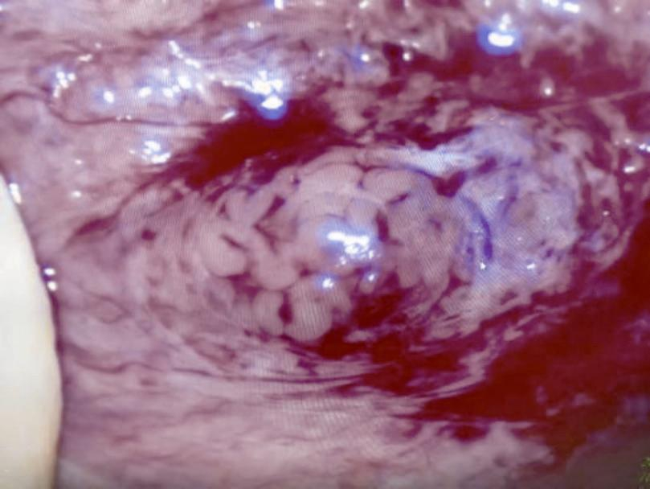

# 编者名单（按姓氏笔画排序）

乔 杰 北京大学第三医院

刘嘉茵 南京医科大学第一附属医院

李 朋 上海第一人民医院

李 铮 上海第一人民医院

李 蓉 北京大学第三医院

杨 蕊 北京大学第三医院

杨冬梓 中山大学孙逸仙纪念医院

连 方 山东省中医院

张 丹 浙江大学医学院附属妇产科医院

张 波 广西壮族自治区妇幼保健院

张志超 北京大学第一医院

张翠莲 河南省人民医院

陈子江 山东大学附属生殖医院

林 戈 中信湘雅生殖与遗传专科医院

黄元华 海南医学院附属医院

黄荷凤 上海国际和平妇幼保健院

曹云霞 安徽医科大学

康跃凡 福建省妇幼保健院

梁晓燕 中山大学附属第六医院

彭 靖 北京大学第一医院

腊晓琳 新疆医科大学第一附属医院

熊承良 华中科技大学同济医学院

# 前言

自1978年Edward和Steptoe采用体外受精胚胎移植技术妊娠的世界第一例婴儿成功诞生，这一技术至今经过了近40年的发展。随着体外受精胚胎移植技术的不断深入开展和普及，以及各种衍生技术的发展，使其应用范围越来越广泛。除了治疗女性盆腔异常导致的不孕症以外，1992年比利时的Palermo等开创的卵母细胞胞质内单精子注射技术，解决了男性因素导致不孕症的窘境。配子及胚胎的冷冻技术逐渐进步，使得这一技术得到更高的成功率。20世纪90年代后胚胎植入前遗传学诊断逐渐应用于临床，解决夫妇因染色体异常而导致的不孕症或复发性流产，并成功应用于单基因疾病的阻断以及HLA配型。在这一过程中，各种测序技术不断更新发展，使得其临床应用快速有效。近年来，生殖领域专家激烈争论的卵细胞胞质置换或卵细胞核移植技术是否能够成为治疗线粒体疾病的安全有效治疗方法，以及可否进一步推广帮助卵细胞老化无法受孕的妇女等相关问题，引发社会各界的关注。所有这些，均表明人类辅助生殖这一飞速发展的学科，需要及时有效的指南保证治疗的安全和有效性，而目前在我国，尚缺乏规范统一的诊治指南。

中国医师协会生殖医学专业委员会组织生殖内分泌及辅助生殖技术专家编写了《体外受精胚胎移植技术实施指南》，客观分析了目前体外受精胚胎移植技术的应用现状，内容涵盖了从体外受精胚胎移植技术诊疗过程中的适应证和禁忌证，各种促排卵方案的应用，取卵、胚胎移植等临床操作，到配子和胚胎显微操作，辅助生殖技术相关衍生技术，黄体支持，辅助生殖并发症及其处理以及男科取精常用技术及并发症等。希望本指南可以规范我国体外受精胚胎移植技术的诊治流程。广大生殖医学工作者通过对指南的解读，可以有更好的治疗结果，并将辅助生殖并发症抑制在最低水平，使患者有更好的治疗结局。

2017年1月

# 第一章　体外受精胚胎移植技术的应用

## 一、定义

辅助生殖技术主要包括体外受精-胚胎移植（in vitro fertilization and embryo transfer，IVF-ET）及衍生技术（ICSI、PGS、PGD、IVM等）。

（1）体外受精胚胎移植技术（in vitro fertilization，IVF）：

是将不孕夫妇的卵细胞与精子取出，培养成胚胎后再移植入子宫腔内，以达到妊娠目的。

（2）卵胞质内单精子注射技术（intracytoplasmic sperm injection，ICSI）：

是伴随IVF的一种特殊的受精方式，是把单个精子直接注入卵胞质内，协助受精，这项技术解决了常规受精失败的问题，提高了IVF的成功率 ［1］ 。同时ICSI对重度少弱精子症、梗阻性无精子症以及部分非梗阻性无精子症需睾丸显微取精的男性不育症患者的治疗，具有里程碑的意义。

（3）植入前胚胎遗传学诊断技术（preimplantation genetic diagnosis，PGD）：

是在胚胎着床之前对配子或胚胎的遗传物质进行分析，检测配子或胚胎是否有遗传物质异常的一种早期产前诊断方法；植入前胚胎遗传学筛查（preimplantation genetic screening，PGS）是选择染色体整倍体的胚胎进行移植，进而提高体外受精-胚胎移植技术（IVF-ET）的成功率 ［2］ 。

（4）未成熟卵细胞体外成熟培养（in vitro fertilization and embryo transfer，IVM）：

通过取出未成熟卵细胞，采用特殊的体外培养液中培养，然后再行常规受精或ICSI，从而获得胚胎而达到妊娠。

（5）辅助孵化（assisted hatching，AH）：

采用特殊的激光对胚胎透明带的打孔，可促进胚胎孵出率、提高其着床率。

（6）卵细胞冷冻、胚胎冷冻与冻融胚胎移植（frozen embryo transfer，FET）及卵巢组织冷冻：

采用玻璃化冷冻及慢速冷冻技术冷冻和解冻成熟的卵细胞、胚胎及卵巢组织。

# 第二章　体外受精与胚胎移植技术的适应证和禁忌证

## 一、适应证

（1）女方各种因素导致的配子运送障碍：如双侧输卵管阻塞、输卵管缺如、严重盆腔粘连或输卵管手术史等输卵管功能丧失者。

（2）排卵障碍：难治性排卵障碍经反复规范治疗，如诱发排卵或COS，或结合宫腔内人工授精技术治疗3~6周期后，仍未获得妊娠者。对POR患者，指导试孕或促排卵治疗3~6个月经周期仍不孕者。

（3）子宫内膜异位症：子宫内膜异位症导致不孕或不育，经药物或手术治疗仍未获得妊娠者。

（4）男方少、弱、畸精子症：男方少、弱、畸精子或复合因素的男性不育，经宫腔内人工授精技术治疗仍未获得妊娠，或男方因素严重程度不适宜实施宫腔内人工授精者。

（5）免疫性不孕、不育或不明原因不孕：反复经宫腔内人工授精或其他常规治疗仍未获妊娠者。

（6）有医学指征的女性生育力保存。

# 第三章　体外受精胚胎移植促排卵方案

## 一、GnRH激动剂

1978年世界首例试管婴儿诞生，随后促排卵技术在IVF中广泛应用。促排卵过程中，早发的LH峰影响了获卵率及卵母细胞质量，进一步影响了IVF-ET结局。1984年GnRH-a首次应用于IVF周期以防止LH峰的提前出现。其后的时间里，GnRH-a被广泛应用于辅助生殖技术。垂体降调节使卵巢处于相对静止的状态，通过适量外源性促性腺激素（gonadotropin，Gn）可使卵巢内的多个卵泡同时发育，达到刺激周期的卵泡同步性，在同一时间点获得同步发育的成熟卵泡。避免或减少了早发LH峰的出现，降低了周期取消率，提高了IVF-ET的妊娠率。垂体降调节是辅助生殖技术（ART）超促排卵过程中的重要一环。垂体降调节方案是IVF促排卵的重要方案，也是主流方案 ［1~2］ 。

GnRH-a控制性超促排卵分为GnRH-a长方案和GnRH-a短方案，长方案根据使用GnRH-a的剂型、剂量和时机的不同又分为多种方案。长效剂型为缓释制剂，药物可有规律地均匀释放28天，短效为非控释剂型，主要通过皮下注射方式给药，给药后有效性可持续24小时。

1.GnRH-a降调节方案 ［3］

长效和短效降调节药物均有多个有效剂量，长效降调节药物的剂量有3.75mg、1.875mg、1.25mg甚至0.75mg，常规剂量为3.75mg和1.875mg；短效降调节药物的剂量有0.1mg、0.05mg、0.03mg，常规剂量为0.1mg和0.05mg。短效剂型对垂体的抑制程度较浅，促排卵过程中LH水平不至于过低，每天注射后仍能发挥短暂的“火焰”效应，使内源性Gn短暂性升高。方案也根据临床工作中的经验总结不断地更新，包括长效长方案、短效长方案、超长方案、改良超长方案、改良长效长方案等，针对患者具体病因个体化治疗 ［4］ 。

（1）GnRH-a长方案按剂型分为长效长方案和短效长方案：

主要适用于年轻、卵巢储备良好的患者。排卵正常的患者在黄体中期使用降调节药物，排卵障碍的患者可以口服短效避孕药（oral contraceptive，OC）+ GnRH-a双压方案，在OC余4~6片时使用降调节药物。①长效长方案使用1.875~1.25mg的长效GnRH-a单次肌内注射；②短效长方案每天使用0.1mg或者0.05mg短效GnRH-a直至扳机日。降调节后14~18天，通过检测血激素水平和超声来判断是否达到降调节标准：血清E 2 ＜50pg/ml，P＜1ng/ml，LH＜3mIU/ml，超声显示子宫内膜厚度＜5mm，双卵巢卵泡直径均＜10mm或者无黄体囊肿时视为达到降调节标准。Gn的启动剂量取决于患者的年龄、窦卵泡数，基础性激素、AMH、体重指数及既往卵巢的反应性 ［5］ 。

（2）GnRH-a超长方案：

适用于重度PCOS、高LH及子宫内膜异位症的患者。月经周期第2~4天使用长效GnRH-a 3.75mg或1.875mg肌内注射，28~30天后再次长效GnRH-a 3.75mg或1.875mg肌内注射，连续注射2~3支。末次注射后28~30天检测激素水平和超声，达到降调节标准后启动Gn，该方案一般会使垂体过度抑制，可以适当推迟启动Gn时机，以减少Gn天数 ［6］ 。

（3）GnRH-a改良超长方案：

适用人群同超长方案。排卵正常的患者在黄体中期，排卵障碍的患者口服短效避孕药（OC），在OC余4~6片时使用长效GnRH-a 1.875~1.5mg，28~30天后再次注射相同剂量的长效GnRH-a，末次注射18~20天抽血和超声检查，达到降调节标准后启动Gn。

（4）GnRH-a改良长效长方案：

适用人群同GnRH-a长方案。在月经周期第2到4天使用长效GnRH-a 3.75mg肌内注射，28~40天后检测血激素水平和超声，当达到降调节标准后启动Gn ［7］ 。

2.GnRH-a短方案 ［8］

GnRH-a短方案是利用GnRH-a的flare-up作用，在卵泡早期刺激垂体引起内源性Gn迅速分泌，并与外源性Gn同时作用，募集卵泡，3~5天后内源性逐步被抑制，仅由外源性Gn刺激卵泡发育。短方案主要适用于卵巢反应不良的患者。方法：月经第2天开始使用GnRH-a 0.05~0.1mg至扳机日，并同时或者推后一天使用Gn。Gn启动剂量同长方案。

在促排卵过程中检测血清激素的变化和卵泡数量，根据卵巢的反应调整Gn用量，以获得适量的同步发育的优势卵泡，当至少3个优势卵泡≥18mm，每优势卵泡（直径≥14mm）雌二醇水平达到200~300pg/ml时给予hCG扳机，hCG的剂量因雌二醇水平、卵泡数目多少、既往周期卵细胞成熟度及OHSS病史的不同而不同，剂量可以4000~12 000IU之间。

# 第四章　体外受精胚胎移植技术临床操作

## 一、阴道超声引导下穿刺取卵术

取卵术通常在注射hCG或GnRH-a 36~38小时后进行，经阴道超声引导下穿刺取卵术是最常用的IVF采集卵细胞的方法。

1.术前准备

（1）核对患者及丈夫姓名，了解患者全身体格状况及既往病史。向患者说明手术过程，获得患者术中最大配合。

（2）设备准备：配套的实时超声显像仪、高频阴道探头及穿刺适配器（穿刺针支架）、单腔或双腔穿刺取卵针，控制良好的持续负压吸引器、恒温试管架装置等。穿刺取卵针的直径一般在16~22G的范围 ［1］ ，根据本单位的操作经验和规范选择负压100~120mmHg范围，原则上尽量减少对卵丘复合物的损伤。

（3）术前麻醉：根据情况可选择静脉麻醉、局部麻醉、仅镇静或不用药。

1）术前镇静：通常选择术前30分钟肌注哌替啶（度冷丁）50mg或100mg，注射前后监测患者生命体征。

2）静脉麻醉：一般采用短期麻醉药如芬太尼联合苯二氮

类或咪达唑仑（咪唑安定、异丙酚）静脉麻醉，由专职的麻醉师执行。注意麻醉安全，如麻醉医师现场监测，开放静脉通路，在手术过程中心电和血氧监护等。目前并没有研究证实麻醉药物和技术的选择与IVF结局之间有明确关系。

（4）体位准备：术前排空膀胱，患者取膀胱截石位，固定于手术床上。

（5）阴道准备：在注射hCG日，用无菌生理盐水冲洗外阴及阴道，注意避免用力过度可能诱发卵泡破裂；对于少数患者阴道清洁度差时，可先用消毒液擦洗外阴和阴道，再用生理盐水冲洗消毒液。

2.手术操作

（1）按阴道手术要求铺无菌巾单，再次用无菌生理盐水冲洗外阴及阴道，全过程遵守无菌操作原则。

（2）B超探头准备，选择高频探头，通常用无毒乳胶套防护和隔离，穿刺前试验检查穿刺针、试管、吸引管接头整个卵泡液引流系统的负压和连接是否正常，负压设置是否恰当。设置超声仪屏幕的穿刺引导线。

（3）将装有穿刺针套管的B超探头置入阴道，检查盆腔及双卵巢情况，观察卵巢位置及大小、卵泡数目及大小，区别卵泡与血管的回声，了解子宫内膜的情况，注意周围大血管的分布，观察双侧卵巢是否存在异常的排卵迹象，盆腔是否有异常的液性暗区。

（4）将阴道探头稳定在穿刺侧卵巢最近的穹隆部位，尽量避开膀胱、肠管、子宫肌层、宫颈以及宫旁血管丛，卵泡尽量显示其最大平面，接触卵泡壁后进针快而准，穿刺针进入卵泡后，启动负压抽吸，针尖平面可以各角度旋转，以彻底吸尽每个卵泡，至目标卵泡完全塌陷。

（5）位于同一穿刺引导线的卵泡可自浅而深一次进针完成，对于不同穿刺线上的卵泡，可退针至接近卵巢表面，调整穿刺方向再穿刺，尽量穿刺直径10mm以上的所有卵泡，穿刺针进出阴道壁时必须停止负压吸引，进针前与出针后以含低浓度肝素的PBS液冲洗穿刺针。

（6）一侧卵巢穿刺结束后再穿刺另一侧。

（7）取卵结束后，检查阴道穿刺点有否出血，可置无菌纱布填塞压迫止血，数小时后取出，术毕平卧休息30分钟，生命体征平稳或无特殊不适主诉方可离院。

3.注意事项

（1）手术中严格执行无菌操作，避免任何环节对卵母细胞的损害。

（2）手术过程中要注意观察患者的一般情况，监测相关的生命体征及患者的意识状态。术中注意避免损伤周围血管和脏器，做好应急和抢救预案。

（3）患者卵泡较少时，可应用培养液冲洗卵泡腔以提高获卵率 ［2~3］ ，注意每次卵泡冲洗液量不能超过卵泡腔的体积，以免卵泡胀破，卵细胞丢失。

（4）取卵抽吸过程中注意获卵数与卵泡数是否一致，相差较大时要寻找原因（负压、漏液等）。

（5）穿刺中如吸出异常液体，必要时送病理检查，更换或反复冲洗穿刺针及吸管。当取卵时发现卵巢子宫内膜异位囊肿，或输卵管积水，可以在取卵结束后进行。若术中误穿异位囊肿或积水，必须洗净穿刺针，或更换新的穿刺针，以免炎性液体对卵细胞的毒性作用，术后酌情使用抗生素。

（6）如果取卵困难，必须经过子宫肌层时，尽量避免穿刺子宫内膜以免对胚胎移植造成不良影响；如果经过膀胱，嘱术后多排尿，注意出现血尿，有时血尿会在一周后脱痂时发生。

（7）嘱患者术后禁止性生活。

4.术后并发症

（1）感染： 包括生殖道感染、盆腔感染，严重者可发生盆腔脓肿。手术中应严格遵守无菌操作，注意阴道隐匿部位的清洗，穿刺操作不宜反复进针。

（2）出血： 操作过程中如不慎穿刺血管，可以出现盆腔、膀胱等部位出血，严重者可危及生命，必要时需要手术止血。应该熟悉盆腔解剖及超声图像特征，避免穿刺卵巢以外的组织，注意勿将盆腔血管横断面误认为卵泡。

（3）损伤： 穿刺卵巢以外的组织及器官引起损伤，如肠管、膀胱、子宫内膜、神经丛等。

# 第五章　体外受精胚胎移植培养

## 一、胚胎实验室工作原则

为避免或减轻体外操作对配子和胚胎生长发育的影响，建议所有的操作均应在室温25℃左右、湿度40%~60%、具有去除空气中颗粒物及挥发性有机物（volatile organic compounds，VOC）的实验室中，并在37℃百级洁净区域内进行。

接触配子或胚胎的耗材、器皿均为无毒性材质，无菌一次性使用。

各种配子和胚胎操作液、培养液均应提早配制并放培养箱内平衡过夜备用。

使用的培养皿、试管等应该在放入或转移配子胚胎前标注患者姓名和日期，操作时牢记双人核对且做好记录。

# 第六章　体外受精胚胎移植相关衍生技术

## 一、单精子卵胞质内注射

（一）技术定义和指征

单精子卵胞质内注射（intracytoplasmic sperm injection，ICSI）是指用显微注射的方式，将具备生育潜能的精子注射入成熟卵母细胞胞质内，以实现受精并生育子代的技术。ICSI中，在体外进行人工择取精子，并注入成熟卵母细胞胞质内，以克服以下3个受精机制障碍：①活动精子不足，体外/体内不能实现卵母细胞受精；②精子不具备穿透卵母细胞膜及外周组织和结构的功能；③卵母细胞功能障碍，精子不能穿透其细胞膜和外周组织结构 ［1］ 。

ICSI临床应用指征如下 ［2~4］ ：

1.严重少、弱、畸精子症。精液中精子密度＜5×10 6 /ml或活性精子密度＜1×10 6 /ml。

2.在弱精子症患者的精液中，连续两次或以上的精子分离不能达到人工授精的要求（＜1×10 6 /ml）。或在IVF-ET中，精子分离处理后精子悬液不能达到常规IVF-ET对精子质量的要求。

3.免疫性不孕。

4.既往IVF-ET中受精失败，或受精率低下，或出现异常受精如较高比例多精受精者。

5.不明原因不孕，系统规范有效受孕治疗2~3周期未受孕，临床资料提示可能存在受精障碍，在首次IVF-ET时可实施部分ICSI。

6.受精失败卵母细胞的补救受精。

7.遗传学诊断/筛查，或体外成熟卵母细胞。

（二）试剂、用品和设备

试剂和用品需经过胚胎相关毒性试验合格。

1.试剂

（1）卵裂期胚胎培养液。

（2）非碳酸盐缓冲体系培养基。

（3）透明质酸酶工作液：含80~100IU/ml透明质酸酶的HEPES缓冲液。

（4）PVP工作液：含用5%~10%PVP的HEPES缓冲液。

（5）矿物油。

2.用品

（1）35mm×10mm培养皿（注：该器皿可依据显微操作设备要求配置）。

（2）ICSI针。

（3）持卵固定针。

3.设备

（1）倒置显微镜：

目镜：10×，物镜：4~40×。

（2）倒置显微镜载恒温平台：

与显微镜相匹配。

（3）显微操作系统：

与显微镜相匹配。

（三）实验操作 ［5~6］

1.器皿准备和设备调试

（1）调试皿准备

1）使用前取35mm培养皿，正中放10μl HEPES缓冲液1滴。

2）覆盖矿物油。

（2）ICSI操作皿准备

1）取35mm培养皿盖制作ICSI穿刺皿。如图1，在中心0和1号位置滴5μl PVP工作液，2~8号位置滴5μl HEPES缓冲液。0号用于精子制动，穿刺体系压力平衡和ICSI针清洗，1号用于存放精子，2~8号放置卵母细胞并ICSI（注：液滴的排列可依据各机构的技术习惯调整）。

2）尽快覆上矿物油，避免液滴挥发渗透压改变。

3）使用前37℃复温。
 

图1　ICSI穿刺皿
 
（3）胚胎清洗皿和培养皿准备

见第五章内容

（4）操作系统调试：

按设备安装说明安装倒置显微镜、显微镜保温平台和显微操作系统，并保障其在正常工作状态。在实验操作前调试ICSI系统。

1）安装卵母细胞固定针和ICSI针：用推动油排除液体推动系统中注射器及其管道内的空气。依据操作习惯将卵母细胞固定针和ICSI针安装在固定器上，保持其远端约2cm无推动油。将固定器固定在显微操作系统的固定架上。调整显微操作系统使各方向活动范围较为方便可调。

2）依据固定针和ICSI针提供的角度，调整固定器角度使固定针和ICSI针远端基本水平或略向下，两顶端基本相近，投影下成一直线（图2）。

3）取调试皿：4×物镜下观察找到培养皿底部上平面。在矿物油中将固定针和ICSI针下降到该平面，调整固定器和ICSI针于同一视野平面，两者基本水平且成一直线。10×物镜下进一步调整。此时固定针和ICSI针头部进入矿物油，静止5~10秒使内压力平衡。

4）将固定针和ICSI针移入调试皿HEPES平衡液滴内，设备待用。
 

图2　ICSI系统调试
 
2.配子制备

（1）精子的制备

1）射出精子、逆行射精精子、附睾精子的制备（详见第五章）。

2）睾丸组织取材精子制备：取卵裂期培养液0.5ml于35mm培养皿，将活检或穿刺获得的睾丸曲细精管在卵裂期培养液内碾压碎化后，移入试管在培养箱内孵育30分钟至2小时，去除沉淀组织块即可使用。

（2）卵母细胞的制备：

ICSI前，需通过去颗粒细胞将卵母细胞从卵-冠-丘复合体中释放出来。方法如下：

1）取卵后2小时，将OCCCs置于透明质酸酶工作液，轻微吹打，在镜下观察至颗粒细胞散落，仅剩下透明带外的放射冠细胞。时间约1分钟。

2）转移至HEPES缓冲液，用直径150μm的吸管轻柔吹打，去除放射冠颗粒细胞。

3）检查卵母细胞成熟度（此步骤可省略，在ICSI操作时判断）。

4）将卵母细胞转移至卵裂期培养液，放入培养箱待操作。

3.单精子卵胞质内注射

（1）取出准备好的ICSI操作皿。

（2）加入精子。

移去1号液滴约4μl液体，加入4μl处理后的精液，在倒置镜下检查精子满足要求后，培养皿置于37℃，以平衡并让精子沉淀。

（3）加入卵母细胞。

ICSI前将卵母细胞移出培养箱，可在2~8号滴中加入卵母细胞。

（4）ICSI在20~40×物镜下进行。

1）移除调试皿，将ICSI皿置于显微镜载物台，0号液滴置于视野中央，聚焦于液滴边缘。放下ICSI针于液滴内，调整与ICSI皿底部同平面，平衡。

2）上抬卵固定针，移动ICSI针至1号滴，目视下吸取形态正常精子1~2个。转移至0号滴，释放精子，用ICSI针将精子尾部下压、挤压，使其略成角形变以制动。

3）将精子从尾部吸入ICSI针，上抬ICSI针。

4）将2号液滴移入视野中央，聚焦于卵母细胞赤道平面，检查卵母细胞成熟情况。MII卵母细胞用于ICSI。

5）下降卵固定针和ICSI针至聚焦平面，用卵固定针轻吸卵母细胞使之固定，调整卵母细胞使极体处于6点或12点钟位置。

6）将精子移至ICSI针尖，在3点钟位置穿入卵细胞。轻轻回吸卵母细胞胞质，卵细胞膜破裂后立即停止回吸，随后将精子轻柔地注入卵细胞。

7）于穿刺路径反向慢慢移走ICSI针，释放卵固定针负压，释放卵母细胞。

8）按2）~7）操作其他卵母细胞。

9）转移ICSI后的卵母细胞，于胚胎清洗皿清洗后移入胚胎培养皿培养。

10）重复2）~9）操作完成全部成熟卵母细胞ICSI。

4.受精卵培养

（1）ICSI后的卵母细胞在CO 2 培养箱中培养。

（2）16~18小时检查受精。

（四）注意事项

1.操作应在百级净化环境中进行，卵母细胞对低温敏感，应尽可能保持卵母细胞温度在37℃左右。尽可能缩短卵母细胞离开培养箱的时间。

2.操作中要尽可能避免卵母细胞的损伤。调整好卵固定针和ICSI针甚为重要，要保持两者针尖细部与ICSI操作皿底呈夹角0~5°，防止针尖上翘，且在镜下观察，两者针尖细部正对时处于同一直线上；系统动力传导的油系统中不应含有气泡、密封圈碎屑、毛细玻璃管渣等，否则产生滞后现象，影响操作的灵敏性，增加卵母细胞的损伤；在抽吸卵母细胞胞质时，确保细胞膜破裂即可，尽可能减少对细胞质的扰动；精子制动应在精子尾部中后段，应避免精子中段及头部损伤。

3.注入卵母细胞内的PVP可能存在安全性风险，因此ICSI进入卵母细胞胞质时尽可能将精子置于ICSI针顶端，精子进入胞质即停止注射，尽量减少注入卵母细胞胞质内的PVP。

4.精子活动率为0时，可用低渗肿胀试验确定存活的d级精子以协助ICSI时选择，但其安全性应当受到关注，有资料表明受精率、卵裂率、优质胚胎率及其妊娠率可能受到影响。

（黄元华 林戈）

# 第七章　黄体支持

## 一、黄体支持药物的分类及其药理作用

黄体支持药物包括：黄体酮、绒毛膜促性腺激素（human chorionicgonadotrophin，hCG）、雌激素及促性腺激素释放激素激动剂（gonadotrophinreleasi nghormoneagonist，GnRH-a）。

（一）黄体酮类

天然孕酮（黄体酮）由卵巢黄体和胎盘分泌，在血液中主要以结合型存在，在肝内降解为孕二醇，从尿中排出。

孕酮主要通过以下三方面作用达到支持黄体的目的：

1）黄体期对抗雌激素的内膜增殖作用，使增生期子宫内膜转化为分泌期内膜，间质蜕膜样变，为受精卵着床做好准备。

2）使宫颈口闭合，抑制宫颈黏液分泌，使黏液减少、变稠，不利于精子穿透；妊娠期抑制子宫肌层的收缩，使子宫松弛，降低妊娠子宫对缩宫素的敏感性，以保证受精卵及胎儿在子宫腔内安全生长。

3）妊娠后通过促进胎-母界面CD56 + 淋巴细胞分泌孕酮诱导封闭因子（progesterone induced blocking factor，PIBF），促进母-胎面的免疫耐受，防止胚胎排斥。

孕激素类药物分为天然孕激素和合成孕激素。合成孕激素多为具有雄激素样作用的孕酮、睾酮衍生物或螺旋内酯衍生物，可能增加子代出生缺陷风险，绝大多数合成孕激素不推荐用于生育相关的治疗。天然孕激素是目前用于黄体支持的主要用药。

目前常用的黄体酮类药物包括黄体酮油剂、黄体酮缓释凝胶、微粒化黄体酮及地屈孕酮等。常用给药途径包括肌内注射、经阴道及口服给药。

1.肌内注射黄体酮

黄体酮油剂是肌内注射黄体酮。肌内注射后迅速吸收，无肝脏首过效应、生物利用度高，肌注后血中孕酮浓度明显增高，血药浓度6~8小时达峰值，作用可持续48小时，72小时消失。通常剂量20~40mg/d。优点：疗效确切，价格低廉。缺点主要是不良反应多，有过敏反应，常有注射部位疼痛和刺激，易形成局部硬结，偶有发生局部无菌脓肿和损伤坐骨神经等，通常形成的局部硬结、无菌脓肿的吸收恢复需较长时间。

2.阴道用黄体酮

阴道用黄体酮主要包括黄体酮缓释凝胶和微粒化黄体酮。阴道用药后阴道上皮细胞迅速吸收并扩散至宫颈、宫体，并完成从子宫内膜向肌层的扩散，局部作用浓度高，即“子宫首过效应”。阴道途径给药后1小时，子宫内膜和肌层开始出现黄体酮，4~5小时后，黄体酮广泛分布于子宫内膜和肌层，并达到稳定浓度。黄体酮经阴道途径给予后2~6小时血药浓度达峰值，血中孕酮浓度显著低于肌内注射黄体酮。阴道黄体酮优点：与肌内注射黄体酮比较，疗效相同，使用方便，无痛苦，不良反应少，在一些国家已成为辅助生殖技术（assisted reproductive technology，ART）黄体支持的首选用药 ［1］ 。在辅助生殖技术治疗中，阴道黄体酮较肌内注射黄体酮具有黄体期阴道出血发生率高的特点，但阴道出血往往出现在未妊娠妇女，可作为妊娠失败的预测征象，补充雌激素可减少阴道出血的发生但不能改变妊娠结局 ［2］ 。

3.口服黄体酮

包括微粒化黄体酮和地屈孕酮，均存在肝脏首过效应。

（1）微粒化黄体酮：

口服微粒化黄体酮后，由于肝脏首过效应，有效成分大部分经肝脏代谢分解，生物利用度低，仅剂量的10%产生孕激素活性，口服后血中孕酮浓度显著低于肌内注射黄体酮，口服后1~3小时血药浓度达峰值，以后逐渐下降，血药浓度不稳定，半衰期为16~18小时，约72小时完全消失。由于口服微粒化黄体酮生物利用度低，需大剂量生效，故副作用大，经肝脏代谢分解后产生的代谢产物多，其中5α、5 β代谢产物可与神经递质γ-氨基丁酸（gamarex；gamma aminobutyric acid，GABAa）受体作用，增强GABAa活性，产生明显的头晕、嗜睡、抗癫痫等中枢神经系统症状，还会改变泌乳素和GnRH的分泌以及肝功能损害等不良反应。研究显示口服微粒化黄体酮不能充分支持子宫内膜发育 ［3~4］ ，在辅助生殖技术黄体支持中的有效性明显低于黄体酮肌注和阴道给药；相反，副作用较黄体酮肌注和阴道给药明显增加 ［5］ 。因此，在辅助生殖技术治疗中不推荐作为常规的黄体支持药物。

（2）地屈孕酮：

其并非真正的天然孕激素，属逆转黄体酮，在碳原子6和7之间多了一个双键，9、10位碳原子上的氢原子和甲基与天然孕激素反向，使地屈孕酮分子拥有弯曲的立体结构，称为“逆转”结构。该“逆转”结构使它对孕激素受体具有高度选择性，全部作用均由孕酮受体介导，与其他受体结合少，不良反应小，口服易吸收，口服后0.5~2.5小时达血药浓度峰值，服药3天后血药浓度达稳态，5~20mg/d范围内药动学呈线性关系，平均生物利用度 28%，高于微粒化黄体酮10~20倍，有效剂量10~20mg/d，肝脏负荷小，主要代谢产物为双氢地屈孕酮（DHD），DHD仍保持较强的孕激素活性，地屈孕酮63%经尿排出，24小时排出85%，72小时完全清除。地屈孕酮半衰期5~7小时，DHD半衰期14~17小时。口服地屈孕酮后不改变原血清孕酮水平。优点：地屈孕酮与阴道黄体酮相比，更方便，耐受性更好；与口服微粒化黄体酮相比，生物利用度高，代谢产物仍具孕激素活性，副作用小。目前已有报道地屈孕酮在辅助生殖技术黄体支持中的有效性与阴道微粒化黄体酮相似 ［6~7］ ，但在缺乏内源性孕酮的卵巢早衰患者的研究中，发现地屈孕酮不能促进子宫内膜蜕膜化转变 ［8］ 。

（二）人绒毛膜促性腺激素（hCG）

hCG是由胎盘的滋养层细胞分泌的一种糖蛋白激素。剂型包括尿源性hCG（uhCG）和基因重组hCG（rhCG），uhCG和rhCG除了原材料来源不同外，分子结构及药理药代特点完全相同。rhCG 250 μg相当于uhCG 6750 IU。hCG与促黄体生成素（LH）分子结构高度同源，有共同的α亚单位，和高含量的胱氨酸成分，区别仅在于hCG具有独特的β亚单位结构及最大的β亚单位，碳水化合物部分较大，有145个氨基酸残基及24个氨基酸簇的羧基末端，这是hCG较LH半衰期长及活性强的分子结构基础。hCG作用于LH受体，代替LH作用，具有诱导卵细胞成熟、引起黄素化和支持黄体的功能。卵巢黄体的存在是hCG可用于黄体支持的先决条件，hCG黄体支持的可能机制包括：①持续刺激黄体分泌雌、孕激素；②可能刺激黄体产生与内膜转化和胚胎植入及胚胎发育相关的其他因子 ［5］ 。hCG注射（肌肉或皮下）后约12小时达血药峰值浓度，半衰期为双相，分别为11小时和23小时，120小时后降至稳定的低浓度。黄体支持推荐剂量：1000~5000IU 隔日一次。理论上，hCG较黄体酮的黄体支持应有更多优点，hCG不仅刺激黄体持续分泌孕酮，还刺激黄体分泌雌激素，甚至可能刺激黄体产生具有促进胚胎种植和发育的其他因子，延长黄体寿命，改善超促排卵引起的黄体功能不足，其作用机制更符合生理，且不需每天注射，但荟萃分析显示在辅助生殖技术黄体支持中，hCG在临床妊娠率、继续妊娠率、出生率和流产率上与黄体酮无差异，没有优越性，反而明显增加卵巢过度刺激综合征（ovaria nhyperstimulationsyndrome，OHSS）的发生风险 ［9］ ，而且会干扰妊娠试验结果，需至少停药5~7天后才可进行妊娠试验。因此，hCG不再推荐作为辅助生殖技术黄体支持的常规用药。

（三）雌激素

女性体内的雌激素大部分由卵巢分泌，主要有雌二醇、雌三醇及少量雌酮，其中雌二醇最为重要，活性最强。在卵泡期，雌激素促使子宫内膜修复与增生；排卵后，雌、孕激素共同作用使增生期子宫内膜呈分泌期改变，有利于胚胎的着床与植入。雌激素可增加子宫肌层的血液供应，促进子宫平滑肌细胞增生，使子宫肌层增厚，有利于胚胎的发育。在正常月经周期，排卵后黄体在LH的作用下进一步发育，分泌大量雌孕激素，在黄体中期，雌激素水平形成第二峰值。雌激素可上调孕激素受体，增加子宫内膜L-选择性蛋白的表达 ［10］ ，进而改善子宫内容的容受性。黄体中期雌激素缺乏/不足可导致妊娠失败 ［11］ 。在妊娠期，孕酮的合成主要来源于母体血液循环中的低密度脂蛋白（low density lipoprotein，LDL），LDL通过胞饮突的方式进入滋养细胞。在灵长类动物研究发现，雌二醇可通过增强LDL受体基因的转录而增加LDL-胆固醇的摄取，同时雌激素可增加胎盘P450侧链裂解酶的活性，促进胆固醇转化为孕烯醇酮，进而增加孕酮的合成 ［12］ 。另外雌激素可增加子宫胎盘的血流，促进胎盘血管形成，为胎儿提供最佳的气体及物质交换 ［12］ ，从而保证胎儿的正常发育。

对于辅助生殖技术治疗中雌激素水平正常甚至过高的情况下继续添加雌激素是否有益存在争议。目前国内可用于生育相关治疗的雌激素类药物主要有戊酸雌二醇及微粒化雌二醇，并可经口服、经阴道及经皮三种不同方式给药。

1.戊酸雌二醇

是人体天然雌激素17 β雌二醇的前体，口服吸收迅速而且完全，在首次经过肝脏过程中分解为雌二醇和戊酸。由于肝脏的首过效应，只有3%的雌二醇得到生物利用。服药4~9小时后血药浓度达高峰，多次给药后观察到血清雌二醇水平约为单次给药的2倍，停药2~3天后雌二醇水平可恢复至治疗前的水平。戊酸雌二醇经阴道给药不能脱戊酸，吸收少，因此不推荐其经阴道给药。优点：口服给药方便，吸收完全，持续给药血药浓度稳定。缺点：生物利用度不高，主要经肝脏代谢，肝功能异常患者不建议使用。另外，雌激素能刺激肝脏合成凝血因子增加，引起凝血功能增强，导致静脉血栓形成。

2.17β雌二醇

（1）口服给药：

可在胃肠道中迅速吸收。主要代谢产物为雌酮和硫酸雌酮。代谢产物本身或转化为雌二醇后发挥雌激素效应。给药4小时后达血药浓度高峰，24小时内浓度大致稳定。E 1 /E 2 （雌酮/雌二醇）比值为7.0。

（2）经阴道给药：

阴道给药不需要经过肝脏首关消除，吸收效果好，1mg微粒化雌二醇经阴道给药后血清E 2 水平可达口服给药的20~30倍，平均血药浓度可达589.65pg/ml。

（3）雌二醇贴片 ［13］ ：

经皮给药通过皮肤吸收良好。药物主要透过角质层、表皮进入真皮，扩散到毛细血管，转移到体循环；其次通过毛囊、皮脂腺和汗腺等附属器官吸收。雌二醇贴片-100的雌二醇每天可分别向体内释放100g雌二醇。在每周一次雌二醇贴片血清雌二醇水平的绝对高度与所用贴片面积直接成比例。平均血清稳态雌二醇水平约为70pg/ml（25cm 2 贴片）。不同部位给药血E 2 水平稍有差异。腹部24~48小时血药浓度达峰，臀部12~48小时达峰值。臀部给药后最大血药浓度及平均血清稳态雌二醇水平分别比腹部给药高25%及17%。雌二醇半衰期1~2小时，7天疗程结束后12~24小时血E 2 恢复正常。经皮给药避免了口服用药肝脏首过效应使肝脏负荷加重。一周内多次使用未见雌二醇或雌酮的蓄积，相应地，这两种物质的血清稳态水平与单次用药后所见相似。

（四）GnRH激动剂

促性腺激素释放激素激动剂（GnRH-a）是将促性腺激素释放激素（GnRH）第6，10位上的氨基酸结构替换。新产生的肽链结构稳定，半衰期延长（1~6小时），与相应受体的结合能力增加100~200倍 ［14~15］ 。GnRH有双向调节作用，正常情况下通过脉冲式分泌，经下丘脑-垂体-门脉循环进入腺垂体，引起腺垂体的促性腺激素也呈脉冲式释放，刺激黄体生成素（LH）与卵泡刺激素（FSH）的分泌，从而调节体内的生殖内分泌系统，GnRH-a持续分泌/非脉冲式分泌消耗垂体的GnRH受体数量，产生垂体脱敏作用抑制促性腺激素激素的释放。早期研究 ［16~17］ 曾认为GnRH-a有类似避孕药作用，可诱导脑垂体细胞脱敏进而抑制脑垂体功能，导致黄体溶解，影响胚胎的种植 ［18］ 。但1993年首次报道 ［19］ 在黄体中期意外给予GnRH-a并不影响妊娠结局，相反胚胎种植率更高。其后出现了大量关于GnRH-a作为黄体支持辅助用药的研究，但其详细机制尚不清楚。主要认为GnRH-a可促进下丘脑垂体分泌LH作用于黄体，促进雌孕激素的分泌，进而促进胚胎的种植发育。有研究发现围着床期的鼠胚存在GnRH受体信使RNA的表达，在体外给予GnRH-a孵化可促进胚胎发育。随后进一步研究发现人类胚胎及子宫内膜基质细胞同样存在GnRH受体信使RNA，在黄体中期给予GnRH-a可促进着床早期的胚胎分泌hCG ［20~21］ 。另外，LH的释放可增加子宫内膜基质细胞血管生产因子及与胚胎种植相关的细胞因子（如TIMP-1、TIMP-3、MMPs等）的表达，进而促进胚胎的着床及发育 ［22~23］ 。GnRH-a用于黄体支持不增加OHSS发生风险，作用于下丘脑垂体分泌LH进而促进雌孕激素的合成，更接近自然周期。但长方案降调节等垂体功能抑制的患者不适用。

目前国内常用的GnRH-a代表药有醋酸曲普瑞林、醋酸布舍瑞林、醋酸亮丙瑞林等。在皮下单次注射0.1mg短效醋酸曲普瑞林后，生物有效性可持续24小时，血浆半衰期约3小时，给药后1~24小时血浆水平波动在0.28ng/ml和1.28ng/ml之间。

（李蓉 杨蕊 乔杰）

# 第八章　体外受精胚胎移植技术并发症

## 一、卵巢过度刺激综合征

随着辅助生殖技术的进步及需求增加，应用促排卵药物引起的卵巢过度刺激综合征（ovarian hyperstimulation syndrome，OHSS）越来越受到重视。

OHSS 基本诊治知识

1.定义

卵巢过度刺激综合征为现代辅助生殖技术中使用促排卵药物引起卵巢过度刺激的并发症。OHSS 可引起患者身心伤害甚至导致死亡，但是大多数 OHSS 是一种自限性疾病，仅仅需要接受支持治疗和严密监测即可，但是严重的 OHSS 需要住院治疗以缓解症状和控制疾病进一步的发展。OHSS 诊断和治疗的主要原则是早期识别、及时评估和对中重度患者的合理治疗。

2.发病机制

主流观点认为主要促炎介质参与了卵巢过度刺激综合征发病过程，然而此理论还未能指导 OHSS 临床处理。最主要的促炎因子是血管内皮生长因子（vascular endothelial growth factor，VEGF），但各种各样细胞因子可能参与了 OHSS的病理生理过程和临床特征。卵巢增大、血管渗透性增加和高凝状态是临床表现的病理生理机制。

3.OHSS的发病率及危险因素

不同的生育治疗 OHSS 发生率亦不同，OHSS的发生率与卵巢过度刺激的程度呈正相关。

据文献报道 ［1］ 常规的体外受精（IVF）周期中，轻度OHSS 的发生率约占 1/3，而中重度 OHSS的发生率在 3.1%~8% 之间。欧洲第 14 届 IVF-监管报告 ［2］ 分析了 25 个欧洲国家的数据发现，2010 年因 OHSS 住院约占 IVF 患者的0.3%。而来自美国的数据 ［3］ 显示，OHSS 是 IVF的常见并发症，2011 年中重度 OHSS 发病率为1.1%。使用氯米芬或促性腺激素促排卵极少发生OHSS。临床上在自然排卵状态下发生 OHSS 是极罕见的。

OHSS 的危险因素包括 OHSS 病史、多囊卵巢综合征、窦状卵泡数和抗 AMH 抗体水平。有一篇meta 分析 ［4］ 研究认为联合应用促性腺激素释放激素拮抗剂（GnRH-a）可降低 OHSS 发生率。然而该指南认为尽管采取上述预防措施，仍不可避免 OHSS 的发生，并且上述文献对 IVF 患者应用GnRH-a没有满足任何考虑 OHSS 危险因素的标准。另外妊娠率越高其发生 OHSS 的概率越大，尤其是多胎妊娠 OHSS 的发生率更高。

4.OHSS诊断

OHSS 的诊断依据病史（表2）和临床表现（表3）。典型的症状为在促排卵药物注射后出现腹胀和腹部不适。根据症状出现的时间不同可将患者分为早期 OHSS 和晚期 OHSS，早期 OHSS 是症状在 hCG 药物注射后 7 天之内出现，多与卵巢多度刺激反应有关；晚期 OHSS 多在 hCG 药物注射 10 天之后出现，常常是因为早期妊娠产生内源性 hCG。晚期 OHSS 往往要比早期 OHSS严重 ［5］ 。
 
表2　可疑OHSS患者的相关病史

 
表3　可疑OHSS患者的检查

5.评估严重程度和报告不良后果

OHSS 的严重程度是如何分类的？

OHSS 的严重程度应根据一个标准化的分类方案进行分级（表4） ［6~9］ 。
 
表4　OHSS的严重程度分级

卵巢的大小与 OHSS 的严重程度的不一定相关，因为其大小在辅助生殖过程中受卵泡穿刺术的影响。有任何极危重表现的 OHSS 患者应该按以上类别进行分类。

6.OHSS与妊娠

大部分 OHSS 患者是疾病具有自限性，一般病程在 7~10 天，监测的目的是识别出 OHSS 恶化程度可能增加的妇女，并进一步处理。妊娠后其内源性 hCG 增加会导致 OHSS 病情恶化，如未妊娠，其病情会较快缓解。

7.临床医生和患者应警惕以下临床表现，因其预示着OHSS患者病情的恶化。

（1）腹胀和腹痛的加剧。

（2）气短。

（3）心动过速或低血压。

（4）尿量减少（24 小时尿量少于 1000ml）或液体正平衡（24 小时多于1000ml）。

（5）体重增加或腹围增加。

（6）血细胞比容增加（大于 0.45）。

8.OHSS治疗

大多数 OHSS 是一种自限性疾病，仅仅需要接受支持治疗和严密监测即可，但是严重的OHSS 需要住院治疗以缓解症状和控制疾病进一步的发展。OHSS 诊断和治疗的主要原则是早期识别、及时评估和对中重度患者的合理治疗。

OHSS 治疗多是对症治疗，使用对乙酰氨基酚或阿片类药物止痛，禁止使用非甾体类抗炎药止痛 ［10］ ；如果出现严重的疼痛症状，临床医生应该警惕卵巢蒂扭转、卵巢破裂或合并宫外孕或盆腔炎疾病 ［11~13］ 。

由于卵巢的血管渗透性增加，导致腹水产生进而引起全身处于低血容量和高凝状态。为了使体液平衡，患者补液治疗，然而现如今并没有最佳的补液方案。静脉滴注补液可能会导致腹水产生的增加，因此如果患者可以饮水，尽量口服补液。急性缺水的患者应静脉补液，后期再转换至口服补液。如患者不能口服补液，晶体溶液被认为是最有用的纠正缺水状态的液体。严重缺水的患者应静脉补充明胶和羟乙基淀粉（HES）。然而有研究证实与晶状液体相比，HES 会增加重症患者和败血症患者的死亡率，因此 HES 已经退出英国。

少尿的患者应避免使用利尿剂，因为它们会进一步消耗血容量。避免使用利尿剂也不是绝对的，对于已经大量补液且腹水已抽出但仍然少尿的患者，应联合多科室决定是否使用利尿剂，以免引起肾衰。有穿刺抽液适应证的患者应在超声指导下进行腹腔或阴道穿刺。危重患者和以 OHSS收入院的患者应该使用低分子量肝素预防血栓形成。

9.OHSS预防

准确的预测和积极的预防对避免 OHSS 的发生非常重要，目前预防措施主要包括及时识别危险因素，应用个体化促排卵方案，严密监护卵巢的反应性，及时调整 Gn 用量。

1）排卵障碍诱发排卵时，首选氯米芬，氯米芬抵抗才使用促性腺激素。

2）控制性超排卵（COH）时注意识别高危人群，如年龄较轻、体形瘦小、有PCOS 表现的患者。对存在高危因素的患者应当减少 Gn 的初始用量，在促排卵治疗中增加剂量需要小心谨慎。

3）PCOS是OHSS的高危因素。PCOS 患者卵泡过多、激素水平高、反应敏感，最容易发生OHSS。重度 OHSS 者在使用hCG前的卵巢体积显著大于无 OHSS者，卵泡超声评分法可预测 OHSS的发生。评分方法为：卵泡平均直径 5~8mm为1分；卵泡平均直径9~12mm为1.5分；卵泡平均直径13~16mm 为 2 分；卵泡平均直径≥17mm为3分。累计双侧卵巢卵泡总分，总分＜25 分者不发生 OHSS，总分＞30 分均发生 OHSS。

4）加强监测：重视患者的主诉和体征，在促排卵过程中严密监测卵泡发育情况、卵巢大小和血 E 2 水平，根据监测结果综合判断，调整 HMG用量，尤其是控制黄体期hCG用量，严重者应放弃该周期。

5）使用短效 GnRH-a预防 OHSS：在没有降调节或用 GnRH 抑制剂抑制内源性 LH 的周期，可利用 GnRH（证据等级3）。

激动剂（flare up）产生内源性 LH 达到促排卵目的。由于 LH 的作用持续时间较hCG短，其注射可以减少黄体期卵巢的刺激反应。

6）大剂量孕酮肌内注射：诱发排卵过程中出现 OHSS 高危征象时，不用hCG支持黄体功能，每天肌注黄体酮200mg，可起到预防OHSS的作用，尤其是当E 2 ＞2500pg/ml，卵泡数　＞15个时更应如此。

7）使用GnRH-a/Gn 诱发排卵方案时，若出现 OHSS 征象，则应立即停用Gn，并继续给予GnRH-a，抑制垂体分泌 FSH和LH，以加速卵泡萎缩，当垂体完全抑制后，再给予 Gn 重新诱发排卵，但应适当减少Gn用量。

8）若可能出现OHSS，应放弃注射hCG，并穿刺抽吸所有卵泡，取消该周期的治疗，可有效地防止 OHSS 发生。

9）全胚胎冷冻：在 IVF-ET 周期出现 OHSS时，可将胚胎冷冻保存暂不移植，待以后自然周期再移植。但需注意由于hCG作用时间达6天及体内高水平 E 2 的情况，早期OHSS 仍有可能发生。

10）白蛋白的应用：对OHSS高危患者，于采卵日静脉注射人白蛋白改善低蛋白血症，阻止血管内液体外漏，可以预防早期的重度 OHSS 发生，但其作用仍不被所有学者认同，白蛋白的应用也有争议。

（腊晓琳 黄荷凤）

# 第九章　男性不育手术取精常用技术及并发症

男性不育患者在进入辅助生殖周期，需要采取外科取精术者，主要有两种情况。最常见的是无精子症患者，需要进行手术取精。第二种情况为男性射精功能障碍，如不射精症、逆行射精不能获取足够精子或取精困难。取精技术一般比较安全，但若不注意手术细节，或没有按照规范实施时，可以导致出血、睾丸附睾炎症等。

无精子症作为男性不育的疑难重症，一般分为梗阻性无精子症（obstructive azoospermia，OA）与非梗阻性无精子症（non-obstructive azoospermia，NOA），后者又可分为高促性腺激素型与低促性腺激素型非梗阻性无精子症两种类型。因此根据病因不同，可以选择不同的外科取精技术，即选择何种方法需根据无精子症的原因和即将采取的治疗方法而定 ［1］ 。

对于拟行显微重建术的OA患者而言，可在重建手术时进行附睾精子吸取或睾丸活检取精冻存。但是，不建议在显微重建手术前，进行附睾穿刺取精，因为附睾穿刺可能损伤附睾而影响后续的男性输精管道重建手术。对于不能行显微重建或手术无效的OA患者可以根据患者情况，选择睾丸取精或附睾取精的手术方式。对于NOA患者，可以根据患者发病特点，选择细针穿刺取精术、活检取精术或显微取精术。因为男性射精功能障碍，如不射精症或取卵当天不能获取足够精子实施辅助生殖技术时，可以选择阴茎振动刺激取精术、经直肠电刺激取精术或者前列腺按摩取精术等。

# 中英文对照索引

γ-氨基丁酸（gamarex；gamma aminobutyric acid，GABAa） 64

C

促性腺激素（gonadotropin，Gn） 8

促性腺激素释放激素激动剂（gonadotrophinreleasing hormoneagonist，GnRH-a） 62

D

单核苷酸多态位点（single nucleotide polymorphism，SNP） 50

等位基因脱扣（allele dropout，ADO） 50

低密度脂蛋白（low density lipoprotein，LDL） 67

冻融胚胎移植（frozen embryo transfer，FET） 2

窦卵泡数（antral follicle count，AFC） 12

杜氏肌营养不良（Duchenne muscular dystrophy，DMD） 50

短串联重复序列（short tandem repeat，STR） 50

多囊卵巢综合征（polycystic ovary syndrome， PCOS）43

多胎妊娠（multiple pregnancy）89

E

二代测序（next generation sequencing，NGS）3

F

非梗阻性无精子症（non-obstructive azoospermia，NOA）117

辅助孵化（assisted hatching，AH）2

辅助生殖技术（assisted reproductive technology，ART）64

G

GnRH拮抗剂（gonadotropin-releasing hormone antagonist，GnRHant）11

高序多胎（high-order multiples，HOMs）89

个体化的移植政策（individualized embryo transfer policy）95

梗阻性无精子症（obstructive azoospermia，OA）117

宫内外同时妊娠（heterotopic pregnancy）102

国际生殖医学联盟（International Federation of Fertility Societies，IFFS）3

H

挥发性有机物（volatile organic compounds，VOC）28

K

抗苗勒管激素（anti-Mullerian hormone，AMH）12

拷贝数变异（copy number variation，CNV）55

口服短效避孕药（oral contraceptive，OC）9

L

来曲唑（letrozole，LE）90

卵胞质内单精子注射技术（intracytoplasmic sperm injection，ICSI）1

卵巢过度刺激综合征

（ovarianhyperstimulationsyndrome，OHSS）67

卵冠丘复合体（oocyte corona cumulus complex，OCCC）44

卵泡刺激素（follicle stimulating hormone，FSH）12

氯米芬（clomiphene，CC）90

O

欧洲人类生殖与胚胎学会（European Society of Human Reproduction and Embryology，ESHRE）12

Q

全基因组扩增（whole genome ampli fi cation，WGA）52

R

人类白细胞抗原（human leucocyte antigen，HLA）50

绒毛膜促性腺激素（human chorionicgonadotrophin，hCG）62

T

体外受精-胚胎移植（in vitro fertilization and embryo transfer，IVF-ET）1

体外受精胚胎移植技术（in vitro fertilization，IVF）1

W

微刺激或温和刺激（mild stimulation）15

未成熟卵细胞体外成熟培养（in vitro fertilization and embryo transfer，IVM）2

X

血管内皮生长因子（vascular endothelial growth factor，VEGF）81

Y

医源性多胎妊娠（iatrogenic multiple pregnancies）90

荧光原位杂交技术（ fl uorescence in situ hybridization，FISH）53

孕酮诱导封闭因子（progesterone induced blocking factor，PIBF）63

Z

植入前胚胎遗传学筛查（preimplantation genetic screening，PGS）2

植入前胚胎遗传学诊断技术（preimplantation genetic diagnosis，PGD）1

# 版权信息

书名：体外受精胚胎移植技术实施指南

作者：乔杰

出版社：人民卫生出版社

出版时间：2017/2/1

ISBN：9787117240208

本书由人民卫生出版社授权上海阅文信息技术有限公司制作与发行

# 

## 三、本指南制定的目标

WHO全球不孕症流行病学趋势报告（1990—2010）中，数据涉及全球190个国家和地区，20~44岁妇女为主；据估算，2010年，全球未避孕而2年内未活产的妇女约12100万。据WHO评估，每7对夫妇中约有1对夫妇存在生殖障碍。中国人口协会在2012年发布的调查结果显示，中国不孕不育患者超过4000万，即每8对夫妇中有1对夫妇存在生殖问题。中国自2015年全面放开二胎政策后，高龄夫妻备孕成为目前二胎备孕的主要人群，越来越多的高龄夫妻需要借助体外受精胚胎移植技术达到受孕，难治性、复杂性不孕病例越来越多，这需要更多医生尽快掌握不孕不育诊治流程和进行规范化治疗 ［4］ 。目前以IVF-ET技术为代表的人类辅助生殖技术已经比较成熟，虽然为广大妇科医生所熟悉但是未能完全掌握，导致很多药物滥用及医源性并发症，带来诸多不安全性医疗事故，编委会专家们期待通过梳理IVF-ET 及衍生技术的定义、目前应用现状、适应证、禁忌证、治疗方案和临床操作等，形成体外受精胚胎移植技术诊疗常规指南，规范辅助生殖各项技术的应用，为广大批准开展辅助生殖技术的医疗机构的医生提供临床实用性指导。

（梁晓燕 熊承良）

## 二、目前国际及中国IVF的应用状况

1.IVF技术的发展

1978年，世界首例试管婴儿诞生，揭开了人类辅助生殖技术研究的序幕。目前，世界上已有超过500万婴儿通过该技术出生，占全球新出生人口的2%~3%。中国内地自首例试管婴儿于1988年在北京大学第三医院诞生到现在，辅助生殖技术应用发展迅猛，到目前我国年应用量已达70万个周期，平均临床妊娠率为30%~40%，总体辅助生殖技术水平已达国际先进水平。IVF的衍生技术，中国首例ICSI及PGD试管婴儿于1996及1999年在中山大学附属第一医院完成。目前可通过PGD诊断的单基因遗传病包括常染色体遗传性疾病、性连锁遗传性疾病和线粒体疾病等30余种。随着高通量、高分辨的aCGH/SNP-array诊断技术的推广，二代测序（next generation sequencing，NGS）技术的临床准入，加上单细胞全基因组扩增技术的不断改进，产前和植入前的遗传学诊断技术正在发生巨大的变革，诊断的困境正在逐步被克服。生殖冷冻技术不仅使长期保存生殖细胞或组织成为可能，也为辅助生殖技术研究及治疗提供了更大发展潜力。

需要引起重视的是辅助生殖技术本身在社会、伦理、道德、法律等方面问题日益突出，其应用安全性值得探讨 ［3］ 。针对辅助生殖技术涉及的医学伦理及道德法律问题，我国相关部门已开始制定相应法规，实行准入制度，并加大国家法令性监督力度。

2.IVF机构的发展

过去几十年，世界范围内IVF中心的数量和周期数都急剧增加，根据2013年国际生殖医学联盟（International Federation of Fertility Societies，IFFS）的报告，全球有4000多家IVF中心，美国凭借世界领先的试管婴儿技术及开放的政策和文化，使得辅助生殖技术的发展态势愈发成熟。根据中国卫生计生委的数据，目前中国经批准开展人类辅助生殖技术和设置人类精子库的医疗机构共有432所。

## 参考文献

1.庄广伦.现代辅助生殖技术.北京：人民卫生出版社，2005.

2.乐杰.妇产科学.北京：人民卫生出版社，2003.

3.陈子江.人类生殖与辅助生殖.北京：科学出版社，2005.

4.李倩，梁晓燕.内分泌异常与复发性流产.国际生殖健康/计划生育杂志，2013，9（32）：9-10.

## 二、禁忌证

（1）男女任何一方患有严重的精神疾患、泌尿生殖系统急性感染或性传播疾病。

（2）患有《母婴保健法》规定的不宜生育且目前无法进行产前诊断或胚胎植入前遗传学诊断的遗传性疾病。

（3）任何一方具有吸毒等严重不良嗜好。

（4）任何一方接触致畸量的射线、毒物、药物并处于作用期。

（5）女方子宫不具备妊娠功能或严重躯体疾病不能承受妊娠。

（连方 曹云霞）

## 二、GnRH拮抗剂

GnRH拮抗剂（gonadotropin-releasing hormone antagonist，GnRHant）是在GnRH十肽的第6号和第8号氨基酸位点上进行了修改，使其半衰期延长且与垂体的GnRH受体结合后不发挥生物学活性，从而阻断内源性GnRH的作用，使血清中的内源性FSH、LH水平迅速下降，LH峰不能出现。应用常规剂量外源性促性腺激素促排卵联合GnRH拮抗剂抑制LH升高及排卵的方案即为GnRH拮抗剂方案，是体外受精与胚胎移植的常用刺激方案。

1.GnRH拮抗剂方案的适宜人群 ［9］

GnRH拮抗剂通过与内源性GnRH竞争，作用于腺垂体Gn分泌细胞的GnRH受体，1~2小时即可迅速抑制LH的产生，继而抑制早发型LH峰，以达到垂体降调节的作用。在控制性促排卵过程中使用的GnRH拮抗剂不影响FSH水平，在连续用药时可维持对LH的抑制作用且呈剂量依赖性，而停药后抑制作用可在48 小时内解除。GnRH拮抗剂方案适用于各类人群的控制性促排卵，包括卵巢正常反应、低反应及高反应。

对于卵巢正常反应的患者，与GnRH激动剂长方案相比，优质胚胎数相似，种植率、临床妊娠率、总体人群的活产率、持续妊娠率、流产率相当，但卵泡刺激天数缩短，Gn用量减少，OHSS发生率降低。对于卵巢低反应的患者，与GnRH激动剂长方案相比，促排卵时间短，Gn用量降低，临床妊娠率相似。欧洲人类生殖与胚胎学会（European Society of Human Reproduction and Embryology，ESHRE）关于预防OHSS发生的指南指出，对于年龄＜35岁和OHSS高风险的患者，推荐首选GnRH拮抗剂方案，减少Gn用量，缩短用药时间，减少最后触发的hCG用量或用GnRH激动剂代替hCG诱发排卵并全部胚胎冷冻，将有效减少中、重度OHSS的发生。

2.GnRH拮抗剂的使用方案 ［9］

从月经第2~4天开始给予外源性促性腺激素（Gn）启动促排卵，启动促排卵的Gn剂量根据患者的年龄、窦卵泡数（antral follicle count，AFC）、抗苗勒管激素（anti-Mullerian hormone，AMH）、基础卵泡刺激素（follicle stimulating hormone，FSH）、体重以及既往促排卵的反应调整，常用剂量为100~300IU/d。根据GnRH拮抗剂开始使用的时间分为固定（fixed）方案和灵活（flexible）方案。固定方案多适用于正常卵巢反应及高反应患者，灵活方案多用于异常卵巢反应（卵巢反应慢或低反应）的患者，以减少使用GnRH拮抗剂产生的不良影响。

（1）固定方案：

常在Gn使用第5或6天开始加用GnRH拮抗剂250μg，每天1次至hCG触发日。该方案的优点是，既可以有效控制早发LH峰，又可以减少患者的就诊次数，简化方案，同时获得与GnRH激动剂长方案类似的获卵数、优质胚胎率和临床妊娠率。

（2）灵活方案：

开始添加GnRH拮抗剂的时间，可在优势卵泡直径达到14或15mm时，或在优势卵泡直径＞12mm且血清雌二醇＞300pg/ml时，目前尚无统一标准。灵活方案在给予hCG进行触发时的主要依据倾向于以卵泡直径为主，血清雌激素水平仅作为第二参考。该方案的优点是对估计可能出现异常卵巢反应的患者，可以减少GnRH拮抗剂的使用量，缩短卵巢刺激时间，同时降低OHSS的发生风险。与固定方案相比，在使用中出现LH峰的可能性增大，有可能使子宫内膜长时间暴露在高雌激素和高LH的作用下，使子宫内膜容受性下降，因此可能会降低临床妊娠率。

3.GnRH拮抗剂方案中触发的时机及方法 ［9］

GnRH拮抗剂方案中，hCG触发的时机和剂量与GnRH激动剂长方案基本相同，建议在3个主导卵泡直径≥17mm或2个主导卵泡径线≥18mm时注射hCG触发，同时应综合考虑孕酮和雌二醇的水平。

在GnRH拮抗剂方案中还可选择GnRH激动剂触发卵细胞最后成熟。其原理是利用GnRH激动剂激发垂体释放内源性FSH和LH（LH峰），从而诱导卵母细胞恢复减数分裂。与自然周期的LH峰相比，GnRH激动剂诱发的LH峰的上升支从14小时缩短为4小时，而且无14小时的平台期，但两者的下降支均为20小时。GnRH激动剂触发的剂型和剂量尚未统一，常用有曲普瑞林0.2mg、布舍瑞林0.5mg、醋酸亮丙瑞林1~1.5mg。GnRH激动剂触发后的取卵时机与hCG触发相同。GnRH激动剂触发的主要优点是显著降低OHSS的发生风险，但目前临床研究显示GnRH激动剂触发使卵巢储备功能正常妇女的妊娠率和活产率显著降低，因此，GnRH激动剂触发适用于OHSS高风险的人群。

4.GnRH拮抗剂方案中的黄体支持 ［9］

黄体支持在GnRH拮抗剂方案新鲜周期中是非常必要的。与GnRH激动剂方案不同，其黄体功能不全的原因还包括：①GnRH拮抗剂能够迅速抑制LH的脉冲分泌，使LH水平降低，可能导致黄体功能不足；②GnRH激动剂触发时，黄体功能不全更严重。

hCG触发时，采用常规黄体支持方案（详见黄体支持章节）。GnRH激动剂触发时如果仅采用常规黄体支持，临床妊娠率较hCG触发低，流产率相对增加，需采用强化黄体支持方案，包括以下几种：①单次添加hCG：GnRH激动剂触发后35小时补充hCG 1500IU；②多次添加hCG：取卵后1、4、7天补充hCG 1000IU；③强化雌孕激素：隔日皮贴雌激素100μg×3次，或者口服雌激素4mg/d，维持血雌二醇水平达到200pg/ml；常规或加强黄体支持，维持血孕酮水平达到20ng/ml；④补充重组LH（rLH）：取卵日起，rLH 300IU隔日使用×6次。鉴于目前GnRH激动剂触发后的黄体支持仍然存在诸多问题，建议全部胚胎冻存行冻胚移植作为弥补方法使用。

## 四、自然周期

自然周期是不用任何药物刺激卵巢诱导排卵，但必须通过临近排卵期反复监测LH峰估计排卵时间，以便获取成熟卵细胞。其最大的优点是简单经济，可重复性强，不存在卵巢过度刺激和多胎妊娠的风险，但获取的卵细胞很少，足月妊娠分娩率甚低（6%）。伴随着GnRH-ant和Gn在临床的应用，改良的自然周期方案应运而生。适宜人群为：①卵巢低反应患者；②患激素相关性恶性肿瘤或存在此类疾病风险不能进行卵巢刺激患者；③自愿选择自然周期 ［14~16］ 。

1.自然周期 ［17~19］

自月经周期2~4天监测卵泡，监测卵泡大小及E 2 、LH、P，若卵泡直径≥18mm或（和）E 2 ≥200~300pg/ml，GnRH-a 0.2mg或hCG10 000IU诱发排卵；若LH提前出现峰值（≥20IU/L），紧急取卵。

2.改良自然周期 ［20~22］

自月经周期2~4天监测卵泡，监测卵泡大小及E 2 、LH、P，当卵泡直径≥14mm时，给予GnRH-ant 0.25mg/d，抑制内源性的LH峰，同时给予Gn 150IU，维持优势卵泡发育。当卵泡发育到18mm或（和）E 2 ≥200~300pg/ml时，给予注射GnRH-a 0.2mg或hCG 5000~10 000IU诱发排卵。

（张翠莲 杨冬梓）

## 参考文献

1.庄广伦.现代辅助生殖技术.北京：人民卫生出版社，2005.

2.Hayden C.GnRH analogues：applications in assisted reproductive techniques.Eur J Endocrinol，2008，159（Suppl 1）：S17-S25.

3.何钻玉，杨冬梓.进一步认识垂体降调节.生殖医学杂志，2013，22（10）：731-735.

4.李洁，周灿权，钟依平，等.不同小剂量促性腺激素释放激素激动剂在体外受精-胚胎移植中应用的比较.中华妇产科杂志，2006，4（41）：269-270.

5.王玢，孙海翔，刘景瑜，等.适当延长降调节时间对卵泡发育同步性的影响.中华男科学杂志，2011，17：1087-1091.

6.龚斐，卢光琇.改良超长方案的应用.生殖医学杂志，2011，10（22）增1：29-31.

7.任建枝，沙爱国，韩冬梅，等.改良长方案的控制性超促排卵方案在体外受精-胚胎移植中的应用.生殖医学杂志，2013，11（22）：846-850.

8.陈子江.人类生殖与辅助生殖.北京：科学出版社，2005.

9.中华医学会生殖医学分会.促性腺激素释放激素拮抗剂方案在辅助生殖领域中使用的专家共识.中华妇产科杂志，2015，50（11）：805-809.

10.Matsaseng T，Kruger T，Steyn W.Mild ovarian stimulation for in vitro fertilization：are we ready to change？ A metaanalysis.GynecolObstet Invest，2013，76（4）：233-240.

11.FauserBC，Nargund G，Andersen AN，et al.Mild ovarian stimulation for IVF： 10 years later.Hum Reprod，2010，25（11）：2678-2684.

12.Ferraretti AP，Gianaroli L，Magli MC，et al.Mild ovarian stimulation with clomiphene citrate launch is a realistic option for in vitro fertilization.Fertil Steril，2015，104（2）：333-338.

13.Revelli A，Casano S，Salvagno F，et al.Milder is better？Advantages and disadvantages of“ mild” ovrian stimulation for human in vitro fertilization.Reprod Biol Endocrinol，2011，16（9）：25-34.

14.罗丽兰.不孕与不育.北京：人民卫生出版社，1998.

15.武学清，孔蕊，田莉，等.卵巢低反应专家共识.生殖与避孕，2015，35（2）：71-79.

16.Ferraretti AP，La Marca A，Fauser BC，et al.ESHRE consensus on the definition of‘ poor response’ to ovarian stimulation for in vitro fertilization：the Bologna criteria.Hum Reprod，2011，26（7）：1616-1624.

17.PelinckMJ，VogelNE，Hoek A，et al.Cumulative pregnancy rates after three cycles of minimal stimulation IVF and results according to subfertility diagnosis：a multicentre cohort study.Hum Reprod，2006，21（9）：2375.

18.Nargund G，Waterstone J，Bland JM.Cumulative conception and live birth rates in natural（unstimulated）IVF cycles.Hum Reprod，2001，16（2）：259-262.

19.洪青青，陈秋菊，匡延平.自然周期紧急取卵在卵巢低反应患者中的应用.生殖与避孕，2013，33（8）：541-545.

20.Pelinck MJ，VogelNE，Arts EG，et al.Cumulative pregnancy rates after a maximum of nine cycles of modified natural cycle IVF and analysis of patient dropout：a cohort study.Hum Reprod，2007，22（9）：2463-2470.

21.Pelinck MJ，Vogel NE，Hoek A，et al.Minimal stimulation IVF with late follicular phase administration of the GnRH antagonist cetrorelix and concomitant substitution with recombinant FSH：a pilot study.Hum Reprod，2005，20（3）：642-648.

22.Kadoch IJ，Phillips SJ，Bissonnette F.Modified naturalcyclein vitro fertilization should be considered as the first approachin young poor responders.Fertil Steril，2011，96（5）：1066-1068.

## 三、微刺激或温和刺激

微刺激或温和刺激（mild stimulation）是与常规刺激方案相比使用较低剂量和较短时间Gn，或单独使用口服促排卵药物，或口服促排卵药物联合低剂量Gn促排卵，以获得2~7枚卵细胞为目的的卵巢刺激方案 ［10~12］ 。该方案常用于卵巢低反应患者，也可用于OHSS高风险的高反应人群和有激素依赖肿瘤风险的患者 ［10~11］ 。目前应用于卵巢储备正常人群的资料显示与常规刺激方案相比，每新鲜移植周期活产率及每取卵周期累积活产率低于常规卵巢刺激方案 ［13］ 。

1.  Gn温和刺激方案

Gn启动推迟至月经周期第5~7天开始，Gn剂量不超过150IU/d，常在卵泡直径达到约14mm时每天添加GnRH拮抗剂250μ g，直至2~3个主导卵泡直径≥17mm或1~2个主导卵泡径线≥18mm时行hCG触发 ［11］ 。

2.口服促排卵药物或口服促排卵药物联合Gn的微刺激方案 ［12］

于月经周期第3~7天单独口服促排卵药物氯米芬50~100mg/d，或来曲唑2.5~5mg/d，也可同时联合小剂量Gn75~150IU/d应用，常在卵泡直径达到约14mm时每天添加GnRH拮抗剂250μg，直至2~3个主导卵泡直径≥17mm或1~2个主导卵泡径线≥18mm时行hCG触发。

3.如行新鲜胚胎移植，微刺激和温和刺激促排卵后建议常规行黄体支持。

## 二、胚胎移植

1.取卵周期胚胎移植

根据各实验室的胚胎体外培养系统决定胚胎移植时间，一般在取卵后48~72小时进行，胚胎卵裂期（第3天）阶段和囊胚阶段（第5天）是最常用的移植时段，也可在原核期或两细胞期进行移植，移植的胚胎数不超过2个，推荐单囊胚移植策略。目前大多数中心采用经腹B超引导下胚胎移植 ［4］ 。

（1）术前准备

1）夫妇双方姓名核对和指纹识别，核对有效婚姻证件。签署移植胚胎的文件。向患者夫妇说明胚胎移植的过程，避免紧张情绪。

2）设备准备：经腹B超仪、ET管、无菌敷料等。

3）阴道准备：膀胱处于半充盈状态有利于超声观察子宫腔。患者取膀胱截石位，铺无菌孔巾，严格按照无菌原则操作，动作轻柔以避免刺激子宫，阴道窥器充分暴露宫颈，拭净阴道和宫颈分泌物，再以小棉签拭净宫颈管内的黏液分泌物。

（2）手术操作

1）培养室将移植导管的内导管接到一个高质量1ml注射器上，给内导管装载好胚胎，提交给手术医师。

2）在实时B超监测下，手术者将移植外导管沿宫颈内口位置轻轻置入到宫颈内口水平，当外管置入困难时，可考虑使用金属内芯协助，必要时采用宫颈钳牵拉宫颈前唇或后唇。避免过度牵拉宫颈引起子宫的收缩，影响受孕率。

3）再次核对夫妇双方姓名后，将装载好胚胎的内芯导管通过外套管置入宫腔内，距宫底0.5~1.0cm推注射器注入胚胎，将胚胎示踪的气泡注入宫腔中部或内膜评估良好的区域 ［5~6］ 。适当停留后退出内外导管，注意固定注射器的活塞，以免吸回胚胎导致移植失败。

4）将内外导管送回培养室，显微镜下仔细观察是否有胚胎残留，如有胚胎残留，则再次移植。

（3）注意事项

1）移植前，医生、护士和实验室工作人员必须严格核对患者身份和婚姻的有效性。

2）移植操作注意动作轻柔，避免损伤宫颈管及子宫内膜。

3）胚胎移植后患者可卧床休息数十分钟后离院，无确切的证据证明卧床可以提高胚胎的植入率，但应嘱咐患者避免重体力活动。

2.冷冻复苏胚胎移植

冷冻胚胎移植与新鲜胚胎移植在手术操作上是相似的。

（1）自然周期：

适用于既往月经周期规则者，于月经第10~12天B超监测卵泡的生长及子宫内膜的同步增长情况，当主导卵泡直径＞18mm时，可注射hCG5000~10 000IU，以此为血LH峰出现时间，定义为0天，并开始进行黄体支持。卵裂期第3天胚胎，则解冻胚胎，第4~5天进行胚胎移植。

（2）激素替代周期：

采用雌激素递增方案和恒定剂量方案，两种方案在妊娠率方面没有差别。均须行B超监测子宫内膜情况。

1）递增方案：

从月经来潮第3天起口服戊酸雌二醇3~6mg/d。在用药过程中行B超监测，当子宫内膜达到8mm或以上时加用孕激素进行内膜转化，每天肌注40~60mg，或阴道应用栓剂黄体酮阴道缓释凝胶，每天1支，或地屈孕酮20~40mg/d。于黄体支持的第4~5天行胚胎移植，黄体支持方法详见第七章。

2）恒定剂量方案：

从月经来潮第3天起每天口服戊酸雌二醇4~8mg，于周期的第12天起开始B超监测，当子宫内膜达到8mm或以上时加用黄体支持，处理同上。

（3）诱发排卵周期：

可以选用来曲唑联合Gn促排卵，期间监测卵泡，当主导卵泡直径达18~20mm，内膜＞8mm时，肌注hCG5000~10 000IU，定义为0天，在第4~5天进行冷冻第3天胚胎复苏后移植。

（张波 刘嘉茵）

## 参考文献

1.Nakagawa K，Nishi Y，Kaneyama M，et al.The Effect of a Newly Designed Needle on the Pain and Bleeding of Patients During Oocyte Retrieval of a Single Follicle.J Reprod Infertil，2015，16（4）：207-211.

2.Levy G，Hill MJ，Ramirez CI，et al.The use of follicle flushing during oocyte retrieval in assisted reproductive technologies：a systematic review and meta-analysis.Hum Reprod，2012，27（8）：2373-2379.

3.Hill MJ，Levens ED.Is there a benefit in follicular flushing in assisted reproductive technology？ Curr Opin Obstet Gynecol，2010，22（3）：208-212.

4.Revelli A，Rovei V，Dalmasso P，et al.A large prospective randomized trial comparing trans-abdominal ultrasoundguided embryo transfer（UGET）with anembryo transfer technique based on previous uterine length measurement（ULMb-ET）.Ultrasound Obstet Gynecol，2016，48（3）：289-295.

5.Edris FE.Is uterine depth measurement by trans-vaginal ultrasound alone as accurate as measurement carried out by transabdominal ultrasound-guided trial transfer？ Saudi Med J，2014，35（10）：1231-1236.

6.Patounakis G，Ozcan MC，Chason RJ，et al.Impact of a prior cesarean delivery on embryo transfer：a prospective study.Fertil Steril，2016，106（2）：311-316.

## 二、具体实施步骤

（一）捡卵

由于卵细胞阶段是对环境非常敏感的一个阶段，因此捡卵是一个要求非常高的步骤，我们不但需要熟练快速地进行操作，而且需要特别的关注温度和pH的变化。

1.取卵之前需要详细的核对患者的个人信息，最关键的信息包括夫妻双方姓名和病历号。

2.尽量缩短卵细胞在体外及培养箱外的时间。

3.各种配套仪器必须充分考虑卵细胞的正常生理条件，卵细胞始终保持在37℃的条件下。卵泡冲洗液、卵泡收集试管、捡卵使用的大皿等耗材需要提前预热。

4.穿刺出来的卵泡液在配置有恒温热板的体视显微镜下对卵细胞进行辨别挑选卵细胞，正常使用8~60×的放大倍数，尽量缩短卵细胞在显微镜光源下的暴露时间。

5.捡卵时间、获得卵细胞数目以及操作者和核对者信息需要及时记录。

（二）精液处理

1.男性配偶在取卵日前2~7天手淫排精一次。取卵日手淫取精，精液收集在无菌的取精杯中，取精杯标记夫妻姓名和编号。尽快将取精杯送至精液处理室，建议在1小时内室温下对精液进行处理。

2.精液常规分析参照WHO《人类精液检查与处理实验室手册》第5版。

3.精液处理方法主要有密度梯度离心法、上游法等，其目的是去除精浆及细胞杂质，优选前向运动精子并使精子获能。密度梯度离心法去除杂质较干净，回收率高，上游法回收率略低。不建议对精液标本离心后上游，建议直接上游。

4.术前多次精液常规检查正常，取卵日精液常规异常的患者，可以建议患者重新取精再决定是否改行ICSI（有部分患者取卵日过度紧张未排出全量精液或是禁欲时间过长导致精液常规异常，重新取精有可能获得理想的精液）。

5.对逆行射精、冷冻精液、睾丸和附睾取精等特殊来源及液化不良的精液处理方法参照WHO《人类精液检查与处理实验室手册》第5版。

（三）授精方式

1.IVF授精

（1）注射hCG后38~40小时，即取卵后2~4小时进行IVF授精，授精时双人核对患者信息。

（2）注意调整精子浓度，每枚卵细胞平均加入5000~10 000条精子。过高的精子浓度被认为会增加多精受精率，同时会增加代谢物的浓度，不利于胚胎的发育。

（3）授精方式主要分为短时授精和隔夜授精。短时授精的精卵共孵育时间为1~6小时，隔夜授精为16~18小时。

2.ICSI授精

（1）ICSI是有创性授精方式，应该严格掌握ICSI适应证。

（2）ICSI之前需要去除颗粒细胞，在此过程中，减少透明质酸酶的消化时间及吹吸次数，避免使用过小口径的巴斯特管挤压卵细胞，减少机械刺激对卵的应激。

（3）PVP常用于减慢精子的游动速度，从而有利于精子的制动，但应尽量避免PVP注入卵母细胞质内。

（4）Half ICSI（部分卵细胞ICSI）用于可疑受精障碍的患者，避免IVF授精可能造成的完全受精失败。

（5）ICSI的关键是精子制动和卵细胞破膜，若制动和破膜过程不充分将影响受精率。

（四）胚胎培养及评价

1.为了利于胚胎的发育，我们应该尽可能地避免胚胎培养环境的波动。在日常的培养和操作过程中，需要足够重视培养液pH、温度及渗透压的稳定。为了更加有利于胚胎的发育，可以采用不同的培养方法或培养系统。

（1）挑选适合胚胎发育的培养液，如：序贯培养液或单步式培养液。

（2）培养箱的型号及数量需要与实验室的工作量相配套。

（3）培养液覆盖油可以减少培养液温度、pH以及渗透压的变化。

（4）为了更好地追踪培养的发育动态，建议单胚单滴培养。

（5）放置胚胎的培养液放入培养箱内培养的时间建议不超过72小时，过长的培养时间会导致培养液中氨、有害代谢产物等物质的聚集。建议低氧培养。

2.胚胎的评价主要是为了更加准确地判断胚胎的发育潜能，其主要的评价依据是胚胎的自身发育规律及模式 ［1］ 。

（1）胚胎评价应该在高倍（至少200×，最好是400×）倒置显微镜下进行，显微镜应该具有Hoffman或者等效的光学效果功能。

（2）卵裂期胚胎的主要评价指标包括卵裂球数、卵裂球大小均一性、细胞碎片的比例、胞质颗粒度、空泡情况以及细胞核状态（如：是否多核） ［2~3］ 。

（3）卵裂期各个观察时间点的共识（表1） ［4］
 
表1　建议卵裂期各观察时间点

（4）卵裂期胚胎对应时间的胚胎发育速度是相对更加重要的指标。

（5）Time-lapse本身并不会提高胚胎的发育质量，但可以部分地帮助我们发现胚胎发育过程中的异常现象 ［5］ 。

（五）囊胚培养及评价

1.囊胚在一定程度上更能代表胚胎的发育潜能 ［6］ ，但囊胚培养的前提是需要具备稳定良好的培养条件。

（1）囊胚培养尽量在低氧环境中进行。

（2）通常在第3天将胚胎转移至囊胚培养液中进行培养。

（3）常规体外受精过程会出现部分的0PN、1PN胚胎，通过囊胚培养可以增加这部分胚胎的利用率。

2.囊胚的评价内容包括囊胚的扩张程度、内细胞团（ICM）以及滋养层细胞（TE）的形态。

（1）目前常用的是1999年Gardner和Schoolcraft提出的人类囊胚分级系统 ［7~8］ 。先使用1~6的连续数字将囊胚按照扩张程度和孵化状态进行区分。进入扩张期后的囊胚再对其内细胞团和滋养层细胞进行质量分级（A、B、C三级）。

（2）囊胚扩张程度处于4期及以上状态时，更加适合进行冷冻，过早冷冻的囊胚会部分影响其复苏效果。

（3）滋养层细胞评级高的囊胚更容易着床。

（4）没有任何内细胞团的囊胚不建议进行移植和冷冻。

（康跃凡 陈子江）

## 参考文献

1.Cutting R，Morroll D，Roberts SA，et al.Elective single embryo transfer：guidelines for practice British Fertility Society and Association of Clinical Embryologists.Hum Fertil，2008，11：131-146.

2.Holte J，Berglund L，Milton K，et al.Construction of an evidence-based integrated morphology cleavageembryo score for implantation potential of embryos scored andtransferred on day 2 after oocyte retrieval.Hum Reprod，2007，22：548-557.

3.Hardarson T，Caisander G，Sjögren A，et al.A morphological and chromosomal study of blastocysts developing from morphologically suboptimal human pre-embryos compared with controlblastocysts.Hum Reprod，2003，18（2）：399-407.

4.Guerif F，Le Gouge A，Giraudeau B，et al.Limited value of morphological assessment at days 1 and 2to predict blastocyst development potential：a prospective studybased on 4042 embryos.Hum Reprod，2007，22：1973-1981.

5.Gardner DK，Schoolcraft WB.Culture and transfer of human blastocysts.Curr Opin ObstetGynecol，1999，11：307-311.

6.Gardner DK，Balaban B.Choosing between day 3 and day 5 embryotransfers.Clin Obstet Gyn，2006，49：85-92.

7.Alpha Scientists in Reproductive Medicine and ESHRE Special Interest Group of Embryology.The Istanbul consensus workshop on embryo assessment：proceedings of an expert meeting.Human Reproduction，2011，26（6）：1270-1283.

8.Lemmen JG，Agerholm I，Ziebe S.Kinetic markers of human embryo quality using time-lapse recordings of IVF/ICSI-fertilized oocytes.Reprod Biomed Online，2008，17：385-391.

## 二、卵母细胞的体外成熟

（一）技术定义和指征

模拟体内卵母细胞成熟环境，从未经药物刺激或低剂量药物刺激的卵巢直接获取未成熟生殖泡期卵母细胞，体外培养为MII期后，用于IVF-ET的技术称为卵母细胞的体外成熟（in vitro maturation，IVM）技术。IVM可避免OHSS和降低激素依赖性肿瘤风险，还可用于部分卵巢低反应患者的辅助生殖技术和卵巢生殖能力保存 ［7~8］ 。

IVM主要用于以下情况 ［9~11］ ：①多囊卵巢综合征（polycystic ovary syndrome，PCOS）和促性腺激素反应特异质，包括高反应OHSS高风险者和低反应卵泡发育与成熟障碍者；②IVF-ET中获得的未成熟卵母细胞；③激素依赖性肿瘤患者的辅助生殖技术；④生育力保存的卵巢组织和卵母细胞；⑤卵细胞捐赠。

（二）卵泡刺激与子宫内膜同步 ［7，12］

自然周期或Gn刺激后卵泡直径达10~12mm时，可使用5000~10 000IU hCG启动IVM过程。取卵手术参见IVF-ET，负压控制在7.5kPa左右。

如果本周期移植，取卵后可补充戊酸雌二醇4~6mg/d，受精日开始加用黄体酮60~100mg/d直到查孕日。

（三）卵母细胞回收与体外成熟培养 ［7，9，13］

1.试剂、用品和设备

（1）试剂

1）取卵用试剂，见IVF-ET。

2）基本培养液：TCM-199、α-MEM、Ham’s F-10、Earle’s液、HTF等（添加15%~20%人白蛋白或血清替代品）都可以作为卵母细胞成熟培养液的基液。

3）IVM储备液：用基本培养液配制，含r-FSH 7.5IU/ml，LH 7.5IU/ml。

（2）用品

1）细胞过滤网（70μm）。

2）余见IVF-ET实验用品。

（3）设备

1）立体显微镜（技术参数要求见IVF-ET）。

2）倒置显微镜（技术参数要求见IVF-ET）。

3）二氧化碳培养箱（技术参数要求见IVFET）。

2.成熟培养操作步骤

（1）OCCC孵育皿、成熟培养皿准备：①取35mm培养皿1个，加入基本培养液1ml，培养箱过夜，用于卵冠丘复合体（oocyte corona cumulus complex，OCCC）回收后孵育；②取35mm培养皿1个，加入基本培养液1ml，按1︰100加入IVM储备液10μl，培养箱过夜。

（2）卵母细胞回收：将抽吸的卵泡液及其内所含的组织碎片经细胞过滤网过滤，将获得的组织碎片用平衡好的胚胎培养液悬浮，体视显微镜下回收OCCC。将OCCC于OCCC孵育皿孵育待用。

（3）将卵-冠-丘复合体转入准备的IVM培养皿培养（4~5个OCCC /皿），置培养箱成熟培养。

（4）卵母细胞成熟观察：成熟培养24小时、48小时在倒置显微镜下观察OCCC，判断其中卵母细胞成熟情况。

（四）注意事项

1.IVM的卵巢可不经FSH刺激直接取卵行成熟培养，但卵泡早期FSH刺激可能增加获得卵母细胞的数量和提高成熟率。

2.对于经验丰富的实验人员，卵母细胞回收可以不经过细胞过滤网而直接回收。

3.虽然直接培养卵母细胞也可以使其成熟，但以OCCC的形式混合培养更好，且接近生理过程。

4.IVM培养液中雌激素并非必须添加。

5.IVM成熟的卵母细胞建议采用ICSI方式授精。

6.如果有子宫内膜不同步问题，应当胚胎冻存，择期移植。

（黄元华 林戈）

## 三、植入前遗传学诊断技术规范［14~16］

本技术规范从临床流程、胚胎活检流程、遗传实验室的检测流程三个方面进行阐述。

（一）PGD/PGS的临床流程

1.PGD和PGS适应证和禁忌证

（1）PGD适应证

1）染色体异常：

夫妇任一方检测到染色体的数目或结构异常，如相互易位，染色体微小片段插入、缺失与重复、非平衡的结构异常、染色体数目异常、低水平的嵌合体和多倍体等（包括微缺失和微重复）。

2）单基因遗传病患者/携带者：

有明确单基因疾病（包括遗传性肿瘤）的家族史和既往有明确单基因疾病患儿出生。

3）检测胚胎HLA配型：

患有需要进行造血干细胞移植治疗同胞的疾病，筛选与患者同胞HLA配型相合的正常胚胎移植，婴儿出生时取脐血进行造血干细胞移植。适用于其他医疗手段无法缓解，且预期存活时间足够等待的患儿。

（2）PGS的适应证

1）女方高龄（AMA）：女方年龄38岁及以上。

2）不明原因反复自然流产（RM）：反复自然流产2次及以上。

3）与胚胎染色体异常有关的自然流产。

4）不明原因反复种植失败（RIF）：移植3次及以上或移植高评分卵裂期胚胎数6个或囊胚3个以上。

5）严重的少弱精子症、畸精子症。

（3）PGD/PGS禁忌证

1）患有《母婴保健法》规定的不宜生育的遗传性疾病。

2）患有目前无法进行胚胎植入前遗传学诊断的遗传性疾病。

3）其他不适宜实施辅助生殖技术的情况。

2.实施PGD/PGS前的临床咨询和知情同意书的签署

本项技术的实施应该按照知情选择、自愿的原则。接受本项技术的患者应签署知情同意书，医疗机构只对已签署知情同意书的患者进行胚胎活检和检测等后续程序。医师应该事先告知患者及其家属PGD/PGS的性质、方法、目的、意义，以及排除诊断和确认诊断的不同及其可能的风险。应告知患者及其家属现存的可行的各种方法及各自的优势和局限。签署知情同意书之前，医疗机构应对患者进行遗传咨询并解释知情同意书的要点。

3.移植后妊娠结局的追踪随访

胚胎移植后，开展本项技术的医疗机构应追踪胚胎移植后妊娠的情况以及产前诊断的结果并为孕妇提供进一步处理的建议。

（1）对接受PGD/PGS的患者随访率必须达100%，患者的病案资料必须保存30年以上。

（2）随访内容包括：产科情况、妊娠结局、胎儿或新生儿的表型等情况以及遗传学诊断和其他的临床诊断。

（二）PGD/PGS的胚胎活检流程

活检的目的是从卵母细胞和胚胎中获取细胞，为随后的遗传学检测提供标本。目前活检时期主要分为三种：极体活检、卵裂期胚胎活检和囊胚活检 ［17］ 。卵裂期胚胎活检作为最早开展的活检方法，曾经是临床上普遍采用的方法。随后极体活检的方法也逐渐开展，近年囊胚活检开始在临床上逐渐普及应用。

1.极体活检

极体（包括第一极体和第二极体）作为减数分裂过程的产物，可以对其进行检测来反映相应卵细胞的遗传学状况，包括染色体数目筛查、染色体易位及单基因病检测等，而不明显影响胚胎发育。极体活检的缺点在于只能检测母源性的遗传异常，不能检测父源性的遗传信息。同时，对于受精后胚胎有丝分裂过程中发生的染色体异常，极体活检也不能检测 ［18］ 。

技术要点：调整极体于12点的位置，使用激光于透明带1~2点的位置开孔，打孔大小为5~6μm。使用内径12~15μm的活检针，将极体和活检针调至同一水平面，轻柔吸出极体。

2.卵裂期胚胎活检

从第3天胚胎中取出1~2个卵裂球进行遗传学检测。作为最成熟的活检技术，卵裂球活检曾经被认为是安全和有效的。以往认为从胚胎中取出卵裂球并不会影响胚胎的发育能力，对出生婴儿的追踪调查也表明活检不会影响后代的健康 ［19］ 。然而，近年有研究指出从胚胎中取出1~2个卵裂球会降低胚胎的发育潜能，尤其是取出2个卵裂球后胚胎发育潜能显著降低 ［20］ 。取出卵裂球后胚胎发育速度变缓，发育到桑葚胚及囊胚的时间都会延迟 ［21~22］ 。由于嵌合现象在卵裂期胚胎中的普遍存在，对活检的1个卵裂球染色体的检测结果可能与整个胚胎的总体染色体状态不同，产生假阳性或假阴性而造成误诊 ［23］ 。另外，卵裂期胚胎活检可以提供检测的细胞数目少，容易发生检测失败（细胞固定或杂交失败、DNA扩增失败等）。

技术要点：选择有单核、大小与发育阶段相符的卵裂球进行活检。在卵裂球之间空隙处的透明带打孔约30μm，使用内径约40μm的活检针，将卵裂球和活检针调至同一水平面，轻柔吸出卵裂球。

3.囊胚活检

将囊胚的部分滋养层细胞取出用于遗传学检测，活检后囊胚依据检测所需时间选择行新鲜胚胎移植或冷冻保存。囊胚也普遍存在染色体嵌合现象，但胚胎中染色体异常细胞的比例较卵裂期胚胎显著降低，活检到染色体异常细胞而造成误诊的概率较低。另外，滋养层细胞活检可以为检测提供更多的细胞（一般为3~5个），发生检测失败的概率也较卵裂期胚胎活检低。囊胚活检的缺点在于活检后留给细胞遗传学检测的时间很少，除非检测可以在24小时内完成，否则囊胚都需要冻存，待下个周期再解冻移植 ［24］ 。

技术要点：活检针内径为20μm，活检部位为远离内细胞团的滋养层，采用激光辅助切割一片滋养层（3~5个细胞）使其与囊胚分离。

（三）PGD/PGS的遗传实验室流程和质量控制

根据检测的靶标可以大体分为基因水平的检测和染色体水平的检测。

1.单基因遗传病检测

（1）检测的原则要求

1）单基因遗传病PGD只应用于致病基因突变位点明确的家系。

2）为了避免因为扩增失败、优势扩增、等位基因脱扣（allele dropout，ADO）、样本污染等导致的误诊或诊断不明，PGD检测应在针对突变位点直接分析的同时，进行与突变位点紧密连锁的遗传多态位点的连锁分析 ［25］ 。

3）用于连锁分析的遗传多态位点可以是短串联重复序列（short tandem repeat，STR）或者单核苷酸多态位点（single nucleotide polymorphism，SNP），建议分别在基因上下游1Mb范围内选择至少2个可提供信息的遗传多态位点。如果是较大的基因，如杜氏肌营养不良（Duchenne muscular dystrophy，DMD）（全长约2.2Mb），建议在突变位点上下游1Mb范围内选择STR或SNP位点，同时应避免选择同源性高、相邻序列中GC含量较高或有多聚核苷酸序列的SNP位点。

4）如果是性连锁遗传病，建议加入性别指示位点的检测。

5）如果是进行人类白细胞抗原（human leucocyte antigen，HLA）配型，每个区域至少要有5个可提供信息的遗传多态位点，分别位于HLA-A、HLA-B、HLA-DRA及HLA-DQB1的上下游 ［26］ 。

6）PGD检测还应特别关注在致病突变位点附近发生重组的胚胎。

（2）检测流程

1）欲行PGD的家系应首先在基因组水平对家系成员样本进行已知致病突变的确认。

2）在基因组水平行家系成员各遗传多态位点的连锁分析，以明确突变等位基因所在风险染色体。

3）细胞水平验证PGD检测方案的有效性：单细胞分析的细胞类型包括淋巴细胞、类淋巴母细胞株、成纤维细胞、口颊细胞、颗粒细胞和废弃胚胎细胞等。在可获取样本的前提下，应包括纯合突变型细胞、杂合突变型细胞及正常细胞。建议对30~50个单细胞（采用单个卵裂球检测时）或30份3~5个微量细胞样本（采用囊胚滋养层细胞检测时）进行验证检测。评估扩增失败率、ADO率及检测的可靠性。建议每个位点细胞水平扩增效率大于90%，ADO率小于10%、污染率小于5%即视为合格。

4）临床活检细胞检测及结果审核：由两名技术员核对完成临床检测实验，并独立分析结果。最后由第三观察者审核判断。如果没有达成一致，建议胚胎不应该移植。保存初级扩增产物及所有临床检测数据。

（3）检测方法

1）基于PCR的检测方法。

2）单核苷酸多态芯片（SNP array）。

3）新一代测序技术-目标捕获测序。

（4）注意事项

1）单基因病PGD的实验室分区，仪器维护与管理及试剂耗材的使用应严格遵照临床基因扩增实验室的要求。

2）建议在每个测定中应包括细胞来源及外周血基因组的阴阳性对照。

3）对于每个胚胎细胞分析，应该设置细胞洗涤液的空白对照。

4）至少有一个试剂阴性对照（没有DNA，没有洗涤液）来评估来源于试剂的污染。

5）进行遗传多态位点分析时，胚胎活检样本应连同家系成员一并检测分析。

6）全基因组扩增（whole genome amplification，WGA）产物一般需要进行多重PCR的质控，合格后再进行高通量检测。

7）高通量PGD技术在临床应用前需在细胞水平上检测WGA的覆盖度及保真性，以评估高通量技术在某基因区域的检测能力。

（5）局限性：

仅针对已明确致病突变位点的家系进行临床检测与诊断，而不明确的其他突变或胚胎新发生突变则不在检测范围内。

2.染色体病的检测

目前临床上针对染色体病的PGD检测技术可分为传统的荧光原位杂交技术（fluorescence in situ hybridization，FISH）和基于高通量检测平台的全染色体分析技术（CCS） ［27］ ，两类方法的适应证有一定区别，以下分别讨论。

（1）FISH

1）适用范围：

夫妻双方或之一携带有染色体异常，包括染色体的结构异常和数目异常，常见的包括罗氏易位携带者，平衡易位携带者，倒位携带者，低水平的嵌合体和多倍体等。易位携带者的两个断点都位于端粒区域时，建议应采用FISH进行诊断。

2）检测的原则要求

① 探针选择标准：针对检测的目标染色体不同，选择不同的核酸探针。如在检测易位相关携带者产生胚胎时，所选探针或探针组合须能识别所有可能的易位相关染色体不平衡胚胎。

② 在对染色体结构异常夫妇施行FISH-PGD之前，应进行携带者外周血淋巴细胞FISH的预实验，验证探针或探针组合能否准确检测到染色体异常，并摸索最佳实验条件。

3）检测流程

① 外周血样本验证FISH-PGD流程有效性：对染色体重排的PGD，所选用的每个单独的探针和混合的探针须先对拟行PGD夫妇的外周血淋巴细胞的中期染色体和间期细胞核行FISH预实验检验探针和实验条件的可行性。

② 临床活检样本的检测：所有关键步骤的操作至少由2人完成，一人操作，一人核对并记录，关键步骤包括活检细胞的标记编号、固定到玻片上对应的位置以及本病例所选用的正确的FISH探针组合的确定。

③ 结果判断，报告审核：由2名FISH实验员按照相同的荧光信号判断标准分别单独进行FISH信号判定，若2人对同一胚胎活检细胞标本FISH信号判定一致，则该枚胚胎按两人判定一致的FISH信号发报告；如果两人判定结果不一致，则该枚胚胎建议不予移植，且判定为FISH结果不确定或需进一步应用其他探针进行验证确定。FISH实验员必须将FISH信号观察判断结果如实准确地记录在FISH-PGD实验记录单上并签名确认。

4）局限性

① 只能针对特定的少数几条染色体异常进行检测。

② 一般不能区分携带者核型与完全正常核型的胚胎。

（2）CCS-PGD

1）适应范围

① 夫妻双方或之一携带异常染色体，具体见FISH PGD。

② 女方高龄（＞38岁）、反复IVF着床失败和复发性流产的人群。

③ 男性严重少弱畸精症。

2）检测的原则要求

① CCS-PGD都是在全基因组扩增的基础上实现的，为了避免优势扩增，扩增失败或是样本污染等情况的出现，在全基因组扩增后需建立严格质控标准，确定扩增产物的浓度、总量，条带大小等都达到质控要求，且不存在外来污染。

② 为了确保检测平台的有效性，在临床应用前，先采用已知的阴性和阳性样本进行验证，然后开展临床对照试验和临床试验，建立基于少量细胞（单个细胞或3~5个细胞）的分析拷贝数变异（copy number variation，CNV）的标准化检测流程。值得注意的是在运用SNP芯片和新一代测序平台时需建立少量细胞的正常对照样本的参考数据库。

③ 完成高通量检测后，获得的数据能达到分析要求，如NGS-PGD检测时，测序的数据量和覆盖度，与基因组的比对率等均能达到相应要求。

④ 遇到全基因组扩增后，质控不合格或高通量分析数据不合格时，建议重新活检。

3）检测流程：

所有关键步骤的操作至少由2人完成，一人操作，一人核对并记录，关键步骤包括：活检样本的转管、全基因组扩增、高通量检测步骤。

① 全基因组扩增：常用的全基因组扩增方法有DOP-PCR，MDA和 MALBAC，不同方法的基因组覆盖率、脱扣率等有一定的差异，在CCS-PGD中都有应用且结果可信。对于WGA方法的选择取决于后续检测平台的技术要求 ［28］ 。

② 全染色体检测分析：获得全基因组扩增产物后，根据自身的实验需求选择不同的高通量分析手段进行检测，该部分的分析有的是在自建实验室进行分析，也有的是与第三方实验室合作来完成。在进行后续分析前都需达到相应的质控要求。需要生物信息学方面的专业人员来完成。

③ 报告审核：由2名PGD分析人员再次对结果进行审核，出具报告，对于分析中发现的一些小片段异常或是嵌合目前还没有共识，有待进一步的临床试验或验证。

目前用于CCS-PGD的检测平台主要有CGH芯片、SNP芯片和新一代测序技术。这些技术都可以同时检测23对染色体的数目异常，但对于片段异常检测的分辨率则根据不同芯片设计或测序深度存在差异。

4）检测方法

① CGH芯片：基于微阵列的比较基因组杂交技术，在检测时需要将待测样本DNA和正常对照DNA分别标记，进行竞争性杂交后获得定量的拷贝数检测结果，主要用于分析拷贝数差异 ［29］ 。

② SNP芯片：单核苷酸多态性芯片，是将待测样本DNA与参考数据库正常对照样本进行对比获得检测结果，而SNP芯片除了能检测拷贝数外还能检测单亲二体和三倍体，同时还能检测一定水平的嵌合体 ［30］ 。

③ 新一代测序技术：基于测序的PGD技术，通过将待测样本DNA与参考数据库正常对照样本比对获得检测结果，除了检测24条染色体还能分析线粒体拷贝数 ［31］ 。

5）局限性

① 高通量的检测手段针对一些特定位置的检出率会下降（如端粒、着丝粒附近），如果两个断点都位于端粒附近，建议采用FISH-PGD的方法。

② 染色体微小拷贝数异常携带者，特定微小片段易位携带者（小于10Mb）的诊断有待进一步的技术进步。

③一般不能区分携带者核型与完全正常核型的胚胎。

（黄元华 林戈）

## 参考文献

1.Brinsden PR.Textbook of in vitro fertilization and assisted reproduction，The Bourn hall guide to clinical and laboratory practice.3rd ed.UK：Taylor& Francis，2005.

2.Aribarg A，Sukcharoen N.Intrauterine insemination of washed spermatozoa for treatment of oligozoospermia.Int J Androl，1995，18（Suppl 1）：62-66.

3.Hajder M，Hajder E，Husic A..The Effects of Total Motile Sperm Count on Spontaneous Pregnancy Rate and Pregnancy After IUI Treatment in Couples with Male Factor and Unexplained Infertility.Med Arch，2016，70（1）：39-43.

4.Lemmens L，Predictive value of sperm morphology and progressively motile sperm count for pregnancy outcomes in intrauterine insemination.Fertil Steril，2016，105（6）：1462-1468.

5.庄广伦.现代辅助生育技术.北京：人民卫生出版社，2005.

6.黄国宁.辅助生殖实验室技术.北京：人民卫生出版社，2014.

7.曹泽毅.中华妇产科学.北京：人民卫生出版社，2014.

8.MarcusW，Nogueira D.In vitro maturation of human oocytes for assisted reproduction.Modern Trend，2006，86（5）：1277-1291.

9.黄国宁.辅助生殖实验室技术.北京：人民卫生出版社，2014.

10.Li J，Xu Y，Zhou G，et al.Natural cycle IVF/IVM may be more desirable for poor responder patients after failure of stimulated cycles.J Assist Reprod Genet，2011，28（9）：791-795.

11.Shalom-Paz E，Almog B，Wiser A，et al.Priming in vitro maturation cycles with gonadotropins：salvage treatment for nonresponding patients.Fertil Steril，2001，96：340-343

12.Zheng X，Wang L，Zhen X，et al.Effect of hCG priming on embryonic development of immature oocytes collected from unstimulated women with polycystic ovarian syndrome.Reprod Biol Endocrinol，2012，10：40

13.Smitz J，，Picton HM，Platteau P，et al.Principal findings from a multi-center trial investigating the safety of follicular-fluid meiosis-activating sterol for in vitro maturation of human cumulus-enclosed oocytes.Fertil Steril，2007，87（4）：949-964.

14.Harton G，Braude P，Lashwood A，et al.ESHRE PGD consortium best practice guidelines for organization of a PGD centre for PGD/preimplantation genetic screening.Hum Reprod，2011，26（1）：14-24.

15.黄锦，马彩虹.植入前胚胎遗传学诊断及筛查技术与规范.中国实用妇科与产科杂志，2015，31（9）：814-817.

16.刘东云，黄国宁.国外植入前遗传学诊断指南解读.中国实用妇科与产科杂志，2016，32（3）：219-222.

17.Desmyttere S，De Rycke M，Staessen C，et al.Neonatal follow-up of 995 consecutively born children after embryo biopsy for PGD.Hum Reprod，2012，27：288-293.

18.Magli MC，Montag M，Köster M，et al.Polar body array CGH for prediction of the status of the corresponding oocyte.Part Ⅱ：technical aspects.Hum Reprod，2011，26：3181-3185.

19.Hardy K，Martin KL，Leese HJ，et al.Human preimplantation development in vitro is not adversely affected by biopsy at the 8-cell stage.Hum Reprod，1990，5：708-714.

20.Goossens V，De Rycke M，De Vos A，et al.Diagnostic efficiency，embryonic development and clinical outcome after the biopsy of one or two blastomeres for preimplantation genetic diagnosis.Hum Reprod，2008，23：481-492.

21.Kirkegaard K，Hindkjaer JJ，Ingerslev HJ.Human embryonic development after blastomere removal：a timelapse analysis.Hum Reprod，2012，27：97-105.

22.Scott RT Jr，Upham KM，Forman EJ，et al.Cleavage stage biopsy significantly impairs human embryonic implantation potential while blastocyst biopsy does not：a randomized and paired clinical trial.Fertil Steril，2013，100：624-630.

23.Santos MA，Teklenburg G，Macklon NS，et al.The fate of the mosaic embryo：chromosomal constitution and development of Day 4，5 and 8 human embryos.Hum reprod ，2010，25：1916-1926.

24.Scott KL，Hong KH，Scott RT Jr.Selecting the optimal time to perform biopsy for preimplantation genetic testing.Fertil Steril，2013，100：608-614.

25.Harton GL，De Rycke M，Fiorentino F，et al.ESHRE PGD consortium best practice guidelines for amplificationbased PGD.Hum Reprod.2011 ，26（1）：33-40.

26.Tur-Kaspa I，Jeelani R.Clinical guidelines for IVF with PGD for HLA matching[J].Reprod Biomed Online，2015，30：115-119

27.Harton GL，Harper JC，Coonen E，et al.ESHRE PGD consortium best practice guidelines for fluorescence in situ hybridization-based PGD.Hum Reprod.2011，26（1）：25-32.

28.Hou Y，Wu K，Shi X，et al.，Comparison of variations detection between whole-genome amplification methods used in single-cell resequencing.Gigascience，2015，4： 37.

29.Traversa MV，Marshall J，McArthur S，et al.The genetic screening of preimplantation embryos by comparative genomic hybridisation.Reprod Biol，2012，11（ Suppl 3）：51-60.

30.Tan YQ，Tan K，Zhang SP，et al.Single-nucleotide polymorphism microarray-based preimplantation genetic diagnosis is likely to improve the clinical outcome for translocation carriers.Hum Reprod，2013，28：2581-2592.

31.Yin X，Tan K，Vajta G，et al，Massively parallel sequencing for chromosomal abnormality testing in trophectoderm cells of human blastocysts.Biol Reprod，2013，88（3）：69.

## 二、黄体支持在新鲜胚胎移植治疗中的应用

1.新鲜胚胎移植治疗中黄体支持的必要性

黄体功能不全1949年由Jones提出，指排卵后黄体发育不良，分泌孕酮不足或黄体过早退化，致使子宫内膜分泌反应性降低；临床以内膜发育与胚胎发育不同步为主要特征，与不孕或流产密切相关。自然月经周期中育龄期女性黄体功能不全发病率为3%~10%；在超促排卵周期，其发生率几乎100%。超促排卵周期中导致黄体功能不全的原因包括促排卵治疗、取卵操作、促性腺激素释放激素激动剂及拮抗剂的使用等。黄体功能不全会影响子宫内膜发育和子宫收缩，干扰胚胎定位和着床，降低妊娠率。因此新鲜胚胎移植周期中进行黄体支持很有必要。

但在存在下列情况的患者中我们应慎用黄体支持：①存在或疑似发生动、静脉血栓的患者；②有静脉炎、脑卒中等既往病史患者；③乳腺恶性肿瘤或生殖器激素依赖性肿瘤、有明确孕激素治疗禁忌证患者；④黄体酮过敏者。

2.黄体支持药物使用时间

（1）开始时间：

在胚胎移植前使用孕酮能减少子宫收缩，改善新鲜胚胎移植结局，因此在IVF中一般于取卵当天或取卵次日开始给予孕酮支持，孕酮制剂可在医生建议的前提下根据患者依从性及用药习惯来选择，具体参考本章黄体支持药物分类内容。最近一篇meta分析结果提示在取卵当天到取卵后4天这段时间开始孕激素治疗可取得较高的临床妊娠率 ［24］ 。

（2）剂量调整：

黄体支持初始剂量目前一般可选择黄体酮阴道缓释凝胶90mg/d、黄体酮软胶囊阴道给药600mg/d或地屈孕酮口服40mg/d+黄体酮肌注20mg/d，若联合用药则可酌情降低单药剂量，持续至ET后12~14天。如 hCG 化验显示妊娠，则继续应用黄体支持至 ET 后 4~6 周，行早孕期超声检查确定宫内妊娠后，可考虑逐步减量至妊娠 10~12 周停止黄体支持。目前研究未观察到以上所述黄体支持方案增加子代畸形的发生率。非常规推荐应用雌激素行黄体支持治疗，除非有明确的使用指征。

（3）撤药时机：

胎盘功能开始逐渐取代妊娠黄体的时间为妊娠6~7 周，这成为早期停用黄体支持的理论基础，目前大部分黄体支持方案均持续至妊娠8~12周。在英国目前最常见的是将黄体支持持续到孕12周，近年来美国有研究表明若在第一次妊娠试验阳性时患者血清E 2 水平＞1000pg/L以及P水平≥110nmol/L停止黄体支持与持续行黄体支持到孕10周的受试者相比预后无明显差异 ［25］ 。

## 三、黄体支持在冻融胚胎周期中的应用

冻融胚胎移植周期可避免一些与促排卵治疗相关的母儿不良并发症的发生，目前已得到广泛应用。目前国内外已有多种内膜准备方案用以提高冻融胚胎移植周期中的子宫内膜容受性。内膜准备方案一般可分为：依赖自发性排卵的自然周期，使用外源性激素补充的激素替代周期和使用促排卵药物的诱发排卵周期，无论采用何种内膜准备方案，胚胎移植后进行适当的黄体支持均可以提高妊娠率及活产率。冻融胚胎移植周期中黄体支持主要应用于以下几种情况：①自然周期排卵后实施冻融胚胎移植（frozen-thawed embryo transfer，FET）时，部分妇女存在自身黄体功能不全的可能；②促排卵周期实施 FET 时，存在潜在的内源性黄体功能不足；③雌、孕激素药物替代周期（人工周期）FET，完全使用外源性雌、孕激素药物替代黄体功能 ［26］ 。

1.自然周期

既往月经规则及内膜生长良好者，首选行自然周期冻融胚胎移植。于月经第10~12天进行B超监测卵泡及内膜，当卵泡直径＞14mm时，注意监测血清LH、雌二醇、孕酮水平。当卵泡直径＞17mm且血清雌激素≥200pg/ml，子宫内膜厚度（双层）达8mm以上，血清LH≥20IU/L时，可认为出现血LH峰。以血LH峰出现当天为0天，可在血LH峰第4天或者排卵后2~3天解冻3日龄胚胎进行胚胎移植，囊胚再推迟两天解冻。一般于LH峰次日或者排卵日开始进行黄体支持。黄体支持剂量一般采用黄体酮软胶囊口服或阴道用药400mg/d或地屈孕酮片口服20~40mg/d。关于自然周期黄体支持用药选择，目前国内外研究数据表明口服地屈孕酮（10~20mg，每日2次）可以达到与黄体酮肌内注射同样的效果，患者依从性高，同时避免了肌内注射的不良反应 ［27~28］ 。

2.激素替代周期

激素替代周期冻融胚胎移植主要适用于各种原因导致的无自然排卵，如多囊卵巢综合征、卵巢功能不全等情况，以及自然周期内膜偏薄（LH峰当天内膜厚度小于7mm）者。

激素替代方案：

递增方案、恒定剂量及降调后替代方案，三种方案均需要行B超监测内膜情况。

（1）递增方案：

月经3天起，口服戊酸雌二醇（补佳乐）2~3mg，每天1次，连用4~6天后改为2~3mg每天2 次，连用4~6天以后行B超监测，当内膜达到8mm或以上可加用黄体酮。若内膜仍然偏薄，可继续服用3~5天后再行B超监测。部分口服戊酸雌二醇效果不佳者，也可阴道塞芬吗通中单纯17 β雌二醇片剂，增加血清雌激素浓度刺激内膜生长。雌激素用药达12天以上、内膜厚度≥8mm后，加用孕激素制剂如黄体酮凝胶（雪诺酮）阴道局部用药90mg/d（补佳乐6~8mg/d），可酌情加用黄体酮软胶囊、地屈孕酮或适当黄体酮针剂。于应用孕激素制剂的第4~5天解冻3日龄胚胎行胚胎移植，移植后继续按原剂量激素替代，至妊娠8~10周可开始逐步减量。递增方案能较好地模拟生理状态，但给药随时间变化而变，患者依从性欠佳。

（2）恒定剂量方案：

月经第3天起，每天口服戊酸雌二醇4~8mg，于月经第12天起监测B超，推荐当内膜达8mm或以上、内膜形态满意时加用孕激素制剂，如黄体酮凝胶（雪诺酮）阴道局部用药90mg/d可酌情加用黄体酮软胶囊、地屈孕酮或适当黄体酮针剂。于黄体酮应用的第4~5天行第3天胚胎复苏移植，第6~7天行囊胚复苏移植。恒定方案采用单一剂量雌激素，患者依从性好。

（3）降调后替代方案：

降调后替代方案适用于子宫腺肌病、重度子宫内膜异位症或部分子宫肌瘤伴子宫增大患者。可采用长效GnRH-a降调节2~4个月之后给予激素补充，具体激素补充方案也可采用递增或恒量方案，详见上文递增或恒定剂量方案。

上述3种内膜准备方案中雌激素至少需应用12天，在此基础上添加黄体酮促进内膜转化；在常规的雌激素应用剂量和时间内不能有效刺激子宫内膜增生，子宫内膜厚度达不到7mm情况下，可以增大雌激素的剂量以及延长雌激素的疗程（4~6周），以及联合使用阴道雌激素可以改善子宫内膜血流和厚度，提高子宫内膜容受性。在薄型子宫内膜患者应用的雌激素剂量各家报道不一，有报道口服戊酸雌二醇达14~16mg/d ［29］ 。但超大剂量的雌激素应用要非常慎重，要患者充分知情同意，并且充分评估患者的血栓风险，使用过程中严密监测，同时用阿司匹林或者低分子肝素钙防治血栓。

3.诱发排卵周期

诱发排卵周期的冻融胚胎移植适用于某些无排卵如多囊卵巢综合征的患者，较激素替代周期方法少用，或者对外源性雌激素不敏感，激素替代周期内膜厚度仍然无法达到要求者，可尝试改用诱发排卵周期。以排卵前的LH峰或者人工注射hCG当天为0天，LH峰后4天、hCG注射后5天解冻3日龄胚胎。诱发排卵周期中黄体支持方案可参考新鲜胚胎移植周期黄体支持方案。

（张丹 乔杰）

## 参考文献

1.Vaisbuch E，de Ziegler D，Leong M，et al.Luteal-phase support in assisted reproduction treatment：real-life practices reported worldwide by an updated websitebased survey .Reprod Biomed Online，2014，28（3）：330-335.

2.Yanushpolsky E，Hurwitz S，Greenberg L，et al.Patterns of luteal phase bleeding in in vitro fertilization cycles supplemented with Crinone vaginal gel and with intramuscular progesterone-impact of luteal estrogen：prospective，randomized study and post hoc analysis .Fertil Steril，2011，95（2）：617-620.

3.Bourgain C，Devroey P，Van Waesberghe L，et al.Effects of natural progesterone on the morphology of the endometrium in patients with primary ovarian failure .Hum Reprod，1990，5（5）：537-543.

4.Tavaniotou A，Smitz J，Bourgain C，et al.Comparison between different routes of progesterone administration as luteal phase support in infertility treatments .Hum Reprod Update，2000，6（2）：139-148.

5.AtefDarwish.Enhancing Success of Assisted Reproduction.Novi Sad：InTech，2012：155-172.

6.Chakravarty BN，Shirazee HH，Dam P，et al.Oral dydrogesterone versus intravaginal micronised progesterone as luteal phase support in assisted reproductive technology（ART）cycles：results of a randomisedstudy .J Steroid Biochem Mol Biol，2005，97（5）：416-420.

7.Nadarajah R，Rajesh H，WongKY，et al.Live birth rates and safety profile using dydrogesterone for luteal phase support in assisted reproductive techniques.Singapore Med J，2016：19：doi：10.11622/smedj.2016080.

8.Fatemi HM，Bourgain C，Donoso P，et al.Effect of oral administration of dydrogestrone versus vaginal administration of natural micronized progesterone on the secretory transformation of endometrium and luteal endocrine profile in patients with premature ovarian failure：a proof of concept .Hum Reprod，2007，22（5）：1260-1263.

9.van der Linden M，Buckingham K，Farquhar C，et al.Luteal phase support for assisted reproduction cycles .Cochrane Database Syst Rev，2011，（10）：CD009154.

10.Vlahos NF，Lipari CW，Bankowski B，et al.Effect of luteal-phase support on endometrial L-selectin ligand expression after recombinant follicle-stimulating hormone and ganirelix acetate for in vitro fertilization.J Clin Endocrinol Metab，2006，91（10）：4043-4049.

11.Shetty G，Krishnamurthy H，Krishnamurthy HN，Bhatnagar S，Moudgal RN.Effect of estrogen deprivation on the reproductive physiology of male and female primates.J Steroid Biochem Mol Biol，1997，61（3-6）：157-166.

12.Pepe GJ，Albrecht ED.Actions of placental and fetal adrenal steroid hormones in primate pregnancy.Endocr Rev，1995，16（5）：608-648.

13.陈蓉，郁琦.半水合雌二醇贴片（松奇）临床应用指导建议.实用妇产科杂志，2011，3：236-237.

14.Sandow J，Stoeckemann K，Jerabek-Sandow G.Pharmacokinetics and endocrine effects of slow release formulations of LHRH analogues.J Steroid Biochem Mol Biol，1990，37（6）：925-931.

15.Lahlou N.Pharmacokinetics and pharmacodynamics of triptorelin.Ann Urol，2005，39（Suppl 3）：S78-84.

16.Faure N，Labrie F，Belanger A，et al.Sensitivity of luteinizing hormone and gonadal steroid responses to single intranasal administration of an LHRH agonist（Hoe-766）in young normal adult men.J Endocrinol Invest，1982，5（6）：355-360.

17.Lemay A，Faure N，Labrie F，et al.Gonadotroph and corpus luteum responses to two successive intranasal doses of a luteinizing hormone-releasing hormone agonist at different days after the midcycle luteinizing hormone surge.Fertil Steril，1983，39（5）：661-667.

18.Herman A，Ron-El R，Golan A，et al.Impaired corpus luteum function and other undesired results of pregnancies associated with inadvertent administration of a longacting agonist of gonadotrophin-releasing hormone.Hum Reprod，1992，7（4）：465-468.

19.Balasch J，Martinez F，Jove I，et al.Inadvertent gonadotrophinreleasing hormone agonist（GnRHa）administration in the luteal phase may improve fecundity in in-vitro fertilization patients.Hum Reprod，1993，8（7）：1148-1151.

20.Casan EM，Raga F，Polan ML.GnRH mRNA and protein expression in human preimplantation embryos.Mol Hum Reprod，1999，5（3）：234-239.

21.Tesarik J，Hazout A，Mendoza C.Enhancement of embryo developmental potential by a single administration of GnRH agonist at the time of implantation.Hum Reprod，2004，19（5）：1176-1180.

22.YildizGA，Sukur YE，Ates C，et al.The addition of gonadotrophin releasing hormone agonist to routine luteal phase support in intracytoplasmic sperm injection and embryo transfer cycles：a randomized clinical trial.Eur J ObstetGynecol Reprod Biol，2014，182C：66-70.

23.Kung HF，Chen MJ，Guua HF，et al.Luteal phase support with decapeptyl improves pregnancy outcomes in intracytoplasmic sperm injection with higher basal folliclestimulating hormone or lower mature oocytes.J Chin Med Assoc，2014，77（10）：524-530.

24.Connell MT，Szatkowski JM，Terry N，et al.Timing luteal support in assisted reproductive technology：a systematic review.Fertil Steril，2015，103（4）：，939-946.

25.Segal L，Breyzman T，Kol S.Luteal phase support post IVF：individualized early stop.Reprod Biomed Online，2015，31（5）：633-637.

26.孙赟，刘平，叶虹，等.黄体支持与孕激素补充共识.生殖与避孕，2015，1：1-8.

27.Ganesh A，Chakravorty N，Mukherjee R，et al.Comparison of oral dydrogestrone with progesterone gel and micronized progesterone for luteal support in 1，373 women undergoing in vitro fertilization：a randomized clinical study.Fertil Steril，2011，95（6）：1961-1965.

28.Barbosa，M.W.，L.R.Silva，P.A.Navarro，et al.Dydrogesterone vs progesterone for luteal-phase support：systematic review and meta-analysis of randomized controlled trials.Ultrasound ObstetGynecol，2016，48（2）：161-170.

29.Shen MS，Wang CW，Chen CH，et al.New horizon on Successful managenlent for a Wonlan with repeated implantation failure due to unresponsive thin endometrium：use of extended estrogen supp1ementationl.JObstetGynaecol Res，2013，39（5）：1092-1094.

## 四、其他并发症

1.取卵穿刺的损伤与出血的发生概率。

阴道超声引导下穿刺取卵可能会因穿刺针损伤阴道穹隆、盆腔内血管、邻近器官等引起出血。据报道 ［36］ 严重腹腔内出血率低于总病例的0.1%，8.6%的病例发生阴道出血，0.8%的患者阴道出血量多于100ml。

2.取卵后出血的原因。

患者麻醉效果欠佳或未麻醉患者突然改变体位；既往炎症或手术使盆腔内粘连，导致卵巢位置较高和（或）盆腔脏器粘连；穿刺针在取卵途径上需穿过子宫、多次穿过阴道壁；术者对B超影像下盆腔脏器、血管不熟悉，操作不熟练。

3.取卵后出血的诊断。

（1）临床表现

1）盆腔内出血的症状：

包括腹痛、腹胀、腹膜刺激征，部分患者伴有肩部放射痛。腹膜后出血或血肿的症状、体征不典型。

2）失血性贫血的症状体征：

头晕目眩、面色苍白、脉搏细数，失代偿期会出现血压进行性下降、四肢厥冷。

（2）辅助检查

1）实验室检查：

血常规提示贫血，重症者出现凝血功能改变。

2）影像学检查：

B超提示盆腔积液，出血量大时可在两侧髂窝、脾肾隐窝及肝肾隐窝见积液。

4.取卵后出血的预防。

（1）完善术前检查：

取卵术前常规检查，血常规及凝血功能。

（2）进针路径

1）熟悉B超下盆腔内器官及血管影像，手术中予以避开。

2）设计进针路径，避免反复进出卵巢及阴道壁。

3）对于卵巢位置远，尽量通过腹部按压使其接近阴道壁穿刺点，如无法按压到理想位置，取卵时要特别当心避开血管及脏器，必要时放弃取卵。取卵后要严密观察患者临床表现及盆腔出血情况。

（3）术后观察

1）取卵术毕常规B超检查盆腔积液、有无卵巢旁血肿、有无活动性出血；置阴道窥器，观察阴道壁穿刺针眼是否有出血。

2）术后1小时常规行B超检查，再次观察盆腔出血情况。

3）可疑出血患者延长门诊留观时间，结合患者临床表现及早发现异常、予以处理。

5.取卵后出血的治疗。

（1）阴道壁出血：

对阴道出血者首选压迫止血，注意在压迫过程中不要放置阴道窥器，防止阴道壁伸展牵拉造成止血困难。如短时无法止血，可放置阴道纱条止血。

（2）盆腔内出血

1）局部或全身使用止血药。

2）出血量大、生命体征不平稳患者入院观察治疗：①定期严密观察呼吸、心率、血压、体温及神志，记录24小时出入量，吸氧，保暖；②要立即建立静脉通道，积极扩容，必要时输血；③抗生素预防感染；④可疑腹膜后出血或生命体征不稳定时应立即开腹或腹腔镜探查，清除血肿，压迫或缝扎破裂的血管。

6.取卵后感染的发生率及影响因素。

盆腔感染是经阴道取卵术的并发症之一。文献报道其发生率为0.4%~1.3%。术后并发感染主要有盆腔炎、输卵管卵巢脓肿、腹膜炎、术后不明原因发热及骨髓炎等。其中输卵管卵巢脓肿最为多见，对患者危害最严重；输卵管卵巢脓肿与以下高危因素密切相关：卵巢子宫内膜异位囊肿、既往有盆腔炎、盆腔粘连和盆腔手术史等。

7.取卵后感染会不会影响IVF成功率。

虽然明显的发热、持续性下腹痛、尿频、尿痛、排尿困难或阴道出血等症状和体征不常见，但隐匿性、亚临床型的细菌感染并不少见，这种感染可能会影响IVF成功率，尤其是胚胎着床的成功。细菌感染引起局部炎症反应，可以产生特异性的抗体，导致机体免疫反应，破坏生殖系统生态平衡导致妊娠失败；炎症性的发热甚至会引起胚胎细胞损伤、抑制细胞有丝分裂、增殖和迁徙，最终导致胚胎细胞死亡。

8.经阴道取卵术引起感染的可能机制。

（1）穿刺时将阴道的病原菌带入卵巢穿刺针经过宫颈、阴道时将污染物由阴道带入卵巢，引起附件的炎症。有学者 ［37］ 比较穿刺卵前用1%碘消毒阴道再用生理盐水冲洗阴道，与不用消毒剂而只用生理盐水冲洗阴道的妊娠结局，发现使用消毒剂进行阴道准备显著降低了IVF-ET治疗的妊娠率。目前各生殖中心都只采用生理盐水术前阴道灌洗，而避免多次经阴道穿刺，尽量减少对卵巢穿刺次数可能是预防盆腔感染的主要措施。

（2）曾经患有盆腔炎性疾病。许多接受IVF的患者，尤其是输卵管性不孕患者，存在生殖器官或盆腔慢性炎症，经阴道取卵操作使感染复发的危险升高。对既往有PID患者是否预防性应用抗生素、应用抗生素类型、剂量、给药途径和时间等问题，目前尚有争议。此外，盆腔粘连特别是输卵管积水和子宫内膜异位症合并卵巢巧克力囊肿患者，取卵穿刺后易并发盆腔脓肿的形成，取卵时应避免同时穿刺输卵管积水和卵巢巧克力囊肿，降低盆腔炎的发生率。

9.取卵后感染发生的处理及预防。

取卵后感染患者大多数临床表现有腹痛、发热、白细胞升高，血沉和C反应蛋白升高；子宫直肠窝或附件区包块；出现急性腹膜炎的症状则考虑已脓肿破裂；伴有无痛性阴道流液可能是脓肿侵入阴道形成瘘管。静脉应用抗素、注意加强营养支持治疗是治疗的关键。34%~87.5%的患者通过内科保守治疗，可使病情得到治愈。当脓肿直径超过8cm或对药物治疗不敏感时需要进行脓肿引流，可在超声引导下经阴道或经腹壁穿刺，必要时在腹腔镜下或直接进腹行脓肿切除或切除感染的输卵管。有研究表明，取卵后移植日如发现PID征象，患者移植胚胎后往往出现妊娠失败的结局。因此主张对胚胎移植前有感染征象的患者，建议本周期放弃胚胎移植，将胚胎冻存待以后进行移植。术前有明显生殖道感染及身体其他部位的明显感染应视为手术禁忌证，应暂缓进行该周期治疗。取卵术前注意外阴、阴道、宫颈的清洁和冲洗。术中应用生理盐水彻底清洗阴道，尤其需注意隐匿部位如阴道穹隆部。手术时尽量减少阴道穿刺次数，避免损伤肠管有助于减少手术后感染的发生。是否预防性应用抗生素尚有争议，有作者认为预防性抗生素的使用不仅不能降低盆腔感染率，而且可能产生副反应，甚至造成耐药性的产生。但若存在感染的高危因素，如术中同时行输卵管积水、卵巢囊肿穿刺，围术期应用抗生素有助于降低术后发生感染的概率。

10.实施辅助生殖技术过程中发生卵巢扭转的可能性。

卵巢扭转的发生率为0.13%，好发于OHSS周期和妊娠后。取卵术后导致不良后果以至于需要手术治疗的卵巢扭转比较少见，但是在临床上有许多隐匿性的或者一过性的卵巢扭转，在采取一定保守治疗措施后，预后较好。

11.发生卵巢扭转的临床表现。

超促排卵刺激使得卵巢体积增大，取卵后可能发生卵巢部分卵泡内出血，造成增大的卵巢重心偏移，当突然改变体位时使卵巢发生扭转。若为完全性扭转，首先发生静脉血回流完全受阻，继而动脉血流受阻，可发生卵巢内血管破裂、出血，致使卵巢体积急剧增大甚至破裂。卵巢扭转的临床表现缺乏特异性，由此临床上容易忽略体征变化导致病程继续发展到卵巢坏死甚至破裂的程度，对患者造成极大的影响及打击。经阴道取卵后，若出现严重的一侧下腹部疼痛而其他原因不能解释时，应考虑有卵巢扭转的可能。体位改变过快是诱发卵巢扭转的因素之一，患者诉大小便及翻身后一侧下腹部突发疼痛，常局限于患侧，呈进行性加重，疼痛可以放射到患侧背部或大腿，伴有恶心、呕吐等症状，部分可能出现便秘。妇科检查在病变侧多可触及增大疼痛的卵巢，伴有压痛，腹膜刺激症状明显；少部分患者可以出现低热、肠鸣音减弱，但缺乏特异性体征。发生不全扭转时，扭转的卵巢可自行复位，腹痛随即缓解。卵巢扭转时超声检查常显示为一侧附件区异常的团块状回声，形态多显示规则，边缘清晰，内部回声不均匀，盆腔内多数无积液，结合患者急性下腹部疼痛而得到卵巢扭转的诊断。而超声多普勒检查显示扭转的卵巢根部有无血流存在对选择治疗方法有重要的意义。超声检查显示困难而又确需排除卵巢扭转时可以采用CT检查或腹腔镜检查，尤其是腹腔镜检查，对确定卵巢扭转有重要的意义。

12.卵巢扭转的处理。

卵巢扭转一旦确诊，应根据病史、临床表现、扭转卵巢的血液供应状况和患者的全身情况选择治疗方案。卵巢扭转若发生于移植前，可将胚胎冻存以待解冻移植；若发生在胚胎移植后，当彩色多普勒提示患侧卵巢血流减少，考虑卵巢不完全扭转时，可以在住院密切观察下屈腿卧床休息，定期复查彩色多普勒和血象，了解卵巢大小和血流情况以及血象变化；扭转卵巢自然复位后，血流恢复正常，腹痛自行缓解；若患者腹痛无好转，多普勒检测患侧卵巢血流明显减少或无血流，不能排除卵巢完全蒂扭转时，应急诊手术治疗：术中根据扭转卵巢有无坏死决定手术方式，若扭转时间不长，卵巢未坏死应尽量保留卵巢，可以实施穿刺卵巢放液，缩小卵巢体积，扭转卵巢回复并行卵巢固定术，以防再次发生卵巢扭转；若卵巢已发生坏死，呈紫黑色，可以在直视下或腹腔镜下行输卵管卵巢切除术，术后应注意保胎治疗。

（腊晓琳 黄荷凤）

## 二、多胎妊娠及减胎术

1.概述

一次妊娠胎儿数超过1个称为多胎妊娠（multiple pregnancy），胎儿数超过2个称为高序多胎（high-order multiples，HOMs），多胎妊娠中双胎妊娠发生率最高。药物诱导排卵和体外受精-胚胎移植（IVF-ET）等医疗干预后发生的多胎妊娠称为医源性多胎妊娠（iatrogenic multiple pregnancies） ［14］ 。多胎妊娠不仅给孕妇及其家庭带来一系列心理、社会和经济问题，而且多胎妊娠特别是高序多胎妊娠其母婴妊娠并发症发生率明显增加。不孕不育治疗的目的是获得健康的妊娠和健康的新生儿，因此减少医源性多胎妊娠的发生是医务人员必须重视的问题。

2.流行病学特点 ［14~15］

根据Hellin 的自然受孕多胎发生率公式1/89 n -1 （ n 代表一次妊娠的胎儿数）计算，自然受孕后的双胎妊娠发生率在1.2% 左右。近年来，由于促排卵药物及辅助生育技术（ART）的应用，医源性多胎妊娠的发生率显著高于自然妊娠。氯米芬（clomiphene，CC）与来曲唑（letrozole，LE）诱导排卵后妊娠的多胎妊娠发生率达3%~10%，使用Gn 制剂诱导排卵后妊娠的多胎妊娠发生率可接近 25%，采用辅助生育技术妊娠的多胎妊娠率达20%~40%。

3.病因学特点 ［14~16］

自然妊娠中多胎妊娠的发生可能与以下因素相关：①种族：不同种族之间的多胎妊娠发生率差异很大；②遗传因素：有些妇女容易发生多胎妊娠，有家族倾向；③孕妇年龄：多胎发生率随孕妇年龄增加而逐渐升高，至35岁达到顶峰，以后逐渐下降；④产次：产次增加，尤其第4产以后，双胎发生率明显增加；⑤营养：动物实验证明增加营养，双胎发生率也增加；⑥血清促性腺激素水平：双胎的发生与血清促性腺激素水平高低有很大的关系；⑦应用避孕药史：应用口服避孕药停药后第一个月双胎发生率较高。

医源性多胎妊娠的发生与促排卵药物的使用和辅助生殖技术中植入宫腔内多个胚胎有直接关系。辅助生殖技术统计数据显示，多胎妊娠的发生率与总获卵数、优质胚胎数、移植的胚胎数呈正相关。移植3枚胚胎与2枚胚胎的多胎发生率无明显统计学差异，但均高于移植1枚胚胎。双胚胎移植中移植的两个胚胎均为优质胚胎组的双胎率（57%）显著高于移植的单优质胚胎组的双胎率（21%）。

欧洲人类生殖与胚胎学会认为，辅助生殖技术引起多胎妊娠发生率上升是复杂的技术、人类和社会综合原因：①IVF的效率仍难以满足人们的要求；②缺乏可靠的预测胚胎的生存和种植潜能的方法；③生殖医学中的冻融技术难以尽如人意；④感情或经济的利益驱使医生追求高的妊娠率从而增加多胎妊娠率；⑤忽视多胎妊娠的围产期结局或缺乏反馈的信息；⑥IVF-ET妊娠比出生健康婴儿似乎是更为直观可见的成功标志；⑦缺乏统一的胚胎移植和超排卵治疗的指引和规范的体系。

此外，辅助生殖技术统计数据提示，辅助孵化和囊胚培养技术增加了单卵双胎发生的可能。

4.多胎妊娠对母婴的危害 ［17~19］

多胎妊娠并发症的发生率较单胎妊娠高3~7倍，胎儿及新生儿的发病率及死亡率增加4~10倍。妊娠高血压综合征、妊娠期糖尿病、低体重儿、胎儿宫内发育迟缓、胎盘早剥、羊水栓塞、宫缩乏力、产后大出血等并发症随胎儿数的增加而增加；胎儿并发症如流产、早产、胎儿宫内发育迟缓、胎死宫内、低体重儿、新生儿窒息等发生率升高。

据报道双胎妊娠发生胎儿宫内死亡较单胎增加5倍；围产期双胎较单胎死亡率增加7倍，而三胎及以上较单胎增加20倍以上；新生儿围生期死亡率双胎妊娠比单胎高3倍，三胎妊娠比单胎高5倍；死亡的主要原因为胎儿宫内生长受限，低出生体重儿。

多胎妊娠出生的婴儿在生长发育和健康较单胎婴儿存在高风险因素。双胎和三胎发生严重发育障碍的风险较单胎高1.7倍和2.9倍。研究者发现1.5%双胎、8%的三胎和43%的四胎中大脑瘫痪儿比例增加；多胎妊娠出生的婴儿也可表现为其他智力发育迟缓，如语言发育、行为协调等。

5.减少医源性多胎妊娠的策略 ［20~21］

医源性多胎妊娠重在预防，严格掌握排卵诱导药物的使用和控制移植胚胎数目是减少多胎妊娠的有效措施。

（1）严格掌握超排卵治疗的指征：

对于单纯促排卵周期促性腺激素的应用宜低剂量起步，当卵泡数＞3个，如果条件允许即转为试管婴儿周期，否则取消周期；促性腺激素应用后多胎妊娠的风险为25%，因此要严格控制其使用。给予低剂量促性腺激素的目的是保持生理卵泡选择机制，其单卵排出率较高，但妊娠率稍有下降。研究显示多胎妊娠与年龄、输卵管性不育、卵泡刺激素低剂量使用呈负相关，而与优良胚胎的移植数呈正相关。

（2）选择性单胚胎移植：

降低多胎妊娠发生率最有效的措施就是进行单胚胎移植。然而单胚胎移植造成的妊娠率下降制约了该项技术的运用。一项荟萃分析结果表明，移植一个卵裂期胚胎的多胎妊娠率比移植两个卵裂期胚胎明显下降，但临床妊娠率也随之下降；非选择性施行单胚胎移植，尽管多胎妊娠率得到了有效控制，但其继续妊娠率也显著下降；双胚胎移植的继续妊娠率、活产率要显著高于单胚胎移植。因此，卵裂期单胚胎移植无法解决既要提高妊娠率又要降低多胎妊娠发生率的问题。

囊胚是卵裂期胚胎之后的一个重要发育阶段，其在形态学及基因调控方面出现了巨大的变化。囊胚移植较卵裂期胚胎移植更有优势：①提高胚胎-子宫内膜的同步性，更符合生理性着床过程。②淘汰具有遗传缺陷及发育潜能差的胚胎。延长体外培养时间对胚胎具有筛选作用，只有50%的优质胚胎能发育至囊胚期，而非优质卵裂期胚胎的囊胚形成率仅为20%，部分存在染色体异常的胚胎无法发育至囊胚期。研究显示高龄女性（＞36岁）中，59%的卵裂期优质胚胎的染色体为非整倍体，当胚胎延长培养至囊胚期时，优质胚胎中非整倍体的发生率下降为35%。③囊胚移植的实施时间处于黄体中期，此时女性生殖道宫颈黏液减少，有利于移植的操作；且子宫收缩明显减少，大大减少了胚胎排出体外的机会。④囊胚期胚胎较卵裂期胚胎体积更大，较难移向输卵管，可降低异位妊娠的发生。综上所述，囊胚移植能显著提高胚胎种植率及临床妊娠率，这为单胚胎移植提供了理论依据。

（3）优化胚胎的选择：

早期大量研究表明，对所有患者或既往存在辅助生殖技术治疗失败的患者无选择性地行囊胚移植，其临床妊娠率及活产率与卵裂期胚胎移植相比并无优势，且胚胎冷冻率显著下降，增加了患者的心理及经济负担。大型的荟萃分析显示，囊胚移植组较卵裂期ET组具有更高的种植率，但因为囊胚移植组延长了体外培养时间导致增高了移植取消率，两组间的临床妊娠率及活产率差别并无统计学意义；而近期的报道则认为，在预后较好的年轻患者中，囊胚移植能显著改善辅助生殖技术治疗的临床结局。因此，如何选择合适的人群行囊胚移植至关重要。大量研究报道仅将选择性单囊胚移植适合人群界定为年轻、预后较好的患者。囊胚形成数量与第3天8细胞的胚胎数量有关，D3≥3个8细胞胚胎可避免因无囊胚形成而取消移植的风险。但胚胎形态学并不能完全预测染色体的正常与否，现在普遍认为没有一种准确的方式可预测胚胎的发育潜能，且随着女性年龄的增加，形态正常胚胎中染色体非整倍体发生率增加。因此女性年龄、卵巢储备功能、D3优质胚胎数目及既往辅助生殖技术治疗史均为界定适宜囊胚移植的标准之一。预后较好的纳入标准主要包括以下几个因素：女性年龄、≤3个辅助生殖技术治疗周期、卵巢功能正常、FSH≤12~15IU/ml、存在一定量的D3优胚（3~5个）。对＜40岁、D3时8细胞胚胎数＞3个的患者行囊胚移植时，种植率及临床妊娠率显著高于D3卵裂期胚胎移植的患者。现在尚未形成囊胚移植的统一标准，各个生殖中心应根据自身的囊胚培养系统及囊胚形成率制定相应的纳入标准。可以根据移植胚胎的质量和女方年龄制定出简化而实用的指导胚胎移植策略，即个体化的移植政策（individualized embryo transfer policy），尽可能降低多胎妊娠率而不降低总的临床妊娠率：多胎高危人群（≤35 岁的妇女）首先进行高质量的双胚胎移植（如果没有可移植的高质量胚胎，可适当增加胚胎移植数），以最大限度地降低高序多胎妊娠，并逐渐过渡到为降低双胎妊娠率而进行选择性单胚胎移植。

（4）多胎妊娠减胎术 ［14，22~25］ ：

减胎术分为选择性减胎术和多胎减胎术。选择性减胎术是减灭有畸形或基因缺陷的胎儿；多胎减胎术是作为出现多胎后改善妊娠结局的补救措施。

减胎一般有3种操作途径：①经阴道途径：适用于早期妊娠，孕5~12周；②经腹壁减胎：适用于中期妊娠减胎，孕12周及以上孕周进行；③经宫颈减胎：因其并发症较多，现已少用。

妊娠早期多胎妊娠减胎术已在国内外广泛开展，而经腹妊娠中期的选择性减胎术，国内仅有部分医院能够开展。1978年瑞典首次报道一例双胎妊娠，其中一例患Hunter’s综合征的经腹部减胎。中山医科大学附属第一医院在国内首次报道了选择性减胎术应用于妊娠中期获得成功。

1）适应证：

多胎妊娠（双胎及双胎以上）；多胎妊娠，一胎畸形；双胎妊娠，有异常分娩史，高龄孕妇，或自愿减一胎者。

2）禁忌证：

诊断不明确；有先兆流产征象；全身或局部有急性炎症表现。

3）术前检查：

B超，凝血功能（PT全项），血、尿常规，肝、肾功能，ECG，有关传染病各项检查。

4）术前用药：

术前1天开始口服硫酸沙丁胺醇片2.4mg/次，8小时一次；术前半个小时或术后静脉滴注抗生素，术后再应用1天。术前30分钟肌注哌替啶针100mg镇痛。

5）早期妊娠减胎术

① 早期妊娠减胎术时机：

应选择在孕 5~12周或胚芽在8~12mm时进行。此时胚胎较小，可吸出全部或部分胚胎组织；此时孕囊体积较小，羊水量亦少，术中和术后宫腔体积及压力变化不明显，诱发宫缩概率较小；由于胎儿组织小，灭活后可完全自溶吸收，对母体凝血功能无明显影响。

② 早期妊娠减胎术的方法：

通常采用抽吸法，减胎术前再次确认孕囊和胎心数。患者取膀胱截石位，生理盐水消毒外阴，碘伏擦洗阴道。阴道B超下观察子宫内孕囊、胚芽数量、大小及在宫腔内的位置，胎心数量，选择减胎对象，一般为发育欠佳和（或）位置接近阴道壁易于穿刺者。用穿刺针刺入胎芽，缓慢升高负压无羊水流出，快速升高负压见孕囊内组织突然消失或明显缩小，内无胎心搏动，拔针，将吸出物置倒置显微镜下观察，见到体节或胎心，视为减胎成功。胎儿较大时也可采用注药法：注入10%KCl 1~2ml，B超下观察5分钟，见胎心胎动消失后退出孕囊，观察5分钟无复跳后拔针。若需减2胎或2胎以上则重复上述过程。术毕检查穿刺点有无出血，若有则无菌纱布压迫止血，术后继续住院保胎并预防性应用抗生素。

③ 早期妊娠减胎术的注意事项：

如需减灭第2胎或第3胎时可不必拔针，仅适当转动探头改变方位即行连续穿刺；穿刺结束后观察胎心搏动情况，同时注意宫腔内有无新暗区形成；术后抗感染、应用保胎药物及加强随访。

④ 早期减胎术的优点：

妊娠组织少，手术时间短；穿刺路径较短，目标较明确，误伤其他胚囊、肠管或血管的危险性小；继发感染可能性也极小。

6）中期妊娠减胎术

① 中期妊娠减胎术适应证：

早期妊娠漏诊的多胎妊娠；多胎妊娠时胎儿形态结构异常、染色体异常和部分遗传病，如：无脑畸形、无心畸形、双胎生长发育不一致、严重双胎输血综合征、唐氏综合征、染色体易位或缺失等；双胎中孕早期一胎出现胎膜早破的胎儿，避免因羊水长时间渗漏引起的感染；凡是通过产前诊断技术诊断有异常的胎儿（如胎儿形态结构异常，染色体异常和部分遗传病等），只要影响到正常胎儿的预后（如引起羊水过多或内脏外翻、脊膜膨出等），均可对异常胎儿施行选择性减胎术。

② 中期妊娠减胎术的时机：

妊娠中期的选择性减胎国内外已有报道，原则上整个孕期都可以进行选择性减胎术；多数认为在妊娠中期进行选择性减胎是安全的。

③ 中期妊娠减胎术的方法：

20世纪80年代中期提出经腹胚胎穿刺注射KCl减胎术，并发症相对较少，现普遍使用。

④ 中期妊娠减胎术的药物准备：

抽取0.08mg/ml维库溴铵（胎儿肌松药）2ml，抽取10%KCl 6ml备用。10%KCl用量：胎儿＜16孕周，每个胎儿用2ml；＞16孕周，每个胎儿用3~5ml。

⑤ 中期妊娠减胎术的操作步骤：

患者取平卧位，连接心电监护仪，建立静脉输液通道。腹部B超探查孕囊数，胎心数，胎盘位置，选择位于宫底、接近腹壁胎儿或发育异常胎儿为减灭对象。碘伏消毒皮肤，在B超引导下由腹部穿刺架内孔（25°角穿刺导线）进针，胎心部位位于穿刺线上，穿刺针垂直腹壁进针，依次穿刺腹壁各层和子宫壁进入减灭的胎囊，刺入胎儿心脏，回抽见到胎儿血液后立即注入配制的仙林溶液2ml，可见胎动减弱、胎儿下沉，随即注入10%KCl溶液，根据胎儿孕周决定注入量，可观察到胎心搏动停止，继续保留穿刺针位于胎儿心脏部位，观察10分钟胎心仍无复跳，退穿刺针于羊膜腔，抽吸羊水（可尽量抽取羊水），若所减胎儿位置非最下方胎儿，可不抽取羊水。退针无菌纱布敷盖穿刺部位。术中须严密观察，尤其注意心率、血压变化。

7）术后处理及随诊：

严密观察患者一般情况、有无腹痛及阴道出血，术后至少观察30分钟，继续应用保胎药及1天抗生素。术后第3天、第7天及第14天行彩超和凝血功能检查，了解减胎效果和凝血功能。孕期按高危妊娠加强产前检查。孕早期减胎者继续应用黄体支持药物，孕16~18周超声检查了解胎儿发育情况及有无畸形。中晚期减胎术后每半个月复查B超和凝血功能。

8）减胎术注意事项：

①术前需让患者夫妇了解减胎过程，本着知情、自愿的原则，与其夫妇签订《减胎术知情同意书》，一般保留2个胚胎或胎儿；②手术者责任心要强，动作要稳、准，力争一次成功；③术中需观察保留胚胎或胎儿情况并告知患者；④中晚期减胎术后每半个月复查B超和凝血功能。

（腊晓琳 黄荷凤）

## 三、多部位异位妊娠

异位妊娠是辅助生殖技术常见的并发症之一。近年来，由于性传播疾病和输卵管手术后不孕人群的增加，IVF手术后异位妊娠的发生率明显升高，约为过去的3倍。

1.辅助生殖技术后多部位异位妊娠发生率

既往辅助生殖技术后异位妊娠发生率文献报道差别较大，为1.9%~7%不等。也有文献显示辅助生殖技术后宫外孕的发生率约为普通人群的8倍，约占辅助生殖技术妊娠的5%。有盆腔感染史比无感染史患者异位妊娠的发生率高近3倍，有输卵管疾病和没有输卵管疾病患者宫外孕的发生率分别为2.18%~7.8%和0.84%~2.1% ［26］ 。

2.辅助生殖技术后异位妊娠的可能类型

除常见的输卵管妊娠外，还有宫内外同时妊娠，两侧输卵管妊娠 ［27］ 及子宫角部 ［28］ 、宫颈 ［29］ 、阔韧带、卵巢、腹腔妊娠等少见和罕见部位异位妊娠等，子宫肌壁甚至腹膜后妊娠等亦有报道。

3.多部位异位妊娠的常见原因

（1）盆腔输卵管病变是IVF的主要适应证，但同时也是导致异位妊娠的主要危险因素，因此成为IVF术后异位妊娠发生率升高的主要原因。

（2）IVF时超促排卵和移植过多的胚胎可促使异位妊娠发生率升高 ［30］ 。

（3）可能与胚胎移植技术有关，移植时胚胎移植管插入过深，移植液超过50μl都可能增加患异位妊娠的风险。

（4）胚胎游走：一些少见或罕见部位的异位妊娠，如输卵管切除后发生在腹腔和腹膜后的异位妊娠，则提示胚胎游走在异位妊娠的发生机制中也起到了不可忽略的作用。

输卵管积水的患者常在辅助生殖技术前先切除阻塞的输卵管，以改善着床率和减少异位妊娠，但临床报道显示，切除输卵管改善成功率的同时也会导致异位妊娠发生在少见或罕见部位，如间质部、角部、腹腔和腹膜后。文献报道1例腹腔妊娠引起下消化道出血，手术发现腹腔妊娠侵犯回肠末端肠壁引起出血。还有2例发生在上腹部腹膜后的异位妊娠。2例均在孕 7周发生急性右上腹痛和后背上部疼痛，hCG升高，宫内未见孕囊或很小的退化的孕囊，2例均未见腹腔内出血，超声检査怀疑中腹部腹膜后间隙孕囊，或腹膜后见囊性结构，提示胰头假囊，由于血红蛋白和血细胞比容下降，剖腹探查发现腹膜后大血肿，中腹部后腹膜发现孕囊与十二指肠、胰头和大血管粘连。2例均有输卵管妊娠的手术史，1例为右侧输卵管妊娠切除，左输卵管积水，1例两侧输卵管均因积水而切除。移植到宫腔内的胚胎是如何到达后腹膜的？文献推测胚胎可能通过淋巴管道从子宫移行到腹膜后间隙，两侧输卵管切除的患者仍然存在异位妊娠的可能性，故不能掉以轻心。

4.辅助生殖技术后多部位异位妊娠的治疗

异位妊娠的治疗与自然妊娠无异，可以根据病情手术或保守治疗。

对急腹症情况不稳定的患者应立即腹腔镜或开腹手术治疗，如果异位妊娠未破裂或腹腔内出血不多，腹腔镜手术应为首选。情况较稳定的患者也可以考虑其他处理方法。Timor Tritsch等 ［31］ 首次报道经阴道超声输卵管穿刺注射氯化钾治疗宫外孕，其他学者也用同样的方法治疗8例异位妊娠，仅1例由于持续腹痛转为手术治疗。异位的孕囊内注射氯化钾保守治疗可能比手术对宫内妊娠干扰少，尽管这种保守治疗例数较少，经验有限，安全性也尚未确定，因为氯化钾可能进入子宫腔内影响宫内胎儿，但毕竟是治疗宫内外同时妊娠的一种选择。

对特殊部位如子宫角、腹腔和子宫颈异位妊娠的处理，应结合患者的具体情况来决定，方案取决于孕周大小、患者当时的状况和手术中的发现。宫角妊娠由于子宫肌层破裂，可造成腹腔内大量出血，70%患者发生出血性休克，破裂大多发生在妊娠5~12周。宫颈妊娠一旦破裂的情况较严重，常常需要子宫全切。对上述少见部位的异位妊娠，如果发现较早，也可用宫内减胎的方法，在超声指导下注射氯化钾治疗，如能在破裂前减去异位妊娠，预后较好。

5.多部位异位妊娠的特殊类型——宫内外同时妊娠

宫内外同时妊娠（heterotopic pregnancy）在自然妊娠中是比较罕见的，发生率约为1/30万人，而在辅助生殖技术中，由于移植了一个以上的胚胎，大大地增加了宫内外同时妊娠的机会，已成为助孕技术的常见并发症，文献报道发生率为0.2%~3%。过去，由于警惕性不高，常在超声看到子宫腔内孕囊后就忽略了子宫外的病变，约半数患者由于诊断的延误而导致破裂、出血和急诊手术。由于超声技术的发展，近20年来，诊断宫内外同时妊娠已有很大的进展。除了腹腔妊娠，其他部位的宫外孕并不增加宫内胎儿的死亡率，宫内胎儿一般预后良好，70% 的病例可获活胎。

（1）宫内外同时妊娠的研究历史：

首例宫内外同时妊娠的报道由Duveirney于1708年在尸检中发现，1971年Payne ［32］ 和1972年Robertkm ［33］ 分别报道首例氯米芬和Gn诱发排卵后发生宫内外同时妊娠。辅助生殖技术后和GIFT后宫内外同时妊娠分别由Sondheimer和Abdalla于1984年和1985年报道。1991年Dor J ［34］ 和1992年Goldman ［35］ 分别报道了首例赠卵和冻融胚胎移植后宫内外同时妊娠。

（2）宫内外同时妊娠的发生率：

宫内外同时妊娠发生率取决于异位妊娠的发生率和多胎率。据文献报道，近年来异位妊娠的发生率上升为1.7%，宫内外同时妊娠发生率约为1/1万人和1/3889人。应用氯米芬诱发排卵异位妊娠率为1%~2%，多胎妊娠率为5%~8%，宫内外同时妊娠率为1/1250~1/3000。IVF后宫内外同时妊娠的发生率大大增加。1996年的资料表明，IVF-ET的异位妊娠率为4.5%，多胎率为25%，宫内外同时妊娠率为1/100，范围为1/35~1/450，与用Gn诱导排卵的发生率类似。

（3）宫内外同时妊娠的部位：

大多数宫内外同时妊娠时异位妊娠发生在一条输卵管的壶腹部，少数位于峡部和伞端，可能与输卵管损伤和激素紊乱有关，此外还有宫内妊娠合并输卵管残端妊娠或宫角妊娠。

（4）宫内外同时妊娠的发生机制：

宫内外同时妊娠的原因尚不清楚。文献推测宫内外同时妊娠的发病增加可能与诱发排卵、移植多个胚胎及相应激素的改变影响了输卵管的收缩功能有关。

（5）宫内外同时妊娠的诊断：

因缺乏宫内外孕的特异症状和体征，既往误诊率较高，近年来由于阴道超声的使用，41.4%的宫内外同时妊娠可经超声确诊，76.1%（35/46）诊断在妊娠8周前做出，其中15.8%的患者无任何症状。但是超声诊断宫内外同时妊娠也有局限性，只有在宫内外均发现孕囊时才能确诊，因此对有宫外孕病史、输卵管疾病、阴道有少量出血后辅助生殖技术后妊娠患者，即使超声看到宫内妊娠，仍应提高警惕，以防宫内外同时妊娠。

（6）治疗：

及早发现和处理异位妊娠可增加子宫内胎儿存活的机会。大多数学者认为，如果子宫内胎儿正常，一旦确诊，应尽快手术终止异位妊娠，以保证子宫内胎儿的继续发育。可采用手术或超声引导下异位孕囊内注射氯化钾等方法治疗。

6.辅助生殖技术后宫内外同时妊娠的预后

由于近25年来诊断和治疗方法的改善以及密切的随访，约2/3（66.2%）的宫内妊娠能幸存活产，远高于1970年报道的35%~54%，但仍有33.8%的胎儿流产，多发生在早孕期。腹腔内出血并不增加宫内妊娠的流产率，也没有证据表明腹腔内出血引起缺氧会导致宫内胎儿畸形。

（腊晓琳 黄荷凤）

## 参考文献

1.Delvigne A，Rozenberg S.Epidemiology and prevention of ovarian hypersimulation syndrome（OHSS）：a review.Hum Reprod Update，2002，8：559-577.

2.Kupa MS，Ferraretti AP，de Mouzon J，et al.European IVF-Monitoring Consortium，for the European Society of Human Reproduction and Embryology（ESHRE）.Assisted reproductive technology in Europe，2010：results generated from European registers by ESHRE.Hum Reprod，2014，29：2099-2113.

3.Kawwass JF，Kissin DM，Kulkarni AD，et al.Safety of assisted reproductive technology in the United States，2000-2011. JAMA ，2015，313：88-90.

4.Al-Inany HG，Youssef MA，Aboulghar M，et al.GnRH antagonists are safer than agonists：an update of a Cochrane review. Hum ReprodUpdate ，2011，17：435.

5.Mathur RS，Akande AV，Keay SD，et al.Distinction between early and late ovarian hyperstimulation syndrome. Fertil Steril ，2000，73：901-907.

6.Schenker JG，Weinstein D.Ovarian hyperstimulation syndrome：a current survey. Fertil Steril ，1978，30：255-268.

7.Golan A，Ron-el R，Herman A，et al.Ovarian hyperstimulation syndrome：an update review. ObstetGynecol Surv ，1989，44：430-440.

8.Navot D，Bergh PA，Laufer N.Ovarian hyperstimulation syndrome in novel reproductive technologies：prevention and treatment. Fertil Steril ，1992，58：249-261.

9.Mathur R，Evbuomwan I，Jenkins J.Prevention and management of ovarian hyperstimulation syndrome. Curr ObstetGynaecol ，2005，15：132-138.

10.Balasch J，Carmona F，Llach J，et al.Acute prerenal failure and liver dysfunction in a patient with severe ovarian hyperstimulation syndrome. HumReprod ，1990，5：348-351.

11.Zosmer A，Katz Z，Lancet M，et al.Adult respiratory distress syndrome complicating ovarian hyperstimulation syndrome. Fertil Steril ，1987，47：524-526.

12.Abramov Y，Elchalal U，Schenker JG.Pulmonary manifestations of severe ovarian hyperstimulation syndrome：a multicenter study. Fertil Steril ，1999，71：645-651.

13.AlOmari W，Ghazal-Aswad S，Sidky IH，et al.Ovarian salvage in bilaterally complicated severe ovarian hyper stimulation syndrome. Fertil Steril ，2011，96：e77-79.

14.乔杰.生殖医学临床诊疗常规.北京：人民卫生出版社，2013.

15.Wimalasundera RC.Selective reduction and termination of multiple pregnancies.Semin Fetal Neonatal Med，2010，15（6）：327-335.

16.Paramasivam G，Wimalasundera R，Wiechec M，et al.Radiofrequeney ablation for selective reduction in complex monoehorionic pregnancies.BJOG，2010，1（17）：1294-1298.

17.Moise KJJ，Johnson A，Moise KY，et al.Radiofrequency ablation for selective reduction in the complicated monochorionic gestation.Am J ObstetGynecol，2008，198（2）：198.e1-5.

18.Vayss iè re C，Benoist G，Blondel B，et al.Twin pregnancies：guidelines for clinical practice from the French College of Gynaecologists and Obstetr.Eur J ObstetGynecol Reprod Biol，2011，156（1）：12-17.

19.Antsaklis A，Souka AP，Daskalakis G，et al.Pregnancy outcome after multifetal pregnancy reduction.J Matern Fetal Neonatal Med，2004，16（1）：27-31.

20.Evans MI，Berkowitz RL，Wapner RJ，et al.Improvement in outcomes of multifetal pregnancy reduction with increased experience.Am J ObstetGynecol，2001，184（2）：97-103.

21.Dimitriou G，Pharoah PO，Nicolaides KH，et al.Cerebral palsy in triplet pregnancies with and without iatrogenic reduction.Eur J Pediatr，2004，163（8）：449-451.

22.Morin L，Lim K.Ultrasound in twin pregnancies.J ObstetGynaecol Can，2011，33（6）：643-656.

23.Roman A，Papanna R，Johnson A，et al.Selective reduction in complicated monochorionic pregnancies：radiofrequency ablation vs.bipolar cord coagulation.Ultrasound ObstetGynecol，2010，36：37-41.

24.Bebbington MW，Danzer E，Moldenhauer J，et al.Radiofrequency ablation vs bipolar umbilical cord coagulation in the management of complicated monochorionic pregnancies.Ultrasound ObstetGynecol，2012，40（3）：319-324.

25.American College of Obstetricians and Gynecologists.ACOG Committee opinion no.553.multifetal pregnancy reduction.ObstetGynecol，2013，121（2Pt1）：405-410.

26.Schippert C，Soergel P，Staboulidou I，et al，The risk of ectopic pregnancyfollowing tubal reconstructive microsurgery and assisted reproductivetechnology procedures.Archives of gynecology and obstetrics，2012，285（3）：863-871

27.Zhu B，Xu GF，Liu YF，et al.Heterochronic bilateral ectopic pregnancyafter ovulation induction.Journal of Zhejiang University Science B，2014，15（8）：750-755.

28.Ko PC，Liang CC，Lo TS，et al，Six cases of tubal stump pregnancy：complication of assisted reproductivetechnology？Fertility and sterility，2011，95（7）：2432.e1-4.

29.Cho JH，Kwon H，Lee KW，et al.Cervical heterotopic pregnancyafter assisted reproductivetechnology successfully treated with only simple embryo aspiration：a case report.The Journal of reproductive medicine，2007，52（3）：250-252.

30.Li Z，Sullivan EA，Chapman M，et al.Risk of ectopic pregnancy lowest with transfer of single frozen blastocyst.Human reproduction（Oxford，England），2015，30（9）：2048-2054.

31.Timor-Tritsch IE..Is it safe to use methotrexate for selective injection in heterotopic pregnancy？Am J ObstetGynecol，1998，178（1 Pt 1）：193-194.

32.PayneS，Duge J，BradburyW.Ectopic pregnancy concomitant with twin intrauterine pregnancy.A case report.ObstetGynecol，1971，38（6）：905-906.

33..Robertson S，Grant A.Combined intra-uterine and extrauterine pregnancy in two patients treated with human pituitary gonadotrophins.Aust N Z J ObstetGynaecol，1972，12（4）：253-254.

34.Dor J，Seidman DS，Levran D，et al The incidence of combined intrauterine and extrauterine pregnancy after in vitro fertilization and embryo transfer.Fertil Steril，1991，55（4）：833-834.

35.Goldman GA，Fisch B，Ovadia J，et al.Heterotopic pregnancy after assisted reproductive technologies.ObstetGynecol Surv，1992，47（4）：217-221.

36.Azem F，Wolf Y，Botchan A，et al.Massive retroperitoneal bleeding：a complication of tans-vaginal ultrasonographyguided oocyte retrieval for in vitro fertilization-embryo transfer.Fertil Steril，2000，74：405-406.

37.Van Os HC，Roozenburg BJ，Jansen-Caspers HAB，et al.Vaginal disinfection with povidone-iodine and the outcome of in vitro fertilization.Hum Reprod，1992，7：349-350.

## 一、附睾精子吸取术

通过经皮吸取或开放显微吸取的方式从梗阻的附睾中获得精子。有两类患者最常采用这种方式：输精管结扎后或附睾梗阻不愿意进行复通手术者和先天性双侧输精管缺如患者。

1.经皮附睾精子抽吸术

（1）优缺点：

优点是简便、快速且经济，吸取的精子可用于冷冻或新鲜的IVF-ICSI；缺点是精子获取率80%左右，有时获得的精子量少，不足用于精子冷冻保存，甚至难以获取精子。

（2）设备：

经皮附睾精子抽吸术所需要的设备简便、经济：1个23号蝶形针，1个10ml注射器，1个5ml注射器带30号针头，2个1ml微量离心管，5ml 1%盐酸利多卡因和5ml人输卵管液。

（3）技术要点：

外阴消毒铺巾后，精索阻滞麻醉。用非操作手的中指和无名指托住睾丸底部固定睾丸，拇指和食指捏住附睾头。在拇指和食指之间穿刺点处用1%利多卡因打起皮丘，然后用连接有10ml注射器的23号蝶形针沿纵轴刺入附睾头部。助手帮助抽吸注射器造成注射器内负压。针头可以在附睾头部前后移动几毫米，挤压附睾头使附睾液流入针头内。当在针头上方的透明连接管中看到抽吸出的液体时保持注射器负压，让液体维持在原位，缓慢拔出穿刺针。在将针头从附睾上拔出后轻微压迫穿刺点防止血肿形成。将针头放入微量离心管内，用0.5ml人输卵管液冲洗连接管和针头。立即检查抽吸的附睾液体内是否有足够的活动精子用于冻存或新鲜ICSI。如果精子数不够，可以在患者没有不适的情况下进行有限次数的重复。如果未获得精子，推荐睾丸穿刺或者睾丸活检。

2.显微镜下附睾精子吸取术

（1）优缺点：

优点是医生可收集大量的活动精子进行冻存。可在经皮附睾穿刺取精量少或未取得精子的情况下可以采用；缺点是需要使用手术显微镜来进行手术，需要在全身麻醉下进行，操作麻烦，同时相应地会增加费用。有时可在显微重建手术过程中切开附睾管后吸取附睾精子冻存。

（2）设备：

手术显微镜、显微器械、显微刀、显微双极、24号动脉套管针、10ml注射器、微量离心管、9-0和10-0尼龙线。

（3）技术要点：

在手术显微镜下显露和检查附睾，寻找附睾管扩张的部位。切开附睾包膜，显露附睾管，用显微刀挑开单根附睾管袢，用连有1ml结核菌素注射器（含有0.1ml人输卵管液）的24号动脉套管针吸取涌出的附睾液。检查确定有活动精子，如果没有活动精子，就再往头侧选择另一根附睾管，可以重复直到找到活动精子为止。吸出的液体放入混有精子营养液的1ml微量离心管内。在收集足够的精子后用10-0和9-0尼龙线分别缝合附睾管和包膜。

需要根据患者梗阻的原因、选择的治疗方案和中心自身的条件来选择取精方式，不建议在没有显微重建技术和辅助生殖技术的情况下进行诊断性附睾穿刺，在显微重建术前尽量避免附睾穿刺，有研究证实反复附睾穿刺可能损伤附睾 ［2］ 。

## 二、睾丸取精术

睾丸取精术主要包括睾丸精子抽吸术、开放性睾丸活检术和显微镜下睾丸取精术等，可根据患者情况和生殖中心的实际情况选择手术方式。睾丸取精术可作为区分梗阻性无精子症和非梗阻性无精子症的诊断性操作，还可作为无精子症患者获取精子的治疗手段。

1.睾丸精子抽吸术

（1）优缺点：

睾丸精子抽吸术，又称经皮睾丸细针抽吸术。优点是比传统的睾丸开放活检的侵入性更小，该方法已被证实可为IVF/ICSI提供足够数量和质量的精子。然而，该方法也存在一定的不足，比如相对于睾丸开放活检，它仅能获得极为有限的生精小管。同时，由于活检针的盲穿，它也存在损伤睾丸动脉或附睾的风险。主要适用于梗阻性无精子症、不射精症、逆向射精症、部分非梗阻性无精子症。

（2）设备：

同睾丸精子抽吸术。

（3）技术要点：

经皮睾丸细针抽吸术可精索阻滞后实施。选用25号针在耻骨结节水平越过输精管向皮内注射约1ml局麻药（通常为1%利多卡因或0.5%丁哌卡因）。之后在皮下沿着输精管方向进针，并注射4~5ml的局麻药，短时间后精索即被完全阻滞。麻醉充分，绷紧阴囊皮肤使其紧贴睾丸。用非操作手的中指和无名指托住睾丸底部，拇指和食指夹持睾丸，明确附睾和输精管位置，减少损伤风险。托紧睾丸，固定阴囊皮肤，以便对睾丸进行操作。使用无菌笔，在计划行抽吸部位对应的阴囊皮肤上作一标记。在每一个计划行抽吸术的部位施行局麻后，即可在多个位点进行抽吸。将23号细针连接到10ml注射器上，沿着睾丸纵轴插入睾丸（图3）。作1~2ml压力抽吸，平稳地边回退边轻微调整细针方向，确保穿破睾丸结构。应当小心并保证细针针头位于睾丸内，以减少损伤睾丸被膜血管的风险，降低术后睾丸血肿和睾丸萎缩的概率。共需20~30次细针穿刺，穿刺深度在8~12mm。在细针撤出睾丸前回放抽吸，去除注射器和针头的连接，使空气进入注射器。再次连接针头和注射器，并从睾丸内移出。也可以用针道为1cm的14号活检枪，沿着睾丸纵轴以倾斜的方向自睾丸下极向睾丸网方向穿刺。将组织碎片从针头排出，同时将部分抽吸获得的生精小管轻轻地置于睾丸组织培养液中。术毕纱布敷料加压。
 

图3　睾丸精子抽吸术
 
2.睾丸活检术

（1）优点：

睾丸活检术可以在局部麻醉、区域麻醉或全身麻醉下进行，也可以在镇静药物联合局部麻醉下进行。取精成功率明显优于睾丸精子抽吸术。

（2）设备：

大体手术器械、微量离心管、5-0 Prolene线、光学显微镜。

（3）技术特点：

常规消毒、铺巾，麻醉成功后，将阴囊前方皮肤沿着睾丸绷紧同时向上挤压睾丸，在侧后方即可确定附睾位置。再用25号针推入1~2ml局麻药以浸润阴囊皮肤和鞘膜，在麻醉区域的鞘膜壁层作1~2cm的横行切口。有齿镊钳夹起鞘膜，以剪刀沿着钳夹的边缘切开鞘膜，用两把小的止血钳或一个小的眼睑自动撑开器将其鞘膜分开。仔细检查白膜，以寻找血管分布最少的区域。用11号外科手术刀或显微刀在白膜上作一长4~5mm的切口（有些外科医生选择此时在白膜切口的一端留置固定线）（图4）。随后轻轻挤压睾丸，生精小管即可从切口被挤出。利用“不接触”技术，用精细的虹膜剪剪下已被挤出的生精小管放入人输卵管液中剪碎，进行直接观察 ［3］ 。
 

图4　睾丸活检术
 
3.多点睾丸活检术

多点睾丸活检唯一与睾丸活检术不同的就是需要在睾丸上做多个白膜切口，取多块睾丸组织。对非梗阻性无精子症患者仍然有可能通过多个小的睾丸活检标本来发现精子，小心避开主要血管，只在睾丸白膜上做水平切口。从睾丸中心开始，先做第一个切口，锐性切取组织放于培养液中检查。如果没有发现精子，紧邻第一个切口的下方做第二个切口，切取标本检查。每次活检标本大约有50mg。每一个活检切口用5-0 Prolene缝合。

4.显微镜下睾丸精子提取术

（1）适应证：

主要适用于非梗阻性无精子症，如唯支持细胞综合征、Klinefelter综合征、AZFc缺失、睾丸萎缩、隐睾和睾丸炎后无精子症等。使用手术显微镜仔细检查生精精管，识别饱满的生精精管并单独挑取出来。

（2）设备：

手术显微镜、显微器械、显微刀、显微双极、微量离心管、5-0 Prolene线、光学显微镜。

（3）优点：

对非梗阻性无精子症患者使用手术显微镜来识别可能含有精子的宽口径的曲细精管被一些临床医生认为有比睾丸随机活检更好的几点优势 ［4~7］ ：①可以更加精细地切开睾丸白膜，可以避免切断睾丸的主要血供；②需要切取的睾丸组织更少，因此可以保留更多的睾丸组织；③最后有更高的取精率以用于ICSI。

（4）技术要点：

在睾丸中部做水平切口，切开达睾丸周长的2/3。动脉和粗大的静脉要仔细保护，但细小的静脉可以用双极电凝烧灼。一旦切口的出血控制住，轻柔地分开睾丸，显露生精小管小叶。使用高倍视野寻找可能含有成熟精子的饱满小管（图5）。绝大多数睾丸组织都可以通过一个切口来探查。任何粗大、饱满的、被认为含有精子的小管与细小的小管分开并放入一个含有精子营养液的收集器中。然后由胚胎学家或技术人员立即检查，将组织分开以确定是否有精子存在。如果发现精子或在足够的样本中没有发现精子，手术都应该结束，切开的白膜用5-0 Prolene线缝合。
 

图5　显微镜下睾丸切开取精术
 
对于NOA患者选择显微镜下睾丸切开取精术还是睾丸多点活检术没有统一标准，总体来说显微取精的获精率高于常规的睾丸活检术。对于隐睾、克氏症、Y染色体AZFc缺失、放化疗后NOA等显微取精的成功率较高，而唯支持细胞综合征、早期生精停止的取精率相对较低，因此也不能盲目地进行显微取精术。由于NOA患者即使取到精子，精子的数量也较少，尽可能采用微量精子冻存方法。另外进行冷冻复苏后可能损失部分精子而影响后期的IVF-ICSI，因此可以根据条件采取取卵日前取精，进行新鲜周期的ICSI。

## 三、输精管精子吸取术

从输精管内吸取活动精子适用于由于神经性原因导致的不射精患者。如果患者有正常的神经感觉（例如糖尿病或肌肉硬化症导致的不射精症），可以使用局麻来进行输精管切开。一旦暴露输精管后用1.5mm显微刀在输精管前壁做半环形切口，轻柔地挤压附睾远端和输精管近端来吸取从近端输精管流出的液体。当获得液体足够而且镜下检查有足够量的活动精子时可以用9-0尼龙线间断缝合输精管切口，并将输精管还纳回阴囊内。皮肤用1~2针可吸收线缝合。获得的精子通常可用于子宫腔内注射或冻存和以后用于IVF-ICSI。

## 参考文献

1.Goldstein M.Surgical management of male infertility//Wein A，Novick AC，Partin AW，et al.Campbell-Walsh Urology，9th ed.Philadelphia：Elsevier Saunders，2012：648-687.

2.Zhang Y，Chohan KR，Landas SK，et al.Repetitive percutaneous epididymal sperm aspirations（PESA’s）resulted in asthenospermia and significant inflammation.Can J Urol，2014，21（5）：7475-7478.

3.Peter N.Schlegel.Non-obstructive azoospermia：evolution of clinical concepts and treatment.In：Marc Goldstein，Peter N.Schlegel，eds.Surgical and Medical Management of Male Infertility.PA：Cambridge University Press，2013：161-167.

4.Schlegel PN.Testicular sperm extraction：Microdissection improves sperm yield with minimal tissue excision.HumReprod，1999，14（1）：131-135.

5.Chan PT，Palermo GD，Veeck LL，et al.Testicular sperm extraction combined with intracytoplasmic sperm injection in the treatment of men with persistent azoospermia postchemotherapy.Cancer，2001，92（6）：1632-1637.

6.Raman JD，Schlegel PN.Testicular sperm extraction with intracytoplasmic sperm injection is successful for the treatment of nonobstructive azoospermia associated with cryptorchidism.J Urol，2003，170（4 pt 1）：1287-1290.

7.Tsujimura A，Matsumiya K，Miyagawa Y，et al.Conventional multiple or microdissection testicular sperm extraction：A comparative study.Hum Reprod，2002，17（11）：2924-2929.

## 四、其他

不射精症患者，可以考虑前列腺按摩取精、阴茎振动刺激取精术、经直肠电刺激取精术取精。前列腺按摩取精简便、快速，但是取精成功率较低。经直肠电刺激取精术，需要电刺激取精仪器，需要全麻下操作，多数单位开展困难，常可以通过睾丸穿刺或活检取精代替。

（彭靖 张志超 李朋 李铮）
