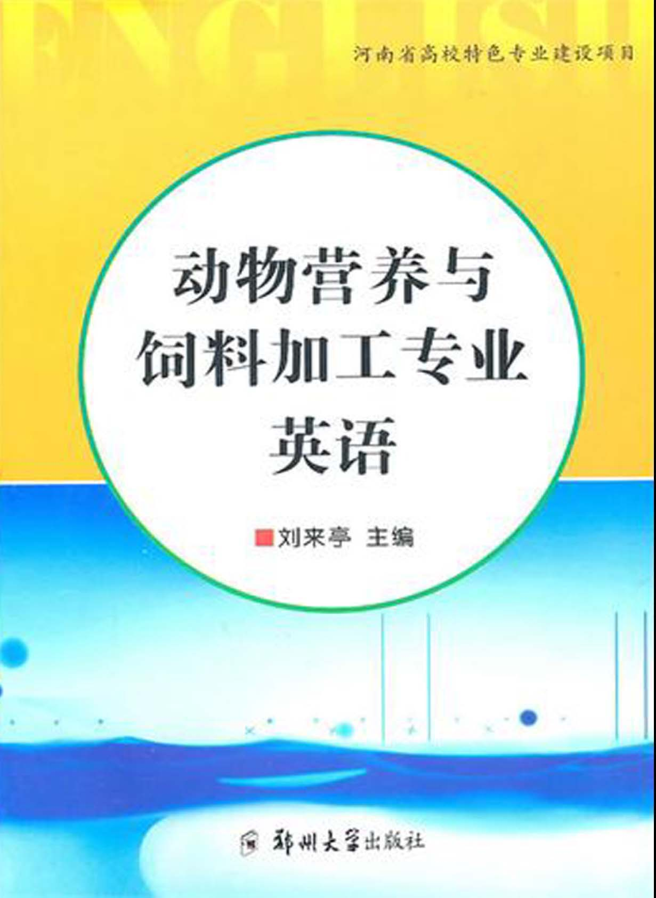
 
前言

我国饲料工业从20世纪70年代起步，现在已经发展成为颇具规模的，跨部门、跨行业、跨学科的综合性工业行业。我国饲料产量已稳居世界第二。饲料加工工艺由传统型、通用型向专业化、个性化加工工艺和清洁饲料加工工艺发展。饲料加工厂从小型简易式向大型现代化、专业化发展。饲料加工装备大为改观，从引进、消化、吸收国外的先进成套设备，到自主创新拥有自主知识产权，成为世界饲料机械的出口大国。

饲料安全等同于食品安全的理念逐渐为人们所接受，标志着中国饲料工业的发展，将由偏重产量增长向产量、质量并重发展。安全、优质、高效将是饲料工业发展的主旋律。鉴于此，饲料工业人才培养的问题，显得十分重要。发达国家在动物营养与饲料科学的基础研究方面投入大，系统研究深入，饲料科学研究处于领先水平。本书主要涉及世界饲料工业发展趋势，动物基本消化生理，饲料学，饲料加工设备和饲料加工工艺以及科技英语翻译和写作基础等内容。在编写时，为扩大学生的专业词汇和知识面，力求将每部分主要内容写出，并对每一部分选择性给出一篇译文。在每部分之后，归纳和整理了该部分的专业术语和专业词汇，以供学习者参考和查阅。

由于我们编写水平有限，编写时间仓促，书中难免存在缺点和不足之处，敬请专家和读者提出宝贵意见。

编者

2010年10月

内容提要

本书共八个部分，主要涉及世界饲料、工业发展趋势、动物基本消化生理、基本动物营养原理、饲料学基础、饲料添加剂、饲料加工设备和饲料加工工艺以及科技英语翻译和写作基础。本书为动物科学专业、畜产品加工类专业、机电工程专业高职、高专生、本科生专业英语教材及相关课程双语教学用参考，亦可为动物科学与饲料科学专业研究生和饲料工程技术人员提供一些参考。

Part 1　The World Feed Industry Fact

Lesson 1　Top25Feed Manufacturers Worldwide in2005

The world's top25feed manufacturing firms currently supply only about20%of the world's industrial or manufactured animal feed（Table1-1）.The top five firms supply only about8%.So,feed manufacturing on the global scale remains broadly based with diverse ownership,despite more than a decade of strong consolidation and the growth of feed manufacturing among vertically integrated food companies.By contrast,the world's top five feed manufacturing countries-USA,China,Brazil,Japan and Mexico-produce nearly50%of all industrial feed.

Vertical integration through food companies involved in the animal and feed industries persists as a dominant trend,despite diversification of niche markets for local production and speciality like organic and other certified livestock farming.Along with vertical integration come larger scale operations,such that Feed International currently estimates that only about3000feed plants now manufacture some80%of the world’s industrial feed.Products for poultry represent roughly38%of total industrial feed tonnage,followed by products for pigs（32%），dairy cattle（17%），beef cattle（7%），finfish and shellfish（3%）and other species（3%）.

Commercial and cooperative feed companies increasingly contract their feed manufacturing skills and production capacity to integrators.Integrators are better able to adopt“food chain management”，including technologically sophisticated process control and HACCP procedures,as well as feed ingredient traceability and downstream feed product traceability.They can achieve more consistent,reliable,measurable quality parameters in the final food product,although the feed component may be of lower quality than a comparable commercial product.

Total global feed output is estimated for2004at nearly615million metric tons（mmt）—slightly above2003and well above the previous production record of605mmt set in1997during the Asian economic boom.The Asian recovery was slowed in2004by“bird flu”—highly pathogenic avian influenza（H5N1strain）—but had resumed by early2005.Bird flu outbreaks in China and Southeast Asia continue to represent a significant threat to public and animal health and now are a risk in Europe,due to transmission by migratory waterfowl across the Asian continent.Not confronted with bird flu,South American broiler chicken producers have continued to expand production,elevating feed production,especially in Brazil and Argentina.

Carryover stocks of key feedstuffs were generally lower around the world in200304and dipped to very low levels during200405，but with relatively less volatile protein and energy feedstuffs prices than the previous year.Even with a large USA maize harvest,the global grain stockstouse ration may remain below18%，compared with twice that a decade ago.Thus,shortterm changes in China’s grain,oilseed and oilmeal importexport balance continue to have significant market effects in2005.Adding uncertainty at present is the destructive effects of Hurricane Katrina on the USA’s major grain trade through New Orleans.Even while China may gain some grain productivity,the era of large global grain surpluses may be passed.

The advance of the Codex Alimentary international feed law supports the growing“internationalization”of food production and consumption.But the metamorphosis to a single system of international accepted“safe feed”determination is far from complete.As it develops,the“top25companies”must be among the leaders to shape future feed sourcing,production,and distribution.

参考译文

2005年全球排名前25位饲料企业

全球排名前25位饲料企业（表1-1）的工业饲料产量现约占世界总产量的20%，排名前5位企业的工业饲料产量仅占世界总产量的8%左右。因此，尽管一条龙食品企业中的饲料企业经过10多年的发展和强势整合，全球饲料产量仍然由所有制形式多种多样的众多企业所贡献。相比之下，全球排名前5位的饲料生产国，即美国、中国、巴西、日本和墨西哥的工业饲料产量几乎占全球总产量的50%。

尽管因为追随机会市场而使局部地区的生产呈现多样化，以及存在有机化和其他批准的专业化畜牧企业等问题，但是统筹畜牧和饲料业生产、实现一条龙生产的食品企业已成为主流。随着一条龙生产的发展，企业规模的扩大，《国际饲料》杂志预计：全球3000家饲料企业的产量约占全球工业饲料总产量的80%，全球禽用饲料占饲料总产量的38%左右，接下来是猪饲料32%、奶牛饲料17%、肉牛饲料7%、有鳍鱼和甲壳类鱼饲料3%和其他类饲料3%。

商业和合营饲料企业现在都倾向于把生产技术和饲料产量承包给一条龙企业。一条龙企业采用良好的“食品链管理”模式，包括技术先进的工艺控制和HACCP关键点控制，以及饲料原料的可追溯和下游饲料产品的质量跟踪制度，从而保证成品的质量参数稳定、可靠、可测，尽管其饲料成分可能相对比商业产品的质量稍低一些。

2004年，全球饲料总产量约为6.15亿t，比2003年略有增加，超过了1997年亚洲金融危机期间的产量6.05亿t。亚洲饲料生产在2004年因“高致病性禽流感”缓慢复苏，到2005年初恢复正常。在中国和东南亚暴发的禽流感仍旧威胁公众和动物健康。由于水禽的迁徙及传播，欧洲也面临同样的危险。由于南美洲（特别是巴西和阿根廷）未受禽流感影响，其肉鸡产量的持续增长使得饲料产量得以提升。

2003～2004年，全球主要饲料原料的库存总体较低，并在2004～2005年度跌到较低水平，但蛋白质和能量饲料价格比上一年稳定些。虽然美国玉米大丰收，但全球粮食库存需要量比率仍可能低于18%，是10年前的一半。因此，中国粮食、油籽和油粕进出口平衡的波动变化在2005年仍旧给全球市场带来了重大影响。而卡特丽娜飓风对美国重要谷物贸易市场新奥尔良港毁灭性的破坏更增加了不确定因素。虽然中国粮食产量可能增加，但全球粮食大量过剩的时代将不再。

《食品法典》等饲料法律的推行为食品生产和消费增长起到了积极的促进作用。但是，要达到统一的、国际公认的“安全饲料”标准远远不够。随着全球饲料产业的发展，排名前25位的饲料企业将在未来饲料的原料采购、生产和销售格局形成过程中扮演主要角色。

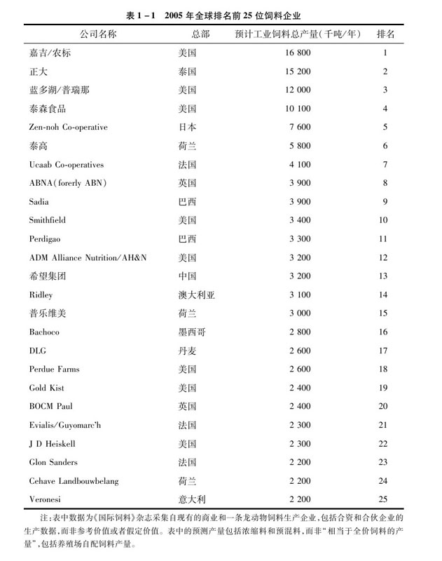

Lesson 2　Frontiers in Feed Manufacturing

There is a strengthening trend to develop feed manufacturing systems and procedures that could,to a large extent,eliminate microbial contamination of feed.The overall concept is to provide the animal a feedstuff that is free from any pathogens that could harm human health.There are two methods in accomplishing the task of feed sterilization：feed processing and chemical treatment.Each method has its own advantages and disadvantages.

There is considerable work occurring in Canada evaluating new technologies to combat microbial loads in feed.Feed companies that are actively sterilizing feed are utilizing advanced conditioning techniques combined with sterile air cooling systems.The theory is that once the pellets leave the pellet mill and are cooled by the sterilized air,downstream microbial contamination of the feed is minimal.Typically,plants that adopt this strategy require a strong QA programmer to detect microbial loads in the mill and finished feed,as well as a HACCP（Hazard Analysis and Critical Control Points）approach to plant operations.

Feed Processing

It is the feed processing approach that is renewing some interest in expansion and other highshear conditioning techniques.While the data in public literature regarding the impact of expansion on pellet quality has been mixed,there is strong evidence to support the contention that expanders are effective at sterilizing feeds.

Chemical Treatment

Another opportunity for the sterilization of feed is chemical treatment.There are currently several suppliers that offer acid or aldehyde based sterilizing agents.The theory is to apply the sterilizing agents to the feed at the mixer.Due to the chemical nature of the compounds,heat stability is not a concern and adequate feed sterility is maintained throughout the process.

feed manufacturers may ignore downstream control points with the erroneous assumption that sterility is maintained in the entire process once the chemicals are added.There is little doubt that strategies,such as sterile air systems,will need to be employed along with chemical sterilizers to ensure continued downstream sterilization.

Formulating for Pellet Quality

The most exciting advance in recent memory is the development of statistical models to predict pellet quality.For many years,feed manufacturers have hypothesis that formulation for pellet quality may be possible.Previous data,however,would suggest that pellet quality is dependent on a large number of independent variables that may,or may not,interact with each other.The model would possibly be nonlinear in nature,which is a concern from a field application mindset.

The idea of formulating for pellet quality is a reality that was first published by Wood in1987.He demonstrated that feed ingredients with proteins in the native state exhibited strong gelling and binding properties.Wood demonstrated that by simply using protein in the native state,durability was maximized,regardless of the percentage of pregelatinized starch in the ration or the use of steam conditioning.In contrast,diets with denatured protein significantly increased in durability when pregelatinized starch was added to the diet.

Together with some colleagues I have found that increasing the percentage of amylopectin in sorghum grain linearly increased the durability of the ration.This data would suggest that the composition of native starch may play a role in the durability of pellets.

Other researchers（Cavalcanti and Behnke）recently demonstrated,using response surface methodology,that pellet quality can be predicted based on the compositional properties of corn and other ingredients blended at varying ratios.The authors concluded that pellet quality was positively impacted by the level of soybean meal in the ration；this result is opposite of what Wood（1987）reported.As such,further research needs to be conducted to further elucidate the functional characteristics of ingredients and how they relate to pellet quality.

Lesson 3　Future Demand for Meat and Meat Product

Change in Ethical Views

In Europe and North America,producers of meat from pigs,poultry and cattle are in fierce competition with each other.The response of the industry has been to intensify and use every possible device to secure a share of the market by supplying the cheapest possible product at an acceptable quality.The pursuit of low cost has,however,damaged the image of intensive production in the eyes of the public.

Some systems of production are so intensive that they are perceived as unduly repressive,and beyond the bounds of reasonable human behavior towards animals.Even within those countries where welfare of livestock is an important issue,some producers have been reluctant to move towards those systems which are widely regarded as offering improved welfare,sometimes on the grounds of cost,but sadly in a few instances because the producers are insensitive to the arguments and do not see the future consequences of their failure to react.

Politicians in different countries may eventually consider it necessary to introduce legislation which greatly limits what a farmer is allowed to do on a livestock unit.To ensure that farmers conform will then require some form of inspection and licensing.Unresponsive farmers may find themselves unable to continue in stock farming and,much as they might regard such measures as undue interference in their chosen way of life,they will perhaps find very little sympathy from the general public.

Fat Consumption

The switch from accepting that fat contributes substantially to the flavour and eating quality of meat and to the satisfaction derived from the meal as a whole to the view that almost any visible fat is verging on the immoral has been nothing short of a revolution.Its effects on production and processing methods have been profound,and it will continue to dominate the argument about the role of meat in human health.It is of little importance whether the arguments are right or wrong or exaggerated,if the balance of demand has swung to meat products which have virtually no fat.There is no sign that this trend is going to be significantly reversed,although there are some counter arguments.For example,it has been claimed that meat from very lean pigs lacks succulence because it lacks intramuscular fat,that is,fat actually within the muscle.

Lesson 4　Organic Animal Husbandry：the Future Challenges

Creating sustainable agro ecosystems is the main aim of organic farming.Although animals play a critical role,and their welfare considered important,this element of organic farming has not been a major focus of research.The research that has been conducted has tended to concentrate on the disease status of animals,and how this is influenced by standards.This tendency is perhaps understandable,given the measurable nature of disease and the less distinct definition of animal welfare.Also,the economic consequences of health and disease problems are what tend to trouble the converting farmer.

The philosophical framework of organic farming is the source of several dilemmas in relation to animal welfare that need to be confronted.The fact that we can achieve this has not been well documented,and the practical implications of this concept of animal welfare have not been discussed sufficiently.This presents us with complex and demanding challenge.

Standards and development of good practice standards are becoming ever more stringent as various derogations are lifted.At the same time,there is growing pressure from the farming lobby and some retailers,particularly among new entrants,to be more flexible and lenient.Increasingly,it seems that being organic means fulfilling the legal requirements.This misses an important point：meeting them does not by itself guarantee that one is a good organic farmer.

In the more marginal areas,such as mountainous regions,single enterprise systems may be the only option.Although they have only one enterprise,they often function within a nearly natural environment,and the integration here is not agricultural but ecological.With this in mind,the focus in the development on organic farms moves from simple input substitution to redesign of the system.Current organic standards and certification procedures have been blamed for fostering the former at the expense of the latter,because they tend to be goalorientated and inflexible and do not encourage a continuous improvement in animal welfare.Yet,continuous improvement is required to achieve real change.

Codes of practice adopted by many private organic certification bodies allow a moreflexible approach,and could be used to achieve the underlying aims of organic principles.To foster this,the standards should not only be quantitative,but should also be sufficiently flexible to result in a system that the animal easily fits into.Although standards aim to achieve a desired level of health promoting actions by the farmer,they should also be motivational.Should farmers simply be instructed to comply with the standards,or should they be helped and encouraged through a process of participation involving advisers,certification bodies and researchers？

This is a major challenge,because current developments in Europe seem to be driving organic certification in the opposite direction,with legislative requirements of quality assurance demanding clearer demarcation between farms and their certification bodies that traditionally acted as development partners in organic farming.Also,by making the standards into EU legislation,they not only face the challenge of having to fit all kinds of geographical,traditional and climatic contexts.They also become much more difficult to change（a fact that has been pointed out by IFOAM as a major problem for organic farming）.As a result,there is a growing risk of organic farming becoming too bureaucratic and prescriptive,resulting in substantial loss of the innovation and creativity of the pioneer generation.

Lesson 5　Current and Future Challenges in Aquaculture

Major challenges in aquaculture have been documented recently.In addition to declines in captive fisheries,other challenges include resource and environmental（“sustainability”）issues,investment and development assistance,improvements in technology,policy and regulation matters and the public image of aquaculture.Clearly,further aquaculture development must be sustained by basic and applied research and development in all the major fields of health management,nutrition,genetics,culture systems management,quality and product handling and socioeconomics.

Several additional points are worth noting：（a）Aquaculture practices must recognize basic ecological principles in farm management practices.（b）Greater attention must be given to increased cultivation of herbivorous/omnivorous fish species that are less demanding in terms of their dietary nutrient requirements.An example of this is seen with tilapia that has been shown to utilize diets with minimal amounts of animal＆nbsp；protein,especially fish meal.（c）Care must be taken with intensification（increased biomass/unit area）practices to avoid introduction of stress factors that can result in disease problems and serious mortalities.（d）Major attention must be given to aquaculture product quality,together with careful analysis of available markets and consumer response.

Clearly,global aquaculture is a growthoriented industry now comprising a significant part of global fisheries.Farmed species such as penaeid shrimp and salmon are but two examples of the economic importance of aquaculture.In countries such as China,species of carp are a traditional major source of animal protein for human needs.Technological advances have accelerated improvements in production yields,with increased attention being given to product quality and sound culture practices.Composite scientific and commercial interests are regularly contributing to an acceleration of global aquaculture,portending notable contributions of this industry in the forthcoming century.

Trends in global aquaculture will see increased emphasis on quality assurance programs along with establishment of product quality standards.Attention will be given to consumer demand for fresh aquaculture products,such as that evident in tilapia culture in Latin American countries.Market acceptability of cultured animals compared to that of wild catch is correlated with selective harvesting practices according to processing/market demands as well as control over quality/size of products for particular markets.In addition,specific properties of properly raised farmed fish may include those of softer textured meat,milder and less robust fish flavor and differences in color/appearance of the skin or flesh of aquacultureraised animals.This latter attribute can be readily seen in farmraised salmonid species.

Vocabulary

aldehyde　[化]醛，乙醛

amine　[化]胺

amylopectin　[生化]支链淀粉，胶淀粉

animal industry畜牧业

antagonism　拮抗物，拮抗作用

antibiotic　抗生素

antioxidant　[化]抗氧化剂

aquaculture水产业

aquatic products水产品

arginine　[化]精氨酸

ascites　[医]腹水

bacterial pathogen细菌性病原体

beef cattle肉牛

binding property黏合性

bioavailability　（药物或营养素的）生物利用度

bird flu禽流感

broiler chicken肉鸡

BSE abbr.疯牛病

cardiac failure[医]心力衰竭

carnivore　食肉动物

cellular membrane细胞膜

cellulose　[生化]木纤维质酵素，纤维素酶

cobalt　[化]钴

crustacean甲壳类的甲壳类

cystine　[生化]胱氨酸

dairy牛奶场，奶品场

dairy cattle乳牛，乳畜，奶牛

digestibility　消化性

equine　马的，像马的

FAO联合国粮食与农业组织

fatty acids脂肪酸

feces　粪，屎，渣滓

feedlot　饲育场

feedstuff饲料，饲料中的营养成分

finfish　[动]长须鲸

free radical[化]自由基，游离基

gelatin　凝胶，白明胶

glutathione peroxidase谷胱甘肽过氧化物酶

growth promoter生长促进剂

gut内脏，肠

hatchery　（尤指鱼的）孵化场

hemicellulase　半纤维素酶

herbivorous　食草的

highly pathogenic avian influenza高致病性禽流感

intestinal microbe肠道微生物

isoleucine　[生化]异亮氨酸

lean　瘦肉

leucine　[生化]亮氨酸

livestock　家畜，牲畜

lysine　赖氨酸

mammalian　哺乳动物哺乳动物的

metabolism　[生物]新陈代谢

methane　[化]甲烷，沼气

methionine　[生化]蛋氨酸，甲硫氨酸

niacin　烟酸的商品名

nonstarch polysaccharide非淀粉多糖

oilseed meal油籽粉

omnivorous　杂食的

oxidative　[化]氧化的，具有氧化特性的

phytate acid植酸

pantothenic　[化]泛酸的

pathogens　病原体（物）

peroxide　[化]过氧化物

phenylalanine　苯丙氨酸

phosphorus　磷

phytase　肌醇六磷酸酶，植酸酶

poultry　家禽

premix　预混合料

riboflavin　[生化]核黄素

ruminant　反刍动物

salmon　[鱼]鲑鱼，大麻哈鱼，鲜肉色

selenium　[化]硒

shellfish　贝，甲壳类动物

shrimp　小虾　捕虾

slaughter　屠宰　屠宰

sorghum　[植]高粱属的植物，高粱糖浆

sow　大母猪

starch　淀粉

succulence鲜美多汁，青饲料

syndrome　综合病症

thiamin　[生化]硫胺（维生素B 1 ）

threonine　[生化]苏氨酸

tilapia　[鱼]罗非鱼

toxicity　毒性

tryptophan　[生化]色氨酸

tyrosine　[生化]酪氨酸

urine　尿

valine　[生化]缬氨酸

veterinarian　兽医

veterinary　兽医兽医的

vitamine　维生素

yeast　酵母，发酵粉

yogurt　（=yoghurt）酸奶酪

zinc[化]锌

Part 2　Basic Animal Digestive Physiology

Lesson 1　Digestion and Metabolism in the Rumen

In sheep and other ruminants,the exposure of ingested food to the metabolic activities of ruminal bacteria,protozoa and fungi has profound implications for the digestion and metabolism of food.Plant carbohydrates,usually the major sources of energy in ruminant diets,are largely fermented to shortchain fatty acids（SCFA）.These consist mainly of acetate,propionate and butyrate and are readily absorbed from the rumen and metabolized in tissues to support maintenance and production.The degradation ofβlinked glucose polymers（cellulose and hemicellulose）from plant cell walls is of obvious nutritional benefit,since these materials are not hydrolysed by the endogenous enzymes of the host animal.In contrast,the ready fermentation of starch and otherαlinked glucose polymers,which are potential sources of glucose if they reach the small intestine（SI），implies that only small amounts of glucose are absorbed from the SI.

Complex dietary lipids are rapidly hydrolysed in the rumen by bacterial lipases,with the production of free fatty acids.These are largely unsaturated and undergo extensive biohydrogenation,which accounts for the relative hardness of ruminant carcass fat,and for the difficulty in changing the degree of unsaturation of the fatty acids of carcass fat and milk fat by dietary manipulation.

The fate of dietary protein in the rumen is a further striking example of the impact of rumen microorganisms on digestion and metabolism.Whereas in nonruminants the quality of dietary protein largely depends on its amino acid（s）（AA）composition and digestibility,in ruminants dietary protein is substantially,but rarely completely,degraded by microbial activity,with the formation of ammonia.Part of this ammonia,together with peptides and free AA produced during its formation,are utilized by ruminal microorganisms for protein synthesis,the energy for cell growth being provided by the anaerobic fermentation of organic matter.The remainder of the ammonia produced in the rumen is absorbed,and a varying proportion returned to the rumen as urea in saliva.This urea is rapidly broken down to ammonia to become available as a nitrogen source for autotrophic microorganisms.These processes mean that the AA reaching the SI are largely provided by undegraded food protein and microbial protein.The postruminal digestion of protein and,indeed,the utilization of absorbed AA in tissues are qualitatively similar in ruminants and nonruminants.

The maintenance of a healthy rumen ecosystem is a prerequisite of ruminant nutrition,because the digestion of the cellulose/hemicellulose,the major sources of energy in foragebased ruminant diets,depends on the activities of the microflora.In this context,active microbial growth can only occur if adequate amounts of energy substrates,nitrogen sources and other minerals and growth factors are simultaneously present in the medium：this condition has been referred to as“synchrony of nutrient supply”.The greatest threat to the stability of the ecosystem is increased rumen acidity,since rumen pH has a major influence on the type and number of microflora.In particular,below pH6.0the growth of cellulolytic bacteria is inhibited,and rates of cellulose/hemicellulose digestion fall.In practice,major changes in diet should be gradually introduced over7to10days to allow the rumen microflora to adapt to the new substrates.

参考译文

瘤胃消化与代谢

绵羊和其他反刍动物所摄食的饲料与有代谢活性的瘤胃细菌、原虫和真菌的接触对食物的消化和代谢有重要作用。植物碳水化合物通常是反刍动物能量的主要来源，其大部分被瘤胃发酵降解成短链脂肪酸，主要包括乙酸、丙酸和丁酸，它们很容易被瘤胃吸收，并且通过组织代谢来满足和维持生产需要。植物细胞壁的含葡聚糖（纤维素和半纤维素）降解具有重要营养作用，因为这些物质不能被宿主动物内源酶水解。比较而言，如果淀粉和其他α-链葡聚糖能到达小肠就能成为潜在的糖源，然而它们易于在瘤胃发酵。这就表明，仅有一小部分糖在小肠被吸收。

复杂的日粮脂类在瘤胃中很容易被细菌脂酶水解，产生游离脂肪酸。这些游离脂肪酸主要是不饱和脂肪酸，并且要经过大量生物氢化，这解释了造成反刍动物胴体脂肪相对较硬，通过日粮控制很难改变胴体和奶中的脂肪不饱和度的原因。

瘤胃中日粮蛋白的去向，是用来说明瘤胃微生物对消化和代谢的影响一个比较突出的例子。对于非反刍动物，日粮蛋白的质量主要取决于氨基酸组成和消化性；对于反刍动物来说，饲料中的蛋白大部分被微生物降解形成氨。部分氨与降解产生的肽和游离氨基酸被瘤胃微生物利用合成蛋白，细胞生长所需的能量通过有机物厌氧发酵提供，瘤胃中剩余的氨被吸收。另一部分氨以唾液中尿素的形式返回到瘤胃，尿素被迅速降解成氨，形成微生物可利用氮源。这些过程意味着到达小肠的氨基酸大部分是由未降解饲料蛋白和微生物蛋白所提供。对反刍动物和非反刍动物来说，蛋白质在瘤胃消化后和可吸收的氨基酸在组织中的利用非常相似。

瘤胃营养是维持瘤胃生态系统健康的先决条件。因为反刍动物以牧草为生存的基本条件，日粮纤维素或半纤维素降解是主要能量来源，而这个过程依靠微生物活性。活性微生物只有当介质中同时存在充足的能量物质、氮源、矿物元素和生长因子时才会生长，这个条件被称为“营养物供应的同步性”。瘤胃酸度增加是对瘤胃生态系统稳定的最大威胁，因为pH值对微生物种类和数量有很大的影响。特别是当pH值在6.0以下，降解纤维素细菌的生长受到抑制，纤维素或半纤维素消化率下降。实践中，为了让瘤胃微生物适应新的物质，日粮的重大变化应该在7～10d内逐渐改变。

Lesson 2　The Digestive System of Ruminants

True ruminants include sheep,cattle and goats.The digestive tract is composed of the mouth,tongue,teeth,esophagus,stomach,small and large intestines.Many people say the ruminant has four stomachs.In fact,a ruminant has only one stomach,but with four compartments.The stomach is divided into the reticulum,rumen,omasum and abomasum（Figure2-1）.

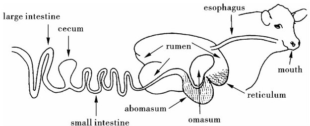
 Figure2-1The digestive system of ruminant 
Mouth and Esophagus

This is the location where food enters the system and is chewed.Salivary glands are found in the mouth.They secrete saliva which has a pH of about8.2.Saliva helps to reduce acidity in the rumen and also aids in the transfer of food（ingesta）from the mouth to the rumen via the esophagus.

Reticulorumen（Reticulum and Rumen）

Reticulum and rumen are often discussed together since each compartment is separated by a low partition.80%of the capacity of the stomach is related to the reticulorumen.The contents of the reticulum and rumen intermix freely.The wall of the reticulum is honeycomb in structure and is often the location where hardware will be found.Magnets are located in this area to reduce the effects of hardware disease.The rumen is the main fermentation vat where billions of microorganisms attack and break down the relatively indigestible feed components of the ruminant’s diet.This segment of the digestive system is one of the most important parts when considering the feeding of beef,sheep,dairy and goats.

Omasum

After fermentation in the reticulum and rumen,the feed passes to the omasum.While the function of the omasum is not entirely clear,it acts as a filter pump to sort liquid and fine food particles.Coarse fibre particles are not allowed to enter the omasum.Also,the omasum may be the site for absorption of water,minerals and nitrogen.Abomasum The abomasum is the true stomach and the only site on the digestive tract that produces gastric juices（hydrochloric acid and the enzymes,pepsin and rennin）.In the newborn calf,the abomasum makes up about80%of the total stomach volume,while in the mature cow it amounts to only10%.Ingesta only remains here for1to2hours.Small Intestine and Large Intestine The small intestine is the location where a further breakdown of the food material occurs.Secretion of enzymes,pancreatic juice and bile,aid in further digestion of the ingesta.This generally occurs in the upper portions of the intestine.The end products of the digestion process are absorbed in the lower section of the small intestine.When we refer to bypass protens and fats,it is here that these proteins and fats have their positive nutritional effects.The large intestine is where residues of the ingested feed are deposited.Feed residues do undergo some fermentation.There are absorption sites for water,minerals and nitrogen.

Lesson 3　The Digestive Tract of Poultry

Any animal can be thought of as a biological“machine”that converts raw materials into a finished product：in the case of poultry feed into meat and eggs；in the case of humans,food into happy,healthy,productive world citizens.The digestive system is the doorway through which nutrients,electrolytes,and fluids enter the body.The digestive tract also provides a protective barrier against entrance of toxic substances and infectious agents.Feed will pass,in order,through the following parts of the birds digestive tract：mouth,esophagus,crop,lower esophagus,proventriculus（glandular stomach），gizzard（muscular stomach），small intestine,ceca,large intestine（rectum），and cloaca（Figure2-2）.

Mouth and Esophagus

A distinctive characteristic of birds is the absence of lips and teeth.Instead,the bird has a hard beak that can be used for grasping,tearing,and scooping food.The digestive system works very efficiently in handling various types of food materials.The tongue contains the hyoid bone hinge at the lower jaw,and is pointed at the anterior tip with several barbed points projecting posteriorly on each side.Since the bird cannot swallow,the tongue moves back and forth forcing food down the esophagus.

There are a few saliva glands in the mouth that contribute some moisture to the feed at this point.The esophagus（gullet）is part of the tube that conveys feed from the mouth to the stomach.The crop,located in the lower neck area,provides storage for food materials hastily consumed by the bird.Here food is moistened and softened with little if any digestion occurs.The food particles move from the crop to the posterior section of the esophagus and into the glandular stomach（proventriculus）where the firstsignificant amounts of digestive juices are added.Then food particles move rapidly into the muscular stomach（gizzard）where physical breakdown starts.Gizzards are highly muscular organs used for grinding and mixing feed materials in preparation for digestion.

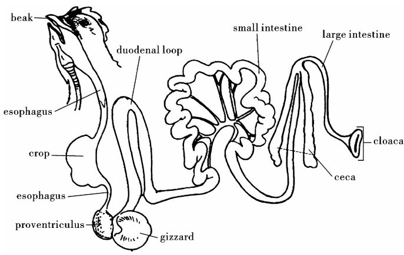
 Figure2-2The digestive system of poultry 
Small intestine and large intestine

Feed leaving the gizzard passes into the duodenal loop of the upper small intestine.The liver produces bile that is temporarily stored in the gall bladder.From the gall bladder,bile mixes with the food slurry as it passes into the next part of the small intestine.In the duodenal loop digestion starts as the pancreas secretes digestive enzymes.In the remaining area of the small intestine the digestive process is completed and absorption of nutrients takes place.The small intestine in a mature chicken is over4.5feet in length and terminates at its juncture with the large intestine.The large intestine is relatively short,only about4inches in length,terminating at the cloaca.The ceca consists of two pouches that fill and empty from the same direction.Their main function is associated with breakdown of fiber,although chickens and turkeys cannot utilize large amounts commonly associated with some poultry diets.The major functions of the large intestine are storage of undigested waste material and absorption of water from their content.

The cloaca is the common chamber into which the digestive,urinary,and reproductive tracts open.Its opening at the posterior end of the bird is known as the vent.When the bird eliminates fecal waste from its digestive tract,the cloaca actually folds back at the vent allowing the rectal opening of the large intestine to push out,closing thereproductive opening.Thus,there is minimal chance of fecal wastes contaminating the reproductive system.An understanding of the structures and function of the digestive tract of the bird is important to understand the need for highly specialized diets：low in fiber and containing all the necessary nutrients in adequate amounts that are relatively easy to digest.

Lesson 4　The Digestive Tract of the Pig

The porcine digestive system comprises the mouth,the pharynx,the esophagus,the stomach,small and large intestines,and several accessory glands（Figure2-3）.The small intestine consists of duodenum,jejunum,and ileum,and the large intestine is composed of cecum,colon,and rectum.The accessory glands of the porcine digestive system are the salivary glands,the liver,and the pancreas that release their secretions into the alimentary lumen.

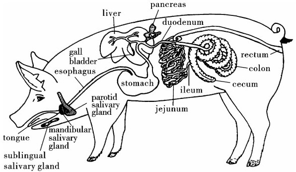
 Figure2-3The digestive system of the pig 
The Mouth and Salivary Glands

The pig has a long oral cavity.The length of a pig's oral cavity varies with the breed.The upper lip is short and thick and is blended with the snout.The lower lip is small and pointed.The pig has an elongated and narrow tongue.The porcine oral cavity is lined by a simple stratified squamous epithelium.Saliva is secreted from three major salivary glands：the parotid glands,the mandibular（submaxillary）glands and the sublingual glands,plus a number of minor glands（labial,lingual,buccal,and palatine glands）found in the mouth.The parotid and mandibular glands each have major ducts draining their secretions into the oral cavity.The sublingual glands have numerous openings through the mouth floor just ventrolateral to the tongue.The minor glands in the mucous membrane also have many excretory ducts emptying into the oral cavity.

The Pharynx and Esophagus

The pharynx of the pig is long and narrow,and extends to the level of the second cervical vertebra.The short and straight esophagus originates from the caudal border of the caudal pharyngeal constrictors.The esophagus is lined with stratified squamous epithelium,beneath which are tubu loacinar mucous glands.Esophageal glands are abundant and packed closely in the cranial half of the esophagus but occur in reduced number in the caudal half of the esophagus.From the esophagus through the rectum,feed bolus manipulation in the pig is wholly involuntary.

The Stomach

The stomach of the pig is compartmentalized into four distinct mucosal regions that differ in appearance and structure.The esophageal region（pars esophagea）is nonglandulat and it is an extension of the esophagus into the stomach proper.Adjacent to the esophageal region is the cardiac gland region,which occupies about one third of the total luminal surface area and is pale gray in color.The fundic（proper gastric）gland region has a brownish red,mottled appearance,and it also lines one third of the stomach,lying between the cardiac and pyloric regions.The palelooking pyloric gland region is the last region of the stomach before entry into the small intestine.The cardiac glands have mucous cells that elaborate mucus,proteases,and lipase.Three types of secretory cells exist in fundic glands and each produce a separate secretion.The three fundic secretory cells are mucous neck cells that elaborate mucus and proteases,parietal（oxyntic）cells that produce HCl,and chief cells that secrete proteases.Mucous neck cells and chief cells,but not parietal cells,are also found in pyloric glands.However,the predominant cell in pyloric glands is the mucous secreting cell.

The Liver

The porcine liver has four principal lobes-left lateral,left medial,right medial,and right lateral lobes,along with a small quadrate lobe and a caudate process.The functional units of the liver are lobules.The basic structure of a pig's hepatic lobule is presented in Figure2-3.The lobules are composed of plates of hepatocytes interdigitated between anastomotic hepatic sinusoids.Bile produced by hepatocytes drains peripherally into bile canaliculi formed by hepatocytes and then through ducts of hering to the interlobular bile ducts in the portal triad.The interlobular bile ducts merge to form larger intrahepatic ducts.The latter become the extrahepatic biliary system that includes the hepatic bile duct,which divides into a cystic duct connecting to the gallbladder,and a common bile duct connecting to the duodenum.The common bile duct opens into the duodenum at2to5cm from the pyloric sphincter on the major duodenal papilla.

The Pancreas

The porcine pancreas is composed of a large left lobe and a small right lobe connected by a centrally placed body which surrounds the portal vein.The pig has only the accessory pancreatic duct.The duct leaves the right lobe of the pancreas and terminates at the minor duodenal papilla in the descending duodenum20to25cm distal to the pylorus.The pancreas is a mixed exocrine and endocrine organ.The exocrine pancreatic components are the acinus and the duct system.The acinus represents95%of the exocrine pancreatic tissue and is composed of acinar cells that produce and store various pancreatic enzymes and zymogens.When stimulated,the acinar cells release enzymes and zymogens into the acinus lumen for transport to the duodenum through the duct system.The centroacinar cells and cells lining the intercalated and intralobular ducts contribute water,bicarbonate,and other electrolytes to pancreatic juice.The endocrine constituents of the pancreas are located in the islets of langerhans and account for＜5%of the fresh weight of the organ.The islets are distributed uniformly throughout the exocrine acinar tissue.Encapsulated in the islets are four major endocrine cells：glucagonsynthesizing A cells,insulinsynthesizing B cells,somatostatinsynthesizing D cells,and pancreatic polypeptidesynthesizing PP cells.

The Small Intestine

The small intestine consists of duodenum,jejunum,and ileum.In the fully grown pig,the small intestine is16to21m long,of which4%to5%is duodenum，88%to91%is jejunum,and4%to5%is ileum.The small intestine of newborn pigs is2to4m in length.The proportion of duodenum in the neonate is similar to that in the adult,but the differentiation of jejunum and ileum is not clear.The duodenum is the location where digesta from the stomach mixes with secretions of the intestine,liver,and pancreas.Bile is ducted into the duodenum on a major papilla2to5cm from the stomach pylorus,and pancreatic juice enters the intestine on a minor papilla12to20cm posterior to bile entry.The jejunum is long and comprises a large number of small loops.The ileum can be identified from jejunum by its slightly thicker muscular coats and junction with the large intestine.Although there are distinctive morphological features among the duodenum,jejunum,and ileum,they share many common features.

The Large Intestine

Compared with most nonruminant omnivores,pigs have a short cecum and long colon.The large intestine of the fully grown pig averages3.5to6m in length with the first7%to8%as cecum.The cecum is a cylindrical blind sac located at the proximal end of the colon.The length of the colon in adult pigs is only25%of the length of the small intestine but the colon has a physical capacity similar to the entire small intestine.The colon comprises three parts that are termed the ascending,transverse,and descending colons from ileum to rectum,respectively.The first part of the ascending colon presents four complete turns that spiral toward the center of the coil and is termed the centripetal colon.A central flexure permits the spirals to reverse and3.5turns of the ascending colon go out from the coil center giving the centrifugal colon.

Lesson 5　The Digestive System of Fish

The digestive system,in a functional sense,starts at the mouth,with the teeth used to capture prey or collect plant foods.Mouth shape and tooth structure vary greatly in fishes,depending on the kind of food normally eaten.Most fishes are predacious,feeding on small invertebrates or other fishes and have simple conical teeth on the jaws,on at least some of the bones of the roof of the mouth,and on special gill arch structures just in front of the esophagus.The latter are throat teeth.Most predacious fishes swallow their prey whole,and the teeth are used for grasping and holding prey,for orienting prey to be swallowed（head first）and for working the prey toward the esophagus.There are a variety of tooth types in fishes.Some,such as sharks and the piranhas,have cutting teeth for biting chunks out of their victims.A shark’s tooth,although superficially like that of a piranha,appears in many respects to be a modified scale,while that of the piranha is like that of other bony fishes,consisting of dentine and enamel.Parrotfishes have beaklike mouths with short incisorlike teeth for breaking off coral and have heavy pavementlike throat teeth for crushing the coral.Some catfishes have small brushlike teeth,arranged in rows on the jaws,for scraping plant and animal growth from rocks.Many fishes（e.g.，the cyprinidae or minnows）have no jaw teeth at all,but have very strong throat teeth.

to the gill chamber.Once reaching the throat,food enters a short,often greatly distensible esophagus,a simple tube with a muscular wall leading into a stomach.The stomach varies greatly in fishes,depending upon the diet.In most predacious fishes it is a simple straight or curved tube or pouch with a muscular wall and a glandular lining.Food is largely digested here and leaves the stomach in liquid form.Between the stomach and the intestine,ducts enter the digestive tube from the liver and pancreas.The liver is a large,clearly defined organ.The pancreas may be imbedded in it,diffused through it,or broken into small parts spread along some of the intestine.The junction between the stomach and the intestine is marked by a muscular valve.Pyloric ceca（blind sacs）occur in some fishes at this junction and have a digestive or an absorptive function,or both.

The intestine itself is quite variable in length depending upon the diet.It is short in predacious forms,sometimes no longer than the body cavity,but long in herbivorous forms,being coiled and several times longer than the entire length of the fish in some species of South American catfishes.The intestine is primarily an organ for absorbing nutrients into the bloodstream.The larger its internal surface,the greater its absorptive efficiency,and a spiral valve is one method of increasing its absorption surface.

Sharks,rays,chimaeras,lungfishes,surviving chondrosteans,holosteans,and even a few of the more primitive teleosts have a spiral valve or at least traces of it in the intestine.Most modern teleosts have increased the area of the intestinal walls by having numerous folds and villi（fingerlike projections）somewhat like those in man.Undigested substances are passed to the exterior through the anus in most teleost fishes.In lungfishes,sharks,and rays it is first passed through the cloaca,a common cavity receiving the intestinal opening and the ducts from the urogenital system.

Vocabulary

abomasum　皱胃

accessory gland附属腺体

acetate　[化]醋酸盐，醋酸纤维素及其制成的产品

adenosine triphosphate[生化]三磷酸腺苷

albumen　蛋白，[植]胚乳

alkaline　[化]碱的，碱性的

ammonia　[化]氨，氨水

amylase　[生化]淀粉酶

anaerobic fermentation厌氧发酵

anatomy　剖析，解剖学

antibiotics　抗生素，抗生学

antibody　抗体

antigen　抗原

arginine　[化]精氨酸

artificial insemination[生物]人工受孕

autotrophic microorganism自养微生物

bicarbonate　[化]重碳酸盐

bile　胆汁

bovine　似牛的，迟钝的

butyrate　[化]丁酸盐

canine　犬的，似犬的，犬科的

carbohydrate　[化]碳水化合物

carbohydrateprotein糖蛋白

carbon dioxide二氧化碳

carcass　（动物的）尸体

cardiac　心脏的

cardiac gland region贲门腺区

catabolic　[生化]分解代谢的，异化的

catabolism　[生物]异化作用，分解代谢

catfish　鲶鱼

cecum　盲肠

cellulolytic bacteria分解纤维素的细菌

cellulose　纤维素

central vein中央静脉

cervical vertebra颈椎骨

chelated　[化]螯合

chimaera　银鲛

chromosome　染色体

chymotrypsin　胰凝乳蛋白酶，糜蛋白酶

cloaca　泄殖腔

connective tissue结缔组织

constrictor　括约肌

contractile　会缩的，有收缩性的

cysteine　[化]半胱氨酸

deamination　腹泻

duodenal　十二指肠的

duodenum　十二指肠

ecosystem　生态系统

electrolyte　电解，电解液

embryonic development胚胎发育

endocrine　内分泌物内分泌的

endogenous　[生]内长的，内生的

endothelial cell内皮细胞

endotoxin　内毒素

epithelial cell上皮细胞

epithelial layer上皮层

epithelium　上皮，上皮细胞

esophagus　食道

excretory system排泄系统

exocrine　[医]外分泌的

fermentation　发酵

forage　草料，粗饲料

free fatty acid游离脂肪酸

fungal contaminant真菌污染

fungus　真菌

gallbladder　胆囊

gastrointestinal　[解]胃肠道的

gastrointestinal tract胃肠道

gelatinize　（使）成胶状

genotype　基因型

gill cavity鳃腔

gizzard　砂囊，（鸟的）肌胃

glandular stomach腺胃

glucagon　[生化]胰高血糖素

glucose　葡萄糖

glucose polymer葡萄糖聚合物

glutamate　谷氨酸盐

glutamine　谷氨酸盐

glycolytic　[生化]糖分解的

hatch　孵化vt.孵，孵出vi.孵化

hemicellulose　[化]半纤维素

hepatic artery肝动脉

hepatocyte　[解]肝（实质）细胞

herbivorous　食草的

heritability　遗传可能性

heterosis　杂种优势

histochemical　组织化学的

histology　组织学

hormone　激素

host animal宿主动物

hybrid　杂种，杂种的

hydrochloric acid盐酸

hydrogenation　[化]加氢，氢化（作用）

hydrolysis　水解

hypertrophy　[医]肥大，过度生长，过度增大

ileum　[解]回肠

immune system免疫系统

immunosuppression　抑制（生物体的）免疫反应

incubation　孵化

incubation period孵化期；（接种后的微生物）保温培养期

infectious diseases传染病

innervation　神经分布，神经支配，运动感觉，动感

insulin　胰岛素

invertebrate　无脊椎动物

jejunum　[解]空肠

kidney　肾

lactase　乳糖酶

large intestine [解]大肠

lineage　血统，世系

lipase　[化]脂肪酶

lipid　脂质，脂肪

longchain fatty acid长链脂肪酸

lower jaw下颌

lymph nodule淋巴结

lymphatic vessel淋巴管

lymphocyte　淋巴球，淋巴细胞

lymphoid　淋巴的

malabsorption　[医]（营养）吸收障碍，吸收不良

malnutrition　营养失调，营养不良

maltase　[生化]麦芽糖酶

mammal　哺乳动物

mesentery　[解]肠系膜

molar　臼齿

molecular biology分子生物学

morphology　[生物]形态学

mucin　黏液素

mucosa　[解]黏膜

mucous gland[解]黏液腺

multiparous一胎多子的，经产的，非初产的

muscle fibre肌纤维

muscularis mucosa肌膜

myogen　[生化]肌浆蛋白

near infrared近红外

nicotinamide adenine dinucleotide phosphate NADP烟酰胺腺嘌呤二核苷酸辅酸

nitrogen　[化]氮

omasum　[动]重瓣胃

oral cavity口腔

pancreas[解]胰腺

parotid gland[解]腮腺

pepsin　胃蛋白酶，胃液素

peptide　肽

peristalsis　蠕动

pharynx[解]咽

plasma　[解]血浆

porcine　猪的

portal vein门静脉

postnatal　出生后的

predacious　食肉的

pregnant　怀孕的

progesterone　[生化]孕酮，黄体酮

proliferate　增生，扩散

proline　[生化]脯氨酸

propionate　[化]丙酸盐

protease　[生化]蛋白酶

protozoa　原生动物，原形动物

proventriculus　[动]（鸟）前胃，腺胃

rectum　直肠

reproductive（生物）生殖的

reticulum　网胃

rooster　雄禽，公鸡

ruminant　反刍动物

rumen　瘤胃（反刍动物的第一胃）

saliva　唾液

saliva gland唾液腺

secretion　分泌，分泌物（液）

secretory　分泌腺

secretory cell分泌细胞

shortchain fatty acid短链脂肪酸

shrimp　小虾

small intestine小肠

somatostatin　[生化]生长激素抑制素

starch modification淀粉的变性

sublingual gland舌下腺

submucosa[解]黏膜下层

sucrase　[生化]蔗糖酶

sulphate[化]硫酸盐

susceptibility　易感性

threonine　[生化]苏氨酸

toxin　[生化]毒素

unsaturation　未饱和（现象），不饱和

urea　[化]尿素

urinary bladder[解]膀胱

urinary system泌尿系统

αlinked glucose polymerα-葡聚糖

Part 3　Basic Animal Nutrition

Lesson 1　Protein and Amino Acids

Proteins are organic compounds composed of conjugated amino acids in proportions that are characteristic of each protein.This nutrient always contains carbon,hydrogen,oxygen and nitrogen；however,some proteins also contain sulphur,phosphorus and iron.Since most proteins contain about16%nitrogen crude protein of a product can be obtained by determining the nitrogen content and then multiplying that value by6.25（100%÷16%=6.25）.Plants generally contain their protein in actively growing portions,such as leaves and seeds,while animals tend to distribute protein in a wider variety of tissues,such as bones,skin,organs,feathers,scales and muscle.Body protein is constantly undergoing two processes：protein synthesis（anabolism）and protein breakdown（catabolism）.Protein deposition（or loss）equals the amount of protein synthesis minus the amount of protein breakdown.

cannot be synthesized by vertebrates,including fish,and must be supplied in the diet.These essential（indispensable）amino acids are：arginine,histidine,isoleucine,leucine,lysine,methionine,phenylalanine,threonine tryptophan and valine.There are other amino acids that fish can synthesize.These amino acids are termed nonessential（dispensable）amino acids and consist of：alanine,asparagine,aspartic acid,cysteine,cystine,glutamic acid,glutamine,glycine,hydroxyproline,proline,serine and tyrosine.Nonessential amino acids can be synthesized by transfer of an amino group toαketo acids which can be derived from nonprotein sources,such as glucose.

When a particular essential amino acid is deficient in a diet,it is referred to as a limiting amino acid because it limits the synthesis of protein.All of the amino acids needed to synthesize a protein must be available or no synthesis can occur.This is why protein quality is important in fish nutrition.Protein synthesis involves a series of reactions that are specific for each protein.Each protein is manufactured according to the code derived from deoxyribonucleic acid（DNA）a chromosomal component of the cell.Messenger ribonucleic acid（mRNA）transcribes the information from the DNA and brings it to the cytoplasm of the cell as a single strand；transfer RNA（tRNA）carries the specific amino acids to carboxyl（COOH）portion of another amino acid,forming a peptide linkage and releasing water（H2O）.This process of joining amino acids is continued until the specific molecule（protein）encoded by the DNA is produced.Each sequence of amino acids is a different protein and these different proteins accomplish different functions in the body.

Proteins occur in nature in a number of forms that possess unique chemical properties and can be divided into simple proteins and conjugated proteins.Simple proteins consist of only amino acids or their derivatives,while conjugated proteins are joined to other nonprotein substances.Simple proteins consist of the albuminoids,albumins,globulins,hormones and blood proteins,contractile proteins,such as actinmyosin,and keratins.Conjugated proteins include the chromoproteins（combination of a protein and a pigmented substance），lecithoproteins（combination of a protein and lecithin），lipoproteins（combination of a lipid and a protein），metalloproteins（combination of a metal and a protein），nucleoproteins（combination of a nucleic acid and a protein）and phosphoproteins（combination of phosphorus and a protein；the phosphorus is in a form other than phospholipid or nucleic acid）.

Protein requirement is somewhat of a misnomer in that it is actually the requirement for essential amino acids that is important for the proper growth development and health of fish.While crude protein values are important to nutritionist formulating a fish diet,they may not allow the nutritionist to determine the quality of the protein.Gelatin is ahighprotein source；however,it is virtually devoid of tryptophan.Feather meal,while high in protein,is very poorly digested and utilized by fish,resulting in reduced growth if incorporated at high levels in the diet.Thus,it is important to know the amino acid composition and digestibility of a protein source,as well as its total protein content,when formulating a diet.There are some measurements and mathematical equations that one can utilize to quantify protein quality.One such method is to determine the apparent protein utilization（APU）.APU is the amount of protein gain of fish fed an experimental diet,divided by the amount of protein fed.A second means of determining protein quality is the protein efficiency ratio（PER），which is defined as the total weight gain of fish divided by the total protein intake over the period of the feeding trial.PER assumes that all protein is used for growth and no allowance for maintenance（turnover）is made.A third method,net protein utilization（NPU）（or net protein value），attempts to take into account protein used for maintenance.This is accomplished by the inclusion of a treatment group of fish that receive diets containing no dietary protein.The NPU is the protein gain of a group of fish fed the experimental diet us the protein loss of a similar group fed a proteinfree diet,divided by the weight of the protein consumed.

Most proteins are highly digestible.In fish possesing a stomach,pepsins and hydrochloric acid（HCI）initiate proteolysis.Once in the intestine,luminal enzyme such as trypsins,chymotrypsins and carboxypeptidase A and B,further break down the protein into amino acids.Amino acids are absorbed across the brush border of the intestines in fish.In agastric fish（fish without stomachs）proteolysis begins directly in the anterior intestine.

There are a number of factors that affect the protein requirement of fish.One is the size of the fish.Small fish require more protein than larger fish.As mentioned previously,protein quality is important.A second factor is water temperature.When water temperature is at or near a fish’s optimum temperature for growth,a higher dietary protein level is needed for optimum growth.A third factor is the presence of natural food items in the culture system.Fish stocked in ponds at low density may have access to more natural foods than those stocked at high density or in a raceway.Lower dietary protein level or poorerquality dietary protein may be used for fish with access to natural foods as compared with fish cultured where natural foods are absent or limiting.Lastly,the dietary energy level affects the dietary protein requirements of fish.If the nonprotein energy level of a diet is low,the fish will utilize protein to meet metabolic energy needs.This is inefficient and financially wasteful.If the energy level is too high,it may suppress food intake and the fish will not consume enough diet to meet protein requirements.This may reduce fish growth.

参考译文

蛋白质与氨基酸

蛋白质是由不同比例的氨基酸构成的有机化合物。蛋白质的不同特性是由构成蛋白质的氨基酸的比例所决定的，它们都含有碳、氢、氧、氮，有些还含有硫、磷、铁。由于大多数蛋白质都含有16%的氮，因此可以根据物质的含氮量乘以6.25（100%÷16%=6.25）得出其粗蛋白含量。植物蛋白通常分布在生长旺盛的部位，如叶子和种子。而动物蛋白趋向于在各组织中广泛分布，如骨骼、皮、器官、毛、鳞及肌肉。体蛋白连续不断地进行两个过程：蛋白质的合成（合成代谢）和蛋白质的分解（分解代谢）。蛋白质的沉积（或损耗）等于其合成量与分解量的差。

蛋白质的基本结构是氨基酸。包括鱼类在内的脊椎动物不能合成十种氨基酸，它们必须由日粮补充。这些必需氨基酸是：精氨酸、组氨酸、异亮氨酸、亮氨酸、赖氨酸、蛋氨酸、苯丙氨酸、苏氨酸、色氨酸和缬氨酸。其他鱼类能合成的氨基酸称为非必需氨基酸，包括丙氨酸、天冬酰胺、天冬氨酸、半胱氨酸、胱氨酸、谷氨酸、谷氨酞氨、甲氨酸、羟脯氨酸、脯氨酸、丝氨酸和酪氨酸。非必需氨基酸可以由氨基基团转移到非蛋白氮（如葡萄糖的α-酮酸）来合成。

日粮中某种必需氨基酸缺乏是指限制性氨基酸缺乏，因为它限制了蛋白质的合成。合成某一蛋白质所需的所有氨基酸必须都能利用，否则该蛋白质不能合成。这就是为什么鱼类营养中蛋白质的质量是重要的。每种蛋白质的合成包括一系列独特的反应。它们都是根据细胞染色体中脱氧核糖核酸（DNA）的编码来合成的。信使核糖核酸（mRNA）转录来自DNA的信息，并以单链的形式携带其进入细胞质中；转运RNA（tRNA）运载特定的氨基酸到核糖体并与mRNA相互作用；氨基酸的氨基部分与另一个氨基酸的羧基部分结合，形成肽键并释放水。这种氨基酸连接过程直到由DNA编码的特定分子产生为止。体内不同的氨基酸序列构成了不同的蛋白质，这些不同的蛋白质分别实现不同的功能。

自然界中的蛋白质以各种形式存在，它们有独一无二的化学特性，分为简单蛋白和结合蛋白。简单蛋白仅仅由氨基酸及其衍生物组成，而结合蛋白连接着其他非蛋白氮物质。简单蛋白包括类蛋白、清蛋白、球蛋白、激素、血液蛋白、收缩蛋白和角蛋白。结合蛋白包括色素蛋白（蛋白质与有色物质的复合物），卵磷蛋白（蛋白质与卵磷脂的复合物），脂蛋白（脂质与蛋白质的复合物），金属蛋白（金属与蛋白质的复合物），核蛋白（核酸与蛋白质的复合物）及磷蛋白（磷与蛋白质的复合物，即磷以不同于磷脂与核酸的形式）。讲鱼类对蛋白质的需要有点用词不当，实质上是鱼类对其生长发育及健康起重要作用的氨基酸的需要。粗蛋白的值对营养学家配制鱼饲料是很重要的，但营养学家不可能精确定量它们的蛋白质质量。白明胶是一种高蛋白原料，而实际上它缺乏色氨酸。羽毛粉蛋白质含量虽高，但鱼类能够消化利用的却非常少，如果提高日粮的添加水平鱼的生长将会缓慢。因此，当配制日粮时，知道一种蛋白质原料的氨基酸组成、消化率及总蛋白质含量是十分重要的。一些测定方法及数学公式能够用来定量蛋白质质量。方法之一是确定蛋白质利用率（APU），蛋白质利用率等于饲喂试验日粮鱼的蛋白质增重除以饲喂的蛋白质量。方法之二是蛋白质效率比（PER），其定义为：饲养试验期鱼的总增重与鱼摄入蛋白质量的比值。蛋白质效率比为假设所有的蛋白质用于生长而且没有考虑维持（周转）部分。方法之三是净蛋白利用率（NPU，或净蛋白值），通过饲喂试验组鱼无蛋白日粮来实现蛋白质的维持。净蛋白利用率为一群饲喂试验日粮的鱼蛋白质增重与另一群饲喂无蛋白质日粮的鱼蛋白质损失量除以蛋白质的消耗量。

大多数蛋白质是可以高度消化的。在鱼的胃中，胃蛋白酶和盐酸启动了蛋白质的水解。一旦蛋白质进入小肠，小肠内的酶如胰蛋白酶、糜蛋白酶、羧肽酶A和B进一步将蛋白质分解成氨基酸。氨基酸通过鱼类小肠的刷状缘吸收。对于那些没有胃的鱼类，蛋白质降解从进入小肠前就已经开始。

有很多因素影响了鱼类对蛋白质的需要量。第一，鱼的大小。小鱼比大鱼需要更多的蛋白质。正如前面所提到的，蛋白质质量是重要的。第二，水温。当水温在最适合或接近鱼类生长的温度时，日粮中的蛋白质可对鱼类生长发挥最大功用。第三，养殖体系中天然食物的出现。池塘低密度放养比高密度放养或水沟放养可能接触更多的天然食物。在能接触天然食物条件下的鱼类，比在天然食物缺乏或有限条件下的鱼类消耗更低的日粮蛋白质或低质日粮蛋白。最后，日粮能量水平影响鱼类蛋白质的需要量。如果日粮的非蛋白能量水平低，鱼类将利用蛋白质来满足代谢能的需要，这消耗无效的。如果能量水平太高，则可能抑制饲料的摄入量而不能消耗足够的日粮来满足蛋白质的需要，这可能延缓鱼的生长。

Lesson 2　Energy

Classification of Energy

Energy is produced when organic molecules undergo oxidation.Energy is either released as heat or is trapped in high energy bonds for subsequent use for the metabolic processes in animals.

（J），kilojoules（kJ），or megajoules（MJ）（1Mcal=4.184MJ；1MJ=0.239Mcal；1MJ=239kcal）.Energy is not a nutrient but a property of energyyielding nutrients when they are oxidized during metabolism.The energy value of a feed ingredient or of a diet can be expressed in several ways.

Gross Energy（GE）

Gross energy is the energy liberated when a substance is combusted in a bomb calorimeter.The GE concentration of a feed ingredient is dependent on the proportions of carbohydrate,fat,and protein present in the ingredient.Water and minerals contribute no energy；carbohydrates provide3.7（glucose）to4.2（starch）kcal/g,protein provides5.6kcal/g,and fat provides9.4kcal/g.If the composition of a feed is known,GE can be predicted fairly accurately.

Digestible Energy（DE）

Dietary GE intake minus the GE of the excreted feces is DE.Apparent indigestible energy is a major variable in the evaluation of feed ingredients.Farrell（1978），Agricultural Research Council（1981），and Morgan and Whittemore（1982）suggest that DE is preferable in describing the energy requirements of swine and the energy content of swine feeds,because DE is easily and precisely determined and is,in principle,additive.In addition,DE values are available for most of the commonly used feeds.However,in the conventional scheme of energy utilization,DE is apparent,not true,because fecal metabolic energy is not considered.

Digestibility of dietary energy increases slightly with increased body weight（Noblet and Shi，1993）because of increased degradation of undigested carbohydrate in the large intestine.Noblet and Shi（1993）proposed that for finishing pigs and particularly sows fed at restricted feed intakes,DE concentrations（kcal/kg）should be corrected by one of the following relationships.

Apparent Digestible Energy（ADE）

Apparent digestible energy（ADE）is the gross energy of the feed consumed minus the gross energy of the feces.

Metabolizable Energy（ME）

The DE minus the GE of gaseous and urinary losses is metabolizable energy（ME）.The loss of energy as gas produced in the digestive tract of swine is usually between0.1%and3.0%of DE（Noblet et al.，1989；Shi and Noblet，1993）.These amountsare generally ignored because they are small and not easily measured.For most practical swine diets used in North America,ME is94%～97%of DE,with an average of96%（Farrell，1979；Agricultural Research Council，1981）.

A correction is sometimes made to ME concentrations for nitrogen gained or lost from the body（MEn,Morgan et al.，1975）.ME is corrected to nitrogen equilibrium because the energy that is deposited as retained protein cannot be totally recovered by the animal if the amino acids are degraded for energy.This correction to nitrogen equilibrium may be valid for mature animals but is not valid for growing pigs that retain considerable amounts of nitrogen.Therefore,the correction probably is not necessary（Farrell，1979）or should be made to a constant positive nitrogen retention.The correction factor that is used has been obtained by expressing the GE of urine per gram of urinary nitrogen.For swine,Diggs et al.（1959）used a correction factor of6.77，Morgan et al.（1975）used9.17，and Wu＆Ewan（1979）used7.83kcal of ME/g of nitrogen to correct for each gram of nitrogen above or below nitrogen equilibrium.This correction is added to the determined ME for pigs in negative nitrogen balance and subtracted when animals are in positive nitrogen balance.

Apparent Metabolizable Energy（AME）

Apparent metabolizable energy（AME）is the gross energy of the feed consumed minus the gross energy contained in the feces,urine,and gaseous products of digestion.For poultry the gaseous products are usually negligible,so ME represents the gross energy of the feed minus the gross energy of the excreta.A correction for nitrogen retained in the body is usually applied to yield a nitrogencorrected ME（MEn）value.MEn,as determined using the method described by Anderson et al.（1958），or slight modifications thereof,is the most common measure of available energy used in formulation of poultry feeds.

True Metabolizable Energy（TME）

True metabolizable energy（TME）for poultry is the gross energy of the feed consumed minus the gross energy of the excreta of feed origin.A correction for nitrogen retention may be applied to give a TMEn value.Most MEn values in the literature have been determined by assays in which the test material is substituted for part of the test diet or for some ingredient of known ME value.When birds in these assays are allowed to consume feed on an ad libitum basis,the MEn values obtained approximate TMEn values for most feedstuffs.

Net Energy（NE）

Net energy（NE）is the difference between ME and heat increment（HI）.The HI the amount of heat released because of the energy costs of the digestive and metabolic＆nbsp；processes.The energy of the HI is not used for productive processes but can be used to maintain body temperature in cold environments.Net energy,therefore,is the energy that the animal uses for maintenance（NEm）and production（NEp）.The energy used for maintenance（NEm）is also dissipated as heat,so that total heat production is the sum of HI and NEm.Evaluation of NE requires the measurement of energy balance or heat production.If energy is required to maintain body temperature or excess activity,NEp is reduced.Although difficult to measure,NE is the best indication of the energy available to an animal for maintenance and production（Noblet et al.，1994）.

Heat Production

Measurement of total heat production includes the energy associated with HI,the energy required for maintenance,and energy expended in response to changes in the environment.The major environmental factors that influence heat production are temperature and physical activity.

Lesson 3　Vitamin

Vitamins are complex organic compounds essential in small quantities for normal growth,maintenance and reproduction of animal life.Animals are unable to synthesize many of these compounds and they must obtain them“readymade”directly or indirectly from the diet.Until the turn of the twentieth century,nutritionists and lay people alike considered carbohydrates,fats,protein plus certain minerals to be the only dietary elements required for the normal functioning of the animal body.After animals became ill on a diet solely of the above nutrients supplemented with mineral elements,however,it became evident that natural foods must contain other substances in the diet indispensable for health,and a deficiency of one or more of these substances in the diet would result in a breakdown of bodily activities and produce symptoms of disease.These substances were first called“accessory food factors”，and later to be renamed“vitamine”（vitamins）by C.Funk of Poland.

Since their discovery,researchers have been able to isolate,purify,synthesise and elucidate the physiological action of many of these compounds.By1913only two vitamins had been discovered：one was fat soluble and the other was water soluble,so it was proposed to name them“fatsoluble A”and“watersoluble B”.Classification by solubility in water or fat is still in use.Nearly all normal mixed diets will include sufficient amounts of vitamins.And an avitaminosis（complete lack of one vitamin）is only likely to occur when a diet consists of only one kind of food.Each vitamin influences a number of vital processes in the body and even a shortage eventually leads to irregularities in the metabolism and the functions of some tissues.Such a deficiency disease is called a hypovitaminosis and reveals itself in such symptoms as excessive fatigue and weakness,growth,retardation,reduced resistance to diseases,disturbances in reproduction and low resistance to parasites.If there is a shortage of only one vitamin in a diet,the hypovitaminosis due to this vitamin is usually recognisable by the symptoms and provided there is no irreversible damage,which,unfortunately,is often the case in a vitamin D deficiency,the disease can be cured by admini stering the appropriate vitamin supplement.Should a diet be insufficient in more than one vitamin,however,it is very difficult to diagnose a hypovitaminosis,as the symptoms are generally many and varied.Frequently a pet owner does not always recognise or recognise in time that a diet is deficient in a vitamin,as the animal’s organism may still hold reserves of this vitamin so that the symptoms of the deficiency disease are delayed or only slight at first.

Factors Leading to a Vitamin Deficiency

a）Inadequate dietary supply of vitamins,b）Increased vitamin requirements at times of intensive growth,during breeding,pregnancy and when rearing young as well as all stress situations such as shows,transport and change of environments,c）Increased vitamin requirement due to reduced availability caused by intestinal disease,d）Damage to organs serving a vitamin storage depots,e.g.，liver cirrhosis,e）Reduced vitamin availability during treatment with antibiotics,sulpha drugs and chemotherapeutics.As already mentioned,if the hypovitaminosis has not resulted in any irreparable damage to an animal’s health,it can generally be cured quickly by the administration of a good vitamin supplement.A hypervitaminosis,which is a disease resulting from an overdose of a vitamin,is even easier and faster to remedy.A hypervitaminosis is really only possible through the vitamins A and D and then only when the animal has ingested excessive amounts of one of these vitamins through an unbalanced and incorrect diet.It takes a hundred to a thousand times the recommended daily dose to produce a hypervitaminosis.As scientists established the proper relationship between the nutrients of which food is composed,they discovered that a scant but wellbalanced diet is infinitely superior to a lavish but unbalanced one.This is particularly true of the vitamins.Not only must the correct amount of each vitamin be present in the diet,but they must also be in the correct relationship to one another.A shortage of one vitamin cannot be compensated by increased amounts of the others.The vitamins are interrelated and the biosynthesis of vitamin C requires biotin,for example,or a vitamin B deficiency reduces the absorption of vitamin B 12 in the gut as another.A good vitamin supplement must therefore contain the right vitamins for its purpose and in the correct amounts and proper relationship.

Intestinal Synthesis of Vitamins

Intestinal synthesis of vitamins of the B complex and vitamin K has now been demonstrated in several species of animal.In ruminants synthesis occurs also in the rumen before the food enters the true digestive tract and passes through its absorptive part,so that conditions are exceptionally favourable for the efficient utilization of the products.Adult ruminants are practically independent of an exogenous supply of vitamins of the B complex.In fact,the only observed deficiency of a watersoluble vitamin is of vitamin Bu.In nonruminants the main site of microbial activity is the large intestine and,although much microbial synthesis is known to occur there,the products of such synthesis are poorly utilized by the host.Thus the contribution to the animal’s needs is usually only relatively small.Sometimes,however,animals are known to eat their faeces,and when they do so they derive considerably more benefit from the products of microbial synthesis.The requirements for some vitamins,as,for example,vitamin Bu and possibly some as yet unidentified factors,may be completely satisfied by this means.

Vitamins of the B Complex in Ruminants

The requirement for the vitamins of the B complex in the ruminant is closely associated with the development of the digestive tract.A newborn calf may be considered as essentially an animal with a single stomach；the rumen is small but begins to grow rapidly as soon as the calf starts taking solid food,until,after two or three months when the calf is weaned,the rumen has become fully functional.Although synthesis of vitamins in the rumen has been recognized for some40years,its importance to the ruminant is even now not clear since its extent varies with the ration.Comparisons of the vitamin content of the rumen with that of the diet,or measurement of the urinary and faecal excretion of vitamins,have demonstrated synthesis of all the members of the vitamin B complex.Such findings are essentially qualitative,for it is extremely difficult to measure the total amount of any vitamin synthesized in a dynamic system such as the rumen：the products of synthesis are continually passing along the digestive tract,and it is also possible that vitamins may be absorbed directly from the rumen.

Interest in recent years has naturally centred on the quantitative aspects of vitamin synthesis,and Kon＆Porter（1953）and Agrawala,Huffman,Luecke＆Duncan（1953）have shown that the concentration of vitamins in the rumen contents varies relatively little whether the diet is rich in vitamins or almost devoid of them.These findings indicate a balance between the extent of synthesis and absorption of vitamins by the microbial flora and their concentration in the rumen.

Cobalt and the Biosynthesis of Vitamin B Active Compounds in the Gut

Deficiency of cobalt leads to a wasting disease in ruminants,recognized and described in various areas in many parts of the world.The earlier work on the role of Co showed that it was effective only when given by mouth；Tosic＆Mitchell（1948）showed that Co was concentrated by the microorganisms in the rumen,suggesting that this was the site of its function.When vitamin B 12 was isolated and shown to contain Co it occurred to a number of workers to examine its effect on Co deficient ruminants,and it has become clearly established that vitamin B 12 ，by mouth or by injection,cures animals with the signs of Co deficiency.Unidentified Growth Factors Much evidence has been presented in recent years for the existence of growth factors other than vitamin Bu in many natural materials.Most of the work has been done with chicks,probably because their early growth is extremely rapid and vitamin inadequacies are rapidly shown up.In spite of many attempts no one has succeeded in isolating any of the postulated factors.Much of the work in this field has been done using synthetic or semisynthetic diets,and it is possible that on such diets the animal’s requirements for some of the known nutrients may be higher than is realized.If so,supplements of natural materials may well cause a growth increase and hence appear to provide unknown growth factors.On the other hand,it is conceivable that certain unknown growth factors are normally synthesized by intestinal microorganisms and are available to the host；on artificial diets synthetic activity may be altered and less of these factors is produced.The problem of the need for further growth factors has been approached by experiments with germfree animals.These workers reared chicks in germfree conditions on synthetic diets consisting of purified ingredients and the known vitamins in adequate quantity.The birds grew normally throughout the experiments,which lasted for4to8weeks,and their growth was not improved by supplements of natural materials containing the supposed unidentified factors.Thus there was no evidence that the diet was deficient in unknown vitamins or that microorganisms in the intestine contributed any such factors.However,as the authors point out,unidentified nutrients might possibly have accompanied some of the dietary constituents or,more likely,the chicks carried sufficient reserves of essential factors to last through the first few weeks of life.

rapid metabolic turnovers make special demands on enzyme systems in which vitamins take part.Man's knowledge of their function under such conditions and of their interconnection with other nutrients lags well behind the vast amount of information about their chemical and biochemical properties and normal physiological role.It is only natural that workers should seek solution of some of the baffling problems in animal nutrition created by man’s will and,all too often,by his ignorance.It has been our aim in this article to indicate these recent trends.

Vocabulary

25hydroxyvitamin D

25-羟基维生素D 3

adrenal cortex肾上腺皮质

aldehyde　[化]醛，乙醛

alimentary　食物的，营养的

anaemia　贫血，贫血症

antineuritic　[医]抗神经炎的

arsenic[化]砷

ascorbic acid抗坏血酸

avitaminosis　维生素缺乏症

beriberi　[医]脚气病

biosynthesis　生物合成

biotin　维生素，生物素

bone marrow骨髓

carotene　[生化]胡萝卜素

carotenoids　[生化]类胡萝卜素

chloride　[化]氯化物

chlorine　[化]氯，氯气

chlorophyll　[生化]叶绿素

choline　胆碱

chromium　[化]铬

citric acid柠檬酸

cobalt　[化]钴

cortical hormones（肾上腺）皮质激素

cyanocobalamin　[化]氰钴维生素，维生素B 12

deficiency symptom营养缺乏症状

dermatitis　[医]皮炎

drip loss滴水损失

embryonic abnormalities胚胎畸形

epithelial cell上皮细胞

ergocalciferol　钙化醇

extracellular　[生]（位于或发生于）细胞外的

fluorine　[化]氟

folate　叶酸

gavage　强饲法，填喂法

gestation　怀孕，妊娠

glutamate　谷氨酸盐

glycolysis　[生化]糖酵解

goitre　甲状腺肿，肿物

hemoglobin　血色素，血红蛋白

hyperirritability　应激性过度，高度过敏

hypovitaminosis　维生素缺乏（症）

intestinal flora肠道菌群

intestinal wall肠内壁

iodine　[化]碘

lactation　哺乳期

lactic acid乳酸

lecithin　[生化]蛋黄素，卵磷脂

lipid oxidation油脂氧化

liver cirrhosis肝硬化

magnesium　[化]镁

magnesium chloride氯化镁

magnesium sulfate硫酸镁

manganese　[化]锰

menaquinone[化]甲基萘醌类，维生素K类

menadione　[化]甲萘醌，维生素K

methylnaphthoquinone甲基萘醌

microbial flora微生物菌群

muscle twitch肌肉抽搐

myoinositol[生化]肌醇

nicotinamide　[化]烟酰胺

nicotinic acid烟酸，尼克酸

osmotic pressure渗透压

osteomalacia　[医]骨软化

oxalate　[化]草酸盐

pantothenic acid [生化]泛酸

pathology　病理学

pellagra　[医]糙皮病（即烟酸缺乏症）

perosis　[兽医]（雏鸡的）锰缺乏症

phylloquinone[化]叶绿醌

physiological mechanism生理学机理

potassium　[化]钾

poult　幼禽

pregnancy　怀孕

prothrombin　[生化]凝血素

pyridoxal　[生化]吡哆醛

pyridoxamine　[生化]吡哆胺

pyridoxine　[生化]维生素B 6

redox reaction氧化还原反应

respiration　呼吸，呼吸作用

riboflavin　[生化]核黄素

rickets　[医]软骨病，佝偻病，驼背

rodent　啮齿动物

scurvy　[医]坏血病

selenium　[化]硒

serum　血清

sexual maturity性成熟

shelf life（包装食品的）货架期，保存限期

skeleton　（动物之）骨架，骨骼

slipped tendon[动]雏鸡锰缺乏症

sodium　[化]钠

spleen　脾

sterility　不育

sulphonamide　硫胺类药剂

sulphur[化]硫

tetany　手足抽搐

thiamine　[生化]硫胺（维生素B 1 ）

thyroid gland [解]甲状腺

thyroxin　[生化]甲状腺素

tocopherol　[生化]生育酚，维生素E

tolerance value容许残留值

transferring[生化]传递

tryptophan　[生化]色氨酸

vertebrate　脊椎动物

xanthophyll　黄色色素，叶黄质

zeaxanthin　[生化]玉米黄质

Part 4　Feeds

Lesson 1　Smart Feeds for Smart Pigs

Recent developments in nutritional technology have found that many feed materials have more than one function alongside their nutritional role.These functional feeds known as smart foods in human nutrition can improve the value of the overall diet as well as the health and welfare of the recipient.In pig rations,functional feeds can play a major role in improving all round performance.

Traditionally,designing feeding programmes for intensive livestock involved equating nutrient requirements,nutrient specifications and feed formulations using linear programming techniques.Each feed ingredient contributed to the daily supply of essential dietary components like energy megajoules,crude protein and amino acids.The aim was and still is to achieve maximum daily gain in young growing animals with acceptable feed intake characteristics and good feed conversion ratios.

In the past ten years,nutritionists have developed a much greater understanding ofnutrient characteristics and particularly the functional properties of some nutrients over and above their ability to contribute towards growth processes via protein and lipid accretion.Developing feeding programmes is now more complex,but it can bring significant advantages to pig performance.And more precise rationing can lead to more costeffective diets.

Functional Fibre

One of the most understood functional food groups is fibre,for its role in gut health as well as its nutritional value.Most feed ingredients will supply a certain amount of crude fibre to the overall feed.Getting the balance correct has always been a challenge and it has presented many problems in pig performance.Technology to improve type and balance of fibre has helped improve pig feed formulations significantly.The overuse of fibre has negative effects because the pig cannot digest it all and it leaves less space in the formula for materials like protein and amino acids.Too little fibre,on the other hand,limits gut stimulation and can contribute to gut diseases such as colitis and ileitis in the growing pig.Sows may experience acute constipation problems with too little crude fibre in the diet.Young piglets may also be sensitive to fibre imbalances.

One of the most common groups of fibres,the nonstarch polysaccharide（NSP）fibres,is beneficial to gut health at certain levels,but not at higher levels.At high levels of NSP,protein retention is slowed because nitrogenous compounds are bound by the fibre in the small intestine and transported to the hind gut without being digested.Medium to high levels of NSPs also provide an excellent substrate for anaerobic fermentation in the hind gut leading to acute diarrhoea via a disturbed electrolyte balance and overgrowth of bacteria in the hind gut.

Low levels of NSPs,however,are fine and can promote a useful prebiotic effect where gram positive bacteria,such as the lactobacillus and bifida type bacteria,colonise the gut wall to provide gut protection against gramnegative colonisation.This function can now be encouraged thanks to physical processing techniques and enzymes now available to the industry.The oligosaccharide medium chain fibre sources such as manaoligosaccharides,fructooligosaccharides and inulin sources are also nowadays widely used to give prebiotic functions.

Amino Acid Nutrition

Another good example of functionality in feed ingredients is in amino acid nutrition.Amino acids in feed formulations are balanced to achieve maximum lean tissue growth.The array of the essential amino acids in the diet needs to be in certain ratios similar to that seen in the lean tissue.Hence threonine：lysine ratios will be in the range0.60to0.65in a growing pig feed formulation.Threonine also has other functional properties；it＆nbsp；is a high proportion of the cellular components of the gut wall and when the pig is in a poor state of health or when a fibrerich diet is fed,endogenous losses are high and additional threonine will be required in the diet.The amino acid has become a functional nutrient because of these supplementary mechanisms over and above simple growth.

At least one other essential amino acid,tryptophan,can also be considered a functional nutrient.Tryptophan is typically used in a ratio to lysine at0.18to0.22in young growing pig diets to fulfil its requirements for ideal protein and lean growth.It also has a role in some intermediate metabolism chains that give it quite profound functions.It is a precursor of the polypeptide serotonin that is involved in feed intake regulation and also in behavioural expression.

Professor Sandra Edwards from Newcastle University has shown that when tryptophan is given at very high levels,then pigs will be more relaxed and spend more time sleeping and lying rather than competing and fighting.This destressing effect has obvious implications in pig management systems.Tryptophan is also involved in immune functions in pigs and some work from Ajinimoto Eurolysine and Dr.Delphine Melchior has shown that when pigs are infected with some bacterial serotypes leading to acute lung inflammation,then plasma tryptophan levels fall significantly in contrast to the other essential amino acids.Supplementing with tryptophan encouraged improved immunity in this model.Again,the nutrient is having extra properties far above its requirements for lean growth.

Other Functional Nutrients

Other good examples of functional foods are found in the mineral area,where inorganic or organic selenium is required for its mineral functions and also has a major role as an antioxidant in the mopping up of damaging free radicals.The omega3fatty acids also provide a conventional energy supply in terms of the megajoule content,but also may have some positive effects on growth and health status.Modern high lean growth pigs have the ability to turn infeed nutrients into efficient growth.But this potential will never be realised without advanced technologies built into the feeding regimes.

Brief Summary

The emerging smart food technologies are now widely used in the human food industry and are also available in the animal feedstuffs industry.In the present economic climate of very high feedstuff prices,it is even more imperative to look for ways to cut grist costs.This has certainly stimulated feed manufacturers and home mixers to explore new avenues in feed formulation.The smart food approach can allow the reduction of raw material costs while maintaining animal performance levels by upping the game with the new technologies.

参考译文

功能性饲料在猪生产上的应用

营养技术方面的进展使我们认识到许多饲料原料不仅有营养功能还有其他方面的功能，在人类营养方面我们称之为功能性食品。这些功能性饲料可以提高日粮的总体价值并改善动物的健康或福利。在猪的日粮中，功能性饲料可以提高猪的总体生产性能。

传统上，为集约化饲养家畜设计饲喂方案包括平衡养分的需要量、制定养分的明细单和使用线性规划技术配制日粮。每种饲料原料致力于提供家畜每天所需的基本日粮养分，如能量、粗蛋白和氨基酸。目标仍将是使幼龄生长动物获得最大的日增重，同时具有可接受的日均采食量和良好的饲料转化率。

在过去的10年时间里，营养学家对养分的营养特性有了更多的认识，特别是对某些养分除了具有通过蛋白质和脂肪沉积以促进动物生长的功能外还具有对一些特殊功能的认识。饲喂方案的设计现在变得更加复杂，但是这在提高猪的性能上具有明显的优势。日粮配送越精确，经济效益越好。

功能纤维

纤维是目前认识最为透彻的功能食品组分之一，这归因于纤维的营养价值及其维持肠道健康的作用。大多数饲料原料都将为整个饲料提供一定数量的粗纤维。使饲料中纤维含量达到正确平衡一直是人们所面临的挑战，这已经给猪生产性能造成了许多问题。改良饲料中纤维的类型及其平衡的技术有助于显著改善猪的饲料配方。过量使用纤维会对猪的生产性能产生负面影响，因为猪不能消化饲料中所有的纤维，并且纤维过多会使饲料配方中留给蛋白质和氨基酸等养分的空间变小。另一方面，纤维太少会减少对肠道的刺激，引起肠道疾病，如生长猪的结肠炎和回肠炎等。日粮的纤维过少可能引起母猪的急性便秘。幼龄仔猪对日粮纤维的不平衡也很敏感。纤维的最普通组分之一——非淀粉多糖（NSP）在某一含量范围内对肠道健康是有利的，但较高水平的NSP对肠道健康又是不利的。当日粮NSP处于高水平时，蛋白质的沉积效率降低，这是由于含氮化合物在小肠中被食糜中的纤维所结合后，在没有被消化的情况下即被转移到了后肠。中、高水平的日粮NSP也为后肠微生物的厌氧发酵提供优质的底物，由于后肠中电解质的失衡和细菌过度繁殖，从而引起急性腹泻。

然而，低水平的日粮NSP对动物肠道是有益的，而且可以产生有益的益生素——抗生素效应。这种效应体现在革兰氏阳性菌（如乳酸菌和双歧杆菌）在肠壁上定植，从而可阻止革兰氏阴性菌的定植而对肠道提供保护作用。由于物理处理技术的改善和饲用酶的使用，这种功能有望得到进一步的发挥。中等碳链的纤维源——寡糖，如甘露寡糖、果寡糖和菊粉，现在也被广泛使用，以发挥其益生素的功能。

功能性氨基酸

功能性饲料原料的另一个良好例证是氨基酸营养。氨基酸在饲料配方中得到平衡以获得最快的瘦肉沉积速度。日粮中必需氨基酸的比例需要与瘦肉组织中氨基酸的比例相近。因此，在生长猪日粮配方中苏氨酸与赖氨酸的比例将介于0.60～0.65。苏氨酸也具有其他的功能。苏氨酸在肠壁细胞成分中占有较高的比例，当猪的健康状况较差或喂给富含纤维的日粮时，苏氨酸的内源性损失较高，且日粮中需要额外补充苏氨酸。在这种状况下，氨基酸已经变成了功能性的养分，因为添加这些养分的机理已不再仅是为了生长。

至少还有一种必需氨基酸——色氨酸——也可认为是一种功能性养分。色氨酸通常以与赖氨酸0.18～0.22的比例用于幼龄生长猪的日粮中，以满足动物对于理想蛋白模式和瘦肉沉积的需要。色氨酸在某些中间代谢途径上也发挥显著的功能。它是合成多肽复合合胺的前体物质，后者参与了采食量的调节和行为的表达。英国纽卡斯尔大学的Sandra Edwards教授已证实，当以极高的水平给猪饲喂色氨酸时，猪将变得更加放松，并将更多的时间用于睡觉和躺卧，而不是去争斗。这种“去应激”效应在猪的管理上具有明显的实用意义。色氨酸也参与猪的免疫功能。Ajinimoto Eurolysine和Delphine Melchior博士完成的一些研究已经证实，当猪感染可导致急性肺炎的某些细菌的血清型时，血浆色氨酸水平的下降幅度显著大于其他必需氨基酸。在该试验模型中，补充色氨酸可促进免疫力的提高，再次显示了色氨酸还具有远远超出满足瘦肉生长需要的其他功能。

其他功能性养分

在矿物元素中也发现了功能食品的其他良好例证。无机或有机硒既具有矿物元素的功能，同时作为一种抗氧化剂，在清除自由基方面发挥着重要作用。ω-3脂肪酸不仅提供常规的能量来源，同时对动物的生长和健康也具有积极的作用。现代高瘦肉型猪具有将饲料中的养分高效地用于生长的能力。但是，这种能力在缺乏整合了先进技术的饲喂方案时将难以得到实现。

结束语

新出现的功能食品技术已在食品行业上得到了广泛的应用，并且在动物饲料行业也有了一些应用。在当今饲料价格极端走高的形势下，更有必要寻找能够降低谷物饲料成本的方法。这必然会促使饲料生产商和饲料自给的养殖户去寻求饲料配方的新途径。通过功能饲料途径，既可以降低饲料原料的成本，同时通过增加竞争规则利用新技术又能维持动物的性能。

Lesson 2　Energy Sources

Energy sources for animals are the cereal gains：corn（maize），milo,wheat,barley,and their byproducts.In addition,fat,which contains2.25times the amount of energy as cereal grains,is often used to increase the energy density of animal diets.Most common cereal grains and fats are quite palatable and digestible.However,cereal byproducts tend to be more variable；therefore,their use in animal diets may be limited.Although cereal grains will provide carbohydrates to meet the animals’energy needs,they must be supplemented with amino acids（protein），vitamins,and minerals to meet the animals’requirements for these nutrients.In the past,when formulating diets with the common cereal grains we were not as concerned with energy concentrations,because the animal will often eat to meet its energy requirement.However,to make accurate decisions on the potential use of alternative energy sources,it is becoming more important to know dietary energy concentrations to evaluate possible changes in feed efficiency.Furthermore,when lowenergy feeds are used,animals are limitfed（sows and gilts），or external factors limit feed intake,and dietary energy levels must be determined to ensure adequate intake.

Cereal Grains

Corn

Corn is a high energy grain,because it is high in starch（about70%）and oil（about4%），and low in fiber.ME：13.96～16.40MJ/kg.DE：11.01～16.59MJ/kg.A factor contributing to the highenergy value of corn is its oil content which averages about4%.Corn oil is high in unsaturated fatty acids（essential fatty acids）.These are important in animal metabolism and are exuded in the hair follides.This gives cornfed animals a sleek shiny appearance.Corn grain has a low protein content,ranging from approximately8%to9%，but is an excellent energy source.Corn is high in Vitamin E,low in vitamin D and Bcomplex vitamins.Yellow corn is due to carotenoid pigments，βcarotene,xanthophylls.

Cornsoybean meal diets are standard for swine and poultry all over the world.Corn is very palatable and contains no intrinsic toxic or deleterious factors.Except for very young pigs,the nutritional needs of all classed of swine can be met with a simple mixture of corn and soybean meal,supplemented with salt,minerals and vitamins.The dosage of corn is about50%to70%in animal diets.

Corn is the world's most important feed grain for a number of good reasons relating to both its agronomic features and nutritional value.It is adapted over a wide range of climates and environments and can be rapidly modified by plant breeding to produce cultivars（varieties）that are productive in new areas.Corn can produce more energy per arce than any other cereal grain.In addition to its highenergy yield per arce,corn is the cereal grain with the high digestible energy content for animals.It is very palatable,and contains no intrinsic toxic or deleterious factors.Thus it can be regarded as the best feed grain,and all others can be described in terms of their value as the best compared with corn.

Milo（Sorghum）

Milo is often a cheaper source of energy and produces more economical gains.Because of the energy content milo（sorghum）is often a cheaper source of energy and produces more economical gains.Because the energy content of corn is slightly higher than that of milo,feed efficiency of animals fed corn diets will be slightly better than that of animals fed milo,but average daily gains will be the same.A general recommendation for animal diets is to replace corn with milo on a pound for pound basis or on a lysine basis.One disadvantage of milo is that it can be more variable in nutrient content than corn because of growing conditions.In addition,because a milo kernel is smaller and harder than a corn kernel,fine grinding（1/8inch screen or5/32inch screen）or rolling is suggested for best utilization.

Wheat

Wheat is an excellent feed grain for animal,but usually is not competitively priced with milo or corn.Wheat can replace all or part of the corn or milo in a animal diet without affecting performance.Because wheat has slightly more lysine and phosphorus than corn and milo,the amount of soybean meal and supplemental phosphorus can be reduced in the diet.Research has shown that soft red winter wheat is comparable in feeding value to hard red winter wheat for finishing animals.Because wheat tends to flour when processed,it should be coarsely ground（3/16inch screen）or rolled.If ground too finely,feed intake may be decreased and performance lowered.

Barley

Barley also contains more lysine than milo or corn.However,it contains less energy and more fiber.Therefore,animals fed barleybased diets will tend to have5%to10%poorer feed efficiency.Fine grinding（600to700microns）of barley diets improves the feeding value for growing/finishing animals,but when energy intake is critical,barley diets are not recommended.

Oat

Oats also have more lysine than either milo or corn,but again their high fiber content limits their application in animal diets.Oats should not exceed30%of the diet for growing/finishing animals.Because of the high fiber content of oats and barley,they may be best utilized in sow gestation diets,if economically priced.

Highlysine Corn

Opaque2corn,commonly called highlysine corn,is a variety of corn that has been selected for improved protein quality.Highlysine corn is higher than regular corn in all essential amino acids except leucine.Because the lysine content is higher than that of normal corn（0.38versus0.25%），diets should be formulated on a lysine basis.The major disadvantages of highlysine corn are reduced yields and decreased kernel durability.

Genetically Engineered Grains

Advances in genetic engineering have resulted in the development of several cultivars of different grains with added nutritional value.Currently,highoil corn is one of the more widely available engineered grains for use in animal diets.As the name implies,highoil corn typically contains more oil（6.50versus3.50%）than conventional corn which provides approximately70kcal/pounds more energy.Furthermore,highoil corn has been shown to have more lysine than conventional corn（0.30versus0.26%）which can reduce the amount of soybean meal needed in the diet.As a result,a typical finishing diet with highoil corn would provide approximately50pounds of added fat and replace20pounds of soybean meal.Recent research suggests that the nutrients in highoil corn are equally available as in conventional corn.Therefore,under typical pricing situations,highoil corn is worth approximately 0.20to0.25/bushel more than conventional corn.This premium will change based on changes in fat,corn and soybean meal prices.With time,new varieties of engineered grains with other improved quality traits will become available.These grains will need to be evaluated as they are introduced.In addition,there will be a need for greater emphasis on quality control and analytical procedures to verify nutrient composition.

The amount of feed per unit of gain is not the most important factor in formulating animal diets.Cost per unit of gain is more important.Therefore,it is necessary to use the most economical energy sources in animal diets.The relative feeding values listed in Table4-1can be used to calculate the most economical energy source.For example,if corn costs5.0cents per pound,milo is a better value when it costs less than4.8（5.0×96%）cents per pound.

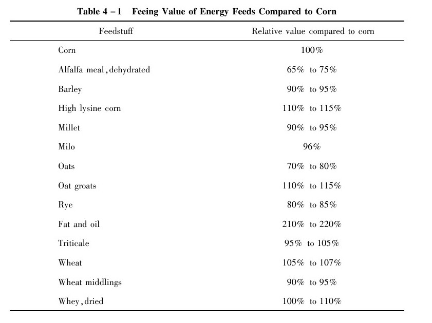

Limited Amounts of Energy Sources

There is no perfect feed ingredient that can be fed to animals by itself.Some feeds,if added to the diets in excess amounts,will decrease performance.Some less commonly fed feedstuffs,such as millet and rye,should not exceed the recommended levels shown on Table4-2.

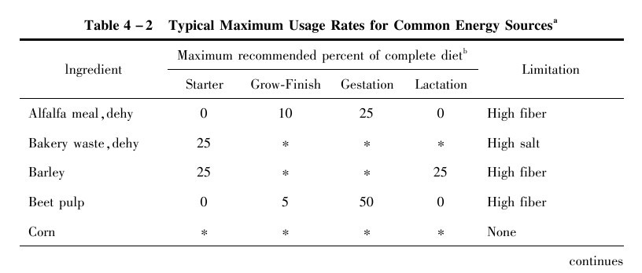

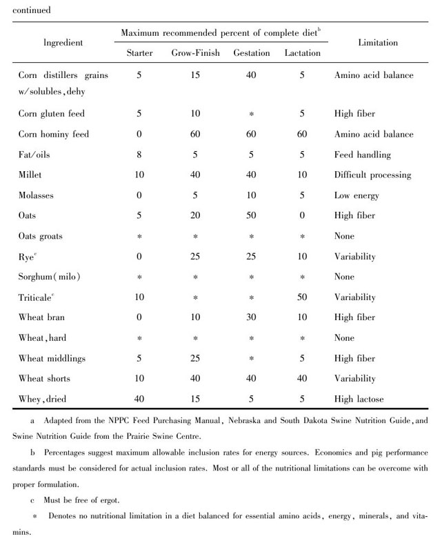

Feeding Value of Low Test Weight or Weather Damaged Grains

Under adverse weather conditions,such as drought,floods,and early frosts,low test weight,or sproutdamaged grain may be available for use in animal diets.As the degree of sprout damage increases or test weight decreases,the energy content of the＆nbsp；grain is decreased.Therefore,the animal will need to eat more feed to meet its energy requirement.Although average daily gain will usually not be affected,feed efficiency will become poorer.Research has shown that this occurs when milo drops below45pounds per bushel test weight and wheat is below50pounds test weight.Furthermore,milo with up to40%sprout damage can be effectively utilized by growingfinishing animals.When the test weight of milo and wheat drop below45and50pounds,respectively,or there is more than40%sprout damage,average daily gain will begin to be affected.Blending low test weight or sproutdamaged grain（up to50%）with normal grain is an effective way to utilize weather damaged grain.It is extremely important to recalibrate volumetric mixing equipment when feeding low test weight grains.Probably the biggest disadvantage to weather damaged grain is the increased potential for mold or aflatoxin contamination because of high moisture content.Therefore,weather damaged grains should always be screened for molds and aflatoxin and,if contaminated,these grains should not be fed to starter animals or the breeding herd.If contaminated grains are going to be used,they should be blended with normal grain and only fed to growingfinishing animals in limited amounts.Several compounds such as bentonite clay and alumniosilicates have been shown to improve animal performance when mold contaminated grains are fed.

Cereal Milling Byproduction

For human consumption,cereal grains are processed in various ways that result in the production of byproducts that are usually disposed of by being used as livestock feeds（e.g.，wheat bran,rice bran,corn mill feeds）.

Fats and Oils

Fats and oils such as choice white grease,beef tallow,corn oil,and soybean oil contain about2.25times as much metabolizable energy as most of the cereal grains.Research indicates that the addition of3%to5%fat to growingfinishing animal diets will improve feed conversion and often average daily gain.However,adding fat to ad libitum fed diets generally tends to increase backfat thickness.A reduction in the amount of dust will be evident and wear on mixing equipment and augers will be reduced with2%to3%added fat.Addition of fat above5%will further improve feed conversion,but physical handling problems such as bridging in the feeders and caking in the mixer may limit the use of these higher levels.Diets containing fat may become rancid during prolonged storage or when feed is exposed to high temperatures.Therefore,an antioxidant such as ethoxyquin,BHT,or BHA may need to be added to fat before mixing it into the rations.Adding fat to animal diets is a matter of economics.Fat additions will usually increase the cost of the diet,which must be offset by an increase in animal performance.Several commercial supplements and complete feeds contain added fat.New commercial products that contain dried fat may reduce part of the mechanical problems of adding liquid fat on the farm,but the economic feasibility of using these products must be evaluated.Fat products that have limestone as the carrier should be avoided,because the calcium will decrease the digestibility of the fat.

Food Processing and Industrial Byproducts

Milk ByProduct

The principal milk byproduct that is used as an energy source is whey,the liquid residue remaining after protein and fat are removed as curd in the manufacture of cheese.Most of the lactose,minerals,and watersoluble protein are left in the whey fraction.Liquid whey is93%to96%water.

Molasses

Molasses is a product of the sugarrefining industry.The principal types are cane and beet molasses refined from sugarcane and sugar beets,respectively.They are similar in composition and feeding value.

Table Sugar（Sucrose）and Other Simple Carbohydrates

Table sugar（sucrose）is composed of two sugars,glucose and fructose,joined together.Table sugar is not commonly fed to livestock because of its cost,but it is an excellent source of energy.Animals almost universally have a“sweet tooth”and,for this reason,small amount of sugar may be used to increase the palatability of feed.

Dried ByProduct Feeds

Dried bakery product consists of reclaimed bakery products,such as bread and cookies,that have exceeded the allowable shelf life.These products are high in energy because they are often high in sugar and fat and are very palatable.

Lesson 3　Protein and Amino Acids Sources

Protein sources are classified into two major categories：animal（tankage,meat and bone meal,fish meal,or spraydried blood meal）and plant（soybean meal,cotton seed meal,or corn gluten meal）.Soybean meal is usually the most economical source of high＆nbsp；quality protein available to animal producers.It is the only plant protein that compares with animal protein in terms of quality of amino acid content and ratio and can be used as the only protein source in most animal diets.Therefore,there is no need to have both animal and plant protein sources in a animal diet,with the exception of starter diets,which should contain dried whey and（or）spray dried blood products.

Soybean Meal

Producers may have the choice of buying either44%or46.5%crude protein soybean meal.The primary difference is that44%soybean meal is made by adding soy hulls to46.5%soybean meal.In addition to the lower fiber content,transportation costs may favor buying the46.5%soybean meal.

In order to determine the relative feeding value of alternative protein sources,it is important to compare the lysine level in the new protein source with soybean meal.The relative feeding values of some alternative protein sources are listed in Table4-3.This can be utilized to determine the comparative economic value of the protein source as a partial or complete replacement to44%soybean meal.These feeding values were calculated by dividing the lysine content of the feed ingredient by that of44%soybean meal（2.85%lysine）and multiplying by100to put them on a percentage basis.

Assuming that44%soybean meal can be purchased at$250per ton,what would a ton of46.5%soybean meal be worth？Because the lysine content of46.5%soybean meal is3.01%and44%soybean meal has2.85%lysine，46.5%soybean meal has106%the feeding value of44%soybean meal（3.01/2.85×100=106%）.Therefore,if106%is multiplied by the cost of44%soybean meal（106%×$250），46.5%soybean meal is of greater value than44%soybean meal if it costs less than$265per ton.

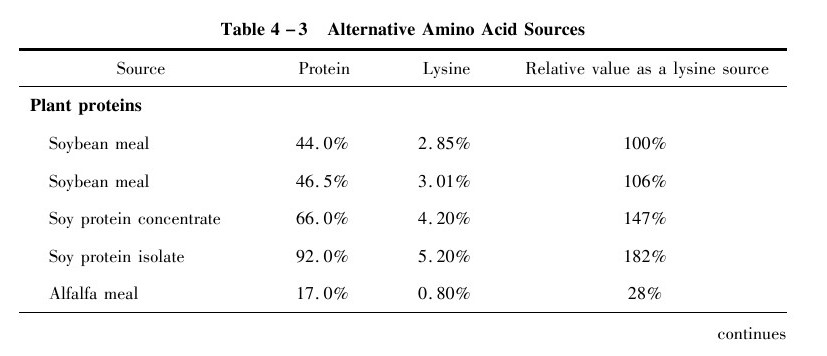

When substituting other protein sources for soybean meal,it is important to consider the maximum level at which the new feed ingredient can replace soybean meal without seriously affecting performance.Table4-4is a list of alternative protein sources that can be used in starter,growingfinishing,gestation,and lactation diets to replace all or part of the soybean meal.By using this table,you can determine the maximum replacement rate of the feed ingredient for soybean meal.

This section lists some of the more common substitutes for soybean meal in animal diets.Very often,these feed ingredients may appear to be economical compared with soybean meal.However,there are often many“hidden”costs or disadvantages in using these feed ingredients that are not reflected by their price.These include storage costs,antinutritional factors,product variability,fiber content,spoilage,and underor overprocessing.These factors are especially problematic in“byproduct”protein sources.Because byproduct feed ingredients tend to vary more in composition,proper information regarding chemical composition is necessary to ensure optimum animal performance.Additional protein sources and recommended maximum inclusion rates for each stage of production are listed in Table4-4.

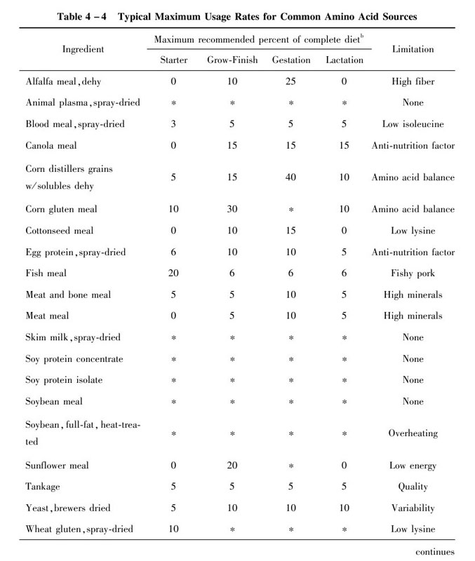

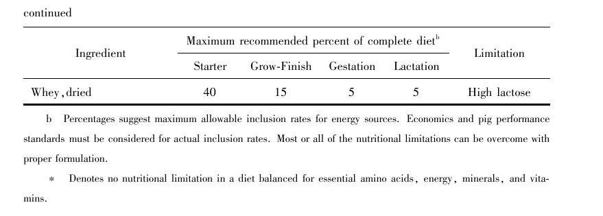

Cottonseed Meal

Cottonseed meal ranks second in production compared with soybean meal.However,its use in animal diets is limited because of the deleterious effects produced by the residual free gossypol found in the pigment glands of the seed.Although fairly high in protein,cottonseed meal is low in lysine and tryptophan.It is recommended that cottonseed meal replace no more than50%of the soybean meal or protein supplement in the diet.At this inclusion rate,it is unlikely that the total diet will contain over0.01%free gossypol.Animal performance begins to be reduced at gossypol concentrations of0.04%of the diet.Solvent extracted,gossypolfree cottonseed meal can be used to replace75%of the protein source in growingfinishing diets when balanced on a lysine basis.Canola Meal Canola meal is the byproduct of vegetable oil processing from canola.Because it is well adapted to cool season growing conditions,canola is produced primarily in Canada and the northern states.Its oil contains a high level of unsaturated fats,and production is expanding throughout the United States.Canola meal averages between35%and40%crude protein and has less lysine but more sulfurcontaining amino acids than soybean meal.Some older varieties of canola（rapeseed）contain high levels of a toxic compound,glucosinolate,which effects thyroid functioning.However,new cultivars of low glucosinolate rapeseed（＜1mg/g）have been developed and are commonly referred to as canola meal to distinguish it from the older varieties of high glucosinolate rapeseed.It is not advisable to feed meals from the cultivars of high glucosinolate rapeseed.Reduced palatability,high fiber,and low digestible energy have been causes of slightly poorer performance of animals fed diets containing canola meal.Canola meal can be used to replace up to50%of the protein from soybean meal in growingfinishing and sow diets without adversely affecting performance.

Sunflower Meal

Sunflower meal is produced by extraction of the oil from sunflower seeds.Because of its high fiber content（22%to24%），it should be utilized in limited quantities in animal diets.Sunflower meal is relatively low in lysine yet high in sulfur containing amino acids in comparison to soybean meal.Sunflower meal containing high levels of oil will produce soft pork because of the oil’s unsaturated fatty acid content.It appears that sunflower meal may replace up to25%of the protein in the diet for growingfinishing animals.

Meat and Bone Meal

Meat packing byproducts often are economically feasible to add to animal diets.In general,meat and bone meal is an excellent source of calcium and phosphorus.However,it is often very low in tryptophan and methionine.Since there is considerable variation in the type and quality of the raw materials used,there is potential for greater variation in the quality of meat and bone meal.Excessive heating during the processing of meat and bone meal may also decrease its digestibility and value as a protein source.Therefore,it is recommended that meat and bone meal should not exceed25%of the protein supplement.

Spraydried Blood Products

Spraydried blood products have revolutionized nutritional programs for earlyweaned animals.Spraydried animal plasma and spraydried blood meal,byproducts of blood obtained from animal and cattle processing plants,are the most exciting protein sources to become available to the animal industry in recent years.Previously,spraydried animal plasma has been used as a supplement for cereal protein in bakery products as well as an emulsifying agent in meat products and pet foods.It is made up of the albumin,globin,and globulin fractions of blood and contains68%protein and6.9%lysine.The blood is collected in refrigerated tanks and prevented from coagulating by adding sodium phosphate.The plasma fraction is separated from the blood cells by centrifugation and stored at25until the product is spray dried.This process consists of preheating（25minutes at200），spraydrying（1to2minutes at405），and evaporating of moisture（1to2minutes at200），resulting in a finegrained powder.Spraydried blood meal is processed similarly,except it contains the plasma and red blood cell fractions.Spraydried red blood cells,a byproduct of animal plasma production,appears to have similar nutritional value in starter diets as spraydried blood meal.When adding spraydried blood products to starter diets,dietary methionine levels must be checked because these ingredients are low in methionine.Synthetic methionine should be added to starter diets containing either spraydried animal plasma,blood meal,or red blood cells.

Soy Protein Concentrate

Soy protein concentrate contains approximately65%to70%protein and approximate4.2%lysine.It is produced by removing the water soluble sugars,ash and other minor constituents from defatted soy flour by either an alcohol,dilute acid,or warm water extraction.All three of these systems are utilized in the feed industry producing products similar in composition.Research results indicate that soy protein concentrate can effectively replace dried skim milk in starter animal diets.Furthermore,research suggests that animals fed moist extruded soy protein concentrate may have greater average daily gain and better feed conversion than animals fed soy protein concentrate.

Soy Protein Isolate

The highest concentrated soy protein source,is the soy isolate.To produce a soy isolate,defatted soy flakes are insolublized by reducing the pH to4.5（isoelectric point）.At this point,the isoelectric proteins are separated from the soluble materials.The process is similar to the acid extraction procedure described to produce soy protein concentrate.The removal of insoluble fibrous material by either decantation or centrifugation completes the protein isolation procedure.This final product can be spraydried to give an isoelectric protein,or neutralized to pH7.0and dried to give the common soy protein isolate.During protein isolation,protein yield is decreased due to minor proteins remaining soluble.Soy protein isolate is also an effective replacement for dried skim milk in starter animals diets.

Raw Soybeans

Raw soybeans,especially weather damaged or low testweight beans,are often attractive alternatives to add to animal diets.However,raw soybeans contain high quantities of trypsin inhibitors,which block normal protein digestion in animals.As the animal becomes older,its susceptibility to trypsin inhibitors decreases.Therefore,raw soybeans may be used in gestation diets（but not lactation）without adversely affecting performance.If raw soybeans are to be used in diets for young animals,it is important to heat the beans to inactivate the trypsin inhibitors.New varieties of soybeans are under development in which one of the trypsin inhibitors（kunitz inhibitor）has been genetically selected against,which would allow for greater use in growing animal diets.However,research shows that some heat treatment of low kunitz inhibitor soybeans is required for maximum utilization.

Fullfat Soybeans

Onfarm processing by roasting or extruding of raw soybeans,if done properly,results in excellent sources of protein.Onfarm roasting or extruding yield“fullfat”soybeans,which,in some instances,are among the cheapest means of adding fat to animal＆nbsp；diets.Because of the economic relationship between soy oil and soybean meal and the cost of other fat sources and incorporating them into your feed mill,it may be more economical to utilize fullfat soybeans instead of selling the beans and buying back soybean meal and oil.Because whole or fullfat soybeans have less protein and lysine than soybean meal（32%to37%protein and2.1%to2.4%lysine），it is necessary to add20%to25%more whole soybeans than soybean meal to have a similar protein level in the diet.At the same time,this will supply approximately3%added fat to the diet,which will improve feed efficiency approximately3%to5%.Whole soybeans have an approximate feeding value of90%to95%that of soybean meal.

Synthetic Amino Acid

Synthetic amino acids,if added properly,can reduce feed costs and maintain animal performance.Lysine and methionine are the two feedgrade amino acids most commonly added to animal diets.However,in the future,synthetic threonine and tryptophan may be available at prices low enough to add to animal diets.Research has demonstrated that supplemental lysine can reduce the amount of soybean meal needed in animal diets.Therefore,adding synthetic lysine can reduce the crude protein level of the diet without affecting performance.The most common source of synthetic lysine is Llysine monohydrochloride,which is78%lysine.In diets for animals，100pounds of44%crude protein soybean meal can be replaced by the addition of3pounds Llysine HCl and97pounds grain per ton.If the3pounds Llysine HCl and97pound grain are cheaper than100pounds of44%crude protein soybean meal,the diet costs would be reduced by using supplemental lysine.However,the use of synthetic lysine is generally not advisable in gestation or lactation diets.Synthetic lysine has been shown to be poorly utilized in animals fed only once a day（gestating sows）compared with animals fed ad libitum.In lactation,adding synthetic lysine alone to the diet decreases the amount of other amino acids relative to lysine.This results in deficiencies of other amino acids which will reduce litter weaning weights.

Lesson 4　Mineral Sources

Minerals constitute a small percentage of the animal diet,but their importance to the health and wellbeing of the animal cannot be overemphasized.Minerals have been classified into two types：macrominerals and microminerals.Macrominerals（major minerals）that are commonly added to animal diets are calcium,phosphorus,sodium,and chlorine（magnesium and potassium are also required but are adequately supplied by grains）.Microminerals（minor or trace minerals）of primary concern are zinc,copper,iron,manganese,iodine,selenium and chromium.Functions of minerals are extremely diverse,ranging from structural functions in some tissues to a wide variety of regulatory functions.The increasing trend toward confinement rearing of animals,without access to soil or forage,increases the importance of meeting dietary mineral requirements.

Other trace minerals have been shown to be essential for chicks or laboratory animals and may be required by animal.These include molybdenum,cobalt,fluorine,nickel,silicon,vanadium,tin and arsenic.Whether these elements will be of practical significance awaits further research.Most of them are believed to be present in adequate quantities in natural feed ingredients.However,the use of simpler animal diets with fewer ingredients may necessitate consideration of their importance in the future.

Calcium and Phosphorus

These two elements are important in skeletal structure development,but their presence in soft tissues is also vitally important.They both aid in blood clotting,muscle contraction,and energy metabolism.About99%of the calcium and80%of the phosphorus in the body are found in the skeleton and teeth.Therefore,deficiency of calcium and phosphorus will result in impaired bone mineralization,reduced bone strength,and poor growth.Young animals with a deficiency of calcium and phosphorus will have clinical signs of rickets.

The ingredients used in animal diets vary widely in mineral content.Most cereal grains are particularly low in calcium.Phosphorus content of cereal grains is largely phytate phosphorus,which is poorly utilized by animal.Several researchers are currently evaluating the availability of phosphorus in cereal grains.A range of8%to60%of phosphorus availability has been reported in cereal grains,but for practical purposes,an availability of30%is a reasonable estimate.Feeds of animal origin,such as meat and＆nbsp；bone meal,tankage,or fish meal,are quite high in calcium and available phosphorus.Thus,the level of supplemental calcium and phosphorus must be recalculated as feeds of animal origin replace soybean meal in the animal diet.The standard ingredients for supplying supplemental calcium are limestone or oyster shell.Phosphorus is primarily supplied by dicalcium phosphate or monocalcium phosphate.

Table4-5lists a number of feed ingredients that may be used to supply calcium and phosphorus.Itshould be noted that many of the sources supply both calcium and phosphorus,so the quantity of limestone in the diet must also be adjusted.It is extremely important to check the nutrient specifications of these mineral sources,because the level of calcium and phosphorus may be different from the above values.

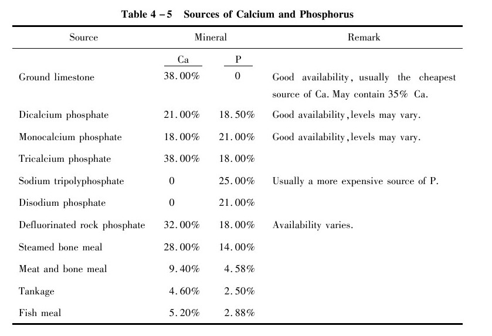

Other Trace Minerals

Iron,copper,manganese,zinc,iodine,and selenium are the trace minerals that should be added in a mineral premix.In Table4-6，a list of the various chemical forms in which the trace minerals are available is shown.Most trace minerals are not generally supplied as pure chemicals,but as either ores or industrial byproducts.Sulfate trace mineral forms are usually more reactive in the premix and possibly reduce the potency of the more susceptible vitamins and reduce the shelf life of the entire premix.However,sulfate forms often have the greatest bioavailability of any of the inorganic sources.

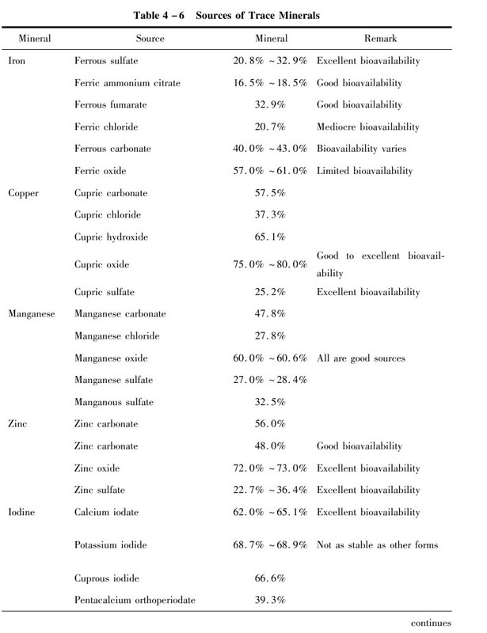

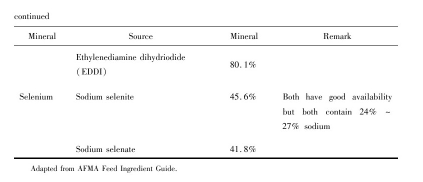

Vocabulary

alfalfa meal苜蓿草粉

animal protein factor（APF）动物蛋白因子

animal tallow动物脂肪

antagonistic action颉抗作用

antidermatitis vitamin抗皮炎维生素

artificial milk powder代乳粉

antinutritional factor抗营养因子

antioxidant　抗氧化剂

arsenic poisoning砷中毒

artificial colouring人工着色

available lysine可利用赖氨酸

available nitrogen可利用氮，有效氮

available nutrients有效营养成分

average daily gain（ADG）平均日增重

average daily intake（ADI）平均日采食量

balanced diet平衡日粮

barkery waste面包渣

barley　大麦

Bcomplex vitamins B-族维生素

βglucanase　β-葡聚糖酶

beer yeast啤酒酵母

beet pulp甜菜渣

bentonite　膨润土

blood meal,spraydried血粉（喷雾干燥的）

boar pig青年公猪

bone meal steamed蒸制骨粉

broiler　肉用仔鸡

bypass protein过瘤胃蛋白质

calcium carbonate碳酸钙

calcium iodate碘酸钙

calcium monophosphate磷酸氢钙

canola双低菜籽油

carbohydrate　碳水化合物

cassava木薯

castor　蓖麻

cereal gain谷物籽实

chemotherapeutics化学药物治疗

chick starter雏鸡料

choline chloride氯化胆碱

chromic oxide氧化铬，三氧化二铬

chromium　铬

coconut meal椰子粕（饼）

complemental feed补充饲料

concentrated feed精饲料

concentrated feedstuff浓缩饲料

corn distillers grains玉米酒糟

corn germ玉米胚芽

corn gluten meal玉米蛋白粉

corn molasses玉米糖浆

cotton seed meal棉籽粕（饼）

creep feed乳猪料

crumbler破碎料

cutting offals屠宰废弃物

dewormer　驱虫剂

dicalcium phosphate磷酸二钙，磷酸氢钙

distiller dried grain with soluble（DDGS）干燥含可溶物酒糟

distiller dried grain（DDG）酒糟

dried extractd fermentation soluble干燥的发酵浸出物

dried poultry waste（DPW）禽粪粉

dried whey乳清粉

drug resistance抗药性

enzyme preparation酶制剂

essential fatty acid（EFA）必需脂肪酸

evaluation of nutritive value on feed饲料营养价值评定

expanded feed膨化饲料

expected daily gain预期日增重

extensive feed粗放饲养

extruded feed挤压饲料

exudative diathesis渗出性素质

feed additive饲料添加剂

feed additive premix饲料添加剂预混料

feed conversion ratio（FCR）饲料转化率

feed formula饲料配方

feed urea饲用尿素

feed yeast饲用酵母

feeding standard饲养标准

fermented feed发酵饲料

ferric chloride氯化铁

ferric oxide氧化铁

ferrous carbonate碳酸亚铁

ferrous fumarate富马酸亚铁

ferrous sulfate硫酸亚铁

fish meal鱼粉

fish odour鱼腥味

fish offal鱼类废弃物，鱼类下脚料

folic acid叶酸

fullfat soybean全脂大豆

fumaric acid富马酸

fungal toxin真菌毒素

furacilin　呋喃西林

furazolidone　呋喃唑酮

ferrous fumarate富马酸亚铁，延胡索酸亚铁

gelatinized starch糊化淀粉

germ cake胚芽饼

gestation　妊娠，怀孕

gilt　小母猪

glucase　淀粉酶

glucogen　糖原

glucosinolate硫葡萄糖甙

gossypolfree游离棉酚

ground limestone石灰石粉

ground extruded whole soybean挤压全脂大豆粉

growth promoter生长促进剂

hoof and horn meal蹄角粉

hydrocellulose水解纤维素

hygienic standard卫生标准

hypomineralization矿物质不足

ideal protein理想蛋白质

indigestion　消化不良

inedible　dibl]不可食用的

inhibitor　抑制剂

intensive feeding集约化饲养

iodate　碘酸盐

iodide；iodidum　碘化物

iron phytate植酸铁

iron sulphate硫酸亚铁

juicy fodder多汁饲料

keratin　角蛋白

ketonic acid酮酸

Ltryptophane　L-色氨酸

lactagogue　催乳剂

lactation　哺乳期

lactic acid bacteria乳酸菌

lactic acid fermentation乳酸发酵

lactiferous fodder催乳饲料

lactobacillus　乳酸杆菌

leastcost ration最低成本日粮

lignose　木质素

limited feeding限量饲喂

linoleic acid亚油酸

linseed meal亚麻籽粕

lipase　脂肪酶

lipid　脂类

lipide脂质，油脂

lipidolysis　脂质分解

lipoidosis　脂肪沉积

lipoxidase 脂肪氧化酶

liquid feeding湿喂

litter weight窝重

livability　成活率，存活率

Llysine mono hydrochloride L-赖氨酸盐酸盐

Lthreonine　L-苏氨酸

macronutrient　常量营养素

maltose　麦芽糖

marine byproduct水产副产品

meat meal tankage肉骨粉

medicated additive药物添加剂

medicated feed加药饲料

menadione　维生素K 3

metabolic inhibitor代谢抑制剂

methionine hydroxy analogue（MHA）蛋氨酸羟基类似物

methl betaine甲基甜菜碱

microelement微量元素

middlings次粉，粗面粉

millet　粟，小米

milo（sorghum）　高粱

modified starch变性淀粉

molasses　糖蜜

mold（mould）inhibitor防霉剂

mold contamination霉菌污染

monocalcium phosphate磷酸一钙

muscular dystrophy肌肉营养不良

mycotoxin　霉菌毒素

myrosinase　硫葡萄糖苷酶，芥子苷酶

National Research Council（NRC）全国研究理事会

net protein utilization（NPU）蛋白质净利用率

neutral detergent fiber（NDF）中性洗涤纤维

nitrofuran　硝基呋喃

nitrogenfree extract（NFE）无氮浸出物

nitrogenfreediet无氮日粮

nonprotein nitrogen（NPN）非蛋白氮

nutrient digestibility养分消化率

oats groats去壳燕麦

olaquindox喹乙醇

oligosaccharide　寡糖，低聚糖

organoleptic evaluation感官评定

oxidation preventive抗氧化剂

oyster shell meal牡蛎壳粉

packing house byproduct肉品加工副产品

palatability　适口性

pantothenic acid　泛酸

pellet binder颗粒黏合剂

pellet（pelleted feed）颗粒饲料

penicillin　青霉素

pentosanases戊聚糖酶

performance　生产性能

peroxide　过氧化物

peroxide value（PV）过氧化值，过氧化物价

pet food宠物饲料

phase feeding阶段饲养

phytate phosphorus（PP）植酸磷

pigment　着色剂，色素

polyunsaturated fatty acid（PUFA）多不饱和脂肪酸

precursor of vitamin　维生素A前体

preservative substance防腐剂，杀菌剂

probiotic　益生素

propionic acid丙酸

purified diet纯化日粮

pyridoxine　维生素B 6

rancidity　酸败作用

rape seed meal菜籽粕

retarded growth生长缓慢，生长发育不良

retinol　维生素A醇，视黄醇

riboflavin　核黄素

roughage粗饲料

routine analysis常规分析

rumen degraded protein（RDP）瘤胃降解蛋白质

rye　黑麦

safflower meal dehulled脱壳红花籽粕

salinomycin sodium盐霉素钠

saltlick　盐砖，舔盐

sample quartiles四分法取样

sanitary analysis卫生学分析

sesame meal芝麻粕

secondary product副产品

shorts　次粉，粗粉

silage fodder青贮饲料

silkworm pupa meal蚕蛹粉

single cell protein（SCP）单细胞蛋白

skimmed milk脱脂乳

sodium arsanilate氨基苯砷酸钠

sodium bicarbonate碳酸氢钠，小苏打

sodium chloride氯化钠

sodium selenate硒酸钠

sodium selenite亚硒酸钠

soy lecithin大豆卵磷脂

soybean protein concentrate大豆浓缩蛋白

soybean protein isolate大豆分离蛋白

soybean trypsin inhibitor大豆胰蛋白酶抑制剂

spray dried animal blood喷雾干燥血粉

sterilizing agent杀菌剂

succulent fodder多汁饲料

sucking period哺乳期

supplement feed补充饲料

tannic acid单宁酸

thiamine hydrochloride盐酸硫胺素

thiamine mononitrate硝酸硫胺素

tocopherol acetate生育酚醋酸盐

trace element微量元素

tricalcium phosphate磷酸三钙

triticale　黑小麦

trypsin inhibitor抗胰蛋白酶

tryptophan　色氨酸

tylosin　泰乐菌素

undegraded protein（UDP）非降解蛋白质

urease　尿素酶

vacuum packing真空包装

vitamin potency维生素效价

volatile fatty acid（VFA）挥发性脂肪酸

voluntary feed intake（VFI）随意采食量

wheat bran小麦麸

wholesome　卫生的，安全的，有益于健康的

xerophthalmia　干眼症，维生素A缺乏症

zeolite　沸石

Part 5　Feed Additives

Feed additives are nonnutritive substances added to feeds to improve the efficiency of feed utilization and feed acceptance,or to be beneficial to the health or metabolism of the animal in some way.In other words,they are substances other than the known nutrients.Some feed additives,such as antibiotics,are controversial,with claims that their use has adverse effects on human health.Regardless of the merits of the arguments,many Americans believe that livestock and poultry are fed diets“laced with chemicals”.This concern is likely to result in increasingly restrictive controls on the use of feed additives for animal production.In the United States,the Food and Drug Administration（FDA）must approve a feed additive before it can be used commercially.The FDA approval is given only after extensive testing that establishes the safety of the product and substantiates the claims made for it.

The following classification of feed additives attempts to categorize them by their principal biological or economic effect.It is not an allinclusive list,but it includes the most prominent feed additives.Each one will be discussed in turn.

Lesson 1　Alternatives of Antibiotics Promoters for Pigs

Along with the extensive knowledge of food and environment quality requirements,people have begun to find that although antibiotics have made a great contribution to stockraising,its misuse has brought negative functions for animals and humans.It has become a worldwide task to research and exploit alternatives which can be used to replace antibiotics.Some new feed products having the function of preventing disease and promoting growth diseasepreventing and improved growth performance such as probiotics,enzyme preparation,herb,antimicrobial peptides,etc.They have overcome the imperfections of antibiotics under a different degree,and provided more and more large functions in the feed industry.Currently,the potential for antibiotics can cause drug residue,antibiotic resistance and safety problems,while also a harm to human and animal health.Therefore,these factors have resulted in the antibiotics ban in animal nutrition in many developed countries now,such as European Union.New administrative rules in China have also provided the regulation and limitation to the use of antibiotics additive.Mechanism of Antibiotics Promotors Function For many decades,antibiotics（so called growth promoters）have been used as feed additives in various species of farm animals,to reduce the incidence of diarrhea under certain conditions.The antibiotics can alter the normal,nonpathogenic flora of the gut and suppress certain bacteria to compete with the host for nutrients and then cause a beneficial effect of digestive processes and the utilization of nutrients in feed.Many documents have demonstrated that antibiotics can improve animal growth and feed utilization rate.

Alternative of Antibiotics Promotors

Although antibiotics have been used as feed additives in various species of farm animals,the increase of application of antibiotics in animal agriculture will lead to a series of some adverse effects on the animals,including production of the drugtolerant strain,reducing animal immunity,causing endogenous infections and superinfections,influence of the animals’growth performance and contamination of the environment.With the residues in animal products and the increase of bacteria resistance to antibiotics,the events such as Bovine Spongiform Encephalopathy（BSE），dioxin,and Foot and Mouth Disease（FMD）make consumers feel more concerned about animal food safety.Therefore,some countries have begun to limit the use of antibiotics.As a consequence,it is on the front burner for the feed industry to find a product which not only can be an alternative for antibiotics but also improve animal performance.New alternative feed additives,as a growth promoter,have been developed,including herbs,enzyme preparations,probiotics and antimicrobial peptide,which will conquer the defects of the antibiotics and have similar positive effects.A brief introduction for four of the most promising alternative feed additives in current research areas follows.

Enzyme Preparations

With the limited use of antibiotics and an increasingly lack of feed resources,it has become a serious problem for our national feed industry how to explore high quality and high efficiency as well as innocuity and no remnant feed additive.Feed enzyme preparation is fitting the request offering for a new drive for the feed industry,and becoming the broadly applied green feed additive in the world.The beneficial effects on pig health and growth performance may be due to：①complement the deficiency of endogenous enzymes of piglet；②increase the feed utilization rate；③decrease the excretion of minerals from the body；④improve the absorption of nutrients.

The main raw materials for modern animal feed production are grain feed,which contain a lot of antinutritional factor,such as nonstarch polysaccharide（NSP）and phytate.NSP includes hemicelluloses,pectines and oligosaccharides（such as stachyose），and are about10%～30%of carbohydrates.They can be divided into watersoluble and waterinsoluble factions,and the foremost includesβglucan,mannan,pectin and xylan.Soluble NSP is known to possess main antinutritional properties by either encapsulating nutrients or produce some gelatinous pectic materials in the animal intestine,to increase the digesta viscosity,prevent the chance of the endogenous enzymes and contents from mixing,reduce the rate of diffusion of solutes（Bedford，1996）.These will result in slowing the digestion and absorption of nutrients,reducing the animals growth performance and changing the balance in gut microflora.However,the gastrointestinal tract of the piglet is not fully developed and is vulnerable to infection and also lacks in the endogenous enzyme secretion in the first few weeks after weaning,which will result in the reduction in nutritive digestibility,and even adult animals can not digest these NSP.

Probiotics

Probiotics are live cultures of microbes or active ingredients which beneficially influence the health of the host,including some beneficial microbes（such as lactic acid bacteria）and its metabolizable product.Probiotics is largely degraded in the small bowel,and the possible mechanisms may be adherence to intestinal mucosa thereby preventing attachment of competition with pathogens for nutrients,which could improve health and growth by altering the intestinal microbial balance,and stimulation of intestinal immune response.In addition,probiotics may affect the permeability of the gut and increase intake of nutrients.

参考译文

猪用抗生素促生长剂的替代

随着人们对食品和环境质量要求的不断提高，抗生素为畜牧业作出巨大贡献的同时，也因被滥用而对人和动物带来严重的负面作用。因此，研究和开发抗生素替代产品，已成为世界性研究课题。一些具有防病促生长作用的新型饲料添加剂产品不断被研发，尤其一些有效的抗生素替代品，如中草药、酶制剂、益生素、抗菌肽肤等，它们都不同程度地克服了饲用抗生素的缺陷并在饲料工业中发挥着越来越大的作用。目前，由于使用抗生素能引起药物残留、抗药性和安全问题，影响到人类和动物的健康。因此，世界许多先进国家对抗生素的使用提出限制，如欧盟于2006年全面禁止使用抗生素作为饲料添加剂。我国新的饲料添加剂管理条例也对抗生素添加剂的使用做出了规定和限制。

抗生素的作用机理

抗生素（又叫抗生素促生长剂）作为动物饲料添加剂已有几十年的历史，它能在一定条件下降低动物的腹泻率，调节肠道微生物菌群，抑制病原菌与宿主竞争营养物质，这将有利于饲料中营养物质的消化和吸收，并且有很多文献证明抗生素能提高动物的生长性能和饲料利用率。

抗生素添加剂的替代

虽然抗生素作为各种畜禽的饲料添加剂具有抗病促生长作用，但是在动物生产中增加抗生素的使用将导致一系列的有害作用，包括耐药菌株的产生，降低动物免疫力，引起内源感染和双重感染，造成动物生产性能下降和环境污染等。随着抗生素在动物产品中的残留和细菌耐药性的增加，牛海绵样脑病（BSE）、二恶英和口蹄疫等事件的发生使消费者更加关心动物食品安全。所以，一些国家开始限制抗生素的使用。研制能提高动物生产性能的抗生素替代品成为饲料业的研究热点。目前，作为生长促进剂的抗生素添加剂替代品已经取得发展，包括中草药提取物、酶制剂、益生素和抗菌肽肤。本文将对这4个最有发展前景的抗生素添加剂替代品作一简要综述。

酶制剂

随着抗生素的限制使用和饲料资源的缺乏，如何生产优质高效、无毒无残留的饲料添加剂已成为饲料业非常紧迫的问题。饲料酶制剂能满足此需求，并对饲料工业具有新的驱动力。酶制剂已成为世界上广泛使用的绿色饲料添加剂，其改善猪的健康和生长的作用机制可归纳为：①弥补仔猪内源酶的缺乏；②增加饲料的利用率；③降低体内矿物质的排出；④促进营养物质的吸收。

现代动物饲料生产的主要原料来源于谷物类作物，其中含有大量的抗营养物质，如非淀粉多糖（NSP）和植酸。NSP包括半纤纤素、果胶和寡糖（如水苏糖），约占谷物饲料中总碳水化合物的10%～30%。NSP可分为水溶性和水不溶性两部分，水溶性NSP主要包括β-葡聚糖、甘露聚糖、果胶和木聚糖等，是主要的抗营养物质。其机制是通过包裹营养物质或在动物肠道产生一些胶状物质，进而增加肠道食糜黏度，阻止内源消化酶与饲料成分的充分接触，降低食糜的扩散率（Bedford，1996）。这将减慢营养物质的消化和吸收，降低动物生长性能和改变肠道微生态平衡。由于仔猪的胃肠道并未发育完全，易受感染，而且仔猪断奶后的几周内内源酶分泌不足，不能消化饲料中的NSP，最终导致营养物质消化率降低。

益生素

益生素是对人体健康具有促进作用的一种活菌制剂，包括有益微生物（如乳酸菌）及其代谢产物。其可能的作用机制是直接黏附于肠黏膜上皮细胞从而阻止病原菌的黏附，与病原菌竞争营养物质，改善肠道微生物平衡，促进动物的健康和生长，并促进肠道免疫应答。另外，益生素也能影响肠黏膜通透性从而提高营养物质的吸收。

Lesson 2　Antifungal

Antifungal agents are used to prevent fungal（mold）growth in stored feed ingredients and mixed feeds.Molds reduce palatability and may produce mycotoxins.Aflatoxin and Fusarium toxins are among those of most concern.Mold growth in stored grains and feeds is prevented by adequate drying（to a moisture content of12%or less），storage under dry conditions,and the use of mold inhibitors（antifungals）.The use of a mold inhibitor are strongly recommended when the moisture content of the grain exceeds1%～14%，the relative humidity is above80%～85%，the temperature is12.8℃（～55）or above,or the grain is damaged,broken,or insectinfested.Propionic acid or its salts（sodium or calcium propionate）are particularly effective at its level of approximately 1%of the grain or diet.Propionates provide protection for at least90days.Examples of effective antifungals besides propionic acid are sodium diacetate,sorbic acid,and gentian violet.Ammonia treatment of grain inhibits mold growth.In addition,ammonia treatment of grain inactivates aflatoxin.Phosphoric acid is an effective antifungal agent,and has the advantage of also supplying an essential nutrient.

Sodium metabisulfite and sulfur dioxide are useful preservatives for moist grains in small bins when the moisture content is less than30%and the ambient temperatures are cool.Sulfurous acid is formed when sulfur dioxide contacts water and inhibits growth of bacteria,yeasts,and molds.There are some major problems,however,in the use of sulfur dioxide as a grain preservative,including cost,the poisonous nature of the gas,and the acidic nature of the solution,which can seriously corrode steel grain bins.Palatability of treated grains may also be reduced；however,this can be alleviated by addition of sodium bicarbonate.Gibson et al.noted that sulfur dioxide was not effective when large grain bins were used because of difficulty in adequately dispersing the material in the grain.Sulfur dioxide treatment degrades or inactivates thiamin in stored grains.

A new approach to grain storage to eliminate both mold growth and insect activity is the use of low temperature chilling.Cold air is used to maintain a storage temperature below10℃（50），which inhibits both molds and insects.

Lesson 3　Antibiotics

Antibiotics are natural metabolites of fungi that inhibit the growth of bacteria.Their discovery is credited to Alexander Fleming of Great Britain,who noted that bread molds produced a substance that inhibited bacterial growth.This substance was penicillin.Since that time,hundreds of antibiotics have been discovered.Fermentation residues were evaluated as poultry and livestock feeds.Favorable effects on animal performance were noted,with improvement of growth and feed efficiency and a reduction in health problems such as postweaning diarrhea.It was soon discovered that these beneficial effects were associated with antibiotics in the fermentation residues.These findings led to the adoption of the practice of feeding subtherapeutic levels of antibiotics to animals,particularly swine and poultry,as growth promotants.Subtherapeutic doses are lower than therapeutic levels used for treatment of disease；prophylactic doses are used for disease prevention.Thus antibiotics used as growth promotants are fed at lower levels than when they are used for the treatment or prevention of disease.

The mechanism of action of antibiotics in their growthpromotion effects is not conclusively known but definitely appears to be due to actions on the gut microflora.Some of the most plain theories identified by Visek are as follows：①Microbes responsible for mild but unrecognized infections are suppressed.②Microbial production of growthdepressing toxins is reduced.③Antibiotics reduce microbial destruction of essential nutrients in the gut or,conversely,improve the synthesis of vitamins or other growth factors.④There is enhanced efficiency of nutrient absorption because the intestinal wall is thinner.

An additional and likely explanation for the antibiotic growth response is that pathogenic gut bacteria produce toxins that,when absorbed,elicit immune responses,increasing the animal’s need to synthesize antibodies and other components of the immune response.This diverts nutrients into immune responses instead of growth.Subtherapeutic levels of antibiotics increase an animal’s ability to withstand stress and aid in control of postweaning diarrhea.The response to antibiotic feeding is greatest in young,unthrifty,or stressed animals.The response is usually less when animals are housed in a new building,as microbial loads in the environment build up,the response to antibiotics increases.Broadspectrum antibiotics（active against both grampositive and gramnegative organisms），such as chlortetracycline,are usually more effective than narrowerspectrum agents such as penicillin and bacitracin.

Animals feeding antibiotics have a thinner intestinal wall than those that are not receiving them；this could improve nutrient absorption and also reduce maintenance energy and protein requirements.The intestinal mucosa is the most rapidly regenerating tissue in the body.Enterocele have a very rapid turnover,and this turnover rate is increased by exposure to bacterial toxins and metabolites,thus substantially increasing endogenous losses of protein and energy.Antibiotics reduce the turnover rate of intestinal mucosal cells.Visek observed that antibiotics reduce formation of ammonia and amines in the gut；these compounds are irritants that increase the turnover rate of epithelial tissues.Another possibility in explaining the mode of action of antibiotics is that they may reduce the intensity of the immune response.

Although antibiotics have been used as feed additives since1950，their effectiveness has not diminished with time.The magnitude of the growth response is about the same now as when their use first began.This suggests that the development of microbial resistance to antibiotics,which is well documented,does not alter their growthpromoting activity.

Some of the most commonly used growpromoting antibiotics are bacitracin,bambermycins,chlortetracycline,erythromycin,lincomycin,neomycin,oxytertracycline,oleandomycin,penicillin,streptomycin,tylosin,flavomycin,and amycin.

Lesson 4　Digestion Modifiers

Enzymes

Animals produce adequate quantities of digestive enzymes for digestion of the proteins,carbohydrates,and lipids that they are capable of digesting.The main potential of enzyme addition to feed appears to be for digestion of substances that the animal is intrinsically incapable of digesting.For nonruminants,addition of cellulase to feeds would provide a means of digesting cellulose.The technology of production and delivery of cellulose has not reached a practical stage.There are commercial sources of cellulolytic enzymes available,but responses have not been encouraging.

The primary use of enzymes as feed additives has been the provision of sources ofβglucanase to swine and poultry to increase the digestion ofβglucans.Glucans are an important source of carbohydrate in barley and oats.Sources of glucanase,isolated from fermentation products,are available commercially.The addition ofβglucanase to barleycontaining poultry diets results in significant improvement in growth rate and feed conversion and reduces or eliminates sticky droppings.Similar improvements,to a lesser degree,have been noted in oatbased diets.Watersoluble pentosans are the major antinutritive factors in rye.Enzyme treatment with fungal enzymes from Trichoderma viride reduces the viscosity of rye in the gut and improves its utilization by poultry as a result of hydrolysis of the viscous pentosans.The endosperm cell walls of wheat,triticale,and rye contain pentosans.Feeding a source of pentosanase to broiler chickens improves growth and reduces the severity of wet litter and sticky droppings when rye andtriticale and wheat are fed.

In poultry，βglucans and pentosans in grain cause an increased viscosity of intestinal contents.These nonstarch polysaccharides（NSP）form a viscous,gummy layer on the surface of the intestinal mucosa,interfering with the final stages of digestion and absorption.The absorption of large molecules,such as fats,is particularly inhibited,causing a specific fat malabsorption syndrome.The adverse nutritional effects of NSP in poultry are explained primarily by their viscosity effects.In swine,these NSP have＆nbsp；muchless effect,because the higher water content of their gut contents dilutes the viscosity effect.

It is generally assumed that feed enzymes would not be effective in ruminants,because rumen microbes secrete a wide variety of enzymes capable of degrading dietary carbohydrates.However,there have been substantial improvements in fiber digestibility in cattle receiving a source of fiberdigesting enzymes as a dietary additive.

New crop（recently harvested），such as wheat,barley,and oats,often support poor growth when fed to poultry and swine.After storage for4～8weeks,they give better results.This is probably due to decreases in content and chain length of NSP from activity of carbohydrase enzymes in the grain.

Buffers

A buffer is a salt of a weak acid or base that resists a pH change,whereas an alkalizing or neutralizing agent neutralizes acid but also increases pH.Sodium bicarbonate,potassium bicarbonate,magnesium bicarbonate,calcium carbonate,and bentonite are true buffers,whereas sodium carbonate,potassium carbonate,magnesium oxide,sodium hydroxide,and calcium hydroxide are alkalizing agents.Buffers are used extensively for ruminants fed high concentrate diets.The need for buffering capacity is greater with high concentrate than with high fiber diets because of the greater rate of fermentation producing more acids,less saliva production（saliva is rich in buffers），and less intrinsic buffering capacity.Forages,especially legumes like alfalfa,have appreciable buffering capacity.Sodium bicarbonate is probably the most frequently used buffer；other widely used buffers and neutralizing agents include magnesium oxide,calcium carbonate,cement kiln dust,and tetrasodium pyrophosphate.Added buffers are particularly useful in the adaptation period from high roughage to high concentrate diets and aid in the prevention of lactic acidosis.They are also useful in rations for dairy cattle fed high concentrate diets,particularly when corn silage is the major roughage used.Buffers do not appear to be useful when high roughage diets are fed.Use of buffers in diets for dairy cattle has been reviewed by Erdman.

A ruminal pH of about6.0is the critical pH below which protein and cellulose digestion rates are reduced.These workers found that various dietary levels（1.5%，3%，and4.5%）of sodium bicarbonate greatly increased the amount of time that ruminal pH was above6.0，but total tract nutrient digestibility was not increased.Boerner et al.found that bicarbonate increased drymatter digestibility in beef cattle.

Sodium Sesquicarbonate and Trona

Sodium sesquicarbonate and trona are twonewer buffers available to the feed industry.Sodium sesquicarbonate is produced from trona ore and has a higher degree of purity than trona.Boerner et al.compared trona with bicarbonate in beef feeding trials.Both buffers shifted starch digestion from the rumen to the small intestine.Both buffers increased drymatter,crudeprotein,and cellsolubles digestibility,with trona more effective than bicarbonate.Trona was found to be more effective than bicarbonate in buffering the digestive tract pH throughout diurnal cycles of pH changes because of higher buffering capacity and extended buffer response.It has also been found effective in dairy cattle diets.

Limestone

Limestone exerts its maximum buffering activity at a pH of less than5.5，so its major effects are postruminal.Particle size does not have much influence on its effectiveness as a buffer in the gut.Magnesium oxide functions as a rumen buffer；its effectiveness is increased with small particle sizes.There has been considerable interest in the use of buffers,such as ground limestone and cement kiln dust,to enhance post ruminal starch digestion.With high concentrate diets,the high concentration of VFA produced in the rumen may result in acid overload of the duodenum,lowering the intestinal pH below the optimal level for pancreatic amylase activity.Evidence in support of this theory includes the excretion of a considerable amount of undigested starch in the feces of animals of high concentrate diets and a lower fecal pH with high starch diets.Fecal pH can be increased by feeding limestone but this does not necessarily reflect increased starch digestibility.

Russell and Chow

Russell and chow offered an alternative explanation for the effect of buffers.They suggested that compared to the effect of bicarbonate transferred into the rumen from the blood,dietary sodium bicarbonate would have little effect on rumen pH.They proposed that the mechanism of action of sodium bicarbonate is to increase water consumption,increasing the dilution of rumen fluid and increasing the rate of escape of starch to the intestine,thus reducing VFA production in the rumen.

IonExchange Compounds

The principal ionexchange compounds used in feeding are zeolites,which are clay minerals consisting of hydrated aluminosilicates of various cations.They can gain and lose water reversibly and exchange their constituent cations.Besides natural zeoites,there are also synthetic zeolites used as molecular sieves consisting of organic resins or inorganic aluminosilicate gels.One of the major natural zeolites used in feeding is clinoptilolite.

Zeolites are reputed to have beneficial effects on growth,feed efficiency,and incidence of enteric disease.Clinoptilolite has the ability to exchange ammoniumions.Zeolites might improve the utilization of NPN by ruminants by complexing with ammonium ions and releasing them gradually over a period of time,although Pond found no apparent beneficial effects of inclusion of zeolites in lamb diets.Some aluminosilcates are effective absorbants of aflatoxin,and they have been used in poultry to aIleviate the effects of toxic levels of dietary aflatoxin.Zeolites bind ammonia and,when used as a feed additive,can reduce ammonia in the air in poultry and swine confinement facilities,by keeping ammonia bound in the excreta.

Ionophores and Methane Inhibitors

Ionophores are a class of antibiotics that are extensively used as feed additives for cattle.Their name is derived from their mode of action in interacting with metal ions and serving as a carrier by which these ions can be transported across membranes.The major ionophores used are produced by various strains of streptomyces fungi and include monensin（rumensin），lasalocid,salinomycin,lysocelline,and narasin.These compounds are also used as coccidiostats in poultry.Monensin is called monensin when used in poultry feeding,and rumensin when used as a cattlefeed additive.

The feeding of ionophores to cattle consistently improves feed conversion efficiency and often improves daily gain.The improvement in feed efficiency is largely attributed to a change in rumen fermentation resulting in an increased proportion of propionic acid in the end products of fermentation.Propionic acid is used more efficiently in metabolism than acetate and butyrate,and there is less production of carbon dioxide and methane during formation of propionate in the rumen.The result is that from a given quantity of feed,the animal derives more net energy when the proportion of propionate as a percent of total VFA increases.

There is also evidence that ionophores may have a favorable influence on carbohydrate metabolism in cattle by stimulating hepatic gluconeogenesis.Ionophores inhibit the growth of grampositive bacteria,so the gramnegative population is enriched when ionophores are fed.The mechanism of action may be through an alteration of intracellular sodium and potassium concentrations.Grampositive organisms are sensitive because they lack an outer membrane to protect their cell membrane；gramnegative bacteria have a different cell wall structure.Grampositive antibiotics disrupt the synthesis of peptidoglycans in the cell wall；in grampositive bacteria,peptidoglycans can constitute as much as90%of the cell wall,whereas they make up less than10%of the cell wall in gramnegative organisms.

In addition to positive effects on gain and feed efficiency,ionophores reduce lactic acidosis；aid in the control of coccidiosis,feedlot bloat,and acute bovine pulmonary emphysema；and are toxic to the larvae of face and horn flies in the feces.Ionophores help to reduce lactic acidosis by inhibiting growth of Screprococcus boris and Lactobacillus spp.that are the major lactateproducing organisms in grain overload.In a similar manner,ionophores reduce feedlot bloat by inhibiting S.bovis.Acute bovine pulmonary emphysema is associated with abrupt change in pasture and the proliferation of lactobacilli,which produce pneumotoxic compounds；ionophores have protective activity against this condition.At the levels approved for rise as feed additives,ionophores act as coccidiostats in ruminants and Aid in preventing coccidiosis.Monensin is toxic to larvae of face and horn flies and aids in the control of these pests.

Ionophores are particularly effective in increasing growth rate of pasturefed cattle,with increased daily gains of10%～15%.Beef cows may be maintained on approximately10%less feed when they are supplemented with200mg monensin daily.Feeding ionophores has favorable effects on reproduction in cattle,such as reducing rime to estrus following parturition.These effects appear because of an elevation in blood glucose due to increased rumen production of the gluconeogenic VFA propionate in response to ionophore feeding.Blood glucose concentration appears to be the mediator of the energy status influence on female reproduction.Because of their effects on ion transport across membranes,ionophores have an influence on mineral metabolism by animals.For example,Van Ryssen and Barrowman noted that liver copper and manganese levels were elevated in sheep fed monensin.

Methane（CH4）production reduces the efficiency of rumen fermentation.Methane（natural gas）is combustible and represents a loss of carbon that could otherwise be metabolized by the host,animal.Methane formation represents a“hydrogen sink”by which hydrogen formed in fermentation is removed.The rumen is a reducing environment,having an excess of hydrogen ions,especially with high fiber diets.Carbon dioxide and methane are produced when cellulose is fermented to acetate and butyrate,whereas,when starch is fermented,all the carbon and hydrogen atoms present in glucose are accounted for in the two propionate molecules produced：

Inhibition of methane production would increase the efficiency of ruminant production,as well as reducing methane emissions,Which have been linked to global warming.

Various chemicals inhibit methanogenesis.These include chloroform,iodoform,and other halogenated methane analogs.These have not proven to be practical as feed additives,although combining volatile halogenated methane analogs,such as bromochloromethane,with a cyclodextrin carrier shows promise.The main methane inhibitors with＆nbsp；practical application are the ionophores.Much of their effect on improving feed efficiency is illustrated by the simplified equations shown above（actual reactions are more involved but have the same net result）.Ionophores shift rumen fermentation to increase propionate production.As shown above,when glucose is fermented to propionate,all of the carbon and hydrogen of glucose is available for absorption and metabolism by the host animal.In contrast,with acetate production,two of the carbons and four of the hydrogens are lost in carbon dioxide and methane production.

Thus,from one mole of glucose,propionate formation yields more net energy so feed efficiency is improved.

Since monensin is toxic to horses,they should not have access to monensincontaining feed.The levels used as feed additives or in blocks for cattle can be toxic to horses.

Lesson 5　Feed Flavors

A number of commercial feed flavors are available.Feed flavors are used to increase the acceptance of diets of low palatability,increase the intake of palatable diets,and increase the intake of diets during periods of stress such as weaning virtually all animals except carnivores having a“sweet tooth”and preferring diets with added sweeteners（sucrose,saccharin,and glucose）compared to the same diet without sweetener.However,addition of a sweetener to the diet does not usually alter feed intake or animal preference.Campbell reported that pigs weaned from sows fed a flavored lactation diet had improved feed intake and daily gain when fed a flavored starter diet,suggesting that passage of the flavor through the milk will imprint a pig with a preference for that particular flavor.In general,it appears that feed flavors do not improve performance of animals.Stimulating an animal to consume more of a diet than normal,even if possible,would probably not be advantageous.Feed intake is regulated according to metabolic need；excessive feed intake exceeds protein synthesis capabilities,so the extra nutrients are deposited as fat.Thus the most probably useful role of feed flavors would be to stimulate adequate or normal intake of unpalatable but otherwise nutritious diets.Despite the plausibility of this approach,there is little supportive data.

Sweet Flavors

These aromas,flavours,sweeteners,or their combinations are included in feeds at dosages ranging from100grams to1000grams per metric ton depending on the product intensity.Such feed additives are designed to provoke a response from the animal's senses,to improve feed intake in situations where there is a limiting production factor.

Approximately half of the total expenditure on such palatants involves their use in diets for young pigs.The key to the healthy growth of a piglet after weaning is the development of a rapid and regular feed intake.A better pattern of feed intake at this critical stage limits the postweaning stress syndromes that originate from the combination of being separated from the sow,transfer or transport to new housing,competition to establish a new social ranking-and especially the change of diet.

Before choosing a palatant to help in this situation,however,the feed manufacturer requires information on the effectiveness of the additives available.The fund of knowledge has been increased recently by studies performed in France by the Research＆Development department of the feed group Evialis.They have investigated the potential benefits of a dietary highintensity sweetener on the growth performance of both lightweight and heavier weaned piglets.

Pellet Binders

Pelleted feeds are widely used.Pelleting increases the density of feed,often resulting in increased feed intake and improved growth and feed efficiency.Pelleting reduces feed wastage,eliminates sorting of ingredients by animals,reduces dust,and increases ease of feed handling.The major disadvantage is the added cost,which may add10%or more to the cost of the feed.Another disadvantage from the livestock producers’point of view is that pelleting may hide a multitude of sins in terms of the quality of the ingredients used.

One of the problems associated with pelleted feeds is the presence of fines（small feed particles）and the tendency of pellets to crumble and break apart.Pellet binders are used to give firmer,stronger pellets with a reduced tendency to crumble.Bentonites are probably the most widely used binders.They are clay minerals（montmorillonite or hydrated aluminum silicate）with ionexchange and surfaceactive properties.Bentonite is usually added at2%～3%of the diet and is most effective when used in the presence of steam.Bentonite is normally considered to be nutritionally inert.Because of its ionexchange properties,it may influence metabolism of nitrogen in ruminants by complexing with ammonium ion.Bentonite absorbs ammonia from solution when the ammonium concentration is high and releases it when the ammonia concentration is reduced,which may improve the utilization of urea by ruminants.Bentonite also absorbs mycotoxins and facilitates their excretion.

Ball clay is a type of clay mined in the southern United States that has been used extensively as an anticaking agent and pellet binder in animal,poultry,and fish feeds.The term“ball clay”originates from the early mining practice of rolling the clay into large balls for transport.In1997，ball clay from several mines was found to be contaminated with dioxins,which are highly toxic chlorinecontaining compounds.Poultry meat samples from birds fed soybean meal containing ball clay as an anticaking agent had dioxin levels of3～4parts per trillion.Hemicellulose extracts and lignin sulfonate,byproducts of the woodprocessing industry,are used as pellet binders.Hemicellulose extracts of wood may have“unidentified growth factor”activity attributed to the biological activity of phenolic compounds.

Lesson 6　Probiotics

Probiotics is a term coined to describe microbes used as feed additives.The term currently preferred is directfed microbials.They are defined as live microbial feed supplements that beneficially affect the host animal by improving its gastrointestinal microbial balance.The Russian scientist E.Metchnikoff proposed in1908that the gut contains“good”and“bad”microorganisms and that consumption of dairy products such as yogurt promotes the“good”bacteria,prevents aging,and prolongs life.The concept that the gut microflora can be modified by feeding“good”bartens has attracted a considerable number of adherents,and many companies now produce probiotics as feed additives.One of the major reasons for the interest in probiotics is that they are“natural”alternatives to antibiotics,which,ironically,are also“natural”.The majority of probiotic products are based on Lactobacillus acidophilus,although other organisms such as Streptococcus faecium,Bacillus subtilis,and yeasts are also used.Probiotics should be viable and capable of growing in the intestinal tract.Response to nonviable preparations may occur if their activity is due to enzymes that are released such asβgalactosidase,Which digest lactose.The organisms must be able to survive passage through the highly acid stomach.Most lactobacilli meet this criterion.It is very important that they be resistant to bile if they are to survive in the intestine.Administered organisms should be capable of competing with existing gut microflora and should be hostspecific.They should be capable of producing the desired effect in the host animal,such as inhibiting growth of pathogens,providing digestive enzymes.Despite the intrinsic appeal of directfed microbials as replacements for antibiotics as feed additives,the responses to probiotics are often marginal or not observed.

Several possible modes of action of probiotics have been suggested by Pollmann et al.：

Change in gut microflora and a reduction in E.coli

Production of antibiotics

Synthesis of lactic acid with consequent reduction in intestinal pH

Adhesion to or colonization of the intestinal mucosa

Prevention of toxic amine synthesis in the gut

Other as yet unidentified modes of action,such as stimulating immune responses in the gut

Attachment of Lactobacilli to the intestinal mucosa,which may assist in the exclusion of pathogens,has been demonstrated.Most enteric pathogens,such as E.coli and vibrio cholera,cannot produce disease without attachment to the host intestinal cells,so attachment of probiotic organisms to the intestinal cells could be very important in increasing disease resistance.Lessard and Brisson showed that feeding a Lactobacillus probiotic to young pigs stimulated growth and increased the serum concentration of IgG,indicating a favorable effect on the immune system.

Yeasts（singlecelled fungi）and other fungi are also used as probiotics.The main species used are Saccharomyces cerevisiae and Aspergillus oryzae.“Yeast culture”refers to a dry product containing yeast and the media on which it is grown,dried to preserve the fermentative capacity of the yeast.Administration of yeast culture improves performance of calves subjected to stress from handling and shipping.Increases in feed intake with yeast supplementation have been noted.This may be a result of favorable effects on palatability or stimulation of rumen fermentation and improved digestibility.Yeast and fungal probiotics cause changes in rumen fermentation including stimulation of cellulolytic bacteria and increase in the rate of cellulose digestion.Glade and Biesik found that a yeast product improved nitrogen retention in horses,and Glade and Sist reported improved fiber digestibility in horses given yeast culture.

There are exciting possibilities for creation of new probiotics using biotechnology.Lysinesecreting lactobacilli have been mentioned earlier as one possibility.A new area will be the development of genetically engineered microbes to improve efficiency of rumen fermentation.Examples of some of the possibilities include development of microbes to improve the utilization of high starch diets（the significant amount of fecal starch in ruminants fed high grain diets indicates tine present inefficiency），microbes with improved cellulolytic capability,high xylanase activity to improve digestion of grain byproducts,and increased lactateutilizing ability to reduce lactic acidosis.Microbes that detoxify plant toxins,such as mimosine in leucaena,exist.It should be possible to introduce detoxifying enzymes when appropriate to permit the utilization of forages and feeds that are now toxic.Rumen fungi are important in the digestion of lignified feeds.Perhaps it will be possible to prepare probiotic preparations of rumen fungi that could be administered to animals fed lowquality roughages to improve fiber digestion.

Vocabulary

fusarium　镰刀霉

antifungal抗真菌的，杀真菌的

propionic acid丙酸

sodium diacetate二乙酸钠

sorbic acid[化]山梨酸

gentian violet龙胆紫，结晶紫

sodium metabisulfite焦亚硫酸钠

penicillin　[微]青霉素

chlortetracycline　氯四环素

erythromycin　＜美＞红霉素（抗生素的一种）

neomycin　[药]新霉素

cline　[生]渐变群（一种生态特征）

oleandomycin[微]竹桃霉素

tylosin　[生化]泰乐菌素

arsenical　[化]砷的，含砒素的

nitrofuran　[药]硝基呋喃，呋喃西林

arsanilate　[化]阿散酸盐（砒酸盐）对氨基苯胂酸盐

furazolidone　[药]呋喃唑酮，痢特灵

saponin　[生化]皂角苷

protozoal[动]原生动物的

pentosan　[生化]戊聚糖，多缩戊糖

malabsorption　[医]（营养）吸收障碍，吸收不良

trona　[矿]天然碱

bicarbonate　[化]重碳酸盐

zeolite　沸石，与沸石类似的天然的或人工的硅酸盐

cation　[化]阳离子

streptomyces　[微]链霉菌

monensin　莫能菌素

lasalocid　拉沙里菌素

salinomycin　盐霉素

ionophore　[生化]离子载体

coccidiosis　[医]球虫病

bromochloromethane　溴氯甲烷

cyclodextrin　环式糊精

sucrose　[化]蔗糖

saccharin　糖精

probiotic　[生]前生命期的

aecium　[生]锈（孢）子器

bacillus　杆状菌，细菌

galactosidase　[生化]牛乳糖

xylanase　木聚糖酶

acidifier　成酸剂

diarrhea　痢疾，腹泻

fumaric[化]反丁烯二酸的

tricarboxylic acid cycle三羧酸循环

abomasum　皱胃（反刍动物胃的第四部分）

stilbestrol　乙烯雌酚

zearalenone[生化]玉米烯酮

acetate　[化]醋酸盐，醋酸纤维素及其制成的产品

oligosaccharide　[生化]低聚糖，寡糖

carotenoid　[生化]类胡萝卜素

lutein　[植]叶黄素，黄体制剂

xanthin　叶黄素，茜草黄质

βagonist　收缩筋

sulfonamide[药]磺胺药物

Part 6　Equipments of Feed Manufacturing

Lesson 1　Bulk Ingredients Storage

Processing feed requires storage of ingredients in either bulk or bagged form.Micro ingredients such as vitamins or medications are often stored in bagged form,while ingredients such as soybean meal or dical are stored in bulk form.Ingredients stored in bulk form are delivered to the feed processing center in3to20ton shipments.Bulk ingredient bins should be used exclusively for one ingredient.For example,soybean meal should not be placed in an empty dical bin if the soybean meal bin cannot hold all the meal when delivered.

The importance of proper ingredient storage is highlighted in the Food and Drug Administration's（FDA）Good Manufacturing Practices（GMPs）.These regulations stipulate that incoming ingredients should be accompanied with a label and that an accurateinventory of medicated ingredients,including the date of use,should be kept.Bulk ingredient storage must be designed,constructed,and installed in such a manner that facilitates inspection and clean out of the bins and mill.Proper planning,design,and installation of bulk storage will help meet regulatory compliance and enhance the efficiency and profitability of the feed manufacturing operation.

A2to8week supply of bulk ingredients should be maintained in storage.Bulk bins should be sized at a minimum of125%of the expected purchase increment.For example,if20tons of meal are purchased at a time,the minimum bulk bin capacity should be25tons.Allowances should be made for bad weather,delayed deliveries,and rush seasons.Price advantages from timely,seasonal,or volume purchases of ingredients may result in additional storage space being required.With proportional mills,volume purchases may reduce the adjustment required in rations.For each new shipment of ingredients,proportional mills require adjustment since moisture,protein,energy,fiber,or other nutrient contents may vary appreciably between purchases.

Feed ingredients are stored or temporarily held in a variety of structures.The following are normally employed：

Ground level,flatbottom bins with unloading augers are normally used for the storage of grain.These bins may be sized for a twoweek to one month supply（in systems where all grain is purchased），or they may hold a oneyear supply when the producer is feeding grain produced on farm.

Ground level,hopperbottom bins are normally used for soybean meal,complete rations and/or grains,such as oats,which are required in relatively small amounts.These bins cost two to three times as much per ton capacity as flatbottom bins.

Overhead bins are normally used to provide gravity flow to processing or mixing equipment.Because these bins are expensive（about twice the cost per ton capacity as ground level,hopperbottom bins），their use must be justified by flexibility,efficiency and labor savings in feed preparation.Overhead bins in high volume systems are sometimes used to temporarily hold complete rations.Overhead bins are called working bins and are not intended for longterm storage.

Bagged ingredients are normally stored on pallets or a raised wooden platform.Small pallets can be moved by a portable handtruck.

More than one type of bin may be used for a single ingredient.For example,large truckloads of soybean meal may be received in a ground level,hopperbottom bin.The meal can then be transferred to an overhead,working bin as needed for processing.

Hopperbottoms are probably the most justified on those bins emptied and refilled many times and those for which complete cleanout is important.Complete cleanout isimportant in bins holding purchased grain or those used for different ingredients at different times.Two bins,or a twocompartmentbin,for a single ingredient will permit completely cleaning out of one unit while using from the second,assuring no long carryover of material in the bottom of a bin.

Hopperbottoms must be steep enough to cause freeflow of the material（Figure6-1）.Grains require a hopper slope of at least37degrees.Soybean meal is not a freeflowing material.Bins for soybean meal must be designed for the weight and flow characteristics of the material.The slope of the valley angle（shallowest corner angle）in hoppers for soybean meal and other materials that do not flow freely should never be less than50degrees with60degrees preferred.Experience indicates it is better to use large intake openings with reduced or stepped pitch flighting in the loading section on the conveyors used to remove the product from the bin than to use agitators.

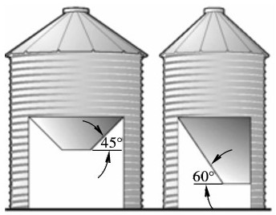
 Figure6-1The45degree bin is a center discharge and the60degree bin is aside discharge. 
Handling ingredients in bulk can reduce purchase cost per ingredient if sufficient quantities can be handled with the equipment and storage.If at all possible for onfarm application,all medicated ingredients should be purchased in bagged form to minimize the potential of carryover.This reduces residue problems in the storage structure and handling equipment.If medicated ingredients are purchased in bulk form,a dedicated bulk bin should be used.All bulk bins should be clearly labelled,or numbered,to avoid any crosscontamination of ingredients while filling a bin or mixing feed.Proper flushing and sequencing of feeds must follow usage of medicated feed to be in compliance with good manufacturing practices.

Lesson 2　Convey

There are many different types of equipment for conveying feeds from one part of a mill to another or from one piece of equipment to another.Some are designed to operate horizontally,some on a slope,others elevate the material vertically to a different level of the building.The requirement for elevators and conveyors will depend on how automated the mill is to be and how its plant is laid out.The utmost use of such equipment is made in the modern animal feed mill（often using pneumatic systems）to minimize labor needs and to maximize the use of land by building multistorey,rather than horizontally arranged plants.

The screw conveyor is an efficient way to move feed ingredients or finished feed around the mill（Figure6-2）.But,for a screw conveyor to function properly,the screw requires about a1/2inch clearance from the bottom and sides of the trough.Though this clearance can be reduced,smaller parts of the materials conveyed in the feed mill will always remain in the bottom of the trough.This can present two problems for plants using screw conveyors.The first problem is crosscontamination of different types of feed.For instance,if a mill is using rumensin in its beef feeds,and making horse feeds too.If the system is not properly flushed,the feed produced could have enough of the drug in the feed to have a seriously detrimental effect on the horses.Worse yet,if a feed mill fails to properly flush its system using ruminant meat and bone meal（MBM）in some feeds and producing either dairy or beef feeds,the feed crosscontamination could violate federal regulations on including ruminant MBM in ruminant feeds.Another problem with relatively weak conveyor cleanout is that the residue in the bottom of the conveyor,over time,becomes inviting to insects.Some of these insects,especially certain beetles,can have lifespan of30years and can hide in places where fumigation chemicals may have difficulty penetrating.Feed plants using the old screw conveyors technology are taking a risk.This is the reason why many feed mills are turning to drag conveyors.These drag conveyors have paddles that fit the form of the trough bottom and sides.Drag conveyors are available in various different shapes square,hexagon and round.Some people consider the round bottom conveyors to be the most effective for cleanout,thinking that gravity naturally pulls the ingredients to the bottom of the trough.But other companies have designed conveyors where the paddle fits in a hexagonal space,fittingthe space as tightly as possible.Other companies,using the square or rectangular design,will outfit the conveyor with brushes that follow behind the paddle to improve good cleanout.

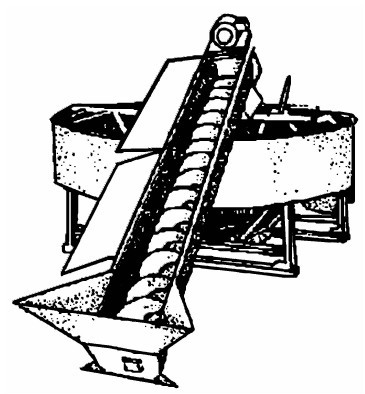
 Figure 6-2　Screw conveyor 
Lesson 3　Hammer Mill

In the feed processing there may be a number of ingredients that require some form of processing.These feed ingredients include coarse cereal grains,corn which requires particle size reduction which will improve the performance of the ingredient and increase the nutritive value.There are many ways to achieve this particle size reduction.

Both hammering and rolling can achieve the desired result of achieving adequately ground ingredients,but other factors also need to be looked at before choosing the suitable method to grind.Excessive size reduction can lead to wasted electrical energy,unnecessary wear on mechanical equipment and possible digestive problems in livestock and poultry.

Working Principle of the Horizontal Hammer Mill

Dropping into the grinding chamber from the top by gravity,the raw materials contact the hammer tips in the breaking zone,and get fast impacting due to their largespeed difference,resulting in the crushing of the raw materials.

Hammer Mill Requirements：

Low energy use

High performance

Simple maintenance

Wide and free entrance to grinding chamber

Leakfree and simple to change screen cage（also when damaged）

Simple switch and changeable,hardened hammers（for4way use）

Dosage feed on whole width of grinding chamber

Capacity depending on specific energy use

Temperature protection of grinding chamber and bearings Advantages：

are able to produce a wide range of particle sizes

work with any friable material and fiber

ease of use

lower initial investment when compared with a roller mill

minimal maintenance needed

particles produced using a hammer mill will generally be spherical,with a surface that appears polished

Disadvantages：

less energy efficient when compared to a roller mill

may generate heat（source of energy loss）

produce greater particle size variability（less uniform）

hammer mills are noisy and can generate dust pollution

General Design

The major components of these hammer mills,shown in the picture（Figure6-3），include：a delivery device is used to introduce the material to be ground into the path of the hammers.A rotor comprised of a series of machined disks mounted on the horizontal shaft performs this task.Freeswinging hammers are suspended from rods running parallel to the shaft and through the rotor disks.The hammers carry out the function of smashing the ingredients in order to reduce their particle size.A perforated screen and either gravity or air assisted removal of ground product.Acts to screen the particle size of the hammer mill to ensure particles meet a specified maximum mesh size.

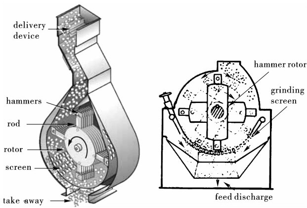
 Figure 6-3　Hammer mill 
Feeder Design

Materials are introduced into the paths of the hammers by a variable speed vein feeder.This type of feeder can have its motor slaved by a programmable controller to the main drive motor of the hammer mill.The operational speed of the feeder is controlled to maintain optimum amperage loading of the main motor.

Hammer Design and Configuration

The design and placement of hammers is determined by operating parameters such as rotor speed,motor horsepower,and open area in the screen.Optimal hammer design and placement will provide maximum contact with the feed ingredient.Hammer mills in which the rotor speed is approximately1800rpm should be using hammers which are around25cm（10inches）long，6.35cm（2.5inches）wide,and6.4mm（0.25inches）thick.For a rotor speed of about3600rpm,hammers should be15～20cm（6～8inches long），5cm（2inches）wide,and6.4mm（0.25inches）thick.

The number of hammers used for a hammer mill of1800rpm should be1for every2.5～3.5horsepower,and for3600rpm,one for every1～2horsepower.Hammers should be balanced and arranged on the rods so that they do not trail one another.The distance between hammer and screen should be12～14mm（0.5inches）for size reduction of cereal grains.

A common range of tip speeds seen in hammer mills is commonly in the range between5000and7000m/min（16000and23000feet per minute）.When the tip speeds exceed23000feet per minute,careful consideration must be given to the designof the hammer mill,the materials used in its construction,and the fabrication of all the components.Simply changing the rotational speed of the drive source is not a recommended method of increasing hammer speed in excess of23000feet per minute.

Impact is the primary force used in a hammer mill.Anything which increases the chance of a collision between a hammer and a target；increases the magnitude of the collision；or improves material takeaway provides an advantage in particle size reduction.The magnitude of the collisions can be escalated by increasing the speed of the hammers.

Screen Design

The amount of open area in a hammer mill screen determines the particle size and grinding efficiency.The screen must be designed to maintain its integrity and provide the greatest amount of open area.Screen openings（holes）that are aligned in a60degree staggered pattern optimize open area while maintaining screen strength.This method will result in a40percent open area using3.2mm（1/8inch）holes aligned on4.8mm（3/16inch）centers.

Feed producers need to pay particular attention to the ratio of open screen area to horsepower.Recommended ratio for grains would be55cm2（8～9inches square）per horsepower（Bliss，1990）.Not enough open area per horsepower results in the generation of heat.When the heat generated exceeds44℃～46℃（120～125°F），capacity may be decreased as much as50%.The removal of sized material from a hammer mill is a critical design feature.Proper output of material affects not only the efficiency of operation,but also particle size.When the correct ratio of screen area to horsepower is used and proper distance between hammers and screen face is maintained,most of the correctly sized particles will exit the screen in a timely manner.Anderson（1994）stated the particles that do not pass through the screen holes become part of a fluidized bed of material swept along the face of the screen by the highspeed rotation of the hammers.As these particles rub against the screen and each other their size is continually reduced by attrition.This excessive size reduction is counterproductive.Energy is wasted in the production of heat,throughput is restricted,and particles become too small.

Most new hammer mills are equipped with an airassist system that draws air into the hammer mill with the product to be ground.Systems are designed to provide reduced pressure on the exit side of the screen to disrupt the fluidized bed of material on the face of the screen,thus allowing particles to exit through screen holes.Some full circle hammer mills are designed so the screen is in two pieces.It is possible to use a larger hole size on the upward arc of the hammers to further reduce the amount of material on the face of the screen.

Nutritional Effects of Fine Grinding Feeds

In the past thirty years needs have not changed much for small or large milling companies grinding a90%corn based mash feed for pigs or poultry.What has changed is the dietary additives and uniformity of the distribution of these ingredients as part of the total ration.With the global economy changing very rapidly and many nations striving for selfsufficiency,one major focus should be increased production and decreased milling costs.As was the case three decades years ago and still is today,hammer milling various grains is the most inexpensive and highest tonnage producing method available.A hammer mill is a very versatile piece of equipment that can easily change particle size distribution by simply changing screen sizes,mill tip speeds,hammer patterns,or the total number of hammers in the unit.As hammer mills continue to dominate the feed and grain industry in developed countries as well as upandcoming nations,it is important to consult manufactures with a variety of milling equipment solutions.

The hammer mills main competition is the roller mill.The roller mill is capable of producing a tighter standard deviation of particle size distribution.However,capacity is lower and the purchase price is considerably higher as are maintenance repairs.Standard milling operations that reduce grains for livestock feed as part of premix or finish grind should consider a hammer mill for higher production,cost savings and ease of maintenance.

Lesson 4　Mixer

The feed will not be the balanced formulation it is designed to be unless it is properly mixed.Mixing is a key process,by which different feed ingredients are blended with each other under an external force,so that the particles of different ingredients can be homogeneously distributed in any volume.It is an important section to ensure the quality of compound feed and to improve the feed effects.At the same time,the scale of a feed mill depends on the productivity of the mixer.Therefore,the mixer is one piece of the key equipment in feed industry.

Absolute homogeneity can never be achieved when mixing solids,only gases and mixable liquids can be mixed completely homogenously.The resulting mixing quality is designated with the coefficient of variation“CV”，which indicates the standard deviation,as a percentage of the average value.The smaller these values are,the better themixture.Mixture with a CV of≤5%，are called homogenous.

CV=S/X×100%

In this formula：

S-standard deviation of the content of the detected ingredient in each sample of mixture；

X-average value of the content of the detected ingredient in each sample of mixture.

Dry mixers are a mechanical means of achieving this and come in two main types-vertical mixers and horizontal mixers.

Vertical Mixer

Vertical mixer consists of one or more vertical screws which elevate the ingredients to the top of the mixer where they fall by gravity to the bottom,to be mixed and reelevated（Figure6-4）.Vertical mixers are the most common type found in small livestock feed mills.However,the vertical type is less well suited to aquaculture,poultry and fish feeds than the horizontal type,which are much more efficient in blending in small quantities of liquids（such as added lipids）or in mixing ingredients with different particle sizes.

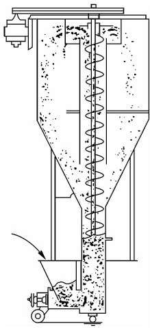
 Figure6-4Vertical mixer 
Horizontal Mixers

Horizontal mixers consist of a series of paddles or metal ribbon blades mounted on ahorizontal rotor within a semicircular trough.The blades move the material from one end of the mixer to the other,tumbling it as it goes.These mixers usually discharge the mixed product from the bottom.See above for inside views of both a paddle mixer and a ribbon mixer（Figure6-5）.

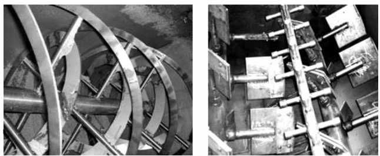
 Figure6-5Horizontal mixers 
Another type of mixer,which is similar to the horizontal type in action,has a bowlshaped or flatbottomed container in which a series of paddles are mounted on a spindle driven by a motor mounted either above or below the mixer.This type of mixer has the same advantages over the vertical type of mixer as the horizontal mixers mentioned earlier.In addition it is cheap and is therefore frequently used in farms,particularly in South East and South Asia.It can also be used for mixing moist feeds.

Totally speaking,vertical mixers are unsuitable for mixing wet ingredients.Horizontal mixers are more suitable,because of their complex construction,are often difficult to clean properly.There is also a tendency for sticky materials to adhere to the blades and to accumulate at one end of the mixer.Simple bowl or circular mixers,are the most suitable types for mixing wet ingredients or mixtures of wet and dry materials.They can also be used for mixing dry ingredients.This type of mixer is available in sizes suitable for mixing a few kilograms or of dealing with several tons of ingredients.The larger types discharge the mixed product from the bottom.

Factors Affecting the Technological Results of a Mixer：

effect of machine types

effect of the wearing of the main working parts

effect of the rotation speed of the mixer

effect of the fill ratio on mixing results

effect of feeding sequence

effect of the physical properties of material and the dilution ratio

Essential Factors to be Considered for Selecting a Mixer：

mixing homogeneity of the mixer

mixing time

residue conditions of the mixer

any material leakage from the mixer

Control of Mixing Time：

reasonably selecting the respective batching bins for each of the ingredients so that the ingredients can enter the batching scales according to the formulation amounts

the capacity of the two batching scales should be as close as possible

the capacity of the screw feeder

the precision and matching degree

discharging time

Lesson 5　Pellet

The process of pellet consists of forcing a soft feed through holes in a metal die plate to form compacted pellets which are then cut to a predetermined size.The machinery which has been developed for this purpose is now very diverse in design and there is much controversy between different equipment manufacturers as to which type is the most effective.Pellet is a key to the production of high quality nutritional feeds as they ensure that the feed formulation is in the correct quantities for all that eat them.Each bite of a pellet will have the same designed formulation ensuring all the stock feed as intended.

Most pellet mills now have one or more conditioning units mounted above them where liquids such as water and molasses can be added to improve pellet ability.The water is sometimes added in the form of steam which softens the feed and partially gelatinizes the starch content of the ingredients,resulting in firmer（and for aqua feed more water stable）pellets（Figure6-6，6-7）.

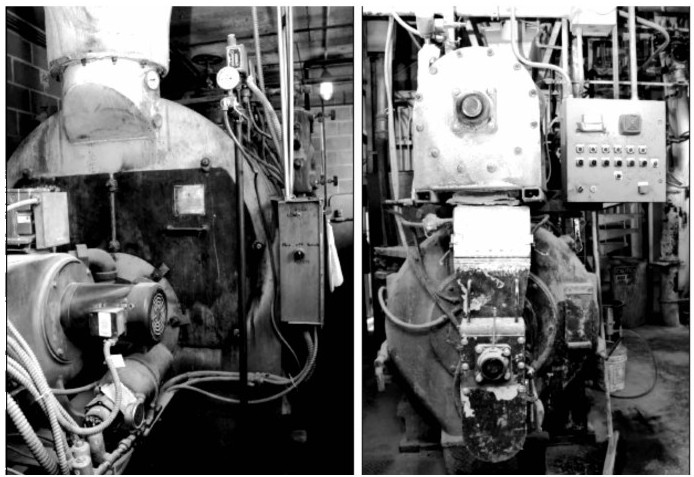
 Figure6-6Pellet system 
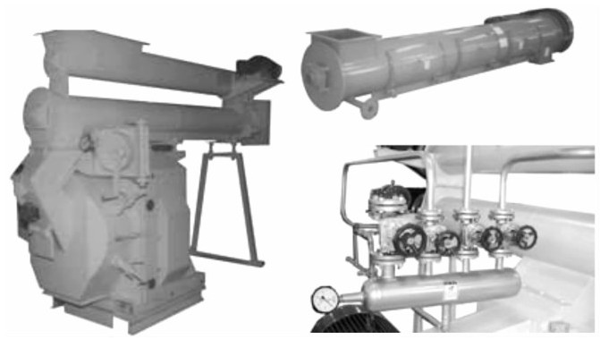
 Figure6-7Pelleter 
From the conditioner,the feed falls into the centre of the pelleter itself.In the pelleter two or more rollers and feed ploughs push the material through the holes of the die plate（Figure6-8）.

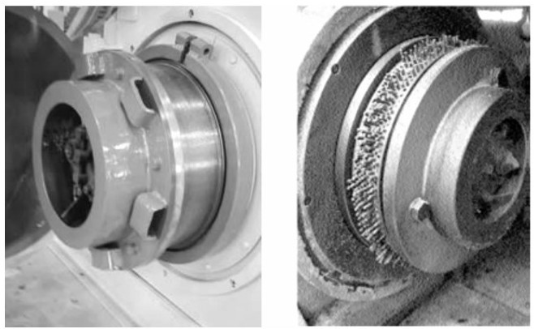
 Figure6-8Ring die of pelleter 
Usually the die plate itself rotates,and on its outerside stationary knives cut the pellets to a preset length.From there,they are transferred to a cooler/drier to remove the heat which is generated during the pellet process or is often added during steam conditioning.The moisture content of the pellets also needs to be reduced for proper storage.Pellet and the efficient operation of pellet mills are specialized subjects on which many books have been written.All makers of pellet equipment provide instruction in their use and some organize training courses in this and related topics.Die hole sizes usually range from1.5mm（shrimp）up to9.5mm.The thickness of the die plate helps to determine the compactness and stability of the pellet.Pellet dies can be up to about90mm thick（Figure6-9，6-10）.

Pellets from dry pelleter may exit at up to88℃and17%～18%moisture.The temperature must be quickly reduced to ambient and the moisture level to10%～12%or less for proper storage and handling.Pellets must therefore be cooled and dried.Moist pellets,if they are going to be converted to dry pellets,also need drying although their temperature is not normally much elevated during manufacture.

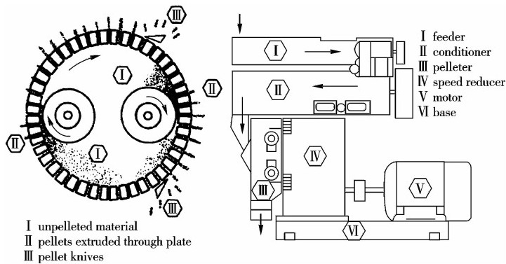
 Figure6-9Pelleter structure 
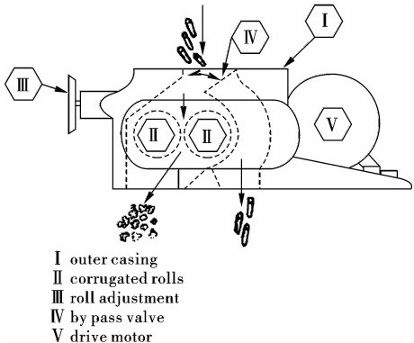
 Figure6-10Internal construction of pelleter 
Pellet：Nutritional and Physical Quality

After long time conditioning,the feed mash may be cooled for use in“hygienic”or conditioned mash feeds,such as for poultry breeders.In most cases,however,it enters the pellet process,which also has effects on the nutritional as well as the physical quality of the feed.In pellet,many factors must be taken into account to optimize the process：capacity of the pellet press,feed formulation,pellet die specifications and the required pellet quality.

Long experience across wide geography and range of processing and formulation conditions suggests the effect of these variables.For example,a modern pellet press may produce45tonsper hour（tph）in South America,while the same machine is capable of reaching a capacity of only18tph in a Dutch environment.Even though the conditioning process influences the output of the pellet press,these cases are based on the same conditioning process.The big difference in output can be explained by formulation,die specifications and the required pellet quality.

At the pellet press,a number of variables can be used to optimize the process.These variables range from the speed of the die to hydraulic roller adjustment to control the“pad”or thickness of press meal subject to pressure between the roller and the die.In any case,these variables should only be used when their influence is thoroughly understood by the operating personnel.Once,this“practical knowhow”demonstrated the high value of an experienced pellet press operator.Today,this knowhow could also be delivered by an intelligent pellet line automation system,which is capable of combining the different variables in order to optimize the process.

The pellet die necessarily has a major influence on pellet capacity and physical pellet quality.As dies of reputable suppliers are generally all of the same material,which is completely hardened,the main difference is generally found in the open area surface-OAS-that is,the number of holes-which relates directly to the capacity of the pellet press.Therefore when comparing dies,the aspects that need to be considered are the types of material to be used,the hardness and whether surface hardening or complete hardening will be used,the number of holes or the open area surface（OAS），the die wall thickness,and the contour or shape of the holes（including counterdrill,countersink or other“relief”characteristics）.

Design Details

Given the same formulation and the required pellet quality,the die surface of the pellet mill（with the same OAS）and the die thickness are the major factors influencing capacity.These together with the motor drive installed,determine the diearea power requirement（kilowatts per square centimeter），which is a factor to be considered when researching pellet operational costs.Practical trials carried out under100%identical circumstances have indicated that differences in operational costs among different types of pellet presses can vary up to50000（roughly US$47000）per year,which are,of course,significant figures,but realistic nevertheless.

design attributes are combined with an intermediate drive,allowing the possibility to change die speed relatively easily,by changing a small pulley,without installing frequency controllers.Also,this supplier incorporates large roller diameters.This creates a relatively small angle or“nip”between the die and the roller which compacts the feed smoothly before forcing it into the die holes.

Feed mash conditioning and pellet press design variables differ when using the equipment for processing mash feed only or for pellet conventional livestock or poultry rations or aqua feeds.Yet the principles remain the same,and as circumstances differ constantly,the feed manufacturers should seek detailed information and a custommade solution based on long experience and specialized knowledge and expertise.

Conditioning for Physical and Nutritional Quality

In the conventional conditioning process,the variables of temperature and humidity are closely related as steam is generally used to increase the temperature of the press meal.There is a practical maximum level of humidity of the press meal in order to avoid blockages of the pellet press.Typically,therefore,the maximum percentage of steam that can be added to the press meal is approximately5%and for each percentage point of dry steam added,the temperature of the press meal will increase by approximately15℃.Of course,the quality of the steam is influential in the conditioning process and these“rule of thumb”values are only applicable when a good quality steam is being used.

Steam quality and steam quantity control warrant close attention to optimize the conditioning process,although in practice they often do not receive it.In addition to steam quality and its resulting effects on mash temperature,the humidity or moisture content of the mash,along with the composition or formulation of the feed,are of great importance in conditioning.As temperature and humidity are strongly related,conditioning time or“retention time”remains as a variable in a conventional conditioning process that can be readily adjusted by the operator（Figure6-11）.

Keep in mind that the conditioning process is an optimization and not a maximization.While single conditioners were a common choice for quite a number of years,now double and even triple conditioners are used prior to the pellet process.Previously,conditioning times lasted,in most cases,less＆nbsp；

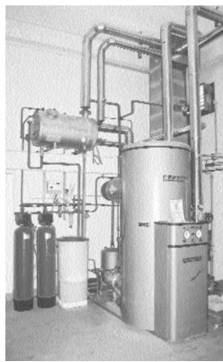
 Figure6-11Pellet steam system 
than1minute.More importantly,these early types of conditioners did not guarantee the“firstin,firstout”（FIFO）principle of feed mash flow.

For many years,the only conventional conditioning process that could guarantee a given retention time and that extended the maximum retention time to1minute or beyond,while also guaranteeing FIFO,was the ripen.This was a kind of cooking vessel-with many variations-which has been in the feed milling industry for more than20years.The main concern when using a ripen in a conventional multispecies feed plant has been crosscontamination from one batch of feed mash to another.But when much longer conditioning times have been required-for example,greater than4minutes-then the ripen are still a valid option.

Retention time can be varied to adjust the temperature level of the feed mash in order to avoid destructive effects on the nutrients in the feed,such as protein denaturation.Also,depending upon the feed formulation,it can be used to optimize availability of nutrients in the feed and to optimize the physical quality of the pellets.

The New Generation for Conditioning and Pellet

Mash conditioning is a complex process that has captured the attention of modern feed millers for some time now,even as the process of pellet formation appears to have receded in importance.However,feed production involves balancing different manufacturing processes for predictable,desired effects.Because one process is linked to another,it is difficult to consider only one process without taking another into consideration.This is especially the case with mash conditioning and pellet,where changes in one process inevitably result in changes in the other.

Conditioning,it is good to remember,is a process that actually takes place from intake of feed raw materials to outloading of finished feed products.However,the main focus and most of the capital and operating cost of conditioning is in the treatment of the“press meal”or raw feed mash prior to the pellet process.Conditioning of press meal is a process with the variables of time,humidity,temperature and pressure.However,pressure is only used in processes where“super conditioning”expander or extruder techniques are used.In the conventional conditioning processes at atmospheric pressure,the main processing variables are time,humidity and temperature.In the past,the main aim of conditioning was to optimize the pellet process.Nowadays it is much more intention to optimize the nutritional and physical quality of the feed.

Greater Retention Time,FIFO and Press Feeder Control

A new generation of conventional,nonpressurized conditioners focuses on the variables of time,temperature and humidity where conditioner retention time is maximized at4minutes at temperatures of approximately85℃and capacities of up to20tph.＆nbsp；These types of conditioners should guarantee FIFO feed mash movement,while also guaranteeing retention time.The objective of this“long time conditioning”technology is to increase the flexibility and range of conventional conditioning,including the control of pathogenic bacteria in the feed mash,particularly salmonella.

The principle of the new generation of conditioners is rather simple：Generally the feed is brought up to the required temperature by means of steam and subsequently transferred into a large screw conveyor in which the speed of the mash is determined by a frequency controller.The screw conveyor is steam or electrically heated and insulated.So,by means of the amount of filling of the conditioner cylinder volume and the motor control frequency at a certain pitch of the conveyor screw,retention time can be guaranteed.

In practical application in the feed plant,there are a few concerns raised by the new generation of press meal conditioners.The first concern is height or“headroom”above the pellet press,which often is not much,especially in plants where the new conditioner is intended to be retrofitted.For this reason,one supplier positions the“long time conditioner”（LTC）beside the existing conventional mash conditioner-not above or below it.

The second concern is the control of the pellet process because the longer retention time leads to a delayed reaction of the pellet press to changed variables.What further complicates pellet press control is the fact that the pellet press cannot be fed directly from the screw conveyor that controls retention time in the LTC.Some suppliers therefore use small intermediate bins between the retention time screw and the pellet press with a feeding screw for the pellet press below the bin.However,with this arrangement,there is the possibility of crosscontamination as well as loss of temperature in the press meal.Once again,more height is required and it becomes more challenging to maintain process control due to the use of buffer bins.In order to avoid this,one supplier has integrated a feeding device in the LTC,facilitating the pellet press control and allowing for installation in an area requiring significantly less height.

Coolers/Dryers and Crumbler

Coolers/dryers are of two basic types,horizontal and vertical.In the horizontal type of cooler/dryer,the pellets are conveyed on a perforated steel mesh or moving belt through which a cooling air stream is passed.The horizontal method is best for“sticky”dry pellets or for moist feeds（if it is necessary to dry the latter）.Heat can also be applied to the air supplied to horizontal driers for reducing the high moisture contents of moist feeds to those of dry pellets for storage.This type of drier is standard in the production of noodles and spaghetti and other pasta.Horizontal dryers may be very largeand are often arranged on several spatial levels.

A crumbler is a roller mill with rolls specially designed for breaking up pellets into smaller particles.Usually the crumbler consists of two corrugated rolls situated below the cooler/drier exit.The pellets can then be diverted into the crumbler,if crumbles or granules are desired,or they can bypass it.

Lesson 6　Expander/Extruder

The expander is often used as a pressure conditioner before the pellet mill for improving the pellet properties and nutritive effects.It can also be used as a standalone machine for producing a crumbled,but not pellet,product which is fed to the animals directly.The field of application is not limited to the hydrothermal pressure treatment for improving the nutritive value,but the expansion also helps to reduce pathogen germs,inactivate antinutritive factors,modify starch,and increase the content of rumen undegraded protein.

The first expanders,produced in the sixties by Anderson International,were used mainly in the oil milling industry.The outlet of this expander was equipped with a firmly mounted die,a separate conditioner before the expander for water,and steam addition,which had not yet been provided.Water and steam were added in the expander.Experimentation with the interrupted expander showed that,unlike the screw press,the expander operated well without any preconditioning of the feed material other than grinding.The interrupted flight design mixes and thoroughly blends injected water and steam into the feed material.This allows the expander to accept a dry,free flowing material,therefore simplifying the preparation equipment（Figure6-12）.

Through the years,interrupted flight expanders have manufactured human foods,animal feeds and adhesives made from cereal grains.Interrupted flight expanders impart cooks that destroy undesired enzymes,such as urease,lipase and myroxinase.These expanders transform oilseeds,such as cottonseed and soybean and screw pressed oilseeds,into porous collets that dissolve extract very efficiently.Interrupted flight expanders also dry synthetic rubber by mechanical friction.

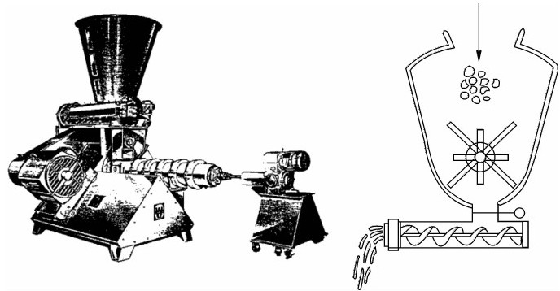
 Figure6-12Expander system 
The extrusion cooking process,because it causes a high level of gelatinization of starches,results in feeds with good water stability. It can produce “expanded"floating feeds as well as sinking pellets. The process also improves the digestibility of the product.However,extrusion cookers are usually very large and expensive to purchase and operate.

Feeds which have ingredients such as soybean meal and cereal grains can be made more digestible,and the nutrients are therefore more available.Floating feeds are made using extruders along with highly waterstable sinking feeds which can be made with extruders as well.In some cases,extruders are used just to prepare feed materials,such as dry extrusion of soybeans.

Basically,an extruder is a long barrel with a screw auger inside which is specially designed to subject feed mixtures to high heat and steam pressure.When feed exits the die at the end of the barrel,trapped steam blows off rapidly,the soft warm pellets expand,and a low density floating pellet is produced.Extruders are very versatile,and can make feeds with many different characteristics（Figure6-13）.

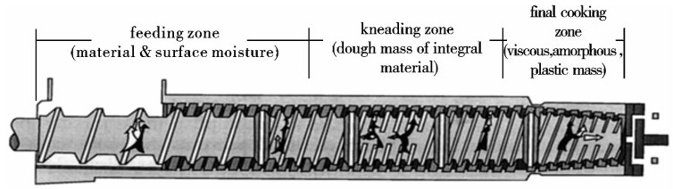
 Figure6-13Extruder 
Feeding Zone

The lowdensity discrete particles of raw material are transported from the extruder barrel inlet into the interior of the extrusion processing chamber through conveying by the screw;the flow channel of the screw typically is not filled in this zone because of the air entrapped in the coming material;slight compression of the material in the end part of this zone expels the air;water,an excellent plasticizer,typically is injected into the barrel in the feeding zone to facilitate development of texture and viscosity and to enhance conductive heat transfer.

Kneading Zone

This zone continues the compression started in the feeding zone,and the flow channels of the extruder have a higher degree of fill;as the degree of screw fill increases,pressure begins to develop,which results in a distinct mechanical shear,meanwhile backflow of the material occurs.Requirement for the steam injected here:pressure≥5~10bar;the temperature rises in this zone due to the thermal energy and moisture from steam injected,causing the discrete particles to agglomerate and to form a more integral,flowing,elastic dough mass;the shear in this area of the extruder barrel is moderate.

Final Cooking Zone

In this area melting and texurizing occur,temperature and pressure typically increase most rapidly,and shear rates are the highest because of the extruder screw configuration and maximum compression of the extrudate;

The pressure,temperature,and resulting fluid viscosity are such that the extruder will expel from the extruder die to form a final product with the desired texture,density,color,and functional properties.

Main Working Parameters of Extruder

The time duration from material enters the feeding zone until it leaves the final cooking zone is20~30s,in which the time for material to stay in the final cooking zone is only5~8s;the maximum temperature of material in the final cooking zone is140~170℃;the moisture content in the feed product extruded out of the extruder ranges20%~30%;after the extrudate leaving the extruder die losses3%~4%of its original moisture content due to flash evaporation;the temperature of the extrudate after moisture flash evaporation is about85℃.

Another type of feed which can be made on extruders is softdry feeds.This type of feeds is usually high in moisture（12%~15%）and fat（15%）.They usually contain a number of preservative agents to prevent spoilage.Softdry feeds can be used for fish that prefer to eat soft feeds,yet they do not need refrigeration like moist feeds.

Product enters the top of the cooler via a rotary airlock.A significant portion of the internal cone of the cooler is perforated,which allows air to be drawn through the product.Due to the greater working depths in the cooler,the fat has time to absorb into the pet food before it reaches the perforations.As a result,plugging of the perforations is not a problem.

Around the outside of the perforated cone is a secondary cone,which serves as an air plenum and is where the cooling air enters the cooler.The advantage of the air plenum is that it can be directly connected to a ducting system,allowing for outside,chilled or filtered air to be used in the cooling process.

Due to the design of the cooler,it is impossible for air to bypass the product as long as the product level is maintained in the normal operating range.Because air cannot bypass the product,the ratio of the volume of air to the product throughput rate is quite low.In most cases,the exhaust air volume can be reduced to the point where the exhaust air temperature is equal to the incoming product temperature.This reduces the amount of exhaust air and minimizes the power requirement of the exhaust fan.

Fat/Molasses is sometimes added to feed after pellet or extrusion because high lipid feeds do not pellet so well as low lipid products.Fat is therefore sprayed onto the feed in mixers placed in the production flow after the pellet equipment.

ExtrudersCook,Form,Mix,Texture and Shape

Varying levels of temperature and moisture inside the barrel have an influence on the grade of cook.Moisture can vary from10%~15%.Temperature can vary from49~160℃（120~320）.Directinjected water and steam influence moisture.Temperature is influenced by the amount of final moisture injected as steam as well as the friction generated per kg of material.Horsepower consumption is influenced by the number and size of dies through which the material is forced to flow,as well as the level of moisture.

The equipment in feedprocessing plants is required to perform the following functions:receiving,storage,grinding,mixing,conveying,extrusion cooking,drying/cooling,pumping,coating,and packaging.The objective in the formulated feed industry today is to manufacture a diet that:

satisfies target animals'nutritional requirements

meets or exceeds the customers'expectations

satisfies environmental concerns

provides favorable economics

Although the focus in the past has often been strictly on economics,shifting trends in today's society underlies the importance of environmental issues.Feeds that are“environmentally friendly"are not only popular,but are being demanded by the public.

Today's issues include processing a feed in a manner that will maximize animal efficiency by freeing feedstuffs for human consumption,reducing animal waste outputs,and eliminating foodborne illness in the food supply chain.As formulated feeds become more sophisticated to meet the specific physiological needs of the animal and the environmental expectations of the public,processing technologies such as extrusion will become a factor in this industry.

Issue number one in pellet of course is pellet quality or“the ability to take handling without generating excessive fines".There are several factors in the pellet process that influence pellet quality.Keith Behook of Kansas State University concludes that formulation has the largest impact on pellet quality,followed by grinding and conditioning.The die is still responsible for15%in the quality of the pellet（Figure6-14）.Once the pellet is forced through the die little can go wrong when the pellets are properly cooled.The influencing factors shown in the diagram will be looked at in more detail.Additional elements that usually receive inadequate attention will also be discussed.When pellets have a poor quality fines will occur in the feed,which causes segregation in the feed and leads to selective feeding by the animals.Depending on where the fines are deposited animal performance is affected.Poor pellet quality（high percentage of fines）in poultry flocks for example can lead to a shift in uniformity.

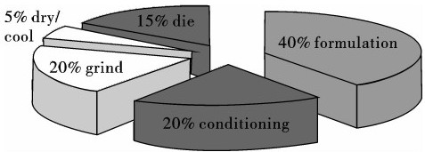
 Figure6-14Factors affecting pellet quality 
The blending of the raw materials has the greatest impact on the pellet process.Thus,for example,by adding pellet aids with or without nutritional substances,adhesive forces can be created inside the pellet or,by adding fat,the pellet mill throughput can be increased and the energy requirement reduced.Although pellet quality for40%depends on formulation of the feed,this fact is in stark contrast to how it is used.Diet formulation is based on meeting the nutrient requirements of the animal at the least possible cost per tonne.There is little consideration for pellet quality and production rate.Sifter The sifter（also refer to as sieves,screens and screeners）is a separator,usually oscillating,with a number of screens.It is used to separate crumbles or granules whichare too large,both in pellet and crumble manufacture,and to screen off the dusty portion（fines）of the feed for return to the pelleter for further processing.The sifter is a means of ensuring a good quality product with the right particle size and a low level of fines,which are wasteful to feed（Figure6-15）.

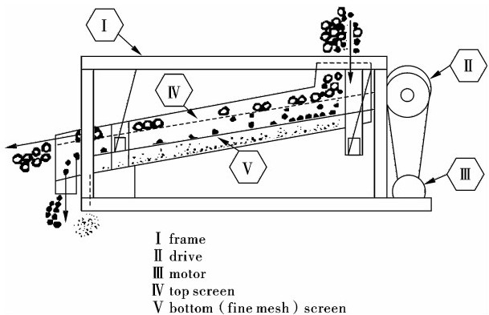

Vocabulary

adhere　黏附,黏着

adhesive　黏合剂

batching定量,计量

bearing轴承,方位

blend　混和

buffer bin缓冲槽,中间槽

conditioner调质器

convey　搬运

cooler　冷却器

crosscontamination交叉污染

crumbler碎裂料（旋转碎土锄）

cylinder　圆筒,圆柱体,汽缸,柱面

density　密度

die hole模孔

die plate拉模板,印模,凹模

die thickness凹模厚度

drag conveyor刮板输送机

drier　干燥机,干燥剂

elevate　举起,提升

exhaust air排气,废气

exhaust fan排气风扇,抽风机

expander　膨化机

extruder　压出机,挤压机

extrusion cooking挤压蒸煮

finished product成品,产品

flow ability流动性

fluidized bed流化床,流动层

friction　摩擦,摩擦力

gravity　重力

grindermixer磨粉混合机

grinding chamber研磨室,磨粉室

hammer mill锤式粉碎机

hopperbottom漏斗底部

horizontal mixers卧式混合机

horizontal shaft水平轴

humidity　湿度

lubrication　润滑油

mill screen细筛,磨粉筛

molasses　〈美〉糖蜜

oscillate　振荡

outloading卸料

paddle mixers桨式混合机

pellet mill制粒机

perforated　穿孔的,凿孔的

protein denaturation蛋白质变性

rectangular　矩形的,成直角的

refrigeration　冷藏,冷却

ribbon mixers螺旋式混合机

roller mill滚筒磨粉机

rotation　旋转

rotor　[机]转子,回转轴,转动体

salmonella　沙门氏菌

screw auger螺旋钻,（木工用）麻花钻,推运螺旋

screw conveyor螺旋输送机

screw conveyor螺旋输送机

separator　离析器,脱脂器,隔离物

sieve　筛,滤网，筛,过滤

sifter　筛子

slope　斜坡,斜面,倾斜v.（使）顺斜

spray　喷雾,飞沫喷射,喷溅

standard deviation标准偏差

stationary knife磨刀

transverse mixers横式混合机

urease　[生化]脲酶,尿素酶

variable speed变速

vertical mixers立式混合机

vertical type立式

volumetric feeder定体积给料器

Part 7　Technology of Feed Manufacturing

Lesson 1　Definitions

Additive：An ingredient or combination of ingredients added to the basic feed mix or parts thereof to fulfil a specific need,which is usually used in micro quantities and requires careful handling and mixing.

Complete feed：A nutritionally adequate feed for animals other than man：by specific formula it is compounded to be fed as the sole ration and is capable of maintaining life and/or promoting production without any additional substance being consumed except water.

Compound feed：A mixture of products of vegetable or animal origin in their natural state,fresh or preserved,or products derived from the industrial processing thereof,or organic or inorganic substances,whether or not containing additives,for oral feeding in＆nbsp；the form of a complete feed（see also formula feed）.

Concentrate feed：A feed used with another to improve the nutritive balance of the total and intended to be further diluted and mixed to produce a supplement or a complete feed.

Conditioned,conditioning：（process）Having achieved predetermined moisture characteristics and/or temperature of ingredients or a mixture of ingredients prior to further processing.

Cooked,cooking：（process）Heated in the presence of moisture to alter chemical and/or physical characteristics or to sterilize.

Crumbled,crumbling：（process）Pellets reduced to granular form.

Date of manufacture：The date on which the food becomes the product as described.

Date of packaging：The date on which the food is placed in the immediate container in which it will be ultimately sold.

Diet：Feed ingredients or mixture of ingredients including water,which is consumed by animals.

Diluent：（physical form）An edible substance used to mix with and reduce the concentrate of nutrients and/or additives to make them more acceptable to animals,safer to use,and more capable of being mixed uniformly in a feed.（It may also be a carrier）.

Expanded,expanding：（process）Subjected to moisture,pressure,and temperature to gelatinize the starch portion.When extruded,its volume is increased,due to abrupt reduction in pressure.

Extruded：（process）A process by which feed has been pressed,pushed,or protruded through orifices under pressure.

Farmmade aqua feeds：Feeds in pellet or other forms,consisting of one or more artificial and/or natural feedstuffs,produced for the exclusive use of a particular farming activity,not for commercial sale or profit（New,Tacon＆Csavas，1995）.

Feed（s）：Edible material（s）which are consumed by animals and contribute energy and/or nutrients to the animals diet.（Usually refers to animals rather than man）.

Fish meal：（feed ingredient）Fish meal is the clean,dried,ground tissue of undecomposed whole fish or fish cuttings,either or both,with or without the extraction of part of the oil.It must contain not more than10%moisture.If it contains more than3%salt（NaCl），the amount of salt must constitute a part of the brand name,provided that in no case must the salt content of this product exceed7%.

Food：Any substance,whether processed,semiprocessed or raw,which is intended for human consumption,and includes drinks,chewing gum and any substance which has been used in the manufacture,preparation or treatment of“food”but does not include cosmetics or tobacco or substances used only as drugs.

Formula feed：Two or more ingredients proportioned,mixed and processed according to specifications.

Gelatinized,gelatinizing：（process）Having had the starch granules completely ruptured by a combination of moisture,heat and pressure,and in some instances,by mechanical shear.

Ground,grinding：（process）Reduced in particle size by impact,shearing or attrition.

Hazard：A biological,chemical or physical agent in,or condition of,food with the potential to cause an adverse health effect.

HACCP：Hazard analysis critical control point.A system which identifies,evaluates,and controls hazards which are significant for food safety.

Heatprocessed,heatprocessing：（process）Subjected to a method of preparation involving the use of elevated temperatures with or without pressure.

Ingredient,feed ingredient：Means a component part or constituent of any combinations or mixture making up a commercial feed.

Irradiated,irradiating：（process）Treated,prepared,or altered by exposure to a specific radiation.

Label：Any tag,brand,mark,pictorial or other descriptive matter,written,printed,stencilled,marked,embossed or impressed on,or attached to,a container of food.

Labelling：Any written,printed or graphic matter that is present on the label,accompanies the food,or is displayed near the food,including that for the purpose of promoting its sale or disposal.

Mash：（physical form）A mixture of ingredients in meal form.

Meal：（physical form）An ingredient which has been ground or otherwise reduced in particle size.

Medicated feed：Any feed which contains drug ingredients intended or presented for the cure,mitigation,treatment,or prevention of disease of animals other than man or which contains drug ingredients intended to affect the structure or any function of the body of animals other than man.

Microingredients：Vitamins,minerals,antibiotics,drugs,and other materials normally required in small amounts and measured in milligrams,micrograms or parts per million（ppm）.

Pellets：（physical form）Agglomerated feed formed by compacting and forcing through die openings by a mechanical process.

Pelleted,pelleting：（process）Having agglomerated feed by compaction and forced through die openings.

Premix：A uniform mixture of one or more microingredients with diluent and/or carrier.Premixes are used to facilitate uniform dispersion of microingredients in a larger mix.

Premixing：（process）The preliminary mixing of ingredients with diluents and/or carriers.

Ration：The amount of the total feed which is provided to one animal over a24hour period.

Risk：A risk is an estimate of the probability and severity of the adverse health effects in exposed populations,consequential to hazards in food.

Risk management：The process of weighing policy alternatives in the light of the results of risk assessment and,if required,selecting and implementing appropriate control options,including regulatory measures.

Screened,screening：（process）Having separated various sized particles by passing over and/or through screens.

Shrimp meal：（feed ingredient）Shrimp meal is the undecomposed ground dried waste of shrimp and contains parts and/or whole shrimp.If it contains more than3%salt（NaCl），the amount of salt must constitute a part of the brand name,provided that in no case must the salt content of this product exceed7%.

Sifted：（process）Materials that have been passed through wire sieves to separate particles in different sizes.The separation of finer materials than would be done by screening.

Steamed,steaming：（process）Having treated ingredients with steam to alter physical and/or chemical properties.

Straight feedstuff or straights：A vegetable or animal product in its natural state,fresh or preserved,and any product derived from the industrial processing thereof,and single organic or inorganic substance,whether or not it contains any additive,intended as such for feeding.

Supplement：A feed used with another to improve the nutritive balance or performance of the total and intended to be（i）fed undiluted as a supplement to other feeds；or（ii）offered free choice with other parts of the ration separately available；or（iii）further diluted and mixed to produce a complete feed.

参考译文

定义

添加剂：用以满足特定需要而添加到基本饲料中的一种成分或混合成分。通常用量很少并需要谨慎处理和混合。

完全饲料：供人类以外的动物使用的营养充足的饲料，依照特殊配方混合而成，作为唯一的食物配量，能够在除水以外不再消耗任何其他物质的情况下维持生命和/或提高产量。

混合饲料：以完全饲料的形式用于喂养的混合物，这种混合物可以是天然状态下新鲜的或保鲜的动植物产物的混合物或者是工业加工衍生的有机物或无机物的混合物（不论是否含有添加剂）。

浓缩饲料：与其他饲料配合使用以改善总体营养平衡的饲料，用于通过进一步稀释和混合来生产辅助饲料或完全饲料。

调质：（过程）在原料或混合料在进一步加工之前取得预定的湿度特性和/或温度的过程。

熟制：（过程）在有湿度情况下加热来改变饲料的化学和/或物理特征或消毒。

粉碎：（过程）将颗粒饲料破碎为细粒形态。

生产日期：饲料制成所描述的成品的日期。

包装日期：饲料被装入最终用于销售直接容器的日期。

食物：动物消耗包括水在内的饲料成分或成分混合物。

稀释剂：（物理状态）一种可食用的物质，用来混合和降低营养物和/或添加剂的浓度，使之更易于被动物所接受，使用更安全，且更利于在饲料中均匀混合（它也可以是一种载体）。

膨化：（加工过程）在水分、压力和温度作用下使淀粉物质糊化，在挤压时，其体积由于压力的突然下降而增加。

挤压：（加工过程）饲料在压力下被挤压、推挤出孔洞的过程。

自制水产饲料：颗粒或其他形状的饲料，包含一种或多种人工和/或天然饲料源，为专门用于某种特定的养殖方式而生产，不用于商业销售或营利。

饲料：动物消耗的可食物质，为动物饮食提供能量和/或营养。（通常指动物，不包括人）。

鱼粉：（饲料成分）鱼粉是没有变质的整条鱼和/或碎鱼块（提取过或未提取鱼油）的清洁、干燥、研磨成粉的组织。它的含水量不得超过10%。如果含盐量（NaCl）超过3%，商标中必须标明含盐量，且含盐量绝不能超过7%。

食品：加工、半加工或生的任何物质，生产用于人类消费，包括饮料、口香糖和用于生产、准备或处理食品的任何物质，但不包括用于化妆品、烟草或只用作药物的物质。

配方饲料：包含两种或多种成分，按特定要求混合或加工而成。糊化：（加工过程）淀粉颗粒通过水分、加热和加压共同作用以及在某些情况下通过机械剪切而完全破裂的过程。

研磨：（加工过程）通过碰撞、剪切或摩擦降低颗粒大小的过程。

危害：食品中可能导致对健康的负面影响的生物、化学或物理因素或其状态。HACCP：危害物分析与关键控制点。对那些严重影响食品安全的危险因素进行确认、评价和控制的系统。

加热处理的，热处理：（过程）在加压或不加压条件下，一种采用提高温度的制备方法。

成分，饲料成分：构成商业饲料的混合物或化合物的组成成分。

辐照：（加工过程）通过暴露在特定的射线下对物质进行处理、加工或改变。

标签：在食品容器上书写、印制、喷刷、标记、蚀刻、压制或附着的标签、商标、标识、图画或其他起描述作用的物品。

标签内容：出现在食品随带或在食品近旁的标签上的（包括用于促销或处理）书写物、印刷物或图形材料。

混合粉：（物理形态）粉状配料的混合物。

粉：（物理形态）被研磨或降低了颗粒尺寸的成分。

药用饲料：包含药物成分的饲料，准备用于或用于治疗、减缓、处理或预防除人以外的动物的疾病，或用于调节除人以外的动物躯体的结构或功能。

微量成分：维生素、矿物质、抗生素、药物和其他通常少量需要的物质，用毫克、微克或每百万分之单位（ppm）计量。

颗粒：（物理形态）通过机械工艺在模具中压制聚结形成的饲料。

制粒：（加工过程）通过模具压制成聚结饲料。

预混料：一种或多种微量成分与稀释剂和/或载体的均匀混合物。预混料是便于使微量成分在大量混合物中得到均匀分散。

预混合：（加工过程）成分与稀释剂和/或载体的初步混合。

定量：24小时期间提供给一只动物的饲料总量。

风险：是指食品中危险因子对暴露群体的健康带来负面影响的可能性和严重性的预测。风险管理：在风险评估结果的基础上，权衡可选择策略的过程，必要时可选择和实施适当控制方案，包括管制措施。

粗筛：（加工过程）使用筛网分离不同尺寸的微粒。

虾粉：（饲料成分）未变质的干虾下脚（包括虾块和/或整虾）粉碎物。如含盐量超过3%（NaCl），必须在商标中标明含盐量，但含盐量绝不得超过7%。

细筛：（加工过程）用金属丝制的筛网分离不同尺寸的微粒。可以筛选比粗筛更细的物质。

蒸：（加工过程）用蒸汽处理配料，以改变其物理和/或化学特性。

原饲料或原料：用于喂养的在自然状态下的植物或动物产品，可以是新鲜的或保鲜的，或是来自工业加工衍生的产品，是有机物或无机物，不论是否含有添加剂。辅料：与其他饲料配合使用，改进总体营养平衡的饲料，可以用来作为其他饲料的辅料不经稀释直接投喂；或与其他要求分批定量投喂的饲料随意搭配；或进一步稀释和混合以制成完全饲料。

Lesson 2　Grinding Technology

Prebreaking,Then Finer Grinding

Some North American feed manufacturers use two grinders in series-the first performing a prebreak of raw materials,and the second grinding the total mixed feed ration.They commonly refer to this arrangement as a“post mixer”grinding system,although it differs from the European post grind concept of batching directly to the grinder.

Nonetheless,the advantages of this step grinding technique include lower grinding costs,finer finished products,more uniform particle sizing,more uniform finished product mix（lower coefficient of variation），and greater grinding system capacity.The primary disadvantages of this type of system are the potential for the destruction of some micro ingredients and vitamins,and the higher capital costs to install the system.In most cases,the cost of additional capital equipment is offset within6to12months in the energy savings of the grinding circuit alone.Additional benefits,such as increased pellet die and roller life and lower extruder parts wear,as well as increased pelleting or extrusion efficiency,are bonuses on top of the energy savings.This twogrinder system may employ two mills,one roller mill and one hammer mill,or two roller mills.Additionally,sieving between the“breaks”or grinding events may further enhance the energy efficiency of the system and reduce operating costs by removing sized materials upstream from the secondary grinder,or by returning oversize materials to the prebreak machine.

Antidust Technology

Conventional fine particle and dust control systems for feed plants include cyclone separators,fabric filter collectors and vent filter systems.Now,a new application of the inertial filtering principal may prove useful in some pellet cooling operations.Different types of cyclone separators offer a range of efficiency,depending upon the application＆nbsp；bulk materials receiving,grinding,storage and most pelleting systems.However,they typically cannot separate the finest particles generated from pellet cooling,especially for products with particle sizes below10microns.For particles larger than20microns,cyclone separators work well and typically require little maintenance unless they are required to cope with large quantities of highfat particles or other sticky materials.For final,preemission dust separation,the cyclone separated air stream may be routed to a“bag house”on the plant roof or adjacent structure containing fabric filter collectors.

Like cyclones,however,fabric filter collectors suffer from“blinding”as a result of highfat particles.This is an increasingly common occurrence as air pollution and nuisance emission controls become more stringent.Also,today feed products incorporate more vegetable oils which generate smaller aerosol particles at ambient temperatures than animal fats and can travel further in the pellet cooling air stream.Electrostatic precipitators and other technology can be used to“scrub”the dusty air,but only at a high capital cost.Cyclone separators employ the inertial filter principle in which centrifugal force separates the particles-which have more mass-from the air.Other inertial filters use the conservation of kinetic energy of particles in the air stream which propels particles into traps within the filter even as the surrounding air flows around the obstacles.Another design used in applications to control highly abrasive dust makes use of a network of minicyclones which is effective on dust down to5microns.

Lesson 3　Steaming Technology

Steam Production and Trap Management

As a general rule,pellet production rate and pellet quality improve as the conditioning temperature increases.In1989，Winowiski determined that increasing conditioning temperature from172～182enhanced pelleting production rate4.3tons per hour and improved PDI by2.1%.

Most poultry mills condition feed with temperatures in the range of185～195，but poor steam quality can make it hard to hit target conditioning temperatures.Steam quality is the amount of vapor divided by the mixture of free water and vapor.As a rule of thumb,high quality steam-97%vapor-increases conditioning temperature by25for every1%moisture added through the steam.However,lower quality steam-80%vapor-may only provide a20rise in temperature for each1%of steam addition.

Traps remove condensate and impurities from the steam line.Carryover from the boiler is the primary source of water in steam.Impurities,corrosion,water hammer and freezing are the most common problems.Dirt,rust,sand and other impurities that accumulate in the steam line result in trap failure.One method to minimize impurities is to place a strainer in the steam line to collect contaminants.In order to achieve high quality steam at the pellet mill,be sure to：

Place traps every100feet in the steam line；

Place traps at low areas in the steam line system；

Make sure the traps are working.

To determine if a steam trap is working,place a test port-an open valve-in the condensate line.If opening the test port results in output of condensate,the trap is working.If opening the test port expels live steam,the trap is leaking.

Steam is water that has undergone a phase change under atmospheric pressure at212.This process requires approximately970British Thermal Units（BTU）to convert a pound of water to steam.A BTU is the quantity of heat required to raise the temperature of one pound of water by1.But a properly insulated steam line may only loose77BTU/h.As a general rule,a temperature rise of25during conditioning can occur with every percent addition of high quality steam.Uninsulated steam piping could potentially reduce the temperature rise of1～2for every percent of steam added during conditioning.The heat loss from uninsulated piping can produce condensate too.And,the accumulation of that condensate can result in lower quality steam,causing reduced temperature rise.

Do not overlook the pressure reducing station.The pressure reducing station should be no closer than15feet from the conditioner.If it is too close to the use point,the downstream steam volume may vary.Not having a constant volume of steam can adversely affect pelleting.Faulty regulators and blocked steam jets in the conditioner are other steam problems that will negatively impact conditioning.

Density control of aquatic feed with steam and venting pellet density have been a major concern in the production of aquatic feeds ever since production started.Various species require different buoyancy,which can reach from indefinitely floating to fast sinking.Extreme examples are tilapia feeds with bulk densities of less than400g/L and shrimp feeds up to680g/L.Vacuum coating requires sufficient expansion with enough air space within the pellets to accommodate the oil,but still enough specific density to make a slow or fast sinking product.With steam pressure being the driving force for expansion,venting has long been the classical tool to release the steam before the dough expands at the die.Recently,other means have evolved on the market to“throttle”the＆nbsp；expansion at the die.By means of pressurizing the plenum of a cutting apparatus the pressure is released in one or two steps,allowing the steam to escape through the porous surface of a pellet without reaching its full expansion.

Without such devices,the degree of expansion must be adjusted by varying the input parameters of the extrusion process,such as the rpm,water or throughput,influencing the specific mechanical energy dissipation（SME）which in turn will change temperature and viscosity of the dough and therefore its expansion.More recent,backup pressure valves are being offered by various suppliers in order to increase the backfill within the screw influencing the torque and therefore the SME.

Time and Temperature Control Feed Hygiene

According to the World Health Organization（WHO），familiar foodborne diseases,such as salmonella,are on the rise as a result of their increasing resistance to antibiotics.The first step in preventing the spread of these diseases is a substantial increase in microbiological standards applicable to all feed products.“There is every reason for creating quality assurance systems,such as the HACCP（Hazard Analysis and Critical Control Points）or good management systems”，said Ms.Paulsen,Swedish MEP when reporting to the European Committee.

However,the Committee believes the only way of minimizing contamination at the end of the food chain is to exclude too highly contaminated feed materials at the start.From there,one can start of thinking about additional measures,such as decontamination technologies.In feed,they mainly focus on killing salmonellas.Once these are destroyed or inactivated,it can be assumed that other harmful bacteria does not survive the same treatment.

Lesson 4　Conditioning

In the USA,nearly all feed for broiler chickens is fed as pellets or crumbles.Optimizing production rate and pellet quality are the two primary concerns of manufacturing pelleted feeds for broilers,though production rate is typically emphasized.Conditioning can have a huge impact on both production rate and pellet quality.Conditioning is typically defined as any alteration applied to mash feed between the mixing and pelleting processes.

Mash conditioning is a complex process that has captured the attention of modernfeed millers for some time now,even as the process of pellet formation appears to have receded in importance.However,feed production involves balancing different manufacturing processes for predictable,desired effects.Because one process is linked to another,it is difficult to consider only one process without taking another into consideration.This is especially the case with mash conditioning and pelleting,where changes in one process inevitably result in changes in the other.Conditioning,it is good to remember,is a process that actually takes place from intake of feed raw materials to outloading of finished feed products.However,the main focus and most of the capital and operating cost of conditioning is in the treatment of the“press meal”or raw feed mash prior to the pellet process.Conditioning of press meal is a process with the variables of time,humidity,temperature and pressure.However,pressure is only used in processes where“super conditioning”expander or extruder techniques are used.In the conventional conditioning processes at atmospheric pressure,the main processing variables are time,humidity and temperature.In the past,the main aim of conditioning was to optimize the pellet process.Nowadays it is much more the intention to optimize the nutritional and physical quality of the feed.Not only does proper conditioning affect production rate and pellet integrity,it also is involved in feed pasteurization and improved feed conversion.The factors that we know to influence the effectiveness of the conditioning process are：

Grinding；

Moisture management；

Steam usage；

Steam trap management；

Retention time.

Before reviewing the impact of these factors,it is important to understand the particle agglomeration that occurs in the pellet process.During conditioning,steam-at212enters a grain particle at ambient temperature；for instance，70.The increase in the grain’s temperature-to roughly140—along with the additional moisture,disrupts the bonding of starch molecules referred to as a process known as gelatinization.The additional moisture from the water acts as a liquid solvent,making the strong bonds between the starch and protein soluble,which initiates gelatinization.Once gelatinization has occurred,the bonds of the starch and protein form bridges between feed particles that are important in forming a high quality pellet.

To form a high quality pellet,cornsoybean meal diets require heat and moisture added as steam to activate inherent binders-starches and proteins.In the gelatinization process,heat and moisture penetrate grain particles and disrupt starch amylose and amylopectin and the starch molecules reform.The free amylopectin formed during the gelatinization process provides stronger bonding creating higher quality pellets.

The maximum temperature rise during grinding should not exceed10.In2002，Rollins indicated that high temperature and moisture accumulation in ground grain can negatively affect pellet quality.The friction created by the hammers can increase heat during grinding.The heat,in combination with moisture,activates the gelatinization process.Once the grain’s structure has been disrupted and reformed,it is difficult to reactivate at pelleting.If temperature rise is a problem,check the air assist system to determine if it is working properly.Particle size and temperature rise of ground grain should be checked on a routine basis to achieve optimum pellet quality.

Moisture Management

Moisture is critical in the pellet process because it serves two major roles.The first is to activate adhesives in ingredients that aid in pellet formation.The second is that it serves as a lubricant at the die,decreasing energy use.Adding moisture in the mixer improves pellet durability and reduces energy use at the pellet mill.In1999，at Kansas State University's pilot feed mill,Fairchild and Greer evaluated the effects of adding various surfactant concentrations in the mixer on pelleting.Increasing the moisture by3%in the mixer improved pellet durability index（PDI）by11%.When moisture increased from13.1%～15.1%，energy use decreased from5.25～5.09kw·h/t（see figure mash moisture and energy use）.Increasing cold mash moisture via the mixer was highly correlated（R2=0.97）with improved pellet quality.Adding moisture in the mixer should only be done at certain times of year.It is appropriate during the summer months that the moisture content of grain starts to decline to approximately12%.But new crop corn may have moisture content around15%～15.5%.Adding moisture in the mixer would not be appropriate in this case,since steam in the conditioner would then boost the moisture content of the mash exiting the conditioner to between16%～17%，the limit that can cause the pellet mill to“plug”.Worse yet,adding more moisture to high moisture grain in the mixer can make it harder to achieve a moisture content of13%in the final feed,complicating the cooling process.Often,adding moisture to the mash may only be appropriate from May to September when the moisture content of the incoming grain is relatively low.

For many years,the only conventional conditioning process that could guarantee a given time and that extended a maximum retention time of one minute,while also guaranteeing“firstin,firstout”，were ripeners,a kind of cooking vessel which has been in the feed milling industry for over20years and in many varieties.The main concern when using the ripeners in the feed milling industry is contamination but when much longer conditioning times（i.e.＞4minutes）are required,the ripeners are still a validoption.As already stated,the conditioning process is about optimization and therefore the conditioning temperature and the formulation mainly determine the time factor.The temperature level can be varied according to the retention time in order to avoid destructive effects on the nutrients in the feed（i.e.protein denaturation）.Whereas the formulation has an influence on the retention time meaning that the optimum availability of nutrients in the feed can be reached as well as optimizing the physical quality of the pellets.

Lesson 5　Pelleting

Pelleting research in the sixties,which compared the feeding efficiency of mash,pellets,and reground pellets,found that with broilers growth response was lost when pellets were reground.Metabolisable energy was not affected by pelleting,but the diet fed as intact pellets had approximately30%more calories of productive energy.It was speculated that this was the effect of less energy needed to eat pellets compared with mash.In a time trial,chicks fed mash spent about103minutes of a12hour day eating versus only34minutes with pelletfed chicks.Also feed conversion（gain/feed）benefits from good pellet quality.Research and practical findings on commercial farms often indicated that on farms with good quality pellets,feed conversions were always better than when the feed was fed as mash or had a high percentage of fines.

FCR Improves in Pigs

Trials showed improved feed conversion when pigs were fed pellets versus mash or poor quality pellets.Differences were found as high as0.20FCR for young pigs to0.50FCR for finishers to the advantage of pelleted feed.Researchers emphasised that unless a good quality pellet is produced,little if any benefit will be derived from pelleting.

Researchers at Kansas State University concluded that an important benefit of using pelleted feed in sows is increased digestibility of dry matter,nitrogen and gross energy.As a result,total output of dry matter and nitrogen as manure are decreased and the potential impact of a pig operation on the environment is reduced.Nonetheless,the primary justification for a producer to use pelleted sow feed is to improve sow and litter performance during lactation and to give a better energy balance that would result in fewer difficulties with thin sows.The pelleting process does increase the cost of processing feed,so this investment must be offset by better litter performance and/or body condition of the sow herd.If this cannot be achieved,the use of feed in a mash form is more appropriate.

Feeding Dairy Cows

For dairy cows it can be questioned if the concentrates they are fed should be in a pelleted form or not,since the bulk of their ration consists of roughage and TMR is the favourite feeding mode nowadays.However,in the eighties researchers in the US evaluated different forms of feed for dairy cows,comparing pellets,coarse mix,crumbles,and meal.They found that cows consumed the pelleted feed more rapidly than the other forms of feed.This is important when eating time is limited,such as in milking parlour feeding.Here eating rate may be the most limiting effect on milk production.Although they did not test pellets with fines,the fact that pellets had an advantage over crumbles suggests fines would be detrimental.

For some other minor species of animals mash or fines in the feed is a matter of dying or staying alive.Ducks,for example,eat pellets but vary in their acceptance of mash or fines.Some will refuse to eat fines to the point of starvation and others will accept them with no negative effect.Rabbits do not eat fines at all.In contrary,fines may even cause health problems.Rabbits are very sensitive to respiratory problems.When,for example,dusty alfalfa pellets are fed,the dust is easily inhaled,which can cause respiration problem.

Aquaculture

In aquaculture,pellet quality is of utmost importance since any fines that are generated will be wasted when thrown into the water.Apart from that,it will also pollute the water,which has a detrimental effect on the oxygen supply and filter capacity.Trout and salmon,for example,are quick eaters,but for shrimp,pellet quality goes beyond durability；because they are slow eaters and pellets must also have good water stability.Fish farming is a rapidly growing way of supplying healthy food for mankind.However,for certain types of feed production and farming there are improvements to be done to avoid problems,which can sometimes be acute.Floating of the feed is such a problem.Oil leakage causing big lumps is another.

Floating of pellets has several causes.Small pellets with low weight tend to float on the surface especially if they have high fat content.With modern high speed feeding techniques air bubbles are formed when the pellet reach the water surface at high forces.The pellet is kept on the surface by the bubbles surrounding it.For the main part the floating problem is to overcome by regulating the density of the feed.

However,production technology does not solve all problems.It is possible to improve the wetting characteristics of the feed with the help of optimized environmentalfriendly feed emulsifiers,which reduce the surface tension between pellet and water.There are different methods of applying the surfactant to the surface of the pellet.Normally it is done as a topcoat in the coating stage either mixed with the last oil or direct on the outer surface.The fatty pellets become more water friendly and the air bubbles are disrupted due to the lower surface tension.It is important to balance the system depending on the conditions,type of pellet,water temperature and so on.Oil leakage from the feed can cause severe problem both to the feed producer and fish farmer.There are several different techniques to solve this problem depending on the situation.One way to overcome this is to increase the absorption of the oil whereby a surfactant can help reduce the interfacial tension between the oil and the other ingredients.Better sinkability normally follows as a side effect.

Lesson 6　Pellet cooling

Cooling Hot Pellets Critical to Quality Feed Production

When pellets leave the pellet mill,they are hot（65～85℃），soft and moist（up to17%moisture）.In this condition they cannot be transported or stored without being damaged.Therefore a cooler is installed in close proximity to the press outlet in which the pellets can harden,moisture can evaporate and temperature can be reduced to about5℃above ambient temperature.Drying of the pellets by one to two percent is a side effect of cooling.The pellets should retain a moisture content of not less than14%，but also not above this value to assure optimal storage quality.

During transport from pellet press to cooler the hot pellets have to be treated gently,because they are still soft and broken easily,which can result in a high percentage of fines.During cooling two processes take place：heat transfer and mass transfer.The heat transfer from the pellets to the air is influenced by the temperature differences at the contact area,the size of the contact area and the heat conducting character of the pellets.Mass transfer means that moisture from the pellets is transferred to the process air.The cooling effect depends on moisture evaporation.

Cooling Time

Cooling should also be a gradual process.If the pellets are cooled too quickly,cracks in the outer layers are formed,which in turn can lead to higher abrasion.Cooling for a too long period also has a negative effect on abrasion,because the pellets become＆nbsp；too dry.This also has financial consequences,because,bluntly put,more product is sold and less water,where water is still the cheapest ingredient in the feed.When cooling time is too short,the core of the pellet is still warm and pellets are still moist and sticky.

Cooler Types

In practice two types of coolers are most commonly used：belt coolers and counter flow coolers.On a few occasions some other types of coolers are used,such as cascade coolers.

Cooling of Mash

In the battle against salmonellas,pelleting has been proven to kill these bacteria.In poultry,a large amount of feed is not fed as pellets and much of the feed for laying hens is fed as mash.Here heat treatment systems have been developed to destroy salmonellas with quite some success.However,cooling the heattreated mash is difficult.A product layer of mash is so dense that it does not let air pass through unless it is fluidised.

Clean and Dry

The interior surfaces of pellet coolers are at risk of forming condensation,especially during cold,humid weather.Condensation is possible because coolers use ambient air,take in hot and moist product and are subject to sometimes rapid changes in temperature and humidity.Mixed with pellet fines or plant dust,damp pellet cooler walls are a nearideal breeding ground for molds and pathogenic bacteria like salmonella.The problem worsens with lower quality pellets,where bacteriacontaminate feed particles then can escape in exhaust air from the pellet cooler.

By keeping pellet coolers“clean”，we mean as hygienic as the incoming pellets and free of crosscontamination.Operators can keep pellet coolers clean and dry with good design of facilities and equipment,focused management,adequate maintenance and housekeeping.

While the same feed residues in the cooler can support both mold and bacterial growth,salmonella at least is not likely to be found in very moldy material.Also,even relatively dry feed particles absorb moisture,eventually reaching equilibrium with their surroundings.

Typically in the pellet mill,temperatures are so high that salmonella can grow only when the equipment is not in operation.Temperatures decrease downstream from the thermal processing equipment,however,in the chute,airlock and other inner surfaces during conveying from the pellet mill to the cooler,there is the risk of condensation and residue buildup on all cool surfaces in contact with warm product,especially insideconveying equipment.

Dr.Mogens Israelsen of the Biotechnological Institute in Kolding,Denmark,has noted that condensation is particularly prevalent on the inner surfaces of steel plates in the upper part of the pellet cooler.Condensation also occurs in any corners of the product zone where there is low air flow and where there are“thermal bridges”formed during construction of the cooler.Dr.Israelsen has explained that the specific air volume-measured as air volume per ton of pellets-has a great influence on the risk of condensation in pellet coolers.

Management and Maintenance

This is possible with good design of facilities and equipment,focused management,adequate maintenance and housekeeping.But the task is challenging because coolers use ambient air,take in hot and moist product and are subject to sometimes rapid changes in temperature and humidity.So their interior surfaces are at the risk of forming condensation.Mixed with dust or fines,this is a nearideal breeding ground for moulds and pathogenic bacteria,especially salmonella.Salmonella grows with or without oxygen in a wide range of conditions：

Temperature range of7～49℃；

Acidity above pH4～4.5；

Moisture content of dust or fines above20%.

While the same feed residues in the cooler can support both mould and bacterial growth,salmonella at least is not likely to found in very mouldy material.

Specific Air Volume vs Condensation

Computer simulations of counterflow cooler activity at Kolding showed that the dew point-temperature at which condensation forms-is high at the very low specific air volume of500m /t pellets.But when the air flow rate increases to2000m3/t pellets,the dew point falls to only6℃above the inlet air temperature of15℃.When there is plenty of air,the risk of condensation is small.Colder ambient temperatures also increase the risk of condensation in the cooler.Dr.Israelsen has pointed out that only to a minor degree does the temperature of inlet air only affect the dew point temperature of the outlet air from the cooler.Condensation occurs when the temperature of the cooler roof and walls falls below the dew point of the outlet air.

Cooler Location

Good plant design minimizes cooler condensation problems.When the cooler is located in an unheated room and cooled by the flow of cold inlet air at the top of the cooler,condensation is more likely to occur.Dr.Frank Jones of the University of Arkansas,in a recent survey of salmonella contamination of poultry feed mills,noted that many mills house the pellet cooler in the basement,which is generally a bad idea：“Basements can be the most damp and dusty part of the mill.Moisture can collect in poorly sealed basements and feed will tend to accumulate.”

There is a positive correlation between feed moisture and relative humidity,Dr.Jones pointed out,along with a negative correlation between temperature and moisture.“In short,cool areas tend to retain moisture longer than do warm areas.”Most salmonella in feed mills comes in through contaminated raw materials and pests,such as mice,rats and birds.For this reason,Dr.Jones recommended to avoid installing the cooler air intake near elevator boots or legs carrying raw materials.

Winter Warning

In winter time,especially,Dr.Israelsen of the Danish institute has warned,a higher pellet cooler air flow rate is necessary to avoid condensation both in the cooler and in pellet storage silos.The pellet press operator should not ignore the temperature difference between the pellets and the ambient air.In any case,counterflow coolers are less prone to moisture condensation than conventional vertical or horizontal coolers,Dr.Israelsen has reported.The reason is that all air from the pellet surface has equal temperature and dew point.The Danish Biotechnological Institute researchers have reported that improvements in the pellet presstocooler conveying system can greater lower the risk of salmonella contaminating the cooler.The conveying system and any“joints”or connections should be insulated at a minimum.Ideally,they should be heated,especially in colder climates when using moderatetolow specific cooler air volume of less than1250m3/t pellets.

Lesson 7　Flexible Production of Different Particle Sizes

Sharply increased demand for animal feeds with different,coarser particle sizes is a recent market trend,which has been fuelled by efforts to improve the digestibility of animal feeds.Animals require different feed particle sizes at different phases in their lifecycle in order to absorb nutrients with maximum efficiency.Farmers can boost profits by applying this principle effectively.This has led to increased demand for feed with specific particle sizes and encouraged animal feed producers to look for ways of satisfying this new requirement.As a result,the ability to produce feed quickly and efficiently to the right particle size in existing production lines has become an item of major interest.

Energy Saving and Waste Reduction

In addition to optimizing feed digestibility by milling to the right particle size,more and more producers want to save energy and reduce process waste by being able to vary the particle size.After all,why grind animal feed ingredients down to an unnecessarily small particle size if that has no added value for the animal？Finemilling animal feeds require more energy during the milling and production process,and create greater levels of feed dust contamination during transportation in bulk tankers and feed delivery systems.Moreover,animals create less spillage when eating coarser feed and are able to absorb coarser types of feed better than finely ground feedstuffs.Thus,milling animal feeds to the correct particle size not only improves digestibility,but also achieves cost savings and reduces waste.

Flexible Mixing

MagiMill is a new and unique milling concept from Dinnissen Process Technology that allows manufacturers to mill and mix animal feed ingredients with enormous flexibility.The concept combines existing,wellproven milling technology with a whole range of innovative process solutions so that feed producers can switch between,combine and vary their milling processes.This solution is capable of producing and combining an almost unlimited number of particle sizes.It is possible to mill different feed ingredients to an individually specified particle size and subsequently mix them together at a later stage in the production process to create a balanced animal feed.And the opposite is also true.When used to produce existing feed types to proven quality standards,the MagiMill’s highly efficient milling action saves energy and keeps waste and contamination to a minimum.Even when processing small quantities.In addition to the ability to switch between,combine and vary milling techniques,Dinnissen Process Technology’s MagiMill milling concept incorporates the company’s Pegasus Rapid Mixer as standard.This allows rapid mixing of solids and fluids（20～30batches of5～7tonnes per hour）to produce a totally homogeneous final product（＜4%variation coefficient）.

Lesson 8　Extrusion Technology

Extrusion processing is not a new concept；it has been used in the preparation of human foodstuffs for more than fifty years and is used to manufacture everything from cheesepuffs to candy bars to proteinrich meat extenders.Extrusion of dietary ingredients and finished diets has been limited almost exclusively to pet and aquaculture feeds that allow sufficient markup in price to compensate for the increased processing costs.However,some recent data indicate improved growth performance and（or）nutrient digestibility in pigs fed extruded cereal grains and extruded soybeans compared to ground grainsoybean mealanimal/vegetable fatbased diets.

Conditioning for Extrusion to Improve Energy Efficiency

Extrusion processing remains one of the most energy intensive terrestrial livestock feed,aquafeed or pet food manufacturing processes.Basically the reason is that more cooking takes place-greater gelatinization of starch and denaturation of protein-than in conventional steamconditioned compression pelleting processes.However,design innovations in extrusion systems-developed mostly to provide greater control of the cooking process and product characteristics-are being tuned to also improve energy efficiency of the whole extrusion process.Today,every extrusion system supplier is paying much more attention to the feed mash conditioning phase-which some extruder manufacturers like to call“preconditioning”.The reason is that cooking by means of steam,hydration and retention time in the conditioner enables greater control of the extrusion process as a whole.In effect,with improved mash conditioning,the extruder performs much less of the cooking function and more of the finetuning of bulk density control,along with its role in final product formation and texture development.Certainly in conventional pelleting systems,we can see much recent research and development in conditioning systems-hygienisers,longretention vertical conditioners,pressurised conditioners such as expanders,etc.Pasteurisation,better pellet quality,uses of a wider range of raw materials and increased pelleting capacity is all reasons to improve conditioning.Better energy efficiency is a growing concern,too,with fuel costs for steam generation stuck at high levels or rising.

Extruder Barrel Venting and Discharge Density Control

Many cooking extruders incorporate a vent in the extruder barrel or head downstream from the main cooking segments.The vent exposes the extruder to atmospheric pressure for a fraction of a second,allowing some moisture and its associated heat content to be released from the material prior to the material being recompressed and forced through the die plate.

Some extruder manufacturers also incorporate a vacuum pump at the vent,further reducing the pressure at the vent below atmospheric pressure.Lowering the pressure below atmospheric conditions allows additional moisture to be removed from the extruder.However,venting the extruder barrel can cause problems,depending upon desired product characteristics.The residence time or retention period during which the material is held at atmospheric pressure is very short-usually a fraction of a second at most.This short time period means that minimal moisture and heat can escape from the feed mass.Because only a small portion of the moisture and heat is removed,expansion of the product can still occur once the material is recompressed and forced through the die plate.In addition,it is not uncommon for extruder to escape from the vent,creating a problem for housekeeping and maintenance around the processing equipment.

In even more sophisticated systems,extruder manufacturers now employ“environmental control”systems in the final stage of extrusion that use pressure,vacuum or other means to remove air from the expanded product.Such devices can enable more precise control of product bulk density,but add to both capital and maintenance costs.

The Use of Extruded Feed in Fish Food

In USA,the intensive fish culture has been developing because of the availability of extruded rations,which answers the nutritional demands of tropical species and facilitates a better practice of alimentary handling.A balanced fish ration is based on the balance of nutrients and the fulfillment of the nutritional demands of the species.Therefore,it is fundamental to meet the requirements of essential limiting amino acids,fat acids,vitamins and minerals.The extrusion process,characterized by the submission of the mixture to high temperature（90～150℃）and the presence of water vapor（pressure of up to5kg/cm2），determines the increase of the humidity of the mixture,which is up to26%.These characteristics determine the extruded product density and the desirable physicalchemical aspects of a diet that should be handled in water,which is a critical factor of this activity.

The main advantage of this process,from the nutritional point of view,is that the gelatinization of the starch is about90%，which promotes the molecular intertwining involving all the ingredients of the mixture.Thus,a granule provides great stability in the water,without using agglutinates.Gelatinization improves the durability of the rations（from6to12months）and also the digestibility of the nutritious fractions.It is important to emphasize that as this product remains on the surface of the water,it facilitates the consumption control and the observation of the general aspects of the school of fish.It also guarantees the physicalchemical characteristics of the water.

The fish growers prefer the extruded ration because of its floating characteristic which is appropriate to the behavior of most tropical species,which search for food on the surface of water.In some cases,due to its alimentary habit,thermal conditions of the water and the handling system produce granules that can be produced with different densities.This is because the humidity and the cooking heat modify the time of hydration which,therefore,affects its ability to float.

The extrusion process can result in losses of some nutrients,mainly vitamin A and its precursor theβcarotene,thiamin,ascorbic acid,folic acid and pantothenic acid.In order to compensate for these losses,they can be used in the protected form,which increases the amount of those substances in formulation or administers them when the pellet is ready,during the covering process.This process also causes modification in the structure of the protein,thus improving the digestibility of the ration.On the other hand,there may be partial losses of amino acids because of the blockade of some of these when they react with sugars.This causes its biological value to decrease considerably,alongside losses of free amino acids.It is necessary to consider the action of the processing in the digestibility of the protein fraction of the diet.This action may be negative as in the case of the denaturation of the protein,as in the maillard reaction,in the availability of some essential amino acids.The amino acids that can be transformed by the diet processing are methionine and lysine.

This process produces a microbiologic sterilization and the destruction of antinutritional factors and toxins in the ingredients,mainly the antitriptic factors and hemoagglutinant present in the beans.The characteristics of the extruded ration are determined by the chemical modifications that happen in the ingredients of the mixture.Temperature,humidity,the specific surface of particles and the duration of the process are responsible for these changes.

Lesson 9　Vacuum Coating Technique and Feed Packaging Systems

Using the vacuum coating technique could be a solution to obtain precise addition of microingredients.After the extrusion process or pelleting,the pelleted feed is placed in the vacuum coater.The feed is then sprayed with a precise dose of micro ingredients.A vacuum environment is created whereby the valuable additives are sucked into the centre of the pellets and protected against fragmentation.Subsequently,the pellets are coated with a thin layer of for extra protection.This additional protective layer and fixing the additives in the centre of the pellets creates a stronger pellet with higher elasticity,which is less susceptible to breaking and crumbling.This technique makes high precision dosing of valuable additives possible,without the risk of overdosing.This reduces costs and ensures higher effectiveness of the additives.As the pellets are less susceptible to crumbling,less energy is required to transport the pellets through soiled supply pipes whereby no vital additives are lost.Money can also be saved through less soiling in feed pipes,transport systems and bulk vehicles.Using a vacuum coater also means that the choice is not limited to costly heat resistant additives,because so much more microingredients in powder or liquid form can be used instead or simultaneously.The protective fat layer,created by the vacuum coater,not only reduces crumbling but also gives higher energy values in the feed and prevents contamination.

Feed Packaging Systems

When speaking of high packaging requirements for animal feed,pet food initially comes to mind.Pet food is known for its highgloss packaging,designed to market the product by conveying its high quality.However,there are many other feed products that have high packaging requirements.

This case study relates to a packaging project for a Western European feed manufacturer,with products ranging from poultry feed to supplements for grazing animals to horse feed.The products vary from granular,freeflowing products,to sticky pellets with added molasses.Demands on the packaging are also diverse：empty bag dimensions vary between380and660mm in width,and780and1120mm in length,with some bags also having a lateral gusset.Bag materials include paper（“block bottom”）and plastic（polyethylene-PE）.Product weighing is done on existing gravity scales with abelt dosing system.Two scales are required per packaging line to achieve the required packaging output.The required packaging output is set and guaranteed at1000bags per hour for sticky products and at1200bags per hour for free flowing products.

Performance Requirements

Feed packaging systems have high performance requirements.Factors to consider include：

the ability to use different bag formats and packaging weights

the capacity to package an entire product range

the ability to switch between products quickly

high availability of the plant

ease of maintenance

The whole feed processing is shown in the picture（Figure7-1）.

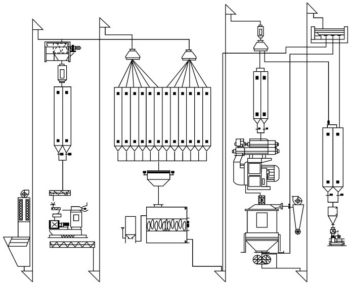
 Figure7-1Flow chart of feed processing 
Vocabulary

complete feed全价饲料

diluent　[医]稀释液，稀释药

extrude　膨化

undecomposed　未分解的，不分解的

formula feed　配制饲料

gelatinize　（使）成胶状，涂胶

starch granule　淀粉颗粒

heatprocessed热处理

risk management风险管理

vacuum coating真空喷涂

aquatic feed水产料

buoyancy　浮性，浮力

tilapia　[鱼]罗非鱼

specific density比重

viscosity　黏质，黏性

ripener　熟化器

trout　[鱼]鲑，鲑鱼

salmon　[鱼]鲑鱼，大麻哈鱼，鲜肉色

durability　耐久力

air bubble气泡

heat transfer传热

belt cooler带式冷却器

counter flow cooler逆流冷却器

cascade cooler级联冷却器

coarser particle粗颗粒

extrusion technology挤压工艺

extruded soybean膨化大豆

vacuum pump真空汞

eutrophication　富营养化

Maillard reaction美拉德反应

horizontal cooler卧式冷却器

batch mixer分批混合器

fabric filter collectors袋式除尘器

vent filter systems通风除尘系统

bag house堆袋室，滤袋除尘室

aeroso浮质（气体中的悬浮微粒，如烟、雾等）

condensate　冷凝物

impurity　杂质

lubricant　润滑剂润滑的

Appendix Basic Knowledge about Translating and Writing of Scientific English

Lesson 1　Translating of Scientific English

一、总述

张培基给翻译下了定义：翻译是运用一种语言把另一种语言所表达的思维内容准确而完整地重新表达出来的语言活动。翻译是一种语言活动的过程，又是该活动的结果。它是用一种语言形式把另一种语言形式里的内容重新表现出来的语言实践活动。翻译活动不仅涉及两种语言，还涉及两种社会文化。语言是文化的载体；翻译是自身文化和异国文化之间沟通的桥梁，翻译是具有不同语言文化背景的人交流思想、互相了解的媒介。翻译是科学，因为翻译有规律可循；翻译是艺术，因为翻译是译者对原文进行再创造的过程；翻译是技能，因为翻译有技巧，这些技巧可以通过讲授和翻译实践获得。总之，翻译是一种融科学、艺术、技能于一体的语言实践活动。

译文的质量标准可用“忠实、通顺”四个字来概括。一方面，译者必须把原作的内容准确而完整地表达出来，对原文的意思既不能歪曲，也不能增减。“忠实”这一标准对科技英语翻译尤为重要。科技作品的任务是准确而系统地论述科学技术问题，对准确性的要求特别高。另一方面，译文的语言必须通顺易懂，符合汉语规范。要按照汉语的习惯来选词造句。理想的译文必须是纯正的中文，不生硬拗口，没有文理不通、结构混乱、逻辑不清的现象。译文语言必须符合汉语规范，不可逐字死译、硬译使译文洋腔洋调。

为此，在翻译过程中我们遵循以下两点：一是理解（understand），翻译的关键在于理解。结合上下文推敲词义，理解原文所涉及的事物，从逻辑意义或专业内容上进一步判断。二是表达（express），在深刻领会原文意思的基础上，尽量摆脱原文形式的束缚，选用符合汉语习惯的表达方式，把原意清楚明白地表达出来。可采用直译，既忠于原文内容，又考虑原文形式；或者意译，即在译文中用创新的表现法，来表达原文的逻辑内容和形象意义。

二、科技英语的特点

1.无人称句多

科技文体的主要目的在于阐述科学事实、科学发现、实验结果等。虽然这些科学活动或科学实验都是人类所为，但这些文章或报告主要是为了说明科学技术活动所带来的结果、证明的理论或发现的科学现象或规律，而不是介绍这些结果、理论或现象是由谁发明或发现的，因此，科技文章往往是没有人称的。

Mature muscle size is dependent on a number of critical stages during development and growth.The stages are the determination of muscle progenitor cells,the proliferation of these progenitor cells,and finally the formation of multinucleate fibres and their subsequent growth.The first two phases occur during fetal development and the growth of fibres is initiated during late fetal development and continues throughout postnatal growth.

The pH of muscle tissue may be a very important determinant of the tenderness of fresh product.The relationship between tenderness and pH is very complex.Ultimate pH,the rate of pH decline and the rate of temperature decline have major impacts on both the final tenderness of meat and on the rate at which that tenderness is attained.This points out the need for meat researchers to have a clearer understanding of the biology of early postmortem muscle in order to fully elucidate the mechanisms behind the development of meat tenderness and other quality attributes.

2.语气正式

陈述客观、准确，逻辑性强，语言规范，文体质朴，不像文学文体那样富于美学修辞手段和艺术色彩。

Meat and milk production from farm animals is dependent in part on fetal development and postnatal growth of specific tissues.This paper will review some of the systems controlling both muscle and mammary growth which are related to meat and milk production and some of the genes known to regulate these production traits.

The highly sensitive nature of pig muscle to electrical stimulation was first demonstrated by Hallund and Bendall（1965）.They stimulated isolated muscles with35volts（200Hz）for30s,and found that the time at which the ultimate pH was reached could be reduced from4h to2h after slaughter.

3.被动语态多

由于科技英语的主要目的是表述科学发现、科学事实、实验报告和各类说明等，故以客观陈述为主，因此科技英语大量使用被动语态。

In summary,chilling is done to remove heat from the carcass.The removal of heat has a great impact on the quality of the meat product.If heat is not removed quickly enough and the pH declines rapidly,the potential to produce PSE product exists.This PSE（Pale,Soft,Exudative）product has a lower water holding capacity compared to product with a normal temperature and pH decline.However,if the temperature declines too quickly,the potential for development of a tougher product exists.Furthermore,chilling the product can retard microbial growth of spoilage organisms and pathogens.The best system to chill carcasses would be the one that minimizes the rate of pH decline and maximizes the rate of temperature decline without compromising pork quality.

4.非谓语动词多，长句子多

科技英语力求简洁明了，大量使用非谓语动词。另外，在科技文体中经常使用长句子。这主要是因为在阐述科学事实、科学现象等事物的内在联系和解释一些科技术语或专业名词时，需要大量使用各种从句（尤其是定语从句）以及介词短语、形容词短语、分词短语或副词等作后置定语，分词短语表示伴随情况等。

All of these changes result in the creation of a very new environment within the tissue in which many of the components of the muscle cell attempt to function.Our ability to accurately predict and ultimately control the rate and extent of the development of quality attributes（like tenderness）depends on our detailed knowledge of how these events proceed and how they affect the components of the muscle cell.

5.专业名词、科技术语多

这是与公共英语最大的不同点。

Considerable variation exits in the color,texture,waterholding ability and marbling of pork lean.The primary defects in lean quality are varying degrees of the pale,soft and exudative（PSE）and dark,firm and dry（DFD）conditions.

Marbling is the accumulation of fat in meat,and its form is illustrated in the figure below.Once a beef carcass has been chilled,some marbling fat can be seen with the naked eye.This is because the fat molecules become solid and opaque：a bit like candle wax.

三、科技术语的翻译

科技术语的特点：词义繁多，专业性强，翻译时要根据专业内容谨慎处理。

1.前缀

（1）Intra 在内部

intramuscular肌肉内的intracellular细胞内的intramolecular分子内的

（2）Post 在……之后的

postnatal 出生后的postmortem 死后posterior 后面的，后部

（3）Pre 在……之前的

prenatal 出生前的premature 成熟前的precursor 前体物

（4）micr o微，显微

microscope 显微镜microb e微生物

（5）multi 多

multinuclear 多核的multicellular 多细胞的

（6）Tri三

tristimulus三色的trihybrid三基因杂种triglyceride甘油三酯

2.后缀

（1）obin （蛋白）globin 球蛋白

myoglobin肌红蛋白hemoglobin血红蛋白oxymyoglobin氧合肌红蛋白oxyhemoglobin氧合血红蛋白

（2）er人

packe 屠宰场主 consume r消费者

（3）ness状态、性质

tenderness 嫩度juiciness多汁性

3.复合词和缩写词

（1）复合词

valueadded 有附加值的 postslaughter treatmeat 屠宰后处理 cherryred 樱桃红 airexposed stage 空气暴露阶段 leaffat 板油 leantofat ratio 瘦肉与脂肪比率 milkejection reflex 排乳反射 milkstorage tank 贮奶罐

（2）缩略词

PSE：pale soft exudative DFD：dark firm dry RSE：red soft exudative RFN：red firm and nonexudative HACCP：hazard analysis critical control point LD：longissimus dorsi PSS：porcine stress syndrome

4.考虑上下文专业内容

packer包装厂；打包机；包装工人；肉品加工厂；肉品加工厂经理

pork（美）泛指猪肉；（英）鲜猪肉

incubation（禽蛋）孵化；（细菌）培养；（传染病）潜伏期

dress（伤口、患处）包扎、敷药；施肥；（畜禽屠宰后）放血、拔毛修整胴体

5.常用的专业术语

complete feed 全价饲料 premix 预混合饲料 onditioning 调质expand 膨胀 pellet 颗粒 formula feed 配合饲 料medicated feed 加药饲料 antibiotics 抗生素 oligosaccharide 寡糖 broiler 肉鸡 feed contaminant 饲料污染palatability适 口性 digestibility 消化率

四、常见科技英语句型

1.It……that……强调句结构句型

It was concluded that the early progress in post mortem temperature and pH decline affect the colour of pork.

It has been proved that many pigs that yield PSE pork are genetically prone to porcine stress syndrome（PSS）.

2.There be结构句型

There is no difference between……and……

3.被动语态结构句型

The effects of breed and genotype on pork quality were studied.

Carcass quality and meat quality were defined in table1.

Pork from pure bred/crossbred pigs were used in the present study.

4.as结构句型

Desirable lean quality in fresh pork is described as reddishpink in color,firm in texture and free of surface wateriness（nonexudative）.

Pork eating quality,also defined as pork palatability,can be identified using humans either as trained sensory panelists or as untrained consumers.

5.分词短语结构句型

Pork eating quality,also defined as pork palatability,can be identified using humans either as trained sensory panelists or as untrained consumers.

6.并列结构句型

As new pork products are produced as new genetics and management and/or＆nbsp；nutritional practices are developed,or as new technologies are implemented that may affect pork eating attributes,understanding the eating qualities and consumer acceptance of the end product is needed.

Lesson 2　Writing of Scientific English

一、如何写英文摘要

1.摘要的类型

信息性摘要：用简洁、明确的语言（一般不超150字）将论文的目的，主要的研究过程及所采用的方法，由此得出的主要结果和重要结论表达清楚。信息性摘要占有绝大部分比例。

指示性摘要：指示性摘要仅指出文献的综合内容，适用于综述性文献，图书介绍及编辑加工过的专著等。综述性文献常见的有：某技术在某时期的综合发展情况，某技术在目前的发展水平及未来展望等。总之这种文献是综述情况而不是某个技术工艺、某产品或某设备的研究过程，本摘要该处不再详细论述。

2.信息性摘要的写作方法

（1）信息性英文摘要包括四部分

①本文的目的或要解决的问题；②解决问题的方法及过程；③主要结果和结论；④本文的创新、独到之处。

（2）信息性英文摘要各部分的写作

1）本文的目的或要解决的问题

一般来说，一篇好的英文摘要，一开头作者就应该把本文的目的或要解决的主要问题交代清楚。必要时，可利用论文中所列的最新文献，简要介绍前人的工作。

在这方面，有两点具体要求：不谈或少谈背景信息，避免在摘要的第一句话重复使用题目或题目的一部分。

2）解决问题的方法及过程

主要说明作者的工作方法及工作过程，也包括众多的边界条件，使用的设备和仪器等。在英文摘要中，过程与方法的阐述起着承前启后的作用。开头交代了要解决的问题，接着要论述的就是如何解决问题。大多数作者在阐述过程与方法时，最常见的问题是泛泛而谈、空洞无物，只有定性的描述，使读者很难清楚地了解到解决问题的方法与过程。因此，在说明方法与过程时，应结合论文中的公式、实验框图等来进行阐述，这样既可以给读者展现一个清晰的思路，又增加了文章的可信度。

3）主要结果和结论及本文的创新、独到之处

结果和结论部分代表着文章的主要成就和贡献。论文有没有价值，值不值得读者阅读，主要取决于这一部分。因此，在写结果和结论部分时，一般都要尽量结合实验结果或仿真结果的图、表、曲线等加以说明，使结论部分言之有物，有根有据。同时，对那些看不懂中文的英文读者来说，通过这些图表，结合英文摘要就可以比较清楚地了解论文的结果和结论。只有这样，论文的结论才有说服力。如有可能，在结尾部分还可以将论文的结果与他人最新的研究结果进行比较，以突出论文的主要贡献和创新、独到之处。

3.提高英文摘要文字效能的方法

①提高文字效能，应删去多余的字、句，使摘要简洁；②摘要中只谈新的信息；③取消或减少背景情况。

4.关于英文摘要的句法

（1）尽量用短句

采用ing分词和ed分词作定语，少用关系代词which,who等引导的定语从句。

（2）语态

在多数情况下可采用被动语态。但在某些情况下，特别是表达作者或有关专家的观点时，要用主动语态。

5.英文摘要的常用句型

（1）表示研究目的，常用在摘要之首

In order to……This paper describes……The purpose of this study is……

（2）表示研究的对象与方法

The curative/effect/sensitivity/function of certain drug/kit/organ was observed/detected/studied……

（3）表示研究的结果

The result showed/It proved/The authors found that……

（4）表示结论、观点或建议

The authors suggest/conclude/consider that……

二、如何写英语科技论文

1.科技论文的结构

包括：题名，作者姓名，摘要+关键词，引言，材料与方法，结果，讨论与结论，致谢，参考文献。

2.科技论文的写作方法

（1）题名

题名要以最少数量的单词来充分表述论文的内容，要能吸引读者。另外，题名能够帮助文献追踪或检索，文献检索系统多以题名中的主题词作为线索，因而这些词必须要准确反映论文的核心内容，否则就有可能产生漏检。

1）基本要求

准确：准确反映论文的内容。

简洁：中文最好不超过20个汉字，英文最好不超过12个单词。

清楚：清晰地反映文章的具体内容和特色，力求简洁有效、重点突出。

2）注意事项

①尽可能将表达核心内容的主题词放在题名开头；②慎重使用缩略语；③避免使用化学式、上下角标、特殊符号（数字符号、希腊字母等）、公式、不常用的专业术语和非英语词汇（包括拉丁语）等。

（2）作者姓名

国外期刊一般会尊重作者对自己姓名的表达方式（但大多倾向于大写字母只限于姓和名的首字母）

如：Caiyun Zhang,Defa Li,Fenglai Wang

（张彩云，李德发，王凤来）

缩写：Zhang CY,Li DF,Wang FL

注意：应尽量采用相对固定的英文姓名的表达形式，以减少在文献检索和论文引用中被他人误解的可能性。

（3）摘要

参见科技论文摘要部分。

（4）引言

1）引言的组成

综述研究背景：概述本项工作的研究或观察的理论基础，给出简明的理论或研究背景，一定要列举重要的相关文献；

指出存在问题：说明为什么要做这项工作；

阐述研究目的：说明有别于他人的“主意”。

2）时态

现在时：叙述有关现象或普遍事实。

如：little is known about……/little literature is available on……

完成时：描述最近的某种趋势，或者强调表示某些“最近”发生的事件对现在的影响。

如：few studies have been done on……/little attention has been devoted to……

3）注意事项

①“引言”要与“讨论”形成呼应关系；②应引用“最相关”的文献指引读者，力戒刻意回避引用最重要的相关文献（甚至是对作者研究具有某种“启示”性意义的文献）；③避免不恰当地大量引用作者本人的文献；④解释或定义专门术语或缩写词，以帮助编辑、审稿人和读者阅读与理解；⑤在叙述前人工作的欠缺，强调自己研究的创新时，应慎重且留有余地。

（5）材料与方法

1）总体要求

①“材料与方法”部分应清楚、准确描述是如何获得研究结果的；②对方法的描述要详略得当、重点突出；③包括所有必要的细节（以便他人能够重复实验）；④不能遗漏重要文献；⑤描述要准确。

2）写作要点

①明确描述实验对象和方法的选择，医学论文中还应说明实验过程是否符合伦理学要求；②详细描述实验方法和实验步骤：实验试剂的规格、批号、型号、制造厂家名称、厂址（城市名）等；③准确地记载所采用药物和化学试剂的名称、剂量、给药途径；④列举建立方法的参考文献，并做简要描述（但不需全部重复描述）；⑤如果对已有方法进行了新的或实质性的改进，就要清楚地说明改进的理由；⑥不可遗漏动作的执行者；⑦注意叙述内容的逻辑性；⑧文献引用尽量准确、具体。

3）时态

现在时：不受时间影响的事实。

Sheep red blood cells are used as a test antigen to quantify specific antibody responses.

过去时：过去特定的行为或事件。

The design used was a3×2factor randomized block design.

由于所涉及的行为与材料是叙述的焦点，而且读者已知道进行这些行为和采用这些材料的人就是作者本人，因而多习惯采用被动语态：

This experiment was undertaken to evaluate the effect of dietary vitamin E on growth performance and immune response of broilers under heat stress（HS）.

（6）结果

1）总体要求

①对实验或观察结果的表达要高度概括和提炼（按逻辑顺序描述或总结重要的观察结果）；②数据表达可采用文字与图表相结合的形式（凡用文字能说明的问题，就尽量不用图表再复述）；③尽可能列出“结果”的原始数据，而不能只报道统计处理后的数据（为帮助读者的理解，可适当评论原始数据，对结果的说明、解释、与理论模型或他人结果的比较等）。

2）时态

现在时：对研究结果的说明或由其得出的一般性推论、不同结果之间进行比较。

如：The higher incidence of back pain in civilian pilots may be due to……

These results agree well with the findings of Smith……

过去时：所叙述结果的内容为关于过去的事实。

如：After flights of less than two hours，11%of the army pilots and33%of the civilian pilots reported back pain.

3）正文中图表的表达

表格：很方便地列举大量精确数据或资料（三线表）；

图形：直观、有效地表达复杂数据，尤其是不同组数据间的比较、关联、趋势等；

图表题名：准确而清楚地表达出数据或资料的含义，切忌简单地描述数据。

（7）讨论

“讨论”的重点在于对研究结果的解释和推断，并说明作者的结果是否支持或反对某种观点，是否提出了新的问题或观点等；撰写讨论时要尽量做到直接、明确，以便审稿人和读者了解论文为什么值得引起重视。

1）基本内容

①回顾研究的主要目的或假设，并探讨所得到的结果是否符合原来的期望。如果没有的话，为什么？②概述最重要的结果，并指出其是否与先前的假设或其他学者的结果一致。如果不一致的话，为什么？③对结果提出说明、解释或猜测。根据这些结果，能得出何种结论或推论？④指出研究的局限性以及这些局限对研究结果的影响，并建议进一步的研究题目或方向；⑤指出结果的理论意义（支持或反驳相关领域中现有的理论、对现有理论的修正）和实际应用。

2）时态

现在时：具有普遍的意义推论或结论。

如：The experimental and theoretical values for the yields agree well.

Our data suggest that the reaction rate may be determined by the amount of oxygen available.

过去时：所概述推论的有效性只是针对本次特定的研究。

如：In the first series of trials,the experimental values were all lower than the theoretical predictions.

3）注意事项

①对结果的解释要重点突出，简洁、清楚。着重讨论本研究的重要发现，以及由此得出的结论，不要过细地重复引言或结果中的数据或资料；②推论要符合逻辑；③观点或结论的表述要清楚、明确；④对结果的科学意义和实际应用的表达要实事求是，适当留有余地；⑤讨论的最后最好是论文的最重要的结论。

（8）结论

有时也可将“结论”单独列为一节（通常可包括在“讨论”或“结果与讨论”中）。其基本内容：作者本人研究的主要认识或论点（包括最重要的结果、结果的重要内涵、对结果的认识等）；总结性地阐述本研究结果可能的应用前景、研究的局限性及需要深入的研究方向；结论中不应涉及新的事实，也不能简单地重复摘要、引言、结果或讨论等章节中的句子。

（9）致谢

对于不够署名条件，但对研究成果确有贡献者，可以以“致谢”的形式列出，作为致谢的对象。通常包括：①协助研究的实验人员；②提出过指导性意见的人员；③为研究提供方便（仪器、测试等）的机构或人员；④资金资助项目或类别（但不宜列出得到经费的数量）；⑤在论文撰写过程中提出建议、给予审阅和提供其他帮助的人员。

（10）参考文献

注意事项：①所选用文献的主题必须与论文密切相关；②必须是亲自阅读过，若为间接引用（即转引某篇论文的引文），需要提及该中间论文；③优先引用最新发表的、同等重要的论文；④一般不引用专利和普通书籍（如大学教材等）；⑤避免过多地，特别是非必要地引用作者自己的文献；⑥确保文献各著录项（作者姓名，论文题目，期刊或专著名）正确无误；⑦遵循拟投稿期刊的具体要求。
