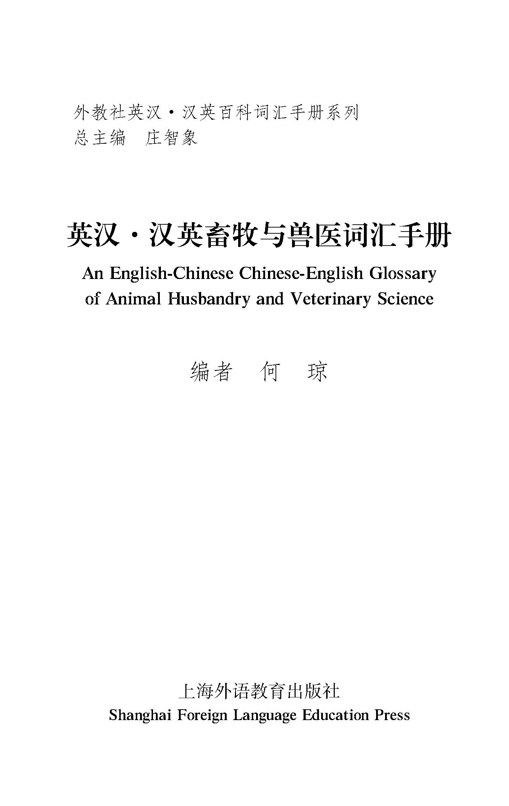

 
 图书在版编目（CIP）数据 

英汉·汉英畜牧与兽医词汇手册／何琼编．—上海：上海外语教育出版社，2009

（外教社英汉·汉英百科词汇手册系列）

ISBN 978-7-5446-1247-0

Ⅰ．英…　Ⅱ．何…　Ⅲ．①畜牧学—词汇—手册—英、汉　②兽医学—词汇—手册—英、汉　Ⅳ．S8-62

中国版本图书馆CIP数据核字（2009）第023909号
       

## 外教社英汉·汉英百科词汇手册系列

总主编：庄智象

## 英汉·汉英畜牧与兽医词汇手册
 
编　　者：何　琼

策划编辑：张春明　李法敏

责任编辑：贺　敏
  

# 序
 
改革开放30年来，我国的经济、科技、文化、教育、外贸和社会各项事业快速发展，取得了令人瞩目的成就，经济总量翻了两番之多，国内生产总值2007年已近25万亿元人民币，人均国民收入达到了2000多美元，提前实现了小康目标；科技水平不断提高，高新技术快速发展，缩短了与世界先进国家的差距；文化、教育事业迅猛发展，不断满足和丰富着人民日益增长的文化精神需要；社会服务和保障体系不断完善，使中华民族和社会更加和谐。我国在国际事务中的作用日益凸显，与世界各国的政治、经济、科技、文化、教育、外交、军事等方面的交往日益频繁。成功加入世界贸易组织，成功申办和举办2008年北京奥运会和残奥会，成功申办上海世博会等一系列重大外交活动，塑造了中国在世界上的良好形象，更是促进了我国与世界各国的交往、交流和交融。经济全球化、科技一体化、文化多元化、信息网络化的发展趋势，使人们的生活正发生着深刻的变化。

新的学科、新的术语、新的词汇不断诞生和涌现。我国数亿不同层次的英语学习者和使用者，在学习或工作中不断遇到新的词语、新的术语。大部分的英语学习者和使用者能够比较顺利地用普通英语进行交流和交际，而一旦遇到专业领域的词汇或术语往往会陷入困境，有时可能了解某词语的一般意义，但不知道它在某些专业领域指的是什么。这种情况，在日常交往中，或在专业性较强的国际会议中屡见不鲜，常常需要英语专家和专业方面的人士通力合作，才能解疑释惑。若能编纂出版一套英汉、汉英的百科词汇手册，则将大大有益于英语学习者和使用者，能够为他们的英语学习和使用助上一臂之力。笔者曾在上世纪90年代初随同中国教材出版项目考察团访美，任翻译，就是依靠了一本英汉汉英出版印刷词汇手册，比较顺利地完成了任务。同时，此类专业词汇手册还有助于学习者提高英语水平和能力，借助英语汲取科技知识和信息，扩大视野，不断丰富和提高专业知识和水平。有鉴于此，上海外语教育出版社（以下简称外教社）与牛津大学出版社合作，于本世纪初陆续出版了牛津百科分类词典英语版40余种。这批百科词典的出版深受专业人员、英语学习者和使用者的欢迎。同时，根据部分读者的要求，外教社经过充分调研和论证，并征得牛津大学出版社同意，从该系列词典中挑选出近十种，组织有关专业人员编译成英汉双解版；由于工作量巨大，亦仅将这部分词典的词目翻译成汉语。随着对外交流和交往的深入发展，不断有读者询问外教社是否出版有完整的百科方面的词汇手册或词典。为满足这一需要，外教社经过广泛的调研、需求分析和市场论证，组织编写了外教社英汉·汉英百科词汇手册系列图书，历经四年的努力，全国近百位编纂者的通力合作和辛勤劳动，终于迎来了第一批书稿。

本百科词汇手册系列有以下几个特点：

1．按学科、专业和行业分册编写（以下统称专业），分类依据主要是国家标准学科分类、国家标准国民经济行业分类、企业经营行业分类及中国图书在版编目分类，涵盖自然科学、技术、社会科学、人文科学、社会生活等80余个领域；

2．各专业词汇手册包括英汉、汉英两部分，尽可能涵盖各专业最基本、最常用的词汇，每部分收词基本上控制在5000至10000条，版式和开本设计便于使用和携带；

3．各分册按词汇的使用频率收列专业基本词汇，同时力求反映该专业的最新发展，只收专业性词汇和普通语文词汇的专业性义项。与本专业关系不大的其他专业词汇尽量不收。

本系列词汇手册可供英语学习者、使用者及相关专业人员了解和熟悉专业词汇，学习和丰富专业知识，提升专业视野和水平之参考，亦可作为翻译的参考工具书。由于学识和能力所限，新的词汇层出不穷，收词难免挂一漏万，谬误和缺陷在所难免，敬请广大读者惠予批评、指正。
 
庄智象

2008年10月
 

# 前言
 
随着我国经济与科技的发展，各行各业呈现出突飞猛进的发展势头，畜牧业和兽医学也不例外。其中一个重要原因是：在对外交流合作机会与日俱增的背景下，我们汲取了国外的先进经验。为适应这一飞速发展，从事这两个领域工作的广大专业人员迫切需要一本实用的畜牧、兽医英汉双语工具书。《英汉·汉英畜牧与兽医词汇手册》旨在满足畜牧、兽医业从业人员及相关研究者快速查阅的需要，也可供其他读者阅读英语资料、撰写英语文章时使用。

畜牧业和兽医学有着紧密的联系，涵盖面极广。其涉及的词汇覆盖十几个相关学科，如兽医解剖学、家畜生物化学、家畜内科学、内科诊断学、外科学、药理学、流行病学、家畜卫生学、病毒学、细菌学、养蜂、营养学、饲料学等。各学科的词汇量都甚为可观。本词汇手册共收录词条约12000余条。我们力求精选兽医、畜牧相关学科中最基本和最常用的词汇。例如，兽医药理学涉及的药物名称繁多，光是青霉属就有不下80种。本手册不收录具体青霉菌名称，如“灰黄青霉”“灰绿青霉”“纯黄青霉”，等等，而只收录“青霉菌属”这一个术语。
  

# 使用说明
 
1．本手册分为英汉、汉英两部分。

2．英汉部分条目按照字母顺序排列；汉英部分条目按照拼音音序排列，同音字按照笔画数排列。

3．英汉部分以数字、特殊符号、希腊字母等非英语字母开头的条目放在英汉部分正文之后；汉英部分以数字、特殊符号、西文字母等非汉字开头的条目放在汉英部分正文之后。

4．外国人名条目的词头与译文一般采用姓前名后的形式。例如：

Chomsky，Avram Noam　乔姆斯基，A·N

乔姆斯基，A·NChomsky，Avram Noam

5．为便于查阅，汉英部分的某些条目（多为自由组合）以汉语中心词或关键词立目，其他文字置于圆括号中，放在中心词或关键词之后。例如：

与产品相关的行为变量　product-related behavioural descriptor

立目时处理为：

行为变量（与产品相关的）　product-related behavioural descriptor

6．英汉部分概念相同或相近的汉语译文之间用逗号分隔，概念不同的汉语译文之间用分号分隔；汉英部分的英语译文一律用分号间隔。

7．圆括号“（ ）”用于括注：①缩写或全称形式；②可省略的内容；③解释说明性文字。

8．方括号“［］”用于括注可替换的文字。

9．尖括号“〈 〉”用于括注学科标注。
  

# 英汉部分

## Aa

AA（amino acid）　氨基酸

AAV（adeno-associated virus）　腺伴随病毒

Ab（antibody）　抗体

abdominal ballottement　腹部冲击触诊

abdominal cavity　腹腔

abdominal muscle　腹肌

abdominal region　腹部

abnormal behaviour　异常行为

abnormal fixation　异常固定

abnormal milk　异常乳

abnormal ovum　异常卵子，畸形卵

abnormal rumination　异常反刍

abnormal sperm　异常精子，畸形精子

abomasum　皱胃，真胃

abortive infection　顿挫性感染

abrasion　皮肤磨损；擦伤

absolute growth　绝对生长

absolute humidity　绝对湿度

absorbent　吸收剂

absorption　吸收

absorption capacity　吸收量，吸收能力

abzyme　抗体酶，催化抗体

AC（avian chlamydiosis）　鸟疫，鹦鹉热

acalcerosis　缺钙症

acanthocephalan　棘头动物

acarapis mites　蜂盾螨

acariasis　螨病

acariasis of bees　蜂螨病

accentuation of heart sound　心音增强

acceptable daily intake（ADI）　日许量，每日允许摄入量

accessory cell　辅助细胞

accessory corpus luteum　副黄体

accessory nerve　副神经

accessory sexual gland　副性腺

acclimatization　风土驯化，气候顺应

accredited herd　健康牛群，无结核病牛群；种畜繁殖群

accumulated heat　淤热

accumulation　蓄积作用

accumulative growth　累积生长

A cell　A细胞

acetylcholine　乙酰胆碱

acetylsalicylic acid　乙酰水杨酸，阿司匹林，巴米尔

achromatosis　色素缺乏

acid agglutination　酸凝集

acid-base balance　酸碱平衡

acid-base equilibrium　酸碱平衡

acidic dye　酸性染料

acidic feed　酸性饲料

acidified silage　加酸青贮料

acid insoluble ash（AIA）　酸不溶灰分

acidity　酸度

acid number　酸价，酸值

acid silage　酸青贮料

acid-treated egg　浸酸种

acinus　腺泡

acquired character　获得性特征

acquired immunity　获得性免疫

actinic　光化性的

actinic dermatitis　光化性皮炎

actinobacillosis　放线杆菌病

actinomycosis　放线菌病

activated sludge process　活性污泥法

activator　激活剂

active anaphylaxis　主动过敏反应

active chlorine　有效氯，活性氯

active hyperaemia　主动性充血，动脉性充血

active immunity　自动免疫

active site of enzyme　酶活性中心

actomyosin　肌动球蛋白

acupoint　穴位

acupuncture anaesthesia　针刺麻醉，针麻

acupuncture and moxibustion　针灸

acupuncture instrument　针具

acupuncture point　穴位，针穴

acupuncture therapy with bleeding　血针疗法

acupuncture therapy without bleeding　白针疗法

acupuncture therapy with warming　温针疗法

acute infection　急性感染

acute inflammation　急性炎症

acute phase serum　急性期血清

acute renal failure　急性肾衰竭

adaptability　适应性

adaptability index　适应性指数，适应性系数

adaptation　适应

adaptive enzyme　适应酶，诱导酶

additive effect　相加作用，加性效应

additive gene　累加基因，加性基因

adenitis equinum　马腺疫，喷喉

adeno-associated virus（AAV）　腺伴随病毒

adenocarcinoma　腺癌

adenoma　腺瘤

adeno-satellite virus　腺-卫星病毒，腺联病毒

Adenoviridae　腺病毒科

ADH（antidiuretic hormone）　抗利尿激素，加压素

adhesion　粘连

adhesive rehmannia　地黄

ADI（acceptable daily intake）　日许量，每日允许摄入量

adipose tissue　脂肪组织

adjuvant　佐剂，辅药

 ad libidum 不限制采食

adnexa　附件

adoptive immunity　过继性免疫

adrenal gland　肾上腺

adrenaline　肾上腺素

adrenergic fibre　肾上腺素能纤维，肾上腺素能神经

adrenergic system　肾上腺素能系统

adrenoceptor blocking drug　肾上腺素受体阻断药

adrenomimetic drug　拟肾上腺素药

adsorber　吸附器，吸附剂

adult stage　成虫期；成体期

adverse reaction　不良反应

aerial infection　空气传染

aerial oversowing　飞机播种

aerobe　需氧菌，好氧生物

aerophagia　吞气症

aerophagy　吞气症

aerophilic bacillus pro　duct　需氧芽孢杆菌制剂

aerosol　气溶胶；气雾剂；湿润剂

afferent nerve　传入神经，感觉神经

affinity chromatography　亲和层析

AFP（α-fetoprotein）　甲胎球蛋白

African horse sickness（AHS）　非洲马瘟

afterbirth　胞衣，胎衣

after culture　补播；后播作物

after-effect　后效；副作用

aftergrowth　再生树

aftermath　再生草；二茬作物

after-swarm　新分蜂群

Ag（antigen）　抗原

agar　琼脂

agar gel diffusion　琼脂扩散，凝胶扩散

agarose　琼脂糖

age determination　年龄鉴定

age-selected mating　年龄选配

agglutination reaction　凝集反应

agglutinative reaction antigen　凝集反应抗原

agglutinin　凝集素

agglutinogen　凝集原

aggregate species　复合种

aggressin　攻击素

aggressive behaviour　蛮横行为

agonal infection　末期感染；濒死期感染

agonist　激动药；兴奋剂

agonistic behaviour　争斗行为，好斗行为

agranulo　cyte　无粒白细胞

agrostology　禾草学，牧草学

AHA（autoimmune haemolytic anaemia）　自身免疫溶血性贫血

ahemeral lighting　超期（非24小时）光照制

AHS（African horse sickness）　非洲马瘟

AIA（acid insoluble ash）　酸不溶灰分

air acupuncture therapy　气针疗法

air-blast conveyor　气力式输送装置

airborne microorganism　空气微生物

airborne transmission　空气传播，气源传染

air cell　气室

air-driven shearer　气动式剪毛机

air exchange　气体交换，通气

air humidity　气湿，空气湿度

air inlet　进气管

air movement　空气运动，空气流动

air outlet　排气管

air sac　气囊

air temperature　气温，空气温度

Ala（alanine）　丙氨酸

alanine（Ala）　丙氨酸

alanine aminotransferase　丙氨酸转氨酶

albumen　蛋白；胚乳；白蛋白

albuminuria　白蛋白尿

alimentary gland　消化腺

alimentary infection　消化道感染

alimentology　营养学

alkali reserve　碱储备；碱储量

alkaloid　生物碱，赝碱

allantoic fluid　尿囊液

allantois　尿囊

allele　等位基因

allelomimetic behaviour　互效行为，相互模仿行为

allelomorph　等位基因

allergen　变应原，反应原

allergic drug reaction　变应性药物反应，药物变态反应

allergization　致敏

allergy　变态反应，过敏反应

allicin　大蒜素

alloantibody　同种抗体

alloantigen　同种抗原

allogeneic mating　异型交配

alloimmunity　同种免疫

allometric growth　分化生长，异速生长

allopolyploid　异源多倍体

allotriophagia　食欲异常，异食癖

all-season forage system　全年粗饲制

all-the-year-round housing　全年舍饲

alpine grassland　高山草原

alpine meadow　高山草原

alpine range　高山草原

alpine tundra　高山冻原

alterative inflammation　变质性炎

alternate-day feeding　隔日饲喂法

alternate grazing　轮换放牧

alternate passage　交替传代

alveolar milk　腺泡乳

alveoli　肺泡；齿槽；插入点

amaurosis　黑内障；玻璃眼

amebiasis　变形虫病，阿米巴病

amebiasis of bees　蜜蜂阿米巴病

amide　酰胺；氨化物

amino acid（AA）　氨基酸

amino acid antagonism　氨基酸拮抗

amino acid imbalance　氨基酸失衡

amino acid sequence analysis　氨基酸顺序分析

aminoglycoside antibiotics　氨基苷类抗生素，链霉素类抗生素

aminopeptidase　氨肽酶

amitosis　无丝分裂，直接分裂

ammonia　氨

ammonification　氨化作用

amnion　羊膜

amniotic fluid　羊水

anabolic　合成代谢

anaemia　贫血

anaerobe　厌氧菌；乏氧

anaerobic glycolysis　无氧酵解；厌氧代谢作用

anaerobic incubation　厌氧培养

anaesthesiology　麻醉学

anaesthetic　麻醉药

anal canal　肛管

analgesic　镇痛药，麻醉性镇痛药

analginum　安乃近，诺瓦近

anal orifice　肛门

anal prolapse　脱肛

anaphylactic antibody　过敏抗体，过敏素

anaphylactin　过敏素

anaphylactogen　过敏原

anaphylaxis　过敏反应；过敏症；过敏性

anatomy　解剖学

androgen　雄激素，睾丸酮

androgenesis　父本生殖，雄核发育

anesthesia machine　麻醉机

aneuploid　非整倍体

aneuploidy　非整倍性，非整元性

angiotensin　血管紧张素

angle of incidence　入射角

Angora　安哥拉山羊

angular teeth　斜齿，锐齿

animal behaviour　动物行为，动物习性

animal bone　畜骨

animal community　动物群落

animal cremator　动物火化机

animal day　头日

animal ethology　动物行为学

animal feed　动物饲料，家畜饲料

animal for laboratory use　实验用动物

animal habit　动物习性，动物行为

animal house　畜舍

animal-house disinfecting　畜舍消毒

animal hygiene　家畜卫生

animal month　头月

animal nutrition　动物营养

animal obstetrics　家畜产科学

animal pathology　动物病理学，兽医病理学

animal respirator　动物呼吸器

animal starch　动物淀粉

animal toxin　动物毒素

animal waste for feeding　畜粪饲料化

annual grass　一年生牧草

annual temperature range　气温年较差

anaestrus　乏情期，不发情期，休情期

anomalous behaviour　异常行为

anophagia　食欲不良，食欲不振

anorexia　厌食

anoxia　缺氧

anoxic anoxia　缺氧性缺氧症，低氧血症

antacid　抗酸药

antagonism　拮抗作用，相恶

antagonist　对抗药

antagonistic action　对抗作用，拮抗作用

ante-mortem inspection　宰前检验

ante-mortem quarantine　宰前检疫

antenatal examination　产前检查

anterior cardinal vein　前主静脉

anthelmintic　驱虫药，抗蠕虫药

anther　花粉囊

anthracosis　炭末沉着症

anthrax　炭疽，血脾胀

anthrax precipitin serum　炭疽沉淀素血清

antiadrenergic drug　抗肾上腺素药，肾上腺素受体阻滞药

antianemic drug　治贫血药

anti-anthrax serum　抗炭疽血清

antiantibody　抗抗体

antiarrhythmic　抗心律失常药

antiasthmatic　平喘药

antibacterial potentiating agent　抗菌增效剂

antibiotic　抗生素，抗菌素

antibiotic additive　抗生素添加剂

antibody（Ab）　抗体

antibody activity　抗体活性

antibody haptophore　抗体结合簇，抗体可变区

antibody unit　抗体单位

anti-canine-distemper serum　抗犬瘟热血清

anticestodal drug　抗绦虫药

anticholinergic drug　抗胆碱药

anticholinesterase agent　抗胆碱酯酶药

anticoagulant　抗血凝药

anticoccidial　抗球虫药

anticodon　反密码子，反三联体

anticomplementary serum　抗补体血清

anticonvulsant　抗惊厥药

antidiarrhoeal　止泻药

antidiuretic hormone（ADH）　抗利尿激素，加压素

antidote　解毒药

antienzyme　抗酶

antiferment serum　抗酶血清

antifoaming agent　消泡药，消泡剂

antigen（Ag）　抗原

antigen-antibody binding affinity　抗原抗体结合亲和力

antigen-antibody complex　抗原抗体复合物

antigen binding capacity　抗原结合能力

antigen excess　抗原过剩

antigenic competition　抗原竞争

antigenic component　抗原成分

antigenic determinant　抗原决定簇

antigenic drift　抗原漂移

antigenic epitope　抗原表位，抗原决定簇

antigenic formula　抗原式

antigenicity　抗原性

antigenic shift　抗原位移

antigenic specificity　抗原特异性

antigenic structure　抗原结构

antigenic variant　抗原变体

antigenic variation　抗原变异

antigen presentation　抗原提呈，抗原递呈

antiglobulin serum　抗球蛋白血清

antihaemoagglutinin　抗血凝集素

antihistaminic　抗组胺药

antihormone　抗激素

anti-idiotype　抗独特型

antiketogenesis　抗生酮作用

antimetabolite　抗代谢物

antimicrobial　抗微生物药

antimicrobiosis　抗菌术

antimycotic additive　防霉剂，抗真菌剂

antioxidant　抗氧化剂

antiperistalsis　逆蠕动

antiprotozoal　抗原虫药

antipruritic　止痒药

antipyretic-analgesic　解热镇痛药

antirheumatic　抗风湿药

anti-rinderpest serum　抗牛瘟血清

antischistosomal drug　抗血吸虫药

antiscolic and health protection additive　驱虫保健添加剂

antisepsis　防腐，消毒

antiserum（AS）　抗血清

antispasmodic　解痉药

antithyroid drug　抗甲状腺药

antitoxin　抗毒素

antitrematodal drug　抗吸虫药

antitrypsin　抗胰蛋白酶

antitussive　止咳药，镇咳药

antiviral drug　抗病毒药物

antivitamin　抗维生素

antizymotic　制酵药

anuria　无尿

aorta　主动脉

aphagia　拒食

apiary　养蜂场，蜂房

apiculture　养蜂业

apimylasis　蜜蜂肉蝇病

apiology　养蜂学

apisination　蜂蜇中毒，蜂蜇伤

apitoxin　蜂毒素

aplasia　发育不全；先天萎缩

aplastic anaemia　再生障碍性贫血

apoptosis　凋亡

apparent infection　显性感染

apparent period　明显发病期

appetitive behaviour　食欲行为

aquaculture　水产养殖业

aquatic feed　水生饲料

arbovirus　虫媒病毒

archive of breeding stock　种畜档案

Arenaviridae　沙状病毒科

areolar tissue　蜂窝组织

argyrophilic fibre　嗜银纤维，网状纤维

armed macrophage　武装巨噬细胞

arterial hyperaemia　动脉性充血，主动性充血

arterial pulse　动脉脉搏

arteriosclerosis　动脉硬化

arteriovenous anastomosis　动静脉吻合

artery　动脉

arthritis　关节炎，滑膜炎

arthropod-borne virus　虫媒病毒

articulation　关节，骨连接

artificial antigen　人工抗原

artificial brooding　人工育雏

artificial coughing　人工诱咳

artificial dried grass　人工干草

artificial hibernation　人工越冬

artificial illumination　人工照明，人工光照

artificial immunity　人工免疫

artificial insemination　人工授精

artificial lighting　人工光照，人工照明

artificial queen cell cup　人工台基

artificial rumen　人工瘤胃

artificial salivary salt　人工唾液盐

artificial selection　人工选择

artificial serum　人造血清，生理盐液

artificial swarm　人工分蜂，人工分群

artificial vagina（AV）　假阴道

AS（antiserum）　抗血清

ascariasis　蛔虫病

ascospore　子囊孢子

ascus　子囊

ascus apparatus　子囊盘

ascus vesicle　子囊盘

asepsis　无菌；无菌术

aseptic manipulation　无菌操作

asexual hybrid　无性杂种

aspergillosis　曲霉病

aspirin　阿司匹林，乙酰水杨酸

assessment of embryo quality　胚胎品质检查

assimilation　吸收；同化

association constant　结合常数

asthenia　虚弱，无力

asthma　气喘；哮喘

astrigent　收敛药

atavism　返祖现象，隔代遗传

atavism reversion　隔代遗传

ataxia　共济失调

atelectasis　肺膨胀不全；肺萎陷

atmospheric composition　大气组成

atmospheric pressure　气压，大气压

atmospheric self-purification　大气自净

atmospheric stratification　大气分层

atomic absorption spectrum　原子吸收光谱

atresia　闭锁

atrophic cancer　萎缩性癌

atrophy　萎缩

attenuate　稀释；减弱；减毒

attenuated duck plague vaccine　鸭瘟弱毒疫苗

attenuated foot-and-mouth disease vaccine　口蹄疫弱毒疫苗

attenuated fowl cholera vaccine strain 807　禽霍乱807系弱毒疫苗

attenuated fowl pox vaccine　鸡痘弱毒疫苗

attenuated infectious bovine rhinotracheitis vaccine　牛传染性鼻气管炎弱毒疫苗

attenuated sheep pox vaccine　羊痘弱毒疫苗

attenuated swine mycoplasma vaccine　猪支原体弱毒疫苗

attenuated vaccine　减毒疫苗

attenuation　致弱作用，减毒作用

attitudinal reflex　姿态反射

atypical infection　非典型感染

atypical strain　非典型菌株

auditory tube　咽鼓管，耳咽管

auger conveyor　螺旋式输送器

aureomycin　金霉素

auscultation　听诊

Australia antigen　澳大利亚抗原，乙型肝炎抗原

autoantibody　自身抗体

autogenous bacterin　自身菌苗

autoimmune disease　自身免疫性疾病

autoimmune haemolytic anaemia（AHA）　自身免疫溶血性贫血

autointerference　自家干扰

autointoxication　自体中毒

autologous antibody　自身抗体

autologous antigen　自身抗原

autolysis　自溶，自溶作用

automatic cluster detacher unit　挤奶杯自动摘卸装置

automatic cluster fall-off unit　挤奶杯自动脱落装置

automatic drinking bowl　自动饮水器

automatic ventilation controller-regulator　自控通风调节器

autonomic nerve　自主神经，植物性神经，内脏神经

autonomic nervous system　自主神经系统，植物性神经系统

autopolyploid　同源多倍体

autopsy　尸检，尸体解剖

autosexing　自别雌雄

autosome　常染色体，正染色体

autotrophic bacteria　自养菌

auxotroph　自营生物

AV　　（artificial vagina）　假阴道

availability　可食率，可用率

available lysine　有效赖氨酸，可利用赖氨酸

available phosphorus　有效磷

aversion therapy　恶治

aversive event　反感作用

avian chlamydiosis（AC）　鸟疫，鹦鹉热

avian encephalomyelitis vaccine　禽脑脊髓炎疫苗

avian inclusion body hepatitis　禽包涵体肝炎

avian infectious rhinitis　鸡传染性鼻炎

avian influenza　禽流感

avianized vaccine　鸡胚化疫苗，鸡胚疫苗

avian leucosis　禽白血病，禽造白细胞组织增生

avian malaria　鸡疟疾

avian nephrosis　禽肾变病，鸡传染性法氏囊炎

avian pox　禽痘

avian spirochaetosis　家禽螺旋体病

avian vibrionic hepatitis　禽弧菌性肝炎，禽传染性肝炎

aviculture　养禽业

axial fan　轴流式风机

axial feather　轴羽

axial fibril　轴纤，轴丝

axial organ　中轴器官

axillary artery　腋动脉

axon　轴突

axon reflex　轴突反射

azygos vein　奇静脉

## Bb

Babcock test　巴氏测定法

babesiasis　巴贝斯虫病

bacille Calmette-Guérin vaccine（BCG vaccine）　结核菌苗，卡介苗

backcross　回交；回交杂种

backfat　背膘

backgrounding　预饲期，适应期

back mutation　反突变，回复突变

bacon　熏肉，培根

bacon spleen　火腿脾

bacon tempering　（培根肉切片前）冷却调温

bacterial filter　滤菌器

bacterial flora　细菌区系，细菌群体

bacterial growth curve　细菌生长曲线

bacterial phase　细菌相

bacterial pigment　细菌色素

bacterial population　细菌群体，细菌群落；细菌繁殖数量

bacterial respiration　细菌呼吸

bacterial staining　细菌染色

bacterial strain　菌株

bacterial typing　细菌分型

bactericidin　杀菌素

bacteriemia　菌血症

bacterin　菌苗；疫苗

bacteriocin　细菌素

bacteriocin typing　细菌素分型

bacteriologic index　细菌学指标

bacteriolytic test　溶菌试验

bacteriophage　噬菌体

bacteriophage conversion　噬菌体转变，溶原性转变

bacteriostat　抑菌剂

bacteriostatic　抑菌剂

Baermann technique　贝尔曼法（寄生虫研究）

bagged feed　袋装饲料

bag limit　猎捕限额

baitfish　活饵

balanced ration　平衡日粮

balanced solution　平衡溶液

balanced stock　平衡原种

balance trial　平衡试验

balanitis　龟头炎，阴蒂炎

balantidiosis　小袋纤毛虫病

bale harvester　草捆捡拾堆垛机

bale press　压捆机

bandaging　绷带法

banding technique　显带技术

Bantam　小型鸡，本丹鸡

barbiturate　巴比妥酸盐

bark grafting　皮接

barn　畜舍

barn sewage　畜舍污水

barrier of infection　感染屏障

barrow　阉公猪

basal cover　基盖度

basal granule　基体

basal metabolism（BM）　基础代谢，基底代谢

basement membrane　基膜

base pairing　碱基配对

basic air dry　风干基础

basic dye　碱性染料

basic pure dry　基础全干，基础绝干

basocyte　嗜碱细胞

battery　多层鸡笼；笼养

battery brooder　笼架式育雏器

battery for farrowing rabbits　产子兔笼组

battery for fattening rabbits　肥育兔笼组

battery system　笼养法

BAV（bovine adenovirus）　牛腺病毒

bave　茧丝

BBB（blood-brain barrier）　血脑屏障

B cell　B 细胞

BCG vaccine （bacille Calmette-Guérin vaccine）　结核菌苗，卡介苗

bed cleaning　除沙

bedsore　褥疮

bee beetle　蜂甲虫

bee bread　蜂粮

bee colony　蜂群

bee dance　蜂舞

bee dysentery　蜂痢疾

bee-eater　蜂虎

bee escape　脱蜂器

beef boning　牛肉剔骨

beef calf　肉用牛犊

beef casing　牛肠衣

beef cattle husbandry　肉牛业

beef performance　牛肉产量

beef yield　牛肉产量

bee gloves　防蜇手套

bee glue　蜂胶

bee hat　养蜂用帽

beehive　蜂窝，蜂箱，蜂巢

beekeeping　养蜂

bee-killer　蜂狼

bee louse　蜂虱

bee metamorphosis　蜜蜂变态

bee paralysis　蜜蜂麻痹病

bee pasture　蜜蜂采蜜场

bee sting　蜂蜇

beeswax　蜂蜡

bee veil　防蜂面纱

bee venom　蜂毒

beeway　蜂巷

belching　嗳气

bell sound　金属音，钱币音

belt conveyor　带式输送器

belt conveyor manure cleaner　输送带式清粪机

benign infection　良性感染

bentonite　皂土

biennial grass　二年生牧草

bigeneric cross　属间杂交

bile　胆汁

bile acid　胆汁酸

bile passage　胆道

biliary passage　胆道

biliary tract　胆道

bilirubin　胆红素

bilis　胆汁

bin　料仓

binary fission　二分裂

binding constant　结合常数

binding of branches　结束

bioassay　生物测定，生物检定

bioavailability　生物可用度，生物利用度，生物有效性

bioconcentration　生物富集，生物浓缩

bioerosion　生物侵蚀

biogeochemical disease　生物地球化学病，地方病

bioidentification　生物鉴定

biological assay　生物检定，生物测定

biological availability of amino acid　氨基酸生物学效价

biological control　生物防治

biological disinfection　生物消毒法

biological film　生物膜，生物滤膜

biological oxidation　生物氧化，组织呼吸，细胞呼吸

biological stain　生物学染料

biological value（BV）　生物学价值；生理价值

biomacromolecule　生物大分子

biomass　生物量

biome type　生物群落型

biopotential　生物电，生物电位

biosphere　生物圈

biosynthesis　生物合成

biotin　生物素

biotransformation　生物转化

biotyp e　生物型

bipolar staining　两极染色

bird flu　禽流感

birth defect　先天性缺陷

bisexuality　两性现象

bitter　苦味药，苦味健胃药

bivalent antibody　双价抗体

bivalent chromosome　二价染色体

black disease　绵羊黑疫，传染性坏死性肝炎

blackening　黑变

blackhead disease　黑头病，组织滴虫病

black leg　黑腿病，气肿疽

black mark　黑章

blast cell　母细胞

blastocyst　胚囊，胚泡

blastomere　卵裂球

blastomogen　致癌物质

blastomycosis　芽生菌病

bleach　漂白；漂白剂

bleaching powder　漂白粉

bleeding　放血；出血

bleeding through mouth cavity　口腔放血

blending inheritance　融合遗传

blepharitis　眼睑炎

blind passage　盲目传代

blister beetle　斑蝥

bloat　气胀

blocking antibody　封闭性抗体，不完全抗体

block to polyspermy　多精子障壁

blood acidity　血液酸度

blood acupuncture therapy　血针疗法

blood-air barrier　气血屏障

blood biological product　血液生物制品

blood-brain barrier（BBB）　血脑屏障

blood calcium　血钙

blood circulation　血液循环

blood circulation pathway　血液循环途径

blood clot retraction　血块收缩

blood coagulant　促凝血药

blood coagulation　血液凝固，血凝，凝血

blood coagulation factor　凝血因子

blood flow velocity　血流速度

blood flow volume　血流量

blood group　血型

blood grouping test　血型分型试验

blood line　血统

blood lipid　血脂

blood meal　血粉

blood platelet　血小板，凝血细胞，血栓细胞

blood pressure（BP）　血压

blood renovation　血液更新，血缘更新

blood ring　血环

blood sample　血样

blood spot　血斑

blood stasis　淤血

blood stool　便血，粪血

blood sugar　血糖

blood-thymus barrier　血-胸腺屏障

blood type　血型

blood vessel　血管

blood viscosity　血液黏滞性

blood volume　血量

blood volume expander　血容量扩充剂，血浆扩充剂

blue-eye　蓝眼病

blue tongue　蓝舌病，绵羊卡他热

bluish egg　转青卵

blunt dissection　钝性分离，剥离

BM（basal metabolism）　基础代谢，基底代谢

body condition　体况

body fluid　体液

body measurement　体尺

body temperature　体温

body weight　体重

boiled-off silk　熟丝；精炼丝

boiling point　沸点

boiling test　煮沸试验

bolus　食团；大药丸，丸剂

bone gelatin　骨胶，动物胶

bone grease　骨油

bone marrow　骨髓

bone meal　骨粉

book　重瓣胃

boophilus　牛蜱，方头蜱

borax　硼砂

boring well　钻井，铁管井

bottom cross　底交

bottom grass　下繁草，底层草

bovine adenovirus（BAV）　牛腺病毒

bovine epizootic fever　牛流行热，牛暂时热

bovine epizootic fever inactivated vaccine　牛流行热灭活疫苗

bovine infectious kerato-conjunctivitis　牛传染性角膜结膜炎，红眼病

bovine leukosis　牛白血病，牛造白细胞组织增生

bovine somatotropin（BST）　牛生长激素

bovine viral diarrhoea　牛病毒性腹泻，牛黏膜病

bowel complaint　下痢，腹泻

bowel movement　排粪；粪便；肠蠕动

BP（blood pressure）　血压

brachial plexus　臂神经丛

brachypnoea　气促，呼吸浅短

bradsot　羊快疫

bradycardia　心动徐缓

bradyuria　排尿徐缓

brain　脑

brain cortex　大脑皮层

brain stem　脑干

branding　烙印

braxy　羊快疫

break coarse　粗碾，粗粉碎

breastings　初乳

breed　品种

breeding　配种

breeding age　初配年龄，繁殖年龄

breeding and multiplication system　繁育体系

breeding bird　种鸡

breeding complementarity　育种互补性

breeding condition　种用体况

breeding cycle　繁殖周期

breeding efficiency　配种效率

breeding for disease resistance　抗病育种

breeding life　繁殖年限

breeding method　繁育方法

breeding range　育种幅度，繁殖幅度

breeding ration　繁殖日粮，配种日粮

breeding stock　种畜

breeding system　繁育系统

breeding true　纯育

breeding unsoundness　繁殖缺陷，生殖系统异常

breeding value　育种值，遗传值

breed introduction　引种

breed out　育除，排除劣性

brightening agent　增白剂

brine　盐水

brined hide　盐皮

brine injury　盐害

bristle　鬃毛；刚毛

broad-breast type　宽胸型

broad ligament of uterus　子宫阔韧带

broiler　肉用子鸡，童子鸡

broiler cage　肉鸡用笼

broken wind　喘鸣症，马气喘病

bronchi　支气管

bronchial breath sound　支气管呼吸音

bronchitis　支气管炎

bronchopneumonia　支气管肺炎，小叶性肺炎

brood by brood rearing　一蛾育

brood cell　孵化室

brood comb　子脾

brood disease　幼虫病，蜂仔病

brooder　育雏伞，育雏器

broodiness　就巢性，伏巢性，抱窝

brown-egg type　褐壳蛋鸡

brown hay　褐色干草

browse　枝叶饲料

Brucellosis　布氏杆菌病，传染性流产

BS（buffered saline）　缓冲盐水

BST（bovine somatotropin）　牛生长激素

bucket elevator　斗式升运器

bucket milking equipment　桶式挤乳装置

buck rake　集草机

bud grafting　芽接

buffalo horn　水牛角

buffer　缓冲剂；缓冲器；缓冲

buffered saline（BS）　缓冲盐水

buffer solution　缓冲液

buffer system　缓冲系统

buffy coat　血沉棕黄层

bulb　球状体；球状物；蹄球；延脑

bulbar muscle　眼球肌

bulbourethral gland　尿道球腺

bulk　散装；大量

bulk bin　散装粮仓

bulk curing　大批熏制；大量腌制

bull index　公牛指数

bullstag　去势牛，阉牛

bumble bees　熊蜂类

bunch grass　丛生型牧草

bundled needles　丛针

Bunyaviridae　布尼亚病毒科

buoyant density　浮密度

burning　烧草，烧荒

burrow habit　穴君习性

burrowing organism　穴君生物

bursa of Fabricius　法氏囊，腔上囊

bursectomy　法氏囊切除术，腔上囊切除术

bursitis　黏液囊炎

bush　灌木

bushland　矮灌丛地

butter　奶油，黄油，白脱，奶酪

butter churn　乳油搅拌压炼机

butter colour　奶油色素，奶油黄

butter-fat　乳脂肪

butter milk　酪乳，奶油乳，黄油乳

buzzer　蜂鸣器

BV（biological value）　生物学价值；生理价值

## Cc

C（complement）　补体

cachectic oedema　恶病质性水肿，营养不良性水肿

cacomorphosis　畸形

cacosmia　恶臭

cacotrophy　营养不良

caffeine　咖啡因

cage keeping　笼养

cage rearing　笼养

cake cutter　饼渣碎裂机

calcareous soil　石灰质土

calcicole　钙生植物

calcification　钙化

calciphile　适钙植物

calcitonin　降钙素

calcium　钙

calcium-phosphorus ratio　钙磷比例

calculogenesis　结石形成

calculus　结石

calf diphtheria　犊牛白喉

calf pen　犊牛舍

caloric content　含热量

calorie　卡，克卡

calving　产犊

calving interval　产犊间隔期

calx chlorata　漂白粉

calx chlorinata　漂白粉

camp　放牧营地

camphor　樟脑

camphorism　樟脑中毒

campylobacteriosis　弯杆菌病，弧菌病

cancer cell　癌细胞

candling　照蛋，验蛋

canine adenovirus　犬腺病毒

canine distemper　犬瘟病，犬热病

caninus　犬齿肌

cannibalistic infanticide　残食仔畜

canning method　罐藏法

cannulation　套管插入术

canopy of vegetation　植被覆盖

capillariasis　毛细线虫病

capillary　毛细血管

capillary pulsation　毛细血管搏动

capped elbow　肘肿

capping　帽化，成帽；保护层

capsid　衣壳，壳体

capsomer　壳粒，衣壳体

capsular antigen　荚膜抗原

capsulation　包裹

capsule　荚膜；胶囊

carbohydrate　碳水化合物，糖类

carbon dioxide　二氧化碳

carcass　胴体，屠体

carcass disposal　尸体处理

carcass dressing　胴体修整

carcass-utilization plant　畜尸利用工厂

carcinogenic effect　致癌作用

carcinosarcoma　癌肉瘤

cardiac catheterization　心脏导管检查

cardiac conduction　心脏传导

cardiac cycle　心动周期

cardiac murmur　心脏杂音

cardiac muscle　心肌

cardiac oedema　心性水肿

cardiac output　心输出量

cardiac sound　心音

cardinal vein　主静脉

cardiovascular reflex　心血管反射

cardiovascular system　心血管系统

carminative　驱风药

carnification　肉质化

carnivorous dentition　肉食类齿系

carotene　胡萝卜素

carotenoid　类胡萝卜素

carotinoid　类胡萝卜素

carpal joint　腕关节

carrier　带菌者，载体

carrier protein　载体蛋白

carrying capacity　载畜量

cartilage tissue　软骨组织

caruncle　子宫阜；肉瘤

caryotype　染色体组型，核型

cascade reaction　连锁反应

case detection　病例检测

case history　病史，病历

casein　干酪素，酪蛋白

casing　肠衣；套，罩

castor silkworm　蓖麻蚕

castration　骟术，阉割，去势

castration by tying knot method　扎骟

castration instrument　阉割器

castration with cold water　水骟

castration with heated cauterization　火骟

catabolism　分解代谢，异化作用

catalytic antibody　催化抗体

catalytic subunit　催化亚基

cataract　白内障，晶体浑浊

catarrhal inflammation　卡他性炎

catch crop　填闲作物

catechu　儿茶

catharsis　导泻

cathartic　泻药

catheterism of bladder　膀胱插管术

cattle equivalent　牛当量

cattle handling cradle　家畜保定栏

cattle plague　牛瘟，胆胀瘟，烂肠瘟

cattle stall　牲畜栏

caudad　向尾端，尾向

cauterization　烧烙，画烙，火烙

cavernositis　海绵体炎

ceca　盲肠；肠支

celiac artery　腹腔动脉

cell　细胞

cell-bound antibody　细胞结合抗体，细胞固定性抗体

cell cap　蜂巢封盖

cell culture　细胞培养

cell cycle　细胞周期

cell differentiation　细胞分化

cell division　细胞分裂

cell fusion　细胞并合

cell line　细胞系

cell-mediated immunity　细胞介导免疫

cell membrane　细胞膜，质膜

cell respiration　细胞呼吸，生物氧化

cell strain　细胞株

cellular aging　细胞衰老

cellular immunity　细胞免疫，细胞介导免疫

cellular tissue　蜂窝组织

cellulase　纤维素分解酶

cellulitis　蜂窝（组）织炎

cellulose　纤维素

central immune organ　中枢免疫器官

central necrosis　中心性坏死

central nervous stimulant　中枢神经兴奋药

centric venous pressure（CVP）　中心静脉压

centrifugal fan　离心式风机

centromere　着丝粒，着丝点

centron　中心球，原子核

centrosome　中心体

cephalic groove　头沟

cephalin　脑磷脂

cephalosporins　先锋霉素类，头孢菌素类

ceratitis　角膜炎

cereal crop　禾谷类作物

cerebellar cortex　小脑皮质

cerebellum　小脑

cerebral concussion　脑震荡

cerebral cortex　大脑皮质

cerebral malacia　脑软化

cerebroside　脑苷脂类，糖脂类

cerebrum　大脑

certified milk　保证乳，健康乳

certified seed　检定种子

cervical plug　子宫颈栓

cervix　子宫颈；颈

cesarean section　剖腹产

Cestoidea　绦虫纲

chaff cutter　铡草机

chalaza　系带；毛突；韧带；合点

challenge　攻毒，攻击

challenge virus　攻击用病毒，活性病毒

channel puncture　经刺

character lesion　特征性病变

cheek　颊；颊叶

cheilion　口角

cheilosis　唇干裂

chemical additive of silage　化学青贮添加剂

chemical defibrillator　化学去纤颤器

chemical disinfection　化学消毒法

chemical modification　化学修饰

chemical oxygen demand（COD）　化学耗氧量，化学需氧量

chemical unit　化学单位

chemosorbent　化学吸附剂

chemotherapy　化疗

chestnut　蹄腕骨；夜眼

Cheyne-Stokes respiration　陈-施氏呼吸，潮式呼吸

chiasma　交叉

chick　幼禽，雏

chick cage　雏鸡用笼

chick embryo inoculation　鸡胚接种

chick embryo vaccine　鸡胚疫苗

chilling　冷却

chimera　嵌合体

Chinese ephedra　麻黄

Chinese hawthorn　山楂

Chinese honeylocust spine　皂角刺

Chinese mahonia leaf　十大功劳叶

Chinese pulsatilla　白头翁

Chinese thorowax　柴胡

chiropractic　（脊柱）按摩疗法

chiropraxis　（脊柱）按摩疗法

chlamydia　衣原体

chlorinated lime　漂白粉

chlorination　氯化消毒

chlorine　氯

chlorine requirement　需氯量

chlortetracycline　氯四环素，金霉素

cholangiotomy　胆管切开术

cholangitis　胆管炎

cholelith　胆石

choleric temperament　胆液质

cholesterol　胆固醇

choline esterase　胆碱酯酶

cholinergic fibre　胆碱能（神经）纤维

cholinergic system　胆碱能系统

cholinomimetic drug　拟胆碱药

chondroma　软骨瘤

chondropathology　软骨病理学

chondropathy　软骨病

chondrosarcoma　软骨肉瘤

chopped wound　砍创

chorion　绒毛膜；浆膜；卵壳

choroid　脉络膜；黑基膜

chromaffin cell　嗜铬细胞

chromatid　染色单体

chromatin　染色质

chromatogram　色谱图

chromatoplasm　色素质

chromatosome　染色体

chromium　铬

chromonema　染色丝，染色线

chromophilic cell　嗜色细胞

chromophobic cell　嫌色细胞

chromosomal aberration　染色体畸变

chromosome　染色体

chromosome map　染色体图

chronaxie　时值

chronic infection　慢性感染

chronic infectious arthritis　慢性传染性关节炎

chronic inflammation　慢性炎症

chronic respiratory disease（CRD）　慢性呼吸道病

chyluria　乳糜尿

chyme　食糜，乳糜

chymotrypsin　糜蛋白酶

cicada slough　蝉蜕

cicatrix　瘢痕

Ciliata　纤毛虫纲

ciliated cell　纤毛细胞

circular cage for rabbits　圆形兔笼

circular plague　圆形蚀斑

circulating antigen　循环抗原

circulatory system　循环系统

circumoval precipitation（C OP）　环卵沉淀反应

cirrhosis of liver　肝硬化

cistern milk　乳池乳，乳窦乳

cistron　顺反子，作用子

CL（corpus luteum）　黄体

classical conditioning reflex　经典型条件反射

classification of feeds　饲料分类

classification of fever　热类，热级

clavicle　锁骨

claw　集乳器；爪

clean animal　清洁动物

clean crop　清洁作物

clear sound　清音，回响音，满音

cleavage　分裂；卵裂

CLIF（clonal inhibitory factor）　克隆抑制因子

climatic adaptation　气候适应

climax　顶极群落

clinical diagnostic method　临诊诊断法

clinicoradiology　临床放射学

clipper　割草机

clitoris　阴蒂

cloaca　泄殖腔

cloacal bursa　腔上囊，法氏囊

cloacal opening　泻殖孔

clonal inhibitory factor（CLIF）　克隆抑制因子

clonal selection theory　克隆选择学说

clone　克隆，无性繁殖系

clonic spasm　阵挛性痉挛

closed colony　封闭群

closed herd　封闭畜群，闭锁畜群

closed house　密闭式畜舍，无窗畜舍

closed inbreeding　闭锁式亲交

closed pasture system　封闭放牧方式

closed population　闭锁群

close folding grazing　超集约放牧

close grazing　低牧，紧密放牧

closing date of grazing　终牧日

clostridium　梭菌

clotrimazole　克霉唑

clove　丁香

club pressing castration　夹骟

clump　草墩；凝块

coagulant　混凝剂

coagulant aid　助凝剂

coagulase　凝血浆酶，血浆凝固酶

coagulating agent　凝集剂

coagulation necrosis　凝固性坏死

coagulation sedimentation　混凝沉淀

coagulopathy　血凝病

coating　包膜层

coccidiosis　球虫病

cochlea　耳蜗

cockerel　新公鸡，小公鸡

cocoon drying ratio　烘率

cocoon filament　茧丝

cocoon floss stripping　剥茧衣

cocoon harvest　采茧

cocooning rate　结茧率

cocooning room　蔟室

cocooning tray　蔟箔

cocoon picking　采茧

cocoon storage　贮茧

cocoon stripping　剥茧

cocoon wax　茧丝

COD（chemical oxygen demand）　化学耗氧量，化学需氧量

codominance　等显性

codon　密码子，三联体

coefficient of growth　生长系数

coelom　体腔

coenzyme　辅酶

coiled capillary　螺旋毛细血管

coin sound　钱币音，金属音

coition　交配，配种

coitus　交配，交尾

cold　寒，伤风

cold shock　冷休克

cold slaughter　冷宰

cold storage　低温保存法，冷藏

cold stress　冷应激

col factor（colicinogenic factor）　大肠杆菌素产生因子

colibacillosis　大肠杆菌病

colic　腹痛，绞痛，疝痛

colicin　大肠杆菌素

colicin factor　大肠杆菌素产生因子

colicinogenic factor（col factor）　大肠杆菌素产生因子

colicin typing　大肠菌素分型

coliform group　大肠菌群

coliindex　大肠菌指数

colititre　大肠菌值

collagen　胶原

collagenous fibre　胶原纤维，白纤维

collateral vessel　侧副管

collecting duct　集合管

collective species　综合种

collector　集乳器

colloid　胶体

colloidal solution　胶体溶液

colon　结肠

colon bacillus　大肠杆菌

colon impaction　便秘

colony　菌落

colony characteristics　菌落特征

colony reproduction　蜂群分巢

colostrum　初乳

colouring　染色

colour of mouth　口色

coma　昏迷

comb　鸡冠，肉冠，冠

comb building　造脾

comb honey　巢蜜，巢脾蜜

combine　联合收割机

combined drill　联合条播机

combining ability　配合力

combining preservation　综合保存法

commensalism　共生，共栖

commercial crossbreeding　经济杂交

commercial farm　商品场

commercial herd　商品群

commercial livestock　商品家畜

commercial poultry production　商品养禽业

common antigen　共同抗原

common carotid artery　颈总动脉

common colic vein　结肠总静脉

common ginger peel　姜皮

common hepatic artery　肝总动脉

common iliac vein　髂总静脉

common selfheal　夏枯草

community immunity　群体免疫

companion crop　伴种作物，混作作物

compensation　代偿

compensatory mating　补偿交配

competition　竞争

competitive inhibitor　竞争性抑制剂

complement（C ）　补体

complement activity　补体活性

complementary gene　互补基因

complementary selected mating　弥补选配

complementary ration　补充日料

complementation　互补作用

complement deviation　补体偏差

complement inhibitor　补体抑制物

complement receptor　补体受体

complete antigen　完全抗原

complete saturation　完全饱和

complex antigen　复合抗原

complication　并发症

composition of feed　饲料成分

compost　堆肥

compound stomach　多室胃，复胃

compulsive movement　强制性运动

compulsory slaughter　强制屠宰

com-stocking　净牧

concentrate　精饲料，精料，浓厚饲料

concentrated feed　浓缩饲料，精饲料

concentrator　集乳器

conception　受胎，妊娠

conception rate　受胎率

conceptus　孕体

concerted feedback inhibition　协同反馈抑制

concretion　结石；粘连；凝结

concurrent disinfection　随时消毒

condemned material　斥品

condemned viscera　禁食内脏

condensed milk　炼乳，蒸发乳

condensing　冷凝；浓缩

conditional edible meat　条件性可食用肉品

conditioned reflex　条件反射

conditioned secretion　条件分泌，反射性分泌

conditioning　调节作用，控制；增膘

conduction system　传导系统

confinement　舍饲，圈饲；分娩

conformation　构造；体型

congelation　冻伤

congenital immunity　先天免疫

congenital infection　先天性感染

congestion　充血

conglutination reaction　团集反应，胶固反应，黏合反应

conglutinin　团集素，胶固素，黏合素

conidiospore　分生孢子

conjugated antigen　结合抗原

conjugated protein　结合蛋白

conjugation　接合

conjunctiva　结膜

conjunctival reflex　结膜反射

conjunctivitis　结膜炎

connective tissue　结缔组织

consanguineous mating　近交，亲缘交配

constipation　便秘

constitutive metabolism　组成代谢

contact hypersensitivity　接触性超敏反应

contact transmission　接触传染

contactual behaviour　接触行为

contagious agalactosis　接触传染性无乳

contagious equine metritis　马接触传染性子宫炎

contagious infectious disease　接触性传染病

continuous capillary　连续毛细血管

continuous fever　稽留热

continuous grazing　连续放牧

continuous variation　连续变异

contractibility　收缩性

contracture　挛缩

contrary treatment　反治

control herd　对照群

controlled-environment house　环境控制畜舍，无窗畜舍

controlled moulting　强制换羽

contusion　挫伤

convalescent period　康复期

convalescent rate　痊愈率

convalescent serum　康复期血清

conventional animal　普通动物

convergent cross　聚合杂交

conversion　转化，变换

converting enzyme　转化酶

convoluted seminiferous tubule　曲细精管

convulsion　惊风

cooked grease　熟油

cooked meat-product　熟肉制品

cooling　冷却

cooling equipment　降温设备

cool-season grass　冷季牧草

COP（circumoval precipitation）　环卵沉淀反应

copper（Cu）　铜

coprology　粪便学

coprophagy　食粪癖

copulation　交配；接合

copulation frequency　交配频次

copulatory muscle　交配肌

core　髓核，类核体

core enzyme　核心酶

core vaccine　中心疫苗

cornea　角膜

corneal reflex　角膜反射

corneum　角质层

corn feed　玉米饲料

coronary artery　冠状动脉

coronary circulation　冠脉循环

Coronaviridae　冠状病毒科

coronavirus　冠状病毒

coronet reflex　蹄冠反射

corpuscle　小体；细胞；微粒；血细胞

corpus luteum（CL）　黄体

corral-type dairy　围栏式乳牛场

correlated variability　相关变异性

correlated variation　相关变异

corrodent　腐蚀剂

cortex　皮层

cortical hormone　皮质激素

corticoid　肾上腺皮质激素

corticosteroid　肾上腺皮质激素类药物

cortisol　皮质醇

cortisone therapy　可的松疗法

coryza　鼻卡他，急性鼻炎

costovertebral angle　肋椎角

cotyledon　绒毛叶；子叶

cough　咳嗽

counteraction　对抗作用

counterstain　对比染色；复染剂

coupled phosphorylation　偶联磷酸化

coupling reaction　偶联反应

courtship display　求偶表现

cover crop　覆盖作物

cover degree　覆盖度

covered rearing　覆盖育

covering　配种；被套

covering epithelium　被覆上皮

cowherb　王不留行

cow pox　牛痘

coxal articulation　髋关节

CP（crude protein）　粗蛋白

CPE（cytopathic effect）　细胞致病效应，细胞病变

cracked grain　碎谷粒，碎米

cracked-pot sound　破壶音

crackling　油渣；脆皮

crammed duck　填鸭

crammed liver　肥肝

cranial cavity　颅腔

cranial nerve　脑神经

cranium　头骨，颅

CRD（chronic respiratory disease）　慢性呼吸道病

cream separator　奶油分离机

creatine　肌酸

creep　幼畜补饲栏；佝偻病；爬行

creeping grass　匍匐性牧草

creep ration　补饲日粮

cribbing　咽气癖

crisis　危机；骤退

criss-cross inheritance　交叉遗传

critical period　临界期

critical period of forages　牧草危机期，忌牧时期

critical standing product　临界贮草量

critical temperature　临界温度

CR length（crown-rump length）　冠臀长度，坐高

crop　嗉囊；林木；牛脊肉；一年产仔数；耳标

crop rotation　轮作

cross antigenicity　交叉抗原性

crossbred　杂种

crossbreeding　杂交繁育

crossed electrophoresis　交叉电泳

cross immunity　交叉免疫

crossing　杂交

crossing-over frequency　交换频率

cross matching test　交叉配血试验

cross-resistance　交叉耐药性，交叉抗药性

crown density　林木郁闭度

crown grafting　冠接

crown-rump length（CR length）　冠臀长度，坐高

crude ash　粗灰分

crude fat　粗脂肪

crude fibre　粗纤维

crude honey　原蜜，生蜜

crude protein（CP）　粗蛋白

crumb　碎屑；团粒

crumbliness　脆度，易碎度

crushing mill　粉碎机

crust　痂；壳

cryobiology　低温生物学

cryptococcosis　隐球菌病

crypt of Lieberkuhn　李氏腺，李氏隐窝

cryptorchidism　隐睾病

cryptosporidiosis　隐孢子虫病

cryptoxanthin　玉米黄素

crystallization　结晶化

Cu（Copper）　铜

cubed hay　干草块，块状饲料

cuber　制粒机，压块机

cubical symmetry　立体对称

cubicle　隔栏，自由栏

cubital articulation　肘关节

cuckoo wasp　青蜂

cud　食团；瘤胃

cudding　反刍；食团吐出

cumulative action　蓄积作用

cumulative feedback inhibition　累积反馈抑制

cupping therapy　拔火罐，吸筒疗法

curved hoof　弯蹄

cushion plant　垫状植物

cutaneous muscle　皮肌

cutaneous part　皮区，无腺区

cutaneous pouch　皮肤窦

cutaneous reflex　皮肤反射

cut-lift　割草装载机

cut-rake　割草搂草机

cutter-rower　割晒机

cutting pasture　打草场，草场

cutting shoot　插穗

cutting wood　插条

CVP（centric venous pressure）　中心静脉压

cyanosis　发绀

cyclone　旋风分离筒，集料筒

cyst　囊肿

cystic mole　葡萄胎

cystic ovary　卵巢囊肿

cystipathy　膀胱病

cystoparalysis　膀胱麻痹

cytochemistry　细胞化学

cytoderm　细胞壁

cytokine　细胞因子

cytokines adjuvant　细胞因子类佐剂

cytopathic effect（CPE）　细胞致病效应，细胞病变

cytoplasm　细胞质，细胞浆

cytoplasmic inclusion　细胞内含物

cytoplasmic inheritance　细胞质遗传

cytoplasmic organelle　细胞器

cytoskeleton　细胞骨架

cytosol　细胞溶质，胞液

cytotoxic index　细胞毒性指数

cytotoxin　细胞毒素

cytula　受精卵；合子

## Dd

dacryocyst　泪囊

dactylion　并趾指

daily temperature range　气温日较差

dairy byproduct　乳副产品

dairy performance　产乳性能

dairy product science　乳制品学

damp-proof course　防潮层

dance of honey bees　蜂舞

dark meat　深色肉

dark-spotted egg　点青卵

David peach kernel　山桃仁

day length　日照长度

DDVP（dichlorvos）　敌敌畏

DE（digestible energy）　消化能

dead egg after head pigmentation　催青死卵

dead fallow　绝对休闲地

dead fertilized egg　死精蛋

dead fetus　死胎

dead material　凋落物

dead worm cocoon　死笼茧

deamination　脱氨基作用

debeaking　断喙

decalcification　脱钙；除石灰质

decarboxylation　脱羧作用

decoction　煎剂

decorticator　去皮机（饲料）

decreaser　减少植物，减少种

decubitus　褥疮

deep litter keeping　厚垫草平养

deep reflex　深部反射

deer haemorrhagic fever　鹿出血热

defatting　脱脂

defecation　排粪

defecation reflex　排粪反射，直肠反射

defective cocoon　下茧

defective virus　缺陷病毒

deferent duct　输精管

deferred grazing　延迟放牧

deficiency　缺失

deficiency anaemia　营养缺乏性贫血

deficient virus　缺损病毒

deflossed cocoon　光茧

defoliant　脱叶剂，除叶剂

deformed cocoon　畸形茧

degeneration　变性；变质，退化

deglutition　吞咽，咽下

degraded protein　降解蛋白

degummed silk　熟丝

degumming　脱胶

dehorning　去角术

dehorning shears　去角剪

dehydrant　脱水药，渗压性利尿药

dehydration　干燥，脱水

deicer　去冰器

delayed allergy　迟发型变态反应

delayed grazing　较迟放牧

delayed ovulation　延迟排卵

deletion　缺失

deligation　结扎

delivery　分娩；卸料；交货

demodicidosis　蠕形螨病，毛囊虫病

demulsifier　抗乳化剂

denaturation　变性作用

denaturization　变性作用

dendrite　树突

dendritic cell　树状细胞

denitrification　脱氮作用

density gradient centrifugation　密度梯度离心

dental caries　龋齿

dental formula　齿式

dental pad　齿垫，齿枕

dentition　齿列

denudation　剥脱，剥露

deoxygenation　脱氧

deoxyribonucleic acid（DNA）　脱氧核糖核酸

depilator　脱毛剂

depression　精神沉郁；窝，凹

depressor reflex　减压反射

dermatitis　皮炎

dermatomycosis　皮肤霉菌病，癣

dermis　真皮

dermology　皮肤病学

dermonecrotic toxin　皮肤坏死毒素

desaccharification　提糖

desamidation　脱酰胺

desensitization　脱敏，脱敏作用

desert steppe　荒漠草原

desiccator　干燥器，保干器

desmosome　桥粒，黏着斑

detain　留待检验

detergent　洗涤剂，表面活性剂

deterioration　恶化；变质

determination of gastric content　胃内容物检查

development　发育；显层；显像

developmental condition　发育条件

dextran　葡聚糖，右旋糖酐

dextrinase　糊精酶

diagnostic antigen　诊断抗原

diallel selection　双向选择

dialysis　透析

dialysis culture　透析培养

diapause　滞育

diapause embryo　滞育胚子

diapause-free　无滞育的

diapause hormone　滞育激素

diapause termination of silkworm eggs　蚕卵活性化

diaphoresis　发汗，出汗

diaphragm　膈

diaphragmatic spasm　撞膈症，膈痉挛

diaphysis　骨干，体

diaplacental infection　经胎盘感染

diarrhoea　泄泻，腹泻

diastema　纵裂；分裂面；齿隙

DIC（disseminated intravascular coagulation）　弥散性血管内凝血

dichlorvos（DDVP）　敌敌畏

Dicynone　止血敏

dioestrus　间情期，休情期

diet　饲粮

dietary hygiene　饲料卫生

diethyl　二乙基

differential centrifugation　差速离心法

differentiation　分化

diffuse neuroendocrine system　弥散神经内分泌系统

diffusion　扩散；透析

diffusive inflammation　弥漫性炎

digestant　助消化药

digestibility　消化率

digestible energy（DE）　消化能

digestion　消化

digestive apparatus　消化器官，消化系统

digestive enzyme　消化酶

digestive gland　消化腺

digestive juice　消化液

digestive system　消化系统

digestive tract　消化管

digestive trial　消化试验

digestive upset　消化不良，消化失调

digger wasp　泥蜂，掘土蜂

digital joint　指关节，趾关节

diker　挖渠机

dilute　稀释

diluter gene　稀释基因

dimorphic fungus　二形真菌

dinitrogen　双氮

dipeptidase　二肽酶

diphtheria　白喉

diploid　二倍体

diploid cell strain　二倍体细胞株

diploid drone　二倍体雄蜂

dipping　药浴

dipsesis　剧渴

dipylidiasis　复孔绦虫病

direct action　直接作用

direct contact transmission　直接接触传播

directed variation　定向变异，一定变异

direct fermentation　直接发酵

disc gel　圆盘凝胶

discharge　分泌物；排出；卸货

disclimax　偏途顶极群落

discontinuous variation　非连续变异

disease endurance　耐病性

disease tolerance　耐病性

dishorning　去角术

disinfectant　消毒剂

disinfection　消毒，灭菌

disinfection after cocoon harvest　回山消毒

disinfection of drinking water　饮水消毒

disinfection pit　消毒池

dislocation　脱位，脱臼

dismemberment　肢体切断

disperser　扩散剂，分散剂

dispersing agent　扩散剂，分散剂

dispersing method　消法

dispersive infection　消散型感染

displacement activity　取代活动

disposal cost　处理费用

dissection instrument　解剖工具

disseminated intravascular coagulation（DIC）　弥散性血管内凝血

dissociation constant　解离常数，电离常数

dissociation of tissue　组织分离

dissociative anesthesia　分离麻醉

dissolution　溶解；分裂

dissolvent　溶剂

dissolved oxygen（DO）　溶解氧

distal tubule　远端小管

distant crossing　远缘杂交

distension　扩张

disturbance　障碍，失调

disulfide　二硫化物

diuresis　利尿

diuretics　利尿药

diurnal variation　日变化，昼夜变异

divot　草皮块

DM（dry matter）　干物质

DNA（deoxyribonucleic acid）　脱氧核糖核酸

DNA tumor virus　脱氧核糖核酸肿瘤病毒

DO（dissolved oxygen）　溶解氧

domestic animal　家畜

domestication　驯化

domestic breed　家养品种

dominance　优势，显性

dominance order　优胜序列，群体等级

dominant　优势种

dominant character　显性性状

dominant effect　显性效应

Donnan's equilibrium　杜南平衡

donor　输血者；供体，授体

dormant bud　休眠芽

dormant seed　休眠种

dorsal column　脊柱

dorsal vein　脊侧静脉

dose　剂量

dose-response relationship　量效关系

dosing machine　定量配料机

double helix structure　双螺旋结构

double-range house　双列式畜舍

double-stranded DNA virus　双链脱氧核糖核酸病毒

double-stranded RNA virus　双链核糖核酸病毒

double-used grassland　兼用草地

dourine　道淋，马媾疫

down colour identification　毛色鉴别雌雄法

dozer　推土机

draft animal　役畜，耕畜

drainage　引流术

drencher　灌药器

dressing　包扎；胴体修整；敷料

dried grass　人工干草，嫩干草

dried malted milk　麦精乳粉，麦芽乳粉

dried product　干制品

dripping　滴汁；汁液析出

drive　驱力

driveway　牧道

drone　雄蜂

drone cell　雄蜂房

drooping mulberry　垂枝桑

drop　产崽；滴

drop band　临产母羊群

droplet transmission　飞沫传播

drug absorption　药物吸收

drug action　药物作用

drug allergy　药物变态反应，变应性药物反应

drug combination　联合用药

drug dependence　药物依赖性

drug efficacy　药物效能

drug excretion　药物排泄

drug fastness　抗药性

drug half-life time　药物半衰期

drug-induced immune disease　药物性免疫病

drug metabolism　药物代谢

drug metabolizing enzyme in liver　肝药酶，肝微粒体药物代谢酶

drug preparations　药物制剂

drug residue　药物残留

drug-resistance　抗药性，耐药性

drug transportation　药物转运

drum drying　滚筒干燥

dry heat sterilization　干热灭菌法

drying method　干燥法

drying percentage　干燥率

drylot　围栏饲养；肥育场

dry matter（DM）　干物质

dryness　干燥

dry period　干旱期

dry tendon　干蹄筋

dual-purpose breed　兼用种

dual staining　双重染色

dubbing　切冠

duck plague　鸭瘟，大头瘟

duck viral hepatitis　鸭病毒性肝炎

duct　管，导管

ductless gland　无管腺，内分泌腺

ductule　小管

ductuli efferentes　睾丸输出小管

dull sound　浊音

dummy female　假台畜，假母台

dump rake　横向搂草机

dung channel　粪沟

duodenum　十二指肠

duomycin　金霉素，氯四环素

duplication　重复，复制

duration from incubation to emergence　全蚕期

duration of early instar　稚蚕期，小蚕期

duration of gestation　妊娠期

duration of pregnancy　妊娠期

duration of the first instar　一龄经过

dust capacity　粉尘量

dust transmission　灰尘传播

dwarf　矮小型；矮生动植物

dyeing　染色

dyer's woad root　板蓝根

dynamic stereotype　动力定型，皮层动力定型

dysbolism　代谢障碍

dysentery　痢疾

dysfunction　功能失调；机能不良

dysgammaglobulinemia　丙种球蛋白异常血症

dysphagia　吞咽障碍

dysphoria　烦躁不安

dyspnea　气喘，呼吸困难

dystocia　难产

dystrophia　营养障碍，营养不良

dystropy　行为异常

dysuria　排尿困难，尿闭

## Ee

E 1 （erythrocyte）　红细胞

E 2 （estrogen）　雌激素，动情激素

E2（estradiol）　雌二醇

E3（estriol）　雌三醇

ear clipper　耳号钳

ear-lobe　耳叶

early-budding mulberry　早生桑

early-emerged moth　早发蛾

early-gathered cocoon　毛脚茧

early maturity　早熟，早熟期

ear mark　耳标

ear puncher　耳号钳

ear tag　耳标

ecdysiotropin　促脱皮素，促蜕皮激素

ecdysis　蜕皮；换羽；脱皮

ecdysone　蜕皮激素

echinology　棘皮动物学

eclampsia　惊厥

eclosion　化蛾，羽化

eclosion rate　发蛾率

eclosion regulation　发蛾调节

ecological equilibrium　生态平衡

ecological optimum　生态最适度

ecological race　生态族

ecological system　生态系统

economic character　经济性状

economic trait　经济性状

ecospecies　生态种

ecosystem　生态系统

ecotype　生态型

ectoderm　外胚层

ectohormone　外激素

eczema　湿疹

ED 50 （median effective dose）　半数有效量

edaphic factor　土壤因素

EDS-76（egg drop syndrome-76）　鸡减蛋综合征-76

eductant　诱发剂

EE 1 （equine encephalomyelitis）　马脑脊髓炎

EE 2 （ether extract）　粗脂肪，醚提取物

EEG（electroencephalogram）　脑电图

EFA（essential fatty acid）　必需脂肪酸

effective environmental temperature　有效环境温度，标准环境温度

effector　效应物

effector cell　效应细胞

efferent nerve　传出神经

efficiency of energy utilization　能量转化效率，能量利用率

effluent　流出物；废水，污液

EGG（electrocardiogram）　心电图

egg　卵子

egg candler　验蛋器

egg capsule　卵囊

egg collection equipment of a flat-deck system　平养集蛋设备

egg collection equipment of a laying cage system　笼养集蛋设备

egg dipping　浸蛋

egg disinfection　种蛋消毒

egg drop syndrome-76（EDS-76）　鸡减蛋综合征-76

egg excretion　排卵

egg grader　鸡蛋分级机

egg index　蛋形指数

egg just before hatching　转青卵

egg mass　日产蛋量；卵块

egg membrane　卵膜

egg product　蛋品

egg production　产蛋量；制蚕

egg quality identification　蛋的品质鉴定

egg-shell disinfection　蛋壳消毒

egg tester　验蛋器

egg transfer　胚胎移植，受精卵移植

egg traying　落盘

egg-type poultry　蛋用型家禽

egg white　蛋白

EIA（enzyme-immunoassay）　酶免疫测定

eidogen　变形质

eight syndromes　八症

eight therapeutic methods　八法

eilema　腹绞痛； 肠扭结

ejaculation　射精

elastase　弹性蛋白酶

elastic fibre　弹性纤维，黄纤维

elastin　弹性蛋白

elbow joint　肘关节

electrical stunning　电击晕法

electric clipper　手柄电机式剪毛机

electric fence　电围栏，电牧栏，电篱

electrocardiogram（EGG）　心电图

electrocatalysis　电催化

electro-ejaculator　电刺激采精器

electroencephalogram（EEG）　脑电图

electron transport system　电子传递系统

electroosmosis　电渗透

electrophoresis　电泳

electropuncture　电针疗法

electuary　舐剂，药糖剂

eliminated cocoon　选除茧

elite herd　核心群；特级种畜群

eluting agent　洗脱剂

elytritis　阴道炎

emasculator　去势器

embolism　栓塞；胚胎陷入

embryo collection　胚胎收集

embryo implantation　胚胎附植，着床

embryo mortality　胚胎死亡率

embryonal antigen　胚胎抗原

embryonic membrane　胎膜，胚外膜，胚膜

embryonic reversal stage　胚子反转期

embryonic type　胚胎型

embryonic cell　原细胞，胚性细胞

embryo preservation　胚胎保存，受精卵保存

embryotomy　截胎术

embryo transfer　胚胎移植

emergence　羽化，化蛾

emergency slaughter　急宰

emergency vegetation　速生植被

emergent vaccination　紧急接种

emesis　呕吐

emetic　催吐药

emissivity　发射率

emollient　润滑药

emphysema　气肿

empyema　积脓；脓胸

emulsifier　乳化剂，表面活性剂

emulsion　乳剂

enamel　釉质

encapsulation　包裹形成

encephalitis　脑炎

encephalomyelitis-B vaccine　流行性乙型脑炎疫苗

encephalon　脑

enclosed house　封闭式畜舍

enclosement　封锁

enclosure structure　外围护结构

end cell　终末细胞

endemic disease　地方病

end feeding　添绪

endless-chain manure scraper　链板式清粪机

endochondral ossification　软骨内成骨

endocrine dysfunction　内分泌失调

endocrine gland　内分泌腺，无管腺

endocrine system　内分泌系统

endogenous infection　内源性感染

endonuclease　内切核酸酶

endoplasmic reticulum　内质网

endospore　内生孢子

endothelium　内皮

endotoxin　内毒素，热原质

endpoint titration　终点滴定

end-stage renal disease　肾病晚期

enema　灌肠法；灌肠药

energy balance　能量平衡

energy density　能量密度

energy metabolism　能量代谢

enhancement　增强

enriched grass　加富牧草

enriching　浓缩

ensilage　青贮料

ensiling　青贮制作，青贮料装填

enteric canal　肠管

enteritis　肠炎

Enterobacteriaceae　肠杆菌科

enterococcin　肠球菌素

enterogastrone　肠抑胃素

enterotoxin　肠毒素

entire leaf　全叶

entomology　昆虫学

envelope　囊膜，套膜；外壳

environmental effect　环境效应

environmental ethology　环境行为学

environmental hygiene of domestic animals　家畜环境卫生学

environmental monitoring　环境监测

environmental variance　环境方差，环境离差

enzootic area　地方性兽疫区

enzootic hepatitis　地方流行性肝炎，裂谷热

enzymatic reaction　酶促反应

enzyme　酶

enzyme cofactor　酶辅助因子

enzyme-immunoassay（EIA）　酶免疫测定

enzyme preparation　酶制剂

enzyme specificity　酶专一性，酶特异性

enzymolysis　酶解作用

eosinophile cell　嗜酸细胞

ephedrine　麻黄碱

ephemeral fever　暂时热，牛流行热

epidemic disease　流行性疫病

epidemic tremor　禽脑脊髓炎

epidemiological surveillance　流行病学监测

epidermal necrosis　表皮坏死

epidermis　表皮

epididymis　附睾

epigastric artery　腹壁动脉

epigastric pain　心痛，心气痛

epilepsy　癫痫

epileptiform spasm　癫痫样发作

epimeletic behaviour　母性行为，哺育行为

epiploon　网膜

episome　游离基因，附加体

epistasis　上位性

epistasis effect　上位效应

epistasy　上位

epithelial tissue　上皮组织

epithelium　上皮

epizoology　兽疫学，动物流行病学

epizootic disease　动物流行性疫病

epoxide　环氧化物

epsom salt　泻盐，硫酸镁

equilibrium constant　平衡常数

equine contagious bronchitis　马传染性支气管炎

equine encephalomyelitis（EE）　马脑脊髓炎

equine influenza　马流行性感冒

equine plague　马瘟，非洲马瘟

equivalent temperature　等价温度，当量温度

eradication　消灭，根除

erection　勃起

erethin　兴奋素

ergot　麦角病；麦角菌

eri-silkworm　蓖麻蚕

erosion　侵蚀，糜烂

eructation　嗳气

erythrocin　红霉素

erythrocyte（E）　红细胞

erythrocyte fragility　红细胞脆性

erythrocyte sedimentation rate　红细胞沉降率

erythromycin　红霉素

erythropoietin　促红细胞生成素

esophageal groove　食管沟，网胃沟

esophageal groove reflex　食管沟反射

esophagotomy　食管切开术

esophagus　食管

essential amino acid　必需氨基酸

essential fatty acid（EFA）　必需脂肪酸

essential oil　香精油，芳香油，挥发油

establishment　生产基地

estradiol（E2）　雌二醇

estriol（E3）　雌三醇

estrogen（E）　雌激素，动情激素

estrone　雌酮

oestrous cycle　发情周期，性周期

oestrus　发情期

oestrus detection　发情检查

oestrus duration　发情持续期，发情期

oestrus induction　诱情，催情

oestrus perseveration　发情持续

et-epimeletic behaviour　求母行为

ethanol　乙醇，酒精

ether　醚，乙醚

ether extract（EE）　粗脂肪，醚提取物

ethogram　种属行为

ethological physiology　行为生理学

ethology of domestic animals　家畜行为学

ethostasis　压抑

ethyl alcohol　乙醇，酒精

etiological treatment　对因治疗，治本

etiology　病因学，病原学

euchromatin　常染色质

eukaryote　真核生物

eukaryotic cell　真核细胞

euploid　整倍体

euthrophication　富营养化，过肥

evaporated milk　无糖炼乳，淡炼乳

evaporative cooling　蒸发降温

evaporative heat loss　蒸发散热

evenness test　匀度检验

evisceration　开膛，内脏切除

examination of appetite　食欲检查

examination of elastic fibre　弹性纤维检查

examination of larynx　喉部检查

exanthem　皮疹；药疹

excessive stocking　载畜量过高

excitability　兴奋性

excitatory synapse　兴奋性突触

excoriation　表皮脱落

excretion　排泄

exhaustion　衰竭，虚脱

exhibited condition　展览体况

exocrine gland　外分泌腺，有管腺

exogenous infection　外源性感染

exon　外显子

exonuclease　核酸外切酶

exostosis　外生骨赘

exotoxin　外毒素

expectorant　祛痰药

experimental cytology　实验细胞学

expressivity　表现度

exsiccator　干燥器，保干器

extensive grazing　粗放放牧，自由放牧

external iliac artery　髂外动脉

external jugular vein　颈外静脉

external secretion　外分泌

extinction　绝种；消退

extracellular enzyme　胞外酶

extract　提取液；浸膏剂

extracted honey　离心分离出的蜜

extraembryonic membrane　胚外膜，胎膜

extraneous poison　体外毒物

extrusion　挤压

exudation　渗出；溢泌

exudative inflammation　渗出性炎

exuviation　蜕皮

exuvium　脱皮；皮屑

eyeball　眼球

eyelid　眼睑，睑

## Ff

F（fluorine）　氟

F 1 （first filial generation）　杂交第一代，子一代

F 1 hybrid for crossing（first-filial-generation hybrid for crossing）　杂交原种

F 2 （second filial generation）　杂二代，子二代

FA（folic acid）　叶酸

facial nerve　面神经，中间面神经

facilitation　易化作用

factor　基因；因子

facultative anaerobe　兼性厌氧菌

FAD（flavin adenine dinucleotide）　黄素腺嘌呤二核苷酸

faecal virus　粪便病毒

fairy ring　蘑菇圈

false positive reaction　假阳性反应

familial aggregation　家族集团

family selection　家系选择

fancy breed　观赏品种

faradism　感应电流；感应电疗法

farcy　马鼻疽，吊鼻

farrow　猪分娩；一窝小猪

farrowing rate　母猪产仔率

fascia　筋膜

fatality rate　病死率

fat globule　脂肪球

fat rendering　脂肪提炼，脂肪加工

fat-soluble vitamin　脂溶性维生素

fat tissue　脂肪组织

fatty acid　脂肪酸

fatty degeneration　脂肪变性，脂变

Fd（ferredoxin）　铁氧化还原蛋白

FE（fecal energy）　粪能

feathering identification　羽毛生长速度鉴别

febricity　发热，发烧

febrile antigen　发热抗原

fecal energy（FE）　粪能

fecundity　多产性，繁殖力

feed additive　饲料添加剂

feedback　 反馈

feedback inhibition　反馈抑制

feed base　饲料基地

feed crop　饲料作物

feed dispenser　饲料分送机

feed distribution vehicle　饮料分配机

feed efficiency　饲料消耗比

feed-egg ratio　料蛋比

feeder　饲槽

feeder stock　待肥育家畜

feeding centre　摄食中枢

feeding dose　给饲定额

feeding duration　饲育经过，饲育日数

feeding standard　饲养标准

feeding to appetite　自由采食

feedlot　饲养场

feed-meat ratio　料肉比

feed mixer　饲料混合机

feed-original disease　饲料性病

feed pelleter　饲料压粒机

feed processing unit　饲料加工机组

feed receiver　接料器

feed silo　饲料塔

feedstuff　饲料

feline acne　猫科痤疮

feline distemper　猫瘟，猫传染性肠炎

feline infectious enteritis　猫传染性肠炎，猫瘟热

feline panleukopenia　猫泛白细胞减少症，猫传染性肠炎

female reproductive system　雌性生殖系统

feminine pudendum　阴门，外阴

femoral nerve　股神经

femorotibial joint　股胫关节

fence　围栏

fenestrated capillary　有孔毛细血管

fermentation　发酵

fermentative potentiality of urea　尿素发酵潜力

fermented feed　发酵饲料

fermented milk　发酵乳，培养乳

fermenting property　发酵性能

ferment inhibitor　制酵药

fermentor　发酵罐

ferredoxin（Fd）　铁氧化还原蛋白

ferric oxide　氧化铁

fertility　繁殖力

fertility factor（F factor）　致育因子，F因子

fertility rate　受精率

fertilization　受精

fertilization in vivo　体内受精

fertilized egg　受精卵，合子

fetal attitude　胎势

fetal blood circulation　胎儿血液循环

fetal fluid　胎液

fetal membrane　胎膜，胎衣，胞衣

fetal nutrition　胎儿营养

fetal position　胎位

fetal presentation　胎向；胎先露

fever　发热

fever curve　热曲线

F factor（fertility factor）　F因子，致育因子

fibre stress　纤维强度

fibril　原纤维，纤丝

fibrin　纤维蛋白

fibrinolysin　纤溶酶，血浆素

fibrinolysis system　纤溶系统

fibrinous necrotic inflammation　纤维蛋白坏死性炎

fibroma　纤维瘤

fibrosarcoma　纤维肉瘤

fibrosis　纤维化；纤维变性

fibrous capsule　纤维囊

field bee　外勤蜂，采集蜂

filamentous colony　丝状菌落

filariasis　丝虫病

filature silk　厂丝，生丝

filicolliosis　细颈棘头虫病

film drying　薄膜干燥

filter sterilization　过滤灭菌

filtration barrier　滤过屏障，滤过膜

fimbria　纤毛，伞毛

final serum dilution　血清终点稀释度

fine duct　细管

fingerling　鱼秧

finger-wheel swath rake　指盘式侧向搂草机

finishing　肥育；精加工

finishing scouring　复练，最后精炼

fire-control line　防火带

fire needling therapy　火针疗法，燔针，淬针

firmness　紧密度，硬度

first candling egg　头照蛋

first feeding　饷食

first feeding after moulting　起蚕饷食

first feeding of the second instar　二龄饷食

first filial generation（F 1 ）　杂交第一代，子一代

first filial-generation hybrid for crossing（F 1 hybrid for crossing）　杂交原种

first instar　一龄

first mating　初交尾

first moulting　一眠

first-pass effect　第一关卡效应，首过效应

fish meal　鱼粉

fistulization　人造瘘管技术

five flavours of Chinese medicines　五味

five furuncle　五疔，疔疮

five kinds of overstrain　五劳

five sensory organs　五官

five viscera　五脏

fixation　固定

fixed virus　固定病毒

flacherie　软化病

flagellar antigen　鞭毛抗原

flagellum　鞭毛；鞭节；精子尾部

flail-type forage harvester　甩刀式青饲料收获机

flash freezing　闪冻，急骤冻结

flavin adenine dinucleotide（FAD）　黄素腺嘌呤二核苷酸

flavin mononucleotide（FMN）　黄素单核苷酸

flight conveyor　刮板式输送器

flight distance　逃避距离

flight zone　安全区域

floating dust　飘尘

flocculation reaction　絮凝反应

flocking instinct　合群性

flocking tendency　合群性

flooding　血崩

flood irrigation　漫灌

floor feeding　地面平养，平面饲喂

floss silk　丝绵

flotation concentration of eggs　漂浮集卵法

fluctuation　彷徨变异；波动

fluid extract　流浸膏剂

fluid-retention syndrome　痰饮

fluocinonide　氟轻松，仙乃乐

fluorescent antibody technique　荧光抗体技术

fluorine（F）　氟

flushing　催情补饲；冲洗

FMN（flavin mononucleotide）　黄素单核苷酸

foal　产驹

foal heat　产后发情

focal area　病灶区

focus　疫源地

fodder　饲料

fodder crop rotation　饲料轮作

fodder yeast　饲料酵母

foggage　冬留牧草；再生草

fog-type equipment for immunity　气雾免疫机

fold　围栏放牧

folic acid（FA）　叶酸

folium aloe　芦荟

follicle　卵泡；毛囊；滤泡

follicle-stimulating hormone（FSH）　促卵泡激素

follicular abscess　滤泡脓肿

following grazing　交替放牧

food additive　食品添加剂

food chain　食物链，营养链

foot-and-mouth disease　口蹄疫

foot-and-mouth disease adjuvanted vaccine　口蹄疫佐剂疫苗

foot-and-mouth disease inactivated vaccine　口蹄疫灭活疫苗

footpad　足垫

forage　饲草，刍料，刍草

forage acre　刍草面积

forage coverage　刍草覆盖度

forage production　饲料生产

foraging bee　外勤蜂，采集蜂

foraging flight　采集飞行

foramen　孔

forb　杂草类

forbidden clone　禁忌细胞系

forced moulting　强制换羽

forced movement　强制性运动

forceps　钳子；钳状体

foreign body giant cell　异物巨细胞

fore intestine　前肠

forelock　鬃

forest grassland　林间草地

forest grazing　林地放牧

forestomach　前胃

formaldehyde　甲醛

formalin　福尔马林，甲醛水溶液

fornix（Fx）　穹，穹窿

fossorial wasp　地蜂，泥蜂

foulbrood　蜜蜂幼虫腐臭病，蜂疫

founder　马蹄叶炎

four diagnostic methods　四诊

four properties of Chinese medicines　四气

fowl pest　鸡瘟，欧洲鸡瘟

fowl plague virus　鸡瘟病毒

fowl typhoid　鸡伤寒，禽伤寒

fractional precipitation　分段沉淀

fracture of horn　角折

frame shift　移码

free-amino acid　游离氨基酸

free-choice feeding　自由采食

free-choice system　自由放牧

freemartin　异性孪生，雄相雌性体

free range　自由放牧地，开放草原

free stall　自由栏，隔栏

freeze-dried vaccine　冻干疫苗

freeze-drying　冻干

freezing　冷冻

freezing point　冰点，凝固点

frenectomy　系带切除术

frequent pulse　数脉，频脉

fresh frozen plasma　鲜冻血浆

fresh water　淡水

fresh wound　新创

frontal bone　额骨

frost heaving　冻拔

frozen semen　冷冻精液

fruiting body　子实体

frutex　灌木

fry　鱼苗，鱼秧

FSH（follicle-stimulating hormone）　促卵泡激素

fucose　岩藻糖

full sound　满音，清音

fully wire floor keeping　全网平养

fumigator　熏蒸消毒器

functional cardiac murmur　功能性心脏杂音，非器质性心脏杂音

functional vessel　功能性血管

fundic gland　胃底腺

fungal spore　真菌孢子

fungi　真菌

fungicidin　制霉菌素

fungus resistance　耐霉性

funicle　索；精索；脐带

funnel separation for larvae　漏斗幼虫分离法，贝尔曼法

furan　呋喃

fur dressing　毛皮修整

furoxone　痢特灵，呋喃唑酮

fusiform cell　梭形细胞

fusion yeast　融合酵母

fustiness　霉臭

Fx（fornix）　穹，穹隆

## Gg

gadfly　虻

galactin　催乳激素，生乳激素

galactophore　乳管

gall bladder　胆囊

gallic acid　没食子酸，棓酸

gall stone　胆结石

galvanism　直流电疗法

galvanization　直流电疗法

galvanopuncture　电针术

gamete　配子

gametic nucleus　配子核

gametogenesis　配子发生，配子形成

gander　公鹅，雄鹅

gangliocyte　神经节细胞

ganglion　神经节

gangrene　坏疽

gap junction　缝隙连接，缝管连接

garbage　残羹，泔水

gas chromatography（GC）　气相层析

gaseous disinfectant　气体消毒药

gaseous metabolism　气体代谢

gas mask　防毒面具

gastric emptying　胃排空

gastric juice　胃液

gastric movement　胃运动

gastrin　胃泌素，促胃酸激素

gastroenteric movement　胃肠运动

gastroenteritis　胃肠炎

gastrointestinal endocrine cell　胃肠内分泌细胞

gastrophilosis　马胃蝇蛆病

GC（gas chromatography）　气相层析

GE（gross energy）　总能

gelatin　明胶，动物胶

gel chromatography　凝胶层析，凝胶过滤

gel diffusion　凝胶扩散，琼脂扩散

gelding　骟马

gemma　芽；芽孢

gene　基因

gene engineering　基因工程，遗传工程

gene frequency　基因频率

gene interaction　基因相互作用

gene mutation　基因突变，点突变

gene pool　基因库

gene probe　基因探针

general acupuncture therapy　白针疗法

general anaesthetic　全身麻醉药

general environmental effect　一般环境效应

generation interval　世代间隔

generation length　世代间隔

gene repair　基因修复

gene swapping　基因交换

genetic advance　遗传改进量

genetic block　遗传性障碍

genetic code　遗传密码

genetic correlation　遗传相关

genetic defect　遗传缺陷

genetic disease　遗传病

genetic drift　遗传漂变

genetic effect　遗传效应，基因型效应

genetic engineering　遗传工程，基因工程

genetic engineering vaccine　基因工程疫苗

genetic gain　遗传改进量

genetic improvement　遗传改进量

genetic information　遗传信息

genetic map　遗传学图

genetic material　遗传物质

genetic monitoring　遗传学监测

genetic parameter　遗传参数

genetic recombination　基因重组

genetic value　遗传值，基因型值，育种值

genetic variance　遗传方差

genital cleft　生殖裂

genitals　生殖器官

genital segment　生殖节

genital system　生殖系统

genome　基因组，染色体组

genome analysis　染色体组分析，核型分析

genotype　基因型，遗传型

genotype frequency　基因型频率

genotype selection　基因型选择

genotypic value　基因型值，遗传型值

genual articulation　膝关节

genuine energen　元气

geotrichosis　地霉病，地丝菌病

germ-free animal（GF）　无菌动物

germicide　杀菌剂

germinal follicle（G follicle）　生发滤泡

germinal infection　胚性感染

germination　发芽；发生

germinative infection　胚种传染

germ layer　胚层

germ tube　芽管

gestation　怀孕，妊娠；怀孕期，妊娠期

gestation period　妊娠期

GF（germ-free animal）　无菌动物

G follicle（geminal follicle）　生发滤泡

GH（growth hormone）　生长激素

giant bee　排蜂

gilt　小母猪

gilt litter　初产母猪所产的一窝仔猪

gingivitis　齿龈炎

gizzard　肌胃，筋胃；砂囊

gland　腺

glanders　马鼻疽，吊鼻

glandular epithelium　腺上皮

glandular stomach　腺胃

glaucoma　绿内障，青光眼

gliocyte　神经胶质细胞

globulin　球蛋白

glomerular filtration　肾小球滤过

glomerule　小球，血管小球

glossa　舌

glottis　声门

glucagon　胰高血糖素

glucocorticoid　糖皮质激素

gluconeogenesis　糖异生作用

gluconic acid　葡糖酸

glucose　葡萄糖，右旋糖

glutamic-oxalacetic transaminase（GOT）　谷草转氨酶

glutamic-pyruvic transaminase（GPT）　谷丙转氨酶

glutelin　谷蛋白

glycogen　糖原，肝糖

glycol　甘醇

glycolipid　糖脂类，脑苷脂类

glycolysis　糖酵解

glycoprotein（GP）　糖蛋白

glycosaminoglycan　氨基多糖，糖胺聚糖

glycose　葡萄糖

glykemia　糖血症

gnat　蚋

gnotobiote　悉生动物

GnRH（gonadotropin releasing hormone）　促性腺激素释放激素

goblet cell　杯状细胞

Golgi's complex　高尔基复合体

gonad　性腺，生殖腺

gonadal hormone　性激素

gonadotroph　促性腺激素细胞

gonadotropin releasing hormone　　（GnRH）　促性腺激素释放激素

gonochorism　雌雄异体

gonopore　生殖孔

good cocoon　上茧

gosling plague　小鹅瘟，脱肠瘟

GOT（glutamic-oxalacetic transaminase）　谷草转氨酶

gouty arthritis　痛风性关节炎

GP（glycoprotein）　糖蛋白

GPT（glutamic-pyruvic transaminase）　谷丙转氨酶

grade selected mating　等级选配

grading meat　分级肉

grading of milk　鲜乳分级

grading-up　级进杂交，改造杂交

graft　嫁接

grafting bud　接芽

grain feed　子实饲料

granular degeneration　颗粒变性，混浊肿胀

granulation tissue　肉芽组织

granule　颗粒体；碎屑饲料

granulocyte　粒细胞

granuloma　肉芽肿

grass　禾本科牧草

grass-arable system　草田轮作制

grass-cutter　割草机

grassland cultivator-drill　牧草松土补播机

grassland ecology　草原生态学

grassland establishment　草地建设，草地开发

grassland openings　林间草地

grassland pedology　草原土壤学

grassland type　草原类型

grass mower　割草机

gravidity　妊娠，受孕

gravity settling　重力沉降

grazing　放牧

grazing behaviour　牧食行为，啃牧行为

grazing capacity　载畜量

grazing cycle　放牧周期

grazing frequency　放牧频率

grazing intensity　放牧强度

grazing interval　放牧间期

grazing losses　荒弃牧草

grazing meadow　放牧草地

grazing pressure　放牧强度

grazing region　牧区

grazing technique　放牧技术

greater circulation　大循环，体循环

greater wax moth　大蜡螟

green-crop drier-mill combine　青饲料干燥制粉联合机组

green feed　青饲料，青料

green forage cutter　青饲料切碎机

green forage mill　青饲料打浆机

greening　绿化

green manure crop　绿肥作物

grey matter　灰质

griller　烤食用鸡

griseofulvin　灰黄霉素

gross cocoon　毛茧

gross energy（GE）　总能

gross primary productivity　总初级生产率

ground flora　地表植物

ground water level　地下水位

group antigen　类属抗原

group immunity　群体免疫

group specific antigen　群特异性抗原

growing season　生长季

grown silkworm　大蚕，壮蚕

growth centre　生长中心

growth compensation　生长补偿

growth-ended shootlet　止蕊芽

growth gradient　生长波，生长梯度

growth hormone（GH）　生长激素

growth medium　生长培养基

growth promoter　生长促进剂

growth retardation　生长停滞，生长受阻

growth stimulator　生长促进剂

guard bee　守卫蜂

gullet　食管；咽

gum　齿龈

gustation　味觉

gustatory gland　味腺

gut　肠；肠线

guttural pouch　咽鼓管囊

gynander　雌雄嵌合体

gynecogen　雌激素

gynogenesis　母本生殖，雌核发育

gypsum　石膏

gyrating crusher　回转压碎机

gyrus　螺纹

## Hh

habitat　生境；栖息地

habituation　习惯化；驯化

habituation learning　习惯习得

hackle　颈羽

haemadsorption test　血吸附试验

haemagglutination-inhibition test（HI test）　血凝抑制试验，红细胞凝集抑制试验

haemagglutination test（HA test）　血凝试验，红细胞凝集试验

haemagglutinin　血凝素

haemal node　血结

haemal tissue　血组织

haemangioma　血管瘤

haemangiosarcoma　血管肉瘤

haematocrit　红细胞压积，血细胞比容

haematoma　血肿

haemocyte　血细胞

haemoglobin（Hb）　血红蛋白

haemolymph node　血淋巴结

haemolysin　溶血素

haemolysis　溶血

haemolytic anaemia　溶血性贫血

haemolytic complement　溶血性补体

haemolytic test　溶血试验

haemorrhage　出血

haemorrhagic anaemia　失血性贫血

haemostatic　止血药

hair　毛；粗毛

hair follicle　毛囊

half life　半衰期；半存留期

halogen　卤素

halometer　盐度计

halophilic bacteria　嗜盐菌

halving　劈半

hammer mill　锤式粉碎机

hand feeling　手感

handling　驾驭，管理

hand loom　手工织机

hand touch　手感

hanging drop　悬滴标本

hang scouring　吊练，竿练

H antigen　H抗原，鞭毛抗原

haploid　单倍体

hapten　半抗原

hardness　硬度，紧松度

hard-water softening　硬水软化

hardwood cutting　硬枝插

harvest　收获；产量

hatchability　孵化率

hatching　孵化，出雏

hatching apparatus　出雏机，出雏器

hatching egg　种蛋

hatching rate　孵化率

HA test（haemagglutination test）　血凝试验，红细胞凝集试验

hay　干草

hay crop　干草作物

hay cuber　干草压块机

haylage　低水分青贮料

hay measuring　干草估测

hay powder　干草粉

hay stacker　垛草机

hay storage　干草贮藏

hay waferer　干草压块机

Hb（haemoglobin）　血红蛋白

HBAg（hepatitis B antigen）　乙型肝炎抗原，血清肝炎抗原

HD（hen day）　母鸡只日

head pigmentation stage　点青期

healing　愈合

healthy quarantine　卫生检疫

heart　心

heart beat　心搏动，心跳

heart failure　心力衰竭，心机能不全

heart rate　心率

heart sound　心音

heat balance　热平衡

heat increment（HI）　体增热，热增耗

heating hay　发热干草

heat mat　热垫

heat pressure　热压

heat stress　热应激

heatstroke　暑症，中暑

heatstroke egg　热伤蛋

heat tolerance coefficient　耐热系数

heave groove　息痨沟，喘线

heave line　喘线，息痨沟

heavy grazing　过度放牧

hedge　绿篱

helical symmetry　螺旋状对称

helper virus　辅助病毒

hemicellulose　半纤维素

hemidesmosome　半桥粒

hemiplegia　偏瘫

hen day（HD）　母鸡只日

hen housed（HH）　入舍鸡数

heparin　肝素

hepatic oedema　肝性水肿

hepatitis-associated antigen　肝炎相关抗原

hepatitis B antigen（HBAg）　乙型肝炎抗原，血清肝炎抗原

hepatization　肝变

hepatoenteral circulation　肝肠循环

herb　草本植物

herbage　牧草

herbicide　除草剂

herbosa　草本植被

herdbook　良种登记簿

herd immunity　群体免疫

hereditary conservation　遗传保守性

hereditary defect　遗传缺陷

hereditary disease　遗传病

hereditary heterogeneity　遗传异质性

hereditary material　遗传物质

hereditary plasticity　遗传可塑性

heredity　遗传，遗传性

Hering-Breurer reflex　黑-伯二氏反射，肺牵张反射

heritability　遗传力，遗传率

heritability estimate　遗传力估计值，估计遗传力

hermaphroditism　两性畸形，雌雄同体

hernia　脱垂，疝；突出

Herpesviridae　疱疹病毒科

herpesvirus of turkeys vaccine（HVT vaccine）　火鸡疱疹病毒

Herring body　赫林体

heterochrome　异色

heterogametic sex　异配性别

heterogenic antigen　异种抗原，异质抗原

heterogenous interference　异源干扰

heterogenous vaccine　异源疫苗

heterologous antibody　异质性抗体

heterologous vaccine　异种疫苗

heterophil antigen　嗜异性抗原

heterosis　杂种优势，杂交优势

heterotroph　异养生物

heterotrophic bacteria　异养菌

heterotypic immunity　异型免疫

heterozygote　杂合子

Hexapoda　六足纲，昆虫纲

HH（hen housed）　入舍鸡数

HI（heat increment）　体增热，热增耗

hibernating egg　黑种，越年种

hibernation　冬眠，冬蛰

hiccough　呃逆

hide　兽皮，皮革

hidrosis　出汗；多汗

hierarchy　级系，谱系

high-energy bond　高能键

high-energy phosphate bond　高能磷酸键

higher nervous activity　高级神经活动

high-forage system　高刍草饲养制

highly pathogenic avian influenza（HPAI）　高致病性禽流感

high passage　高传代

high pathogenicity　高致病性

high-performance liquid chromatography　高效液相色谱

high-pressure liquid chromatography　高压液相色谱

high-speed liquid chromatography　高速液相色谱

high-trunk mulberry　高干桑

hilus cell　门细胞，贝格尔氏细胞

hind feet　后蹄

hip bone　髋骨

hip joint　髋关节

hippology　养马学

histamine　组织胺，组胺

histochemistry　组织化学

histocompatibility　组织相容性

histoincompatibility　组织不相容性

histomoniasis　组织滴虫病，黑头病，传染性盲肠肝炎

histone　组蛋白

histoplasmosis　组织胞浆菌病

histotoxic anoxia　组织中毒性缺氧

HI test（haemagglutination-inhibition test）　血凝抑制试验，红细胞凝集抑制试验

hive entrance　巢门

hock joint　飞节，跗关节

hog cholera　猪霍乱，猪瘟

hog cholera fluorescence antibody　猪瘟荧光抗体

hoggery　养猪场

holard　土壤总含水量

holding area　待挤乳区

holocellulose　全纤维素

homeotypic division　同型分裂

home range　活动范围

homogametic sex　同配性别，同型性别

homogenized milk　均质乳

homogenous interference　同源干扰

homologous antibody　同质性抗体

homologous chromosome　同源染色体

homologue　同源染色体

homopolysaccharide　同多糖

homotypic immunity　同型免疫

homozygote　纯合子，同质合子

honey bee pupa disease　蜂蛹病

honeycomb　蜂脾，蜂巢，蜜脾

honeydew honey　甘露蜜

honey extractor　摇蜜机，分蜜机

honey filter　蜂蜜过滤机

honey gland　蜜腺

honey granulation　蜂蜜结晶

honey harvest　收蜜

honey press　榨蜜器

honey sac　蜜囊

honey tap　出蜜口

honey yield　产蜜量

hoof　蹄

hoof erosion　蹄糜烂

horizontal transmission　水平传播

hormone　激素

horn　角

horn cutter　割角机

hornet　胡蜂，马蜂

horn ring　角轮

horntail　树蜂

host　宿主，寄主

host defense　宿主防御

hot application method　温熨法，熨法

hotbed rearing　炕床育

hot hay　发热干草

hothouse effect　温室效应

hot-iron dehorning　烙铁去角法

HPAI（highly pathogenic avian influenza）　高致病性禽流感

huller　脱壳机

humane slaughter　无痛屠宰，麻醉屠宰

human hepatitis virus　人肝炎病毒

human-to-human transmission　人传人

humeral joint　肩关节

humic acid　腐殖酸

humidify　补湿，加湿

humid region　湿润区

humoral immunity　体液免疫

humoral regulation　体液调节

HVT vaccine（herpesvirus of turkeys vaccine）　火鸡疱疹病毒疫苗

hyaline degeneration　透明变性，玻璃样变性

hyaluronidase　透明质酸酶

hybrid　杂种

hybrid antibody technique　杂交抗体技术

hybridization　杂交

hybridoma technique　杂交瘤技术

hybrid vigour　杂种优势，杂交优势

hydatidiform mole　葡萄胎，水泡状胎块

hydrate　水合物

hydride　氢化物

hydrochlorized egg　盐酸孵化种

hydrogenation　氢化作用

hydrogen fluoride　氟化氢

hydrogen sulfide　硫化氢

hydrolytic agent for brucellosis　布氏杆菌水解素

hydroperitonia　腹水

hydrophilic group　亲水性基团

hydrophobia　恐水病，狂犬病

hydropic degeneration　水泡变性，水样变性

hydropsy　积水，水肿

hydrotherapy　水疗法

hydrothorax　胸饮，胸腔积水

hydroxy acid　羟酸

hygienic standard　卫生标准

hyology　养猪学

hyperaemia　充血

hyperalgesia　痛觉过敏

hyperchloremia　高氯血，血氯过多

hypernatremia　高钠血，血钠过多

hyperorexia　食欲过盛，贪食

hyperplasia　增生

hyperreactivity　高敏性

hypersensibility　超敏感性，超敏反应

hypersensitiveness　超敏感性，超敏反应

hypersensitivity　超敏感性，超敏反应

hyperthermal rise　体温升高

hyperthermia　体温升高

hypertrophy　肥大

hyphasma　菌丝

hypodermiasis bovis　牛皮蝇蛆病

hypodermic injection　皮下注射

hypodermis　皮下组织，浅筋膜

hypogenesis　发育不全

hypoplasia　发育不全

hyposexuality　性机能低弱

hyposomnia silkworm　不眠蚕

hypostasis　下位

hypothalamus　下丘脑

hypothermia　体温过低

hypotonic hypoxemia　低张性低氧血症

hypoxemia　低氧血症

hystera　子宫

hysterectomy　子宫切除术

## Ii

iamatology　药疗学

ICC（immune competent cell）　免疫活性细胞

icosahedral capsid　二十面体衣壳

icosahedral symmetry　二十面体对称

ICT（icterus）　黄疸

icterus（ICT）　黄疸

ID（infective dose）　感染量

ideal protein　理想蛋白质

identical twins　单卵双生，同卵双胎

identity test　一致性试验

idiotype　独特型，个体基因型

IFN（interferon）　干扰素

Ig（immunoglobulin）　免疫球蛋白

ignition loss　烧灼减重

IL（interleukin）　白细胞介素

ileum　回肠

ilium　髂骨

imaginary feeding　假饲

imbedding　着床，胚胎附植

I m D 50 （median immunizing dose）　半数免疫量

immature silkworm　生蚕

immobilizing agent　制动药

immune adherence　免疫粘连

immune adhesion　免疫粘连

immune antibody　免疫抗体

immune clearance　免疫清除

immune competent cell（ICC）　免疫活性细胞

immune complex　免疫复合物

immune complex disease　免疫复合物病

immune elimination　免疫排除

immune filtration　免疫过滤

immune macrophage　免疫巨噬细胞

immune response　免疫应答

immune serum　免疫血清

immune system　免疫系统

immunity　免疫力，免疫

immunoadhesin　免疫粘连素

immunoadsorbent　免疫吸附剂

immunodeficiency　免疫缺陷

immunodeficient animal　免疫缺陷动物

immunodepression　免疫抑制

immunodiagnosis　免疫诊断

immuno-diffusion　免疫扩散

immunoelectron microscopy technique　免疫电镜术

immunoelectrophoresis　免疫电泳

immunofluorescence　免疫荧光，荧光抗体技术

immunogen　免疫原

immunogenicity　免疫原性

immunoglobulin（Ig）　免疫球蛋白

immunoglobulin therapy　免疫球蛋白疗法

immunological cell　免疫细胞

immunological memory　免疫记忆

immunological paralysis　免疫麻痹

immunological tolerance　免疫耐受性

immunologic defence　免疫防御

immunologic enhancement　免疫增强，免疫促进

immunologic facilitation　免疫增强，免疫促进

immunologic homeostasis　免疫稳定

immunologic memory cell　免疫记忆细胞

immunologic recognition　免疫识别

immunologic rejection　免疫排斥

immunologic surveillance　免疫监视

immunology　免疫学

immunosuppression　免疫抑制

immunotherapy　免疫疗法

impaction　梗塞，秘结

impaludism　疟疾

imperfect pupation　不完全化蛹

implanting　植入，移植

import quarantine　进境检疫

impotence　阳痿

imprint learning　稚教

improved breed　育成品种，培育品种

improved pasture　改良草地

inactivated vaccine　灭活疫苗

inactivation　灭活

inactivator　灭活剂

inapparent infection　隐性感染

inappetence　食欲不良，食欲不振

inbred line　近交系

inbred strain　近交系

inbreeding　近交，亲缘交配

inbreeding degeneration　近交退化，近交衰退

inbreeding depression　近交退化，近交衰退

inbreeding deterioration　近交退化，近交衰退

incidence　发生率；入射

incipient stage　初始阶段

incised wound　切创

incision　切开，锐性分离

incisive duct　切齿管，鼻腭管

incompatibility　配伍禁忌，相反

incomplete antigen　不完全抗原

incomplete dominance　不完全显性，半显性

incomplete pupation　不完全化蛹

incomplete virus　不完全病毒

incontinence　失常，失禁

increaser　增加植物，增加种

incubation period　潜伏期；孵化期；发酵周期

incubator　孵化机，孵化器

independent culling method　独立淘汰法

indicator community　指示群落

indicator plant　指示植物

indigenous plant　乡土植物，本地植物

indigenous vegetation　原生植被

indigestion　食胀，胃肠食滞

indirect action　间接作用，继发作用

indirect contact transmission　间接接触传播

individual selection　个体选择

indomethacin　消炎痛

indoor culture　室内养殖

induced mutation　诱发突变

inducer of interferon　干扰素诱导剂

inducible enzyme　诱导酶，适应酶

induction　诱导

inductothermy　感应电热疗法

industrial wastes　工业三废

inedible rendering　化制

inertia　惰性，迟钝

infantilism　幼稚型；幼稚病

infarct　梗塞，梗死

infection　感染

infection immunity　传染免疫

infectious anaemia　马传染性贫血，马传贫

infectious avian encephalomyelitis　禽脑脊髓炎

infectious bovine rhinotracheitis　牛传染性鼻气管炎

infectious bursal disease　（鸡）传染性法氏囊炎，禽肾变病

infectious canine hepatitis　犬传染性肝炎

infectious conjunctivitis　红眼病，传染性结膜炎

infectious enterohepatitis　传染性盲肠肝炎，组织滴虫病

infectious flacherie　传染性软化病

infectious laryngotracheitis　传染性喉气管炎

infectious necrotic hepatitis　传染性坏死性肝炎，绵羊黑疫

infectious vesicular stomatitis　传染性水疱性口炎，流涎病

infective dose（ID）　感染量

infective nucleic acid　感染性核酸

infectivity　传染性

inferior cocoon　下茧

infertile egg　无精蛋，白蛋

infertility　不孕

infestation　侵扰；侵袭

infiltrate　浸润物

infiltration　浸润

inflammation　炎症

inflammatory oedema　炎性水肿

influenza subtype　流感亚型

information communication　信息传递

infraconstrictor　咽下缩肌

infrared ray　红外线，红外光

infrared spectrum　红外光谱

infrequent pulse　迟脉，慢脉

ingesting behaviour　摄食行为

ingestive infection　摄食传染

inguinal canal　腹股沟管

inguinal triangle　腹股沟三角

inhalation　气雾剂；吸入

inheritance　遗传

inherited immunity　遗传免疫

inhibition　抑制

inhibition and generation　制化

inhibitory substance　抑制剂

injection　注射剂，针剂

injurious insect in feedstuff　饲料害虫

injurious plant　有害植物

innate immunity　先天免疫

innate releasing mechanism　本能释放机制

innervation　神经支配，神经分布

innocuity test　安全试验，无害性试验

inoculation　接种

inoculation hood　接种罩

inorganic　无机物

inorganic mineral　无机盐

Insecta　昆虫纲，六足纲

insecticide　杀虫药

insecticide resistance　杀虫药抗药性

insemination technique　授精技术

insemination with mixed semen　混精授精

insensible heat loss　无感觉散热，蒸发散热

insertion element　插入因子

insoluble residue　不溶残渣

inspection for freshness of dressed poultry　光禽新鲜度检验

instantaneous growth　瞬时生长

instar　龄虫，龄期

instinct　本能

instrumental conditioning　效应条件

insulation floor　隔热地面，保温地面

insulation material　隔热材料

insulin　胰岛素

intake　采食量

integration　整合

integumentary system　体被系统

intensity　强度

intensity of growth　生长强度

intensity of laying　产蛋强度

intensive agriculture　集约农业

intensive grazing system　集约放牧制

interactive effect　互作效应

intercellular junction　胞间连接点

intercellular substance　细胞间质

interference　干扰现象

interferon（IFN）　干扰素

interferon inducer　干扰素诱导剂

interleukin（IL）　白细胞介素

intermediate filament　中间丝

intermediate junction　中间连接，黏着小带

intermittent fever　间歇热

internal environment　内环境

internal iliac artery　髂内动脉

internal medicine of domestic animals　家畜内科学

internal oculopathy　内障

internals　内脏

internal secretion　内分泌

interphase　分裂间期

interrupted breath sound　断续性呼吸音

intersex　间性体，两性畸形

interspecific crossing　种间杂交

interstitial inflammation　间质性炎

intersucking　相互吸吮

interval for hygiene　卫生间隔

intestinal anastomosis　肠吻合术

intestinal gland　肠腺，李氏隐窝

intestinal juice　肠液

intestinal movement　肠运动

intestinal stone　肠结石

intestinal villus　肠绒毛

intestine　肠

intracellular enzyme　胞内酶

intracellular fluid　细胞内液

intradermal reaction　皮内反应

intrafamily selection　家系内选择

intragenic complementation　基因互补

intramembranous ossification　膜内骨化

intrapleural pressure　胸膜腔内压

intrapulmonary pressure　肺内压

intraspecific crossing　种内杂交

intrathoracic pressure　胸内压

intrauterine migration　子宫内迁移

introductive crossing　引入杂交

intron　内含子

inundated plain　泛滥平原

invader　入侵植物，入侵种

invasiveness　侵袭力

inversion　倒位

 in vitro 体外，试管内

 in vitro development　离体发育

 in vitro fertilization　体外受精

involution　复位

iodination　碘化消毒

iodine　碘

iodize　加碘

ion-exchange method　离子交换法

ionic medication　离子给药法，离子电渗疗法

Iridoviridae　虹色病毒科

iron　铁

iron poisoning　铁中毒

irradiated food　辐射食物

irrigational process　土地灌溉法

irritant　刺激药

ischiatic nerve　坐骨神经

islands of Langerhans　郎格罕氏岛，胰岛

isoagglutination reaction　同族凝集反应

isoagglutinin　同族凝集素

isoantibody　同族抗体

isoantigen　同族抗原

isoelectric point　等电点

isoelectric precipitation　等电沉淀

isoenzyme　同工酶

isogeneic mating　同型交配

isohaemagglutination reaction　同族血凝反应

isolate　分离株

isolation　分离，隔离

isolation house　隔离畜舍

isomerase　异构酶

isoploid　同倍体

isosmotic solution　等渗溶液

isotonic hypoxemia　等张性低氧血症，血液性缺氧

isotonic solution　等渗溶液

isozyme　同工酶

## Jj

J（joule）　焦耳

Japanese B encephalitis　日本乙型脑炎

jaundice　黄疸

javellization　漂白粉消毒法

jejunal vein　空肠静脉

jejunum　空肠

jellying point　胶凝点

jerky breath sound　波状呼吸音，断续性呼吸音

jet injection　喷射注射

JH（juvenile hormone）　保幼激素，幼年激素

joining　配种

joint　关节，骨连接

joule（J）　焦耳

judging by appearance　外貌鉴别，外形鉴定

jugular groove　颈静脉沟

jugular pulse　颈静脉搏动

jumping gene　跳跃基因，转座因子

junctional complex　连接复合体

jungle fowl　原鸡

juvenile hormone（JH）　保幼激素，幼年激素

juvenile stem　幼茎

juverimicin　幼霉素

juxtaglomerular apparatus　肾小球旁器

## Kk

K（kalium）　钾

kala-azar　黑热病，利什曼原虫病

kalium（K）　钾

K antigen　K抗原

karyocyte　有核细胞

karyon　细胞核，核

karyotype　染色体组型，核型

katabolism　分解代谢

katagenesis　退化

k cell（killer cell）　K细胞，杀伤细胞

ked　虱蝇

keeping　饲养；养育

kemp　死毛

keratin　角蛋白

keratitis　角膜炎

ketobody　酮体

ketone body　酮体

key area　指示区

kibbling　粗碎法

kidding　产羔

kidney　肾

killer cell（k cell）　K细胞，杀伤细胞

killing capacity　屠宰能力

kinesis　运动状态

kinetochore　着丝粒，着丝点

kinin　激肽

Km（michaelis constant）　米氏常数

knocking　屠宰前击昏

kynurin　犬尿素

kysthoptosis　阴道脱垂

kystis　囊肿；囊

## Ll

labelled antibody　标记抗体

labile gene　不稳定基因

laboratory animal　实验动物

laboratory animal science　实验动物科学

laboratory epidemiology　实验流行病学

laboratory sifter　饲料细碎度测定器

labour　分娩

lacerated wound　撕裂创

laceration　断裂，撕裂

lacrimal apparatus　泪器

lactation　泌乳；泌乳期；哺乳

lactation curve　泌乳曲线

lactenin　乳烃素

lactic acid　乳酸

lactocin　乳杆菌素

lactose　乳糖

laevoglucose　左旋葡萄糖

lagoon　生物塘；粪尿池

laid shoot　伏条

lake water　湖泊水

lamb dysentery　羔羊痢疾

lambing　产羔

lamellar cell　板层细胞；环形细胞

lameness　跛行，瘸腿

laminitis　蹄叶炎；马四肢无力

land retirement　土地侵蚀，土地退化

laparotomy　剖腹术

lapinized bovine pleuropneumonia vaccine　牛胸膜肺疫兔化弱毒疫苗

lapinized vaccine　兔化疫苗

lapinized virus　兔化病毒

lardine　人造黄油

large intestine　大肠

larva　幼虫

larval moulting　幼虫蜕皮

laryngeal hemiplegia　喉偏瘫

laryngitis　喉风，喉炎

larynx　喉

laser breeding　激光育种

last feeding　止桑

late lactation milk　末期乳，老乳

late moulter　迟眠蚕，青头

latent heat loss　潜热发散，蒸发散热

latent infection　潜伏感染

lateral ligament　外侧韧带

lateral spine　侧棘

latex duct　乳汁管

lattice hypothesis　格子学说

lawn　庭园草地

laxative　缓泻药

laxative quality　轻泻性

lax grazing　轻牧

layer　产蛋鸡

layering　压条

laying cage　蛋鸡用笼

laying intensity　产蛋强度

laying performance　产蛋能力，产卵性能

laying worker　产卵工蜂

LD 50 （median lethal dose）　半数致死量

leadership　领头

leaf meal　叶粉

leaf protein　叶蛋白，维生素蛋白质胶剂，青草胶

leaf-stem ratio　茎叶比

lean crops　歉收，坏收成

learning behaviour　习得行为

least-cost ration　最低成本日粮

lecithin　卵磷脂

leech　蚂蟥，水蛭

legume　豆；豆科牧草

leishmaniasis　利什曼原虫病，黑热病

length of each instar　各龄经过

leprosy　麻风

leptospirosis　钩端螺旋体病

lesion　损害，病变

lesser wax moth　小蜡螟

lethal gene　致死基因

lethality rate　致死率

lethargy　嗜眠

Leu（leucocyte）　白细胞

leucocidin　杀白细胞毒素

leucocyte（Leu）　白细胞

leucopenia　白细胞减少症

lever-type automatic scale　杠杆式自动秤

ley　短期轮作草地

LH（luteinizing hormone）　促黄体素，黄体生长素

libido　性欲，雄性家畜性驱力

ligament　韧带

light grazing　轻牧

lighting coefficient　采光系数

light intensity　光照强度，照度

light periodicity　光周期性

light-proof house　无窗畜舍

lignin　木质素

lime　石灰

limited amino acid　限制性氨基酸

lincomycin　洁霉素，林可霉素

line　品系

lineal relation　直系亲属

linear classification　奶牛线性外貌评分制

linebreeding　品系繁育，系群繁育

lingual muscle　舌肌

liniment　搽剂

linkage　基因连锁，环连

linkage group　连锁群

lipid　脂类，脂质

lipid bilayer　脂质双层

lipoma　脂肪瘤

lipophilic group　亲脂性基团

lipopolysaccharide（LPS）　脂多糖

lipoprotein　脂蛋白

liquefactive necrosis　液化性坏死

liquid honey　清蜜，液体蜜

liquid still culture　液体静置培养

listeriosis　李氏杆菌病

litter　凋落物，垫料

litter cleaning　除沙

litter size　窝仔数

livability　生活力，成活率

live fence　绿篱

liver　肝

liver cirrhosis　肝硬化

liver function test　肝功能试验

liver lobule　肝小叶

livestock　家畜

livestock farm　畜牧场

live vaccine　活疫苗

living condition　生活条件

loafing　散放

Lobosea　根足虫纲

lobule　小叶

local anaesthetic　局部麻醉药

local anaphylaxis　局部过敏性反应

local breed　地方品种

local immunity　局部免疫

local ischemia　局部缺血

local protecting grazing　局部休闲放牧

local quarantine　产地检疫

locus　座位，位点

l（o）emology　传染病学

log hive　树干蜂桶

long-day animal　长日照动物

long hay　未铡粗料，整株粗料

loop　钓菌环，接种圈

loose connective tissue　疏松结缔组织

loose eggs　散卵蚕种

lordosis　脊柱前凸

lot of rearing　饲育批

louping-ill　绵羊跳跃病，绵羊脑脊髓炎

louse　虱

lousicide　灭虱剂

lower critical temperature　下限临界温度

low moisture silage　低水分青贮料

low passage　低传代

LPS（lipopolysaccharide）　脂多糖

lumbar vertebra　腰椎

lung　肺

lung heat　肺热

luteal hormone　黄体激素

luteinizing hormone（LH）　促黄体素，黄体生长素

luteolysis　溶黄体，黄体萎缩

luxation　脱臼，脱位

lymph　淋巴；牛痘浆

lymphangitis　淋巴管炎

lymphatic organ　淋巴器官

lymphatic system　淋巴系统

lymphatic tissue　淋巴组织

lymphatic vessel　淋巴管

lymph capillary　毛细淋巴管

lymph gland　淋巴腺，淋巴结

lymph heart　淋巴心

lymph node　淋巴结

lymph nodule　淋巴小结，淋巴滤泡

lymphocyte　淋巴细胞

lymphocyte activation　淋巴细胞活化

lymphoid follicle　淋巴滤泡，淋巴小结

lymphoid organ　淋巴器官

lymphoid tissue　淋巴组织

Lymphoprep　淋巴细胞分离剂

lymphostasis　淋巴郁滞

lymph vessel　淋巴管

lyophilization　冻干

lyophilized vaccine　冻干疫苗

lysis　溶菌；渐退；溶解；松解术

lysogenic bacteria　溶原菌

lysogenic conversion　溶原性转变

lysogeny　溶原性

lysosome　溶酶体

lyssa　狂犬病

lytic enzyme　分解酶

## Mm

M2 inhibitor　M2抑制剂

macerating agent　浸渍剂

machine milking　机器挤奶

MacMaster method　麦氏计数法

macracanthorhynchosis　巨吻棘头虫病

macroglobulin　巨球蛋白

macrophage　巨噬细胞，组织细胞

macrophage activation　巨噬细胞活化

maculation　斑纹

maggot-pierced cocoon　蛆孔茧

magnesium（Mg）　镁

magnesium sulfate　硫酸镁，泻盐

magnetic separator　磁选机

maiden　未配种母畜

Maillard reaction　美拉德反应

maize groat　玉米粒

major element　常量元素

major point　主穴

malaria　疟疾

male genital organ　雄性生殖器官

male reproductive organ　雄性生殖器官

malignant infection　恶性感染

malignant oedema　恶性水肿

mallein　鼻疽菌素

malleus　马鼻疽；锤骨

mallophaga　食毛目

malnutritional anaemia　营养不良性贫血

malposition　错位，胎位不正

maltose　麦芽糖

mammal　哺乳动物

mammary gland　乳腺

mammogenesis　乳腺发育

mammotropin　催乳激素，生乳激素

mane　鬣

manganese（Mn）　锰

manger　饲槽

mannose　甘露糖

manure dehydrating　畜粪脱水处理

manure disposal by composting　粪便堆积发酵处理

manure fold scraper　折翼式清粪机

manure spreader　撒肥机

manure yard　堆粪场

Marek's disease（MD）　马立克氏病

Marek's disease combined vaccine　鸡马立克病双价活疫苗

marginal range　边际草原

market quarantine　市场检疫

marking silkworm　花蚕，斑蚕

masculine uterus　雄性子宫

masculinization　雄性化

mash　粉料；糊状饲料

mass emergence　盛发蛾

mass mutation　大量突变

mast cell　肥大细胞

mastication　咀嚼

mastitis　乳房炎

maternal antibody　母源抗体

maternal behaviour　母性行为

maternal effect　母体效应

maternal influence　母体影响

maternal inheritance　母体遗传，母系遗传

maternity　母本

mating　交尾

mating at optimum time　适时交配

mating behaviour　交配行为

mating flight　交尾飞行，婚飞

mating inhibition　交配抑制

mating season　交配期，发情期

matrix granule　基质颗粒

maturation　成熟；化脓

mature silkworm　熟蚕

maximal dose　极量

maximum no-adverse-effect level　最高无毒害水平

maximum residue limit　最大残留量，允许残留量

MD（marek's disease）　马立克氏病

ME（metabolizable energy）　代谢能

meadow　草场

meadow-steppe　湿润草原

meal　粉状饲料

mean radiant temperature（MRT）　平均辐射温度

measles　麻疹；囊尾蚴病

measurement of body temperature　体温测定

measuring stick　测杖

meat aging　肉后熟

meat contaminated with urine　尿臭肉

meat extract　肉汁

meat floss　肉松

meat hygiene　肉品卫生

meat inspection　肉品检验

meat packing plant　肉品加工厂

meat ripening　肉成熟，肉迟熟

meat spoilage　肉腐败

meat spot　肉斑

meat tenderizer　肉品嫩化剂

meat-type poultry　肉用型家禽

meatus　道，口

mechanical combining ventilation　联合式机械通风

mechanical disinfection　机械性消毒

mechanical pressure ventilation　正压式机械通风

mechanical reposition　机械复位术

mechanical sexing　机械雌雄鉴别

mechanical suction ventilation　负压式机械通风

mechanical vector　机械性传媒

mechanism of parturition　分娩机理

mechanization of livestock husbandry　畜牧业机械化

mechanized farm　机械化农场

meconium　胎便，胎粪

median effective dose（ED 50 ）　半数有效量

median immunizing dose（ImD 50 ）　半数免疫量

median lethal dose（LD 50 ）　半数致死量

median tissue culture infective dose（TCID 50 ）　半数组织培养感染量

mediastinum　纵隔

mediation method　和法

mediator　介质，传出神经递质

medicinated feed additive　饲料药物添加剂

medium　培养基；介质；媒质

medium-stemmed mulberry　中干桑

medium-wave electro therapy　中波电疗法，中波透热疗法，内生热疗法

medullary cavity　髓腔

medullization　髓化，髓形成

megakaryocyte　巨核细胞

meiosis　减数分裂，成熟分裂

melanin　黑色素

melanocyte　黑色素细胞

melanosis　黑变病，黑色素沉着病

melioidosis　类鼻疽，伪鼻疽

melliferous plant　蜜源植物

membrane barrier　细胞膜屏障

membrane receptor　膜受体

membranous labyrinth　膜迷路

membranous organ　膜性器官

memory cell　记忆细胞

meninx　脑脊膜

menopause　绝情期，繁殖机能停止期

mercurochrome　红汞，汞溴红

mesenchyma　间充质

mesocephalon　中脑

mesoderm　中胚层

mesophile　嗜温菌

messenger ribonucleic acid（mRNA）　信使核糖核酸

metabolic body weight　代谢体重

metabolic type　代谢类型

metabolic water　代谢水

metabolism　新陈代谢，代谢

metabolizable energy（ME）　代谢能

metachromatic granule　异染颗粒

metaplasia　化生， 组织转化

metastasis　转移

meteorological element　气象要素

methane fermentation　沼气发酵

methods of acupuncture　针疗各法

Mg（magnesium）　镁

Michaelis constant（Km）　米氏常数

microaerophilic bacteria　微嗜氧菌

microbiology　微生物学

microbody　微体

microcapsule　微囊

microcirculation　微循环

microclimate　小气候

microfilament　微丝

micronization of concentrate　精料微化处理

microorganism　微生物

microorganism adjuvant　微生物佐剂

microscopic examination　显微镜检查

microsomal enzyme　微粒体酶

microsome　微粒体

microstructure　显微结构

microsurgery　显微外科学

microtubule　微管

microvillus　微绒毛

microwave therapy　微波疗法

micturition　排尿

micturition reflex　排尿反射

MID（minimal infective dose）　最小感染量

midge　蠓

mid-instar bed cleaning　中除

migration　迁徙

migratory beekeeping　转地养蜂

migratory waterfowl　迁徙水禽

mild moxibustion　温和灸

milk-borne disease　乳源性疾病

milk cooler　牛奶冷却机

milk ejection　排乳

milk failure　泌乳衰竭

milk fat　乳脂肪

milking machine　挤乳器

milking parlour　挤乳间

milking stall　挤乳台

milking udder instrument　挤乳器

milk meter　牛奶计量器

milk pasteurization and sterilization　鲜乳消毒

milk powder　乳粉

milk pump　牛奶泵

milk storage tank　贮乳缸

milk sugar　乳糖

milk vein　乳静脉

millipore filter　微孔滤膜

mince　切碎；肉馅

mineralocorticoid　盐皮质激素

minimal infective dose（MID）　最小感染量

minimal lethal dose（MLD）　最小致死量

minimum toxic dose　最小中毒量

minor groove　小沟

mispairing　错配

mite　螨

mitigator　缓和剂

mitochondria　线粒体

mitogen　有丝分裂原

mitosis　有丝分裂，间接分裂

mixed grazing　混牧

mixed infection　混合感染

mixed inheritance　混合遗传

mixed pasture　混播草地

mixed vaccine　混合疫苗，多联疫苗

mixture　合剂

MLD（minimal lethal dose）　最小致死量

Mn（manganese）　锰

moderate temperature　适温

modification　饰变

modifier　修饰基因

modifier gene　修饰基因

modifying gene　修饰基因

moist-heat sterilization　湿热灭菌法，蒸气消毒

moisture grain storage　湿谷贮藏

moisture regain　回潮率

molasses mash　糖膏，糖蜜浆

molecular disease　分子病

molecular hybridization　分子杂交

molecular sieve filtration　分子筛过滤，凝胶层析

moniliasis　念珠菌病；鹅口疮

monkey dysentery　猴菌痢

monoclonal antibody　单克隆抗体

monocyte　单核细胞

monoestrus　单次发情

monogastric species　单胃动物

monolayer cell culture　单层细胞培养

monomer　单体

monosomy　单体性

monospecific antiserum　单价特异抗血清

monozygotic twins　单卵双生，同卵双生

monster　畸形体

monstrosity　畸态

monthly blindness　月盲，周期性眼炎

morbidity rate　发病率

mordant　媒染剂

moriculture　栽桑业

morphine　吗啡

morphological unit　形态单位

morphology　形态学

mortality rate　死亡率

morula　桑葚胚；桑葚期

mosquito　蚊

motherwort　益母草

motilin　胃动素

motivation　动机

motor disturbance　运动障碍

motor unit　运动单位

mouldy meat　霉肉

mouldy silage　霉青贮料

moult　蜕皮；脱毛；换羽；脱角

moulting and exuviating treatment　眠起处理

moulting hormone　蜕皮激素

moulting-retarded silkworm　迟眠蚕，青头

moulting silkworm　眠蚕

mounting　上蔟

mounting house　蔟室

mounting net　覆蔟网

mouth cavity　口腔

mower-conditioner-wind-rower　割草-压扁-集条联合机组

moxibustion　艾灸

mRNA（messenger ribonucleic acid）　信使核糖核酸

MRT（mean radiant temperature）　平均辐射温度

mucid acid　黏液酸

mucification　黏液化

mucous degeneration　黏液变性

mucous membrane　黏膜

mucous reflex　黏膜反射

mulberry　桑

mulberry dwarf disease　桑萎缩病

mulberry moth　桑螟

mulberry root rot　桑根腐病

mulberry shootlet plucking　芽桑收获

mulberry silkworm　家蚕，桑蚕

mulberry sooty mould　桑烟霉病

mulberry sprouting　桑树发条

mulberry wild silkworm　野蚕

multinucleate giant cell　多核巨细胞

multiple birth　一胎多仔

multiple cross　多元杂交

multiple pregnancy　多胎妊娠

multiplication cycle of viruses　病毒繁殖周期

multi-range house　多列式畜舍

mummification　干化，干尸化

mumps　流行性腮腺炎

murine virus pneumonia　鼠病毒性肺炎

muscardine　僵病

muscle　肌肉，骨骼肌

muscle atrophy　肌萎缩

muscles of thorax　胸廓肌

muscles of vertebral column　脊柱肌

muscular relaxant　肌松弛药，骨骼肌松弛药

muscular stomach　肌胃

muscular tissue　肌肉组织

mustang　北美野马

musty dead egg　霉死卵

mutability　可突变性

mutagen　诱变剂

mutagenic agent　诱变剂

mutagenic effect　诱变作用

mutant　突变型

mutation　突变

mutation rate　突变率

mutillid　蚁蜂

muton　突变子

mutual generation　相生

mutual inhibition　相克

mutually exclusive inheritance　互斥遗传

muzzle　鼻唇镜

mycete　真菌，霉菌

mycoplasma　霉形体，支原体

mycostat　抑真菌剂

mycotic dermatitis　真菌性皮炎

mycotic stomatitis　鹅口疮，念珠菌病

mycotoxin　真菌毒素

myelocyte　骨髓细胞

myeloid hyperplasia　骨髓发育不全

myiasis　蝇蛆病

mylabris　斑蝥

myocarditis　心肌炎

myofibril　肌原纤维

myoglobulin　肌球蛋白

myoma　肌瘤

myositis　肌炎

myxoma　黏液瘤

myxovirus　黏病毒

## Nn

NA（nucleic acid）　核酸

naked cell　裸细胞

narcology　麻醉学

narcotic analgesic　麻醉性镇痛药

nasal cavity　鼻腔

nasal gland　鼻腺

nasolacrimal duct　鼻泪管

native antigen　天然抗原

native pasture　天然草地

natural antibody　天然抗体；正常抗体

natural filtrating well　自然渗滤井

natural immunity　自然免疫力

natural mutation　自然突变，自发突变

natural reseeding　自然播种，天然播种

natural reservoir　自然宿主

natural selection　自然选择

natural ventilation　自然通风换气

navel　脐

N-balance　氮平衡

NE（net energy）　净能

neatness defect　净度缺点

nebulization　雾化，喷雾法

necrobacillosis　坏死杆菌病

necropsy　尸体剖检

necrosis　坏死

necrotic inflammation　坏死性炎

necrotic pododermatitis　牛羊腐蹄病

nectar　花蜜

nectar flow　流蜜

nectar gland　蜜腺

nectariferous plant　蜜源植物

nectary　蜜腺

NEf（net energy for fat）　产脂净能

NEg（net energy for gain）　生长净能

negative feedback　负反馈

negative phase of antibodies　抗体阴性期

negative staining　负染色

negligible residue　可略残留量

NEl（net energy for lactation）　产乳净能

NEm（net energy for maintenance）　维持净能

nematicide　杀线虫药

Nematoda　线虫纲

neoantigen　新抗原

neomycin　新霉素

neonate　新生畜，初生子畜

NEp（net energy for production）　生产净能

nephritis　肾炎

nephron　肾单位

nephrosis　肾病

nephrotic oedema　肾性水肿

nephrotoxic　损肾药

N-equilibrium　氮平衡

nerve　神经

nerve ending　神经末梢

nerve fibre　神经纤维

nervelet　小神经

nervous centre　神经中枢

nervous impulse　神经冲动

nervous tissue　神经组织

nestling　雏禽，雏鸟

net energy（NE）　净能

net energy for fat（NEf）　产脂净能

net energy for gain　　（NEg）　生长净能

net energy for lactation（NEl）　产乳净能

net energy for maintenance（NEm）　维持净能

net energy for production（NEp）　生产净能

net primary productivity　净初级生产率

net setting for separating unmoulters　加网提青

nettle-rash　荨麻疹，风疹块

network theory　网络学说

neuralgia　神经痛

neural pathway　神经通路

neural tube　神经管

neuraminidase　神经氨酸酶

neuroglia　神经胶质

neuroglial cell　神经胶质细胞

neurogliocyte　神经胶质细胞

neurohormone　神经激素

neuro-humoral regulation　神经体液调节

neuroleptic agent　神经安定药

neuro-muscular transmission　神经肌肉传递

neuron　神经元，神经细胞

neutral dye　中性染料

neutral fat　中性脂肪

neutralization index　中和指数

neutralization test（NT）　中和试验

neutralizing antibody　中和抗体

neutral surface　中和面

neutron　中子

Newcastle disease　鸡新城疫，亚洲鸡瘟

newly exuviated silkworm　起蚕

newly first-exuviated larva　一龄起蚕

newly second-exuviated larva　二眠起蚕

new shoot　新梢

new strain　新品系

NFE（nitrogen-free extract）　无氮浸出物

nigrosin　黑色素

nitrification　硝化作用

nitrofurans　硝基呋喃类

nitrogen-carbon balance　氮碳平衡

nitrogen cycle　氮素循环

nitrogen fixation　固氮作用

nitrogen-free extract（NFE）　无氮浸出物

nitrogen retention　氮沉积，氮贮留

nitrosamine　亚硝胺

nitrous acid　亚硝酸

NMRI（nuclear magnetic resonance imaging）　核磁共振成像

nociceptor　伤害感受器

no-effect level　无作用剂量

nomadic grazing　游牧

nonadditive gene　非累加基因

non-closed inbreeding　非闭锁式近交，开放式近交

non-competitive inhibitor　非竞争性抑制剂

non-essential amino acid　非必需氨基酸

nonhibernating egg　生种

noninfected area　非疫区

nonmoulting larva　不眠蚕

nonnutritional additive　非营养性添加剂

nonorganic murmur　非器质性杂音，功能性杂音

non-precipitating antibody　非沉淀抗体

non-protein nitrogen compound　非蛋白质含氮化合物

non-protein nitrogen feed　非蛋白质含氮饲料

non-return rate　不返情率

non-selective grazing　无选择放牧

nonspecific reaction　非特异性反应

nonsusceptibility　非易感性

no-related crossing　非亲缘交配

no-residue　无残留，零允许残留量

normal antibody　正常抗体

normal presentation　正常胎位

normal saline　生理盐溶液，生理盐水

nosetiology　病因学

nosography　病情学

nostril　鼻孔

nostrum　成药，秘方

notochord　脊索

novalgin　诺瓦近，安乃近

novel organism　新生物体

novelty　新刺激

nozzle-hydraulic manure cleaning equipment　喷头水冲式清粪设备

NT（neutralization test）　中和试验

nuclear magnetic resonance imaging（NMRI）　核磁共振成像

nuclear magnetic resonance spectrum　核磁共振谱

nuclear transplantation　细胞核移植

nucleic acid（NA）　核酸

nucleic-acid complementary strand　核酸互补链

nucleic-acid hybridization　核酸杂交

nucleocapsid　核衣壳

nucleoid　类核体；髓核；核状小体

nucleole　核仁

nucleoside　核苷

nucleotide　核苷酸

nucleus　细胞核

nucleus herd　核心群

null cell　无标志细胞

numerical taxonomy　数值分类法

nuptial flight　婚飞

nurse bee　哺育蜂

nursery pig　哺乳期仔猪

nursing　哺乳

nutriceutical　营养药剂

nutrient　营养物质

nutrient density　养分浓度

nutrient requirement　营养需要

nutrient-to-calorie ratio　养分-能量比

nutrient vessel　营养性血管

nutriology　营养学

nutritional additive　营养性添加剂

nutritive density　营养密度

nutritive ratio　营养比例，营养比

nuvan　敌敌畏

nyctalopia　夜盲症

nymphomania　慕雄狂

nymphosis　蛹化，成蛹

nystagmus　眼球震颤

nystatin　制霉菌素

## Oo

O antigen　O抗原，菌体抗原

oat meal　饲用燕麦粉

obduction　尸体解剖

object of quarantine　检疫对象

obligate anaerobe　专性厌氧菌

observation　望诊

obstetrical equipment　产科器械

obstruction of intestine　肠梗阻

obturation　阻塞

occult blood test　潜血试验

oculomotor　动眼神经

ODML（oxidation ditch mixed liquor）　氧化池混合液

odorimetry　气味测定法

oedema　水肿

oestriasis　狂蝇蛆病

oestrous synchronization　同步发情

offensive odor　恶臭

OI（opsonic index）　调理指数

oidiomycin　念球菌素

oil emulsion vaccine of Newcastle disease　新城疫油乳剂灭活疫苗

ointment　油膏剂，软膏剂

olfaction　嗅觉

olfactory nerve　嗅神经

olfactronics　气味测定学

oligosaccharide　低聚糖

oligotrophy　营养不足

oliguria　少尿

omasum　瓣胃，百页胃

omentum　网膜

omnivore　杂食动物

omphalitis　脐炎

omphalus　脐

oncoma　肿瘤

one-instar　一龄

one-moulting　一眠

oocyte　卵母细胞

ooplasm　卵质

open-fronted pen　开放式畜舍

open house　开放式畜舍

open range　开放草原，自由放牧地

operant behaviour　操作式行为

operant conditioning　后效调节

operation　手术

operon　操纵子，互换子

ophthalmic nerve　眼神经

ophthalmus　眼

opsonic index（ OI ）　调理指数

optical activity　旋光度

optical isomerism　光学异构

optic nerve　视神经

optimal growth　最快生长，最有利生长

optimal proportion method　最适比例法

optimum temperature　最适温度

orbit　眼眶

ordinary milk　常乳

ordure energy　粪能

orf　羊传染性口疮

organ　器官

organic　有机物

organic murmur　器质性杂音

organic phosphates　有机磷酸酯类

organic solvent　有机溶剂

organism　有机体，生物体

organization　机化；组构；有机体

organophosphorus compound　有机磷化合物

organ system　器官系统

oriental sesame oil　麻油

original breed　原始品种，地方品种

original-stock farm　原种场

ornithine cycle　鸟氨酸循环，尿素循环

ornithosis　鸟疫，鹦鹉热

Orthomyxoviridae　正黏病毒科

orthopedic appliance　整形器械

orthopedics　矫形外科学

oryzanol　谷维素

oscheoma　阴囊瘤

oscillogram　示波图，电波像

osmotic diuretic　渗压性利尿药，脱水药

osmotic fragility　渗透脆性，红细胞脆性

osmotic pressure　渗透压

osseous tissue　骨组织

osteoma　骨瘤

osteomalacia　软骨病

osteomyelitis　骨髓炎

otitis　耳炎

otoacariasis　耳痒螨病

outbreak　传染病爆发

outbreeding　远交，杂交繁育，非亲缘交配

outcrossing　远交，非亲缘交配

out-wintering　放牧越冬

ovarian cyst　卵巢囊肿

ovarian duct　输卵管

ovariectomy　卵巢切除术

ovarin　卵巢素

ovarium　卵巢；子房

ovary　卵巢；子房

ovary disease　卵巢疾病

overeating　过食

overflow activity　超流活动

overgrazing　重牧，过度放牧

overstocking　放牧牲畜过多

overwintering　越冬

oviduct　输卵管

oviductal stenosis　输卵管狭窄

ovine colibacillosis bacterin　羊大肠杆菌病菌苗

ovine polyarthritis　绵羊多发性关节炎

ovoglobulin　卵球蛋白

ovulation　排卵

ovulation failure　排卵衰竭

ovulation time　排卵期

ovum　卵，卵子

oxidant　氧化剂

oxidation ditch　氧化池

oxidation ditch mixed liquor（ODML）　氧化池混合液

oxidation-reduction potential　氧化还原电位

oxidative degradation　有氧分解

oxidative phosphorylation　氧化磷酸化作用

oxidoreductase　氧化还原酶

OXT（oxytocin）　催产素

oxygenation　氧合作用

oxylophyte　喜酸植物

oxymycin　氧四环素，土霉素

oxyntic cell　盐酸细胞，壁细胞

oxytetracycline　氧四环素，土霉素

oxytocic　催产药

oxytocin（OXT）　催产素

oystershell meal　贝壳粉

ozone　臭氧

ozonosphere　臭氧层

## Pp

P（properdin）　备解毒，破坏素

pachynsis　肥厚

package bee　笼蜂

packed-cell volume（PCV）　血细胞比容，红细胞压积

packing sow　食用母猪

paddock　围栏

paddock grazing　分区轮牧

PAEs（postantibiotic effects）　抗生素后效应

palatability　适口性

palate　腭

palpation　触诊，按诊

palpitation　心悸

pancreas　胰，胰腺

pancreatic islet　胰岛

pancreatic juice　胰液

pancreatic stone　胰石

pancreatolith　胰石

pandemic disease　大流行性疫病

pangolin　穿山甲

panimmunity　全免疫，泛免疫

panmixia　随机配种，随机交配

panmixis　随机交配

pantothenic acid　泛酸

panzootic disease　大流行性兽疫

paper chromatography　纸层析

papilla　乳头状物

papillary layer　乳头层

papilloma　乳头状瘤

papule　丘疹；小脓包

paracentesis　穿刺术

paracortical zone　副皮质区

paraffin therapy　石蜡疗法

paralysis　瘫痪，麻痹

Paramyxoviridae　副黏病毒科

paranasal sinus　鼻旁窦，副鼻窦

paraplegia　截瘫

parasite　寄生虫

parasitic bacteria　寄生菌

parasitic egg index of soil　土壤寄生虫卵指标

parasitology　寄生虫学

parasympathetic nerve　副交感神经

parathyroid gland　甲状旁腺，上皮小体

parenchymal organ　实质器官

parent　亲本

parental breed　亲本品种

parent cocoon　种茧

parent silkworm rearing　种茧育

parietal cell　胃壁细胞

parity　胎次；奇偶性

parotid gland　腮腺

part　身体部位

parthenogenesis　孤雌生殖，单雌生殖

partial heating　局部采暖，局部供暖

partial wire-floor keeping　半网平养

particle　微粒，粒子

particulate antigen　颗粒性抗原

particulate inheritance　颗粒式遗传

particulate respirator　微粒呼吸器

partition chromatography　分配层析

partition coefficient　分配系数

parturient paralysis　生产麻痹；产乳热

parturition　分娩，产崽

Parvoviridae　细小病毒科

passive anaphylaxis　被动过敏反应

passive haemagglutination test　间接血凝试验

passive hyperaemia　被动性充血，静脉充血

passive immunity　被动免疫

pasteurellosis　巴氏杆菌病，出血性败血病

pasteurization　巴氏灭菌法

pasteurized milk　消毒牛乳

pasteurizer　消毒器

pasture finishing　放牧肥育

pasture renovation　草原更新

pasture supplementation　放牧补饲

patella　膝盖

paternity　父系

pathogen　病原体，病菌

pathogenicity　致病性

pattern of behaviour　行为模式

pauperization　杂种劣势

PCD（programmed cell death）　编程性细胞死亡

PCG（phonocardiogram）　心音图

PCR（polymerase chain reaction）　聚合酶链式反应

PCV（packed-cell volume）　血细胞比容，红细胞压积

peak emergence　盛发蛾

pébrine-free silkworm egg　无毒蚕种

pébrine-infected silkworm egg　有毒蚕种

peck-order　啄斗顺序，优势地位

pectin　果胶

pedigree diagram　系谱图

pedigree test　系谱鉴定

pedology　土壤学

pelette　蛹衬，蛹衣

pellet　颗粒饲料

pelleted seed　丸衣种子

pelvic cavity　骨盆腔，硬产道

pelvis　骨盆

pendant shearing machine　悬臂式剪毛机

penetrance　外显率

penicillin　青霉素

penis　阴茎

Pentastomida　五口虫纲

pentosan　戊聚糖，多缩戊糖

pepsin　胃蛋白酶

peptic digestion　胃消化

peptide　肽

peptide bond　肽键

peracute infection　最急性感染

percentage of moisture regain　回潮率

percentage of mounted silkworms　登蔟蚕率

perennial bunchgrass　多年生丛生禾草

perennial grass　多年生牧草

perforated cocoon　穿孔茧，穿头茧

pericardiac fluid　心包液

pericardium　心包；围心膜

perichondrium　软骨膜

perinatal period　围产期

perineural space　神经周隙

periodic disease　周期性传染病

periodic ophthalmia　周期性眼炎，月盲

periodic respiration　周期性呼吸，潮式呼吸

periosteum　骨膜

peripheral immune organ　外周免疫器官，次级免疫器官

peripheral necrosis　周边性坏死

peripheral resistance　外周阻力

peristalsis　蠕动

peritoneum　腹膜

permanent pasture　永久草地

peroral infection　经口感染

peroxisome　过氧化物酶体

persistency　持久生产力

persistency in laying　产蛋持久性

perspiration　出汗

pesticide residue　农药残留物

pestis　瘟疫，鼠疫，黑死病

petechia　淤点出血

PG（prostaglandin）　前列腺素

PGA（pteroylglutamic acid）　蝶酰谷氨酸，叶酸

pH　氢离子浓度指数，pH值

phacoscotasmus　晶体浑浊，白内障

phage　噬菌体

phage typing　噬菌体分型

phagocyte　噬菌细胞，吞噬细胞

phagocytosis　吞噬作用

phagosome　吞噬体

pharmacodynamics　药效学

pharmacognosy　生药学

pharmacopoeia　药典

pharmacy　药剂学

pharyngitis　咽炎

pharynx　咽

phase-feeding　阶段饲养

phenocopy　表型模拟，拟表型

phenol　苯酚，石碳酸

phenol coefficient　酚系数

phenotype　表（现）型

phenotypic correlation　表型相关

phenotypic parameter　表型参数

phenotypic value　表型值

phenotypic variance　表型方差

pheromone　外激素

phlebitis　静脉炎

phlebosis　静脉病

phonation　发音

phonocardiogram（PCG）　心音图

phosphatase　磷酸酶，磷酸水解酶

phosphohydrolase　磷酸水解酶

phosphonic acid　磷酸

phosphorus　磷

phosphorylase　磷酸化酶

photochemical effect　光化效应，光化作用

photochemical smog　光化学烟雾

photoelectric effect　光电效应

photoperiod　光周期，光照期

photoreactivation　光复活作用

photosensitization　光敏作用

photosensitizer poisoning　光敏化物质中毒

photothermal effect　光热效应

phrenic nerve　膈神经

phycomycosis　藻菌病

phyletic classification　系统分类

physical character test　物理性状试验

physical disinfection　物理消毒法

physiological disease　生理病害

physiological ripening　生理成熟，体成熟

physiologic saline　生理盐水，生理盐溶液

phytomass　植物量

pica　异食癖，食欲异常

pick-up baler　捡拾压捆机

Picornaviridae　细小核糖核酸病毒科

pigmental additive　着色剂

pigmentation　色素沉着

pili antigen　菌毛抗原

pill　丸剂

pilus　菌毛；柔毛

pinching　摘芯

pinch sexing　捏雌法

pinocytic cell　胞饮细胞

pioneer plant　先锋植物

pipeline milking equipment　管道式挤乳装置

pisciculture　养鱼业

pistil　雌蕊

pitocin　催产素，缩宫素

pit silo unloader　青贮壕卸料机

pituitary　垂体

pituitary gland　垂体腺

placenta　胎盘

placental barrier　胎盘屏障

placental immunity　胎盘免疫

placentation　胎盘形成

placentome　胎盘突

placentophagy　吞食胞衣

plain silkworm　素蚕

plaque　空斑；血小板

plaque inhibition test　空斑抑制试验

plasma　血浆

plasma cell　浆细胞

plasma membrane　质膜

plasma substitute　血浆代用品

plasmic stain　胞质染剂

plasmid　质粒

plasmin　纤维蛋白溶解酶，血浆素

plaster stone　石膏

plate separation for larvae　平皿幼虫分离法，法依德法

Platyhelminthes　扁形动物门

pleiotropy　基因多效性，一因多效

pleocytosis　脑脊液细胞增多

pleomorphism　多形性

pleura　胸膜

pleural friction sound　胸膜摩擦音

pleurisy　胸膜炎

pleuritis　胸膜炎

plexitis　神经丛炎

plexus　丝

plumule　绒毛；胚芽

pneumatic shearing equipment　气动式剪毛机

pneumokoniosis　肺尘埃沉着，尘肺

pneumothorax　气胸

pock assay　痘疱鉴定

pocket grafting　袋接

point　部位；点；尖，端

point-injection therapy　穴位注射疗法

poisonous plant　有毒植物

pollakiuria　频尿

pollen　花粉

pollen cell　花粉室

pollination　授粉

polyarthritis　多关节炎

polygene　多基因

polyhedrosis　多角体病

polymer　聚合体

polymerase chain reaction（PCR）　聚合酶链式反应

polymorphosis　多形棘头虫病

polymyxin　多黏菌素

polyoestrus　多次发情

polyp　息肉

polyphagia　贪食，食欲过盛

polyploid　多倍体

polyqueen colony　多王群

polyribosome　多核糖核蛋白体

polysaccharide　多糖，多聚糖

polysorbas　聚山梨酯，吐温80

polyspermy　多精子受精

polyuria　多尿

polyvalent vaccine　多价疫苗

polyvoltine　多化性

pond water　池塘水

pons　脑桥

population density　饲养密度，地面定额

porcine epidemic diarrhoea　猪流行性腹泻

porcine reproduction and respiratory syndrome（PRRS）　猪繁殖与呼吸综合征，猪蓝耳病

porcine stress syndrome　猪压力综合征

portal area　门管区

portal vein　门静脉

position effect　位置效应

positive feedback　正反馈

posology　剂量学

postantibiotic effects（PAEs）　抗生素后效应

postcapillary venule　毛细血管后微静脉

posthitis　包皮炎

postmortem inspection　宰后检验

postmortem quarantine　宰后检疫

postural reflex　姿势反射

postweaning gain　断奶后增重

potassium　钾

potency test　效力试验

potentiation　（药物的）增强作用

poultry　家禽

poultry manure　禽粪

poultry-manure drying　禽粪烘干处理

pour-on　浇泼剂

powder　散剂，粉剂

power loom　动力织机

pox　痘，痘病

Poxviridae　痘病毒科

prairie　北美大草原

precipitating antibody　沉淀素，沉淀抗体

precipitation　降水；沉淀

precipitation reaction　沉淀反应

precipitin　沉淀素，沉淀抗体

precocity　早熟期

precordial pain　心痛，心气痛

predation　掠食现象

preference index　嗜食性指数

pregnancy　妊娠，怀孕；妊娠期，怀孕期

pregnancy anabolism　妊娠合成代谢

pregnancy diagnosis　妊娠诊断

pregnancy duration　妊娠期

prehension　采食，摄食

premature birth　早产

premature ejaculation　滑精

premix　预混剂

premunition　带虫免疫；传染免疫

prenatal care　产前护理

preplasma cell　前浆细胞

prepotency　优先遗传

prepuce　包皮

prescription　处方

preservative　防腐剂

press residue　压榨渣

prevention of diseases　疫病预防

preventive inoculation　预防接种

primaries　主翼羽

primary cell culture　原代细胞培养

primary community　原生群落

primary constriction　主缢痕，初级缢痕

primary immune organ　初级免疫器官

primary improvement　治标改良

primary swarm　原群

primitive gut　原肠

primitive streak　原条

primordial energen　元气

prion　朊病毒，朊蛋白

PRL（prolactin）　促乳素，催乳素

probang　食道探子，胃管

probe　探针

proctocele　直肠脱垂

prodromal period　前驱期

production crossing　经济杂交

production herd　商品群

productive area　生产区

productive cycle　生产周期

proenzyme　酶原

profuse branching habit　多发条习性

progeny test　后裔鉴定

progeny virus　子代病毒

progesterone　孕酮

progestogen　孕激素

prognosis　预后

programme-controlled feeder　程控饲喂设备

programmed cell death（PCD）　编程性细胞死亡

progressive mutation　渐进突变

prokaryote　原核生物

prokaryotic cell　原核细胞，无核细胞

prolactin（PRL）　促乳素，催乳素

prolamin　醇溶谷蛋白

prolapse　脱垂

proliferation　增生

proliferative inflammation　增生性炎

prolificacy　多产性

pronucleus formation　原核形成

propagation herd　繁殖群

propensity　嗜好性

proper cutting time　适宜收割时期

properdin（P）　备解素，破坏素

proper use　合理利用

prophage　前噬菌体

prophylactic disinfection　预防性消毒

prophylactic measure　防病措施

prophylaxis　疫病预防

propolis　蜂胶

proprioception　本体感受

prostaglandin（PG）　前列腺素

prostate gland　前列腺

protection test　保护力试验

protective antibody　保护性抗体

protective antigen　保护性抗原

protective clothing　防护服

protector　保护剂，稳定剂

protein　蛋白质

protein intensifier　蛋白质饲料强化剂

protein nitrogen　蛋白氮

proteinuria　蛋白尿

proteoglycan　蛋白多糖

protoplast　原生质体

prototroph　原养型微生物

prototype vaccine　原型疫苗

prototype virus　原型病毒

protozoon　原生动物，原虫

provirus　前病毒

provisional planting of mulberry saplings　桑苗假植

proximal tubule　近端小管

PRRS（porcine reproduction and respiratory syndrome）　猪繁殖与呼吸综合征，猪蓝耳病

pruning　修剪，整枝

pseudoanaemia　假贫血

pseudohermaphroditism　假两性畸形

pseudohypha　假菌丝

pseudo-pregnancy　假妊娠

pseudorabies　伪狂犬病

psittacosis　鹦鹉热

psoroptiasis　痒螨病

psychostimulant　精神振奋药

psychrophile　嗜冷菌

pteroylglutamic acid（PGA）　蝶酰谷氨酸，叶酸

ptyalin　唾液淀粉酶

ptyalism　流涎

ptyalorrhea　流涎

puberty　初情期

puerperal syndrome　产后综合征

pullet　新母鸡，小母鸡

pulmonary abscess　肺痈，肺脓肿

pulmonary alveoli　肺泡

pulmonary circulation　肺循环，小循环

pulmonary distention　肺胀

pulmonary trunk　肺动脉干

pulmonary vein　肺静脉

pulpitis　齿髓炎

pulsator　脉动器

pulse　脉搏

pulse condition　脉象，脉状

pulse crop　豆类作物

pulse feeling and palpation　切诊

pulse frequency　脉搏频率，脉率

pulse rate　脉率，脉搏频率

pulvis　散剂

puncture　穿刺术

punctured wound　刺创

pupa　蛹

pupal shirt　蛹衬，蛹衣

pupa sexing　鉴蛹

pupation　化蛹

pupillary reflex　瞳孔反射

pure breeding　纯种繁育，纯育

pure culture　纯培养，单细胞培养物

pure protein　真蛋白质

pure silk　真丝

pure stand　单一群落

purifier　清洁机

purify　提纯

purine base　嘌呤碱基

purpura　紫癜

purslane　马齿苋

pus　脓液

putrefaction　腐败作用

putrescine　腐胺

pyemia　脓毒症

pyloric orifice　幽门

pyogen　生脓菌

pyrexia　发热

pyrexy　发热

pyrimidine base　嘧啶碱基

pyrogen　热原质，内毒素

pyuria　脓尿

## Qq

Q（quarantine）　检疫；隔离

Q fever（Queensland fever）　Q 热，昆士兰热

quadrat　样方

quadruplet　一胎产四仔

qualification testing　合格性测试

qualitative character　质量性状

quantitative character　数量性状

quantitative trait　数量性状

quarantine（Q）　检疫；隔离

quarantine of foot-and-mouth disease　口蹄疫检疫

quarantine of lungworm disease　肺线虫病检疫

quarantine of Newcastle disease　鸡新城疫检疫

quarantine of pox disease　痘病检疫

quarantine of swine fever　猪瘟检疫

quarantine of tuberculosis　结核病检疫

quarter milker　单头挤奶器

quartet　四分体，四联体

quasi-gene　准基因

queen bee　蜂王

queen cell　母蜂房；蜂王台

queen excluder　隔王板

queen-introducing cage　蜂王诱入器

queenless colony　无王群

queen rearing　人工育王

Queensland fever（Q fever）　Q 热，昆士兰热

quick freezing　速冻，快速冷冻

quick pulse　快脉，疾脉

quintuplet　一胎产五仔

## Rr

rabbit fever　兔热病

rabbit haemorrhagic disease　兔出血症

rabbit keeping　养兔

rabbit keeping in battery cages indoors　家兔室内笼养

rabbit keeping in battery cages outdoors　家兔露天笼养

rabbitry　兔舍

rabies　狂犬病，恐水病

rabies vaccine　狂犬病疫苗

rachiopathy　脊柱病

racial immunity　种族免疫

radial artery　桡动脉

radial dilution　径向稀释

radial symmetry　辐射对称

radiation preservation　放射线保存法

radical improvement　治本改良

radioactive particle　放射性微粒

radioimmunoassay（RIA）　放射免疫测定

radioimmunodiffusion　放射免疫扩散

radioisotope　放射性同位素

rale　啰音

rancid silage　臭青贮料

random mating　随机交配

range condition　草原基况

range depletion　草原退化

range site　草原地境

rank order　位次，群体等级

rape　油菜

rapeseed cake　（油）菜子饼，（油）菜子粕

rapid bedside test　快速病房试验

rash　皮疹

rate of stocking　载畜量

ration　日粮，日料

rational grazing　日粮放牧，定额放牧

ration formulation　日粮配合

ratio of cocoon shell　茧层率

ratio of survival pupae　健蛹率

raw hide　生皮

raw silk　生丝

RBC（red blood cell）　红细胞，红血球

RBV（relative breeding value）　相对育种值

RDE（receptor destroying enzyme）　受体破坏酶

reaction norm　反应规范

reaction time　反应时

ready-to-cook chicken　光鸡

rearing batch　饲育批

rearing bird　青年鸡，育成鸡

rearing duration　饲育期，饲育日数

recall reaction　回忆反应

receptor　受体，感受器

receptor destroying enzyme（RDE）　受体破坏酶

recessive character　隐性性状

recessive mutation　隐性突变

recipient　受者；容器

reciprocal cross　正反交，互交

reciprocal inhibition　交互抑制

reciprocal recurrent selection　正反反复选择

reciprocating knife　往复式割刀

recirculation of lymphocyte　淋巴细胞再循环

recombinant vaccine　重组疫苗

recombination　重组

recombination frequency　重组频率

recombined milk　再制乳，还原乳

recon　重组子，交换子

rectal exploration　直肠检查法

rectal palpation　直肠触诊

rectal reflex　直肠反射，排粪反射

rectum　直肠

recurrent fever　回归热

recurrent selection　反复选择

red blood cell（RBC）　红细胞，红血球

reddish turbid urine　赤浊

reductant　还原剂

red urine　红尿

reelable cocoon　上茧

reel rake　滚筒式侧向搂草机

referment　再度发酵

refined lard　精炼猪油

reflex　反射

reflex behaviour　反射行为

refractory period　不应期

refrigeration　冷藏

refrigerator　冷冻机

regeneration　再生

registered variety　登记品种

regression species　退化种

regrowth　再生；再生草

regulator gene　调节基因

regurgitation　反流；反刍

reinforcement　强化

relapse　复发

relationship group　亲缘群

relative breeding value（RBV）　相对育种值

relative centrifugal field　相对离心场

relative character　相对性状

relative growth　相对生长

relative humidity　相对湿度

relaxin　松弛素

releaser　释放物

releaser stimulus　释放物刺激

releasing factor　释放因子，释放激素

remastication　反刍，再咀嚼

remittent fever　弛张热

ren　肾

renal clearance　肾清除率

renal function test　肾功能试验

renal lobe　肾叶

renal portal vein　肾门静脉

renal tubule　肾小管

rendering plant　畜尸利用工厂

renin　肾素

rennin　凝乳酶

Reoviridae　呼肠孤病毒科

repair　修复

repeated freezing　重复冷冻

repeated selected mating　重复选配

replacement animal　后备畜

replication　复制

replication error　基因复制错误

reproduction　繁殖

reproduction controlling drug　繁殖控制用药

reproductive failure　繁殖困难

reproductive herd　繁殖群

reproductive hormone　性激素

reproductive performance　繁殖性能

reproductive rate　繁殖率

reproductive system　生殖系统

rescreen　再过筛，二次筛分

reseeding　重新播种

reservoir of infection　传染贮主，疫源地

reservoir water　水库水

residual chlorine　余氯，剩余氯

residual milk　残留乳

residual value　剩余值

residue in meat　肉品残毒

residue on evaporation　蒸发残渣

residue period　残留期

resistance　抵抗力

resistance factor（R factor）　R因子，抗药因子

resistance index　抗性指数

resonant sound　清音，回响音

respiration　呼吸

respiration type　呼吸式，呼吸类型

respiratory apparatus　呼吸器

respiratory centre　呼吸中枢

respiratory chain　呼吸链

respiratory frequency　呼吸频率，呼吸率

respiratory quotient　呼吸商，呼吸系数

respiratory rhythm　呼吸节律

respiratory system　呼吸系统

respiratory tract infection　呼吸道感染

respiratory type　呼吸式，呼吸类型

resting bud　休眠芽

restriction fragment　限制性片段

rest-rotation grazing　休闲轮牧

retained carcass　待检胴体

retarded pulse　迟脉，慢脉

retention of afterbirth　胎衣滞留

retention of placenta　胎衣滞留

retention of urine　尿潴留

reticular cell　网状细胞

reticular fibre　网状纤维

reticular tissue　网状组织

reticulum　网状结构；蜂巢胃

retina　视网膜

retrograde infection　逆行性感染

Retroviridae　反向转录病毒科

reversal embryo　反转期胚子

reversed peristalsis　逆蠕动

reverse mutation　反突变

reverse transcriptase　反向转录酶

reversibility of antigen-antibody reaction　抗原抗体反应可逆性

reversion　隔代遗传

R factor（resistance factor）　R因子，抗药因子

rhabditoid larva　杆状幼虫

Rhabdoviridae　弹状病毒科

rheumatism　痹痛，风湿症

rhinitis　鼻炎

rhinolaryngoscope　鼻喉镜

rhizoma　根茎

rhizomatous grass　根茎性牧草

RIA（radioimmunoassay）　放射免疫测定

ribonucleic acid（RNA）　核糖核酸

ribose　核糖

ribosome　核糖核蛋白体，核糖体

ribozyme　核酶

rickets　佝偻病，软骨病

rift valley fever　裂谷热，地方流行性肝炎

right lymphatic duct　右淋巴导管

rigor　寒战；僵硬

ringworm　癣，皮肤霉菌病

ripe silkworm　熟蚕

ritual behaviour　仪式性行为

RNA（ribonucleic acid）　核糖核酸

robber bee　盗蜂

rodenticide　灭鼠药

rodenticide spreader　毒饵撒布机

roentgenology　放射学，X射线学

roentgen radiation　伦琴线，X射线

roguing　去劣，选株

roll-tube culture　转管培养

root crop washer　块根洗涤机

root nodule　根瘤

root system　根系

rostrum　嘴，喙

rotamower　旋转式割草机

rotary mower　回转式割草机

rotary swath rake　旋转式侧向搂草机

rotational grazing　轮牧

rotational grazing system　轮牧制度

rotation deferred grazing　轮流延迟放牧

rotation system　轮作制度

rotavirus infection　轮状病毒感染

roughage　粗料，粗饲料

rough strain　　（R strain）　粗糙型菌株

roundworm　线虫；蛔虫

route of transmission　传播途径

routine treatment　常规疗法

royal jelly　蜂王浆，蜂乳

R strain（rough strain）　粗糙型菌株

ructation　嗳气

rudimental organ　退化器官

rumen　瘤胃

rumen by-pass protein　过瘤胃蛋白质

rumen nitrogenous cycle　瘤胃氮素循环

rumen stimulant　瘤胃刺激药

ruminal stimulant　反刍促进药

ruminant　反刍动物

ruminant stomach　反刍胃

rumination　反刍

rump　臀部；尾部

run flow　流程

rupture　破裂，断裂

rush-harvest　抢收

rustic breed　本地品种

rust inhibitor　防锈剂；抗腐蚀剂

rutting season　配种季节

## Ss

saccharide　糖，糖类

saccharin　糖精

saccule　球囊

sacral plexus　骶神经丛

saddle feather　鞍羽

safety index　安全指数

sago-spleen　西米脾

saline injection　盐水注射

saliva　唾液

salivary amylase　唾液淀粉酶

salivary gland　唾液腺

salivation　流涎

salmonellosis　沙门氏菌病

salpingitis　输卵管炎

SALT（serum alanine aminotransferase）　丙氨酸转氨酶

salted meat　腌肉，咸肉

salted silage　加盐青贮料

salting-in　盐溶

salting method　盐腌法，盐藏法

salting-out　盐析

salting preservation　盐藏法，盐腌法

saltpetre　硝石，硝酸钾

sand crack　蹄裂，裂蹄

sand filtration　滤沙

sanguinous cyst　血囊肿

sanitary control　卫生管理

sanitizer　清洁消毒剂

SAP（serum alkaline phosphatase）　血清碱性磷酸酶

saponification　皂化

saprophyte　腐生菌；腐生植物

sarcoblast　成肌细胞

sarcoma　肉瘤

sarcoplasm　肌质，肌浆

satellite　随体

satellite virus　卫星病毒

satiety centre　饱中枢

saturated air　饱和空气

saturated fat　饱和脂肪

saturated fatty acid　饱和脂肪酸

saturation deficit　饱和差

savanna　热带稀树草原

scabies　疥癣，疥疮

scald　烫毛，刮毛

scalpel　解剖刀

scarring moxibustion　瘢痕灸

S cell　S细胞

schistosomiasis　日本血吸虫病

schizont　裂殖体

scintigram　闪烁扫描图

scion　接穗，接条

sciophile　喜阴植物

scissors　剪刀

sclerosis　硬化

scraper-blade manure cleaner　刮板式清粪机

scratching test　筛选试验

screening helmet　面纱头罩

screw discharger　螺旋排料机

scrotal hernia　阴囊疝

scrotum　阴囊

SDA（specific dynamic action）　特殊动力作用

Se（selenium）　硒

sealing method　密封法

seasonal disease　时症

seasonal epidemics　季节性流行病

seasonal fluctuation infrequency　疫病流行季节性

season-long grazing　全季放牧

sebaceous gland　皮脂腺

secondary action　继发作用，间接作用

secondary cell culture　继代细胞培养

secondary community　次生群落，演替群落

secondary constriction　次级缢痕

secondary consumer　二级消费者

secondary immune organ　次级免疫器官，外周免疫器官

secondary sex characteristics　第二性征

secondary succession　次生演替

second candling egg　二照蛋

second filial generation（F 2 ）　杂二代，子二代

secretin　促胰液素；分泌素

secretion　分泌；分泌物

secretory cell　分泌细胞

sectioning technique　切片技术

sedative-hypnotic　镇静催眠药

sedimentation coefficient　沉降系数

sedimentation technique for eggs　沉淀集卵法

sediment test　沉淀试验，杂质度试验

seed cleaner　清种机

seed cocoon　种茧

seedling pasture　青苗牧地

seed　stock　种畜

seed　stock farm　育种场

segmented virus　节段病毒

seining　围网捕鱼

selected batch　入选蛾区

selected mating　选配

selection　选种

selection differential　选择差

selection index　选择指数

selection intensity　选择强度

selection response　选择反应

selective fertilization　选择受精

selective grazing　选择牧食

selenium（Se）　硒

selenosis　硒中毒

self-contained breathing apparatus　独立氧气呼吸器

self-duplication　自我复制

self-sufficing feed　自给饲料

semen　 精液

semen collection　采精

semen concentration　精液浓度

semen depletion test　精液排空试验

semen diluent　精液稀释液

semen dilutor　精液稀释液

semen extender　精液稀释液

semen storage　精液贮存

semen volume　精液量

semi-conservative replication　半保留复制

semi-eviscerated poultry　半净膛禽

semi-frutex　半灌木

semilethal gene　半致死基因

seminal duct　输精管

seminal plasma　精浆

semi-open-front house　半开放式畜舍

sense organ　感觉器官，感官

sensible heat loss　可感散热，非蒸发散热

sensitive rangeland　敏感草原

sensitization　致敏，（药物的）增敏作用

sensitized cell　致敏细胞

sensory disturbance　感觉障碍

sensory nerve　感觉神经，传入神经

sepsis　脓血症；败血症

septicaemia　败血症

sequential feedback inhibition　顺序反馈抑制

sequestration　腐离

serial dilution　连续稀释

serial passage　连续传代

sericulture　养蚕业

seroconversion　血清转化，抗体形成

serological test　血清学试验

serology　血清学

serotonin　血清紧张素，5　-羟色胺

serotype　血清型

serous inflammation　浆液性炎

serous membrane　浆膜

serum　血清

serum alanine aminotransferase（SALT）　丙氨酸转氨酶

serum alkaline phosphatase（SAP）　血清碱性磷酸酶

serum hepatitis antigen　血清肝炎抗原

serum sickness　血清病

service　配种

service mating　配种

sesame cake　芝麻饼

set-stocking　定牧

setting　上蛋

settling pit　沉淀井，沉渣井

sewage tank　粪水池

sewer　地下排出管

sex chromosome　性染色体

sex determination　性别决定

sex deviation　性别畸形

sex differentiation　性别分化

sex factor　性因子

sex feather　性羽，钩羽

sex hormone　性激素

sex-influenced inheritance　从性遗传

sex-limited inheritance　限性遗传

sex-limited race　限性品种

sex-linkage inheritance　伴性遗传，性连锁

sex-linked inheritance　伴性遗传

sex mosaic　雌雄嵌合体

sex ratio　性比率

sex reversal　性反转，性转变

sexual behaviour　性行为

sexual hormone　性激素

sexual maturation　性成熟

sexual maturity age　性成熟期，开产期

sexual reproduction　有性繁殖

sexual stimulation　性刺激

shake culture　振荡培养

shaking sound　振荡音

sham feeding　假饲

shank　胫部

sharp dissection　锐性分离，切开

sharp teeth　锐齿，斜齿

shave　刮毛，剃毛

shearing　剪毛

shearing grinder　剪毛机磨刀盘

shearing table　剪羊毛台

shear-like teeth　剪状齿

sheep clippers　羊毛剪

sheep husbandry　养羊业

sheep shears　羊毛剪

shell-adhesive egg　黏壳蛋

shell egg　全蛋，带壳蛋

shell membrane　蛋壳膜

shelter-seeking behaviour　寻舍行为

shipping fever　牛运输热

shock　休克；震荡

shootlet　全芽，芽桑

shootlet harvest　芽叶收获

shootlet thinning　疏芽

shoot rearing of grown silkworms　大蚕条桑育

shoot-top clipping　剪梢

shore bird　岸禽

short-day animal　短日照动物

short-duration grazing　短周期放牧

short-grass type　矮草型

short-lived grass　少年生草

short-time rotation grazing　短期轮牧

short-wave electrotherapy　短波电疗法，短波透热疗法

shoulder joint　肩关节

shoulder lameness　肩跛

shrub　灌木

shrub grassland　灌丛草地

sialic gland　唾液腺

sialismus　流涎

sib testing　同胞鉴定

sickle-bar mower　往复式割草机

side action　副作用

side grafting　腹接

sieve　细筛

sign　病征；体征

signal system　信号系统

silage　青贮饲料，青贮料

silage crop　青贮作物

silage fermentation　青贮发酵

silage preservative　青贮料保存剂

silicone resin　有机硅树脂

silk embroidery　真丝织锦

silk fabric　丝织物，丝绸

silk gland　丝腺

silkworm disease control　蚕病控治

silkworm dropping　蚕粪，蚕沙

silkworm excreta　蚕粪

silkworm faeces　蚕粪

silkworm litter　蚕沙

silkworm maturing stage　熟蚕期

silkworm moth　蚕蛾

silkworm pupa　蚕蛹

silkworm rearing bed　蚕座

silkworm rearing for raw cocoons　丝茧育

silkworm rearing rack　蚕架

silkworm rearing seat　蚕座

silkworm rearing stand　蚕架

silkworm rearing table　蚕台

silkworm rearing tray　蚕匾，蚕箔

silkworm waste　蚕沙

silo　青贮塔，粮仓

simple diffusion　单扩散，一维单扩散

simple infection　单纯感染

simple prescription　单方

simple protein　单纯蛋白

single-cell protein　单细胞蛋白

single-factor serum　单因子血清，专一特异性抗血清

single radial diffusion　辐射单扩散，二维单扩散

single-range house　单列式畜舍

single-stranded DNA virus　单链脱氧核糖核酸病毒

single-stranded RNA virus　单链核糖核酸病毒

single-trait selection　单性状选择

single-valent vaccine　单价疫苗

sinusitis　窦炎

sinus milk　乳窦乳，乳池乳

sinusoid　窦状隙，血窦

sire index　公畜指数

sister chromatid　姐妹染色单体

site　位点；生境

site of ejaculation　射精部位

sizing　上浆；过筛；粒度分析

SK（streptokinase）　链球菌激酶

skeletal muscle　骨骼肌

skeleton　骨骼

skiatherapy　X线治疗

skimmed milk　脱脂乳

skin　皮肤；剥皮

skin test dose（STD）　皮试剂量

skip-a-day restriction feeding　隔日饲喂法

skipped generation　隔代遗传

skull　头骨，颅

skyscraper hive management　多箱体养蜂

slatted floor　板条地面，漏缝地面

slaughter cattle　食用牛，屠用牛

sliding cupping　推罐

slime layer　黏液层

slipping patella　响筋腿，寒筋腿

slotted floor　漏缝地面，板条地面

slow feathering　慢羽性

slow virus　慢病毒

small-grain pasture　谷类作物放牧地

smear　涂片

smear method for eggs　涂片检卵法

smoker　熏烟器

smoking method　熏烟法

smooth muscle　平滑肌

smooth strain（S strain）　光滑性菌株

smooth tooth　滑齿

sneeze　打喷嚏

SNF（solid not fat）　无脂固形物，非脂乳固体

snivel　流鼻涕

snuffle　鼻塞音

social behaviour　群居行为，群体行为

social facilitation　群体易化作用

social hierarchy　群体等级

social organization　群居组织，群体组织

social rank　群体位次，群体等级

social releaser　群体释放物

sodium　钠

sodium borate　硼砂

sodium nitrite　亚硝酸钠

sodium pump　钠泵

sod seeding　不翻耕播种

softwood cutting　软枝插

soil amendment　土壤改良

soil corrosion　土壤腐蚀，土壤溶蚀

soil disinfection　土壤消毒

soil erosion　土壤侵蚀

soil improvement　土壤改良

soiling crop　青饲作物

soiling system　青饲轮供制

soil microorganism　土壤微生物

soil moisture content　土壤含水量

soil pathogen　土壤病原体

soil pollution　土壤污染

soil profile　土壤剖面

soil reclamation　土壤改良

soil salinity　土壤盐渍度

soil self-purification　土壤自净

soil transmission　土壤传播

solar radiation　太阳辐射

solid not fat（SNF）　无脂固形物，非脂乳固体

solids　干物质，固形物

solubility　溶解度

soluble antigen　可溶性抗原

soluble carbohydrate　可溶性碳水化合物

soluble complex　可溶性复合物

solution　溶解；溶液，溶剂

solvent　溶剂

somatic antigen　菌体抗原，O抗原

somatic cell　体细胞

somatotropin　躯体刺激素，生长激素

somite　体节

somnolence　嗜眠

sorbic acid　山梨酸

sore　溃疡；疮

sorosis　桑葚

source of infection　传染源

sow 1 播种

sow 2 母猪

sowing in drill　条播

sown pasture　人工草场，人工牧场

soybean meal　豆饼，豆粕

space allowance　地面定额，饲养密度

sparse cocoon　薄茧

sparse rearing　薄饲

spasm　痉挛

spasmodic colic　痉挛性腹痛，肠痉挛

spawning migration　产卵洄游

specialized breed　专门化品种，专用品种

specialized line　专门化品系

specialized poultry producer　养鸡专业户

specific dynamic action（SDA）　特殊动力作用

specific gravity　比重

specific pathogen-free animal（SPF）　无特定病原体动物

specific weight　比重

spectinomycin　壮观霉素，奇霉素

sperm　精子

spermatic cord　精索

spermatid　精细胞

spermatocyte　精母细胞

spermatogenic cell　生精细胞

spermatogonium　精原细胞；精子器

spermatorrhea　滑精

sperm capacitation　精子获能

sperm decapacitation　精子失能

sperm duct　输精管

sperm motility　精子活力

sperm revival rate　精子复苏率

sperm survival　精子存活力

SPF（specific pathogen-free animal）　无特定病原体动物

spherogel　球状凝胶

spheroplast　原生质球，圆球质体

sphingenine　神经氨基醇，鞘氨醇

sphingosine　神经氨基醇，鞘氨醇

sphygmus　脉搏

spinal column　脊柱

spinal cord　脊髓

spinal paralysis　截瘫

spinning　吐丝

spirillosis　螺菌病

spirochete　螺旋体

splashing sound　击水音

spleen　脾

spleen pulp　脾髓

splice grafting　搭接

split gene　断裂基因

spondylus　椎骨

spontaneous combustion　自燃

spontaneous cure　自愈现象

spontaneous mutation　自发突变

spontaneous sweating　自汗

sporadic disease　散发性疫病

spore　孢子，芽孢

sporotrichosis　孢子丝菌病

Sporozoea　孢子虫纲

sprain　扭伤

spray cooling　喷雾降温

spray drying　喷雾干燥

spreading factor　扩散因子

spring-produced egg for next-spring rearing　春制春用种

spring pruning　春伐

spring silkworm　春蚕

sprouting　发芽

spur　距；短枝；马刺

squeeze chute　保定栏

S strain（smooth strain）　光滑型菌株

stab　刺创

stabilizer　稳定剂，保护剂

stab inoculation　穿刺接种

stack mover　运垛车

stack shredder-feeder　切垛饲喂机

stack wagon　捡拾集垛车

stag-breeding　养鹿业

stage development　阶段发育

stage of latency　潜伏期

stagnant anoxia　循环障碍性缺氧

stamen　雄蕊，雄性花蕊

standardized environmental temperature　标准环境温度

standing crop　现存量，净产量

standing hay　地面干草，未收割干草

standing product　牧草贮藏量

staphylococcosis　葡萄球菌病

staple machine　梳毛机

starch　淀粉；上浆

starch byproduct　粉渣

starched egg-card　上浆连纸

starter　发酵剂；幼雏；幼猪

state of viscera　脏相

static culture　静止培养

stationary culture　静止培养

STD（skin test dose）　皮试剂量

steam sterilizer　蒸气消毒器

steatolysis　脂肪分解

steer　阉牛

stem cell　干细胞

steppe　干草原

steppe vegetation　干草原植被

stepping-higher training　步步高养成法

stercoral pouch　粪囊

step teeth　阶状齿

stereoscan　立体扫描

stereotypia　刻板症

stereotypy　刻板症

sterility　不孕

sterilization　灭菌

sterilization by filtration　过滤灭菌

sterilized milk　灭菌乳

sternum　胸骨

steroid　类固醇

stifle joint　膝关节

stillbirth　死产

stimulant　兴奋剂

stimulation　刺激

stimulus　刺激，刺激物

sting　蜇针，蜇刺

stingless bees　无刺蜂属

stock density　载畜量

stock farm　畜牧场

stock horse　放牧用乘马

stocking　配种；立木度

stocking density　饲养密度，地面定额

stocking rate　放牧率

stock keeping　养畜

Stoll's egg-counting technique　斯托尔虫卵计数法

stomach　胃

stomachic　健胃药

stomach tube　胃管，食道探子

stomatitis　口炎

stonebrood　蜂曲霉菌病，石仔病

storage of roots and tubers　根茎瓜类保藏

storeyed house　多层畜舍，层楼畜舍

stover　秸秆，茎叶

strabismus　斜视

strain　品系，地方类型

strangles　马腺疫

stranguria　尿淋漓，淋症

stratification　层化，地区分工

stratum　层

streaking inoculation　画线分离接种

strength　强度

streptococcosis　链球菌病

streptokinase（SK）　链球菌激酶

streptomycin　链霉素

streptomycin antibiotics　链霉素类抗生素

stress　应激（反应）

strip cropping　等高条植，带状播种法

strip grazing　条区轮牧

stripped cocoon　光茧

stripping　剥离，钝性分离

strong traction　强力牵拉，强力拉胎

strongyloidosis　类圆线虫病

structural gene　结构基因

structural unit　结构单位

struma　甲状腺肿；腺病

stubble ground　茬地

stub land　茬地

stud　种畜

stud book　良种马登记册

stud-horse　种马

stunning　击晕后屠宰，无痛屠宰

stye　麦粒肿

subacute infection　亚急性感染

subclavian vein　锁骨下静脉

subclinical disease　轻症疾病，无症状疾病

subconjunctival injection　结膜下注射

subcortical neuron　大脑皮层下神经元

subcutaneous tissue　皮下组织

submicrostructure　亚微结构

submissive behaviour　顺从行为

subordinate　从属种

subsere　次生演替系列

substance P　P物质

substitution therapy　替代疗法，补充疗法

substrate　底物；酶解体；培养基

subterranean stem　地下茎

subterranean water　地下水

subunit　亚基，亚单位

subunit vaccine　亚单位疫苗

subzero fractionating　冷冻分离

successionary grassland　次生草地

succulent feed　多汁饲料

succussion sound　振荡音，击水音

sucking　吸吮

sucrose　蔗糖

suffusion　溢血

sugaring preservation　糖藏法

sulcus　槽；脑沟

sulfide　硫化物

sulfonamide potentiating agent　磺胺增效剂

sulfonamides　磺胺类药

sulfur　硫黄

sulfur dioxide　二氧化硫

summer cutting　夏伐

summer heat　暑

summer pruning　夏伐

summer rangeland　夏季放牧地

summit metabolism　顶点代谢

sunken reeling　沉缫

sun shade　凉棚

superclean desk　超净操作台

superfecundation　同期复孕

superfetation　异期复孕

superficial cell　被覆表层细胞

superovulation　超数排卵

supplementary incubation　补催青

supplement therapy　补充疗法，替代疗法

suppository　坐药，栓剂

suppression　抑制

suppuration　化脓

supraomental recess　网膜上隐窝

suprarenal capsule　肾上腺

supravital staining　超活体染色

surface active agent　表面活性物质

surface antigen　表面抗原

surface water　地面水，地表水

surfactant　表面活性剂，洗涤剂

surgical infection　外科感染

surgical intervention　手术

surgical knot　外科打结

survival index　存活指数

survival rate　成活率

susceptibility　易感性，感受性

suspensory ligament　悬韧带

suture　骨缝；外科缝合

swarm　蜂群；分蜂，分群

swarm catcher　捕蜂器

swarm cluster　蜂团

swarming fever　分蜂热

swarming impulse　分蜂冲动

swarming season　分蜂期

swath　草行

swathing　铺条，割晒

sweat gland　汗腺

sweep rake　集草机

sweetened condensed milk　加糖炼乳，甜炼乳

sweet-scented oleander　夹竹桃

sweet silage　甜青贮

swine coccidiosis　猪球虫病

swine dysentery　血痢，出血性痢疾，猪痢疾

swine fever　猪瘟，猪霍乱

swine husbandry　养猪业

swine influenza　猪流行性感冒

swinepox　猪痘

symbiosis　共生，共栖

sympathetic nerve　交感部，交感神经

symptomatic treatment　对症治疗，治标

symptomatology　症状学

synapse　突触；联会

synapsis　突触；联会

synaptic complex　突触复合体

synchronized parturition　同期分娩

syncope　晕厥，昏厥

syncytial cell　合体细胞

syndesis　突触；联会

synergism　协同作用

syngamy　配子配合；有性生殖

syngesterone　孕酮

synovial sheath　滑液鞘

synovitis　滑膜炎

synthetic antigen　合成抗原

synthetic line　合成品系

synthetic medium　合成培养基

syringe　注射器；冲洗器

syrinx　鸣管，耳咽管

systemic anaphylaxis　全身过敏性反应

systemic circulation　体循环，大循环

systemics　内吸剂

systolic pressure　心收缩压

## Tt

tablet　片剂

tachina fly　寄蝇

tachycardia　心动过速

tail docker　截尾器

Tamiflu　泰米弗氯

tandem selection method　顺序选择法

tankage　容量；骨肉粉

taraxin　过敏素

target cell　靶细胞

target organ（TO）　靶器官

tarsal joint　跗关节，飞节

taste bud　味蕾

taxis　趋向性；分类

T cell（thymus-derived cell）　胸腺产生细胞，T细胞

TCID 50 （median tissue culture infective dose）　半数组织培养感染量

TDP（temperature of dead point）　致死温度

teaser　试情公畜

teaser female　台畜

teasing　诱情，试情

teat　乳头

teeth　齿

tegument　皮层；体被；内膜

telangiectasis　毛细血管扩张

teloblast　端细胞

temperate bacteriophage　温和噬菌体，温和抗菌素

temperate grass　温带牧草

temperature humidity index（THI）　温湿指数

temperature inversion　逆温

temperature of dead point（TDP）　致死温度

temperature-sensitive mutant（ts mutant）　温度敏感性变种，温度敏感突变株

temporary grassland　短期草地

temporary pasture　临时牧地

tendinitis　腱炎

tendon　腱

teratogenic effect　致畸胎作用

terminal disinfection　终末消毒

terminal infection　末期感染，濒死期感染

termination of diapause　滞育解除

terrace　阶地；梯田

terramycin　土霉素，氧四环素

terrestrial behaviour　陆栖行为

terriherbosa　陆生草本群落

territoriality　领域性，领域范围

tertiary carnivore　第三级食肉动物

testcross　测交

tested queen　纯种蜂王

tester strain　测交系

testicle　睾丸

testis descending　睾丸下降

testosterone　睾酮，雄激素

tetanic contraction　强直收缩

tetanus　破伤风；强直症

tetanus antitoxin　破伤风抗毒素

tetracyclines　四环素类

tetrad　四分体；四裂体

tetraspore　四分孢子

T factor（transfer factor）　T因子，转移因子

thallospore　叶状孢子

tharm　肠

thecal cell　卵泡膜细胞

therapeutic action　（药物的）治疗作用

therapeutic index　治疗指数

therapeutics　治疗学

theriogenology　家畜繁殖学

therm　热姆，千卡

thermal admittance　蓄热系数

thermal balance　热平衡

thermal conductivity　导热系数

thermal resistivity　热阻

thermoneutral zone　等热区

thermophile　嗜热菌

thermoregulation　体温调节

thermoregulatory behaviour　体温调节行为

thermotaxis　体温调节；趋温性

thermotherapy　温热疗法

THI（temperature-humidity index）　温湿指数

thiamine pyrophosphate（TPP）　焦磷酸硫胺素

thicket　灌丛

thickness　厚度

thigmotaxis　趋触性

thigmotropism　向触性

thin-layer chromatography　薄层层析

thin segment　细段

thoracic cavity　胸腔

thoracic duct　胸导管

thoracic exploratory puncture　胸腔诊断性穿刺

thoracotomy　开胸术

thorax　胸，胸廓

thorny-headed worm disease　棘头虫病

three nitrides　三氮

three-way cross　三元杂交；三元杂种

thresher　脱谷机，脱粒机

threshold dose　阈剂量

thrombin　凝血酶

thrombocyte　血小板，凝血细胞

thrombokinase　凝血致活酶，凝血因子Xa

thromboplastin　凝血致活酶，凝血因子Ⅲ

thrombosis　血栓形成

thrombus　血栓

throw　捻丝

thrush　鹅口疮；蹄叉腐烂

thymectomized animal　胸腺切除动物

thymic corpuscle　胸腺小体

thymic lobule　胸腺小叶

thymus-derived cell（T cell）　胸腺产生细胞，T细胞

thymus gland　胸腺

thymus-independent antigen　胸腺非依赖抗原

thyroid gland　甲状腺

thyroid hormone　甲状腺激素

thyroid-stimulating hormone（TSH）　促甲状腺激素

thyrotropic hormone　促甲状腺激素

thyrotropin　促甲状腺激素

tibial artery　胫动脉

tick-borne encephalitis　蜱传脑炎

tick-borne fever　蜱传热

tidal volume（TV）　潮气量

tight junction　紧密连接，闭锁小带

tigroid heart　虎斑心

tilter　倾翻装置

time-effect relationship　时效关系

tincture　酊剂

tiny silkworm　迟小蚕

tissue　组织

tissue culture　组织培养

tissue proteinase　组织蛋白酶

tissue respiration　组织呼吸，生物氧化

tissue thromboplastin　组织凝血活素，组织凝血激酶，凝血因子Ⅲ

titre　滴度；效价

TME（true metabolizable energy）　真代谢能

Tn（transposon）　转座子

TO（target organ）　靶器官

Togaviridae　披膜病毒科

tolerance　耐受性

tolerance level　允许残留量，最大残留限量

tomoscan　断层扫描图谱

tongue　舌

tongue fur　舌苔

tongue worm　舌形虫

tonic immobility　强直性不动

tonic spasm　强直性痉挛，收引

tonic labyrinthine reflex　迷路紧张反射

tonification　补法

tonsil　扁桃体

top cross　顶交

top grass　上繁草

topical antiseptic　表面抗菌药

toposcopy　脑电描记法；定位检查

torso　躯干；扭曲形

total bacterial count　细菌总数

total solids in water　水总固体，总蒸发残渣

total thermal transmittance　总传热系数

tower silo unloader　青贮塔卸料机

toxemia　血毒症

toxic action　毒性作用

toxic inflammation　中毒性炎

toxicodynamics　毒效动力学

toxicology　毒理学

toxin　毒素

toxoplasmosis　弓形虫病

TPP（thiamine pyrophosphate）　焦磷酸硫胺素

trabecular artery　小梁动脉

trace element　微量元素，痕量元素

tracheal percussion　气管叩诊

tracheotomy　气管切开术

trachitis　气管炎

tract　束，神经束

tranquilizer　安定药，镇静剂

transamination　转氨基作用

transcription　转录

transduction　转导

transfer　移植

transference of a colony　蜂群移位

transfer factor（T factor）　T因子，转移因子

transferrin　转铁蛋白

transfer RNA（tRNA）　转运核糖核酸

transformation　转化

transfusion reaction　输血反应

transgenic animal　转基因动物

transgressive variation　越亲变异

transhumance　季节性游牧

transition　转换，过渡，换场

transitional breed　过渡品种

translation　转译

translocation　易位

transmissible gastroenteritis of pigs　猪传染性胃肠炎

transmitter　递质，介质；传播者

transplantation　移植

transplantation immunity　移植免疫

transportation quarantine　运输检疫

transport of eggs　卵子运行

transport of sperms　精子运行

transposable element　转座因子

transposon（Tn）　转座子

transverse tubular system（T system）　横管系统，T系统

transversion　颠换；易位

trap nest　自闭式产蛋箱

Trematoda　吸虫纲

tribasic acid　三元酸

trichomonad　毛滴虫

trichuriasis　鞭虫病

trigeminal nerve　三叉神经

trimoulter　三眠蚕

trip　倾翻器

triple portions　三焦

triplet　三联体；一胎三仔

triplet code　三联体密码

trisomic　三体生物

tRNA（transfer RNA）　转运核糖核酸

troche　片剂，药片

trophic nucleus　营养核

trophology　营养学

trophoplasm　滋养质

tropical grass　热带牧草

troposphere　对流层

trough　饲槽

true metabolizable energy（TME）　真代谢能

true protein　真蛋白质

true silk　真丝

truncheon　硬枝插

trypanocide　抗锥虫药

trypsin　胰蛋白酶

TSH（thyroid-stimulating hormone）　促甲状腺激素

ts mutant（temperature-sensitive mutant）　温度敏感性变种，温度敏感突变株

T system（transverse tubular system）　T系统，横管系统

tuber crop　块茎作物

tuberculin　结核菌素

tuberculosis　结核病

tubular organ　管状器官

tularemia　兔热病，土拉杆菌病

tumour　肿瘤

tumour immunity　肿瘤免疫

tumour specific antigen　肿瘤特异性抗原

tundra　冻原

tupping　配种

turbidity test　混浊度试验

turbulence　湍流，大气湍流

turf period　生草期

tussah silk　柞蚕丝

tussock land　丛生草地

TV（tidal volume）　潮气量

twig blight　芽枯病

twinning　孪生，双胎

twist　捻丝

two-step refrigerated egg　复式冷藏种

two-way cross　二元杂交；二元杂种

tying of shoots　结束

tympanic membrane　鼓膜

tympanites　气胀，胃肠鼓胀

tympanitic sound　鼓音

type of fever　热型

typhia　伤寒

typhlon　盲肠

typhoid　伤寒

typical infection　典型感染

tyrosamine　酪胺

tyrosin　酪氨酸

tyrotoxism　干酪中毒

## Uu

uber　乳

房

ubiquist　随遇植物

udder　乳房

UE（urinary energy）　尿能

ula　龈

ulcer　溃疡

ulcerative enteritis　家禽溃疡性肠炎

ultimate yield　最终产量

ultrafiltration　超滤

ultramicrostructure　超微结构

ultrared lamp　红外线灯

ultrared ray　红外光，红外线

ultrasonic examination　超声波检查

ultrasonic therapy　超声波疗法

ultraviolet lamp　紫外线灯

ultraviolet light　紫外光，紫外线

ultraviolet ray　紫外线，紫外光

ultraviolet spectrum　紫外光谱

umbilical cord　脐带；珠柄

umbrosus　耐阴植物

unchopped leaf　全叶

unconditioned reflex　非条件分射

underdrying cocoon　嫩烘茧

underground water　地下水

undergrown larva　迟小蚕

underpasteurization　杀菌不足

unfolding　放出栏外

unguent　软膏剂，油膏剂

uniformity　均匀度，整齐度

uniovular twins　单卵双生，同卵双生

univalent antibody　单价抗体

universal forage harvester　通用型青饲料收获机

unknown growth factor　未知生长因子，未鉴定生长因子

unloading　卸料

unpigmented　无色素的

unprocessed honey　原蜜，生蜜

unpupated cocoon　毛脚茧

unpupated silkworm after cocooning　毛脚蚕

unsaturated fatty acid　不饱和脂肪酸

unsoundness　损征，失格

untoward reaction　不良反应

untying of branches　解束

unwinding protein　解链蛋白

upper critical temperature　上限临界温度

uptake　采食

urease　尿素酶

ureter　输尿管

urethral stone　尿道石，龟头石

urethritis　尿道炎

urethrotomy　尿道切开术

uric acid　尿酸

uric stone　尿石

urinary bladder　膀胱

urinary cast　尿管型，尿圆柱

urinary cylinder　尿圆柱，尿管型

urinary energy（UE）　尿能

urinary system　泌尿系统

urination　排尿

urocyst　膀胱

urogenital apparatus　尿生殖器，尿生殖系

uropygial gland　尾脂腺

use factor　草地利用率

useful life　利用年限

uterine gland　子宫腺

uterine involution　子宫复原

uterine milk　子宫乳

uterine tube　输卵管

uterus　子宫

utility animal　经济动物

utilization rate　利用率

uviolize　紫外线作用

## Vv

vaccination　免疫接种，防疫

vaccinator　种痘刀

vaccine　疫苗

vacuolar degeneration　水泡变性，水样变性

vacuum condensing　真空浓缩

vagina　阴道；鞘

vaginal cavity　鞘膜腔

vaginal speculum　阴道开张器，开腔器

vagus nerve　迷走神经

Vaid method　法依德法，平皿幼虫分离法

valve-hydraulic manure cleaning equipment　闸门水冲式清粪设备

vaporizer　喷雾器

variability　变异性

variation　变异

varietal blend　品种混合

varietal weeding　品种间去杂

variola　痘病

vascular bundle　血管束，维管束

vascular system　脉管系

vasculitis　血管炎，脉管炎

vasomotor centre　血管运动中枢

vasopressin　血管加压素，抗利尿激素

VC（vital capacity）　肺活量

vector of transmission　传染媒介

vegetable feed　叶菜类饲料

vegetation　赘生物；植被

vegetation map　植被图

vegetative nervous system　植物性神经系统，自主神经系统

vein　静脉；叶脉；翅脉

veneer budding　镶芽接，切芽接

venom　蜂毒，毒液

venous hyperaemia　静脉充血，被动性充血

venous pressure　静脉血压

ventilation　通风，换气

ventilation frequency　换气次数

ventilation volume　通风量

ventricle　心室

vent sexing　肛门鉴定性别法

vermes　蠕虫

vermin　害虫；肠虫；害鸟

verole　梅毒

vertebra　脊椎，椎骨

vertebral column　脊柱

vertical integration　纵向联营，纵向整体化

vertical transmission　垂直传播

vesicular breath sound　肺泡呼吸音

vesicular gland　精囊腺

vesicular stomatitis　水疱性口炎

vestibular gland　前庭腺

veterinary anatomy　兽医解剖学，家畜解剖学

veterinary biological　兽医生物制品

veterinary clinical diagnostics　兽医临诊诊断学

veterinary epidemiology　兽医流行病学

veterinary parasitology　兽医寄生虫学

veterinary pathology　兽医病理学，动物病理学

veterinary pharmacology　兽医药理学

veterinary sanitary inspection　兽医卫生检验

veterinary surgery　兽医外科学

veterinary surgical table　兽医手术台

veterinary toxicology　兽医毒理学

veterinary ultrasound machine　兽医超声仪

VFA（volatile fatty acid）　挥发性脂肪酸

VFI（voluntary feed intake）　随意采食量

vibriosis　弧菌病，弯杆菌病

vicarious species　替代种

vicarious variety　替代种

villus　绒毛

viomycin　紫霉素

viral arthritis　病毒性关节炎

viral flacherie　病毒性软化病

viremia　病毒血症

virilism　雄性化

virion　病毒子，病毒体

viroid　类病毒

virulence test　毒力试验

virus　病毒

virus abortion　病毒性流产

virus antigen　病毒抗原

virus strain　毒株

viscera　内脏，五脏六腑

visible sky angle　透光角，开角

visual inspection　肉眼鉴定；肉眼检查

vital capacity（VC）　肺活量

vital dye　活体染料

vital gate　命门

vitality　生活力

vital staining　活体染色

vitamin　维生素

vitamin additive　维生素添加剂

vitaminition　维生素缺乏性营养障碍

vitaminization　维生素强化

vitelline duct　卵黄管

vitellus　卵黄

vivipary　胎生

vivisection　活体解剖

vocal cord　声带

vocal fold　声襞

volatile fatty acid（VFA）　挥发性脂肪酸

volatile oil　挥发油，香精油

volatility　挥发性

voltinism　化性

volume per ejaculate　射精量

volumetric meter　容积式计量器

volumetric velocity　容积速度

voluntary feed intake（VFI）　随意采食量

vomit　呕吐

vomiting reflex　呕吐反射

vulgarin　普通菌素

vulva　阴门，外阴

vulvopathy　外阴病

## Ww

wadding crop　填充料作物

wafer feed　块状饲料

walking castration　走骟术

wandering dune　流动沙丘

warming method　温法

warm needling therapy　温针疗法，温针

warm-season grass　暖带牧草

washing of silkworm eggs　浴种

wasp　黄蜂，马蜂

wastelage　粪草贮料

waste residue　废渣

wasting syndrome　消耗综合征

water bath　水浴

water body pollution　水体污染

water body self-purification　水体自净

water-borne transmission　介水传播

water chromaticity　水色度

water hardness　水硬度

water holding capacity　保水性

water intoxication　水中毒

water-soluble vitamin　水溶性维生素

water supply system　供水系统

water table　地下水位

water transparency　水透明度

water turbidity　水混浊度，水浊度

waxy starch　蜡质淀粉

WBC（white blood cell）　白细胞，白血球

weaner　断奶器；断奶幼畜

weaning　断乳

weathering　风化作用

web　蹼；网

wedge grafting　劈接，楔接

weed control　杂草防除

weedicide　除草剂

weight of bave　茧丝量

well water　井水

wet mount　压滴标本

wetting agent　润湿剂

whey　乳清

whipping agent　发泡剂

white blood cell（WBC）　白细胞，白血球

white-egg type　白壳蛋鸡

white fibre　白纤维，胶原纤维

white lead powder　铅粉

white matter　白质

white meat　白肉

white mulberry　白桑

white rot egg　白死卵，灰白卵

whole cocoon　全茧

wild bee　野蜂

wild boar　野猪

wild type　野生型

wilted silage　凋萎青贮

wind direction　风向

windowless house　密闭式畜舍，无窗畜舍

windpipe　气管

wind pressure　风压

wind rose　风向玫瑰图，风向频率图

wing band　翅号

winter annual grass　冬性一年生牧草

winter dysentry　（牛）冬痢，弯杆菌性腹泻

winter injury　冻害

winter pause　冬休，冬季休产性

winter rangeland　冬季放牧地

wire feeding　网养

withdrawal time　休药期

withers　鬐甲，背肩胛部

womb　子宫

wooden tongue　木舌

woodland pasture　林地草地

wood wasp　树蜂

wool classing table　羊毛分级台

wool press　羊毛压捆机

work efficiency of draft animals　役畜工作效率

worker-bee　工蜂

wormer　驱蠕虫药

wound　创伤

wound infection　伤口感染，创伤传染

wrench　扭伤，捩伤

wrinkle　皱襞，皱褶

wrong diagnosis　误诊

wry muzzle　歪鼻

## Xx

X　染色体基数

Xan（xanthine）　黄嘌呤

xanthemia　胡萝卜素血症

xanthine（Xan）　黄嘌呤

xanthomycin　黄链霉素

X-chromosome mutation　性染色体突变

xenogenous fertilization　异种受精

xenotransplantation　外体移植

xerophilous plant　喜旱植物，旱生植物

xeromorph　旱生型；旱生植物

xerophytic vegetation　旱生植被

X-linked gene　X伴性基因

X-ray　X射线，伦琴线

X-ray machine　X光机

xylogen　木质，木纤维

xylophyte　禾木植物；木生植物

X-zone　雄激素带

## Yy

yard feeding　舍饲肥育

yarn number　支数

yawn　呵欠；打呵欠

Y chromatin　Y 染色质

yearling　一岁家畜

yearlong grazing　长年放牧，周年放牧

yearlong rangeland　整年放牧草原

yeast　酵母，酵母菌

yeast starter　酵母种子

yellow hornet　黄蜂

yellowing stage　黄花期

yellow jacket　胡蜂

yellows　黄疸症；羊霍乱；黄化病

Y hapten　Y半抗原

yield of carcass　屠宰率

Yin-Yang hypothesis　阴阳假说

yolk　蛋黄

yolk-broken egg　散黄蛋

yolk index　蛋黄指数

yolk sac　卵黄囊

young larva stage　稚蚕期，小蚕期

young shootlet　新芽

young-silkworm common rearing　小蚕普通育

yurotin　败菌素

## Zz

zacate　草本植物饲料

zeatin　玉米素

zenodiagnosis　动物接种诊断

zero grazing　零牧

zero-tolerance level　无残留，零允许残留量

zinc（Zn）　锌

zinc deficiency　缺锌症

Zn（zinc）　锌

zoid　游动细胞

zonary placenta　环带胎盘

zone of thermal comfort　热舒适区

zone of thermal neutrality　温度适中范围，等热区

zone of thermoneutrality　等热区

zone phenomenon　带现象

zoning　带现象；分区取样

zonular fibres　小带纤维

zoobiology　动物生物学

zoogony　胎生

zoomass　动物量

Zoomastigophorea　动鞭毛虫纲

zoonosis　人畜共患病，寄生物病

zygote　合子；受精卵

zymogen　酶原

zymogenic cell　酶原细胞

zymosis　发酵；传染病
 

# 非英文字母开头的词条

5 alpha-reductase　5α还原酶

5-hydroxytryptamine　5-羟色胺，血清紧张素
 
α-fetoprotein（AFP）　甲胎球蛋白
 

# 汉英部分

## Aa

阿米巴病　amebiasis

阿司匹林　acetylsalicylic acid；aspirin

癌肉瘤　carcinosarcoma

癌细胞　cancer cell

嗳气　belching；eructation；ructation

矮草型　short-grass type

矮灌丛地　bushland

矮生动植物　dwarf

矮小型　dwarf

艾灸　moxibustion

安定药　tranquilizer

安哥拉山羊　Angora

安乃近　analginum；novalgin

安全区域　flight zone

安全试验　innocuity test

安全指数　safety index

氨　ammonia

氨化物　amide

氨化作用　ammonification

氨基多糖　glycosaminoglycan

氨基苷类抗生素　aminoglycoside antibiotics

氨基酸　AA（amino acid）

氨基酸拮抗　amino acid antagonism

氨基酸生物学效价　biological availability of amino acid

氨基酸失衡　amino acid imbalance

氨基酸顺序分析　amino acid sequence analysis

氨肽酶　aminopeptidase

鞍羽　saddle feather

岸禽　shore bird

按摩疗法　chiropractic；chiropraxis

按诊　palpation

凹　depression

澳大利亚抗原　Australia antigen

## Bb

八法　eight therapeutic methods

八症　eight syndromes

巴贝斯虫病　babesiasis

巴比妥酸盐　barbiturate

巴米尔　acetylsalicylic acid

巴氏测定法　Babcock test

巴氏杆菌病　pasteurellosis

巴氏灭菌法　pasteurization

拔火罐　cupping therapy

靶器官　TO（target organ）

靶细胞　target cell

白蛋　infertile egg

白蛋白　albumen

白蛋白尿　albuminuria

白喉　diphtheria

白壳蛋鸡　white-egg type

白内障　cataract；phacoscotasmus

白肉　white meat

白桑　white mulberry

白死卵　white rot egg

白头翁　Chinese pulsatilla

白脱　butter

白细胞　Leu（leucocyte）；WBC（white blood cell）

白细胞减少症　leucopenia

白细胞介素　IL（interleukin）

白纤维　collagenous fibre；white fibre

白血球　WBC（white blood cell）

白针疗法　acupuncture therapy without bleeding；general acupuncture therapy

白质　white matter

百页胃　omasum

败菌素　yurotin

败血症　sepsis；septicaemia

斑蚕　marking silkworm

斑蝥　blister beetle；mylabris

斑纹　maculation

瘢痕　cicatrix

瘢痕灸　scarring moxibustion

板层细胞　lamellar cell

板蓝根　dyer's woad root

板条地面　slatted floor；slotted floor

半保留复制　semi-conservative replication

半存留期　half life

半灌木　semi-frutex

半净膛禽　semi-eviscerated poultry

半开放式畜舍　semi-open-front house

半抗原　hapten

半桥粒　hemidesmosome

半数免疫量　ImD 50 （median immunizing dose）

半数有效量　ED 50 （median effective dose）

半数致死量　LD 50 （median lethal dose）

半数组织培养感染量　TCID 50 （median tissue culture infective dose）

半衰期　half life

半网平养　partial wire-floor keeping

半纤维素　hemicellulose

半显性　incomplete dominance

半致死基因　semilethal gene

伴性遗传　sex-linkage inheritance；sex-linked inheritance

伴种作物　companion crop

瓣胃　omasum

包裹　capsulation

包裹形成　encapsulation

包膜层　coating

包皮　prepuce

包皮炎　posthitis

包扎　dressing

孢子　spore

孢子虫纲　Sporozoea

孢子丝菌病　sporotrichosis

胞间连接点　intercellular junction

胞内酶　intracellular enzyme

胞外酶　extracellular enzyme

胞液　cytosol

胞衣　afterbirth；fetal membrane

胞衣吞食　placentophagy

胞饮细胞　pinocytic cell

胞质染剂　plasmic stain

饱和差　saturation deficit

饱和空气　saturated air

饱和脂肪　saturated fat

饱和脂肪酸　saturated fatty acid

饱中枢　satiety centre

保定栏　squeeze chute

保干器　desiccator；exsiccator

保护层　capping

保护剂　protector；stabilizer

保护力试验　protection test

保护性抗体　protective antibody

保护性抗原　protective antigen

保水性　water holding capacity

保温地面　insulation floor

保幼激素　JH（juvenile hormone）

保证乳　certified milk

抱窝　broodiness

杯状细胞　goblet cell

北美大草原　prairie

北美野马　mustang

贝尔曼法　Baermann technique；funnel separation for larvae

贝格尔氏细胞　hilus cell

贝壳粉　oystershell meal

备解毒　P（properdin）

背膘　backfat

背肩胛部　withers

被动过敏反应　passive anaphylaxis

被动免疫　passive immunity

被动性充血　passive hyperaemia；venous hyperaemia

被覆表层细胞　superficial cell

被覆上皮　covering epithelium

被套　covering

棓酸　gallic acid

本丹鸡　Bantam

本地品种　rustic breed

本地植物　indigenous plant

本能　instinct

本能释放机制　innate releasing mechanism

本体感受　proprioception

苯酚　phenol

绷带法　bandaging

鼻唇镜　muzzle

鼻腭管　incisive duct

鼻喉镜　rhinolaryngoscope

鼻疽菌素　mallein

鼻卡他　coryza

鼻孔　nostril

鼻泪管　nasolacrimal duct

鼻旁窦　paranasal sinus

鼻腔　nasal cavity

鼻塞音　snuffle

鼻腺　nasal gland

鼻炎　rhinitis

比重　specific gravity；specific weight

必需氨基酸　essential amino acid

必需脂肪酸　EFA（essential fatty acid）

闭锁　atresia

闭锁群　closed population

闭锁式亲交　closed inbreeding

闭锁小带　tight junction

闭锁畜群　closed herd

蓖麻蚕　castor silkworm；eri-silkworm

痹痛　rheumatism

壁细胞　oxyntic cell；parietal cell

臂bì　　神经丛　brachial plexus

边biān 　　际草原　marginal range

编biān　　程性细胞死亡　PCD（programmed cell death）

鞭虫病　trichuriasis

鞭节　flagellum

鞭毛　flagellum

鞭毛抗原　flagellar antigen；H antigen

扁桃体　tonsil

扁形动物门　Platyhelminthes

变换　conversion

变态反应　allergy

变形虫病　amebiasis

变形质　eidogen

变性　degeneration

变性作用　denaturation；denaturization

变异　variation

变异性　variability

变应性药物反应　allergic drug reaction；drug allergy

变应原　allergen

变质　degeneration；deterioration

变质性炎　alterative inflammation

便秘　colon impaction；constipation

便血　blood stool

标记抗体　labelled antibody

标准环境温度　effective environmental temperature；standardized environmental temperature

表面活性剂　detergent；emulsifier；surfactant

表面活性物质　surface active agent

表面抗菌药　topical antiseptic

表面抗原　surface antigen

表皮　epidermis

表皮坏死　epidermal necrosis

表皮脱落　excoriation

表现度　expressivity

表（现）型　phenotype

表型参数　phenotypic parameter

表型方差　phenotypic variance

表型模拟　phenocopy

表型相关　phenotypic correlation

表型值　phenotypic value

濒死期感染　agonal infection；terminal infection

冰点　freezing point

丙氨酸　Ala（alanine）

丙氨酸转氨酶　alanine aminotransferase；SALT（serum alanine aminotransferase）

丙种球蛋白异常血症　dysgammaglobulinemia

饼渣碎裂机　cake cutter

并发症　complication

并趾指　dactylion

病变　lesion

病毒　virus

病毒繁殖周期　multiplication cycle of viruses

病毒抗原　virus antigen

病毒体　virion

病毒性关节炎　viral arthritis

病毒性流产　virus abortion

病毒性软化病　viral flacherie

病毒血症　viremia

病毒子　virion

病菌　pathogen

病历　case history

病例检测　case detection

病情学　nosography

病史　case history

病死率　fatality rate

病因学　etiology；nosetiology

病原体　pathogen

病原学　etiology

病灶区　focal area

病征　sign

波动　fluctuation

波状呼吸音　jerky breath sound

玻璃眼　amaurosis

玻璃样变性　hyaline degeneration

剥茧　cocoon stripping

剥茧衣　cocoon floss stripping

剥离　blunt dissection；stripping

剥露　denudation

剥皮　skin

剥脱　denudation

播种　sow

勃起　erection

薄层层析　thin-layer chromatography

薄茧　sparse cocoon

薄膜干燥　film drying

薄饲　sparse rearing

跛行　lameness

补播　after culture

补偿交配　compensatory mating

补充疗法　substitution therapy；supplement therapy

补充日料　complementary ration

补催青　supplementary incubation

补法　tonification

补湿　humidify

补饲日粮　creep ration

补体　C（complement）

补体活性　complement activity

补体偏差　complement deviation

补体受体　complement receptor

补体抑制物　complement inhibitor

捕蜂器　swarm catcher

哺乳　lactation；nursing

哺乳动物　mammal

哺乳期仔猪　nursery pig

哺育蜂　nurse bee

哺育行为　epimeletic behaviour

不饱和脂肪酸　unsaturated fatty acid

不发情期　anoestrus

不翻耕播种　sod seeding

不返情率　non-return rate

不良反应　adverse reaction；untoward reaction

不眠蚕　hyposomnia silkworm；nonmoulting larva

不溶残渣　insoluble residue

不完全病毒　incomplete virus

不完全化蛹　imperfect pupation；incomplete pupation

不完全抗体　blocking antibody

不完全抗原　incomplete antigen

不完全显性　incomplete dominance

不稳定基因　labile gene

不限制采食 ad libidum 

不应期　refractory period

不孕　infertility；sterility

布尼亚病毒科　Bunyaviridae

布氏杆菌病　Brucellosis

布氏杆菌水解素　hydrolytic agent for brucellosis

步步高养成法　stepping-higher training

部位　point

## Cc

擦伤　abrasion

采光系数　lighting coefficient

采集飞行　foraging flight

采集蜂　field bee；foraging bee

采茧　cocoon harvest；cocoon picking

采精　semen collection

采食　prehension；uptake

采食量　intake

菜子饼　rapeseed cake

菜子粕　rapeseed cake

残羹　garbage

残留期　residue period

残留乳　residual milk

残食仔畜　cannibalistic infanticide

蚕匾　silkworm rearing tray

蚕病控治　silkworm disease control

蚕箔　silkworm rearing tray

蚕蛾　silkworm moth

蚕粪　silkworm dropping；silkworm excreta；silkworm faeces

蚕架　silkworm rearing rack；silkworm rearing stand

蚕卵活性化　diapause termination of silkworm eggs

蚕沙　silkworm dropping；silkworm litter；silkworm waste

蚕台　silkworm rearing table

蚕蛹　silkworm pupa

蚕座　silkworm rearing bed；silkworm rearing seat

操纵子　operon

操作式行为　operant behaviour

槽　sulcus

草本植被　herbosa

草本植物　herb

草本植物饲料　zacate

草场　cutting pasture；meadow

草地建设　grassland establishment

草地开发　grassland establishment

草地利用率　use factor

草墩　clump

草行　swath

草捆捡拾堆垛机　bale harvester

草皮块　divot

草田轮作制　grass-arable system

草原地境　range site

草原更新　pasture renovation

草原基况　range condition

草原类型　grassland type

草原生态学　grassland ecology

草原土壤学　grassland pedology

草原退化　range depletion

侧副管　collateral vessel

侧棘　lateral spine

测交　testcross

测交系　tester strain

测杖　measuring stick

层　stratum

层化　stratification

层楼畜舍　storeyed house

差速离心法　differential centrifugation

插入点　alveoli

插入因子　insertion element

插穗　cutting shoot

插条　cutting wood

茬地　stubble ground；stub land

搽剂　liniment

柴胡　Chinese thorowax

蝉蜕　cicada slough

产蛋持久性　persistency in laying

产蛋鸡　layer

产蛋量　egg production

产蛋能力　laying performance

产蛋强度　intensity of laying；laying intensity

产地检疫　local quarantine

产犊　calving

产犊间隔期　calving interval

产羔　kidding；lambing

产后发情　foal heat

产后综合征　puerperal syndrome

产驹　foal

产科器械　obstetrical equipment

产量　harvest

产卵工蜂　laying worker

产卵洄游　spawning migration

产卵性能　laying performance

产蜜量　honey yield

产前护理　prenatal care

产前检查　antenatal examination

产乳净能　NEl（net energy for lactation）

产乳热　parturient paralysis

产乳性能　dairy performance

产崽　drop；parturition

产脂净能　NEf（net energy for fat）

产子兔笼组　battery for farrowing rabbits

长年放牧　yearlong grazing

长日照动物　long-day animal

肠　gut；intestine；tharm

肠虫　vermin

肠毒素　enterotoxin

肠杆菌科　Enterobacteriaceae

肠梗阻　obstruction of intestine

肠管　enteric canal

肠结石　intestinal stone

肠痉挛　spasmodic colic

肠扭结　eilema

肠球菌素　enterococcin

肠绒毛　intestinal villus

肠蠕动　bowel movement

肠吻合术　intestinal anastomosis

肠线　gut

肠腺　intestinal gland

肠炎　enteritis

肠液　intestinal juice

肠衣　casing

肠抑胃素　enterogastrone

肠运动　intestinal movement

肠支　ceca

常规疗法　routine treatment

常量元素　major element

常染色体　autosome；euchromatin

常乳　ordinary milk

厂丝　filature silk

超活体染色　supravital staining

超集约放牧　close folding grazing

超净操作台　superclean desk

超流活动　overflow activity

超滤　ultrafiltration

超敏反应　hypersensibility；hypersensitiveness；hypersensitivity

超敏感性　hypersensibility；hypersensitiveness；hypersensitivity

超期光照制　ahemeral lighting

超声波检查　ultrasonic examination

超声波疗法　ultrasonic therapy

超数排卵　superovulation

超微结构　ultramicrostructure

巢门　hive entrance

巢（脾）蜜　comb honey

潮气量　TV（tidal volume）

潮式呼吸　Cheyne-Stokes respiration；periodic respiration

尘肺　pneumokoniosis

沉淀　precipitation

沉淀反应　precipitation reaction

沉淀集卵法　sedimentation technique for eggs

沉淀井　settling pit

沉淀抗体　precipitating antibody；precipitin

沉淀试验　sediment test

沉淀素　precipitating antibody；precipitin

沉降系数　sedimentation coefficient

沉缫　sunken reeling

沉渣井　settling pit

陈-施氏呼吸　Cheyne-Stokes respiration

成虫期　adult stage

成活率　livability；survival rate

成肌细胞　sarcoblast

成帽　capping

成熟　maturation

成熟分裂　meiosis

成体期　adult stage

成药　nostrum

成蛹　nymphosis

程控饲喂设备　programme-controlled feeder

池塘水　pond water

弛张热　remittent fever

迟钝　inertia

迟发型变态反应　delayed allergy

迟脉　infrequent pulse；retarded pulse

迟眠蚕　late moulter；moulting-retarded silkworm

迟小蚕　tiny silkworm；undergrown larva

持久生产力　persistency

齿　teeth

齿槽　alveoli

齿垫　dental pad

齿列　dentition

齿式　dental formula

齿髓炎　pulpitis

齿隙　diastema

齿龈　gum

齿龈炎　gingivitis

齿枕　dental pad

斥品　condemned material

赤浊　reddish turbid urine

翅号　wing band

翅脉　vein

冲洗　flushing

冲洗器　syringe

充血　congestion；hyperaemia

虫媒病毒　arbovirus；arthropod-borne virus

重瓣胃　book

重复　duplication

重复冷冻　repeated freezing

重复选配　repeated selected mating

重新播种　reseeding

重组　recombination

重组频率　recombination frequency

重组疫苗　recombinant vaccine

重组子　recon

臭青贮料　rancid silage

臭氧　ozone

臭氧层　ozonosphere

出雏　hatching

出雏机　hatching apparatus

出雏器　hatching apparatus

出汗　diaphoresis；hidrosis；perspiration

出蜜口　honey tap

出血　bleeding；haemorrhage

出血性败血病　pasteurellosis

出血性痢疾　swine dysentery

初级免疫器官　primary immune organ

初级缢痕　primary constriction

初交尾　first mating

初配年龄　breeding age

初情期　puberty

初乳　breastings；colostrum

初生子畜　neonate

初始阶段　incipient stage

刍草　forage

刍草覆盖度　forage coverage

刍草面积　forage acre

刍料　forage

除草剂　herbicide；weedicide

除沙　bed cleaning；litter cleaning

除石灰质　decalcification

除叶剂　defoliant

雏　chick

雏鸡用笼　chick cage

雏鸟　nestling

雏禽　nestling

处方　prescription

处理费用　disposal cost

畜粪饲料化　animal waste for feeding

畜粪脱水处理　manure dehydrating

畜骨　animal bone

畜舍　animal house；barn

畜舍污水　barn sewage

畜舍消毒　animal-house disinfecting

畜尸利用工厂　carcass-utilization plant；rendering plant

触诊　palpation

穿刺接种　stab inoculation

穿刺术　paracentesis；puncture

穿孔茧　perforated cocoon

穿山甲　pangolin

穿头茧　perforated cocoon

传播途径　route of transmission

传播者　transmitter

传出神经　efferent nerve

传出神经递质　mediator

传导系统　conduction system

传染病　zymosis

传染病爆发　outbreak

传染病学　l（o）emology

传染媒介　vector of transmission

传染免疫　infection immunity；premunition

传染性　infectivity

传染性法氏囊炎　infectious bursal disease

传染性喉气管炎　infectious laryngotracheitis

传染性坏死性肝炎　black disease；infectious necrotic hepatitis

传染性结膜炎　infectious conjunctivitis

传染性流产　Brucellosis

传染性盲肠肝炎　histomoniasis；infectious enterohepatitis

传染性软化病　infectious flacherie

传染性水疱性口炎　infectious vesicular stomatitis

传染源　source of infection

传染贮主　reservoir of infection

传入神经　afferent nerve；sensory nerve

喘鸣症　broken wind

喘线　heave groove；heave line

创伤　wound

创伤传染　wound infection

疮　sore

垂体　pituitary

垂体腺　pituitary gland

垂枝桑　drooping mulberry

垂直传播　vertical transmission

锤骨　malleus

锤式粉碎机　hammer mill

春蚕　spring silkworm

春伐　spring pruning

春制春用种　spring-produced egg for next-spring rearing

纯合子　homozygote

纯培养　pure culture

纯育　breeding true；pure breeding

纯种繁育　pure breeding

纯种蜂王　tested queen

唇干裂　cheilosis

醇溶谷蛋白　prolamin

磁选机　magnetic separator

雌二醇　E2（estradiol）

雌核发育　gynogenesis

雌激素　E（estrogen）；gynecogen

雌蕊　pistil

雌三醇　E3（estriol）

雌酮　estrone

雌性生殖系统　female reproductive system

雌雄嵌合体　gynander；sex mosaic

雌雄同体　hermaphroditism

雌雄异体　gonochorism

次级免疫器官　peripheral immune organ；secondary immune organ

次级缢痕　secondary constriction

次生草地　successionary grassland

次生群落　secondary community

次生演替　secondary succession

次生演替系列　subsere

刺创　punctured wound；stab

刺激　stimulation；stimulus

刺激物　stimulus

刺激药　irritant

从属种　subordinate

从性遗传　sex-influenced inheritance

丛生草地　tussock land

丛生型牧草　bunch grass

丛针　bundled needles

粗糙型菌株　R strain（rough strain）

粗蛋白　CP（crude protein）

粗放放牧　extensive grazing

粗粉碎　break coarse

粗灰分　crude ash

粗料　roughage

粗毛　hair

粗碾　break coarse

粗饲料　roughage

粗碎法　kibbling

粗纤维　crude fibre

粗脂肪　crude fat；EE（ether extract）

促红细胞生成素　erythropoietin

促黄体素　LH（luteinizing hormone）

促甲状腺激素　thyrotropic hormone；thyrotropin；TSH（thyroid-stimulating hormone）

促卵泡激素　FSH（follicle-stimulating hormone）

促凝血药　blood coagulant

促乳素　PRL（prolactin）

促蜕皮激素　ecdysiotropin

促脱皮素　ecdysiotropin

促胃酸激素　gastrin

促性腺激素释放激素　GnRH（gonadotropin releasing hormone）

促性腺激素细胞　gonadotroph

促胰液素　secretin

蔟箔　cocooning tray

蔟室　cocooning room；mounting house

催产素　OXT（oxytocin）；pitocin

催产药　oxytocic

催化抗体　abzyme；catalytic antibody

催化亚基　catalytic subunit

催青死卵　dead egg after head pigmentation

催情　oestrus induction

催情补饲　flushing

催乳激素　galactin；mammotropin

催乳素　PRL（prolactin）

催吐药　emetic

脆度　crumbliness

脆皮　crackling

淬针　fire needling therapy

存活指数　survival index

挫伤　contusion

错配　mispairing

错位　malposition

## Dd

搭接　splice grafting

打草场　cutting pasture

打呵欠　yawn

打喷嚏　sneeze

大蚕　grown silkworm

大蚕条桑育　shoot rearing of grown silkworms

大肠　large intestine

大肠杆菌　colon bacillus

大肠杆菌病　colibacillosis

大肠杆菌素　colicin

大肠杆菌素产生因子　col factor（colicinogenic factor）；colicin factor

大肠菌群　coliform group

大肠菌素分型　colicin typing

大肠菌值　colititre

大肠菌指数　coliindex

大蜡螟　greater wax moth

大量　bulk

大量突变　mass mutation

大量腌制　bulk curing

大流行性兽疫　panzootic disease

大流行性疫病　pandemic disease

大脑　cerebrum

大脑皮层　brain cortex

大脑皮层下神经元　subcortical neuron

大脑皮质　cerebral cortex

大批熏制　bulk curing

大气分层　atmospheric stratification

大气湍流　turbulence

大气压　atmospheric pressure

大气自净　atmospheric self-purification

大气组成　atmospheric composition

大蒜素　allicin

大头瘟　duck plague

大循环　greater circulation；systemic circulation

大药丸　bolus

代偿　compensation

代谢　metabolism

代谢类型　metabolic type

代谢能　ME（metabolizable energy）

代谢水　metabolic water

代谢体重　metabolic body weight

代谢障碍　dysbolism

带虫免疫　premunition

带菌者　carrier

带壳蛋　shell egg

带式输送器　belt conveyor

带现象　zone phenomenon；zoning

带状播种法　strip cropping

待肥育家畜　feeder stock

待挤乳区　holding area

待检胴体　retained carcass

袋接　pocket grafting

袋装饲料　bagged feed

单倍体　haploid

单层细胞培养　monolayer cell culture

单纯蛋白　simple protein

单纯感染　simple infection

单雌生殖　parthenogenesis

单次发情　monoestrus

单方　simple prescription

单核细胞　monocyte

单价抗体　univalent antibody

单价特异抗血清　monospecific antiserum

单价疫苗　single-valent vaccine

单克隆抗体　monoclonal antibody

单扩散　simple diffusion

单链核糖核酸病毒　single-stranded RNA virus

单链脱氧核糖核酸病毒　single-stranded DNA virus

单列式畜舍　single-range house

单卵双生　identical twins；monozygotic twins；uniovular twins

单体　monomer

单体性　monosomy

单头挤奶器　quarter milker

单胃动物　monogastric species

单细胞蛋白　single-cell protein

单细胞培养物　pure culture

单性状选择　single-trait selection

单一群落　pure stand

单因子血清　single-factor serum

胆道　bile passage；biliary passage；biliary tract

胆固醇　cholesterol

胆管切开术　cholangiotomy

胆管炎　cholangitis

胆红素　bilirubin

胆碱能神经纤维　cholinergic fibre

胆碱能系统　cholinergic system

胆碱能纤维　cholinergic fibre

胆碱酯酶　choline esterase

胆结石　gall stone

胆囊　gall bladder

胆石　cholelith

胆液质　choleric temperament

胆胀瘟　cattle plague

胆汁　bile；bilis

胆汁酸　bile acid

淡炼乳　evaporated milk

淡水　fresh water

弹状病毒科　Rhabdoviridae

蛋白　albumen；egg white

蛋白氮　protein nitrogen

蛋白多糖　proteoglycan

蛋白尿　proteinuria

蛋白质　protein

蛋白质饲料强化剂　protein intensifier

蛋黄　yolk

蛋黄指数　yolk index

蛋鸡用笼　laying cage

蛋壳膜　shell membrane

蛋壳消毒　egg-shell disinfection

蛋品　egg product

蛋形指数　egg index

蛋用型家禽　egg-type poultry

氮沉积　nitrogen retention

氮平衡　N-balance；N-equilibrium

氮素循环　nitrogen cycle

氮碳平衡　nitrogen-carbon balance

氮贮留　nitrogen retention

当量温度　equivalent temperature

导管　duct

导热系数　thermal conductivity

导泻　catharsis

倒位　inversion

盗蜂　robber bee

道　meatus

道淋　dourine

登蔟蚕率　percentage of mounted silkworms

登记品种　registered variety

等电沉淀　isoelectric precipitation

等电点　isoelectric point

等高条植　strip cropping

等级选配　grade selected mating

等价温度　equivalent temperature

等热区　thermoneutral zone；zone of thermal neutrality；zone of thermoneutrality

等渗溶液　isosmotic solution；isotonic solution

等位基因　allele；allelomorph

等显性　codominance

等张性低氧血症　isotonic hypoxemia

低传代　low passage

低聚糖　oligosaccharide

低牧　close grazing

低水分青贮料　haylage；low moisture silage

低温保存法　cold storage

低温生物学　cryobiology

低氧血症　anoxic anoxia；hypoxemia

低张性低氧血症　hypotonic hypoxemia

滴　drop

滴度　titre

滴汁　dripping

敌敌畏　DDVP（dichlorvos）；nuvan

抵抗力　resistance

底层草　bottom grass

底交　bottom cross

底物　substrate

骶神经丛　sacral plexus

地表水　surface water

地表植物　ground flora

地方病　biogeochemical disease；endemic disease

地方类型　strain

地方流行性肝炎　enzootic hepatitis；rift valley fever

地方品种　local breed；original breed

地方性兽疫区　enzootic area

地蜂　fossorial wasp

地黄　adhesive rehmannia

地霉病　geotrichosis

地面定额　population density；space allowance；stocking density

地面干草　standing hay

地面平养　floor feeding

地面水　surface water

地区分工　stratification

地丝菌病　geotrichosis

地下茎　subterranean stem

地下排出管　sewer

地下水　subterranean water；underground water

地下水位　ground water level；water table

递质　transmitter

第二性征　secondary sex characteristics

第三级食肉动物　tertiary carnivore

第一关卡效应　first-pass effect

颠换　transversion

癫痫　epilepsy

癫痫样发作　epileptiform spasm

典型感染　typical infection

点　point

点青卵　dark-spotted egg

点青期　head pigmentation stage

点突变　gene mutation

碘　iodine

碘化消毒　iodination

电波像　oscillogram

电刺激采精器　electro-ejaculator

电催化　electrocatalysis

电击晕法　electrical stunning

电离常数　dissociation constant

电篱　electric fence

电牧栏　electric fence

电渗透　electroosmosis

电围栏　electric fence

电泳　electrophoresis

电针疗法　electropuncture

电针术　galvanopuncture

电子传递系统　electron transport system

垫料　litter

垫状植物　cushion plant

淀粉　starch

凋落物　dead material；litter

凋亡　apoptosis

凋萎青贮　wilted silage

吊鼻　farcy；glanders

吊练　hang scouring

钓菌环　loop

蝶酰谷氨酸　PGA（pteroylglutamic acid）

丁香　clove

疔疮　five furuncle

酊剂　tincture

顶点代谢　summit metabolism

顶极群落　climax

顶交　top cross

定额放牧　rational grazing

定量配料机　dosing machine

定牧　set-stocking

定位检查　toposcopy

定向变异　directed variation

冬季放牧地　winter rangeland

冬季休产性　winter pause

冬痢　winter dysentry

冬留牧草　foggage

冬眠　hibernation

冬性一年生牧草　winter annual grass

冬休　winter pause

冬蛰　hibernation

动鞭毛虫纲　Zoomastigophorea

动机　motivation

动静脉吻合　arteriovenous anastomosis

动力定型　dynamic stereotype

动力织机　power loom

动脉　artery

动脉脉搏　arterial pulse

动脉性充血　active hyperaemia；arterial hyperaemia

动脉硬化　arteriosclerosis

动情激素　E（estrogen）

动物病理学　animal pathology；veterinary pathology

动物淀粉　animal starch

动物毒素　animal toxin

动物呼吸器　animal respirator

动物火化机　animal cremator

动物胶　（bone）gelatin

动物接种诊断　zenodiagnosis

动物量　zoomass

动物流行病学　epizoology

动物流行性疫病　epizootic disease

动物群落　animal community

动物生物学　zoobiology

动物饲料　animal feed

动物习性　animal behaviour；animal habit

动物行为　animal behaviour；animal habit

动物行为学　animal ethology

动物营养　animal nutrition

动眼神经　oculomotor

冻拔　frost heaving

冻干　freeze-drying；lyophilization

冻干疫苗　freeze-dried vaccine；lyophilized vaccine

冻害　winter injury

冻伤　congelation

冻原　tundra

胴体　carcass

胴体修整　（carcass）dressing

斗式升运器　bucket elevator

豆　legume

豆饼　soybean meal

豆科牧草　legume

豆类作物　pulse crop

豆粕　soybean meal

痘　pox

痘病　pox；variola

痘病毒科　Poxviridae

痘病检疫　quarantine of pox disease

痘疱鉴定　pock assay

窦炎　sinusitis

窦状隙　sinusoid

毒饵撒布机　rodenticide spreader

毒理学　toxicology

毒力试验　virulence test

毒素　toxin

毒效动力学　toxicodynamics

毒性作用　toxic action

毒液　venom

毒株　virus strain

独立淘汰法　independent culling method

独立氧气呼吸器　self-contained breathing apparatus

独特型　idiotype

犊牛白喉　calf diphtheria

犊牛舍　calf pen

杜南平衡　Donnan's equilibrium

端　point

端细胞　teloblast

短波电疗法　short-wave electrotherapy

短波透热疗法　short-wave electrotherapy

短期草地　temporary grassland

短期轮牧　short-time rotation grazing

短期轮作草地　ley

短日照动物　short-day animal

短枝　spur

短周期放牧　short-duration grazing

断层扫描图谱　tomoscan

断喙　debeaking

断裂　laceration；rupture

断裂基因　split gene

断奶后增重　postweaning gain

断奶器　weaner

断奶幼畜　weaner

断乳　weaning

断续性呼吸音　interrupted breath sound；jerky breath sound

堆肥　compost

堆粪场　manure yard

对比染色　counterstain

对抗药　antagonist

对抗作用　antagonistic action；counteraction

对流层　troposphere

对因治疗　etiological treatment

对照群　control herd

对症治疗　symptomatic treatment

钝性分离　blunt dissection；stripping

顿挫性感染　abortive infection

多倍体　polyploid

多层畜舍　storeyed house

多层鸡笼　battery

多产性　fecundity；prolificacy

多次发情　polyoestrus

多发条习性　profuse branching habit

多关节炎　polyarthritis

多汗　hidrosis

多核巨细胞　multinucleate giant cell

多核糖核蛋白体　polyribosome

多化性　polyvoltine

多基因　polygene

多价疫苗　polyvalent vaccine

多角体病　polyhedrosis

多精子受精　polyspermy

多精子障壁　block to polyspermy

多聚糖　polysaccharide

多联疫苗　mixed vaccine

多列式畜舍　multi-range house

多年生丛生禾草　perennial bunchgrass

多年生牧草　perennial grass

多黏菌素　polymyxin

多尿　polyuria

多室胃　compound stomach

多缩戊糖　pentosan

多胎妊娠　multiple pregnancy

多糖　polysaccharide

多王群　polyqueen colony

多箱体养蜂　skyscraper hive management

多形棘头虫病　polymorphosis

多形性　pleomorphism

多元杂交　multiple cross

多汁饲料　succulent feed

垛草机　hay stacker

惰性　inertia

## Ee

鹅口疮　moniliasis；mycotic stomatitis；thrush

额骨　frontal bone

呃逆　hiccough

恶病质性水肿　cachectic oedema

恶臭　cacosmia；offensive odor

恶化　deterioration

恶性感染　malignant infection

恶性水肿　malignant oedema

恶治　aversion therapy

腭　palate

儿茶　catechu

耳标　crop；ear mark；ear tag

耳号钳　ear clipper；ear puncher

耳蜗　cochlea

耳咽管　auditory tube；syrinx

耳炎　otitis

耳痒螨病　otoacariasis

耳叶　ear-lobe

二倍体　diploid

二倍体细胞株　diploid cell strain

二倍体雄蜂　diploid drone

二茬作物　aftermath

二次筛分　rescreen

二分裂　binary fission

二级消费者　secondary consumer

二价染色体　bivalent chromosome

二龄饷食　first feeding of the second instar

二硫化物　disulfide

二眠起蚕　newly second-exuviated larva

二年生牧草　biennial grass

二十面体对称　icosahedral symmetry

二十面体衣壳　icosahedral capsid

二肽酶　dipeptidase

二维单扩散　single radial diffusion

二形真菌　dimorphic fungus

二氧化硫　sulfur dioxide

二氧化碳　carbon dioxide

二乙基　diethyl

二元杂交　two-way cross

二元杂种　two-way cross

二照蛋　second candling egg

## Ff

发病率　morbidity rate

发蛾率　eclosion rate

发蛾调节　eclosion regulation

发绀　cyanosis

发汗　diaphoresis

发酵　fermentation；zymosis

发酵罐　fermentor

发酵剂　starter

发酵乳　fermented milk

发酵饲料　fermented feed

发酵性能　fermenting property

发酵周期　incubation period

发泡剂　whipping agent

发情持续　oestrus perseveration

发情持续期　oestrus duration

发情检查　oestrus detection

发情期　oestrus（duration）；mating season

发情周期　oestrous cycle

发热　febricity；fever；pyrexia；pyrexy

发热干草　heating hay；hot hay

发热抗原　febrile antigen

发烧　febricity

发射率　emissivity

发生　germination

发生率　incidence

发芽　germination；sprouting

发音　phonation

发育　development

发育不全　aplasia；hypogenesis；hypoplasia

发育条件　developmental condition

乏情期　anoestrus

乏氧　anaerobe

法氏囊　bursa of Fabricius；cloacal bursa

法氏囊切除术　bursectomy

法依德法　plate separation for larvae；Vaid method

烦躁不安　dysphoria

燔针　fire needling therapy

繁育方法　breeding method；breeding system

繁育体系　breeding and multiplication system

繁殖　reproduction

繁殖幅度　breeding range

繁殖机能停止期　menopause

繁殖控制用药　reproduction controlling drug

繁殖困难　reproductive failure

繁殖力　fecundity；fertility

繁殖率　reproductive rate

繁殖年龄　breeding age

繁殖年限　breeding life

繁殖缺陷　breeding unsoundness

繁殖群　propagation herd；reproductive herd

繁殖日粮　breeding ration

繁殖性能　reproductive performance

繁殖周期　breeding cycle

反刍　cudding；regurgitation；remastication；rumination

反刍促进药　ruminal stimulant

反刍动物　ruminant

反刍胃　ruminant stomach

反复选择　recurrent selection

反感作用　aversive event

反馈　feedback

反馈抑制　feedback inhibition

反fǎn　　流　regurgitation

反密码子　anticodon

反三联体　anticodon

反射　reflex

反射行为　reflex behaviour

反射性分泌　conditioned secretion

反突变　back mutation；reverse mutation

反向转录病毒科　Retroviridae

反向转录酶　reverse transcriptase

反应规范　reaction norm

反应时　reaction time

反应原　allergen

反治　contrary treatment

反转期胚子　reversal embryo

返祖现象　atavism

泛滥平原　inundated plain

泛免疫　panimmunity

泛酸　pantothenic acid

方头蜱　boophilus

芳香油　essential oil

防病措施　prophylactic measure

防潮层　damp-proof course

防毒面具　gas mask

防蜂面纱　bee veil

防腐　antisepsis

防腐剂　preservative

防护服　protective clothing

防火带　fire-control line

防霉剂　antimycotic additive

防锈剂　rust inhibitor

防疫　vaccination

防蜇手套　bee gloves

放出栏外　unfolding

放牧　grazing

放牧补饲　pasture supplementation

放牧草地　grazing meadow

放牧肥育　pasture finishing

放牧技术　grazing technique

放牧间期　grazing interval

放牧率　stocking rate

放牧频率　grazing frequency

放牧强度　grazing intensity；grazing pressure

放牧牲畜过多　overstocking

放牧营地　camp

放牧用乘马　stock horse

放牧越冬　out-wintering

放牧周期　grazing cycle

放射免疫测定　RIA（radioimmunoassay）

放射免疫扩散　radioimmunodiffusion

放射线保存法　radiation preservation

放射性同位素　radioisotope

放射性微粒　radioactive particle

放射学　roentgenology

放线杆菌病　actinobacillosis

放线菌病　actinomycosis

放血　bleeding

飞机播种　aerial oversowing

飞节　hock joint；tarsal joint

飞沫传播　droplet transmission

非必需氨基酸　non-essential amino acid

非闭锁式近交　non-closed inbreeding

非沉淀抗体　non-precipitating antibody

非蛋白质含氮化合物　non-protein nitrogen compound

非蛋白质含氮饲料　non-protein nitrogen feed

非典型感染　atypical infection

非典型菌株　atypical strain

非竞争性抑制剂　non-competitive inhibitor

非累加基因　nonadditive gene

非连续变异　discontinuous variation

非器质性心脏杂音　functional cardiac murmur

非器质性杂音　nonorganic murmur

非亲缘交配　no-related crossing；outbreeding；outcrossing

非特异性反应　nonspecific reaction

非条件分射　unconditioned reflex

非易感性　nonsusceptibility

非疫区　noninfected area

非营养性添加剂　nonnutritional additive

非蒸发散热　sensible heat loss

非整倍体　aneuploid

非整倍性　aneuploidy

非整元性　aneuploidy

非脂乳固体　SNF（solid not fat）

非洲马瘟　AHS（African horse sickness）；equine plague

肥大　hypertrophy

肥大细胞　mast cell

肥肝　crammed liver

肥厚　pachynsis

肥育　finishing

肥育场　drylot

肥育兔笼组　battery for fattening rabbits

肺　lung

肺尘埃沉着　pneumokoniosis

肺动脉干　pulmonary trunk

肺活量　VC（vital capacity）

肺静脉　pulmonary vein

肺内压　intrapulmonary pressure

肺脓肿　pulmonary abscess

肺泡　（pulmonary）alveoli

肺泡呼吸音　vesicular breath sound

肺膨胀不全　atelectasis

肺牵张反射　Hering-Breurer reflex

肺热　lung heat

肺萎陷　atelectasis

肺线虫病检疫　quarantine of lungworm disease

肺循环　pulmonary circulation

肺痈　pulmonary abscess

肺胀　pulmonary distention

废水　effluent

废渣　waste residue

沸点　boiling point

分段沉淀　fractional precipitation

分蜂　swarm

分蜂冲动　swarming impulse

分蜂期　swarming season

分蜂热　swarming fever

分化　differentiation

分化生长　allometric growth

分级肉　grading meat

分解代谢　catabolism；katabolism

分解酶　lytic enzyme

分类　taxis

分离　isolation

分离麻醉　dissociative anesthesia

分离株　isolate

分裂　cleavage；dissolution

分裂间期　interphase

分裂面　diastema

分泌　secretion

分泌素　secretin

分泌物　discharge；secretion

分泌细胞　secretory cell

分蜜机　honey extractor

分娩　confinement；delivery；labour；parturition

分娩机理　mechanism of parturition

分配层析　partition chromatography

分配系数　partition coefficient

分区轮牧　paddock grazing

分区取样　zoning

分群　swarm

分散剂　disperser；dispersing agent

分生孢子　conidiospore

分子病　molecular disease

分子筛过滤　molecular sieve filtration

分子杂交　molecular hybridization

酚系数　phenol coefficient

粉尘量　dust capacity

粉fěn 　　剂　powder

粉fěn　　料　mash

粉fěn　　碎机　crushing mill

粉渣　starch byproduct

粉状饲料　meal

粪fèn　　便　bowel movement

粪便病毒　faecal virus

粪便堆积发酵处理　manure disposal by composting

粪便学　coprology

粪草贮料　wastelage

粪沟　dung channel

粪囊　stercoral pouch

粪能　FE（fecal energy）；ordure energy

粪尿池　lagoon

粪水池　sewage tank

粪血　blood stool

风干基础　basic air dry

风化作用　weathering

风湿症　rheumatism

风土驯化　acclimatization

风向　wind direction

风向玫瑰图　wind rose

风向频率图　wind rose

风压　wind pressure

风疹块　nettle-rash

封闭畜群　closed herd

封闭放牧方式　closed pasture system

封闭群　closed colony

封闭式畜舍　enclosed house

封闭性抗体　blocking antibody

封锁　enclosement

蜂巢　beehive；honeycomb

蜂巢封盖　cell cap

蜂巢胃　reticulum

蜂毒　（bee）venom

蜂毒素　apitoxin

蜂盾螨　acarapis mites

蜂房　apiary

蜂虎　bee-eater

蜂甲虫　bee beetle

蜂胶　bee glue；propolis

蜂蜡　beeswax

蜂狼　bee-killer

蜂痢疾　bee dysentery

蜂粮　bee bread

蜂螨病　acariasis of bees

蜂蜜过滤机　honey filter

蜂蜜结晶　honey granulation

蜂鸣器　buzzer

蜂脾　honeycomb

蜂曲霉菌病　stonebrood

蜂群　bee colony；swarm

蜂群分巢　colony reproduction

蜂群移位　transference of a colony

蜂乳　royal jelly

蜂虱　bee louse

蜂团　swarm cluster

蜂王　queen bee

蜂王浆　royal jelly

蜂王台　queen cell

蜂王诱入器　queen-introducing cage

蜂窝　beehive

蜂窝组织　areolar tissue；cellular tissue

蜂窝（组）织炎　cellulitis

蜂舞　bee dance；dance of honey bees

蜂箱　beehive

蜂巷　beeway

蜂疫　foulbrood

蜂蛹病　honey bee pupa disease

蜂蜇　bee sting

蜂蜇伤　apisination

蜂蜇中毒　apisination

蜂仔病　brood disease

缝管连接　gap junction

缝隙连接　gap junction

呋喃　furan

呋喃唑酮　furoxone

跗关节　hock joint；tarsal joint

孵化　hatching

孵化机　incubator

孵化率　hatchability；hatching rate

孵化期　incubation period

孵化器　incubator

孵化室　brood cell

敷料　dressing

伏巢性　broodiness

伏条　laid shoot

氟　F（fluorine）

氟化氢　hydrogen fluoride

氟轻松　fluocinonide

浮密度　buoyant density

辐射单扩散　single radial diffusion

辐射对称　radial symmetry

辐射食物　irradiated food

福尔马林　formalin

辅酶　coenzyme

辅药　adjuvant

辅助病毒　helper virus

辅助细胞　accessory cell

腐胺　putrescine

腐败作用　putrefaction

腐离　sequestration

腐生菌　saprophyte

腐生植物　saprophyte

腐蚀剂　corrodent

腐殖酸　humic acid

父本生殖　androgenesis

父系　paternity

负反馈　negative feedback

负染色　negative staining

负压式机械通风　mechanical suction ventilation

附睾　epididymis

附加体　episome

附件　adnexa

复发　relapse

复合抗原　complex antigen

复合种　aggregate species

复孔绦虫病　dipylidiasis

复练　finishing scouring

复染剂　counterstain

复式冷藏种　two-step refrigerated egg

复位　involution

复胃　compound stomach

复制　duplication；replication

副鼻窦　paranasal sinus

副黄体　accessory corpus luteum

副交感神经　parasympathetic nerve

副黏病毒科　Paramyxoviridae

副皮质区　paracortical zone

副神经　accessory nerve

副性腺　accessory sexual gland

副作用　after-effect；side action

富营养化　euthrophication

腹壁动脉　epigastric artery

腹部　abdominal region

腹部冲击触诊　abdominal ballottement

腹股沟管　inguinal canal

腹股沟三角　inguinal triangle

腹肌　abdominal muscle

腹绞痛　eilema

腹接　side grafting

腹膜　peritoneum

腹腔　abdominal cavity

腹腔动脉　celiac artery

腹水　hydroperitonia

腹痛　colic

腹泻　bowel complaint；diarrhoea

覆蔟网　mounting net

覆盖度　cover degree

覆盖育　covered rearing

覆盖作物　cover crop

## Gg

改良草地　improved pasture

改造杂交　grading-up

钙　calcium

钙化　calcification

钙磷比例　calcium-phosphorus ratio

钙生植物　calcicole

干草　hay

干草粉　hay powder

干草估测　hay measuring

干草块　cubed hay

干草压块机　hay cuber；hay waferer

干草原　steppe

干草原植被　steppe vegetation

干草贮藏　hay storage

干草作物　hay crop

干旱期　dry period

干化　mummification

干酪素　casein

干酪中毒　tyrotoxism

干扰素　IFN（interferon）

干扰素诱导剂　inducer of interferon；interferon inducer

干扰现象　interference

干热灭菌法　dry heat sterilization

干尸化　mummification

干蹄筋　dry tendon

干物质　DM（dry matter）；solids

干燥　dehydration；dryness

干燥法　drying method

干燥率　drying percentage

干燥器　desiccator；exsiccator

干制品　dried product

甘醇　glycol

甘露蜜　honeydew honey

甘露糖　mannose

杆状幼虫　rhabditoid larva

肝　liver

肝变　hepatization

肝肠循环　hepatoenteral circulation

肝功能试验　liver function test

肝素　heparin

肝糖　glycogen

肝微粒体药物代谢酶　drug metabolizing enzyme in liver

肝小叶　liver lobule

肝性水肿　hepatic oedema

肝炎相关抗原　hepatitis-associated antigen

肝药酶　drug metabolizing enzyme in liver

肝硬化　cirrhosis of liver；liver cirrhosis

肝总动脉　common hepatic artery

泔水　garbage

竿练　hang scouring

感（觉器）官　sense organ

感觉神经　afferent nerve；sensory nerve

感觉障碍　sensory disturbance

感染　infection

感染量　ID（infective dose）

感染屏障　barrier of infection

感染性核酸　infective nucleic acid

感受器　receptor

感受性　susceptibility

感应电疗法　faradism

感应电流　faradism

感应电热疗法　inductothermy

干细胞　stem cell

刚毛　bristle

肛管　anal canal

肛门　anal orifice

肛门鉴定性别法　vent sexing

杠杆式自动秤　lever-type automatic scale

高刍草饲养制　high-forage system

高传代　high passage

高尔基复合体　Golgi's complex

高干桑　high-trunk mulberry

高级神经活动　higher nervous activity

高氯血　hyperchloremia

高敏性　hyperreactivity

高钠血　hypernatremia

高能键　high-energy bond

高能磷酸键　high-energy phosphate bond

高山草原　alpine grassland；alpine meadow；alpine range

高山冻原　alpine tundra

高速液相色谱　high-speed liquid chromatography

高效液相色谱　high-performance liquid chromatography

高压液相色谱　high-pressure liquid chromatography

高致病性　high pathogenicity

高致病性禽流感　HPAI（highly pathogenic avian influenza）

羔羊痢疾　lamb dysentery

睾酮　testosterone

睾丸　testicle

睾丸输出小管　ductuli efferentes

睾丸酮　androgen

睾丸下降　testis descending

割草机　clipper；grass-cutter；grass mower

割草搂草机　cut-rake

割草-压扁-集条联合机组　mower-conditioner-wind-rower

割草装载机　cut-lift

割角机　horn cutter

割晒　swathing

割晒机　cutter-rower

格子学说　lattice hypothesis

隔代遗传　atavism；atavism reversion；reversion；skipped generation

隔栏　cubicle；free stall

隔离　isolation；Q（quarantine）

隔离畜舍　isolation house

隔热材料　insulation material

隔热地面　insulation floor

隔日饲喂法　alternate-day feeding；skip-a-day restriction feeding

隔王板　queen excluder

膈　diaphragm

膈痉挛　diaphragmatic spasm

膈神经　phrenic nerve

个体基因型　idiotype

个体选择　individual selection

各龄经过　length of each instar

铬　chromium

根除　eradication

根茎　rhizoma

根茎瓜类保藏　storage of roots and tubers

根茎性牧草　rhizomatous grass

根瘤　root nodule

根系　root system

根足虫纲　Lobosea

耕畜　draft animal

梗塞　impaction；infarct

梗死　infarct

工蜂　worker-bee

工业三废　industrial wastes

弓形虫病　toxoplasmosis

公畜指数　sire index

公鹅　gander

公牛指数　bull index

功能失调　dysfunction

功能性心脏杂音　functional cardiac murmur

功能性血管　functional vessel

功能性杂音　nonorganic murmur

攻毒　challenge

攻ɡōnɡ　　击　challenge

攻ɡōnɡ　　击素　aggressin

攻击用病毒　challenge virus

供水系统　water supply system

供体　donor

汞溴红　mercurochrome

共济失调　ataxia

共栖　commensalism；symbiosis

共生　commensalism；symbiosis

共同抗原　common antigen

佝偻病　creep；rickets

钩端螺旋体病　leptospirosis

钩羽　sex feather

构造　conformation

估计遗传力　heritability estimate

孤雌生殖　parthenogenesis

谷丙转氨酶　GPT（glutamic-pyruvic transaminase）

谷草转氨酶　GOT（glutamic-oxalacetic transaminase）

谷蛋白　glutelin

谷类作物放牧地　small-grain pasture

谷维素　oryzanol

股胫关节　femorotibial joint

股神经　femoral nerve

骨粉　bone meal

骨缝　suture

骨干　diaphysis

骨骼　skeleton

骨骼肌　（skeletal）muscle

骨骼肌松弛药　muscular relaxant

骨胶　bone gelatin

骨连接　articulation；joint

骨瘤　osteoma

骨膜　periosteum

骨盆　pelvis

骨盆腔　pelvic cavity

骨肉粉　tankage

骨髓　bone marrow

骨髓发育不全　myeloid hyperplasia

骨髓细胞　myelocyte

骨髓炎　osteomyelitis

骨油　bone grease

骨组织　osseous tissue

鼓膜　tympanic membrane

鼓音　tympanitic sound

固氮作用　nitrogen fixation

固定　fixation

固定病毒　fixed virus

固形物　solids

刮板式清粪机　scraper-blade manure cleaner

刮板式输送器　flight conveyor

刮毛　scald；shave

怪胎　monstrosity

关节　articulation；joint

关节炎　arthritis

观赏品种　fancy breed

冠　comb

冠接　crown grafting

冠脉循环　coronary circulation

冠臀长度　CR length（crown-rump length）

冠状病毒　coronavirus

冠状病毒科　Coronaviridae

冠状动脉　coronary artery

管　duct

管道式挤乳装置　pipeline milking equipment

管理　handling

管状器官　tubular organ

灌肠法　enema

灌肠药　enema

灌丛　thicket

灌丛草地　shrub grassland

灌木　bush；frutex；shrub

灌药器　drencher

罐藏法　canning method

光电效应　photoelectric effect

光复活作用　photoreactivation

光滑型菌株　S strain（smooth strain）

光化效应　photochemical effect

光化性的　actinic

光化性皮炎　actinic dermatitis

光化学烟雾　photochemical smog

光化作用　photochemical effect

光鸡　ready-to-cook chicken

光茧　deflossed cocoon；stripped cocoon

光敏化物质中毒　photosensitizer poisoning

光敏作用　photosensitization

光禽新鲜度检验　inspection for freshness of dressed poultry

光热效应　photothermal effect

光学异构　optical isomerism

光照期　photoperiod

光照强度　light intensity

光周期　photoperiod

光周期性　light periodicity

龟头石　urethral stone

龟头炎　balanitis

滚筒干燥　drum drying

滚筒式侧向搂草机　reel rake

果胶　pectin

过度放牧　heavy grazing；overgrazing

过渡　transition

过渡品种　transitional breed

过肥　euthrophication

过继性免疫　adoptive immunity

过瘤胃蛋白质　rumen by-pass protein

过滤灭菌　filter sterilization；sterilization by filtration

过敏反应　allergy；anaphylaxis

过敏抗体　anaphylactic antibody

过敏素　anaphylactic antibody；anaphylactin；taraxin

过敏性　anaphylaxis

过敏原　anaphylactogen

过敏症　anaphylaxis

过筛　sizing

过食　overeating

过氧化物酶体　peroxisome

## Hh

海绵体炎　cavernositis

害虫　vermin

害鸟　vermin

含热量　caloric content

寒　cold

寒筋腿　slipping patella

寒战　rigor

汗腺　sweat gland

旱生型　xeromorph

旱生植被　xerophytic vegetation

旱生植物　xeromorph；xerophilous plant

好斗行为　agonistic behaviour

好氧生物　aerobe

呵欠　yawn

禾本科牧草　grass

禾草学　agrostology

禾谷类作物　cereal crop

禾木植物　xylophyte

合成代谢　anabolic

合成抗原　synthetic antigen

合成培养基　synthetic medium

合成品系　synthetic line

合点　chalaza

合格性测试　qualification testing

合剂　mixture

合理利用　proper use

合群性　flocking instinct；flocking tendency

合体细胞　syncytial cell

合子　cytula；fertilized egg；zygote

和法　mediation method

核　karyon

核磁共振成像　NMRI（nuclear magnetic resonance imaging）

核磁共振谱　nuclear magnetic resonance spectrum

核苷　nucleoside

核苷酸　nucleotide

核酶　ribozyme

核仁　nucleole

核酸　NA（nucleic acid）

核酸互补链　nucleic-acid complementary strand

核酸外切酶　exonuclease

核酸杂交　nucleic-acid hybridization

核糖　ribose

核糖核蛋白体　ribosome

核糖核酸　RNA（ribonucleic acid）

核糖体　ribosome

核心酶　core enzyme

核心群　elite herd；nucleus herd

核型　caryotype；karyotype

核型分析　genome analysis

核衣壳　nucleocapsid

核状小体　nucleoid

赫林体　Herring body

褐壳蛋鸡　brown-egg type

褐色干草　brown hay

黑变　blackening

黑变病　melanosis

黑-伯二氏反射　Hering-Breurer reflex

黑基膜　choroid

黑内障　amaurosis

黑热病　kala-azar；leishmaniasis

黑色素　melanin；nigrosin

黑色素沉着病　melanosis

黑色素细胞　melanocyte

黑死病　pestis

黑头病　blackhead disease；histomoniasis

黑腿病　black leg

黑章　black mark

黑种　hibernating egg

痕量元素　trace element

横管系统　T system（transverse tubular system）

横向搂草机　dump rake

烘率　cocoon drying ratio

红汞　mercurochrome

红霉素　erythrocin；erythromycin

红尿　red urine

红外光　infrared ray；ultrared ray

红外光谱　infrared spectrum

红外线　infrared ray；ultrared ray

红外线灯　ultrared lamp

红细胞　E（erythrocyte）；RBC（red blood cell）

红细胞沉降率　erythrocyte sedimentation rate

红细胞脆性　erythrocyte fragility；osmotic fragility

红细胞凝集试验　HA test（haemagglutination test）

红细胞凝集抑制试验　HI test（haemagglutination-inhibition test）

红细胞压积　haematocrit；PCV（packed-cell volume）

红血球　RBC（red blood cell）

红眼病　bovine infectious kerato-conjunctivitis；infectious conjunctivitis

虹色病毒科　Iridoviridae

喉　larynx

喉部检查　examination of larynx

喉风　laryngitis

喉偏瘫　laryngeal hemiplegia

喉炎　laryngitis

猴菌痢　monkey dysentery

后备畜　replacement animal

后播作物　after culture

后蹄　hind feet

后效　after-effect

后效调节　operant conditioning

后裔鉴定　progeny test

厚垫草平养　deep litter keeping

厚度　thickness

呼肠孤病毒科　Reoviridae

呼吸　respiration

呼吸道感染　respiratory tract infection

呼吸节律　respiratory rhythm

呼吸困难　dyspnea

呼吸类型　respiration type；respiratory type

呼吸链　respiratory chain

呼吸（频）率　respiratory frequency

呼吸器　respiratory apparatus

呼吸浅短　brachypnoea

呼吸商　respiratory quotient

呼吸式　respiration type；respiratory type

呼吸系数　respiratory quotient

呼吸系统　respiratory system

呼吸中枢　respiratory centre

弧菌病　campylobacteriosis；vibriosis

胡蜂　hornet；yellow jacket

胡萝卜素　carotene

胡萝卜素血症　xanthemia

湖泊水　lake water

糊精酶　dextrinase

糊状饲料　mash

虎斑心　tigroid heart

互补基因　complementary gene

互补作用　complementation

互斥遗传　mutually exclusive inheritance

互换子　operon

互交　reciprocal cross

互效行为　allelomimetic behaviour

互作效应　interactive effect

花蚕　marking silkworm

花粉　pollen

花粉囊　anther

花粉室　pollen cell

花蜜　nectar

滑齿　smooth tooth

滑精　premature ejaculation；spermatorrhea

滑膜炎　arthritis；synovitis

滑液鞘　synovial sheath

化蛾　eclosion；emergence

化疗　chemotherapy

化脓　maturation；suppuration

化生　metaplasia

化性　voltinism

化学单位　chemical unit

化学耗氧量　COD（chemical oxygen demand）

化学青贮添加剂　chemical additive of silage

化学去纤颤器　chemical defibrillator

化学吸附剂　chemosorbent

化学消毒法　chemical disinfection

化学修饰　chemical modification

化学需氧量　COD（chemical oxygen demand）

化蛹　pupation

化制　inedible rendering

画烙　cauterization

画线分离接种　streaking inoculation

怀孕　gestation；pregnancy

怀孕期　gestation；pregnancy

坏疽　gangrene

坏收成　lean crops

坏死　necrosis

坏死杆菌病　necrobacillosis

坏死性炎　necrotic inflammation

还原剂　reductant

还原乳　recombined milk

环带胎盘　zonary placenta

环境方差　environmental variance

环境监测　environmental monitoring

环境控制畜舍　controlled-environment house

环境离差　environmental variance

环境效应　environmental effect

环境行为学　environmental ethology

环连　linkage

环卵沉淀反应　COP（circumoval precipitation）

环形细胞　lamellar cell

环氧化物　epoxide

缓冲　buffer

缓冲剂　buffer

缓冲器　buffer

缓冲系统　buffer system

缓冲盐水　BS（buffered saline）

缓冲液　buffer solution

缓和剂　mitigator

缓泻药　laxative

换场　transition

换气　ventilation

换气次数　ventilation frequency

换羽　ecdysis；moult

荒漠草原　desert steppe

荒弃牧草　grazing losses

黄疸　ICT（icterus）；jaundice

黄疸症　yellows

黄蜂　wasp；yellow hornet

黄花期　yellowing stage

黄化病　yellows

黄链霉素　xanthomycin

黄嘌呤　Xan（xanthine）

黄素单核苷酸　FMN（flavin mononucleotide）

黄素腺嘌呤二核苷酸　FAD（flavin adenine dinucleotide）

黄体　CL（corpus luteum）

黄体激素　luteal hormone

黄体生长素　LH（luteinizing hormone）

黄体萎缩　luteolysis

黄纤维　elastic fibre

黄油　butter

黄油乳　butter milk

磺胺类药　sulfonamides

磺胺增效剂　sulfonamide potentiating agent

灰白卵　white rot egg

灰尘传播　dust transmission

灰黄霉素　griseofulvin

灰质　grey matter

挥发性　volatility

挥发性脂肪酸　VFA（volatile fatty acid）

挥发油　essential oil；volatile oil

回肠　ileum

回潮率　moisture regain；percentage of moisture regain

回复突变　back mutation

回归热　recurrent fever

回交　backcross

回交杂种　backcross

回山消毒　disinfection after cocoon harvest

回响音　clear sound；resonant sound

回忆反应　recall reaction

回转式割草机　rotary mower

回转压碎机　gyrating crusher

蛔虫　roundworm

蛔虫病　ascariasis

喙　rostrum

昏厥　syncope

昏迷　coma

婚飞　mating flight；nuptial flight

混播草地　mixed pasture

混合感染　mixed infection

混合遗传　mixed inheritance

混合疫苗　mixed vaccine

混精授精　insemination with mixed semen

混牧　mixed grazing

混凝沉淀　coagulation sedimentation

混凝剂　coagulant

混浊度试验　turbidity test

混浊肿胀　granular degeneration

混作作物　companion crop

活动范围　home range

活饵　baitfish

活体解剖　vivisection

活体染料　vital dye

活体染色　vital staining

活性病毒　challenge virus

活性氯　active chlorine

活性污泥法　activated sludge process

活疫苗　live vaccine

火鸡疱疹病毒疫苗　HVT vaccine（herpesvirus of turkeys vaccine）

火烙　cauterization

火骟　castration with heated cauterization

火腿脾　bacon spleen

火针疗法　fire needling therapy

获得性免疫　acquired immunity

获得性特征　acquired character

## Jj

击水音　splashing sound；succussion sound

击晕后屠宰　stunning

机化　organization

机能不良　dysfunction

机器挤奶　machine milking

机械雌雄鉴别　mechanical sexing

机械复位术　mechanical reposition

机械化农场　mechanized farm

机械性传媒　mechanical vector

机械性消毒　mechanical disinfection

肌动球蛋白　actomyosin

肌浆　sarcoplasm

肌瘤　myoma

肌球蛋白　myoglobulin

肌肉　muscle

肌肉组织　muscular tissue

肌松弛药　muscular relaxant

肌酸　creatine

肌萎缩　muscle atrophy

肌胃　gizzard；muscular stomach

肌炎　myositis

肌原纤维　myofibril

肌质　sarcoplasm

鸡传染性鼻炎　avian infectious rhinitis

鸡传染性法氏囊炎　avian nephrosis；infectious bursal disease

鸡蛋分级机　egg grader

鸡痘弱毒疫苗　attenuated fowl pox vaccine

鸡冠　comb

鸡减蛋综合征-76　EDS-76（egg drop syndrome-76）

鸡马立克病双价活疫苗　Marek's disease combined vaccine

鸡疟疾　avian malaria

鸡胚化疫苗　avianized vaccine

鸡胚接种　chick embryo inoculation

鸡胚疫苗　avianized vaccine；chick embryo vaccine

鸡伤寒　fowl typhoid

鸡瘟　fowl pest

鸡瘟病毒　fowl plague virus

鸡新城疫　Newcastle disease

鸡新城疫检疫　quarantine of Newcastle disease

奇偶性　parity

积脓　empyema

积水　hydropsy

基础代谢　BM（basal metabolism）

基础绝干　basic pure dry

基础全干　basic pure dry

基底代谢　BM（basal metabolism）

基盖度　basal cover

基膜　basement membrane

基体　basal granule

基因　factor；gene

基因重组　genetic recombination

基因多效性　pleiotropy

基因复制错误　replication error

基因工程　gene engineering；genetic engineering

基因工程疫苗　genetic engineering vaccine

基因互补　intragenic complementation

基因交换　gene swapping

基因库　gene pool

基因连锁　linkage

基因频率　gene frequency

基因探针　gene probe

基因突变　gene mutation

基因相互作用　gene interaction

基因型　genotype

基因型频率　genotype frequency

基因型效应　genetic effect

基因型选择　genotype selection

基因型值　genetic value；genotypic value

基因修复　gene repair

基因组　genome

基质颗粒　matrix granule

畸态　monstrosity

畸形　cacomorphosis

畸形茧　deformed cocoon

畸形精子　abnormal sperm

畸形卵　abnormal ovum

畸形体　monster

稽留热　continuous fever

激动药　agonist

激光育种　laser breeding

激活剂　activator

激素　hormone

激肽　kinin

级进杂交　grading-up

级系　hierarchy

极量　maximal dose

急性鼻炎　coryza

急性感染　acute infection

急性期血清　acute phase serum

急性肾衰竭　acute renal failure

急性炎症　acute inflammation

急宰　emergency slaughter

急骤冻结　flash freezing

疾脉　quick pulse

棘皮动物学　echinology

棘头虫病　thorny-headed worm disease

棘头动物　acanthocephalan

集草机　buck rake；sweep rake

集合管　collecting duct

集料筒　cyclone

集乳器　claw；collector；concentrator

集约放牧制　intensive grazing system

集约农业　intensive agriculture

挤奶杯自动脱落装置　automatic cluster fall-off unit

挤奶杯自动摘卸装置　automatic cluster detacher unit

挤乳间　milking parlour

挤乳器　milking machine；milking udder instrument

挤乳台　milking stall

挤压　extrusion

给饲定额　feeding dose

脊侧静脉　dorsal vein

脊髓　spinal cord

脊索　notochord

脊柱　dorsal column；spinal column；vertebral column

脊柱按摩疗法　chiropractic；chiropraxis

脊柱病　rachiopathy

脊柱肌　muscles of vertebral column

脊柱前凸　lordosis

脊椎　vertebra

记忆细胞　memory cell

忌牧时期　critical period of forages

剂量　dose

剂量学　posology

季节性流行病　seasonal epidemics

季节性游牧　transhumance

继代细胞培养　secondary cell culture

继发作用　indirect action；secondary action

寄生虫　parasite

寄生虫学　parasitology

寄生菌　parasitic bacteria

寄生物病　zoonosis

寄蝇　tachina fly

寄主　host

加碘　iodize

加富牧草　enriched grass

加湿　humidify

加酸青贮料　acidified silage

加糖炼乳　sweetened condensed milk

加网提青　net setting for separating unmoulters

加性基因　additive gene

加性效应　additive effect

加压素　ADH（antidiuretic hormone）

加盐青贮料　salted silage

夹骟　club pressing castration

夹竹桃　sweet-scented oleander

痂　crust

家蚕　mulberry silkworm

家畜　domestic animal；livestock

家畜保定栏　cattle handling cradle

家畜产科学　animal obstetrics

家畜繁殖学　theriogenology

家畜环境卫生学　environmental hygiene of domestic animals

家畜解剖学　veterinary anatomy

家畜内科学　internal medicine of domestic animals

家畜饲料　animal feed

家畜卫生　animal hygiene

家畜行为学　ethology of domestic animals

家禽　poultry

家禽溃疡性肠炎　ulcerative enteritis

家禽螺旋体病　avian spirochaetosis

家兔露天笼养　rabbit keeping in battery cages outdoors

家兔室内笼养　rabbit keeping in battery cages indoors

家系内选择　intrafamily selection

家系选择　family selection

家养品种　domestic breed

家族集团　familial aggregation

荚膜　capsule

荚膜抗原　capsular antigen

颊　cheek

颊叶　cheek

甲醛　formaldehyde

甲醛水溶液　formalin

甲胎球蛋白　AFP（α-fetoprotein）

甲状旁腺　parathyroid gland

甲状腺　thyroid gland

甲状腺激素　thyroid hormone

甲状腺肿　struma

钾　K（kalium）；potassium

假菌丝　pseudohypha

假两性畸形　pseudohermaphroditism

假母台　dummy female

假贫血　pseudoanaemia

假妊娠　pseudo-pregnancy

假饲　imaginary feeding；sham feeding

假台畜　dummy female

假阳性反应　false positive reaction

假阴道　AV（artificial vagina）

驾驭　handling

嫁接　graft

尖　point

间充质　mesenchyma

间性体　intersex

间质性炎　interstitial inflammation

肩跛　shoulder lameness

肩关节　humeral joint；shoulder joint

兼性厌氧菌　facultative anaerobe

兼用草地　double-used grassland

兼用种　dual-purpose breed

煎剂　decoction

茧层率　ratio of cocoon shell

茧丝　bave；cocoon filament；cocoon wax

茧丝量　weight of bave

捡拾集垛车　stack wagon

捡拾压捆机　pick-up baler

检定种子　certified seed

检疫　Q（quarantine）

检疫对象　object of quarantine

减毒　attenuate

减毒疫苗　attenuated vaccine

减毒作用　attenuation

减弱　attenuate

减少植物　decreaser

减少种　decreaser

减数分裂　meiosis

减压反射　depressor reflex

剪刀　scissors

剪毛　shearing

剪毛机磨刀盘　shearing grinder

剪梢　shoot-top clipping

剪羊毛台　shearing table

剪状齿　shear-like teeth

睑　eyelid

碱储备　alkali reserve

碱储量　alkali reserve

碱基配对　base pairing

碱性染料　basic dye

间接分裂　mitosis

间接接触传播　indirect contact transmission

间接血凝试验　passive haemagglutination test

间接作用　indirect action；secondary action

间情期　dioestrus

间歇热　intermittent fever

健康牛群　accredited herd

健康乳　certified milk

健胃药　stomachic

健蛹率　ratio of survival pupae

渐进突变　progressive mutation

渐退　lysis

腱　tendon

腱炎　tendinitis

鉴蛹　pupa sexing

姜皮　common ginger peel

浆膜　chorion；serous membrane

浆细胞　plasma cell

浆液性炎　serous inflammation

僵病　muscardine

僵硬　rigor

降钙素　calcitonin

降解蛋白　degraded protein

降水　precipitation

降温设备　cooling equipment

交叉　chiasma

交叉电泳　crossed electrophoresis

交叉抗药性　cross-resistance

交叉抗原性　cross antigenicity

交叉免疫　cross immunity

交叉耐药性　cross-resistance

交叉配血试验　cross matching test

交叉遗传　criss-cross inheritance

交感部　sympathetic nerve

交感神经　sympathetic nerve

交互抑制　reciprocal inhibition

交换频率　crossing-over frequency

交换子　recon

交货　delivery

交配　coition；coitus；copulation

交配肌　copulatory muscle

交配频次　copulation frequency

交配期　mating season

交配行为　mating behaviour

交配抑制　mating inhibition

交替传代　alternate passage

交替放牧　following grazing

交尾　coitus；mating

交尾飞行　mating flight

浇泼剂　pour-on

胶固反应　conglutination reaction

胶固素　conglutinin

胶囊　capsule

胶凝点　jellying point

胶体　colloid

胶体溶液　colloidal solution

胶原　collagen

胶原纤维　collagenous fibre；white fibre

焦耳　J（joule）

焦磷酸硫胺素　TPP（thiamine pyrophosphate）

角　horn

角蛋白　keratin

角轮　horn ring

角膜　cornea

角膜反射　corneal reflex

角膜炎　ceratitis；keratitis

角折　fracture of horn

角质层　corneum

绞痛　colic

矫形外科学　orthopedics

较迟放牧　delayed grazing

酵母（菌）　yeast

酵母种子　yeast starter

阶地　terrace

阶段发育　stage development

阶段饲养　phase-feeding

阶状齿　step teeth

接触传染　contact transmission

接触传染性无乳　contagious agalactosis

接触行为　contactual behaviour

接触性超敏反应　contact hypersensitivity

接触性传染病　contagious infectious disease

接合　conjugation；copulation

接料器　feed receiver

接穗　scion

接条　scion

接芽　grafting bud

接种　inoculation

接种圈　loop

接种罩　inoculation hood

秸秆　stover

节段病毒　segmented virus

拮抗作用　antagonism；antagonistic action

洁霉素　lincomycin

结肠　colon

结肠总静脉　common colic vein

结缔组织　connective tissue

结构单位　structural unit

结构基因　structural gene

结合常数　association constant；binding constant

结合蛋白　conjugated protein

结合抗原　conjugated antigen

结核病　tuberculosis

结核病检疫　quarantine of tuberculosis

结核菌苗　BCG vaccine（bacille Calmette-Guérin vaccine）

结核菌素　tuberculin

结茧率　cocooning rate

结晶化　crystallization

结膜　conjunctiva

结膜反射　conjunctival reflex

结膜下注射　subconjunctival injection

结膜炎　conjunctivitis

结石　calculus；concretion

结石形成　calculogenesis

结束　binding of branches；tying of shoots

结扎　deligation

截胎术　embryotomy

截瘫　paraplegia；spinal paralysis

截尾器　tail docker

姐妹染色单体　sister chromatid

解毒药　antidote

解痉药　antispasmodic

解离常数　dissociation constant

解链蛋白　unwinding protein

解剖刀　scalpel

解剖工具　dissection instrument

解剖学　anatomy

解热镇痛药　antipyretic-analgesic

解束　untying of branches

介水传播　water-borne transmission

介质　mediator；medium；transmitter

疥疮　scabies

疥癣　scabies

金霉素　aureomycin；chlortetracycline；duomycin

金属音　bell sound；coin sound

筋膜　fascia

筋胃　gizzard

紧急接种　emergent vaccination

紧密度　firmness

紧密放牧　close grazing

紧密连接　tight junction

紧松度　hardness

进境检疫　import quarantine

进气管　air inlet

近端小管　proximal tubule

近交　consanguineous mating；inbreeding

近交衰退　inbreeding degeneration；inbreeding depression；inbreeding deterioration

近交退化　inbreeding degeneration；inbreeding depression；inbreeding deterioration

近交系　inbred line；inbred strain

浸蛋　egg dipping

浸膏剂　extract

浸润　infiltration

浸润物　infiltrate

浸酸种　acid-treated egg

浸渍剂　macerating agent

禁忌克隆　forbidden clone

禁食内脏　condemned viscera

茎叶　stover

茎叶比　leaf-stem ratio

经刺　channel puncture

经典型条件反射　classical conditioning reflex

经济动物　utility animal

经济性状　economic character；economic trait

经济杂交　commercial crossbreeding；production crossing

经口感染　peroral infection

经胎盘感染　diaplacental infection

惊风　convulsion

惊厥　eclampsia

晶体浑浊　cataract；phacoscotasmus

精加工　finishing

精浆　seminal plasma

精炼丝　boiled-off silk

精炼猪油　refined lard

精料　concentrate

精料微化处理　micronization of concentrate

精母细胞　spermatocyte

精囊腺　vesicular gland

精神沉郁　depression

精神振奋药　psychostimulant

精饲料　concentrate；concentrated feed

精索　funicle；spermatic cord

精细胞　spermatid

精液　semen

精液量　semen volume

精液浓度　semen concentration

精液排空试验　semen depletion test

精液稀释液　semen diluent；semen dilutor；semen extender

精液贮存　semen storage

精原细胞　spermatogonium

精子　sperm

精子存活力　sperm survival

精子复苏率　sperm revival rate

精子活力　sperm motility

精子获能　sperm capacitation

精子器　spermatogonium

精子失能　sperm decapacitation

精子尾部　flagellum

精子运行　transport of sperms

井水　well water

颈　cervix

颈静脉搏动　jugular pulse

颈静脉沟　jugular groove

颈外静脉　external jugular vein

颈羽　hackle

颈总动脉　common carotid artery

径向稀释　radial dilution

净产量　standing crop

净初级生产率　net primary productivity

净度缺点　neatness defect

净牧　com-stocking

净能　NE（net energy）

胫部　shank

胫动脉　tibial artery

痉挛　spasm

痉挛性腹痛　spasmodic colic

竞争　competition

竞争性抑制剂　competitive inhibitor

静脉　vein

静脉病　phlebosis

静脉充血　passive hyperaemia；venous hyperaemia

静脉血压　venous pressure

静脉炎　phlebitis

静止培养　static culture；stationary culture

酒精　ethanol；ethyl alcohol

就巢性　broodiness

局部采暖　partial heating

局部供暖　partial heating

局部过敏性反应　local anaphylaxis

局部麻醉药　local anaesthetic

局部免疫　local immunity

局部缺血　local ischemia

局部休闲放牧　local protecting grazing

咀嚼　mastication

巨核细胞　megakaryocyte

巨球蛋白　macroglobulin

巨噬细胞　macrophage

巨噬细胞活化　macrophage activation

巨吻棘头虫病　macracanthorhynchosis

拒食　aphagia

剧渴　dipsesis

距　spur

聚合酶链式反应　PCR（polymerase chain reaction）

聚合体　polymer

聚合杂交　convergent cross

聚山梨酯　polysorbas

圈饲　confinement

绝对生长　absolute growth

绝对湿度　absolute humidity

绝对休闲地　dead fallow

绝情期　menopause

绝种　extinction

掘土蜂　digger wasp

均匀度　uniformity

均质乳　homogenized milk

菌落　colony

菌落特征　colony characteristics

菌毛　pilus

菌毛抗原　pili antigen

菌苗　bacterin

菌丝　hyphasma

菌体抗原　O antigen；somatic antigen

菌血症　bacteriemia

菌株　bacterial strain

## Kk

咖啡因　caffeine

卡　calorie

卡介苗　BCG vaccine（bacille Calmette-Guérin vaccine）

卡他性炎　catarrhal inflammation

开产期　sexual maturity age

开放草原　free range；open range

开放式畜舍　open-fronted pen；open house

开放式近交　non-closed inbreeding

开角　visible sky angle

开腔器　vaginal speculum

开膛　evisceration

开胸术　thoracotomy

砍创　chopped wound

康复期　convalescent period

康复期血清　convalescent serum

抗病毒药物　antiviral drug

抗病育种　breeding for disease resistance

抗补体血清　anticomplementary serum

抗代谢物　antimetabolite

抗胆碱药　anticholinergic drug

抗胆碱酯酶药　anticholinesterase agent

抗毒素　antitoxin

抗独特型　anti-idiotype

抗风湿药　antirheumatic

抗腐蚀剂　rust inhibitor

抗激素　antihormone

抗甲状腺药　antithyroid drug

抗惊厥药　anticonvulsant

抗菌术　antimicrobiosis

抗菌素　antibiotic

抗菌增效剂　antibacterial potentiating agent

抗抗体　antiantibody

抗利尿激素　ADH（antidiuretic hormone）；vasopressin

抗酶　antienzyme

抗酶血清　antiferment serum

抗牛瘟血清　anti-rinderpest serum

抗球虫药　anticoccidial

抗球蛋白血清　antiglobulin serum

抗犬瘟热血清　anti-canine-distemper serum

抗蠕虫药　anthelmintic

抗乳化剂　demulsifier

抗肾上腺素药　antiadrenergic drug

抗生素　antibiotic

抗生素后效应　PAEs（postantibiotic effects）

抗生素添加剂　antibiotic additive

抗生酮作用　antiketogenesis

抗酸药　antacid

抗炭疽血清　anti-anthrax serum

抗绦虫药　anticestodal drug

抗体　Ab（antibody）

抗体单位　antibody unit

抗体活性　antibody activity

抗体结合簇　antibody haptophore

抗体可变区　antibody haptophore

抗体酶　abzyme

抗体形成　seroconversion

抗体阴性期　negative phase of antibodies

抗kànɡ　　微生物药　antimicrobial

抗维生素　antivitamin

抗吸虫药　antitrematodal drug

抗心律失常药　antiarrhythmic

抗性指数　resistance index

抗血凝集素　antihaemoagglutinin

抗血凝药　anticoagulant

抗血清　AS（antiserum）

抗血吸虫药　antischistosomal drug

抗氧化剂　antioxidant

抗药性　drug fastness；drug-resistance

抗药因子　R factor（resistance factor）

抗胰蛋白酶　antitrypsin

抗原　Ag（antigen）

抗原变体　antigenic variant

抗原变异　antigenic variation

抗原表位　antigenic epitope

抗原成分　antigenic component

抗原虫药　antiprotozoal

抗原递呈　antigen presentation

抗原过剩　antigen excess

抗原结构　antigenic structure

抗原结合能力　antigen binding capacity

抗原竞争　antigenic competition

抗原决定簇　antigenic determinant；antigenic epitope

抗原抗体反应可逆性　reversibility of antigen-antibody reaction

抗原抗体复合物　antigen-antibody complex

抗原抗体结合亲和力　antigen-antibody binding affinity

抗原漂移　antigenic drift

抗原式　antigenic formula

抗原特异性　antigenic specificity

抗原提呈　antigen presentation

抗原位移　antigenic shift

抗原性　antigenicity

抗真菌剂　antimycotic additive

抗锥虫药　trypanocide

抗组胺药　antihistaminic

炕床育　hotbed rearing

烤食用鸡　griller

颗粒变性　granular degeneration

颗粒式遗传　particulate inheritance

颗粒饲料　pellet

颗粒体　granule

颗粒性抗原　particulate antigen

壳　crust

壳粒　capsomer

壳体　capsid

咳嗽　cough

可的松疗法　cortisone therapy

可感散热　sensible heat loss

可利用赖氨酸　available lysine

可略残留量　negligible residue

可溶性复合物　soluble complex

可溶性抗原　soluble antigen

可溶性碳水化合物　soluble carbohydrate

可食率　availability

可突变性　mutability

可用率　availability

克卡　calorie

克隆　clone

克隆选择学说　clonal selection theory

克隆抑制因子　CLIF（clonal inhibitory factor）

克霉唑　clotrimazole

刻板症　stereotypia；stereotypy

啃牧行为　grazing behaviour

空斑　plaque

空斑抑制试验　plaque inhibition test

空肠　jejunum

空肠静脉　jejunal vein

空气传播　airborne transmission

空气传染　aerial infection

空气流动　air movement

空气湿度　air humidity

空气微生物　airborne microorganism

空气温度　air temperature

空气运动　air movement

孔　foramen

恐水病　hydrophobia；rabies

控制　conditioning

口　meatus

口角　cheilion

口腔　mouth cavity

口腔放血　bleeding through mouth cavity

口色　colour of mouth

口蹄疫　foot-and-mouth disease

口蹄疫检疫　quarantine of foot-and-mouth disease

口蹄疫灭活疫苗　foot-and-mouth disease inactivated vaccine

口蹄疫弱毒疫苗　attenuated foot-and-mouth disease vaccine

口蹄疫佐剂疫苗　foot-and-mouth disease adjuvanted vaccine

口炎　stomatitis

苦味（健胃）药　bitter

块根洗涤机　root crop washer

块茎作物　tuber crop

块状饲料　cubed hay；wafer feed

快脉　quick pulse

快速病房试验　rapid bedside test

快速冷冻　quick freezing

宽胸型　broad-breast type

髋骨　hip bone

髋关节　coxal articulation；hip joint

狂犬病　hydrophobia；lyssa；rabies

狂犬病疫苗　rabies vaccine

狂蝇蛆病　oestriasis

溃疡　sore；ulcer

昆虫纲　Hexapoda；Insecta

昆虫学　entomology

昆士兰热　Q fever（Queensland fever）

扩散　diffusion

扩散剂　disperser；dispersing agent

扩散因子　spreading factor

扩张　distension

## Ll

蜡质淀粉　waxy starch

蓝舌病　blue tongue

蓝眼病　blue-eye

烂肠瘟　cattle plague

郎格罕氏岛　islands of Langerhans

老乳　late lactation milk

烙铁去角法　hot-iron dehorning

烙印　branding

酪氨酸　tyrosin

酪胺　tyrosamine

酪蛋白　casein

酪乳　butter milk

累积反馈抑制　cumulative feedback inhibition

累积生长　accumulative growth

累加基因　additive gene

肋椎角　costovertebral angle

泪囊　dacryocyst

泪器　lacrimal apparatus

类鼻疽　melioidosis

类病毒　viroid

类固醇　steroid

类核体　core；nucleoid

类胡萝卜素　carotenoid；carotinoid

类属抗原　group antigen

类圆线虫病　strongyloidosis

冷藏　cold storage；refrigeration

冷冻　freezing

冷冻分离　subzero fractionating

冷冻机　refrigerator

冷冻精液　frozen semen

冷季牧草　cool-season grass

冷凝　condensing

冷却　chilling；cooling

冷却调温　bacon tempering

冷休克　cold shock

冷应激　cold stress

冷宰　cold slaughter

离体发育 in vitro development

离心式风机　centrifugal fan

离子电渗疗法　ionic medication

离子给药法　ionic medication

离子交换法　ion-exchange method

李氏杆菌病　listeriosis

李氏腺　crypt of Lieberkuhn

李氏隐窝　crypt of Lieberkuhn；intestinal gland

理想蛋白质　ideal protein

立木度　stocking

立体对称　cubical symmetry

立体扫描　stereoscan

利尿　diuresis

利尿药　diuretics

利什曼原虫病　kala-azar；leishmaniasis

利用率　utilization rate

利用年限　useful life

粒度分析　sizing

粒细胞　granulocyte

粒子　particle

痢疾　dysentery

痢特灵　furoxone

连接复合体　junctional complex

连锁反应　cascade reaction

连锁群　linkage group

连续变异　continuous variation

连续传代　serial passage

连续放牧　continuous grazing

连续毛细血管　continuous capillary

连续稀释　serial dilution

联合式机械通风　mechanical combining ventilation

联合收割机　combine

联合条播机　combined drill

联合用药　drug combination

联会　synapse；synapsis；syndesis

炼乳　condensed milk

链板式清粪机　endless-chain manure scraper

链霉素　streptomycin

链霉素类抗生素　aminoglycoside antibiotics；streptomycin antibiotics

链球菌病　streptococcosis

链球菌激酶　SK（streptokinase）

良性感染　benign infection

良种登记簿　herdbook

良种马登记册　stud book

凉棚　sun shade

粮仓　silo

两极染色　bipolar staining

两性畸形　hermaphroditism；intersex

两性现象　bisexuality

量效关系　dose-response relationship

料仓　bin

料蛋比　feed-egg ratio

料肉比　feed-meat ratio

捩伤　wrench

猎捕限额　bag limit

裂谷热　enzootic hepatitis；rift valley fever

裂蹄　sand crack

裂殖体　schizont

鬣　mane

林地草地　woodland pasture

林地放牧　forest grazing

林间草地　forest grassland；grassland openings

林可霉素　lincomycin

林木　crop

林木郁闭度　crown density

临产母羊群　drop band

临床放射学　clinicoradiology

临界期　critical period

临界温度　critical temperature

临界贮草量　critical standing product

临时牧地　temporary pasture

临诊诊断法　clinical diagnostic method

淋巴　lymph

淋巴管　lymph（atic）vessel

淋巴管炎　lymphangitis

淋巴结　lymph gland；lymph node

淋巴滤泡　lymph nodule；lymphoid follicle

淋巴器官　lymphatic organ；lymphoid organ

淋巴系统　lymphatic system

淋巴细胞　lymphocyte

淋巴细胞分离剂　Lymphoprep

淋巴细胞活化　lymphocyte activation

淋巴细胞再循环　recirculation of lymphocyte

淋巴腺　lymph gland

淋巴小结　lymph nodule；lymphoid follicle

淋巴心　lymph heart

淋巴郁滞　lymphostasis

淋巴组织　lymphatic tissue；lymphoid tissue

淋症　stranguria

磷　phosphorus

磷酸　phosphonic acid

磷酸化酶　phosphorylase

磷酸酶　phosphatase

磷酸水解酶　phosphatase；phosphohydrolase

零牧　zero grazing

零允许残留量　no-residue；zero-tolerance level

龄虫　instar

龄期　instar

领头　leadership

领lǐnɡ　　域范围　territoriality

领lǐnɡ　　域性　territoriality

留liú　　待检验　detain

流liú　　鼻涕　snivel

流程　run flow

流出物　effluent

流动沙丘　wandering dune

流感亚型　influenza subtype

流浸膏剂　fluid extract

流蜜　nectar flow

流涎　ptyalism；ptyalorrhea；salivation；sialismus

流涎病　infectious vesicular stomatitis

流行病学监测　epidemiological surveillance

流行性腮腺炎　mumps

流行性乙型脑炎疫苗　encephalomyelitis-B vaccine

流行性疫病　epidemic disease

硫化氢　hydrogen sulfide

硫化物　sulfide

硫黄　sulfur

硫酸镁　epsom salt；magnesium sulfate

瘤胃　cud；rumen

瘤胃刺激药　rumen stimulant

瘤胃氮素循环　rumen nitrogenous cycle

六足纲　Hexapoda；Insecta

笼蜂　package bee

笼架式育雏器　battery brooder

笼养　battery；cage keeping；cage rearing

笼养法　battery system

笼养集蛋设备　egg collection equipment of a laying cage system

漏斗幼虫分离法　funnel separation for larvae

漏缝地面　slatted floor；slotted floor

芦荟　folium aloe

颅　cranium；skull

颅腔　cranial cavity

卤素　halogen

陆栖行为　terrestrial behaviour

陆生草本群落　terriherbosa

鹿出血热　deer haemorrhagic fever

绿肥作物　green manure crop

绿化　greening

绿篱　hedge；live fence

绿内障　glaucoma

氯　chlorine

氯化消毒　chlorination

氯四环素　chlortetracycline；duomycin

滤过膜　filtration barrier

滤过屏障　filtration barrier

滤过作用（肾小球的）　glomerular filtration

滤菌器　bacterial filter

滤泡　follicle

滤泡脓肿　follicular abscess

滤沙　sand filtration

孪生　twinning

挛缩　contracture

卵　ovum

卵巢　ovarium；ovary

卵巢疾病　ovary disease

卵巢囊肿　cystic ovary；ovarian cyst

卵巢切除术　ovariectomy

卵巢素　ovarin

卵黄　vitellus

卵黄管　vitelline duct

卵黄囊　yolk sac

卵壳　chorion

卵块　egg mass

卵裂　cleavage

卵裂球　blastomere

卵磷脂　lecithin

卵膜　egg membrane

卵母细胞　oocyte

卵囊　egg capsule

卵泡　follicle

卵泡膜细胞　thecal cell

卵球蛋白　ovoglobulin

卵质　ooplasm

卵子　egg；ovum

卵子运行　transport of eggs

掠食现象　predation

伦琴线　roentgen radiation；X-ray

轮换放牧　alternate grazing

轮流延迟放牧　rotation deferred grazing

轮牧　rotational grazing

轮牧制度　rotational grazing system

轮状病毒感染　rotavirus infection

轮作　crop rotation

轮作制度　rotation system

啰音　rale

螺菌病　spirillosis

螺纹　gyrus

螺旋毛细血管　coiled capillary

螺旋排料机　screw discharger

螺旋式输送器　auger conveyor

螺旋体　spirochete

螺旋状对称　helical symmetry

裸细胞　naked cell

落盘　egg traying

## Mm

麻痹　paralysis

麻风　leprosy

麻黄　Chinese ephedra

麻黄碱　ephedrine

麻油　oriental sesame oil

麻疹　measles

麻醉机　anesthesia machine

麻醉屠宰　humane slaughter

麻醉性镇痛药　（narcotic）analgesic

麻醉学　anaesthesiology；narcology

麻醉药　anaesthetic

马鼻疽　farcy；glanders；malleus

马齿苋　purslane

马传贫　infectious anaemia

马传染性贫血　infectious anaemia

马传染性支气管炎　equine contagious bronchitis

马刺　spur

马蜂　hornet；wasp

马媾疫　dourine

马接触传染性子宫炎　contagious equine metritis

马立克氏病　MD（marek's disease）

马流行性感冒　equine influenza

马脑脊髓炎　EE（equine encephalomyelitis）

马气喘病　broken wind

马四肢无力　laminitis

马蹄叶炎　founder

马胃蝇蛆病　gastrophilosis

马瘟　equine plague

马腺疫　adenitis equinum；strangles

吗啡　morphine

蚂蟥　leech

麦角病　ergot

麦角菌　ergot

麦精乳粉　dried malted milk

麦粒肿　stye

麦氏计数法　MacMaster method

麦芽乳粉　dried malted milk

麦芽糖　maltose

脉搏　pulse；sphygmus

脉搏频率　pulse frequency；pulse rate

脉动器　pulsator

脉管系　vascular system

脉管炎　vasculitis

脉率　pulse frequency；pulse rate

脉络膜　choroid

脉象　pulse condition

脉状　pulse condition

蛮横行为　aggressive behaviour

满音　clear sound；full sound

螨　mite

螨病　acariasis

慢病毒　slow virus

慢脉　infrequent pulse；retarded pulse

慢性传染性关节炎　chronic infectious arthritis

慢性感染　chronic infection

慢性呼吸道病　CRD（chronic respiratory disease）

慢性炎症　chronic inflammation

慢羽性　slow feathering

漫灌　flood irrigation

盲肠　ceca；typhlon

盲目传代　blind passage

猫传染性肠炎　feline distemper；feline infectious enteritis；feline panleukopenia

猫泛白细胞减少症　feline panleukopenia

猫科痤疮　feline acne

猫瘟　feline distemper

猫瘟热　feline infectious enteritis

毛　hair

毛滴虫　trichomonad

毛茧　gross cocoon

毛脚蚕　unpupated silkworm after cocooning

毛脚茧　early-gathered cocoon；unpupated cocoon

毛囊　（hair）follicle

毛囊虫病　demodicidosis

毛皮修整　fur dressing

毛色鉴别雌雄法　down colour identification

毛突　chalaza

毛细淋巴管　lymph capillary

毛细线虫病　capillariasis

毛细血管　capillary

毛细血管搏动　capillary pulsation

毛细血管后微静脉　postcapillary venule

毛细血管扩张　telangiectasis

帽化　capping

梅毒　verole

媒染剂　mordant

媒质　medium

酶　enzyme

酶促反应　enzymatic reaction

酶辅助因子　enzyme cofactor

酶活性中心　active site of enzyme

酶解体　substrate

酶解作用　enzymolysis

酶免疫测定　EIA（enzyme-immunoassay）

酶特异性　enzyme specificity

酶原　proenzyme；zymogen

酶原细胞　zymogenic cell

酶制剂　enzyme preparation

酶专一性　enzyme specificity

霉臭　fustiness

霉菌　mycete

霉青贮料　mouldy silage

霉肉　mouldy meat

霉死卵　musty dead egg

霉形体　mycoplasma

每日允许摄入量　ADI（acceptable daily intake）

美拉德反应　Maillard reaction

镁　Mg（magnesium）

门管区　portal area

门静脉　portal vein

门细胞　hilus cell

虻　gadfly

锰　Mn（manganese）

蠓　midge

弥补选配　complementary selected mating

弥漫性炎　diffusive inflammation

弥散神经内分泌系统　diffuse neuroendocrine system

弥散性血管内凝血　DIC（disseminated intravascular coagulation）

迷路紧张反射　tonic labyrinthine reflex

迷走神经　vagus nerve

醚　ether

醚提取物　EE（ether extract）

糜蛋白酶　chymotrypsin

糜烂　erosion

米氏常数　Km（michaelis constant）

泌尿系统　urinary system

泌乳（期）　lactation

泌乳曲线　lactation curve

泌乳衰竭　milk failure

秘方　nostrum

秘结　impaction

密闭式畜舍　closed house；windowless house

密度梯度离心　density gradient centrifugation

密封法　sealing method

密码子　codon

嘧啶碱基　pyrimidine base

蜜（离心分离出的）　extracted honey

蜜蜂阿米巴病　amebiasis of bees

蜜蜂变态　bee metamorphosis

蜜蜂采蜜场　bee pasture

蜜蜂幼虫腐臭病　foulbrood

蜜蜂麻痹病　bee paralysis

蜜蜂肉蝇病　apimylasis

蜜囊　honey sac

蜜脾　honeycomb

蜜腺　honey gland；nectar gland；nectary

蜜源植物　melliferous plant；nectariferous plant

眠蚕　moulting silkworm

眠起处理　moulting and exuviating treatment

绵羊多发性关节炎　ovine polyarthritis

绵羊黑疫　black disease；infectious necrotic hepatitis

绵羊卡他热　blue tongue

绵羊脑脊髓炎　louping-ill

绵羊跳跃病　louping-ill

免疫　immunity

免疫促进　immunologic enhancement；immunologic facilitation

免疫电镜术　immunoelectron microscopy technique

免疫电泳　immunoelectrophoresis

免疫防御　immunologic defence

免疫复合物　immune complex

免疫复合物病　immune complex disease

免疫过滤　immune filtration

免疫活性细胞　ICC（immune competent cell）

免疫记忆　immunological memory

免疫记忆细胞　immunologic memory cell

免疫监视　immunologic surveillance

免疫接种　vaccination

免疫巨噬细胞　immune macrophage

免疫抗体　immune antibody

免疫扩散　immuno-diffusion

免疫力　immunity

免疫疗法　immunotherapy

免疫麻痹　immunological paralysis

免疫耐受性　immunological tolerance

免疫排斥　immunologic rejection

免疫排除作用　immune elimination

免疫清除　immune clearance

免疫球蛋白　Ig（immunoglobulin）

免疫球蛋白疗法　immunoglobulin therapy

免疫缺陷　immunodeficiency

免疫缺陷动物　immunodeficient animal

免疫识别　immunologic recognition

免疫稳定　immunologic homeostasis

免疫吸附剂　immunoadsorbent

免疫系统　immune system

免疫细胞　immunological cell

免疫学　immunology

免疫血清　immune serum

免疫抑制　immunodepression；immunosuppression

免疫荧光　immunofluorescence

免疫应答　immune response

免疫原　immunogen

免疫原性　immunogenicity

免疫增强　immunologic enhancement；immunologic facilitation

免疫粘连　immune adherence；immune adhesion

免疫粘连素　immunoadhesin

免疫诊断　immunodiagnosis

面纱头罩　screening helmet

面神经　facial nerve

灭活　inactivation

灭活剂　inactivator

灭活疫苗　inactivated vaccine

灭菌　disinfection；sterilization

灭菌乳　sterilized milk

灭虱剂　lousicide

灭鼠药　rodenticide

敏感草原　sensitive rangeland

明胶　gelatin

明显发病期　apparent period

鸣管　syrinx

命门　vital gate

膜迷路　membranous labyrinth

膜内骨化　intramembranous ossification

膜受体　membrane receptor

膜性器官　membranous organ

蘑菇圈　fairy ring

末期感染　agonal infection；terminal infection

末期乳　late lactation milk

没食子酸　gallic acid

母本　maternity

母本生殖　gynogenesis

母蜂房　queen cell

母鸡只日　HD（hen day）

母体效应　maternal effect

母体遗传　maternal inheritance

母体影响　maternal influence

母系遗传　maternal inheritance

母细胞　blast cell

母性行为　epimeletic behaviour；maternal behaviour

母源抗体　maternal antibody

母猪　sow

母猪产仔率　farrowing rate

木舌　wooden tongue

木生植物　xylophyte

木纤维　xylogen

木质　xylogen

木质素　lignin

牧草　herbage

牧草松土补播机　grassland cultivator-drill

牧草危机期　critical period of forages

牧草学　agrostology

牧草贮藏量　standing product

牧道　driveway

牧区　grazing region

牧食行为　grazing behaviour

慕雄狂　nymphomania

## Nn

钠　sodium

钠泵　sodium pump

奶酪　butter

奶牛线性外貌评分制　linear classification

奶油　butter

奶油分离机　cream separator

奶油黄　butter colour

奶油乳　butter milk

奶油色素　butter colour

耐病性　disease endurance；disease tolerance

耐霉性　fungus resistance

耐热系数　heat tolerance coefficient

耐受性　tolerance

耐药性　drug-resistance

耐阴植物　umbrosus

难产　dystocia

囊　kystis

囊膜　envelope

囊尾蚴病　measles

囊肿　cyst；kystis

脑　brain；encephalon

脑电描记法　toposcopy

脑电图　EEG（electroencephalogram）

脑苷脂类　cerebroside；glycolipid

脑干　brain stem

脑沟　sulcus

脑脊膜　meninx

脑脊液细胞增多　pleocytosis

脑磷脂　cephalin

脑桥　pons

脑软化　cerebral malacia

脑神经　cranial nerve

脑炎　encephalitis

脑震荡　cerebral concussion

内毒素　endotoxin；pyrogen

内分泌　internal secretion

内分泌失调　endocrine dysfunction

内分泌系统　endocrine system

内分泌腺　ductless gland；endocrine gland

内含子　intron

内环境　internal environment

内膜　tegument

内皮　endothelium

内切核酸酶　endonuclease

内生孢子　endospore

内生热疗法　medium-wave electrotherapy

内吸剂　systemics

内源性感染　endogenous infection

内脏　internals；viscera

内脏切除　evisceration

内脏神经　autonomic nerve

内障　internal oculopathy

内质网　endoplasmic reticulum

嫩干草　dried grass

嫩烘茧　underdrying cocoon

能量代谢　energy metabolism

能量利用率　efficiency of energy utilization

能量密度　energy density

能量平衡　energy balance

能量转化效率　efficiency of energy utilization

泥蜂　digger wasp；fossorial wasp

拟表型　phenocopy

拟胆碱药　cholinomimetic drug

拟肾上腺素药　adrenomimetic drug

逆蠕动　antiperistalsis；reversed peristalsis

逆温　temperature inversion

逆行性感染　retrograde infection

年龄鉴定　age determination

年龄选配　age-selected mating

黏病毒　myxovirus

黏合反应　conglutination reaction

黏合素　conglutinin

黏壳蛋　shell-adhesive egg

黏膜　mucous membrane

黏膜反射　mucous reflex

黏液变性　mucous degeneration

黏液层　slime layer

黏液化　mucification

黏液瘤　myxoma

黏液囊炎　bursitis

黏液酸　mucid acid

黏着斑　desmosome

黏着小带　intermediate junction

捻丝　throw；twist

念球菌素　oidiomycin

念珠菌病　moniliasis；mycotic stomatitis

鸟氨酸循环　ornithine cycle

鸟疫　AC（avian chlamydiosis）；ornithosis

尿闭　dysuria

尿臭肉　meat contaminated with urine

尿道切开术　urethrotomy

尿道球腺　bulbourethral gland

尿道石　urethral stone

尿道炎　urethritis

尿管型　urinary cast；urinary cylinder

尿淋漓　stranguria

尿囊　allantois

尿囊液　allantoic fluid

尿能　UE（urinary energy）

尿生殖器　urogenital apparatus

尿生殖系　urogenital apparatus

尿石　uric stone

尿素发酵潜力　fermentative potentiality of urea

尿素酶　urease

尿素循环　ornithine cycle

尿酸　uric acid

尿圆柱　urinary cast；urinary cylinder

尿潴留　retention of urine

捏雌法　pinch sexing

凝固点　freezing point

凝固性坏死　coagulation necrosis

凝集反应　agglutination reaction

凝集反应抗原　agglutinative reaction antigen

凝集剂　coagulating agent

凝集素　agglutinin

凝集原　agglutinogen

凝胶层析　gel chromatography；molecular sieve filtration

凝胶过滤　gel chromatography

凝胶扩散　（agar）gel diffusion

凝结　concretion

凝块　clump

凝乳酶　rennin

凝血　blood coagulation

凝血浆酶　coagulase

凝血酶　thrombin

凝血细胞　blood platelet；thrombocyte

凝血因子　blood coagulation factor

凝血因子Ⅲ　（tissue）thromboplastin

凝血因子Xa　thrombokinase

凝血致活酶　thrombokinase；thromboplastin

牛白血病　bovine leucosis

牛病毒性腹泻　bovine viral diarrhoea

牛肠衣　beef casing

牛传染性鼻气管炎　infectious bovine rhinotracheitis

牛传染性鼻气管炎弱毒疫苗　attenuated infectious bovine rhinotracheitis vaccine

牛传染性角膜结膜炎　bovine infectious kerato-conjunctivitis

牛当量　cattle equivalent

牛冬痢　winter dysentry

牛痘　cow pox

牛痘浆　lymph

牛脊肉　crop

牛流行热　bovine epizootic fever；ephemeral fever

牛流行热灭活疫苗　bovine epizootic fever inactivated vaccine

牛奶泵　milk pump

牛奶计量器　milk meter

牛奶冷却机　milk cooler

牛黏膜病　bovine viral diarrhoea

牛皮蝇蛆病　hypodermiasis bovis

牛蜱　boophilus

牛肉产量　beef performance；beef yield

牛肉剔骨　beef boning

牛生长激素　BST（bovine somatotropin）

牛瘟　cattle plague

牛腺病毒　BAV（bovine adenovirus）

牛胸膜肺疫兔化弱毒疫苗　lapinized bovine pleuropneumonia vaccine

牛羊腐蹄病　necrotic pododermatitis

牛运输热　shipping fever

牛暂时热　bovine epizootic fever

牛造白细胞组织增生　bovine leucosis

扭曲形　torso

扭伤　sprain；wrench

农药残留物　pesticide residue

浓厚饲料　concentrate

浓缩　condensing；enriching

浓缩饲料　concentrated feed

脓毒症　pyemia

脓尿　pyuria

脓胸　empyema

脓血症　sepsis

脓液　pus

暖带牧草　warm-season grass

疟疾　impaludism；malaria

诺瓦近　analginum；novalgin

## Oo

欧洲鸡瘟　fowl pest

呕吐　emesis；vomit

呕吐反射　vomiting reflex

偶联反应　coupling reaction

偶联磷酸化　coupled phosphorylation

## Pp

爬行　creep

排出　discharge

排除劣性　breed out

排粪　bowel movement；defecation

排粪反射　defecation reflex；rectal reflex

排蜂　giant bee

排卵　egg excretion；ovulation

排卵期　ovulation time

排卵衰竭　ovulation failure

排尿　micturition；urination

排尿反射　micturition reflex

排尿困难　dysuria

排尿徐缓　bradyuria

排气管　air outlet

排乳　milk ejection

排泄　excretion

彷徨变异　fluctuation

膀胱　urinary bladder；urocyst

膀胱病　cystipathy

膀胱插管术　catheterism of bladder

膀胱麻痹　cystoparalysis

疱疹病毒科　Herpesviridae

胚层　germ layer

胚膜　embryonic membrane

胚囊　blastocyst

胚泡　blastocyst

胚乳　albumen

胚胎保存　embryo preservation

胚胎附植　embryo implantation；imbedding

胚胎抗原　embryonal antigen

胚胎品质检查　assessment of embryo quality

胚胎收集　embryo collection

胚胎死亡率　embryo mortality

胚胎陷入　embolism

胚胎型　embryonic type

胚胎移植　egg transfer；embryo transfer

胚外膜　embryonic membrane；extraembryonic membrane

胚性感染　germinal infection

胚性细胞　embryonic cell

胚芽　plumule

胚种传染　germinative infection

胚子反转期　embryonic reversal stage

培根　bacon

培养基　medium；substrate

培养乳　fermented milk

培育品种　improved breed

配合力　combining ability

配伍禁忌　incompatibility

配种　breeding；coition；covering；joining；（service）mating；stocking；tupping

配种季节　rutting season

配种日粮　breeding ration

配种效率　breeding efficiency

配子　gamete

配子发生　gametogenesis

配子核　gametic nucleus

配子配合　syngamy

配子形成　gametogenesis

喷喉　adenitis equinum

喷射注射　jet injection

喷头水冲式清粪设备　nozzle-hydraulic manure cleaning equipment

喷雾法　nebulization

喷雾干燥　spray drying

喷雾降温　spray cooling

喷雾器　vaporizer

硼砂　borax；sodium borate

披膜病毒科　Togaviridae

劈半　halving

劈接　wedge grafting

皮层　cortex；tegument

皮层动力定型　dynamic stereotype

皮肤　skin

皮肤病学　dermology

皮肤窦　cutaneous pouch

皮肤反射　cutaneous reflex

皮肤坏死毒素　dermonecrotic toxin

皮肤霉菌病　dermatomycosis；ringworm

皮肤磨损　abrasion

皮革　hide

皮肌　cutaneous muscle

皮接　bark grafting

皮内反应　intradermal reaction

皮区　cutaneous part

皮试剂量　STD（skin test dose）

皮下注射　hypodermic injection

皮下组织　hypodermis；subcutaneous tissue

皮屑　exuvium

皮炎　dermatitis

皮疹　exanthem；rash

皮脂腺　sebaceous gland

皮质醇　cortisol

皮质激素　cortical hormone

脾　spleen

脾髓　spleen pulp

蜱传脑炎　tick-borne encephalitis

蜱传热　tick-borne fever

偏瘫　hemiplegia

偏途顶极群落　disclimax

片剂　tablet；troche

漂浮集卵法　flotation concentration of eggs

飘尘　floating dust

漂白　bleach

漂白粉　bleaching powder；calx chlorata；calx chlorinata；chlorinated lime

漂白粉消毒法　javellization

漂白剂　bleach

嘌呤碱基　purine base

贫血　anaemia

频脉　frequent pulse

频尿　pollakiuria

品系　line；strain

品系繁育　linebreeding

品质鉴定（蛋的）　egg quality identification

品种　breed

品种混合　varietal blend

品种间去杂　varietal weeding

平喘药　antiasthmatic

平衡常数　equilibrium constant

平衡日粮　balanced ration

平衡溶液　balanced solution

平衡试验　balance trial

平衡原种　balanced stock

平滑肌　smooth muscle

平均辐射温度　MRT（mean radiant temperature）

平面饲喂　floor feeding

平皿幼虫分离法　plate separation for larvae；Vaid method

平养集蛋设备　egg collection equipment of a flat-deck system

破壶音　cracked-pot sound

破坏素　P（properdin）

破裂　rupture

破伤风　tetanus

破伤风抗毒素　tetanus antitoxin

剖腹产　cesarean section

剖腹术　laparotomy

铺条　swathing

匍匐性牧草　creeping grass

葡聚糖　dextran

葡糖酸　gluconic acid

葡萄球菌病　staphylococcosis

葡萄胎　cystic mole；hydatidiform mole

葡萄糖　glucose；glycose

普通动物　conventional animal

普通菌素　vulgarin

谱系　hierarchy

蹼　web

## Qq

栖息地　habitat

奇静脉　azygos vein

奇霉素　spectinomycin

脐　navel；omphalus

脐带　funicle；umbilical cord

脐炎　omphalitis

鬐甲　withers

起蚕　newly exuviated silkworm

起蚕饷食　first feeding after moulting

气喘　asthma；dyspnea

气促　brachypnoea

气动式剪毛机　air-driven shearer；pneumatic shearing equipment

气管　windpipe

气管叩诊　tracheal percussion

气管切开术　tracheotomy

气管炎　trachitis

气候适应　climatic adaptation

气候顺应　acclimatization

气力式输送装置　air-blast conveyor

气囊　air sac

气溶胶　aerosol

气湿　air humidity

气室　air cell

气体代谢　gaseous metabolism

气体交换　air exchange

气体消毒药　gaseous disinfectant

气味测定法　odorimetry

气味测定学　olfactronics

气温　air temperature

气温年较差　annual temperature range

气温日较差　daily temperature range

气雾剂　aerosol；inhalation

气雾免疫机　fog-type equipment for immunity

气相层析　GC（gas chromatography）

气象要素　meteorological element

气胸　pneumothorax

气血屏障　blood-air barrier

气压　atmospheric pressure

气源传染　airborne transmission

气胀　bloat；tympanites

气针疗法　air acupuncture therapy

气肿　emphysema

气肿疽　black leg

器官　organ

器官系统　organ system

器质性杂音　organic murmur

髂骨　ilium

髂内动脉　internal iliac artery

髂外动脉　external iliac artery

髂总静脉　common iliac vein

千卡　therm

迁徙　migration

迁徙水禽　migratory waterfowl

铅粉　white lead powder

前病毒　provirus

前肠　fore intestine

前浆细胞　preplasma cell

前列腺　prostate gland

前列腺素　PG（prostaglandin）

前驱期　prodromal period

前噬菌体　prophage

前庭腺　vestibular gland

前qián　　胃　forestomach

前主静脉　anterior cardinal vein

钱币音　bell sound；coin sound

钳状体　forceps

钳子　forceps

潜伏感染　latent infection

潜伏期　incubation period；stage of latency

潜热发散　latent heat loss

潜血试验　occult blood test

浅筋膜　hypodermis

嵌合体　chimera

歉收　lean crops

腔上囊　bursa of Fabricius；cloacal bursa

腔上囊切除术　bursectomy

强度　intensity；strength

强化　reinforcement

强力拉胎　strong traction

强力牵拉　strong traction

强直收缩　tetanic contraction

强直性不动　tonic immobility

强直性痉挛　tonic spasm

强直症　tetanus

强制换羽　controlled moulting；forced moulting

强制屠宰　compulsory slaughter

强制性运动　compulsive movement；forced movement

抢收　rush-harvest

羟酸　hydroxy acid

桥粒　desmosome

鞘　vagina

鞘氨醇　sphingenine；sphingosine

鞘膜腔　vaginal cavity

切齿管　incisive duct

切创　incised wound

切垛饲喂机　stack shredder-feeder

切冠　dubbing

切开　incision；sharp dissection

切片技术　sectioning technique

切碎　mince

切芽接　veneer budding

切诊　pulse feeling and palpation

侵扰　infestation

侵蚀　erosion

侵袭　infestation

侵袭力　invasiveness

亲本　parent

亲本品种　parental breed

亲和层析　affinity chromatography

亲水性基团　hydrophilic group

亲缘交配　consanguineous mating；inbreeding

亲缘群　relationship group

亲脂性基团　lipophilic group

禽白血病　avian leucosis

禽包含体肝炎　avian inclusion body hepatitis

禽传染性肝炎　avian vibrionic hepatitis

禽痘　avian pox

禽粪　poultry manure

禽粪烘干处理　poultry-manure drying

禽弧菌性肝炎　avian vibrionic hepatitis

禽霍乱807系弱毒疫苗　attenuated fowl cholera vaccine strain 807

禽流感　avian influenza；bird flu

禽脑脊髓炎　epidemic tremor；infectious avian encephalomyelitis

禽脑脊髓炎疫苗　avian encephalomyelitis vaccine

禽伤寒　fowl typhoid

禽肾变病　avian nephrosis；infectious bursal disease

禽造白细胞组织增生　avian leucosis

青草胶　leaf protein

青蜂　cuckoo wasp

青光眼　glaucoma

青料　green feed

青霉素　penicillin

青苗牧地　seedling pasture

青年鸡　rearing bird

青饲料　green feed

青饲料打浆机　green forage mill

青饲料干燥制粉联合机组　green-crop drier-mill combine

青饲料切碎机　green forage cutter

青饲轮供制　soiling system

青饲作物　soiling crop

青头　late moulter；moulting-retarded silkworm

青贮发酵　silage fermentation

青贮壕卸料机　pit silo unloader

青贮料　ensilage；silage

青贮料保存剂　silage preservative

青贮料装填　ensiling

青贮饲料　silage

青贮塔　silo

青贮塔卸料机　tower silo unloader

青贮制作　ensiling

青贮作物　silage crop

轻牧　lax grazing；light grazing

轻泻性　laxative quality

轻症疾病　subclinical disease

氢化物　hydride

氢化作用　hydrogenation

氢离子浓度指数　pH

倾翻器　trip

倾翻装置　tilter

清洁动物　clean animal

清洁机　purifier

清洁消毒剂　sanitizer

清洁作物　clean crop

清蜜　liquid honey

清音　clear sound；full sound；resonant sound

清种机　seed cleaner

穹（隆）　Fx（fornix）

琼脂　agar

琼脂扩散　（agar）gel diffusion

琼脂糖　agarose

丘疹　papule

求母行为　et-epimeletic behaviour

求偶表现　courtship display

球虫病　coccidiosis

球蛋白　globulin

球囊　saccule

球状凝胶　spherogel

球状体　bulb

球状物　bulb

曲霉病　aspergillosis

曲细精管　convoluted seminiferous tubule

驱虫保健添加剂　antiscolic and health protection additive

驱虫药　anthelmintic

驱风药　carminative

驱力　drive

驱蠕虫药　wormer

祛痰药　expectorant

蛆孔茧　maggot-pierced cocoon

躯干　torso

躯体刺激素　somatotropin

趋触性　thigmotaxis

趋温性　thermotaxis

趋向性　taxis

取代活动　displacement activity

龋齿　dental caries

去冰器　deicer

去角剪　dehorning shears

去角术　dehorning；dishorning

去劣　roguing

去皮机饲料　decorticator

去势　castration

去势牛　bullstag

去势器　emasculator

全蚕期　duration from incubation to emergence

全蛋　shell egg

全季放牧　season-long grazing

全茧　whole cocoon

全免疫　panimmunity

全年粗饲制　all-season forage system

全年舍饲　all-the-year-round housing

全身过敏性反应　systemic anaphylaxis

全身麻醉药　general anaesthetic

全网平养　fully wire floor keeping

全纤维素　holocellulose

全芽　shootlet

全叶　entire leaf；unchopped leaf

痊愈率　convalescent rate

犬齿肌　caninus

犬传染性肝炎　infectious canine hepatitis

犬尿素　kynurin

犬热病　canine distemper

犬瘟病　canine distemper

犬腺病毒　canine adenovirus

缺钙症　acalcerosis

缺失　deficiency；deletion

缺损病毒　deficient virus

缺陷病毒　defective virus

缺锌症　zinc deficiency

缺氧　anoxia

缺氧性缺氧症　anoxic anoxia

瘸腿　lameness

群居行为　social behaviour

群居组织　social organization

群特异性抗原　group specific antigen

群体等级　dominance order；rank order；social hierarchy；social rank

群体免疫　community immunity；group immunity；herd immunity

群体释放物　social releaser

群体位次　social rank

群体行为　social behaviour

群体易化作用　social facilitation

群体组织　social organization

## Rr

染色　colouring；dyeing

染色单体　chromatid

染色丝　chromonema

染色体　chromatosome；chromosome

染色体基数　X

染色体畸变　chromosomal aberration

染色体图　chromosome map

染色体组　genome

染色体组分析　genome analysis

染色体组型　caryotype；karyotype

染色线　chromonema

染色质　chromatin

桡动脉　radial artery

热带牧草　tropical grass

热带稀树草原　savanna

热垫　heat mat

热级　classification of fever

热类　classification of fever

热姆　therm

热平衡　heat balance；thermal balance

热曲线　fever curve

热伤蛋　heatstroke egg

热舒适区　zone of thermal comfort

热型　type of fever

热压　heat pressure

热应激　heat stress

热原质　endotoxin；pyrogen

热增耗　HI（heat increment）

热阻　thermal resistivity

人畜共患病　zoonosis

人传人　human-to-human transmission

人肝炎病毒　human hepatitis virus

人工草场　sown pasture

人工分蜂　artificial swarm

人工分群　artificial swarm

人工干草　（artificial）dried grass

人工光照　artificial illumination；artificial lighting

人工抗原　artificial antigen

人工瘤胃　artificial rumen

人工免疫　artificial immunity

人工牧场　sown pasture

人工授精　artificial insemination

人工台基　artificial queen cell cup

人工唾液盐　artificial salivary salt

人工选择　artificial selection

人工诱咳　artificial coughing

人工育雏　artificial brooding

人工育王　queen rearing

人工越冬　artificial hibernation

人工照明　artificial illumination；artificial lighting

人造黄油　lardine

人造瘘管技术　fistulization

人造血清　artificial serum

韧带　chalaza；ligament

妊娠　conception；gestation；gravidity；pregnancy

妊娠合成代谢　pregnancy anabolism

妊娠期　（duration of）gestation；duration of pregnancy；gestation period；pregnancy duration

妊娠诊断　pregnancy diagnosis

日本血吸虫病　schistosomiasis

日本乙型脑炎　Japanese B encephalitis

日变化　diurnal variation

日产蛋量　egg mass

日粮　ration

日粮放牧　rational grazing

日粮配合　ration formulation

日料　ration

日许量　ADI（acceptable daily intake）

日照长度　day length

绒毛　plumule；villus

绒毛膜　chorion

绒毛叶　cotyledon

容积式计量器　volumetric meter

容积速度　volumetric velocity

容量　tankage

容器　recipient

溶黄体　luteolysis

溶剂　dissolvent；solution；solvent

溶解　dissolution；lysis；solution

溶解度　solubility

溶解氧　DO（dissolved oxygen）

溶菌　lysis

溶菌试验　bacteriolytic test

溶酶体　lysosome

溶血　haemolysis

溶血试验　haemolytic test

溶血素　haemolysin

溶血性补体　haemolytic complement

溶血性贫血　haemolytic anaemia

溶液　solution

溶原菌　lysogenic bacteria

溶原性　lysogeny

溶原性转变　bacteriophage conversion；lysogenic conversion

融合酵母　fusion yeast

融合遗传　blending inheritance

柔毛　pilus

肉斑　meat spot

肉成熟　meat ripening

肉迟熟　meat ripening

肉腐败　meat spoilage

肉冠　comb

肉后熟　meat aging

肉鸡用笼　broiler cage

肉瘤　caruncle；sarcoma

肉牛业　beef cattle husbandry

肉品残毒　residue in meat

肉品加工厂　meat packing plant

肉品检验　meat inspection

肉品嫩化剂　meat tenderizer

肉品卫生　meat hygiene

肉食类齿系　carnivorous dentition

肉松　meat floss

肉馅　mince

肉芽肿　granuloma

肉芽组织　granulation tissue

肉眼检查　visual inspection

肉眼鉴定　visual inspection

肉用牛犊　beef calf

肉用型家禽　meat-type poultry

肉用子鸡　broiler

肉汁　meat extract

肉质化　carnification

蠕虫　vermes

蠕动　peristalsis

蠕形螨病　demodicidosis

乳池乳　cistern milk；sinus milk

乳窦乳　cistern milk；sinus milk

乳房　uber；udder

乳房炎　mastitis

乳粉　milk powder

乳副产品　dairy byproduct

乳杆菌素　lactocin

乳管　galactophore

乳化剂　emulsifier

乳剂　emulsion

乳静脉　milk vein

乳糜　chyme

乳糜尿　chyluria

乳清　whey

乳酸　lactic acid

乳糖　lactose；milk sugar

乳烃素　lactenin

乳头　teat

乳头层　papillary layer

乳头状瘤　papilloma

乳头状物　papilla

乳腺　mammary gland

乳腺发育　mammogenesis

乳油搅拌压炼机　butter churn

乳源性疾病　milk-borne disease

乳汁管　latex duct

乳脂肪　butter-fat；milk fat

乳制品学　dairy product science

入侵植物　invader

入侵种　invader

入舍鸡数　HH（hen housed）

入射　incidence

入射角　angle of incidence

入选蛾区　selected batch

褥疮　bedsore；decubitus

软膏剂　ointment；unguent

软骨病　chondropathy；osteomalacia；rickets

软骨病理学　chondropathology

软骨瘤　chondroma

软骨膜　perichondrium

软骨内成骨　endochondral ossification

软骨肉瘤　chondrosarcoma

软骨组织　cartilage tissue

软化病　flacherie

软枝插　softwood cutting

朊病毒　prion

朊蛋白　prion

蚋　gnat

锐齿　angular teeth；sharp teeth

锐性分离　incision；sharp dissection

润滑药　emollient

润湿剂　wetting agent

## Ss

撒肥机　manure spreader

腮腺　parotid gland

三叉神经　trigeminal nerve

三氮　three nitrides

三焦　triple portions

三联体　codon；triplet

三联体密码　triplet code

三眠蚕　trimoulter

三体生物　trisomic

三元酸　tribasic acid

三元杂交　three-way cross

三元杂种　three-way cross

伞毛　fimbria

散放　loafing

散黄蛋　yolk-broken egg

散剂　powder；pulvis

散卵蚕种　loose eggs

散装　bulk

散装粮仓　bulk bin

散发性疫病　sporadic disease

桑　mulberry

桑蚕　mulberry silkworm

桑根腐病　mulberry root rot

桑苗假植　provisional planting of mulberry saplings

桑螟　mulberry moth

桑葚　sorosis

桑葚胚　morula

桑葚期　morula

桑树发条　mulberry sprouting

桑萎缩病　mulberry dwarf disease

桑烟霉病　mulberry sooty mould

色谱图　chromatogram

色素沉着　pigmentation

色素缺乏　achromatosis

色素质　chromatoplasm

杀白细胞毒素　leucocidin

杀虫药　insecticide

杀虫药抗药性　insecticide resistance

杀菌不足　underpasteurization

杀菌剂　germicide

杀菌素　bactericidin

杀伤细胞　k cell（killer cell）

杀线虫药　nematicide

沙门氏菌病　salmonellosis

沙状病毒科　Arenaviridae

砂囊　gizzard

筛选试验　scratching test

山梨酸　sorbic acid

山桃仁　David peach kernel

山楂　Chinese hawthorn

闪冻　flash freezing

闪烁扫描图　scintigram

疝　hernia

疝痛　colic

骟马　gelding

骟术　castration

伤风　cold

伤害感受器　nociceptor

伤寒　typhia；typhoid

伤口感染　wound infection

商品场　commercial farm

商品家畜　commercial livestock

商品群　commercial herd；production herd

商品养禽业　commercial poultry production

上蔟　mounting

上蛋　setting

上繁草　top grass

上茧　good cocoon；reelable cocoon

上浆　sizing；starch

上浆连纸　starched egg-card

上皮　epithelium

上皮小体　parathyroid gland

上皮组织　epithelial tissue

上位　epistasy

上位效应　epistasis effect

上位性　epistasis

上限临界温度　upper critical temperature

烧草　burning

烧荒　burning

烧烙　cauterization

烧灼减重　ignition loss

少年生草　short-lived grass

少尿　oliguria

舌　glossa；tongue

舌肌　lingual muscle

舌苔　tongue fur

舌形虫　tongue worm

舍饲　confinement

舍饲肥育　yard feeding

射精　ejaculation

射精部位　site of ejaculation

射精量　volume per ejaculate

摄食　prehension

摄食传染　ingestive infection

摄食行为　ingesting behaviour

摄食中枢　feeding centre

身体部位　part

深部反射　deep reflex

深色肉　dark meat

神经　nerve

神经安定药　neuroleptic agent

神经氨基醇　sphingenine；sphingosine

神经氨酸酶　neuraminidase

神经冲动　nervous impulse

神经丛炎　plexitis

神经分布　innervation

神经管　neural tube

神经肌肉传递　neuro-muscular transmission

神经激素　neurohormone

神经胶质　neuroglia

神经胶质细胞　gliocyte；neuroglial cell；neurogliocyte

神经节　ganglion

神经节细胞　gangliocyte

神经末梢　nerve ending

神经束　tract

神经体液调节　neuro-humoral regulation

神经通路　neural pathway

神经痛　neuralgia

神经细胞　neuron

神经纤维　nerve fibre

神经元　neuron

神经支配　innervation

神经中枢　nervous centre

神经周隙　perineural space

神经组织　nervous tissue

肾　kidney；ren

肾病　nephrosis

肾病晚期　end-stage renal disease

肾单位　nephron

肾功能试验　renal function test

肾门静脉　renal portal vein

肾清除率　renal clearance

肾上腺　adrenal gland；suprarenal capsule

肾上腺皮质激素　corticoid

肾上腺皮质激素类药物　corticosteroid

肾上腺素　adrenaline

肾上腺素能神经　adrenergic fibre

肾上腺素能系统　adrenergic system

肾上腺素能纤维　adrenergic fibre

肾上腺素受体阻断药　adrenoceptor blocking drug

肾上腺素受体阻滞药　antiadrenergic drug

肾素　renin

肾小管　renal tubule

肾小球旁器　juxtaglomerular apparatus

肾性水肿　nephrotic oedema

肾炎　nephritis

肾叶　renal lobe

渗出　exudation

渗出性炎　exudative inflammation

渗透脆性　osmotic fragility

渗透压　osmotic pressure

渗压性利尿药　dehydrant；osmotic diuretic

生蚕　immature silkworm

生草期　turf period

生产基地　establishment

生产净能　NEp（net energy for production）

生产麻痹　parturient paralysis

生产区　productive area

生产周期　productive cycle

生发滤泡　G follicle（geminal follicle）

生活力　livability；vitality

生活条件　living condition

生精细胞　spermatogenic cell

生境　habitat；site

生理病害　physiological disease

生理成熟　physiological ripening

生理价值　BV（biological value）

生理盐溶液　normal saline；physiologic saline

生理盐水　normal saline；physiologic saline

生理盐液　artificial serum

生蜜　crude honey；unprocessed honey

生脓菌　pyogen

生皮　raw hide

生乳激素　galactin；mammotropin

生丝　filature silk；raw silk

生态平衡　ecological equilibrium

生态系统　ecological system；ecosystem

生态型　ecotype

生态种　ecospecies

生态族　ecological race

生态最适度　ecological optimum

生物测定　bioassay；biological assay

生物大分子　biomacromolecule

生物地球化学病　biogeochemical disease

生物电（位）　biopotential

生物防治　biological control

生物富集　bioconcentration

生物合成　biosynthesis

生物检定　bioassay；biological assay

生物碱　alkaloid

生物鉴定　bioidentification

生物可用度　bioavailability

生物利用度　bioavailability

生物量　biomass

生物滤膜　biological film

生物膜　biological film

生物浓缩　bioconcentration

生物侵蚀　bioerosion

生物圈　biosphere

生物群落型　biome type

生物素　biotin

生物塘　lagoon

生物体　organism

生物消毒法　biological disinfection

生物型　biotype

生物学价值　BV（biological value）

生物学染料　biological stain

生物氧化　biological oxidation；cell respiration；tissue respiration

生物有效性　bioavailability

生物转化　biotransformation

生药学　pharmacognosy

生长波　growth gradient

生长补偿　growth compensation

生长促进剂　growth promoter；growth stimulator

生长激素　GH（growth hormone）；somatotropin

生长季　growing season

生长净能　NEg（net energy for gain）

生长培养基　growth medium

生长强度　intensity of growth

生长受阻　growth retardation

生长梯度　growth gradient

生长停滞　growth retardation

生长系数　coefficient of growth

生长中心　growth centre

生殖节　genital segment

生殖孔　gonopore

生殖裂　genital cleft

生殖器官　genitals

生殖系统　genital system；reproductive system

生殖系统异常　breeding unsoundness

生殖腺　gonad

生种　nonhibernating egg

声襞　vocal fold

声带　vocal cord

声门　glottis

牲畜栏　cattle stall

盛发蛾　mass emergence；peak emergence

剩余氯　residual chlorine

剩余值　residual value

尸检　autopsy

尸体处理　carcass disposal

尸体解剖　autopsy；obduction

尸体剖检　necropsy

失常　incontinence

失格　unsoundness

失禁　incontinence

失调　disturbance

失血性贫血　haemorrhagic anaemia

虱　louse

虱蝇　ked

湿谷贮藏　moisture grain storage

湿热灭菌法　moist-heat sterilization

湿润草原　meadow-steppe

湿润剂　aerosol

湿润区　humid region

湿疹　eczema

十大功劳叶　Chinese mahonia leaf

十二指肠　duodenum

石膏　gypsum；plaster stone

石灰　lime

石灰质土　calcareous soil

石蜡疗法　paraffin therapy

石碳酸　phenol

石仔病　stonebrood

时效关系　time-effect relationship

时症　seasonal disease

时值　chronaxie

实验动物　laboratory animal

实验动物科学　laboratory animal science

实验流行病学　laboratory epidemiology

实验细胞学　experimental cytology

实验用动物　animal for laboratory use

实质器官　parenchymal organ

食道探子　probang；stomach tube

食粪癖　coprophagy

食管　esophagus；gullet

食管沟　esophageal groove

食管沟反射　esophageal groove reflex

食管切开术　esophagotomy

食毛目　mallophaga

食糜　chyme

食品添加剂　food additive

食团　bolus；cud

食团吐出　cudding

食物链　food chain

食用母猪　packing sow

食用牛　slaughter cattle

食欲不良　anophagia；inappetence

食欲不振　anophagia；inappetence

食欲过盛　hyperorexia；polyphagia

食欲检查　examination of appetite

食欲行为　appetitive behaviour

食欲异常　allotriophagia；pica

食胀　indigestion

示波图　oscillogram

世代间隔　generation interval；generation length

市场检疫　market quarantine

饰变　modification

试管内 in vitro 

试情　teasing

试情公畜　teaser

视神经　optic nerve

视网膜　retina

适钙植物　calciphile

适口性　palatability

适时交配　mating at optimum time

适温　moderate temperature

适宜收割时期　proper cutting time

适应　adaptation

适应酶　adaptive enzyme；inducible enzyme

适应期　backgrounding

适应性　adaptability

适应性系数　adaptability index

适应性指数　adaptability index

室内养殖　indoor culture

舐剂　electuary

释放激素　releasing factor

释放物　releaser

释放物刺激　releaser stimulus

释放因子　releasing factor

嗜铬细胞　chromaffin cell

嗜好性　propensity

嗜碱细胞　basocyte

嗜冷菌　psychrophile

嗜眠　lethargy；somnolence

嗜热菌　thermophile

嗜色细胞　chromophilic cell

嗜食性指数　preference index

嗜酸细胞　eosinophile cell

嗜温菌　mesophile

嗜盐菌　halophilic bacteria

嗜异性抗原　heterophil antigen

嗜银纤维　argyrophilic fibre

噬菌体　bacteriophage；phage

噬菌体分型　phage typing

噬菌体转变　bacteriophage conversion

噬菌细胞　phagocyte

收获　harvest

收敛药　astrigent

收蜜　honey harvest

收缩性　contractibility

收引　tonic spasm

手柄电机式剪毛机　electric clipper

手感　hand feeling；hand touch

手工织机　hand loom

手术　operation；surgical intervention

守卫蜂　guard bee

首过效应　first-pass effect

受精　fertilization

受精率　fertility rate

受精卵　cytula；fertilized egg；zygote

受精卵保存　embryo preservation

受精卵移植　egg transfer

受胎　conception

受胎率　conception rate

受体　receptor

受体破坏酶　RDE（receptor destroying enzyme）

受孕　gravidity

受者　recipient

授粉　pollination

授精技术　insemination technique

授体　donor

兽皮　hide

兽医病理学　animal pathology；veterinary pathology

兽医超声仪　veterinary ultrasound machine

兽医毒理学　veterinary toxicology

兽医寄生虫学　veterinary parasitology

兽医解剖学　veterinary anatomy

兽医临诊诊断学　veterinary clinical diagnostics

兽医流行病学　veterinary epidemiology

兽医生物制品　veterinary biological

兽医手术台　veterinary surgical table

兽医外科学　veterinary surgery

兽医卫生检验　veterinary sanitary inspection

兽医药理学　veterinary pharmacology

兽疫学　epizoology

梳毛机　staple machine

疏松结缔组织　loose connective tissue

疏芽　shootlet thinning

输精管　deferent duct；seminal duct；sperm duct

输卵管　ovarian duct；oviduct；uterine tube

输卵管狭窄　oviductal stenosis

输卵管炎　salpingitis

输尿管　ureter

输送带式清粪机　belt conveyor manure cleaner

输血反应　transfusion reaction

输血者　donor

熟蚕　mature silkworm；ripe silkworm

熟蚕期　silkworm maturing stage

熟肉制品　cooked meat-product

熟丝　boiled-off silk；degummed silk

熟油　cooked grease

暑　summer heat

暑症　heatstroke

属间杂交　bigeneric cross

鼠病毒性肺炎　murine virus pneumonia

鼠疫　pestis

束　tract

树蜂　horntail；wood wasp

树干蜂桶　log hive

树突　dendrite

树状细胞　dendritic cell

数量性状　quantitative character；quantitative trait

数脉　frequent pulse

数值分类法　numerical taxonomy

衰竭　exhaustion

甩刀式青饲料收获机　flail-type forage harvester

栓剂　suppository

栓塞　embolism

双重染色　dual staining

双氮　dinitrogen

双价抗体　bivalent antibody

双链核糖核酸病毒　double-stranded RNA virus

双链脱氧核糖核酸病毒　double-stranded DNA virus

双列式畜舍　double-range house

双螺旋结构　double helix structure

双胎　twinning

双向选择　diallel selection

水产养殖业　aquaculture

水合物　hydrate

水混浊度　water turbidity

水库水　reservoir water

水疗法　hydrotherapy

水牛角　buffalo horn

水泡变性　hydropic degeneration；vacuolar degeneration

水泡性口炎　vesicular stomatitis

水泡状胎块　hydatidiform mole

水平传播　horizontal transmission

水溶性维生素　water-soluble vitamin

水色度　water chromaticity

水骟　castration with cold water

水生饲料　aquatic feed

水体污染　water body pollution

水体自净　water body self-purification

水透明度　water transparency

水样变性　hydropic degeneration；vacuolar degeneration

水硬度　water hardness

水浴　water bath

水蛭　leech

水肿　hydropsy；oedema

水中毒　water intoxication

水浊度　water turbidity

水总固体　total solids in water

顺从行为　submissive behaviour

顺反子　cistron

顺序反馈抑制　sequential feedback inhibition

顺序选择法　tandem selection method

瞬时生长　instantaneous growth

丝　plexus

丝虫病　filariasis

丝绸　silk fabric

丝茧育　silkworm rearing for raw cocoons

丝绵　floss silk

丝腺　silk gland

丝织物　silk fabric

丝状菌落　filamentous colony

斯托尔虫卵计数法　Stoll's egg-counting technique

撕裂　laceration

撕裂创　lacerated wound

死产　stillbirth

死精蛋　dead fertilized egg

死笼茧　dead worm cocoon

死毛　kemp

死胎　dead fetus

死亡率　mortality rate

四分孢子　tetraspore

四分体　quartet；tetrad

四环素类　tetracyclines

四联体　quartet

四裂体　tetrad

四气　four properties of Chinese medicines

四诊　four diagnostic methods

饲槽　feeder；manger；trough

饲草　forage

饲粮　diet

饲料　feedstuff；fodder

饲料成分　composition of feed

饲料分类　classification of feeds

饲料分配机　feed distribution vehicle

饲料分送机　feed dispenser

饲料害虫　injurious insect in feed-stuff

饲料混合机　feed mixer

饲料基地　feed base

饲料加工机组　feed processing unit

饲料酵母　fodder yeast

饲料轮作　fodder crop rotation

饲料生产　forage production

饲料塔　feed silo

饲料添加剂　feed additive

饲料卫生　dietary hygiene

饲料细碎度测定器　laboratory sifter

饲料消耗比　feed efficiency

饲料性病　feed-original disease

饲料压粒机　feed pelleter

饲料药物添加剂　medicinated feed additive

饲料作物　feed crop

饲养　keeping

饲养标准　feeding standard

饲养场　feedlot

饲养密度　population density；space allowance；stocking density

饲用燕麦粉　oat meal

饲育经过　feeding duration

饲育批　lot of rearing；rearing batch

饲育期　rearing duration

饲育日数　feeding duration；rearing duration

松弛素　relaxin

松解术　lysis

素蚕　plain silkworm

速冻　quick freezing

速生植被　emergency vegetation

宿主　host

宿主防御　host defense

嗉囊　crop

酸不溶灰分　AIA（acid insoluble ash）

酸度　acidity

酸价　acid number

酸碱平衡　acid-base balance；acid-base equilibrium

酸凝集　acid agglutination

酸青贮料　acid silage

酸性染料　acidic dye

酸性饲料　acidic feed

酸值　acid number

随机交配　panmixia；panmixis；random mating

随机配种　panmixia

随时消毒　concurrent disinfection

随体　satellite

随意采食量　VFI（voluntary feed intake）

随遇植物　ubiquist

髓核　core；nucleoid

髓化　medullization

髓腔　medullary cavity

髓形成　medullization

碎谷粒　cracked grain

碎米　cracked grain

碎屑　crumb

碎屑饲料　granule

损害　lesion

损肾药　nephrotoxic

损征　unsoundness

梭菌　clostridium

梭形细胞　fusiform cell

缩宫素　pitocin

索　funicle

锁骨　clavicle

锁骨下静脉　subclavian vein

## Tt

胎便　meconium

胎次　parity

胎儿血液循环　fetal blood circulation

胎儿营养　fetal nutrition

胎粪　meconium

胎膜　embryonic membrane；extraembryonic membrane；fetal membrane

胎盘　placenta

胎盘免疫　placental immunity

胎盘屏障　placental barrier

胎盘突　placentome

胎盘形成　placentation

胎生　vivipary；zoogony

胎势　fetal attitude

胎位　fetal position

胎位不正　malposition

胎先露　fetal presentation

胎向　fetal presentation

胎液　fetal fluid

胎衣　afterbirth；fetal membrane

胎衣滞留　retention of afterbirth；retention of placenta

台畜　teaser female

太阳辐射　solar radiation

肽　peptide

肽键　peptide bond

泰米弗氯　Tamiflu

贪食　hyperorexia；polyphagia

瘫痪　paralysis

弹性蛋白　elastin

弹性蛋白酶　elastase

弹性纤维　elastic fibre

弹性纤维检查　examination of elastic fibre

痰饮　fluid-retention syndrome

炭疽　anthrax

炭疽沉淀素血清　anthrax precipitin serum

炭末沉着症　anthracosis

探针　probe

碳水化合物　carbohydrate

糖　saccharide

糖胺聚糖　glycosaminoglycan

糖藏法　sugaring preservation

糖蛋白　GP（glycoprotein）

糖膏　molasses mash

糖酵解　glycolysis

糖精　saccharin

糖类　carbohydrate；saccharide

糖蜜浆　molasses mash

糖皮质激素　glucocorticoid

糖血症　glykemia

糖异生作用　gluconeogenesis

糖原　glycogen

糖脂类　cerebroside；glycolipid

烫毛　scald

绦虫纲　Cestoidea

逃避距离　flight distance

套　casing

套管插入术　cannulation

套膜　envelope

特级种畜群　elite herd

特殊动力作用　SDA（specific dynamic action）

特征性病变　character lesion

梯田　terrace

提纯　purify

提取液　extract

提糖　desaccharification

蹄　hoof

蹄叉腐烂　thrush

蹄冠反射　coronet reflex

蹄裂　sand crack

蹄糜烂　hoof erosion

蹄球　bulb

蹄腕骨　chestnut

蹄叶炎　laminitis

体　diaphysis

体被　tegument

体被系统　integumentary system

体成熟　physiological ripening

体尺　body measurement

体节　somite

体况　body condition

体内受精　fertilization in vivo

体腔　coelom

体外 in vitro 

体外毒物　extraneous poison

体外受精 in vitro fertilization

体温　body temperature

体温测定　measurement of body temperature

体温过低　hypothermia

体温升高　hyperthermal rise；hyperthermia

体温调节　thermoregulation；thermotaxis

体温调节行为　thermoregulatory behaviour

体细胞　somatic cell

体型　conformation

体循环　greater circulation；systemic circulation

体液　body fluid

体液免疫　humoral immunity

体液调节　humoral regulation

体增热　HI（heat increment）

体征　sign

体重　body weight

剃毛　shave

替代疗法　substitution therapy；supplement therapy

替代种　vicarious species；vicarious variety

天然播种　natural reseeding

天然草地　native pasture

天然抗体　natural antibody

天然抗原　native antigen

添绪　end feeding

甜炼乳　sweetened condensed milk

甜青贮　sweet silage

填充料作物　wadding crop

填闲作物　catch crop

填鸭　crammed duck

条播　sowing in drill

条件反射　conditioned reflex

条件分泌　conditioned secretion

条件性可食用肉品　conditional edible meat

条区轮牧　strip grazing

调节基因　regulator gene

调节作用　conditioning

调理指数　OI（opsonic index）

跳跃基因　jumping gene

铁　iron

铁管井　boring well

铁氧化还原蛋白　Fd（ferredoxin）

铁中毒　iron poisoning

听诊　auscultation

庭园草地　lawn

通风　ventilation

通风量　ventilation volume

通气　air exchange

通用型青饲料收获机　universal forage harvester

同胞鉴定　sib testing

同倍体　isoploid

同步发情　oestrous synchronization

同多糖　homopolysaccharide

同工酶　isoenzyme；isozyme

同化　assimilation

同卵双生　monozygotic twins；uniovular twins

同卵双胎　identical twins

同配性别　homogametic sex

同期分娩　synchronized parturition

同期复孕　superfecundation

同型分裂　homeotypic division

同型交配　isogeneic mating

同型免疫　homotypic immunity

同型性别　homogametic sex

同源多倍体　autopolyploid

同源干扰　homogenous interference

同源染色体　homologous chromosome；homologue

同质合子　homozygote

同质性抗体　homologous antibody

同种抗体　alloantibody

同种抗原　alloantigen

同种免疫　alloimmunity

同族抗体　isoantibody

同族抗原　isoantigen

同族凝集反应　isoagglutination reaction

同族凝集素　isoagglutinin

同族血凝反应　isohaemagglutination reaction

铜　copper

童子鸡　broiler

酮体　ketobody；ketone body

瞳孔反射　pupillary reflex

桶式挤乳装置　bucket milking equipment

痛风性关节炎　gouty arthritis

痛觉过敏　hyperalgesia

头孢菌素类　cephalosporins

头沟　cephalic groove

头骨　cranium；skull

头日　animal day

头月　animal month

头照蛋　first candling egg

透光角　visible sky angle

透明变性　hyaline degeneration

透明质酸酶　hyaluronidase

透析　dialysis；diffusion

透析培养　dialysis culture

突变　mutation

突变率　mutation rate

突变型　mutant

突变子　muton

突出　hernia

突触　synapse；synapsis；syndesis

突触复合体　synaptic complex

涂片　smear

涂片检卵法　smear method for eggs

屠体　carcass

屠用牛　slaughter cattle

屠宰率　yield of carcass

屠宰能力　killing capacity

屠宰前击昏　knocking

土地灌溉法　irrigational process

土地侵蚀　land retirement

土地退化　land retirement

土拉杆菌病　tularemia

土霉素　oxymycin；oxytetracycline；terramycin

土壤病原体　soil pathogen

土壤传播　soil transmission

土壤腐蚀　soil corrosion

土壤改良　soil amendment；soil improvement；soil reclamation

土壤含水量　soil moisture content

土壤寄生虫卵指标　parasitic egg index of soil

土壤剖面　soil profile

土壤侵蚀　soil erosion

土壤溶蚀　soil corrosion

土壤微生物　soil microorganism

土壤污染　soil pollution

土壤消毒　soil disinfection

土壤学　pedology

土壤盐渍度　soil salinity

土壤因素　edaphic factor

土壤自净　soil self-purification

土壤总含水量　holard

吐丝　spinning

吐温80　polysorbas

兔出血症　rabbit haemorrhagic disease

兔化病毒　lapinized virus

兔化疫苗　lapinized vaccine

兔热病　rabbit fever；tularemia

兔舍　rabbitry

湍流　turbulence

团集反应　conglutination reaction

团集素　conglutinin

团粒　crumb

推罐　sliding cupping

推土机　dozer

退化　degeneration；katagenesis

退化器官　rudimental organ

退化种　regression species

蜕皮　ecdysis；exuviation；moult

蜕皮激素　ecdysone；moulting hormone

吞气症　aerophagia；aerophagy

吞噬体　phagosome

吞噬细胞　phagocyte

吞噬作用　phagocytosis

吞咽　deglutition

吞咽障碍　dysphagia

臀部　rump

脱氨基作用　deamination

脱肠瘟　gosling plague

脱垂　hernia；prolapse

脱氮作用　denitrification

脱蜂器　bee escape

脱钙　decalcification

脱肛　anal prolapse

脱谷机　thresher

脱胶　degumming

脱角　moult

脱臼　dislocation；luxation

脱壳机　huller

脱粒机　thresher

脱毛　moult

脱毛剂　depilator

脱敏（作用）　desensitization

脱皮　ecdysis；exuvium

脱水　dehydration

脱水药　dehydrant；osmotic diuretic

脱羧作用　decarboxylation

脱位　dislocation；luxation

脱酰胺　desamidation

脱氧　deoxygenation

脱氧核糖核酸　DNA（deoxyribonucleic acid）

脱氧核糖核酸肿瘤病毒　DNA tumor virus

脱叶剂　defoliant

脱脂　defatting

脱脂乳　skimmed milk

唾液　saliva

唾液淀粉酶　ptyalin；salivary amylase

唾液腺　salivary gland；sialic gland

## Ww

挖渠机　diker

歪鼻　wry muzzle

外侧韧带　lateral ligament

外毒素　exotoxin

外分泌　external secretion

外分泌腺　exocrine gland

外激素　ectohormone；pheromone

外科打结　surgical knot

外科缝合　suture

外科感染　surgical infection

外壳　envelope

外貌鉴别　judging by appearance

外胚层　ectoderm

外勤蜂　field bee；foraging bee

外生骨赘　exostosis

外体移植　xenotransplantation

外围护结构　enclosure structure

外显率　penetrance

外显子　exon

外形鉴定　judging by appearance

外阴　feminine pudendum；vulva

外阴病　vulvopathy

外源性感染　exogenous infection

外周免疫器官　peripheral immune organ；secondary immune organ

外周阻力　peripheral resistance

弯杆菌病　campylobacteriosis；vibriosis

弯杆菌性腹泻　winter dysentry

弯蹄　curved hoof

丸剂　bolus；pill

丸衣种子　pelleted seed

完全饱和　complete saturation

完全抗原　complete antigen

腕关节　carpal joint

王不留行　cowherb

网　web

网络学说　network theory

网膜　epiploon；omentum

网膜上隐窝　supraomental recess

网胃沟　esophageal groove

网养　wire feeding

网状结构　reticulum

网状细胞　reticular cell

网状纤维　argyrophilic fibre；reticular fibre

网状组织　reticular tissue

往复式割草机　sickle-bar mower

往复式割刀　reciprocating knife

望诊　observation

危机　crisis

微波疗法　microwave therapy

微管　microtubule

微孔滤膜　millipore filter

微粒　corpuscle；particle

微粒呼吸器　particulate respirator

微粒体　microsome

微粒体酶　microsomal enzyme

微量元素　trace element

微囊　microcapsule

微绒毛　microvillus

微生物　microorganism

微生物学　microbiology

微生物佐剂　microorganism adjuvant

微嗜氧菌　microaerophilic bacteria

微丝　microfilament

微体　microbody

微循环　microcirculation

围产期　perinatal period

围栏　fence；paddock

围栏放牧　fold

围栏式乳牛场　corral-type dairy

围栏饲养　drylot

围网捕鱼　seining

围心膜　pericardium

维持净能　NEm（net energy for maintenance）

维管束　vascular bundle

维生素　vitamin

维生素蛋白质胶剂　leaf protein

维生素强化　vitaminization

维生素缺乏性营养障碍　vitaminition

维生素添加剂　vitamin additive

伪鼻疽　melioidosis

伪狂犬病　pseudorabies

尾部　rump

尾向　caudad

尾脂腺　uropygial gland

萎缩　atrophy

萎缩性癌　atrophic cancer

卫生标准　hygienic standard

卫生管理　sanitary control

卫生间隔　interval for hygiene

卫生检疫　healthy quarantine

卫星病毒　satellite virus

未鉴定生长因子　unknown growth factor

未配种母畜　maiden

未收割干草　standing hay

未铡粗料　long hay

未知生长因子　unknown growth factor

位次　rank order

位点　locus；site

位置效应　position effect

味觉　gustation

味蕾　taste bud

味腺　gustatory gland

胃　stomach

胃肠鼓胀　tympanites

胃肠内分泌细胞　gastrointestinal endocrine cell

胃肠食滞　indigestion

胃肠炎　gastroenteritis

胃肠运动　gastroenteric movement

胃蛋白酶　pepsin

胃底腺　fundic gland

胃动素　motilin

胃管　probang；stomach tube

胃泌素　gastrin

胃内容物检查　determination of gastric content

胃排空　gastric emptying

胃消化　peptic digestion

胃液　gastric juice

胃运动　gastric movement

温带牧草　temperate grass

温度敏感突变株　ts mutant（temperature-sensitive mutant）

温度敏感性变种　ts mutant（temperature-sensitive mutant）

温度适中范围　zone of thermal neutrality

温法　warming method

温和灸　mild moxibustion

温和抗菌素　temperate bacteriophage

温和噬菌体　temperate bacteriophage

温热疗法　thermotherapy

温湿指数　THI（temperature-humidity index）

温室效应　hothouse effect

温熨法　hot application method

温针　warm needling therapy

温针疗法　acupuncture therapy with warming；warm needling therapy

瘟疫　pestis

蚊　mosquito

稳定剂　protector；stabilizer

窝　depression

窝仔数　litter size

污液　effluent

无标志细胞　null cell

无残留　no-residue；zero-tolerance level

无窗畜舍　closed house；controlled-environment house；light-proof house；windowless house

无刺蜂属　stingless bees

无氮浸出物　NFE（nitrogen-free extract）

无毒蚕种　pébrine-free silkworm egg

无感觉散热　insensible heat loss

无管腺　ductless gland；endocrine gland

无害性试验　innocuity test

无核细胞　prokaryotic cell

无机物　inorganic

无机盐　inorganic mineral

无结核病牛群　accredited herd

无精蛋　infertile egg

无菌　asepsis

无菌操作　aseptic manipulation

无菌动物　GF（germ-free animal）

无菌术　asepsis

无力　asthenia

无粒白细胞　agranulocyte

无尿　anuria

无色素的　unpigmented

无丝分裂　amitosis

无糖炼乳　evaporated milk

无特定病原体动物　SPF（specific pathogen-free animal）

无痛屠宰　humane slaughter；stunning

无王群　queenless colony

无腺区　cutaneous part

无性繁殖系　clone

无性杂种　asexual hybrid

无选择放牧　non-selective grazing

无氧酵解　anaerobic glycolysis

无症状疾病　subclinical disease

无脂固形物　SNF（solid not fat）

无滞育的　diapause-free

无作用剂量　no-effect level

五疔　five furuncle

五官　five sensory organs

五口虫纲　Pentastomida

五劳　five kinds of overstrain

五味　five flavours of Chinese medicines

五脏　five viscera

五脏六腑　viscera

武装巨噬细胞　armed macrophage

戊聚糖　pentosan

物理消毒法　physical disinfection

物理性状试验　physical character test

误诊　wrong diagnosis

雾化　nebulization

## Xx

西米脾　sago-spleen

吸虫纲　Trematoda

吸附剂　adsorber

吸附器　adsorber

吸入　inhalation

吸收　absorption；assimilation

吸收剂　absorbent

吸收量　absorption capacity

吸收能力　absorption capacity

吸吮　sucking

吸筒疗法　cupping therapy

息痨沟　heave groove；heave line

息肉　polyp

硒　Se（selenium）

硒中毒　selenosis

悉生动物　gnotobiote

稀释　attenuate；dilute

稀释基因　diluter gene

膝盖　patella

膝关节　genual articulation；stifle joint

习得行为　learning behaviour

习惯化　habituation

习惯习得　habituation learning

洗涤剂　detergent；surfactant

洗脱剂　eluting agent

喜旱植物　xerophilous plant

喜酸植物　oxylophyte

喜阴植物　sciophile

系带　chalaza

系带切除术　frenectomy

系谱鉴定　pedigree test

系谱图　pedigree diagram

系群繁育　linebreeding

系统分类　phyletic classification

细胞　cell；corpuscle

细胞壁　cytoderm

细胞并合　cell fusion

细胞病变　CPE（cytopathic effect）

细胞毒素　cytotoxin

细胞毒性指数　cytotoxic index

细胞分化　cell differentiation

细胞分裂　cell division

细胞骨架　cytoskeleton

细胞固定性抗体　cell-bound antibody

细胞核　karyon；nucleus

细胞核移植　nuclear transplantation

细胞呼吸　biological oxidation；cell respiration

细胞化学　cytochemistry

细胞间质　intercellular substance

细胞浆　cytoplasm

细胞结合抗体　cell-bound antibody

细胞介导免疫　cell-mediated immunity；cellular immunity

细胞免疫　cellular immunity

细胞膜　cell membrane

细胞膜屏障　membrane barrier

细胞内含物　cytoplasmic inclusion

细胞内液　intracellular fluid

细胞培养　cell culture

细胞器　cytoplasmic organelle

细胞溶质　cytosol

细胞衰老　cellular aging

细xì　　胞系　cell line

细胞因子　cytokine

细胞因子类佐剂　cytokines adjuvant

细胞质　cytoplasm

细胞质遗传　cytoplasmic inheritance

细胞致病效应　CPE（cytopathic effect）

细胞周期　cell cycle

细胞株　cell strain

细段　thin segment

细管　fine duct

细菌繁殖数量　bacterial population

细菌分型　bacterial typing

细菌呼吸　bacterial respiration

细菌区系　bacterial flora

细菌群落　bacterial population

细菌群体　bacterial flora；bacterial population

细菌染色　bacterial staining

细菌色素　bacterial pigment

细菌生长曲线　bacterial growth curve

细菌素　bacteriocin

细菌素分型　bacteriocin typing

细菌相　bacterial phase

细菌学指标　bacteriologic index

细菌总数　total bacterial count

细筛　sieve

细小病毒科　Parvoviridae

细小核糖核酸病毒科　Picornaviridae

下繁草　bottom grass

下茧　defective cocoon；inferior cocoon

下痢　bowel complaint

下丘脑　hypothalamus

下位　hypostasis

下限临界温度　lower critical temperature

夏伐　summer cutting；summer pruning

夏季放牧地　summer rangeland

夏枯草　common selfheal

仙乃乐　fluocinonide

先锋霉素类　cephalosporins

先锋植物　pioneer plant

先天免疫　congenital immunity；innate immunity

先天萎缩　aplasia

先天性感染　congenital infection

先天性缺陷　birth defect

纤毛　fimbria

纤毛虫纲　Ciliata

纤毛细胞　ciliated cell

纤溶酶　fibrinolysin

纤溶系统　fibrinolysis system

纤丝　fibril

纤维变性　fibrosis

纤维蛋白　fibrin

纤维蛋白坏死性炎　fibrinous necrotic inflammation

纤维蛋白溶解酶　plasmin

纤维化　fibrosis

纤维瘤　fibroma

纤维囊　fibrous capsule

纤维强度　fibre stress

纤维肉瘤　fibrosarcoma

纤维素　cellulose

纤维素分解酶　cellulase

酰胺　amide

鲜冻血浆　fresh frozen plasma

鲜乳分级　grading of milk

鲜乳消毒　milk pasteurization and sterilization

咸肉　salted meat

嫌色细胞　chromophobic cell

显层　development

显带技术　banding technique

显微结构　microstructure

显微镜检查　microscopic examination

显微外科学　microsurgery

显像　development

显性　dominance

显性感染　apparent infection

显性效应　dominant effect

显性性状　dominant character

现存量　standing crop

限性品种　sex-limited race

限性遗传　sex-limited inheritance

限制性氨基酸　limited amino acid

限制性片段　restriction fragment

线虫　roundworm

线虫纲　Nematoda

线粒体　mitochondria

腺　gland

腺癌　adenocarcinoma

腺伴随病毒　AAV（adeno-associated virus）

腺病　struma

腺病毒科　Adenoviridae

腺联病毒　adeno-satellite virus

腺瘤　adenoma

腺泡　acinus

腺泡乳　alveolar milk

腺上皮　glandular epithelium

腺-卫星病毒　adeno-satellite virus

腺胃　glandular stomach

乡土植物　indigenous plant

相对离心场　relative centrifugal field

相对生长　relative growth

相对湿度　relative humidity

相对性状　relative character

相对育种值　RBV（relative breeding value）

相恶　antagonism

相反　incompatibility

相关变异　correlated variation

相关变异性　correlated variability

相互模仿行为　allelomimetic behaviour

相互吸吮　intersucking

相加作用　additive effect

相克　mutual inhibition

相生　mutual generation

香精油　essential oil；volatile oil

镶芽接　veneer budding

响筋腿　slipping patella

饷食　first feeding

向触性　thigmotropism

向尾端　caudad

消毒　antisepsis；disinfection

消毒池　disinfection pit

消毒剂　disinfectant

消毒牛乳　pasteurized milk

消毒器　pasteurizer

消法　dispersing method

消耗综合征　wasting syndrome

消化　digestion

消化不良　digestive upset

消化道感染　alimentary infection

消化管　digestive tract

消化率　digestibility

消化酶　digestive enzyme

消化能　DE（digestible energy）

消化器官　digestive apparatus

消化失调　digestive upset

消化试验　digestive trial

消化系统　digestive apparatus；digestive system

消化腺　alimentary gland；digestive gland

消化液　digestive juice

消灭　eradication

消泡剂　antifoaming agent

消泡药　antifoaming agent

消散型感染　dispersive infection

消退　extinction

消炎痛　indomethacin

硝化作用　nitrification

硝基呋喃类　nitrofurans

硝石　saltpetre

硝酸钾　saltpetre

小蚕普通育　young-silkworm common rearing

小蚕期　duration of early instar；young larva stage

小带纤维　zonular fibres

小袋纤毛虫病　balantidiosis

小鹅瘟　gosling plague

小公鸡　cockerel

小沟　minor groove

小管　ductule

小蜡螟　lesser wax moth

小梁动脉　trabecular artery

小母鸡　pullet；gilt

小脑　cerebellum

小脑皮质　cerebellar cortex

小脓包　papule

小气候　microclimate

小球　glomerule

小神经　nervelet

小体　corpuscle

小型鸡　Bantam

小循环　pulmonary circulation

小叶　lobule

小叶性肺炎　bronchopneumonia

哮喘　asthma

效价　titre

效力试验　potency test

效应条件　instrumental conditioning

效应物　effector

效应细胞　effector cell

楔接　wedge grafting

协同反馈抑制　concerted feedback inhibition

协同作用　synergism

斜齿　angular teeth；sharp teeth

斜视　strabismus

泄泻　diarrhoea

泄殖腔　cloaca

泻盐　epsom salt；magnesium sulfate

泻药　cathartic

泻殖孔　cloacal opening

卸货　discharge

卸料　delivery；unloading

心　heart

心包　pericardium

心包液　pericardiac fluid

心搏动　heart beat

心电图　EGG（electrocardiogram）

心动过速　tachycardia

心动徐缓　bradycardia

心动周期　cardiac cycle

心机能不全　heart failure

心肌　cardiac muscle

心肌炎　myocarditis

心悸　palpitation

心力衰竭　heart failure

心率　heart rate

心气痛　epigastric pain；precordial pain

心室　ventricle

心收缩压　systolic pressure

心输出量　cardiac output

心跳　heart beat

心痛　epigastric pain；precordial pain

心性水肿　cardiac edema

心血管反射　cardiovascular reflex

心血管系统　cardiovascular system

心音　cardiac sound；heart sound

心音图　PCG（phonocardiogram）

心音增强　accentuation of heart sound

心脏传导　cardiac conduction

心脏导管检查　cardiac catheterization

心脏杂音　cardiac murmur

锌　Zn（zinc）

新陈代谢　metabolism

新城疫油乳剂灭活疫苗　oil emulsion vaccine of Newcastle disease

新创　fresh wound

新刺激　novelty

新分蜂群　after-swarm

新公鸡　cockerel

新抗原　neoantigen

新霉素　neomycin

新母鸡　pullet

新品系　new strain

新梢　new shoot

新生畜　neonate

新生物体　novel organism

新芽　young shootlet

信号系统　signal system

信使核糖核酸　mRNA（messenger ribonucleic acid）

信息传递　information communication

兴奋剂　agonist；stimulant

兴奋素　erethin

兴奋性　excitability

兴奋性突触　excitatory synapse

行为模式　pattern of behaviour

行为生理学　ethological physiology

行为异常　dystropy

形态单位　morphological unit

形态学　morphology

性比率　sex ratio

性别分化　sex differentiation

性别畸形　sex deviation

性别决定　sex determination

性成熟　sexual maturation

性成熟期　sexual maturity age

性刺激　sexual stimulation

性反转　sex reversal

性机能低弱　hyposexuality

性激素　gonadal hormone；reproductive hormone；sex（ual）hormone

性连锁　sex-linkage inheritance

性染色体　sex chromosome

性染色体突变　X-chromosome mutation

性腺　gonad

性行为　sexual behaviour

性因子　sex factor

性羽　sex feather

性欲　libido

性周期　oestrous cycle

性转变　sex reversal

胸　thorax

胸导管　thoracic duct

胸骨　sternum

胸廓　thorax

胸廓肌　muscles of thorax

胸膜　pleura

胸膜摩擦音　pleural friction sound

胸膜腔内压　intrapleural pressure

胸膜炎　pleurisy；pleuritis

胸内压　intrathoracic pressure

胸腔　thoracic cavity

胸腔积水　hydrothorax

胸腔诊断性穿刺　thoracic exploratory puncture

胸腺　thymus gland

胸腺产生细胞　T cell（thymus-derived cell）

胸腺非依赖抗原　thymus-independent antigen

胸腺切除动物　thymectomized animal

胸腺小体　thymic corpuscle

胸腺小叶　thymic lobule

胸饮　hydrothorax

雄鹅　gander

雄蜂　drone

雄蜂房　drone cell

雄核发育　androgenesis

雄激素　androgen；testosterone

雄激素带　X-zone

雄蕊　stamen

雄相雌性体　freemartin

雄性花蕊　stamen

雄性化　masculinization；virilism

雄性家畜性驱力　libido

雄性生殖器官　male genital organ；male reproductive organ

雄性子宫　masculine uterus

熊蜂类　bumble bees

休克　shock

休眠芽　dormant bud；resting bud

休眠种　dormant seed

休情期　anoestrus；dioestrus

休闲轮牧　rest-rotation grazing

休药期　withdrawal time

修复　repair

修剪　pruning

修饰基因　modifier；modifier gene；modifying gene

嗅觉　olfaction

嗅神经　olfactory nerve

虚弱　asthenia

虚脱　exhaustion

需氯量　chlorine requirement

需氧菌　aerobe

需氧芽孢杆菌制剂　aerophilic bacillus product

畜牧场　livestock farm；stock farm

畜牧业机械化　mechanization of livestock husbandry

絮xù　　凝反应　flocculation reaction

蓄xù　　积作用　accumulation；cumulative action

蓄热系数　thermal admittance

悬xuán　　臂式剪毛机　pendant shearing machine

悬滴标本　hanging drop

悬韧带　suspensory ligament

旋光度　optical activity

旋转式侧向搂草机　rotary swath rake

旋转式割草机　rotamower

选除茧　eliminated cocoon

选配　selected mating

选择差　selection differential

选择反应　selection response

选择牧食　selective grazing

选择强度　selection intensity

选择受精　selective fertilization

选择指数　selection index

选种　selection

选株　roguing

癣　dermatomycosis；ringworm

旋风分离筒　cyclone

穴君生物　burrowing organism

穴君习性　burrow habit

穴位　acupoint；acupuncture point

穴位注射疗法　point-injection therapy

血斑　blood spot

血崩　flooding

血沉棕黄层　buffy coat

血窦　sinusoid

血毒症　toxemia

血粉　blood meal

血钙　blood calcium

血管　blood vessel

血管加压素　vasopressin

血管紧张素　angiotensin

血管瘤　haemangioma

血管肉瘤　haemangiosarcoma

血管束　vascular bundle

血管小球　glomerule

血管炎　vasculitis

血管运动中枢　vasomotor centre

血红蛋白　Hb（haemoglobin）

血环　blood ring

血浆　plasma

血浆代用品　plasma substitute

血浆扩充剂　blood volume expander

血浆凝固酶　coagulase

血浆素　fibrinolysin；plasmin

血结　haemal node

血块收缩　blood clot retraction

血痢　swine dysentery

血量　blood volume

血淋巴结　haemolymph node

血流量　blood flow volume

血流速度　blood flow velocity

血氯过多　hyperchloremia

血钠过多　hypernatremia

血囊肿　sanguinous cyst

血脑屏障　BBB（blood-brain barrier）

血凝　blood coagulation

血凝病　coagulopathy

血凝试验　HA test（haemagglutination test）

血凝素　haemagglutinin

血凝抑制试验　HI test（haemagglutination-inhibition test）

血脾胀　anthrax

血清　serum

血清病　serum sickness

血清肝炎抗原　HBAg（hepatitis B antigen）；serum hepatitis antigen

血清碱性磷酸酶　SAP（serum alkaline phosphatase）

血清紧张素　5-hydroxytryptamine；serotonin

血清型　serotype

血清学　serology

血清学试验　serological test

血清终点稀释度　final serum dilution

血清转化　seroconversion

血容量扩充剂　blood volume expander

血栓　thrombus

血栓细胞　blood platelet

血栓形成　thrombosis

血糖　blood sugar

血统　blood line

血吸附试验　haemadsorption test

血细胞　corpuscle；haemocyte

血细胞比容　haematocrit；PCV（packed-cell volume）

血小板　blood platelet；plaque；thrombocyte

血型　blood group；blood type

血型分型试验　blood grouping test

血-胸腺屏障　blood-thymus barrier

血压　BP（blood pressure）

血样　blood sample

血液更新　blood renovation

血液黏滞性　blood viscosity

血液凝固　blood coagulation

血液生物制品　blood biological product

血液酸度　blood acidity

血液性缺氧　isotonic hypoxemia

血液循环　blood circulation

血液循环途径　blood circulation pathway

血缘更新　blood renovation

血针疗法　acupuncture therapy with bleeding；blood acupuncture therapy

血脂　blood lipid

血肿　haematoma

血组织　haemal tissue

熏肉　bacon

熏烟法　smoking method

熏烟器　smoker

熏蒸消毒器　fumigator

寻舍行为　shelter-seeking behaviour

荨麻疹　nettle-rash

循环抗原　circulating antigen

循环系统　circulatory system

循环障碍性缺氧　stagnant anoxia

驯化　domestication；habituation

## Yy

压滴标本　wet mount

压块机　cuber

压捆机　bale press

压条　layering

压抑　ethostasis

压榨渣　press residue

鸭病毒性肝炎　duck viral hepatitis

鸭瘟　duck plague

鸭瘟弱毒疫苗　attenuated duck plague vaccine

鸭细颈棘头虫　filicollis anatis

芽　gemma

芽孢　gemma；spore

芽管　germ tube

芽接　bud grafting

芽枯病　twig blight

芽桑　shootlet

芽桑收获　mulberry shootlet plucking

芽生菌病　blastomycosis

芽叶收获　shootlet harvest

亚单位　subunit

亚单位疫苗　subunit vaccine

亚基　subunit

亚急性感染　subacute infection

亚微结构　submicrostructure

亚硝胺　nitrosamine

亚硝酸　nitrous acid

亚硝酸钠　sodium nitrite

亚洲鸡瘟　Newcastle disease

咽　gullet；pharynx

咽鼓管　auditory tube

咽鼓管囊　guttural pouch

咽下缩肌　infraconstrictor

咽炎　pharyngitis

阉割　castration

阉割器　castration instrument

阉公猪　barrow

阉牛　bullstag；steer

腌肉　salted meat

延迟放牧　deferred grazing

延迟排卵　delayed ovulation

延脑　bulb

岩藻糖　fucose

炎性水肿　inflammatory oedema

炎症　inflammation

盐藏法　salting method；salting preservation

盐度计　halometer

盐害　brine injury

盐皮　brined hide

盐皮质激素　mineralocorticoid

盐溶　salting-in

盐水　brine

盐水注射　saline injection

盐酸孵化种　hydrochlorized egg

盐酸细胞　oxyntic cell

盐析　salting-out

盐腌法　salting method；salting preservation

眼　ophthalmus

眼睑　eyelid

眼睑炎　blepharitis

眼眶　orbit

眼球　eyeball

眼球肌　bulbar muscle

眼球震颤　nystagmus

眼神经　ophthalmic nerve

演替群落　secondary community

厌食　anorexia

厌氧代谢作用　anaerobic glycolysis

厌氧菌　anaerobe

厌氧培养　anaerobic incubation

咽气癖　cribbing

咽下　deglutition

验蛋　candling

验蛋器　egg candler；egg tester

赝碱　alkaloid

羊传染性口疮　orf

羊大肠杆菌病菌苗　ovine colibacillosis bacterin

羊痘弱毒疫苗　attenuated sheep pox vaccine

羊霍乱　yellows

羊快疫　bradsot；braxy

羊毛分级台　wool classing table

羊毛剪　sheep clippers；sheep shears

羊毛压捆机　wool press

羊膜　amnion

羊水　amniotic fluid

阳痿　impotence

养蚕业　sericulture

养畜　stock keeping

养分-能量比　nutrient-to-calorie ratio

养分浓度　nutrient density

养蜂　beekeeping

养蜂场　apiary

养蜂学　apiology

养蜂业　apiculture

养蜂用帽　bee hat

养鸡专业户　specialized poultry producer

养鹿业　stag-breeding

养马学　hippology

养禽业　aviculture

养兔　rabbit keeping

养羊业　sheep husbandry

养鱼业　pisciculture

养育　keeping

养猪场　hoggery

养猪学　hyology

养猪业　swine husbandry

氧合作用　oxygenation

氧化池　oxidation ditch

氧化池混合液　ODML（oxidation ditch mixed liquor）

氧化还原电位　oxidation-reduction potential

氧化还原酶　oxidoreductase

氧化剂　oxidant

氧化磷酸化作用　oxidative phosphorylation

氧化铁　ferric oxide

氧四环素　oxymycin；oxytetracycline；terramycin

痒螨病　psoroptiasis

样方　quadrat

腰椎　lumbar vertebra

摇蜜机　honey extractor

药典　pharmacopoeia

药剂学　pharmacy

药疗学　iamatology

药片　troche

药糖剂　electuary

药物半衰期　drug half-life time

药物变态反应　allergic drug reaction；drug allergy

药物残留　drug residue

药物代谢　drug metabolism

药物排泄　drug excretion

药物吸收　drug absorption

药物效能　drug efficacy

药物性免疫病　drug-induced immune disease

药物依赖性　drug dependence

药物制剂　drug preparations

药物转运　drug transportation

药物作用　drug action

药效学　pharmacodynamics

药浴　dipping

药疹　exanthem

野蚕　mulberry wild silkworm

野蜂　wild bee

野生型　wild type

野猪　wild boar

叶菜类饲料　vegetable feed

叶蛋白　leaf protein

叶粉　leaf meal

叶脉　vein

叶酸　FA（folic acid）；PGA（pteroylglutamic acid）

叶状孢子　thallospore

夜盲症　nyctalopia

夜眼　chestnut

液化性坏死　liquefactive necrosis

液体静置培养　liquid still culture

液体蜜　liquid honey

腋动脉　axillary artery

一般环境效应　general environmental effect

一定变异　directed variation

一蛾育　brood by brood rearing

一龄　first instar；one-instar

一龄经过　duration of the first instar

一龄起蚕　newly first-exuviated larva

一眠　first moulting；one-moulting

一年产仔数　crop

一年生牧草　annual grass

一岁家畜　yearling

一胎产四仔　quadruplet

一胎产五仔　quintuplet

一胎多仔　multiple birth

一胎三仔　triplet

一维单扩散　simple diffusion

一窝小猪　farrow

一窝仔猪（初产母猪所产的）　gilt litter

一因多效　pleiotropy

一致性试验　identity test

衣壳　capsid

衣壳体　capsomer

衣原体　chlamydia

仪式性行为　ritual behaviour

胰　pancreas

胰蛋白酶　trypsin

胰岛　islands of Langerhans；pancreatic islet

胰岛素　insulin

胰高血糖素　glucagon

胰石　pancreatic stone；pancreatolith

胰腺　pancreas

胰液　pancreatic juice

移码　frame shift

移植　implanting；transfer；transplantation

移植免疫　transplantation immunity

遗传　heredity；inheritance

遗传保守性　hereditary conservation

遗传病　genetic disease；hereditary disease

遗传参数　genetic parameter

遗传方差　genetic variance

遗传改进量　genetic advance；genetic gain；genetic improvement

遗传工程　gene（tic）engineering

遗传可塑性　hereditary plasticity

遗传力　heritability

遗传力估计值　heritability estimate

遗传率　heritability

遗传密码　genetic code

遗传免疫　inherited immunity

遗传漂变　genetic drift

遗传缺陷　genetic defect；hereditary defect

遗传物质　genetic material；hereditary material

遗传相关　genetic correlation

遗传效应　genetic effect

遗传信息　genetic information

遗传型　genotype

遗传型值　genotypic value

遗传性　heredity

遗传性障碍　genetic block

遗传学监测　genetic monitoring

遗传学图　genetic map

遗传异质性　hereditary heterogeneity

遗传值　breeding value；genetic value

乙醇　ethanol；ethyl alcohol

乙醚　ether

乙酰胆碱　acetylcholine

乙酰水杨酸　acetylsalicylic acid；aspirin

乙型肝炎抗原　Australia antigen；HBAg（hepatitis B antigen）

蚁蜂　mutillid

异常反刍　abnormal rumination

异常固定　abnormal fixation

异常精子　abnormal sperm

异常卵子　abnormal ovum

异常乳　abnormal milk

异常行为　abnormal behaviour；anomalous behaviour

异构酶　isomerase

异化作用　catabolism

异配性别　heterogametic sex

异期复孕　superfetation

异染颗粒　metachromatic granule

异色　heterochrome

异食癖　allotriophagia；pica

异速生长　allometric growth

异物巨细胞　foreign body giant cell

异型交配　allogeneic mating

异型免疫　heterotypic immunity

异性孪生　freemartin

异养菌　heterotrophic bacteria

异养生物　heterotroph

异源多倍体　allopolyploid

异源干扰　heterogenous interference

异源疫苗　heterogenous vaccine

异质抗原　heterogenic antigen

异质性抗体　heterologous antibody

异种抗原　heterogenic antigen

异种受精　xenogenous fertilization

异种疫苗　heterologous vaccine

抑菌剂　bacteriostat；bacteriostatic

抑真菌剂　mycostat

抑制　inhibition；suppression

抑制剂　inhibitory substance

役畜　draft animal

役畜工作效率　work efficiency of draft animals

易感性　susceptibility

易化作用　facilitation

易碎度　crumbliness

易位　translocation；transversion

疫病流行季节性　seasonal fluctuation infrequency

疫病预防　prevention of diseases；prophylaxis

疫苗　bacterin；vaccine

疫源地　focus；reservoir of infection

益母草　motherwort

溢泌　exudation

溢血　suffusion

因子　factor

阴道　vagina

阴道开张器　vaginal speculum

阴道脱垂　kysthoptosis

阴道炎　elytritis

阴蒂　clitoris

阴蒂炎　balanitis

阴茎　penis

阴门　feminine pudendum；vulva

阴囊　scrotum

阴囊瘤　oscheoma

阴囊疝　scrotal hernia

阴阳假说　Yin-Yang hypothesis

龈　ula

引流术　drainage

引入杂交　introductive crossing

引种　breed introduction

饮水消毒　disinfection of drinking water

隐孢子虫病　cryptosporidiosis

隐睾病　cryptorchidism

隐球菌病　cryptococcosis

隐性感染　inapparent infection

隐性突变　recessive mutation

隐性性状　recessive character

鹦鹉热　AC（avian chlamydiosis）；ornithosis；psittacosis

荧光抗体技术　fluorescent antibody technique；immunofluorescence

营养比（例）　nutritive ratio

营养不良　cacotrophy；dystrophia

营养不良性

贫血　malnutritional anaemia

营养不良性水肿　cachectic oedema

营养不足　oligotrophy

营养核　trophic nucleus

营养链　food chain

营养密度　nutritive density

营养缺乏性贫血　deficiency anaemia

营养物质　nutrient

营养性添加剂　nutritional additive

营养性血管　nutrient vessel

营养需要　nutrient requirement

营养学　alimentology；nutriology；trophology

营养药剂　nutriceutical

营养障碍　dystrophia

蝇蛆病　myiasis

应激（反应）　stress

硬产道　pelvic cavity

硬度　firmness；hardness

硬化　sclerosis

硬水软化　hard-water softening

硬枝插　hardwood cutting；truncheon

永久草地　permanent pasture

蛹　pupa

蛹衬　pelette；pupal shirt

蛹化　nymphosis

蛹衣　pelette；pupal shirt

优胜序列　dominance order

优势　dominance

优势地位　peck-order

优势种　dominant

优先遗传　prepotency

幽门　pyloric orifice

油菜　rape

油膏剂　ointment；unguent

油渣　crackling

游动细胞　zoid

游离氨基酸　free-amino acid

游离基因　episome

游牧　nomadic grazing

有毒蚕种　pébrine-infected silkworm egg

有毒植物　poisonous plant

有管腺　exocrine gland

有害植物　injurious plant

有核细胞　karyocyte

有机硅树脂　silicone resin

有机磷化合物　organophosphorus compound

有机磷酸酯类　organic phosphates

有机溶剂　organic solvent

有机体　organism；organization

有机物　organic

有孔毛细血管　fenestrated capillary

有丝分裂　mitosis

有丝分裂原　mitogen

有效环境温度　effective environmental temperature

有效赖氨酸　available lysine

有效磷　available phosphorus

有效氯　active chlorine

有性繁殖　sexual reproduction

有性生殖　syngamy

有氧分解　oxidative degradation

右淋巴导管　right lymphatic duct

右旋糖　glucose

右旋糖酐　dextran

幼虫　larva

幼虫病　brood disease

幼虫蜕皮　larval moulting

幼雏　starter

幼畜补饲栏　creep

幼茎　juvenile stem

幼霉素　juverimicin

幼年激素　JH（juvenile hormone）

幼禽　chick

幼稚病　infantilism

幼稚型　infantilism

幼猪　starter

诱变剂　mutagen；mutagenic agent

诱变作用　mutagenic effect

诱导　induction

诱导酶　adaptive enzyme；inducible enzyme

诱发剂　eductant

诱发突变　induced mutation

诱情　oestrus induction；teasing

釉质　enamel

淤点出血　petechia

淤热　accumulated heat

淤血　blood stasis

余氯　residual chlorine

鱼粉　fish meal

鱼苗　fry

鱼秧　fingerling；fry

羽化　eclosion；emergence

羽毛生长速度鉴别　feathering identification

玉米黄素　cryptoxanthin

玉米粒　maize groat

玉米饲料　corn feed

玉米素　zeatin

育成鸡　rearing bird

育成品种　improved breed

育除　breed out

育雏器　brooder

育雏伞　brooder

育种场　seed stock farm

育种幅度　breeding range

育种互补性　breeding complementarity

育种值　breeding value；genetic value

浴种　washing of silkworm eggs

预防接种　preventive inoculation

预防性消毒　prophylactic disinfection

预后　prognosis

预混剂　premix

预饲期　backgrounding

阈剂量　threshold dose

愈合　healing

元气　genuine energen；primordial energen

原肠　primitive gut

原虫　protozoon

原代细胞培养　primary cell culture

原核生物　prokaryote

原核细胞　prokaryotic cell

原核形成　pronucleus formation

原鸡　jungle fowl

原蜜　crude honey；unprocessed honey

原群　primary swarm

原生动物　protozoon

原生群落　primary community

原生植被　indigenous vegetation

原生质球　spheroplast

原生质体　protoplast

原始品种　original breed

原条　primitive streak

原细胞　embryonic cell

原纤维　fibril

原型病毒　prototype virus

原型疫苗　prototype vaccine

原养型微生物　prototroph

原种场　original-stock farm

原子核　centron

原子吸收光谱　atomic absorption spectrum

圆盘凝胶　disc gel

圆球质体　spheroplast

圆形蚀斑　circular plague

圆形兔笼　circular cage for rabbits

远端小管　distal tubule

远交　outbreeding；outcrossing

远缘杂交　distant crossing

月盲　monthly blindness；periodic ophthalmia

越冬　overwintering

越年种　hibernating egg

越亲变异　transgressive variation

晕厥　syncope

匀度检验　evenness test

允许残留量　maximum residue limit；tolerance level

孕激素　progestogen

孕体　conceptus

孕酮　progesterone；syngesterone

运动单位　motor unit

运动障碍　motor disturbance

运动状态　kinesis

运垛车　stack mover

运输检疫　transportation quarantine

熨法　hot application method

## Zz

杂草防除　weed control

杂草类　forb

杂二代　F 2 （second filial generation）

杂合子　heterozygote

杂交　crossing；hybridization

杂交第一代　F 1 （first filial generation）

杂交繁育　crossbreeding；outbreeding

杂交抗体技术　hybrid antibody technique

杂交瘤技术　hybridoma technique

杂交优势　heterosis；hybrid vigour

杂交原种　F 1 hybrid for crossing（first-filial-generation hybrid for crossing）

杂食动物　omnivore

杂质度试验　sediment test

杂种　crossbred；hybrid

杂种劣势　pauperization

杂种优势　heterosis；hybrid vigour

栽桑业　moriculture

宰后检验　postmortem inspection

宰后检疫　postmortem quarantine

宰前检验　ante-mortem inspection

宰前检疫　ante-mortem quarantine

再度发酵　referment

再过筛　rescreen

再咀嚼　remastication

再生　regeneration；regrowth

再生草　aftermath；foggage；regrowth

再生树　aftergrowth

再生障碍性贫血　aplastic anaemia

再制乳　recombined milk

载畜量　carrying capacity；grazing capacity；rate of stocking；stock density

载畜量过高　excessive stocking

载体　carrier

载体蛋白　carrier protein

暂时热　ephemeral fever

脏相　state of viscera

早产　premature birth

早发蛾　early-emerged moth

早生桑　early-budding mulberry

早熟　early maturity

早熟期　early maturity；precocity

藻菌病　phycomycosis

皂化　saponification

皂角刺　Chinese honeylocust spine

皂土　bentonite

造脾　comb building

增白剂　brightening agent

增膘　conditioning

增加植物　increaser

增加种　increaser

增敏作用　sensitization

增强　enhancement

增强作用　potentiation

增生　hyperplasia；proliferation

增生性炎　proliferative inflammation

扎骟　castration by tying knot method

闸门水冲式清粪设备　valve-hydraulic manure cleaning equipment

铡草机　chaff cutter

榨蜜器　honey press

摘芯　pinching

粘连　adhesion；concretion

展览体况　exhibited condition

樟脑　camphor

樟脑中毒　camphorism

障碍　disturbance

爪　claw

沼气发酵　methane fermentation

照蛋　candling

照度　light intensity

罩　casing

蜇刺　sting

蜇针　sting

折翼式清粪机　manure fold scraper

蔗糖　sucrose

针刺麻醉　acupuncture anaesthesia

针剂　injection

针灸　acupuncture and moxibustion

针具　acupuncture instrument

针疗各法　methods of acupuncture

针麻　acupuncture anaesthesia

针穴　acupuncture point

真代谢能　TME（true metabolizable energy）

真蛋白质　pure protein；true protein

真核生物　eukaryote

真核细胞　eukaryotic cell

真菌　fungi；mycete

真菌孢子　fungal spore

真菌毒素　mycotoxin

真菌性皮炎　mycotic dermatitis

真空浓缩　vacuum condensing

真皮　dermis

真丝　pure silk；true silk

真丝织锦　silk embroidery

真胃　abomasum

诊断抗原　diagnostic antigen

阵挛性痉挛　clonic spasm

振荡培养　shake culture

振荡音　shaking sound；succussion sound

震荡　shock

镇静催眠药　sedative-hypnotic

镇静剂　tranquilizer

镇咳药　antitussive

镇痛药　analgesic

争斗行为　agonistic behaviour

蒸发残渣　residue on evaporation

蒸发降温　evaporative cooling

蒸发乳　condensed milk

蒸发散热　evaporative heat loss；insensible heat loss；latent heat loss

蒸气消毒　moist-heat sterilization

蒸气消毒器　steam sterilizer

整倍体　euploid

整合　integration

整年放牧草原　yearlong rangeland

整齐度　uniformity

整形器械　orthopedic appliance

整枝　pruning

整株粗料　long hay

正常抗体　natural antibody；normal antibody

正常胎位　normal presentation

正反反复选择　reciprocal recurrent selection

正反交　reciprocal cross

正反馈　positive feedback

正黏病毒科　Orthomyxoviridae

正染色体　autosome

正压式机械通风　mechanical pressure ventilation

症状学　symptomatology

支气管　bronchi

支气管肺炎　bronchopneumonia

支气管呼吸音　bronchial breath sound

支气管炎　bronchitis

支数　yarn number

支原体　mycoplasma

汁液析出　dripping

芝麻饼　sesame cake

枝叶饲料　browse

肢体切断　dismemberment

脂变　fatty degeneration

脂蛋白　lipoprotein

脂多糖　LPS（lipopolysaccharide）

脂肪变性　fatty degeneration

脂肪分解　steatolysis

脂肪加工　fat rendering

脂肪瘤　lipoma

脂肪球　fat globule

脂肪酸　fatty acid

脂肪提炼　fat rendering

脂肪组织　adipose tissue；fat tissue

脂类　lipid

脂溶性维生素　fat-soluble vitamin

脂质　lipid

脂质双层　lipid bilayer

直肠　rectum

直肠触诊　rectal palpation

直肠反射　defecation reflex；rectal reflex

直肠检查法　rectal exploration

直肠脱垂　proctocele

直接发酵　direct fermentation

直接分裂　amitosis

直接接触传播　direct contact transmission

直接作用　direct action

直流电疗法　galvanism；galvanization

直系亲属　lineal relation

植被　vegetation

植被覆盖　canopy of vegetation

植被图　vegetation map

植入　implanting

植物量　phytomass

植物性神经　autonomic nerve

植物性神经系统　autonomic nervous system；vegetative nervous system

止咳药　antitussive

止蕊芽　growth-ended shootlet

止桑　last feeding

止泻药　antidiarrhoeal

止血敏　Dicynone

止血药　haemostatic

止痒药　antipruritic

纸层析　paper chromatography

指关节　digital joint

指盘式侧向搂草机　finger-wheel swath rake

指示区　key area

指示群落　indicator community

指示植物　indicator plant

趾关节　digital joint

制蚕　egg production

制动药　immobilizing agent

制化　inhibition and generation

制酵药　antizymotic；ferment inhibitor

制粒机　cuber

制霉菌素　fungicidin；nystatin

质粒　plasmid

质量性状　qualitative character

质膜　cell membrane；plasma membrane

治本　etiological treatment

治本改良　radical improvement

治标　symptomatic treatment

治标改良　primary improvement

治疗学　therapeutics

治疗指数　therapeutic index

治疗作用　therapeutic action

治贫血药　antianemic drug

致癌物质　blastomogen

致癌作用　carcinogenic effect

致病性　pathogenicity

致畸胎作用　teratogenic effect

致敏　allergization；sensitization

致敏细胞　sensitized cell

致弱作用　attenuation

致死基因　lethal gene

致死率　lethality rate

致死温度　TDP（temperature of dead point）

致育因子　F factor（fertility factor）

滞育　diapause

滞育激素　diapause hormone

滞育解除　termination of diapause

滞育胚子　diapause embryo

稚蚕期　duration of early instar；young larva stage

稚教　imprint learning

中波电疗法　medium-wave electrotherapy

中波透热疗法　medium-wave electrotherapy

中除　mid-instar bed cleaning

中干桑　medium-stemmed mulberry

中和抗体　neutralizing antibody

中和面　neutral surface

中和试验　NT（neutralization test）

中和指数　neutralization index

中间连接　intermediate junction

中间面神经　facial nerve

中间丝　intermediate filament

中脑　mesocephalon

中胚层　mesoderm

中枢免疫器官　central immune organ

中枢神经兴奋药　central nervous stimulant

中心静脉压　CVP（centric venous pressure）

中心球　centron

中心体　centrosome

中心性坏死　central necrosis

中心疫苗　core vaccine

中性染料　neutral dye

中性脂肪　neutral fat

中轴器官　axial organ

中子　neutron

终点滴定　endpoint titration

终末细胞　end cell

终末消毒　terminal disinfection

终牧日　closing date of grazing

肿瘤　oncoma；tumour

肿瘤免疫　tumour immunity

肿瘤特异性抗原　tumour specific antigen

种畜　breeding stock；seed stock；stud

种畜档案　archive of breeding stock

种畜繁殖群　accredited herd

种蛋　hatching egg

种蛋消毒　egg disinfection

种鸡　breeding bird

种间杂交　interspecific crossing

种茧　parent cocoon；seed cocoon

种茧育　parent silkworm rearing

种马　stud-horse

种内杂交　intraspecific crossing

种属行为　ethogram

种用体况　breeding condition

种族免疫　racial immunity

中毒性炎　toxic inflammation

中暑　heatstroke

种痘刀　vaccinator

重力沉降　gravity settling

重牧　overgrazing

周边性坏死　peripheral necrosis

周年放牧　yearlong grazing

周期性传染病　periodic disease

周期性呼吸　periodic respiration

周期性眼炎　monthly blindness；periodic ophthalmia

轴流式风机　axial fan

轴丝　axial fibril

轴突　axon

轴突反射　axon reflex

轴纤　axial fibril

轴羽　axial feather

肘关节　cubital articulation；elbow joint

肘肿　capped elbow

昼夜变异　diurnal variation

皱襞　wrinkle

皱胃　abomasum

皱褶　wrinkle

骤退　crisis

珠柄　umbilical cord

猪传染性胃肠炎　transmissible gastroenteritis of pigs

猪痘　swinepox

猪繁殖与呼吸综合征　PRRS（porcine reproduction and respiratory syndrome）

猪分娩　farrow

猪霍乱　hog cholera；swine fever

猪蓝耳病　PRRS（porcine reproduction and respiratory syndrome）

猪痢疾　swine dysentery

猪流行性腹泻　porcine epidemic diarrhoea

猪流行性感冒　swine influenza

猪球虫病　swine coccidiosis

猪瘟　hog cholera；swine fever

猪瘟检疫　quarantine of swine fever

猪瘟荧光抗体　hog cholera fluorescence antibody

猪压力综合征　porcine stress syndrome

猪支原体弱毒疫苗　attenuated swine mycoplasma vaccine

主动过敏反应　active anaphylaxis

主动脉　aorta

主动性充血　active hyperaemia；arterial hyperaemia

主静脉　cardinal vein

主穴　major point

主缢痕　primary constriction

主翼羽　primaries

煮沸试验　boiling test

助凝剂　coagulant aid

助消化药　digestant

贮茧　cocoon storage

贮乳缸　milk storage tank

注射剂　injection

注射器　syringe

专门化品系　specialized line；specialized breed

专性厌氧菌　obligate anaerobe

专一特异性抗血清　single-factor serum

专用品种　specialized breed

转氨基作用　transamination

转导　transduction

转地养蜂　migratory beekeeping

转管培养　roll-tube culture

转化　conversion；transformation

转化酶　converting enzyme

转换　transition

转基因动物　transgenic animal

转录　transcription

转青卵　bluish egg；egg just before hatching

转铁蛋白　transferrin

转移　metastasis

转移因子　T factor（transfer factor）

转译　translation

转运核糖核酸　tRNA（transfer RNA）

转座因子　jumping gene；transposable element

转座子　Tn（transposon）

壮蚕　grown silkworm

壮观霉素　spectinomycin

撞膈症　diaphragmatic spasm

椎骨　spondylus；vertebra

赘生物　vegetation

准基因　quasi-gene

浊音　dull sound

啄斗顺序　peck-order

着床　embryo implantation；imbedding

着色剂　pigmental additive

着丝点　centromere；kinetochore

着丝粒　centromere；kinetochore

姿势反射　postural reflex

姿态反射　attitudinal reflex

滋养质　trophoplasm

子代病毒　progeny virus

子二代　F 2 （second filial generation）

子房　ovarium；ovary

子宫　hystera；uterus；womb

子宫阜　caruncle

子宫复原　uterine involution

子宫颈　cervix

子宫颈栓　cervical plug

子宫阔韧带　broad ligament of uterus

子宫内迁移　intrauterine migration

子宫切除术　hysterectomy

子宫乳　uterine milk

子宫腺　uterine gland

子囊　ascus

子囊孢子　ascospore

子囊盘　ascus apparatus；ascus vesicle

子脾　brood comb

子实饲料　grain feed

子实体　fruiting body

子叶　cotyledon

子一代　F 1 （first filial generation）

紫癜　purpura

紫霉素　viomycin

紫外光　ultraviolet light；ultraviolet ray

紫外光谱　ultraviolet spectrum

紫外线　ultraviolet light；ultraviolet ray

紫外线灯　ultraviolet lamp

紫外线作用　uviolize

自闭式产蛋箱　trap nest

自别雌雄　autosexing

自动免疫　active immunity

自动饮水器　automatic drinking bowl

自发突变　natural mutation；spontaneous mutation

自汗　spontaneous sweating

自给饲料　self-sufficing feed

自家干扰　autointerference

自控通风调节器　automatic ventilation controller-regulator

自然播种　natural reseeding

自然免疫力　natural immunity

自然渗滤井　natural filtrating well

自然宿主　natural reservoir

自然通风换气　natural ventilation

自然突变　natural mutation

自然选择　natural selection

自燃　spontaneous combustion

自溶（作用）　autolysis

自身菌苗　autogenous bacterin

自身抗体　autoantibody；autologous antibody

自身抗原　autologous antigen

自身免疫溶血性贫血　AHA（autoimmune haemolytic anaemia）

自身免疫性疾病　autoimmune disease

自体中毒　autointoxication

自我复制　self-duplication

自养菌　autotrophic bacteria

自营生物　auxotroph

自由采食　feeding to appetite；free-choice feeding

自由放牧　extensive grazing；free-choice system

自由放牧地　free range；open range

自由栏　cubicle；free stall

自愈现象　spontaneous cure

自主神经　autonomic nerve

自主神经系统　autonomic nervous system；vegetative nervous system

综合保存法　combining preservation

综合种　collective species

鬃　forelock

鬃毛　bristle

总初级生产率　gross primary productivity

总传热系数　total thermal transmittance

总能　GE（gross energy）

总蒸发残渣　total solids in water

纵隔　mediastinum

纵裂　diastema

纵向联营　vertical integration

纵向整体化　vertical integration

走骟术　walking castration

阻塞　obturation

组胺　histamine

组成代谢　constitutive metabolism

组蛋白　histone

组构　organization

组织　tissue

组织胺　histamine

组织胞浆菌病　histoplasmosis

组织不相容性　histoincompatibility

组织蛋白酶　tissue proteinase

组织滴虫病　blackhead disease；histomoniasis；infectious enterohepatitis

组织分离　dissociation of tissue

组织呼吸　biological oxidation；tissue respiration

组织化学　histochemistry

组织凝血活素　tissue thromboplastin

组织培养　tissue culture

组织细胞　macrophage

组织相容性　histocompatibility

组织中毒性缺氧　histotoxic anoxia

组织转化　metaplasia

钻井　boring well

嘴　rostrum

最大残留量　maximum residue limit

最大残留限量　tolerance level

最低成本日粮　least-cost ration

最高无毒害水平　maximum no-adverse-effect level

最后精炼　finishing scouring

最急性感染　peracute infection

最快生长　optimal growth

最适比例法　optimal proportion method

最适温度　optimum temperature

最小感染量　MID（minimal infective dose）

最小致死量　MLD（minimal lethal dose）

最小中毒量　minimum toxic dose

最有利生长　optimal growth

最终产量　ultimate yield

左旋葡萄糖　laevoglucose

佐剂　adjuvant

作用子　cistron

坐高　CR length（crown-rump length）

坐骨神经　ischiatic nerve

坐药　suppository

柞蚕丝　tussah silk

座位　locus
 

# 非汉字开头的词条

A细胞　A cell

B细胞　B cell

F因子　F factor（fertility factor）

H抗原　H antigen

K抗原　K antigen

K细胞　k cell（killer cell）

M2抑制剂　M2 inhibitor

O抗原　O antigen；somatic antigen

pH值　pH

P物质　substance P

Q热　Q fever（Queensland fever）

R因子　R factor（resistance factor）

S细胞　S cell

T系统　T system（transverse tubule system）

T细胞　T cell（thymus-derived cell）

T因子　T factor（transfer factor）

X伴性基因　X-linked gene

X光机　X-ray machine

X射线　roentgen radiation；X-ray

X射线学　roentgenology

X线治疗　skiatherapy

Y半抗原　Y hapten

Y染色质　Y chromatin

5α还原酶　5 alpha-reductase

5-羟色胺　5-hydroxytryptamine；serotonin
 

# 参考文献

陈凌风主编．英汉兽医词典．第2版．北京：中国农业出版社，2002．

陆承平主编．现代实用兽医词典．北京：科学出版社，2002．

盛彤笙主编．中国畜牧兽医辞典．上海：上海科学技术出版社，1996．

汤逸人主编．英汉畜牧科技词典．北京：中国农业出版社，1981．

吴常信，阎汉平主编．英汉畜牧词典．北京：中国农业出版社，2006．

Damron W S. Introduction to Animal Science — Global，Biological，Social，and Industry Perspectives． 3rd ed．Upper Saddle River，NJ：Prentice Hall，2005．

http://www.cvm.okstate.edu/Courses/vmed5253/Default.htm.

http://www.vetmed.wsu.edu/glossary/glossary.asp.
