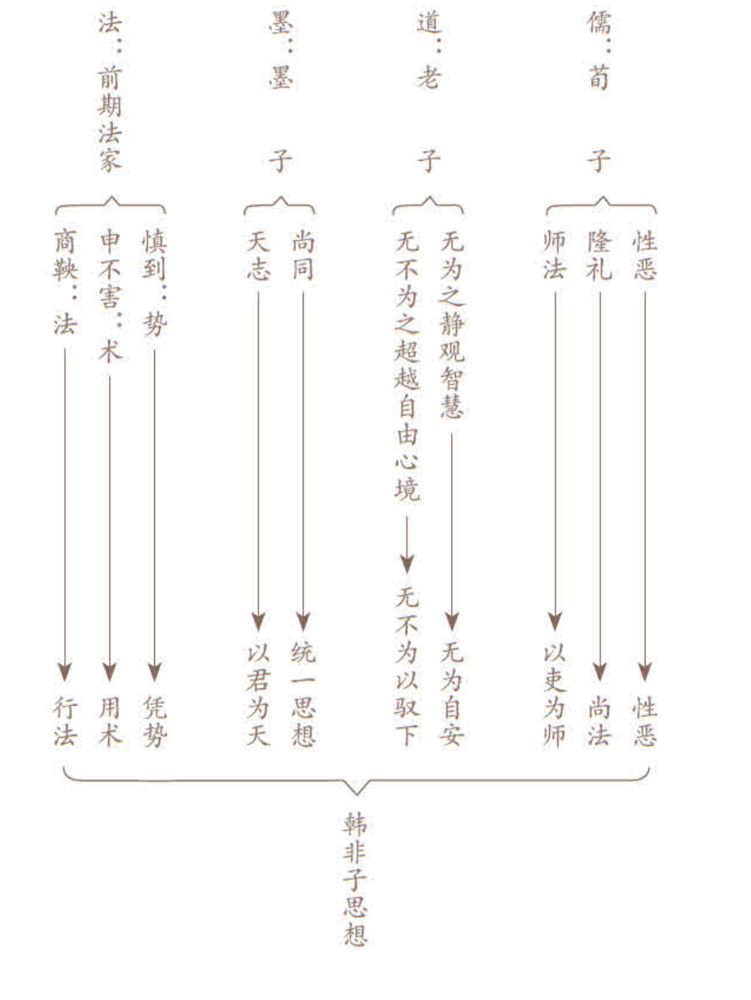

## 出版说明

为什么要阅读经典？道理其实很简单——经典正是人类智慧的源泉、心灵的故乡。也正因如此，在社会快速发展、急剧转型，也容易令人躁动不安的年代，人们也就更需要接近经典、阅读经典、品味经典。

迈入二十一世纪，随着中国在世界上的地位不断提高，影响不断扩大，国际社会也越来越关注中国，并希望更多地了解中国、了解中国文化。另外，受全球化浪潮的冲击，各国、各地区、各民族之间文化的交流、碰撞、融合，也都会空前地引人注目，这其中，中国文化无疑扮演着十分重要的角色。相应地，对于中国经典的阅读自然也就拥有了不断扩大的潜在市场，值得重视及开发。

于是也就有了这套立足港台、面向海内外的“中信国学大典”的出版。希望通过本套丛书的出版，继续搭建古代经典与现代生活的桥梁，引领读者摩挲经典，感受经典的魅力，进而提升自身品位，塑造美好人生。

中信国学大典收录中国历代经典名著近六十种，涵盖哲学、文学、历史、医学、宗教等各个领域。编写原则大致如下：

 （一）精选原则。 所选著作一定是相关领域最有影响、最具代表性、最值得阅读的经典作品，包括中国第一部哲学元典、被尊为“群经之首”的《周易》，儒家代表作《论语》、《孟子》，道家代表作《老子》、《庄子》，最早、最有代表性的兵书《孙子兵法》，最早、最系统完整的医学典籍《黄帝内经》，大乘佛教和禅宗最重要的经典《金刚经•心经•坛经》，中国第一部诗歌总集《诗经》，第一部纪传体通史《史记》，第一部编年体通史《资治通鉴》，中国最古老的地理学著作《山海经》，中国古代最著名的游记《徐霞客游记》等等，每一部都是了解中国思想文化不可不知、不可不读的经典名著。而对于篇幅较大、内容较多的作品，则会精选其中最值得阅读的篇章。使每一本都能保持适中的篇幅、适中的定价，让大众都能买得起、读得起。

 （二）尤重导读的功能。 导读包括对每一部经典的总体导读、对所选篇章的分篇（节）导读，以及对名段、金句的赏析与点评。导读除介绍相关作品的作者、主要内容等基本情况外，尤其强调取用广阔的国际视野和当代眼光，将这些经典放在全球范围内、结合当下社会生活，深入挖掘其内容与思想的普世价值，及对现代社会、现实生活的深刻启示与借鉴意义。通过这些富有新意的解读与赏析，真正拉近古代经典与当代社会和当下生活的距离。

 （三）通俗易读的原则。 简明的注释，直白的译文，加上深入浅出的导读与赏析，希望帮助更多的普通读者读懂经典，读懂古人的思想，并能引发更多的思考，获取更多的知识及更多的生活启示。

 （四）方便实用的原则。 关注当下、贴近现实的导读与赏析，相信有助于读者“古为今用”、自我提升；卷尾附录“名句索引”，更有助于读者检索、重温及随时引用。

 （五）立体互动，无限延伸。 配合图书的出版，开设专题网站，增加朗读功能，将图书进一步延展为有声读物，同时增强读者、作者、出版者之间不受时空限制的自由随性的交流互动，在使经典阅读更具立体感、时代感之余，亦能通过读编互动，推动经典阅读的深化与提升。

这些原则可以说都是从读者的角度考虑并努力贯彻的，希望这一良苦用心最终亦能够得到读者的认可、进而达到经典普及的目的。

需要特别提到的是，国学大师饶宗颐先生慨然应允担任本套丛书的名誉主编，除表明先生对出版工作的一贯支持外，更显示出先生对倡导经典阅读、关心文化传承的一片至诚。在此，我们要向饶公表示由衷的敬佩及诚挚的感谢。

倡导经典阅读，普及经典文化，永远都有做不完的工作。期待本套丛书的出版，能够带给读者不一样的感觉。

## 《韩非子》导读[1]

 说难终不羡韩非 

陈耀南

 西人当初只因听说“遥远的东方有个‘秦’”，于是就称之为Chine或China，不知道这王朝竟如此短祚——从尽并诸国到亡灭，只不过十五年（公元前二二一至前二〇七），但又如此幽灵不散——“祖龙魂死业犹在”、“百代多行秦政治”，君主世袭、专制独裁竟绵延了两千多载！ 

 毛泽东这两句诗（《读封建论》，一九七三），描绘了中国政治历史核心，查究下去，就必然迎出了“祖龙”（“始皇”的同义词）以至历代专制政治的辩护士和总设计师“韩非子”。 

 一生可悲的韩非，死于他的知音人秦王嬴政狱中（前二三三）。十二年后中国统一于“地形利害”和“号令赏罚”都远超六国、因而最后成功的秦。秦王遂有“始皇”尊号。又十三年，始皇死（前二一〇）。再三年，秦亡汉兴。八十多年后，司马迁在《史记》中将韩非与老子、庄子、申不害合传，这样地记述： 

 韩非者，韩之诸公子也。喜刑名法术之学，而其归本于黄老。非为人口吃，不能道说而善著书，与李斯俱事荀卿，斯自以为不如非。非见韩之削弱，数以书谏韩王，韩王不能用。……故作《孤愤》、《五蠹》、《内外储》、《说林》、《说难》十余万言。……人或传其书至秦。秦王见《孤愤》、《五蠹》之书，曰：“嗟乎，寡人得见此人与之游，死不恨矣！”李斯曰：“此韩非之所著书也。”秦因急攻韩。韩王始不用非，及急，乃遣非使秦。秦王悦之，未信用。李斯、姚贾害之，毁之曰：“韩非，韩之诸公子也。今王欲并诸侯，非终为韩不为秦，此人之情也。今王不用，久留而归之，此自遗患也，不如以过法诛之。”秦王以为然，下吏治非。李斯使人遗非药，使自杀。韩非欲自陈，不得见。秦王后悔之，使人赦之，非已死矣。 

 申子、韩子皆著书，传于后世，学者多有。余独悲韩子为说难而不能自脱耳。 

 一个“悲”字，真的贯串了韩非的人生！ 

 非常聪慧、早熟、敏感的他，却生在高贵、堂皇而又复杂、虚伪的宫廷环境，听厌了美妙的言谈，看惯了丑恶的真相；不想逃遁于情欲，放逸于艺术，他关心政务，热切改良，却又生于世局大转型的前夕，处身君庸臣贼而又贴近虎狼之秦、国亡在即的弱乱之邦，却又不忍、不能如他人的暮楚朝秦，舍离祖国。先天与童年的原因，严重的语言障碍，他好学、能文，从业于大儒荀卿，交上了同学李斯，从性恶、隆礼之说一滑而下，变本加厉，对人性、仁政，全失信心，卒之转到任法、尊君的极端，以至残酷寡恩，害人害己！ 

 早已有许多人慨叹：聪明饱学如他，竟想不到（或者不以为意）：李斯本是小吏，富贵权位所在，事秦事楚无别，所以英主可以羁縻；韩非是国之世族，休戚相关，血浓于水（即如屈原之于楚），所以雄猜之君，终不能信他可以为己所用。韩非轻身入秦，不免与李斯（以至姚贾）利害冲突，更以疏间，难怪宋代黄震《日钞》讥叹：“送死秦狱，愚莫与比！”韩非死后，李斯权位更固，继续辅佐秦王推行韩非理论。到秦皇一死，李斯又被所矫旨拥立的二世信更奸恶的赵高而害得全家惨死！ 

 李斯、韩非，以至前此的商鞅、吴起等法家人物下场往往如此！不过，因为书写得动人，又从未掌握得位，所以多一点获得同情的，还是韩非。 

 中国第一个极权皇帝，欣赏他，自然也疑忌他；第一个全国的权相，畏忌他、害死他，但更贯彻、执行他的计策。汉以后历朝政治莫不阳儒阴法，于是韩非死了，而又还没有死。 

 两千年来无数评论者，斥骂他，惋惜他，嘲笑他，但是对他文章的清通、健锐，特别是推理和比喻的灵巧，都一致赞赏。论到历代散文的论说一类，他与孟轲是先秦诸子的两座巅峰。所不同的是他们相反的人性与民权信仰，相同的是他们所共历的时世趋向，“定于一”，和自任以天下之重、以思想救世的学术承担。 

 时世不断在变，也不断呈现种种病征，有理想的人总觉得要想法医治。理想高、抱负大，才能出众而又富有使命感与同情心的人，更自觉是义不容辞的大国手。先秦诸子之学，就是由此而起。 

 首开晚周私家讲学之风而为诸子之首的，是仲尼孔丘。墨翟、韩非，这两名儒家死敌，最初都学于他的再传弟子。据《论语·学而篇》，儒学精要是“志于道”（以探求人生真理为职志）、“据于德”（以天赋人性为根据）、“依于仁”（以道德良知为凭借）、“游于艺”（在各种学问汇成的文化江洋里涵泳自得），循此发展，以尊天爱人为旨归，以本心原性为基础，以孝亲敬长为起始，以勤学尚思为修养，以兴仁复礼为功效，以君子贤人为典范，至于内圣外王，就最崇高尊贵了。这就是两千多年来作为中国文化骨干的儒学大纲。历代因之尊他为大成至圣先师，而继承光大孔子之学的，是被称为“亚圣”的孟轲。孟子以“仁”为人心安宅，“义”为行事正途，有志之士，必当“居仁由义”，以尧舜禹汤文武周公孔子一系列圣人为典范，而弘扬道统。其后荀子，最称大师，教学既久，成就亦众。他虽反孟轲“性善”之说，但仍极尊孔子而讲“儒效”，劝“学”隆礼以成君子。所以，整个儒家体系就是：以仁心为基源，义理为原则，礼文为细目，交织拓扩，以显示人之所以为人的“心性”主宰，建立巩固“尚德”传统，而发扬“人文”精神，这便是理想社会的共同规范了。 

 社会要讲求荀子所谓“群居和一”，公德是必需的；东洋西海，心同理同，共识也是可能的。不过，“同”与“异”是矛盾而又并存的；“人心不同，各如其面”，个别差异在自然、在人间，都是有目共睹，不容否认，无可抹杀。一笔抹杀，强异为同，只造成无限而无情的痛苦。世间许多坏事是自以为“好心”而做出来的，许多罪恶是自以为义、强人从己而发生的，许多误会是一厢情愿的所谓“忠恕”而招致的，许多劳累、烦恼、纷争以至罪过，是因为喜居人上而造成的。（以上理念，许多与后来传入的佛家所信有相同相通之处，所以被反对的儒者称为“二氏”。）所以，与儒家孔孟之道相异（不一定相反）而又相辅相补的，有老庄之徒，揭示一个形而上意义的“道”，其大无外，作为万事万物的总和；而物各有性，性各自足，都是得于自然的“德”；所以不必、也不可能以此例彼，或以彼代此。一切差异以至矛盾对立，都是无比伟大的“道”的一部分，永远共存而又不断互相流转。（后来那神奇的“太极图”就是这个道理的最佳象征。）所以任何人间的共同规范，都没有意义。作为万物之一，人不配也不应有为，以免自扰扰人、欺人自欺。只有清静无为，逍遥观赏，顺应自然，才是道理。他们把“道”讲得又多又动听，特别是春秋战国动乱了几百年，继之以统一者嬴秦苛暴之政，和跟着的楚汉之争，贤愚上下所有人都痛苦得不得了，到后来文景之世，把应时而兴、合乎众望的无为而治、与民休息的政策，标举为“黄（帝）老（子）之道”，于是就被称为“道家”，居于司马谈所谓有得而无失的“六家”之首了。 

 另一派思想：从儒家反出来另立门户的墨家，厌病儒者烦扰奢费的礼乐丧葬种种仪文，他们对道家的玄虚之理也没兴趣，而只崇奉一个笼统的宗教意味的“天”，认为天的意志就是要人兼相爱、交相利，所以反对战争，他们相信鬼神，但又反对音乐、命运，主张节用、节葬，信仰的朴素和矛盾，基层大众并不充分明白，也并不计较，他们只是感动、信服和跟从教主式领袖墨翟与接任的历代“巨子”，“摩顶放踵，利天下为之”的行侠仗义，以及民间帮会私人武力的团结互助。风从既众，就与儒家并称“显学”。急公好义的墨者极重集体，与老庄道家同调的杨朱偏于个人，二者各趋一端而并斥于孟子。此外，除了不谈政治的阴阳家，又有不像上述儒道墨三家之讲究终极关怀，只是游走列邦，把握其间的利害矛盾，驰骋舌辩以劝导诸侯或和或战、或合或分，最终成就策士个人功名利禄的所谓“纵横家”，以苏秦张仪为冠冕人物。这就是韩非成长和活动时期，法家以外的诸子要略了。 

 儒道墨纵横诸派，法家人士都不喜欢，认为他们大害于国——或者，最重要的，是不利于最高统治者。特别是处战国末世、集法家大成的韩非子，对前述各家思想都了解，但都不满意，甚至看不起、反对、唾弃。儒家讲从自心发出的由亲及疏的“推爱”；墨家认为应该是“天志”之下，无有差等的“兼爱”。韩非提醒领导人：“爱”就不利于统治。儒家以“亲亲”“尊贤”为治国用人两大基准，韩非指出：这两者之间一定矛盾，而且，“亲亲”就偏私，所谓“贤”也可以虚诞；还有利之所在，什么“亲”“贤”都可以反戈攻击君主！韩非认为，只有自己归纳综合的那一套“凭势、用术、行法”，才是明主的唯一妙方！ 

 前期法家之书，《管子》、《商君书》、《申子》等等，虽或伪托，或不传，但考核其中言论，与史书所记其人其事，则性格主张仍然可知，大抵都是从政务实，急功近利，不喜欢（也不擅长）抽象理念的探索和价值体系的建立——或者说：唯一价值，就在所效忠的国君当下的实际利益。什么人性陶冶、道德自觉等等，都嗤为迂阔，绝少关心，即有所谓教育，亦止于信赏必罚，训练操控，以作生产和战争的工具。到集大成的韩非子，更是如此。其思想渊源和学术演变之迹，示如下表： 

 
 今本《韩非子》，大体可信为其自撰，间中有问题者，亦多为后学之所缀补或者拟作。作为学术研究，“韩非本人思想”与“《韩非子》书所表现之法家思想”是两个有同有异的课题；作为本书导读，则重点在于后者。个别作品的考据问题，不能多费篇幅了。以下表列《韩非子》全书大要，继而精选条列最有代表性的言论，以见其主张： 
 

#### 一、人性恶而不可信靠：

 “父母之于子也，产男则相贺，产女则杀之。……故父母之于子也，犹用计算之心相待也，况无父子之泽者乎？”（《六反》） 

 “人为婴儿也，父母养之简，子长而怨，子盛壮成人，其供养薄，父母怒而诮之。……皆挟相为而不周于为己也。”（《外储说左上》） 

 “人主之患在于信人，信人则制于人……夫以妻之近与子之亲，犹不可信，则其余无可信者矣。”（《备内》） 

#### 二、物质经济决定治乱：

 “古者……不事力而养足，人民少而财有余，故民不争，是以厚赏不行，重罚不用，而民自治。今……人民众而货财寡，事力劳而供养薄，故民争。虽倍赏累罚而不免于乱。”（《五蠹》） 

#### 三、务时用不法古：

 “圣人不期修古，不法常可，论世之事，因为之备。”（《五蠹》） 

 “言先王之仁义，无益于治。”（《显学》） 

 “无参验而必之者，愚也；弗能必而据之者，诬也；故明据先王，必定尧舜者，非愚则诬也。愚诬之学，杂反之行，明主弗受也。”（《显学》） 

#### 四、反儒墨：

 “儒以文乱法，侠以武犯禁。”（《五蠹》） 

 “举先王言仁义者盈庭，而政不免于乱。”（《五蠹》） 

 “不能具羹食而劝饿人饭。”（《八说》） 

#### 五、法重于德：

 “夫严家无悍虏，而慈母有败子，吾以此知威势之可以禁暴，而德厚之不足以止乱也。夫圣人之治国，不恃人之为善也，而用其不得为非也：为治者用众而舍寡，故不务德而务法。”（《显学》） 

 “法之为道，前苦而长利；仁之为道，乐偷而后穷。”（《六反》） 

 “赏莫如厚而信，使民利之；罚莫如重而必，使民畏之；法莫如一而固，使民知之。”（《五蠹》） 

#### 六、愚民：

 “民智之不可用，犹婴儿之心也。……婴儿不知犯其所小苦致其所大利也。今上急耕田垦草以厚民产也，而以上为酷；修刑重罚以为禁邪也，而以上为严；征赋钱粟以实仓库、且以救饥馑备军旅也，而以上为贪；境内必知介而无私解（民皆知兵而不敢私斗也），并力疾斗所以禽虏也，而以上为暴。此四者，所以治安也，而民不知悦也。……夫民智之不足用亦明矣。故举士而求贤智，为政而期适民，皆乱之端，未可与为治也。”（《显学》） 

 “明主之国，无书简之文，以法为教；无先王之语，以吏为师；无私剑之捍，以斩首为勇。”（《五蠹》） 

#### 七、明君统治之道：

 韩非不言“仁君”而说“明主”，其统治之道是： 

 凭势——劝位自固 

 用术——形名参同 

 行法——信赏必罚 

 慎到言尚势，以为贤智未足服众，而势位可以屈贤，所以身不肖而威令行，就靠得助于众。韩非广其说，认为圣哲之君，百世无一；凭势任法，则中材之君，亦可致治。所以，势位是人主的筋力爪牙，不可去之。（见《难势》、《人主》、《功名》诸篇。） 

 韩非以为：“明主之所道制其臣者，二柄而已矣。二柄者，刑德也。何谓刑德？曰：杀戮之谓刑，庆赏之谓德。为人臣者畏诛罚而利庆赏，故人主自用其刑德，则群臣畏其威而归其利矣。”所以明主秉要执本，以暗见疵，形名参同，听言而求其当，任身而责其功，所谓“因任授官，循名责实，操生杀之柄，课群臣之能”者，就是人主所操的“术”了。 

 综核名实，继之以信赏必罚，重一奸之罪而止境内之邪，报一人之功而劝境内之众，“宪令着于官府，刑罚必于民心；赏存乎慎法，而罚加乎奸令者”，此所谓法。 

 “法莫如显，而术不欲见，不可一无；皆帝王之具也。”（见《定法》） 

 总之，韩非以至他作为集大成代表的先秦法家，所秉持者绝非现代普遍价值的法治精神。人性自私，所以要制衡权力，要民主法治，以达社群之大公，这是现代共识；人性自私，所以要压制、利用所有其他人的自私，以成就专制独裁者最大的自私，这是先秦法家——例如讲得最通透的韩非子！ 

 现代讲出“奉法而治”（rule of law），法律的制定是开诚布公，法律的实施是人人平等，终极关怀在于全民；韩非他们则是“以法为治”，（rule by law），人人屈于“为君主而制、而君主独非所制”的法律之下。一切利益最后归于君主。君主以法律禁制臣民：“太上禁其心，其次禁其言，其次禁其事”（《说疑》），从行动，到言论，到思想，都在所统制！如果君主是人，则一切他人都只是工具，是牛马！“赏之誉之不劝，罚之毁之不畏，四者加焉不变，则其除之！”（《外储说右上》）连沉默退隐也不容许！所以，焚书之酷、坑儒之惨，都绝非偶然突发！ 

 《汉书·酷吏传》说：“法令者，治之具，而非制治清浊之源也。”法令，并不是价值根本，汉代扬雄《法言》：“申韩之术，不仁至矣！何牛羊之用人也！”法家待人民，像对畜生一样。这是古代的评论，现代章炳麟《国故论衡·原道下》：“今无慈惠廉爱，则民为虎狼也；无文学，则士为牛马也”；“国虽治，政虽理，其民不人”；“有见于国，无见于人；有见于群，无见于孑”——“孑”（音“揭”，不是“子”）就是一个个单独的甚至是孤弱的，然而是有个性、有尊严、有人权的老百姓；过分地强调集体，必定也过分地压缩个人；只知道拥护必然腐败的绝对君权，更必然不把领袖以外的人当人看待！ 

 韩非既深悉人性之恶，则君主亦人，其恶又何以不必防治，而又纵之任之，以肆统治之权，得大恶大私之利？若说秦之暴虐与速亡是二世、李斯等私心扭曲，不如说是本质趋势如此。“飘风不终朝，骤雨不终日”，《老子》早有明训！ 

 百载以来，知悉欧洲历史者渐多，颇有把韩非子与十五六世纪间意大利政客马基雅维利（NiccolòMachiavelli，一四六九至一五二七）相提并论者。马氏生于昔富贵而今破落之家，奋斗苦学，力争上游，于是跻身政坛，内政外交，多所参与，一五一二年至一五一三年间，卷入政变，乃被捕囚，旋即获释，从此退出官场，专心写作，成《君主论》（The Prince），力主英明领袖，宜应不择手段，用尽诡谋，以取个人及政府利益。马氏既郁郁而卒，其书梓行，风动士林，影响日后欧洲政治。论者就多说与千余年前中国韩非颇有近似。其实细究起来，相异之处也不可忽视： 

 第一，西方自基督教普遍流行，原罪观念深入人心，君相王侯，同在神前忏悔求赦，朝野上下对权力中毒之防治，早成共识。中国文化主流，以仁心善性为宗，韩非承荀子而变本加厉，强调性恶，怀疑仁爱，但又轻视礼教，只言赏罚，于是历代多评其偏激，又或阴用其言，而阳弃其说。 

 第二，自罗马帝国崩解，民族国家林立，以分裂独立为常态，元首不过位同诸侯，权威有限。中国自秦汉之后，以大一统为正常，国家机器庞大，君主被拟为圣为神，世袭专制独裁，法家更易助纣为虐。 

 第三，自罗马君士坦丁大帝归信，基督教会地位崇高，国君登基，教皇加冕，宗教改革之后，政教分离，但朝野共同信仰，成为制衡政府之公民权利。中国自西周以人文精神代替殷商尚鬼多祀，此后亦并无可与政权抗衡之教会，反之，教主亦受君王册立，封赠尊号，而接受管制，神权反被政权利用。由此观之，法家韩非之流，逢迎君恶的阻力，比较马基雅维利为小。 

 论政者要打动人心，从政者要获得权位，在今日民主之世，靠的是公开论辩，吸引选民；在专制君主当朝，就要以文辞打动帝心。陆机《文赋》：“说炜晔而谲诳”，就如现代有人所谓“政治是高明的骗术”。《文心雕龙·论说篇》所云： 

 战国争雄，辩士云涌；纵横参谋，长短角势；转丸骋其巧辞，飞钳伏其精术；一人之辩，重于九鼎之宝；三寸之舌，强于百万之师。 

 佩六国相印的苏秦，封五个富邑的张仪，就是当时最多人艳羡的、成功的“纵横”之士。“飞辩以驰术，餍禄而馀荣”（《文心雕龙·诸子篇》），韩非学勤思敏，不屑比于苏、张，但同样要寄望“人主”，可惜严重“口吃”，补偿的是“善于著书”——他文字上的长处，主要有两方面：一是清晰周密、脉络分明，极合推理原则；二是例证丰富、生动，比喻灵巧、贴切，结合造成胡应麟《笔丛》所谓“抉摘隐微，烨如悬镜”的动人效果。特别是《文心雕龙·诸子篇》所称的“韩非著博喻之富”，书中《储说》内（上下）、外（左上、下，右上、下）六篇，即是“寓言”，二百多则，其他《说林》上下、《喻老》、《十过》等篇，亦多以故事为例，后世许多成语、谚谈、典故出于此，活跃在民众口头和文士笔下。最著者如：“守株待兔”、“自相矛盾”、“佩弦佩韦”、“滥竽充数”、“病入膏肓”、“鸣必惊人”、“三人成虎”、“郢书燕说”、“买椟还珠”、“讳疾忌医”……以至“和氏璧”、“曾子杀彘”、“郑人买履”、“不死之药”、“批其逆鳞”、“狗猛酒酸”等等，在文学艺术、语言技巧方面，韩非之书，就可说是少有病毒而营养甚多了！ 

 修辞主要是动人以情，推论所重是服人以理，所以“入道见志、成一家言”的诸子，都有逻辑。“逻辑”这个外来语的普及程度，或者超过了“名学”、“论理”、“理则”等等较富中文本色的同义词——因为似乎在西方一向较为发达——不过，概念与判断的建立，推理的开展，既是普世人心所同，以雄文代利口的韩非，书中富有逻辑范例，也是应有之义了。 

 韩非痛批儒墨的经典妙喻：“矛盾”（《难一》、《难势》），正是逻辑基本要律之一。以矛盾律为基础的犀利武器：“二难论法”，再加上“假言推理”（如《解老》论证《老子》所谓“祸福倚伏”），“归纳推理”（多见于内外《储说》六篇），都广见书中。至于《二柄》、《八奸》、《十过》、《三守》、《七术》、《六微》、《六反》、《八说》、《八经》、《五蠹》等等篇章名目，更足见韩非辩（辨）类划分的兴趣，最后都以对于人主有益有用与否，为“二分”的基准。 

 “以霸王之业教君”既然是他著书立说的终极关怀，在立竿见影的功利现实之外的抽象思维，名理玩索，韩非自然不屑一顾，甚至大加掊击。荀况承孔子而务“正名”，但已批评惠施等“甚察而不惠”（《非十二子》，精细过甚，没有实益），“蔽于辞而不知实”（《解蔽》，沉溺在词语文字，背离现实常识），到弟子韩非，眼中更只有君王势位权力，认为“辩生于上之不明”（《问辩》），“坚白（公孙龙）无厚”的名家之辨，不容于宪令之法；什么“白马非马”，带马过关也非赋税不可（《外储说左上》）！战国三晋，正如晚清，时人救亡图存的危机感特别迫切，可以理解；不过，在希腊以至近代欧洲，何尝不城邦林立，兴灭无常？对抽象名理之学何以兴趣远过？真值得更作思考。 

 老子主张“虚其心”、“弱其志”、“民之难治，以其智多”，法家尤其是韩非，更讨厌人民多说乱动，不依君主指定的路数来用力用心，难怪“祖龙”一读其书，恨未同游了！ 
  [1] 此篇导读及书中“赏析与点评”为本人所作，其余各篇导读则是原译注者陈秉才君所撰，本人略有更正字词而已，有补充、修正之处，已以按语形式注出，不敢掠美，特此说明，敬请读者诸君明鉴。 

## 初见秦

#### 本篇导读

 “初见秦”，是韩非“初”次求“见秦”王的上书。 

 本文所选文段意在劝秦王用战争统一天下，建立统一的中央集权国家，取代诸侯割据势力，是大势所趋，是社会和平安定的需要。韩非通过对当时形势的分析，赞扬推行法治的强秦“号令赏罚，地形利害，天下莫若也”，指出秦国早已具备统一天下的条件。作者认为，秦国所以没有能够成就“霸王之名”，主要是由于“谋臣皆不尽其忠”，以致三次失去成霸之机。文章还列举了许多丧失战机的事例，批评谋臣误国。对于统一战争的重要性，文章也着重加以论述，得出“战者，万乘之存亡也”的结论。 

 或说，《初见秦》不是（陈耀南按：至少不全是）韩非作品。 
 
臣闻：天下阴燕阳魏 ，连荆固齐 ，收韩而成从 ，将西面以与秦强为难。臣窃笑之。世有三亡，而天下得之，其此之谓乎！臣闻之曰：『以乱攻治者亡，以邪攻正者亡，以逆攻顺者亡。』今天下之府库不盈，囷仓空虚 ，悉其士民，张军数十百万，其顿首戴羽为将军断死于前不至千人 ，皆以言死。白刃在前，斧锧在后 ，而却走不能死也！非其士民不能死也，上不能故也。言赏则不与，言罚则不行，赏罚不信，故士民不死也。今秦出号令而行赏罚，有功无功相事也。出其父母怀衽之中，生未尝见寇耳；闻战，顿足徒裼 ，犯白刃，蹈炉炭，断死于前者皆是也。夫断死与断生者不同，而民为之者，是贵奋死也。夫一人奋死可以对十，十可以对百，百可以对千，千可以对万，万可以克天下矣。今秦地折长补短，方数千里，名师数十百万。秦之号令赏罚，地形利害，天下莫若也。以此与天下 ，天下不足兼而有也。是故秦战未尝不克，攻未尝不取，所当未尝不破，开地数千里，此其大攻也。然而兵甲顿，士民病，蓄积索 ，田畴荒，囷仓虚，四邻诸侯不服，霸王之名不成。此无异故，其谋臣皆不尽其忠也。
   1 阴燕阳魏：北面是燕国，南面是魏国。指赵国处于中心位置。   2 固：紧密结合。   3 收：接纳，纠合。从：同“纵”，合纵。   4 囷（qūn）：圆顶谷仓。   5 戴羽：把羽毛系在头盔上作为将军的标志。至：止。   6 斧锧（zhì）：古代腰斩时的刑具。锧，垫在被杀者身下的砧木。   7 徒裼（xī）：脱下上衣，赤膊上阵。   8 与：通“举”，攻取。   9 索：尽。 

#### 译文

臣听说：天下的大局是北燕南魏，连接楚国和齐国，纠合韩国而成合纵之势，将要向西去同秦国对抗。臣私下讥笑他们。世上有三种灭亡途径，六国都具备了，大概说的就是合纵攻秦的情形吧！臣听说：“以混乱进攻安定必亡，以邪恶进攻正义必亡，以倒退进攻顺乎前进的必亡。”如今六国的财库不满，粮仓空虚，征发全国百姓，扩军数百万，其中戴羽的将军发誓在前线决死战斗的不止千人，都说是不怕死；到了利刃在前，斧锧在后，还是退逃不去拼死作战！——不是说这些士兵不能死战，而是六国君主不能使他们死战的缘故。该赏的不赏，当罚的不罚，赏罚失信，所以士兵不愿死战。如今秦国公布法令而实行赏罚，有功无功分别对待。百姓从脱离父母怀抱，一生都不曾见过敌人；但一听说打仗，跺着脚赤膊上阵，迎着利刃，踏着炭火，上前拼死的比比皆是。拼死和贪生不同，而百姓之所以愿意死战，是因为他们崇尚英勇战斗而死的精神。一人奋勇拼命可抵十，十人可抵百，百人可抵千，千人可抵万，万人可以攻克天下。如今秦国领土截长补短，方圆数千里，雄师有百万之众。秦国法令赏罚严明，地形险要，天下没有一个国家可比。凭这些有利条件攻取天下，无需费力就可以兼并。因此，秦国打仗没有不获胜的，攻城没有不占领的，遇上抵抗的军队没有不击败的，开辟疆土数千里，这是一件大功。但是，士兵疲惫，百姓困乏，积蓄耗尽，田园荒芜，谷仓空虚，四邻诸侯不服，霸主之名不成。其中没有别的缘故，只是秦国的谋臣没有尽忠。
 

#### 赏析与点评

“言赏则不与，言罚则不行，赏罚不信，故士民不死也。”“夫断死与断生者不同，而民为之者，是贵奋死也。”两语道出六国败弱而秦兵善战之故。
  
臣敢言之：往者齐南破荆 ，东破宋 ，西服秦 ，北破燕 ，中使韩、魏 ，土地广而兵强，战克攻取，诏令天下。齐之清济浊河 ，足以为限；长城巨防 ，足以为塞。齐，五战之国也 ，一战不克而无齐 。由此观之，夫战者，万乘之存亡也。且臣闻之曰：『削株无遗根，无与祸邻，祸乃不存。』秦与荆人战，大破荆，袭郢 ，取洞庭、五渚、江南 ，荆王君臣亡走，东服于陈 。当此时也，随荆以兵，则荆可举；荆可举，则其民足贪也，地足利也。东以弱齐、燕，中以凌三晋 。然则是一举而霸王之名可成也，四邻诸侯可朝也。——而谋臣不为，引军而退，复与荆人为和，令荆人得收亡国，聚散民，立社稷主，置宗庙，令率天下西面以与秦为难。此固以失霸王之道一矣。天下又比周而军华下 ，大王以诏破之，兵至梁郭下 。围梁数旬，则梁可拔；拔梁，则魏可举；举魏，则荆、赵之意绝；荆、赵之意绝，则赵危；赵危而荆狐疑；东以弱齐、燕，中以凌三晋。然则是一举而霸王之名可成也，四邻诸侯可朝也。——而谋臣不为，引军而退，复与魏氏为和，令魏氏反收亡国，聚散民，立社稷主，置宗庙，令率天下西面以与秦为难。此固以失霸王之道二矣。前者穰侯之治秦也 ，用一国之兵而欲以成两国之功，是故兵终身暴露于外，士民疲病于内，霸王之名不成。此固以失霸王之道三矣。
   1 齐南破荆：指齐宣王十九年（前三〇一年）联合秦国在重丘（在今河南泌阳东北）打败楚军，虏楚将唐昧一事。据《史记·六国年表》记载，此事发生在齐湣王二十二年。   2 东破宋：指齐湣王十五年（前二八六年）齐国攻灭宋王偃一事。据《史记·六国年表》记载，此事发生在齐湣王三十八年。   3 西服秦：指齐湣王三年（前二九八年）齐国和韩、魏攻秦，攻至函谷关，秦割河东三城求和一事。据《史记·六国年表》记载，此事发生在齐湣王二十六年。   4 北破燕：指齐宣王六年（前三一四年）齐国攻燕国，燕王哙和子之被杀一事。据《史记·六国年表》记载，此事发生在齐湣王十年。   5 中使韩、魏：指前二九八年，齐和韩、魏攻秦国一事。使，驱使。   6 济：济水。河：黄河。   7 长城巨防：指齐国长城。东起自海，西抵济水。巨防，指防门，齐长城西段的一个要塞，在平阴城（位于今山东平阴东北）南。   8 五战：指南破荆、东破宋、西服秦、北破燕和齐宣王二年（前二八四年）齐和魏、赵、韩、楚、燕联军攻秦五次战事。   9 一战不克而无齐：指齐湣王十七年（前二八四年）燕、秦等五国联军在济西打败齐军一事。燕将乐毅连下齐七十余城，攻破齐都城临淄，齐湣王逃到莒，为楚将淖齿所杀。   10 袭郢（yǐnɡ）：指前二七八年秦将白起攻破楚都一事。   11 五渚：地在宛（位于今河南南阳）、邓（位于今湖北襄樊北）之间，临汉水。   12 服：保，防守。陈：楚国地名，位于今河南淮阳。   13 三晋：指取代晋国而建立的韩、赵、魏三国。   14 比周：紧密勾结。军：驻兵。华：指华阳，韩国地名，位于今河南密县东北。   15 梁：大梁，魏国国都，位于今河南开封。   16 穰侯：即魏冉，楚国人，秦昭襄王时，他四次任相，曾利用职权扩大封地。因封地在穰（位于今河南邓县），故名穰侯。 

#### 译文

臣斗胆进言：过去齐国南面打败楚军，东面攻灭宋王偃，西面迫使秦国屈服，北面击败燕国，从中调遣韩、魏两国，领土广阔而兵力强大，战胜攻取，号令天下。齐国清澈的济水、浑浊的黄河，足以用作防线；长城、巨防，足以作为要塞。齐国打了五次胜仗，后来仅因一次战斗失利而濒于灭亡。由此看来，战争关系到大国的存亡。而且臣听说过这样的话：“砍树不要留根，不与祸害接近，祸害就不会存在。”秦军和楚军作战，大败楚军，击破郢都，占领洞庭、五渚、江南一带，楚国君臣逃跑，困守在东面的陈地。当此之时，秦兵追歼楚军，就可以占领楚国；既可占领楚国，楚民就足以归我所有，楚地就全部归我所用。东可进而削弱齐、燕，在中原可进而控制韩、赵、魏。果能如此，那就是一举成就霸王之名，可使四邻诸侯都来朝拜。然而谋臣不这样做，却率军队撤退，重新与楚人讲和，使楚人得以收复沦陷国土，聚集逃散百姓，重立社稷，再建宗庙，让他们统率东方各国军队西向来挑战秦国。这的确是秦国第一次失去称霸天下的机会。合纵六国又紧密配合，驻军华阳之下，大王下诏击败他们，兵临大梁城下。包围大梁数十天，攻克大梁在即；攻克大梁，就可一举占领魏国；占领魏国之后，楚、赵联合的意图就破灭；楚、赵联盟破灭，赵国就岌岌可危；赵国危机，楚国抗秦决心就会动摇；大王向东面可进而削弱齐、燕，在中原可进而控制韩、赵、魏。果能如此，那就是一举成就霸主之名，让四邻诸侯前来朝拜称臣。然而，谋臣没有这样做，却率领军队撤退，重新与魏人讲和，反而让魏人收复国土，聚集逃散百姓，重立社稷，再建宗庙，让他们统率东方各国西向来挑战秦国。这的确是秦国第二次失去称霸天下的机会。以前穰侯治理秦国时，用一国的兵力而想建立两国的功业，因此士兵终身在野外艰苦作战，百姓在国内疲惫不堪，未能成就霸主之名。这的确是秦国第三次失去称霸天下的机会。

## 主道

#### 本篇导读

 “主道”是指做君主的原则。这里韩非吸取道家虚静无为的哲学思想，并运用到政治生活中，发展成为君主治国用人的原则。本文选其中三段加以介绍。 

 所选文段一提出君主应“守始以知万物之源，治纪以知善败之端”。保持清静无为，使臣下不能探测君主的心意，从而杜绝他们窥窃君权的欲望。同时还要用刑名之术考察、使用臣下，根据他们的主张分派相应的使命，责求他们做出应有的功效。有功，疏贱必赏；有过，近爱必诛。“主道”体现了“君道无为，臣道有为”的思想。君主当顺应客观形势推行法治，让臣下贡献出自己的才能去建立功业。“明君无为于上，群臣竦惧乎下”，“臣有其劳，君有其成功”。这就是韩非的“主道”。 

 文段二重在讲述君主深藏不露之术，是为了防范臣下窥测君心，是为了控制臣下，防止权奸、朋党的产生和作乱。“散其党”、“闭其门”，“国乃无虎”；“大不可量，深不可测”，“国乃无贼”，权奸就不能窃权。 

 文段三是韩非对治国之道本于自然的解释。这个原则要求君主不能用自己的好恶感情、心智技巧治理国家。君主所处的位势，应像道的位势一样，“寂乎其无位而处，漻乎莫得其所”，处“无为”之势，才能使群臣处于畏惧状态。君主不自操事，不自计虑，而靠“符契”验证、考核臣下的言事，“符契之所合，赏罚之所生也”。符契、赏罚体现的是法制精神。所有这些都是由道的本原演化而成，为是非标准确立的根据，它说明法制是自然法则的运用。 

一
 
道者，万物之始，是非之纪也 。是以明君守始以知万物之源，治纪以知善败之端。故虚静以待令，令名自命也，令事自定也。虚则知实之情，静则知动者正。有言者自为名，有事者自为形，形名参同 ，君乃无事焉，归之其情。故曰：君无见其所欲 ，君见其所欲，臣自将雕琢；君无见其意，君见其意，臣将自表异 。故曰：去好去恶，臣乃见素；去旧去智，臣乃自备。故有智而不以虑，使万物知其处；有贤而不以行，观臣下之所因 ；有勇而不以怒，使群臣尽其武。是故去智而有明，去贤而有功，去勇而有强。群臣守职，百官有常 ，因能而使之，是谓习常。故曰：寂乎其无位而处，漻乎莫得其所 。明君无为于上 ，群臣竦惧乎下 。明君之道，使智者尽其虑，而君因以断事，故君不穷于智；贤者勑其材 ，君因而任之，故君不穷于能；有功则君有其贤，有过则臣任其罪，故君不穷于名。是故不贤而为贤者师，不智而为智者正。臣有其劳，君有其成功，此之谓贤主之经也。
   1 纪：准则，纲领。   2 参同：验证相合。参，验证。同，合。   3 见：同“现”。   4 表异：伪装。   5 因：凭借，依据。   6 常：指常规、常法。   7 漻：通“寥”，寥廓，高远空旷。   8 无为：《老子》中提出的哲学概念。道家的“无为”是指宇宙的存在状态，指出道无为，万物自化，从而又体现了“无为而无不为”的最高境界。韩非接受无为思想，把它运用到治国理论方面，形成了法家任势用术的最高原则。无为已经成为韩非法制思想的理论基础。所以他认为，君主“无为”，就可以不费气力地使臣下把事情办好。   9 竦：通“悚”，害怕，恐惧。   10 勑（lài）：慰勉，鼓励。 

#### 译文

道是万物的本原，是非的准则。因此英明的君主把握本原来了解万物的起源，研究准则来了解成败的原因。所以虚无安静地对待一切，让名称自然命定，让事情自然确立。虚无了，才知道实在的真相，冷静了，才知道行动的准则。进言者自会确定主张，办事者自会产生效果，效果和主张验证相合，君主就无需躬亲琐事，而使事物呈现出本来面目。所以说，君主不要显露他的欲望，君主显露他的欲望，臣下将自我粉饰；君主不要显露他的意图，君主显露他的意图，臣下将自我伪装。所以说：除去爱好，抛开好恶，臣下就显露真相；除去成见，抛开智慧，臣下就约束自己。所以君主有智慧也不用来谋事，使万物处在它适当的位置上；有贤能也不表现为行动，以便察看臣下依据什么行事；有勇力也不用来逞威风，使臣下充分发挥他们的勇武。因此君主不用智慧却仍能明察，离开贤能却仍有功绩，离开勇力却仍然强大。群臣恪守职责，百官都有常法，君主根据才能使用他们，这叫遵循常规。所以说：寂静啊！君主好像没有处在君位上；寥廓啊！臣下不知道君主在哪里。明君在上面无为而治，群臣在下面诚惶诚恐。明君的原则是，使聪明人竭尽思虑，君主据此决断事情，所以君主的智力不会穷尽；鼓励贤者发挥才干，君主据此任用他们，所以君主的能力不会穷尽；有功劳在君主头上闪现出贤能的光彩，有过失则臣下承担耻辱的罪责，所以君主的名声不会衰减。因此不显示贤的却是贤人的老师，不显示智的却是智者的君长。臣下承担劳苦，君主享受功名，这就叫贤明君主的常法。
 

#### 赏析与点评

“君无见其所欲，君见其所欲，臣自将雕琢；君无见其意，君见其意，臣将自表异”。老子所谓“鱼不可脱于渊，国之利器，不可以示人”。“有功则君有其贤，有过则臣任其罪。”二语最合从来自私领袖之意。
 
二
 
道在不可见 ，用在不可知。虚静无事，以暗见疵 。见而不见 ，闻而不闻，知而不知。知其言以往，勿变勿更，以参合阅焉。官有一人，勿令通言，则万物皆尽。函掩其迹，匿其端，下不能原 ；去其智，绝其能，下不能意。保吾所以往而稽同之 ，谨执其柄而固握之。绝其望，破其意，毋使人欲之。不谨其闭 ，不固其门，虎乃将存。不慎其事，不掩其情，贼乃将生。弑其主 ，代其所，人莫不与，故谓之虎。处其主之侧，间其主之忒 ，故谓之贼。散其党，收其余，闭其门，夺其辅，国乃无虎。大不可量，深不可测，同合刑名 ，审验法式 ，擅为者诛，国乃无贼。
   1 道：指君主掌握的道。这里实际上就是指驾驭群臣的“术”。   2 疵（cī）：小毛病。   3 而：如同，好像。   4 原：推测根源。   5 稽：考查。同之：指言论与实际一致。   6 闭：门闩所插入的孔。这里指门闩。   7 弑：杀，指臣杀君，下杀上。   8 间（jiàn）：暗中窥伺。忒（tè）：差错，过失。   9 刑：通“形”，行为的表现。   10 法式：法度。 

#### 译文

道是看不见的，君主运用道的时候，也不能被察觉。君主要保持虚静无事的态度，以隐蔽的方法察看群臣的过失。看到了好像没看到，听到了好像没听到，知道了装作不知道。君主知道了臣下的言论以后，不要予以变动更改，而要用验证比较的方法考察他们的言论是否与实际相符。每一个官职只有一个人任职，不要让各位官员串通消息，那样一切事情就全都露出实情。君主掩盖起自己的形迹，隐藏起事情的苗头，臣下就不能推测到他的心意；君主摒除个人的智慧，不用自己的才能，臣下就不能揣测到他的真情。君主要坚守自己的意图去考核臣下言论是否与实际相符，谨慎地抓住国家的权柄且牢固地掌握它。杜绝臣下的窥视，破坏臣下的欲念，不要让群臣贪求君主的权柄。如果不谨慎门闩，不牢固地关好大门，恶虎就将潜入。如果不谨慎对待自己的行事，不掩盖自己的真情，奸贼就有机可乘。敢于杀掉他的君主，篡夺君主的权位，没有谁不畏惧顺从他，所以称他为恶虎。侍奉在君主的左右，暗中窥伺君主的过失，所以称他为奸贼。君主如果粉碎奸臣的私党，逮捕奸臣的余孽，封闭奸臣的门户，铲除奸臣的帮凶，国家就没有恶虎了。君主的治术大到不可估量，深得不可探测，考核臣下的行为与言论是否一致，考察和检验群臣的活动是否合于法度，擅自妄为的就予以诛罚，国家就没有奸贼了。
 

#### 赏析与点评

“道在不可见，用在不可知。虚静无事，以暗见疵。”老子之道，韩非用作权谋驭下之术。
 
三
 
人主之道，静退以为宝 。不自操事而知拙与巧，不自计虑而知福与咎 。是以不言而善应 ，不约而善增 。言已应，则执其契 ；事已增，则操其符 。符契之所合，赏罚之所生也。故群臣陈其言，君以其言授其事，事以责其功。功当其事，事当其言，则赏；功不当其事，事不当其言，则诛 。明君之道，臣不得陈言而不当。是故明君之行赏也，暧乎如时雨 ，百姓利其泽；其行罚也，畏乎如雷霆，神圣不能解也。故明君无偷赏 ，无赦罚。赏偷，则功臣堕其业 ；赦罚，则奸臣易为非。是故诚有功，则虽疏贱必赏；诚有过，则虽近爱必诛。疏贱必赏，近爱必诛，则疏贱者不怠，而近爱者不骄也。
   1 退：这里有不露锋芒、不为人先的意思。   2 咎（jiù）：过失，祸患。   3 善应：善于提出自己的主张。   4 善增：善于提高功效。   5 契（qì）：古代一种凭证。在竹简或木片上刻字，分为两半。双方各收一半，验证时将两半相合。   6 符：古代调兵遣将用的凭证，用竹、木或铜、玉做成。中分为二，双方各执一半，验证时将两半相合。   7 诛：惩罚。   8 暧（ài）：温润。   9 偷：苟且，随便。   10 堕：通“惰”，懈怠。 

#### 译文

君主的原则，以静退为贵。不亲自操持事务而知道臣下办事的拙和巧，不亲自考虑事情而知道臣下谋事的福和祸。因此君主不多说话而臣下就要很好地谋虑，不作规定而臣下就要很好地办事。臣下已经提出主张，君主就拿来作为凭证；臣下已经做了事情，君主就拿来作为考核的依据。拿了凭证进行验证，就是决定赏罚的根据。所以群臣陈述他们的主张，君主根据他们的主张授予他们职事，依照职事责求他们的功效。功效符合职事，职事符合主张，就赏；功效不符合职事，职事不符合主张，就罚。明君的原则，要求臣下不能说话不算数。因此明君行赏，像及时雨那么温润，百姓都能受到他的恩惠；君主行罚，像雷霆那么可怕，就是神圣也不能解脱。所以明君不随便赏赐，不赦免惩罚。赏赐随便了，功臣就懈怠他的事业；惩罚赦免了，奸臣就更变本加厉。因此确实有功，即使关系疏远、地位卑贱的人也一定赏赐；确实有罪，即使亲近喜爱的人也一定惩罚。疏贱必赏，近爱必罚，那么疏远卑贱的人就不会懈怠，而亲近喜爱的人就不会骄横了。
 

#### 赏析与点评

“诚有功，则虽疏贱必赏”，此法家有效，胜儒家重情之处，但世袭独裁之君，是否必能有赏罚之明？又成疑问。
 

## 有度

#### 本篇导读

 “有度”指治国要有法度。有法度就是以法治国，法度是治国之要。作者指出，君主能否坚决推行法治，是决定国家强弱的关键。推行法治，就要“使法择人”、“使法量功”，这样，做臣子的才会忠心不二地尊奉君主。否则，君主仅凭虚名择臣，臣下就会废法行私，用虚伪的道德来沽名钓誉，结党营私，侵害君主。只有坚决以法办事，“法不阿贵，绳不挠曲”，“刑过不避大臣，赏善不遗匹夫”，严厉打击奸臣的破坏活动，国家才能强盛，社会才能大治。 

 本文为《有度》篇第五段。所选文段提出“法不阿贵”的思想，被认为是中国古代法治思想史上的精华，是对战国以前“刑不上大夫，礼不下庶人”贵族法权的否定，具有历史的进步意义。“矫上之失”、“一民之轨”，更具有法的平等观念，它是“法不阿贵”思想的进一步升华，体现了以法治国的思想，它排除“释法用私”的人治行为，不允许用法外的个人意志处理政事，不允许用私心进行赏罚。由于历史的局限性，这些思想尽管难以真正实现，但是，它在中国法治思想史上具有开创意义。 
 
夫人臣之侵其主也，如地形焉，即渐以往，使人主失端，东西易面而不自知。故先王立司南以端朝夕 。故明主使其群臣不游意于法之外，不为惠于法之内，动无非法。峻法，所以禁过外私也；严刑，所以遂令惩下也。威不贰错 ，制不共门 。威、制共，则众邪彰矣；法不信，则君行危矣；刑不断，则邪不胜矣。故曰：巧匠目意中绳 ，然必先以规矩为度 ；上智捷举中事 ，必以先王之法为比 。故绳直而枉木斫 ，准夷而高科削 ，权衡县而重益轻 ，斗石设而多益少 。故以法治国，举措而已矣 。法不阿贵 ，绳不挠曲 。法之所加，智者弗能辞，勇者弗敢争。刑过不避大臣，赏善不遗匹夫。故矫上之失，诘下之邪 ，治乱决缪 ，绌羡齐非 ，一民之轨 ，莫如法。厉官威民 ，退淫殆 ，止诈伪，莫如刑。刑重，则不敢以贵易贱 ；法审 ，则上尊而不侵。上尊而不侵，则主强而守要，故先王贵之而传之。人主释法用私，则上下不别矣。
   1 司南：古代测定方向的仪器。端：正。   2 错：通“措”，置，引申为树立。   3 制：帝王的命令。这里可理解为权力。   4 意：揣度。中：合。绳：木匠用的墨线。   5 规：画圆的器具。矩：画方的器具。   6 中事：合乎要求。   7 比：例证。   8 枉：曲。斫（zhuó）：砍削。   9 准：量平的器具。夷：平。高科：凸出的部分。   10 县：同“悬”。   11 斗石：都是容量单位。十斗为一石，重一百二十斤。   12 举措：处理，安排。举，提起来，升。措，降下去。   13 阿（ē）：迎合，偏袒。   14 挠：屈，引申为迁就。   15 诘：追究。   16 缪：通“谬”，谬误。   17 绌：通“黜”，削减。羡：多余。   18 轨：规则，规范。   19 厉：整治。   20 殆：通“怠”，怠惰。   21 易：轻视。   22 审：严明。 

#### 译文

臣子侵害君主，就像行路时的地形一样，由近及远，逐渐变化，使君主失去方向，东西方位改变了，自己却不知道。所以先王设置指南仪器来判断东西方位。所以明君不让他的群臣在法律之外乱打主意，也不允许在法令规定的范围内谋求利益，举动没有不合法的。严峻的法令是用来禁止犯罪、排除私欲的；严厉的刑法是用来贯彻法令、惩办臣下不轨行为的。威势不能分置，权力不能同享。威势权力与别人同享，奸臣就会公然滥用权力；执法不坚定，君主的行为处境就会危险；刑罚不果断，就不能战胜奸邪。所以说：巧匠目测合乎墨线，但必定先用规矩作为标准；智力高者办事敏捷合乎要求，必定用先王的法度作为依据。所以墨线直了，曲木就要砍直；水平器平了，高凸就要削平；秤具拎起，就要减重补轻；量具设好，就要减多补少。所以用法令治国，不过是制定出来、推行下去罢了。法令不偏袒权贵，墨绳不迁就弯曲。法令该制裁的，智者不能逃避，勇者不敢抗争。惩罚罪过不回避大臣，奖赏功劳不漏掉平民。所以矫正君主的过失，追究臣民的奸邪，治理纷乱，判断谬误，削减多余，纠正错误，统一民众的规范，没有比得上法律的。整治官吏，威慑民众，除去淫乱怠惰，禁止欺诈虚伪，没有比得上刑罚的。刑罚重了，就不敢因地位高轻视地位低的；法令严明，君主就尊贵不受侵害。尊贵不受侵害，君主就强劲而掌握权势，所以先王重法并传授下来。君主弃法用私，君臣之间就没有区别了。
 

#### 赏析与点评

“法之所加，智者弗能辞，勇者弗敢争。刑过不避大臣，赏善不遗匹夫。”平等精神可取；但至君主而止，可惜可哀！
 

## 二柄

#### 本篇导读

 “二柄”指刑与德，即惩罚与奖赏两种权柄。韩非在本篇重点分析了君主掌握和运用赏罚两种权柄的重要性，指出君主只有独自掌握赏罚大权，才能驾驭臣下。如果臣下篡夺赏罚大权，君主反而会被臣下控制。君主正确掌握赏罚，必须“审合刑名”，即审察臣下言论与事功是否相符合，“功当其事，事当其功，则赏；功不当其事，事不当其言，则罚”。为了不给臣下以可乘之机，文中提出君主要“去好去恶”，不表露爱憎感情，使臣下失去侵夺权柄的依据，不能蒙蔽君主。 

 本文选录《二柄》的第一段。文中指出，君主驭臣之术总的来讲不外赏罚两种权柄，而这两种权柄又被比作虎的爪牙，十分形象、得体。作为驭臣的法宝，岂有借人之理。因为这种法宝是护身之宝、保命之宝、治国之宝。文中列举数件失去二柄所酿成的祸端来警示在位国君，齐国的田常拿到君主的赏赐权，宋国的子罕拿到君主的刑罚权，结果导致了齐君、宋君被杀。韩非把这种悲剧形象地比作虎失爪牙被狗欺。让韩非十分痛心的是，诸多君主仍在重蹈历史的覆辙，故作此文以示警戒。 
 
明主之所导制其臣者 ，二柄而已矣。二柄者，刑、德也。何谓刑、德？曰：杀戮之谓刑 ，庆赏之谓德。为人臣者畏诛罚而利庆赏，故人主自用其刑、德，则群臣畏其威而归其利矣。故世之奸臣则不然 ，所恶，则能得之其主而罪之；所爱，则能得之其主而赏之。今人主非使赏罚之威利出于己也，听其臣而行其赏罚，则一国之人皆畏其臣而易其君 ，归其臣而去其君矣。此人主失刑、德之患也。夫虎之所以能服狗者，爪牙也；使虎释其爪牙而使狗用之，则虎反服于狗矣。人主者，以刑、德制臣者也，今君人者释其刑、德而使臣用之，则君反制于臣矣。故田常上请爵禄而行之群臣 ，下大斗斛而施于百姓 ，此简公失德而田常用之也 ，故简公见弑 。子罕谓宋君曰 ：『夫庆赏赐予者，民之所喜也，君自行之；杀戮刑罚者，民之所恶也，臣请当之。』于是宋君失刑而子罕用之。故宋君见劫 。田常徒用德而简公弑 ，子罕徒用刑而宋君劫。故今世为人臣者兼刑、德而用之，则是世主之危甚于简公、宋君也。故劫杀拥蔽之主 ，兼失刑、德而使臣用之而不危亡者，则未尝有也。
   1 制：控制。   2 戮：杀。   3 故：通“顾”，可是，但是。   4 易：轻视，看不起。   5 田常：即田成子，也叫陈恒、陈成子，春秋末期齐国大臣。他采取各种争取民心的手段，扩大政治势力。前四八一年，他发动政变，攻杀齐简公，控制了齐国的政权。   6 斛（hú）：古代量器，十斗为一斛。   7 简公：指齐简公，名任。   8 见弑（shì）：被杀。   9 子罕：即皇喜，姓戴。战国中期任宋国司城（掌管土木建筑工程的官），兼管刑狱。他劫杀宋桓侯，夺取了宋国的政权。宋君：指宋桓侯，名璧。   10 见劫：被劫持，被劫杀。   11 徒：只，仅仅。   12 拥：壅塞，堵塞。 

#### 译文

明君用来控制臣下的，不过是两种权柄罢了。两种权柄就是刑和德。什么叫刑、德？可以说：杀戮叫作刑，奖赏叫作德。做臣子的害怕刑罚而贪图奖赏，所以君主亲自掌握刑赏权力，群臣就会害怕他的威势而追求他的奖励。而现在的奸臣却不是这样，他们对所憎恶的人，能够从君主那里取得权力予以惩罚；对所喜爱的人，能够从君主那里取得权力予以奖赏。假如君主不是把赏罚的威严和利益掌握在自己手里，而是听任他的臣下去施行赏罚，那么全国的人就都会害怕权臣而轻视君主，就都会归附权臣而背离君主。这是君主失去刑赏大权的祸害。老虎能制服狗，靠的是爪牙；假使老虎去掉它的爪牙而让狗使用，那么老虎反而会被狗所制服。君主是要靠刑、德来制服臣下的，如果做君主的丢掉刑赏大权而让臣下使用，那么君主反而会被臣下所控制。所以田常向君主请求爵禄而赐给群臣，对下用大斗出小斗进的办法把粮食借贷给百姓，这就是齐简公失去奖赏大权而由田常掌握，简公所以遭到杀害。子罕告诉宋桓侯：“奖赏恩赐是百姓喜欢的，君王自己施行；杀戮刑罚是百姓憎恶的，请让我来掌管。”于是宋桓侯失去刑罚大权，由子罕掌握。宋桓侯因而遭到挟持。田常仅仅掌握了奖赏大权，齐简公就遭到了杀害；子罕仅仅掌握了刑罚大权，宋桓侯就遭到了劫杀。所以现在做臣下的同时统摄了刑赏大权，那么君主将会遭受到比齐简公、宋桓侯更大的危险。所以被劫杀被蒙蔽的君主，一旦同时失去刑赏大权而由臣下执掌，却不导致危亡，是从来没有过的。
 

#### 赏析与点评

“为人臣者畏诛罚而利庆赏，故人主自用其刑、德，则群臣畏其威而归其利矣。”最后之利归于独裁之君，则篡夺之祸亦终不免。
 

## 扬权

#### 本篇导读

 扬权，就是弘扬君权。（陈耀南按：或说当作“扬榷”，“显扬而扼要论述”之意。）韩非继承黄老学派思想，从哲学高度论证君权至高，提出“道无双，故曰一，是故明君贵独道之容”。“道不同于万物”，“君不同于群臣”。因此，君主应当和道一样，以独一无二自居，高踞于群臣和百姓之上。这是韩非加强君主集权的思想，也是建立中国历史上第一个统一的中央集权专制主义封建国家的理论基础。他还提出，君主保持独尊地位，必须掌握形名之术，控制赏罚大权，但不是独揽一切权力，独断专行，而是“事在四方，要在中央”。只有让四方忙碌，司夜执鼠，各尽其责，中央集权才能巩固。 

 韩非在文段二中进一步提出，中央集权的最大障碍是大臣擅权，独断专行，削弱君主权力。小则与君主分庭抗礼，大则成为诸侯，变成独立王国。一旦这种尾大不掉的局面形成，便会臣弑其君，国破身亡。所以韩非强调，“有道之君，不贵其臣”，“一家不可二贵，一国不容二君”，正是君主专制的中央集权的理论体现。 

 （陈耀南按：本篇多韵句，文体特异。） 

一
 
天有大命 ，人有大命。夫香美脆味，厚酒肥肉，甘口而疾形 ；曼理皓齿 ，说情而捐精 。故去甚去泰 ，身乃无害。权不欲见 ，素无为也 。事在四方，要在中央 。圣人执要，四方来效。虚而待之，彼自以之 。四海既藏，道阴见阳 。左右既立，开门而当 。勿变勿易，与二俱行 。行之不已，是谓履理也。
   1 大命：大限，生命定数，限数。   2 疾形：使身体生病。疾，名词作动词用。   3 曼理皓齿：形容女人的美貌。曼理，细致的纹理。这里指细腻的皮肤。皓齿，洁白的牙齿。   4 说：同“悦”。捐：耗费，丢弃。   5 泰：过度。   6 见：同“现”。   7 素：本色。无为：《老子》中提出的哲学概念，是一种顺应自然的虚静状态。   8 要：枢纽，关键，指国家的最高权力。   9 以：用。   10 道：由，从。阴：指静。阳：指动。   11 开门：打开耳目等感觉器官。当：受。   12 二：名、实。 

#### 译文

天有自然的限数，人的生命也有自己的大限。香美的佳肴，松脆的糕点，醇厚的酒浆，诱人的鱼肉，甜在口中，害在身体；肌肤细柔牙齿洁白的美女，使人喜悦在心里却损耗了精力。因此，饮食色欲都要适当，避免过量，身体才不会受到伤害。作为国君，不要总是显示自己的权力，而是要经常保持一种虚静无为的心态。各项事务由各方官员去办，君主身居中央总揽大权。君主抓住纲要，四方官员便会竭力效劳。君主虚静以待，群臣就会各尽其能。天下已经安定，群臣各就其位，国君要在虚静之中观察各方面动静。朝中臣僚安排就绪，君主就要广开言路，虚心听取。确定了的治国法纪不要随意变更，要配合赏罚两项大权同时实行。法纪实施不能中断，就是按规律办事。
 
夫物者有所宜，材者有所施，各处其宜，故上下无为。使鸡司夜 ，令狸执鼠 ，皆用其能，上乃无事。上有所长，事乃不方 。矜而好能 ，下之所欺；辩惠好生 ，下因其材。上下易用 ，国故不治。

用一之道 ，以名为首，名正物定；名倚物徙 。故圣人执一以静，使名自命，令事自定。不见其采，下故素正。因而任之，使自事之；因而予之，彼将自举之；正与处之，使皆自定之。上以名举之，不知其名，复修其形。形名参同 ，用其所生。二者诚信，下乃贡情。
   13 司：主管。   14 狸：猫。古代称猫为狸。执：捉。   15 不方：不当。   16 矜（jīn）：自夸，自大。   17 辩惠好生：即好生辩惠。辩，口才。惠，通“慧”。   18 易：相反，颠倒。   19 一：即道。   20 倚：偏。   21 参：检验，多方地验证。同：符合，一致。 

#### 译文

事物各有自己的特性，人的才能各有不同的用武之地，事务、人才各处其位，因此，君主就能清静无为。犹如让鸡去报时辰，让猫捕鼠，各尽其能，国君就无庶务烦扰。国君要是发挥自己的特长，臣下办事就无方。国君自夸，好显示才能，臣下无能而又不甘示弱，就会欺诈；善辩，好施小恩小惠，行妇人之仁，臣下就会沿用这种做法。颠倒了君臣职责和权力，国家就难以治理。

君主运用治国法术，应以正名为首。摆正名义才能确定事实，名义不正事物也就走样。因此，圣主以虚静的心态运用法术治国。名义要自己正，事实让自己定。君主不露声色，臣下自然也就表现出本来朴素的质量。量才任职，让臣下自行治理；量才授予使命，他们就会自动办理；用治术督责群臣，使他们都能独立完成使命。国君根据名义提拔官员，如果名义不够显著，就考察他们的实际表现。表现和名义对照检验，看是否一致，根据检验所产生的结果来实行赏罚。赏与罚这两种处理办法一经实施，臣下才会真心效忠。
 
谨修所事，待命于天。毋失其要，乃为圣人。圣人之道，去智与巧，智巧不去，难以为常。民人用之，其身多殃，主上用之，其国危亡。因天之道，反形之理，督参鞠之 ，终则有始。虚以静后，未尝用己。凡上之患，必同其端 。信而勿同，万民一从。
   22 督参：监督参验，即“形名参同”的意思。鞠：穷尽。   23 必同其端：上下一样的意思。 

#### 译文

国君谨慎运用治术，遵循自然规律，不要失去治国要领，才能成为真正的圣人。圣人治国的方法，要摒弃自己的聪明和灵巧；不去掉聪明和灵巧，就难以维护国家正常秩序。臣民们耍尽了自己的聪明和乖巧，自己就会遭殃；国君使用了自己的聪明和灵巧，他的国家就会出现危亡。遵循自然规律，再探求人世间形名、赏罚法则，深入探究本源，周而复始。国君以虚静心态在臣僚后面观察，从不发表自己的看法，不表现自己的行动。所有君主的通病，都是片面听取臣下一方面意见。信任臣下但不与他们合伙办事，全国臣民就会听命国君。
 

#### 赏析与点评

“夫物者有所宜……上下无为”，“圣人执一以静”，此以道家理想，用于法家，所谓“黄老之术”即此，但专制之主，谁甘无为？世袭庸君，又谁能明圣？韩非不能解也。
 
二
 
毋弛而弓 ，一栖两雄 。一栖两雄，其斗 。豺狼在牢，其羊不繁。一家二贵，事乃无功。夫妻持政，子无适从 。

为人君者，数披其木 ，毋使木枝扶疏；木枝扶疏，将塞公闾 ，私门将实，公庭将虚，主将壅围。数披其木，无使木枝外拒 ；木枝外拒，将逼主处。数披其木，毋使枝大本小；枝大本小，将不胜春风；不胜春风，枝将害心。公子既众 ，宗室忧吟 。止之之道，数披其木，毋使枝茂。木数披，党与乃离。掘其根本，木乃不神。填其汹渊 ，毋使水清。探其怀，夺之威。主上用之，若电若雷。
   1 弛：放松。而：通“尔”，你。弓：这里比喻君主的权柄。   2 栖：鸟窝。   3 （yán）：两兽争斗时叫唤的声音。   4 子无适从：夫妻共同当家，儿子就不知去顺从谁了。   5 数：多次，经常。披：劈，削。木：树。这里比喻大臣。   6 公闾（lǘ）：公门，指官府。闾，里巷的门。   7 木枝外拒：树枝向外伸展，比喻大臣的势力向外扩张。外拒，向外伸出。   8 公子：君主的儿子，除太子外，都称公子。   9 宗室：君主的家族。这里指君主嫡长子一系。忧吟：担忧哀伤。   10 填：填塞。汹：汹涌。渊：深厚，比喻奸党势力雄厚。 

#### 译文

君主不能放弃法度，不能出现一国二主。一国有二主，斗争不已。豺狼入圈，羊不蕃息；权臣当政，国不繁荣。一家有两个主管，治家不能成功；夫妻同时当家，子女无所适从。

作为君主，治国要像剪伐树枝，不断消除大臣的党羽，不使滋生繁茂。树枝茂盛，树干受压制；大臣党羽泛滥，公门就被堵塞。私门要是徒众增多，国家就空虚，君主就被蒙蔽。树木要常修剪，不让树枝四下伸展；大臣党羽要常禁，党羽蔓延，就要威胁君主的地位。树枝要常伐，不使枝杈繁茂、树干减弱；枝大干小，经不住春风送暖；春风一吹，枝杈更盛，树干更受伤害。君主的公子们一增多，主持宗室的长子就忧愁悲叹。阻止公子势力的办法，就是要像剪伐树枝一样，不让枝杈茂盛，经常剪除，公子的势力就离散。掘去树根，树枝也就不能生长；填塞深水，不使它成为奸邪赖以躲藏的深渊。探测大臣隐秘阴谋，夺取大臣的威权。由君主操纵大权，威力就像雷电。
 

#### 赏析与点评

“一家二贵，事乃无功。夫妻持政，子无适从。”至理名言，西人经典亦有之，问题在谁当为贵，如何审定？
 

## 八奸

#### 本篇导读

 韩非揭示权臣实施八奸伎俩，就是贿赂宠幸之宫妾；收买亲信侍从、拉拢近臣廷吏；提供倩女狗马以乱君主心志；制造虚假颂扬声以蒙蔽君主；虚构危机、编造流言蜚语来混淆视听；收罗死党、培植亡命以威胁君主；勾结强国胁迫、威慑君主就范。此八奸，就是当权君主受蒙蔽挟制以至于失掉权势的原因。八奸的造成，归根结底是君主的不察，使权臣有机可乘所致，因而防八奸应当从君主自省自察不授人以柄做起。 

 本文所选为首段，体现了本篇的思想意旨。 
 
凡人臣之所道成奸者，有八术：

一曰在同床。何谓同床？曰：贵夫人，爱孺子 ，便僻好色 ，此人主之所惑也。托于燕处之虞 ，乘醉饱之时，而求其所欲，此必听之术也。为人臣者内事之以金玉，使惑其主，此之谓『同床』。

二曰在旁。何谓在旁？曰：优笑侏儒 ，左右近习 ，此人主未命而唯唯 ，未使而诺诺 ，先意承旨 ，观貌察色，以先主心者也 。此皆俱进俱退，皆应皆对，一辞同轨以移主心者也 。为人臣者内事之以金玉玩好，外为之行不法，使之化其主 ，此之谓『在旁』。
   1 孺子：年轻美女，指宫妾。   2 便（pián）僻：善于逢迎谄媚。僻，通“辟”。好色：美色。   3 托：依托。燕处：安居。这里指君主退朝以后的后廷生活。虞：通“娱”，安逸快乐。   4 优笑：以歌舞、诙谐供统治者取乐的人。侏儒：身材矮小的人，古代统治者常把这种人作为取乐的玩物。   5 近习：亲信和贴身的侍从。   6 唯唯：应承的声音，表示驯顺。   7 诺诺：应承的声音，表示驯顺。   8 先意承旨：在君主的意思没有表达出来之前就按他的意图去办。   9 先主心：事先摸到君主的心意。   10 一辞同轨：统一口径和行动。   11 化：改变，影响。 

#### 译文

臣下得以实现奸谋，有八种手段：

一是同床。什么叫同床？即尊贵夫人，受宠宫妾，谄媚便巧，姿色美丽，正是君主所迷恋的。趁着君主在晏居快乐、酒醉饭饱的机会，来央求她们想要得到的东西，这是让君主一定听从的手段。做臣子的通过内线用金玉财宝贿赂她们，叫她们迷惑君主，这就叫“同床”。

二是在旁。什么叫在旁？即倡优侏儒，亲信侍从。这些人，君主没下令就应诺，没支使就应承，事先领会君主的意图，察言观色，来预先摸到君主的心意。这些人都一致行动、一个腔调，统一口径和行动来改变君主心意。做臣子的通过内线用金玉珍宝贿赂他们，在外帮他们干不法之事，来影响他们的君主，这就叫“在旁”。
 
三曰父兄。何谓父兄？曰：侧室公子 ，人主之所亲爱也；大臣廷吏，人主之所与度计也 。此皆尽力毕议 ，人主之所必听也。为人臣者事公子侧室以音声子女，收大臣廷吏以辞言，处约言事 ，事成则进爵益禄，以劝其心 ，使犯其主，此之谓『父兄』。

四曰养殃。何谓养殃？曰：人主乐美宫室台池，好饰子女狗马以娱其心，此人主之殃也。为人臣者尽民力以美宫室台池，重赋敛以饰子女狗马，以娱其主而乱其心，从其所欲，而树私利其间，此谓『养殃』。
   12 侧室公子：君主嫡长子以外的儿子，泛指君主的伯叔或兄弟。   13 度计：度量，谋划。   14 尽力毕议：竭尽全力参与计议政事。   15 约：紧要，关键。   16 劝：勉励，鼓励。 

#### 译文

三是父兄。什么叫父兄？即叔伯、兄弟，是君主亲近爱护的人；成为大臣廷吏的公子们，是君主咨议谋划的人。这些人都竭尽全力参与议政，是君主必然听取的。臣子们用音乐倩女来侍奉君主的叔伯、兄弟，又用花言巧语来笼络大臣廷吏，处在关键时刻进言，事成之后就进爵加禄，这样来怂恿他们，使他们干扰君主，这就叫“父兄”。

四是养殃。什么叫养殃？即君主喜欢修饰宫室台池，喜欢打扮倩女狗马来让自己赏心悦目，这是君主的灾殃。做臣子的用尽民力来修饰宫室台池，加重赋敛来打扮倩女狗马，这样来娱乐君主而扰乱他的心事，顺从他的欲望，而在其中牟取私利，这就叫“养殃”。
 
五曰民萌 。何谓民萌？曰：为人臣者散公财以说民人 ，行小惠以取百姓，使朝廷市井皆劝誉己，以塞其主而成其所欲 ，此之谓『民萌』。

六曰流行。何谓流行？曰：人主者，固壅其言谈 ，希于听论议 ，易移以辩说。为人臣者求诸侯之辩士，养国中之能说者，使之以语其私。为巧文之言，流行之辞，示之以利势，惧之以患害，施属虚辞以坏其主 ，此之谓『流行』。
   17 民萌：民众。萌，通“氓”，民。   18 说：同“悦”，取悦，讨好。   19 塞：蒙蔽。   20 固壅：闭塞。   21 希：少，罕有。   22 施属（zhǔ）：编造。属，连缀。 

#### 译文

五是民萌。什么叫民萌？即做臣子的散发公家财物来取悦民众，行小恩小惠来赢得百姓，让朝廷民间都鼓动起来称颂自己，这样来蒙蔽君主而达到他的欲望，这就叫“民萌”。

六是流行。什么叫流行？即作为君主，见闻闭塞，与人交谈，很少听到臣下议论，容易被花言巧语打动。做臣子的寻求国外善辩的人，供养国内能言的人，让他们来为自己的私利进言。用华美的言语，流利的词句，讲述有利的形势来诱导他，虚构祸害来恐吓他，编造谣言来损害君主，这就叫“流行”。
 
七曰威强。何谓威强？曰：君人者，以群臣百姓为威强者也。群臣百姓之所善，则君善之；非群臣百姓之所善，则君不善之。为人臣者，聚带剑之客，养必死之士 ，以彰其威 ，明为己者必利，不为己者必死，以恐其群臣百姓而行其私，此之谓『威强』。

八曰四方。何谓四方？曰：君人者，国小则事大国，兵弱则畏强兵。大国之所索 ，小国必听；强兵之所加，弱兵必服。为人臣者，重赋敛，尽府库 ，虚其国以事大国，而用其威求诱其君；甚者举兵以聚边境而制敛于内 ，薄者数内大使以震其君 ，使之恐惧，此之谓『四方』。

凡此八者，人臣之所以道成奸，世主所以壅劫，失其所有也，不可不察焉。
   23 必死之士：亡命之徒。   24 彰：显扬。   25 索：勒索。   26 府：贮藏钱物的地方。库：粮库。   27 制敛：挟制。   28 数：多次，屡次。内：同“纳”，引进。震：震动，恐吓。 

#### 译文

七是威强。什么叫威强？即君主的统治靠群臣百姓来形成强大威势。群臣百姓喜欢的，君主就喜欢；不是群臣百姓喜欢的，君主就不喜欢。做臣子的收罗带剑的侠客，供养亡命之徒，用来耀武扬威，倡言顺从他的一定得利，不顺从他的一定要死，这样来恐吓群臣百姓从而实现个人意图，这就叫“威强”。

八是四方。什么叫四方？即做国君的，国小就侍奉大国，兵弱就害怕强兵。大国勒索的，小国一定听从；强兵压境的，弱兵一定服从。做臣子的，加重赋敛，耗尽钱粮，削弱自己国家去侍奉大国，求助大国威势来诱迫自己的君主；严重的，招引大国军队压境来挟制国内，轻些的，屡屡引进大国使者来震慑君主，使他害怕，这就叫“四方”。

所有这八种手段，是臣子实现奸谋的途径，是当代君主受到蒙蔽挟制，以致失掉权势的原因，是不可不明察的。
 

#### 赏析与点评

世袭专制君主，亦是常人（甚至庸劣之人），八劫谁能免之？君防八奸，君主本身即是巨奸！明清之间，黄宗羲《明夷待访录·原君》最发此义，而清末革命志士始得大张其理。
 

## 十过

#### 本篇导读

 “十过”是十种过错之意。作者指出君主、大臣犯有十种过错，足以造成危身、亡身、杀身、削国、亡国之祸，并通过十个历史故事来具体说明“十过”的危害，以告诫君主以此为鉴，避免重蹈历史的覆辙。 

 本文所选“女乐亡国”，就是十过之一。文中讲述了一个迷恋女乐，荒废朝政而导致亡国的历史故事。秦穆公为削弱西戎国，便送去女歌舞乐队，以迷惑国君，扰乱国政。国君得到女乐队，沉湎声色，不事国政，致使牲畜死亡过半。贤臣由馀劝谏不听，终因国势衰弱，被秦国攻占。一个国家的国力遭到严重破坏，也就丧失了立国之本，灭亡之势无法挽救。 
 
由馀出，公乃召内史廖而告之 ，曰：『寡人闻邻国有圣人，敌国之忧也。今由馀，圣人也，寡人患之，吾将奈何？』内史廖曰：『臣闻戎王之居，僻陋而道远 ，未闻中国之声 。君其遗之女乐 ，以乱其政，而后为由馀请期 ，以疏其谏。彼君臣有间而后可图也 。』君曰：『诺。』乃使内史廖以女乐二八遗戎王，因为由馀请期。戎王许诺，见其女乐而说之，设酒张饮 ，日以听乐，终岁不迁，牛马半死。由馀归，因谏戎王，戎王弗听，由馀遂去之秦，秦穆公迎而拜之上卿 ，问其兵势与其地形。既以得之 ，举兵而伐之，兼国十二，开地千里。故曰：耽于女乐，不顾国政，则亡国之祸也。
   1 公：指秦穆公。内史：协助天子管理爵、禄等政务的官吏。廖：人名。   2 僻陋：荒僻简陋。   3 中国：中原地区的诸侯国。   4 遗（wèi）：赠给。   5 请期：指请求延长回国的时间。   6 间：空隙，隔阂。图：算计，谋取。   7 张饮：搭起帐篷宴饮。   8 上卿：地位最高的卿。   9 以：已。 

#### 译文

由馀退出后，秦穆公便把内史廖召来，询问他说：“我听说邻国有圣人，是敌国的忧患。现在由馀就是圣人，我非常焦虑，应该怎么办？”内史廖回答说：“我听说戎王占据的地方，穷僻荒远，没有听过中原的音乐。您应向戎王赠送女歌舞乐队，用来迷惑戎王，扰乱国政，然后替由馀请求推迟回国的时间，阻隔由馀的劝谏。他们君臣之间有了隔阂，以后就可以策划夺取戎地。”秦穆公说：“很好！”便派内史廖带十六人组成的女乐队赠送戎王，顺便替由馀请求迟归。戎王满口答应，见到女乐队十分高兴，搭幕帐，设酒宴，天天听乐观舞，一年到头不往水草茂盛的地方迁移，牛马牲畜死亡过半。由馀回国，就去劝谏戎王，戎王不听，由馀便前往秦国。秦穆公亲自迎接并拜为上卿，询问戎国军事力量和地形地势。秦穆公掌握了情况之后，便出兵攻打戎地，兼并十二国，开拓领土千余里。所以说：耽溺女乐，不顾国家政事，就会招来亡国之祸。
 

#### 赏析与点评

韩非亦望其理想之明君为不好色之超人，此说之终穷也。
 

## 孤愤

#### 本篇导读

 “孤愤”是韩非孤独的愤慨，当时在韩国，存在两种政治力量的尖锐对立，维护君权追求法治的“智法之士”，与结党营私盗窃国柄的“当涂之人”势不两立。“当涂之人”专权蔽主，利用各种条件内外勾结，网罗党羽，采取公开杀戮和秘密处死的手段迫害法术之士，使他们无法得到君主的了解和信任，因而造成“主上卑而大臣重，故主失势而臣得国”的严重局面。韩非满怀悲愤心情，真实地描绘了法术之士向守旧势力抗争的艰难情景，强烈提出“烛私”、“矫奸”的要求。 
 
智术之士 ，必远见而明察，不明察，不能烛私 ；能法之士，必强毅而劲直，不劲直，不能矫奸 。人臣循令而从事，案法而治官 ，非谓重人也 。重人也者，无令而擅为，亏法以利私，耗国以便家，力能得其君，此所为重人也。智术之士明察，听用，且烛重人之阴情；能法之士劲直，听用，且矫重人之奸行。故智术能法之士用，则贵重之臣必在绳之外矣。是智法之士与当涂之人 ，不可两存之仇也。
   1 智：同“知”，通晓。   2 烛私：照见隐私。   3 矫：惩办。   4 案：通“按”，按照。   5 重人：即重臣，握有重权的人。   6 当涂之人：指掌握重权的人。涂，同“途”，道路。 

#### 译文

通晓治国之术的人，必定是远见卓识并明察的人，不明察，就不能洞察隐秘私情；能推行法治的人，必须坚决果断，刚强正直，不刚强正直，就不能纠察惩办奸邪之人。臣子遵循法令办理公事，按照法律履行职责，不是“重臣”。所谓“重臣”，就是无视法令而独断专行，破坏法律为私家牟利，损害国家而便利私家，势力能够控制君主，这才叫作“重臣”。懂治国之术的人明察，如被重用，将会揭露重臣的阴谋诡计；能推行法治的人刚强正直，如被重用，将会惩办重臣的邪恶行为。因此，懂治国之术和能够推行法治的人被任用，那么位尊权重之臣必定为法律准绳所不容。如此说来，懂得法治的人与当权重臣，是势不两立的仇敌。
 

#### 赏析与点评

人治社会此患必不能免，韩非亦徒然孤愤而已！
  
当涂之人擅事要，则外内为之用矣。是以诸侯不因，则事不应，故敌国为之讼；百官不因，则业不进，故群臣为之用；郎中不因 ，则不得近主，故左右为之匿；学士不因，则养禄薄礼卑，故学士为之谈也。此四助者 ，邪臣之所以自饰也。重人不能忠主而进其仇，人主不能越四助而烛察其臣，故人主愈弊而大臣愈重 。
   1 郎中：君主的侍从官员，掌通报警卫之职。   2 四助：指为当涂之人效劳的四种帮凶，即诸侯、群臣、郎中、学士。   3 弊：通“蔽”。 

#### 译文

当权重臣独揽大权，那么外交和内政就被他们控制了。正因为如此，诸侯各国不依靠他，事情就得不到照应，所以实力相当的国家会为他唱颂歌；各级官吏不依靠他，政绩便不得上报，所以各级官吏会为他效力；君主的侍从官员不依靠他，就不能接近君主，所以他们为他隐瞒罪行；学士不依靠他，就会俸禄薄而待遇低，所以学士为他说好话。这四种帮凶是奸邪之臣用来掩饰自己的遮障。重臣不能忠于君主而推荐自己的政敌，君主不能越过四种帮凶来洞察他的臣下，所以君主越来越受蒙蔽，而重臣的权势越来越大。
 
凡当涂者之于人主也，希不信爱也，又且习故。若夫即主心，同乎好恶，固其所自进也。官爵贵重，朋党又众，而一国为之讼。则法术之士欲干上者 ，非有所信爱之亲、习故之泽也，又将以法术之言矫人主阿辟之心 ，是与人主相反也。处势卑贱，无党孤特。夫以疏远与近爱信争，其数不胜也；以新旅与习故争，其数不胜也；以反主意与同好恶争，其数不胜也；以轻贱与贵重争，其数不胜也；以一口与一国争，其数不胜也。法术之士操五不胜之势，以岁数而又不得见；当涂之人乘五胜之资，而旦暮独说于前。故法术之士奚道得进 ，而人主奚时得悟乎？故资必不胜而势不两存，法术之士焉得不危？其可以罪过诬者，以公法而诛之；其不可被以罪过者，以私剑而穷之。是明法术而逆主上者，不僇于吏诛 ，必死于私剑矣。朋党比周以弊主 ，言曲以便私者，必信于重人矣。故其可以功伐借者 ，以官爵贵之；其不可借以美名者，以外权重之。是以弊主上而趋于私门者，不显于官爵，必重于外权矣。今人主不合参验而行诛 ，不待见功而爵禄，故法术之士安能蒙死亡而进其说？奸邪之臣安肯乘利而退其身？故主上愈卑，私门益尊。
   1 干：求。   2 阿辟：邪僻，邪恶。辟，邪僻。   3 奚道：何由，从哪里。奚，什么。   4 僇：通“戮”，杀。   5 比周：紧密勾结。   6 功伐：功劳。   7 参验：用事实加以检验。 

#### 译文

所有的当权重臣对于君主来说，很少不被信任和宠爱的，而且彼此又亲昵和熟悉。至于迎合君主的心理，投合君主的好恶，本来就是重臣得以晋升的途径。他们官职大，爵位高，党羽众，全国都为之赞颂。而法术之士想要求得君主重用，既没有受到信任和宠爱的亲近关系，也没有亲昵和熟悉的交情，还要用法术之言正君主的偏颇之心，这与君主完全相悖。法术之士所处地位低下，没有同党辅助而孤立无援。以关系疏远的和关系亲近、受到宠信的相抗衡，就常理而言，无法取胜；以新客与故旧相争，就常理而言，无法取胜；以违背君主心意和投合君主好恶相争，就常理而言，无法取胜；以地位低贱和位尊权重相对抗，就常理而言，无法取胜；以一个人和一国人相较量，就常理而言，无法取胜。法术之士处在“五不胜”的情形下，按年计算期限也没有觐见君主的机会；当权重臣凭借“五胜”条件，每日早晚都能单独向君主进言。因此，法术之士由什么门路得到任用呢？而君主又到什么时候才能醒悟呢？因此，凭借必定不能取胜的条件，又与重臣势不两立，法术之士怎么会不危险？重臣对那些可用罪状诬陷的，就用国家法律来诛杀；对那些不能强加罪名的，就让刺客来暗杀。这样一来，精通法术而违逆君主的人，不为官吏诛杀，必定死在刺客剑下。而结党拉派蒙蔽君主，花言巧语牟取私利的人，必定会受到重臣的信任。因此，对那些可用功劳为借口的人，就封官赐爵让他们显贵；对那些不能用好名声做借口的人，必定在外交职权上重用他们。因此，蒙蔽君主而投奔私人门下的，不在官爵级别上显赫，必定在外交职务上受重用。如今君主不验证核实就实行诛戮，不待建立功劳就授予爵禄，因此法术之士怎么能冒死去陈述自己的主张呢？奸邪之臣又怎肯面临有利可图的时机而自动引退呢？所以，君主地位就越来越低，重臣权势就越来越大。
 
夫越虽国富兵强 ，中国之主皆知无益于己也，曰：『非吾所得制也。』今有国者虽地广人众，然而人主壅蔽 ，大臣专权，是国为越也。智不类越，而不智不类其国，不察其类者也。人之所以谓齐亡者 ，非地与城亡也，吕氏弗制而田氏用之；所以谓晋亡者 ，亦非地与城亡也，姬氏不制而六卿专之也 。今大臣执柄独断，而上弗知收，是人主不明也。与死人同病者，不可生也；与亡国同事者，不可存也。今袭迹于齐、晋，欲国安存，不可得也。
   1 越：诸侯国名，范围包括今浙江大部和江苏、江西部分地区，春秋末灭吴，称霸一时。   2 壅：闭塞。   3 齐：诸侯国名，范围包括今山东北部、东部和河北东南部，周初吕尚（太公望）的封国，后为吕氏世袭。   4 晋：诸侯国名，范围包括今山西大部和河南、河北、陕西等部分地区。   5 六卿：指晋国的六家掌权贵族，即范氏、中行氏、知氏、赵氏、魏氏、韩氏。 

#### 译文

越国虽然国富兵强，中原各国的君主都知道对自己没有什么好处，都说：“不是我们所能控制的。”现在国家虽然地广人众，然而君主闭塞，大臣专权，这样一来，国家也就变得和越国一样。知道自己的国家与越国不同，却不知道现在连自己的国家也变了样，这是不明察事物有类似之处。人们之所以说齐国亡了，并不是指土地和城市丧失了，而是指吕氏不能控制它而为田氏所占有；之所以说晋国亡了，也不是指土地和城市丧失了，而是指姬氏不能控制它而为六卿所把持。现在大臣掌权独断专行，而君主不知收回，这是君主不明智。和死人症状相同，无可救药；和亡国行事相类似，无法久存。现在因袭着齐、晋的老路，想要国家安然存在，是不可能的。
 
凡法术之难行也，不独万乘，千乘亦然。人主之左右不必智也，人主于人有所智而听之，因与左右论其言，是与愚人论智也；人主之左右不必贤也，人主于人有所贤而礼之，因与左右论其行，是与不肖论贤也。智者决策于愚人，贤士程行于不肖，则贤智之士羞而人主之论悖矣。人臣之欲得官者，其修士且以精洁固身，其智士且以治辩进业 。其修士不能以货赂事人，恃其精洁而更不能以枉法为治，则修智之士不事左右、不听请谒矣 。人主之左右，行非伯夷也 ，求索不得，货赂不至，则精辩之功息，而毁诬之言起矣。治辩之功制于近习，精洁之行决于毁誉，则修智之吏废，则人主之明塞矣。不以功伐决智行，不以参伍审罪过 ，而听左右近习之言，则无能之士在廷，而愚污之吏处官矣。
   1 治辩：办事，才干。   2 谒：请托。   3 伯夷：商末孤竹国君主之长子，为让君位给他弟弟叔齐而逃到周国。周武王伐纣，他“扣马而谏”，表示反对。后逃到首阳山，不食周粟而死。后人尊他为清高廉洁的典范。   4 参伍：指参伍之验，用事实多方面地加以验证。 

#### 译文

凡是法术难以推行的，不单是大国，小国也是这样。君主的近臣不一定有才智，君主认为某人有才智而听取他的意见，然后和近臣讨论该人的言论，这是和愚蠢的人讨论才智；君主的近臣未必品德好，君主认为某人有美德而礼遇他，然后和近臣讨论他的品行，这是和品德不好的人讨论有美德的人。智者的决策由愚者来评判，贤者的行为由品德不屑者来讨论，那么品德好、有才智的人就会感到耻辱，而君主的论断也必然荒谬了。想谋得官职的臣子当中，那些品德好的人将用精纯廉洁来约束自己，那些才智高的人将用办好政事来推进事业。那些品德好的人不可能用财物贿赂来供奉他人，凭借精纯廉洁更不可能违法办事，那么品德好、才智高的人也就不会奉承君主近侍，不会理睬向人请托的行为。君主的近臣，品行不像伯夷那么高尚，索要的东西得不到，财物贿赂不上门，那么精明强干者的功业就要被压制，而诽谤诬陷的话也就出笼了。兴办政事的功业被君主的近侍所牵制，精纯廉洁的品行取决于近侍的毁誉，那么品德好、才智高的官吏就要被废黜，君主的明察也就被阻塞了。不按功劳裁决人的才智和品德，不通过事实的多方验证审判处置人的罪行和过错，却听从左右亲信的话，那么没有才能的人就会在朝廷中当政，愚蠢腐败的官吏就会窃居官职。
 
万乘之患，大臣太重；千乘之患，左右太信：此人主之所公患也。且人臣有大罪，人主有大失，臣主之利相与异者也。何以明之哉？曰：主利在有能而任官，臣利在无能而得事；主利在有劳而爵禄，臣利在无功而富贵；主利在豪杰使能，臣利在朋党用私。是以国地削而私家富，主上卑而大臣重。故主失势而臣得国，主更称蕃臣，而相室剖符 。此人臣之所以谲主便私也。故当世之重臣，主变势而得固宠者，十无二三。是其故何也？人臣之罪大也。臣有大罪者，其行欺主也，其罪当死亡也。智士者远见而畏于死亡，必不从重人矣；贤士者修廉而羞与奸臣欺其主，必不从重臣矣。是当涂者之徒属，非愚而不知患者，必污而不避奸者也。大臣挟愚污之人，上与之欺主，下与之收利侵渔，朋党比周，相与一口，惑主败法，以乱士民，使国家危削，主上劳辱，此大罪也。臣有大罪而主弗禁，此大失也。使其主有大失于上，臣有大罪于下，索国之不亡者，不可得也。
   1 剖符：符，古代一种用金、铜、竹、木做成的信符，上面刻有文字，用做封爵或调兵遣将的凭证。使用符时剖分为二，一半交官吏、将军，一半留在朝廷，遇事各出其半，以辨其伪。 

#### 译文

大国的祸害在于大臣权势太重，中小国家的祸害在于近臣太受宠信：这是君主的通病。再说臣下犯了大罪恶，君主有了大过失，臣下和君主的利益是互相不同的。这怎样证明呢？许多事实都证明：君主的利益在于具有才能而任以官职，臣下的利益在于没有才能而得到重用；君主的利益在于具有功劳而授以爵禄，臣下的利益在于没有功劳而得到富贵；君主的利益在于豪杰效力，臣下的利益在于结党营私。因此国土减少而私家更富，君主地位卑下而大臣权势更重。所以君主失去权势而大臣控制国家，君主改称藩臣，权相行使君权。这就是大臣欺骗君主谋取私利的情形。所以当代重臣，在君主改变政治情势而仍能保持宠信的，十个中还不到两三个。这是什么原因呢？是这些臣下的罪行太大了。臣下有大罪的，他的行为是欺骗君主的，他的罪行是当处以死刑的。聪明人看得深远，怕犯死罪，必定不会跟从重臣；品德好的人洁身自爱，耻于和奸臣共同欺骗君主，必定不会追随重臣。这些当权重臣的门徒党羽们，不是愚蠢而不知祸害的人，必是腐败而不避奸邪的人。大臣挟持愚蠢腐败的人，对上和他们一起欺骗君主，对下和他们一起掠夺财物，拉帮结伙，串通一气，惑乱君主败坏法制，以此扰乱百姓，使国家削弱危殆，君主忧劳受辱，这是大罪。臣下有了大罪而君主不加禁止，这是大过失。假如君主在上面有大过失，臣子们在下面有大罪，想要国家不灭亡，是不可能的。
 

#### 赏析与点评

此理韩子甚明，说之亦精，其后入秦见英明之君矣，所遇李斯亦同学法术之士矣，然下场如此，亦可哀可叹之至！
 

## 说难

#### 本篇导读

 “说难”，指向君主进说的困难。战国后期，各国政治斗争、军事交战都十分激烈、十分复杂，各种社会力量也十分活跃，各派别都想得到君主支持，以推行自己的政治主张，他们以大臣身份或说客面目向君主进言，往往困难重重，有时会遇到危险，《说难》分析了这种危险，并指出取得成功的办法。 

 所选文段一指出，进说者的成功，在于根据不同情况，迎合君主的心理和要求，逐步获得君主的信任。为了保护自己，减少不必要的牺牲，在一些细枝末节上可以委曲求全，甚至可以讲一些违心的话，以求在君主面前留下好印象，待站稳脚跟之后，确认已经取得信任，便可以据理力争一些原则问题，指明是非端正君主的决策、推心置腹不再会获罪，“以此相持，此说之成也”。即便是以宰虏身份进言，也可以“听用而振世”，也不会感到耻辱了。 

 文段二讲进说虽然困难，又不得不说，即使遭遇重大危险，进说者也应犯难排险，巧妙周旋。为此，韩非为他们写下了掌握进说的技巧，让他们鉴于前车之覆，以免重蹈其辙。向君主们讲述进说之难，为的是让君主们明察进说者的善恶与良苦用心；向进说者陈言进说之难，意在让他们避害。总的目的只有一个，就是推行法家的治国之道。但是，韩非在这里所讲的看君主脸色、好恶而进言，投君主之所好，难以与权奸的阴谋诡计相区别。法家也承认，为了取得事业成功，不惜鼓吹用诡诈之术。此即玩弄权术之谓也。由此可知，用术有着先天的弊端，以致流毒千古。 

 韩非在文段三中讲述了三个人物的遭遇：郑武公杀了讲实话的大臣关其思；宋国富人怀疑邻人盗窃他家的财物；弥子瑕先是受宠，后是失宠，君主对他做的同一件事情，前后有截然不同的态度。所有这些，不是因进说者了解情况有困难，而是处理了解的情况有困难。因此，韩非告诫进说者，不可不对君主察言观色，把握其爱憎、洞察其内心深处的心理状态，然后再进说。君臣利害各异，必然造成君主的多疑，喜怒不形于色，变化无常，有时表现宽容，有时表现为残暴，其心理活动让人难以猜度、无从窥测，这是进说之士往往遇到危害的主要原因。因此，韩非在文章的末尾告诫说：“人主亦有逆鳞，说者能无婴人主逆鳞，则几矣。” 

一
 
凡说之难 ：非吾知之有以说之之难也 ，又非吾辩之能明吾意之难也，又非吾敢横失而能尽之难也 。凡说之难：在知所说之心，可以吾说当之 。所说出于为名高者也，而说之以厚利，则见下节而遇卑贱 ，必弃远矣。所说出于厚利者也，而说之以名高，则见无心而远事情，必不收矣。所说阴为厚利而显为名高者也 ，而说之以名高，则阳收其身而实疏之 ；说之以厚利，则阴用其言显弃其身矣。此不可不察也。
   1 说：进劝。   2 知：同“智”。说之：指进劝君主。   3 横失：纵横如意，无所顾忌。失，通“佚”。   4 以：用，拿。当：适应。   5 见：被看作。下节：节操低下。遇：对待，待遇。   6 阴：暗地里。显：公开，对外。   7 阳：表面上。身：本身，指进说者。 

#### 译文

大凡进说的困难：不是难在我的才智不能够用来向君主进说，也不是难在我的口才不能够阐明我的意见，也不是难在我不敢毫无顾忌地把看法全部表达出来。大凡进说的困难：在于了解进说对象的心理，以便用我的说法适应他。进说对象想要追求美名的，却用厚利去说服他，就会显得节操低下而得到卑贱待遇，必然受到抛弃和疏远。进说对象想要追求厚利的，却用美名去说服他，就会显得没有心计而又脱离实际，必定不会被接受和录用。进说对象暗地追求厚利而表面追求美名的，用美名向他进说，他就会表面上录用而实际上疏远进说者；用厚利向他进说，他就会暗地采纳进说者的主张而表面疏远进说者。这是不能不明察的。
 
夫事以密成，语以泄败。未必其身泄之也，而语及所匿之事，如此者身危。彼显有所出事，而乃以成他故，说者不徒知所出而已矣，又知其所以为，如此者身危。规异事而当，知者揣之外而得之 ，事泄于外，必以为己也，如此者身危。周泽未渥也 ，而语极知，说行而有功，则德忘；说不行而有败，则见疑，如此者身危。贵人有过端，而说者明言礼义以挑其恶，如此者身危。贵人或得计而欲自以为功 ，说者与知焉 ，如此者身危。强以其所不能为 ，止以其所不能已，如此者身危。故与之论大人 ，则以为间己矣 ；与之论细人 ，则以为卖重 。论其所爱，则以为借资 ；论其所憎，则以为尝己也。径省其说 ，则以为不智而拙之；米盐博辩，则以为多而久之。略事陈意，则曰怯懦而不尽；虑事广肆，则曰草野而倨侮 。此说之难，不可不知也
   8 知：同“智”。揣：猜测。   9 周：亲密。渥（wò）：浓郁。   10 或：有时。得计：计谋得当。   11 与：同。   12 强：勉强。   13 大人：指大臣。   14 间：离间。   15 细人：小人，指近侍。   16 卖重：卖弄权势。这里指炫耀自己的身价。   17 借：依靠。资：凭借。   18 径：直接。   19 草野：粗野。倨（jù）侮：傲慢。 

#### 译文

事情因保密而成功，因谈话泄密而失败。未必进说者本人泄露了机密，而是谈话中触及君主心中隐匿的事，如此就会身遭危险。君主表面上做这件事，心里却想借此办成别的事，进说者不但知道君主所做的事，而且知道他要这样做的意图，如此就会身遭危险。进说者筹划一件不平常的事情并且符合君主心意，聪明人从外部迹象上把这事猜测出来了，事情泄露出来，君主一定认为是进说者泄露的，如此就会身遭危险。君主恩泽未浓厚，进说者谈论却尽其所知，如果主张得以实行并获得成功，功德就会被君主忘记；主张行不通而遭到失败，就会被君主怀疑，如此就会身遭危险。君主有过错，进说者倡言礼义来挑他的毛病，如此就会身遭危险。君主有时计谋得当而想自以为功，进说者同样知道此计，如此就会身遭危险。勉强君主去做他不能做的事，强迫君主停止他不愿意停止的事，如此就会身遭危险。所以进说者如果和君主议论大臣，就被认为是想离间君臣关系；和君主谈论近侍小臣，就被认为是想卖弄身价。谈论君主喜爱的人，就被认为是拉关系；谈论君主憎恶的人，就被认为是搞试探。说话直截了当，就被认为是不聪明而笨拙；谈话周到详尽，就被认为是啰唆而冗长。简略陈述意见，就被认为是怯懦而不敢尽言；谋事尽情发挥，就被认为是粗野而不懂礼貌。这些进说的困难，是不能不知道的。
 

#### 赏析与点评

“凡说之难：在知所说之心，可以吾说当之。”此全篇主旨，亦言之虽审，行之维艰也。
 
二
 
凡说之务 ，在知饰所说之所矜而灭其所耻 。彼有私急也，必以公义示而强之 。其意有下也 ，然而不能已，说者因为之饰其美而少其不为也。其心有高也，而实不能及，说者为之举其过而见其恶，而多其不行也 。有欲矜以智能，则为之举异事之同类者，多为之地 ，使之资说于我，而佯不知也以资其智。欲内相存之言 ，则必以美名明之，而微见其合于私利也。欲陈危害之事，则显其毁诽而微见其合于私患也。誉异人与同行者，规异事与同计者。有与同污者，则必以大饰其无伤也；有与同败者，则必以明饰其无失也。彼自多其力，则毋以其难概之也 ；自勇其断，则无以其谪怒之 ；自智其计，则毋以其败穷之。大意无所拂悟 ，辞言无所系縻 ，然后极骋智辩焉。此道所得，亲近不疑而得尽辞也。
   1 说：进劝。   2 饰：修饰，美化。矜：自夸。灭：掩盖。   3 强：鼓励。   4 下：卑下。   5 多：赞美。   6 地：指依据、条件。   7 内：同“纳”，进献。相存：相安。   8 概：古代量米麦时刮平斗斛的刮板，引申为压平、压抑。   9 谪：过失。   10 拂悟：违逆。拂，违背。悟，通“忤”。   11 系縻（mí）：抵触，摩擦。 

#### 译文

大凡进说的要领，在于懂得粉饰进说对象自夸之事而掩盖他所自耻之事。君主有私人的急事，进说者一定要指明这合乎公义而鼓励他去做。君主有卑下的念头，但是不能克制，进说者就应把它巧饰成美好的而抱怨他不去干。君主有过高的期求，而实际不能达到，进说者就为他举出此事的缺点并揭示它的坏处，而称赞他不去做。君主想自夸智能，进说者就替他举出别的事情中的同类情况，多给他提供根据，使他从进说中借用办法，却假装不知道，这样来增强他的能力。进说者想向君主进献与人相安的话，就必须用好的名义阐明它，并暗示它合乎君主私利。进说者想要陈述有危害的事，就明言此事会遭到的毁谤，并暗示它对君主也有害处。进说者称赞另一个与君主行为相同的人，规划另一件与君主考虑相同的事。有和君主污点行为相同的，就必须对它大加粉饰，说它没有害处；有和君主败迹相同的，就必须对它明加掩饰，说他没有过失。君主自信力量强大时，就不要用他为难的事去压抑他；君主自以为决断勇敢时，就不要用他的过失去激怒他；君主自以为计谋高明时，就不要用他的败绩去困窘他。进说的主旨没有什么违逆，言辞没有什么抵触，然后就可以充分施展自己的智慧和辩才了。由这条途径得到的，是君主亲近不疑而又能畅所欲言。
 
伊尹为宰 ，百里奚为虏 ，皆所以干其上也 。此二人者，皆圣人也；然犹不能无役身以进，如此其污也！今以吾言为宰虏，而可以听用而振世，此非能仕之所耻也。夫旷日弥久，而周泽既渥，深计而不疑，引争而不罪，则明割利害以致其功 ，直指是非以饰其身 ，以此相持，此说之成也。
   12 伊尹：名挚，商汤的相。宰：厨师。伊尹希望得到任用，曾设法当上汤的厨师。后来汤发现他有才能，就任用他为相。   13 百里奚：春秋时虞国大夫，后任秦国相。虏：奴隶。晋灭虞时，百里奚成了奴隶。后来晋献公嫁女到秦国，叫他做陪嫁小臣。途中，逃往楚国。秦穆公听说他有才能，就用五张羊皮把他赎走，任命他做上大夫。   14 干：求得君主的重用。   15 割：剖析。   16 饰：通“饬”，修治，端正。 

#### 译文

伊尹做过厨师，百里奚做过奴隶，都是为了求得君主重用。这两个人都是圣人，但还是不能不通过做低贱的事来求得进用，他们的自卑自污一至于此！假如把我的话看成像厨师和奴隶所讲的一样，而可以采纳来救世，这就不是智能之士感到耻辱的了。经过很长的时间，君主的恩泽已深厚，进说者深入谋划不再被怀疑，据理力争不再会获罪，就可以明确剖析利害来成就君主的功业，直接指明是非来端正君主的言行，能这样相互对待，这就是进说成功了。
 

#### 赏析与点评

韩非入秦而不避李斯，并攻姚贾，卒为二人所害，何也？
 
三
 
昔者郑武公欲伐胡 ，故先以其女妻胡君，以娱其意。因问于群臣：『吾欲用兵，谁可伐者？』大夫关其思对曰：『胡可伐。』武公怒而戮之，曰：『胡，兄弟之国也。子言伐之，何也？』胡君闻之，以郑为亲己，遂不备郑。郑人袭胡，取之。

宋有富人 ，天雨墙坏。其子曰：『不筑，必将有盗。』其邻人之父亦云。暮而果大亡其财。其家甚智其子 ，而疑邻人之父。此二人说者皆当矣，厚者为戮，薄者见疑，则非知之难也，处知则难也。故绕朝之言当矣 ，其为圣人于晋，而为戮于秦也，此不可不察。
   1 郑武公：名掘突，春秋初期郑国君主。胡：诸侯国名。归姓。位于今安徽阜阳。   2 宋：诸侯国名。子姓。位于今山东、河南、安徽、江苏之间地区。   3 甚智其子：认为他儿子很聪明。智，形容词用作动词。   4 绕朝之言：指晋大夫士会逃到秦国后，晋国用计谋诱骗他回国，绕朝识破这种计谋，劝秦康公不要让士会回去，秦康公不听。见《左传》文公十三年。绕朝，人名，春秋时秦国的大夫。 

#### 译文

从前郑武公想讨伐胡国，故意先把自己的女儿嫁给胡国君主来使他放松戒备。然后问群臣：“我想用兵，哪个国家可以讨伐？”大夫关其思回答说：“胡国可以讨伐。”武公发怒而杀了他，说：“胡国是兄弟国家，你说讨伐它，是何道理？”胡国君主听说了，认为郑国和自己人好，于是不再防备郑国。郑国偷袭并攻占了胡国。

宋国有个富人，下雨把墙淋塌了，他儿子说：“不修的话，必将有盗贼来偷。”邻居的老人也这么说。到了晚上，果然有大量财物被窃。这家富人认为儿子聪明，却对邻居老人起了疑心。关其思和这位老人的话都恰当，而重的被杀，轻的被怀疑；那么，不是了解情况有困难，而是处理所了解的情况很困难。因此，绕朝的话本是对的，但他在晋国被看成圣人，在秦国却遭杀害，这是不可不注意的。
 
昔者弥子瑕有宠于卫君 。卫国之法 ：窃驾君车者罪刖 。弥子瑕母病，人间往夜告弥子 ，弥子矫驾君车以出 。君闻而贤之，曰：『孝哉！为母之故，忘其刖罪。』异日，与君游于果园，食桃而甘，不尽，以其半啖君 ，君曰：『爱我哉！忘其口味，以啖寡人。』及弥子色衰爱弛，得罪于君，君曰：『是固尝矫驾吾车，又尝啖我以余桃。』故弥子之行未变于初也，而以前之所以见贤而后获罪者，爱憎之变也。故有爱于主，则智当而加亲，有憎于主，则智不当见罪而加疏。故谏说谈论之士，不可不察爱憎之主而后说焉。

夫龙之为虫也，柔可狎而骑也 ；然其喉下有逆鳞径尺 ，若人有婴之者 ，则必杀人。人主亦有逆鳞，说者能无婴人主之逆鳞，则几矣 。
   5 弥子瑕：人名，卫灵公宠幸的臣子。卫君：指卫灵公，名元，春秋时卫国君主。   6 卫国：诸侯国名。姬姓。位于今河南东北部、河北、山东部分地区。   7 刖（yuè）：砍掉脚的刑罚。   8 间往：抄近路去。   9 矫：假托（君命）。   10 啖（dàn）：吃，给人吃。   11 狎（xiá）：戏弄。   12 逆鳞：倒长的鳞片。径尺：直径长一尺。   13 婴：通“撄”，触动。   14 几：差不多。 

#### 译文

从前弥子瑕曾受到卫国国君的宠信。卫国法令规定，私自驾驭国君的车子，论罪要处以刖刑。弥子瑕母亲病了，有人抄近路连夜通知弥子瑕，弥子瑕假托君命驾驭君车而出。卫君听说后，却认为他德行好，说：“真孝顺啊！为了母亲的缘故，忘了自己会受刖刑惩罚。”另一天，他和卫君在果园游览，吃桃子觉得甜，没有吃完，就把剩下的半个给卫君吃。卫君说：“多么可爱啊！不顾自己口福来给我吃。”等到弥子瑕宠衰爱弛时，得罪了卫君，卫君说：“这人以前就曾假托君命私自驾驭我的车子，又曾经把吃剩的桃子给我吃。”所以，虽然弥子瑕的行为和当初并没有两样，但先前称贤、后来获罪的原因，是卫君的爱憎有了变化。所以被君主宠爱时，才智就显得恰当而更受亲近；被君主憎恶时，才智就显得不恰当，遭到谴责而更被疏远。所以谏说谈论的人不可不探察君主的爱憎，然后进说。

龙作为一种动物，驯服时可以戏弄着骑它；但它喉下有直径一尺长的逆鳞片，假使有人触动它的话，就一定会受到伤害。君主也有逆鳞，进说者能不触动君主的逆鳞，就差不多成功了。
 

#### 赏析与点评

以人君为龙，而不敢犯，此绝对权力之所以久为害于中国也！
 

## 奸劫弑臣

#### 本篇导读

 《奸劫弑臣》旨在揭露奸邪权臣乱国窃权的种种鬼蜮伎俩，指出若君主不能以法术治国，奸臣就会由劫主发展到弑君。韩非在这里提出君主必须“循名而定是非，因参验而审言辞”，运用自己的权势，厚赏重罚，使天下“不得不为己视”，“不得不为己听”，才能防止专擅朝政之臣的欺骗。否则，“主必孤于上，而臣成党于下”，以致遭遇不测。为此，韩非提出君主应以法术治国，“正明法，陈严刑”，以致“霸王之功”，从而实现理想的法治社会。 

 所选文段一中，韩非提出，“善任势者国安，不知因其势者国危”。他还以秦国为例来说明这个道理。在商鞅变法以前，秦国废弃法律而行私利，国家混乱、军事衰弱而君主位卑，变法之后，昭明奉公为国的原则，信赏必罚，富国强兵，地扩主尊，是任势的最好说明。作为君主正常治理国事，也需要任势。君主身在深宫，而能明照四海，天下不能蒙蔽他，不是靠眼睛而明，不是靠耳朵而听，而是把天下人的耳目作为自己的耳目，所以能做到暗乱之道废，聪明之势兴。这就是任势之道的一种具体表现。让天下人的耳目发挥作用，就要以法治国、以法治吏、以法治民。 

 文段二是本篇的最后两节，韩非在文中将遭劫杀的君主与麻风病患者拿来相比较，指出连麻风病患者都可怜被劫杀的君主。其中有的君主死于儿子弑杀，有的被大臣击杀，有的被自己重用的重臣困饿而死，有的被乱刀砍死，有的被挑足筋被吊死。这些君主何以有如此下场？究其原因在于他们腐败无能，不察忠奸，失德失势，其教训刻骨铭心。 

一
 
圣人之治国也，固有使人不得不爱我之道，而不恃人之以爱为我也。恃人之以爱为我者危矣，恃吾不可不为者安矣。夫君臣非有骨肉之亲，正直之道可以得利，则臣尽力以事主；正直之道不可以得安，则臣行私以干上 。明主知之，故设利害之道以示天下而已矣 。夫是以人主虽不口教百官，不目索奸邪，而国已治矣。人主者，非目若离娄乃为明也 ，非耳若师旷乃为聪也 。目必不任其数 ，而待目以为明，所见者少矣，非不弊之术也。耳必不因其势，而待耳以为聪，所闻者寡矣，非不欺之道也。明主者，使天下不得不为己视，使天下不得不为己听。故身在深宫之中，而明照四海之内，而天下弗能蔽弗能欺者，何也？暗乱之道废而聪明之势兴也 。故善任势者国安，不知因其势者国危。古秦之俗，君臣废法而服私 ，是以国乱兵弱而主卑。商君说秦孝公以变法易俗而明公道 ，赏告奸，困末作而利本事 。当此之时，秦民习故俗之有罪可以得免，无功可以得尊显也，故轻犯新法。于是犯之者其诛重而必 ，告之者其赏厚而信，故奸莫不得而被刑者众，民疾怨而众过日闻。孝公不听，遂行商君之法。民后知有罪之必诛，而告奸者众也，故民莫犯，其刑无所加。是以国治而兵强，地广而主尊。此其所以然者，匿罪之罚重而告奸之赏厚也。此亦使天下必为己视听之道也。至治之法术已明矣，而世学者弗知也。
   1 干：向君主取得禄位。   2 利害之道：指赏罚措施。利害，指赏罚，赏为利，罚为害。   3 离娄：又称离朱，传说为黄帝时人，以视力强著称。   4 师旷：字子野，春秋时晋国的著名乐师，善于辨音。聪：听觉辨音能力强。   5 数：术。   6 暗乱：愚昧混乱。聪明之势：指“使天下不得不为己视，使天下不得不为己听”的权势。   7 服：行，用。   8 说：进说，劝说。秦孝公：名渠梁，战国时秦国君主，前三六一至前三三八年在位。他坚决任用商鞅变法，使秦国富强起来。公道：奉公为国的原则。   9 末作：指工商业。本事：指农耕。   10 诛：处罚。必：必定，坚决。 

#### 译文

圣人来治理国家，一定有让人不能不爱他的办法，而不依赖能爱他才效力。依赖用爱来为君主效力潜伏着危险，依赖不能不为君主效力的办法是安全的。君臣没有骨肉关系，用正直的方法可以获得安全和利益，官吏就会竭尽全力侍奉君主；用正直的方法得不到安全和利益，官吏就为私利钻营求用。开明的君主知道这些情况，就制定赏罚办法昭示天下。

这样，君主尽管不必亲口指教官吏，不必亲眼搜索奸邪，国家就已经得到治理。君主，视力不一定像离娄一样才算明察；听力不一定像乐师师旷一样才算聪敏。作为君主视力必不如离娄，不运用治国法术，却要用眼来观察事物，所能发现的问题就很有限，这不是防止蒙蔽的办法。耳的听力必定不如师旷，不依靠权势，却靠耳朵的听力充作聪敏，能听到的消息就太少了，这不是杜绝欺骗的办法。英明的君主，让天下臣民不能不为自己看，让天下的臣民不得不为自己听。因此自己在深宫里，目光却能照射到四海之内，而天下人不能蒙蔽，不能欺骗，这是为什么呢？是昏乱的办法被抛弃，聪明的作用被发挥的结果。因此善于发挥权势，国家就安全，不知道运用权势，国家便会出现危险。过去秦国的惯例是，君臣废弃法律而行使私利，因此国家混乱、军事衰弱而君主位卑。商鞅劝说秦孝公用变法易俗来昭明奉公为国的原则，赏赐举报奸邪之人，抑制工商业而鼓励农耕，而那时，秦国民众习惯旧俗的有罪之人可以被赦免，无功的人也可以显贵，所以他们将触犯新法看得很轻。这时对于那些触犯新法的人一定要重罚，告发奸邪的人也一定要重赏，故而犯罪被捉且受刑的人很多，百姓的怨愤和众人的责难每天都能听到。但孝公并不听从，坚持施行商鞅的新法。百姓后来知道有罪就一定被责罚，而且告发奸邪的人又很多，所以百姓不敢犯法，刑罚也不用施加他们身上。因此国家太平，兵力强大，土地广阔而君主位尊。之所以能够如此，是隐藏罪过的惩罚重而告发奸邪的赏赐丰厚的缘故啊！这也是让天下的人一定为自己看和听的道理。治理得最好的法术已经明白了，而世上的学人却不知道啊！
 

#### 赏析与点评

儒家温情理想：君臣以义聚；法家冷酷现实：君臣以利合——两者皆出人性，如何调和？
 
二
 
谚曰：『厉怜王 。』此不恭之言也。虽然，古无虚谚 ，不可不察也。此谓劫杀死亡之主言也。人主无法术以御其臣，虽长年而美材 ，大臣犹将得势，擅事主断 ，而各为其私急。而恐父兄豪杰之士 ，借人主之力，以禁诛于己也，故弑贤长而立幼弱，废正的而立不义 。故《春秋》记之曰 ：『楚王子围将聘于郑 ，未出境，闻王病而反 。因入问病，以其冠缨绞王而杀之 ，遂自立也。齐崔杼其妻美 ，而庄公通之 ，数如崔氏之室 。及公往，崔子之徒贾举率崔子之徒而攻公 。公入室，请与之分国，崔子不许；公请自刃于庙，崔子又不听；公乃走，逾于北墙。贾举射公，中其股 ，公坠，崔子之徒以戈斫公而死之 ，而立其弟景公 。』近之所见：李兑之用赵也 ，饿主父百日而死 ；卓齿之用齐也 ，擢湣王之筋 ，悬之庙梁，宿昔而死 。故厉虽痈肿疕疡 ，上比于《春秋》，未至于绞颈射股也；下比于近世，未至饿死擢筋也。故劫杀死亡之君，此其心之忧惧，形之苦痛也，必甚于厉矣。由此观之，虽『厉怜王』可也！
   1 厉怜王：患麻风病的人怜悯做君主的。厉，通“疠”（lài），麻风病。这里指患麻风病的人。   2 虚：虚妄。   3 长年而美材：年龄高，身体美。   4 擅事主断：擅自处理和决断事情。   5 父兄：指君主的叔伯和兄弟。   6 的：通“嫡”。不义：指不符合宗法继承原则的人。   7 《春秋》：记载东周历史的编年体史书。这里指左丘明解释《春秋》的《左传》。   8 王子围：春秋时楚共王的儿子，名围，任楚国令尹。前五四一年杀楚王郏（jiá）敖自立，即楚灵王。聘：国事访问。郑：春秋时诸侯国名。   9 反：同“返”。   10 冠缨：系在颔下的帽带。   11 崔杼（zhù）：春秋时齐国大夫。   12 庄公：指齐庄公，名光，春秋时齐国君主，前五五三至前五四八年在位。通：通奸。   13 数：多次，屡次。如：到。   14 徒：徒属，手下人。贾举：崔杼的家臣。   15 股：大腿。   16 戈：古代兵器，横刃长柄。斫：砍。   17 景公：指齐景公，名杵臼，春秋时齐国君主。   18 李兑：战国时赵国大臣。用赵：在赵国掌权。   19 饿主父百日而死：前二九五年李兑帮助赵惠文王与赵武灵王长子章争夺君权，与公子成合谋，围困赵武灵王于沙丘宫达三个月，将其困饿而死。主父，即赵武灵王，名雍，前二九九年传位给小儿子何，自称主父。   20 卓齿：即淖齿，战国时楚将。前二八四年，燕、秦等五国联合攻齐，楚国派淖齿率兵救齐，做了齐湣王的相。   21 擢（zhuó）：抽。湣王：指齐湣王，名地，战国时齐国君主。前二八四年，燕兵破齐后，湣王逃奔到莒（位于今山东省莒县）。楚将淖齿想和燕国共分齐地，乘机杀齐王。参见《史记·田敬仲完世家》。   22 宿昔：隔夜。   23 疕（bǐ）：头疮。疡（yánɡ）：溃烂。 

#### 译文

古谚语说：“得麻风病的人都可怜做国王的。”这是对国王不敬的话。可是，自古流传下来的谚语没有不切实际的，要认真考究。这句古谚是针对被大臣劫持杀害的君主而讲的。君主没有法术驾驭臣下，尽管年长，身材魁伟，大臣还是要窃取权势，独断专行，把谋私放在国家政事之上。可是，又担心同族大臣和忠勇官员，依靠君主的力量来禁锢诛杀自己，所以要杀掉年长而贤明的君主，另立幼小没有能力掌权的，废除君主的嫡长子，改立没有名分的庶子继位。所以《春秋》记载说：“楚国的王子围将要到郑国访问，没有走出边界，就听说国王生了病，便急忙赶回楚国首都，进宫问病，乘机用帽带勒死了父亲，就自立为楚王。齐国的大夫崔杼的妻子很美，齐庄公与她私通，屡次进入崔氏房间。等到庄公再来之时，崔氏的属下贾举就率领家丁攻击庄公。庄公躲入内室，请求和他平分齐国，崔氏不答应；庄公又请求到祖庙去自杀，崔氏又不答应。庄公便跑出屋外，翻越北墙，被贾举射中大腿，从墙上跌落，家丁们挥戈将他砍死。崔氏便立庄公的弟弟杵臼当了国君，这就是齐景公。”在近世我们也看到这种情景：李兑在赵国受到重用，把赵主父武灵王围困在沙丘宫，经百日而饿死。楚国将军淖齿做了齐国宰相，抽了齐湣王的筋，并把他吊在东庙的屋梁上，过了一夜才死去。所以说，麻风病患者，浑身肿烂，可是上和《春秋》记载的相比，还不至于被勒死，箭中大腿乱刃砍死；下和近世相比，还没有弄到饿死，抽筋吊死的地步。对于被劫持杀死的国王来说，内心的忧惧，身体的痛苦，一定比麻风病患者更厉害。由此看来，即使说“麻风病患者都可怜做国王的”也毫不过分！
 

#### 赏析与点评

权力斗争之残酷，自古已然！
 

## 备内

#### 本篇导读

 “备内”是讲君主应防备宫内后妃、嫡庶诸子及权臣等弑君篡位的文章。文章指出，君主和后妃、诸子之间都存在利害关系及严重的利害冲突，甚至发生“劫君弑主”惨剧。权臣往往利用宫内种种矛盾，乘机制造篡夺君权的内乱。因此，在提出了一系列“备内”的主张后，又着重提出防止奸臣篡权警示。 

 本文选了两节加以介绍。 

 文段一旨在揭露被利欲熏心的形形色色的丑恶嘴脸，展现他们损人利己的画卷，从而警示世人充分认识人性自利所带来的恶果，以便及早预防。自利性在统治阶级内部尤为严重，由自利性引发的争斗也更为尖锐复杂。后妃、夫人、太子由盼君早死，演变为弑君杀父的事件，历代都层出不穷。出于自利心，臣下把君主的存在视为眼中钉，必欲取而代之而后快，便是自利心的恶性膨胀。古往今来，奸臣篡权，弑君夺位的事件，屡有发生。正如卖棺材的人，希望人死得越多越好，他的利益就在别人的死亡上，后妃、太子的利益在君主早死，君主不死，自己的权势就不大，从而导致自相残杀。所以，韩非特别警示君主们，“不可以不加心于利己死者”，警惕来自身边的危险，严格赏罚来驾驭臣下，让奸邪行为无处藏身，无法施展其技。韩非提出自利性的存在及危害，正是为了以法治理自利性向恶性转化。 

 文段二中揭示了权臣起家的过程，并指出“犯法为逆以成大奸者”，未尝不从尊贵之臣引起，这些权贵们施展蒙蔽君主的伎俩，逃避法律制裁，法律所惩办的却是权位较低的犯法官吏，这样权贵们互相包庇，垄断法令而独断专行，使君主大权旁落。为此，韩非提醒君主及时采取预防措施，堵死权臣成奸之路，确保国家安全。这就是不让权臣滋生的预防之术。 

一
 
万乘之主 ，千乘之君，后妃、夫人、适子为太子者 ，或有欲其君之蚤死者 。何以知其然？夫妻者 ，非有骨肉之恩也，爱则亲，不爱则疏。语曰：『其母好者其子抱。』然则其为之反也，其母恶者其子释。丈夫年五十而好色未解也 ，妇人年三十而美色衰矣。以衰美之妇人事好色之丈夫，则身见疏贱，而子疑不为后，此后妃、夫人之所以冀其君之死者也 。唯母为后而子为主，则令无不行，禁无不止，男女之乐不减于先君，而擅万乘不疑 ，此鸩毒扼昧之所以用也 。故《桃左春秋》曰 ：『人主之疾死者不能处半。』人主弗知，则乱多资。故曰：利君死者众，则人主危。故王良爱马 ，越王句践爱人 ，为战与驰。医善吮人之伤，含人之血，非骨肉之亲也，利所加也。故舆人成舆 ，则欲人之富贵；匠人成棺，则欲人之夭死也。非舆人仁而匠人贼也，人不贵，则舆不售；人不死，则棺不买。情非憎人也，利在人之死也。故后妃、夫人、太子之党成而欲君之死也，君不死，则势不重。情非憎君也，利在君之死也。故人主不可以不加心于利己死者。故日月晕围于外 ，其贼在内 ，备其所憎，祸在所爱。是故明王不举不参之事 ，不食非常之食；远听而近视，以审内外之失；省同异之言 ，以知朋党之分，偶参伍之验 ，以责陈言之实 ；执后以应前，按法以治众，众端以参观；士无幸赏，无逾行；杀必当，罪不赦，则奸邪无所容其私。
   1 万乘：泛指大国。下文的“千乘”，泛指中等国家。乘，兵车，一车由四马驾驶。   2 后妃：指万乘之主的正妻。夫人：指千乘之主的正妻。适子：正妻生的儿子。适，繁体作“適”，即“嫡”。   3 或：有人。蚤：通“早”。   4 夫：发语词。   5 丈夫：成年的男子。解：通“懈”，松懈，减弱。   6 冀：希望。   7 擅：专，独掌。   8 鸩（zhèn）：一种毒鸟，用它的羽毛泡的酒能毒死人。扼：扼杀，指缢死。昧：割，指杀死。   9 《桃左春秋》：古代的一部史书，已失传。   10 王良：春秋末期晋国人，以善于驾御车马著名。   11 句践：即勾践，春秋末期战国初期越国的君主。   12 舆人：造车的人。   13 晕：环绕日月的白色光圈。   14 贼：损害，毛病。   15 举：办。参：即参伍之验，用事实加以验证。   16 省：察看，检查。   17 偶：并列，对比。   18 责：求。 

#### 译文

各个大小国家的君主，他们的后妃、夫人，做了太子的嫡子，有的盼着自己的君主早死。怎么能证明这一点呢？妻子，没有骨肉的恩情，宠爱就亲近，不宠爱就疏远。俗话说：“母亲美，儿子受宠爱。”那么与此相反的话，就是母亲丑，儿子被疏远。男子五十岁而好色之心不减弱，妇女三十岁美貌就衰减了。色衰的妇女侍奉好色的男子，自己就会被疏远卑视，加上儿子被怀疑不能成为继承人，这正是后妃夫人盼望君主早死的原因。只有当母亲做了太后而儿子做了君主以后，那时就会令无不行，禁无不止，男女乐事不减于先君在时，而无疑要独掌国家大权，这正是用毒酒毙命、用绳索杀人事件产生的原因。所以《桃左春秋》上说：“君主因病而死的不到半数。”君主不懂得这个道理，奸臣作乱就有了更多的机会。所以说，认为君主死亡对自己有利的人多，君主就危险。所以王良爱马，越王勾践爱民，就是为了打仗和奔驰。医生善于吸吮病人的伤口，口含病人的污血，不是因为有骨肉之亲，而是因为利益所在。所以车匠造好车子，就希望别人富贵；棺材匠做好棺材，就希望人死得越多越好。并不是车匠仁慈而棺材匠狠毒，别人不富贵，车子就卖不掉；别人不死，棺材就没人买。本意并非憎恨别人，而是利益就在别人的死亡上。所以后妃、夫人、太子的私党结成了就会盼望君主早死，如果君主不死，自己权势就不大。本意并非憎恨君主，而是利益就在君主的死亡上。所以君主不能不留心那些利在自己死亡的人。所以日月外面有白色光圈环绕，成因就在内部；防备自己所憎恨的人，祸害却来自所亲爱的人。所以明君不做没有验证过的事情，不吃不寻常的食物；打听远处的情况，观察身边的事情，从而考察朝廷内外的过失；研究相同的和不同的言论，从而了解朋党的派别；对比通过事实所作的验证，从而责求臣下陈言的可靠性；拿事后的结果来对照事先的言论，按照法令来治理民众，根据各种情况来检验观察；官吏没有侥幸受赏的，没有违法行事的；诛杀一定得当，有罪的不予赦免。这样一来，奸邪行为就无处容身了。
 

#### 赏析与点评

如此为君，有何平安喜乐？韩非眼底心中，尽皆是黑暗世界！
 
二
 
徭役多则民苦，民苦则权势起，权势起则复除重 ，复除重则贵人富。苦民以富贵人，起势以藉人臣 ，非天下长利也。故曰：徭役少则民安，民安则下无重权，下无重权则权势灭，权势灭则德在上矣。今夫水之胜火亦明矣，然而釜鬵间之 ，水煎沸竭尽其上，而火得炽盛焚其下，水失其所以胜者矣。今夫治之禁奸又明于此，然守法之臣为釜鬵之行 ，则法独明于胸中而已，失其所以禁奸者矣。上古之传言，《春秋》所记，犯法为逆以成大奸者，未尝不从尊贵之臣也。然而法令之所以备，刑罚之所以诛，常于卑贱，是以其民绝望，无所告诉。大臣比周 ，蔽上为一，阴相善而阳相恶，以示无私，相为耳目，以候主隙 ，人主掩蔽，无道得闻，有主名而无实，臣专法而行之，周天子是也 。偏借其权势，则上下易位矣，此言人臣之不可借权势也。
   1 复：免除徭役。除：免除赋税。重：多的意思。   2 起势以藉人臣：给臣子扩张权势提供条件。   3 釜：大锅。鬵（xín）：釜类的烹器。间：间隔。   4 釜鬵之行：用锅隔开水火的行为，指阻碍推行法治的行为。   5 比周：紧密勾结，植党营私。   6 隙：空子。   7 周天子：这里指东周王朝的天子。战国时自周显王起，周天子一直寄居在西周公和东周公的封邑内，已经名存实亡。 

#### 译文

徭役多，百姓就困苦；百姓困苦，臣下势力就发展起来；臣下势力发展起来，免除徭役和赋税的人就增多；免除徭役和赋税的人增多了，权贵就富有起来。君主伤害百姓而使权贵富有，给臣下扩张势力提供了条件，这不符合国家的长远利益。所以说，徭役轻，百姓就安定；百姓安定，臣下就没有特权；臣下没有特权，他们的势力就消灭了；他们的势力消灭了，恩惠就全归君主实施。现在看来，水能灭火的道理也够明白的了，然而用锅把水和火隔开，水在上面沸腾以致烧干，而火在下面却烧得非常旺盛，这是因为水失去了灭火的条件。现在拿治国措施中的禁止奸邪来说，道理比这更加明白，但执法大臣起了锅那样的阻隔作用，那么，法律只在君主心里明白，却已经失去了禁奸的作用。在上古的传说中，在《春秋》的记载里，违犯法律、叛逆作乱而篡权夺位的人，都属于尊贵大臣。这样，法令要防备的，刑罚要惩办的，通常是地位低贱的人，因此百姓感到绝望，无处可去申冤。大臣相互勾结，串通一气蒙骗君主，暗地里交好，表面上相互憎恶，以便表示没有私情。他们互相作为耳目，等待着钻君主的空子。君主受蒙蔽，无从了解真情，有君主之名而无君主之实，大臣垄断法令而独断专行，周天子正是这样。君主权势旁落，上下也就换了位置，这就是说，君主不能把自己的权势借给臣下。

## 南面

#### 本篇导读

 《南面》论述君主治国的几项原则。一是明法。通过彰明法度，以制大臣之威，使他们不能违法专权，假借忠心之名来“主坏法”。二是责实。君主对臣下的言论和行动要循名责实，考察其功效，不致被其假象迷惑。三是变古。君主应因时变法，反对“无变大，毋异常”的守旧观点。 

 文段一所讲“言”、“默”的责任都追究，就是说君主对臣下必须追究有言之责和沉默不言之责。有言之责指说话不负责任，无头无尾，花言巧语无从验证，就要追究说话的责任，责求其实际效果。遇事不表态，以便保持其地位，必须让他表示赞成还是反对，从而明确他的责任。如此，臣下一定要负起说话的责任，又要负起不说话的责任。 

 文段二中所讲“名存实亡”的实际内容，是关于办事功效的计算原则。名义上得利，自以为有功，而实际上耗费巨大，不但无功，反而有罪。这无疑是当头棒喝。 

一
 
人臣为主设事而恐其非也，则先出说设言曰：『议是事者，妒事者也。』人主藏是言，不更听群臣 ；群臣畏是言，不敢议事。二势者用 ，则忠臣不听而誉臣独任 。如是者谓之壅于言 ，壅于言者制于臣矣 。主道者，使人臣有必言之责，又有不言之责。言无端末、辩无所验者，此言之责也；以不言避责、持重位者，此不言之责也。人主使人臣言者必知其端以责其实，不言者必问其取舍以为之责，则人臣莫敢妄言矣，又不敢默然矣，言、默则皆有责也。
   1 更：再。   2 势：形势，局面。   3 誉臣：徒有虚名的臣子。   4 壅于言：被言论所蒙蔽。   5 制于臣：被臣下所控制。 

#### 译文

臣下为君主筹划事情而恐怕别人非议，就预先放风说：“议论这件事的人，就是嫉妒这件事的人。”君主信了这种话，不再听取群臣的意见；群臣害怕这种话，不敢再议论。这两种局面起了作用，君主对忠臣的话就不会听取而专门任用那些徒有虚名的臣子。像这样的情形，就叫作被言论所蒙蔽；被言论所蒙蔽，也就受制于臣下。做君主的原则是，应使臣下一定负起说话的责任，又要负起不说话的责任。说话无头无尾、辩词无从验证的，这就要追究说话的责任；用不说话来逃避责任、保持显赫权位的，这就要追究不说话的责任。君主对说话的臣子，一定要显露出来龙去脉，从而责求他的实效；对不说话的臣子，必须问他赞成还是反对，从而明确他的责任。那么臣子就不敢乱说，又不敢不说了，说话和沉默就都有了责任。
 

#### 赏析与点评

人民有沉默之自由，有官守者则言默皆当有责，此理甚当，问题只在最终向谁负责。
 
二
 
人主欲为事，不通其端末，而以明其欲，有为之者，其为不得利，必以害反。知此者，任理去欲 。举事有道，计其入多 ，其出少者，可为也。惑主不然，计其入，不计其出，出虽倍其入，不知其害，则是名得而实亡。如是者功小而害大矣。凡功者，其入多，其出少，乃可谓功。今大费无罪而少得为功，则人臣出大费而成小功，小功成而主亦有害。
   1 任：顺应。   2 入：指所得的利益。下文的“出”，指付出的代价。 

#### 译文

君主想做某件事，没有掌握全部情况，就把自己的想法表露出来，这样做的话，不但没有好处，反而一定会受害。懂得这些，就会顺应客观事理，去掉主观欲望。做事有个原则，就是算来利益多、代价少的，就可以做。昏君不这样，只算得利，不算代价，代价即使成倍地超过利益，也不知它的危害，这就是名义上得到而实际上失去。像这样就是功劳小而危害大了。大凡功劳，它的利益多，它的代价少，这才可以叫作功劳。现在耗费大的无罪，而收效小的有功，臣子就会以大的耗费去取得小的收效，小的收效即使取得了，而君主仍是遭受了损害。

## 解老

#### 本篇导读

 “解老”就是对《老子》的解释。这是中国哲学史上最早解释《老子》的专篇。《老子》又名《道德经》，汉代又称《德道经》，后世王弼注本等分道经、德经为上下篇，是中国最早的哲学思想著作。 

 韩非用法家观点对《老子》若干篇章的全文或部分作了解释，借用老子的观点充实自己的法治思想，既有继承又有发展。如对于“道”与“德”，他认为道是“与天地之剖判也具生”的自然法则，而非“先天地生”；“德者道之功”，德是具体事物上的体现。在此基础上他第一次提出“道”与“理”这一对范畴：“道者，万物之所然也，万理之所稽也”，“万物各异理，而道尽稽万物之理”。这是哲学发展史上的一大贡献。又如韩非对《老子》中的辩证法思想也有新的见地，他承认万事万物是发展变化的，坏事可以引出好的结果，好事也可以引出坏的结果，祸会引起人们“心畏惧”，促使人们“行端直”和“思虑熟”，转变为福；福会引起人们“骄心生”，导致人们“行邪辟”，转化为祸，使祸福转变有了新意。 

 （陈耀南按：老子身世成谜而文辞深奥，理论玄妙多涉形而上意趣，又多错简脱，历代解者纷如，难衷一是。韩非时代较近，用力亦深，但其在归宗权术，以达明君无为而治之用。欲究真相，仍须精治老子本书，然后全读解老、喻老二篇，方克比较而知其得失，否则如坠雾中，莫悉本末。此处但选二则，以见一斑可也。） 

 文段一借用老子“治大国者若烹小鲜”的名言来说明法不宜朝令夕改，一旦制定就应有相对稳定性。韩非量化了法数变的危害，具有更充分的说服力。 

 文段二阐述老子讲的“祸莫大于可欲”、“祸莫大于不知足”、“咎莫于欲利”三句话，揭示灾祸由自利心——可欲——邪心演变的恶性膨胀过程，向世人，尤其是统治者敲起警钟。韩非特别强调，杜绝贪欲必须从国君、诸侯、富人做起，他们是“可欲”的祸首，他们不以衣食为满足，声色玩好，奢侈无度，“进则教良民为奸，退则令善人有祸。奸起，则上侵弱君；祸至，则民人多伤”。故“明君贱玩好而去淫丽”。 

一
 
工人数变业则失其功 ，作者数摇徙则亡其功 。一人之作，日亡半日，十日则亡五人之功矣；万人之作，日亡半日，十日则亡五万人之功矣。然则数变业者，其人弥众 ，其亏弥大矣。凡法令更则利害易 ，利害易则民务变，务变之谓变业。故以理观之：事大众而数摇之，则少成功；藏大器而数徙之 ，则多败伤；烹小鲜而数挠之 ，则贼其泽 ；治大国而数变法，则民苦之。是以有道之君贵静，不重变法。故曰：『治大国者若烹小鲜。』 
   1 工人：有技艺的人。数：屡次。变业：变换工作。   2 摇徙：变动。亡：丢失。   3 弥：愈，更加。   4 更：改换。易：改变。   5 大器：贵重的器物。   6 烹：煮。鲜：活鱼。挠：扰动，翻动。   7 贼：伤害。泽：光泽。   8 这句话出自《老子》王弼注本六十章。 

#### 译文

工匠屡变职业，因荒废技艺而降低效率；劳作者屡变劳动场所，就丧失功效。一个人的劳作，一天丢失半天，十天就丢失五个人的功效；一万人的劳作，一天丢失半天，十天就丢失五万人的功效。既然如此，那么屡变作业的人，人数越多，损失就越大。凡是法令变更了，利害情况也就跟着改变；利害情况改变了，民众从事的作业也就跟着变化；从事的作业有了变化，就叫作变换劳作项目。所以按照道理来看，役使大众而屡让他们发生变动，功效就会很小；收藏贵重器物而屡加挪动，损毁就会很大；烹煮小鱼而屡加翻动，就伤害它的光泽并使鱼破碎；治理大国而屡变法令，百姓就会受到坑害。因此懂得治国原则的君主把安定看得很宝贵，法令确定以后，不再轻易变更。所以《老子》说：“治理大国就像烹煮小鱼一样不能乱动。”

二
 
人有欲，则计会乱 ；计会乱，而有欲甚；有欲甚，则邪心胜；邪心胜，则事经绝 ；事经绝，则祸难生。由是观之，祸难生于邪心，邪心诱于可欲。可欲之类，进则教良民为奸，退则令善人有祸。奸起，则上侵弱君；祸至，则民人多伤。然则可欲之类，上侵弱君而下伤民人。夫上侵弱君而下伤民人者，大罪也。故曰：『祸莫大于可欲。』 是以圣人不引五色 ，不淫于声乐；明君贱玩好而去淫丽 。

人无毛羽，不衣则不犯寒 ；上不属天而下不著地 ，以肠胃为根本，不食则不能活；是以不免于欲利之心。欲利之心不除，其身之忧也。故圣人衣足以犯寒，食足以充虚，则不忧矣。众人则不然，大为诸侯，小余千金之资，其欲得之忧不除也。胥靡有免 ，死罪时活，今不知足者之忧终身不解。故曰：『祸莫大于不知足。』 
   1 计会：计算，谋虑。   2 事经：办事的纲纪，准则。经，纲纪，准则。   3 这句引文，《老子》帛书甲本、河上公注本都作“罪莫大于可欲”。王弼注本没有这句引文。   4 五色：即五彩。这里指好看的东西。   5 贱：轻贱。玩好：珍贵的玩物，珍宝。   6 犯寒：战胜寒冷。犯，胜。   7 属：连。   8 胥靡：犯轻罪，罚作苦役的人。   9 这句话出自《老子》王弼注本四十六章。 

#### 译文

人有欲望，谋虑就混乱；谋虑混乱，就更有欲望；更有欲望，邪心就占上风；邪心占上风，办事的准则就没有了；准则没有了，灾难就会发生。由此看来，灾难产生于邪心，邪心产生于欲望。可引起欲望的那类东西，进一步说可以使好人为奸，退一步说也可以使善人遭祸。奸起，向上就会侵害削弱君主，而向下就会伤害百姓；向上侵害削弱君主，而向下伤害百姓，是大罪。所以《老子》说：“祸患没有比可引起欲望的东西更大的了。”因此圣人不受五色的引诱，不沉溺于声乐；明君轻视珍贵的玩物，抛弃过分华丽的东西。

人没有羽毛，不穿衣就不能胜寒；上不接天而下不着地，把肠胃作为根本，不吃饭就不能生存，因此不能免除欲利之心。欲利之心不除，是自身的忧患。所以圣人穿衣足够御寒，吃饭足够充饥，就没有忧虑了。普通人却不这样，大到做了诸侯，小到积存千金资财，贪得的忧虑仍不能解除。轻罪得以赦免，死罪得以活命，现在一些不知足者的忧愁却终身不能解脱。所以《老子》说：“祸害没有比不知足更大的。”
 
故欲利甚于忧，忧则疾生；疾生而智慧衰；智慧衰，则失度量 ；失度量，则妄举动；妄举动，则祸害至；祸害至而疾婴内 ；疾婴内，则痛祸薄外 ；痛祸薄外，则苦痛杂于肠胃之间；苦痛杂于肠胃之间 ，则伤人也憯 。憯则退而自咎 ，退而自咎也生于欲利。故曰：『咎莫憯于欲利』 
   10 度量：指准则。   11 疾婴内：内心被疾病缠绕。婴，缠绕。   12 薄：迫近，侵扰。   13 杂：集聚。   14 憯（cǎn）：惨痛。   15 自咎：自责。咎，悔恨，罪责。   16 这句引文见王弼注本四十六章。 

#### 译文

所以贪利比忧愁更厉害。忧愁就得病；得病就智力减退；智力减退，就失去准则；失去准则，就胡乱行事；胡乱行事，祸害就降临；祸害降临，疾病就缠绕内心；疾病缠绕内心，病痛就向外侵扰；病痛向外侵扰，苦痛就聚集在肠胃之间；苦痛聚集在肠胃之间，伤害人就惨痛；惨痛就退而自责；退而自责认识到是由贪利产生的。所以《老子》说：“罪责没有比贪利更惨痛的了。”
 

#### 赏析与点评

韩非承老子言去欲之论甚高，但居至尊高位而独裁专制者亦不外凡人，除极权外无有可乐，其必变为猛兽毒龙无疑，此其学似超世而实毒世！
 

## 喻老

#### 本篇导读

 “喻”是一种用具体事例说明抽象道理的方法。“老”指《老子》一书。“喻老”，是韩非用历史故事和民间传说阐发《老子》思想的哲理文章。全篇分二十二段，分别解释《老子》篇章中的若干论点，并加以引申发挥，注入新的思想。 

 本文所选文段一是对《老子》“罪莫大于可欲”一话的解释。所谓“可欲”就是可以引起欲望的东西，有追求虚伪美名的，有追求物质利益的，统统为欲望。天下人的欲望，不外名利二字。老子说追求欲望是罪恶，一语破的；韩非举出实例为此语作注，旨在警示世人远离贪欲。 

 文段二“扁鹊见蔡桓公”的故事，是为了论证老子讲的两句话是千真万确的真理，一句是“天下之难事必作于易，天下之大事必作于细”；一句是“图难于其易也，为大于其细也”。千里之堤溃于蚁穴，百尺之室以突隙之烟焚，讲的就是慎易以避难，谨小以避灾的道理。 

 文段三、四中的三个故事，叔瞻劝郑君不能无礼于晋公子重耳，晋献公假道灭虢国，回军又灭虞国，箕子见纣王制作象牙筷子，都是为了解释《老子》“其安易持也，其未兆易谋也”这句话。 

 文段五是通过楚庄王一鸣惊人的历史故事来解释《老子》“大器晚成”这句名言的。楚庄王当政三年不发令、不亲政，举国上下都费解。庄王自释其由，说大鸟三年不飞，为的是让羽翼丰满；不飞不鸣，为的是观察国情民风。飞必冲天，鸣必惊人。过了三年楚庄王亲自听政，废诛权臣、庸臣，起用能臣良将，刷新朝政，富国强兵，遂霸天下。楚庄王的成功，是抱法处势，巧妙用术的结果，是三者完美的结合。三年不露声色，才能由小到大，由弱到强，最后称霸诸侯。这是他依法治国的成功经验，也是韩非任势学说的有力佐证。 

 文段六是《喻老》中的最后一个故事，旨在解释《老子》“不贵其师，不爱其资，虽知（智慧）大迷，是谓要妙”一语。韩非举文王为例，举太公为贵师，资助费仲为爱资，所以文王成就建国大业关键就在于此。以此说明，不尊重老师，不珍惜有利条件，虽然有智慧也是糊涂人。这就是一个人成败的奥妙所在。 

一
 
翟人有献丰狐、玄豹之皮于晋文公 。文公受客皮而叹曰：『此以皮之美自为罪。』夫治国者以名号为罪，徐偃王是也 ；以城与地为罪，虞、虢是也 。故曰：『罪莫大于可欲。』 
   1 翟：通“狄”，古代北方的一个少数民族。丰：大。玄：带赤的黑色。晋文公：名重耳，献公的庶子，因受后母骊姬迫害，曾出奔到狄。又流亡至曹、卫、楚等国。后在秦穆公帮助下回国执政。   2 徐偃（yǎn）王：名诞，徐国的君主。周穆王时人，以“仁义”治国，自称得天瑞而称王，周穆王命楚国把徐国灭掉。这里是说徐偃王有仁义的美名，而且称王，因此招来灾祸。   3 虞：春秋时诸侯国名。姬姓。位于今山西平陆东北。虢（ɡuó）：春秋时诸侯国名，姬姓。位于今河南陕县。虞、虢地处晋国南边，是晋国向南扩张的必经之路。前六五五年，晋献公向虞国借道，攻灭虢国，回国后，又出兵灭掉虞国。   4 可欲：可以引起欲望。这句话见《老子》河上公注本四十六章。 

#### 译文

有个翟人把大狐、黑豹的皮进献给晋文公。文公接受客人的兽皮后感叹道：“狐豹因为皮美给自己带来了祸害。”国君因为名号而带来祸害的，徐偃王就属于这种情况；因城池与土地造成祸害的，虞、虢就属于这种情况。所以《老子》说：“罪过中没有比可以引起欲望的东西更大的了。”

二
 
有形之类，大必起于小；行久之物，族必起于少 。故曰：『天下之难事必作于易 ，天下之大事必作于细。』是以欲制物者于其细也。故曰：『图难于其易也，为大于其细也。』 千丈之堤，以蝼蚁之穴溃 ；百尺之室，以突隙之烟焚 。故曰：白圭之行堤也塞其穴 ，丈人之慎火也涂其隙 ，是以白圭无水难，丈人无火患。此皆慎易以避难，敬细以远大者也。
   1 族：众多。   2 作：起，开始。   3 这三句话出自《老子》王弼注本六十三章。   4 蝼：蝼蛄。蚁：蚂蚁。   5 突隙：烟囱的裂缝。突，烟囱。   6 白圭（ɡuī）：战国时水利家，曾任魏惠王的相。行：巡视。   7 丈人：老年人。涂：涂塞。 

#### 译文

有形状的东西，大的必定从小的发展起来；历时经久的事物，聚集起来的东西，必定从细微的开始积累起来。所以《老子》说：“天下的难事必定开始于简易，天下的大事必定起步于微细。”因此要想控制事物，就要从微细处着手。所以《老子》说：“解决难题要从易处入手，想干大事要从小处开始。”千丈之堤，因为蝼蚁营窟而导致溃决；百尺高屋，因为烟囱漏火而导致焚毁。所以说：白圭巡视长堤时堵塞小洞，老人谨防跑火而涂封缝隙，因此白圭没有水害，老人没有火灾。这些都是谨慎地对待容易处理的事来避免大灾大难发生，郑重地对待细小的漏洞以避免大祸临头。
 
扁鹊见蔡桓公 ，立有间 。扁鹊曰：『君有疾在腠理 ，不治将恐深。』桓侯曰：『寡人无疾 。』扁鹊出，桓侯曰：『医之好治不病以为功。』居十日，扁鹊复见曰：『君之病在肌肤，不治将益深。』桓侯不应。扁鹊出，桓侯又不悦。居十日，扁鹊复见曰：『君之病在肠胃，不治将益深。』桓侯又不应。扁鹊出，桓侯又不悦。居十日，扁鹊望桓侯而还走，桓侯故使人问之。扁鹊曰：『病在腠理，汤熨之所及也 ；在肌肤，针石之所及也 ；在肠胃，火齐之所及也 ；在骨髓，司命之所属 ，无奈何也。今在骨髓，臣是以无请也。』居五日，桓侯体痛，使人索扁鹊，已逃秦矣。桓侯遂死。故良医之治病也，攻之于腠理。此皆争之于小者也。夫事之祸福亦有腠理之地，故曰圣人蚤从事焉。
   8 扁鹊：战国初期名医，姓秦名越人，又称卢医，鄚（mò）县（位于今河北任丘）人。蔡桓公：即蔡桓侯，名封人。   9 立有间：站了一会儿。   10 腠（còu）理：皮肤上的纹理。一说是皮与肌肉之间的白色组织。   11 寡人：君主自称。   12 汤：以药汤熏洗。熨：以药物热敷。   13 针石：针灸用的金针和石针。   14 火齐：清火去热的汤药。齐，同“剂”。   15 司命：传说主宰人类生命的神。属：管辖。 

#### 译文

扁鹊拜见蔡桓公，站了一会儿，扁鹊说：“您有病在表皮上，不治怕会加深。”桓侯说：“我没有病。”扁鹊走后，桓侯说：“医生喜欢医治没病的人来作为自己的功劳。”过了十天，扁鹊又拜见桓侯说：“您的病到肌肤了，不治就会进一步加重。”桓侯不理睬。扁鹊走了，桓侯表示不高兴。过了十天，扁鹊又拜见桓侯说：“您的病到了肠胃，不治会更加厉害。”桓侯还是不予理睬。扁鹊走了，桓侯还是表示不高兴。过了十天，扁鹊看见桓侯转身就跑，桓侯特意派人问他。扁鹊说：“病在表皮，药物熏敷可以治好；在肌肤，针灸可以治好；在肠胃，清热的汤药可以治好；在骨髓，属于主宰生命之神管辖的范围，我就没有办法了。现在君主病入骨髓，因此我就不再求见说什么了。”过了五天，桓侯全身疼痛，派人找扁鹊，扁鹊已逃往秦国了。于是桓侯病死。所以良医治病，趁它还在表皮就加以治疗，这都是为了抢在事情细小的时候及早处理。事情的祸福也有微见萌芽的时候，所以说圣人能够及早加以处理。
 

#### 赏析与点评

“上医医未病”、“病入膏肓”等说，理与此通。
 
三
 
昔晋公子重耳出亡 ，过郑，郑君不礼 。叔瞻谏曰 ：『此贤公子也，君厚待之，可以积德。』郑君不听。叔瞻又谏曰：『不厚待之，不若杀之，无令有后患。』郑君又不听。及公子返晋邦，举兵伐郑，大破之，取八城焉。晋献公以垂棘之璧假道于虞而伐虢 ，大夫宫之奇谏曰 ：『不可。唇亡而齿寒，虞、虢相救，非相德也。今日晋灭虢，明日虞必随之亡。』虞君不听，受其璧而假之道。晋已取虢，还反灭虞。此二臣者，皆争于腠理者也 ，而二君不用也。然则叔瞻、宫之奇亦虞、郑之扁鹊也，而二君不听，故郑以破，虞以亡。故曰：『其安易持也，其未兆易谋也。』 
   1 重耳出亡：重耳被迫奔狄以后，因受晋惠公迫害，又流亡到齐、秦等国，最后在秦穆公帮助下，回国为君。重耳，晋文公名。   2 郑君：指郑文公，名捷。   3 叔瞻：人名，郑国的大夫。   4 晋献公：春秋时晋君，名佹诸。重耳之父。前六六一至前六五一年在位。垂棘：春秋时晋地，以出美玉著称。璧：美玉的通称。   5 宫之奇：春秋时虞国大夫。“辅车相依，唇亡齿寒”就是他劝谏虞君的名言。   6 争于腠理：指注重治疗皮肤上一类的小毛病。   7 这句话出自《老子》王弼注本六十四章。 

#### 译文

从前晋公子重耳出外流亡，路经郑国，郑国君主不以礼相待。叔瞻劝说道：“这是贤明的公子，您好好待他，可以积德。”郑君不听从。叔瞻又劝说道：“不好好待他，还不如杀了他，不要让他日后给我们带来祸患。”郑君又不听从。等到重耳返回晋国，起兵伐郑，大败郑国，夺取了郑国八座城。晋献公用垂棘的宝玉相赠来向虞国借路去攻打虢国，大夫宫之奇劝说道：“不可借路。唇亡而齿寒，虞、虢互相救援，并不是在互相施恩。今天晋灭虢，明天虞必定会跟着灭亡。”虞君不听，接受晋国宝玉，借给晋军道路。晋攻取虢，回国后，又出兵灭了虞。这两位臣子都抢在祸害刚露苗头时就想出了办法，但两位君主却不采纳，所以郑国因此战败了，虞国因此灭亡了。所以《老子》说：“事情安定时容易维持，事情未露苗头时容易想办法处理。”

四
 
昔者纣为象箸而箕子怖 ，以为象箸必不加于土铏 ，必将犀玉之杯；象箸玉杯必不羹菽藿 ，则必旄、象、豹胎 ；旄、象、豹胎必不衣短褐而食于茅屋之下 ，则锦衣九重 ，广室高台 。吾畏其卒，故怖其始。居五年，纣为肉圃 ，设炮烙 ，登糟丘 ，临酒池 ，纣遂以亡。故箕子见象箸以知天下之祸。故曰：『见小曰明。』 
   1 纣：指商纣，商朝最后一个王。为：制作。象箸：象牙筷子。箕子：纣王的叔父，官为太师。怖：害怕，担忧。   2 土铏（xínɡ）：盛汤的陶制器皿。   3 菽（shū）：豆类植物。藿（huò）：豆叶。   4 旄、象、豹胎：旄、象、豹未出生的幼体，指难得的精美食物。旄，旄牛。   5 衣：穿衣，名词用作动词。短褐：粗毛布做的短衣。   6 锦衣：用华美的丝织品做的衣服。九重：九层，形容穿的锦衣套数多，表示阔气。   7 台：土筑成的高台、高建筑物，供观望游乐用。   8 肉圃：即肉林，悬挂大量肉类的地方。   9 炮烙：本作“炮格”，烤肉用的铜格，又用作杀人的刑具。   10 糟丘：酒糟堆积而成的小山。   11 酒池：盛酒的池子。   12 这句话出自《老子》王弼注本五十二章。 

#### 译文

从前商纣制作了象牙筷子，箕子非常担忧，认为象牙筷子一定不会配合着陶制器皿使用，一定会配合使用犀牛角杯或玉杯；象牙筷、玉杯一定不会用于吃豆类叶子熬的浓汤，一定要去吃牦牛、大象、豹子的胎儿；吃牦牛、大象、豹子的胎儿就一定不会穿粗布短衣，不会在茅屋下面食用，就一定要穿多层的织锦衣服，住上宽敞房屋和在高台上游乐。箕子害怕后果严重，所以深为这样的开端担忧。过了五年，商纣摆设肉林，建炮烙之刑，登上酒糟山，俯临美酒池，因而丧身。因此箕子看见象牙筷子就预感到了天下的祸害。所以《老子》说：“能够看到事物的萌芽状态，就叫作明智。”

五
 
楚庄王莅政三年 ，无令发，无政为也。右司马御座而与王隐曰 ：『有鸟止南方之阜 ，三年不翅，不飞不鸣，嘿然无声 ，此为何名？』王曰：『三年不翅，将以长羽翼；不飞不鸣，将以观民则 。虽无飞，飞必冲天；虽无鸣，鸣必惊人。子释之，不榖知之矣 。』处半年，乃自听政。所废者十，所起者九，诛大臣五，举处士六 ，而邦大治。举兵诛齐，败之徐州 ，胜晋于河雍 ，合诸侯于宋 ，遂霸天下。庄王不为小害善，故有大名；不蚤见示，故有大功。故曰：『大器晚成，大音希声。』 
   1 楚庄王：名侣，春秋五霸之一。前六一三至前五九一年在位。莅政：临政，即执政。莅，到，临。   2 右司马：楚国官名，主管军政。御座：侍座，侍候在旁。隐：隐语，用谜语的方式暗示。   3 止：居住，栖息。阜：土丘。   4 嘿：同“默”，沉默。   5 民则：民众的态度。   6 不榖：不善，古代君主自称的谦词。   7 处士：没有做官的读书人。   8 徐州：同“舒州”，由原薛邑改名。舒州，位于今山东省滕县东南。   9 河雍：古地名，又作衡雍。在今河南原阳西南。   10 宋：古国名。周初分封的诸侯国之一。子姓。领地有今河南、山东、江苏、安徽之间地带。   11 希：听而不闻的声音。这句引文见《老子》王弼注本四十一章。 

#### 译文

楚庄王执政三年，没有发布过命令，没有处理过政事。右司马侍座，用隐语对庄王说：“一只鸟，落在南山上，三年不展翅，不飞不鸣，默然无声，大王说是什么鸟？”庄王说：“三年不展翅，用来长羽翼；不飞不鸣，用来观察民风。虽然没起飞，一飞必冲天；虽然没鸣叫，一鸣必惊人。您别管了吧，我已经知道了。”过了半年，庄王就亲自处理政事。废掉大臣十人，起用提拔大臣五人，诛杀了五个大臣，进用了六个处士，结果把国家治理得非常好。起兵伐齐，在徐州打败了齐国，在河雍战胜了晋军，在宋地会合诸侯，于是称霸天下。庄王不让小事妨碍自己的长处，所以能有大名；不过早表露意图，因而能有大功。所以《老子》说：“贵重的器物制作费时，因此晚成；宏大的声音需要聚集才能发出，故而稀声。”
 

#### 赏析与点评

《史记·滑稽列传》载淳于髡以隐语说齐威王，其喻同此，而作“一飞冲天”、“一鸣惊人”，更为普及。
 
六
 
周有玉版 ，纣令胶鬲索之 ，文王不予 ；费仲来求 ，因予之。是胶鬲贤而费仲无道也。周恶贤者之得志也 ，故予费仲。文王举太公于渭滨者，贵之也；而资费仲玉版者，是爱之也 。故曰：『不贵其师，不爱其资，虽知大迷，是谓要妙 。』
   1 玉版：用玉做的刻有文字的版片。   2 胶鬲（ɡé）：人名，商纣王的忠臣。索：索取。   3 文王：指周文王姬昌。   4 费仲：商纣王宠信的臣子，善于阿谀逢迎。   5 恶：讨厌，憎恨。   6 “文王”四句：文王在渭水边提拔了太公，是尊重他；而把玉版提供给费仲，则是看中他能败坏纣王的朝政。太公，指太公望，即姜尚，一名吕尚，长于军事谋略，曾帮助周武王灭商，受封于齐。太公是对他的尊称。渭，渭水，在今陕西境内。滨，水边。   7 “不贵其师”四句：这句话出自《老子》王弼注本二十七章。知，同“智”。迷，迷惑，糊涂。要妙，奥妙。 

#### 译文

周人拥有一块玉版，殷纣王派胶鬲前去索取，文王不给他；费仲前去索求，文王就给了。这是因为胶鬲贤达而费仲太荒唐无德。周人不欲贤人在殷朝得志，所以给了费仲。周文王在渭水边提拔了太公，那是尊重他；而把玉版提供给费仲，却是看中他得志后可以扰乱殷纣。所以《老子》说：“假如不尊重他的老师，不爱惜可资利用的条件，尽管聪明，终是让人太糊涂，这就叫作奥妙。”

## 说林上

#### 本篇导读

 “说”，指（陈耀南按：作为准备说服君王举例素材的）民间传说和历史故事；“林”，比喻数量众多，有聚集在一起之意。“说林”指传说故事汇编，共汇集七十一则传说故事，分上下篇，上篇三十四则，下篇三十七则。这些故事和传说，有的是韩非从史说中摘录的，有的是他加工改编的，其中有的故事还加有他的评语。 

 本文所选文段讲老马识途、掘蚁壤而得水的故事，意在说明人应借助客观力量来服务自己的道理。人的认识能力有限，而事理是无穷尽的。要想越过眼前障碍，就需要向客观事物学习，探求未知事理，这才是真正的智者。凭这种精神就可以不断战胜自己，超越障碍。 
 
管仲、隰朋从桓公伐孤竹 ，春往冬反 ，迷惑失道。管仲曰：『老马之智可用也。』乃放老马而随之，遂得道。行山中无水，隰朋曰：『蚁冬居山之阳，夏居山之阴。蚁壤一寸而仞有水 。』乃掘地，遂得水。以管仲之圣而隰朋之智，至其所不知，不难师于老马与蚁。今人不知以其愚心而师圣人之智，不亦过乎？
   1 管仲：名夷吾，春秋时齐桓公的相。隰（xí）朋：人名。齐桓公的左相。从：跟随。孤竹：古代国名，位于今河北卢龙到辽宁朝阳一带。   2 反：同“返”。   3 仞：古代高度计算单位，八尺为一仞。 

#### 译文

管仲、隰朋跟随齐桓公攻打孤竹国，春去冬来，在返回的途中迷失了道路。管仲说：“老马的智慧可以利用啊！”于是便放开老马在前头带路，大家跟在后头走，终于找到了路。在山里行走时，人马都喝不到水，隰朋说：“蚂蚁冬天时住在山的南面，夏天时住在山的北面。蚂蚁穴口上的浮土高一寸，下面八尺深的地方就会有水。”于是掘地，结果找到了水。凭管仲的智慧和隰朋的聪明，碰到他们不知道的，不惜向老马和蚂蚁学习。现在的人不知道用他们的愚蠢之心去向圣人的智慧学习，不是错了吗？

## 说林下

#### 本篇导读

 本文所选文段讲的是爱信誉胜于爱鼎的故事。齐国向鲁国索要鼎，鲁君准备拿赝品送给齐国，宁失信誉也不失鼎。乐正子春主张把真鼎拿出来送人，爱信誉胜于爱鼎。人无信不立，鲁君爱物不爱信誉，首先失掉了人格，有何资格做一国之君？即使做了国君，又如何取信于民？可以断定，此君必不能以法治国；不能以法治国，势必主辱国破。 
 
齐伐鲁，索谗鼎 ，鲁以其雁往 。齐人曰：『雁也。』鲁人曰：『真也。』齐曰：『使乐正子春来 ，吾将听子 。』鲁君请乐正子春，乐正子春曰：『胡不以其真往也 ？』君曰：『我爱之。』答曰：『臣亦爱臣之信。』
   1 谗鼎：鼎名。   2 雁：同“赝”，假的。   3 乐正子春：春秋时鲁国人，以官为姓，曾参的门徒。   4 子：你，指送鼎的鲁国人。   5 胡：何，为什么。 

#### 译文

齐国讨伐鲁国，索要谗鼎，鲁国就把赝品送去了。齐人说：“这是赝品。”鲁人说：“是真的。”齐人说：“叫乐正子春来证明，我就相信你。”鲁君请来乐正子春，乐正子春说：“为什么不把真的送去？”鲁君说：“我喜爱谗鼎。”乐正子春回答说：“我也爱惜我的信誉。”

## 观行

#### 本篇导读

 “观行”，就是观察自己和他人的行为。韩非认为：人的智慧和才能各有其局限，明主要知道自己的长处和短处，“以有余补不足”，严格要求自己；对于他人不能苛求超出客观可能，应以法术为标准，“因可势，求易道”，顺应客观形势，找出容易成功的法则，便可能“用力寡而功名立”。 

 本文的中心思想是讲明君应当懂得“尺有所短，寸有所长”、“以有余补不足”的道理，才能正确认识自己，正确对待别人。人能观星宿，却看不到自己的睫毛、面孔。所以古人发明镜子，来解决看不到自己面孔的问题。尧、舜没有众人辅助，也不能建立大功。大力士乌获得不到别人帮助，也不能举起自己。人要知道自己的行为是否正确，须要把事物发展的规律作为标准来衡量；君主不强迫别人做自己办不到的事情，又能做到以人之长，补己之短，善于利用客观条件和规律来治国，就可以功成名就。用最省的力、最简易的办法，取得最大效果，办到自己所办不到的事情，这也就是超越了自我。 
 
古之人目短于自见，故以镜观面；智短于自知，故以道正己。故镜无见疵之罪，道无明过之怨。目失镜，则无以正须眉；身失道，则无以知迷惑。西门豹之性急 ，故佩韦以缓己 ；董安于之心缓 ，故佩弦以自急。故以有余补不足，以长续短之谓明主。
   1 西门豹：战国初期魏国人，魏文侯时任邺县令时，曾引河水灌田，革除河伯娶妇的陋习。   2 韦：熟皮子。这里指熟皮带子。   3 董安于：又作“董阏（yān）于”，春秋时晋国赵简子的家臣，以计谋出名。 

#### 译文

古代的人因为眼睛缺少自见的能力，所以用镜子来观察面容；因为智慧缺少自知的能力，所以用道来端正自己。所以镜子没有显现瑕疵的罪责，道没有招来显露过失的怨恨。眼睛失去镜子，就没有办法来整饰胡须和眉毛；人离开道，就没有办法来辨别是非。西门豹的性情急，所以他佩带柔软的熟皮带子，以便提醒自己应该从容沉着；董安于的性情慢，所以他佩带绷紧的弓弦，以便提醒自己应该明快敏捷。所以能够以有余补不足，以长补短，这才能称作明主。
 
天下有信数三 ：一曰智有所不能立，二曰力有所不能举，三曰强有所不能胜。故虽有尧之智而无众人之助，大功不立；有乌获之劲而不得人助 ，不能自举；有贲、育之强而无法术 ，不得长胜。故势有不可得，事有不可成。故乌获轻千钧而重其身 ，非其身重于千钧也，势不便也。离朱易百步而难眉睫 ，非百步近而眉睫远也，道不可也。故明主不穷乌获以其不能自举；不困离朱以其不能自见。因可势，求易道，故用力寡而功名立。时有满虚，事有利害，物有生死，人主为三者发喜怒之色，则金石之士离心焉 。圣贤之朴深矣 。故明主观人，不使人观己。明于尧不能独成，乌获不能自举，贲、育之不能自胜，以法术则观行之道毕矣。
   4 信数：必然的道理。   5 乌获：战国时秦武王的大力士。   6 贲（bēn）、育：指孟贲和夏育，两人都是卫国人，战国时著名勇士。   7 钧：古代重量单位，三十斤为一钧。   8 离朱：又作“离娄”，传说他是黄帝时人，视力极好，能看清百步以外毫毛的尖端。   9 金石：比喻忠贞。   10 朴：道术，此指法术。 

#### 译文

天下有三种必然的道理：一是智慧虽高，也有办不成的事情；二是力气虽大，也有举不起的东西；三是实力虽强，也有打不赢的对手。所以即使有尧那样的智慧，如果没有众人的辅助，也不能建立大功；有乌获那样大的力气，如果得不到别人的帮助，也不能自己举起自己；有孟贲、夏育那样的勇猛，如果没有法术作指导，也不能永远取胜。所以客观条件总有不能得到的时候，各种事情总有不能办成的时候。乌获以千钧的东西为轻，而以自身的重量为重，并不是他的身体比千钧还重，而是客观条件不够。离朱易于看清百步之外的毫毛，却难以看到自己的眉睫，并非百步近而眉睫远，而是条件不允许。所以明君不因乌获不能自举而为难他；不因离朱不能自见而刁难他。顺应可获成功的形势，寻找容易取胜的条件，所以用力少而功名成。季节有盛有衰，事情有利有害，万物有生有死，君主对这三种变化表现出喜怒之色，那么忠贞人士就会离心离德，聪明的人就会摸到君主底细了。所以明君观察别人，而不让别人观察自己。明白唐尧不能单独成功，乌获不能举起自己，孟贲、夏育不能胜过自我，运用法术，则观察臣下行为的道理就尽在其中了。
 

#### 赏析与点评

本文篇幅特短，而不温不火，入理入情，恐是早年尚在荀门之作。
 

## 功名

#### 本篇导读

 《功名》是阐述君主如何凭势用权，成名立功的献策。君主要立功成名，必须具备四个条件：顺天时、得人心、运用技能、高居势位。其中对势位进行了重点分析，指出势由位生，只有处于君位，才能握有权势。权势首先是君主对臣下的支配权，对举国的发号施令权。君主必须得到臣下的支持与服从，“臣主同欲而异使”，“尊主御忠臣，则长乐生而功名成”。这种借助势位而建立功名的思想，就是对势治学说的发展。 

 势的提出，对治理国家、巩固君权具有重大意义。势既生于位高，那么君权具有至高无上尊严。反之，失势就意味着丢掉君主的位置和权势。君主只是位势高，未必比臣子贤能，不肖者可以得势而控制贤者。就像孔子向鲁哀公称臣一样。对于统治者来说，加强臣权，巩固权势，就必须牢牢抓住“任势”这个纲。然而权势也不是万能的，有权势，不顺天时，不得人心，君主也是孤家寡人。所以文章指出，“位不载于世，则功不立，名不遂”，“人主之患在莫之应”。所以说，“人主者，天下一力以共载之，故安；众同心以共立之，故尊”。这与“水能载舟，亦能覆舟”无疑是同出一辙。 
 
明君之所以立功成名者四：一曰天时，二曰人心，三曰技能，四曰势位。非天时，虽十尧不能冬生一穗；逆人心，虽贲、育不能尽人力。故得天时，则不务而自生；得人心，则不趣而自劝 ；因技能，则不急而自疾 ；得势位，则不推进而名成。若水之流，若船之浮。守自然之道，行毋穷之令，故曰明主。
   1 趣：督促。劝：勉励。   2 疾：迅速。 

#### 译文

开明君主立功成名的条件有四个：一是天时，二是人心，三是技能，四是权势地位。不顺天时，即使十个尧也不能让庄稼在冬天里结成一个穗子；违背人心，即使孟贲、夏育也不能让人们多出力气。顺应了天时，即使不很费力，庄稼也会自然生长；得人心，就是不用督促，民众也能自我勉励；凭借技能，即便不急于求成，事情也会很快完成；得到了势位，即使不追求，名声也会大振。好像水的流动，好像船的漂浮，把握自然规则，推行畅通无阻的法令，所以称为明君。
 
夫有材而无势，虽贤不能制不肖。故立尺材于高山之上，则临千仞之溪，材非长也，位高也。桀为天子，能制天下，非贤也，势重也；尧为匹夫，不能正三家，非不肖也，位卑也。千钧得船则浮，锱铢失船则沉 ，非千钧轻而锱铢重也，有势之与无势也。故短之临高也以位，不肖之制贤也以势。人主者，天下一力以共载之，故安；众同心以共立之，故尊。人臣守所长，尽所能，故忠。以尊主御忠臣 ，则长乐生而功名成。名实相持而成，形影相应而立，故臣主同欲而异使。人主之患在莫之应，故曰：一手独拍，虽疾无声。人臣之忧在不得一，故曰：右手画圆，左手画方，不能两成。故曰：至治之国，君若桴 ，臣若鼓，技若车，事若马。故人有余力易于应，而技有余巧便于事。立功者不足于力，亲近者不足于信，成名者不足于势，近者不亲，而远者不结，则名不称实者也。圣人德若尧、舜，行若伯夷 ，而位不载于世，则功不立，名不遂。故古之能致功名者，众人助之以力，近者结之以成 ，远者誉之以名，尊者载之以势。如此，故太山之功长立于国家 ，而日月之名久著于天地。此尧之所以南面而守名 ，舜之所以北面而效功也 。
   3 锱铢：都是古代重量计算单位，六铢为一锱，四锱为一两，这里指很轻的东西。   4 御：驾驭，使用。   5 桴（fú）：鼓槌。   6 伯夷：商朝末年孤竹国君主的长子，因推让君位而逃走，后又反对周武王伐商，商被灭后，不食周粟而死。被誉为品德高尚的人。   7 成：通“诚”，真心。   8 太山：即泰山。   9 南面：古代君主临朝时面南而坐。这里指处在君位。守名：保持住名位。   10 北面：指处在臣位。效：献。 

#### 译文

有才能而没有权势，即使是贤人，也不能制服不肖的人。所以在高山上树立一尺长的木头，就能俯临万丈深的峡谷，木头并不长，而是位置高。夏桀作为天子，能控制天下，不是因为他贤，而是因为他权势重；尧作为普通人，不能管理好三户人家，不是因为他不贤，而是因为他地位卑贱。千钧重物依靠船就能浮起来，锱铢轻物没有船就沉下去；不是因为千钧轻而锱铢重，而是因为有没有依靠船的浮力这种势。所以短木居高临下凭借的是位置，不才者制服贤人凭借的是权势。做君主的，天下合力来共同拥戴他，所以地位稳定；天下齐心来共同推举他，所以身价尊贵。臣下发挥特长，竭尽所能，这就叫忠诚。用尊贵的君主驾驭忠诚的臣子，就会出现长治久安的局面，功业和名望就会建立。名、实相依赖而成立，形、影相对应而出现，所以君臣愿望相同而各自要做的事情不同。君主的祸患在于没有人响应，一只手单独来拍，虽然速度很快，但发不出声音来。臣子的忧患在于不能专职，右手画圆的，左手画方的，不能同时成功。治理得最好的国家，君主如同鼓槌，臣子如同鼓，技能如同车，职位如同马。所以君主有余力臣民容易响应召唤，技巧高超容易办成事情。建立功业的人力量不够，亲近的人忠诚不够，成就名望的人权势不够，贴身的人不贴心，远方的人不结交，那就是名不副实了。圣人的道德如同尧、舜，行为如同伯夷，但势位不为世人所拥护，就会功不成，名不正。所以古代能够成就功名的人，众人用力帮助他，身边的人真心结交他，远处的人用美名赞誉他，位尊的人靠权势托起他，正因如此，所以君主的丰功伟绩就如同泰山一样长期在国家建立，君主的盛名威望就如同日月一样在天地之间永放光芒。这就是尧所以能南面称王而保持名位，舜所以要北面称臣而献功效忠的原因。
 

#### 赏析与点评

本文亦短，谈君臣相得之理，未离儒家立场，而已有法家倾向。
 

## 内储说上七术

#### 本篇导读

 《储说》是韩非汇集和储存大量历史故事和民间传说，用以阐述自己法治观点的短篇文集，共分“内”、“外”两大类。（陈耀南按：内篇又分上下，外篇分为左右，再分上下，只因篇简重多，不得不如此，并无他义。）每篇先提议论（经），后举例（说）。“经”文简练，只讲观点，不述情节；“说”文专述故事，经说配合，前后呼应，类似儒家经典中的经传体。《内储说》上篇名“七术”，下篇名“六微”，讲述君主驾驭臣下的方法和手段，以及观察臣下六种隐蔽行为的措施。显然这些都是为君主提供统治经验的说教，是察奸、防奸、惩奸的统治术，其中不乏诡诈手段，尔虞我诈、弄权施术的面目暴露无遗。当然其中也包含了依法治国的可贵思想，值得我们从中取其精华。 

 所选文段一意在说明举国唯权臣之言是听，众口一词，国家就“不免于乱”。这种广开言路的思想是治国良策。 

 文段二讲述张仪与惠子关于和、战之争，是为了阐述“一国人都赞成未必靠得住”这样一个真理。惠施用严密的逻辑推理说明君主已经被一半人的假话所蒙蔽。 

 文段三讲叔孙豹死于谗言的故事，说明有术与无术有着截然相反的两种后果：有术，权倾朝野；无术，却被家奴所杀。 

 文段四是典故“三人言而成虎”的原始出处。 

 文段五讲子产主张以威严止乱，这是韩非严刑可以禁奸止乱的一贯主张。他认为治家、治国都必须严，只有严才是爱。严并不是滥杀滥罚，而是让人们不敢再去犯法，正像人们不敢往火里跳一样。严并不是目的，子产讲，宽是设下的陷阱，本来可以不死，看到宽刑而侥幸冒险，最后走向死亡。 

 文段六中，越王勾践的驭下之术、教战之法有二：一是精神上鼓舞士气，二是实物上的赏罚。他懂得民气可用，便向怒蛙敬礼，以示尊重勇士，于是有人受到鼓舞便自刭献头表示效忠之意。又设重赏，以水、火试其有无必死决心，结果民众纷纷赴汤蹈火，以求重赏。据史书记载，吴、越交战，越王勾践组织百人敢死战士，冲锋陷阵，冲到敌阵前，百人全部剖腹自杀，十分壮烈，招致吴军阵势一片哗然大乱，经越军一冲，全军溃散。这就是以术治军的效应。 

 文段七中，是典故“滥竽充数”的原始出处。这个典故几乎家喻户晓，但是人们众口一词，批判这个滥竽充数的骗子，说他不学无术，骗吃骗喝，可以在三百人合吹的演奏中蒙混过关，而逐个演奏时，便原形毕露了。骗子固然可恶，应当指斥。但是，韩非的用意重点是批判君主驭臣乏术，才让骗子有机可乘。这个故事是韩非让君主们善用驭臣之术，要考察每个人的能力和尽职尽责的效率，避免只知汇聚群言，要运用“一一听之”的听言方法。 

一
 
鲁哀公问于孔子曰 ：『鄙谚曰 ：「莫众而迷。」今寡人举事，与群臣虑之，而国愈乱，其故何也？』孔子对曰：『明主之问臣，一人知之，一人不知也；如是者，明主在上，群臣直议于下。今群臣无不一辞同轨乎季孙者 ，举鲁国尽化为一 ，君虽问境内之人，犹不免于乱也。』
   1 哀公：名蒋，春秋末期鲁国君主，前四九四至前四六七年在位。   2 鄙谚：民间谚语。   3 一辞同轨：同一个口径说话，一个模子办事。乎：于。季孙：指季康子，名肥，春秋末期鲁国执政的卿。   4 举：全。尽化为一：指全国人同季孙氏一个鼻孔出气。 

#### 译文

鲁哀公问孔子说：“民间俗语说：‘没有众人合计就会迷乱。’现在我办事和群臣一起谋划，但国家却越来越乱了，原因是什么呢？”孔子回答说：“明君有事问臣下，有人知道，有人不知道；像这样的话，明君在上，群臣就可以在下面直率地议论。现在群臣没有不和季孙统一口径的，全鲁国都变成了一个人，您即使问遍境内百姓，仍然不免于乱。”
 

#### 赏析与点评

言论之统一口径，必有时而为弊。古人如韩非亦早知之，但一于权臣，犹有孔子论之；一于昏庸如秦二世之君，而下有指鹿为马之赵高，则秦遂亡矣。
 
二
 
张仪欲以秦、韩与魏之势伐齐、荆 ，而惠施欲以齐、荆偃兵 。二人争之。群臣左右皆为张子言，而以攻齐、荆为利，而莫为惠子言。王果听张子，而以惠子言为不可。攻齐、荆事已定，惠子入见。王言曰：『先生毋言矣。攻齐、荆之事果利矣，一国尽以为然。』惠子因说：『不可不察也。夫齐、荆之事也诚利，一国尽以为利，是何智者之众也？攻齐、荆之事诚不可利，一国尽以为利，何愚者之众也？凡谋者，疑也。疑也者，诚疑以为可者半，以为不可者半。今一国尽以为可，是王亡半也。劫主者，固亡其半者也。』
   1 张仪：战国时魏国人，纵横家中连横派的代表人物，曾任秦惠王相，后在魏国任相。与：交好。荆：即楚。   2 惠施：人名，战国时宋国人，曾任魏惠王相，名家的代表人物。以：与。偃兵：罢兵不战。 

#### 译文

张仪想凭秦、韩和魏交好的势力去征伐齐、楚，惠施想与齐、楚罢兵言和。两人争执不下。群臣近侍都帮张仪说话，认为攻打齐、楚有利，而没有人帮惠施讲话。魏王果真听从了张仪的主张，而认为惠施的主张不可行。攻打齐、楚的事已经确定之后，惠子进见魏王。魏王说：“您不要说了。攻打齐、楚的事情确实有利，全国都这样认为。”惠施趁机进言：“这种情况不能不明察。如果攻打齐、楚这件事确实有利，全国都认为有利，聪明的人怎么会这么多啊！如果攻打齐、楚这件事确实不利，全国都认为有利，愚蠢的人怎么会这么多啊！凡要谋划，是因为有疑。有疑的事，如果确实是疑惑不定的，那么就会有一半人认为可行，一半人认为不可行。现在全国都认为可行，这是大王失去了一半人的意见。被挟持的君主也正是失去了半数意见的君主啊！”

三
 
叔孙相鲁 ，贵而主断。其所爱者曰竖牛 ，亦擅用叔孙之令。叔孙有子曰壬 ，竖牛妒而欲杀之，因与壬游于鲁君所。鲁君赐之玉环，壬拜受之而不敢佩，使竖牛请之叔孙。竖牛欺之曰：『吾已为尔请矣，使尔佩之。』壬因佩之。竖牛因谓叔孙：『何不见壬于君乎？』叔孙曰：『孺子何足见也 。』竖牛曰：『壬固已数见于君矣 。君赐之玉环，壬已佩之矣。』叔孙召壬见之，而果佩之，叔孙怒而杀壬。壬兄曰丙 ，竖牛又妒而欲杀之。叔孙为丙铸钟，钟成，丙不敢击，使竖牛请之叔孙。竖牛不为请，又欺之曰：『吾已为尔请之矣，使尔击之。』丙因击之。叔孙闻之曰：『丙不请而擅击钟。』怒而逐之。丙出走齐 。居一年，竖牛为谢叔孙，叔孙使竖牛召之，又不召而报之曰：『吾已召之矣，丙怒甚，不肯来。』叔孙大怒，使人杀之。二子已死，叔孙有病，竖牛因独养之而去左右，不内人 ，曰：『叔孙不欲闻人声。』不食而饿杀。叔孙已死，竖牛因不发丧也，徙其府库重宝空之而奔齐。夫听所信之言而子父为人僇 ，此不参之患也。
   1 叔孙：指叔孙豹，春秋后期鲁国执政的三大贵族之一。   2 竖牛：叔孙氏的侍仆，名牛。竖，年轻的奴仆。   3 壬：即仲壬，叔孙豹的次子。   4 孺子：孩子。足：值得，够得上。   5 固：其实。数：屡次，多次。   6 丙：即孟丙，叔孙豹的长子。   7 丙出走齐：孟丙逃往齐国。《左传》昭公四年记此事，佩环被逐的是仲壬，击钟被杀的是孟丙，和韩非记载不同。   8 不内人：不让人进去。内，同“纳”。   9 僇：通“戮”，杀。 

#### 译文

叔孙豹在鲁国做宰相，禄位高而又专权独断。他最喜爱的一个侍仆叫竖牛，这个人也常常擅自盗用叔孙豹的名义发号施令。叔孙豹有个儿子叫仲壬，竖牛嫉妒他，还想杀害他，于是故意带仲壬到国君那里去玩。国君送给仲壬一个玉环，仲壬谢纳玉环，但不敢佩带，便让竖牛向叔孙豹请求允许他佩带。竖牛欺骗仲壬说：“我已经替你请求了，他老人家允许你佩带玉环。”仲壬便把玉环佩带在身上。接着竖牛就对叔孙豹说：“您为什么不让仲壬去拜见君主呢？”叔孙豹说：“小孩子有什么值得引见呢？”竖牛说：“仲壬原来已经多次拜见过君主。君主送给他一个玉环，仲壬已经佩带在身。”叔孙豹派人把仲壬唤来，看见仲壬果然佩着玉环。叔孙豹勃然大怒，立即杀了仲壬。仲壬的哥哥叫孟丙，竖牛也嫉妒他，也想杀害他。叔孙豹为孟丙铸了一口大钟，铸成后孟丙不敢敲击，让竖牛向叔孙豹请求允许他敲击。竖牛没有替他请求，又欺骗他说：“我已经替你请求过了，他老人家允许你敲击大钟。”孟丙便敲击起大钟。叔孙豹听到钟声后说：“孟丙不请示就擅自敲钟。”就愤怒地把他赶走了。孟丙出逃到了齐国。一年后，竖牛假装替孟丙向叔孙豹谢罪，叔孙豹就让竖牛召孟丙，竖牛没去召人，却报告叔孙豹说：“我已召过他了，孟丙很恼怒，不肯来。”叔孙豹十分愤怒，派人杀了孟丙。两个儿子已死，叔孙豹患病，竖牛就独自侍养他，把近侍们支开，不让人进入，说“叔孙不想听见人声”。竖牛不给叔孙豹东西吃，活活把他饿死了。叔孙豹已死，而竖牛并不发讣告，把叔孙豹财库里的贵重珍宝搬迁一空，然后逃往齐国。自己一味偏信别人的话，结果父子都被人杀了，这就是不加验证的祸患。

四
 
庞恭与太子质于邯郸 ，谓魏王曰：『今一人言市有虎，王信之乎？』曰：『不信。』『二人言市有虎，王信之乎？』曰：『不信。』『三人言市有虎，王信之乎？』王曰：『寡人信之。』庞恭曰：『夫市之无虎也明矣，然而三人言而成虎。今邯郸之去魏也远于市 ，议臣者过于三人，愿王察之。』庞恭从邯郸反 ，竟不得见。
   1 庞恭：人名。质：抵押。这里指在其他诸侯国充做人质。邯郸：赵国的都城，位于今河北邯郸西南。   2 去：距离，离开。   3 反：同“返”。 

#### 译文

庞恭陪太子到赵都邯郸做人质。庞恭对魏王说：“如今有一个人说集市上有老虎，大王相信吗？”魏王说：“不相信。”“两个人说集市上有老虎，大王相信吗？”魏王说：“不相信。”“三个人说集市上有老虎，大王相信吗？”魏王说：“我相信了。”庞恭说：“集市上没有老虎是很清楚的，但是三个人的言论就造出了一只老虎。现在邯郸离魏国比这儿离集市远得多，妄议我的人也比三个人多，希望大王明察真情。”庞恭从邯郸回来后，最终还是没能见到魏王。

五
 
子产相郑 ，病将死，谓游吉曰 ：『我死后，子必用郑 ，必以严莅人 。夫火形严，故人鲜灼 ；水形懦，人多溺。子必严子之形 ，无令溺子之懦 。』子产死，游吉不肯严形，郑少年相率为盗 ，处于雚泽 ，将遂以为郑祸。游吉率车骑与战，一日一夜，仅能克之。游吉喟然叹曰：『吾蚤行夫子之教 ，必不悔至于此矣！』
   1 子产：即公孙侨，春秋时郑国执政的卿。   2 游吉：即子太叔，继子产执政的大臣。   3 子：您。用郑：用事于郑，即在郑国执政。   4 以严莅人：用威严治理民众。莅，临。   5 鲜：少。灼：烧伤。   6 形：通“刑”。   7 溺子之懦：柔弱却能淹死人的水。比喻治国软弱，就会因轻易犯法而被处死。   8 少年：古代不满三十岁的可以称少年。相率：一个接一个。   9 处：据，存身。雚泽：即萑苻（huān fú）之泽，位于今河南中牟。雚，通“萑”。   10 夫子：对卿大夫的尊称，这里指子产。 

#### 译文

子产做郑相，重病将死，对游吉说：“我死后，您一定会在郑国执政，一定要用威严治理民众。火的样子是严酷的，所以人们很少被烧伤；水的样子是柔和的，所以很多人被淹死。您必须严厉地执行刑罚，不要让人们因您的柔弱而触犯法令。”子产死后，游吉不肯严厉执行刑罚，郑国青年拉帮结伙成为强盗，盘踞在萑苻之泽中，即将给郑国造成祸害。游吉率车骑和他们开战，打了一天一夜，才算打败了他们。游吉感叹地说：“我早按子产的教导去做的话，一定不会懊悔到这般地步了！”

六
 
越王句践见怒蛙而式之 。御者曰：『何为式？』王曰：『蛙有气如此，可无为式乎？』士人闻之曰 ：『蛙有气，王犹为式，况士人之有勇者乎！』是岁，人有自刭死以其头献者 。故越王将复吴而试其教 ，燔台而鼓之 ，使民赴火者，赏在火也；临江而鼓之，使人赴水者，赏在水也；临战而使人绝头刳腹而无顾心者 ，赏在兵也 。又况据法而进贤，其劝甚此矣。
   1 句践：即勾践，春秋末越国君主。前四九六至前四六五年在位。曾被吴王夫差战败。后发愤图强，严明赏罚，一举灭吴，成为春秋末新霸主。怒蛙：肚子膨胀起来的蛙，似怒，故名。式：致敬。式又作“轼”，古代车厢前面做扶手的横木，敬礼时俯身凭轼。   2 士人：这里指武士。   3 自刭：自刎。刭，用刀割脖子。   4 复吴：向吴国复仇。吴，古国名。   5 燔：焚烧。台：用土筑成的一种高建筑物，可供游赏观望。鼓之：击鼓令人前进。   6 刳（kū）：剖。顾心：反顾之心。   7 赏在兵：临到战争时能使人们断头剖腹而没有回头的心意，是因为作战有赏。 

#### 译文

越王勾践看见一只怒蛙，就向它凭轼致敬。车夫说：“干吗要凭轼致敬？”越王说：“青蛙这般气势汹汹，怎么可以不向它凭轼致敬呢？”武士们听到后说：“青蛙气势汹汹，作为王尚且向它致敬，何况勇敢的武士呢！”这一年，有人自刎后将头献给越王。所以越王准备向吴国复仇，就试行这样的教育，放火焚烧高台后，击鼓令人前进，使人冲到火里的原因，是进火有赏；靠近江边后，击鼓令人前进，使人冲向水中的原因，是进水有赏；临作战时，使人断头剖腹而义无反顾的原因，是作战有赏。又何况根据法制任用贤人，它的鼓舞作用就比这些更进一层了。

七
 
齐宣王使人吹竽 ，必三百人。南郭处士请为王吹竽 ，宣王说之 ，廪食以数百人 。宣王死，湣王立 ，好一一听之，处士逃。
   1 齐宣王：名辟疆，战国时齐国君主。竽：古代用竹制成的一种乐器，形状像笙。   2 南郭：复姓。处士：隐居不做官的读书人。   3 说：同“悦”，高兴。   4 廪（lǐn）食以数百人：有几百人享受着由官仓供应俸粮的待遇。廪，米仓。   5 湣王：指齐湣王，名地，战国时齐国君主。 

#### 译文

齐宣王让人给他吹竽听，每次必得三百人合吹。有个姓南郭的先生请求给齐王吹竽，齐宣王便很高兴地答应了他的请求，发给他的薪水跟那几百人的一样。齐宣王死后，湣王即位，他喜欢吹竽者一个一个地为他吹，本来不会吹竽的南郭先生便逃走了。

## 内储说下六微

#### 本篇导读

 这是一个楚成王泄露机密而招来杀身之祸的故事。故事讲楚成王轻易决定改立太子，又将此决定告诉了公主。他没有意识到君臣父子不同利的危害。太子商臣最大的利益是顺利接过君权，当这一利益受到威胁时，势必要夺回他的权利。当他从公主口里证实自己太子位将要被换时，便不顾生死，奋力一搏，以确保太子之位，并接管王位。实现他的这一欲望，就要让君父早死，可见，楚成王缺乏治国之术，酿成了这场弑君悲剧。 
 
楚成王以商臣为太子 ，既而欲置公子职 。商臣闻之，未察也，乃为其傅潘崇曰 ：『奈何察之也？』潘崇曰：『飨江芈而勿敬也 。』太子听之。江芈曰：『呼 ，役夫！宜君王之欲废女而立职也 。』商臣曰：『信矣 。』潘崇曰：『能事之乎？』曰：『不能。』『能为之诸侯乎？』曰：『不能。』『能举大事乎？』曰：『能。』于是乃起宿营之甲而攻成王 。成王请食熊膰而死 ，不许，遂自杀。
   1 楚成王：名恽，春秋时楚国君主。商臣：楚成王的长子，后杀父即位，即楚穆王。   2 既而：不久，随后。置：立。公子职：楚成王的小儿子。   3 傅：师傅。潘崇：人名。   4 飨（xiǎnɡ）：盛宴招待。江芈（mǐ）：楚成王的妹妹，姓芈，嫁给江国。   5 呼：古人发怒时的口语。   6 宜：应该，难怪。女：同“汝”，你。   7 信：确实。   8 宿营之甲：守卫宫殿的军队。   9 熊膰（fán）：熟熊掌。膰，熟肉。 

#### 译文

楚成王把商臣立为太子，过后又想立公子职为太子。商臣听说了这件事，但没有弄清，于是就对他师傅潘崇说：“怎样查清这件事呢？”潘崇说：“设宴招待成王妹妹江芈，但不要尊敬她。”太子接受了潘崇的建议。江芈说：“呸，下贱的东西！难怪君主想废掉你而立职呢。”商臣说：“事情得到了证实。”潘崇说：“你能侍奉公子职吗？”商臣说：“不能。”“能做职的诸侯吗？”商臣说：“不能。”“能发动政变吗？”商臣说：“能。”于是商臣就发动守卫宫殿的军队去攻打成王。成王请求吃熟熊掌再死，商臣不答应，于是成王只好自杀。
 

#### 赏析与点评

后世雄主如汉武帝、唐太宗，晚岁皆与太子为敌，古以色列圣王大卫亦与儿子兵戎相见，古今中外如此之例正多，权势财利之前，父子为仇，骨肉无亲，绝非鲜见！
 

## 外储说左上

#### 本篇导读

 这篇《外储说左上》共六段经文和相应的说文，主要论说君主听取进言不应追求表面动听的言辞；听言应以功效为标准，反对空谈；指出人与人之间是利害关系；重用“居学之士”；君臣上下分清名分和职责，君主不应事必躬亲，推进法治必须讲诚信等内容。 

 所选文段一中，秦伯嫁女于晋公子，让陪嫁侍女打扮得花枝招展，文采秀丽，结果晋公子爱侍女而不爱秦女；楚人卖珠，却把珠盒用珠玉点缀，玫瑰装饰，翡翠衬托，买主只买盒子不买珠。一个善嫁妾，一个善卖椟，成为世人笑柄。秦伯嫁女、楚人卖珠，意在讽刺“以文害用”的行为，对于君主“览其文而忘有用”也是有警示作用。 

 文段二、四中，以“白马非马”的诡辩，绘画的难易，主旨在说明道理要在实际中进行参验。 

 文段三中，作者用无的放矢比喻君主不用一定的标准衡量臣下和说客的言论，则造成他们信口开河、极尽花言巧语之能事的恶端，由此提出，君主驭臣必须纠正无的放矢的弊端，实行有的放矢的用人之道，为大臣、说客们定出进言的标准，强调说话、建议要有针对性，不敢妄言，尽力求其功用。 

 文段五中，韩非讲的是变自利心为互利心的道理。韩非看到自利之心尚需自我克制，用互利心待人，就可以合作共事，和谐相处，人之情是可以用后天方式改变的。他说：“人行事施予，以利之为心，则越人易和；以害之为心，则父子离且怨。”这就是用互利心代替自利害人之心的道理。 

 文段六中，作者以郑人买履的寓言意在讽刺宁肯守旧也不愿尝试改革实验的保守派人物。 

 文段七中，宋、楚之战是军力的较量，不讲谁是师出有名的仁义之师，强者胜，弱者败亡。宋襄公不谙此道、迂腐固执地坚持旧的原则，等待对方渡河后列好阵再战，且不听取右司马购强的半渡而击、未列阵而出战的正确作战战术，结果一战即溃，且身受重伤，宋国从此衰亡，留下千古笑柄。宋襄公实行仁义而失败的战例，说明不同的时代、不同的环境应当采用不同的战略、策略来进行战争，采用不同的治国方略来治理国家，不能墨守成规，因循守旧。 

 文段八是“说五”中的一个寓言，其用意在讽刺不懂任势的君主，只知事必躬亲，不善于驭下，其结果必然是劳而无功。 

 文段九所讲曾子不欺子的故事，旨在说明立信立德为做人本分。曾子不欺子，很多人做不到，往往以小事为由，轻诺无信，不能兑现。用机心待人，失掉了信誉；用机心教子，便是教子骗人。一个家长谎话讲多了，潜移默化、积久成习，害了孩子、毁了家庭，于家长也是有百害无一利，这不仅做家长的应引为戒，做君主的更应当处处时时立信立德，取信于民，国家才能长治久安。 

一
 
楚王谓田鸠曰 ：『墨子者 ，显学也 。其身体则可，其言多而不辩 ，何也？』曰：『昔秦伯嫁其女于晋公子 ，令晋为之饰装，从衣文之媵七十人 。至晋，晋人爱其妾而贱公女。此可谓善嫁妾，而未可谓善嫁女也。楚人有卖其珠于郑者 ，为木兰之椟 ，熏以桂椒 ，缀以珠玉，饰以玫瑰 ，辑以翡翠 。郑人买其椟而还其珠。此可谓善卖椟矣，未可谓善鬻珠也 。今世之谈也，皆道辩说文辞之言 ，人主览其文而忘有用。墨子之说，传先王之道，论圣人之言，以宣告人。若辩其辞 ，则恐人怀其文忘其直 ，以文害用也。此与楚人鬻珠、秦伯嫁女同类，故其言多不辩。』
   1 田鸠：即田俅，战国时齐国人，墨家人物。   2 墨子：指墨翟，战国初期鲁国人，曾做过宋国大夫，善木工，墨家学派的创始人。   3 显学：声名显赫的学派。   4 身体：亲自体验实践。辩：有口才，说话动听。   5 秦伯：秦国君主。秦国国君始封时爵位是伯，故又称秦伯。公子：诸侯的儿子，除太子外，都称公子。   6 文：指彩色华丽的衣服。媵（yìnɡ）：陪嫁的妾。   7 郑：郑国。   8 木兰：树名，皮有香气，木质优良。椟：匣子。   9 桂椒：肉桂和花椒，是两种香料。   10 玫瑰：红色的玉。   11 辑：聚。翡翠：绿色的玉。   12 鬻（yù）：卖。   13 辩说文辞：动听漂亮的话。   14 辩其辞：修饰美化它的文辞。   15 直：价值。 

#### 译文

楚王对田鸠说：“墨子是当今赫赫有名的学者。他的亲身实践还算可以，他的话讲得很多，但是不动听，这是什么原因呢？”田鸠回答说：“从前，秦伯把他的女儿嫁给晋国公子，让晋国为他的女儿办置妆饰，跟随陪嫁的女子有七十人，她们的衣着都很华丽。到了晋国，晋国人反而喜欢陪嫁的妾，而看不起秦伯的女儿。这可以说是善于嫁妾，却不能说是善于嫁女啊！有个楚国人到郑国去卖他的宝珠。他用名贵的木兰香木做了一个精美的匣子，用桂、椒一类香料熏烤它，用珠玉点缀它，用玫瑰装饰它，用翡翠衬托它。郑国人只买了他的匣子，却退还了宝珠。这可以说是善于卖匣子，却不能说是善于卖宝珠啊！当今世人的言谈，说的尽是些华丽动听的辞令，君主往往只欣赏言辞的华美，却忽视了它的实用价值。墨子的学说，是传授先王治国的办法，阐述圣人的言论，并把它宣告于天下人。假如只想使言辞动听，那恐怕人们就会只追求言辞华美而忽视它的实用价值，因为言辞而损害了实用。这跟楚人卖珠和秦伯嫁女是同一个道理，所以墨子讲的话虽然很多，但是不动听。”
 

#### 赏析与点评

孔子云：“文质彬彬，然后君子”、“言之无文，行之不远”，即如食物之色、香、味，商品之包装，亦不可遇于不讲也。
 
二
 
兒说 ，宋人，善辩者也 ，持『白马非马也』服齐稷下之辩者 。乘白马而过关，则顾白马之赋 。故籍之虚辞 ，则能胜一国；考实按形，不能谩于一人 。
   1 兒说（ní yuè）：一作“倪悦”，战国时宋国人，名家人物，活动年代约在齐宣王时。   2 善辩：善于辩说。   3 白马非马：指“白马不是马”的命题。名家的这个命题大体上是这样论证的：“马”与“白”是两个概念，“马”讲形状，“白”讲颜色，“白马”是两个概念的复合，不同于单纯一个概念的“马”。（陈耀南按：他们只着重一般与个别的差异，而故意放下了一般与个别的联系、个别就包括在一般之中的道理。）服：说服。稷下：地名，齐国聚众讲学的地方，在都城临淄稷门外。   4 顾：通“雇”，酬报，交纳。赋：税。   5 籍：通“藉”，凭借。   6 谩（màn）：欺骗。 

#### 译文

兒说是宋国人，是个善于辩说的学者。他曾经提出“白马不是马”的命题征服了稷下的辩说家们。他有一次骑着白马过关口，终究得交纳白马税。所以，凭借虚浮言辞，他可以压倒一个国家能言善辩的人；考察实际情形，他却连一个人也欺骗不了。

三
 
夫新砥砺杀矢 ，彀弩而射 ，虽冥而妄发 ，其端未尝不中秋毫也 ，然而莫能复其处，不可谓善射，无常仪的也 。设五寸之的，引十步之远 ，非羿、逢蒙不能必全者 ，有常仪的也。有度难而无度易也。有常仪的，则羿、逢蒙以五寸为巧；无常仪的，则以妄发而中秋毫为拙。故无度而应之，则辩士繁说；设度而持之，虽知者犹畏失也 ，不敢妄言。今人主听说，不应之以度而说其辩；不度以功，誉其行而不入关 。此人主所以长欺，而说者所以长养也。
   1 砥砺：磨。杀矢：打猎用的箭。   2 彀（ɡòu）：张。弩：一种利用机械力量发射箭的弓。   3 冥：通“瞑”，闭眼。妄：乱。   4 秋毫：秋天时鸟兽新生的细毛，比喻极端细小的东西。   5 常仪：固定的目标。仪，标准。的：箭靶。   6 引：拉弓弦发箭。步：古代长度计算单位，一步为六尺。   7 羿：古代传说中的射箭能手。逢蒙：传说是羿的徒弟，射箭能手。   8 知：同“智”。   9 入关：符合一定准则的意思。 

#### 译文

用新磨出的利箭，张满弓弩发射出去，即使闭着眼睛胡乱发射，箭头没有不射中细小东西的。然而如果他不能两次射中同一地方，就不能认为他善于射箭，因为没有固定的箭靶作目标。设置一个直径五寸的箭靶，射程只有十步那么远，不是后羿和逢蒙这样的射箭能手，就不一定能全部射中，因为已有固定的箭靶作为目标。设靶射箭是困难的，无靶射箭是容易的。有固定的箭靶作为目标，人们会把后羿和逢蒙射中直径五寸的靶子视为精巧；没有固定的箭靶作为目标，人们会把乱射射中细小的东西认作笨拙。所以，没有一定的标准加以衡量的话，辩士们就会用繁言巧语进说；设置一定的标准加以衡量的话，即便是很有智慧的人也怕言辞有失，不敢乱说。现在君主听取言论，不是用一定的标准去衡量，而是喜欢他们动听的言辞；不是用功效去衡量，而是赞赏他们的行为，不问是否合乎准则。这是君主长期受欺骗，而游说的人长期被供养的原因。

四
 
客有为齐王画者，齐王问曰：『画孰最难者 ？』曰：『犬、马最难。』『孰易者？』曰：『鬼魅最易 。』夫犬、马，人所知也，旦暮罄于前 ，不可类之 ，故难。鬼魅，无形者，不罄于前，故易之也。
   1 孰：谁，什么。   2 鬼魅：鬼怪。   3 旦暮：早晚，引申为经常。罄（qìnɡ）：显现。   4 类：类似，相像。 

#### 译文

有个替齐王画画的客人，齐王问道：“画什么最难？”客人说：“画犬、马最难。”“画什么容易？”客人说：“画鬼怪容易。”犬、马是人们都知道的，天天在人们的面前出现，不可能画得很像，所以难；鬼怪是无形的东西，不会在人们面前出现，所以画起来很容易。
 

#### 赏析与点评

俗语谓：“画鬼容易画马难。”其理在此。
 
五
 
人为婴儿也，父母养之简 ，子长而怨；子盛壮成人，其供养薄，父母怨而诮之 。子、父，至亲也，而或诮或怨者，皆挟相为而不周于为己也。夫买庸而播耕者 ，主人费家而美食，调钱布而求易者 ，非爱庸客也，曰：『如是，耕者且深，耨者熟耘也 。』庸客致力而疾耘耕者，尽巧而正畦埒陌者 ，非爱主人也，曰：『如是，羹且美，钱布且易云也 。』此其养功力，有父子之泽矣，而心调于用者，皆挟自为心也。故人行事施予，以利之为心，则越人易和 ；以害之为心，则父子离且怨 。
   1 简：简慢，马虎。   2 诮：责骂。   3 庸：通“佣”，雇工。   4 调：挑选。布：货币名称。易：和悦。   5 耨（nòu）：锄草。熟：精细。耘：耘田，除草。   6 埒（liè）：田垄。陌：田间东西方向的道路。这里泛指田埂。   7 易：和悦。云：有，得。   8 越人：指当时居住在东南滨海地区的越族人。这里比喻关系疏远的人。   9 离且怨：分离埋怨。且，又。 

#### 译文

人在婴儿时，父母对他抚养马虎，儿子长大了就要埋怨父母；儿子长大成人，对父母的供养微薄，父母就要怒责儿子。父子是至亲骨肉，但有时怒责，有时埋怨，都是因为怀着相互依赖的心理而又认为对方不能周到地照顾自己。雇佣工人来播种耕耘，主人花费家财准备美食，挑选好的钱币作为报酬，使雇工满意，并不是喜欢雇工，而是说：“这样做，耕地的人才会耕得深，锄草的人才会锄得净。”雇工卖力而快速地耘地耕田，使尽技巧整理畦埂，目的并不是爱主人，而是说：“这样做，饭菜才会丰美，得到钱币才喜悦。”主人这样供养雇工，爱惜劳力，有父子之间的恩惠，而雇工专心一意地工作，都是为自己打算。所以人们办事给人好处，如果从对人有利处着想，那么疏远的人也喜悦和好；如果从对人有害处着想，那么父子间也会分离并相互埋怨。
 

#### 赏析与点评

老子云：“六亲不和有孝慈”，古今中外，如此之例多矣！
 
六
 
郑人有且置履者 ，先自度其足而置之其坐 ，至之市而忘操之。已得履，乃曰：『吾忘持度。』反归取之 。及反，市罢，遂不得履。人曰：『何不试之以足？』曰：『宁信度，无自信也。』
   1 且：将。置：置备，购买。履：鞋。   2 度：量。坐：座位。   3 反：同“返”。 

#### 译文

郑国有个打算买鞋的人，先量好自己脚的尺寸，然后随手把尺子放在座位上，去赶集时却忘了带上。已经挑好了鞋，才说道：“我忘记带尺子了。”于是返回家里去取。等到再返回来时，集市已经散了，结果没有买到鞋。有人说：“为什么不用脚试试？”他说：“我宁愿相信尺子，不能相信自己的脚。”

七
 
宋襄公与楚人战于涿谷上 。宋人既成列矣，楚人未及济 。右司马购强趋而谏曰 ：『楚人众而宋人寡，请使楚人半涉未成列而击之，必败。』襄公曰：『寡人闻君子曰：「不重伤 ，不擒二毛 ，不推人于险，不迫人于厄，不鼓不成列。」今楚未济而击之，害义。请使楚人毕涉成阵而后鼓士进之。』右司马曰：『君不爱宋民，腹心不完 ，特为义耳。』公曰：『不反列，且行法！』右司马反列，楚人已成列撰阵矣 ，公乃鼓之。宋人大败，公伤股，三日而死。此乃慕自亲仁义之祸。夫必恃人主之自躬亲而后民听从，是则将令人主耕以为食，服战雁行也民乃肯耕战 ，则人主不泰危乎 ？而人臣不泰安乎？
   1 襄公：名兹父，春秋时宋国君主。战于涿谷：当是《左传》上记载的发生在前六三八年的泓水之战。泓水位于今河南柘城北，涿谷当是泓水附近的一个地方。   2 未及济：没有完全过河。济，渡，过河。   3 右司马：古代官名，掌管军政和军事赋税。购强：人名，当是《左传》中记载的公孙固的字。趋：快步走。   4 重：重复。   5 二毛：两种颜色的毛发，指头发、胡子花白的人。   6 腹心：比喻国家的根本。完：保全。   7 撰：具，构成。   8 服战：从事打仗。服，从事。   9 泰：太。 

#### 译文

宋襄公和楚人在涿谷上作战，宋人已经摆好了阵势，楚人还没有完全过河。宋右司马购强快步上前进言道：“敌众我寡，请在楚人半渡、尚未摆好阵势时出击，一定能把他们打垮。”宋襄公说：“我听君子说过：‘不要伤害已经受了伤的人，不要俘获年事已高的人，不要在别人危险时再推一把，不要在别人困迫时再逼他，不要进攻没有摆好阵势的敌军。’现在楚军没有完全过河就去攻打，是有伤仁义的。还是等到楚人全部过了河，摆好阵势，然后再击鼓让战士们进攻吧。”右司马说：“君王不爱惜宋国民众，不保全国家根本，只不过是为了仁义的虚名罢了。”襄公说：“不快回到队伍去，将按军法处置！”右司马回到队伍时，楚人已经排好行列、摆好阵势了，襄公这才击鼓进攻。宋人大败，宋襄公伤及大腿，三天后就死了。这就是追求亲行仁义带来的祸害。一定要依靠君主亲自去干，然后民众才听从，这就是要君主自己种田吃饭，自己排在队伍里打仗，然后民众才肯从事耕战。这样一来，君主不是太危险了吗？而臣子不是太安逸了吗？

八
 
齐景公游少海 ，传骑从中来谒曰 ：『婴疾甚 ，且死 ，恐公后之。』景公遽起 ，传骑又至。景公曰：『趋驾烦且之乘 ，使驺子韩枢御之 。』行数百步，以驺为不疾，夺辔代之御 ；可数百步 ，以马为不进，尽释车而走。以烦且之良而驺子韩枢之巧，而以为不如下走也。
   1 齐景公：名杵臼，春秋时齐国君主。少海：即渤海。   2 传骑：驿使，负责传递公文和情报的人。中：指国都之中。谒：拜见。   3 婴：指晏婴，字平仲，齐景公的相。   4 且：将。   5 遽（jù）：急忙，立刻。   6 趋：赶快。烦且：一种良马。乘：马车。   7 驺（zōu）子：掌驭马驾车的官。韩枢：人名，驾驭马车的能手。御：驾驭。   8 辔（pèi）：马缰绳。   9 可：大约。 

#### 译文

齐景公在渤海边游玩，驿使从国都跑来谒见说：“晏婴病得很重，快要死了，恐怕您赶不上见他了。”景公立刻起身，又有驿使骑马告急。景公说：“赶快套上千里马烦且拉的车，叫马车官韩枢驾车。”才跑了几百步，景公认为韩枢赶得不快，夺过缰绳，代他驾车，又跑了几百步路，景公认为马不往前奔，就干脆下车，自己向前奔跑。凭烦且这样的好马和车马官韩枢这样高超的驾驭本领，而齐景公竟会认为不如自己下车跑得快。

九
 
曾子之妻之市 ，其子随之而泣。其母曰：『女还 ，顾反为女杀彘 。』适市来 ，曾子欲捕彘杀之。妻止之曰：『特与婴儿戏耳。』曾子曰：『婴儿非与戏也。婴儿非有知也，待父母而学者也，听父母之教。今子欺之，是教子欺也。母欺子，子而不信其母，非以成教也。』遂烹彘也。
   1 曾子：指曾参，春秋时鲁国人，孔子的门徒。   2 女：同“汝”，你。   3 顾：与“返”同义。反：同“返”。彘（zhì）：猪。   4 适市来：刚从集市上回来。适，刚才。 

#### 译文

曾子的妻子上集市去，小儿子跟在后面哭喊。孩子母亲说：“你回去，等我回来给你杀猪吃。”她去集市回来，曾子打算抓猪来杀。妻子阻止说：“不过是和小孩开玩笑罢了。”曾子说：“小孩可不是开玩笑的对象。小孩没什么才智，要靠父母作出样子才会跟着学，完全听从父母的教诲。现在你欺骗了他，也就是教儿子学会骗人。做母亲的欺骗孩子，孩子就不相信母亲了，这不是教育儿子的方法。”于是就把猪杀掉煮了。
 

#### 赏析与点评

“民无信不立”，孔子名言，辉耀千载。
 

## 外储说左下

#### 本篇导读

 《外储说左下》共六段“经”文和六组相应的“说”文（每组有几个故事），分别说明严格执法、赏罚得当就不会产生私怨和私恩，驭臣之道在用势和术，明君臣尊卑关系，坚决按法办事杜绝请托，臣下应推荐人才，鼓励忠言直谏等六方面问题。 

 所选文段一（出自“说二”），韩非提出了两种对立的用人之道，一种是晋文公任命地方行政官员时，准备任命追随他出亡的箕郑，依据是他过去的表现，他在逃亡中宁肯自己挨饿，也为晋文公保全食物，他这样的忠诚不会依靠地方背叛。这种用人的标准是基于个人过去的品德表现，出于君主个人感情。第二种用人之道是以大夫浑轩为代表，他直截了当反对晋文公的用人标准。他提出用人的基本原则不是根据品德，而是基于他不可能背叛。不可能背叛的措施就是严格的赏罚制度，使他有背叛之心而无背叛之力，凭感情用人不符合驭臣之术。 

 文段二（出自“说四”）的寓意在于说明循名责实，就会明白事情的真相，揭穿骗术。韩宣子不明白他的马喂了很多豆谷饲料，还是很瘦。因为他不懂得循名责实，乏驭臣之术，口头上讲喂了很多饲料，而实际上给得很少，对这种名不副实的谎言，不去考察，只知坐在那里担忧，马一定不会肥起来的，他将永远被欺骗。 

 文段三（出自“说五”）所说“不植刺自己的树”，韩非认为这是不合法的观点。韩非讲述阳虎培植三人欲为己党，结果三人不为所用，他叹息自己不善于树人。赵简子提醒阳虎说：“树枳棘者，成而刺人。故君子慎所树。”韩非在“经五”中对赵简子的话作了批判：“简主之应人臣也失主术。朋党相和，臣下得欲，则人主孤；群臣公举，下不相和，则人主明。”就是说赵简主的话违背法治原则，有失做臣下的为官之道。培植不刺自己的树，就是培植顺从自己的私党，培养、推荐自己的党羽，以牟取私党之利，久而久之，便会危害国家利益，君主也从而被孤立起来。韩非所谓“失主术”，就是违背尊主的法治原则。 

 文段四（出自“说五”）提出大臣应秉公荐才，正直无私，尽臣子应尽本分，做到“外举不避仇，内举不避子”。无疑这是一种高尚无私的精神境界，它把对国家的负责和对人才的爱护有机地结合为一体，成为千古举荐人才的美德。文中的赵武可说是为世人树立了一个荐才的典范。 

一（说二）
 
晋文公出亡 ，箕郑挈壶餐而从 ，迷而失道，与公相失，饥而道泣，寝饿而不敢食 。及文公反国 ，举兵攻原 ，克而拔之。文公曰：『夫轻忍饥馁之患而必全壶餐 ，是将不以原叛。』乃举以为原令。大夫浑轩闻而非之 ，曰：『以不动壶餐之故，怙其不以原叛也 ，不亦无术乎？』故明主者，不恃其不我叛也，恃吾不可叛也；不恃其不我欺也，恃吾不可欺也。
   1 晋文公：名重耳，晋国君主，春秋五霸之一。亡：逃亡。   2 箕郑：晋文公的大臣，曾任箕邑大夫。挈：提着。壶餐：指水和饭。   3 寝：通“寖”（jìn），逐渐。   4 反：同“返”，返回。   5 原：诸侯国名，位于今河南济源西北。   6 饥馁：饥饿。患：祸害，引申为痛苦。   7 浑轩：人名。   8 怙（hù）：依靠。 

#### 译文

晋文公出逃，流亡在外，箕郑提着食物跟随着。箕郑迷失了道路，和文公走散了，饿得在路上哭，越来越饿，却不敢吃掉食物。等到文公返晋国，起兵攻原国，攻克并占领了它。文公说：“能不顾忍受饥饿的痛苦而坚持保全食物，这样的人将不会凭借原地叛变。”于是提拔箕郑做原地的行政长官。大夫浑轩听到后反对说：“以不动食物的缘故，信赖他不会凭借原地叛变，不也是不讲‘术’吗？”所以做明君的，不依靠别人不会背叛我，而要依靠不可能背叛我；不依靠别人不会欺骗我，而要依靠不可能欺骗我。
 

#### 赏析与点评

所谓仁心善性，皆不可信靠，此韩非法家立说基本。
 
二（说四）
 
韩宣子曰 ：『吾马菽粟多矣 ，甚臞 ，何也？寡人患之。』周巿对曰 ：『使驺尽粟以食 ，虽无肥，不可得也。名为多与之，其实少，虽无臞，亦不可得也。主不审其情实 ，坐而患之，马犹不肥也。』
   1 韩宣子：即韩起，春秋时晋国的卿。   2 菽粟：豆谷的总称。这里指喂马的饲料。   3 臞（qú）：消瘦。   4 周巿：人名。   5 驺（zōu）：养马的人。食：喂养，拿东西给牲畜吃，名词作动词用。   6 审：详细考察。 

#### 译文

韩宣子说：“我的马，豆谷饲料吃得很多，马却很瘦，为什么？我为此担忧。”周巿回答说：“让养马的人用充足的饲料去喂马，即使不想让它肥，也是不可能的。号称多给马吃，实际上给得很少（都给人克扣了），即使不想要它瘦，那也是不可能的。君王不去考察实情，而坐在那里担忧，马还是不会肥的。”
 

#### 赏析与点评

层层剥削中饱，马尚不堪，何况于民！
 
三（说五）
 
阳虎去齐走赵 ，简主问曰 ：『吾闻子善树人。』虎曰：『臣居鲁，树三人，皆为令尹 ；及虎抵罪于鲁 ，皆搜索于虎也。臣居齐，荐三人，一人得近王 ，一人为县令 ，一人为候吏 ；及臣得罪，近王者不见臣，县令者迎臣执缚 ，候吏者追臣至境上，不及而止。虎不善树人。』主俯而笑曰：『夫树橘柚者 ，食之则甘，嗅之则香；树枳棘者 ，成而刺人。故君子慎所树。』
   1 阳虎：鲁卿季孙氏家臣，发动叛乱失败后，先后奔齐、晋。去：离开。   2 简主：即赵简子。春秋末晋国执政的卿。   3 令尹：战国时楚国最高的官职。这里泛指高官。   4 抵罪：得罪。   5 王：春秋时齐国没有称王，这里是用战国时的名称记述。   6 县令：春秋时齐国称邑宰，这里是用战国时的名称记述。   7 候吏：防守边疆的官员。   8 执缚：捉拿捆绑。   9 橘柚：常绿乔木。果实叫橘子、柚子，味甜酸，有香味。橘俗写作桔。   10 枳：通称枸橘，落叶灌木或乔木。果实小而成球形，可入药。小枝多硬刺，又称枳棘。 

#### 译文

阳虎离开齐国逃奔赵地，赵简子问道：“我听说你善于栽培人。”阳虎说：“我在鲁时，栽培过三个人，都做了令尹；等到我在鲁获罪，都来搜捕我。我在齐时，推荐了三个人，一个人能接近国君，一个人做县令，一个人做边防官；等到我获罪了，接近国君的不见我，做县令的前来捉拿捆绑我，做边防官的追我直到边境，没有追上才罢休。我不善于栽培人。”赵简子低头笑着说：“种植橘柚，吃起来是甜的，闻起来是香的；种植枳棘，长成后反而刺人。所以君子栽培人时要慎重选择。”
 

#### 赏析与点评

屈原《离骚》也有“芳草”、“萧艾”之叹。但亦可谓，所树者公而忘私，执法尽责。
 
四（说五）
 
中牟无令 。晋平公问赵武曰 ：『中牟，吾国之股肱 ，邯郸之肩髀 。寡人欲得其良令也，谁使而可？』武曰：『邢伯子可 。』公曰：『非子之仇也？』曰：『私仇不入公门。』公又问曰：『中府之令 ，谁使而可？』曰：『臣子可。』故曰：『外举不避仇，内举不避子。』赵武所荐四十六人，及武死，各就宾位，其无私德若此也。

平公问叔向曰：『群臣孰贤？』曰：『赵武。』公曰：『子党于师人 。』向曰：『武立如不胜衣，言如不出口，然所举士也数十人，皆令得其意，而公家甚赖之。况武子之生也不利于家，死不托于孤，臣敢以为贤也。』
   1 令：县令，县一级的行政长官。   2 晋平公：名彪，春秋时晋国君主。赵武：又称赵孟，即赵文子，晋平公时执政的卿。   3 股：大腿。肱（ɡōnɡ）：胳膊。   4 邯郸：晋国地名，位于今河北邯郸西南。髀（bì）：大腿，也指大腿骨。   5 邢伯子：疑即邢伯柳，曾任上党守。   6 中府：内库。   7 党：结党。师人：老师。这里指老上级。 

#### 译文

中牟没有县令。晋平公问赵武说：“中牟是我国的要地，邯郸的重镇。我想选用一个好县令，派谁去好呢？”赵武说：“邢伯子可以。”平公说：“他不是你的仇人吗？”赵武说：“私仇不涉及公事。”平公又问道：“内库的主管，派谁行呢？”赵武说：“我的儿子就行。”所以说，举荐外人不避开仇人，举荐内部的人不避开儿子。赵武举荐的四十六个人，到他死后，来吊唁时都坐在客位上，他就是这样的不考虑个人恩德。

晋平公问叔向说：“群臣中谁贤能？”叔向说：“赵武贤能。”平公说：“你跟老上级结成私党了。”叔向说：“赵武站立时好像连穿的衣服都负担不了，讲话时好像心里有话不能出口，可是他举荐的几十个人，个个都发挥了自己才能，国事全依靠他们。赵武活着时不为自家谋取私利，死了又不将孤儿委托给他提拔的官吏，因此我敢说他贤能。”
 

#### 赏析与点评

“外举不避仇，内举不避子”，千古名言，但上句真能之者极寡，以下句为借口而用人唯亲者则甚众，人情如此，唯有民主共和之世，真正公平、公开、公正之道，可以济之。
 

## 外储说右上

#### 本篇导读

 《外储说右上》包括首段三节“经”文和若干段分别相应的“说”文，发挥君主运用势、术、法控制臣下的道理。“经一”和“说一”说明君主必须牢牢掌握权势，对赏罚誉毁都不起作用的官吏要坚决铲除，把危险消除在萌芽状态，使官吏置于君主的绝对控制之下。“经二”和“说二”说明君主必须掌握术，做到“六慎”和独断，防止奸臣钻空子。“经三”和“说三”说明君主实行法治，做到“信赏必罚”、“不避权贵”，一切按法办事，坚决清除混在朝内的权奸之臣。 

 本文所选文段一（出自“经一说一”）：通过子路施粥事件，说明赏赐权不能由臣下代替君主施行的道理，认为用君主的权势去禁止权臣争取民众的越轨行为，就必定不会出现臣下劫杀君主的祸患。 

 文段二（出自“说二”）引用了申子论无为之术。韩非的驭臣之术与此无为之术是一脉相承的。韩非认为，君臣关系是利与害的关系，所以，君臣双方都窥测对方的一言一行及动向，以便及时采取应变对策，以防落入对方陷阱。君主只有使用无为之术，才可以全方位观察臣下，而臣下却无以窥测到君主的好恶与意图。由此可见，无为之术堪称帝王之术。 

 文段三（出自“说二”）讲韩昭侯不漏言，意在说明君主驭臣之术，并且指出君主向臣下泄漏不当讲的话，会危害君主自身。 

 文段四（出自“说三”）里以“猛狗”、“社鼠”为借喻，说明君主掌握权势就必须重用法术之士，排除像“猛狗”、“社鼠”一样的权臣。国有权臣，犹如酒店有猛狗把门，咬跑了治国能臣。酒店无人光顾，酒就变酸，国无能臣治理，朝政就荒废，君主就被蒙蔽受挟持。国有弄权的侍臣，犹如社坊里的鼠辈，在君主保护伞下无恶不作，对外弄权谋私，榨取民众利益，对内结成死党，操纵法令，隐瞒罪恶。如此猛狗当道，群鼠结党营私，挟制君主，横行朝野，攫取了权势，君主被驾空，臣民被控制，祸国殃民。所以，韩非十分感叹地说：“如此，主焉得无壅，国焉得无亡乎？” 

 文段五（出自“说三”）所讲是楚庄王严禁太子犯法的故事。故事中，楚庄王的一席教训，正是以法治国之道，更显出那位执法者凌然正气和法不阿贵的精神。 

 文段六（出自“说三”），作者以蔡婆比喻把持朝政的权臣。蔡婆在卫嗣君家中把持了家政，即使是儿子和母亲商定的事，还要由蔡婆再来决定。国家如有这样操纵权力的人存在，足以行私。权臣行私，是可以任意在法外胡作非为。所以韩非说：“绳之外与法之内，仇也，不相受也。”绳，就是准绳，就是法律。能够不按法办事的人就是特权人物，身居要职，蒙蔽君主，左右朝政，他们就是故事中蔡婆式的人物。法之内就是以法办事，维护法制。以法办事的人与违法横行的人是对立的，不可能兼容，所以说是“仇也”。 

 文段七（出自“说三”）讲吴起之妻两次织带都不合要求，并且拒不接受返工改织，于是吴起作出了严厉制裁——休妻，体现了吴起执法必严的法制思想。故事的本旨在于以小寓大，以家喻国，体现的是一个法治思想。 

 在文段八（出自“说三”）中，作者指出晋文公称霸的根本原因，是以法治国，信赏必罚，取信于民。晋文公向大臣狐子请教如何让民众服从命令，不得不去打仗的办法时，狐子说：“信赏必罚，其足以战。”又问赏罚的最高原则是什么，狐子又说：“不避亲贵，法及所爱。”为此，晋文公将违反军法的功臣颠颉处死，来向百姓昭示信赏必罚、不避亲贵、法及所爱的法治原则。这种军令如山，执法无私的威慑力，使百姓折服，百官畏惧，使他们不得不服从号令，不得不去应征作战，作战时又不得不拼死尽力，争立战功。民众可用，便成就了晋文公霸业。 

一（经一说一）
 
季孙相鲁 ，子路为郈令 。鲁以五月起众为长沟，当此之时，子路以其私秩粟为浆饭 ，要作沟者于五父之衢而飡之 。孔子闻之，使子贡往覆其饭 ，击毁其器，曰：『鲁君有民，子奚为乃飡之 ？』子路怫然怒 ，攘肱而入 ，请曰：『夫子疾由之为仁义乎 ？所学于夫子者，仁义也；仁义者，与天下共其所有而同其利者也。今以由之秩粟而飡民，其不可何也？』孔子曰：『由之野也 ！吾以女知之 ，女徒未及也。女故如是之不知礼也 ！女之飡之，为爱之也。夫礼，天子爱天下，诸侯爱境内，大夫爱官职，士爱其家，过其所爱曰侵。今鲁君有民而子擅爱之，是子侵也，不亦诬乎 ！』言未卒，而季孙使者至，让曰 ：『肥也起民而使之 ，先生使弟子止徒役而飡之，将夺肥之民耶？』孔子驾而去鲁。以孔子之贤，而季孙非鲁君也，以人臣之资，假人主之术 。蚤禁于未形，而子路不得行其私惠，而害不得生，况人主乎！以景公之势而禁田常之侵也，则必无劫弑之患矣。
   1 季孙：指季康子，名肥，春秋末期鲁国执政的卿。   2 子路：又称季路，即仲由，春秋时鲁国人，孔丘的门徒。郈：鲁国地名，叔孙的封邑，位于今山东东平东南。令：县邑的长官。春秋时鲁国称宰，这里是用战国的名称。   3 秩粟：指按官职品级得到的粮食。秩，职位，品级。浆饭：稀饭。   4 五父之衢（qú）：一条交通大道，在鲁国都城曲阜东南。衢，大路。飡：同“餐”。   5 子贡：姓端木，名赐，春秋时卫国人，孔丘的门徒。覆：倒掉。   6 奚为：为什么。   7 怫（fú）然：愤怒的样子。   8 攘肱：卷起袖子露出胳膊。肱，胳膊。   9 夫子：对孔丘的尊称。疾：恨。由：子路自称。   10 野：粗野，指不懂礼。   11 女：同“汝”。   12 故：通“固”，原来。   13 诬：妄为。   14 让：责备。   15 肥：季孙自称。   16 假：借。 

#### 译文

季孙做鲁相，子路做郈邑的长官。鲁国在五月份发动民众开挖长沟，在开工期间，子路用自己的俸粮做成粥，让挖沟的人到五父路上来吃。孔子听说后，叫子贡去倒掉他的粥，砸烂盛饭的器皿，说：“这些民众是属于鲁君的，你干吗要给他们饭吃？”子路勃然大怒，握拳捋袖走进来，质问说：“先生憎恨我施行仁义吗？我从先生那里学到的，就是仁义；所谓仁义，就是与天下的人共同享有自己的东西，共同享受自己的利益。现在用我自己的俸粮去供养民工，为什么不行？”孔子说：“子路好粗野啊！我以为你懂了，你竟还不懂。你原来是这样的不懂得礼！你供养民工，是爱他们。礼法规定，天子爱天下，诸侯爱国境以内的民众，大夫爱官职所辖，士人爱自己的家人，越过应爱的范围就叫冒犯。现在对于鲁君统治下的民众，你却擅自去爱，这是你在侵权，不也属胆大妄为吗！”话没说完，季孙的使者就到了，责备说：“我发动民众而差使他们，先生让弟子制止民工服役并给他们饭吃，是想夺取我的民众吗？”孔子驾车离开了鲁国。以孔子的贤明，而季孙又不是鲁君，对于以臣子的身份，借用君主的权术，能在危害还没有形成之前就及早杜绝，使子路不能施行个人的恩惠，使危害不致发生，何况是君主呢？用齐景公的权势去禁止田常争取民众的越轨行为，那就必定不会出现被劫杀的祸患了。
 

#### 赏析与点评

世道人情，微妙而险，韩非自幼长于复杂政治环境，敏感而好学，卒之成就此书。
 
二（说二）
 
申子曰 ：『上明见 ，人备之；其不明见，人惑之。其知见，人饰之；不知见，人匿之。其无欲见，人司之 ；其有欲见，人饵之。故曰：吾无从知之，惟无为可以规之 。』
   1 申子：指申不害，曾任韩昭侯的相，法家代表人物，主张用术驾驭臣下。   2 明：明察。见：同“现”，显露。   3 司：通“伺”，侦察，探测。   4 惟：只有。无为：原是老子的政治主张，也是对宇宙状态的一种概括。申不害改造了老子的无为思想，建立了“术”的理论，有不露声色顺应自然来控制对方等用意，是进行统治的一种手段。规：通“窥”。 

#### 译文

申不害说：“君主的明察如果显露出来，人们就会防备他；君主的糊涂如果显露出来，人们就会迷惑他。君主的智慧如果显露出来，人们就会美化他；君主的愚蠢如果显露出来，人们就会蒙蔽他。君主没有欲望显露出来，人们就会探测他；君主有欲望显露出来，人们就要引诱他。所以说，我没有办法知道其中奥妙，只有无为可以窥测它的端倪。”

三（说二）
 
堂谿公谓昭侯曰 ：『今有千金之玉卮 ，通而无当，可以盛水乎？』昭侯曰：『不可。』『有瓦器而不漏，可以盛酒乎？』昭侯曰：『可。』对曰：『夫瓦器，至贱也，不漏，可以盛酒。虽有乎千金之玉卮，至贵而无当，漏，不可盛水，则人孰注浆哉？今为人之主而漏其群臣之语，是犹无当之玉卮也。虽有圣智，莫尽其术，为其漏也。』昭侯曰：『然。』昭侯闻堂谿公之言，自此之后，欲发天下之大事，未尝不独寝，恐梦言而使人知其谋也。

申子曰：『独视者谓明，独听者谓聪；能独断者，故可以为天下主。』
   1 堂谿公：春秋末期楚国所封的一个吴国逃亡贵族。这里所记的堂谿公，当是这个贵族后代。昭侯：指韩昭侯，战国中期韩国君主。   2 卮（zhī）：酒器。 

#### 译文

堂谿公对韩昭侯说：“假如有个价值千金的玉杯，上下贯通没有底子，可以用来盛水吗？”昭侯说：“不可以。”“有陶器不漏水，可以用来盛酒吗？”昭侯说：“可以。”堂谿公说：“陶器是最不值钱的，如果不漏，就可用它盛酒。虽然有价值千金的玉杯，最值钱，但没有底，不能盛水，那么还有什么人往里面倒好酒呢？现在贵为人君而泄漏群臣言论，这就好像没有底的玉杯一样。臣下虽有极高的智慧，也不肯向君主献出自己的谋略，因为怕它被泄露出去。”昭侯说：“对。”昭侯听了堂谿公的话，从这以后，想对天下采取大的行动，没有不是单独睡觉的，唯恐说梦话而让别人知道计谋。

申不害说：“能独自观察问题叫明，能独自听取意见叫聪；能独自决断的人，就可以做天下的王。”
 

#### 赏析与点评

此亦独裁者之悲哀代价。
 
四（说三）
 
宋人有酤酒者 ，升概甚平 ，遇客甚谨 ，为酒甚美，县帜甚高 ，然而不售，酒酸。怪其故，问其所知。问长者杨倩 ，倩曰：『汝狗猛耶？』曰：『狗猛则酒何故而不售？』曰：『人畏焉。或令孺子怀钱挈壶瓮而往酤 ，而狗迓而龁之 ，此酒所以酸而不售也。』夫国亦有狗，有道之士怀其术而欲以明万乘之主，大臣为猛狗迎而龁之，此人主之所以蔽胁 ，而有道之士所以不用也。

故桓公问管仲曰 ：『治国最奚患 ？』对曰：『最患社鼠矣 。』公曰：『何患社鼠哉？』对曰：『君亦见夫为社者乎？树木而涂之，鼠穿其间，掘穴托其中。熏之，则恐焚木；灌之，则恐涂阤 ：此社鼠之所以不得也。今人君之左右，出则为势重而收利于民，入则比周而蔽恶于君 。内间主之情以告外 ，外内为重 ，诸臣百吏以为富。吏不诛则乱法，诛之则君不安，据而有之，此亦国之社鼠也。』故人臣执柄而擅禁 ，明为己者必利，而不为己者必害，此亦猛狗也。夫大臣为猛狗而龁有道之士矣，左右又为社鼠而间主之情，人主不觉。如此，主焉得无壅 ，国焉得无亡乎？
   1 酤（ɡū）：买卖。这里指卖。   2 升概甚平：指量酒公平。升，量具。这里指量酒器具。概，刮平升斗的小木棍。   3 遇：对待，招待。谨：殷勤，恭敬。   4 县：同“悬”。帜：酒旗。   5 杨倩：人名。   6 或：有人。孺子：小孩子，儿童。挈（qiè）：提，拿。瓮：盛酒的瓦器。酤：这里指买。   7 迓（yà）：迎。龁（hé）：咬。   8 蔽胁：蒙蔽和挟持。   9 桓公：指齐桓公，名小白，春秋五霸之一。管仲：名夷吾，齐桓公的相。   10 奚患：祸患是什么。   11 社：祭土地神的坛。   12 阤（zhì）：剥落。   13 比周：植党营私，紧密勾结。   14 间：窥测，刺探。   15 外内为重：内外勾结，相互依靠而增强权势。   16 执柄：掌握权势。擅禁：操纵法令。   17 壅：闭塞。 

#### 译文

宋国有一个卖酒的人，量足价公，待客殷勤，酒味醇美，酒旗挂得又高，但却卖不出去，酒都变酸了。他对此感到诧异，不知原因何在，就去问他熟悉的人。问地方长老杨倩，杨倩说：“你养的狗凶吗？”他说：“狗凶。可是酒为什么就卖不出去呢？”杨倩说：“人们怕狗呀。有人让小孩子揣着钱拿着壶罐去买酒，猛狗却迎上来咬他。这就是酒变酸而卖不出去的原因。”国家也有猛狗。法术之士怀有治国的策略，想使大国的君主明察起来，大臣却像猛狗一样迎上去乱咬，这也就是君主被蒙蔽和挟持，而法术之士不能受到重用的原因所在。

齐桓公问管仲：“治理国家最怕什么？”管仲回答说：“最怕社坛里的老鼠呀。”桓公说：“干吗要怕社坛里的老鼠呢？”管仲回答说：“您看见过那些搭建社坛的人吗？把木头竖起来，涂上泥巴；老鼠咬穿了木头，挖洞藏身在里面，用烟火熏它吧，怕木桩烧起来；用水灌吧，又怕涂上的泥巴掉下来：这就是捉不到社鼠的原因。现在君主身边的近侍，在朝廷外就卖弄权势，从民众那里榨取利益；在朝廷内就紧密勾结，在君主面前隐瞒罪恶。在宫内刺探君主的情况，告诉宫外的同党，内外勾结助长权势，一些官僚以此富贵。不诛杀他们，国法就要受到扰乱；诛杀他们，君主就不得安宁。他们控制着君主，也就是国家的社鼠啊。”所以臣子掌握权势，操纵法令，向人表明：为他卖力的人必有好处，不为他卖力的人必有祸患。这也就是猛狗。大臣既像猛狗一样迫害法术之士，左右近侍又像社鼠一样刺探君主内情，而君主却不能察觉。这样，君主怎能不受蒙骗，国家怎能不衰亡呢？
 

#### 赏析与点评

俗言云：“宰相门房七品官”，又曰：“阎王好见，小鬼难当”，世情古今如此，此所以现代大机构管理者即第一线接待外人者，亦必慎选而培训之也。
 
五（说三）
 
荆庄王有茅门之法曰 ：『群臣大夫诸公子入朝，马蹄践霤者 ，廷理斩其辀 ，戮其御 。』于是太子入朝，马蹄践霤，廷理斩其辀，戮其御。太子怒，入为王泣曰：『为我诛戮廷理。』王曰：『法者，所以敬宗庙 ，尊社稷 。故能立法从令尊敬社稷者，社稷之臣也，焉可诛也？夫犯法废令不尊敬社稷者，是臣乘君而下尚校也 。臣乘君，则主失威；下尚校，则上位危。威失位危，社稷不守，吾将何以遗子孙？』于是太子乃还走，避舍露宿三日 ，北面再拜请死罪 。
   1 荆庄王：即楚庄王，名侣，春秋五霸之一。楚开始建国于荆山一带，故又称荆。茅门之法：关于外朝的规矩。茅门，即雉门。古代诸侯宫室有三道大门，即库门、雉门、路门。茅门是第二道门，门前为外朝的地方。（陈耀南按：层层警卫，以策君主安全。）   2 践：踏到。霤（liù）：屋檐下滴水的地方。   3 廷理：执法的官。辀（zhōu）：车辕。   4 御：驾车的人。   5 宗庙：祖宗的神庙，安置祖宗神主和祭祀的地方。   6 社稷：象征国家。社，土地神。稷，谷神。   7 乘：凌驾。下尚校：臣下侵犯君主。尚，上。校，较量，引申为侵犯。   8 避舍：离开居住的房屋，表示服罪。   9 北面：古代君主朝会时面南而立，朝拜者面向北。请死罪：请给予死罪。 

#### 译文

楚庄王外朝法规规定：“群臣、大夫、诸公子入朝，有马蹄踏到屋檐下滴水处的，执法官砍断他的车辕，杀掉他的车夫。”这期间太子入朝，马蹄踩到屋檐下滴水的地方，执法官砍断他的车辕，杀了他的车夫。太子发怒了，进去向庄王哭泣道：“替我报仇，杀了执法官。”庄王说：“法是用来敬宗庙，尊社稷的。能确保法制，遵从法令，尊敬社稷的，是国家的有功之臣，怎么可以诛杀呢？违犯法制，废除法令，不尊敬社稷的，是臣下凌驾君主之上，臣下侵犯君主。臣下凌驾君主之上，君主就失去威势；臣下侵犯君主，君主的地位就危险。威势失去，地位危险，国家不能保存，我将拿什么传给子孙？”于是太子转身跑走，躲避到外面露宿了三天，面北一再拜请给予死罪。

六（说三）
 
卫嗣君谓薄疑曰 ：『子小寡人之国以为不足仕 ，则寡人力能仕子 ，请进爵以子为上卿 。』乃进田万顷。薄子曰：『疑之母，亲疑 ；以疑为能相万乘所不窕也 。然疑家巫有蔡妪者 ，疑母甚爱信之，属之家事焉。疑智足以信言家事，疑母尽以听疑也，然已与疑言者，亦必复决之于蔡妪也。故论疑之智能，以疑为能相万乘而不窕也；论其亲，则子母之间也；然犹不免议之于蔡妪也。今疑之于人主也，非子母之亲也，而人主皆有蔡妪。人主之蔡妪，必其重人也 。重人者，能行私者也。夫行私者，绳之外也 ；而疑之所言，法之内也。绳之外与法之内，仇也，不相受也。』
   1 薄疑：人名，曾在赵国和卫国做官。   2 小：小看。不足仕：不值得做官。   3 仕子：给你做官。   4 上卿：最高一级的卿，同相。   5 疑：薄疑自称。亲：爱。   6 相万乘：做大国的相。所：用法和“而”字相同。不窕：有余力的意思。窕，不充满。   7 巫：判断吉凶的家庭巫婆。蔡妪：姓蔡的老妇人。   8 重人：握有权势的人。   9 绳：木匠用的墨线，比喻法度。 

#### 译文

卫嗣君对薄疑说：“你嫌我国家小，以为不值得做官，我可是有能力满足你做官的要求，让你进爵做上卿。”于是，就给了薄疑一万顷土地。薄疑说：“我的母亲爱我，认为我能做到大国的相还有余力。但我家有个姓蔡会占卜的婆婆，我母亲非常喜爱并听信她，把家政都委托给她。我的智慧足以决断家事，我的母亲也完全听信我。然而母亲已经和我商量过的事，还要由蔡婆再来决定。所以要说我的智慧才能，母亲认为我能做大国的相还有余力；要说亲密关系，则是母子无间。即使这样，母亲还是不免要和蔡婆商量。现在我和君主，没有母子之间的亲密关系，而君主身边却都是蔡婆之类的人物。君主身边的蔡婆，一定是握有权势的人。握有权势的人是能够行私的人。那些行私的人，是可以任意在法外胡作非为；而我讲的，则是按法办事。非法与合法，是完全对立的，是不能兼容的。”

七（说三）
 
吴起 ，卫左氏中人也 ，使其妻织组而幅狭于度 。吴子使更之，其妻曰：『诺 。』及成，复度之 ，果不中度 ，吴子大怒。其妻对曰：『吾始经之而不可更也 。』吴子出之 。其妻请其兄而索入。其兄曰：『吴子，为法者也。其为法也，且欲以与万乘致功，必先践之妻妾，然后行之，子毋几索入矣 。』其妻之弟又重于卫君，乃因以卫君之重请吴子。吴子不听，遂去卫而入荆也 。
   1 吴起：战国初期卫国人，法家代表人物，杰出的军事家。   2 左氏：卫国邑名，位于今山东曹县西北。中：乡名或里名。   3 组：丝织的带。幅：宽度。狭于度：比要求的尺度窄。   4 诺：表示同意的回答。   5 度：量。   6 不中度：不符合要求的尺度。   7 经：经线，拴在织布机上的竖线，编织物的纵线。   8 出：休妻。   9 毋：不要。几：通“冀”，希望。   10 去：离开。荆：楚国的别名。 

#### 译文

吴起是卫国左氏邑中乡人，让他妻子织丝带，结果幅度比要求的尺度窄。吴起让她改一下，妻子说：“行。”等到织成，又量了量，结果还是不符合尺度，吴起非常生气。他妻子回答说：“我开头就把经线确定好了，不可以更改了。”吴起休掉了她。吴起妻子让哥哥去请求回去。她哥哥说：“吴起是制定法令的人，他制定法令，是想用来为大国建立功业。他必须首先在自己妻妾身上兑现，然后才能推行起来，你不要指望回去了。”吴起妻子的弟弟受卫君重用，企图凭着国君器重的身份去请求吴起。吴起不听，便离开卫国到楚国去了。

八（说三）
 
晋文公问于狐偃曰 ：『寡人甘肥周于堂 ，卮酒豆肉集于宫 ，壶酒不清，生肉不布 ，杀一牛遍于国中，一岁之功尽以衣士卒，其足以战民乎？』狐子曰：『不足。』文公曰：『吾弛关市之征而缓刑罚，其足以战民乎？』狐子曰：『不足。』文公曰：『吾民之有丧资者，寡人亲使郎中视事，有罪者赦之，贫穷不足者与之，其足以战民乎？』狐子对曰：『不足。此皆所以慎产也 ；而战之者，杀之也。民之从公也，为慎产也，公因而迎杀之，失所以为从公矣。』曰：『然则何如足以战民乎？』狐子对曰：『令无得不战。』公曰：『无得不战奈何？』狐子对曰：『信赏必罚 ，其足以战。』公曰：『刑罚之极安至？』对曰：『不辟亲贵 ，法及所爱。』文公曰：『善。』明日令田于圃陆 ，期以日中为期，后期者行军法焉。于是公有所爱者曰颠颉后期 ，吏请其罪，文公陨涕而忧 。吏曰：『请用事焉。』遂斩颠颉之脊，以徇百姓 ，以明法之信也。而后百姓皆惧曰：『君于颠颉之贵重如彼甚也，而君犹行法焉，况于我则何有矣。』文公见民之可战也，于是遂兴兵伐原 ，克之。伐卫，东其亩 ，取五鹿 。攻阳 。胜虢 。伐曹 。南围郑，反之陴 。罢宋围 。还与荆人战城濮 ，大败荆人。返为践土之盟 ，遂成衡雍之义 。一举而八有功。所以然者，无他故异物，从狐偃之谋，假颠颉之脊也。
   1 狐偃（yǎn）：字子犯，晋文公的舅父，又叫舅犯。他曾帮助晋文公建成霸业。   2 甘肥：甜的、肥的，指美味的东西。周：遍。堂：朝堂，指朝廷。   3 卮酒豆肉：形容酒肉不多。豆，盛肉的器皿，形似高脚盘。   4 布：放。   5 慎：同“顺”。   6 信赏必罚：有功必赏，有罪必罚。   7 辟：通“避”，回避，躲避。   8 田：打猎，围猎，古代常用田猎作为军事演习。圃陆：即被庐，晋国地名。   9 颠颉（xié）：人名，晋国大臣，曾追随晋文公在外流亡十九年。据《左传》僖公二十八年记载，他是因违令烧掉了曹国臣子僖负羁的家而被斩杀的，与这里的记载不同。   10 陨涕：落泪。忧：伤心，忧愁。   11 徇：示众。   12 原：诸侯国名，位于今河南济源西北。   13 东其亩：将卫国原来的田亩阡陌方向改为东西向，以利于晋国兵车的东行。   14 五鹿：卫国地名，位于今河南清丰西北。   15 阳：指阳樊，地名，位于今河南济源东南。   16 虢：诸侯国名，姬姓。位于今河南郑州西北。   17 曹：诸侯国名，姬姓。位于今山东定陶西。   18 反：推倒，破坏。陴（pí）：城墙上有洞眼的矮墙。   19 罢：解除。   20 还：回头。荆人：指楚军。战城濮：前六三二年，晋文公与前来援救曹、卫的楚军在城濮大战。晋军齐心协力，先引兵后退，然后伏击楚军，取得胜利。这是晋文公建立霸业的一次重要战争。城濮，卫国地名，位于今山东濮县南。   21 为践土之盟：城濮大战后，晋文公进军衡雍，在践土大会诸侯，被推为盟主。践土，郑国地名，位于今河南武陟东南。   22 衡雍：一作河雍，郑国地名，位于今河南原阳西南。义：结盟，指晋文公和郑伯在衡雍结盟。 

#### 译文

晋文公向狐偃询问道：“我把美味甘食遍赐朝中臣子，只留少量的酒肉放在宫内。酒酿成后尚未澄清就给大家饮，鲜肉未经存放就煮给大家吃，杀一头牛也要普遍分给国人，一年织成的布都给士兵做衣服穿，这足以使民众为我打仗了吧？”狐偃说：“还不行。”文公说：“我的民众有丧失财产的，我亲自派遣郎中去查看；对有罪的人予以赦免，对贫穷的人布施恩惠。这足以使民众为我打仗了吧？”狐偃回答说：“还不行。这些都是满足民众生存要求的办法。而要他们打仗，等于要杀死他们。民众追随您，是为了顺顺当当地活着，您却违反他们的意愿让他们去战场上送死，也就失去了民众跟从您的理由。”文公说：“那么，要怎样做才足以使民众为我打仗呢？”狐偃说：“使他们不得不去打仗。”文公说：“不得不去打仗怎么讲呢？”狐偃回答说：“有功必赏，有罪必罚，大概足以使他们打仗了。”文公说：“怎样达到刑罚的最高境界呢？”狐偃回答说：“刑罚不避开亲近和显贵的人，法治实施到你宠爱的人。”文公说：“好。”第二天，文公下令在圃陆打猎，约定以中午为期限，迟到的按军法处置。这时有个文公爱重、名叫颠颉的人迟到了，执法官吏请君主定他的罪，文公掉着眼泪，很是为难。执法官吏说：“请让我对他用刑。”于是腰斩了颠颉，并向百姓陈尸，用来表明有法必依。此后百姓都非常害怕，说：“国君对颠颉的爱重是那么深切，尚且按法治罪，何况对我们，有什么值得留情的呢。”文公见百姓可用以打仗了，于是就起兵攻打原国，战胜了对方。攻打卫国，让卫国的田间小路方向改为东西向，以便通行顺利，占领了五鹿地区。攻取阳樊。战胜虢国。讨伐曹国。向南围困郑国，破坏了郑国的城垛。解除对宋国的包围。回兵和楚军在城濮交战，大败楚军。班师北上，主持了在践土举行的盟会；接着又完成了衡雍的结盟。一下子就建立了八项功业。之所以能够这样，没有其他原因，是听从了狐偃主张，借用了颠颉的脊梁的缘故。
 

#### 赏析与点评

文畅而理明，宜与《左传·庄公十年》曹刿论战一节开首数语并观。商君徙木立信，当代东南亚名政治家掌邦先治其亲之罪，一国尽服，皆然。
 

## 外储说右下

#### 本篇导读

 《外储说右下》共分五段经文和相辅的说文，分别阐述君臣不能共同掌握赏罚大权、君主对臣下赏罚应以法办事、君主不能随便暴露爱憎、君主治国治吏不治民、君主不能违背自然法则办事等问题。 

 所选文段一（出自“说二”）旨在说明有功受赏、有罪受罚的法治原则。在这里韩非讲述了一个故事，说秦国遇到严重灾荒，应侯向秦王请求开发苑场、允许百姓就中取食蔬菜枣栗，而秦王严词拒绝，说什么秦国法令是让百姓有功受赏，有罪受罚。开放禁苑，就是让百姓无功受赏赐，会造成国家混乱。因此说：“夫发五苑而乱，不如弃枣蔬而治。”韩非所讲的原则是不错的，但秦王把救灾与无功受赏混为一谈，救济灾民是不以立功为前提的，应当救济所有灾民，而秦王却说救济灾民会造成国家混乱、宁肯饿死灾民也不能违背有功受赏的法治原则，用饿死人来护法，护法也就失去法治意义，有违法治的本质。所以司马迁在《史记》中说法家“苛薄寡恩”，大概指这类事情。 

 文段二选自“说二”中的第三个故事。本故事讲鲁相公仪休嗜鱼不受鱼，显示了一位识大体、顾大局、有长远眼光的宰相本色。他爱吃鱼，全城人争相买鱼相赠，他一一拒绝不受。他把个人嗜好同守法联系起来，把眼前利益同长远利益结合起来，把私事同公事区别开来，拒不受礼索鱼，尽到了一个为官者的本分。 

 在文段三（出自“说四”）中，作者通过摇树动叶、纲举目张、驱众救火来说明“以一制万”的道理。让每枝树叶都动起来，用什么办法最好呢？如果一一拨动树叶，一时间也无法使叶子全动起来；而左右拍打树干，树叶就会全部动起来。张网捕鱼，怎样才能让网眼全部张开，迅速捕到鱼呢？如果逐一拨弄网眼，然后抓鱼，非但辛苦，且抓不到鱼。如果抓住网上总纲，撒开渔网，鱼就会落网。让官吏提水救火，一桶水是救不了火的，让官吏指挥众人救火，火势很快会扑灭。韩非如此以小喻大，旨在说明君主治国必须任势，本、纲、吏皆使用“以一制万”的任势技巧。 

 文段四（出自“说五”）旨在揭示国库空虚、百姓贫饿是由于官吏“中饱私囊”造成的。赵简子把“君之国中饱”误解为自己国家富裕，所以欣然自喜。官吏运用手中的权力榨取民脂民膏，侵吞公私财物，上使国库空虚，下使百姓贫困，这种腐败之风实在是国家的灾难。 

 文段五（出自“说五”）所讲的延陵卓子野蛮驾术，意在说明赏罚毁誉不一，百姓便会无所措手足，造成社会混乱，让社会安全必须赏罚毁誉有统一标准的法治原则。 

一（说二）
 
秦大饥 ，应侯请曰 ：『五苑之草著 ：蔬菜、橡果、枣栗，足以活民，请发之。』昭襄王曰：『吾秦法，使民有功而受赏，有罪而受诛。今发五苑之蔬果者，使民有功与无功俱赏也。夫使民有功与无功俱赏者，此乱之道也。夫发五苑而乱，不如弃枣蔬而治。』
   1 大饥：严重饥荒。   2 应侯：范雎（jū）的封号。范雎是战国时魏国人，任秦昭襄王相，以功封于应（位于今河南鲁山东北）。   3 苑：帝王的游乐打猎场所，内养禽兽，种植花木果树。草著：着地而生的草木。 

#### 译文

秦国遇到严重饥荒，应侯请求说：“五处苑场中的草木植物：蔬菜、栎树果、枣子、栗子，足以养活百姓，请您开放。”秦昭襄王说：“我们秦国的法令，是让百姓有功受赏，有罪受罚。现在如果开放五苑的蔬菜瓜果，却是不论有功无功都要让百姓受到赏赐。不论有功无功都让百姓受到赏赐，那是使国家混乱的做法。开放五苑而使国家混乱，不如烂掉瓜果蔬菜而使国家太平。”
 

#### 赏析与点评

今日百姓，已非古之秦民。
 
二（说二）
 
公仪休相鲁而嗜鱼 ，一国尽争买鱼而献之，公仪子不受。其弟谏曰：『夫子嗜鱼而不受者 ，何也？』对曰：『夫唯嗜鱼，故不受也。夫即受鱼，必有下人之色 ；有下人之色，将枉于法 ；枉于法，则免于相。虽嗜鱼，此不必致我鱼，我又不能自给鱼。即无受鱼而不免于相，虽嗜鱼，我能长自给鱼。』此明夫恃人不如自恃也 ，明于人之为己者，不如己之自为也。
   1 公仪休：人名，战国时鲁国博士。相鲁：做鲁国的相。嗜：爱好。   2 夫子：对尊长的敬称。   3 下人之色：迁就别人的神色。   4 枉：歪曲，违背。   5 明：明白，懂得。夫：那种。 

#### 译文

公仪休担任鲁相。他爱吃鱼，全城的人都争相买鱼进献给他，公仪休不收。他弟弟规劝说：“您爱吃鱼，却不收鱼，为什么？”公仪休回答说：“正因为爱吃鱼，我才不收。假如收了，一定要迁就他们才行；有迁就他们的表现，就会违背法令；违背法令就会罢免相位。这样一来，我即使爱吃鱼，他们也不一定再给我鱼，我也不能自己再买到鱼。假使不收鱼，因而不被免相，尽管再爱吃鱼，我也能够经常自己买到鱼。”这是懂得依靠别人不如依靠自己，知道靠别人相助，不如自己帮助自己的道理。

三（说四）
 
摇木者一一摄其叶，则劳而不遍；左右拊其本 ，而叶遍摇矣。临渊而摇木，鸟惊而高，鱼恐而下。善张网者引其纲 ，不一一摄万目而后得；若一一摄万目而后得 ，则是劳而难；引其纲，而鱼已囊矣。故吏者，民之本纲者也，故圣人治吏不治民。

救火者，令吏挈壶瓮而走火 ，则一人之用也；操鞭棰指麾而趣使人 ，则制万夫。是以圣人不亲细民 ，明主不躬小事 。
   1 本：树干。   2 纲：网上的总绳。   3 目：网眼。   4 吏：指啬夫。挈：提。瓮：一种可盛水的陶器。走火：跑去救火。   5 棰（chuí）：短棍。指麾：指挥。趣：督促，驱使。   6 亲：治理。细民：民众。细，小。   7 躬：亲自。 

#### 译文

摇树的人如果逐一地拨动树叶，即使很劳累，也不能把叶子全部拨动一遍；如果从左右拍打树干，那么所有的树叶就会晃动起来了。在深潭的边上摇树，鸟惊而高飞，鱼恐而深游。善于张网捕鱼的人牵引渔网的总绳，不逐一地拨弄网眼捕鱼；如果逐一地拨弄网眼，然后捉鱼，那就不但劳苦，而且也难以捕到鱼了；牵引网上的总纲，鱼就自然被网住了。所以官吏是民众的树干和总纲，因此圣明的君主管理官吏而不去管理民众。

救火时，叫主管官员提着水壶水罐跑去救火，只能起一个人的作用；拿了鞭子、短棍指挥，驱使人们，就能役使上万的人去救火。因此圣明的君主不亲自治理民众，不亲自处理小事。

四（说五）
 
薄疑谓赵简主曰 ：『君之国中饱。』简主欣然而喜曰：『何如焉？』对曰：『府库空虚于上 ，百姓贫饿于下，然而奸吏富矣。』
   1 薄疑：人名。曾在赵国、卫国做官。赵简主：即赵简子，春秋末晋国执政的三卿之一。   2 府库：存钱物之处为府，存粮之处为库。 

#### 译文

薄疑对赵简子说：“您的国家‘中饱’（陈耀南译‘中间胀满’）。”赵简子以为是夸他的国家富足，所以十分得意地说：“怎么个富足呀？”薄疑说：“上有钱库粮仓的空虚，下有百姓的贫穷饥饿，可是中间的贪官污吏都一个个富起来了。”

五（说五）
 
延陵卓子乘苍龙挑文之乘 ，钩饰在前 ，错在后 ，马欲进则钩饰禁之，欲退则错贯之 ，马因旁出 。造父过而为之泣涕 ，曰：『古之治人亦然矣。夫赏所以劝之，而毁存焉；罚所以禁之，而誉加焉。民中立而不知所由，此亦圣人之所为泣也。』
   1 延陵卓子：人名。延陵原是春秋时吴国地名，位于今江苏常州。苍龙：青色的马，古代称高八尺的马为龙。挑文：指毛色鲜艳的马。挑，通“翟”，长尾的野鸡。文，花纹。   2 钩：控制马的用具，指络在马下巴的皮制的钩。饰：指饰于马头的钩、勒等物。   3 ：马鞭前端交错的针。   4 贯：刺。   5 旁出：往斜里跑。   6 造父：古代驾车能手。 

#### 译文

延陵卓子乘坐由名为“苍龙”、“挑文”的马拉的车子，马身装饰华贵，前有钩、勒等物，后有带刺的鞭子。马想前进，就会碰到钩、勒禁止，马想后退，就有鞭刺相戳，于是马就往斜里乱跑。造父路过时看到了，为马哭泣说：“古时治人也是这样。赏赐是用来勉励立功的，但毁谤也夹杂在里面；刑罚是用来禁止犯罪的，但赞美却也随之而来。人们只好待着不动，不知所措，这也就是圣人为之哭泣的原因。”

## 难一

#### 本篇导读

 “难”，辩难，有诘问、辩驳之意。为了进一步阐述势治学说，韩非广征博引，搜集了一些历史故事、传说及一些名人言论共二十八则，用对照辩驳形式逐一加以分析评论，写成《难一》至《难四》四篇文章。《难一》共讲九个故事，多论尊主明法、君主权势、君道臣礼、实施赏罚等内容。 

 所选文段一是当中的第三个历史故事。管仲临终告诫齐桓公要除去三个佞臣，而桓公不听，结果在桓公重病时受到三个佞臣的陷害，饿死后不得安葬，尸腐出蛆。韩非用辩难方式对此事件加以评说，文中的“有人说”，代表韩非的观点，对管仲的告诫进行批评。他指出，管仲告诫桓公清除三佞臣的主张，是不懂法度而说的话。管仲清除佞臣的理由是佞臣“不爱其身，安能爱君”。韩非反驳说，管仲不为公子纠而死安能爱桓公，管仲岂不也在除掉之列。所以齐桓公的悲剧不是因为不听管仲告诫造成的，而是君主没有用权势法术驾驭臣下所致。管仲之言，则是除去一奸，又生一奸，治标不治本。如果依法治臣，制定爵禄鼓励立功，建立刑罚威慑奸邪禁绝犯罪，这样奸人便不会被重用，即使有竖刁、易牙之类，也不会兴风作浪的。 

 文段二是第八个故事，韩非阐明法不赦罪人，不杀无辜的原则。他从“赦罪人”和“重不辜”两方面批驳了克的错误。克声称要前往救将要处斩之人，等他赶到刑场时，人已处死。克却说：“为什么不把尸体巡行示众？”连他的仆从都看出克前后矛盾的说法。克解释这样做是为了分担大家对行刑者的非议。韩非对此借用旁观者的口气加以分析，指出被斩的人如果是死罪，就不该去救；救有罪的人是违法的；法令败坏，国家就混乱。如果被斩的人不是罪人，就不能把尸体巡行示众；把无罪人的尸体示众，就使无辜的人受死刑和陈尸示众的双重冤枉；双重冤枉，是民众最痛恨的；民众有怨恨，国家就危险。说陈尸是为了分担非议，这不仅不足以分担对斩人的非议，还会产生对陈尸的非议。克的做法只能造成民众对上级的失望，从而失去民心。 

 韩非这里所坚持的是罪刑适当的原则、罪与赦统一标准的原则，这在今日仍然是不变的原则。这一贡献，在中国法制史上占有重要地位。 

一
 
管仲有病 ，桓公往问之 ，曰：『仲父病 ，不幸卒于大命，将奚以告寡人 ？』管仲曰：『微君言 ，臣故将谒之 。愿君去竖刁 ，除易牙 ，远卫公子开方 。易牙为君主味 ，君惟人肉未尝，易牙烝其子首而进之 。夫人情莫不爱其子，今弗爱其子，安能爱君？君妒而好内，竖刁自宫以治内 。人情莫不爱其身，身且不爱，安能爱君？开方事君十五年，齐、卫之间不容数日行 ，弃其母，久宦不归。其母不爱，安能爱君？臣闻之：「矜伪不长 ，盖虚不久 。」愿君去此三子者也。』管仲卒死，而桓公弗行。及桓公死，虫出户不葬 。

或曰：管仲所以见告桓公者，非有度者之言也。所以去竖刁、易牙者，以不爱其身，适君之欲也。曰：『不爱其身，安能爱君？』然则臣有尽死力以为其主者，管仲将弗用也。曰：『不爱其死力，安能爱君？』是欲君去忠臣也。且以不爱其身度其不爱其君 ，是将以管仲之不能死公子纠度其不死桓公也 ，是管仲亦在所去之域矣 。明主之道不然，设民所欲以求其功，故为爵禄以劝之。设民所恶以禁其奸，故为刑罚以威之。庆赏信而刑罚必，故君举功于臣而奸不用于上，虽有竖刁，其奈君何？且臣尽死力以与君市 ，君垂爵禄以与臣市。君臣之际，非父子之亲也，计数之所出也 。君有道，则臣尽力而奸不生；无道，则臣上塞主明而下成私。管仲非明此度数于桓公也 ，使去竖刁，一竖刁又至，非绝奸之道也。且桓公所以身死虫流出户不葬者，是臣重也 。臣重之实，擅主也 。有擅主之臣，则君令不下究 ，臣情不上通。一人之力能隔君臣之间，使善败不闻，祸福不通，故有不葬之患也。明主之道：一人不兼官，一官不兼事；卑贱不待尊贵而进，大臣不因左右而见；百官修通，群臣辐凑 ；有赏者君见其功，有罚者君知其罪。见知不悖于前 ，赏罚不弊于后，安有不葬之患？管仲非明此言于桓公也，使去三子，故曰：管仲无度矣。
   1 管仲：名夷吾，齐桓公的相。他曾帮助桓公改革内政，建立霸业。   2 桓公：指齐桓公，名小白，齐国君主，春秋五霸之一。   3 仲父：齐桓公对管仲的尊称。   4 寡人：君主的谦称。   5 微：无。   6 故：通“固”，本来。谒：告。   7 竖刁：齐桓公宠信的年轻侍从，名刁，掌握宫内事务。竖，年轻侍仆。   8 易牙：人名，一作狄牙，桓公近臣，擅长调味。   9 开方：人名，卫国公子，在齐国做官。   10 主味：主管伙食。   11 烝：蒸。   12 宫：割去睾丸。治内：管理宫内的事。   13 齐、卫之间不容数日行：齐国与卫国之间要不了几天的行程。   14 矜伪不长：弄虚作假，不会长久。矜，自夸。   15 盖虚不久：掩盖虚假，不能持久。   16 虫出户不葬：前六四三年，桓公有病，易牙、竖刁、开方等乘机作乱，阻塞宫门。桓公饿死后，三个月不收葬，尸体腐烂，蛆虫爬出门外。   17 度：忖度，推断。   18 公子纠：齐桓公的哥哥。   19 域：范围。   20 市：交易。   21 计数：计算利害得失。   22 度数：法术。   23 臣重：臣下的权力过大。   24 擅主：挟持君主。   25 下究：下达。   26 辐凑：车轮的辐条聚集到车毂。凑，通“辏”，聚。   27 悖：混乱。 

#### 译文

管仲生重病，齐桓公前去探望，询问说：“您病了，万一有个不幸，有什么话准备告诉我？”管仲说：“您就是不问我，我本来也要告诉您的。希望您赶走竖刁，除去易牙，远离卫公子开方。易牙为您主管伙食，您只有人肉没吃过，易牙就把自己儿子的头蒸了献给您。人之常情没有不喜爱自己儿子的，现在易牙不爱自己儿子，又怎么能爱您呢？您本性好妒而喜欢女色，竖刁就自己施行宫刑，以便管理宫女。人之常情没有不喜爱自己身体的，竖刁连自己身体都不爱，又怎么能爱您呢？卫公子开方侍奉您十五年，齐国和卫国之间只有几天的行程，开方离开自己母亲，做官很久也不探望问安。他连自己母亲都不爱，又怎么能爱您呢？我听说：‘弄虚作假的不会长久，掩盖真相的不能持久。’希望您能远离这三个人。”管仲已死，桓公不按他的话去做。等到桓公死后，蛆虫爬出门外也无人埋葬。

有人反驳说：管仲用来告诫桓公的话，不是懂法度的人所说的话。要除去竖刁、易牙的理由，是因为他们不看重自身，而去迎合君主的欲望。管仲说：“不爱自身，又怎么能爱君主？”那么臣下有拼死效力君主的人，管仲就不会任用了。他会说：“不爱惜自身而拼死出力的人，怎么能爱君主？”这是要君主除掉忠臣啊。况且用不爱自身来推断他不爱君主，这就可以用管仲不能为公子纠而死来推断管仲不能为桓公而死，这样，管仲也在应当除掉之列。明君的原则不是这样，他会设置臣民所希望的东西来求得他们立功，所以制定爵禄而鼓励他们；设置臣民所厌恶的东西来禁止奸邪行为，所以建立刑罚来威慑他们。奖赏守信而刑罚坚决，所以君主在臣子中选拔有功的人，奸人不会被任用，即使有竖刁一类的人，又能把君主怎么样呢？况且臣下尽死力来换取君主的爵禄，所以君主设置爵禄才能换取臣下的死力。君臣之间，不是父子那样的亲属关系，而是从计算利害出发的。君主有正确的治国原则，臣下就会尽力，奸邪也不会产生；君主没有正确的治国原则，臣下就会对上蒙蔽君主，在下谋取私利。管仲对桓公没有阐明这种法术。他让桓公赶走竖刁，另一个竖刁又会出现，这不是杜绝奸邪的方法。再说桓公死后蛆虫爬出门外还不得埋葬的原因，是臣下的权力过大。臣下权力过大的结果，就是挟持君主。有了挟持君主的奸臣，君主的命令就无法下达，群臣的情况也不能上通。一个人的力量能隔断君臣之间的联系，使君主听不到好坏情况，不了解祸福产生的缘由，所以有死后不葬的祸患。明君的治国原则：一人不兼任他职，一职不兼管他事；地位低的人不必等待地位高的人来推荐，大臣不必通过君主近侍来引见；百官都能逐级上通，群臣好像车辐聚集到车轴中心一样归附君主；受赏的人，君主能了解他的功劳；受罚的人，君主能知道他的罪过。君主事先对群臣的功过了解得清楚，然后进行赏罚，就不会受蒙蔽，怎么会有死后不葬的祸患呢？管仲不对桓公讲明这个道理，只是让他赶走三个人，所以说管仲不懂法度。

二
 
靡笄之役 ，韩献子将斩人 。郤献子闻之 ，驾往救之。比至 ，则已斩之矣。郤子因曰：『胡不以徇 ？』其仆曰：『曩不将救之乎 ？』郤子曰：『吾敢不分谤乎？』

或曰：郤子言不可不察也，非分谤也。韩子之所斩也，若罪人，则不可救，救罪人，法之所以败也，法败则国乱；若非罪人，则不可劝之以徇，劝之以徇，是重不辜也 ，重不辜，民所以起怨者也，民怨则国危。郤子之言，非危则乱，不可不察也。且韩子之所斩若罪人，郤子奚分焉 ？斩若非罪人，则已斩之矣，而郤子乃至，是韩子之谤已成而郤子且后至也。夫郤子曰『以徇』，不足以分斩人之谤，而又生徇之谤。是子言分谤也？昔者纣为炮烙 ，崇侯、恶来又曰斩涉者之胫也 ，奚分于纣之谤？且民之望于上也甚矣，韩子弗得，且望郤子之得之也；今郤子俱弗得，则民绝望于上矣。故曰：郤子之言非分谤也，益谤也。且郤子之往救罪也，以韩子为非也；不道其所以为非，而劝之『以徇』，是使韩子不知其过也。夫下使民望绝于上，又使韩子不知其失，吾未得郤子之所以分谤者也。
   1 靡笄（mí jī）之役：前五八九年，晋卿郤克出兵伐齐，在靡笄山下大败齐军。靡笄，古代山名，在今山东省长清县。   2 韩献子：即韩厥，晋国的卿，当时任中军司马，掌管军法。   3 郤（xì）献子：即郤克，当时任中军主帅。   4 比至：等到赶到。   5 胡：为什么。徇：尸体巡行示众。   6 曩（nǎnɡ）：先前。   7 重不辜：双重冤枉，指无罪被杀和把尸体巡行示众。   8 奚：什么。   9 纣：商朝最后的一个王，暴君。炮烙：本作“炮格”，古代的一种酷刑，把人放在烧红的铜柱上面烤死。   10 崇侯：指崇侯虎。商属国崇的首领，奸臣。恶来：人名，商纣王宠幸的臣子。斩涉者之胫：相传纣王在冬天见人涉水，就把他的小腿砍下来，看它为什么这样耐寒。胫，小腿。 

#### 译文

晋、齐靡笄之战后，晋中军司马韩厥将斩人。主帅郤克听说后，驾车前去救人。等他赶到，人已处死。郤克就说：“为什么不把他的死尸巡行示众？”郤克的侍仆说：“先前您不是要救他吗？”郤克说：“我怎敢不为韩厥分担别人对他的非议呢？”

有人反驳说：郤克的话不能不加考察，它不能分担非议。韩厥要斩的如果是罪人，就不该去救；救有罪的人，是法令败坏的原因；法令败坏，国家就混乱。如果不是罪人，郤克就不能劝韩厥把尸体巡行示众；劝韩厥把尸体巡行示众，这就使无辜的人受死刑和陈尸示众的双重冤枉；双重冤枉，正是民众产生怨恨的原因；民众有怨恨，国家就危险。郤克的话，不是危险就是混乱，不能不明察。况且韩厥要斩的若是罪人，郤克要分担什么非议呢？要斩的如果不是罪人，那么已经斩杀了，郤克才到，这时韩厥的非议已经构成，而郤克后来方才赶到。郤克说把尸体巡行示众，不足以分担斩人的非议，而又产生巡尸的非议，这就是郤克所谓的分担非议？过去商纣造出炮烙酷刑，崇侯、恶来又劝斩涉水者的小腿，哪里就分担了对纣的非议？况且民众对上面按法办事的希望是很强烈的，假使韩厥没能做到，民众就会希望郤克做到；现在郤克一样没有做到，那么民众对上级就绝望了。所以说：郤克的话不是分担别人对韩厥的非议，而是增加了非议。再说郤克前去救人，是认为韩厥错了；不讲清他做错的原因，而劝他拿尸体巡行示众，这是使韩厥不知道自己的过错。使下面的民众对上级绝望，又使韩厥不知道自己的过失，我不知道郤克是怎样来分担非议的。

## 难二

#### 本篇导读

 《难二》共讲述七个故事，分别说明刑不在多少而在适当，赏无功不诛过是祸乱的根源，智者应掌握无为原则以避祸，君臣合力才能治理好国家，正确使用人才，国家增收有多种因素，用兵之道在信赏必罚，不在亲冒矢石等七个方面问题。 

 所选文段一，即第一个故事，分二段，第一段讲晏子谏言齐景公用政多刑，致使齐景公盲目减少了五种刑罚。第二段讲有人批驳晏子多刑说教是不懂法治的误国之论。这里的“有人”就是韩非的代言人。晏子“多刑说”错在只讲刑多不讲用刑是否正确，如果刑罚恰当，就不应嫌多。如果刑罚不当，也不应嫌少。爱惜杂草便会损害庄稼，宽容盗贼便会伤害百姓。所以晏子的“多刑说”是“利奸害善”，有损法治。正确的用刑，不在讲多少，而在遵循罪刑适当的原则。 
 
景公过晏子 ，曰：『子宫小 ，近市，请徙子家豫章之圃 。』晏子再拜而辞曰：『且婴家贫，待市食 ，而朝暮趋之，不可以远。』景公笑曰：『子家习市 ，识贵贱乎？』是时景公繁于刑。晏子对曰：『踊贵而屦贱 。』景公曰：『何故？』对曰：『刑多也。』景公造然变色曰 ：『寡人其暴乎！』于是损刑五 。

或曰：晏子之贵踊，非其诚也，欲便辞以止多刑也 。此不察治之患也。夫刑当无多，不当无少。无以不当闻，而以太多说 ，无术之患也。败军之诛以千百数，犹北不止 ；即治乱之刑如恐不胜 ，而奸尚不尽。今晏子不察其当否，而以太多为说，不亦妄乎 ？夫惜草茅者耗禾穗，惠盗贼者伤良民。今缓刑罚，行宽惠，是利奸邪而害善人也，此非所以为治也。
   1 景公：指齐景公，名杵臼（chǔ jiù），春秋末期齐国君主。他在位时政治腐败，许多人受刖足（砍断脚）的酷刑。过：走访，探望。晏子：指晏婴，字平仲，曾任景公的相。   2 宫：宫室。这里指住宅。   3 豫章之圃：当是齐都的风景区。豫章，地名，一说即樟木。圃，种植花果的园地。   4 待：依靠，依赖。市食：上集市买东西吃。   5 习市：熟悉市场行情。   6 踊：被刖足的人所穿的鞋子。屦（jù）：常人穿的鞋子。   7 造然：吃惊而惨痛的样子。   8 损刑五：减去五种刑罚。   9 便辞：托辞。   10 说：进说。   11 犹：还。北：败北，战败逃走。   12 即：即使，纵使。不胜：不够。   13 妄：荒唐，谬误。 

#### 译文

齐景公走访晏子，说：“您的住宅太小，又靠近集市，请把您家搬到豫章园去。”晏子拜了两拜推辞说：“我家穷，靠近集市买东西吃，早晚赶集方便，不能离得远。”景公笑着说：“您家人熟悉市场行情，知道什么贵什么便宜吗？”这时正是景公刑罚繁多的时候。晏子回答说：“断脚人穿的踊贵，常人穿的鞋便宜。”景公说：“什么缘故？”晏子回答说：“刑罚太多。”景公惊讶得脸色大变，说：“我大概太残暴了吧！”于是减去五种刑罚。

有人反驳说：晏子说踊贵，不是他的真心话，是想借此来劝说景公不要多用刑罚。这是他不懂治国之道的过错。刑罚恰当不嫌多，刑罚不当不在少。晏子不以刑罚不当告诉景公，而以用刑太多劝说景公，这是不懂法术的过错。打败仗的军队被杀掉的人虽以千百计算，还是败逃不止；即使治理祸乱的刑罚唯恐不够用，奸邪还是不能除尽。现在晏子不去考察景公的刑罚是否用得恰当，却拿刑罚太多劝说景公，不是很荒唐吗？爱惜茅草便会损害庄稼，宽容盗贼便会伤害良民。现在减轻刑罚，实行宽惠，就是便利奸邪而伤害好人，这不是用来治国的办法。
 

#### 赏析与点评

在司法不独立、君主独裁行政主导之世，刑罚轻重适当与否，决定于当权者之价值判断；至于多少繁简，则是“量”的客观现象，未必能因晏子谏“刑多”而遂评其“不察当否”。且为政而不惜生灵，不讲仁爱，有“惩”无“教”，亦不过变人间为地狱。清人浙江法院联云：“看阶前草绿苔青，无非生意；听墙外鸦啼雀噪，恐有冤魂！”不忘天地好生之德，即欧阳修《泷冈阡表》怀想先父审刑仁厚之意也。老子云：“民不畏威，则大威至”，“民不畏死，奈何以死惧之！”韩非不能解此。
 

## 难三

#### 本篇导读

 《难三》包括八个故事，分别说明君主应鼓励告奸和惩罚隐恶、警惕有二心的臣子、防止以下凌上、君主不能依靠个人智慧去察奸防恶、君主应充分利用权势、君主应识破臣下经过掩饰的奸邪行为、法术应由君主独自掌握等方面问题。每段讲述一个故事或确立一个观点，然后用“有人说”形式加以反驳，阐明韩非的观点。 

 所选文段一讲离开以法治国原则，只凭个人智巧治国，就会给国家带来灾难。这个故事是对老子“以智治国，国之贼也”一句的解释。故事讲子产晨出，听见有妇女哭泣声，依据哭的声调断定此妇有奸情，命官吏捉来审问。对此事，韩非用“有人说”来详加分析、批驳，指出一国有那么多奸情，不任用法官、狱官审理、验证，不彰明法度，而竭尽聪明，劳心费神去获得奸情，是缺少治国之术的表观。个人智力有限，只有依靠事物去了解事物，依靠人来了解人，这就是用一个大罗网来了解万事万物，包括了解奸情在内，才是万无一失的法术。君主掌握此术，不需劳累、不用智巧，就可达到便知天下事的目的。 

 文段二所讲法宜分开、术宜深藏，是治民治臣的法治思想。法是人们的行为规范，所以必须公之于世；术是君主掌控臣下、戒备臣下的手段，就不能让臣下觉察。法之所以要公开发布，是让天下所有人都知道，无分贵贱，人人都知道，人人都遵照实行，国家才能大治。术之所以深藏，是君主胸中所藏用来对付各种事变暗中驾驭群臣的机密，不能有丝毫泄露，连君主身边亲信、亲属都不能知道的，更不能让大家都知道。机密一旦外露，让准备实施阴谋的权臣获知，将会对君主构成严重危害。所以：“术者，藏之于胸中，以偶众端而潜御群臣者也。” 

一
 
郑子产晨出 ，过东匠之闾 ，闻妇人之哭，抚其御之手而听之。有间 ，遣吏执而问之，则手绞其夫者也。翼日 ，其御问曰：『夫子何以知之 ？』子产曰：『其声惧。凡人于其亲爱也，始病而忧，临死而惧，已死而哀。今哭已死，不哀而惧，是以知其有奸也。』

或曰：子产之治，不亦多事乎？奸必待耳目之所及而后知之，则郑国之得奸者寡矣。不任典成之吏 ，不察参伍之政 ，不明度量 ，恃尽聪明劳智虑而以知奸，不亦无术乎？且夫物众而智寡，寡不胜众，智不足以遍知物，故因物以治物。下众而上寡，寡不胜众者，言君不足以遍知臣也，故因人以知人。是以形体不劳而事治，智虑不用而奸得。故宋人语曰：『一雀过羿 ，羿必得之，则羿诬矣 。以天下为之罗 ，则雀不失矣。』夫知奸亦有大罗，不失其一而已矣。不修其理，而以己之胸察为之弓矢 ，则子产诬矣。老子曰：『以智治国，国之贼也。』 其子产之谓矣。
   1 子产：即公孙侨，春秋时郑昭公相。   2 东匠：闾名。闾：里，古代二十五家为闾。   3 有间：一会儿。   4 翼日：另外一天。   5 夫子：大夫的尊称，指子产。   6 典成之吏：主管狱讼的官吏。典，主管。   7 参伍：即参伍之验，用事实来多方面加以验证。   8 度量：指法度。   9 羿：传说是夏代东夷族的部落首领，以善射著名。   10 诬：欺骗。   11 罗：网。   12 胸察：主观判断。弓矢：比喻察奸的手段。   13 出自《老子》王弼注本六十五章。贼，害。 

#### 译文

郑相子产早晨出门，经过东匠闾时，听见有妇女的哭泣声。子产按住车夫的手，示意停车，仔细听听。过了一会儿，子产派官吏把那个妇女捉来审问，断定她就是亲手绞死丈夫的人。有一天，车夫问他说：“您根据什么知道那妇女是凶手？”子产说：“她的哭声显得恐惧。一般说来，大家对于亲爱的人，刚病时忧愁，临死时恐惧，既死后悲哀。现在她哭已死的丈夫，不是悲哀而是恐惧，所以知道她有奸情。”

有人说：子产治国，不也是太多事了吗？奸情一定要等亲自听到和看到，然后才了解，那么郑国查到的奸情就太少了。不任用主管狱讼的官吏，不采用多方面考察验证的治理措施，不彰明法度，而依靠竭尽聪明，劳心费神去获知奸情，不也是缺少治国办法吗？况且事物众多而个人智寡，寡不胜众，个人智力难以普遍地了解事物，所以要利用事物来治理事物。臣下多而君主寡。寡不胜多是指君主难以普遍地了解臣下，所以要依靠人来了解人。因此不劳累身体就办好事情，不使用脑力就得到奸情。所以宋人有句话说：“每一只麻雀飞过羿的身边，羿也定要把它射下来，那就是羿在骗人。把天下作为罗网，麻雀就一个也逃不脱。”了解奸情也有大罗网，那就是万无一失的法术罢了。不整顿法制，而用自己的主观判断作为察奸的手段，那是子产在蛮干。老子说：“凭个人智慧治理国家，是国家的祸患。”大概就是说子产这种做法吧。
 

#### 赏析与点评

主政者不亲细务，一则人精力与智能所限，二则必须分层培养负责。三国诸葛亮两朝开济，谨慎忠勤，而食少事繁，鞠躬尽瘁，一死而蜀亡随之，可为殷鉴。
 
二
 
管子曰：『言于室，满于室；言于堂，满于堂。是谓天下王 。』

或曰：管仲之所谓言室满室、言堂满堂者，非特谓游戏饮食之言也 ，必谓大物也。人主之大物，非法则术也。法者，编著之图籍，设之于官府，而布之于百姓者也。术者，藏之于胸中，以偶众端而潜御群臣者也 。故法莫如显，而术不欲见。是以明主言法，则境内卑贱莫不闻知也，不独满于堂；用术，则亲爱近习莫之得闻也 ，不得满室。而管子犹曰『言于室满室，言于堂满堂』，非法术之言也。
   1 天下王：可以称作天下的王。这里是说君主的声威应该传播到每一个角落。这句引文见《管子·牧民》篇。   2 非特：不只是。   3 偶：合，通。众端：各种头绪，指众事。潜御：暗地里驾驭。   4 近习：君主亲近宠幸的人。 

#### 译文

管仲说：“屋里讲话，声音满屋；堂上讲话，声音满堂。此人即可称为天下之主。”

有人反驳说：管仲所说的“屋里讲话声满屋，堂上讲话声满堂”，并不只说饮食游戏方面的话，必定说的是大事。君主的大事，不是法，就是术。法是编写成文，设置在官府里，进而公布到民众中去的。术是藏在君主胸中，用来对付各种各样事情而暗中驾驭群臣的。所以法越公开越好，术却不该表露出来。因此，明君谈法时，就是国内卑贱的人也没有不知道的，不仅仅满堂的人知道；用术时，就连君主宠幸的亲信也没有谁能听到，更不该让满屋子的人都知道。而管仲却还说“屋里讲话声满屋，堂上讲话声满堂”，这就不是合乎法术的话。
 

#### 赏析与点评

堂室亦皆可言术，皆可言法，法术分道，在言者耳。
 

## 难势

#### 本篇导读

 《难势》就是辩难权势，紧紧围绕慎到的势治学说进行辩难。慎到认为君主的势位是“令则行，禁则止”的基础，是制服臣民的有效保证。韩非力主慎到的势治学说，反对贤治（贤人治理国家）的观点，提出君主治理国家必须在法治的前提下运用权势，才能使国家长治久安，形成了韩非“抱法处势”的势治理论。 

 关于“矛盾”的寓言就出自本文，它的本意是比喻“势”与“贤”是不相容的。文章指出，尧、舜得了权势，有十个桀、纣也不能扰乱天下，而桀、纣得了权势，有十个尧、舜也治理不好天下，说明贤治不如势治。为了进一步说明这一学说的正确性，韩非在这里又用“矛盾”的寓言加以说明，从中得出结论：按照贤治的原则，贤人是不受约束的；按照势治的原则，是没有什么不能约束的，不受约束的贤治和没有什么不能约束的势治就构成了矛盾。“贤势之不兼容亦明矣”，其结果必然是贤治服从势治。 
 
夫势者，名一而变无数者也。势必于自然，则无为言于势矣。吾所为言势者，言人之所设也。今曰：『尧、舜得势而治，桀、纣得势而乱。』吾非以尧、舜为不然也。虽然，非一人之所得设也。夫尧、舜生而在上位，虽有十桀、纣不能乱者，则势治也；桀、纣亦生而在上位，虽有十尧、舜而亦不能治者，则势乱也。故曰：『势治者则不可乱，而势乱者则不可治也。』此自然之势也，非人之所得设也。若吾所言，谓人之所得设也而已矣，贤何事焉？何以明其然也？客曰 ：人有鬻矛与盾者 ，誉其盾之坚，『物莫能陷也 』，俄而又誉其矛曰 ：『吾矛之利，物无不陷也。』人应之曰：『以子之矛，陷子之盾，何如？』其人弗能应也。以为不可陷之盾，与无不陷之矛，为名不可两立也。夫贤之为道不可禁，而势之为道也无不禁，以不可禁之贤与无不禁之势，此矛盾之说也。夫贤势之不相容亦明矣。
   1 客：韩非假设的某一个人。   2 鬻：卖。矛：古代常用的直刺的长柄兵器。盾：古代作战时防护身体、抵挡刀箭的牌，用皮革或金属等制成。   3 陷：陷入，刺穿。   4 俄而：一会儿。 

#### 译文

所谓权势，名称只有一个，但含义却是变化无穷的。权势一定要出于自然，那就用不着讨论它了。我要谈的权势，是人为设立的。现在你说：“尧、舜得了权势天下就太平，桀、纣得了权势天下就混乱。”我并不认为尧、舜不是这样。但是，权势不是一个人能够设立起来的。假如尧、舜生来就处在君主的位置上，即使有十个桀、纣也不能扰乱天下，这就叫作“势治”；假如桀、纣同样生来就处在君主的位置上，即使有十个尧、舜也不能治好天下，这就叫作“势乱”。所以说：“‘势治’就不可能扰乱，而‘势乱’就不可能治理好。”这都是自然之势，不是人设立的。像我说的，是说人设立的权势罢了，何必用什么贤人呢？怎样证明我的话是对的呢？某人讲了一个故事，说：有个卖矛和盾的人，夸耀他的盾很坚固，就说：“没有东西能刺穿它。”一会儿又夸耀他的矛说：“我的矛很锐利，没有什么东西刺不穿的。”有人质疑说：“用你的矛刺你的盾，会怎么样呢？”他没法回答。因为不能刺穿的盾和没有东西刺不穿的矛，在道理上是不能同时存在的。按照贤治的原则，贤人是不受约束的；按照势治的原则，是没有什么不能约束的，不受约束的贤治和没有什么不能约束的势治就构成了矛盾。贤治和势治的不相容也就很清楚了。
 

#### 赏析与点评

“矛盾”之千古妙喻，已可不朽。
 

## 问田

#### 本篇导读

 “问田”作为题目，没有特别意义，系从该篇首句“徐渠问田鸠曰”中的“问田”二字取来。全篇共分两段，第一段讲选拔官吏必须从基层实际职务岗位上选取，具有丰富的实践工作经验。第二段，以对话形式表达法术人士不避艰险推行法治的精神。 

 本文为《问田》篇的第一段。该段旨在阐述官吏起于下层的选官原则，将相尤其如此。将相为百官之首，关系军政兴旺、法治的实行、国家的存亡，是择臣用人的首要问题。将军要从下层军官逐级选拔，选具有实战经验的官兵逐级升迁，将官才能胜任作战指挥权。宰相从地方官吏提升，才有资格有能力管理地方行政。由于将相起于下层，他们可以凭下层办事的实践经验，下达各种禁令和指令，对下层官员何时能完成任务、完成效率如何，他们都能心中有数，绝少有人能蒙混过关。他们出自下层，所以对下属能知人善任，权衡利害，做到以法治军，以法治吏。 
 
徐渠问田鸠曰 ：『臣闻智士不袭下而遇君 ，圣人不见功而接上。今阳城义渠 ，明将也，而措于屯伯 ；公孙亶回 ，圣相也，而关于州部 ，何哉？』田鸠曰：『此无他故异物，主有度、上有术之故也 。且足下独不闻楚将宋觚而失其政 ，魏相冯离而亡其国 ？二君者，驱于声词，眩乎辩说 ，不试于屯伯，不关乎州部，故有失政亡国之患。由是观之，夫无屯伯之试，州部之关，岂明主之备哉！』
   1 徐渠：人名，生平不详。田鸠：一作田俅，齐国人，墨家人物。   2 袭下：指从低级职务起，按级上升。袭，层层上加。遇：礼遇，赏识。   3 阳城义渠：人名。   4 措：安置。屯伯：即屯长，军队中五人设一屯长。   5 公孙亶（dǎn）回：人名。   6 关：措置，安排。州部：当时的一种基层行政单位。   7 度：法度。术：指君主使用、驾驭各级官吏的措施和手段。   8 足下：对人的尊称。宋觚（ɡū）：人名。   9 冯离：人名。   10 眩：迷惑。 

#### 译文

徐渠问田鸠说：“我听说智士不用历任低级职务就能被君主赏识，圣人不用显示出成绩就能被君主接纳。现在的阳城义渠是个英明的将领，可他曾被安排做过小官；公孙亶回是个杰出的相国，也安排做过地方官，为什么呢？”田鸠说：“这没有别的原因，就因为君主掌握了法和术的缘故。您难道没听说楚国任用宋觚为将而使国事败坏，魏国任用冯离为相而使国家危亡的事情吗？楚、魏两国的君主被动听的言辞所驱使，被花言巧语所迷惑，不在屯长这样的低级职务中去试用他们，不安排在州部这样的基层机构中去考验他们，所以才有作战败北和国家危亡的祸患。由此看来，那种不经过低级职务的试用，不经过基层机构的安排考验，难道是英明君主任用官吏的办法么！”

## 定法

#### 本篇导读

 “定法”就是确定名副其实的赏罚原则，完善法令。本篇是韩非论述法与术思想的重要文章。文章里分析了商鞅、申不害的法、术主张的利弊，总结了前期法家推行法治的经验教训，提出了法术相结合加以运用，才能加强君主权力。 

 韩非的法治思想有三个来源：势源于慎到，法源于商鞅，术源于申不害。韩非对前人的思想既有继承又有发展，发现不合时宜者，便行改变。本文提出的“时移备变”的观点，就是因时代需要而变法。历史前进了，社会情况变化了，治国办法也应当修正，把不适应新情况的办法废除，或加以改善。所以，韩非能成为法家思想的集大成者。本文是最后一段，提出改进商鞅赏赐办法，提出因人而异的主张，就是完善法治的具体事例。 
 
问者曰：『主用申子之术 ，而官行商君之法 ，可乎？』

对曰：『申子未尽于术，商君未尽于法也。申子言：「治不逾官，虽知弗言。」治不逾官，谓之守职也可；知而弗言，是不谓过也 。人主以一国目视，故视莫明焉；以一国耳听，故听莫聪焉。今知而弗言，则人主尚安假借矣？商君之法曰：「斩一首者爵一级 ，欲为官者为五十石之官 ；斩二首者爵二级，欲为官者为百石之官。」官爵之迁与斩首之功相称也。今有法曰：「斩首者令为医、匠。」则屋不成而病不已。夫匠者手巧也，而医者齐药也 ，而以斩首之功为之，则不当其能。今治官者，智能也；今斩首者，勇力之所加也。以勇力之所加而治智能之官，是以斩首之功为医、匠也。故曰：二子之于法术 ，皆未尽善也。』
   1 申子：即申不害，郑国京（今河南荥阳）人，战国时法家代表人物。曾任韩昭侯相。主张循名责实，以术驭臣。   2 商君：即商鞅，战国时卫国人，原名卫鞅，又名公孙鞅。法家代表人物。在秦实行变法，因功封于於（wū，在今河南内乡）、商（在今河南商县），因名商鞅。秦孝公死后，受旧贵族围攻，战死后，又被车裂。   3 不谓过：指不告发罪过。谓，说，告。   4 首：指甲首，披甲的小军官的头。级：指秦国的爵位级别。秦国的爵位分二十级。   5 石：容量单位，十斗为一石，重一百二十斤。战国时期有些国家用“石”作为俸禄的计算单位。   6 齐药：即调配药物。齐，同“剂”。   7 二子：指申不害和商鞅。 

#### 译文

问话的人说：“君主使用申不害的术，而官府实行商鞅的法，这样可以吗？”

韩非回答说：“申不害的术不够完善，商鞅的法也不够完善。申不害说：‘办事不超越自己的职权范围，越权的事即使知道了也不说。’办事不超越职权范围，可以说是守职；知道了不说，这是不告发罪过。君主用全国人的眼睛去看，所以没有比他看得更全面的；用全国人的耳朵去听，所以没有比他听得更清楚的。假如知道了都不报告，那么君主还靠什么来做自己的耳目呢？商鞅的法令规定：‘杀死一个敌人小头目的，升爵一级，想做官的给年俸五十石的官；杀死两个敌人小头目的，升爵两级，想做官的给年俸一百石的官。’官职和爵位的提升跟杀敌立功的多少是相当的。如果有法令规定：‘让杀敌立功的人去做医生或工匠。’那么他房屋也盖不成，病也治不好。工匠是有精巧手艺的，医生是会配制药物的，如果用杀敌立功的人来干这些事，那就与他们的才能不相适应。现在做官的人，要有智慧和才能；而杀敌立功的人，靠的是勇气和力量。如果让靠勇气和力量的人去担任需要智慧和才能的官职，那就等于让杀敌立功的人去当医生、工匠一样。所以说：申不害的术和商鞅的法，都还没有达到很完善的地步。”
 

#### 赏析与点评

“马上得天下，不能马上治之。”“治国必用读书人。”后世论政者亦同此调。问题在所读何书、终极关怀在于何处。
 

## 说疑

#### 本篇导读

 “说疑”是说君主要善于识别臣下各种难以辨认的阴暗迷惑行径。《说疑》对六十多个历史人物和若干历史事件进行了详说，高度赞扬维护君权的臣子，对危害君权的臣子予以严厉抨击。在此基础上韩非提出君主的重要职责是“明于择臣”，举用善于“明法”的人，让“便国利民”的大臣主事，并且择臣要做到内详不避亲，外举不避仇。与此同时，要坚决除“五奸”、破“四拟”，使奸邪之臣无机可乘，而禁奸的最好办法是“禁心”。 

 本文的中心思想就是“禁奸以禁心为上”。禁心就是用法制观念消除臣下为非作歹的邪恶念头，然后按法律办事。作者认为赏罚无疑是惩恶劝善的必要手段，是维护社会秩序的强制措施。但它的局限性在于对己功己罪的直接回报，对当事人起主要作用，对他人立新功、止新罪不能产生直接效应。所以会出现一方面是见义勇为者，一方面是恶性犯罪屡杀不止的局面。所以赏罚必须实施教育为先的原则：“太上禁其心，其次禁其言，其次禁其事。”禁心就是消除犯罪思想，禁言就是消除犯罪言论，禁事就是禁止犯罪行为。只有让法制思想深入人心，并且废止巧言空谈，才能做到“民治而国安”。 
 
凡治之大者，非谓其赏罚之当也。赏无功之人，罚不辜之民，非所谓明也。赏有功，罚有罪，而不失其人，方在于人者也，非能生功止过者也。是故禁奸之法，太上禁其心 ，其次禁其言，其次禁其事。今世皆曰『尊主安国者，必以仁义智能』，而不知卑主危国者之必以仁义智能也。故有道之主，远仁义，去智能，服之以法。是以誉广而名威，民治而国安，知用民之法也。凡术也者，主之所执也；法也者，官之所师也。然使郎中日闻道于郎门之外 ，以至于境内日见法，又非其难者也。
   1 太上：最上，最重要的。心：指思想。   2 郎中：官名。始于战国，主管侍卫、通报职责。闻：传达。道：指法制的大道理。郎：通“廊”，指宫殿的廊。侍卫平时立在廊下。 

#### 译文

治国的重要问题，不仅是赏罚。赏无功，罚无罪，不能算是明察。赏有功，罚有罪，就是完全没有遗漏，仅仅在个别人身上起作用，还不能从根本上起到建功止过的大效果。因此，禁止奸邪的首要问题，在于首先禁止产生奸邪的思想，其次是禁止奸邪的言论，最后才是禁止奸邪的行为。今天世人都在说“使君主得到尊严，国家得到安定，必定要依靠仁义智能”，殊不知造成君主卑下、国家危难的原因，必定是由仁义智能造成的。因此有道君主，摒弃仁义，排斥智能，用法度使人服从。所以才能声誉广传，威名远扬，民众安定，国家太平，这是懂得用民的方法。一般来说，术由君主掌握，法由官吏遵循执行。既然如此，派遣侍从郎官每天在宫门外传达法制道理，以至于国内民众当天都能看到法令，并不是一件难事。
 

#### 赏析与点评

“禁奸之法，太上禁其心，其次禁其言，其次禁其事。”孔子言非礼勿视、听、言、动，未及于“思”（“思无邪”原出《诗·鲁颂·》，“思”本发语词，后人误为“思想”）。因为思想无可统制，而此处竟出此言，真专制极权统治之最！
 

## 诡使

#### 本篇导读

 “诡”，相反之意。“诡使”是批评君主采取的措施同应当贯彻执行的法治原则相违背，有法不依，违法办事。韩非批评社会上出现的大量是非颠倒的现象，诸如耕战守法之民遭到种种打击和诬蔑；破坏法令、诽谤现实的人，“无功而显，无劳而富”等反常现象，均非下民之罪，而是“上失其道”的缘故。究其原因在于君主不能真正按照法治原则赏罚褒贬，特别是不能以法赏公禁私。他主张采取严厉措施，对“二心私学者”，应当“破其群”、“散其党”、“禁其欲”、“灭其迹”，国家才能大治。 

 本文是《诡使》篇末段。文中指出君主不以法进行赏罚是世乱的根本原因。乱生于私，治乱必须废私；治生于法，法废私，则乱止。废私是立法的根本目的之一，不以法治理臣下，必然会助长臣下行私枉法。私的存在，使君臣利害关系更加紧张。君主的“私”表现在法外施恩罚仇，臣下的“私”在于追求无功受赏，有过不罚，向君主争夺更多的权势，形成“奸人赖赏而富”、“贤者显名而居”。由于臣下得势，并用非法手段对付君主，因此，出现“上不胜下”的乱世局面。 
 
夫立法令者以废私也。法令行而私道废矣。私者，所以乱法也。而士有二心私学岩居窞处托伏深虑 ，大者非世，细者惑下；上不禁，又从而尊之以名，化之以实，是无功而显，无劳而富也。如此，则士之有二心私学者，焉得无深虑、勉知诈与诽谤法令，以求索与世相反者也！凡乱上反世者，常士有二心私学者也。故《本言》曰 ：『所以治者，法也；所以乱者，私也。法立，则莫得为私矣。』故曰：道私者乱，道法者治。上无其道，则智者有私词 ，贤者有私意。上有私惠，下有私欲，圣智成群，造言作辞，以非法措于上 。上不禁塞，又从而尊之，是教下不听上、不从法也。是以贤者显名而居，奸人赖赏而富。贤者显名而居，奸人赖赏而富，是以上不胜下也。
   1 二心：对君主产生二心，去追随私学。窞（dàn）：坑穴。托伏：假托隐居。   2 《本言》：古代著作，已失传。   3 私词：指违法的言论。下文的“私意”，指违法的意图；“私惠”，指法外的恩惠；“私欲”，指非法的欲望。   4 措：措置。 

#### 译文

确立法令的目的是为了废止私行。法令得以贯彻，私行就必被废止。私行是扰乱法令的罪魁。现在那些怀有二心专搞私学、隐居山林、老谋深算的人，重则诽谤现实，轻则造谣惑众。君主不加以禁止，还要进一步用美名抬高他们，用实利拉拢他们，结果就是使无功者显贵，不劳者富有。这样一来，怀有二心专搞私学的士人怎能不费尽心机、玩弄智巧和诽谤法令，去拼命追求那些和当代社会背道而驰的东西呀！大凡危害君主统治、反对现实社会的，常常就是那些身怀异心大搞私学的人。所以《本言》说：“国家安定靠的是法，国家混乱根源在私。法立起来的话，就没有人再行私了。”所以说：倾向于私行的，社会必然混乱；倾向于法的，社会一定大治。君主不用法治，聪明的人就有违法言论，贤能的人就有违法企图。君主有法外的恩惠，下面就有非法的欲望，“圣人和智者”就会聚众结党来制造谣言和诡辩，用非法手段对付君主。君主不严加禁止，反而对这些人大加尊崇，那就是教育下属不听从君主、不服从法令。结果贤人以显赫的名声处在高位，奸人依赖赏赐而富裕起来。贤人以显赫的名声处在高位，奸人依赖赏赐而富裕起来，因此，君主便再也控制不住臣下了。

## 六反

#### 本篇导读

 “六反”，就是六种奸伪之民，应受到斥责却反而得到称誉；六种耕战之民，应得到称誉却反而受到斥责。韩非强调，不能把错误的社会舆论作为赏罚的依据，而要根据人的“计算之心”确立厚赏重罚的原则，鼓励人们“以力得富，以事致责”，禁绝一切违法行为，才能成就霸业。 

 本文所选在原篇前半之中，提出“君不仁，臣不忠”就是以法治国的精神。不仁就是不以君主的私行仁爱行赏罚；不忠就是不向君主私人尽忠，而是尽力以法立功受赏。君臣都以法为行事的标准，不用私心交往，真正做到以法律为准绳，就不难称霸天下。这就是说君主、臣下都要把国家和法律放在首位。 

 在文段二中所讲“严是爱”，旨在讲严格执法，是为了爱护百姓，这是韩非的基本治国之道。他认为，奸人在必被发现、必定要受惩罚的情况下，才不敢铤而走险。在闹市挂置百金，出名的大盗也不敢轻易出手；在不被发觉的情况下，奸人就会放肆；把贵重财物放在暗处，有修养的人都有可能动心。所以，韩非主张明君治国必用法令约束民众，重罚犯罪，而不是用廉洁的品德说教，让奸人停止作恶。这就是韩非爱不足以治国，严可以止恶的法治思想。不讲爱的严，称为酷吏；不讲爱民的严刑峻法，必是暴政。因此，把严与爱对立起来的思想、行为都是错误的。 

一
 
古者有谚曰：『为政犹沐也，虽有弃发，必为之。』爱弃发之费而忘长发之利，不知权者也 。

夫弹痤者痛 ，饮药者苦，为苦惫之故不弹痤饮药，则身不活，病不已矣。

今上下之接，无子父之泽 ，而欲以行义禁下 ，则交必有郄矣 。且父母之于子也，产男则相贺，产女则杀之。此俱出父母之怀衽 ，然男子受贺，女子杀之者，虑其后便，计之长利也。故父母之于子也，犹用计算之心以相待也，而况无父子之泽乎？

今学者之说人主也，皆去求利之心，出相爱之道，是求人主之过父母之亲也，此不熟于论恩，诈而诬也，故明主不受也。圣人之治也，审于法禁，法禁明著，则官治；必于赏罚，赏罚不阿 ，则民用。民用官治则国富，国富则兵强，而霸王之业成矣。霸王者，人主之大利也。人主挟大利以听治，故其任官者当能，其赏罚无私。使士民明焉，尽力致死，则功伐可立而爵禄可致 ，爵禄致而富贵之业成矣。富贵者，人臣之大利也。人臣挟大利以从事，故其行危至死，其力尽而不望 。此谓君不仁，臣不忠，则可以霸王矣。
   1 不知权：不懂得衡量利害得失。权，权衡。   2 弹：古代一种用石针治病的方法。痤：痈。   3 子父之泽：父子间的恩泽。   4 行义：通“行谊”，品德。   5 郄：同“隙”，裂痕。   6 怀衽（rèn）：怀抱。衽，衣襟。   7 阿：偏私。   8 功伐：功劳。爵：古代贵族的等级称号。致：获得。   9 望：怨恨。 

#### 译文

古人有句谚语说：“执政好比洗头一样，即使有一些头发掉落，还是必须洗头。”看重掉头发的损耗，而忘记促使头发生长的好处，是不懂得权衡利弊的人。

针刺痤疮是痛的，吃药是苦的。因为苦痛的缘故就不刺割痤疮和不吃药，就救不了命，治不了病。

现在君臣相结交，没有父子间的恩泽，却想用施行仁义去控制臣下，那么君臣之间的交往必定会出现裂痕。况且父母对于子女，生了男孩就互相祝贺，生了女孩就把她弄死。子女都出自父母的怀抱，然而是男孩就受到祝贺，是女孩就弄死的原因，是考虑到今后的利益，而从长远打算的。所以父母对于子女，尚且用计算利弊相对待，何况是对于没有父子间恩泽的人呢？

现在学者游说君主，都要君主抛弃求利的打算，而采用相爱的原则，这是要求君主有超过父母对于子女的亲情，这是对恩泽问题的无知之谈，是谎言和欺诈，所以明君是不接受的。圣人治理国家，一是能详细地考察法律禁令，法律禁令彰明了，官府事务就会得到妥善治理；二是能坚决地实行赏罚，赏罚不出偏差，民众就会听从驱使。民众听从驱使，官府事务得到顺利完成，国家就富强；国家富强，兵力就强盛。结果，统一天下的大业也就随之完成了。统一天下，是君主最大的利益。君主怀着统一天下的目的来治理国家，所以他根据能力任用官员，实行赏罚没有私心。要让士人民众明白，为国家尽力拼死，功劳就可建立，爵禄就可获得；获得爵禄，富贵的事业就完成了。富贵是臣子最大的利益。臣子怀着取得富贵的目的来办事，所以他们会冒着生命危险办事，竭尽全力，死而无憾，这叫作君主不讲仁爱，臣下不讲对君主个人的忠心，就可以统一天下。
 

#### 赏析与点评

“父母之于子也，犹用计算之心”，韩非立言甚尽，其天性与童年所遇所见可知。
 
二
 
夫奸，必知则备 ，必诛则止 ；不知则肆，不诛则行。夫陈轻货于幽隐 ，虽曾、史可疑也 ；悬百金于市，虽大盗不取也。不知，则曾、史可疑于幽隐；必知，则大盗不取悬金于市。故明主之治国也，众其守而重其罪，使民以法禁而不以廉止。母之爱子也倍父，父令之行于子者十母；吏之于民无爱，令之行于民也万父。母积爱而令穷，吏用威严而民听从，严爱之策亦可决矣。且父母之所以求于子也，动作则欲其安利也，行身则欲其远罪也。君上之于民也，有难则用其死，安平则尽其力。亲以厚爱关子于安利而不听 ，君以无爱利求民之死力而令行。明主知之，故不养恩爱之心而增威严之势。故母厚爱处，子多败，推爱也；父薄爱教笞 ，子多善，用严也。
   1 知：察知。备：停止。   2 诛：惩罚。   3 轻货：价值低的物品。幽隐：不显眼而隐蔽的地方。   4 曾、史：指曾参、史。曾参是孔丘的门徒，史也称史鱼，春秋时卫国大夫。二人在古代都被认为是有道德修养的人。   5 关：安置，安排。   6 笞（chī）：用竹板施刑的一种体罚。 

#### 译文

奸人在一定能被察觉的情况下，才会罢手；在一定要受惩罚的情况下，才不敢冒险。在不能被察觉的情况下，他就会放肆；在不会受惩罚的情况下，他就要横行。把廉价的东西放在暗僻之处，即使是曾参、史这样有修养的人也有私取的可能；把百金放置在闹市，即使出名的盗贼也不敢轻取。不被察觉，曾参、史就可能在暗处放松要求自己；一定察觉，大盗就不敢在闹市上取走挂置的百金。所以明君治理国家，多设耳目，重罚罪犯，使民众由于法令而受到约束，不靠廉洁的品德而停止作恶。母亲爱护子女要倍于父亲，然而父亲严令子女的效果十倍于母亲；官吏对于民众没有爱心，然而对于民众发号施令，其效果万倍于父亲。母亲过分宠爱子女，命令就行不通；官吏运用刑罚的威严，命令就能让人服从。采用威严的办法好，还是仁爱的心肠好，由此也就可以决断了。况且父母寄希望于子女的，行动上是想让他们安全有利，做人上是想他们不去犯罪。君主对于民众，危难时就要他们拼死作战，安定时就要他们尽力耕作。父母怀着深厚的爱，把子女安排在安全有利的环境中，但子女却不听父母的话；君主在不用爱与利的条件下要求民众为国家出死力，命令却能行得通。明君懂得这些，所以不发仁爱之心而加强威严之势。母亲对子女厚爱，子女多数不争气，是因为宠爱的结果；父亲不偏爱，常用体罚，子女多数有出息，是因为管教严厉的结果。
 

#### 赏析与点评

世情如此，可谓痛切。谚云：慈母多败儿。
 

## 八经

#### 本篇导读

 “八经”是韩非论述君主治国的八项基本原则，全面阐述以法为主、法术势相结合的法治主张。他提出君主执法要像天一样公正，用术要像鬼神一样妙不可测。《八经》全文都贯穿着这样的观点。“因情”一节论赏罚之必要；“主道”一节讲君主“尽人之智”的方法；“主威”一节提出“设法变以齐民”；“立道”一节讲“参伍之道”的策略；“类柄”一节论君主深沉不露的重要性；“参言”一节提出了检验言论的一系列方法，如此等等，莫不贯穿法治思想。 

 本文文段一选自《八经》的“因情”，提出任势的关键是从实践出发。君主任势不能随心所欲，脱离实际的赏罚与任势学说也是格格不入的。赏罚之所以可行，不是由君主的意志实行，而是由人情来决定。人有好恶之性，赏罚才有实行的可能。人不受赏、不畏罚，赏罚也就失去作用。人趋利避害，法制就规定用爵禄之利来鼓励立功求利，惩罚犯罪让人们避免灾祸。这样做，赏罚才能奏效。妄杀或赏无功者，不依法办事，赏罚也就失去鼓励和惩戒意义。只有赏罚分明了，依法治国的原则和方法也就完备了。 
 
凡治天下，必因人情。人情者有好恶 ，故赏罚可用；赏罚可用，则禁令可立，而治道具矣。君执柄以处势，故令行禁止。柄者，杀生之制也；势者，胜众之资也。废置无度则权渎 ，赏罚下共则威分。是以明主不怀爱而听，不留说而计 。故听言不参 ，则权分乎奸；智力不用，则君穷乎臣 。故明主之行制也天 ，其用人也鬼 。天则不非，鬼则不困。势行教严，逆而不违，毁誉一行而不议。故赏贤罚暴，举善之至者也；赏暴罚贤，举恶之至者也：是谓赏同罚异 。赏莫如厚，使民利之；誉莫如美，使民荣之；诛莫如重 ，使民畏之；毁莫如恶，使民耻之。然后一行其法，禁诛于私家 ，不害功罪。赏罚必知之，知之，道尽矣。
   1 好恶：喜好和厌恶，指好利恶害。   2 度：标准。渎（dú）：轻慢，不敬。   3 说：同“悦”。   4 参：检验，多方面地验证。   5 穷：困窘。   6 天：比喻公正无私。   7 鬼：比喻神妙莫测。   8 赏同罚异：奖赏和自己的要求相同的，惩罚和自己的要求不同的。   9 诛：责罚。   10 私家：指臣下。 

#### 译文

凡要治理天下，必须依据人情。人之常情有好利和恶害两种性情，因而赏和罚可据以使用；赏和罚可据以使用，法令就可据以建立起来，治国政策也就完备。君主掌握权柄并据有势位，所以能够令行禁止。权柄是决定生杀的大权，势位是制服众人的威慑力量。取舍无章可循，君权就不神圣了；如果和臣下共掌赏罚大权，君主的威势就分散了。因此，明君不带偏爱去听取意见，不抱成见去谋划事情。所以听取意见不加验证的话，权力就会被奸臣割取；不能使大家尽心竭力，君主就会受臣下困迫。所以明君行使权力时像天一样光明正大，任用臣下时像鬼神一样神妙莫测。光明正大，就不会遭到反对；神妙莫测，就不会陷入困境。君主运用权势，管教严厉，臣民即使有抵触情绪，也不敢违背，毁誉褒贬的标准始终如一，不容有妄自非议的余地。所以奖赏贤人，惩罚暴行，是鼓励做善事的最好办法；奖赏暴行，惩罚贤人，是鼓励干恶事的最坏办法：这就是奖赏和自己口味相同的，惩罚和自己口味不同的做法。赏赐最好优厚一些，使民众觉得有利；赞扬最好美好一些，使民众感到荣耀；惩罚最好严重一些，使民众感到害怕；贬斥最好难堪一些，使民众感到羞耻。然后坚决把法制贯彻下去，禁止臣下私行诛罚，不让他们破坏赏功罚罪的制度。赏罚一定要分明；赏罚分明，治国的原则和方法就完备了。
 

#### 赏析与点评

“凡治天下，必因人情。”此语合理合情，亦为治世之方；问题在：法何由立，为谁立法？审此，则知古今法治之异。
 

## 五蠹

#### 本篇导读

 《五蠹》是韩非法治思想的代表作。“蠹”是蛀虫。“五蠹”是五类破坏法治的人群，其中的学者主要指儒者，言谈者指纵横家，带剑者指游侠，患御者指逃避兵役的人，商工之民指广大经营工商业的人。韩非认为这五种人是国家的蛀虫，国君应当严禁他们的活动，甚至应加以消除。韩非以进化论历史观为理论基础，提出“世异则事异，事异则备变”的理论，认为不同的时代应有不同的治国方法，当代治国方法应当“超五帝侔三王”，做到“无书简之文，以法为教；无先王之语，以吏为师；无私剑之捍，以斩首为勇”。如此，才能实现“无事则国富，有事则兵强”的强大国家。 

 在所选文段一中，韩非阐述了自己的历史观。韩非提出社会发展经历了上古之世、中古之世、近古之世，三世是发展进化的，当今之世是由前世演变而来；每个当世的制度，又不是一成不变的沿袭下来。三世而后，是春秋争霸演化为战国争雄的局面，宗法封建制被打破，代之而起的是变法革新的浪潮，韩非继承了商鞅“便国不心法古”的主张，提出“圣人不修古，不法常可”的主张，顺应时势，开拓新的局面，必须脱离旧制度，实行以法治国的方针。他的三世进化论就是为这一目的寻找历史根据的，以便为新圣创建崭新的“当今之世”，提供理论上的支持。 

 在所选文段二中，韩非提出中世天子不如当今县令，意在说明时代在变化，社会在进化，生产方式发展了，人们的生活方式也会随着提高，人们的观念自然会跟着改变。所以国家制定政令，应根据社会情况而定。 

 文段三是寓言“守株待兔”的原始出处，喻守旧者的愚蠢可笑。守旧人物首先是指死守旧制度、按旧办法治理国家的君主大臣，他们无视礼崩乐坏的大趋势，坚持不走变法图强之路，而是拘泥旧制，抱残守缺。鼓吹旧制度的人们，也就是寓言末尾所指出的“欲以先王之政，治当世之民，皆守株之类也”。这画龙点睛之笔点出的守株者，就是当世掌握权势的守旧派人物。 

 在文段四中，韩非指出，“五蠹”之民是当时社会上的寄生、畸形发展的阶层，对于法家提倡的耕战政策，起着干扰破坏作用：“出兵则军败，退守则城拔”；“蓄积待时，而侔农夫之利”；违法乱纪，“犯五官之禁”。“五蠹”兴盛，国家就衰败，严重危害君主专制。重农抑商政策就是基于这种认识出台的。秦始皇的焚书坑儒的极端措施与这种除五蠹思想认识不无关系。事实证明，除五蠹的主张并未收到多大的实际效果。法律重农轻商，农民越贫穷；法律贱商人，商人越富贵，甚至形成了官僚、地主、商人三位一体的新兴地主阶级集团，抑商政策已经软弱无力。此外，把文学之士列为蛀虫，都不可取，这是《五蠹》篇的局限性所在。 

一
 
上古之世，人民少而禽兽众，人民不胜禽兽虫蛇。有圣人作 ，构木为巢以避群害，而民悦之，使王天下 ，号之曰有巢氏 。民食果蓏蚌蛤 ，腥臊恶臭而伤害腹胃 ，民多疾病。有圣人作，钻燧取火 ，以化腥臊，而民说之 ，使王天下，号之曰燧人氏 。中古之世，天下大水，而鲧、禹决渎 。近古之世，桀、纣暴乱，而汤、武征伐。今有构木钻燧于夏后氏之世者，必为鲧、禹笑矣；有决渎于殷、周之世者，必为汤、武笑矣。然则今有美尧、舜、汤、武、禹之道于当今之世者，必为新圣笑矣 。是以圣人不期修古 ，不法常可 ，论世之事，因为之备。
   1 作：起来，兴起。   2 王：称王，即统治。   3 有巢氏：传说中发明巢居的人或人群。   4 果蓏（luǒ）：瓜果的总称。蓏，瓜类植物的果实。蛤（ɡé）：蛤蜊。   5 恶臭：难闻的气味。   6 燧：古代取火的器具。   7 说：同“悦”，喜欢。   8 燧人氏：传说中发明钻木取火的人或人群。   9 鲧（ɡǔn）、禹决渎：传说鲧是禹的父亲，夏后氏的部落首领。他奉尧的命令治水，采用拦河筑坝的方法，没有成功，被舜杀死；禹接受了他父亲的教训，疏通河道，导流入海，制服了洪水。决，疏通。渎，通海的河道。   10 新圣：新时代的圣人。   11 期：期望，羡慕。修古：远古。修，亦作“习、治”解。   12 法：效法。常可：永远适宜的办法，陈规。 

#### 译文

在上古时代，人口稀少，鸟兽众多，人民受不了禽兽虫蛇的侵害。这时候出现了一位圣人，他发明在树上搭窝棚的办法，用来避免遭到各种伤害，人们因此很爱戴他，推举他来治理天下，称他为有巢氏。当时人民吃的是野生的瓜果和蚌蛤，腥臊腐臭，伤害肠胃，许多人得了疾病。这时候又出现了一位圣人，他发明钻木取火的方法烧烤食物，除掉腥臊味，人们因而很爱戴他，推举他治理天下，称他为燧人氏。到了中古时代，天下洪水泛滥，鲧和他的儿子禹先后负责疏通河道，排洪治灾。近古时代，夏桀和商纣残暴昏乱，商汤和周武王就起兵讨伐。如果在夏朝的时代还有人构木为巢、钻木取火，一定会被鲧、禹所嗤笑；在殷、商时代还有人把疏通河道当作紧急之务的，一定会被商汤和周武王所嗤笑。那么，如果当今还有人称赞尧、舜、禹、汤、武那一套办法，也一定要被当代的圣人所嗤笑了。所以，圣人不向往久远的古代，不效法恒久不变的常规，要研究当代的社会情况，并据此为它制定相应的措施。
 

#### 赏析与点评

王充《论衡·谢短篇》云：“知古不知今，谓之陆沉”，“知今不知古，谓之盲瞽”，论较折中。
 
二
 
宋人有耕田者，田中有株，兔走触株，折颈而死，因释其耒而守株 ，冀复得兔 。兔不可复得，而身为宋国笑。今欲以先王之政 ，治当世之民，皆守株之类也。
   1 释：丢下。耒（lěi）：古代翻土的农具。   2 冀：希望。   3 先王：这里指尧、舜、禹、汤、武。 

#### 译文

有个宋国人在田里耕作，田中有一个树桩，一只兔子奔跑时撞在树桩上碰断脖子死了。从此这个宋人便放下手中的农具，守在树桩旁边，希望再捡到撞死的兔子。他当然不可能再得到兔子，自己却被宋国人所嗤笑。现在假使还要用先王的政治来治理当代的民众，那就无疑和守株待兔之类人一样可笑了。
 

#### 赏析与点评

诸子论愚痴者，时以宋人为例。如此处“守株待兔”佳喻，亦自千古。
 
三
 
古者丈夫不耕 ，草木之实足食也；妇人不织，禽兽之皮足衣也。不事力而养足，人民少而财有余，故民不争。是以厚赏不行，重罚不用，而民自治。今人有五子不为多，子又有五子，大父未死而有二十五孙 。是以人民众而货财寡，事力劳而供养薄，故民争，虽倍赏累罚而不免于乱。

尧之王天下也，茅茨不翦 ，采椽不斲 ；粝粢之食 ，藜藿之羹 ；冬日麑裘 ，夏日葛衣 ；虽监门之服养 ，不亏于此矣。禹之王天下也，身执耒臿 ，以为民先；股无胈 ，胫不生毛 ，虽臣虏之劳，不苦于此矣。以是言之，夫古之让天子者，是去监门之养，而离臣虏之劳也，古传天下而不足多也 。今之县令，一日身死，子孙累世絜驾 ，故人重之。是以人之于让也，轻辞古之天子，难去今之县令者，薄厚之实异也 。夫山居而谷汲者 ，腊而相遗以水 ；泽居苦水者，买庸而决窦 。故饥岁之春，幼弟不饷 ；穰岁之秋 ，疏客必食。非疏骨肉，爱过客也，多少之实异也。是以古之易财 ，非仁也，财多也；今之争夺，非鄙也 ，财寡也。轻辞天子，非高也，势薄也；重争士橐 ，非下也，权重也。故圣人议多少、论薄厚为之政。故罚薄不为慈，诛严不为戾 ，称俗而行也。故事因于世，而备适于事。
   1 丈夫：泛指成年男子。   2 大父：祖父。   3 茅茨（cí）：茅草盖的屋顶。   4 采：栎木。椽：架在屋顶檩木上的木条。斲（zhuó）：砍削。   5 粝粢（lì zī）：泛指粗劣的食物。粝，粗米。粢，谷类。   6 藜：一年生草本植物，嫩叶可吃。藿：豆叶。羹：浓汤。   7 麑（ní）裘：泛指兽皮衣服。麑，小鹿。裘，皮衣。   8 葛衣：粗布衣。葛，一种多年生蔓草，根可吃，纤维可织布。   9 虽：即使。监门：看门的人。服养：指穿的和吃的。   10 臿（chā）：锹。   11 股：大腿。胈（bá）：肌肉。   12 胫：小腿。   13 多：称誉，赞美。   14 累世：接连几代。絜驾：系马套车。这里指是有马车坐。   15 薄厚：指利益的大小。   16 汲：取水。   17 （lóu）：楚国人二月间祭祀饮食神的节日。腊：祭名，周历十二月（夏历十月）举行，祭祀百神。遗（wèi）：赠送。   18 庸：雇工。窦：孔洞。这里指沟渠。   19 饷：供给食物。   20 穰（ránɡ）：庄稼丰熟。   21 易：看轻。   22 鄙：贪吝。   23 士：通“仕”，做官。橐：通“托”，依托，指依附贵族。   24 戾：凶暴。 

#### 译文

在古代，男人不耕地，野生的果实足够吃；妇女不用纺织，禽兽的皮足够穿。不用费力而供养充足，人口少而财物有余，所以人们之间用不着争夺。因而不实行厚赏，不使用重罚，而民众自然安定。现在人们养有五个儿子并不算多，每个儿子又各有五个儿子，祖父还没有死就会有二十五个孙子。人口多了，而财物缺乏，费尽力气劳动，还是不够吃用，所以民众互相争夺，即使加倍地奖赏和不断地惩罚，仍然免不了要发生混乱。

尧统治天下的时候，住的是没经修整的茅草房，连栎木椽子都不曾砍削；吃的是粗粮，喝的是野菜汤；冬天披块小鹿皮，夏天穿着麻布衣，即使现在看门奴仆的生活，也不比这差。禹统治天下的时候，亲自拿着锹锄，带领人们干活；累得大腿的肉减少了，小腿上的汗毛都磨光，即使奴隶们的劳役也不过如此。由此说来，古代让出天子地位的人，不过是辞掉了看门奴仆般的苦差，摆脱奴隶样的繁重劳苦罢了，所以把天下传给别人也并不值得赞美和恋念。如今的县令，一旦死了，他的子孙世世代代乘肥马坐坚车，所以人们看重县令的职位。因此人们对于让位这件事，能够轻易地辞掉古代的天子地位，却难以舍弃今天的县令职位，这是因为利益大小的实际情况不同啊。住在山上到深谷去打水的人们，节日里用水做礼物互相赠送；住在洼地苦于水涝的人们，却要雇人挖渠排水。所以荒年的春天，对自己的幼弟也不能管饭；丰年的秋天，对疏远的过客也一定招待吃喝。这并不是疏远亲人，而偏爱过客，是因为收成多少的实际情况不同啊。因此古人看轻财物，并不是仁慈，而是因为财物多；今人发生争夺，并不是贪吝，而是因为财物少。轻易地辞掉天子荣誉，不是什么品德高尚，而是因为古代权位太轻；争夺官职和依附权贵，不是什么品德卑下，而是因为当今权势太重。因此圣人研究社会财富的多少，考虑权势的轻重，来制定他的政令。刑罚轻不算是仁慈，责罚严不算是暴虐，是适应社会情况而行事。所以国家应做的事情取决于社会情况的变化，而应备的措施要跟所做的事情相适应。
 

#### 赏析与点评

此从物质经济立论，自有至理，但理不尽此而已。
 
四
 
故明主之国，无书简之文 ，以法为教；无先王之语，以吏为师；无私剑之捍 ，以斩首为勇 。是境内之民，其言谈者必轨于法 ，动作者归之于功 ，为勇者尽之于军。是故无事则国富，有事则兵强，此之谓王资。既畜王资而承敌国之舋 ，超五帝侔三王者 ，必此法也。

民之政计，皆就安利如辟危穷 。今为之攻战，进则死于敌，退则死于诛，则危矣。弃私家之事而必汗马之劳，家困而上弗论，则穷矣。穷危之所在也，民安得勿避？故事私门而完解舍 ，解舍完则远战，远战则安。行货赂而袭当涂者则求得 ，求得则私安，私安则利之所在，安得勿就？是以公民少而私人众矣 。

夫明王治国之政，使其商工游食之民少而名卑，以寡趣本务而趋末作 。今世近习之请行 ，则官爵可买；官爵可买，则商工不卑也矣。奸财货贾得用于市 ，则商人不少矣。聚敛倍农而致尊过耕战之士 ，则耿介之士寡而商贾之民多矣。是故乱国之俗：其学者，则称先王之道以籍仁义 ，盛容服而饰辩说，以疑当世之法 ，而贰人主之心 。其言谈者，为设诈称 ，借于外力，以成其私，而遗社稷之利。其带剑者，聚徒属，立节操，以显其名而犯五官之禁 。其患御者，积于私门，尽货赂，而用重人之谒 ，退汗马之劳。其商工之民，修治苦窳之器 ，聚弗靡之财 ，蓄积待时，而侔农夫之利 。此五者 ，邦之蠹也。人主不除此五蠹之民，不养耿介之士，则海内虽有破亡之国，削灭之朝，亦勿怪矣。
   1 书简：即书籍。古代把字写在竹简上，所以称“书简”。   2 捍：通“悍”，强悍。   3 斩首：当时计军功以砍下敌首数量计算。“以斩首为勇”就是争立战功。首，指带甲士兵之首。   4 轨：合，统一。   5 动作者：指从事劳动的人。功：指农耕。   6 既：已经。畜：积蓄，积累。承：乘的意思。舋：同“衅”，缝隙，引申为弱点。   7 五帝：一般指古史传说中的黄帝、颛顼、帝喾、尧、舜。侔（móu）：相等，齐等。三王：指夏禹、商汤和周文王、武王等三代的开国君主。   8 就：趋近，追求。如：而。辟：躲避。   9 私门：指权门豪族。完：修治。解舍：官署房屋。解，通“廨”。   10 袭：依附。当涂者：当权者。涂，同“途”。求得：要求得到满足。   11 公民：指为国出力的人。私人：指依附于权门豪族的人。   12 以：因为。趣：趋向。本务：指农耕。末作：指商业和手工业。   13 近习：指君主左右的亲信。   14 奸财货贾：指用非法之财做买卖。   15 聚敛：搜括，指奸商牟取暴利。致尊：获得别人的尊重。   16 籍：通“藉”，依托，凭借。   17 疑：扰乱。   18 贰：惑乱。   19 为设诈称：说谎造假，故弄玄虚。为：通“伪”，虚假。   20 五官之禁：泛指国家的禁令。五官，司徒、司马、司空、司土、司寇，当时分掌国家各种权力的官。   21 重人：掌握权势的人。谒：请托。   22 苦窳（yǔ）：粗劣。   23 弗靡：奢侈。弗，通“费”。   24 侔：求，谋取。   25 五者：指学者、言谈者、带剑者、患御者、商工之民等五种人。 

#### 译文

英明君主的国家，摒弃古代的书简典籍，而以法令来教育民众；禁绝先王的言论，而以官吏为教师；制止游侠刺客的凶悍活动，而把杀敌立功视为勇敢。所以国内的百姓，那些擅长言谈的人一定要遵循法令讲话，从事劳动的人让他们都回到农业生产中去，逞勇的人让他们全部到军队中去服役。这样太平时期国家富足，战争时期兵力也很强盛，这就是统一天下的资本。既积蓄了统一天下的资本，又能利用敌国的弱点，那么要超过五帝和三王媲美，一定得采用这种办法。

人们的通常打算，都是追求安全和利益而避开危险和困苦。现在让他们去作战，前进就会被敌人杀死，后退又要受军法惩处，那他就危险了。抛弃了个人的家事，坚决去承受作战的劳苦，家庭有困难上面也不过问，那他家可够困苦的。面临困苦和危险的处境，百姓怎能不逃避呢？所以他们就去服差役，侍奉私门贵族，这样就具备了免除兵役的条件，免除兵役的条件具备了，就可以远离战争，远离战争就可以保证安全。用钱财进行贿赂并去投靠当权者，就可以使自己的要求得到满足，要求得到满足了，就能保证自身安全。保证自身安全是看得见的利益，怎能不追求呢？这样，为君主服务的人就少，而为权臣效劳的人就多。

英明君主治理国家的政策，总是使工商业者和游手好闲的人尽量减少，而且使他们名位卑贱，因为从事农耕的人太少而经营工商业的太多了。现在社会上向君主亲近的侍臣请托的风气很盛行，这样官爵就可以买到；官爵可以买到，那么工商业者的地位就不卑贱了。投机倒把的商业活动可以在市场上通行，那么商人就不会少了。奸商搜括到的财富超过农民收入的几倍，获得的尊位又超过从事耕战的人，这样光明正直的人就会减少，而从事工商业的人就会增多。所以造成国家混乱的社会风气是：那些学者，称颂先王之道，借重仁义进行说教，讲究仪表服饰而又修饰言辞，用来扰乱当代的法制，惑乱君主实行法治的决心。那些纵横家，虚构事实说谎弄假，借助于别国的力量，来谋求个人的私利，却把国家的利益抛在一边。那些游侠刺客，聚集党徒，标榜气节，用来显扬他们的名声，而违犯国家的禁令。那些逃避兵役的人，聚集在权臣贵族门下，大行贿赂，依仗权贵的请托，逃避从军作战的劳苦。那些工商业者，粗制滥造器物，聚集奢侈财物，囤积起来待机出售，牟夺农民的利益。这五种人，是国家的蛀虫。君主如果不除掉这五种像蛀虫一样的人，不收养光明正大的人，那么天下即使出现残破覆亡的国家，地削国灭的朝廷，也是不足为怪的了。
 

#### 赏析与点评

“故明主之国，无书简之文，以法为教；无先王之语，以吏为师；无私剑之捍，以斩首为勇。”数语道尽先秦法家愚民之治，用百姓为牛马虎狼，变国家为战争机器。
 

## 显学

#### 本篇导读

 “显学”，显赫的学派，指当时儒、墨两家。韩非在此对两个学派，特别是儒家学派进行了猛烈抨击，这正反映了战国时代“百家争鸣”的兴盛局面。这种局面是历史发展的必然。当时的争鸣并非纯学术之争，而核心是以什么思想进行统一，结束分裂，再就是统一之后用什么思想治天下。韩非在这篇文章里批评儒家的“言先王之仁义”是“愚诬之学”，“无益于治”，而提出“举实事，去无用”，彰明法度，厉行赏罚，倡导耕战，增强国力，才是正确的治国之道。韩非作为法家学派的代表人物，提出以法治国、富国强兵的路线，这当然是统一战争的最佳选择。秦沿用这条路线，完成了统一中国的历史使命。但是，法家路线也有其致命弱点，如排斥仁义，反对儒家治国要“顺民之心”的主张，认为民智不可用，显然是法家的偏见。历史已经证明“百家争鸣”产生了诸子百家学说，这是中国传统文化的精华，不论儒家、墨家，也不论法家，各有其长，治国者应综合百家之精髓，取长补短，形成完善的治国方略，是符合历史发展需要的。秦王朝实行单一的严刑峻法路线，一味排斥百家学术，结果是短命而亡。汉朝以后历代，改以儒家学说为尊，同时又兼采道家、法家思想，结果使中国封建社会长期延续不衰。因此，研究儒法思想，不应存任何偏见，而是兼收并蓄，取其精华，弃其糟粕，才能做到古为今用。 

 本文所选文段一中，韩非表现出法家与百家学说不能两立之势的鲜明态度。 

 文段二中所说不以言貌取人，是韩非批评孔子等不用法取人带来不良后果。以貌取人，在子羽身上出现偏差；以言取人，在宰予身上出现错误。魏、赵国君任只重纸上谈兵之将，招致近六十万人的惨死。血的教训告诫人们，高官必定从地方小吏选任，猛将必定从士兵中提拔。有功必赏，越受激励，逐级提升官职，办事就越有成效。如此以法治吏用人，才是成王之道，也是推崇法家的体现。 

 陈耀南按：上古学术，守于王官，春秋以来，学术下移，而又战国趋于政治一统，韩非本文所说可见中央集权论者企图管制思想学术的一种尝试。 

一
 
自愚诬之学、杂反之辞争 ，而人主俱听之，故海内之士，言无定术 ，行无常议 。夫冰炭不同器而久，寒暑不兼时而至，杂反之学不两立而治 。今兼听杂学缪行同异之辞 ，安得无乱乎？听行如此，其于治人又必然矣。
   1 愚诬之学：愚蠢欺骗的学说。指儒、墨学说。杂反之辞：指百家不同学派的学说。   2 言无定术：言论没有固定的宗旨。术，道。这里有“宗旨”的意思。   3 行无常议：行动没有一定的准则。常，固定。议，通“仪”，标准。   4 杂反之学不两立而治：杂乱矛盾的学说不能与法治学说同时并存来治理国家。   5 杂学：杂乱的学说，指“无定术”之学。缪行：指“无常议”的行为。缪，通“谬”，荒谬，颠倒。同异：互相矛盾。 

#### 译文

出现愚蠢骗人的学说、杂乱相反的论争，君主却都听信不疑，结果世上的人，说话没有一定标准，办事没有固定法则。要知道，冰和炭是不能长久放在同一个器皿中，寒冷和暑热不能同时到来，杂乱相反的学说兼收并蓄不能治理好国家。现在君主对于那种杂乱、荒谬和矛盾百出的言行全都听信，怎么能不造成混乱呢？听话、行事这个样子，君主在治理民众时也就必然好不了。

二
 
澹台子羽 ，君子之容也，仲尼几而取之，与处久而行不称其貌。宰予之辞 ，雅而文也，仲尼几而取之，与处久而智不充其辩。故孔子曰：『以容取人乎，失之子羽；以言取人乎，失之宰予。』故以仲尼之智而有失实之声。今之新辩滥乎宰予，而世主之听眩乎仲尼，为悦其言，因任其身，则焉得无失乎？是以魏任孟卯之辩 ，而有华下之患 ；赵任马服之辩 ，而有长平之祸 。此二者任辩之失也。夫视锻锡而察青黄 ，区冶不能以必剑 ；水击鹄雁 ，陆断驹马，则臧获不疑钝利。发齿吻形容，伯乐不能以必马 ；授车就驾，而观其末涂 ，则臧获不疑驽良 。观容服，听辞言，仲尼不能以必士；试之官职，课其功伐 ，则庸人不疑于愚智。故明主之吏，宰相必起于州部 ，猛将必发于卒伍。夫有功者必赏，则爵禄厚而愈劝；迁官袭级，则官职大而愈治。夫爵禄大而官职治，王之道也。
   1 澹（tán）台子羽：姓澹台，名灭明，字子羽，春秋末期鲁国人，孔丘的门徒。   2 宰予：字子我，春秋末期鲁国人，孔丘的门徒，以善辩出名。   3 孟卯：即芒卯，一作昭卯，战国时魏国的相，有口才。   4 华下之患：前二七三年，孟卯率魏军联合赵军攻韩，秦将白起来救，战于华下，魏、赵联军大败，死伤十五万。华下，即华阳，战国时韩国地名，位于今河南密县东北。   5 马服：山名，位于今河北邯郸西北。赵国名将赵奢以功封为马服君，这里指他的儿子赵括。   6 长平之祸：前二六○年，秦攻赵，与赵军相拒于长平，好纸上谈兵的赵括兵败，赵军被坑杀四十万。长平，赵国地名，位于今山西高平西。   7 锻锡：古人锻炼金属时掺的锡。青黄：锻炼金属时的火色。   8 区（ōu）冶：人名，即欧冶子，春秋末期越国人，铸剑名匠。   9 鹄：水鸟名，俗称天鹅。   10 伯乐：人名，春秋末期晋国人，善于相马。   11 涂：同“途”。   12 驽：劣马。   13 课：考核。功伐：功绩。   14 州部：古代一种基层行政单位。 

#### 译文

澹台子羽，有君子风度，孔子认为是位君子，便收留他，相处一久，发现他的品行与仪表不相称。宰予说话文雅流利，孔子以为他真的文雅，便收他为徒，长久相处，才发现他的智慧不如他的口才。因此孔子说：“以貌取人，在子羽身上我出了差错；以言取人，在宰予身上我出了差错。”所以像孔子这样明智，还在看人用人上感慨失误。现在出现的辩说之辞，胜过了宰予，而当代君主的判断力比不上孔子，因为喜欢他的言论，就任用他，这怎能不出差错呢？所以魏国听信孟卯的辩辞，导致了华阳之战的惨祸；赵国听信马服君赵括纸上谈兵，酿成了长平之战的灭顶之灾。这两件事都是任用能言善辩之徒失误造成的恶果。铸剑只看掺锡的多少和炉火的颜色，就是欧冶子也不能断定宝剑的质量；用它在水中砍杀鹄雁，在陆上斩杀马匹，就是奴婢也不会对它的利钝判断错误。只是掰开马口看牙齿和看马的外形，就是伯乐也无法判断马的好坏；要是驾车上路，看马跑到终点的远近距离，就是奴婢对马的优劣也会看得清清楚楚。只看人的相貌、衣着，只听他说话议论，孔子也难以断定任职才能；让他在官位上一试，考察他的办事的成效，就是平常人也能分辨出愚智。因此，明君手下的高官，宰相必定从地方小吏中选任，猛将必定从士兵中提拔。有功的人必定赏赐，那么爵位越高俸禄越丰厚，他们就越受激励；逐级提升官职，那么官位越高，办事就越有成效。高官厚禄，吏治整饬，才是称王天下的正确道路。
 

#### 赏析与点评

“明主之吏，宰相必起于州郡，猛将必发于卒伍。”此论甚当，后世反有以门第出身决定公职者，政治军事遂亦倒退。
 

## 忠孝

#### 本篇导读

 “忠孝”，忠于君主孝顺父母之意。韩非在《忠孝》篇提出“臣事君，子事父，妻事夫。三者顺则天下治，三者逆则天下乱”的命题，表面上看，与儒家的忠孝没有区别。然而，在实质上是反儒家君君臣臣、父父子子三纲的。儒家认为君不君，才有臣弑君；父不父，才有子弑父，因此出现乱世。这个乱世之源在于君主失德。君主失德，甚至成为暴君，是可以推翻暴君统治的，所以说汤武革命是正义之举。而韩非在这篇文章里提出相反的观点，认为即使是暴君，臣下也不可取代，更不可弑杀，君永远是君，臣永远是臣。臣不事君，天下则乱。所以，他说汤、武是弑君之臣，是大逆之举，就是尧、舜也是弑君曲父的逆臣逆子。这与儒家“祖述尧、舜，宪章文、武”成了鲜明对照。 

 韩非把尊君事主的主张发展到了极致，以至于连暴君都不能打倒，腐败王朝都不可以推翻，坚持“帽虽穿蔽，必戴于头；鞋虽五彩，必践于足”的不可动摇的原则，与“汤武革命”论唱反调。韩非提出建立君主制中央集权、以法治国是有历史进步性的，对于结束诸侯割据，统一中国起到推动作用，功不可没。但是，在本文中提出尧、舜、汤、武“反君臣之义”、“为人臣而弑其主、刑其尸”，“此天下所以至今不安者也”，却走到了一个极端，把君权神圣化，君主一旦在位，应该永远是君主，即使是暴君也不可以取代，这无疑使自己站到了暴君的一方去了。真理向前迈进一步，便成为谬误，这也正是对韩非局限性的最好评说。 
 
天下皆以孝悌忠顺之道为是也 ，而莫知察孝悌忠顺之道而审行之，是以天下乱。皆以尧、舜之道为是而法之，是以有弑君，有曲父 。尧、舜、汤、武或反君臣之义，乱后世之教者也。尧为人君而君其臣，舜为人臣而臣其君，汤、武为人臣而弑其主、刑其尸 ，而天下誉之，此天下所以至今不治者也。夫所谓明君者，能畜其臣者也；所谓贤臣者，能明法辟、治官职、以戴其君者也。今尧自以为明而不能以畜舜，舜自以为贤而不能以戴尧，汤、武自以为义而弑其君长，此明君且常与而贤臣且常取也。故至今为人子者有取其父之家，为人臣者有取其君之国者矣。父而让子，君而让臣，此非所以定位一教之道也。

臣之所闻曰：『臣事君，子事父，妻事夫，三者顺则天下治，三者逆则天下乱，此天下之常道也。明王贤臣而弗易也。』则人主虽不肖，臣不敢侵也。今夫上贤任智无常 ，逆道也；而天下常以为治，是故田氏夺吕氏于齐 ，戴氏夺子氏于宋 。此皆贤且智也，岂愚且不肖乎？是废常上贤则乱，舍法任智则危。故曰：上法而不上贤。
   1 悌：弟弟敬爱兄长。   2 曲：弯曲，引申为不直（甚至忤逆）。   3 弑其主、刑其尸：据《史记》记载，商汤率兵伐桀，桀逃到鸣条（位于今山西运城），被流放死去。周武王率兵伐纣，纣兵溃败，纣登鹿台，自焚而死。武王将纣尸斩首，挂在白旗上。刑，斩割。   4 上：通“尚”，尊崇。   5 田氏夺吕氏于齐：指前四八一年田成子发动政变，杀掉齐简公控制政权的事。田氏，指田常，即田成子，春秋末期齐国执政的卿。吕氏，这里指齐简公，姓吕，名任。   6 戴氏夺子氏于宋：指子罕劫杀宋桓侯，自立为君主的事。戴氏，指子罕，即皇喜，战国时任宋国司城（即司空，主管土木建筑工程的官）。子氏，这里指宋桓侯，姓子，名璧。 

#### 译文

天下的人们都认为孝悌忠顺之道是对的，却没有人知道考察孝悌忠顺之道的内容并且慎重地实行它，因此造成天下混乱。天下的人们都认为尧、舜之道是对的而效法它，因此出现臣子杀死君主、儿子背逆父亲的情况。尧、舜、汤、武也有违反君臣之间的道德原则并扰乱后代政教的行为。尧本是君主却把君位推让给他的臣子，舜本是臣子却把他的君主当作臣子，商汤本来是夏桀的臣子却杀了他的君主，周武王本来是商纣的臣子却割下了自己君主的脑袋示众，天下的人们却称赞他们的行为，这就是从古到今天下不安定的原因。所谓英明的君主，是指能使自己的臣下驯服的人；所谓贤能的臣子，是指能阐扬法度、尽心职守、拥戴自己君主的人。尧自以为英明却不能驯服舜，舜自以为贤能却不能拥戴尧，商汤和周武王自以为行为合理，却杀了自己的君主，这就是所谓的英明君主还常常失去权位，所谓的贤能臣子还常常篡夺权位的情况。所以直到今天还存在作为儿子的夺取父亲的家业，作为臣子的夺取君主之国的事情。父亲让权给儿子，君主让位给臣下，这并非是用以确定名位、统一政教的做法。

我听说：“臣子服侍君主，儿子服侍父亲，妻子服侍丈夫，这三种秩序理顺以后，天下就能得到治理；如果违背了这三种秩序，天下就会混乱，这是天下的正常法则。”就是明君、贤臣也不能变更。既然这样，那么即使君主不够贤明，臣子也不敢侵犯；现在尊尚贤人、任用智者没有一定之规，是悖逆之道，一般人却总认为是治国之道。正因如此，在齐国，田氏得以夺取吕氏政权；在宋国，戴氏得以夺取子氏政权。这些人都是有才能又有智慧的人，哪里是既愚蠢又不贤的人呢？由此看来，废弃常道去尊尚贤人就会发生混乱，舍弃法制而任用智者就会产生危险。所以说：要尊尚法制而不能尊尚贤人。
 

#### 赏析与点评

汉人“三纲”之说，造成愚忠愚孝，压抑妇女教育与人权，乃阳儒阴法之遗毒学说。
 

## 人主

#### 本篇导读

 “人主”为题，系取本篇第一句前两个字而定。本篇提出人主“制天下而征诸侯”，最重要的是依靠威势。失去威势，人主便“身危国亡”。人主失去威势的危险主要来自“大臣得威，左右擅势”。在对待人主的威势上，朝中存在两股势不两立的势力，这就是文中说的“法术之士与当途之臣不相容”的对立。 

 所选文段讲述的是如何消除这种势不两立。文章指出，使用法术之士，大臣就不能独断专制，近侍也不敢擅权，君主的治国原则就能体现。如果当权大臣掌握权势，结党营私，法术之士就会被排斥，法术主张就不会被采用。造成势不两立的根本原因，是君主失去权威，不懂以法治国。所以消除势不两立的唯一办法，就是君主行法用术，赏功进贤，断私门之情，散权奸之党，扶正祛邪。 

 《人主》篇一说不是韩非的作品。然考察文意，仍属韩非思想，故本书仍收录此文。 
 
法术之士与当涂之臣不相容也 。何以明之？主有术士，则大臣不得制断，近习不敢卖重 ；大臣左右权势息，则人主之道明矣。今则不然，其当涂之臣得势擅事以环其私 ，左右近习朋党比周以制疏远 ，则法术之士奚时得进用 ，人主奚时得论裁？故有术不必用，而势不两立，法术之士焉得无危？故君人者非能退大臣之议，而背左右之讼，独合乎道言也，则法术之士安能蒙死亡之危而进说乎？此世之所以不治也。明主者，推功而爵禄，称能而官事，所举者必有贤，所用者必有能，贤能之士进，则私门之请止矣。夫有功者受重禄，有能者处大官，则私剑之士安得无离于私勇而疾距敌 。游宦之士焉得无挠于私门而务于清洁矣？此所以聚贤能之士，而散私门之属也。今近习者不必智，人主之于人也或有所知而听之，入因与近习论其言，听近习而不计其智，是与愚论智也。其当涂者不必贤，人主之于人或有所贤而礼之，入因与当涂者论其行，听其言而不用贤，是与不肖论贤也。故智者决策于愚人，贤士程行于不肖，则贤智之士奚时得用，而人主之明塞矣。昔关龙逢说桀而伤其四肢 ，王子比干谏纣而剖其心，子胥忠直夫差而诛于属镂 。此三子者，为人臣非不忠，而说非不当也，然不免于死亡之患者，主不察贤智之言，而蔽于愚不肖之患也。今人主非肯用法术之士，听愚不肖之臣，则贤智之士孰敢当三子之危而进其智能者乎？此世之所以乱也。
   1 涂：同“途”。   2 近习：指君主左右的亲信。   3 环：营，谋求。   4 比周：紧密勾结，植党营私。   5 奚：什么。   6 疾：快，引申为奋力。距：通“拒”，抵抗。   7 关龙逢：夏桀王的大臣，因直谏被杀。说：劝说。桀：夏朝的最后一个王。   8 诛于属镂（zhǔ lòu）：死在属镂剑下。属镂，剑名。 

#### 译文

法术之士与当权大臣是互不相容的。怎么来证明呢？君主使用法术之士，大臣就不能专制独断，近侍也不敢卖弄威势；大臣和近侍的权势消除后，君主的治国原则就能体现。现在却不是这样，那些当权大臣掌握权柄，把持政务，营求私利，左右亲信结成朋党，紧密勾结，挟制关系疏远的人，那么法术之士何时能得到选拔任用，君主何时能加以论断裁决？所以，法术主张不一定被采用，又与权臣势不两立，主张法术的人怎能没有危险？做君主的如果不能排除大臣的议论干扰，摒弃左右的诬陷，独自作出符合原则的判断，那么法术之士哪能冒死亡的危险，向君主进说呢？这是国家得不到治理的症结所在。英明的君主，按照功劳封爵赏禄，衡量才能进官授职，选拔的人必定有好的品德，任用的人必定有优秀才干，贤能的人得以进用，私门的请托就行不通了。有功劳的人得到优厚的俸禄，有能力的人处在重要职位上，那么寄养在私门的侠士怎么能不抛掉私勇而去奋力抵抗敌人，靠游说谋官的人又怎么能不离开私门而务求保持节操呢？这就是聚集贤能人才而离散私门党徒的必由途径。现在的情形是：君主近侍不一定有智慧，而君主对于某人，有时欣赏他的智慧而听取了他的意见，回头又同近侍谈论智者的言论。听信近侍的话，却不先衡量一下他的智力水平，这就成了同愚蠢的人评论有智慧的人。当权的人不一定贤良，而君主对于某人，有时欣赏他的贤良而加以礼遇，回头又同当权的人判断贤者的品行。听信当权者的话，而不用贤良的人，这就成了同无德无才的人评价有德有才的人。所以有智慧的人，其主张倒要由愚蠢的人来决断；有德有才的人，其品行倒要由无德无才的人来衡量。这样一来，品德好、有智慧的人便没有机会得到任用，而君主的眼睛就被蒙上了。过去关龙逢劝说夏桀，结果四肢都被肢解了；王子比干劝谏商纣，结果心脏都被剖开了；伍子胥忠诚吴王夫差，结果死于属镂剑下。这三个人，做臣子不是不忠，建议不是不恰当，但是最终不免于死亡的祸患，原因就在君主不明察贤士和智者的主张，而受蠢材和恶人的蒙蔽。现在，君主如果不肯任用法术之士，而要听从没有智慧、没有德才的臣子的话，那么品德好、智慧高的法术之士，谁还敢冒着关龙逢、比干、伍子胥三个人那样的危险，去进献自己的智慧和才能呢？这就是社会动乱的根源了。
 

#### 赏析与点评

原文首句：“人主之所以身危国亡者，大臣太贵，左右太威也。”后又云：“万乘之主，千乘之君，所以制天下而征诸侯者，以其威势也，威势者，人主之筋力也。”数语可谓韩非“君王专制权势论”之核心。
 

## 心度

#### 本篇导读

 此篇旨在论立国用民之道。韩非指出，国之要务在于统一民心，而治民之本在于明法，使赏罚行于天下。又提出“治民无常，唯治为法”，“法与时转则治，治与世宜则有功”。行法在于禁奸，禁奸则国治主尊，故曰“塞其奸者必王”。 

 本文是《心度》篇的第一段。这里强调法为治民之本，法不应纵民欲，旨在利民。利民的根本办法是不让他们为奸作乱，而是安于守法。守法则不生奸邪之心。这就是韩非说的以法治民就要“禁奸于未萌”，用兵者“服战于民心”，“国事务先而一民心”。以法治国者强，谓之政，主尊能控制臣民，谓之权。君主有政有权，国家才能得到治理，所以说“法”即称王之本。 
 
圣人之治民，度于本 ，不从其欲 ，期于利民而已。故其与之刑，非所以恶民 ，爱之本也。刑胜而民静，赏繁而奸生。故治民者，刑胜，治之首也；赏繁，乱之本也。夫民之性，喜其乱而不亲其法。故明主之治国也，明赏，则民劝功 ；严刑，则民亲法。劝功，则公事不犯；亲法，则奸无所萌 。故治民者，禁奸于未萌；而用兵者，服战于民心。禁先其本者治 ，兵战其心者胜 。圣人之治民也，先治者强 ，先战者胜 。夫国事务先而一民心，专举公而私不从，赏告而奸不生，明法而治不烦。能用四者强，不能用四者弱。夫国之所以强者，政也；主之所以尊者，权也。故明君有权有政，乱君亦有权有政，积而不同，其所以立异也。故明君操权而上重，一政而国治。故法者，王之本也；刑者，爱之自也。
   1 度：考虑，衡量。本：根本。这里指法。   2 从：同“纵”，放纵。   3 恶：厌恶，憎恨。   4 劝：勉励。   5 萌：萌芽，引申为发生。   6 禁先其本：在他们的本性表现出来之前就禁止，即“禁奸于未萌”。   7 兵战其心：使他们的心里树立起战争的观念，即“服战于民心”。   8 先治：指“禁先其本”。   9 先战：指“兵战其心”。 

#### 译文

圣人治理民众，从根本上考虑问题，不以满足民众欲望为转移，只希望给民众带来实际利益。当君主对民众用刑罚的时候，不是憎恨民众，而是从爱护他们的根本利益出发的。刑罚严峻，民众就安定；赏赐太滥，奸邪就滋生。所以治理民众，刑罚严峻是国家太平的首要条件，赏赐太滥是国家混乱的根源。民众的本性是喜欢赏赐而厌恶刑罚。所以明君治理国家时，明定奖赏，民众就努力立功；刑罚严厉，民众就服从法令。民众努力立功，政府的事务就不受侵扰；民众服从法令，奸邪就不会产生。所以治理民众，要把奸邪禁止在尚未发生之时；用兵作战，要使一切服从打仗的宗旨深入民心。禁令能先治本的才有效，用兵能服民心的才能胜利。圣人治理民众，因为先治本，所以能强大；因为先服心，所以能取胜。国家大事要争先恐后，就要统一民心；专行公务，需要杜绝私欲；奖赏告奸，奸邪就不会产生；明定法度，政务就不会繁乱。能做到这四点的，国家就强盛；不能做到这四点的，国家就衰弱。国家之所以强大，靠的是以法治国的措施；君主之所以尊贵，靠的是权力。所以，明君有权力并采取治国的措施，昏君也有权力并采取治国的措施，结果不同，是因为各自确立的原则有别。明君掌握权势，地位就尊贵；专心以法治国，国家就太平。所以，法令是称王天下的根本，刑罚是爱护民众的措施。
 

#### 赏析与点评

利民，终所以便于管治而最终利君，不可误会此为韩非之书王道之句。

## 制分

夫凡国博君尊者， 未尝非法重而可以至乎令行禁止于天下者也。 是以君人者分爵制禄，则法必严以重之。 夫国治则民安，事乱则邦危。法重者得人情，禁轻者失事实。且夫死力者，民之所有者也，情莫不出其死力以致其所欲； 而好恶者，上之所制也，民者好利禄而恶刑罚。上掌好恶以御民力， 事实不宜失矣， 然而禁轻事失者，刑赏失也。其治民不秉法为善也，如是，则是无法也。故治乱之理，宜务分刑赏为急。治国者莫不有法，然而有存有亡。亡者，其制刑赏不分也。治国者，其刑赏莫不有分，有持异以为分， 不可谓分。至于察君之分，独分也。是以其民重法而畏禁，愿毋抵罪而不敢胥赏。 故曰：“不待刑赏而民从事矣。”

［1］顾广圻曰：“夫”当作“大”。

［2］顾广圻曰：“天”字当衍。

［3］顾广圻曰：《藏》本、今本“制禄”作“禄制”。

［4］顾广圻曰：《藏》本同。今本“情”上有“人”字，误。

［5］先慎曰：乾道本“掌”作“赏”。顾广圻云“《藏》本、今本‘赏’作‘掌’”，今据改。

［6］王先谦曰：“不宜”乃“宜不”倒文。

［7］先慎曰：乾道本“异以”作“以异”。卢文弨云：“异以”二字旧倒，今从张本。

［8］先慎曰：“胥”与“须”古今字。“须”，俟也。

是故夫至治之国，善以止奸为务，是何也？ 其法通乎人情，关乎治理也。然则去微奸之奈何？ 其务令之相规其情者也。 则使相窥奈何？ 曰“盖里相坐而已”。 禁尚有连于己者，理不得相窥， 惟恐不得免。有奸心者不令得忘，窥者多也。如此，则慎己而窥彼，发奸之密。告过者免罪受赏，失奸者必诛连刑。 如此，则奸类发矣。奸不容细， 私告任坐使然也。

［1］先慎曰：乾道本无“也”字。顾广圻云“今本‘何’下有‘也’字”，今据补。

［2］顾广圻曰：《藏》本、今本“之”下有“道”字，按非也，此当衍“之”字。孙诒让曰：此当云“然则微奸之法奈何”。此篇首以“法重”发端，以下至篇末，“法”字凡十五见。此“去”亦即“法”之坏字，校者不知其误，因移著“微奸”之上，遂不可通矣。“微”者，“

”之借字。《说文·见部》云：“

，司也。”《墨子·迎敌祠》篇云“谨微察之”，亦以“微”为“

”，与此正同。“微奸之法”，谓司察奸人之法也，“之”非衍字。《藏》本、今本“道”字固后人臆增，顾校亦未允。

［3］卢文弨曰：“规”，张本作“窥”。顾广圻曰：“规”，读为“窥”，与下文互（易）〔见〕。“其情者也”句有误。先慎曰：“微奸”之法，务令人彼此窥察其隐情也。“其务令之相规其情者也”十字为一句。顾氏句读未明，故疑误。

［4］先慎曰：“则”上当有“然”字，此与上“然则微奸之法奈何”句法一律。

［5］旧注：同里有罪，罪必相坐。

［6］顾广圻曰：“理”当作“里”。

［7］王先谦曰：诛则必，刑则连。

［8］顾广圻曰：句绝。

［9］旧注：任，保也。同里相保之人则坐之，故曰“任坐”。〇顾广圻曰：七字为一句。先慎曰：乾道本注“故曰”作“人则”，改从赵本。

夫治法之至明者，任数不任人。是以有术之国，不用誉则毋過， 境内必治，任数也；亡国使兵公行乎其地，而弗能圉禁者，任人而无数也。自攻者人也，攻人者数也。故有术之国，去言而任法。凡畸功之循约者難知， 過刑之于言者難见也， 是以刑赏惑乎贰。所谓循约難知者，奸功也；臣過之難见者，失根也。 循理不见虚功，度情诡乎奸根，则二者安得无两失也！是以虚士立名于内，而谈者为略于外，故愚怯勇慧相连，而以虚道属俗而容乎世，故其法不用，而刑罚不加乎僇人。如此，则刑赏安得不容其二？实故有所至， 而理失其量；量之失，非法使然也，法定而任慧也。 释法而任慧者，则受事者安得其务？务不与事相得，则法安得无失，而刑安得无烦？是以赏罚扰乱，邦道差误，刑赏之不分白也。

［1］先慎曰：乾道本“過”作“適”。卢文弨云：张本作“過”。先慎按：张本作“過”是也。谓有术之国，不用人之誉则毋過。“過”即下“過形之于言者難见”之“過”。“過”与“適”形相近，乾道本因误为“適”。赵用贤改“则毋過”三字为“得人之情”，误。顾广圻谓“適”、“敵”同字，亦未见作“過”之本，从而为之辞也。

［2］王先谦曰：“畸功”，谓偏畸不当理者，如攘夺增级之类。“循约”，谓与立功之约相依循，故曰“奸功”、“虚功”也。先慎曰：乾道本“難”作“雖”。顾广圻云：《藏》本、今本“雖”作“難”。先慎按：“難”字是。下文所谓“循约難知”，即承此而言，今据改。

［3］卢文弨曰：“刑”，旧校改“形”，本通用。

［4］王先谦曰：“之”字当衍。

［5］卢文弨曰：“实故”旧倒，《藏》本作“实故”。顾广圻曰：《藏》本“二”作“贰”，是也，上文云“刑赏惑乎贰”。今本“实故”作“故实”。按句有误。王先谦曰：“容其”二字当衍，“故实”是也，“至”字误。

［6］先慎曰：“法定”当作“释法”。

［7］顾广圻曰：“不分”当作“分不”。先慎曰：顾说非。“白”下脱“黑”字，《用人》篇“如此则白黑分矣”，《说疑》篇“为人主者诚明于臣之所言，则别贤不肖于黑白矣”，皆有“黑”字，是其证。

#### 译文

凡是国土广大君主尊贵的，从来没有不是法制严厉而可以达到在天下令行禁止的。所以君主划分爵位，制定俸禄，法制必定严厉而苛刻。国家得到治理，民众就会安宁；政事混乱，国家就危险。法制严厉符合人之常情，法禁松弛则不符合事情的实际。况且拼命卖力，是民众所具有的，按人之常情没有不是想用拼命卖力去获得想要得到的东西；他们的喜好和厌恶，是君主能够加以控制的，民众喜好的是利禄，厌恶的是刑罚。君主把握民众好利恶害的心理来驾驭民众的力量，和实际情况不应该有什么差错了，然而法禁松弛政事有过失，是由于赏罚不得当。君主治理民众不掌握法制而使他们去恶从善，像这样，那就等于没有法制了。

所以决定国家是治还是乱的道理，应把致力于区分刑、赏的界限作为最迫切的任务。治理国家的人没有一个没有法制，然而有的起作用，有的名存实亡；名存实亡，是因为没有掌握刑赏界限的缘故。治理国家的人，他的刑、赏没有不确定界限的；有的人用不同的标准作为界限，不能说是界限；至于明察的君主所确立的界限，是按照唯一的法制来划界的。因此民众都尊重法制而畏惧禁令，希望不要犯法判罪而不敢期待奖赏。所以说：不用等到用刑奖赏，民众就已努力做事了。

 

## 名句索引

 一画 

一家二贵，事乃无功。夫妻持政，子无适从。

 二画 

人主亦有逆鳞，说者能无婴人主之逆鳞，则几矣。

人主使人臣言者必知其端以责其实，不言者必问其取舍以为之责，则人臣莫敢妄言矣，又不敢默然矣，言、默则皆有责也。

人主者，天下一力以共载之，故安；众同心以共立之，故尊。

人行事施予，以利之为心，则越人易和；以害之为心，则父子离且怨。

人主以一国目视，故视莫明焉；以一国耳听，故听莫聪焉。

人民众而货财寡，事力劳而供养薄，故民争，虽倍赏累罚而不免于乱。

 三画 

大国之所索，小国必听；强兵之所加，弱兵必服。

与死人同病者，不可生也；与亡国同事者，不可存也。

凡说之难：在知所说之心，可以吾说当之。

大意无所拂悟，辞言无所系縻，然后极骋智辩焉。此道所得，亲近不疑而得尽辞也。

丈夫年五十而好色未解也，妇人年三十而美色衰矣。以衰美之妇人事好色之丈夫，则身见疏贱，而子疑不为后，此后妃、夫人之所以冀其君之死者也。

千丈之堤，以蝼蚁之穴溃；百尺之室，以突隙之烟焚。

三人言市有虎。

子、父，至亲也，而或诮或怨者，皆挟相为而不周于为己也。

凡治天下，必因人情。人情者有好恶，故赏罚可用；赏罚可用，则禁令可立，而治道具矣。

 四画 

以乱攻治者亡，以邪攻正者亡，以逆攻顺者亡。

夫战者，万乘之存亡也。

夫物者有所宜，材者有所施，各处其宜，故上下无为。

夫旷日弥久，而周泽既渥，深计而不疑，引争而不罪，则明割利害以致其功，直指是非以饰其身，以此相持，此说之成也。

不知足者之忧终身不解。

以有余补不足，以长续短之谓明主。

夫火形严，故人鲜灼；水形懦，人多溺。

夫树橘柚者，食之则甘，嗅之则香；树枳棘者，成而刺人。故君子慎所树。

瓦器，至贱也，不漏，可以盛酒。虽有乎千金之玉卮，至贵而无当，漏，不可盛水。

今治官者，智能也；今斩首者，勇力之所加也。以勇力之所加而治智能之官，是以斩首之功为医、匠也。

父母之于子也，产男则相贺，产女则杀之。此俱出父母之怀衽，然男子受贺，女子杀之者，虑其后便，计之长利也。故父母之于子也，犹用计算之心以相待也，而况无父子之泽乎？

 五画 

圣人执一以静，使名自命，令事自定。

主有大失于上，臣有大罪于下，索国之不亡者，不可得也。

圣人之治国也，固有使人不得不爱我之道，而不恃人之以爱为我也。

右手画圆，左手画方，不能两成。

外举不避仇，内举不避子。

圣人不亲细民，明主不躬小事。

圣人之治也，审于法禁，法禁明著，则官治；必于赏罚，赏罚不阿，则民用。

母之爱子也倍父，父令之行于子者十母；吏之于民无爱，令之行于民也万父。母积爱而令穷，吏用威严而民听从，严爱之策亦可决矣。母厚爱处，子多败，推爱也；父薄爱教笞，子多善，用严也。

圣人不期修古，不法常可，论世之事，因为之备。

 六画 

有功则君有其贤，有过则臣任其罪。

杀戮之谓刑，庆赏之谓德。为人臣者畏诛罚而利庆赏，故人主自用其刑、德，则群臣畏其威而归其利矣。

有爱于主，则智当而加亲，有憎于主，则智不当见罪而加疏。

买其椟而还其珠。

臣事君，子事父，妻事夫，三者顺则天下治，三者逆则天下乱，此天下之常道也。

 七画 

言赏则不与，言罚则不行，赏罚不信，故士民不死也。

君臣非有骨肉之亲，正直之道可以得利，则臣尽力以事主；正直之道不可以得安，则臣行私以干上。明主知之，故设利害之道以示天下而已矣。

劫杀死亡之君，此其心之忧惧，形之苦痛也，必甚于厉矣。

君臣之际，非父子之亲也，计数之所出也。君有道，则臣尽力而奸不生；无道，则臣上塞主明而下成私。

言于室，满于室；言于堂，满于堂。是谓天下王。

 八画 

诚有功，则虽疏贱必赏；诚有过，则虽近爱必诛。疏贱必赏，近爱必诛，则疏贱者不怠，而近爱者不骄也。

法不阿贵，绳不挠曲。法之所加，智者弗能辞，勇者弗敢争。刑过不避大臣，赏善不遗匹夫。

事在四方，要在中央。

明主者，使天下不得不为己视，使天下不得不为己听。故身在深宫之中，而明照四海之内。

事大众而数摇之，则少成功；藏大器而数徙之，则多败伤；烹小鲜而数挠之，则贼其泽；治大国而数变法，则民苦之。

明主者，不恃其不我叛也，恃吾不可叛也；不恃其不我欺也，恃吾不可欺也。

明主之道：一人不兼官，一官不兼事；卑贱不待尊贵而进，大臣不因左右而见；百官修通，群臣辐凑；有赏者君见其功，有罚者君知其罪。

明主之国，无书简之文，以法为教；无先王之语，以吏为师；无私剑之捍，以斩首为勇。

明主之吏，宰相必起于州部，猛将必发于卒伍。夫有功者必赏，则爵禄厚而愈劝；迁官袭级，则官职大而愈治。

 九画 

厚者为戮，薄者见疑，则非知之难也，处知则难也。

举事有道，计其入多，其出少者，可为也。

虽无飞，飞必冲天；虽无鸣，鸣必惊人。

 十画及以上 

秦之号令赏罚，地形利害，天下莫若也。

道在不可见，用在不可知。虚静无事，以暗见疵。

耽于女乐，不顾国政，则亡国之祸也。

智法之士与当涂之人，不可两存之仇也。

舆人成舆，则欲人之富贵；匠人成棺，则欲人之夭死也。

祸难生于邪心，邪心诱于可欲。

箕子见象箸以知天下之祸。

惜草茅者耗禾穗，惠盗贼者伤良民。

禁奸之法，太上禁其心，其次禁其言，其次禁其事。

